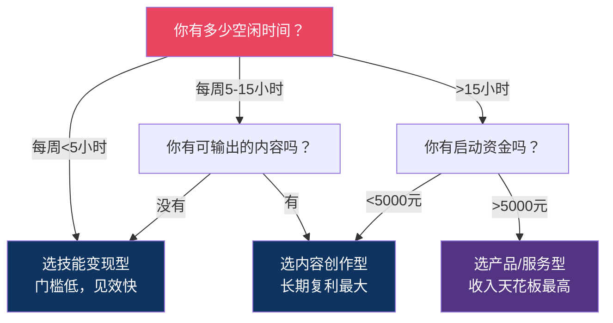
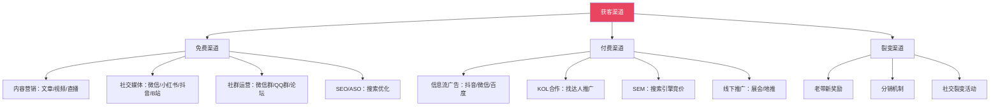
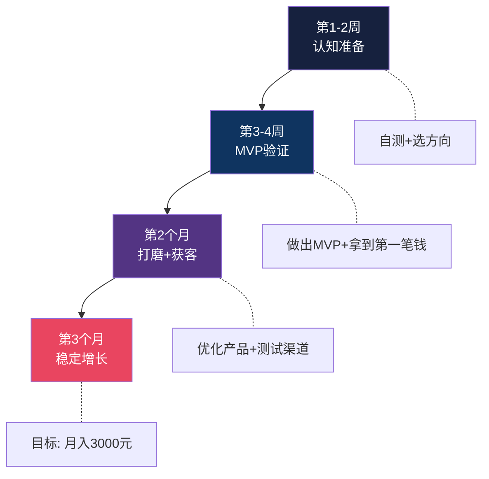
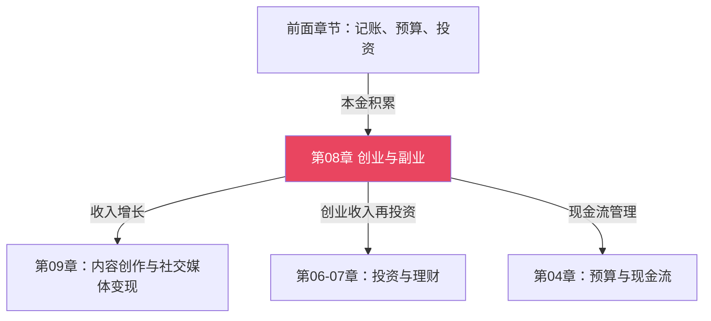

# 第08章 创业与副业——本章小结

## 一、本章定位与核心命题

本章解决的根本问题是：**如何突破"用时间换钱"的收入天花板？**

前面的章节教你记账、预算、投资——那些是"守住钱"和"让钱生钱"的能力。但所有财富的起点是**主动创造收入**。本章给出两条路径：副业（低风险试水）和创业（全力冲刺），并用理论基础、核心技巧、实战案例三大板块，构建了从"认知→方法→执行→纠偏"的完整知识体系。

> **一句话总结本章：** 先用副业验证你的商业能力，再用MVP验证市场需求，用最少的钱和时间找到一条能跑通的路，然后决定是否放大。

```mermaid
graph TD
    A["本章知识架构"] --> B["道：理论基础"]
    A --> C["法：核心技巧"]
    A --> D["术：实战案例"]
    A --> E["器：工具与框架"]

    B --> B1["财富创造的本质"]
    B --> B2["创业六要素模型"]
    B --> B3["副业经济学"]
    B --> B4["创业心理准备"]
    B --> B5["商业模式设计"]

    C --> C1["发现商业机会"]
    C --> C2["MVP验证方法"]
    C --> C3["获客与增长"]
    C --> C4["定价与变现"]
    C --> C5["财务知识"]
    C --> C6["失败防范"]
    C --> C7["副业→创业过渡"]
    C --> C8["时间管理"]

    D --> D1["8个真实案例"]
    D --> D2["成功共性提炼"]
    D --> D3["失败教训总结"]

    E --> E1["评估清单"]
    E --> E2["决策框架"]
    E --> E3["财务模板"]
    E --> E4["练习体系"]

    style A fill:#e94560,color:#fff
    style B fill:#16213e,color:#0f3460
    style C fill:#16213e,color:#0f3460
    style D fill:#16213e,color:#0f3460
    style E fill:#16213e,color:#0f3460
```

### 如果只记住三件事

读完整章如果只提炼三个核心认知，请记住这三条：

1. **先验证再投入。** 42%的创业失败源于"产品没有市场需求"——MVP验证是创业成败的分水岭。不要用30万去验证一个用300元就能验证的想法。
2. **现金流是生命线，利润只是数字。** 账面盈利但现金流断裂的企业照样倒闭。从第一天就要追求正现金流，哪怕很小。
3. **创业是概率游戏，不是赌命。** 保留退路、控制每次试错成本、设定止损线——你要做的是提高每次尝试的胜率，而不是把所有筹码压在一次all in上。

---

## 二、道——理论基础核心要点

### 2.1 收入的四种来源与跃迁路径

本章的理论起点是收入结构模型。理解这个模型，才能明白为什么创业和副业值得做：

| 收入类型 | 本质 | 公式 | 天花板 | 典型代表 |
|----------|------|------|--------|----------|
| 时间换钱 | 出卖时间 | 时薪 × 小时数 | 24小时/天 | 普通上班族 |
| 技能换钱 | 出卖专业能力 | 时薪 × 小时数（时薪更高） | 仍是时间，但单价高 | 自由职业者、咨询师 |
| 产品换钱 | 创造可复制的价值 | 单价 × 销售数量 | 几乎无限 | 创业者、产品人 |
| 用钱赚钱 | 资本增值 | 本金 × 收益率 | 取决于本金规模 | 投资者 |

**关键洞察：** 从左到右，收入上限指数级提升，但前期投入和风险也同步增加。大多数人的正确路径是按顺序跃迁——不要跳过阶段。

**跃迁的实操含义：** 大多数人卡在"时间换钱→技能换钱"这一关。突破方法不是"学更多技能"，而是"把已有技能打包成可定价的服务产品"。比如，一个会写PPT的普通员工，如果能把"PPT美化"变成一个明码标价的服务（比如200元/页），就完成了从时间换钱到技能换钱的跃迁。下一步是把这个技能做成课程或模板（产品换钱），最后用赚到的钱投资（用钱赚钱）。

### 2.2 创业的本质定义

创业 ≠ 当老板 ≠ 自由 ≠ 逃避打工。

**创业的本质：创造一个能够持续为客户创造价值并从中获利的系统。**

四个关键词缺一不可：
- **系统**——不是你一个人埋头苦干，而是一个可运转的组织。即使你是单人创业，也需要一套流程：获客→交付→收款→复购，而不是"接一单做一单"
- **持续**——不是一锤子买卖，是可持续的商业模式。一次性赚10万不如每月稳定赚1万——前者不可预测，后者可以规划
- **创造价值**——真正解决了客户的某个问题。价值的衡量标准是客户愿意付多少钱，不是你觉得它值多少钱
- **获利**——情怀不能当饭吃，商业必须盈利。不盈利的创业叫慈善，不叫事业

### 2.3 创业六要素模型

任何商业项目都可以拆解为六个核心要素，缺任何一个都走不远：

| 要素 | 核心问题 | 本章对应内容 |
|------|----------|-------------|
| 产品/服务 | 解决什么问题？提供什么价值？ | 发现商业机会、商业模式设计 |
| 市场 | 目标用户是谁？市场有多大？ | TAM/SAM/SOM评估 |
| 客户 | 谁会买？在哪里找到他们？ | 获客与增长 |
| 商业模式 | 怎么赚钱？能持续吗？ | 商业模式画布9要素 |
| 团队 | 需要哪些能力？如何互补？ | 合伙人选择原则 |
| 资金 | 需要多少？从哪来？ | 创业者财务知识 |

**六要素的优先级：** 对于副业阶段，优先级是"产品>客户>商业模式>资金>市场>团队"。先做出一个能卖的东西，找到愿意买的人，再考虑其他。很多初学者花大量时间写商业计划书、研究市场规模，却连第一个产品都没做出来——这是本末倒置。

### 2.4 副业的经济学逻辑

副业不是"多打一份工"，而是**用最低成本试错的创业预备阶段**。

**副业的三种类型对比：**

| 类型 | 代表 | 启动难度 | 收入天花板 | 复利效应 | 最适合 |
|------|------|----------|-----------|----------|--------|
| 技能变现型 | 设计师接私活、程序员外包、翻译 | ★★ | 中（受时间限制） | 低 | 有可变现技能的人 |
| 内容创作型 | 公众号、短视频、播客 | ★★★ | 高（长尾效应） | 高 | 有表达能力和持续输出意愿的人 |
| 产品/服务型 | 电商、在线课程、小程序 | ★★★★ | 最高（可规模化） | 最高 | 有商业嗅觉和执行力的人 |

**选择副业的决策树：**

### 2.5 创业心理准备——四大代价清单

创业不是只有"自由"和"赚钱"，还有四笔你必须提前支付的代价：

**时间代价：**
- 前1-3年几乎没有个人时间
- 周末和节假日可能在工作
- 社交和娱乐被大幅压缩

**财务代价：**
- 可能没有稳定收入6-18个月
- 可能需要投入全部积蓄
- 可能背负债务

**心理代价：**
- 持续的压力和焦虑（尤其发工资日）
- 孤独感——所有决策的后果只有你承担
- 自我怀疑——在低谷期尤其严重

**关系代价：**
- 家庭关系可能紧张
- 朋友关系可能疏远
- 需要伴侣的深度理解和支持

**自评检查清单（满足3条以上才建议考虑创业）：**
- [ ] 有至少12个月生活费的财务缓冲
- [ ] 有明确的商业想法且做过初步验证
- [ ] 伴侣/家人理解并支持你的决定
- [ ] 能承受最坏情况（亏掉全部投入）的后果
- [ ] 有相关的行业经验或技能积累
- [ ] 有可以互补的合伙人或资源网络

---

## 三、法——核心技巧关键提炼

### 3.1 发现商业机会的四个视角

| 视角 | 思考方式 | 示例 |
|------|----------|------|
| 从痛点出发 | 我/身边人遇到什么问题没有好方案？ | 找靠谱家政太难→家政平台 |
| 从技能出发 | 我的能力能帮别人解决什么？ | 会做PPT→PPT模板/培训 |
| 从趋势出发 | 什么新技术/政策/社会变化创造了新机会？ | AI普及→AI应用咨询服务 |
| 从市场出发 | 什么现有产品可以做得更好/更便宜/更方便？ | 高端设计→平价在线设计工具 |

**找到机会后的第一步不是"做"，而是"问"：** 列出10个可能的目标用户，问他们三个问题：1）你现在怎么解决这个问题？2）你对现在的方案满意吗？3）如果有一个方案能解决它，你愿意付多少钱？如果10个人里有7个以上对现有方案不满意且愿意付费——恭喜，你找到了一个真实的需求。

### 3.2 MVP验证——创业成败的分水岭

**42%的创业失败原因是"产品没有市场需求"（CB Insights数据）。** MVP验证就是用最小成本确认你的产品真的有人要买。

**五种MVP类型选择指南：**

| MVP类型 | 做什么 | 成本 | 验证周期 | 适合场景 |
|---------|--------|------|----------|----------|
| 服务型 | 先免费/低价帮几个人做 | 几乎为零 | 1-2周 | 咨询、设计、技术服务 |
| 内容型 | 先写10篇相关文章看反馈 | 时间 | 2-4周 | 课程、知识付费、自媒体 |
| Landing Page | 做产品介绍页收集意向 | 几百元 | 1-2周 | App、SaaS、工具类产品 |
| 众筹型 | 在众筹平台预售 | 平台费 | 1-2月 | 实体产品、创新产品 |
| 手动型 | 用人工模拟产品功能 | 时间 | 2-4周 | 想做自动化工具/平台 |

**MVP验证的"通过标准"：**
- 免费产品：至少100个用户表示愿意使用
- 付费产品（<1000元）：至少10个人实际付费
- 高价产品（>1000元）：至少3个人实际付费

**验证失败的四种诊断：**

| 症状 | 可能原因 | 对策 |
|------|----------|------|
| 没人感兴趣 | 需求不真实 | 重新定义问题，回到用户调研 |
| 有人看但不买 | 解决方案不够好 | 改进方案，做用户访谈找差距 |
| 有人想买但嫌贵 | 定价问题 | 调整定价或改变交付方式 |
| 买了但不复购 | 价值交付不足 | 优化产品体验，增加复购理由 |

### 3.3 获客渠道全景图

**渠道选择原则：** 先免费后付费，先精准后规模。起步阶段把一个免费渠道做到极致，比同时铺5个渠道更有效。

**各渠道的ROI参考（中小创业项目经验数据）：**

| 渠道 | 启动成本 | 见效速度 | 可持续性 | 适合阶段 |
|------|----------|----------|----------|----------|
| 朋友圈/私域 | 零 | 快（1-2周） | 低（圈层有限） | 冷启动 |
| 小红书/公众号内容 | 时间 | 中（1-3月） | 高（长尾流量） | 早期验证 |
| 抖音/短视频 | 时间+少量投流 | 快（1-2周） | 中（算法依赖） | 快速获客 |
| SEO/搜索优化 | 时间 | 慢（3-6月） | 最高（持续被动流量） | 长期建设 |
| 信息流广告 | ≥5000元/月 | 最快（当天） | 低（停投即停） | 规模化阶段 |
| KOL合作 | ≥2000元/次 | 快（1-2周） | 低（一次性） | 有预算后 |

### 3.4 定价的底层逻辑

定价不是"成本+加价"那么简单。好的定价需要同时考虑三个维度：

- **成本底线：** 你的成本是多少？低于这个价格就亏钱
- **价值上限：** 客户获得的价值是多少？高于这个就没人买
- **竞争参照：** 同类产品卖多少钱？你需要有差异化理由

**六种定价策略速查：**

| 策略 | 适用场景 | 要点 |
|------|----------|------|
| 成本加成 | 实体商品 | 成本 × (1+利润率) |
| 价值定价 | 知识付费/咨询 | 按客户获得的价值定价 |
| 竞争定价 | 红海市场 | 参考竞品，略低或差异化 |
| 渗透定价 | 新品上市 | 低价进入市场，后期提价 |
| 撇脂定价 | 创新产品 | 高价上市，逐步降价 |
| 心理定价 | 消费品 | 99元比100元更有吸引力 |

**定价的常见陷阱：** 最大的错误是"因为不确定所以定低价"。低价吸引的是最不忠诚的客户群体——他们因为便宜才来，也会因为更便宜而走。正确的方法是：先定一个你认为合理的价格，如果客户毫不犹豫就买了，说明你定低了；如果需要反复说服才成交，说明价格合理或偏高；如果完全卖不动——问题可能不在价格，而在产品本身。

### 3.5 创业者必知的财务三张表

| 报表 | 回答什么问题 | 核心公式 | 频率 |
|------|------------|----------|------|
| 利润表 | 这段时间赚了多少？ | 收入 - 成本 - 费用 = 利润 | 月度 |
| 现金流表 | 手上还有多少现金？ | 期初现金 + 流入 - 流出 = 期末现金 | 每周/月 |
| 资产负债表 | 整体财务状况如何？ | 资产 = 负债 + 所有者权益 | 季度 |

**现金流是生命线。** 很多企业账面盈利但现金流断裂而倒闭——因为利润是数字，现金流才是你能不能发工资、付房租的真实能力。

**一个真实场景说明现金流的重要性：** 你做了一单10万元的项目，成本3万，利润7万——利润表看起来很好。但客户说"下个月付款"，而你这个月就要付员工工资2万、房租1万、供应商货款3万。如果你手上没有6万现金周转，这单赚钱的生意反而会让你倒闭。这就是为什么创业者必须每周看现金流，而不是每月看利润表。

### 3.6 创业失败的十大原因（CB Insights数据）

| 排名 | 原因 | 占比 | 本章解决方案 |
|------|------|------|-------------|
| 1 | 产品没有市场需求 | 42% | MVP验证、用户访谈 |
| 2 | 现金流断裂 | 29% | 财务知识、现金流管理 |
| 3 | 团队问题 | 23% | 合伙人选择原则、股权设计 |
| 4 | 被竞争对手击败 | 19% | 竞争分析、差异化策略 |
| 5 | 定价/成本问题 | 18% | 定价策略、成本控制 |
| 6 | 产品不够好 | 17% | MVP迭代、用户反馈 |
| 7 | 缺乏商业模式 | 17% | 商业模式画布 |
| 8 | 营销不佳 | 14% | 获客渠道策略 |
| 9 | 忽视客户 | 14% | 用户访谈、反馈循环 |
| 10 | 时机不对 | 13% | 趋势判断、市场评估 |

**前三大原因占了失败案例的绝大多数，而本章的核心方法论（MVP验证、现金流管理、合伙人选择）恰好对应这三个原因。** 这不是巧合——掌握了这三个，你就避开了最大的三颗地雷。

### 3.7 副业→创业的过渡决策框架

**何时可以考虑全职创业？用三个维度评估：**

| 维度 | 及格线 | 理想线 | 说明 |
|------|--------|--------|------|
| 收入稳定性 | 副业收入≥主业的60%连续6个月 | 副业收入≥主业连续12个月 | 收入要稳定，不是偶尔爆发 |
| 增长趋势 | 月环比增长≥5% | 月环比增长≥10% | 增长说明还有空间，不是到顶了 |
| 财务缓冲 | 预留12个月生活费 | 预留18个月生活费+业务运营费 | 给自己足够的试错空间 |

**过渡期操作步骤：**
1. 先请长假（1-3个月）全职投入副业，测试真实承受力
2. 确认增长可持续后，再正式辞职
3. 辞职后保留主业领域的人脉和信息渠道
4. 设定明确的止损线（如18个月仍未达到目标收入则重新评估）

**过渡期的风险管理：** 不要"一辞职就all in扩张"。辞职后的前3个月应该保持和副业期一样的运营节奏，用多出来的时间做两件事：1）优化效率（流程标准化、自动化）；2）拓展第二获客渠道（避免单一渠道依赖）。扩张要等你确认"多出来的时间确实转化成了更多收入"之后再做。

### 3.8 创业者时间管理——艾森豪威尔矩阵在创业中的应用

|  | 紧急 | 不紧急 |
|------|------|--------|
| **重要** | 客户投诉、资金断裂、产品上线 | 战略规划、团队建设、产品迭代 |
| **不重要** | 无关紧要的会议、临时请求 | 刷社交媒体、过度优化细节 |

**创业者的时间分配建议：**
- 60%时间做"重要不紧急"的事（决定长期成败）
- 25%时间做"重要紧急"的事（救火）
- 10%时间做"紧急不重要"的事（尽量委托）
- 5%时间做"不重要不紧急"的事（尽量消除）

**大多数创业者的时间分配恰好反过来：60%在救火。** 原因是"重要不紧急"的事（比如建立标准化流程、培养团队、做长期产品规划）没有截止日期，所以总被推迟。但恰恰是这些事决定了你6个月后是继续救火还是从容运营。每周固定留出半天做"重要不紧急"的事，是创业者最值得养成的习惯。

---

## 四、术——实战案例共性规律

### 4.1 8个案例全景对照

本章收录了8个真实案例，涵盖自媒体、电商、知识付费、技术服务、社群运营、产品化副业、AI工具副业以及一个失败案例。以下是横向对照表：

| 案例 | 路径 | 启动成本 | 达到月入1万时间 | 核心杠杆 | 最大风险 |
|------|------|----------|----------------|----------|----------|
| 自媒体副业 | 内容创作型 | 几乎为零 | 12-18个月 | 内容复利+平台流量 | 平台规则变化 |
| 电商副业 | 产品/服务型 | 3000-10000元 | 3-6个月 | 供应链效率+选品能力 | 库存积压 |
| 知识付费 | 内容创作型 | 时间+少量工具 | 6-12个月 | 专业信任+课程质量 | 内容过时 |
| 技术外包 | 技能变现型 | 几乎为零 | 1-3个月 | 技术能力+交付质量 | 时间天花板 |
| 社群运营 | 内容创作型 | 几乎为零 | 6-12个月 | 社群价值+运营能力 | 社群活跃度下降 |
| 产品化副业 | 产品/服务型 | 5000-20000元 | 6-12个月 | 品牌溢价+复购率 | 供应链管理 |
| AI工具副业 | 技能变现型 | 几乎为零 | 1-3个月 | 工具效率+信息差 | 技术迭代快 |
| 咖啡店（失败） | 产品/服务型 | 300000元 | 未达到 | 无（情怀驱动） | 成本失控+需求不验证 |

### 4.2 成功案例的五大共性

横向对比后，成功案例有以下惊人一致的底层规律：

| 共性规律 | 具体表现 | 案例印证 |
|----------|----------|----------|
| 从小做起，验证再放大 | 先用最小成本测试，有人付费再投入 | 电商案例：先在1688代发，验证选品后再囤货 |
| 持续输出，积累信任 | 长期主义，不追求短期爆发 | 自媒体案例：坚持2年公众号，内容复利带来爆发 |
| 找到杠杆点 | 不是更努力，而是找到放大器 | AI工具案例：用AI提效10倍，一个人干出团队产出 |
| 先服务少数人，做到极致 | 种子用户的口碑比1000个泛流量更有价值 | 知识付费案例：先服务10个学员，靠口碑裂变 |
| 数据驱动决策 | 不凭感觉，用数据说话 | 电商案例：根据转化率数据调整选品和定价 |

### 4.3 失败案例的核心教训

小马的咖啡店案例是本章最重要的反面教材。核心教训：

1. **情怀≠商业。** "我喜欢咖啡"不等于"我能开好咖啡店"。创业的第一步是验证商业可行性，不是追求情怀。
2. **不验证就投入是赌博。** 小马没有做过任何市场调研，没有计算过盈亏平衡点，直接投入30万装修开店。
3. **成本失控是致命的。** 租金占营收40%以上（健康值应<20%），人工成本高企，毛利率被严重压缩。
4. **没有止损线。** 连续亏损6个月还在硬撑，最终亏了50万才关门——如果在第3个月止损，损失只有15万。

**小马的案例如果重来：** 先在周末市集摆摊卖手冲咖啡（成本<2000元），测试需求和定价；然后在写字楼附近租个小档口做外带咖啡（成本<5万），验证复购率；确认能盈利后，再考虑开独立咖啡店。整个过程成本从30万降到5万以内，风险降低80%。

---

## 五、器——关键工具与框架速查

### 5.1 机会评估清单（6维度评分卡）

在决定做一个副业/创业项目前，用这个清单打分：

| 维度 | 评分问题 | 1分(差) | 3分(中) | 5分(好) |
|------|----------|---------|---------|---------|
| 需求真实性 | 有人愿意为此付钱吗？ | 没人付过钱 | 有人说愿意 | 已有人实际付费 |
| 市场规模 | 目标市场够大吗？ | <1000人 | 1000-10万人 | >10万人 |
| 竞争强度 | 竞争对手强吗？ | 巨头垄断 | 有竞品但不强 | 蓝海/差异化明显 |
| 你的匹配度 | 你有技能/资源/热情吗？ | 三无 | 有一两项 | 三项全有 |
| 启动成本 | 需要多少投入？ | >5万元 | 5000-5万 | <5000元 |
| 盈利速度 | 多快能产生收入？ | >6个月 | 2-6个月 | <2个月 |

**评分标准：**
- 总分 24-30分：强烈推荐，立即行动
- 总分 18-23分：值得进一步验证，设计MVP测试
- 总分 12-17分：谨慎考虑，先做更深入的调研
- 总分 <12分：建议放弃或重新定义方向

### 5.2 副业选择匹配评分卡

| 你的条件 | 匹配的副业类型 | 权重 |
|----------|---------------|------|
| 有可变现的专业技能（设计/编程/翻译/咨询） | 技能变现型 | 高 |
| 有持续表达能力且愿意长期输出 | 内容创作型 | 高 |
| 有商业嗅觉且愿意投入启动资金 | 产品/服务型 | 高 |
| 每周空闲时间<5小时 | 技能变现型（小项目） | 中 |
| 每周空闲时间5-15小时 | 内容创作型 | 中 |
| 每周空闲时间>15小时 | 产品/服务型 | 中 |
| 风险承受能力低 | 技能变现型 | 高 |
| 风险承受能力中 | 内容创作型 | 中 |
| 风险承受能力高 | 产品/服务型 | 中 |

### 5.3 创业健康指标仪表盘

开始运营后，用这些指标监控业务健康度：

| 指标 | 计算方式 | 健康值 | 警戒值 | 危险值 |
|------|----------|--------|--------|--------|
| 现金储备 | 可用现金 ÷ 月运营成本 | ≥6个月 | 3-6个月 | <3个月 |
| 客户增长率 | (本月新客户-上月新客户) ÷ 上月新客户 | ≥10%/月 | 5-10%/月 | <5%/月 |
| 复购率 | 重复购买客户 ÷ 总客户 | ≥30% | 15-30% | <15% |
| 毛利率 | (收入-直接成本) ÷ 收入 | ≥50% | 30-50% | <30% |
| 获客成本(CAC) | 总营销费用 ÷ 新客户数 | <客户终身价值的1/3 | 1/3-1/2 | >1/2 |
| 现金流 | 本月现金流入-流出 | 正 | 偶尔负 | 连续3个月负 |

**使用建议：** 每月花30分钟更新这6个指标。当任意一个指标进入"警戒值"时，立即分析原因并制定改善计划——不要等到进入"危险值"才行动。预警比救火的成本低10倍。

### 5.4 副业里程碑参考

| 里程碑 | 参考时间 | 达成标准 | 达成后的下一步 |
|--------|---------|----------|---------------|
| 第一笔收入 | 1-3个月 | 有人实际付费（哪怕1元） | 分析为什么他愿意付费，复制这个场景 |
| 月入3000元 | 3-6个月 | 连续2个月达到 | 优化获客渠道，提高转化率 |
| 月入1万元 | 6-12个月 | 连续3个月达到 | 开始考虑产品化和规模化 |
| 月入3万元 | 12-24个月 | 连续6个月达到 | 评估是否全职创业 |
| 超过主业收入 | 12-36个月 | 连续12个月达到 | 可以用过渡决策框架评估辞职 |

---

## 六、副业 vs 全职创业——全维度对比

很多读者在副业和全职创业之间犹豫不决。以下是从12个维度的全面对比，帮你做出理性决策：

| 维度 | 副业 | 全职创业 |
|------|------|----------|
| 收入风险 | 有主业保底，副业收入是"增量" | 收入全部来自业务，断裂风险高 |
| 时间投入 | 每周10-20小时，受主业限制 | 每周50-80小时，全身心投入 |
| 学习成本 | 用业余时间试错，学费可控 | 试错的机会成本高（放弃薪资+社保） |
| 增长速度 | 慢但稳，受时间瓶颈限制 | 快但波动大，取决于执行力和市场 |
| 心理压力 | 中等——最坏情况是浪费时间 | 高——涉及生计和家庭责任 |
| 决策自由度 | 受限——主业占用最佳精力时段 | 完全自主——可以全力投入 |
| 社会资源 | 保持职场人脉和行业信息 | 需要重新建立创业圈人脉 |
| 融资能力 | 几乎无法融资（投资人要全职团队） | 可以寻求天使/VC投资 |
| 失败代价 | 低——回到主业即可 | 高——可能损失积蓄、时间、信心 |
| 适合人群 | 有稳定工作、风险偏好低、想验证想法 | 已验证商业模式、有财务缓冲、准备好了 |
| 最佳阶段 | 0→1验证期 | 1→10增长期 |
| 税务/合规 | 简单（个人收入申报） | 复杂（需要注册公司、开票、社保等） |

**核心结论：** 副业和全职创业不是二选一，而是同一条路上的两个阶段。正确的顺序是：副业验证 → 收入稳定 → 全职创业 → 规模化。跳过副业验证直接全职创业，相当于在没有导航的情况下全速开车——可能会到目的地，但翻车的概率也高得多。

---

## 七、常见误区深度拆解

创业和副业中有大量"听起来很对但实际害死人"的观念。本章覆盖了四大类误区，以下是每个类别中最致命的1-2个：

### 7.1 思维误区："好产品自己会说话"

**为什么很多人相信：** 因为确实有产品靠口碑爆发的案例（如早期的微信）。

**真实情况：** 你能看到的成功案例都是幸存者。100个"好产品"中，95个因为没有流量和营销而默默死掉。酒香也怕巷子深——尤其在信息过载的时代。

**正确做法：** 产品和营销必须同步推进。甚至在产品做好之前，就应该开始建立用户预期和获取早期用户。

### 7.2 执行误区："先做完美再发布"

**为什么很多人相信：** 完美主义倾向，怕被差评，觉得"还没准备好"。

**真实情况：** "准备好"的那一天永远不会来。你花3个月做的"完美产品"，很可能方向就是错的——因为你没有用户反馈。而3个月的时间和资金成本，足够做6轮MVP迭代了。

**正确做法：** 用1-2周做出MVP，让真实用户告诉你哪里需要改。完美是迭代出来的，不是闭门造出来的。

### 7.3 财务误区："前期亏钱很正常"

**为什么很多人相信：** 确实有企业前期亏损后期盈利（如亚马逊、京东）。

**真实情况：** 亚马逊能亏是因为有投资人持续输血。你没有这个条件。对普通创业者来说，"前期亏钱很正常"这句话是最危险的安慰剂——它让你对现金流断裂视而不见。

**正确做法：** 从第一天就追求正现金流。即使很小，也要让钱进来。正现金流意味着有人愿意为你的产品付钱——这是最真实的市场验证。

### 7.4 心态误区："创业就要all in"

**为什么很多人相信：** 成功故事总喜欢渲染"背水一战"的戏剧性。

**真实情况：** 真正all in成功的人是极少数，你看到的只是被媒体放大的个例。大量all in失败的人没有被报道——因为他们已经没有资源和心力来讲故事了。

**正确做法：** 保留退路。先副业验证，再逐步加大投入。给自己设定止损线——亏到什么程度就收手。创业是概率游戏，你要做的是提高每次尝试的胜率，而不是把所有筹码压在一次上。

### 7.5 更多常见错误速查

| 错误观念 | 为什么错 | 正确做法 |
|----------|----------|----------|
| "我要先学完所有知识再开始" | 学无止境，永远"没学完" | 边做边学，在实践中补短板 |
| "我的想法会被抄袭" | 执行力比想法值钱100倍 | 先做出来，用速度和质量建立壁垒 |
| "合伙人之间不需要合同" | 90%的合伙纠纷源于没签协议 | 股权、分工、退出机制必须书面约定 |
| "先烧钱获客再说" | 没有留存的获客是往漏桶里倒水 | 先确保产品能留住人，再投入获客 |
| "竞争对手少说明市场好" | 可能说明没有市场 | 有竞品反而验证了需求存在 |
| "做大了再找专业人才" | 早期团队决定了公司DNA | 创业初期就要找能力互补的合伙人 |

---

## 八、行动清单——分阶段落地指南

### 8.1 90天快速启动路线图

如果你读完本章决定行动，以下是一个精简的90天执行计划：

### 阶段一：认知准备（第1-2周）

- [ ] 完成本章理论基础篇的阅读
- [ ] 用"四大代价清单"评估自己是否准备好了
- [ ] 用"副业选择决策树"确定副业类型
- [ ] 列出你拥有的所有可变现技能（至少5个）
- [ ] 记录一周内遇到的所有"不爽"和"不便"（这些可能是商业机会）
- [ ] 选定1个副业方向

### 阶段二：验证期（第3-4周）

- [ ] 设计你的MVP（选择5种类型中最适合的一种）
- [ ] 用机会评估清单给你的方向打分（总分>18才继续）
- [ ] 找到5个目标用户，与他们深度对话
- [ ] 推出MVP，收集真实反馈
- [ ] 获得第一个付费用户（哪怕只收1元——这比100个"有兴趣"更有价值）
- [ ] 记录所有反馈，形成改进清单

### 阶段三：增长期（第2-3个月）

- [ ] 根据反馈优化产品/服务
- [ ] 测试3个以上获客渠道，找到最有效的1-2个
- [ ] 确定定价策略（不要凭感觉，用定价框架计算）
- [ ] 建立简易记账系统（收入/支出/利润/现金流）
- [ ] 目标：月收入突破3000元

### 阶段四：稳定期（第4-6个月）

- [ ] 建立稳定的获客流程（可重复、可预测）
- [ ] 目标：月收入突破10000元
- [ ] 评估是否需要注册个体工商户
- [ ] 开始建立客户数据库，分析复购行为
- [ ] 优化时间管理——用艾森豪威尔矩阵分配创业时间

### 阶段五：决策期（第6-12个月）

- [ ] 用"过渡决策框架"的三个维度评估是否全职创业
- [ ] 如决定全职：预留12-18个月财务缓冲，制定过渡计划
- [ ] 如决定保持副业：优化效率，把副业做成"系统"而非"打工"
- [ ] 无论哪种选择，持续学习——阅读深度拓展篇（精益创业、增长黑客、融资策略）

---

## 九、关键概念速查表

| 概念 | 定义 | 在本章中的应用 |
|------|------|---------------|
| MVP（最小可行产品） | 用最少资源做出能验证核心假设的产品 | 低成本验证商业想法，避免盲目投入 |
| 精益创业 | 快速迭代、小步试错的创业方法论 | Build-Measure-Learn循环降低风险 |
| 商业模式画布 | 用9个要素描述企业创造/传递/获取价值的方式 | 梳理创业项目的整体可行性 |
| TAM/SAM/SOM | 总市场/可服务市场/可获得市场的三层评估 | 评估市场规模，避免"市场大≠我能做大"的幻觉 |
| 现金流 | 企业的资金流入和流出 | 生命线——账面盈利但现金流断裂=倒闭 |
| 获客成本(CAC) | 获取一个新客户的平均成本 | 衡量获客效率，CAC>客户终身价值=亏损 |
| 复购率 | 重复购买客户占总客户的比例 | 衡量产品价值交付——复购率低说明客户不满意 |
| 副业杠杆 | 用技能/产品替代纯时间投入 | 提高副业收入上限，从"卖时间"跃迁到"卖价值" |
| 客户终身价值(LTV) | 一个客户在整个生命周期内贡献的总收入 | LTV/CAC≥3说明获客模型健康 |
| 正现金流 | 现金流入>现金流出的状态 | 创业第一天就应该追求的目标 |

---

## 十、本章与全书的关系

- **上游承接：** 前面章节建立的财务基础（记账、预算、投资）在创业中直接用于现金流管理
- **下游延伸：** 本章的创业/副业收入增长，为下一章（内容创作与变现）提供了实际的业务场景和资金基础
- **循环反馈：** 创业产生的收入，回到投资章节形成更大的本金复利

**与其他章节的具体关联：**

| 相关章节 | 本章如何用到它 |
|----------|---------------|
| 第03章 记账 | 创业记账的基础——个人记账习惯直接迁移到业务记账 |
| 第04章 预算与现金流 | 创业预算编制、现金流预测、成本控制 |
| 第05章 债务管理 | 创业融资决策——借不借钱、借多少、怎么还 |
| 第06-07章 投资 | 创业成功后的资金再投资、股权融资基础 |
| 第09章 内容创作 | 内容创作型副业的完整展开——平台运营、变现闭环 |

---

## 十一、推荐资源

### 书籍

**创业必读（按优先级排序）：**
- 《精益创业》——埃里克·莱斯：创业方法论的圣经，Build-Measure-Learn循环的出处
- 《从0到1》——彼得·蒂尔：关于创新和垄断的深度思考，适合想做差异化的人
- 《创业维艰》——本·霍洛维茨：创业真实面貌的还原，教你如何面对至暗时刻

**副业与变现：**
- 《副业赚钱之道》——安晓辉：系统的副业选择和执行框架
- 《斜杠创业家》——金伯莉·帕尔默：如何在主业之外建立多重收入
- 《知识变现》——秦阳、秋叶：知识付费和内容创业的实操指南

**商业模式：**
- 《商业模式新生代》——亚历山大·奥斯特瓦尔德：商业模式画布的原著
- 《价值主张设计》——亚历山大·奥斯特瓦尔德：如何设计客户真正需要的产品

### 课程

- 得到App《刘润·5分钟商学院》：商业认知的入门课，每天5分钟建立商业思维
- 极客时间《从0到1创业》：偏技术创业视角
- 混沌大学创业课程：案例分析为主，适合已有基础的人

### 工具

| 工具 | 用途 | 推荐理由 |
|------|------|----------|
| Lean Canvas | 商业计划画布 | 一页纸梳理商业模式，比写50页BP有效 |
| Notion/飞书 | 项目管理 | 免费、灵活、适合小团队 |
| 随手记/QuickBooks | 财务管理 | 个人/小团队记账 |
| 天眼查 | 企业信息查询 | 调研竞争对手和合作伙伴 |
| 创业邦/36氪 | 行业资讯 | 了解趋势和机会 |

---

## 十二、本章金句

> "创业不是一场赌博，而是一系列经过计算的冒险。" —— 埃里克·莱斯

**解读：** 莱斯的精益创业核心思想就是——不要孤注一掷，而是用小成本快速实验，用数据而非直觉做决策。每次"冒险"的成本应该小到失败了也不会伤筋动骨。

> "最好的创业方式是先做副业，验证后再全职。" —— 本章核心观点

**解读：** 副业是创业的"沙盒模式"——在安全的环境里测试你的商业能力、市场判断力和执行力。直接全职创业相当于跳过新手教程直接打Boss。

> "执行力比想法重要100倍。" —— 创业圈共识

**解读：** 世界上不缺好想法，缺的是把想法变成现实的人。同一个想法可能有100个人想到，但只有1个人去做了——那个人就是创业者。

> "现金流是企业的生命线，利润只是数字。" —— 财务管理核心原则

**解读：** 利润是会计概念，现金流是生存概念。一家企业可以"账面亏损但现金充裕"（比如预收年费的SaaS公司），也可以"账面盈利但现金枯竭"（比如应收账款一大堆的贸易公司）。前者能活，后者会死。

> "不要追求完美，先推出MVP，让用户告诉你需要什么。" —— 精益创业理念

**解读：** 你认为客户需要的，和客户真正需要的，往往不是一回事。MVP的本质是"用产品代替问卷"——与其问客户"你会买吗"，不如做一个东西看他们掏不掏钱。

> "创业失败是常态，重要的是控制每次失败的成本，从中学习，然后再次尝试。" —— 本章核心观点

**解读：** 硅谷的创业5年存活率不到10%。但失败不等于结束——只要每次失败的成本可控（MVP思维），每次失败都让你更接近成功。真正致命的不是失败本身，而是一次失败就倾家荡产、再也无法尝试。

---

## 十三、常见问题快速解答

**Q1：我应该先创业还是先做副业？**

先做副业。副业风险低，可以在不影响主业的情况下验证商业想法。当副业收入稳定超过主业60-80%且持续6个月以上时，再用过渡决策框架评估是否全职创业。

**Q2：副业会影响主业吗？**

合理安排时间就不会。关键是设定边界——副业不占用工作时间，不影响工作状态。建议工作日每天投入1-2小时（早起或晚上），周末投入4-6小时，合计每周15-20小时。

**Q3：我没有什么特别的技能，能做什么副业？**

每个人都有可以变现的能力。从以下方面盘点：你的专业经验（哪怕是行业信息差）、你的兴趣爱好（摄影、手工、游戏）、你的社交资源（人脉、社群）、你的学习能力（快速掌握新工具的能力）。关键不是"有什么技能"，而是"能帮别人解决什么问题"。

**Q4：创业失败了怎么办？**

创业失败是常态（5年存活率<10%）。关键策略：1）提前设定止损线（最多亏多少就收手）；2）控制每次尝试的成本（MVP思维）；3）保留退路（不all in）；4）总结经验教训（失败是学费，要学到东西）；5）保持心理健康（失败不等于你这个人不行）。很多成功企业家都经历过多次失败——马云被拒30多次，刘强东曾亏光积蓄。

**Q5：如何判断一个创业想法是否值得做？**

三步判断法：1）这个需求真实吗？（有人现在就在花钱解决这个问题吗？）；2）目标用户愿意为你的方案付费吗？（不是嘴上说"挺好"，而是掏钱）；3）你能做到比现有方案更好或更便宜吗？（差异化优势）。三个都是"是"，才值得设计MVP去验证。

**Q6：一个人创业和找合伙人哪个好？**

取决于业务类型。技能变现型副业（设计、编程、咨询）通常一个人就能启动。产品/服务型创业通常需要合伙人——因为你很难同时擅长产品、营销、技术、财务。找合伙人的原则：能力互补（不是和你一样的人）、价值观一致（钱不是唯一的共识）、有书面协议（股权、分工、退出机制必须白纸黑字）。

**Q7：副业收入需要交税吗？**

需要。中国税法规定，个人收入（包括副业收入）超过免税额度后需要缴纳个人所得税。具体税额取决于收入类型和金额。建议：1）副业月收入超过5000元时开始关注税务合规；2）月收入超过2万元时建议咨询专业会计；3）考虑注册个体工商户以享受小规模纳税人优惠政策。不要逃税——罚款和信用损失远大于税款本身。

**Q8：如何平衡副业和生活？**

三个原则：1）设定固定时间块——比如每天早起1小时+周末上午4小时，把这些时间用于副业，其他时间不碰；2）设置"不工作日"——每周至少1天完全不碰副业，防止倦怠；3）用"番茄工作法"提高效率——25分钟专注+5分钟休息，比漫无目的的3小时产出更高。副业是马拉松，不是百米冲刺。

---

## 十四、自我评估——读完本章你处于哪个阶段？

读完本章后，用以下清单自评，看看你目前处于创业/副业旅程的哪个阶段：

| 阶段 | 特征描述 | 你的下一步 |
|------|----------|-----------|
| **阶段0：认知期** | 还在犹豫要不要做副业/创业，不确定自己适合什么 | 回到2.4节，用决策树选定副业类型 |
| **阶段1：探索期** | 有了方向但还没开始做，或者刚开始做但没有收入 | 回到3.2节，设计你的MVP，尽快拿到第一笔收入 |
| **阶段2：验证期** | 有了第一个付费用户，但收入不稳定 | 回到3.3节，测试更多获客渠道，优化转化率 |
| **阶段3：增长期** | 月收入稳定在3000-10000元 | 回到5.3节，用健康指标仪表盘监控业务，优化利润率 |
| **阶段4：成熟期** | 月收入稳定超过10000元，有可重复的获客流程 | 回到3.7节，用过渡决策框架评估是否全职创业 |
| **阶段5：转型期** | 已经全职创业，正在规模化 | 回到3.6节，持续关注失败原因清单，建立预警机制 |

---

## 下一章预告

在下一章中，我们将深入探讨**内容创作与社交媒体变现**，这是本章"内容创作型副业"路径的完整展开：

1. 各大平台（小红书、抖音、公众号、B站、YouTube）的运营策略与算法逻辑
2. 内容创作的方法论——选题、结构、爆款公式、持续输出系统
3. 变现闭环——品牌合作、广告变现、知识付费、电商带货的具体操作流程
4. 多平台矩阵运营——如何用一份内容在多个平台获取流量
5. 从0到10万粉的真实案例拆解——每个阶段做了什么、遇到了什么坑

如果你在本章选择了"内容创作型"副业方向，下一章就是你的实操手册。
