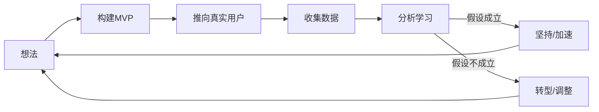
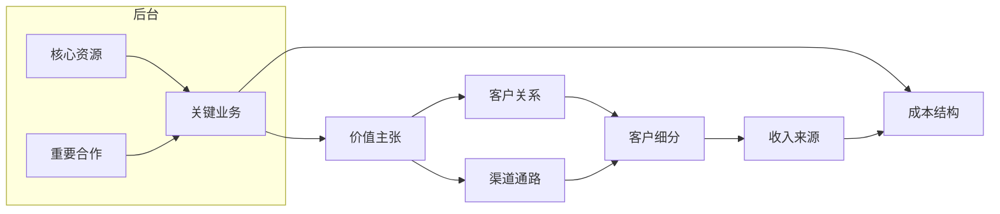
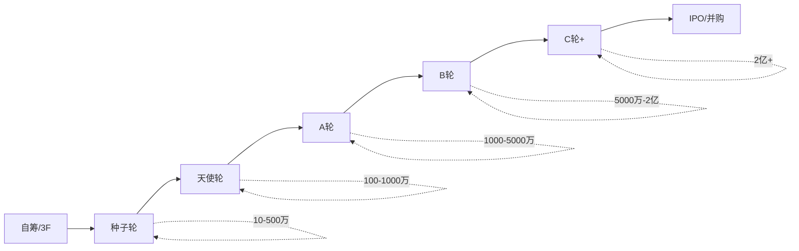
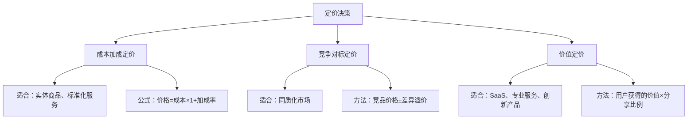
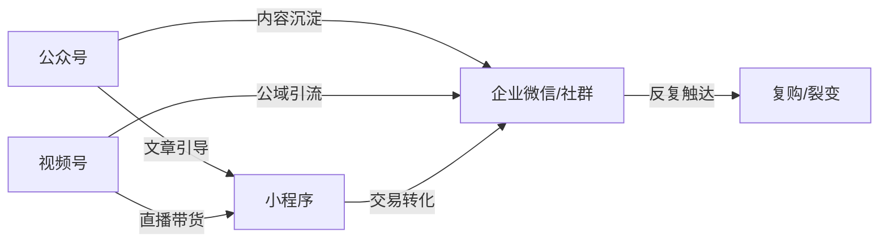
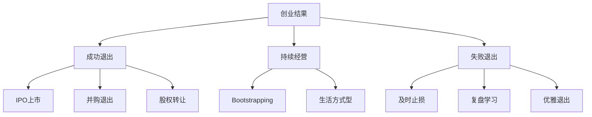
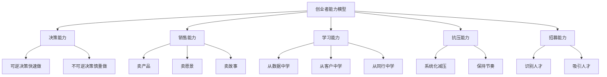
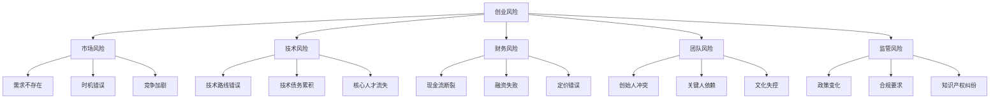
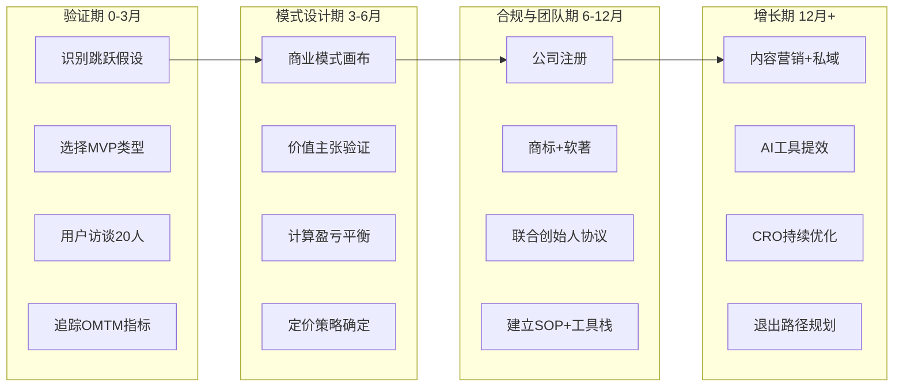

# 深度拓展：创业与副业的高级理论与实践

本章是第八章的进阶内容。如果你已经掌握了创业和副业的基础框架，这里将带你进入更深的层次——从精益创业方法论到商业模式设计，从融资博弈到团队搭建，从法律合规到数字营销，从失败复盘到退出策略，系统性地补全你作为创业者需要的高阶认知。

本章覆盖十四个核心模块，每个模块都遵循"理论→方法→实操→工具"的道法术器逻辑，确保不同阶段的创业者都能找到对应的知识节点。

```mermaid
graph TD
    A[深度拓展] --> B[精益创业方法论]
    A --> C[商业模式画布]
    A --> D[创业融资路径]
    A --> E[副业转主业]
    A --> F[法律与合规]
    A --> G[团队搭建与管理]
    A --> H[财务管理实操]
    A --> I[数字营销实战]
    A --> J[失败分析与退出]
    A --> K[中国创业环境]
    A --> L[AI原生创业范式]
    A --> M[个人品牌建设]
    A --> N[心理建设与能力]
    A --> O[风险管理框架]
    B --> B1[假设验证]
    B --> B2[MVP构建]
    B --> B3[转型决策]
    B --> B4[常见误区]
    D --> D1[种子→天使→A轮]
    D --> D2[估值与条款]
    D --> D3[SAFE/可转债]
    D --> D4[替代融资]
    F --> F1[公司注册]
    F --> F2[知识产权]
    F --> F3[合同与劳动]
    H --> H1[三张报表]
    H --> H2[现金流预测]
    H --> H3[定价策略]
    H --> H4[税务筹划]
    L --> L1[AI能力产品化]
    L --> L2[AI Agent创业]
    L --> L3[垂直场景+数据壁垒]
    M --> M1[创始人IP]
    M --> M2[内容输出体系]
    M --> M3[行业影响力]
```



**全章导航**

| 模块 | 核心问题 | 适用阶段 | 阅读时间 |
|------|---------|---------|---------|
| 一、精益创业方法论 | 如何用最小成本验证商业假设？ | 验证期 | 15分钟 |
| 二、商业模式画布 | 如何系统化设计商业模式？ | 设计期 | 12分钟 |
| 三、创业融资 | 钱从哪来？怎么谈？ | 增长期 | 12分钟 |
| 四、副业转主业 | 什么时候辞职全职做？ | 过渡期 | 8分钟 |
| 五、法律与合规 | 怎么保护自己不踩坑？ | 全阶段 | 10分钟 |
| 六、团队搭建与管理 | 找对人、管好人 | 增长期 | 8分钟 |
| 七、财务管理实操 | 创始人的财务必修课 | 全阶段 | 10分钟 |
| 八、数字营销实战 | 低成本高效获客 | 增长期 | 10分钟 |
| 九、失败分析与退出 | 如何优雅地失败或退出？ | 全阶段 | 8分钟 |
| 十、中国创业环境 | 顺势而为的宏观认知 | 全阶段 | 8分钟 |
| 十一、AI原生创业范式 | 2025-2026年的新机遇 | 全阶段 | 10分钟 |
| 十二、个人品牌建设 | 创始人就是最好的营销 | 全阶段 | 8分钟 |
| 十三、心理建设与能力 | 创业者的内在操作系统 | 全阶段 | 10分钟 |
| 十四、风险管理框架 | 系统化的风险识别与应对 | 全阶段 | 8分钟 |

---

## 一、精益创业方法论：从理念到可执行系统

> 精益创业不是一种方法，而是一种思维方式的转变——从"执行计划"到"验证假设"。本节从思想根源出发，构建完整的理论→方法→实操→工具体系。

### 1.1 精益创业的核心理念与思想根源

精益创业（Lean Startup）由埃里克·莱斯（Eric Ries）在2011年正式提出，但其思想根源可以追溯到三个重要流派：

**丰田精益生产（Lean Manufacturing）**：大野耐一在丰田创立的"准时制生产"（JIT）和"看板管理"，核心是消除一切浪费——过量生产、等待、运输、过度加工、库存、动作、缺陷。莱斯将这一理念移植到创业领域，提出了"创业浪费"的概念：最大的浪费不是代码写多了，而是做出来的东西没人要。

**史蒂夫·布兰克的客户开发（Customer Development）**：斯坦福教授布兰克在《四步创业法》中提出，创业失败的首要原因不是技术不行，而是"做出来的东西客户不需要"。他主张在写代码之前先走出办公室，跟客户对话，验证四个核心假设——问题假设、解决方案假设、客户获取假设、商业模式假设。

**敏捷开发（Agile Development）**：2001年《敏捷宣言》发布，强调"可工作的软件胜过详尽的文档""响应变化胜过遵循计划"。精益创业吸收了敏捷的迭代思想，但将其从"如何开发软件"扩展到了"如何创建一门生意"。

这三个流派汇合在一起，形成了精益创业的底层逻辑：**创业本质上是一系列待验证的假设，而不是一份需要执行的计划。** 你的工作不是按计划执行，而是用最小的成本、最快的速度验证这些假设——被证实就加速，被证伪就调整。

### 1.2 三个核心假设的深度解析

**价值假设（Value Hypothesis）**

价值假设回答的问题是：用户是否真的在乎你提供的东西？注意，这里说的是"在乎"，不是"觉得不错"。很多产品能让人说"嗯，挺好的"，但不会让人掏钱或者改变行为——这就是价值假设未被验证。

验证价值假设的具体方法：

- **付费意愿测试**：不要问用户"你会付费吗？"（答案永远是"会"），直接告诉他们价格，看有多少人真的掏钱。Dropbox早期用一个演示视频吸引了75000人注册等候名单，这就是价值假设的验证。
- **行为替代指标**：如果不能收费，观察用户的替代行为——他们是否主动分享给朋友？是否每天回来使用？是否愿意填写长表单注册？这些行为比问卷回答更能反映真实价值。
- **"妈妈测试"（The Mom Test）**：不要问"你觉得这个想法怎么样？"，而要问"你上次遇到这个问题是什么时候？你是怎么解决的？花了多少钱？"——这些问题让"妈妈"也无法撒谎，因为你问的是过去的行为，而不是未来的意图。
- **假门测试（Fake Door Test）**：在产品中放一个还没开发的功能入口，看有多少用户点击。如果点击率高，说明需求存在。Spotify在开发新功能前经常用这招，避免浪费开发资源。

**增长假设（Growth Hypothesis）**

增长假设回答的问题是：产品如何获得更多用户？这不是"怎么推广"的问题，而是"用户增长的引擎是什么"的问题。莱斯定义了三种增长引擎：

| 增长引擎 | 核心机制 | 关键指标 | 典型案例 | 适用阶段 |
|---------|---------|---------|---------|---------|
| 粘着式增长 | 用户留存 > 流失 | 用户留存率、流失率、DAU/MAU | Slack、企业SaaS、Netflix | 产品成熟期 |
| 病毒式增长 | 用户自发传播 | 病毒系数（K值）、分享率、邀请转化率 | Hotmail签名、Dropbox推荐、拼多多砍一刀 | 产品传播期 |
| 付费式增长 | 获客成本 < 用户终身价值 | LTV/CAC比值（≥3为健康）、回收周期 | 付费广告驱动的电商、在线教育 | 商业模式验证后 |

大部分创业失败不是因为没有增长，而是因为增长引擎不清晰——同时做SEO、社交媒体、付费广告、地推，什么都做一点，什么都不精，无法验证到底是哪种引擎在驱动增长。**关键原则是：早期只选一种增长引擎深入验证，不要同时测试多种。**

**跳跃假设（Leap-of-Faith Assumptions）**

这是最容易被忽视的一类假设。每个商业模式都有一些"如果这个不成立，整个模式就崩塌"的关键假设，但创业者往往把它们当作理所当然。比如：

- 一个共享充电宝项目的关键假设不是"用户需要充电"（这显而易见），而是"商家愿意免费提供场地且不会私吞设备"。
- 一个知识付费项目的关键假设不是"用户想学习"，而是"用户会在忙碌的工作日程中抽出固定时间来上课"。
- 一个SaaS项目的关键假设不是"软件比Excel好用"，而是"IT采购经理愿意为一个新工具走3个月的内部审批流程"。

识别跳跃假设的方法：**假设推翻测试**。把你的商业模式画出来，然后逐个假设否定——如果这个假设不成立，整个模式还能运转吗？如果不能，它就是跳跃假设，需要最先验证。

### 1.3 构建-测量-学习循环的实操指南

构建-测量-学习循环（Build-Measure-Learn）是精益创业的操作系统。但很多创业者把它理解成了"快速迭代"，忽略了其中的细节。



**构建阶段的关键原则**：

构建MVP时最常见的错误是"什么都想验证"。MVP的核心是只验证一个假设。如果你同时在测试定价、功能、渠道，你就无法判断数据的变化到底是哪个变量导致的。

构建MVP的最低成本方式（按成本从低到高排列）：

1. **对话式MVP（成本：0元）**：直接找到目标用户，用手动方式为他们解决问题。比如你想做一个自动匹配导师的平台，先手动帮10个人匹配，看他们是否愿意付费。
2. **着陆页MVP（成本：几百元）**：用简单工具（如Wix、Notion、甚至一个微信群公告）展示产品价值，观察用户反应。关键不是页面做得多好看，而是有没有人真的点击"立即购买"。
3. **视频MVP（成本：几百元）**：用视频模拟产品使用体验。Dropbox就是靠一个3分钟演示视频拿到种子用户的。
4. **众筹式MVP（成本：几千元）**：在众筹平台上发布产品概念，看有多少人愿意预付。这同时验证了价值假设和付费意愿。
5. **单功能MVP（成本：几千到几万元）**：只做最核心的一个功能，其他功能用人工或第三方工具替代。Instagram最初只有照片滤镜+分享这一个功能。

**测量阶段的关键原则**：

区分"可行动指标"和"虚荣指标"是测量阶段最重要的能力。

| 虚荣指标 | 可行动指标 | 为什么左边是虚荣的 |
|---------|-----------|------------------|
| 总注册用户数 | 每周活跃用户数 | 注册不代表使用 |
| 页面浏览量 | 用户完成核心动作的比例 | 浏览不代表价值 |
| 总下载量 | 第7天/第30天留存率 | 下载不代表留用 |
| 社交媒体粉丝数 | 内容互动率（评论/分享） | 粉丝不代表影响力 |
| 总收入 | 每用户平均收入（ARPU） | 总收入不反映效率 |
| 获客数量 | 获客成本（CAC） | 数量不反映效率 |

测量的黄金法则：**每个阶段只追踪1-2个最关键指标（OMTM: One Metric That Matters）**。早期阶段关注留存率（产品是否有价值），增长阶段关注病毒系数和获客成本（增长是否可持续），规模化阶段关注利润率和现金流（模式是否可盈利）。

**学习阶段的关键原则**：

学习不是"看了数据写个报告"，而是"基于数据做出一个可验证的新假设"。每一次循环结束后，你需要回答三个问题：

1. 我们验证了什么？（用数据说话，不是用感觉）
2. 这意味着什么？（对商业模式的影响是什么）
3. 下一步验证什么？（新的假设和最小验证方式）

### 1.4 用户访谈的实操框架

用户访谈是验证假设最基本也最重要的方法，但大多数人做得不好。以下是经过验证的访谈方法论：

**访谈前的准备**

1. **明确你要验证的假设**：不要"随便聊聊"，每次访谈都要有明确的目标。例："我要验证中小企业老板是否愿意为AI写文案付费。"
2. **筛选正确的访谈对象**：不要找朋友和家人（他们会对你说谎）。找真正的目标用户——在行业社群、线下活动、竞品的用户群中寻找。
3. **准备5-8个问题**：问题要遵循"妈妈测试"原则——问过去的行为，不问未来的意图。

**访谈问题模板**

| 错误问法 | 正确问法 | 为什么 |
|---------|---------|--------|
| "你会用这个产品吗？" | "你上次遇到这个问题是什么时候？" | 问过去的行为比问未来的意图更真实 |
| "你觉得这个想法怎么样？" | "你现在是怎么解决这个问题的？" | 了解现有替代方案比听评价更重要 |
| "你愿意付多少钱？" | "你为解决这个问题花了多少钱？" | 了解已有的付费行为比问意愿更准确 |
| "你需要这个功能吗？" | "你工作中最浪费时间的环节是什么？" | 发现真问题比确认假设更重要 |

**访谈的执行要点**

1. **每次访谈30-45分钟**，不要超过1小时
2. **录音并转文字**（征得对方同意），用AI工具（如通义听悟）快速整理
3. **至少访谈20个人**，直到你开始听到重复的模式
4. **关注"意外发现"**——如果用户的回答出乎你的意料，那往往是最有价值的洞察
5. **每次访谈后立即记录**：不要等到一天结束再回忆，细节会丢失

**访谈后的分析框架**

把20次访谈的结果整理成一个表格：

| 用户编号 | 核心痛点 | 现有解决方案 | 付费意愿（高/中/低） | 关键洞察 |
|---------|---------|------------|-------------------|---------|
| 用户1 | 中小企业没有专职文案，写不出专业营销内容 | 自己用Word凑或请兼职写手（300-800元/篇） | 高（每月花2000-5000元在内容上） | 对"自动生成+一键分发"的组合最感兴趣 |
| 用户2 | 内容产出速度跟不上平台更新频率 | 老板自己写+用免费AI工具辅助 | 中（愿意试用但对质量有顾虑） | 最在意AI生成内容是否"像人写的"，需要品牌调性定制 |
| 用户3 | 跨平台内容适配耗时（公众号/小红书/抖音风格不同） | 复制粘贴+手动改格式 | 高（每天花2小时在格式调整上） | 最想要"一次输入，多平台自动适配"的功能 |
| 用户4 | 不知道写什么话题有流量 | 看同行+拍脑袋 | 中（每月花500元在选题工具上） | 希望有行业热点追踪+选题推荐功能 |
| 用户5 | 外包文案质量不稳定，反复修改沟通成本高 | 外包给自由撰稿人 | 高（但对质量极不满意） | 愿意为"80%AI生成+20%人工润色"的模式付费 |

当70%以上的用户提到同一个痛点、且现有解决方案不能很好地满足时，你可能找到了一个真实的需求。

### 1.5 MVP的八种类型与选择策略

根据你的创业场景，选择不同类型的MVP：

| MVP类型 | 适用场景 | 成本 | 验证速度 | 适合行业 | 典型案例 |
|---------|---------|------|---------|---------|---------|
| 对话式 | 服务型创业 | 极低 | 极快 | 咨询、教育、设计 | 手动帮10个客户做税务筹划 |
| 着陆页 | 产品型创业 | 低 | 快 | SaaS、电商、工具 | Buffer的定价测试页 |
| 视频式 | 技术型产品 | 低 | 中 | 硬件、AI、复杂软件 | Dropbox演示视频 |
| 预售式 | 实体产品 | 中 | 中 | 消费品、手工艺品 | 小米有品众筹 |
| 众筹式 | 创新型产品 | 中 | 慢 | 硬件、文创 | Pebble手表Kickstarter |
| 单功能式 | 平台型产品 | 中高 | 慢 | 社交、平台、工具 | Instagram只有滤镜 |
| 人工模拟（Wizard of Oz） | 自动化服务 | 低 | 快 | AI、自动化、推荐 | Zappos创始人手买手发 |
| 贵宾式 | 高端服务 | 低 | 快 | 咨询、定制化服务 | 先服务好5个标杆客户 |

**人工模拟MVP**值得特别说明：你假装有自动化系统，实际上背后全是人工操作。比如Zappos创始人最初在鞋店拍照片放网上，有人下单就自己去买鞋发货——整个过程没有自动化，但他验证了"用户愿意在网上买鞋"这个核心假设。这种MVP特别适合AI、推荐算法、自动化服务等技术门槛高的领域。

**AI时代的MVP新范式**：2024年以后，AI工具（Cursor、Replit Agent、v0.dev等）大幅降低了MVP的构建成本。一个原来需要2个月开发的单功能MVP，现在可能2周就能完成。这意味着创业者可以把更多时间用在"验证假设"而不是"构建产品"上。但要注意：**降低的是构建成本，不是验证成本**。再快做出来的东西，如果没人要，依然是浪费。

**MVP选择的决策树**：

1. 你的产品是否需要技术开发？→ 否 → 对话式/贵宾式MVP
2. 你是否有开发资源？→ 否 → 着陆页/视频/人工模拟MVP
3. 你的核心价值是否依赖规模效应？→ 是 → 先做单边/人工模拟
4. 你的产品是否需要用户互动？→ 是 → 单功能式MVP
5. 你的产品是否面向企业客户？→ 是 → 贵宾式MVP

### 1.6 转型决策框架：什么时候该坚持，什么时候该放弃

转型（Pivot）是精益创业中最具挑战性的决策。坚持得太久会浪费资源，放弃得太早会错过机会。

**转型信号清单**（出现3个以上，认真考虑转型）：

- 连续4周核心指标没有任何增长
- 用户反馈反复出现同一个负面主题
- 获客成本持续上升但留存率没有改善
- 团队成员开始失去信心和热情
- 竞争对手已经用相同模式验证了市场，你却无法复制其增长

**不转型的信号**（至少还有时间继续验证）：

- 核心用户（非全部用户）表现出强烈依赖
- 有明确的指标改善方向，只是速度不够快
- 团队已经发现了明确的改进方案并正在执行
- 市场大方向没有变化，只是切入点需要调整

**九种转型策略的深度解析**：

1. **放大转型（Zoom-In Pivot）**：产品中的某个单一功能变成了整个产品。案例：Instagram最初是一个叫Burbn的签到应用，创始人发现用户只用照片分享功能，果断砍掉其他功能，聚焦照片滤镜和分享。
2. **缩小转型（Zoom-Out Pivot）**：单一功能不够独立存活，需要扩展为完整产品。案例：很多微信小程序开发者发现单一功能无法独立，最终做成了完整的App。
3. **客户细分转型（Customer Segment Pivot）**：产品有价值，但目标客户找错了。案例：Shopify最初是创始人用来卖滑雪板的在线商店，后来发现"帮人开店"这个工具本身比卖滑雪板更有价值。
4. **客户需求转型（Customer Need Pivot）**：找到了对的客户，但他们需要的不是你最初设想的。案例：YouTube最初是一个视频约会网站，后来发现用户上传的不只是约会视频，于是转型为通用视频平台。
5. **平台转型（Platform Pivot）**：从单一应用变为平台，或从平台变为单一应用。这通常是商业模式的根本性变化。
6. **商业架构转型（Business Architecture Pivot）**：高毛利低销量与低毛利高销量之间的切换。B2B与B2C之间的切换往往属于这一类。
7. **价值获取转型（Value Capture Pivot）**：改变盈利模式。从广告模式转向订阅模式，从一次性收费转向按使用量收费。
8. **渠道转型（Channel Pivot）**：改变分销渠道。从线下转线上，从直销转代理，从自营转平台。
9. **技术转型（Technology Pivot）**：用不同的技术实现相同的客户价值。从App转小程序，从自研转使用第三方工具。

### 1.7 精益创业的常见误区

**误区一：把MVP当成"粗糙的产品"**

MVP不是做一个很烂的产品然后看用户反应。MVP的核心是"最小化验证一个假设"——它可以是一个手动服务、一个着陆页、甚至一个微信群。很多创业者花3个月做出一个"能用但不好用"的产品，既没有验证假设，又消耗了团队士气。正确做法：先用最低成本（0-几千元）验证假设，确认方向正确后再投入开发。

**误区二：过早追求规模化**

在没有验证PMF之前就开始投放广告、招团队、租办公室——这是最常见的资源浪费。正确的顺序是：验证问题→验证解决方案→验证PMF→验证增长引擎→规模化。每一步都需要数据支撑，跳过任何一步都会放大风险。

**误区三：只看数据不看人**

数据告诉你"是什么"，但不能告诉你"为什么"。如果留存率从60%掉到40%，数据只能告诉你掉了，但原因可能是功能bug、竞品上线、用户需求变化——你需要跟用户对话才能找到真正的原因。建议：定量数据和定性访谈的比例保持在6:4。

**误区四：把"转型"当成"失败"**

很多创业者抵触转型，觉得承认方向错了等于承认自己不行。实际上，Instagram、Slack、YouTube都是转型成功的案例。转型是学习的结果，不是失败的标志。关键是要区分"真正的转型"（基于数据和学习的方向调整）和"逃避式转型"（遇到困难就换方向）。

**误区五：精益创业等于"不需要计划"**

精益创业反对的是"在办公室里做一份完美的商业计划然后执行"，不是反对计划本身。你仍然需要清晰的方向感和阶段性目标——只是这些目标需要根据验证结果不断调整。用"路线图"代替"计划"：标注方向和里程碑，但不锁定具体路径。

### 1.8 精益创业的局限性与适用边界

精益创业不是万能的，以下场景需要谨慎使用或适当修改：

**硬件创业**：硬件的MVP成本远高于软件。3D打印和快速原型可以降低部分成本，但开模、供应链、品控等问题无法用精益方法完全解决。硬件创业更需要"先做充分的市场调研，再投入开发"。

**生物医药/深度科技**：产品开发周期长（通常3-10年），监管审批严格，不可能"快速迭代"。这类创业更适合"阶段性验证"——在每个关键节点（临床前、I期、II期）验证假设并决定是否继续。

**平台型创业**：平台需要同时吸引供需双方，单一MVP很难同时验证两端。这时需要"先做单边"策略——先手动模拟一端，验证另一端的价值。

**B2B企业级产品**：B2B的销售周期长、决策链复杂，MVP可能无法接触到真正的决策者。B2B更适合"贵宾式MVP"——先手动服务好5-10个标杆客户，用他们的成功案例来吸引后续客户。

---

> 有了精益创业的验证方法，下一步是系统化地设计你的商业模式。商业模式画布是一个强大的结构化工具，帮助你把零散的商业直觉变成可分析、可优化、可沟通的完整框架。

## 二、商业模式画布：系统化的商业设计工具

### 2.1 九个要素的深度解析与实操指南

商业模式画布（Business Model Canvas）由亚历山大·奥斯特瓦德（Alexander Osterwalder）在《商业模式新生代》中提出。它不是一张"填空题"，而是一个思考工具——通过9个模块的互动关系，系统地思考一门生意如何运转。



**1. 客户细分（Customer Segments）**

客户细分不是"把人分成几类"那么简单。它需要回答三个层次的问题：

- **谁会用？**（用户画像）——年龄、职业、行为特征、使用场景
- **谁会付钱？**（买家画像）——注意用户和买家不一定是同一个人。幼儿园的用户是孩子，买家是家长。B2B产品的用户是员工，买家是采购经理。
- **谁最重要？**（优先级排序）——早期创业资源有限，必须选择先服务谁。Facebook最初只服务哈佛学生，而不是所有人。

客户细分的五种模式及其策略：

| 模式 | 特征 | 策略重点 | 典型案例 |
|------|------|---------|---------|
| 大众市场 | 不区分客户群体 | 标准化、低成本 | 电力公司、自来水 |
| 利基市场 | 服务于特定小群体 | 深度定制、高粘性 | 航空零部件供应商 |
| 细分市场 | 几个相似但有差异的群体 | 差异化定位 | 丰田的雷克萨斯/丰田/赛恩 |
| 多元化市场 | 几个完全不同的群体 | 独立运营、资源复用 | 亚马逊（电商+云+媒体） |
| 多边平台 | 连接两个或多个群体 | 先做活一边再做另一边 | 滴滴（司机+乘客） |

**2. 价值主张（Value Propositions）**

价值主张的核心问题不是"你的产品有什么功能"，而是"为什么客户应该选择你而不是竞争对手或替代方案"。

构建价值主张的实用框架——**价值主张画布（Value Proposition Canvas）**：

这个画布有两个圆圈。右边是"客户画像"：客户的任务（Jobs）、痛点（Pains）、收益期望（Gains）。左边是"价值地图"：你的产品和服务、如何消除痛点、如何创造收益。

两个圆圈的重叠部分就是"产品-市场匹配"。如果重叠很少，说明你的价值主张没有击中客户的真实需求。

实操步骤：

1. 列出客户正在完成的任务（功能性的：比如"发快递"；情感性的：比如"不焦虑"；社交性的：比如"显得专业"）
2. 列出客户在完成任务过程中的痛点（最烦的是什么？最怕的是什么？最浪费时间的是什么？）
3. 列出客户的收益期望（超出预期的惊喜是什么？他们梦想的解决方案是什么？）
4. 对照你的产品，看它消除了哪些痛点、创造了哪些收益
5. 对每一个消除/创造打分：1-10，然后按优先级排序

价值主张的六种差异化路径：

| 差异化路径 | 核心逻辑 | 案例 |
|-----------|---------|------|
| 新颖性 | 提供前所未有的功能或体验 | iPhone（2007年的触屏智能手机） |
| 性能 | 比现有方案好10倍 | Tesla（电动性能碾压同价位燃油车） |
| 定制化 | 针对特定群体深度适配 | Salesforce（CRM按行业定制） |
| 价格 | 同等质量更低价 | 小米（旗舰配置，一半价格） |
| 便利性 | 让客户更省事 | 美团外卖（一键下单，送餐上门） |
| 风险降低 | 减少客户的试错成本 | SaaS免费试用、30天无理由退款 |

**3. 渠道通路（Channels）**

渠道不只是"在哪里卖"，它覆盖了客户旅程的五个阶段：

| 阶段 | 目标 | 策略 | 关键指标 |
|------|------|------|---------|
| 认知 | 让客户知道你的存在 | 内容营销、广告、口碑 | 曝光量、品牌搜索量 |
| 评估 | 让客户了解你的价值 | 免费试用、案例、评测 | 页面停留时间、试用申请量 |
| 购买 | 让客户方便地付款 | 简化流程、多支付方式 | 转化率、支付成功率 |
| 交付 | 让客户顺利获得价值 | 快速发货、上手引导 | 交付时间、首次使用率 |
| 售后 | 让客户满意并复购 | 客户成功、社群、增值服务 | NPS、复购率、流失率 |

很多创业者只关注"认知"（花钱投广告），忽略了"评估"和"交付"。实际上，一个糟糕的交付体验会抵消所有的营销投入。

**4. 客户关系（Customer Relationships）**

| 类型 | 特征 | 适用场景 | 成本 |
|------|------|---------|------|
| 个人助理 | 一对一人工服务 | 高端服务、B2B | 高 |
| 专属个人助理 | 为客户分配专属服务人员 | 金融服务、VIP客户 | 极高 |
| 自助服务 | 客户自己解决问题 | 标准化产品、SaaS | 低 |
| 自动化服务 | AI/算法自动响应 | 高频低价值场景 | 中低 |
| 社区 | 用户互相帮助 | 开源软件、兴趣社群 | 低 |
| 共同创造 | 用户参与产品创造 | UGC平台、众包 | 低 |

趋势：从"个人助理"向"自动化服务+社区"的组合演进。2025-2026年的新趋势是**AI Agent客服**——用大语言模型驱动的智能客服处理80%以上的常规问题，复杂问题再升级到人工。这比传统的规则引擎聊天机器人有了质的飞跃，但需要警惕AI幻觉导致的错误回答，关键业务场景（如医疗、金融）仍需人工复核。

**5. 收入来源（Revenue Streams）**

| 收入模式 | 计费方式 | 适用场景 | 关键考量 |
|---------|---------|---------|---------|
| 资产销售 | 一次性购买 | 实体商品、软件永久授权 | 需要持续获客 |
| 使用费 | 按次/按量 | 云计算、共享出行 | 需要高使用频率 |
| 订阅费 | 定期固定收费 | SaaS、会员制 | 关注续费率 |
| 许可费 | 授权使用 | 知识产权、品牌授权 | 依赖IP保护 |
| 经纪费 | 交易佣金 | 交易平台、房产中介 | 需要双边流动性 |
| 广告费 | 展示/点击收费 | 媒体、社交平台 | 需要大流量 |
| 数据变现 | 数据产品/服务 | 数据平台、分析工具 | 依赖数据合规 |

一个健康的商业模式通常不是单一收入来源，而是"主收入+辅收入"的组合。例如：Slack的主收入是订阅费，辅收入是企业定制化服务；微信的主收入是广告，辅收入是支付手续费和增值服务。

**2025-2026年新兴收入模式——AI Token计费**：随着大语言模型的普及，"按Token计费"成为一种新的收入模式。API调用按输入/输出Token数收费（如OpenAI的API定价），或者按AI处理的任务量收费。这种模式的优势是与用户使用量精确挂钩，劣势是用户对成本的感知不够直观，容易产生"账单惊吓"。设计时建议提供用量预警和预算上限功能。

**6-9. 核心资源、关键业务、重要合作、成本结构**

这四个要素共同构成了商业模式的"后台"。

**6. 核心资源（Key Resources）**

核心资源不只看"我有什么"，更要看"什么是我独有的"。独特资源才是真正的竞争壁垒。

四类核心资源及其评估方法：

| 资源类型 | 具体内容 | 评估问题 | 壁垒强度 |
|---------|---------|---------|---------|
| 人力资源 | 创始团队、核心技术人才 | 团队是否具备行业稀缺能力？ | 极高（最难复制） |
| 知识资源 | 专利、数据、算法、行业knowhow | 是否有独有数据或技术诀窍？ | 高 |
| 品牌资源 | 用户信任、品牌认知、社区 | 用户是否因品牌而非价格选择你？ | 高（需要时间积累） |
| 实物资源 | 设备、场地、资金、供应链 | 是否有成本优势或排他性渠道？ | 低（容易被复制） |

评估核心资源的"不可替代性测试"：如果这个资源明天消失了，你的业务还能运转吗？如果能，它就不是核心资源。很多创业者把"办公场地大""服务器多"当作核心资源——这些都可以用钱买到，不是壁垒。真正的壁垒是"买不到"的东西：行业人脉、独有数据、用户信任、团队默契。

**7. 关键业务（Key Activities）**

关键业务要聚焦在"创造和交付价值"的核心环节。判断方法：

1. 画出你的业务全流程：从获客→交付→收款→复购
2. 标注每个环节的价值贡献：哪些环节直接影响客户体验？
3. 标注每个环节的竞争差异：哪些环节你比竞争对手做得好？
4. 高价值+高差异 = 核心业务，必须自己做；低价值或低差异 = 非核心，可以外包

非核心业务外包的实操指南（中国市场）：

| 业务类型 | 推荐外包方式 | 典型平台/工具 | 年成本参考 |
|---------|------------|-------------|----------|
| 财务记账 | 代理记账公司 | 当地代理记账（200-500元/月） | 2,400-6,000元 |
| 法律咨询 | 法律顾问包年 | 法大大、律所年框 | 5,000-30,000元 |
| IT运维 | 云服务+托管 | 阿里云、腾讯云托管服务 | 按量计费 |
| 客服 | 智能客服+人工外包 | 智齿客服、网易七鱼 | 0.5-2万元 |
| 设计 | 自由设计师 | 猪八戒、特赞、站酷 | 按项目计费 |
| HR/招聘 | 招聘平台+RPO | Boss直聘、猎聘 | 按岗位计费 |

**8. 重要合作（Key Partnerships）**

好的合作关系不是简单的买卖关系，而是双方都从合作中获得了单独无法获得的价值。合作的五种类型：

| 合作类型 | 定义 | 案例 | 注意事项 |
|---------|------|------|---------|
| 战略联盟 | 共享资源、共同开拓 | 小米生态链企业互相导流 | 明确合作边界，保护核心利益 |
| 竞合关系 | 同行合作开拓新市场 | 滴滴与快的合并前的补贴大战 | 竞合关系随时可能变成纯竞争 |
| 供应商关系 | 关键原材料/服务保障 | 苹果与台积电的独家芯片合作 | 避免过度依赖单一供应商 |
| 合资企业 | 共同投资新业务 | 腾讯与京东的战略合作 | 治理结构和决策权要提前约定 |
| 平台合作 | 接入大平台生态 | 微信小程序开发者接入微信 | 平台规则变化可能致命 |

选择合作伙伴的"三圈测试"：① 我们各自有什么对方没有的？（互补性）② 合作后1+1是否>2？（协同效应）③ 如果合作失败，最坏结果是什么？（风险评估）三个圈都满足，才值得合作。

**9. 成本结构（Cost Structure）**

成本结构要区分"固定成本"和"可变成本"。早期创业应该尽量把固定成本转化为可变成本，这样在业务不确定时可以保持灵活性。

| 成本类型 | 固定成本方案 | 可变成本方案 | 节省幅度 |
|---------|------------|------------|---------|
| 办公场地 | 租长期办公室 | 联合办公空间/远程办公 | 50%-80% |
| 技术基础设施 | 自建机房 | 云服务器按量付费 | 40%-70% |
| 团队人力 | 全职雇佣 | 外包+兼职+远程 | 30%-60% |
| 营销投入 | 年度广告合约 | 按效果付费（CPA/CPS） | 30%-50% |
| 软件工具 | 买断式软件 | SaaS订阅制 | 20%-40% |

成本结构的"盈亏平衡分析"：计算你需要卖出多少产品/服务才能覆盖所有成本。

```text
盈亏平衡点（数量）= 固定成本总额 ÷ (单价 - 单位可变成本)
```

举例：一个SaaS产品的固定成本（团队+办公+服务器）为每月10万元，每新增一个客户的可变成本（客服+带宽）为50元，定价500元/月。盈亏平衡点 = 100,000 ÷ (500-50) = 223个付费客户。这个数字告诉你：在获得223个付费客户之前，你在亏钱；之后，每多一个客户就多赚450元。

### 2.2 商业模式创新的五种驱动力

1. **客户洞察驱动**：深入理解客户的"隐藏需求"——那些客户自己都没有意识到的需求。Netflix发现人们不想去租赁店排队，而是想在家看电影；Uber发现人们不想在路边招手打车，而是想在室内等车来。
2. **数字技术驱动**：用技术重新定义成本结构和交付方式。AI让个性化服务的成本降低了100倍，区块链让信任机制的成本趋近于零。
3. **资源能力驱动**：基于自身独特资源设计商业模式。亚马逊的AWS就是把自用的基础设施能力产品化，变成了一个比电商还赚钱的业务。
4. **外部趋势驱动**：把握社会、技术、经济大趋势。碳中和政策催生了碳交易市场，老龄化催生了银发经济。
5. **竞争空白驱动**：找到现有玩家忽视或服务不好的市场。拼多多看到了被淘宝和京东忽视的"五环外"市场。

### 2.3 八种经典商业模式的深度解析

**订阅模式**：核心不是"定期收费"，而是"持续交付价值"。用户续费的原因是"离了你不行"，不是"忘了取消"。Netflix的内容投入、Adobe的功能迭代、SaaS的持续更新都是在不断强化这种依赖。订阅模式的关键指标：月度流失率（<5%为优秀）、客户生命周期价值（LTV）、净收入留存率（NRR，>100%意味着老客户的收入在增长）。

**免费增值模式（Freemium）**：核心挑战是免费用户的转化率。行业平均转化率在2%-5%之间。设计的关键是让免费用户刚好"尝到甜头"，但完整体验需要付费——门槛设太高用户不活跃，设太低用户没动力付费。Dropbox的做法是：免费2GB存储，够用但不够爽，当你开始存满时自然考虑付费。提高转化率的三个杠杆：限制功能（高级功能付费）、限制容量（存储/用量上限）、限制时间（试用期结束）。

**平台模式**：核心挑战是"鸡和蛋"的问题。没有供给方，需求方不来；没有需求方，供给方不来。解决方案通常是"先做单边"或"补贴冷启动方"。滴滴早期大量补贴司机，就是因为司机是冷启动的关键一方。平台模式的五种冷启动策略：自产内容（知乎早期自己写回答）、锁定大供给方（美团早期自己签商家）、补贴一方（滴滴补贴司机）、做工具先聚人（淘宝先做免费开店工具）、种子用户社群（小红书早期海淘社群）。

**剃刀-刀片模式**：主产品低利润甚至亏损，通过高利润的耗材/配件赚钱。吉列剃刀、打印机、游戏主机都是这个逻辑。关键是要确保耗材的"锁定效应"——如果用户可以轻易使用第三方耗材，模式就会崩塌。

**长尾模式**：服务大量小众需求，每个小众市场收入不高，但总和很大。Amazon的长尾图书、Spotify的长尾音乐、YouTube的长尾视频都是典型案例。互联网是实现长尾模式的前提——没有互联网，实体书店无法陈列百万种图书。

**开源模式**：核心产品免费开源，通过增值服务赚钱。Red Hat靠企业级Linux支持服务年收入30亿美元，被IBM以340亿美元收购。关键是要让开源产品足够好用以形成社区，同时保留足够的增值服务空间。开源模式的变现路径：技术支持（Red Hat）、托管服务（Elastic Cloud）、开放核心（免费基础版+付费企业版，如GitLab）、SaaS化（Docker Hub）。

**按需模式（On-Demand）**：用户在需要时即时获得服务。Uber、Airbnb、AWS都是按需模式。关键是供需匹配的效率——闲置资源的利用率越高，模式越健康。

**共享经济模式**：本质上是提高闲置资源的利用率。但共享经济面临一个根本矛盾：规模化后，供给端的专业化（专职司机、专业房东）会取代共享的初衷（顺风车、空余房间），导致成本结构发生变化。

---

> 商业模式设计完成后，大多数创业者面临一个现实问题：钱从哪来？融资是外部增长的加速器，但不是唯一路径。本节覆盖从种子到IPO的完整融资知识，以及不融资的替代方案。

## 三、创业融资：从天使到IPO的完整路径

### 3.1 融资阶段的详细拆解

融资不是"有钱就行"，每个阶段的投资人期望、估值逻辑和条款设计都完全不同。



**种子期（Seed Stage）**

| 维度 | 具体内容 |
|------|---------|
| 融资金额 | 10万-500万人民币（硅谷为25万-200万美元） |
| 估值范围 | 通常无正式估值，或100万-3000万人民币 |
| 资金来源 | 创始人自筹、亲友借款（3F: Friends, Family, Fools）、孵化器、政府补贴 |
| 典型条款 | 可转换票据（Convertible Note）、SAFE协议、简单的股权分配 |
| 核心目标 | 完成产品原型，验证核心假设 |
| 关键产出 | 可演示的MVP、首批付费用户（即使只有10个）、清晰的PMF方向 |

种子期融资的核心不是"说服投资人你很厉害"，而是"用证据证明你验证了一些东西"。有10个付费用户比有100页商业计划书更有说服力。

**可转换票据与SAFE协议的实操解析**

种子期最常用的融资工具是可转换票据（Convertible Note）和SAFE（Simple Agreement for Future Equity）。理解它们的机制对创始人至关重要：

| 维度 | 可转换票据 | SAFE协议 | 直接股权 |
|------|-----------|---------|---------|
| 本质 | 债务，到期需偿还或转换 | 不是债务，仅在未来融资时转换 | 直接出售股权 |
| 估值机制 | 通常有估值上限（Valuation Cap）和折扣率（Discount） | 同左 | 需要当期确定估值 |
| 到期日 | 通常12-24个月 | 无到期日 | 无 |
| 利息 | 通常有（2%-8%年利率） | 无 | 无 |
| 风险 | 到期未融资需偿还本金 | 无偿还义务 | 无 |
| 适合场景 | 需要明确退出时间窗口 | 灵活、快速完成 | 估值明确时 |

**关键条款解读**：
- **估值上限（Valuation Cap）**：约定未来转换时的最高估值。例如Cap设为500万，如果A轮估值2000万，种子投资人的转换价格按500万计算，获得4倍的股权折扣。Cap越低对投资人越有利，越高对创始人越有利。
- **折扣率（Discount Rate）**：未来融资时，种子投资人可以按折扣价（通常20%-30%）转换。例如A轮每股10元，20%折扣意味着种子投资人按8元/股转换。
- **最惠国条款（MFN）**：如果后续给其他种子投资人更优惠的条款，自动适用到已有投资人。这个条款要谨慎——可能导致条款不断升级。

**中国市场的实操变体**：国内种子期融资更常用"可转债"（有明确借款协议）或"增资协议+对赌"的组合。纯SAFE在国内法律框架下存在一定不确定性（因为不是债也不确定是股权），建议用可转债替代，或直接做简单的股权分配。

**天使轮（Angel Round）**

| 维度 | 具体内容 |
|------|---------|
| 融资金额 | 100万-1000万人民币（硅谷为50万-500万美元） |
| 估值范围 | 1000万-5000万人民币（投资前估值） |
| 资金来源 | 天使投资人、天使基金（如真格基金、创新工场早期基金） |
| 典型条款 | 优先股（Preferred Stock）、董事会观察权、信息权、反稀释保护 |
| 核心目标 | 产品上线，获得早期用户，初步验证PMF |
| 关键指标 | MRR（月经常性收入）、用户增长率、留存率、NPS |

天使轮阶段投资人最看重的三个因素：创始人能力（占60%权重）、市场规模（占25%权重）、产品进展（占15%权重）。很多天使投资人在你的产品还没上线时就投了——他们投的是你这个人，而不是你的产品。

**A轮（Series A）**

| 维度 | 具体内容 |
|------|---------|
| 融资金额 | 1000万-5000万人民币（硅谷为200万-2000万美元） |
| 估值范围 | 5000万-2亿人民币 |
| 资金来源 | 专业VC机构（如红杉中国种子基金、经纬创投、IDG） |
| 典型条款 | 优先清算权（1x-2x）、董事会席位、反稀释条款（加权平均或完全棘轮）、优先认购权、领售权、回购权 |
| 核心目标 | 商业模式验证，建立可规模化的增长引擎 |
| 关键指标 | PMF指标（Sean Ellis测试：40%用户表示"非常失望如果不能再用"）、单位经济模型（LTV > 3×CAC）、月环比增长20%+ |

A轮是创业融资中最关键的分水岭。拿到A轮意味着专业投资机构认可了你的商业模式。据统计，拿到种子轮的公司中只有约15%-20%能拿到A轮。

**B轮（Series B）**

B轮阶段公司已经证明了商业模式可行，需要资金来快速扩张。估值通常在2亿-10亿人民币，融资5000万-2亿。此阶段投资人更关注市场份额、竞争壁垒和团队执行力。B轮的关键挑战是"规模化陷阱"——在快速增长的同时保持产品质量和运营效率。

**C轮及以后**

C轮以后通常进入"增长期"甚至"成熟期"。资金来源从VC转向PE（私募股权）和战略投资者。此阶段的核心目标通常是：行业整合（收购竞争对手或上下游）、国际化扩张、准备上市。C轮的估值通常在10亿人民币以上。

### 3.2 融资材料的制作指南

**商业计划书的核心框架（10-15页PPT）**

一份好的商业计划书不是"展示你有多努力"，而是"用逻辑和数据说服投资人这是一个好生意"。

| 页面 | 内容 | 关键要素 |
|------|------|---------|
| 封面 | 公司名称、一句话描述、融资轮次、日期 | 简洁，一句话说清你在做什么 |
| 问题 | 客户面临的问题 | 用真实场景描述痛点，最好有数据 |
| 解决方案 | 你的产品如何解决问题 | 产品截图或演示视频，不超过3个核心功能 |
| 市场规模 | TAM/SAM/SOM | 自上而下和自下而上两种方法交叉验证 |
| 商业模式 | 如何赚钱 | 收入模型、定价策略、单位经济模型 |
| 竞争分析 | 竞争格局 | 用2×2矩阵展示你的差异化定位 |
| 现状/里程碑 | 到目前为止的进展 | 用时间线展示关键里程碑和关键指标 |
| 增长策略 | 如何实现规模化 | 获客渠道、增长引擎、关键里程碑 |
| 团队 | 创始人和核心团队 | 突出相关经验和互补能力 |
| 财务预测 | 未来3-5年的财务模型 | 收入、成本、现金流，关键假设要说明 |
| 融资需求 | 融多少钱、怎么花 | 资金用途、预计达到的里程碑 |

**路演（Pitch）的实战技巧**

商业计划书写好了，怎么讲给投资人听？路演不是"把PPT读一遍"，而是"在15-20分钟内让投资人相信这是一个值得投的好生意"。

路演的结构建议：

1. **开场（1分钟）**：一句话说清你是谁、做什么、为谁做。例："我们是一个用AI帮中小电商自动生成营销文案的SaaS工具，已经服务了200家客户。"
2. **痛点（2分钟）**：用真实场景描述问题。不要说"市场上有一个问题"，要说"张老板在义乌做跨境电商，每天花3小时写英文产品描述，请一个翻译每月要花8000元"。
3. **解决方案（3分钟）**：产品演示或截图，突出核心差异化。只展示1-2个核心功能，不要做成产品发布会。
4. **市场和商业模式（3分钟）**：TAM/SAM/SOM + 收入模型 + 单位经济模型。用数据说话。
5. **进展和里程碑（2分钟）**：已经做到了什么（用户数、收入、增长率），下一步要做什么。
6. **团队（2分钟）**：为什么你们是做这件事的最佳团队？突出相关经验和互补能力。
7. **融资需求（2分钟）**：融多少、出让多少、怎么花、预计达到什么里程碑。

路演中的常见错误：

- **数据过多，故事太少**：投资人一天看几十个项目，能记住的不是你的数据，而是你的故事
- **竞品分析贬低对手**：说"竞品都不行"会让投资人觉得你缺乏客观判断。正确做法是"我们与XX的不同在于..."
- **回避关键问题**：投资人问"如果巨头也做这个怎么办？"，不要说"他们做不了"——坦诚分析竞争风险并说明你的应对策略
- **估值说不清楚**：提前想好估值逻辑，不要现场随口报价
- **演示时出bug**：提前在路演场地测试设备和网络，准备离线版演示

**投资人的"一页纸"筛选法**

在你正式路演之前，投资人通常先看一页执行摘要（Executive Summary）。这一页纸决定了你是否有机会进房间。核心要素：

- 一句话定位：你是谁，做什么，为谁做
- 市场规模：TAM是多少，增长速度如何
- 核心指标：MRR、用户数、增长率、留存率
- 竞争壁垒：你的护城河是什么
- 融资需求：融多少，出让多少，估值多少
- 团队亮点：核心成员最硬的背书是什么

**财务模型的构建方法**

财务模型不是"编一个好看的数字"，而是"用数字讲一个逻辑自洽的故事"。

收入预测的自下而上方法：

```text
年收入 = 客户数 × 客单价 × 购买频率
      = (目标市场人口 × 渗透率) × 客户价 × 年均购买次数
```

举例：一个面向中小企业的SaaS产品
- 目标市场：中国有4000万家中小企业
- 可触达市场：其中500万家符合目标客户画像
- 第1年渗透率：0.1%（5000家客户）
- 客单价：5000元/年
- 第1年收入预测：5000 × 5000 = 2500万元

这个数字可能不准确，但逻辑是清晰的——投资人可以质疑你的渗透率或客单价假设，但不会质疑你的思考方法。

**财务模型的关键假设清单**

| 假设类别 | 具体指标 | 建议验证方法 |
|---------|---------|------------|
| 获客 | CAC（获客成本）、转化率 | 用MVP实际投放数据 |
| 留存 | 月留存率、流失率 | 观察3个月以上真实用户数据 |
| 收入 | ARPU（每用户平均收入）、付费率 | 参考行业基准+实际测试 |
| 成本 | 人力成本、服务器成本、获客成本 | 按市场价逐项计算 |
| 增长 | 月环比增长率 | 参考同类公司的早期增长曲线 |

### 3.3 股权设计与谈判要点

**股权分配的基本原则**

创始团队的股权分配是创业中最容易产生矛盾的环节。基本原则：

1. **按贡献分配，而不是按角色分配**。CEO不一定要最多股权，关键是谁的不可替代性最高。
2. **设置4年成熟期（Vesting）**。标准做法是4年成熟期+1年悬崖期（Cliff）。意思是：你虽然拿到了股权，但如果1年内离开，股权全部收回；满1年后一次性成熟25%，之后每月成熟1/48。
3. **预留期权池（ESOP）**。通常预留10%-20%用于未来激励核心员工。期权池通常在融资前从创始人股权中划出，而不是从投资人那里划出。
4. **保持控制权**。创始人团队在A轮前应保持至少60%-70%的股权，确保即使经过多轮融资稀释后仍能保持控制。
5. **签订联合创始人协议**。在公司注册之前，所有创始人必须签署书面协议，明确：股权比例、成熟期、退出机制（如果有人中途离开，股权怎么处理）、决策机制（谁有最终决定权）、竞业限制和保密条款。

**双层股权结构（Dual-Class Share Structure）**

对于有控制权需求的创始人，可以考虑AB股结构：A股（创始人持有）每股10票投票权，B股（投资人持有）每股1票投票权。京东、拼多多、小米等中国科技公司都采用了这种结构。但需要注意：AB股结构在早期通常不是必须的，更适合计划上市的公司。

**估值谈判的常用方法**

| 方法 | 原理 | 适用场景 |
|------|------|---------|
| 可比公司法 | 参考同类公司最近一轮的估值 | 有明确对标公司时 |
| 收入倍数法 | 年收入 × 行业平均倍数 | 有收入时（SaaS通常8-15倍ARR） |
| 贴现现金流法（DCF） | 预测未来现金流的现值 | 成熟企业，现金流可预测时 |
| 风险因素法 | 根据风险因素逐项调整估值 | 早期项目，数据不足时 |
| Berkus方法 | 为五个关键因素各赋值（各50万美元） | 种子期，只有想法和原型时 |

估值谈判中的常见陷阱：

- **估值不是越高越好**。过高估值意味着下一轮需要更高估值才能不"Down Round"（估值下降），这会给公司带来巨大压力。
- **关注"投资后估值"和"投资前估值"的区别**。投资人说"我给你1000万估值"，是指投资前还是投资后？如果投资500万，投资前1000万意味着投资人拿走33%（500/(1000+500)），而不是50%。
- **条款比估值更重要**。一个高估值但带有苛刻条款（2x优先清算权、完全棘轮反稀释）的投资，可能比一个低估值但条款友好的投资更糟糕。

**投资人常见条款的利害分析**

| 条款 | 含义 | 对创始人的影响 | 风险等级 |
|------|------|--------------|---------|
| 优先清算权（1x） | 公司被出售时，投资人先拿回投资本金 | 正常，行业标准 | 低 |
| 优先清算权（>2x） | 投资人先拿回2倍以上投资本金 | 剩余分配大幅减少 | 高 |
| 加权平均反稀释 | 下轮估值下降时，投资人获得更多股份 | 可控，标准做法 | 中低 |
| 完全棘轮反稀释 | 下轮估值下降时，投资人股份按最低价调整 | 创始人股权可能被严重稀释 | 高 |
| 一票否决权 | 重大决策需要投资人同意 | 丧失部分控制权 | 中高 |
| 领售权（Drag-Along） | 多数股东可强制少数股东一起出售 | 可能被迫低价出售 | 中 |
| 回购权 | 投资人可要求公司回购股份 | 可能导致现金流断裂 | 高 |
| 对赌条款（VAM） | 未达业绩目标时创始人需补偿投资人 | 可能导致创始人失去股权甚至负债 | 极高 |

**对赌条款特别警示**：对赌（Valuation Adjustment Mechanism）是中国创投市场的特色条款，也是创始人最大的隐形杀手。对赌通常约定：如果公司未来N年收入/利润未达到某个目标，创始人需要向投资人进行现金补偿或无偿转让股权。很多创始人为了融资被迫接受对赌，最终公司发展不及预期，创始人个人负债累累。建议：尽量拒绝个人连带责任的对赌，如果必须接受对赌，设定合理的业绩目标（留足安全边际），并对赌封顶（赔偿金额不超过某个上限）。

### 3.4 融资之外的替代路径

融资不是唯一的资金来源。以下情况可能更适合不融资：

- **生活方式型创业**：你的目标是月入几万到几十万，不需要烧钱扩张
- **利润率很高的业务**：如咨询、培训、自由职业，不需要规模效应
- **现金流很好的业务**：如电商（先收钱后发货）、预付费服务

替代资金来源包括：

- **政府创业补贴（2025年更新）**：各级政府对创业的支持力度持续加大，以下是最主要的补贴渠道：

| 补贴类型 | 发放部门 | 金额范围 | 申请条件 | 申请难度 |
|---------|---------|---------|---------|---------|
| 科技型中小企业认定 | 科技局 | 研发费用加计扣除75%→100% | 有研发活动和知识产权 | 中 |
| 高新技术企业认定 | 科技局+税务局 | 企业所得税15%（正常25%）+地方奖励10-50万 | 知识产权+研发占比达标 | 高 |
| 创业担保贷款 | 人社局+银行 | 最高30万（个人）/400万（小微企业），政府贴息 | 登记失业/高校毕业/返乡创业等 | 中低 |
| 小微企业吸纳就业补贴 | 人社局 | 每人2000-5000元 | 吸纳特定人群就业 | 低 |
| 各地人才计划 | 组织部/人社局 | 50万-500万+住房补贴 | 高层次人才认定 | 高 |
| 知识产权补贴 | 市场监管局 | 专利申请费全额补贴 | 有专利申请 | 低 |
| 展会补贴 | 商务局 | 展位费50%-100%补贴 | 参加国内外展会 | 低 |
| 创业培训补贴 | 人社局 | 1000-5000元/人 | 参加创业培训并取得证书 | 低 |

查询渠道：① 当地政府官网"惠企政策"专栏 ② "国务院客户端"小程序→惠企政策 ③ 当地中小企业服务中心 ④ 工信部"中小企业政策"平台。建议在创业初期就建立与当地科技局、人社局的联系，很多补贴是"不申报就没有"的。
- **创业贷款**：银行创业贷款、小微企业贷款，利率通常低于商业贷款。政策性贷款如国家开发银行的创业贷款，利率可低至3%-4%
- **收入融资（Revenue-Based Financing）**：按未来收入的一定比例还款，不稀释股权。国内代表：滴灌通、积木优创
- **众筹**：产品众筹（如小米有品、京东众筹）既筹了钱又做了营销。股权众筹需注意合规风险
- **Bootstrapping（自力更生）**：用业务本身的利润来支撑增长，不依赖外部资金。Mailchimp从2001年创立到2021年被Intuit以120亿美元收购，全程零融资

---

> 很多创业者从副业起步。当副业增长到一定规模，"什么时候辞职全职做"就成了最关键的决策。本节提供一个量化判断框架和系统化的转型执行方案。

## 四、副业到主业的转型：系统化决策框架

### 4.1 转型时机的量化判断模型

"什么时候该辞职全职创业"是副业者最纠结的问题。以下是一个多维度的判断框架：

**财务维度（权重30%）**

| 指标 | 达标线 | 优秀线 |
|------|--------|--------|
| 副业月收入/主业月收入 | ≥50% | ≥100% |
| 副业收入连续稳定月数 | ≥6个月 | ≥12个月 |
| 储备金覆盖月数（含生活费+业务成本） | ≥6个月 | ≥12个月 |
| 副业收入来源多样性 | ≥2个 | ≥3个 |

**市场维度（权重25%）**

| 指标 | 达标线 | 优秀线 |
|------|--------|--------|
| 已获客数量 | ≥50 | ≥200 |
| 客户留存率（如有周期性业务） | ≥60% | ≥80% |
| 可复制的获客渠道 | ≥1个 | ≥2个 |
| 行业增长率 | >10%/年 | >30%/年 |

**个人维度（权重25%）**

| 指标 | 达标线 | 优秀线 |
|------|--------|--------|
| 对副业的热情持久度 | ≥1年 | ≥2年 |
| 核心能力匹配度 | 能独立完成80% | 已建立团队 |
| 家庭支持度 | 不反对 | 全力支持 |
| 心理准备度 | 能接受6个月零收入 | 能接受12个月零收入 |

**时机维度（权重20%）**

| 指标 | 达标线 | 优秀线 |
|------|--------|--------|
| 市场窗口期 | 有明确的增长窗口 | 窗口正在打开 |
| 竞争格局 | 有差异化空间 | 已建立先发优势 |
| 个人年龄/阶段 | 试错成本可承受 | 正处于最佳创业年龄 |

综合评分：四个维度各100分，总分400分。总分≥280分（70%）可以考虑转型；总分≥320分（80%）强烈建议转型；总分<240分（60%）建议继续并行。

**评分示例**：假设你是一个28岁的程序员，副业做了8个月独立开发：
- 财务维度：副业收入已达主业60%（70分），稳定6个月（70分），储备金8个月（80分），收入来源单一（50分）→ 平均67.5分
- 市场维度：已获客80个（60分），留存率70%（65分），1个获客渠道（60分），行业增长25%（70分）→ 平均63.75分
- 个人维度：热情1.5年（70分），独立完成90%（75分），家人不反对（60分），能接受8个月零收入（70分）→ 平均68.75分
- 时机维度：窗口存在（65分），有差异化（65分），28岁是好年龄（85分）→ 平均71.67分
- **总分：271.67分（68%）→ 建议继续并行，再稳定3-6个月**

### 4.2 转型的三阶段执行方案

**第一阶段：优化期（3-6个月）—— 工作日副业，周末优化**

目标：在不辞职的情况下，把副业从"手工作坊"升级为"可系统化运营的业务"。

核心任务：

1. 建立标准化操作流程（SOP）。把每个重复性工作写成操作手册，未来不管是你自己做还是雇人做，都有标准可循。
2. 自动化可自动化的环节。用工具替代手工操作，以下是2025年中国创业者常用的自动化工具栈：

| 业务环节 | 推荐工具 | 功能说明 | 成本 |
|---------|---------|---------|------|
| 客户管理（CRM） | 飞书多维表格 | 免费，自定义字段，支持自动化流程 | 免费 |
| 客户管理（CRM） | HubSpot免费版 | 专业CRM，支持邮件自动化 | 免费版够用 |
| 财务记账 | 简道云 | 自定义表单+审批流+报表 | 基础版免费 |
| 财务记账 | 随手记企业版 | 简单收支记录 | 免费 |
| 社媒排期发布 | 蚁小二 | 支持30+平台一键分发 | 99元/月起 |
| 社媒排期发布 | 微小宝 | 公众号+多平台管理 | 免费基础版 |
| 项目管理 | 飞书项目 | 看板+甘特图+OKR | 免费基础版 |
| 项目管理 | Notion | 灵活的文档+数据库 | 免费个人版 |
| 客服自动回复 | 智齿客服 | 全渠道客服+智能机器人 | 基础版免费 |
| 邮件营销 | Mailchimp | 邮件模板+自动化序列 | 免费500联系人 |
| 表单收集 | 金数据/腾讯问卷 | 订单表单、反馈收集 | 免费基础版 |
| AI辅助写作 | 通义千问/文心一言 | 生成营销文案、客户回复模板 | 免费基础版 |

SOP的编写标准：每个SOP至少包含——① 触发条件（什么时候做）、② 操作步骤（怎么做，1-2-3步）、③ 完成标准（怎么判断做好了）、④ 常见问题及处理。建议用飞书文档或Notion建立SOP知识库，方便后续团队共享。
3. 建立财务独立账目。副业的收入和支出单独记录，清楚知道副业的真实利润率。
4. 建立客户管理系统。哪怕只有Excel，也要记录每个客户的信息、购买历史和跟进状态。

**第二阶段：过渡期（1-3个月）—— 提交辞职，完成交接**

核心任务：

1. 法律和社保安排。了解辞职后的社保续缴方式（可以灵活就业身份自行缴纳，或挂靠人力资源公司）、公积金提取条件、竞业限制条款。
2. 业务架构完善。注册个体工商户或公司（根据业务规模选择），开设对公账户，办理税务登记。
3. 财务缓冲确认。确认储备金已经到位（至少6个月生活费+3个月业务成本），最好在辞职前就已经存好。
4. 与主业雇主妥善交接。保持良好的职业关系——你可能需要前雇主的推荐信、资源或未来合作机会。

**第三阶段：加速期（6-12个月）—— 全力投入，快速扩张**

核心任务：

1. 把原来用于主业的时间投入副业增长。根据"二八法则"，找到贡献80%收入的那20%活动，全力放大。
2. 从"自己做"转向"让别人做"。雇佣第一个兼职/全职员工或外包团队，释放你的时间去做更高价值的事情。
3. 建立品牌。从"个人品牌"升级为"企业品牌"——创建公司网站、统一视觉设计、建立内容输出体系。
4. 制定3年战略规划。不是详细到每一步，而是明确方向、目标和里程碑。

### 4.3 转型中的风险管理清单

**财务风险管理**

| 风险 | 预防措施 | 应急方案 |
|------|---------|---------|
| 副业收入突然下降 | 保持收入来源多元化 | 储备金覆盖6-12个月，必要时做兼职 |
| 大额意外支出 | 购买必要保险（商业险、健康险） | 预留应急资金，信用额度准备 |
| 季节性收入波动 | 提前做好现金流预测 | 在旺季储备资金覆盖淡季 |
| 税务风险 | 请专业会计处理税务 | 了解税务优惠政策（小规模纳税人等） |

**心理风险管理**

从稳定的月薪到不确定的创业收入，心理落差往往比财务压力更大。几个具体建议：

1. **找到"创业伙伴"**：不是合伙人，而是同样在创业的朋友，可以互相倾诉、分享经验、互相鼓励。
2. **设定"止损线"**：提前想好"如果12个月后收入还不到XX，我会怎么做"。有了止损线，反而不会那么焦虑。
3. **保持日常规律**：创业最大的心理陷阱是"时间自由"变成了"作息混乱"。保持固定的起床时间、工作时间和运动时间。
4. **小胜利庆祝法**：创业过程中大目标的实现往往很遥远，要学会为小里程碑庆祝——第10个客户、第一次月入过万、第一个五星好评。

### 4.4 副业实战指南：在职期间如何启动和运营副业

如果你还没有准备好全职创业，副业是最好的"创业试验田"。本节提供在职期间启动和运营副业的完整指南。

**适合在职人员的副业类型**：

| 副业类型 | 启动成本 | 每周时间 | 收入天花板 | 技能要求 | 典型案例 |
|---------|---------|---------|-----------|---------|---------|
| 自媒体内容创作 | 0-1000元 | 5-10小时 | 月入5000-5万 | 写作/视频/设计 | 公众号、B站UP主、小红书博主 |
| 知识付费/在线课程 | 0-5000元 | 5-15小时 | 月入1万-10万 | 某领域专业能力 | 知识星球、小报童、飞书文档付费 |
| 独立开发（SaaS/工具） | 0-3000元 | 10-20小时 | 月入1万-50万 | 编程能力 | Chrome插件、微信小程序、API服务 |
| 电商/代购 | 5000-3万 | 10-15小时 | 月入5000-3万 | 选品/运营 | 淘宝、拼多多、抖音小店 |
| 咨询/顾问 | 0元 | 5-10小时 | 月入1万-10万 | 行业经验 | 企业咨询、职业规划、技术顾问 |
| 设计/翻译/写作外包 | 0-2000元 | 5-15小时 | 月入3000-2万 | 专业技能 | 猪八戒、Fiverr、Upwork |

**在职副业的时间管理策略**：

1. **利用"暗时间"**：通勤、午休、等待的时间可以用来思考和规划（但不要在工作时间做副业）
2. **周末集中执行**：把需要深度工作的任务（写代码、写文章、设计方案）集中在周末
3. **工作日晚上维护**：每天1-2小时用于轻量级任务（回复客户、发布内容、数据分析）
4. **自动化优先**：能自动化的环节全部自动化（定时发布、自动回复、模板化流程）
5. **设定明确的边界**：副业不能影响主业的工作质量和职业声誉

**副业与劳动合同的法律风险**：

| 风险点 | 说明 | 应对措施 |
|-------|------|---------|
| 竞业限制 | 劳动合同中的竞业条款可能限制副业方向 | 仔细阅读合同，避免在同一行业 |
| 知识产权归属 | 在职期间的发明创造可能归公司所有 | 不使用公司资源做副业，保留独立开发证据 |
| 利益冲突 | 副业与公司业务产生竞争 | 选择与主业不同的领域 |
| 工作时间 | 在工作时间做副业可能违反劳动纪律 | 严格区分工作时间和副业时间 |

**关键原则**：副业的启动和运营时间必须在下班后和周末，绝对不能使用公司的时间、设备、信息和资源。保留副业独立运作的完整证据链（开发时间记录、个人设备购买凭证等），以防万一。

---

> 决定了创业方向和团队，法律合规是保护你的"护城河"。商标被抢注、联合创始人协议缺失、劳动合同不规范——这些看似琐碎的问题，每一个都可能让创业功亏一篑。

## 五、创业法律与合规实务

法律问题是创业者最容易忽视、但后果最严重的领域。很多创业者在出了问题之后才想起找律师，但那时往往已经付出了高昂的代价。

### 5.1 公司注册与架构选择

**注册类型的选择策略**

| 类型 | 适合场景 | 注册流程 | 税负 | 责任风险 |
|------|---------|---------|------|---------|
| 个体工商户 | 副业试水、小规模业务 | 1-3天，网上可办 | 经营所得税5%-35%或核定征收 | 无限责任 |
| 一人有限公司 | 独立创业，初期无合伙人 | 3-7天 | 企业所得税25%（小微5%）+分红20% | 有限责任（需证明财务独立） |
| 有限责任公司（多人） | 合伙创业 | 3-7天 | 同上 | 有限，以出资额为限 |
| 合伙企业 | 基金、律所、会计事务所 | 5-10天 | 先分后税 | GP无限责任，LP有限责任 |
| 个人独资企业 | 自由职业、工作室 | 1-3天 | 经营所得税 | 无限责任 |

**注册地选择的考量因素**

1. **税收优惠**：海南自贸港（企业所得税15%、个人所得税封顶15%）、各地税收洼地（但需注意2024年后的收紧政策）
2. **行业政策**：某些行业在特定区域有额外扶持（如深圳的科技企业、杭州的电商企业）
3. **实际经营地**：注册地和经营地可以不一致，但税务管理以经营地为准
4. **融资便利性**：投资人更偏好在一线城市的注册公司

**注册资本的注意事项**

2024年7月起，新《公司法》要求注册资本5年内实缴到位（之前是认缴制无期限）。建议：

- 早期注册资本设在10万-100万之间，不要虚高
- 5年内需要实缴到位，需要有对应的资金规划
- 注册资本过高会导致股权转让时的印花税成本增加
- 如果需要展示实力，可以通过银行存款证明、资产证明等方式，而不是靠虚高的注册资本

### 5.2 知识产权保护

**商标保护**

商标是创业公司最容易被忽视、但损失最大的知识产权。基本原则：

1. **先注册商标，再做品牌**。很多创业者先做了半年品牌推广，才发现商标已经被别人注册了——要么被迫改名，要么花高价买回来。
2. **注册策略**：先注册核心类别（与你的产品/服务直接相关的类别），再扩展关联类别。一个商标在一个类别的注册费约300元（自己申请）或1000-2000元（代理申请）。
3. **国际注册**：如果有出海计划，马德里国际商标注册体系可以一次性在多个成员国申请，费用比逐一国家申请低得多。
4. **防御性注册**：注册近似商标和常见拼写错误商标，防止被恶意抢注。

**软件著作权**

软件著作权登记是保护代码作品的基础手段。登记流程简单（中国版权保护中心网上申请），费用低（自己申请免费，代理200-500元），周期约30-60个工作日。虽然软件著作权自创作完成即产生，但登记证书是维权的有力证据。

**专利保护**

适合有技术创新的项目。发明专利审查周期1-3年，实用新型6-12个月，外观设计3-6个月。创业早期建议优先保护核心技术创新（申请发明专利或实用新型），而不是所有技术细节。专利费用：发明专利约5000-15000元（含代理费），实用新型约2000-5000元。

**商业秘密保护**

对于不适合公开申请专利的技术（如算法、配方、客户数据），通过商业秘密保护。核心措施：保密协议（NDA）、竞业限制协议、信息分级管理、离职审计流程。

**AI生成内容的知识产权问题（2025-2026年新议题）**

随着AI在创业中的广泛应用，AI生成内容的权属问题日益突出。中国现行法律框架下：纯AI生成的内容不受著作权保护（北京互联网法院2023年判决）；但如果人类对AI的输出进行了实质性的创意修改和编排，修改后的成果可能构成作品。创业者在使用AI工具时应注意：保留人工创作和修改的证据（如版本记录、修改日志），在合同中明确约定AI辅助创作内容的权属，避免直接将AI输出作为核心IP主张。

### 5.3 合同与劳动法实务

**创业者必备的五类合同**

| 合同类型 | 使用场景 | 关键条款 | 常见坑 |
|---------|---------|---------|--------|
| 联合创始人协议 | 合伙创业时 | 股权比例、成熟期、退出机制、决策权、竞业限制 | 口头约定无凭据 |
| 股权投资协议 | 融资时 | 估值、对赌条款、优先权、信息权 | 忽视对赌条款的约束 |
| 劳动合同 | 雇佣员工时 | 薪资、竞业限制、知识产权归属、保密义务 | 未约定知识产权归属 |
| 保密协议（NDA） | 合作洽谈时 | 保密范围、期限、违约责任 | 范围过窄或过宽 |
| 服务/采购合同 | 供应商合作时 | 交付标准、付款条件、违约责任、争议解决 | 未约定验收标准 |

**劳动法核心要点**

1. **试用期规定**：劳动合同1年以下试用期不超过1个月，1-3年不超过2个月，3年以上不超过6个月
2. **社保义务**：自用工之日起30日内办理社保登记，这是法定义务，不可协商免除
3. **竞业限制**：限制期限不超过2年，必须按月支付补偿金（通常不低于离职前12个月平均工资的30%）
4. **知识产权归属**：员工在职期间利用公司资源完成的发明创造，归公司所有。但这一条最好在劳动合同中明确约定
5. **经济补偿**：辞退员工需要支付N+1的经济补偿金（N为工作年限），违法辞退需要支付2N

---

> 创业从来不是一个人的事。找对合伙人、招对人、建好团队文化——这些决定了你的创业能走多远。本节覆盖从核心角色定义到团队管理陷阱的完整知识。

## 六、团队搭建与管理

### 6.1 早期团队的核心角色

创业初期不需要完整的组织架构，但需要覆盖四个核心能力维度：

| 角色 | 核心能力 | 职责范围 | 常见来源 |
|------|---------|---------|---------|
| CEO（通常是创始人） | 战略决策、融资、销售 | 方向把控、资源获取、外部关系 | 创始团队 |
| CTO/技术负责人 | 技术架构、产品实现 | 产品开发、技术选型、工程管理 | 技术合伙人、外包CTO |
| CMO/增长负责人 | 市场营销、用户增长 | 获客渠道、品牌建设、数据分析 | 创始团队或早期员工 |
| COO/运营负责人 | 日常运营、供应链 | 流程优化、团队管理、供应商关系 | 有行业经验的管理者 |

**找联合创始人的关键原则**

1. **能力互补，而非相同**。如果你是技术出身，找一个懂市场和销售的合伙人，而不是另一个程序员。
2. **价值观一致，能力不同**。对公司愿景、工作方式、风险偏好的共识比技能匹配更重要。创始人之间的分歧往往不是"做什么"，而是"怎么做"和"做多大"。
3. **先合作再确定**。不要第一次见面就谈股权分配。先一起做一个小项目（2-4周），看看合作是否顺畅，再决定是否正式合伙。
4. **书面协议不可省**。所有创始人的权责、股权、退出机制必须有书面协议。"我们是兄弟不用签"是创业团队最常见的致命错误。

### 6.2 招聘策略与实践

**创业公司的招聘困境与对策**

创业公司没有品牌、没有高薪、没有稳定性，怎么招到优秀人才？

| 痛点 | 对策 | 具体做法 |
|------|------|---------|
| 薪资竞争力不足 | 用股权期权补偿 | 提供0.1%-2%的期权（4年成熟期），用未来收益吸引 |
| 品牌知名度低 | 用创始人IP吸引 | 创始人在技术社区/行业论坛活跃，用个人影响力吸引 |
| 稳定性担忧 | 用愿景和文化吸引 | 清晰地传达公司愿景和早期员工的成长空间 |
| 找不到人 | 用社群和推荐 | 加入行业社群、参加线下活动、员工推荐奖励 |

**面试的创业公司版本**

创业公司面试不应照搬大公司的流程。关键评估维度：

1. **自驱力**：你能不能在没有明确指令的情况下主动找到应该做的事？面试方法：问"你最近主动学了什么新技能？"
2. **解决问题的能力**：你能不能在资源有限的情况下找到解决方案？面试方法：给一个真实的业务问题，看他的思考过程
3. **文化匹配**：你能不能适应创业公司的不确定性？面试方法：坦诚告诉公司的现状和挑战，看他的反应
4. **成长潜力**：你能不能在6个月内承担更大的职责？面试方法：看过去2-3年的成长速度和学习能力

**AI时代的团队配置新思路**

2025-2026年，AI工具深刻改变了创业团队的配置逻辑。原来需要5个人完成的工作，现在2-3个人+AI工具可能就够了。具体影响：

- **内容创作**：原来需要文案+设计+视频剪辑3个人，现在1个人+AI工具（Claude/GPT写作、Midjourney设计、剪映AI剪辑）可以完成80%的工作
- **软件开发**：原来需要前端+后端+测试3个人，现在1-2个全栈工程师+Cursor/GitHub Copilot可以快速迭代
- **客户服务**：AI Agent处理80%的常规问题，1个人工客服处理复杂问题
- **数据分析**：AI可以自动生成数据报告和洞察，减少了专职数据分析师的需求

这意味着创业早期的"最小可行团队"可以更小（2-3人而非5-8人），降低了创业的启动门槛。但核心能力（产品决策、客户洞察、战略判断）仍然必须由人来完成，AI只是放大器，不是替代品。

### 6.3 早期团队的管理实践

**OKR vs KPI：创业公司用什么？**

| 方法 | 适用场景 | 优势 | 劣势 |
|------|---------|------|------|
| OKR（目标与关键结果） | 早期探索阶段 | 鼓励创新、对齐方向、可调整 | 需要成熟的文化基础 |
| KPI（关键绩效指标） | 执行阶段 | 目标明确、结果导向 | 可能限制创新 |
| 混合模式 | 增长阶段 | 兼顾创新和执行 | 管理复杂度增加 |

创业早期建议：用OKR对齐方向（季度目标），用关键指标衡量结果（月度指标），不用KPI考核——早期团队最重要的是"做对的事"，而不是"完成指标"。

**远程团队管理的五个支柱**

1. **异步沟通优先**：用文档和文字代替会议。重要决策写成文档，团队成员在自己的时间阅读和回复。工具推荐：飞书文档（支持评论和@提醒）、Notion（灵活的知识库）、Loom（录制异步视频消息，替代会议）。
2. **结果导向**：不考核工作时长，只考核交付结果。明确每个角色的交付物和截止日期。工具推荐：飞书项目（看板+甘特图）、Linear（开发者友好的项目管理）、GitHub Issues/Projects（代码团队标配）。
3. **定期同步**：每周一次全员视频会议（30-60分钟），同步进展、解决问题、对齐方向。会议模板：① 每人3分钟进展同步 ② 阻碍问题公开讨论 ③ 下周目标确认。工具推荐：腾讯会议（国内稳定）、飞书会议（集成日历和文档）。
4. **工具标准化**：统一使用一套协作工具，避免信息分散在多个平台。推荐组合：
   - 全能型：飞书（文档+项目+会议+审批，适合10-100人团队）
   - 技术团队：GitHub + Notion + Slack/飞书
   - 轻量级：微信 + 腾讯文档 + 简道云
5. **文化建设**：远程团队更需要刻意建设文化。具体做法：① 每月线下聚会（如果同城）② 每周"虚拟咖啡时间"随机配对聊天 ③ 公开表扬和反馈（在群里@表扬具体贡献）④ 建立"非工作频道"（分享生活、兴趣、段子）⑤ 新人入职仪式（自我介绍+指定"入职伙伴"）。

### 6.4 创业团队的常见陷阱

**陷阱一：股权平分**

50:50的股权分配是创业团队的定时炸弹。当两个创始人意见不一致时，没有最终决策者，公司陷入僵局。解决方案：必须有一个大股东（通常51%以上），即使差距很小（如55:45也好过50:50）。如果是三人团队，推荐70:20:10或60:30:10的结构。

**陷阱二：过早引入职业经理人**

创业早期需要的是"能打仗的人"，不是"能管人的人"。过早引入大公司背景的职业经理人，往往带来大公司的流程和文化，拖慢决策速度。职业经理人适合在公司规模超过50人、业务模式已经验证后引入。

**陷阱三：忽视"不合适的人"**

创业团队中一个不合适的人的影响是大公司的10倍。早期每个人都要独当一面，一个能力不足或文化不合的人会拖累整个团队。发现不合适要果断处理——拖延只会让问题更严重。体面的分手方式：提前沟通、给予缓冲期、合理的补偿方案。

**陷阱四：创始人之间缺乏定期沟通**

很多创始人冲突源于"小问题积累成大问题"。建议：每周创始人之间至少有一次30分钟的1对1沟通，每月一次"创始人复盘会"，讨论：① 各自的工作重点和进展 ② 对公司方向的担忧 ③ 对彼此的反馈。建立"问题不过夜"的文化——小分歧当天解决，不要让它发酵。

**陷阱五：用"画饼"代替真实的激励**

"我们将来会上市""你的期权值几百万"——这些话在早期可能有效，但如果没有兑现的路径和时间表，很快就会失去信任。正确做法：对早期员工坦诚公司的现状和风险，用真实的成长机会（承担更大责任、学习新技能、接触核心业务）代替空洞的承诺。

---

> 很多创始人擅长产品和市场，但在财务管理上踩坑。创始人不需要成为会计师，但必须能看懂三张核心报表、做出现金流预测、制定合理的定价策略——否则你无法给团队一个稳定的未来。

## 七、财务管理实操：创业者的必修课

### 7.1 三张核心财务报表

| 报表 | 回答的问题 | 关注频率 | 关键指标 |
|------|-----------|---------|---------|
| 利润表（P&L） | 赚了还是亏了？ | 每月 | 毛利率、净利率、费用率 |
| 现金流量表 | 钱从哪来到哪去？ | 每周 | 经营性现金流、自由现金流 |
| 资产负债表 | 家底有多厚？ | 每月 | 资产负债率、流动比率 |

**利润表的核心解读**

利润表的结构是"收入-成本=毛利-费用=营业利润-税费=净利润"。创业者需要关注的三个层次：

- **毛利率**（(收入-直接成本)/收入）：反映产品本身的盈利能力。SaaS毛利率通常70%-85%，电商30%-50%，硬件15%-30%。毛利率低于40%的业务，规模化后很难盈利。
- **费用率**（运营费用/收入）：反映管理效率。早期创业的费用率通常很高（超过100%），但要确保费用率随收入增长而下降。
- **净利率**（净利润/收入）：最终的盈利能力。早期可以亏损，但要清楚亏损的原因是"战略性投入"还是"商业模式问题"。

**现金流量表的核心解读**

现金流分为三类：
- **经营性现金流**：日常业务产生的现金。这是最重要的指标——如果经营性现金流持续为负，说明业务本身不能造血，需要外部输血。
- **投资性现金流**：购买设备、投资等支出。早期通常为负（投入为主）。
- **融资性现金流**：融资获得的现金。不要把融资现金流当作经营能力——融到钱不代表生意做得好。

**资产负债表的核心解读**

创业者最需要关注的两个指标：
- **流动比率**（流动资产/流动负债）：>1.5为健康，<1意味着短期偿债能力不足
- **资产负债率**（总负债/总资产）：<60%为健康，>70%需要警惕

### 7.2 创业者最常犯的财务错误

**错误一：混淆收入和现金**

签了100万的合同不等于收到100万现金。应收账款可能3-6个月才到账，但你的员工工资和房租每月都要付。永远用现金流而非收入来做决策。

**错误二：忽视隐性成本**

很多创业者计算成本时只算显性成本（工资、房租、服务器），忽略了隐性成本——创始人的时间成本（如果去上班能赚多少？）、机会成本（做了A就不能做B）、以及社保公积金等合规成本（约为工资的30%-40%）。

**错误三：定价过低**

早期创业者最常见的错误是"不敢收高价"。结果是：定价太低→利润太薄→没有资源提升产品→用户不满意→更难涨价——恶性循环。定价原则：先按价值定价（用户获得的价值），再按成本验证（确保有合理利润），最后按竞争调整。

**错误四：不做财务预测**

即使你的预测不准确，做预测的过程本身就在帮你理解业务的财务逻辑。至少做未来12个月的现金流预测，每月更新。

### 7.3 现金流预测与管理

**简易现金流预测模板**

```text
月份          1月    2月    3月    ...   12月
收入预测      ___    ___    ___          ___
  - 已签合同   ___    ___    ___          ___
  - 预期新签   ___    ___    ___          ___
支出预测      ___    ___    ___          ___
  - 固定支出   ___    ___    ___          ___
  - 可变支出   ___    ___    ___          ___
月净现金流    ___    ___    ___          ___
累计现金余额  ___    ___    ___          ___
现金安全月数  ___    ___    ___          ___
```

每月填入实际数据并与预测对比，偏差超过20%时立即分析原因。

**现金流管理的核心公式**

```text
现金流安全月数 = 银行余额 ÷ 月均现金消耗量
```

当安全月数 < 6个月时，你已经进入危险区域。此时你需要：砍掉非核心支出、加速应收账款回收、考虑过桥融资、或者调整增长预期。

**现金流预警信号**

- 应收账款账期持续拉长（客户付钱越来越慢）
- 库存周转天数持续增加（货卖不动了）
- 毛利率持续下降（被迫降价竞争）
- 每月现金消耗率持续上升（成本在增加但收入没跟上）

出现以上任何一个信号，都需要立即分析原因并采取行动。

### 7.4 定价策略的深度框架

定价是创业公司最重要的杠杆之一。价格每提升10%，利润可能提升30%-50%（因为收入增加但成本不变）。

**三种定价方法的适用场景**



**价值定价的实操步骤**：

1. 量化用户使用你的产品后获得的收益（节省多少时间、增加多少收入、减少多少损失）
2. 按收益的10%-30%定价（用户仍然获得70%-90%的净收益，足够有吸引力）
3. 用A/B测试验证价格弹性——在不同用户群测试不同价格，观察转化率变化
4. 设计阶梯定价：基础版（获客）→专业版（主要利润来源）→企业版（高利润标杆客户）

**SaaS定价的行业基准（中国市场）**：

| 客户类型 | 月均ARPU | 定价策略 | 典型结构 |
|---------|---------|---------|---------|
| 个人用户 | 10-50元 | 低价高频 | 免费版+Pro版9.9-29.9元/月 |
| 小微企业 | 200-1000元 | 按功能分层 | 基础版199/标准版499/高级版999 |
| 中型企业 | 2000-10000元 | 按用量+功能 | 平台费+增值服务 |
| 大型企业 | 5万-50万+ | 按用户数+定制 | 年度合同+实施费+维护费 |

### 7.5 税务筹划基础

税务筹划不是"逃税"，而是在法律框架内选择最优的纳税方案。创业者必须了解的核心税务知识：

| 纳税人类型 | 适用条件 | 增值税率 | 企业所得税 | 优势 | 劣势 |
|-----------|---------|---------|-----------|------|------|
| 小规模纳税人 | 年销售额≤500万 | 1%（2025年优惠政策） | 5%（小微优惠） | 税负低、记账简单 | 不能开专票、客户抵扣受限 |
| 一般纳税人 | 年销售额>500万或主动申请 | 6%/9%/13%（按行业） | 25%（高新15%） | 可开专票、客户可抵扣 | 税负较高、合规要求严格 |

**关键税务优惠（2025年适用）**：
- **小微企业所得税优惠**：年应纳税所得额≤300万，实际税率约5%（政策延续至2027年）
- **研发费用加计扣除**：科技型中小企业研发费用加计扣除比例100%，高新技术企业120%
- **增值税免税**：小规模纳税人月销售额≤10万（季度≤30万）免征增值税
- **创业投资抵扣**：天使投资人投资初创科技型企业满2年，可按投资额70%抵扣应纳税所得额

**税务筹划的实操建议**：

1. 初期选择小规模纳税人，业务做大后再转一般纳税人（转换不可逆，需谨慎）
2. 合理利用"税收洼地"——但2024年后国家收紧了地方税收返还政策，需确认政策持续性
3. 研发费用单独建账，确保能享受加计扣除（研发人员工资、设备折旧、材料费、外包研发费均可归集）
4. 股权激励的税务处理：期权行权时按"工资薪金"计税（最高45%），建议在公司估值较低时行权

---

> 好产品需要好营销。在流量越来越贵的2025-2026年，创业者必须掌握低成本、高效率的数字营销方法。本节从渠道选择到转化率优化，构建完整的数字营销实战体系。

## 八、创业者的数字营销实战

数字营销是创业者的必修课，但市面上的信息要么太碎片化，要么太理论化。这里从创业者的实际需求出发，给出一套可执行的数字营销框架。

### 8.1 获客渠道的分类与选择

| 渠道类型 | 具体渠道 | 成本 | 速度 | 可持续性 | 适合阶段 |
|---------|---------|------|------|---------|---------|
| 内容营销 | 公众号、知乎、B站、小红书 | 低（主要投入时间） | 慢（3-6个月见效） | 高（长尾流量） | 全阶段 |
| SEO/SEM | 百度搜索、Google | 中 | 中（1-3个月） | 高 | 有明确搜索需求的产品 |
| 社交媒体 | 抖音、微博、视频号 | 低-中 | 快 | 低（需要持续产出） | 品牌曝光 |
| 付费广告 | 信息流广告、KOL投放 | 高 | 极快 | 低（停投即停） | 有成熟转化漏斗时 |
| 私域流量 | 微信社群、企业微信 | 低 | 中 | 极高（可反复触达） | 有种子用户后 |
| 口碑/推荐 | 用户推荐、案例传播 | 极低 | 中 | 极高 | 产品体验好时 |
| 社群运营 | 行业社群、兴趣社群 | 低 | 慢 | 高 | 建立专业影响力 |
| 异业合作 | 与互补品牌联合推广 | 低 | 中 | 中 | 有明确目标客群时 |

**早期创业者的推荐策略**：

前6个月只做两件事——内容营销（建立专业影响力）+ 私域运营（把流量变成关系）。不要同时铺开多个渠道，那会让你每个渠道都做不好。

### 8.2 内容营销的执行框架

**内容金字塔模型**

| 层级 | 内容类型 | 目的 | 生产频率 | 举例 |
|------|---------|------|---------|------|
| 顶层 | 深度研究报告/白皮书 | 建立权威性 | 1-2次/年 | 《2025年行业趋势报告》 |
| 中层 | 系统化教程/课程 | 展示专业度 | 1-2次/月 | 《从零到一搭建SaaS业务》 |
| 底层 | 日常内容/热点评论 | 保持活跃度 | 3-5次/周 | 行业观点、案例拆解、经验分享 |

**内容生产的"10→3→1"法则**：

用10个内容创意测试受众反应，3个获得较好反馈的深入展开，最终1个打造成爆款内容。不要追求每篇都是爆款，而是用数量换质量。

**不同平台的内容适配**

| 平台 | 内容形式 | 最佳长度 | 发布频率 | 核心逻辑 |
|------|---------|---------|---------|---------|
| 公众号 | 长文/深度分析 | 2000-5000字 | 1-3次/周 | 深度阅读，建立信任 |
| 知乎 | 问答/专栏文章 | 1000-3000字 | 2-5次/周 | 专业解答，获取搜索流量 |
| 小红书 | 图文/短视频 | 图文500字+图片 | 3-7次/周 | 场景化展示，种草 |
| B站 | 教程/测评视频 | 5-15分钟 | 1-2次/周 | 深度内容，建立粉丝粘性 |
| 抖音 | 短视频 | 15-60秒 | 1-3次/天 | 快速吸引注意力，引导转化 |
| 视频号 | 中短视频/直播 | 1-5分钟 | 3-5次/周 | 私域+公域联动 |

**AI辅助内容生产的实操方法**

2025-2026年，AI工具已经可以显著提升内容生产效率，但需要正确的使用方法：

| 环节 | AI可以做的 | 必须人做的 | 推荐工具 |
|------|-----------|-----------|---------|
| 选题 | 分析热点趋势、竞品内容缺口 | 判断与品牌的契合度、独特视角 | Claude/GPT+5118热点 |
| 初稿 | 生成框架、扩写要点、改写风格 | 注入真实经验、个人故事、行业洞察 | Claude、GPT-4、文心一言 |
| 图片 | 生成配图、封面、信息图 | 品牌视觉一致性、关键信息核验 | Midjourney、DALL-E、即梦 |
| 视频 | 自动生成字幕、AI剪辑、AI配音 | 出镜、个人观点、情感表达 | 剪映AI、HeyGen、D-ID |
| 分发 | 自动排期、多平台同步 | 互动回复、社群运营 | 微小宝、蚁小二 |

关键原则：**AI是效率工具，不是内容本身**。用AI提升10倍效率的同时，必须注入你独特的行业经验和个人观点。纯AI生成的内容缺乏灵魂，读者能感觉到"这不是一个真人在说话"。

### 8.3 私域流量的搭建与运营

私域流量的本质是"可反复、免费、精准触达的用户关系"。在流量越来越贵的今天，私域是创业公司最重要的长期资产。

**私域流量的三级体系**

```text
触达层（公众号、抖音、小红书）→ 承接层（企业微信、社群）→ 转化层（小程序、商城、1v1）
```

**社群运营的关键指标**

| 指标 | 健康标准 | 预警信号 |
|------|---------|---------|
| 日活跃率 | ≥20% | <10% |
| 留存率（30天） | ≥60% | <40% |
| 消息数/天/百人 | ≥50条 | <20条 |
| 转化率（群成员→付费用户） | ≥5% | <2% |

### 8.4 AI赋能的数字营销（2025年新趋势）

AI正在重塑数字营销的每个环节。创业者不必等AI技术完美，现在就能用AI大幅提升效率、降低成本：

| 营销环节 | AI工具/方法 | 效率提升 | 适用场景 |
|---------|------------|---------|---------|
| 文案生成 | 通义千问、文心一言、DeepSeek | 3-5倍 | 产品描述、社交媒体文案、邮件营销 |
| 图片/海报设计 | 通义万相、Midjourney、Canva AI | 5-10倍 | 产品图、社交媒体配图、广告素材 |
| 短视频制作 | 剪映AI功能、即梦AI | 3-5倍 | 产品介绍视频、口播视频、混剪 |
| 客户画像分析 | 数据分析+AI洞察 | 2-3倍 | 用户分群、行为预测、流失预警 |
| 智能客服 | 智齿AI客服、网易七鱼 | 80%自动化 | 常见问题解答、售前咨询、售后 |
| SEO优化 | AI关键词分析+内容优化 | 2-3倍 | 搜索排名优化、长尾关键词覆盖 |
| 广告投放优化 | 巨量引擎智能出价、腾讯广告AI | 20%-40%成本降低 | 信息流广告、效果广告 |
| 竞品监控 | AI爬虫+数据分析 | 5-10倍 | 价格监控、产品更新追踪、舆情分析 |

### 8.5 短视频营销实战：抖音/快手/视频号的流量密码

2025-2026年，短视频已经成为创业公司获客的核心渠道之一。不同平台的算法逻辑、内容偏好和变现路径完全不同。

**三大短视频平台的深度对比**：

| 维度 | 抖音 | 快手 | 视频号 |
|------|------|------|--------|
| 用户画像 | 一二线为主，18-40岁 | 下沉市场，25-45岁 | 30-55岁，微信生态用户 |
| 算法逻辑 | 内容质量优先，去中心化 | 社交关系+内容质量并重 | 社交推荐为主，算法推荐为辅 |
| 流量特点 | 爆发力强，长尾弱 | 爆发力中等，长尾强 | 依托微信社交链，信任度高 |
| 内容偏好 | 新奇、有趣、信息密度高 | 真实、接地气、有温度 | 知识、实用、正能量 |
| 变现路径 | 直播带货、广告、小程序 | 直播带货、打赏、电商 | 私域导流、直播、小程序 |
| 适合行业 | 电商、消费、娱乐 | 农产品、下沉消费、手工 | 知识付费、B2B、本地服务 |

**短视频内容创作的"3秒法则"**：

用户在信息流中决定是否继续观看的时间只有3秒。前3秒必须完成"钩子"——

| 钩子类型 | 示例 | 适合内容 |
|---------|------|---------|
| 冲突开头 | "99%的人都不知道，你的手机每天在偷看你" | 科普、揭秘类 |
| 结果前置 | "用这个方法，我一个月多赚了2万" | 教程、经验分享类 |
| 提问开头 | "你知道为什么你的店铺没有生意吗？" | 商业分析、诊断类 |
| 数字开头 | "3个步骤，5分钟学会Excel透视表" | 教程、工具类 |
| 反常识 | "创业不需要钱，需要的是这个" | 认知升级、观点类 |

**短视频的批量生产流程**：

1. **选题库建设**：每周花2小时，用5118热点、抖音创作灵感、巨量算数收集20-30个选题
2. **脚本模板化**：建立5-8种脚本模板（问题-方案型、对比型、故事型、教程型、清单型），每次只填内容
3. **拍摄批量化**：一次拍摄3-5条视频（换衣服/换场景即可），提高效率
4. **AI辅助剪辑**：用剪映AI自动加字幕、自动生成封面、AI配音，单条视频剪辑时间从2小时降到30分钟
5. **数据复盘**：每周分析播放量、完播率、互动率，找出高表现内容的共性

### 8.6 KOL/KOC营销：用别人的影响力获客

KOL（关键意见领袖）和KOC（关键意见消费者）营销是创业公司快速建立品牌认知的有效方式。

**KOL vs KOC的选择策略**：

| 维度 | KOL（粉丝10万+） | KOC（粉丝1千-10万） |
|------|----------------|-------------------|
| 费用 | 单次5000-50万+ | 单次200-5000元（或产品置换） |
| 触达范围 | 广，适合品牌曝光 | 窄，适合精准转化 |
| 信任度 | 中等（粉丝知道是广告） | 高（更像朋友推荐） |
| 转化率 | 1%-3% | 5%-15% |
| 适合阶段 | 品牌建立期、大促节点 | 产品验证期、口碑积累期 |

**KOL合作的选人标准**：
- 粉丝画像与你的目标客户重合度≥60%（用新榜、蝉妈妈等工具分析）
- 近30天互动率≥3%（低于3%说明粉丝质量差或内容吸引力弱）
- 历史商业内容的评论区没有大量负面反馈
- 有过同类产品的合作经验优先

**合作模式**：

| 模式 | 适用场景 | 费用结构 | 风险 |
|------|---------|---------|------|
| 坑位费 | 品牌曝光 | 固定费用 | 无销量保障 |
| 坑位费+佣金 | 带货 | 固定+销售额的10%-30% | 中等 |
| 纯佣金 | 产品验证期 | 销售额的20%-50% | 对KOL吸引力低 |
| 产品置换 | KOC合作 | 免费产品 | 最低成本 |

### 8.7 微信生态营销：公众号+视频号+小程序+企业微信

微信生态是创业公司做私域营销的最佳阵地。核心优势是：用户关系可沉淀、触达成本低、转化路径短。

**微信生态的四大触点**：



**各触点的运营重点**：

| 触点 | 核心功能 | 更新频率 | 关键指标 |
|------|---------|---------|---------|
| 公众号 | 深度内容、品牌建设 | 1-3次/周 | 阅读率（>5%）、分享率（>3%） |
| 视频号 | 短视频+直播，公域引流 | 3-5次/周 | 推荐流量占比、关注转化率 |
| 小程序 | 交易、工具、服务 | 持续迭代 | DAU、转化率、复购率 |
| 企业微信 | 私域沉淀、1v1服务 | 日常互动 | 好友数、互动率、转化率 |

**企业微信的私域运营SOP**：

1. **引流阶段**：通过公众号/视频号/线下活动/包裹卡将用户添加到企业微信
2. **标签管理**：按来源、兴趣、消费力、生命周期打标签，实现精准触达
3. **内容运营**：朋友圈每天1-2条（70%价值内容+20%产品内容+10%生活内容）
4. **社群运营**：按标签分群，每周2-3次群活动（抽奖、话题讨论、直播预告）
5. **1v1转化**：对高意向用户私聊跟进，提供个性化推荐

### 8.8 转化率优化（CRO）：让同样的流量产生更多收入

很多创业者把精力花在获取更多流量上，却忽略了提升已有流量的转化率。转化率每提升1个百分点，效果等同于流量增加若干倍，而成本几乎为零。

**着陆页转化率的行业基准**

| 着陆页类型 | 平均转化率 | 优秀转化率 | 顶尖转化率 |
|-----------|-----------|-----------|-----------|
| SaaS注册页 | 3%-5% | 8%-12% | 15%+ |
| 电商产品页 | 1%-3% | 5%-8% | 10%+ |
| 内容下载页 | 10%-20% | 25%-35% | 40%+ |
| 预约演示页 | 5%-10% | 15%-20% | 25%+ |
| 付费转化页 | 1%-3% | 5%-8% | 12%+ |

**CRO的核心方法论——LIFT模型**：

1. **价值主张（Value Proposition）**：用户一眼看到就知道"这对我有什么用"。改进方法：标题直接说结果（"3天学会Python爬虫"而非"Python教程"），用社会证明（用户数量、客户logo、好评截图）强化信任。
2. **相关性（Relevance）**：页面内容与用户预期匹配。如果用户搜索"企业记账软件"进来的，首页就应该展示记账功能，而不是公司愿景。
3. **清晰度（Clarity）**：信息层次分明，CTA（Call to Action）明确。一个页面只有一个主要行动按钮，文案用动词开头（"免费试用""立即注册""预约演示"）。
4. **紧迫感（Urgency）**：给用户一个"现在就行动"的理由。限时优惠、名额限制、阶梯定价都是有效手段——但必须真实，虚假紧迫感会损害品牌。
5. **焦虑消除（Anxiety）**：降低用户的心理门槛。常见方法：免费试用、无理由退款、数据安全说明、客户案例背书、FAQ解答常见顾虑。
6. **注意力分散消除（Distraction）**：移除一切与核心转化目标无关的元素。着陆页不需要导航栏、不需要侧边栏、不需要"关于我们"链接——所有路径都指向转化。

**A/B测试的实操流程**：

1. 选择高流量但低转化的页面作为起点
2. 用热力图工具（如Hotjar、百度统计热力图）观察用户行为——他们在哪停留、在哪流失
3. 提出假设："如果把CTA按钮从灰色改为橙色，转化率会提升"
4. 一次只测试一个变量，运行至少2周或1000次访问
5. 用统计显著性（p<0.05）判断结果，不要凭直觉
6. 胜出方案立即实施，然后开始下一个测试

**常见转化杀手及修复方案**：

| 转化杀手 | 症状 | 修复方案 |
|---------|------|---------|
| 注册流程太长 | 注册页流失率>70% | 减少到3个字段以内（手机/邮箱+密码），其他信息后续收集 |
| 加载速度慢 | 页面跳出率>50% | 压缩图片、启用CDN、目标3秒内加载完成 |
| 缺乏信任信号 | 咨询多但下单少 | 添加客户logo、好评、安全认证、退款保证 |
| CTA不明确 | 页面浏览量高但点击率低 | 用对比色按钮、动词文案、首屏可见 |
| 移动端体验差 | 移动流量>60%但移动转化率低 | 移动优先设计、大按钮、简化表单 |

### 8.6 增长黑客的实用技巧

**裂变增长的五个核心要素**

1. **诱饵**：给用户一个分享的理由（优惠券、免费资源、特权、现金奖励）
2. **门槛**：降低分享和参与的门槛（一键分享、扫码即入）
3. **规则**：简单清晰的规则（邀请3人得XX）
4. **反馈**：实时的进度反馈（"还差1人即可获得"）
5. **交付**：承诺的奖励必须兑现，一次失信就永久失去信任

**AARRR模型的创业版应用**

| 阶段 | 指标 | 核心策略 | 常用工具 |
|------|------|---------|---------|
| 获取（Acquisition） | 获客成本（CAC）、渠道转化率 | 测试多种渠道，找到1-2个高ROI渠道 | 百度统计、友盟、UTM |
| 激活（Activation） | 注册到首次体验的转化率 | 简化注册流程，快速展示核心价值 | 用户引导工具、产品教程 |
| 留存（Retention） | 次日/7日/30日留存率 | 优化核心体验，建立使用习惯 | 推送通知、邮件、社群 |
| 收入（Revenue） | ARPU、付费转化率 | 优化定价策略，提升付费体验 | 支付系统、CRM |
| 推荐（Referral） | 病毒系数（K值）、NPS | 设计推荐激励机制 | 裂变工具、推荐系统 |

---

> 创业不仅要考虑怎么开始，更要提前规划怎么结束。退出策略决定了创业者的最终收益，也影响投资人的决策和公司的长期发展方向。

## 九、创业失败的深层分析与退出策略

创业失败的原因通常不是单一的，而是多个因素的叠加。理解失败模式，才能更好地预防失败；规划退出路径，才能在成功时最大化收益。



### 9.1 失败原因的深度解构

CB Insights对101家失败创业公司的分析显示，以下是最主要的失败原因及其深层机制：

**产品-市场匹配失败（42%的创业公司因此倒闭）**

这不是简单的"做了一个没人要的产品"。PMF失败有三种模式：

1. **伪需求**：用户说"我需要"但不会付费或改变行为。典型表现：调研时用户都说好，产品上线后没人用。预防方法：不要问"你觉得怎么样"，要看"你愿意为这个付多少钱"。
2. **时机错误**：需求真实存在，但市场还没准备好。2000年的Webvan（生鲜配送）比Instacart早了15年，基础设施和用户习惯都不成熟。判断时机的方法：看"替代方案"——如果用户已经用很笨的方法在解决这个问题（比如用Excel管理复杂的项目），说明需求已经成熟。
3. **切入角度错误**：需求对了、时机对了，但产品切入的角度不对。路径依赖效应会让早期的产品设计决策越来越难以改变。

**真实案例深度拆解——Quibi的失败（2020年）**

Quibi是短视频流媒体平台，融资17.5亿美元，由好莱坞传奇人物Jeffrey Katzenberg和前惠普CEO Meg Whitman领导，上线仅6个月后关闭。失败原因的层次分析：

- **表面原因**：用户增长远低于预期，上线90天后仅350万活跃用户（目标2000万）
- **直接原因**：内容没有吸引力，用户不愿意为"10分钟短剧"付费（每月4.99-7.99美元）
- **深层原因**：创始团队的"精英直觉"与市场真实需求严重脱节。Katzenberg认为"人们在通勤时需要短视频"，但2020年疫情导致通勤消失；Whitman认为"好莱坞级别的短内容会吸引用户"，但YouTube和TikTok已经证明用户更喜欢UGC内容
- **根本原因**：跳跃假设未验证。核心假设是"用户愿意为手机端高质量短内容付费"，但从未用MVP验证过——直接花了17.5亿美元做出了完整产品

**现金流断裂（29%）**

现金流断裂往往不是突然发生的，而是一个缓慢恶化的过程。预警信号：

- 应收账款账期持续拉长（客户付钱越来越慢）
- 库存周转天数持续增加（货卖不动了）
- 毛利率持续下降（被迫降价竞争）
- 每月现金消耗率持续上升（成本在增加但收入没跟上）

**真实案例——社区团购的集体阵亡（2021-2022年）**

2020-2021年社区团购赛道涌入超过200家公司，总融资超过500亿元。但到2022年，大部分平台已经倒闭或收缩。核心原因不是"商业模式不行"，而是"现金流模型不可持续"：每单补贴5-10元获客，毛利率为负，严重依赖持续融资。当资本寒冬到来、融资断裂时，补贴一停，用户立刻流失。教训：靠补贴维持的增长不是真正的增长，单位经济模型必须在不补贴的情况下仍然成立。

**团队冲突（23%）**

创业团队冲突的三大根源：

1. **股权分配不满**：创始人之间对贡献的认知不一致。预防：在公司最开始就明确股权分配和成熟机制，用书面协议确认。
2. **方向分歧**：对公司战略方向的不一致。预防：在重大决策前充分讨论，一旦决定就全力执行，不要"嘴上同意心里反对"。
3. **能力/投入不匹配**：某位创始人的能力跟不上公司发展，或投入程度明显不足。预防：设置定期的创始人评估机制，建立"友好分手"的流程。

**真功夫餐饮的教训**：中国知名快餐品牌真功夫的两位创始人蔡达标和潘宇海，因股权分配和经营理念分歧，最终对簿公堂，蔡达标因职务侵占罪入狱14年。一个年收入数十亿的品牌，因为创始人之间的冲突差点毁灭。核心教训：股权五五分是最大的隐患——必须有一个"说了算"的人。

### 9.2 反脆弱策略：不仅活下来，还要从混乱中获益

纳西姆·塔勒布在《反脆弱》中提出：有些事物不仅能抵抗冲击，还能从冲击中获益。创业也需要这种反脆弱性。

**财务反脆弱**

- 保持低固定成本：租用而不是购买，外包而不是雇佣，订阅而不是买断
- 多元化收入来源：不要100%依赖一个客户或一个渠道
- 建立"战争基金"：在好日子里存钱，用于坏日子里的机遇（竞争对手倒闭时的收购机会、人才抄底）

**产品反脆弱**

- 模块化设计：产品的每个模块可以独立修改或替换，一个模块出问题不会拖垮整个产品
- 快速实验文化：建立"A/B测试常态化"的文化，让每个决策都有数据支撑
- 用户反馈闭环：建立从"用户反馈→分析→改进→通知用户"的完整闭环

**团队反脆弱**

- 交叉培训：关键岗位至少有2个人能胜任，避免"关键人物风险"
- 扁平化决策：决策链条越短，响应速度越快
- 远程协作能力：如果团队只能线下办公，一次自然灾害或疫情就可能瘫痪整个公司

### 9.3 退出方式的全景图

| 退出方式 | 典型回报 | 时间周期 | 适合类型 | 核心考量 |
|---------|---------|---------|---------|---------|
| IPO上市 | 最高 | 7-15年 | 规模大、增长快的企业 | 合规成本高、信息透明度要求 |
| 并购（M&A） | 较高 | 5-10年 | 有技术壁垒或用户基础的企业 | 买方意愿、估值谈判 |
| 管理层收购（MBO） | 中等 | 3-7年 | 现金流稳定的业务 | 融资能力、管理团队意愿 |
| 股权转让 | 灵活 | 随时 | 各类企业 | 找到合适的接盘方 |
| 清算 | 最低 | - | 失败或无价值的企业 | 债务偿还、剩余分配 |

### 9.4 IPO上市路径详解

IPO是创业的终极退出方式，但也是门槛最高、周期最长的路径。以中国A股市场为例：

**IPO的核心条件**

| 维度 | 主板（沪深） | 科创板 | 创业板 | 北交所 |
|------|------------|--------|--------|--------|
| 最低市值 | 50亿 | 10亿 | 10亿 | 2亿 |
| 最低收入 | 最近3年净利润均为正且累计≥1.5亿 | 预计市值≥15亿，近2年收入累计≥5亿 | 最近2年净利润均为正且累计≥5000万 | 最近2年净利润均为正且累计≥1500万 |
| 研发要求 | 无特殊要求 | 核心技术突出 | 无特殊要求 | 无特殊要求 |
| 审核周期 | 6-18个月 | 6-18个月 | 6-18个月 | 3-6个月 |
| 适合企业 | 传统行业龙头 | 硬科技企业 | 成长型创新企业 | 中小创新企业 |

**IPO的准备工作时间线**

```text
上市前3-5年：规范财务、税务、法务，开始盈利积累
上市前2-3年：引入战略投资者，优化股权结构
上市前1-2年：聘请投行、律师、会计师，启动上市辅导
上市前6-12个月：提交申请材料，接受审核问询
上市日：挂牌交易
```

**港股和美股上市的补充选项**

对于VIE架构的互联网公司和需要国际化的公司，港股和美股是重要的上市选择：
- **港股18A**：允许未盈利的生物科技公司上市
- **港股18C**：允许特专科技公司（AI、芯片等）上市
- **美股纳斯达克**：对科技公司最友好，允许同股不同权
- **SPAC**：通过特殊目的收购公司反向上市，速度快但监管趋严

### 9.5 并购退出的关键要素

并购是中国创业市场最常见的退出方式（约占成功退出案例的70%以上）。几个关键考量：

1. **时机**：不要等到公司走下坡路才考虑出售。最佳出售时机是公司处于上升期、买方有战略需求的时候。
2. **买方类型**：战略买方（同行或上下游）通常比财务买方（PE基金）出价更高，因为战略买方有协同效应。
3. **估值基础**：并购估值通常基于收入倍数（SaaS：8-15倍ARR）、利润倍数（传统行业：10-20倍净利润）或用户价值（单用户价值×用户数）。
4. **交割条款**：关注Earn-out（对赌付款）条款——如果买方要求很大比例的对赌付款，你可能最终拿不到预期的价格。

**并购退出的完整流程**：

| 阶段 | 关键动作 | 时间周期 | 注意事项 |
|------|---------|---------|---------|
| 准备期 | 整理财务报表、法律文件、知识产权清单 | 3-6个月 | 聘请专业会计师和律师，确保合规 |
| 寻找买方 | 通过投行/FA接触潜在买方，准备CIM（机密信息备忘录） | 2-4个月 | 同时接触3-5家买方，制造竞争 |
| 尽职调查 | 配合买方审查财务、法律、技术、商业 | 1-3个月 | 提前清理潜在风险点 |
| 条款谈判 | 估值、对赌、员工安置、竞业限制 | 1-2个月 | 关注对赌条件和Earn-out比例 |
| 交割 | 签署协议、完成股权/资产过户 | 1-2个月 | 确保过渡期安排明确 |

**中国科技并购的典型案例**

- **饿了么被阿里收购（2018年）**：95亿美元全资收购。饿了么的早期投资人获得了丰厚回报，但创始人张旭豪失去了公司控制权。教训：在融资时就要考虑退出路径，过度稀释股权可能导致创始人在并购中没有话语权。
- **摩拜被美团收购（2018年）**：27亿美元（含债务）。对投资人来说是不错的退出，但创始团队几乎没有选择余地——公司现金流紧张，不得不接受收购。教训：现金流管理比估值更重要。

**Acqui-hire（人才收购）：创业失败但个人成功的退出方式**

Acqui-hire是指大公司收购创业公司的主要目的不是业务或产品，而是团队和技术人才。在中国科技市场，这种退出方式越来越常见，尤其是在AI领域。

Acqui-hire的典型场景：
- 创业公司产品没跑通，但团队技术能力很强
- 大公司需要快速组建某个方向的团队
- 创始人在行业中有一定影响力

Acqui-hire的谈判要点：
1. **团队安置方案**：核心成员的职级、薪资、股票——不能低于大公司同级别标准
2. **创始人条款**：创始人通常获得更高的职级和更多的股票，但需要承诺2-3年的服务期
3. **资产处置**：知识产权、代码、客户数据的归属要明确
4. **投资人回报**：通常按投资金额的0.5-2倍回购投资人股份（投资人可能亏损）

**员工期权流动性计划（ESOP Liquidity）**

随着创业公司融资轮次后移、IPO周期延长，员工期权的流动性问题日益突出。越来越多的公司开始建立期权流动性机制：

| 方式 | 操作方式 | 适用阶段 | 注意事项 |
|------|---------|---------|---------|
| 公司回购 | 公司用现金回购员工成熟期权 | 盈利期 | 需要充足现金流 |
| 二级市场转让 | 通过股权交易平台转让给新投资人 | B轮后 | 需要董事会批准 |
| 定期流动性窗口 | 每年1-2次窗口期允许交易 | 成熟期 | 需要确定估值基准 |
| 专项基金 | 设立专项基金收购员工期权 | 成熟期 | 需要第三方估值 |

### 9.6 创业失败的优雅退出

不是所有创业都能成功退出。当项目确实无法继续时，优雅退出比硬撑更重要：

1. **及时止损**：当确认项目无法持续时，尽早做出决定。拖延只会消耗更多资源，缩小你下一步的选择空间。
2. **妥善处理债务和员工**：对供应商的欠款要有明确的偿还计划，对员工的补偿要合法合规。你的商业信誉不会随公司结束而消失。
3. **保护核心资产**：知识产权、客户关系、技术积累——这些是可以带到下一个项目的资产。
4. **正式复盘**：用下面的复盘模板做一次全面的项目复盘，把教训变成下一次创业的资本。
5. **维护个人品牌**：在社交媒体上坦诚地分享失败经历和教训，这反而会增加你在下一次创业中的可信度。硅谷的"Failure Resume"文化值得学习——把失败当作勋章而非耻辱。

### 9.7 失败复盘的实操模板

当创业项目失败或遇到重大挫折时，用以下模板进行系统性复盘：

```markdown
# 项目复盘报告

## 基本信息
- 项目名称：
- 起止时间：
- 投入资源：资金___万，人力___人，时间___月
- 最终结果：

## 1. 初始假设
当初我们相信什么是真的？
- 假设1：___
- 假设2：___
- 假设3：___

## 2. 实际发生了什么
用数据和事实描述，不用判断和感受。
- 关键事件1（日期+事实）
- 关键事件2（日期+事实）
- 关键转折点：

## 3. 差距分析
每个假设与实际的差距：
| 假设 | 预期 | 实际 | 差距原因 |
|------|------|------|---------|

## 4. 根本原因
为什么会这样？（连续追问5个"为什么"——丰田5-Why分析法）
1. 为什么？→
2. 为什么？→
3. 为什么？→
4. 为什么？→
5. 为什么？→ 根本原因是___

## 5. 关键教训
- 教训1：
- 教训2：
- 教训3：

## 6. 下一步行动
如果再做一次，我会：
- 保留什么：
- 改变什么：
- 新增什么：
```

---

> 创业决策离不开对宏观环境的理解。中国市场的超大规模优势、完善的数字基础设施、激烈的同质化竞争——这些结构性因素深刻影响着每一个创业者的战略选择。

## 十、中国创业环境深度分析

### 10.1 中国创业的结构性优势与挑战

**结构性优势**

1. **超大规模市场**：14亿人口、8亿互联网用户、4亿中产阶级。这意味着即使是小众需求，在中国也可能是一个巨大的市场。一个1%渗透率的产品就有1400万潜在用户——这在很多国家是不可想象的。
2. **完善的数字基础设施**：移动支付渗透率超过86%（全球最高）、5G基站占全球60%以上、物流网络覆盖全国98%的县级行政区。这些基础设施让"数字化创业"的成本远低于其他国家。
3. **供应链优势**：中国拥有全球最完整的制造业供应链。从深圳的电子元器件到义乌的小商品，创业者可以在极短时间内把想法变成实物产品。
4. **政策支持体系**：从国家层面的"双创"政策到地方政府的创业园区、孵化器、税收优惠、人才补贴，形成了多层次的支持体系。

**结构性挑战**

1. **流量红利消退**：互联网用户增长基本见顶，获客成本持续上升。2015年一个电商新客的获客成本约50元，到2025年已经涨到400-600元。
2. **巨头垄断加剧**：阿里、腾讯、字节跳动、美团、拼多多等巨头在各自领域的垄断地位越来越强，新创业者很难在巨头的地盘上建立独立的商业模式。2025年的一个新趋势是巨头纷纷进入AI领域，通用AI应用的空间被进一步压缩。
3. **同质化竞争**：一旦某个模式被验证，立刻会有大量跟随者涌入。社区团购在2020-2021年涌入了超过200家公司，最终只有少数活了下来。2024-2025年的AI创业也呈现同样的同质化趋势——仅AI写作工具就超过200款。
4. **人才成本上升**：一线城市的技术人才薪资已经接近硅谷水平，创业公司的用人成本越来越高。

### 10.2 2025-2026年中国创业热点领域深度分析

**AI+行业应用**

这是当前最热的创业方向。但"AI创业"不是简单的"用GPT做一个产品"。真正的机会在于：

| 应用方向 | 具体场景 | 门槛 | 竞争强度 | 建议策略 |
|---------|---------|------|---------|---------|
| AI+教育 | 个性化学习、智能批改、AI助教 | 中 | 高 | 找到垂直学科切入点 |
| AI+法律 | 合同审查、法律咨询、文书生成 | 高 | 中 | 数据壁垒是关键 |
| AI+医疗 | 辅助诊断、病历分析、药物研发 | 极高 | 低 | 需要医学背景团队 |
| AI+金融 | 智能投顾、风控模型、量化交易 | 高 | 高 | 合规是前提 |
| AI+营销 | 内容生成、精准投放、客户洞察 | 低 | 极高 | 需要差异化定位 |
| AI+制造 | 质量检测、预测性维护、工艺优化 | 高 | 中 | 行业knowhow壁垒高 |
| AI+农业 | 病虫害识别、精准施肥、产量预测 | 中 | 低 | 下沉市场机会 |
| AI Agent | 智能客服、自动化工作流、个人助理 | 中 | 高 | 场景深度决定壁垒 |

AI创业的关键不是"用最新的模型"，而是"找到一个有数据壁垒的垂直场景"。通用AI能力会被大模型厂商（如OpenAI、百度、阿里、字节）覆盖，创业者的空间在于"垂直场景+独有数据+行业knowhow"的组合。

**2025-2026年AI创业的三个新趋势**

1. **AI Agent生态**：从"AI工具"到"AI Agent"的范式转变。Agent不再是被动回答问题，而是主动规划、执行、反馈。创业机会在于垂直领域的Agent——法律Agent、财务Agent、销售Agent、运维Agent。关键壁垒是行业工作流的深度理解和企业数据的接入权限。
2. **端侧AI部署**：大模型从云端走向终端（手机、PC、IoT设备）。这催生了端侧推理优化、模型压缩、边缘计算等技术创业机会。苹果、高通、联发科等芯片厂商的布局将深刻影响这个赛道。
3. **AI基础设施**：向量数据库、模型评估、AI安全、数据标注、RAG框架等基础设施层仍然有大量创业机会。这一层的竞争相对温和，因为需要深厚的技术积累。

**新消费2.0**

第一波新消费（完美日记、元气森林等）靠的是流量红利。第二波新消费需要靠产品力和供应链：

- **国潮深化**：不是简单的"中国风包装"，而是真正把中国文化元素融入产品设计和品牌叙事
- **健康升级**：低糖、低脂、功能性食品的市场持续增长
- **宠物经济**：中国宠物市场年增长率超过20%，从宠物食品到宠物医疗、宠物殡葬的全产业链机会
- **银发经济**：中国60岁以上人口超过2.8亿，但针对老年人的产品和服务严重不足

**出海**

中国创业者的出海从"卖产品"进化到"卖模式"：

| 阶段 | 模式 | 代表案例 | 关键成功因素 |
|------|------|---------|------------|
| 1.0 | 跨境电商卖货 | SHEIN、Anker | 供应链效率、成本优势 |
| 2.0 | 工具/应用出海 | TikTok、CapCut | 产品体验、本地化运营 |
| 3.0 | 品牌出海 | 大疆、蔚来 | 技术创新、品牌建设 |
| 4.0 | 模式出海 | Meesho（印度版拼多多）、J&T（东南亚极兔） | 本地团队、文化适配 |

**2025-2026年出海的新挑战**：地缘政治风险上升（中美关系、TikTok禁令等）、东南亚市场竞争加剧、中东和拉美成为新热点但文化差异更大、合规成本上升（GDPR、各国数据本地化要求）。创业者在做出海决策时，不仅要考虑商业可行性，还要评估地缘政治风险和合规成本。

### 10.3 创业生态参与者的深度指南

**孵化器和加速器的选择标准**

不是所有孵化器都值得加入。评估标准：

1. **导师质量**：导师是否有相关行业经验？是否真的会花时间指导你？
2. **校友网络**：之前的入驻企业表现如何？有没有成功案例？
3. **资源对接**：是否能帮你对接投资人、客户、合作伙伴？
4. **股权条件**：有些孵化器要求1%-8%的股权，要评估这个价格是否合理。
5. **地理位置**：是否在你所在行业的一线城市或产业聚集地？

| 类型 | 代表 | 股权要求 | 适合阶段 | 核心价值 |
|------|------|---------|---------|---------|
| 综合型加速器 | YC中国、创新工场 | 5%-7% | 种子期 | 品牌背书+投资人网络 |
| 垂直型加速器 | AI、医疗、教育专项 | 3%-5% | 早期 | 行业资源+专业指导 |
| 大厂孵化器 | 腾讯众创、阿里云创新中心 | 通常不要求 | 早期-中期 | 技术资源+流量支持 |
| 政府孵化器 | 各地科技园区 | 不要求 | 各阶段 | 政策优惠+低成本场地 |

**投资人选择的评估框架**

选择投资人不只是"谁给的钱多"，更重要的是"除了钱还能给什么"。评估维度：

1. **行业认知**：投资人是否理解你的行业？能否提供有价值的建议和资源？
2. **投后服务**：投资后是否会积极帮忙招人、介绍客户、对接后续融资？
3. **投资风格**：是"投了就等"还是"深度参与"？你更需要哪种？
4. **退出耐心**：投资人对退出时间的预期是什么？跟你的时间表是否匹配？
5. **条款友好度**：优先清算权倍数、反稀释条款、否决权范围等是否合理？

**如何找到合适的投资人**

1. **直接投递**：通过投资机构官网提交BP（命中率最低，约1%-3%）
2. **熟人推荐**：通过共同认识的人引荐（命中率最高，约30%-50%）
3. **创业活动**：参加路演、Demo Day、行业峰会（命中率约10%-20%）
4. **FA（财务顾问）**：委托专业的融资顾问帮你对接投资人（需要支付3%-5%的融资佣金）
5. **在线平台**：在创投平台（如36氪、IT桔子）发布项目信息

---

> AI不只是一个"创业方向"，它正在重新定义创业本身的成本结构、团队模式和竞争规则。本节是2025-2026年新增的核心内容，覆盖AI原生创业的模式、案例和实操路线图。

## 十一、AI原生创业范式：2025-2026年的新机遇

### 11.1 AI如何改变创业的底层逻辑

传统创业的三大成本——**开发成本、获客成本、运营成本**——都在被AI深刻重塑：

| 成本类型 | 传统模式 | AI原生模式 | 成本变化 |
|---------|---------|-----------|---------|
| 产品开发 | 5人团队×6个月=30人月 | 2人+AI×2个月=4人月 | 降低70%-85% |
| 内容营销 | 3人内容团队 | 1人+AI工具 | 降低50%-70% |
| 客户服务 | 10人客服团队 | 2人+AI Agent | 降低60%-80% |
| 数据分析 | 专职数据分析师 | AI自动分析+人工决策 | 降低70%-90% |
| 设计 | 专职设计师 | AI生成+人工微调 | 降低50%-60% |

这意味着：
- **创业门槛大幅降低**：原来需要50-100万启动资金的项目，现在可能10-20万就能启动
- **小团队的竞争力增强**：2-3人的AI原生团队可以与10-20人的传统团队竞争
- **速度成为核心竞争力**：谁更快验证假设、更快迭代产品、更快响应市场，谁就赢了

### 11.2 AI原生创业的三种模式

**模式一：AI能力产品化**

把AI的通用能力包装成特定场景的产品。核心是找到一个高频、高价值、数据可得的场景。

| 产品类型 | 具体场景 | 技术栈 | 变现模式 | 壁垒来源 |
|---------|---------|--------|---------|---------|
| AI写作助手 | 营销文案、SEO内容、社媒帖子 | GPT-4/Claude API + Prompt Engineering | 订阅制 | 垂直场景Prompt、用户数据 |
| AI客服 | 电商客服、SaaS支持 | RAG + Fine-tuned LLM | 按消息量收费 | 行业知识库、客户数据 |
| AI设计工具 | Logo设计、海报生成、UI设计 | Stable Diffusion/DALL-E + 工作流 | 订阅制+按次收费 | 模板库、设计规范数据 |
| AI代码助手 | 低代码开发、测试生成、代码审查 | 代码LLM + IDE插件 | 订阅制 | 开发者生态、代码理解深度 |

**模式二：AI赋能传统行业**

用AI技术改造传统行业的效率低下的环节。这种模式的壁垒在于"行业理解+AI能力"的组合，单纯的技术团队做不了。

具体机会：
- **餐饮行业**：AI驱动的库存管理（减少食材浪费30%+）、智能排班、动态定价
- **制造业**：AI视觉质检（缺陷检测准确率>99%）、预测性维护（减少停机50%+）
- **农业**：AI病虫害识别（准确率>95%）、精准施肥（减少肥料使用20%+）
- **物流**：AI路径优化（减少运输成本15-25%）、需求预测、仓储自动化
- **教育**：AI个性化学习路径、自动批改、学情分析

**模式三：AI基础设施与工具链**

为AI开发者和AI应用创业公司提供基础设施。这一层的技术门槛最高，但一旦建立壁垒也最持久。

| 方向 | 具体产品 | 目标客户 | 商业模式 |
|------|---------|---------|---------|
| 向量数据库 | Milvus、Pinecone | AI应用开发者 | 开源+云服务 |
| 模型评估 | LMSYS、LangSmith | AI工程师 | SaaS订阅 |
| AI安全 | 提示注入防护、输出审核 | 企业用户 | 按API调用收费 |
| 数据标注 | 人机协作标注平台 | AI训练团队 | 按标注量收费 |
| RAG框架 | LlamaIndex、LangChain | AI应用开发者 | 开源+企业版 |
| Agent框架 | CrewAI、AutoGen | Agent开发者 | 开源+云服务 |

### 11.3 AI原生创业的真实案例拆解

**案例一：Cursor（AI代码编辑器）——AI能力产品化的标杆**

Cursor由Anysphere团队开发，核心产品是基于大模型的代码编辑器。它的成功验证了"AI能力产品化"模式：

- **切入点**：不是做通用AI助手，而是聚焦"写代码"这个高频、高价值场景
- **产品策略**：在VS Code基础上做增量创新（Tab补全、Cmd+K编辑、代码库问答），降低了用户的迁移成本
- **增长引擎**：开发者社区口碑传播（病毒式增长），获客成本极低
- **商业模式**：订阅制（$20/月Pro版），验证了开发者愿意为AI编程工具付费
- **关键数据**：2024年ARR突破1亿美元，成为增长最快的AI应用之一
- **创业者启示**：在已有成熟工具的基础上做AI增强，比从零造一个新工具更容易成功

**案例二：Heygen（AI视频生成）——垂直场景+数据壁垒**

Heygen聚焦"AI数字人视频生成"，主要面向营销和培训场景：

- **核心壁垒**：高质量数字人形象库（数据壁垒）+ 视频生成工作流的深度优化（工作流壁垒）
- **定价策略**：按视频时长收费（$24-$180/月），用免费试用+水印降低体验门槛
- **增长路径**：先做跨境电商卖家的产品介绍视频（小众场景），再扩展到企业培训、营销等领域
- **关键数据**：2024年ARR约3500万美元，估值超5亿美元
- **创业者启示**：AI视频生成的技术门槛在降低，但"好看的数字人形象"和"流畅的工作流"仍然需要大量迭代，先做窄再做宽

**案例三：11x.ai（AI销售SDR）——AI Agent创业的先行者**

11x.ai用AI Agent替代人类销售开发代表（SDR），自动完成潜客研究、邮件撰写和跟进：

- **价值主张**：一个AI SDR的成本是人类SDR的1/10，但可以7×24小时工作
- **技术栈**：LLM + 数据爬虫 + 邮件发送系统 + CRM集成
- **关键挑战**：AI生成的销售邮件质量参差不齐，需要持续优化prompt和工作流
- **增长数据**：2024年融资2400万美元，客户包括多家Fortune 500企业
- **创业者启示**：AI Agent的价值在于替代"高重复、低判断"的人类工作，但需要深入理解目标岗位的具体工作流程

**案例四：中国市场的AI创业实践**

- **Kimi（月之暗面）**：以超长上下文窗口（200万token）切入，聚焦"长文档理解"这个垂直场景。启示：技术差异化仍然有效，但窗口期短，需要快速建立产品壁垒
- **扣子（字节跳动）**：AI Bot搭建平台，让用户零代码创建AI Agent。启示：平台模式的竞争在"生态"而非"技术"，字节的流量优势是护城河
- **妙鸭相机**：用AI写真功能引爆社交传播，单日DAU破百万。启示：AI应用的爆发往往来自"社交货币"属性——用户生成的内容本身就有传播力

### 11.4 AI原生创业的陷阱与风险

**陷阱一：技术驱动而非需求驱动**

最常见的AI创业失败模式是"拿着锤子找钉子"——先有了AI技术，再去找应用场景。正确顺序应该是反过来的：先发现一个真实的、未被满足的需求，再判断AI是否是解决这个需求的最佳方式。

判断标准：如果不用AI也能用其他方式解决这个问题（哪怕效率低一些），说明需求是真实的；如果只有AI才能做到，反而要警惕——可能市场还没准备好。

**陷阱二：护城河幻觉**

很多AI创业者认为"我用了最新的模型"就是壁垒。事实是：基础模型的能力在快速民主化，今天你的优势明天可能被一个API调用替代。真正的壁垒来自三个方向：

1. **数据壁垒**：你拥有别人没有的数据（用户行为数据、行业数据、私域数据）
2. **工作流壁垒**：你深入理解了行业的具体工作流程，并将其嵌入产品
3. **网络效应壁垒**：你的产品有越多用户越好的效应（社区、市场、协作）

**陷阱三：过度依赖单一API**

构建在OpenAI、Claude等单一API上的产品面临严重风险：API涨价、API限制、服务中断、政策变化。建议：
- 设计抽象层，支持多个模型后端切换
- 核心业务逻辑不依赖模型特有能力
- 对关键场景准备降级方案（当AI不可用时的替代流程）

**陷阱四：忽视合规风险**

AI创业面临的合规风险比传统创业更复杂：
- **数据隐私**：GDPR、《个人信息保护法》对AI训练数据的要求
- **AI生成内容**：虚假信息、深度伪造、版权侵权的法律责任
- **算法备案**：中国要求深度合成类算法进行备案
- **行业准入**：医疗、金融、教育等行业的AI应用需要特定资质

### 11.5 AI原生创业的实操路线图

**第一步：找到场景（1-2周）**

1. 列出你熟悉的行业中，哪些工作重复性高、效率低、数据丰富
2. 评估这些场景的AI可行性（数据可得性、容错空间、用户接受度）
3. 与5-10个目标用户深度访谈，验证需求的真实性
4. 选择一个"小而深"的场景切入，而不是"大而全"

**第二步：构建MVP（2-6周）**

1. 用现成的AI API（Claude/GPT-4）+ 简单的前端（Streamlit/Gradio）快速搭建原型
2. 找5-10个种子用户进行真实使用测试
3. 收集反馈，验证核心假设
4. 不要追求完美，追求"够用"

**第三步：验证PMF（2-3个月）**

1. 扩大测试用户到50-100人
2. 追踪关键指标：留存率、使用频率、NPS
3. Sean Ellis测试：40%用户表示"非常失望如果不能再用"即达到PMF
4. 开始测试付费意愿

**第四步：规模化（3-12个月）**

1. 优化产品体验和技术架构
2. 建立获客渠道（内容营销+行业社群+口碑推荐）
3. 考虑融资或Bootstrapping
4. 建立团队，从创始人驱动转向团队驱动

---

> 创始人本身就是创业公司最重要的营销资产。在信息过载的时代，一个有影响力的创始人IP可以让获客成本降低数倍、让招聘变得更容易、让融资更有说服力。

## 十二、个人品牌建设：创始人IP的系统化打造

### 12.1 为什么创始人需要个人品牌

创始人IP不是"网红"或"自恋"，而是一种战略性的商业资产。具体价值体现在四个维度：

| 维度 | 没有IP的代价 | 有IP的收益 |
|------|------------|-----------|
| 获客 | 依赖付费广告，CAC高 | 自然流量+口碑推荐，CAC低50%-80% |
| 招聘 | 在招聘平台海投，响应率低 | 人才主动找上门，招聘效率提升3-5倍 |
| 融资 | 冷邮件投递BP，命中率1%-3% | 投资人主动约见，命中率30%+ |
| 合作 | 需要层层介绍才能触达决策者 | 通过内容直接建立信任和联系 |

### 12.2 创始人IP的打造路径

**第一步：定位（1-2周）**

回答三个问题：
1. 你最擅长什么？（专业能力）
2. 你的目标受众关心什么？（市场需求）
3. 你的独特视角是什么？（差异化）

三个圈的交集就是你的IP定位。例：如果你是做SaaS的，你的定位可能是"用数据驱动的方法帮B2B创业者提升留存率"——既专业，又有受众，又有独特角度。

**第二步：内容输出体系（持续进行）**

| 内容类型 | 平台 | 频率 | 目的 |
|---------|------|------|------|
| 行业观点 | 知乎、即刻、Twitter/X | 3-5次/周 | 建立思想领导力 |
| 创业日记 | 公众号、博客 | 1-2次/周 | 建立真实感和信任 |
| 干货教程 | B站、小红书 | 1-2次/周 | 展示专业能力 |
| 行业分析 | 公众号、知乎专栏 | 1-2次/月 | 建立权威性 |
| 直播/播客 | 视频号、小宇宙 | 1-2次/月 | 深度连接受众 |

**第三步：放大影响力（3-6个月后）**

1. **行业社群**：加入或创建行业社群，定期分享见解
2. **公开演讲**：参加行业峰会、路演活动、线下沙龙
3. **媒体曝光**：接受行业媒体采访，发布行业报告
4. **跨界合作**：与互补领域的KOL联合内容或活动

### 12.3 创始人IP的常见误区

- **误区一：只发公司新闻**——没人关心你的产品更新，除非它与受众的利益直接相关。内容的核心是"给受众提供价值"，不是"宣传自己"。
- **误区二：追求完美才发布**——完成比完美更重要。一篇80分的文章发出去，比一篇100分的文章永远在草稿箱里有价值得多。
- **误区三：全平台铺开**——早期只需要选1-2个平台深耕，等影响力建立后再扩展。在5个平台各发1篇，不如在1个平台发5篇。
- **误区四：把IP当"装"**——创始人IP的本质是"真实地分享你的专业见解和创业经历"，不是"打造一个完美人设"。真实感比完美感更有吸引力。

---

> 创业是一场长跑，最终决定胜负的往往不是商业模式或技术，而是创业者的心理素质和综合能力。本节是全章的收尾，聚焦创业者的内在建设。

## 十三、创业者的心理建设与能力模型

### 13.1 创业者的五种核心能力



**1. 决策能力——在不确定性中做出足够好的决策**

创业的大部分决策都缺乏完整信息。完美决策不存在，关键是"在可接受的风险下，足够快地做出足够好的决策"。

实操框架：

- 如果决策可逆（比如定价策略），快速做出决定，根据反馈调整
- 如果决策不可逆（比如股权分配、核心技术选型），投入足够时间收集信息和咨询专家
- 如果不确定是否可逆，按"可逆"来对待——大多数创业决策都是可逆的，只是成本不同

**决策矩阵工具**

| | 信息充分 | 信息不充分 |
|---|---------|-----------|
| **可逆决策** | 快速决定 | 快速决定，准备Plan B |
| **不可逆决策** | 慎重分析后决定 | 收集更多信息，咨询专家，设定决策截止日期 |

**2. 销售能力——让别人相信你的愿景**

创业者的销售能力不只是"卖产品"，还包括：向投资人销售愿景、向员工销售梦想、向合作伙伴销售价值、向媒体销售故事。

销售的核心是"理解对方的需求，然后证明你能满足它"。不是你要什么，而是对方要什么。

**创业者销售能力的四个层次**

1. **卖产品**：让客户理解你的产品价值并付费
2. **卖愿景**：让投资人、员工、合作伙伴相信你描绘的未来
3. **卖故事**：让媒体和公众关注并传播你的创业故事
4. **卖影响力**：成为行业的思想领袖，让人主动找上门

**3. 学习能力——在快速变化中保持认知更新**

创业领域的知识更新速度极快。去年有效的获客方法今年可能失效，上个月的技术优势这个月可能被追平。

学习的优先级排序：

1. 从自己的业务数据中学（最直接、最相关）
2. 从客户反馈中学（最真实的需求信号）
3. 从行业同行交流中学（同行是最好的镜子）
4. 从书籍和课程中学（系统化的框架和方法论）

**4. 抗压能力——在长期不确定性中保持稳定输出**

创业是一场心理马拉松。Michael A. Freeman的研究显示，创业者中72%报告心理健康问题（抑郁、焦虑、ADHD等），远高于普通人群。抗压不是"硬扛"，而是建立系统化的减压机制。

**创业者的压力管理工具箱**

| 压力类型 | 表现 | 应对策略 | 预防措施 |
|---------|------|---------|---------|
| 财务压力 | 失眠、焦虑、冲动决策 | 设定止损线，找人倾诉 | 保持6个月储备金，多元化收入 |
| 孤独感 | 无人理解、缺乏支持 | 加入创业者社群，找mentor | 建立创业伙伴网络 |
| 决策疲劳 | 犹豫不决、拖延 | 简化决策（固定作息、减少选择） | 建立决策框架，授权团队 |
| 角色冲突 | 工作生活失衡 | 设定明确的边界（工作时间、休息时间） | 固定运动和社交时间 |
| 失败恐惧 | 回避风险、过度保守 | 接受"失败是创业的一部分" | 设定止损线，提前规划退出 |

具体建议：

- 定期运动（每周至少3次，每次30分钟以上）——运动是对抗焦虑和抑郁最有效的非药物手段
- 维持社交关系（不只是创业圈的朋友）
- 定期"脱离工作"（每周至少有一天完全不工作）
- 必要时寻求专业心理咨询——心理咨询不是"有病才去"，而是"定期保养"

**5. 招募能力——找到比你更优秀的人**

创业初期最重要的能力之一是"识别和吸引人才"。你需要找到在某些领域比你更强的人，然后说服他们放弃稳定的工作加入一个充满不确定性的创业项目。

吸引人才的不是薪资（创业公司通常给不起高薪），而是：成长空间、股权期权、使命感、以及创始人的人格魅力。

### 13.2 创业者的常见心理陷阱

| 陷阱 | 表现 | 纠正方法 |
|------|------|---------|
| 沉没成本谬误 | "已经投入这么多，不能放弃" | 只看未来收益，不看过去投入 |
| 确认偏差 | 只看支持自己观点的数据 | 主动寻找反面证据 |
| 过度乐观 | "我们的产品肯定行" | 用最悲观的假设做财务规划 |
| 冒名顶替综合征 | "我不够格做这个" | 记录自己的成就和正面反馈 |
| 救世主心态 | "没有我不行" | 建立系统化的团队培养机制 |
| 完美主义 | "再优化一下就上线" | "完成比完美更重要" |
| 幸存者偏差 | "XX就是这么成功的" | 关注失败案例，学习失败模式 |
| 锚定效应 | "XX公司估值10亿，我们也值" | 用数据和可比分析做客观估值 |
| 行动偏好偏差 | "先做了再说" | 验证假设比快速行动更重要 |
| 光环效应 | "这个投资人/合伙人很有名，一定靠谱" | 看条款和行为，不看名气 |

**每个陷阱的深度解析——以"沉没成本谬误"为例**

沉没成本谬误是创业者最常犯、也最具破坏力的心理陷阱。它的核心机制是：人类天生对"损失"的敏感度是对"收益"的2倍（前景理论，Kahneman & Tversky），所以当你已经投入了大量时间、金钱、情感，即使理性告诉你应该止损，情感上仍然难以割舍。

经典场景：一个项目已经投入了100万和1年时间，数据显示PMF未达标。理性分析：继续投入的预期收益<止损后重新开始的预期收益。但创始人的心理："已经花了100万和1年，现在放弃那100万和1年就白费了。"

纠正方法——**归零决策法**：假设你现在是一个新人，手里有这个项目当前的所有数据（但没有历史投入），你会选择开始做这个项目吗？如果答案是"不会"，那就应该止损——无论已经投入了多少。

### 13.3 创业者的健康管理

创业者的身体健康是容易被忽视但极其重要的资产。没有好的身体，再好的商业模式也执行不了。

**创业者的健康管理清单**

| 维度 | 最低标准 | 建议标准 | 创业者常见错误 |
|------|---------|---------|-------------|
| 睡眠 | 每天6小时以上 | 7-8小时，固定作息 | 熬夜赶工，以为少睡就能多做 |
| 运动 | 每周2次，每次20分钟 | 每周3-4次，每次30-60分钟 | "太忙了没时间运动" |
| 饮食 | 不暴饮暴食 | 三餐规律，控制咖啡因和酒精 | 用咖啡代替睡眠，用外卖代替正餐 |
| 体检 | 每年一次 | 每半年一次，关注心血管和消化系统 | "我还年轻不用体检" |
| 心理 | 出现问题时求助 | 定期与心理咨询师交流 | "心理咨询是软弱的表现" |

**创业者的时间管理黄金法则**

1. **保护你的"高能量时间"**：大多数人上午9-12点精力最充沛，把最重要的决策和创造性工作放在这个时段，把会议和行政事务放在下午。
2. **设定"不可侵犯时间"**：每天至少2小时的深度工作时间，关闭所有通知、不回消息、不开会。这是你产出核心价值的时间。
3. **学会说"不"**：创业初期，机会看起来很多，但大部分是干扰。每一个"是"都是对另一个更重要事情的"不"。
4. **定期复盘**：每周五花30分钟回顾本周——做了什么、学到了什么、下周要做什么。这个习惯比任何时间管理工具都有效。

---

## 十四、创业者的风险管理框架

> 风险管理不是"预防失败"，而是"在不确定性中做出足够好的决策"。本节提供一套系统化的风险识别、评估和应对框架。

### 14.1 创业风险的五维分类



### 14.2 风险评估矩阵

对每个识别出的风险，用"概率×影响"矩阵评估优先级：

| | 低影响 | 中影响 | 高影响 | 极高影响 |
|---|--------|--------|--------|---------|
| **高概率（>60%）** | 监控 | 重点监控 | 立即制定应对方案 | 立即行动，这是生存威胁 |
| **中概率（30%-60%）** | 接受 | 监控 | 重点监控 | 立即制定应对方案 |
| **低概率（<30%）** | 接受 | 接受 | 监控 | 重点监控 |

**创业早期的Top 5风险及应对策略**：

| 排名 | 风险 | 概率 | 影响 | 应对策略 |
|------|------|------|------|---------|
| 1 | 产品-市场匹配失败 | 高 | 极高 | 精益验证：MVP→数据→迭代，不投入重资产 |
| 2 | 现金流断裂 | 中高 | 极高 | 保持6个月以上储备金，控制固定成本 |
| 3 | 创始团队冲突 | 中 | 高 | 书面协议+定期沟通+股权成熟机制 |
| 4 | 竞争加剧 | 高 | 中高 | 聚焦差异化定位，建立数据壁垒 |
| 5 | 监管政策变化 | 中 | 高 | 持续关注政策动态，合规先行 |

### 14.3 风险缓解的实操工具箱

**市场风险缓解**：
- 用精益创业方法论验证假设（见本章第一节）
- 保持对竞品的持续监控（AI竞品监控工具：5118、新榜、蝉妈妈）
- 建立用户反馈闭环，每周与3-5个用户对话
- 设定PMF验证的明确标准（Sean Ellis测试40%门槛）

**财务风险缓解**：
- 每月更新12个月现金流预测
- 将固定成本转化为可变成本（见商业模式画布章节）
- 建立多元化收入来源
- 提前接触投资人，建立关系（即使当前不需要融资）

**团队风险缓解**：
- 签署联合创始人协议（股权、成熟期、退出机制）
- 关键岗位交叉培训，避免单点依赖
- 建立"友好分手"的流程和机制
- 保持创始人之间的定期1v1沟通

**技术风险缓解**：
- 避免过度工程化——用最简单的技术方案解决当前问题
- 定期偿还技术债务（每2周安排1天技术债务清理日）
- 核心代码有文档和测试覆盖
- 关键技术决策记录决策原因（ADR: Architecture Decision Records）

**监管风险缓解**：
- 创业初期就咨询法律专业人士
- 关注行业监管动态（订阅行业媒体、参加行业协会）
- 数据合规先行：用户数据收集、存储、使用全流程合规
- 知识产权保护前置：商标注册、软著登记、专利申请

---

## 本章总结

本章从十四个维度对创业与副业进行了深度拓展，覆盖了从精益创业方法论到风险管理框架的完整知识体系。以下是一个可执行的检查清单，帮助你把知识转化为行动：



**阶段一：验证期（0-3个月）**
- 识别你的跳跃假设，列出3个最致命的假设
- 选择1种MVP类型，用最低成本验证核心假设
- 只追踪1个关键指标（OMTM），区分虚荣指标和可行动指标
- 用"妈妈测试"方法访谈至少20个目标用户
- 避免精益创业的五个常见误区

**阶段二：模式设计期（3-6个月）**
- 完成商业模式画布9要素分析，重点关注要素间的关联
- 用价值主张画布验证产品-市场匹配度
- 确定主收入模式+辅收入模式的组合
- 计算盈亏平衡点和单位经济模型（LTV/CAC≥3）
- 如需融资，理解SAFE/可转换票据的关键条款

**阶段三：合规与团队期（6-12个月）**
- 注册公司（个体户或有限公司），完成税务登记
- 注册核心类别商标，申请软件著作权
- 签署联合创始人协议（股权、成熟期、退出机制）
- 建立SOP和自动化工具栈（CRM、财务、项目管理）
- 建立财务管理体系：三张报表、现金流预测、定价策略

**阶段四：增长期（12个月+）**
- 早期只做2个营销渠道（内容营销+私域运营）
- 用AI工具提升内容生产效率3-5倍
- 持续做转化率优化（CRO），用LIFT模型和A/B测试提升着陆页效果
- 探索短视频营销（抖音/视频号），建立内容批量生产流程
- 合理利用KOL/KOC营销，先用KOC铺量再用KOL打品牌
- 开始打造创始人个人品牌
- 提前规划退出路径（并购/IPO/股权转让）

**AI时代特别行动项**
- 评估你的业务中哪些环节可以用AI提效
- 如果做AI创业，找到"垂直场景+独有数据+行业knowhow"的组合
- 做出RAG vs微调的技术决策（知识密集型用RAG，行为定制用微调）
- 关注AI Agent生态和MCP协议，寻找垂直领域Agent机会
- 设计混合模型架构降低推理成本（路由层+多模型分层）
- 警惕AI创业的四个陷阱（技术驱动、护城河幻觉、过度依赖单一API、忽视合规）

**风险管理（全阶段）**
- 用概率×影响矩阵评估Top 5风险
- 建立风险监控和预警机制
- 每月review风险清单，更新应对策略

**副业者特别行动项**
- 选择适合在职状态的副业类型（自媒体/知识付费/独立开发/咨询）
- 严格区分工作时间和副业时间，不使用公司资源
- 检查劳动合同中的竞业限制和知识产权归属条款
- 建立SOP和自动化流程，最大化副业时间效率
- 设定副业收入里程碑，达到标准后考虑全职转型

**持续进行**
- 每月复盘关键指标，每季度调整战略方向
- 保持财务纪律：现金流安全月数≥6个月
- 关注政策变化：政府补贴、税收优惠、行业监管
- 投资自己：运动、睡眠、社交、学习——身体是创业的基础设施

创业是一条充满不确定性的路。但正如丘吉尔所说："成功就是从一个失败走向另一个失败，却不失去热情。"保持学习、保持韧性、保持对客户的敬畏，你已经比大多数创业者走得更远了。

---

## 延伸阅读与工具清单

### 必读书单

| 书名 | 作者 | 核心价值 | 适合阶段 |
|------|------|---------|---------|
| 《精益创业》 | 埃里克·莱斯 | 验证假设的方法论体系 | 验证期 |
| 《四步创业法》 | 史蒂夫·布兰克 | 客户开发的系统框架 | 验证期 |
| 《商业模式新生代》 | 亚历山大·奥斯特瓦德 | 商业模式设计工具 | 模式设计期 |
| 《The Mom Test》 | Rob Fitzpatrick | 用户访谈的正确方法 | 验证期 |
| 《Zero to One》 | 彼得·蒂尔 | 创新思维与垄断战略 | 全阶段 |
| 《反脆弱》 | 纳西姆·塔勒布 | 从混乱中获益的思维框架 | 全阶段 |
| 《定位》 | 杰克·特劳特 | 品牌定位的经典理论 | 增长期 |
| 《增长黑客》 | Sean Ellis | 数据驱动增长的方法论 | 增长期 |
| 《领导力21法则》 | 约翰·麦克斯韦尔 | 领导力与团队管理 | 团队期 |
| 《财务自由之路》 | 博多·舍费尔 | 个人财务管理基础 | 全阶段 |
| 《RAG实战》 | 吴晨/RAG技术社区 | RAG系统设计与优化 | AI创业期 |
| 《AI Agent设计模式》 | 社区开源 | Agent架构与工具链 | AI创业期 |
| 《创业维艰》 | 本·霍洛维茨 | 创业困境的真实应对 | 全阶段 |

### 实用工具速查表

| 场景 | 推荐工具 | 成本 | 适用阶段 |
|------|---------|------|---------|
| MVP原型 | Cursor + v0.dev + Figma | 免费-低价 | 验证期 |
| 用户访谈 | 通义听悟（录音转文字） | 免费 | 验证期 |
| 着陆页 | Notion / Webflow / 腾讯云建站 | 免费-低价 | 验证期 |
| CRM | 飞书多维表格 / HubSpot免费版 | 免费 | 模式设计期 |
| 财务管理 | 简道云 / 随手记企业版 | 免费 | 模式设计期 |
| 社媒管理 | 蚁小二 / 微小宝 | 免费-99元/月 | 增长期 |
| 短视频制作 | 剪映 / 即梦AI | 免费 | 增长期 |
| KOL/KOC平台 | 新榜 / 蝉妈妈 / 蒲公英 | 免费-付费 | 增长期 |
| 私域运营 | 企业微信 / 微伴助手 | 免费 | 增长期 |
| AI内容生产 | Claude / DeepSeek / 通义千问 | 免费-低价 | 全阶段 |
| 项目管理 | 飞书项目 / Notion / Linear | 免费 | 全阶段 |
| 数据分析 | 百度统计 / 友盟 | 免费 | 增长期 |
| 客服系统 | 智齿客服 / 网易七鱼 | 免费基础版 | 增长期 |
| 个人品牌 | 公众号 + 知乎 + B站 | 免费 | 全阶段 |
| 心理健康 | 壹心理 / 简单心理 | 按次付费 | 全阶段 |
