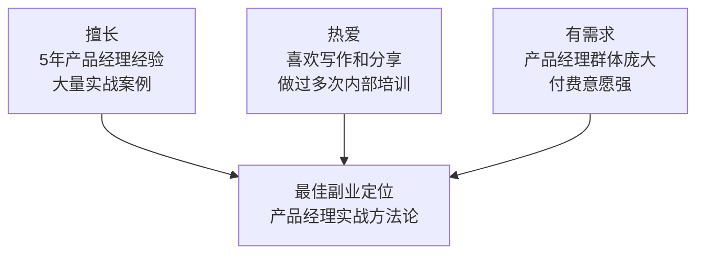
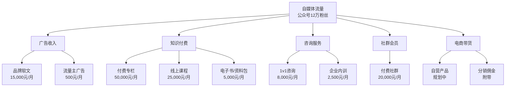
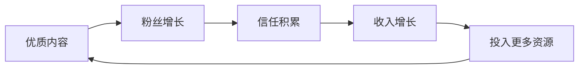
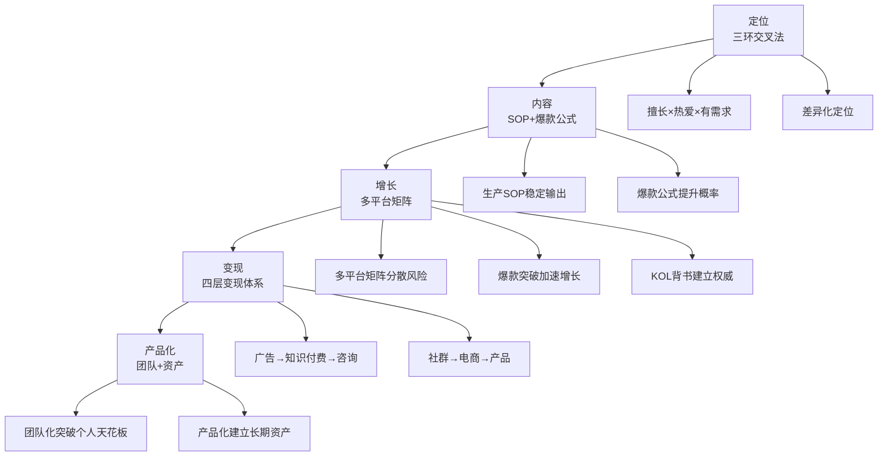

## 案例一：自媒体副业——从公众号到年入百万

本案例完整记录一位互联网从业者从零起步做自媒体副业，用三年时间将微信公众号做到年收入突破百万的全过程。这不是一夜暴富的神话，而是一条可复制、可验证的路径——核心在于**选对赛道、持续输出、系统变现**。

本文按照"道法术器"的逻辑展开：先讲底层认知（为什么自媒体是优质副业），再讲方法论（如何定位、如何增长），然后落到实操（具体动作、工具、模板），最后给出可复用的框架。每个阶段都附有真实数据和踩坑记录，确保读者能照着做。

### 一、底层认知：为什么自媒体是普通人的最优副业赛道

#### 1.1 副业选择的核心评估框架

在选择副业之前，需要理解一个关键概念——**副业的四维评估模型**：

| 维度 | 含义 | 低分示例 | 高分示例 |
|------|------|---------|---------|
| 时间弹性 | 能否利用碎片时间 | 开店（必须守店） | 自媒体（随时可写） |
| 边际成本 | 多服务一个客户的成本 | 咨询（每小时都收费） | 课程（一次录制反复卖） |
| 资产积累 | 停止工作后是否仍有价值 | 代驾（停单即停收入） | 公众号（历史文章持续引流） |
| 天花板 | 理论收入上限 | 发传单（与时间线性相关） | 自媒体（指数增长可能） |

自媒体在这四个维度上得分都很高：时间弹性极高（可碎片化创作），边际成本趋近于零（一篇文章可触达10万人），资产持续积累（内容库是长期资产），天花板极高（头部自媒体年入千万级）。

#### 1.2 自媒体副业 vs 其他常见副业对比

| 副业类型 | 启动成本 | 时间投入 | 收入天花板 | 技术门槛 | 资产属性 |
|---------|---------|---------|-----------|---------|---------|
| 自媒体写作 | 几乎为零 | 2-3小时/天 | 年入百万+ | 低（会写就行） | 强（内容资产） |
| 电商代发 | 5,000-20,000元 | 3-4小时/天 | 年入50-100万 | 中 | 弱（依赖平台） |
| 接私活/外包 | 几乎为零 | 4-8小时/天 | 与时间挂钩 | 高 | 无 |
| 知识付费（不开号） | 1,000-5,000元 | 集中制作 | 年入20-50万 | 中 | 中 |
| 直播带货 | 3,000-10,000元 | 4-6小时/天 | 年入百万+ | 中 | 弱 |
| 短视频创作 | 几乎为零 | 2-4小时/天 | 年入千万级 | 中 | 中 |

**关键洞察**：自媒体写作是少数"低启动成本 + 高天花板 + 强资产积累"的副业类型。更重要的是，它能与几乎所有其他副业形式组合——有了粉丝基础，做电商、做课程、做咨询都是水到渠成。

#### 1.3 自媒体的复利效应

自媒体副业的核心优势在于**复利**。理解这一点需要看一个数学模型：

假设你每周发3篇文章，每篇文章平均带来50个新关注者，取关率2%：

```text
第1个月底：粉丝 = 0 + 600 - 0 = 600
第3个月底：粉丝 ≈ 1,800 + 600×3 - 1,800×2% = 3,564
第6个月底：粉丝 ≈ 5,000 + 600×3 - 5,000×2% = 6,700
第12个月底：粉丝 ≈ 12,000 + 600×3 - 12,000×2% = 13,560
```

但实际情况比这个模型更乐观——因为爆款文章会带来指数级增长。张明在第4个月的一篇爆款就带来了8,000+新粉丝，相当于平时3个月的增量。

**复利不仅体现在粉丝数量上，更体现在信任深度上**。一个关注你6个月的读者，其付费转化率是一个新读者的5-10倍。这就是为什么"坚持12个月"是自媒体副业最重要的门槛。

---

### 二、案例全景：张明的自媒体副业之路

#### 2.1 主人公画像

张明（化名），28岁，二线城市互联网公司产品经理，月薪15K。2021年初开始运营微信公众号作为副业，定位为"产品经理成长笔记"。三年后，该账号矩阵年收入突破120万，全职转型为自媒体创业者。

**选择自媒体而非其他副业的核心原因：**

| 判断维度 | 具体分析 |
|---------|---------|
| 时间灵活性 | 产品本职工作加班频繁，需要一种可以碎片化时间经营的副业，自媒体写作可以在晚上、周末完成 |
| 边际成本递减 | 一篇文章写好后可以反复传播，不像接私活那样"做一单赚一单"，收入有复利效应 |
| 个人品牌积累 | 自媒体输出会建立行业影响力，反过来促进本职工作晋升，形成正循环 |
| 启动成本极低 | 微信公众号注册免费，不需要囤货、租场地、雇人，试错成本几乎为零 |
| 技能可迁移 | 产品经理的用户思维、数据分析能力可以直接迁移到自媒体运营中 |

#### 2.2 赛道选择的底层逻辑

张明没有选择"情感鸡汤"或"搞笑段子"这类流量大但变现难的赛道，而是用了**三环交叉法**筛选定位：



**赛道选择的五个评估标准**（张明的决策过程）：

1. **专业壁垒**：你在该领域有多少年的积累？是否有一手经验？张明有5年产品经理经验，做过3个百万级用户产品，这些是无法被轻易复制的。

2. **目标人群的付费能力**：你的内容面向谁？这些人愿意花钱吗？产品经理群体平均月薪15K以上，且职业焦虑驱动强烈的学习需求，付费意愿强。

3. **内容的可持续性**：你能否在该领域持续产出内容？张明每天工作中都在积累案例和素材，写作本身就是对他工作的复盘和沉淀。

4. **竞争格局**：该赛道是否已经饱和？2021年初，产品经理类公众号有上千个，但大多停留在"搬运行业新闻"或"理论堆砌"层面，缺乏真正的一线实战内容——这就是差异化空间。

5. **变现路径是否清晰**：该赛道的变现方式有哪些？产品经理领域的变现路径非常清晰：广告（SaaS工具推广）→ 知识付费（课程、专栏）→ 咨询（求职、职业规划）→ 社群（行业人脉）。

最终定位：**产品经理实战方法论**——不讲理论空话，只分享一线实战经验。

---

### 三、冷启动阶段：从零到一（第1-3个月）

#### 3.1 账号搭建的12个细节

很多人觉得"注册个公众号就能开始"，但细节决定了冷启动的效率。张明的账号搭建清单：

**基础配置（6个关键设置）：**

| 设置项 | 张明的选择 | 背后的逻辑 |
|-------|-----------|-----------|
| 账号名称 | "产品老张" | 好记+有人设+有信任感。避免用"XX说产品"这类烂大街的格式 |
| 头像 | 真人照片 | 数据显示真人头像比卡通头像关注转化率高40%。不需要很帅，清晰、专业即可 |
| 简介 | "5年产品经理 \| 从0到1做过3个百万级产品 \| 只分享实战干货" | 三个信息：资历+成就+承诺 |
| 菜单栏 | "精选文章""免费资料""合作咨询" | 三个入口覆盖新粉、老粉、商务三类人群 |
| 自动回复 | 关注后发送"欢迎+资料包领取方式" | 第一时间提供价值，降低取关率 |
| 原创声明 | 从第一篇就开启 | 保护原创权益，开启赞赏功能的前提 |

**内容规划（3个核心参数）：**

- **更新频率**：每周3篇（周一、周三、周五晚8点发布）。为什么是3篇？低于3篇读者容易遗忘，高于3篇质量难以保证。晚8点是公众号阅读高峰期（上班族通勤/晚饭后刷手机）。
- **内容类型配比**：干货教程60% + 行业分析25% + 个人成长故事15%。干货是核心价值，行业分析提供视野，个人故事建立情感连接。
- **单篇字数**：2,000-3,500字。这是公众号阅读场景下的最佳长度——太短说不清楚，太长完读率下降。后续数据显示，3,000字左右的文章完读率最高。

#### 3.2 冷启动的五个关键动作

**动作一：种子用户积累（目标：前3个月500+关注）**

张明没有花钱买粉，而是通过以下方式获取第一批关注者：

| 渠道 | 具体做法 | 获得关注 | 关键技巧 |
|------|---------|---------|---------|
| 朋友圈 | 前10篇文章附走心推荐语发朋友圈 | ~200人 | 不要硬广，写"最近在总结这几年做产品的经验，这篇是关于需求分析的，欢迎拍砖" |
| 行业社群 | 加入20+产品经理微信群 | ~150人 | 先抛观点引发讨论，再顺势贴链接，不要直接甩链接 |
| 知乎同步 | 公众号文章改写为知乎回答 | ~80人 | 文末引导"关注公众号获取完整版资料包" |
| 互推合作 | 找3个同量级公众号互推 | ~50人 | 找粉丝量级相近、内容互补的号 |
| 公司内部 | 公司内网和部门群分享 | ~40人 | 同事的社交网络往往覆盖更多目标人群 |

**动作二：建立内容生产SOP（确保稳定输出）**

稳定输出是冷启动期最关键的事。张明把每篇文章的创作流程标准化：

```text
每周内容生产SOP：

周一晚 20:00-21:00  选题（从素材库中挑选本周3个话题，写好标题和大纲）
    ↓
周二午休 12:30-13:00  写作（大纲扩展为初稿的1/3）
周二晚 21:00-22:00   写作（完成初稿的2/3）
    ↓
周三午休 12:30-13:00  写作（完成初稿）
周三晚 20:00-20:30   发布第1篇 + 分发到各平台
    ↓
周四午休+晚上         写第2篇
周五午休 12:30-13:00  完成第2篇
周五晚 20:00-20:30   发布第2篇 + 分发
    ↓
周六上午 9:00-12:00   写第3篇 + 排版配图校对
周一晚 20:00-20:30   发布第3篇 + 分发
    ↓
每天碎片时间          积累素材、回复评论、社群互动
```

**素材库建设**（每天积累，是持续产出的生命线）：

| 素材来源 | 采集方式 | 频率 | 价值评估 |
|---------|---------|------|---------|
| 工作案例 | 随手记录工作中的决策和复盘 | 每天 | ⭐⭐⭐⭐⭐（最真实、最独特） |
| 读者私信 | 截图保存有价值的问题 | 每天 | ⭐⭐⭐⭐⭐（精准的选题来源） |
| 行业报告 | 关注艾瑞、易观等报告平台 | 每周 | ⭐⭐⭐⭐（提供数据支撑） |
| 社群讨论 | 记录群里的精彩观点 | 每天 | ⭐⭐⭐⭐（了解读者关心什么） |
| 竞品文章 | 分析同类账号的爆款 | 每周 | ⭐⭐⭐（学习结构和角度） |
| 书籍/课程 | 读书笔记和感悟 | 持续 | ⭐⭐⭐（提供理论深度） |

张明用Notion建了一个选题数据库，每条素材记录：来源、核心观点、可扩展方向、预估热度。到第3个月时，素材库里有200+条待写选题，再也不用担心"不知道写什么"。

**动作三：打造爆款内容的公式**

经过3个月试错，张明总结出在产品经理领域有效的爆款公式：

```text
爆款 = 痛点标题 + 结构化内容 + 可执行结论 + 情绪共鸣
```

**标题公式**（每篇准备3个标题，选最优的发布）：

| 标题类型 | 公式 | 示例 | 适用场景 |
|---------|------|------|---------|
| 数字型 | N年经验/N个方法/N个错误 | "做了5年产品，我总结了10个最常犯的需求分析错误" | 干货教程 |
| 对比型 | A和B的差距在X | "月薪8K和月薪30K的产品经理，差距在这3个思维模型" | 职业成长 |
| 故事型 | 我用X做了Y | "我用一个Excel表格说服了CEO放弃千万级项目" | 案例分享 |
| 反常识型 | 为什么X还是Y？ | "用户调研做了100次，为什么产品还是没人用？" | 认知颠覆 |
| 焦虑型 | 不知道X你就完了 | "不会写PRD的产品经理，正在被淘汰" | 紧迫感（慎用） |

**内容结构模板**（适用于80%的干货文章）：

```text
开篇（50-100字）：
  → 痛点场景描述，让读者立刻代入
  → 例："你有没有遇到过这种情况：辛辛苦苦做了一周的需求文档，
     评审时被开发怼得体无完肤？"

核心观点（1句话）：
  → 一句话说清楚本文解决什么问题
  → 例："今天分享我总结的PRD写作5步法，照着做至少能减少80%的评审返工。"

主体（3-5个要点）：
  → 每个要点 = 观点 + 案例 + 操作方法
  → 观点要明确，案例要具体（有数据、有场景），操作方法要可执行
  → 用小标题+加粗关键词+列表，提升扫读体验

总结（100-200字）：
  → 不是复述全文，而是给出"下一步该做什么"的行动清单
  → 例："看完这篇文章，你可以今天就做这3件事：①……②……③……"

互动（1句话）：
  → 提一个开放性问题引导留言
  → 例："你在写PRD时遇到过最头疼的问题是什么？欢迎在评论区分享。"
```

**动作四：数据驱动优化（每周复盘）**

张明每周日晚花30分钟复盘数据，重点关注：

| 指标 | 目标值 | 优化方向 | 工具 |
|------|-------|---------|------|
| 打开率 | >8% | A/B测试不同标题风格 | 公众号后台 |
| 完读率 | >45% | 减少废话，增加小标题和列表 | 公众号后台 |
| 分享率 | >5% | 增加"社交货币"（让转发者显得专业） | 公众号后台 |
| 新增关注 | >100/周 | 优化文末引导语和资料包钩子 | 公众号后台 |
| 取关率 | <2% | 控制推送频率，避免质量波动 | 公众号后台 |
| 评论数 | >20条 | 文末提问更具体、更有争议性 | 公众号后台 |

张明做了一个简单的Excel表，每周录入这些数据，画趋势图。一个月后就能看出：什么类型的文章打开率高、什么结构的文章完读率高、什么话题的分享率高。这些数据直接指导下一周的选题和写法。

**动作五：建立读者社群（从第2个月开始）**

免费微信交流群是冷启动期的"秘密武器"。张明的社群运营策略：

- **入群门槛**：关注公众号 + 转发任意一篇文章到朋友圈（截图发给张明）。这既增加了曝光，又筛选了有意愿的读者。
- **日常运营**：每天抛出一个产品相关话题引发讨论。例如："你们公司做需求评审时，产品经理和开发最容易吵起来的点是什么？"
- **价值输出**：每周在群里做一次30分钟的语音分享（用微信群语音或腾讯会议）。
- **选题来源**：群里的讨论往往成为下周的写作素材。当群里有人说"我最近在纠结要不要跳槽去大厂"，下周就出一篇"产品经理跳槽大厂的利弊分析"。

**社群的隐性价值**：张明后来复盘发现，社群用户的内容打开率是普通读者的3倍，付费转化率是普通读者的5倍。这是因为社群建立了更强的信任关系——你不只是一个公众号，而是一个"可以对话的人"。

#### 3.3 冷启动阶段数据

| 时间节点 | 粉丝数 | 篇均阅读 | 单篇最高阅读 | 月收入 | 关键事件 |
|---------|--------|---------|------------|-------|---------|
| 第1个月 | 520 | 180 | 650 | 0元 | 完成12篇文章，建立内容SOP |
| 第2个月 | 1,800 | 520 | 2,100 | 0元 | 建立读者社群，开始知乎同步 |
| 第3个月 | 4,500 | 1,200 | 8,500 | 800元（打赏） | 一篇文章被行业大V转载 |

**冷启动期的三个关键教训**：

1. **前2个月是最难的**。粉丝增长慢、没有收入、还要坚持更新。张明有好几次想放弃，最终靠"把写作当成工作复盘"的心态坚持下来——即使没人看，写作本身也在帮他整理思路。
2. **不要追求完美**。张明前10篇文章现在回头看"写得很烂"，但正是这些"烂文章"帮他找到了写作节奏和读者喜好。如果等到"写好了再发"，可能永远不会发。
3. **互动比阅读量更重要**。早期一篇文章只有200阅读但有15条评论，比一篇1000阅读但0评论的文章更有价值——评论说明读者在认真思考你的内容。

---

### 四、增长爆发阶段：从一到十（第4-12个月）

#### 4.1 粉丝增长的三个爆发点

**爆发点一：一篇爆款文章（第4个月）**

张明写了一篇《我在大厂做产品的3年：从P5到P7，我踩过的每一个坑》，这篇文章为什么爆了？

| 要素 | 具体分析 |
|------|---------|
| 标题 | "P5到P7"精准击中职场产品经理的晋升焦虑，数字具体可信 |
| 内容 | 真实经历，不是编故事。每个坑都有具体场景、当时的决策、事后的反思 |
| 结构 | 按时间线展开，读者跟着主人公一起成长，有代入感 |
| 钩子 | 文末附"产品经理晋升能力自测表"，需要关注公众号领取 |
| 传播 | 标题和内容都具有"社交货币"属性——转发这篇文章显得自己也在认真思考职业发展 |

结果：单篇阅读12万+，单日新增粉丝8,000+，总粉丝突破2万。

**爆款文章的复盘框架**（张明后来每篇爆款都会做这个分析）：

```text
1. 数据回顾：阅读量、分享量、新增关注、评论数
2. 流量来源：公众号消息推送占多少？朋友圈分享占多少？搜一搜占多少？
3. 标题分析：哪个关键词触发了点击？
4. 内容分析：哪段话被引用/截图最多？
5. 可复制要素：哪些元素可以用到后续文章中？
```

**爆发点二：跨平台矩阵搭建（第5-6个月）**

张明开始将公众号内容同步到其他平台。关键策略：**不是简单复制粘贴，而是根据每个平台的内容形态重新制作**。

| 平台 | 内容改编策略 | 粉丝增长 | 变现价值 | 平台特性 |
|------|------------|---------|---------|---------|
| 知乎 | 公众号长文→知乎回答/专栏 | 1.2万关注 | 高质量引流到公众号 | 长尾流量好，一个回答可以持续获得曝光数月 |
| 小红书 | 干货提炼→图文卡片（3-9张图） | 8,000关注 | 品牌合作广告源 | 女性用户多，适合职场成长类内容 |
| B站 | 文字内容→10分钟解说视频 | 5,000关注 | 视频广告分成 | 年轻用户多，弹幕互动氛围好 |
| 抖音 | 核心观点→1分钟口播短视频 | 2万关注 | 流量入口（引流到公众号） | 算法推荐强，新号也有机会爆发 |
| 即刻 | 日常碎片思考→短动态 | 3,000关注 | 行业人脉链接 | 互联网从业者聚集，社交属性强 |

**同一内容的多平台改编示例**：

以"产品经理面试中最容易犯的5个错误"为例：

| 平台 | 改编方式 | 时长/字数 |
|------|---------|----------|
| 公众号 | 3000字长文，每个错误配案例和纠正方法 | 3,000字 |
| 知乎 | 回答"产品经理面试要注意什么？"，保留核心框架 | 1,500字 |
| 小红书 | 5张信息卡片，每张一个错误+纠正方法，配表情包 | 每张100字 |
| 抖音 | 60秒口播，只讲最扎心的1个错误 | 60秒 |
| B站 | 10分钟视频，用动画演示面试场景 | 10分钟 |
| 即刻 | "刚帮一个朋友做面试模拟，发现90%的人都会犯这个错……" | 200字 |

**矩阵运营的时间分配**（每天额外30-60分钟）：

```text
公众号文章写完后（周六上午）：
  → 知乎：提取核心观点，改写为回答（15分钟）
  → 小红书：用Canva做5张信息卡片（20分钟）
  → 即刻：写一条短动态（5分钟）

周日：
  → 抖音：对着手机口播1分钟（录制+剪辑15分钟）
  → B站：如果有时间，做一期解说视频（1-2小时，非每周都做）
```

**爆发点三：行业KOL背书（第8个月）**

张明通过以下方式获得了行业大V的推荐：

| 方式 | 具体做法 | 效果 |
|------|---------|------|
| 投稿 | 主动给行业大V的公众号投稿，文章被转载并@了他 | 单次带来1,500+新关注 |
| 演讲 | 在行业大会上做了一次15分钟的闪电演讲 | 视频被传到B站，持续引流 |
| 解读 | 写了一篇对某知名产品方法论的深度解读 | 被原作者转发，获得背书 |

**如何获得KOL背书的实操建议**：

1. **先提供价值**：在KOL的文章下留有价值的评论，被精选多次后，KOL会注意到你。
2. **投稿要精心打磨**：给KOL投稿的质量要比自己发的文章高50%。因为这是你的"面试作品"。
3. **不要直接求推荐**：先建立关系，再寻求合作。直接私信"能帮我转发吗"是最差的方式。
4. **创造"不得不转"的内容**：如果你写了一篇对KOL方法论的深度解读，且质量很高，KOL出于自我品牌维护的需要也会转发。

#### 4.2 内容升级策略

从第6个月开始，张明的内容策略从"泛干货"升级为**体系化内容**：

**系列专栏**（提升完读率和关注转化）：

| 系列名称 | 篇数 | 设计逻辑 | 效果 |
|---------|------|---------|------|
| "产品经理面试全攻略" | 12篇 | 覆盖面试全流程：简历→笔试→群面→单面→谈薪 | 完读率提升35%，系列平均关注转化率8% |
| "从需求到上线"全流程 | 8篇 | 串联产品工作全链路 | 被多家公司内部培训引用 |
| "B端产品经理生存指南" | 10篇 | 垂直细分领域，建立专业壁垒 | B端SaaS广告主主动找上门 |

**深度长文**（建立专业壁垒）：
- 每月1篇5,000字以上的深度分析文章
- 引用数据报告、行业案例、学术研究
- 这类文章虽然阅读量不高（通常5,000-8,000），但转发率极高（>15%），且容易被其他媒体转载

**互动型内容**（提升用户参与感）：
- "读者案例诊断"：征集读者的产品案例，免费做公开分析
- "每周一问"：抛出一个产品难题，收集读者答案后做总结
- "年度产品评选"：让读者投票选出年度最佳/最差产品

#### 4.3 平台算法变化的应对

公众号运营不能闭门造车，必须关注平台算法的变化。张明在增长期遇到的三次算法调整：

**第一次：公众号信息流改版（2021年）**
- 变化：从"订阅列表"变为"信息流推荐"，打开率整体下降
- 应对：更注重标题的吸引力（信息流模式下标题决定生死）；引导读者"设为星标"确保不被算法埋没

**第二次：搜一搜权重调整（2022年）**
- 变化：微信搜一搜对公众号文章的收录和排名规则调整
- 应对：在文章标题和正文中自然融入搜索关键词（如"产品经理面试""PRD怎么写"）；每篇文章底部添加相关文章推荐，提升站内链接密度

**第三次：视频号与公众号打通（2022-2023年）**
- 变化：视频号内容可以在公众号文章中嵌入，公众号粉丝可以导入视频号
- 应对：开始做视频号（每周1-2条短视频）；在公众号文章中嵌入视频号内容，提升视频号曝光

**应对算法变化的核心原则**：不要把所有鸡蛋放在一个平台的篮子里。张明的多平台矩阵策略，让他在任何单一平台算法调整时都不会受到致命打击。

#### 4.4 增长阶段数据

| 时间节点 | 公众号粉丝 | 全平台粉丝 | 篇均阅读 | 月收入 | 关键里程碑 |
|---------|-----------|-----------|---------|-------|-----------|
| 第4个月 | 1.8万 | 2.5万 | 8,000 | 2,000元 | 爆款文章带来8,000+新粉 |
| 第6个月 | 2.8万 | 5.5万 | 5,500 | 8,000元 | 多平台矩阵初步成型 |
| 第9个月 | 6.2万 | 15万 | 12,000 | 25,000元 | KOL背书，品牌合作开始 |
| 第12个月 | 12万 | 32万 | 22,000 | 65,000元 | 年度累计收入突破50万 |

---

### 五、变现体系：从广告到产品化（第7-36个月）

#### 5.1 变现路径全景图



**变现的节奏很重要**。张明的变现时间线：

```text
第1-6个月：纯免费内容，零收入，建立信任基础
第7个月：上线第一个付费资料包（29元），试水变现
第8个月：开通品牌软文合作
第10个月：上线付费专栏
第14个月：推出第一门系统课程
第18个月：开始企业内训
第20个月：建立付费社群
第24个月：收入突破80万/年
第30个月：收入突破100万/年
```

**核心原则：先给予价值，再获取回报。用户不是为内容付费，是为信任付费。**

#### 5.2 第一层变现：广告收入（月入0→1.5万）

**流量主收入（被动收入）**

公众号粉丝超过500即可开通流量主（文末/文中广告）。以张明的数据：

| 阶段 | 篇均阅读 | 单篇广告收入 | 月度流量主收入 |
|------|---------|------------|-------------|
| 粉丝5,000时 | 1,200 | 3-8元 | ~100元 |
| 粉丝3万时 | 5,500 | 15-30元 | ~400元 |
| 粉丝12万时 | 22,000 | 60-120元 | ~1,500元 |

流量主收入不高，但它是"睡后收入"——不需要额外做任何事。

**品牌软文合作（主要广告收入）**

粉丝过万后开始有品牌主动找上门。张明的软文定价策略：

| 粉丝量级 | 单篇报价 | 报价依据 | 合作频率 |
|---------|---------|---------|---------|
| 1-3万 | 2,000-5,000元 | 篇均阅读×0.5-1元/阅读 | 每月1篇 |
| 3-10万 | 5,000-15,000元 | 篇均阅读×1-1.5元/阅读 | 每月1-2篇 |
| 10万+ | 15,000-50,000元 | 篇均阅读×1.5-2元/阅读 + 品牌溢价 | 每月最多2篇 |

**张明的软文四原则**：

1. **只接与定位相关的品牌**：只接SaaS工具、在线教育、职场服务类广告，拒绝与产品经理无关的推广。拒绝过一个护肤品品牌的合作（报价2万），因为"产品老张推荐护肤品"会破坏人设。
2. **保持内容质量**：软文也要有干货价值，采用"70%干货+30%植入"的结构。张明的软文完读率通常只比普通文章低5-10%。
3. **控制频率**：每月最多2篇软文，避免粉丝反感。张明的经验是，超过每月2篇，取关率会明显上升。
4. **提供数据报告**：给广告主提供阅读量、点击率、转化数据，建立长期合作关系。广告主复购率高达60%。

**如何找到品牌合作**：

| 渠道 | 适合阶段 | 特点 |
|------|---------|------|
| 品牌主动找来 | 粉丝3万+ | 质量最高，但需要等 |
| 新榜/微小宝等平台 | 粉丝5,000+ | 资源多但竞争大，价格偏低 |
| 同行推荐 | 有行业人脉后 | 互相介绍，效率最高 |
| 主动BD | 任何阶段 | 直接联系目标品牌的市场部 |

#### 5.3 第二层变现：知识付费（月入1.5万→5万）

**付费专栏**

在公众号内开设付费专栏"产品经理进阶课"：

| 参数 | 设置 | 说明 |
|------|------|------|
| 定价 | 199元/年 | 低于一顿火锅的价格，降低决策门槛 |
| 内容 | 每周更新1篇深度长文 | 比免费内容更深、更体系化、更独家 |
| 交付 | 知识星球/小鹅通 | 知识星球适合社群型，小鹅通适合课程型 |
| 转化率 | 公众号粉丝的3-5% | 行业平均1-2%，张明的高转化率得益于长期信任积累 |

以12万粉丝计算：12万×4%×199 ≈ 95万/年（实际打折促销后约60-70万）。

**付费专栏的内容策略**：

免费内容和付费内容的关系不是"好的留着收费"，而是"更体系化的深度内容收费"：

```text
免费文章：《产品经理如何做好用户调研？》（3000字，方法论+1个案例）
付费专栏：《用户调研完整指南：从问卷设计到数据分析》（8000字，
          5个案例+模板+工具推荐+常见坑）
```

**线上课程**

第14个月时，张明推出了第一门系统课程《产品经理实战训练营》：

| 参数 | 设置 |
|------|------|
| 定价 | 999元/期 |
| 周期 | 每期4周 |
| 形式 | 录播视频+直播答疑+作业批改+社群陪伴 |
| 每期招生 | 80-120人 |
| 频率 | 每季度一期 |

**课程制作的完整流程**（张明踩过坑后优化的版本）：

```text
第1-2周：课程大纲设计
  → 拆解为30个小节，每节15-20分钟
  → 找5个目标用户验证大纲（"你觉得这个大纲覆盖了你想学的吗？"）
  → 根据反馈调整（删除不感兴趣的，增加他们想学的）

第3-6周：录制视频
  → 利用周末集中录制，每次录3-5节
  → 设备：罗德NT-USB麦克风（500元）+ 绿幕（100元）+ OBS录屏（免费）
  → 关键技巧：不要追求完美，一个地方说错了就重说那段，后期剪掉

第7周：后期制作
  → 剪辑、配字幕（用剪映自动识别字幕）、上传到课程平台
  → 每节课控制在15-20分钟（注意力曲线研究表明这是最佳长度）

第8周：试运行
  → 邀请10个铁杆粉丝免费试听
  → 收集反馈：哪里听不懂？哪里太啰嗦？哪里想深入了解？
  → 根据反馈优化（通常需要重录2-3节）

第9周：正式上线推广
  → 公众号推文+社群预告+朋友圈预热
  → 前100名早鸟价799元（制造紧迫感）
```

**电子书/资料包**

张明制作了3个付费资料包：

| 资料包名称 | 定价 | 累计销售 | 制作成本 | 收入 |
|-----------|------|---------|---------|------|
| 产品经理面试题库300道 | 49元 | 2,000+份 | ~40小时 | ~98,000元 |
| PRD文档模板大全 | 29元 | 3,500+份 | ~20小时 | ~101,500元 |
| 产品分析报告框架 | 39元 | 1,800+份 | ~30小时 | ~70,200元 |

**资料包制作四原则**：

1. **解决具体痛点**：面试、写文档、做分析——这些都是产品经理每天都要面对的具体问题
2. **价格低于一顿饭钱**：29-49元的定价让读者几乎不需要思考就能购买
3. **文章末尾自然植入**：不硬推，而是在相关内容中提到"我整理了一份XX，需要的可以看看"
4. **持续迭代更新**：每季度更新一次，老用户免费获取新版。这既提升了复购率，又建立了"这个资料包一直在维护"的信任感

#### 5.4 第三层变现：咨询服务（月入1-3万）

**1v1咨询**

| 参数 | 设置 | 说明 |
|------|------|------|
| 定价 | 500元/小时 | 初期300元，随着知名度提升逐步涨价 |
| 场景 | 求职面试模拟、职业规划、产品方案评审 | 聚焦最刚需的三个场景 |
| 频率 | 每周2-3个 | 月入4,000-6,000元 |
| 入口 | 公众号菜单栏"预约咨询" | 通过有赞或小鹅通收款 |
| 交付 | 腾讯会议1小时 + 会后文字总结 | 文字总结是加分项，客户可以反复看 |

**咨询转化漏斗**：

```text
公众号文章读者（12万）
    ↓ 关注并阅读多篇文章后产生信任
潜在咨询客户（约5,000人有咨询需求）
    ↓ 看到菜单栏"预约咨询"入口
预约页面访问（约500人/月）
    ↓ 看到价格、案例、评价后决策
实际付费咨询（约10-15人/月）
    ↓ 咨询后满意
复购+口碑推荐（约30%会复购或推荐朋友）
```

**企业内训**

第18个月时，张明开始接到企业内训邀请：

| 参数 | 设置 |
|------|------|
| 定价 | 15,000-30,000元/天 |
| 内容 | 产品经理能力提升、需求分析方法论、用户研究实战 |
| 频率 | 每月1-2场 |
| 来源 | 60%来自公众号读者中的企业中层管理者推荐，40%来自培训经纪公司 |

**企业内训的准备清单**：

1. 制作标准化课件（PPT+学员手册+练习模板）
2. 提前与甲方沟通培训目标和学员背景
3. 准备2-3个与该行业相关的案例（让学员觉得"这个老师懂我们行业"）
4. 培训后收集反馈表，用于改进和营销素材

#### 5.5 第四层变现：社群会员（月入2-5万）

**付费社群"产品圈"**

| 参数 | 设置 |
|------|------|
| 定价 | 599元/年 |
| 权益 | 每周直播分享、独家行业分析、简历修改、内推机会、线下聚会 |
| 会员数 | 稳定在500-800人 |
| 年收入 | 约30-48万 |

**社群运营SOP**：

| 时间 | 内容 | 形式 | 目的 |
|------|------|------|------|
| 周一 | 本周行业大事速览 | 图文消息 | 信息价值 |
| 周三 | 精选文章深度解读 | 直播（30分钟） | 学习价值 |
| 周五 | 会员案例互评 | 社群讨论 | 互动价值 |
| 每月最后一个周六 | 线下/线上聚会 | 活动 | 社交价值 |
| 每季度 | 会员专属资料包更新 | 文件发放 | 持续价值 |

**社群留存的关键**：张明发现社群最大的杀手是"沉默"。一旦群里连续3天没人说话，成员就会觉得"这个群没什么价值"。他的应对策略是每天至少在群里说一句话（哪怕只是一个行业新闻链接+一句点评），保持群的活跃度。

#### 5.6 变现体系总览与收入结构

第三年时，张明的月收入结构：

| 收入来源 | 月均收入 | 占比 | 投入时间/月 | 复利属性 |
|---------|---------|------|-----------|---------|
| 品牌软文 | 15,000元 | 12% | 写2篇约6小时 | 弱（每篇重新写） |
| 付费专栏 | 50,000元 | 40% | 每周1篇约4小时/周 | 强（内容持续收费） |
| 线上课程 | 25,000元 | 20% | 每季度集中2周 | 强（录制一次反复卖） |
| 付费社群 | 20,000元 | 16% | 每周直播+日常运营约8小时/周 | 中（需要持续运营） |
| 1v1咨询 | 8,000元 | 6% | 每周2-3小时 | 弱（与时间挂钩） |
| 资料包销售 | 5,000元 | 4% | 已自动化，几乎零投入 | 强（一次制作持续卖） |
| 企业内训 | 2,500元 | 2% | 每月1天 | 弱（与时间挂钩） |
| **合计** | **125,500元** | **100%** | **约25小时/周** | — |

**关键洞察**：收入结构中复利属性最强的三个来源（付费专栏、线上课程、资料包）合计占64%。这意味着即使张明停止创作新内容，这些存量收入也能持续数月。这就是自媒体副业的"资产属性"——你积累的不只是粉丝，还有可反复变现的内容资产。

---

### 六、关键决策复盘

#### 6.1 决策一：先免费后付费，信任前置

张明前6个月一分钱收入都没有，全部精力放在输出免费优质内容上。很多人在这个阶段就放弃了——觉得自己在"白干"。但正是这6个月的免费输出，建立了12万人的信任基础。后面所有变现动作的转化率，都建立在这份信任之上。

**数据佐证**：张明在第7个月上线第一个付费资料包时，首月转化率为2.1%（行业平均0.5-1%）。如果他在第1个月就卖资料包，转化率可能只有0.1%——不是内容不好，是信任不够。

#### 6.2 决策二：不追求粉丝数量，追求粉丝质量

张明的粉丝增长速度在自媒体圈并不算快——很多搞笑账号3个月就能做到百万粉。但张明的粉丝有三个特征：

| 特征 | 具体表现 | 商业价值 |
|------|---------|---------|
| 精准 | 90%是一线城市的互联网从业者 | 广告精准度高，品牌愿意出高价 |
| 高净值 | 平均月薪15K以上，有付费能力 | 知识付费转化率是行业平均的3倍 |
| 高粘性 | 取关率长期低于1.5% | 长期价值高，复购率高 |

这使得他的广告单价是同类粉丝量账号的2-3倍，付费课程转化率是行业平均的3倍。**12万精准粉丝的商业价值，远超100万泛粉丝。**

#### 6.3 决策三：矩阵化运营，不把鸡蛋放一个篮子

张明从第5个月就开始做多平台矩阵，而不是只守着公众号。这在后来被证明是极其正确的决策——2023年公众号整体打开率持续下滑（从平均5%降到2-3%），但他的抖音和小红书粉丝持续增长，整体流量保持稳定。

**矩阵化的核心价值**：

1. **风险分散**：任何单一平台的算法调整都不会致命
2. **流量互补**：不同平台的用户画像不同，可以触达更多人群
3. **内容复用**：同一核心内容改编为不同形式，边际成本极低
4. **变现多元**：不同平台有不同的变现方式（抖音可以直播带货，小红书可以品牌合作）

#### 6.4 决策四：尽早建立付费产品，哪怕很小

很多自媒体人觉得"等我粉丝够多了再考虑变现"。张明在第7个月就上线了第一个付费资料包（29元），虽然第一个月只卖了37份（收入1,073元），但这次经历让他：

1. **跑通了完整链路**：内容→信任→付费→交付，每个环节都走了一遍
2. **获取了用户画像**：知道谁愿意付费、为什么付费、什么价格能接受
3. **建立了变现信心**：原来真的有人愿意为我的内容付费
4. **发现了改进空间**：37个用户中有5个给了反馈，直接指导下一版的优化方向

---

### 七、自媒体人的隐性挑战与应对

#### 7.1 持续输出的倦怠感

自媒体副业最大的敌人不是竞争，而是**倦怠**。张明在第10个月时经历了一次严重的创作倦怠：

| 症状 | 表现 |
|------|------|
| 动力下降 | 以前写文章很兴奋，现在觉得"又得写了" |
| 质量波动 | 写出来的文章自己都不满意 |
| 拖延加剧 | 以前周一就能完成初稿，现在拖到周五 |
| 数据焦虑 | 每篇文章发布后反复刷阅读量 |

**张明的应对方法**：

1. **降低频率而非停止**：倦怠期间从每周3篇降到2篇，但不完全停更。完全停更后再恢复，流失的读者很难回来。
2. **切换内容类型**：不想写长文就写短动态，不想写干货就写个人故事。保持输出的惯性比内容形式更重要。
3. **建立"内容储备金"**：状态好的时候多写几篇，存在素材库里。倦怠时直接发储备文章。
4. **找写作搭子**：和其他自媒体人组一个"写作打卡群"，互相监督和鼓励。
5. **接受"60分文章"**：不是每篇都要完美。一篇60分的文章发出去，比一篇永远写不完的100分文章更有价值。

#### 7.2 舆论风险与负面评论

粉丝量达到一定规模后，负面评论不可避免。张明遇到的几次舆论危机：

| 事件 | 处理方式 | 结果 |
|------|---------|------|
| 被质疑"软文太多" | 公开承诺每月软文不超过2篇，并公示当月软文数量 | 读者反而更信任了 |
| 被同行指控"洗稿" | 公开所有文章的创作时间线和素材来源 | 舆论反转，反而增加了知名度 |
| 一篇观点文章引发争议 | 不删帖，不道歉，在评论区理性讨论 | 争议带来了大量新关注 |

**处理负面评论的原则**：

1. **事实错误要道歉并纠正**：如果文章中有事实性错误，第一时间更正并道歉
2. **观点分歧要坚持**：如果只是观点不同，可以解释但不必妥协
3. **恶意攻击要忽略**：纯情绪化的攻击不需要回应，回复只会让事情更大
4. **不要删评论**：删除负面评论会被截图传播，造成更大的信任危机

#### 7.3 工作与副业的平衡

张明在副业增长期（第4-12个月）面临最大的挑战是时间分配。本职产品经理工作本身就很忙，副业每周还需要15-20小时。

**时间管理的具体策略**：

| 策略 | 做法 | 效果 |
|------|------|------|
| 时间块管理 | 工作日晚上9-11点固定写作，周末上午9-12点固定创作 | 建立习惯后不需意志力维持 |
| 碎片时间利用 | 午休30分钟写大纲，通勤时间回复评论 | 每天多出1小时有效时间 |
| 批量处理 | 周六集中拍摄3-5条短视频 | 比每天拍一条效率高3倍 |
| 学会说"不" | 拒绝无效社交和低价值会议 | 腾出的时间用于高价值创作 |
| 善用AI工具 | 用ChatGPT辅助选题、生成大纲、润色初稿 | 写作效率提升30-50% |

**关键认知**：副业不是"业余时间随便做做"，而是"用做项目的态度经营"。张明把副业当成一个产品来运营——有目标、有计划、有数据、有复盘。

#### 7.4 税务与合规

自媒体收入达到一定规模后，税务问题是必须面对的：

| 收入类型 | 税务处理 | 注意事项 |
|---------|---------|---------|
| 广告收入 | 个人所得税（劳务报酬） | 年收入超过12万需要汇算清缴 |
| 知识付费 | 涉及增值税（小规模纳税人3%） | 需要开具发票 |
| 咨询收入 | 个人所得税（劳务报酬） | 单次超过800元即需缴税 |
| 软文发布 | 需标注"广告"标识 | 《广告法》要求，否则面临罚款 |

**建议**：年收入超过20万后，注册一个个体工商户，享受小规模纳税人优惠政策（月收入10万以下免增值税），同时解决发票和合规问题。代账费用约200元/月。

---

### 八、工具清单与技术栈

张明在运营过程中使用的完整工具链：

| 用途 | 工具 | 费用 | 说明 |
|------|------|------|------|
| 图文排版 | 135编辑器/秀米 | 免费/99元/年 | 公众号排版美化，模板丰富 |
| 图片设计 | Canva/创客贴 | 免费/基础版 | 封面图、小红书卡片、信息图制作 |
| 视频剪辑 | 剪映 | 免费 | 短视频制作，自动字幕识别 |
| 数据分析 | 新榜/西瓜数据 | 免费/付费 | 公众号数据分析、竞品监控 |
| 课程平台 | 小鹅通/知识星球 | 年费制 | 付费内容交付和管理 |
| 社群管理 | 企业微信+微伴助手 | 免费/付费 | 社群自动化运营、标签管理 |
| 排期管理 | Notion/飞书多维表格 | 免费 | 内容日历管理、选题数据库 |
| 选题监控 | 5118/百度指数 | 免费/付费 | 热点监控和关键词分析 |
| AI辅助写作 | ChatGPT/文心一言 | 免费/付费 | 选题灵感、大纲生成、初稿润色 |
| 税务管理 | 个体户+代账公司 | 200元/月 | 发票开具和税务申报 |
| 录屏/OBS | OBS Studio | 免费 | 课程录制、直播推流 |
| 麦克风 | 罗德NT-USB | 500元（一次性） | 提升音频质量 |
| 协作 | 飞书/Notion | 免费 | 团队协作、文档管理 |

**AI辅助写作的正确使用方式**：

AI不是用来"替你写"，而是用来"帮你写得更快"。张明的AI使用流程：

```text
1. 选题阶段：让AI列出"产品经理面试"相关的20个子话题 → 筛选最有价值的5个
2. 大纲阶段：给出主题，让AI生成大纲框架 → 根据自己的经验调整和补充
3. 初稿阶段：对某个不熟悉的领域，让AI生成初稿 → 用自己的案例和经验重写
4. 润色阶段：写完后让AI检查逻辑漏洞和表述不清的地方
5. 标题阶段：让AI生成10个标题 → 选最好的，自己再改一版
```

**核心原则：AI是加速器，不是替代品。你的独特价值在于一手经验和真实案例，这是AI无法生成的。**

---

### 九、常见误区与避坑指南

#### 误区一：追求篇篇10万+

```text
错误认知：每篇文章都要追求爆款，阅读量低于1万就是失败
正确理解：80%的收入来自20%的爆款文章，但那80%的"普通文章"
         才是建立日常信任和粘性的基础。不要因为一篇没爆就焦虑。
```

张明的数据印证了这一点：三年累计发布约450篇文章，10万+阅读的只有23篇（5%），但这23篇贡献了约40%的新粉丝。剩下427篇虽然阅读量不高，但它们建立了"这个号持续在输出优质内容"的用户心智。

**正确的期望管理**：

| 文章类型 | 占比 | 阅读量范围 | 作用 |
|---------|------|-----------|------|
| 爆款文章 | 5% | 10万+ | 带来大量新粉 |
| 优质文章 | 20% | 1万-10万 | 稳定增长+高转发 |
| 常规文章 | 60% | 2,000-10,000 | 维持信任和粘性 |
| 实验文章 | 15% | 不确定 | 探索新方向，偶尔意外爆发 |

#### 误区二：只做内容不做运营

很多创作者只关注"写好文章"，忽略了运营。张明在运营上投入的精力不亚于内容创作：

| 运营动作 | 频率 | 具体做法 | 效果 |
|---------|------|---------|------|
| 标题优化 | 每篇 | 准备3个标题，小范围测试后选最优 | 打开率提升15-20% |
| 发布时间测试 | 一次性 | 测试早8点、午12点、晚8点、晚10点，锁定最优 | 晚8点阅读量最高 |
| 评论区互动 | 每天 | 每条留言都回复，精选有价值的置顶 | 评论数提升3倍 |
| 私信管理 | 每天 | 设置自动回复关键词，人工回复复杂问题 | 减少重复咨询 |
| 数据分析 | 每周 | 复盘核心指标，每月出运营报告 | 持续优化方向 |

#### 误区三：过早全职做自媒体

张明在年收入突破80万时才考虑辞职，而不是一有收入就全职。原因：

1. **心理压力完全不同**：没有工资兜底，创作质量反而可能下降
2. **公司资源不可忽视**：人脉、案例、行业信息对自媒体内容有巨大价值
3. **隐性收益不能忽略**：社保、公积金、职业身份
4. **试错空间更大**：有工资兜底，可以更大胆地尝试新的内容方向

**建议：在副业收入稳定达到本职工作收入的2倍以上，且持续6个月后，再考虑全职。**

#### 误区四：抄袭或洗稿走捷径

自媒体行业最常见的"速成法"就是洗稿。张明身边有同行因为洗稿被平台封号，多年积累毁于一旦。更重要的是：

- 洗稿无法建立真正的专业壁垒——你能洗，别人也能洗
- 读者不傻，时间久了自然能分辨原创和洗稿
- 一旦被曝光，信任崩塌不可逆转
- 平台的原创检测算法越来越强，洗稿的风险越来越高

#### 误区五：忽视邮件列表建设

很多自媒体人把所有粉丝都放在平台上（公众号、抖音、小红书），忽略了**邮件列表**的建设。张明在第12个月才开始做邮件列表，他后来认为这是"最后悔没有早点做的事"。

**为什么需要邮件列表**：

1. **平台独立性**：你的公众号粉丝列表属于微信，不属于你。如果账号被封，所有粉丝都没了。邮件列表是你自己拥有的渠道。
2. **触达率更高**：公众号的平均打开率只有2-3%，而邮件的打开率可以达到20-30%。
3. **更适合深度内容**：邮件适合发送长文、独家内容、个人化消息。

**如何建设邮件列表**：

```text
1. 制作一个高价值的"引流磁铁"（如：产品经理必备工具包）
2. 在公众号文章末尾引导读者留下邮箱领取
3. 使用邮件营销工具（如Mailchimp、ConvertKit、国内的SendCloud）
4. 每周发送一封邮件：本周精选内容+独家观点+最新动态
```

#### 误区六：不做数据分析，凭感觉运营

很多自媒体人"凭感觉"写文章——觉得什么好就写什么。张明坚持每周做数据分析，让数据指导决策。

**张明的周报模板**：

```text
本周数据回顾（XX月XX日-XX月XX日）
=================================
新增关注：XXX（较上周 +/-XX%）
取消关注：XXX（取关率 X.X%）
净增长：XXX

本周文章表现：
  文章A：阅读XXX，分享XX，新增关注XX
  文章B：阅读XXX，分享XX，新增关注XX
  文章C：阅读XXX，分享XX，新增关注XX

关键发现：
  1. [数据发现1]
  2. [数据发现2]
  3. [数据发现3]

下周行动：
  1. [具体优化动作1]
  2. [具体优化动作2]
```

---

### 十、进阶思考：从副业到事业的跃迁

#### 10.1 个人IP的护城河

当张明的自媒体收入稳定超过百万后，他开始思考一个更深层的问题：**我的护城河是什么？**

答案不是粉丝数量（可以被超越），不是内容质量（可以被模仿），而是**个人品牌认知**——当产品经理群体想到"实战方法论"时，第一个想到的是"产品老张"。这种心智占领是最深的护城河。

**护城河的三个层次**：

| 层次 | 内容 | 被复制难度 |
|------|------|-----------|
| 表层 | 粉丝数量、阅读量 | 低（花钱可买） |
| 中层 | 内容质量、更新频率 | 中（需要能力+坚持） |
| 深层 | 品牌认知、信任关系 | 高（需要时间+一致性） |

#### 10.2 从个人到团队

年入百万的个人自媒体天花板很明显——一个人的时间和精力有限。张明的下一步是组建小团队：

| 角色 | 职责 | 招聘来源 | 月薪 |
|------|------|---------|------|
| 内容编辑 | 初稿撰写、排版、校对 | 公众号读者中的写作爱好者 | 6,000-8,000元 |
| 运营助理 | 社群维护、数据统计、客服 | 应届毕业生 | 4,000-6,000元 |
| 视频剪辑 | 短视频和课程后期 | 自由职业者/兼职 | 按件计费 |
| 张明本人 | 核心内容创作、商业合作、战略方向 | — | — |

**团队化的核心原则**：所有对外内容仍以张明的口吻和视角输出。团队成员是"手"，张明是"脑"。读者关注的是"产品老张"这个人，不是"产品老张工作室"。

#### 10.3 从内容到产品

最终极的跃迁是从"卖内容"到"卖产品"：

| 方向 | 具体形式 | 投入 | 天花板 |
|------|---------|------|--------|
| SaaS工具 | PRD模板SaaS、需求管理工具 | 高（需要开发） | 极高 |
| 实体书籍 | 出版社主动联系 | 中（需要3-6个月集中写作） | 中 |
| 行业大会 | 从线上社群延伸到线下活动 | 高（场地、嘉宾、运营） | 高 |
| 投资孵化 | 投资其他自媒体人 | 中 | 极高（从创作者变为平台） |

这条路径的本质是：**用内容获取流量和信任，用信任变现为收入，用收入投资于更持久的资产**。

#### 10.4 飞轮效应

张明的自媒体事业已经形成了正向飞轮：



一旦飞轮转动起来，增长就是指数级的。前6个月是最难的——飞轮还没有惯性，每一步都需要外力推动。但过了临界点（张明的经验是粉丝3万+、月收入1万+），飞轮就会自己转起来。

---

### 十一、可复制的方法论总结

将张明的经验抽象为可复制的框架：



**核心公式**：

```text
自媒体副业年入百万 = 精准定位 × 持续输出(12个月+) × 系统变现 × 时间复利
```

这不是一个可以速成的路径。张明用了三年时间，前6个月零收入，前12个月月入不足3万。但一旦飞轮转动起来——内容带来粉丝，粉丝带来信任，信任带来收入，收入投入更好的内容——增长就是指数级的。

**最后一句话：自媒体副业最大的门槛不是能力，不是资金，而是你能不能在看不到回报的前6个月坚持输出。能做到这一点的人，已经淘汰了90%的竞争者。**

---

### 附录：行动清单

如果你也想开始自媒体副业，以下是按优先级排列的行动清单：

**本周就做的事**：
- [ ] 用三环交叉法确定你的赛道定位
- [ ] 注册公众号，完成基础配置（名称、头像、简介、菜单栏）
- [ ] 写好第一篇文章的大纲

**第一个月做的事**：
- [ ] 发布至少8篇文章，建立内容生产SOP
- [ ] 加入10个以上目标人群的微信群
- [ ] 建立素材库（Notion或飞书多维表格）
- [ ] 注册知乎和小红书账号，开始内容同步

**前三个月做的事**：
- [ ] 积累500+粉丝，开通流量主
- [ ] 建立读者社群
- [ ] 每周做数据复盘
- [ ] 总结出自己的爆款公式

**第六个月做的事**：
- [ ] 上线第一个付费产品（资料包或付费专栏）
- [ ] 尝试第一篇品牌软文合作
- [ ] 粉丝突破2万

**第十二个月做的事**：
- [ ] 建立邮件列表
- [ ] 推出系统课程或付费社群
- [ ] 月收入突破1万
- [ ] 评估是否全职转型
