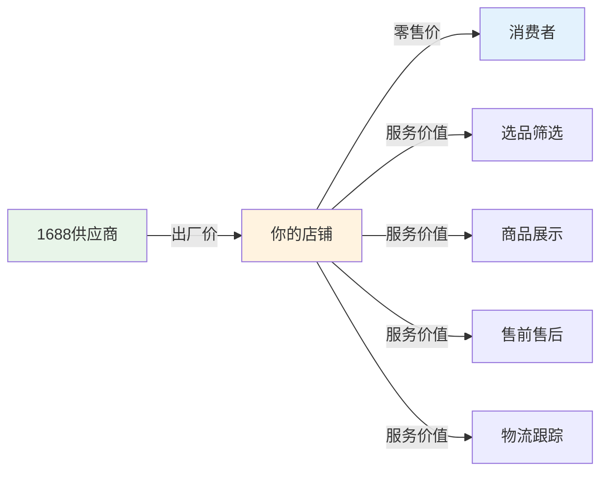
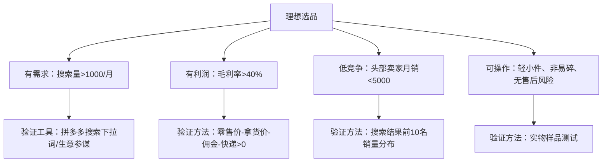
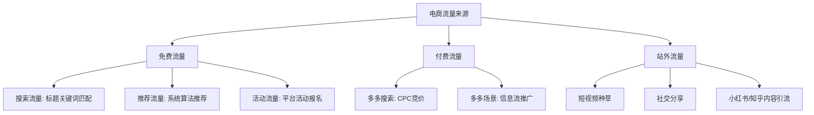
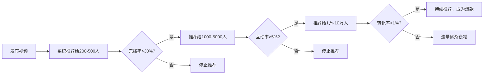
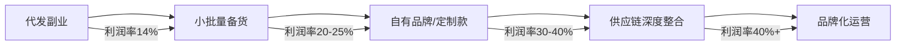

## 案例二：电商副业——从1688到月入5万

本案例完整记录一位上班族如何利用1688批发平台作为货源，在拼多多、抖音小店、闲鱼三个渠道开展电商副业，从零起步用8个月时间实现月利润稳定在5万元的真实路径。案例涵盖选品逻辑、供应商筛选、店铺运营、流量获取、利润优化和风险控制六大模块，每个环节给出可复制的实操方法。

### 为什么1688代发模式值得做

#### 商业逻辑拆解

1688代发模式的本质是**信息差套利+服务价值叠加**。这个模式之所以成立，有三个底层逻辑：

1. **供应链信息不对称**：绝大多数消费者不会去1688采购，他们习惯在拼多多、淘宝、抖音等零售平台购物。1688上的出厂价与零售价之间存在30%-300%的价差，这个价差就是你的利润空间。

2. **平台流量分配机制**：拼多多、抖音等平台需要大量SKU来满足用户多样化的搜索需求。新店新品会获得平台的"冷启动流量扶持"，只要你的商品标题、主图、价格做得好，平台会主动把流量分给你。

3. **消费者决策心理**：消费者在零售平台购物时，关注的是"这个商品好不好""价格合不合适""发货快不快"，而不是"这个商品在1688上卖多少钱"。你提供的选品筛选、商品展示、售前咨询、售后服务本身就是有价值的服务。



#### 与其他副业模式对比

| 对比维度 | 1688代发电商 | 自媒体写作 | 知识付费 | 技术外包 |
|----------|-------------|-----------|---------|---------|
| 启动资金 | 1-2万 | 几乎为零 | 几乎为零 | 几乎为零 |
| 上手难度 | 中等 | 低 | 高（需专业积累） | 高（需技术能力） |
| 见效速度 | 1-3个月 | 3-6个月 | 3-12个月 | 1-2个月 |
| 天花板 | 高（可规模化） | 中（依赖个人IP） | 高（但需持续产出） | 低（时间换钱） |
| 可复制性 | 强（可雇人操作） | 弱（依赖个人） | 中 | 弱 |
| 被动收入潜力 | 中（停运即停） | 高（长尾流量） | 高（一次制作多次销售） | 无 |
| 风险等级 | 中（资金风险） | 低 | 低 | 低 |

**适合人群画像**：有2-3小时/天碎片时间、有1-2万启动资金、执行力强、愿意学习数据化运营的上班族。不适合期望"躺赚"或完全没有耐心做细节优化的人。

---

### 案例背景

**主人公画像**

| 维度 | 详情 |
|------|------|
| 年龄/职业 | 28岁，互联网公司运营岗，日常工作9:00-19:00 |
| 启动资金 | 1.5万元（含保证金、首批货款、包装耗材） |
| 每日可用时间 | 工作日2-3小时（晚间），周末全天 |
| 电商经验 | 零基础，此前从未开过店铺 |
| 目标 | 用半年时间做到副业月入1万，逐步替代工资 |
| 技能背景 | 熟悉Excel数据处理，会基本的图片编辑，了解社交媒体运营 |

**为什么选择1688一件代发模式**

传统电商需要囤货、租仓库、发物流，资金门槛和时间成本极高。1688代发模式的核心优势在于：

- **零库存**：客户下单后才向供应商采购，不压货、不占资金
- **低门槛**：不需要仓库、不需要自己打包发货
- **品类灵活**：测品成本极低，卖不动随时换品
- **时间友好**：核心工作是选品和运营，发货由供应商完成
- **可规模化**：模式跑通后可以复制到多店铺、多平台

这个模式的本质是"信息差+服务差"——找到消费者需要但1688上价格远低于零售端的商品，通过店铺运营和服务溢价赚取差价。

**启动资金明细**

| 用途 | 金额 | 说明 |
|------|------|------|
| 拼多多保证金 | 1,000元 | 个人店基础保证金，可退 |
| 首批样品采购 | 500元 | 10-15个品类各买1-2件验货 |
| 主图/详情页制作 | 200元 | 用Canva/创客贴自制，部分购买素材 |
| 包装耗材 | 300元 | 气泡袋、纸箱、胶带、好评卡 |
| 推广试水费 | 500元 | 前期多多进宝佣金+少量付费推广 |
| 流动周转金 | 2,000元 | 拼多多回款周期约15天，需要垫付货款 |
| 应急备用 | 500元 | 补偿售后、临时采购等 |
| **合计** | **5,000元** | 实际首月投入，剩余1万作为后续周转 |

---

### 第一阶段：冷启动（第1-2个月）

#### 选品方法论——找到"能赚钱"的商品

选品是电商副业成败的关键。错误的选品方向会浪费大量时间且颗粒无收，正确的选品能让后续运营事半功倍。在电商行业中，有一句被反复验证的话："七分靠选品，三分靠运营"。

##### 选品底层逻辑

选品不是"我觉得这个东西好看"，而是基于数据和逻辑的系统判断。一个好的电商选品需要同时满足四个条件：



##### 选品三原则

1. **轻小件优先**：重量低于500g、体积小的商品物流成本低，退货物流费也低，利润空间更可控。具体来说，快递费与重量挂钩——首重1kg内快递费约2-3元（协议价），超过1kg每增加0.5kg加收1元左右。一个500g的商品快递成本约2.5元，而一个2kg的商品快递成本约5-6元，直接吃掉利润。

2. **非标品优先**：标准品（如手机壳、数据线、充电宝）价格透明、竞争白热化，消费者直接比价，你没有溢价空间。非标品（如创意家居、手工饰品、设计感收纳盒）消费者无法直接比价，溢价空间大。判断标准品vs非标品的方法：在拼多多搜索该商品，如果前10个结果的价格差异在20%以内，就是标准品；如果价格差异超过50%，就是非标品。

3. **复购属性强**：消耗品（如美妆工具、收纳用品、宠物用品、厨房耗材）比耐用品更容易产生回头客。一个客户买了一次觉得好用，下次还会来买，甚至推荐给朋友。复购率高的品类，客户获取成本被摊薄，长期利润率更高。

##### 具体选品操作流程

```text
第一步：打开1688首页 → 进入"淘货源"或"一件代发"频道
第二步：按类目浏览，关注"月销过万"的商品（说明市场需求验证通过）
第三步：对比1688拿货价与拼多多/淘宝零售价，计算毛利率
        毛利率 = (零售价 - 拿货价 - 平台佣金 - 快递费) / 零售价
第四步：毛利率 > 40% 的商品进入候选池
第五步：在候选池中筛选好评率 > 95%、回头率 > 10% 的供应商
第六步：在候选池中再筛选竞争度——搜索该商品关键词，看前10名销量
        如果前10名月销都超过1万，说明竞争激烈，新手难以突围
        如果前10名月销在1000-5000之间，说明有空间，值得进入
第七步：最终候选商品买样品实物验证
```

**进阶选品技巧——社交媒体选品法**

除了在1688上被动浏览，还可以主动从社交媒体发现"被种草"的商品需求：

1. **小红书选品法**：搜索"好物推荐""家居好物""宿舍神器"等关键词，看点赞量超过1000的笔记中推荐的商品，然后去1688找同款。小红书用户种草的商品往往有明确的购买需求，但在小红书上没有直接的购买链接，你可以填补这个"种草到购买"的缺口。

2. **抖音选品法**：关注抖音"好物榜""爆款榜"，找到近期热度上升的商品。抖音爆款有一个特点——热度来得快去得也快，你需要在热度上升期快速上架，抓住1-2周的流量窗口。

3. **拼多多热销榜选品法**：在拼多多APP搜索任意品类，点击"销量排序"，分析销量TOP20的商品特征（价格区间、款式、功能），然后在1688找类似但有差异化的商品。不要直接抄袭爆款，而是找"爆款的变体"——类似功能但不同外观、类似款式但不同材质。

4. **季节/节日选品法**：提前1-1.5个月布局应季商品。具体时间表：

| 时间节点 | 布局品类 | 说明 |
|----------|---------|------|
| 2月 | 春季收纳、开学季文具 | 春节后换季整理需求 |
| 3-4月 | 夏季防晒、户外用品 | 提前为夏季备货 |
| 5月 | 母亲节礼品、旅行收纳 | 节日礼品需求 |
| 6-7月 | 防暑降温、游泳用品 | 夏季高峰 |
| 8月 | 开学季、军训用品 | 学生群体需求 |
| 9-10月 | 秋冬保暖、万圣节装饰 | 换季+节日 |
| 11月 | 双11相关、冬季保暖 | 电商大促 |
| 12月 | 圣诞/元旦礼品、年货 | 年末节日密集 |

##### 实战选品数据示例

| 商品类目 | 1688拿货价 | 拼多多售价 | 快递+佣金 | 单件利润 | 毛利率 |
|----------|-----------|-----------|----------|---------|--------|
| ins风桌面收纳盒 | 3.5元 | 12.9元 | 2.5元 | 6.9元 | 53% |
| 猫爪暖手宝 | 8元 | 29.9元 | 3元 | 18.9元 | 63% |
| 硅胶折叠水杯 | 4元 | 15.8元 | 2.5元 | 9.3元 | 59% |
| 创意冰箱贴（套装） | 2元 | 9.9元 | 2元 | 5.9元 | 60% |
| 手机支架懒人夹 | 5元 | 19.9元 | 2.5元 | 12.4元 | 62% |
| 迷usb小风扇 | 6元 | 22.8元 | 2.5元 | 14.3元 | 63% |
| 多功能削皮器 | 3元 | 11.9元 | 2元 | 6.9元 | 58% |
| 宠物自动饮水器 | 12元 | 39.9元 | 3.5元 | 24.4元 | 61% |

> **关键提醒**：不要只看毛利率，还要看日销量潜力。单品利润18元但日出1单，不如单品利润6元但日出20单。用"日利润=单件利润×日均销量"来评估每个商品的真实价值。一个日出20单、单件利润6元的商品，日利润120元，月利润3,600元；而一个日出3单、单件利润18元的商品，日利润54元，月利润仅1,620元。

##### 选品避坑清单

以下是新手最常犯的选品错误，每一条都可能让你浪费数周时间：

| 错误做法 | 为什么是错的 | 正确做法 |
|----------|-------------|---------|
| 看别人卖什么火就跟着卖 | 爆款意味着红海竞争，新手进去只能打价格战 | 找爆款的细分变体，差异化切入 |
| 一上来就铺100个SKU | 精力分散，每个商品都优化不到位 | 先精选15-20个SKU，集中精力做透 |
| 只看1688价格不看质量 | 劣质商品导致大量退货和差评，店铺评分崩塌 | 每个品类必须买样品验收 |
| 选择体积大/重量重的商品 | 物流成本高、退货成本高、仓储不便 | 控制在500g以内、体积不超过鞋盒 |
| 选择易碎/液体类商品 | 运输破损率高，售后成本大 | 选择耐摔、固态、不易变质的商品 |
| 选择有品牌壁垒的品类 | 消费者认品牌，你卖白牌没有竞争力 | 选择品牌敏感度低的品类（如收纳、创意礼品） |

#### 供应商筛选——避免踩坑

1688上供应商质量参差不齐，选错供应商会导致发货慢、质量差、售后多，直接拖垮店铺评分。一个优质供应商能让你省心省力，一个劣质供应商能让你焦头烂额。

##### 供应商筛选六步法

1. **看年限**：优先选择诚信通3年以上的商家，经营稳定性更高。在1688店铺首页可以看到"诚信通X年"的标识。年限越长，说明这家供应商经受住了市场检验，跑路风险低。

2. **看评分**：货描评分 ≥ 4.5、发货速度 ≥ 4.5、服务态度 ≥ 4.5。这三个评分直接反映了供应商的综合实力。货描评分低说明实物与描述不符，发货速度低说明供应链管理差，服务态度低说明售后沟通困难。

3. **看响应率**：旺旺响应率 > 90%，响应时间 < 5分钟。这说明供应商有专门的客服团队，售后有保障。你可以在非工作时间（比如晚上10点）试着发一条消息，看多久回复——如果超过30分钟不回复，说明售后可能跟不上。

4. **要样品**：正式合作前花几十块钱买样品，实物验收质量、包装、物流时效。不要省这笔钱——你省了20块钱样品费，可能亏掉2000块钱的退货和差评。验样时关注：商品实物与图片是否一致、材质手感是否达标、包装是否结实（经得起快递暴力分拣）、物流时效是否在承诺范围内。

5. **问政策**：确认以下关键问题：
   - 是否支持一件代发（有些供应商要求最低起订量）
   - 能否替换成你的快递面单（不能有1688标识，否则客户发现你从1688进货，信任感崩塌）
   - 退换货政策如何（是否接受退货、退货邮费谁承担、退款时效多久）
   - 能否提供商品实拍图和详情页素材（省去你大量拍摄和制作时间）
   - 发货时效承诺（48小时内发货是基本要求，24小时内更优）

6. **备选方案**：每个品类至少找2-3个备选供应商，主力和备用分开。当主力供应商断货、涨价、质量下降时，可以秒切备用供应商，不影响店铺运营。

##### 供应商红旗信号（遇到以下情况立即放弃）

- 要求先付款后发货但不走1688担保交易
- 不支持退换货或退换货条件苛刻
- 发货时效承诺超过72小时
- 好评率低于90%
- 同一商品价格远低于市场均价（可能是劣质品）
- 拒绝提供样品或样品与描述严重不符
- 旺旺经常不在线或回复敷衍
- 要求加微信私下交易（逃避平台监管）

##### 供应商谈判技巧

当你的单量稳定在日均20单以上时，可以主动与供应商谈更好的合作条件：

```text
谈判话术模板：
"老板你好，我是拼多多店铺XX的运营，目前在贵店代发XX商品，
日均出单20-30单，想跟您谈一下长期合作：
1. 能否给一个更优惠的代发价格？（通常可以再降5%-10%）
2. 能否优先处理我的订单？（确保24小时内发货）
3. 能否提供专属客服对接？（售后问题直接找一个人处理）
4. 如果我月采购量超过1000件，价格能到多少？"
```

**谈判筹码**：你的筹码是稳定的出单量。供应商最怕的不是价格低，而是不稳定——今天100单明天0单。如果你能证明自己是稳定出单的合作伙伴，供应商愿意给你更好的价格和服务。

#### 店铺开通与基础设置

##### 平台选择策略

新手建议先从一个平台起步，跑通模式后再拓展：

| 平台 | 优势 | 劣势 | 适合阶段 | 保证金 |
|------|------|------|----------|--------|
| 拼多多 | 流量大、新店有扶持、操作简单 | 价格战激烈、客单价低 | 冷启动首选 | 1,000元起 |
| 闲鱼 | 零门槛、无需保证金、测试成本为零 | 流量不稳定、不适合规模化 | 初期测品 | 0 |
| 抖音小店 | 内容带货红利、客单价较高 | 需要短视频/直播能力 | 有一定经验后 | 2,000-5,000元 |
| 淘宝 | 生态成熟、用户信任度高 | 竞争激烈、流量成本高 | 后期布局 | 1,000元起 |

**推荐起步路径**：闲鱼测品（零成本验证）→ 拼多多正式运营（主力出单）→ 抖音小店拓展（增量渠道）。

##### 拼多多开店实操清单

```text
□ 注册拼多多店铺
  - 下载"拼多多商家版"APP
  - 选择"个人店"（无需营业执照）
  - 填写身份证信息、人脸识别认证
  - 缴纳保证金1,000元（可退）
  - 审核通过后即可上架商品

□ 完善店铺信息
  - 店名：简洁好记，与品类相关（如"小确幸家居馆""喵星人宠物铺"）
  - 头像：用Canva制作专业感的店铺logo
  - 简介：一句话说清楚你卖什么（如"专注创意家居好物，让生活更有品质"）
  - 售后承诺：7天无理由退换、48小时发货、运费险

□ 上架首批10-15个商品
  - 不要一次上太多，分散精力
  - 每个商品都要精心优化标题、主图、详情页
  - 先上架5个，观察3-5天数据，再上架下一批

□ 每个商品准备5-8张主图
  - 第1张：白底图/场景图（决定点击率，最重要）
  - 第2-3张：商品细节图（材质、尺寸、颜色）
  - 第4-5张：使用场景图（商品在真实环境中的样子）
  - 第6-7张：对比图/卖点图（与竞品对比、突出优势）
  - 第8张：尺寸参数图（减少因尺寸问题的退货）

□ 标题优化
  - 公式：核心词+属性词+场景词+长尾词
  - 例："桌面收纳盒 ins风 办公室学生宿舍 化妆品整理盒 抽屉式"
  - 参考同行爆款标题，但不要完全抄袭
  - 标题字数用满30个字，每个字都是潜在的搜索入口

□ 设置SKU和价格
  - 比同行爆款低5%-10%起步（新店需要价格优势吸引第一批客户）
  - 设置2-3个SKU（如小号/中号/大号、单个装/套装）
  - 设置一个高价SKU作为价格锚点，让目标SKU显得更实惠

□ 开通多多进宝（CPS推广）
  - 设置20%-30%佣金吸引推手
  - 推手帮你推广，成交后才付佣金，零风险
  - 这是新店积累基础销量和评价的最快方式

□ 设置自动回复话术
  - 覆盖常见问题：发货时间、快递选择、退换货政策、色差说明
  - 设置"机器人自动回复"，确保客户咨询秒回
```

##### 商品标题优化公式

标题是搜索流量的入口，一个好标题能让商品曝光量提升3-5倍。

```text
标题结构公式：
[品牌词/品类词] + [核心属性词] + [使用场景词] + [人群词] + [卖点词]

示例分析：
❌ 差标题："收纳盒"（太泛，竞争激烈）
❌ 差标题："ins风收纳盒好看"（缺少属性和场景）
✅ 好标题："桌面收纳盒ins风办公室学生宿舍化妆品整理盒抽屉式多层"
   ↑ 品类    ↑ 风格 ↑ 场景1    ↑ 场景2  ↑ 功能    ↑ 结构

关键词来源：
1. 拼多多搜索框下拉词（输入关键词看联想词）
2. 拼多多"大家都在搜"推荐词
3. 同行爆款标题中反复出现的词
4. 生意参谋/多多参谋的搜索分析数据
```

---

### 第二阶段：起量期（第3-4个月）

#### 流量获取——让商品被看见

有了商品和店铺，核心问题变成"如何获取流量"。电商流量的本质是"平台把你的商品展示给有购买意图的用户"，你需要做的是让平台认为你的商品值得被展示。电商流量来源主要分三类：



##### 免费流量优化技巧

免费流量是电商副业利润的核心——你不需要花推广费就能获得订单。免费流量主要来自搜索和推荐两个渠道。

**1. 标题优化（搜索流量入口）**

用拼多多搜索下拉词、生意参谋的搜索分析工具，找出搜索量大但竞争小的长尾词组合进标题。例如不要只写"收纳盒"，而是"桌面收纳盒ins风办公室学生宿舍化妆品整理盒"。

标题优化的核心逻辑：每个关键词就是一个流量入口。你的标题包含30个字，如果其中5个关键词各有1000人搜索，你就有5000次潜在曝光机会。如果标题只写了3个关键词，潜在曝光就只有3000次。

**2. 主图优化（点击率决定因素）**

第一张主图决定点击率。同样的搜索结果展示10个商品，用户只会点击1-2个。你的主图需要在0.5秒内抓住用户注意力。

主图优化三种方法：
- **对比法**：普通商品 vs 你的商品，突出差异（如"普通收纳盒杂乱 vs 我们的收纳盒整齐"）
- **场景法**：把商品放在真实使用场景中拍摄（如收纳盒放在办公桌上的实拍）
- **痛点法**：直接点出用户痛点并展示解决方案（如"桌面太乱？一个盒子搞定"）

**测图方法**：准备3-5张不同风格的主图，每隔3天换一张，记录每张图的点击率。拼多多后台"商品数据"可以看到每个商品的点击率。点击率最高的那张就是你的最优主图。

**3. 价格锚定（提升转化率）**

设置一个高价SKU作为价格锚点，让目标SKU显得更实惠。例如：
- 大号收纳盒（高价锚点）：29.9元
- 中号收纳盒（主推款）：12.9元 ← 用户觉得"比大号便宜好多，划算"
- 小号收纳盒（引流款）：6.9元 ← 用低价吸引点击

**4. 好评积累（权重提升）**

前期通过多多进宝CPS推手带量，快速积累50-100条基础好评，搜索权重会明显提升。好评数量是拼多多搜索排名的重要因子——一个有200条好评的商品，搜索排名远高于只有10条好评的同类商品。

好评积累策略：
- 每个包裹里放一张"好评卡"，写明"五星好评+晒图，截图联系客服领取3元红包"
- 好评卡不要写"好评返现"（平台禁止），用"晒图有礼"代替
- 前期即使亏一点钱也要快速积累好评，这是对未来的投资

##### 付费推广入门（多多搜索）

当单品日销稳定在10单以上时，可以尝试付费推广加速。付费推广的本质是"花钱买流量"，你需要确保花出去的钱能赚回来。

```text
初始设置：
- 日预算：50-100元（试水阶段不要烧太多）
- 关键词：选5-10个精准长尾词，出价略高于系统建议价
- 匹配方式：精准匹配（避免浪费预算）
- 人群溢价：收藏/购买过类似商品的人群 +20%

优化节奏：
- 每3天看一次数据，点击率 < 3% 的词删掉
- 转化率 > 5% 的词加大出价
- ROI（投入产出比）> 3 的计划继续跑
- ROI < 1.5 的计划暂停优化
```

**多多搜索数据分析表**

| 指标 | 含义 | 健康值 | 不健康时的调整 |
|------|------|--------|---------------|
| 点击率(CTR) | 看到广告后点击的比例 | > 3% | 优化主图、调整标题 |
| 转化率(CVR) | 点击后下单的比例 | > 5% | 优化详情页、价格、评价 |
| 单次点击成本(CPC) | 每次点击花多少钱 | < 1元 | 降低出价、优化关键词质量分 |
| 投入产出比(ROI) | 花1元推广费能赚回多少 | > 2.5 | 提高转化率或客单价 |
| 千次展示成本(CPM) | 每1000次展示花多少钱 | < 30元 | 优化人群定向 |

**推广预算分配建议**

```text
月推广预算 = 月利润目标 × 20%-30%

示例：
月利润目标：10,000元
月推广预算：2,000-3,000元
日均推广预算：70-100元

分配方式：
├── 多多搜索（精准流量）：60%（42-60元/天）
├── 多多场景（泛流量）：30%（21-30元/天）
└── 多多进宝（CPS佣金）：10%（按成交付费，无固定预算）
```

##### 多多场景推广详解

多多场景是信息流推广，你的商品会以"推荐"的形式出现在用户的浏览页面中。与多多搜索不同，用户没有主动搜索你的商品，而是系统根据用户画像推荐的。

多多场景的特点：
- 流量大、单价低（CPC通常0.3-0.8元）
- 转化率低于搜索流量（因为用户没有明确购买意图）
- 适合新品曝光和品牌认知

多多场景优化要点：
```text
1. 创意图要更吸引眼球（信息流环境下用户注意力更分散）
2. 定向设置：
   - 相似商品定向：投放给浏览过类似商品的用户
   - 相似店铺定向：投放给在类似店铺购买过的用户
   - 兴趣定向：选择与你商品相关的兴趣标签
3. 资源位选择：
   - 商品详情页推荐位（转化率最高）
   - 首页推荐位（流量最大）
   - 分类页推荐位（精准度最高）
```

#### 客服与售后——守住利润底线

电商副业中，客服和售后是利润的最大隐形杀手。一个差评、一次退货纠纷，可能吃掉几十单的利润。很多新手把90%的精力放在选品和推广上，却忽视了客服和售后，结果辛辛苦苦引来的流量，被糟糕的客服体验全部浪费。

##### 客服响应标准化

| 场景 | 标准回复模板 | 处理原则 |
|------|-------------|----------|
| 什么时候发货 | 亲，拍下后48小时内发出，发货后会给您物流单号哦~ | 不承诺24小时，留缓冲 |
| 发什么快递 | 默认发XX快递，如需指定请备注，我们会尽量安排 | 不说"随便发" |
| 商品有色差 | 实物与图片在不同光线下可能有轻微色差，介意慎拍哦~ | 提前管理预期 |
| 物流慢/不更新 | 帮您查一下物流，如果异常我们会联系快递公司处理 | 主动跟进，不要被动等 |
| 想退货 | 支持7天无理由退换，退回地址发您，收到后48小时内处理退款 | 爽快答应，不要扯皮 |
| 商品有质量问题 | 非常抱歉给您带来不好的体验，可以补偿您X元/重新发一个给您 | 快速解决，不要推卸责任 |
| 催发货 | 亲，您的订单已经在加急处理中，预计今天/明天发出，发出后第一时间通知您 | 安抚情绪，给出明确时间 |
| 要好评卡上的红包 | 亲，您把五星好评截图发我，马上给您发红包哦~ | 爽快兑现承诺 |

##### 售后成本控制核心策略

1. **小额补偿优于退货**：商品售价20元以下，遇到小质量问题直接补偿3-5元让客户留用，比承担退货运费更划算。具体判断标准：
   - 补偿金额 < 退货快递费（通常3-5元）→ 选择补偿
   - 补偿金额 > 商品进货价的一半 → 选择退货
   - 客户态度强硬要求退货 → 直接答应，不要争辩

2. **运费险设置**：拼多多可以开通运费险（每单0.3-0.8元），减少退货纠纷。运费险的逻辑：你每单花几毛钱买保险，退货时保险公司承担运费。对客户来说，知道退货不用自己出运费，购买决策更果断；对你来说，减少了因运费问题引发的纠纷和差评。

3. **差评预防**：发货后第3天主动发消息询问收货情况，有问题及时处理，把差评消灭在萌芽阶段。差评预防的核心是"主动出击"——不要等客户来找你，而是你主动去找客户。

```text
差评预防SOP：
发货后第1天 → 发送发货通知（含物流单号）
发货后第3天 → 主动询问"亲，收到货了吗？使用体验如何？"
发货后第5天 → 如果客户未回复，再发一次"如果商品有任何问题随时联系我哦"
收到差评后 → 1小时内联系客户，了解问题，提出补偿方案
```

4. **恶意差评应对**：遇到恶意差评（竞争对手攻击、职业差评师），不要慌张：
   - 保留所有聊天记录截图
   - 向拼多多平台举报（商家后台→申诉中心→评价申诉）
   - 提供证据证明差评不合理（如客户从未联系过售后就直接差评）
   - 平台核实后会删除恶意差评

##### 售后处理分级策略

```text
Level 1（轻微问题）：色差、轻微瑕疵
→ 补偿2-3元，客户留用
→ 成本：2-3元

Level 2（中等问题）：尺寸不符、功能缺陷
→ 补偿商品价格的30%-50%，或重新发货
→ 成本：商品成本+运费（约5-10元）

Level 3（严重问题）：商品损坏、发错货
→ 直接补发新品，旧品客户自行处理
→ 成本：商品成本+运费（约8-15元）

Level 4（恶意客户）：收到商品后故意损坏要求退款
→ 保留证据，拒绝退款，向平台申诉
→ 成本：0（如果申诉成功）
```

---

### 第三阶段：规模放大（第5-8个月）

#### 多店铺矩阵策略

单店天花板有限，多店铺矩阵是放大收入的核心手段。当你的第一个店铺模式跑通（有稳定出单、有成熟选品方法、有可靠供应商），就应该开始布局多店铺。

```text
店铺矩阵规划：
├── 拼多多店铺A（主店）：家居日用品类，成熟爆款
├── 拼多多店铺B（副店）：宠物用品类，新赛道测试
├── 抖音小店C：创意礼品/高客单价商品，短视频带货
└── 闲鱼账号D：测品专用，零成本验证新品市场

注意：
- 每个店铺用不同手机号注册，避免关联
- 商品图片不能完全相同，主图需重新制作
- 不同店铺错开品类，避免内部竞争
- 每个店铺独立运营，不要在店铺之间互相引流
```

**多店铺管理要点**

当店铺数量超过2个时，管理复杂度指数级上升。你需要建立标准化的管理流程：

| 管理维度 | 单店铺（1-2个） | 多店铺（3-5个） |
|----------|----------------|----------------|
| 订单处理 | 手动逐单处理 | 用ERP批量处理 |
| 库存管理 | 人工记忆 | Excel表格+ERP同步 |
| 数据分析 | 每天看一次 | 每天看核心指标，每周深度分析 |
| 客服响应 | 自己回复 | 部分用自动回复，复杂问题自己处理 |
| 选品迭代 | 凭感觉 | 数据驱动，每周复盘 |
| 供应商管理 | 微信/旺旺沟通 | 建立供应商档案表，定期评估 |

#### 数据驱动选品迭代

进入规模化阶段后，选品不能靠感觉，必须用数据说话。数据是电商运营的"眼睛"——没有数据，你就是在黑暗中摸索。

##### 每日必看数据表

| 数据指标 | 含义 | 健康值 | 异常处理 |
|----------|------|--------|----------|
| 访客数 | 进店人数 | 稳步增长 | 检查标题/主图是否需要优化 |
| 转化率 | 下单人数/访客数 | > 3% | 低于2%需检查价格、详情页、评价 |
| 客单价 | 平均每单金额 | 逐步提升 | 通过关联销售和SKU组合提升 |
| 退款率 | 退款单数/总单数 | < 5% | 超过8%需检查商品质量或描述 |
| ROI | 推广花费产出比 | > 2.5 | 低于1.5立即暂停该推广计划 |
| 复购率 | 回头客占比 | > 8% | 低复购考虑增加品类或会员体系 |
| 动销率 | 有销量商品/总商品数 | > 60% | 低于40%需淘汰滞销品 |
| 客服响应时间 | 从客户咨询到回复的平均时间 | < 3分钟 | 超过5分钟需优化自动回复 |

##### 选品迭代SOP

```text
每周一：
  → 分析上周各商品的转化率和利润率
  → 淘汰转化率 < 1% 且上架超14天的商品
  → 从1688候选池中补充3-5个新商品上架

每月底：
  → 统计各品类销售占比
  → 找出增长最快的品类，加大投入
  → 分析退货原因TOP5，针对性优化
  → 评估各供应商的发货速度、退货率、响应质量

每季度：
  → 关注季节性选品机会（夏季防晒/冬季保暖/节日礼品）
  → 提前1-1.5个月布局应季商品
  → 复盘整体利润率，调整品类结构
  → 评估是否需要拓展新平台
```

##### 退货原因分析与优化

退货率是利润的隐形杀手。假设你的退货率是15%，每单退货损失5元（进货成本+来回运费），那么每100单就有15单退货，损失75元。如果能把退货率降到8%，损失降到40元，每100单就多赚35元。

| 退货原因 | 占比 | 优化方案 |
|----------|------|---------|
| 与描述不符 | 35% | 主图用实物拍摄，详情页如实描述，不夸大 |
| 尺寸不合适 | 25% | 详情页放尺寸对比图，标注精确尺寸 |
| 质量不满意 | 20% | 提高供应商筛选标准，定期抽检 |
| 不想要了 | 10% | 开通运费险降低退货门槛，反而减少冲动退货 |
| 物流太慢 | 5% | 选择靠谱快递，优化发货时效 |
| 其他 | 5% | 逐单分析，针对性解决 |

#### 抖音小店短视频带货

当拼多多店铺稳定后，拓展抖音小店是收入翻倍的关键一步。抖音的核心逻辑与拼多多完全不同——拼多多是"搜索电商"（用户主动搜索商品），抖音是"兴趣电商"（通过内容激发用户购买欲望）。

##### 抖音小店开通流程

```text
1. 准备材料：
   - 营业执照（个体工商户即可，去当地市场监管局办理，费用约200-500元）
   - 法人身份证
   - 银行账户
   - 品牌授权书（如果卖品牌商品）

2. 入驻抖音小店：
   - 登录 shop.jinritemai.com
   - 选择"个体工商户"入驻
   - 填写店铺信息、上传资质
   - 缴纳保证金（2,000-5,000元，根据品类不同）
   - 审核通过后即可上架商品

3. 绑定抖音号：
   - 抖音小店需要绑定一个抖音号作为"达人号"
   - 这个抖音号用来发布短视频和直播带货
```

##### 短视频带货内容模板

不需要真人出镜，不需要专业设备，手机拍摄+剪映剪辑即可：

1. **开箱测评型**：拆快递→展示商品→使用场景→价格对比→引导下单
   - 适合：创意家居、数码配件、美妆工具
   - 拍摄要点：拆箱过程要有仪式感，展示商品细节，使用场景要真实

2. **场景种草型**：拍摄商品在真实生活场景中的使用效果，配上BGM和字幕
   - 适合：家居用品、厨房工具、收纳神器
   - 拍摄要点：场景要干净整洁，光线要好，BGM要轻快

3. **对比测评型**：你的商品 vs 同类竞品，突出优势（注意不要贬低具体品牌）
   - 适合：功能性商品（如收纳盒、厨房工具）
   - 拍摄要点：对比要直观，用数据说话

4. **合集推荐型**："租房党必备的5个小物件"，每个商品15秒展示
   - 适合：多品类商品组合推广
   - 拍摄要点：节奏要快，每个商品3-5秒展示核心卖点

##### 发布策略

```text
发布频率：每天1-2条，保持更新节奏
发布时间：中午12:00-13:00、晚上18:00-20:00（用户活跃高峰）
标签策略：#好物推荐 #居家好物 #平价好物 + 具体品类标签
挂车条件：视频播放量破500时挂商品链接，避免新号直接硬广
账号定位：选择一个垂直领域（如"家居好物""厨房神器"），不要什么都发
```

##### 抖音流量获取的底层逻辑

抖音的推荐算法核心指标是**完播率 > 互动率 > 转化率**。也就是说：

1. **完播率**（最重要）：用户是否看完了你的视频。视频越短，完播率越高。新手建议视频控制在15-30秒。
2. **互动率**：点赞、评论、分享、收藏的比例。在视频中设置互动点（如"你觉得这个好用吗？""你家有同款吗？"）。
3. **转化率**：看到商品链接后点击购买的比例。商品价格、详情页、评价都会影响转化率。



#### 私域流量运营——从"卖货"到"经营用户"

初级电商卖商品，高级电商经营用户关系。当你的店铺有了稳定的出单量，就应该开始搭建私域流量池，把一次性客户转化为长期资产。

##### 私域流量搭建步骤

1. **包裹卡引流**：每个包裹里放一张卡片，引导客户加微信领取下次购物优惠券
   - 卡片设计：正面是感谢语+好评引导，背面是微信二维码+优惠信息
   - 话术示例："扫码加微信，领取5元无门槛优惠券+新品内测资格"
   - 转化率通常在5%-15%（即每100个包裹有5-15个人加微信）

2. **微信个人号运营**：
   - 头像和昵称与店铺一致，增强信任感
   - 朋友圈每天发1-2条好物推荐，不刷屏但保持存在感
   - 内容比例：70%好物分享+20%生活日常+10%优惠活动

3. **社群运营**：
   - 建立"好物福利群"，邀请老客户加入
   - 群内活动：每周一次限时特价、新品内测、抽奖
   - 群规：禁止广告、禁止拉人、违规踢出

4. **裂变机制**：老客推荐新客下单，双方各得优惠券
   - 推荐1人：双方各得3元优惠券
   - 推荐3人：推荐人得10元无门槛券
   - 推荐5人：推荐人得免费商品一件

##### 私域流量的价值计算

```text
假设：
- 月均订单量：3,000单
- 包裹卡转化率：10%
- 每月新增私域用户：300人
- 6个月后私域用户池：1,800人
- 私域用户月均复购率：15%
- 私域用户月均客单价：30元

私域月收益：
1,800人 × 15%复购率 × 30元客单价 = 8,100元/月
这8,100元几乎零推广成本，纯利润更高
```

---

### 成果数据

#### 8个月收入变化曲线

| 阶段 | 时间 | 月利润 | 日均单量 | 关键动作 |
|------|------|--------|----------|----------|
| 冷启动期 | 第1月 | -500元 | 0-1单 | 选品上架、基础优化、学习平台规则 |
| 破冰期 | 第2月 | 800元 | 3-5单 | 首个爆款出现，好评积累中 |
| 增长期 | 第3月 | 3,200元 | 10-15单 | 付费推广启动，流量放量 |
| 加速期 | 第4月 | 8,500元 | 25-35单 | 多品类布局，抖音小店开通 |
| 放大期 | 第5月 | 15,000元 | 40-50单 | 多店铺矩阵运营 |
| 稳定期 | 第6月 | 28,000元 | 60-80单 | 团队化（兼职客服1人） |
| 成熟期 | 第7月 | 42,000元 | 90-110单 | 供应链优化，利润率提升 |
| 突破期 | 第8月 | 52,000元 | 100-130单 | 抖音爆款视频带动销量 |

**关键里程碑解读**：

- **第1个月亏损500元是正常的**：这个阶段你在"交学费"——买样品、试错选品、学习平台操作。不要因为第一个月不赚钱就放弃，几乎所有成功的电商副业都是从亏损起步的。

- **第2个月出现首个爆款**：经过第1个月的选品测试，你找到了一个转化率不错的商品。这个商品可能不是你预期的那个，但数据告诉你"它有潜力"，接下来就是集中精力优化它。

- **第3-4个月是关键转折点**：从"靠自然流量"转变为"自然流量+付费推广"双轮驱动。这个阶段你会第一次感受到"花钱买流量→赚更多钱"的正循环。

- **第5-8个月是指数增长期**：多店铺矩阵+抖音渠道+私域流量同时发力，收入呈指数级增长。但也要注意——收入增长的同时，管理复杂度也在指数级增长。

#### 利润结构拆解（成熟期月入5万时）

```text
总收入构成：
├── 拼多多店铺A（家居）：月销15万，利润2.2万
├── 拼多多店铺B（宠物）：月销8万，利润1.2万
├── 抖音小店C（创意礼）：月销12万，利润1.5万
└── 闲鱼/其他：月销2万，利润0.3万
    ────────────────────
    合计月销：37万，总利润：5.2万

成本结构：
├── 商品成本（1688采购）：约22万（占59%）
├── 快递物流：约3.7万（占10%）
├── 平台佣金/技术服务费：约1.5万（占4%）
├── 推广费用：约3.3万（占9%）
├── 退货损耗：约1.3万（占3.5%）
├── 兼职客服工资：0.4万
├── 包装耗材：0.3万
└── 净利润：约5.2万（占14%）
```

**利润率分析**：

14%的净利润率在电商行业中属于中等偏上水平。纯代发模式的利润率通常在10%-15%之间，如果能做到15%以上说明运营效率很高。利润率提升的三个方向：

1. **降低商品成本**：与供应商谈更好的价格、从代发转为小批量备货（成本降10%-20%）
2. **降低推广费用占比**：通过提升自然流量比例（SEO优化、好评积累）减少付费推广依赖
3. **提升客单价**：通过关联销售、套装组合、升级款推荐提升每单金额

---

### 核心经验与方法论

#### 经验一：选品是80%的成败因素

**错误做法**：看到别人卖什么火就跟着卖什么，进入红海被价格战碾压。

**正确方法**：

1. **差异化切入**：在成熟品类中找细分需求。例如"收纳盒"竞争激烈，但"冰箱侧壁磁吸收纳盒""车载纸巾收纳盒""化妆品旋转收纳架"竞争小得多。差异化的核心是找到"大品类中的小需求"——大品类证明有市场，小需求证明竞争不激烈。

2. **季节性红利**：提前布局应季商品。9月开始布局冬季保暖系列，3月布局夏季防晒系列。季节性商品的特点是"需求集中爆发"——在需求爆发前1-1.5个月上架，你就能吃到第一波红利。

3. **社交平台选品法**：刷小红书/抖音找"被种草"的商品，去1688找同款低价货源。社交媒体上的爆款内容往往暗示着真实的消费需求——10万人点赞了一个创意家居视频，说明至少有1万人有购买意愿。

4. **数据验证先行**：任何新品先在闲鱼用最低成本测试，有出单再上拼多多正式运营。闲鱼是天然的"选品试验田"——零保证金、零佣金（个人卖家）、流量公平分配。在闲鱼上能出单的商品，在拼多多上大概率也能卖。

#### 经验二：利润藏在细节里

很多副业电商月销看起来不错，但实际不赚钱，问题出在成本控制上：

| 隐性成本 | 常见问题 | 优化方案 |
|----------|----------|----------|
| 退货损耗 | 退货率15%，每单退货运费3元 | 开通运费险、优化商品描述减少预期差 |
| 推广浪费 | 关键词不精准，钱花在无效点击上 | 每3天优化一次关键词，淘汰低效词 |
| 物流溢价 | 没有谈快递协议价，每单多花1-2元 | 单量稳定后主动联系快递网点谈月结价格 |
| 售后赔偿 | 遇到纠纷就全额退款 | 分级处理：小问题补偿、大问题退货、恶意差评举证 |
| 时间成本 | 每天手动处理订单、回复消息 | 用ERP工具（如甩手店长、店透视）自动化 |
| 包装浪费 | 用大箱子装小商品，多付快递体积费 | 根据商品尺寸选择合适的包装 |

**快递协议价谈判指南**

当你的日均单量超过20单时，就有资格跟快递网点谈协议价了：

```text
谈判步骤：
1. 找到你所在区域的快递网点（中通/圆通/韵达/极兔）
2. 告诉网点负责人你的日均单量和增长预期
3. 询问协议价（通常比散单价便宜30%-50%）

参考价格（2024年行情）：
- 日均20-50单：首重3元，续重0.5元/kg
- 日均50-100单：首重2.5元，续重0.3元/kg
- 日均100单以上：首重2元，续重0.2元/kg

谈判要点：
- 不要只找一家，至少对比3家快递的价格
- 用竞争对手的价格作为谈判筹码
- 承诺独家合作可以拿到更低的价格
```

#### 经验三：从"卖货"到"经营用户"

初级电商卖商品，高级电商经营用户关系：

1. **包裹卡引流**：每个包裹里放一张卡片，引导客户加微信领取下次购物优惠券
2. **微信私域运营**：朋友圈每天发1-2条好物推荐，不刷屏但保持存在感
3. **老客复购**：新品上架时在微信群做限时特价，老客享受专属折扣
4. **裂变机制**：老客推荐新客下单，双方各得优惠券

#### 经验四：规模化必须引入工具和人力

当单店日均超过30单时，纯手工操作会严重制约发展：

```text
必用工具清单：
├── ERP系统：甩手店长 / 店透视（多店铺统一管理、自动下单、库存同步）
├── 选品工具：1688找货神器 / 多多参谋（竞品分析、爆款发现）
├── 设计工具：创客贴 / Canva（主图、详情页、活动海报快速制作）
├── 客服工具：拼多多官方客服工具 + 快捷回复话术库
├── 数据分析：拼多多商家后台数据 + Excel自建数据看板
└── 财务记账：Excel模板记录每笔采购、销售、推广支出

人力扩展节奏：
日均30单 → 自己处理
日均50单 → 招1名兼职客服（1,500-2,000元/月）
日均100单 → 招1名全职运营助理（4,000-6,000元/月）
日均200单 → 考虑组建小团队，系统化管理
```

**ERP工具使用指南**

ERP（企业资源计划）工具是多店铺管理的核心。以"甩手店长"为例：

```text
核心功能：
1. 多店铺统一管理：一个后台管理所有店铺的订单、库存、客服
2. 自动下单：客户下单后自动向1688供应商下单，无需手动操作
3. 库存同步：实时同步1688供应商库存，避免超卖
4. 物流跟踪：自动获取物流单号并回传到各平台
5. 数据报表：自动生成销售、利润、退货等数据报表

使用建议：
- 先用免费版熟悉功能，确认需求后再付费升级
- 多店铺管理时，ERP能节省每天2-3小时的手动操作时间
```

---

### 风险控制与避坑指南

#### 常见风险及应对

**风险一：供应商断货或涨价**

- 应对：每个爆品至少备2-3个供应商，主供应商出问题时秒切备用
- 预防：与核心供应商保持沟通，提前了解库存情况和价格调整计划
- 应急方案：断货时立即下架商品，避免客户下单后无法发货（延迟发货会被平台处罚）

**风险二：平台规则变化**

- 应对：定期关注拼多多商家群、官方公告，规则变化时快速调整
- 预防：不依赖单一平台，多平台分散风险
- 常见规则变化：保证金调整、佣金比例变化、搜索算法更新、活动规则变化

**风险三：恶意竞争（差评攻击、价格战）**

- 应对：保留证据向平台举报，同时通过提升服务质量拉开差距
- 预防：不主动参与价格战，靠差异化品类和优质服务建立护城河
- 差评攻击应对流程：截图保存→向平台举报→提供证据→等待平台处理→如平台不处理，向12315投诉

**风险四：现金流紧张**

- 应对：拼多多货款结算周期约15天，前期需要准备1-2个月的周转资金
- 预防：控制SKU数量，不盲目扩品，每个新品确认盈利后再加大投入
- 现金流管理公式：所需周转资金 = 日均销售额 × 回款周期天数 × 1.5（安全系数）

**风险五：税务合规**

- 电商收入达到一定规模后需要关注税务问题
- 个人店铺年销售额超过一定额度需要申报纳税
- 建议月利润超过2万后咨询专业会计，合规经营
- 个体工商户可以选择"核定征收"，综合税负通常在3%-5%
- 合规经营的好处：可以开具发票（部分企业客户需要）、避免税务风险、为将来公司化做准备

**风险六：知识产权侵权**

- 不要销售带有知名品牌logo的商品（除非有品牌授权）
- 不要直接使用他人的图片、视频、文案（会被投诉下架）
- 如果不确定某个商品是否侵权，先在国家知识产权局网站查询商标注册情况
- 被投诉侵权后的应对：立即下架商品→准备申诉材料→向平台提交申诉

#### 十大新手误区

| 误区 | 正确认知 |
|------|----------|
| 一开始就投入大量资金囤货 | 代发模式起步，验证跑通后再考虑小批量备货 |
| 同时开多个平台多个店铺 | 先把一个店铺做到盈利，再复制模式 |
| 商品上架越多越好 | 精选20-30个SKU，集中精力优化 |
| 只关注销量不关注利润 | 利润率低于20%的商品及时淘汰 |
| 不做售后，怕麻烦 | 售后处理速度和态度直接影响店铺评分和复购 |
| 一味低价竞争 | 低价没有最低只有更低，靠差异化和服务取胜 |
| 抄袭同行主图和详情 | 会被投诉下架，参考风格但原创内容 |
| 忽视数据，凭感觉运营 | 每天看数据报表，用数据指导决策 |
| 急于求成，频繁换品 | 给新品至少2-3周的测试期 |
| 不学习平台规则 | 一次违规可能直接封店，规则是底线 |

---

### 进阶：从副业到创业的跃迁路径

当副业月利润稳定在5万以上并持续3个月以上，可以考虑将副业升级为正式事业：

**升级信号判断**

```text
✅ 月利润稳定 > 5万，且连续3个月以上
✅ 已经有稳定的供应链合作关系
✅ 已经有成熟的运营团队（至少1-2人）
✅ 多平台多店铺矩阵已搭建完成
✅ 具备独立选品和市场判断能力
✅ 已经积累了一定的私域用户池
```

**跃迁路径**



1. **小批量备货**：对稳定出单的爆款，从代发改为小批量采购，成本降低10%-20%。具体操作：找到3-5个日销稳定的爆款，每个备货50-100件，自己贴标签、打包发货。虽然增加了工作量，但每单多赚2-5元。

2. **自有品牌/定制款**：在爆款基础上定制包装、打自己的品牌logo，提升溢价能力。在1688上很多工厂支持"来样定制"——你提供设计方案，工厂负责生产。定制包装的成本通常只增加1-2元/件，但售价可以提升20%-50%。

3. **供应链深度整合**：直接对接工厂，定制开发独家商品，建立竞争壁垒。当你的月采购量超过5000件时，就有资格直接联系工厂谈合作。工厂通常要求最低起订量（MOQ），但你可以从小批量开始（如500-1000件），逐步增加。

4. **品牌化运营**：注册商标、建立品牌故事、布局全渠道，从卖货商升级为品牌商。品牌化的核心价值是"溢价能力"——同样的商品，贴上品牌标签后售价可以提升50%-200%。注册商标的费用约300-500元/类，周期约6-12个月。

---

### 财务规划与税务基础

#### 电商副业记账模板

```text
收入项：
├── 拼多多店铺A销售收入
├── 拼多多店铺B销售收入
├── 抖音小店销售收入
└── 其他渠道收入

支出项：
├── 商品采购成本（1688订单）
├── 快递物流费用
├── 平台佣金/技术服务费
├── 推广费用（多多搜索+多多场景+多多进宝）
├── 退货损耗（退货运费+商品损失）
├── 人员工资（兼职客服等）
├── 包装耗材
├── 工具费用（ERP、设计工具等）
└── 其他支出

利润计算：
毛利润 = 销售收入 - 商品成本 - 快递费 - 平台佣金
净利润 = 毛利润 - 推广费 - 退货损耗 - 人员工资 - 包装耗材 - 工具费
净利润率 = 净利润 / 销售收入 × 100%
```

#### 税务合规基础

当你的电商副业月利润超过2万元时，需要开始关注税务合规：

| 收入规模 | 建议操作 | 综合税负 |
|----------|---------|---------|
| 月利润 < 1万 | 暂时不需要特别处理 | - |
| 月利润 1-2万 | 了解基本税务知识 | - |
| 月利润 2-5万 | 办理个体工商户，核定征收 | 3%-5% |
| 月利润 5万以上 | 咨询专业会计，考虑公司化 | 5%-10% |

**个体工商户办理流程**：
```text
1. 准备材料：身份证、经营场所证明（可用家庭住址）
2. 到当地市场监管局（或网上）申请
3. 填写《个体工商户开业登记申请书》
4. 选择经营范围：网上销售、日用品销售等
5. 领取营业执照（通常1-3个工作日）
6. 到税务局办理税务登记
7. 选择"核定征收"方式（综合税负最低）
```

---

### 本案例可复制的核心方法

1. **启动成本可控**：1-2万元即可起步，不需要辞职，利用下班和周末时间运营
2. **选品决定成败**：投入60%的精力在选品上，找到高毛利+低竞争+强需求的商品
3. **数据驱动决策**：不靠直觉靠数据，每周复盘、每月迭代、每季度调整方向
4. **渐进式放大**：先跑通一个店→再复制多店→再拓展平台→最后升级品牌
5. **风险永远排第一**：不囤大货、不借高利贷、不盲目扩张，保持健康的现金流
6. **工具提升效率**：善用ERP、数据分析、设计工具，把重复性工作自动化
7. **私域流量是长期资产**：从第一天起就开始积累私域用户，6个月后就是你的核心竞争力

这个案例证明：电商副业不是暴富神话，而是一套可学习、可复制、可量化的系统工程。只要方法正确、执行力强、持续优化，月入5万是一个现实可达的目标。
