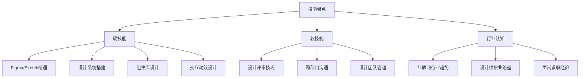
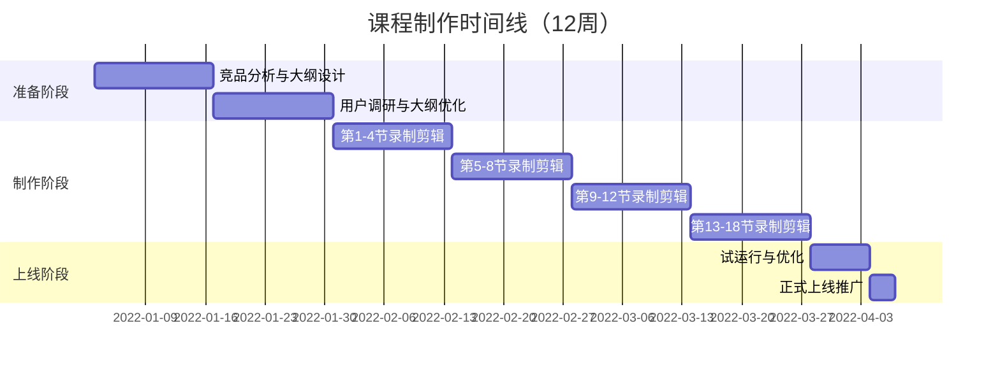
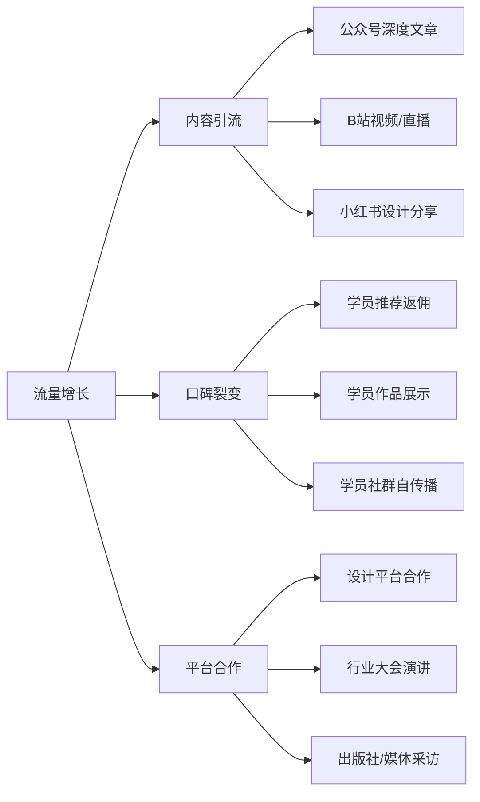
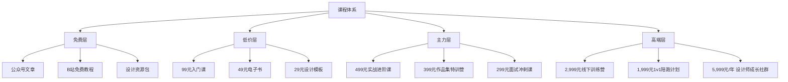
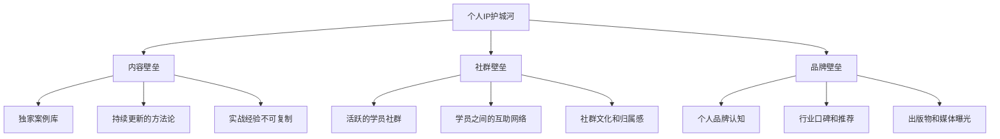
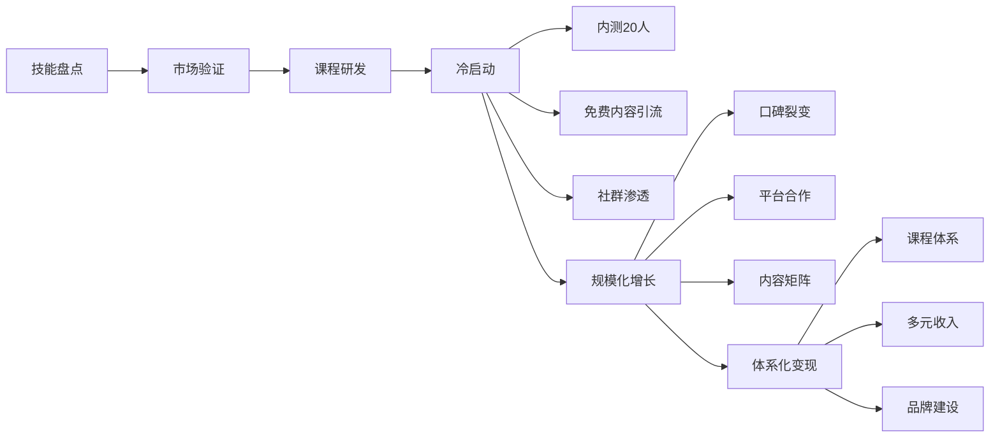

## 案例三：知识付费——从专业技能到课程收入

本案例完整记录一位资深设计师如何将十年积累的专业技能系统化为在线课程，从第一期无人问津到年收入突破80万的全过程。这不是"随便录个视频就能赚钱"的故事，而是一条从**技能识别→内容产品化→流量获取→口碑裂变→体系化变现**的完整路径，每个环节都有可验证的方法和数据支撑。

**阅读导航：** 如果你是第一次接触知识付费，建议从头到尾按顺序阅读；如果你已经有课程产品，可以直接跳到第二阶段（冷启动）或第三阶段（增长与优化）查找具体策略。文末的"可复制的方法论总结"提供了完整的操作清单，适合打印出来作为行动参考。

---

### 案例背景

#### 主人公画像

林瑶（化名），32岁，一线城市互联网公司资深UI设计师，从业10年，月薪22K。2022年初开始利用业余时间做知识付费副业，定位为"UI设计师的实战进阶课"。两年后，她的课程体系年收入突破80万，建立了稳定的个人品牌和付费学员社群。

| 维度 | 详情 |
|------|------|
| 年龄/职业 | 32岁，互联网公司UI设计组长，管理5人设计团队 |
| 专业积累 | 10年设计经验，带过20+完整项目，服务过3个千万级用户产品 |
| 启动资金 | 约5,000元（录屏软件+麦克风+课程平台年费） |
| 每日可用时间 | 工作日1-2小时（晚间），周末全天 |
| 教学经验 | 零基础，从未做过付费课程，仅在公司内部做过几次分享 |
| 目标 | 用一年时间建立稳定的副业收入流，实现"睡后收入" |

#### 不同背景创作者的适用路径

林瑶是设计师背景，但知识付费的底层逻辑适用于任何专业领域。不同背景的创作者需要调整策略重点：

| 创作者类型 | 典型专业 | 适合的课程形式 | 核心优势 | 需要补强的能力 |
|-----------|---------|--------------|---------|--------------|
| 技术从业者 | 程序员、架构师 | 录屏实操课+代码仓库 | 技术深度、真实项目经验 | 表达能力、课程结构设计 |
| 设计从业者 | UI/视觉/交互设计 | 作品拆解+录屏演示 | 视觉呈现力强、案例丰富 | 教学方法论、用户调研 |
| 运营/营销 | 产品运营、增长 | 案例分析+方法论课 | 数据敏感、实战经验丰富 | 内容系统化、视频制作 |
| 管理层 | 总监、VP | 训练营+1v1陪跑 | 行业视野、人脉资源 | 内容下沉（把高层经验讲给基层听） |
| 自由职业 | 咨询师、教练 | 直播互动课+社群 | 灵活、客户接触多 | 规模化能力、课程产品化 |

#### 为什么选择知识付费而非其他副业

林瑶在选择副业方向时，系统评估了多种可能性：

| 副业方向 | 优势 | 劣势 | 林瑶的判断 |
|---------|------|------|-----------|
| 接私活做设计 | 直接变现，单价高 | 做一单赚一单，无复利；占用大量时间 | ❌ 和本职工作高度重叠，容易疲劳 |
| 卖设计素材/模板 | 制作一次反复卖 | 市场饱和，单价低，容易被盗版 | ⚠️ 可作为补充，但天花板低 |
| 做设计自媒体 | 积累粉丝后可多元变现 | 需要持续更新，涨粉周期长 | ⚠️ 长期方向，但短期不产生收入 |
| **做付费课程** | **制作一次反复销售，边际成本趋零；建立专业壁垒；反哺本职工作** | **前期投入大，需要系统化能力** | **✅ 最符合"复利"逻辑** |

林瑶选择知识付费的核心逻辑：**课程是"时间的杠杆"——一次投入，无限次出售，且单价远高于单次咨询或素材销售。**

**知识付费的经济学本质：**

```text
传统副业（接私活）：
  收入 = 单价 × 工作时间
  瓶颈：你的时间是有限的，一天最多24小时

知识付费（课程）：
  收入 = 单价 × 学员数量
  瓶颈：几乎为零（边际成本趋零）
  
关键区别：传统副业是"卖时间"，知识付费是"卖成果的复制品"。
一旦课程制作完成，每多卖一份的额外成本几乎为零。
这就是为什么知识付费被称为"最接近睡后收入的副业形式"。
```

#### 技能盘点——找到你的"可教化知识"

很多人觉得自己"没什么可教的"，林瑶最初也有这种疑虑。她用了一个系统化的方法盘点自己的可教化知识：



**关键筛选标准（四维评估法）：**

| 评估维度 | 问题 | 筛选结果 |
|---------|------|---------|
| 市场需求 | 有人愿意为此付费学习吗？ | ✅ UI设计是热门职业，每年大量新人入行 |
| 专业深度 | 我比大多数人懂得更深吗？ | ✅ 10年经验+大厂背景，超过90%的从业者 |
| 可教化程度 | 这个技能能被系统化为课程吗？ | ✅ 设计是可拆解、可演示、可练习的 |
| 竞争格局 | 市场上已有课程质量如何？ | ✅ 大量课程偏理论，实战派课程稀缺 |

**四维评估的打分方法：**

对每个维度打1-5分，总分≥16分的技能方向值得深入探索：

```text
评估示例——林瑶的UI设计实战课：
  市场需求：5分（UI设计师每年新增数十万人，学习需求旺盛）
  专业深度：5分（10年大厂经验，带过多个千万级产品）
  可教化程度：4分（设计可拆解演示，但软技能部分需要更多案例支撑）
  竞争格局：4分（基础课红海，但实战进阶课蓝海）
  总分：18分 → 强烈值得投入
```

最终定位：**面向1-3年经验UI设计师的实战进阶课**——不教软件操作（那是基础课的领域），而是教**设计思维、项目实战、团队协作和职业晋升**，这些是新手设计师最焦虑、最难自学、最愿意付费的内容。

---

### 第一阶段：课程研发（第1-3个月）

#### 课程定位与差异化策略

市场上UI设计课程已经很多，林瑶必须找到差异化切入点。她做了大量竞品分析：

**竞品分析维度：**

| 分析维度 | 方法 | 发现 |
|---------|------|------|
| 课程内容 | 购买并学习了5个竞品课程 | 80%的课程在教软件操作，缺乏真实项目经验分享 |
| 用户评价 | 深入分析竞品课程的差评 | 最常见的抱怨："学完还是不会做项目""太理论化" |
| 价格区间 | 统计主流平台同类课程定价 | 基础课99-199元，进阶课299-699元，训练营1999-4999元 |
| 目标人群 | 分析竞品课程的学员画像 | 学员以转行新手和初级设计师为主，1-3年经验的进阶课程缺口大 |

**竞品分析的实操模板：**

```text
竞品分析工作表（每个竞品填写一份）：
┌─────────────────────────────────────────────────┐
│ 课程名称：__________________________            │
│ 讲师背景：__________________________            │
│ 平台：____________________________              │
│ 价格：______元  预估销量：______份/月           │
│ 课程时长：______小时  章节数：______节          │
├─────────────────────────────────────────────────┤
│ 内容覆盖（1-5分）：                             │
│   理论深度：__  实操性：__  案例质量：__        │
│   更新频率：__  配套资料：__  互动性：__        │
├─────────────────────────────────────────────────┤
│ 用户评价关键词（好评）：____________________    │
│ 用户评价关键词（差评）：____________________    │
├─────────────────────────────────────────────────┤
│ 我的差异化机会：______________________________  │
│ 我可以做得更好的点：__________________________  │
└─────────────────────────────────────────────────┘
```

**差异化定位：**

```text
市面上的课程：
  "UI设计零基础入门" ← 太基础
  "Figma从入门到精通" ← 太工具化
  "设计理论大全"     ← 太学术化

林瑶的定位：
  "从执行者到设计负责人——1-3年UI设计师的实战进阶手册"
  
核心差异化：
  ① 所有案例来自真实项目（脱敏处理）
  ② 每节课都有可提交的实战作业
  ③ 提供设计评审和职业规划的1v1答疑
  ④ 包含"向上管理""跨部门沟通"等软技能
```

#### 课程验证——在投入制作前确认需求真实性

很多知识付费新手犯的最大错误是**花了3个月做课程，上线后发现没人买**。林瑶在正式投入制作之前，用了一套"最小可行课程"（MVP）验证法，在1-2周内确认需求真实性。

**验证方法一：预售测试**

在课程大纲确定后，林瑶没有立即开始录制，而是在公众号发布了一篇课程介绍文章，附上课程大纲和价格，开放"早鸟预订"：

| 验证指标 | 目标值 | 林瑶的实际值 | 判断 |
|---------|--------|------------|------|
| 文章阅读量 | > 2,000 | 4,500 | ✅ 话题有关注度 |
| 早鸟预订人数 | > 30人 | 67人 | ✅ 付费意愿强 |
| 预订转化率 | > 3% | 5.2% | ✅ 定价合理 |
| 预订用户画像 | 1-3年设计师为主 | 78%为1-3年经验 | ✅ 目标人群精准 |

**验证方法二：试讲验证**

在设计师社群中做了一次免费的"试讲课"——把模块一第1节的内容用直播形式讲了一遍，观察三个指标：
- **留存率**：82%的人从头听到尾，说明内容吸引力强
- **互动频率**：平均每5分钟一个问题，说明话题有共鸣
- **主动询问**：直播结束后23人主动问"有没有付费课程"

**验证方法三：竞品销量估算**

通过平台公开数据估算竞品课程的月销量，确认市场容量：

| 估算方法 | 操作方式 | 适用场景 |
|---------|---------|---------|
| 评论数反推法 | 月销量 ≈ 月评论数 × 20-30（假设5%的人会评论） | 任何公开平台 |
| 社群人数反推法 | 月销量 ≈ 付费社群月增人数 × 1.5 | 有社群的课程 |
| 平台数据工具 | 新榜/西瓜数据等工具查看课程销量排名 | 主流知识付费平台 |
| 竞品访谈法 | 直接联系竞品创作者交流（同行间信息交换） | 圈内人脉充足时 |

**验证方法四：最小可行产品测试**

除了预售和试讲，林瑶还用了一个更轻量的验证方式——先做一个"迷你课程"（3节短视频，售价19.9元），测试完整的"内容→支付→学习→反馈"链路：

```text
迷你课程验证的好处：
  ① 测试支付流程是否顺畅（技术验证）
  ② 测试学员的付费意愿（市场验证）
  ③ 收集真实的学习反馈（产品验证）
  ④ 积累第一批种子用户（运营验证）
  ⑤ 即使失败，损失也极小（风险控制）

林瑶的迷你课程数据：
  制作时间：3天（3节×15分钟）
  定价：19.9元
  销量：首周47份
  完课率：78%（远高于行业平均的15-25%）
  好评率：91%
  关键反馈："案例真实""希望有更多进阶内容" → 验证了进阶课的需求
```

**验证的关键原则：**

```text
❌ 错误路径：想到课程 → 花3个月制作 → 上线推广 → 发现没人买 → 损失3-6个月
✅ 正确路径：想到课程 → 验证需求（1-2周） → 调整定位 → 制作 → 上线 → 损失最多1-2周

验证的本质：用最小的时间成本，回答"这个课有没有人愿意付钱"这个问题。
```

**验证失败时的调整策略：**

| 验证结果 | 可能原因 | 调整方向 |
|---------|---------|---------|
| 阅读量高但预订少 | 定价过高或价值感不足 | 降低价格、增加试看内容、强化成果承诺 |
| 预订人数够但画像不对 | 定位偏离目标人群 | 调整课程标题和宣传话术，重新定向 |
| 试讲留存率低 | 内容不够吸引或形式有问题 | 更换案例、调整讲解风格、缩短时长 |
| 竞品太强且销量大 | 红海市场，需更细分 | 切入更垂直的子领域（如"B端UI设计师进阶"） |

#### 课程大纲设计——用户需求驱动

林瑶没有凭自己的经验设计大纲，而是通过用户调研确定课程内容：

**需求调研三步法：**

**第一步：问卷调研（收集广度）**

在设计师社群（站酷、UI中国、即刻设计圈）发布问卷，回收了327份有效问卷。核心发现：

| 排名 | 学习需求 | 选择比例 | 痛点描述 |
|------|---------|---------|---------|
| 1 | 完整项目实战流程 | 78% | "不知道一个项目从接到需求到交付的完整流程" |
| 2 | 设计评审与提案 | 65% | "方案经常被推翻，不知道怎么说服产品和开发" |
| 3 | 设计系统搭建 | 58% | "想做组件库但不知道从何下手" |
| 4 | 作品集优化 | 52% | "作品集投出去没有回音" |
| 5 | 设计师晋升路径 | 48% | "做了3年还是执行岗，不知道怎么往上走" |

**第二步：深度访谈（挖掘深度）**

找了15位目标用户做30分钟电话访谈，挖掘出更深层的需求：

- "我缺的不是软件技巧，而是独立把控项目的能力"
- "每次和产品经理吵架都吵不赢，设计话语权太低"
- "看到大厂设计师的作品觉得差距很大，但不知道差在哪里"
- "想跳槽但不知道自己在市场上值多少钱"

**第三步：社群观察（验证需求）**

在设计师微信群潜水一个月，记录高频问题和讨论话题，发现"设计评审"和"跨部门沟通"是被讨论最多但现有课程最少覆盖的话题。

**调研问卷设计模板（可复用）：**

```text
知识付费需求调研问卷（通用模板）：

1. 你的职业/身份是？（单选）
   □ 在校学生  □ 转行新手（<1年）  □ 初级从业者（1-3年）
   □ 中级从业者（3-5年）  □ 高级从业者（5年+）  □ 管理层

2. 你在[领域]中最想提升的能力是什么？（多选，最多3项）
   [列出该领域的核心技能方向]

3. 你目前学习[领域]知识的主要方式是？（多选）
   □ 免费文章/视频  □ 付费课程  □ 社群交流
   □ 书籍  □ 实践摸索  □ 请教前辈

4. 你为学习[领域]知识付费过多少？（单选）
   □ 从未付费  □ 100元以内  □ 100-500元  □ 500-2000元  □ 2000元+

5. 你最希望课程包含哪些内容？（排序题，拖拽排序）
   [根据调研发现列出选项]

6. 你愿意为一门系统课程支付多少钱？（单选）
   □ 99元以内  □ 100-299元  □ 300-499元  □ 500-999元  □ 1000元+

7. 你对现有[领域]课程最不满意的地方是什么？（开放题）

8. 如果有一门课能解决你最大的痛点，你最希望学完后能做到什么？（开放题）
```

#### 课程大纲（最终版本）

```text
模块一：设计思维升级（4节课）
  ├── 1.1 从"做图的"到"解决问题的设计师"
  ├── 1.2 需求分析：如何把模糊需求转化为设计目标
  ├── 1.3 设计决策：用数据和逻辑支撑你的方案
  └── 1.4 用户心理：设计背后的行为经济学

模块二：项目实战全流程（6节课）
  ├── 2.1 接到需求后的第一步：信息收集与竞品分析
  ├── 2.2 从线框图到高保真：设计推进的节奏感
  ├── 2.3 设计评审：如何让产品和开发"听你的"
  ├── 2.4 开发走查：像素级还原的沟通技巧
  ├── 2.5 数据验证：用A/B测试证明设计价值
  └── 2.6 项目复盘：如何把每个项目变成作品集素材

模块三：设计系统与效率（4节课）
  ├── 3.1 设计系统入门：从零搭建组件库
  ├── 3.2 Design Token：设计与开发的协作桥梁
  ├── 3.3 Figma高级技巧：自动布局、变量、变体
  └── 3.4 设计规范文档：让你的设计可传承

模块四：职业发展与软技能（4节课）
  ├── 4.1 作品集优化：让HR和设计总监眼前一亮
  ├── 4.2 设计师的向上管理：如何与领导高效沟通
  ├── 4.3 跨部门协作：产品、开发、运营的设计话语权
  └── 4.4 从P5到P7：设计师的晋升路线图
```

#### 课程制作流程——从大纲到成品

林瑶的课程制作完全利用业余时间，以下是她的制作SOP：



**每节课的制作标准：**

| 环节 | 标准 | 工具 |
|------|------|------|
| 写逐字稿 | 每节课3,000-5,000字逐字稿，控制在15-25分钟 | Notion |
| 录屏演示 | 1080p屏幕录制+人声讲解，展示真实Figma操作 | OBS + Figma |
| 视频剪辑 | 去掉口误和冗余停顿，添加字幕和重点标注 | 剪映 |
| 配套资料 | 每节课提供课件PDF+练习素材+Figma源文件 | Figma导出 |
| 质量检查 | 自己回看一遍，检查语速、画质、逻辑连贯性 | - |

**林瑶的时间分配：**
- 工作日：每天晚上10:00-11:30写逐字稿（约1.5小时）
- 周六：下午集中录制2-3节课程（约4-5小时）
- 周日：上午剪辑+配字幕，下午准备下周的逐字稿（约5小时）
- 每周总投入：约12小时，12周累计约144小时

**关键经验：不要追求完美，先完成再完美。**

林瑶第一节课录了5遍，总觉得语速不对、表达不够好。后来她意识到，**完成比完美重要100倍**。她把录制标准调整为"一遍过"——允许口误，后期剪掉就行。这个调整让她的制作效率提升了3倍。

#### 课程制作的音视频质量标准

课程的音视频质量直接影响学员的学习体验和完课率。很多创作者忽视技术细节，导致学员"看不下去"：

**音频质量（比视频更重要）：**

| 要素 | 标准 | 常见问题 | 解决方案 |
|------|------|---------|---------|
| 采样率 | 44.1kHz或48kHz | 手机录音采样率低 | 使用专业麦克风+声卡 |
| 信噪比 | > 60dB | 环境噪音、电流声 | 录音时关闭空调/风扇，使用防喷罩 |
| 响度 | -16 LUFS（YouTube标准） | 声音忽大忽小 | 后期用AU/达芬奇做响度标准化 |
| 语速 | 180-220字/分钟 | 太快听不清，太慢犯困 | 录制时看提词器，保持稳定节奏 |
| 停顿 | 每30秒自然停顿1-2秒 | 连续说5分钟不喘气 | 在知识点之间刻意停顿，给消化时间 |

**视频质量：**

| 要素 | 标准 | 推荐方案 |
|------|------|---------|
| 分辨率 | 1080p（1920×1080） | OBS录制+剪映导出 |
| 帧率 | 30fps（录屏课程） | 60fps适合动效演示 |
| 码率 | 8-12 Mbps | 低于8Mbps文字模糊 |
| 字幕 | 每节课必须有字幕 | 剪映AI自动识别+人工校对 |
| 画面构图 | 录屏区域占80%+人像小窗20% | OBS多场景切换 |

**林瑶的"质量自检清单"（每节课发布前必须通过）：**

```text
□ 音频检查：全程无爆音、无电流声、音量稳定
□ 画面检查：文字清晰可读、鼠标指针可见、操作流畅
□ 字幕检查：无错字、时间轴对齐、字体大小适中
□ 内容检查：逻辑连贯、无明显口误、知识点完整
□ 配套资料：课件PDF+练习素材+源文件都已上传
□ 时长检查：10-20分钟（超过20分钟的必须拆分）
□ 试看检查：前3分钟是否能吸引非专业观众
```

#### 课程逐字稿的写作方法

逐字稿是课程质量的根基。很多创作者觉得"我懂这个话题，直接讲就行"，结果录制时逻辑混乱、遗漏重点、时间失控。林瑶的逐字稿写作方法值得借鉴：

**逐字稿结构模板：**

```text
一、开场（1-2分钟）
   ├── 钩子：用一个真实案例/数据/问题抓住注意力
   ├── 价值预告：本节课学完你能做到什么（不是"本节课讲什么"）
   └── 知识地图：本节课在整体课程中的位置

二、核心内容（10-18分钟）
   ├── 知识点1：概念解释 + 真实案例 + 操作演示
   │   └── 过渡句："理解了这个，我们来看怎么落地"
   ├── 知识点2：原理分析 + 对比表格 + 常见误区
   │   └── 过渡句："接下来是最关键的部分"
   └── 知识点3：综合案例 + 完整操作流程 + 边界情况

三、总结与作业（2-3分钟）
   ├── 3个核心要点回顾（不超过3个，多了记不住）
   ├── 课后作业（可提交、可评估、有明确标准）
   └── 下节课预告（制造期待感）
```

**逐字稿写作的五个原则：**

| 原则 | 错误示范 | 正确示范 |
|------|---------|---------|
| 口语化 | "本章节将阐述设计评审的核心要素" | "今天聊聊设计评审到底怎么才能不被怼" |
| 具体化 | "要注意色彩搭配" | "主色用品牌色，辅助色不超过2个，用coolors.co生成" |
| 节奏感 | 连续讲10分钟不停顿 | 每3-5分钟设一个"呼吸点"（小结或过渡） |
| 互动感 | "大家听我说" | "你有没有遇到过这种情况？" |
| 可验证 | "这样做效果更好" | "我用这个方法，方案通过率从40%提升到75%" |

---

### 第二阶段：冷启动与首批学员（第4-6个月）

#### 平台选择——不同平台的优劣对比

知识付费平台的选择直接影响流量获取、收入分成和用户体验：

| 平台 | 抽佣比例 | 流量来源 | 适合课程类型 | 林瑶的选择 |
|------|---------|---------|------------|-----------|
| 小鹅通 | 0%（年费制3,499-12,999元/年） | 自带流量为零，需自己引流 | 有私域流量的创作者 | ✅ 主力平台 |
| 知识星球 | 5% | 平台内有一定曝光 | 社群+图文内容 | ✅ 社群运营 |
| 荔枝微课 | 10% | 平台内有推荐流量 | 音频课/轻课程 | ❌ 不适合录屏课程 |
| 腾讯课堂 | 10%-30% | 腾讯系流量大 | 系统课程 | ⚠️ 备选渠道 |
| B站付费课 | 30% | B站站内流量 | 年轻用户群体 | ⚠️ 后期考虑 |
| 自建网站 | 0% | 完全依赖自己引流 | 高客单价课程 | ❌ 维护成本高 |

**平台选择的决策框架：**

```text
选择平台前必须回答的5个问题：

① 我有私域流量吗？
   有 → 小鹅通/自建平台（省佣金）
   没有 → 选择有平台流量的（腾讯课堂/B站）

② 我的课程是什么形式？
   视频录播 → 小鹅通/腾讯课堂
   音频 → 荔枝微课/喜马拉雅
   图文+社群 → 知识星球

③ 我的目标用户活跃在哪个平台？
   设计师 → 站酷/优设 + 小鹅通
   程序员 → 掘金/SegmentFault + 小鹅通
   职场人 → 公众号/知乎 + 小鹅通

④ 我愿意投入多少运营精力？
   精力有限 → 选平台抽佣模式（省心）
   精力充足 → 选年费模式（长期成本更低）

⑤ 我的课程客单价是多少？
   低价（<200元）→ 平台抽佣更划算
   高价（>500元）→ 年费模式更划算
```

**林瑶的平台组合策略：**
- **小鹅通**：课程主阵地，承载视频课程、作业提交、学员管理
- **知识星球**：付费社群，承载日常答疑、资料分享、学员交流
- **公众号**：免费内容输出，用于引流和信任建设

#### 定价策略——心理学与市场验证

课程定价不是拍脑袋决定的，林瑶用了系统化的定价方法：

**定价调研：**

| 定价区间 | 市场接受度 | 预估转化率 | 单月预期收入（按1,000曝光计算） |
|---------|-----------|-----------|------------------------------|
| 99元 | 高 | 3%-5% | 2,970-4,950元 |
| 199元 | 中高 | 2%-3% | 3,980-5,970元 |
| 399元 | 中 | 1%-2% | 3,990-7,980元 |
| 699元 | 中低 | 0.5%-1% | 3,495-6,990元 |
| 999元+ | 低 | 0.3%-0.5% | 2,997-4,995元 |

**定价的心理学原理：**

```text
① 锚定效应：先展示高价套餐，再展示中低价套餐
   → 499元看起来"合理"是因为有999元做锚点

② 价格尾数：99比100感觉便宜很多（左位效应）
   → 所有定价都用"X99"格式

③ 三选一法则：提供3个选项，大多数人会选中间那个
   → 99元/299元/699元的组合中，299元销量最大

④ 损失框架：强调"不学的损失"而不是"学了的收益"
   → "你还在用3年前的方法做设计吗？"比"学完升职加薪"更有效

⑤ 社会认同：展示"已有XXX人购买"
   → 当购买人数超过100时，转化率会明显提升
```

**林瑶最终选择的定价结构：**

```text
入门套餐：99元（模块一：设计思维升级，4节课）
进阶套餐：299元（模块一+模块二，10节课）
全套课程：499元（全部18节课 + 配套资料）
VIP套餐：999元（全套课程 + 3次1v1视频答疑 + 年度社群会员）
```

**阶梯定价的逻辑：**
1. **99元入门款**：降低决策门槛，让学员先"尝鲜"，建立信任
2. **299元主力款**：覆盖核心内容，是销售量最大的套餐
3. **499元完整款**：适合认真学习的学员，提供完整价值
4. **999元VIP款**：高净值服务，筛选出最认真的学员

**关键发现：** 499元的全套课程和999元的VIP套餐加起来贡献了总收入的65%以上。这说明**愿意认真学习的人更愿意为完整体验付费**，不要低估用户的付费意愿。

#### 冷启动的五个关键动作

**动作一：种子用户招募（第1个月）**

林瑶没有一上来就大规模推广，而是先招募20个"内测学员"：

- **来源**：自己的朋友圈设计师朋友、设计师社群中活跃的成员
- **价格**：免费，但要求每节课后提交500字反馈
- **目的**：验证课程内容、发现设计缺陷、收集真实评价

**内测反馈的关键发现：**
1. 模块二的"项目实战"最受欢迎，需要增加真实案例
2. 模块三的"设计系统"内容偏难，需要补充基础概念
3. 学员希望有作业点评环节，而不是只看视频
4. 15分钟太短，部分复杂话题需要20-25分钟

**动作二：公众号内容引流（持续进行）**

林瑶开通了公众号"设计师林瑶"，每周发布2篇免费干货文章：

| 内容类型 | 目的 | 发布频率 | 效果 |
|---------|------|---------|------|
| 设计技巧分享 | 展示专业能力 | 每周一 | 平均阅读2,000-5,000 |
| 项目复盘案例 | 建立实战派人设 | 每周四 | 平均阅读3,000-8,000 |
| 行业观点分析 | 提升专业深度 | 月度 | 平均阅读5,000-15,000 |
| 学员成长故事 | 社会证明 | 月度 | 转化率最高 |

**关键文章策略——"免费给80%，收费给最后20%"：**

例如，免费文章《如何做好一次设计评审》讲了核心框架和3个通用技巧，文末提到"更详细的5个实战案例+评审话术模板+常见反驳应对策略，我在课程模块二第3节中有完整讲解"。这种"给足价值、自然引流"的方式，转化率远高于硬广。

**内容引流的漏斗设计：**

```text
第一层：免费内容（公众号/B站/小红书）
  目标：吸引关注，建立专业形象
  指标：阅读量、关注量、互动率

第二层：深度内容（长文/系列视频/直播）
  目标：建立信任，展示深度
  指标：完读率、收藏率、分享率

第三层：引导行动（文末CTA/评论区引导）
  目标：引流到课程页面
  指标：点击率、加微信率

第四层：转化（课程页面/试看/限时优惠）
  目标：完成购买
  指标：转化率、客单价
```

**动作三：设计师社群渗透（第1-2个月）**

林瑶加入了15+个设计师微信群和QQ群，在以下场景中自然地建立影响力：

1. **回答新人问题**：在群里耐心解答设计相关问题，展示专业能力
2. **分享设计资源**：定期分享Figma插件、设计灵感、行业报告等免费资源
3. **参与话题讨论**：在热门话题中输出有深度的观点
4. **不硬推课程**：只在被问到"你有课程吗"时才自然地介绍

**社群渗透的注意事项：**

```text
❌ 错误做法：
  - 一进群就发课程广告
  - 每天在群里刷存在感但没有实质内容
  - 只回答和自己课程相关的问题
  - 用小号自问自答推荐自己的课程

✅ 正确做法：
  - 先贡献价值（解答问题、分享资源），建立信任
  - 让别人主动问"你是做什么的"
  - 在个人签名/朋友圈自然展示专业背景
  - 用真实案例和数据说话，不用自夸
```

**动作四：免费公开课引流（第2-3个月）**

林瑶在B站做了3次免费直播公开课，主题分别是：
- 《UI设计师如何用数据驱动设计决策》（观看1,200人）
- 《一个完整项目的设计复盘：从需求到上线》（观看2,500人）
- 《2022年UI设计师求职市场分析》（观看3,800人）

每次公开课的最后15分钟会提到付费课程，转化率约2%-3%（即100个观看者中有2-3人购买）。

**公开课的结构设计：**

```text
公开课时间分配（以60分钟为例）：

0-5分钟：开场暖场
  - 自我介绍（简短，突出相关经验）
  - 今日主题预告+价值承诺
  - 互动：让观众在弹幕里说说自己的痛点

5-40分钟：干货内容（核心价值）
  - 每10分钟一个小的知识点，配有真实案例
  - 穿插互动：投票、提问、弹幕讨论
  - 关键：这部分要"给到80%"，让观众觉得"免费都这么好，付费课得多好"

40-50分钟：案例深度拆解
  - 用一个完整案例串联前面的知识点
  - 展示"从问题到解决"的完整过程
  - 这里自然引出"课程里有更详细的讲解"

50-55分钟：Q&A
  - 回答弹幕里的问题
  - 筛选和课程相关的问题重点回答

55-60分钟：课程介绍+行动号召
  - 不是硬推，而是"如果你觉得今天的内容有价值，课程里有更系统的讲解"
  - 提供限时优惠码（仅直播间有效，24小时内有效）
  - 展示课程大纲和学员评价
```

**动作五：早期学员口碑建设（第3-6个月）**

林瑶极度重视第一批付费学员的体验，因为她知道口碑是知识付费最重要的增长引擎：

- **每份作业都亲自点评**：20个内测学员+首批50个付费学员的作业，她每份都写500字以上的详细反馈
- **建立"学习打卡"机制**：在知识星球设置每日打卡，完成学习任务可获得积分兑换1v1答疑
- **主动收集学员故事**：邀请学完课程后有成长的学员写成长故事，作为案例素材
- **超预期交付**：课程承诺18节课，实际每期都会额外赠送2-3节更新内容

---

### 第三阶段：增长与优化（第7-12个月）

#### 流量增长的三条主线



**主线一：内容引流矩阵**

| 平台 | 内容形式 | 更新频率 | 粉丝增长 | 引流效果 |
|------|---------|---------|---------|---------|
| 公众号 | 深度长文 | 每周2篇 | 8个月达1.2万 | 每月引流200-300人到课程页面 |
| B站 | 设计教程视频+直播 | 每周1个视频+月度直播 | 8个月达2.5万 | 每月引流150-200人 |
| 小红书 | 设计灵感/技巧卡片 | 每周3-5张 | 8个月达1.8万 | 每月引流100-150人 |
| 即刻 | 日常碎片思考 | 每天1-2条 | 8个月达5,000 | 间接引流，主要价值是人脉 |

**各平台内容策略详解：**

```text
公众号（核心阵地）：
  内容类型：2000-5000字深度长文
  发布节奏：每周二、四晚8点
  引流方式：文末课程卡片+评论区置顶链接
  关键指标：完读率>30%，收藏率>5%
  林瑶的爆款公式：真实案例 + 数据支撑 + 可执行方法 + 课程自然引出

B站（视频引流）：
  内容类型：10-15分钟教程视频 + 月度1小时直播
  发布节奏：每周三晚7点
  引流方式：视频简介+置顶评论+直播口播
  关键指标：完播率>40%，三连率>5%
  林瑶的爆款公式：痛点标题 + 快速进入主题 + 屏幕录制演示 + 总结模板

小红书（视觉引流）：
  内容类型：9宫格图片/短视频，强视觉冲击
  发布节奏：每周3-5条
  引流方式：个人简介+评论区引导
  关键指标：收藏率>10%，互动率>5%
  林瑶的爆款公式：前后对比图 + 简洁文字 + 实用技巧 + "评论区领取资料"
```

**主线二：口碑裂变机制**

林瑶设计了一套学员推荐返佣系统：

```text
推荐机制设计：
├── 推荐人奖励：成功推荐1人购买全套课程，返现50元
├── 被推荐人优惠：通过推荐链接购买，享受9折优惠
├── 双赢设计：双方都有收益，推荐动力更强
└── 追踪方式：小鹅通自带的分销系统，自动生成专属链接

裂变数据（第7-12个月）：
├── 月均推荐新学员：15-25人
├── 推荐转化率：约8%（比自然流量的3%高2.5倍）
├── 推荐来源：60%来自学员自发分享，40%来自返佣激励
└── 最高单月推荐：一位学员推荐了11人（她是一家中型公司的设计主管，推荐了整个团队）
```

**裂变机制的设计要点：**

| 要点 | 说明 | 林瑶的做法 |
|------|------|-----------|
| 双向激励 | 推荐人和被推荐人都有好处 | 推荐人返50元，被推荐人9折 |
| 即时反馈 | 推荐成功后立即通知 | 小鹅通自动推送+林瑶私信感谢 |
| 阶梯奖励 | 推荐越多奖励越高 | 推荐3人额外奖励100元，推荐5人奖励免费1v1 |
| 社交货币 | 让推荐行为本身有价值 | 推荐人获得"学习大使"标识 |
| 降低门槛 | 让推荐变得简单 | 一键生成专属海报+链接 |

**主线三：平台合作与背书**

| 合作形式 | 具体内容 | 效果 |
|---------|---------|------|
| 站酷推荐 | 在站酷发布3篇高质量作品+教程，申请"推荐设计师" | 获得站酷首页推荐，单日引流500+ |
| 优设网专栏 | 开设"UI进阶"专栏，每月投稿2篇 | 稳定引流渠道，月均100人 |
| 设计行业大会 | 受邀在2个线上设计峰会做15分钟闪电演讲 | 单次演讲引流300+，且有行业背书 |
| 出版社合作 | 与电子工业出版社签约出版《UI设计师实战手册》 | 书籍成为课程最大的信任背书 |

#### 课程迭代——数据驱动优化

林瑶每月做一次课程数据复盘，重点分析以下指标：

| 指标 | 含义 | 健康值 | 林瑶的数据 |
|------|------|--------|-----------|
| 完课率 | 购买后实际学完所有课程的比例 | > 40% | 52% |
| 作业提交率 | 学员提交作业的比例 | > 20% | 35% |
| NPS（净推荐值） | 学员愿意推荐课程的比例 | > 50 | 72 |
| 退款率 | 购买后申请退款的比例 | < 5% | 2.3% |
| 复购率 | 购买低价套餐后升级高价套餐的比例 | > 15% | 28% |

**课程迭代的具体动作：**

1. **每月更新1-2节课**：根据行业变化和学员反馈，新增或替换部分课程内容
2. **优化低完课率章节**：模块三"设计系统"的完课率只有35%，林瑶将25分钟的长视频拆分为3个8-10分钟的短视频，完课率提升到58%
3. **增加互动元素**：在每节课中加入"思考题"弹窗，强制暂停思考，提升学习效果
4. **建立"学员案例库"**：将优秀学员的作业和成长故事整理为案例库，新学员看到后信心大增

#### 收入增长曲线

| 阶段 | 时间 | 月收入 | 累计学员 | 关键动作 |
|------|------|--------|---------|---------|
| 内测期 | 第4月 | 2,800元 | 20人 | 内测招募，免费+付费混合 |
| 首发期 | 第5月 | 8,500元 | 65人 | 公开发售，公众号+B站引流 |
| 爬坡期 | 第6月 | 15,000元 | 130人 | 口碑启动，推荐返佣上线 |
| 增长期 | 第7月 | 22,000元 | 210人 | B站直播公开课带来爆发 |
| 稳定期 | 第8月 | 28,000元 | 300人 | 平台合作+站酷推荐 |
| 加速期 | 第9月 | 35,000元 | 400人 | 书籍出版带来品牌背书 |
| 突破期 | 第10月 | 45,000元 | 520人 | VIP套餐销量占比提升 |
| 成熟期 | 第11月 | 52,000元 | 650人 | 企业团购开始出现 |
| 巅峰期 | 第12月 | 60,000元 | 800人 | 年度总结活动+新课程预售 |

---

### 第四阶段：体系化变现（第13-24个月）

#### 从单一课程到课程体系

第一年只有1门课程，第二年林瑶开始构建课程体系：



**课程体系的设计逻辑——漏斗模型：**

```text
免费内容（公众号+B站+小红书）
    ↓ 建立信任，吸引关注
低价产品（99元入门课/49元电子书）
    ↓ 筛选付费意愿，建立第一次交易
主力课程（499元实战进阶课）
    ↓ 核心价值交付，建立口碑
高端服务（训练营/1v1陪跑/年度社群）
    ↓ 深度服务，高客单价变现
```

**课程体系的扩展顺序：**

```text
第一年：1门核心课程
  → 专注打磨，建立口碑
  → 收集学员反馈，发现新需求

第二年上半年：+2门衍生课程
  → 从核心课程的"热门模块"中拆分独立课程
  → 林瑶从"项目实战"模块拆出了"作品集特训营"
  → 从"职业发展"模块拆出了"面试冲刺课"

第二年下半年：+高端服务
  → 线下训练营（每月1期，每期20人）
  → 1v1陪跑计划（每月限5人）
  → 年度社群会员（持续运营）

扩展原则：
  ① 新课程必须基于已有学员的真实需求（不是凭想象）
  ② 每门新课先做MVP验证，再投入完整制作
  ③ 新课和核心课形成"漏斗"关系，互相引流
  ④ 高端服务控制数量，保证质量
```

#### 多元收入结构（第二年月均）

| 收入来源 | 月均收入 | 占比 | 投入时间/月 | 边际成本 |
|---------|---------|------|-----------|---------|
| 实战进阶课（499元） | 25,000元 | 31% | 每月更新4小时 | 几乎为零 |
| 作品集特训营（399元） | 12,000元 | 15% | 每期8小时 | 低 |
| 面试冲刺课（299元） | 8,000元 | 10% | 每月更新2小时 | 几乎为零 |
| 入门课+电子书+模板 | 6,000元 | 7.5% | 自动化销售 | 零 |
| 线下训练营（2,999元） | 15,000元 | 19% | 每月1天 | 中等（场地费） |
| 1v1陪跑计划 | 8,000元 | 10% | 每月8小时 | 时间成本 |
| 年度社群会员 | 4,000元 | 5% | 每月4小时 | 低 |
| 分销合作（帮别人推课） | 2,000元 | 2.5% | 自动化 | 零 |
| **合计** | **80,000元** | **100%** | **约35小时/月** | - |

#### 单位经济学——知识付费的财务模型

理解单位经济学是判断课程是否"跑通"的关键：

```text
知识付费的核心财务指标：

① CAC（获客成本）= 推广总费用 ÷ 新增付费学员数
   林瑶的数据：月推广费用约3,000元（主要是内容制作时间的机会成本）
   月新增学员约80人
   CAC ≈ 37.5元/人

② LTV（学员生命周期价值）= 平均客单价 × 复购率 × 平均留存月数
   林瑶的数据：平均客单价380元，复购率28%，平均留存8个月
   LTV ≈ 380 × 1 + 380 × 0.28 × 0.3 ≈ 412元
   （含升级购买和续费的预期价值）

③ LTV/CAC比值 = 412 ÷ 37.5 ≈ 11
   健康值：> 3（即花1元获客能赚回3元以上）
   林瑶的11倍说明商业模式非常健康

④ 回本周期 = CAC ÷ 月均收入/学员数
   37.5 ÷ (80,000 ÷ 800) ≈ 0.38个月
   即每个新学员在12天内就能回本
```

**不同阶段的财务模型：**

| 阶段 | 月投入 | 月收入 | 盈亏 | 关键指标 |
|------|--------|--------|------|---------|
| 制作期（1-3月） | 5,000元（设备+平台） | 0元 | -5,000元/月 | 投入可控，损失可承受 |
| 冷启动（4-6月） | 3,000元+时间 | 2,800-15,000元 | 逐步转正 | 第6月实现盈亏平衡 |
| 增长期（7-12月） | 3,000元+时间 | 22,000-60,000元 | 大幅盈利 | 累计投入约4万，累计收入约30万 |
| 体系化（13-24月） | 8,000元（含助手） | 60,000-80,000元 | 净利润率>70% | 时间投入下降，收入上升 |

#### B2B企业培训——被忽视的高价值市场

当个人品牌建立后，企业培训是一个被很多知识付费创作者忽视的高价值变现渠道：

```text
B2B企业培训的定价逻辑：

个人课程：499元/人
企业团购：300元/人 × 20人起 = 6,000元/单
定制培训：5,000-20,000元/天（讲师上门）
年度企业会员：30,000-100,000元/年（不限人数观看）

林瑶的企业客户案例：
  - 某中型互联网公司：采购50个账号，用于新入职设计师培训，15,000元
  - 某设计培训机构：邀请林瑶做3天线下培训，15,000元
  - 某企业HR：为设计团队采购年度社群会员，12,000元

企业客户的价值：
  ① 单价高（是个人客户的10-50倍）
  ② 决策链短（通常是部门负责人或HR直接决定）
  ③ 续费率高（企业培训预算通常按年拨付）
  ④ 口碑效应强（一个企业客户可能带来多个企业客户）
```

**如何获取企业客户：**

| 渠道 | 方法 | 转化周期 |
|------|------|---------|
| 个人品牌吸引 | 企业HR通过公众号/B站找到你 | 被动，不可控 |
| 学员推荐 | 学员在公司内部推荐你的课程 | 3-6个月 |
| 主动BD | 联系目标企业的HR/培训部门 | 1-3个月 |
| 行业展会 | 参加人力资源/培训行业展会 | 6-12个月 |
| 平台合作 | 与企业培训平台（如云学堂）合作 | 1-2个月 |

#### 知识付费的四大变现模式深度解析

**模式一：录播课——"睡后收入"的核心**

| 维度 | 说明 |
|------|------|
| 核心优势 | 制作一次，无限次出售，边际成本趋零 |
| 适合人群 | 有系统化知识体系、善于表达的专家 |
| 定价区间 | 99-999元（取决于内容深度和品牌溢价） |
| 关键成功因素 | 内容质量、持续更新、口碑传播 |
| 天花板 | 单一课程的生命周期约2-3年，需要持续迭代或开发新课 |

**模式二：训练营——"高客单价+高完课率"**

| 维度 | 说明 |
|------|------|
| 核心优势 | 有开营/结营时间限制，学员有紧迫感，完课率高 |
| 适合人群 | 能够投入固定时间做直播+答疑的创作者 |
| 定价区间 | 999-5,999元 |
| 关键成功因素 | 社群运营能力、作业点评质量、学员互助氛围 |
| 天花板 | 受限于个人时间，每期招生人数有限 |

**训练营的运营SOP：**

```text
训练营标准流程（以21天为例）：

开营前3天：
  ├── 发送开营通知+学习手册
  ├── 建立学员微信群
  └── 发布预热内容（破冰活动）

第1周（认知建立）：
  ├── Day1：开营直播（60分钟）+自我介绍
  ├── Day2-3：录播课程学习（每天1节）
  ├── Day4：作业提交截止
  ├── Day5：作业点评直播（60分钟）
  └── Day6-7：复习+社群讨论

第2周（技能强化）：
  ├── Day8-10：录播课程学习（每天1节）
  ├── Day11：实战项目启动
  ├── Day12：中期答疑直播（60分钟）
  └── Day13-14：项目推进+社群互助

第3周（成果输出）：
  ├── Day15-17：项目完成+作品打磨
  ├── Day18：作品互评
  ├── Day19：结营直播+优秀作品展示
  ├── Day20：学习总结+证书发放
  └── Day21：续费/升级引导
```

**模式三：1v1咨询/陪跑——"最深度的服务"**

| 维度 | 说明 |
|------|------|
| 核心优势 | 个性化服务，客单价最高，学员满意度最高 |
| 适合人群 | 在某个领域有极深积累的专家 |
| 定价区间 | 500-2,000元/小时，或3,000-10,000元/月 |
| 关键成功因素 | 专业深度、沟通能力、时间管理 |
| 天花板 | 纯时间交换，规模化困难 |

**模式四：付费社群——"持续现金流"**

| 维度 | 说明 |
|------|------|
| 核心优势 | 年费制提供稳定现金流，社群本身产生内容和价值 |
| 适合人群 | 有一定粉丝基础、能持续输出的创作者 |
| 定价区间 | 199-999元/年 |
| 关键成功因素 | 持续活跃运营、成员互助文化、定期独家内容 |
| 天花板 | 社群维护需要持续投入精力，容易"死群" |

**付费社群的运营机制——林瑶的实操经验：**

```text
社群运营的"五个一"法则：

① 一个固定栏目：每周三晚8点"案例拆解"直播，持续产出独家内容
② 一个互动机制：每日打卡+积分系统，积分可兑换1v1答疑或课程优惠
③ 一个互助氛围：鼓励学员互相点评作业，形成"学习搭子"配对
④ 一个成长路径：设置"学员→优秀学员→助教→合作讲师"的晋升通道
⑤ 一个退出仪式：年度学员大会+结业证书+优秀学员榜单
```

**防止"死群"的七个关键动作：**

| 频率 | 动作 | 目的 |
|------|------|------|
| 每日 | 早安话题/行业资讯分享 | 保持社群活跃度 |
| 每周 | 固定时间直播/答疑 | 提供独家价值 |
| 每两周 | 学员作业互评活动 | 促进学员互动 |
| 每月 | 邀请行业嘉宾做分享 | 拓宽视野，增加新鲜感 |
| 每季度 | 社群满意度调研 | 收集反馈，及时调整 |
| 每半年 | 优秀学员评选+奖励 | 激励参与，制造话题 |
| 每年 | 年度大会+新课程发布 | 社群仪式感，续费节点 |

**社群收入的稳定性数据：**

林瑶的知识星球社群定价399元/年，第二年数据：
- 累计付费会员：650人
- 续费率：68%（行业平均约40%-50%）
- 月均活跃率：72%（月均至少发言1次的比例）
- 月均收入：约2.2万元（含新增+续费）
- 运营时间：每天30分钟+每周2小时直播+每月4小时嘉宾活动

**社群的"飞轮效应"：**

```text
优质内容 → 学员活跃 → 产出UGC（学员分享/作业/讨论）
    ↑                                      ↓
口碑传播 ← 新学员加入 ← 社群价值提升 ← UGC丰富社群内容
```

社群的核心价值不在于"老师单向输出"，而在于"成员之间的连接和互助"。当社群能够自我产生内容和价值时，维护成本会大幅降低，而社群吸引力会持续增强。

---

### 核心经验与方法论

#### 经验一：课程内容的"三七法则"

林瑶发现一个关键规律：**学员买的不是知识，而是"改变"。**

```text
错误理解：
  "我的课程有18节课，知识点覆盖全面"
  → 学员觉得"内容太多学不完"，完课率低

正确理解：
  "我的课程帮你从'执行者'变成'能独立负责项目的人'"
  → 学员清楚学完后会变成什么样，动力更强
```

**三七法则：30%理论+70%实战。**

| 内容类型 | 占比 | 目的 | 示例 |
|---------|------|------|------|
| 理论框架 | 30% | 建立认知模型 | "设计评审的本质是说服力博弈" |
| 实战案例 | 40% | 展示具体怎么做 | "我在XX项目中如何说服产品经理接受方案" |
| 动手练习 | 20% | 让学员自己做 | "用这个框架分析你手上的项目" |
| 反思复盘 | 10% | 巩固学习效果 | "回顾你的练习，总结3个收获" |

#### 经验二：从"卖课程"到"卖改变"

**传统知识付费的误区：**

```text
卖课程思维：
  "我有18节课，每节课15-20分钟，总时长5小时"
  → 课程是一堆视频的集合
  → 学员的衡量标准是"有没有看完"
```

**正确的知识付费思维：**

```text
卖改变思维：
  "学完这门课，你将能够独立负责一个完整的UI项目"
  → 课程是一个能力转化的过程
  → 学员的衡量标准是"我做到了什么"
```

林瑶的做法：
1. **在课程开头就明确"学完你会变成什么样"**，而不是"本课程包含什么内容"
2. **设计"里程碑作业"**：每个模块结束时有一个综合练习，学员完成后明显感到能力提升
3. **提供"学习路径图"**：让学员清楚自己在哪个阶段，下一步该做什么
4. **建立"成果展示墙"**：在社群中展示学员的优秀作品和成长故事

#### 经验三：信任建设的"三次接触法则"

林瑶发现，用户从"知道你"到"购买课程"平均需要3次有效接触：

```text
第一次接触：发现
  → 用户在某个平台看到你的免费内容
  → 心理状态："这个人好像挺专业的"

第二次接触：验证
  → 用户看到你的更多内容，或看到别人的推荐
  → 心理状态："这个人确实有实力，不是吹的"

第三次接触：决策
  → 用户看到课程介绍、价格、学员评价
  → 心理状态："这个课程能解决我的问题，价格也合理，试试看"
```

**对应策略：**
- **第一次接触**：在多个平台布局免费优质内容，扩大触达面
- **第二次接触**：通过系列内容（不是单篇）建立专业深度印象
- **第三次接触**：提供详细的课程介绍、学员评价、试看章节，降低决策门槛

**转化率优化的实操清单：**

```text
课程页面必须包含的元素（按重要性排序）：

① 成果承诺（不是内容清单）
   ❌ "本课程包含18节课"
   ✅ "学完后你将能独立负责完整的UI项目"

② 社会证明
   - 学员数量（"已有800+学员"）
   - 学员评价（截图，3-5条精选）
   - 学员成果（作品截图、升职/加薪故事）
   - 媒体背书（被XX平台推荐、XX媒体报道）

③ 试看章节
   - 免费开放1-2节课，让学员"先尝后买"
   - 试看课必须是最好的内容（不是最基础的）

④ 课程大纲
   - 每节课的标题+学习目标
   - 标注"必修"和"选修"

⑤ 讲师介绍
   - 相关经验（不是全部经历）
   - 代表作品/项目
   - 教学理念

⑥ 保障承诺
   - 退款政策（"7天无理由退款"）
   - 更新承诺（"持续更新"）
   - 服务承诺（"作业点评""社群答疑"）

⑦ 行动号召
   - 限时优惠（不是永远优惠）
   - 紧迫感（"本期仅限50人"）
   - 明确的购买按钮
```

#### 经验四：避免"知识付费的五大死亡陷阱"

**陷阱一：课程做完就不管了**

```text
错误做法：课程录制完成后就不再更新，学员反馈也不回应
正确做法：每月至少更新1-2节课，每季度做一次大规模优化
         课程是"活的产品"，不是"做完了就完了"
```

**陷阱二：只教"是什么"不教"怎么做"**

```text
错误做法："设计评审很重要，你需要做好充分准备"
正确做法："设计评审前的准备清单：
  ① 准备3套方案（不是1套）
  ② 每套方案有数据支撑
  ③ 预判对方可能的反对意见并准备回应
  ④ 提前与关键决策者做1v1沟通
  ⑤ 准备一个'退让方案'作为谈判筹码"
```

**陷阱三：定价过低**

```text
错误认知："便宜点买的人更多"
真实数据：林瑶将课程从299元涨到499元后，
  转化率只下降了15%，但客单价提升了67%，总收入反而增长了42%

原因：
  ① 低价给人"不值钱"的心理暗示
  ② 付了更多钱的学员更认真学习（沉没成本效应）
  ③ 高价课程的学员质量更高，口碑传播效果更好
```

**陷阱四：不做用户分层**

```text
错误做法：所有人推同一个课程同一个价格
正确做法：根据用户需求和支付能力设计阶梯产品
  → 刚入门的新人：99元入门课
  → 有一定基础的：499元进阶课
  → 想深度学习的：999元VIP套餐
  → 企业团队：定制化企业培训方案
```

**陷阱五：忽视"售后"和"学完"**

```text
错误做法：学员买了课就不管了，完课率低也无所谓
正确做法：
  ① 购买后24小时内发送欢迎消息和学习指南
  ② 每周发送学习提醒，推动学习进度
  ③ 设置完课奖励（完课证书、积分兑换、优秀学员评选）
  ④ 建立学员社群，让学员互相督促
  ⑤ 定期回访"买了没学"的学员，了解原因
```

**陷阱六：盲目追求学员数量而忽视学员质量**

```text
错误做法：用低价促销、免费送课等方式冲学员数量，导致社群充斥"薅羊毛"用户
真实教训：林瑶曾在某次促销中用"1元体验"吸引了200人，
  结果这批学员的完课率只有8%，作业提交率为0，还在社群中发广告

正确做法：
  ① 用价格筛选付费意愿，不要用超低价冲量
  ② 设置"入学门槛"（如填写申请表、完成前置作业）
  ③ 定期清理长期不活跃的社群成员
  ④ 宁可500个高质量学员，不要5000个"僵尸"学员
```

**陷阱七：忽视竞品监控和市场变化**

```text
错误做法：课程上线后就不再关注市场，直到发现销量下滑才反应
真实教训：2023年AI设计工具（Midjourney、DALL-E）爆发，
  林瑶的课程中"设计系统搭建"模块的相关性受到冲击，
  及时增加了"AI辅助设计"章节后才稳住销量

正确做法：
  ① 每月花2小时做竞品和市场扫描
  ② 关注行业KOL的动态和观点
  ③ 在学员社群中收集"你们最近在关注什么新工具/趋势"
  ④ 每季度至少更新1-2节课，保持课程的时效性
```

#### 知识付费的十大失败模式深度剖析

除了上述"陷阱"，知识付费还有更深层的失败模式值得警惕：

| 失败模式 | 表现 | 根本原因 | 应对策略 |
|---------|------|---------|---------|
| 定位模糊 | 什么都教，什么都不精 | 试图覆盖所有人，结果谁都吸引不了 | 聚焦一个细分人群的核心痛点 |
| 内容平庸 | 和免费内容没有本质区别 | 没有独特的实战经验或视角 | 找到你的"独家案例"和"独创方法论" |
| 只教不练 | 学员看完就忘，没有行为改变 | 课程设计缺乏练习和反馈环节 | 每节课配作业，建立点评机制 |
| 社群冷清 | 付费社群变成"广告群"或"死群" | 缺乏持续运营和互动机制 | 建立固定栏目+积分激励+助教体系 |
| 定价焦虑 | 反复调价，不敢涨价 | 对自身价值缺乏信心 | 用学员成果数据支撑定价 |
| 推广疲劳 | 每天发朋友圈，转化越来越低 | 过度营销消耗社交关系 | 用内容价值吸引而非硬推 |
| 抄袭竞品 | 大纲和内容与竞品高度雷同 | 没有找到自己的差异化定位 | 深挖自身独特经历和方法 |
| 忽视版权 | 课程被盗版后束手无策 | 没有提前做版权保护准备 | 水印+服务差异化+平台维权 |
| 现金流断裂 | 前期投入过大，收入迟迟不来 | 没有做好财务规划 | 先验证再投入，控制固定成本 |
| 倦怠放弃 | 做了3-6个月没看到回报就放弃 | 低估了知识付费的启动周期 | 设定合理预期，6-12个月为一个完整周期 |

---

### 工具清单与技术栈

林瑶在知识付费过程中使用的完整工具链：

| 用途 | 工具 | 费用 | 说明 |
|------|------|------|------|
| 课程制作-录屏 | OBS Studio | 免费 | 开源录屏软件，支持多场景切换 |
| 课程制作-剪辑 | 剪映专业版 | 免费 | 视频剪辑、字幕自动生成 |
| 课程制作-提词 | 提词大师 | 99元/年 | 录制时显示逐字稿，减少NG |
| 课程制作-设计 | Figma | 免费/付费 | 课程PPT、资料包设计 |
| 课程平台 | 小鹅通 | 3,499元/年 | 视频托管、学员管理、支付、分销 |
| 社群平台 | 知识星球 | 5%抽佣 | 付费社群、资料分享、答疑 |
| 公众号运营 | 微信公众号 | 免费 | 免费内容输出、课程引流 |
| 数据分析 | 小鹅通后台 | 含在年费中 | 学员数据、销售数据、渠道分析 |
| 设计素材 | Canva/创客贴 | 免费/基础版 | 公众号封面、课程宣传图 |
| 表单收集 | 腾讯问卷 | 免费 | 用户调研、报名表单 |
| 视频分发 | B站/小红书 | 免费 | 免费内容引流 |
| 财务记账 | 飞书多维表格 | 免费 | 收入支出记录、税务准备 |

#### AI时代知识付费的工具革命（2024-2026）

AI工具正在深刻改变知识付费的制作效率和交付方式。林瑶在2024年开始引入AI工具，将课程制作效率提升了约40%：

| 环节 | 传统方式 | AI辅助方式 | 效率提升 |
|------|---------|-----------|---------|
| 逐字稿撰写 | 纯手写，每节4-5小时 | AI辅助大纲+人工润色，每节2-3小时 | 约40% |
| 字幕生成 | 人工听写或剪映自动识别 | Whisper/通义听悟精准转写 | 约80% |
| 课件设计 | 手动排版PPT/Keynote | AI生成初稿+人工调整 | 约50% |
| 学员答疑 | 纯人工回复 | AI辅助生成常见问题回答模板 | 约60% |
| 课程摘要 | 手动整理每节课要点 | AI自动生成课程摘要和思维导图 | 约70% |
| 多语言字幕 | 人工翻译 | AI翻译+人工校对 | 约75% |

**林瑶推荐的AI辅助工具链：**

```text
内容创作层：
  ├── ChatGPT/Claude：课程大纲构思、案例改写、文案润色
  ├── 通义听悟：会议/直播内容自动转写和总结
  └── Notion AI：笔记整理、知识库管理

视频制作层：
  ├── Whisper：语音转字幕（准确率>95%）
  ├── 剪映AI：智能剪辑、自动卡点、AI配音
  ├── HeyGen/D-ID：数字人出镜（适合不愿露脸的创作者）
  └── Descript：视频文本编辑（改文字=改视频）

运营效率层：
  ├── Kimi/豆包：长文档分析、竞品课程拆解
  ├── AI客服机器人：7×24小时基础答疑
  └── 数据分析工具：学员行为数据自动分析
```

**AI不能替代的部分：**

```text
❌ AI无法替代：真实项目经验、行业洞察、个人故事、学员情感连接
❌ AI无法替代：作业点评中的个性化指导、职业规划的针对性建议
❌ AI无法替代：社群运营中的温度感和归属感

✅ AI擅长替代：重复性内容生产、格式化输出、数据整理、基础答疑

核心原则：用AI提升效率，但保持"人味"——学员付费的核心是"跟你学"，不是"跟AI学"
```

---

### 风险控制与常见误区

#### 风险一：知识产权被侵犯

**问题**：课程视频被录屏后在闲鱼、淘宝等平台低价转卖。

**应对措施：**
1. 课程视频中加入**不可去除的水印**（学员姓名+手机号后四位）
2. 定期在闲鱼、淘宝搜索课程名称，发现盗版立即举报
3. 在课程中加入**只有付费学员才能享受的互动服务**（作业点评、社群答疑），盗版者无法复制
4. 与平台签署版权保护协议，利用平台的维权机制

**林瑶的真实经历：** 她的课程上线3个月后在闲鱼出现了9.9元的盗版。她通过平台举报+律师函的方式处理了3起盗版事件，同时在课程中增加了更多"无法盗版的服务"（如1v1答疑、作业点评），让盗版的价值大打折扣。

**反盗版的三层防御体系：**

```text
第一层：技术防御
  ├── 视频水印（学员信息+随机码）
  ├── DRM加密（小鹅通等平台自带）
  ├── 防录屏技术（部分平台支持）
  └── 分段发布（不一次性放出全部课程）

第二层：服务防御（最有效）
  ├── 作业点评（盗版学员无法获得）
  ├── 社群答疑（需要验证购买凭证）
  ├── 1v1咨询（完全无法盗版）
  └── 持续更新（盗版永远滞后）

第三层：法律防御
  ├── 版权登记（课程内容+品牌名称）
  ├── 平台举报（闲鱼/淘宝/拼多多等）
  ├── 律师函警告（针对大规模盗版）
  └── 商标注册（保护课程品牌名）
```

#### 风险二：学员退款纠纷

**预防措施：**
1. 课程页面**清晰标注退款政策**（如"购买后7天内、学习进度不超过30%可退款"）
2. 提供**试看章节**，让学员在购买前就能判断课程质量
3. 对退款学员做**原因调研**，持续优化课程

**数据：** 林瑶的退款率长期保持在2.3%左右，远低于行业平均的5%-8%。

#### 风险三：收入波动与淡旺季

知识付费存在明显的淡旺季：
- **旺季**：年初（新年计划期）、金三银四（求职季）、年末（职业焦虑期）
- **淡季**：暑假（注意力分散）、长假期间

**应对策略：**
1. 旺季加大推广力度，做限时优惠活动
2. 淡季专注课程更新和内容积累
3. 多元化收入来源，避免过度依赖单一课程
4. 建立年费制社群，平滑收入波动

#### 风险四：税务合规

| 收入类型 | 税务处理 | 建议 |
|---------|---------|------|
| 课程销售收入 | 个人所得税-劳务报酬所得 | 年收入超12万需汇算清缴 |
| 咨询服务收入 | 个人所得税-劳务报酬所得 | 单次收入超800元需预扣预缴 |
| 平台分成收入 | 平台代扣代缴 | 确认平台是否已代扣 |

**建议**：年收入超过20万后，注册个体工商户，享受小规模纳税人增值税免征政策（月销售额10万以下免征增值税），同时解决发票问题。

**知识创业的法律风险清单：**

| 风险类型 | 具体场景 | 预防措施 |
|---------|---------|---------|
| 虚假宣传 | 课程承诺"学完月入过万"但无法兑现 | 只承诺"能力提升"，不承诺具体收入数字 |
| 侵犯隐私 | 课程中使用了前公司的真实项目数据 | 所有案例必须脱敏处理，去除公司名称和敏感数据 |
| 商标侵权 | 课程名称与已有商标冲突 | 上线前在商标局网站查询，确认无冲突 |
| 肖像权 | 录屏中意外出现他人照片/信息 | 录制前关闭所有无关窗口和通知 |
| 合同纠纷 | 与合作讲师/平台的分成产生争议 | 所有合作签书面协议，明确分成比例、结算周期、退出机制 |
| 税务稽查 | 多平台收入未合并申报 | 建立完善的收入台账，按时申报 |

**建议的合规时间线：**

```text
副业初期（月收入 < 5,000元）：
  → 暂不注册公司，按个人劳务报酬报税
  → 保留所有收入凭证和平台结算记录
  → 重点关注：版权保护（水印+服务差异化）

成长期（月收入 5,000-20,000元）：
  → 注册个体工商户（可在线办理，成本约500元）
  → 开通对公账户，规范收支
  → 重点关注：税务合规+合同模板准备

成熟期（月收入 > 20,000元）：
  → 考虑注册有限公司（享受小微企业所得税优惠）
  → 聘请兼职会计或代账公司（200-500元/月）
  → 重点关注：知识产权保护+商标注册+团队用工合规
```

#### 完课率与学习效果的心理学机制

知识付费的核心挑战不是"卖出去"，而是"学完它"。数据显示，行业平均完课率仅为15%-25%，而林瑶的课程完课率达到52%。这背后的秘密是学习心理学的应用：

**影响完课率的六个心理学因素：**

| 心理因素 | 原理 | 课程设计应用 |
|---------|------|------------|
| 目标梯度效应 | 越接近目标，动力越强 | 设置清晰的学习进度条，每完成一节显示"你已完成60%" |
| 损失厌恶 | 人更害怕失去已有的东西 | "已投资X小时"的提示比"还剩Y小时"更有效 |
| 社会认同 | 看到别人在学，自己更有动力 | 显示"本周有127人正在学习这节课" |
| 即时反馈 | 完成动作后立即获得正向反馈 | 每节课结束弹出"恭喜完成"+学习数据总结 |
| 认知负荷 | 信息过多导致学习疲劳 | 单节课不超过20分钟，每5分钟一个知识节点 |
| 间隔效应 | 分散学习比集中学习效果更好 | 推送"今天适合复习上节课的内容"提醒 |

**林瑶提升完课率的具体设计：**

```text
① "学习路径图"可视化：
   模块一 ████████░░ 80% 完成
   模块二 ████░░░░░░ 40% 完成
   模块三 ░░░░░░░░░░ 未开始
   模块四 🔒 待解锁

② "里程碑奖励"机制：
   完成模块一 → 解锁"设计评审话术模板"（实用资料）
   完成模块二 → 获得"项目实战案例库"访问权限
   完成模块三 → 获得"设计系统搭建清单"
   完成全部课程 → 获得"完课证书" + 社群VIP标识

③ "同伴压力"设计：
   每周公布"学习排行榜"（按学习时长排名）
   设置"学习小组"（3-5人一组，互相督促）
   每月评选"学习之星"并给予实物奖励

④ "微习惯"拆解：
   不说"请完成第5节课"
   而说"今天花10分钟看完第5节课的前两个知识点"
   降低启动门槛，让学员更容易开始
```

---

### 进阶思考：从副业到个人教育品牌

#### 个人IP的护城河构建

当林瑶的课程年收入稳定超过80万后，她开始思考更深层的问题：**如何建立不可替代的护城河？**



**核心观点：知识付费的终极护城河不是课程内容本身（内容可以被模仿），而是"你"这个人——你的经历、你的视角、你的社群、你的信任关系。**

#### 从个人到团队的规模化路径

| 阶段 | 团队配置 | 产能 | 年收入目标 |
|------|---------|------|-----------|
| 单人阶段 | 自己一人 | 1-2门课程 | 30-80万 |
| 助手阶段 | +1名运营助理 | 3-4门课程+社群 | 80-150万 |
| 小团队阶段 | +1名内容编辑+1名运营+1名剪辑 | 课程体系+训练营+社群 | 150-300万 |
| 品牌阶段 | 完整团队+签约讲师 | 多领域课程矩阵 | 300万+ |

**从单人到团队的实操路径：**

```text
第一步：识别瓶颈（什么时候该雇人？）

判断标准：当你每周花在"非核心工作"上的时间超过10小时时
非核心工作 = 剪辑视频、回复基础问题、处理退款、社群日常管理
核心工作 = 课程研发、内容创作、战略规划、高端学员服务

第二步：第一个助手——运营助理

职责：社群管理、学员答疑、数据统计、课程上架维护
薪资：兼职3,000-5,000元/月 或 全职6,000-8,000元/月
招聘渠道：从优秀学员中选拔（既了解课程，又有热情）
关键：先试用1个月，明确KPI（如社群活跃率、学员满意度）

第三步：内容团队化

内容编辑：负责将你的直播/口述整理为结构化内容（1名，兼职即可）
视频剪辑：专业剪辑提升课程品质感（可外包，每条200-500元）
设计支持：课程封面、宣传物料（可外包或用AI工具）

第四步：签约讲师/合作导师

当课程体系扩大到3-4门课时，一个人讲不完
策略：从优秀学员中培养助教 → 助教升级为合作讲师
分成模式：平台30%、讲师50%、你20%（提供品牌+流量+平台）
风险控制：先签短期合作（3个月），磨合好再长期绑定
```

**团队化的常见坑：**

| 坑 | 表现 | 正确做法 |
|---|------|---------|
| 雇人太早 | 收入还不够覆盖人力成本就开始雇人 | 月收入稳定超过2万再考虑第一个助手 |
| 雇人太晚 | 自己累到崩溃，课程质量下降 | 当非核心工作占用超过50%时间时立即雇人 |
| 放权不够 | 雇了人但什么都要自己审核 | 建立SOP和质量标准后放手，只审核关键节点 |
| 选错合伙人 | 和朋友合伙但理念不合 | 先合作小项目试水，确认价值观一致再深度绑定 |
| 忽视知识沉淀 | 核心知识只在你脑子里 | 建立内部知识库，确保任何岗位都能快速上手 |

#### 知识付费的未来趋势

1. **AI辅助教学**：AI工具将改变课程制作和交付方式，AI可以提供24小时答疑、个性化学习路径推荐
2. **互动式课程**：纯视频课程的吸引力在下降，互动式（测验、练习、项目驱动）课程将成为主流
3. **社群化学习**：学习越来越不是一个"看视频"的过程，而是一个"在社群中共同成长"的过程
4. **垂直深耕**：泛知识付费的红利已经消退，垂直领域的深度课程还有巨大空间
5. **企业化培训**：企业对在线培训的需求在增长，B端市场是知识付费的新增长点

---

### 可复制的方法论总结

将林瑶的经验抽象为知识付费的通用路径：



**五步法总结：**

1. **技能盘点**：用四维评估法（市场需求×专业深度×可教化程度×竞争格局）找到你的"可教化知识"
2. **市场验证**：不要闭门造车，用问卷+访谈+社群观察验证需求真实性
3. **课程研发**：遵循"三七法则"（30%理论+70%实战），用户需求驱动大纲设计
4. **冷启动**：先做内测→再免费引流→再社群渗透→最后公开发售
5. **规模化**：口碑裂变+内容矩阵+课程体系+多元变现，逐步放大收入

**核心公式：**

```text
知识付费收入 = 流量 × 转化率 × 客单价 × 复购率

流量：内容引流 + 口碑传播 + 平台合作
转化率：信任建设 + 试看体验 + 社会证明
客单价：阶梯定价 + 价值感知 + 品牌溢价
复购率：课程质量 + 社群运营 + 持续更新
```

**关键时间节点检查清单：**

```text
第1个月：完成技能盘点+竞品分析+课程定位
  □ 四维评估打分≥16分
  □ 分析≥5个竞品课程
  □ 明确差异化定位

第2个月：完成课程验证+大纲设计
  □ 预售/试讲验证通过
  □ 问卷调研≥100份
  □ 课程大纲定稿

第3-5个月：完成课程制作+内测
  □ 全部课程录制完成
  □ 20人内测反馈收集
  □ 根据反馈优化课程

第6个月：正式上线+冷启动
  □ 首批付费学员≥50人
  □ 公众号开始稳定更新
  □ 至少1个社群渠道建立

第7-9个月：流量增长
  □ 月收入突破2万
  □ 推荐返佣系统上线
  □ 至少1个平台合作达成

第10-12个月：体系化变现
  □ 月收入突破5万
  □ 至少3门课程/产品
  □ 学员社群稳定运营

第13-24个月：品牌建设
  □ 年收入突破80万
  □ 考虑团队化/企业培训
  □ 建立个人品牌护城河
```

这个案例证明：**知识付费不是"随便录个视频就能赚钱"，而是一套需要专业积累、系统化运营和持续投入的商业模式。** 但一旦跑通，它是最接近"睡后收入"的副业形式——你睡觉的时候，课程在帮你赚钱；你更新课程的时候，之前的课程还在帮你赚钱。这种"时间复利"效应，是其他副业形式难以比拟的。
