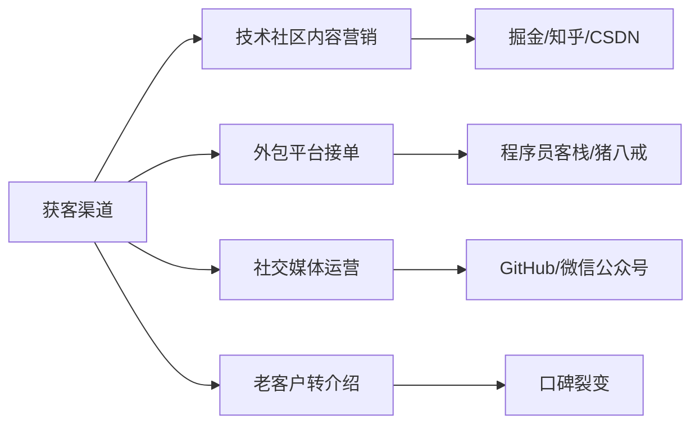
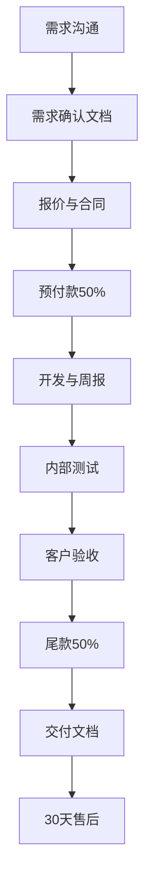

## 案例四：技术服务副业——程序员的外包之路

程序员做副业，最自然的切入点就是**用技术换钱**。但"接外包"三个字说起来轻巧，真正走通这条路的人远没有想象中多——大量程序员卡在"找不到客户""报价太低被白嫖""交付后收不到尾款"等关卡上，折腾几个月不仅没赚到钱，反而消耗了对技术的热情。

本章案例的主角是一位在二线城市工作的后端开发工程师，工作三年，技术水平中等偏上，通过系统化运营技术服务副业，用8个月时间从零做到月收入稳定12000元以上，高峰时突破20000元。他的路径不靠人脉资源，不靠低价内卷，而是靠**精准定位+标准化交付+口碑复购**这套可复制的方法论。

### 案例主角画像

| 维度 | 具体情况 |
|------|---------|
| 职业背景 | 二线城市互联网公司后端开发，3年经验 |
| 技术栈 | Python/Django + Vue.js + MySQL，熟悉Linux运维 |
| 每周可投入时间 | 工作日晚上2-3小时 + 周末半天，合计约15小时/周 |
| 起始资金 | 0元（纯技能变现） |
| 目标 | 用技术能力创造第二收入来源，月入8000-15000元 |

**关键约束条件**：不能影响本职工作，不能使用公司代码和资源，不能接与雇主存在竞争关系的项目。这三个约束是所有在职程序员做副业的底线，越界就不是副业问题而是法律问题了。

---

### 第一阶段：市场调研与方向选择（第1-2周）

#### 为什么不能"什么活都接"

很多程序员接外包的第一反应是"来什么做什么"，这是最典型的错误。什么都会意味着什么都不精，报价没有优势，交付没有标准，客户没有记忆点。技术副业的核心策略是**聚焦一个细分领域，做到"这个方向找你准没错"的程度**。

从市场营销理论看，这遵循的是**"窄定位"原则**——在一个足够细分的领域建立认知垄断，远比在广阔的市场中争夺注意力高效。举例来说，搜索引擎上搜"Python爬虫外包"会出现成百上千个竞争者，但搜"电商竞品价格监控系统定制"则可能只有寥寥几个结果——你的竞争对手越少，被客户选中的概率越高。

#### 市场需求分析方法

主角用了一周时间，系统性地调研了程序员技术服务的市场需求。他做了三件事：

**第一步：扫描主流外包平台的项目分类和报价**

他注册了猪八戒网、程序员客栈、开源众包、码市等国内平台，逐一浏览近三个月的项目列表，按类型分类统计：

| 项目类型 | 数量占比 | 平均报价 | 竞争程度 | 适合个人 |
|---------|---------|---------|---------|---------|
| 小程序/公众号开发 | 25% | 5000-20000 | 极高 | 一般 |
| 企业官网/展示站 | 20% | 3000-10000 | 极高 | 一般 |
| 数据爬虫/分析 | 15% | 2000-8000 | 中等 | 非常适合 |
| 管理系统定制 | 15% | 10000-50000 | 低 | 需团队 |
| 自动化脚本/工具 | 10% | 1000-5000 | 低 | 非常适合 |
| API对接/集成 | 8% | 3000-15000 | 低 | 非常适合 |
| 其他（运维/部署等） | 7% | 2000-10000 | 中等 | 适合 |

此外，他还调研了**国际平台**的格局（Upwork、Fiverr、Toptal），发现以下差异：

| 维度 | 国内平台 | 国际平台 |
|------|---------|---------|
| 客户类型 | 中小企业、个体经营者 | 海外初创公司、中小企业 |
| 报价水平 | 较低（内卷严重） | 较高（同等工作量2-4倍） |
| 沟通语言 | 中文 | 英文（需要基本写作能力） |
| 支付方式 | 支付宝/微信/对公 | PayPal/Wise/Payoneer |
| 结算周期 | 验收后1-7天 | 平台托管，里程碑释放 |
| 竞争焦点 | 价格战严重 | 专业度和评价更重要 |
| 税务复杂度 | 相对简单 | 涉及外汇收入申报 |

**国际平台适合两类人**：英文沟通能力OK的开发者（不需要流利，能清晰表达技术方案即可），以及掌握国内稀缺技术栈的开发者（比如区块链、AI模型微调等）。国际平台上一个中等复杂度的数据采集项目报价可达$800-2000，折合人民币5000-15000元，与国内同类项目相比溢价明显。但需要注意的是，Upwork平台会抽取10-20%的服务费，且初期需要靠低价积累好评后才能逐步提价。

**第二步：评估自身能力与市场需求的匹配度**

主角的技术栈是Python + Vue + MySQL，最适合的方向是：数据爬虫/分析、自动化脚本/工具、API对接/集成。这三个方向的共同特点是：

- 单人可独立完成，不需要团队协作
- 项目周期短（通常1-4周），回款快
- 技术门槛适中，不会陷入无底洞式的需求变更
- 客户多为中小企业和个体经营者，决策链短

**第三步：确定主攻方向——企业数据自动化**

最终他选择了"企业数据自动化"作为主攻方向，具体包括：

- 电商数据采集与分析（竞品价格监控、商品信息整理）
- 企业内部数据处理自动化（Excel批量处理、报表自动生成）
- 第三方平台API对接（打通不同系统的数据流）

选择这个方向的理由：市场需求真实且持续增长，中小企业数字化转型过程中有大量"小而碎"的自动化需求，大公司不屑于接、小团队嫌利润薄、个人开发者正好填补这个空白。

---

### 第二阶段：能力补齐与作品准备（第3-4周）

#### 技术能力诊断

确定方向后，主角对照市场需求做了能力差距分析：

| 所需技能 | 当前水平 | 差距 | 补齐方式 |
|---------|---------|------|---------|
| Python爬虫 | 基础（requests+BeautifulSoup） | 需掌握反爬对抗 | 系统学习Scrapy、Selenium、Playwright |
| 数据处理 | 中等（pandas基础） | 需掌握大数据量处理 | 学习分块读取、数据库批量操作 |
| 定时任务/部署 | 基础 | 需掌握生产级部署 | 学习Docker、cron、Supervisor |
| 前端展示 | 中等 | 需要快速出报表页面 | 掌握Streamlit或简单Vue模板 |

#### 打造三个标杆作品

空口无凭，客户不会为你的简历买单。主角花了两周时间，做了三个完整的示例项目，放在GitHub上并写了详细的技术博客介绍：

**作品一：电商价格监控系统**

- 功能：定时采集京东/淘宝指定商品的价格变动，生成趋势图表，价格低于阈值时发送邮件提醒
- 技术栈：Scrapy + MySQL + Streamlit + Docker
- 亮点：支持多平台、反爬策略完善、部署简单

**作品二：企业报表自动化工具**

- 功能：从多个Excel文件中提取数据，按规则汇总计算，自动生成格式化报表（带图表），定时发送到指定邮箱
- 技术栈：Python + pandas + openpyxl + Jinja2
- 亮点：模板化设计，新报表只需配置JSON文件即可

**作品三：微信公众号数据采集与分析**

- 功能：采集公众号文章阅读量、点赞数、评论内容，分析发文规律和用户画像
- 技术栈：Selenium + MongoDB + ECharts
- 亮点：数据可视化完整，分析维度丰富

这三个作品的价值不仅在于展示技术能力，更在于让潜在客户看到**"你做过类似的事"**——这是建立信任最有效的方式。

#### 作品展示的最佳实践

仅有GitHub仓库远远不够，你需要让非技术客户也能理解作品的价值。主角的做法是：

1. **每个项目配一个3分钟演示视频**（用OBS录屏+简单剪辑），放在B站并链接到GitHub README
2. **README用"问题→方案→效果"三段式结构**，而不是纯技术文档式的代码说明
3. **截图大于文字**：包含系统运行截图、数据报表截图、浏览器效果图，让客户直观感受交付物的样子
4. **附带一个"你可能也需要"的场景描述**：比如在价格监控项目的README末尾写"如果你是电商运营，需要实时掌握竞品价格变动，这个系统可以定制化部署到你的服务器上"——这直接把技术Demo变成了销售素材

---

### 第三阶段：获客渠道搭建（第5-8周）

#### 渠道矩阵设计

主角没有把鸡蛋放在一个篮子里，而是同时布局了四个获客渠道：



#### 渠道一：技术社区内容营销（主力渠道，贡献40%客户）

这是主角最用心经营的渠道。他在掘金和知乎上持续发布技术文章，内容围绕三个主题：

1. **"XX怎么做"型教程**：如《用Python自动监控竞品价格变化》《三行代码搞定Excel批量合并》——这类文章直接命中有需求但不会做的人
2. **"XX问题怎么解决"型实战**：如《爬虫被反爬封了怎么办？5种对抗策略实测》《Django部署到生产环境的完整避坑指南》——这类文章建立专业形象
3. **"XX项目复盘"型案例**：如《我帮一家淘宝店做了竞品监控系统，省了3个运营的活》——这类文章让潜在客户代入场景

**文章标题公式**：数字+具体场景+可量化结果。例如：

- ✅ 《5行Python代码，把3小时的Excel报表工作缩短到10秒》
- ✅ 《帮餐饮老板做了个外卖数据监控，月省2万采购成本》
- ❌ 《Python自动化实战分享》（太笼统，没有点击欲望）
- ❌ 《爬虫技术详解》（教科书式标题，吸引的是学习者不是客户）

写作策略的关键：**每篇文章末尾都留一个自然的"钩子"**——不是硬广"找我做开发"，而是"如果你也有类似需求，可以交流"。这种软性引导的转化率远高于硬广。

三个月下来，他在掘金积累了40+篇文章，知乎回答了60+个相关问题，形成了稳定的流量入口。

#### 渠道二：外包平台接单（初期渠道，贡献30%客户）

平台接单是最快见到钱的渠道，但也是竞争最激烈的。主角的策略是：

**不做低价竞争**。他观察到很多新手程序员在平台上报价极低（一个爬虫项目报500块），结果陷入恶性循环——低价接单→赶工交付→质量差→差评→只能继续低价接单。

他的定价策略：比平台均价高20-30%，但提供**超出预期的服务**——包括完整的部署文档、30天免费bug修复、一次免费需求微调。这个策略筛选掉了只看价格的客户，留下的都是愿意为质量付费的优质客户。

**平台资料优化要点**：

- 头像用真实照片（不是卡通），简介突出"XX方向专注开发"
- 作品集放GitHub链接，每个项目都有README和截图
- 接单初期可以适当让利，但每单都要拿到好评
- 响应速度要快——平台算法优先推活跃开发者

**竞标/投标实操技巧**：

在猪八戒、程序员客栈这类平台上，客户发布需求后会收到多个开发者的方案。如何让你的投标脱颖而出：

1. **不要用模板投标**。客户一天收到20份"您好，我有X年经验，可以做这个项目"的投标，早就审美疲劳了。要针对具体需求写定制化方案，哪怕只写三句话——"我看了你的需求，你核心要解决的是XX问题，我之前做过类似的XX项目，附链接"——这种个性化的投标命中率是模板投标的3-5倍
2. **主动提问**。在投标中提1-2个关于需求细节的问题，一方面展现你在认真思考，另一方面建立沟通的起点
3. **报价时给出范围而非单一数字**。比如"基础版3000元（包含XX功能），完整版5000元（额外包含XX功能）"——给客户选择权，而不是一个让他犹豫的数字
4. **附上相关作品链接**。如果做过类似项目，直接贴出来，比任何描述都有说服力

#### 渠道三：GitHub和社交媒体（长期渠道，贡献20%客户）

主角在GitHub上维护了几个开源小工具（都是从实际项目中抽象出来的通用组件），比如一个"电商数据采集框架"、一个"Excel报表生成器"。这些工具本身免费，但README里注明"如需定制化开发可以联系"。

微信公众号则作为内容分发和客户沟通的补充渠道。他把掘金的文章同步到公众号，同时在公众号上提供"免费技术咨询"入口——用30分钟免费咨询换取客户信任，再转化为付费项目。

#### 渠道四：老客户转介绍（稳定渠道，贡献10%客户，但质量最高）

复购和转介绍是副业收入稳定增长的关键。主角在每个项目交付后都会做两件事：

1. 发送一份简洁的"项目交付报告"，包含功能清单、使用说明、后续维护建议
2. 项目完成后一个月回访一次，主动询问使用情况

这两个动作看似简单，但90%的外包程序员都不会做。正是这种超出预期的服务意识，让客户愿意主动推荐给朋友和同行。

---

### 第四阶段：标准化交付流程（持续优化）

#### 项目全流程管理

经过前几个项目的摸索，主角建立了一套标准化的项目管理流程：



#### 需求沟通阶段的关键动作

**90%的项目纠纷源于需求不明确**。主角在需求沟通阶段投入了大量精力，核心原则是"所有需求必须书面确认"。

他使用一份标准的需求确认模板：

```text
一、项目概述
- 项目目标：一句话描述这个项目要解决什么问题
- 目标用户：谁会使用这个系统/工具
- 预期效果：做完之后能达到什么状态

二、功能清单
- 功能1：[具体描述，含输入/输出/异常处理]
- 功能2：[具体描述]
- ...每个功能都要明确"做什么"和"不做什么"

三、技术约束
- 运行环境：服务器配置/操作系统/网络要求
- 数据来源：数据从哪来，格式是什么，更新频率
- 性能要求：响应时间/并发量/数据量级

四、交付物清单
- 源代码（含注释）
- 部署文档
- 使用说明
- 技术架构说明

五、时间节点
- 需求确认日：____
- 预计交付日：____
- 验收周期：交付后____个工作日内完成验收

六、变更管理
- 需求变更需书面确认
- 变更导致的工作量增加另行报价
```

这份模板的价值在于：把模糊的口头沟通变成可追溯的书面文档。当客户说"我当初不是这个意思"的时候，你可以拿出双方签字确认的需求文档。

**应对常见沟通场景的话术**：

| 场景 | 客户说 | 你应该说 | 核心原则 |
|------|--------|---------|---------|
| 需求模糊 | "我想要个差不多的系统" | "理解您的想法。为了确保交付物符合预期，我整理了一份需求确认文档，您看下这些功能点是否覆盖了您的需求？" | 把模糊需求转化为具体清单 |
| 无限加功能 | "顺便加个小功能呗" | "这个功能可以做，我评估一下工作量，大概需要额外X天，报价增加X元。您看是加到当前项目还是作为二期需求？" | 变更必须有成本 |
| 砍价 | "太贵了，便宜点" | "价格是根据项目复杂度和预估工时计算的。如果预算有限，我们可以先做核心功能，非核心的留到二期。基础版报价是X元。" | 缩减范围而非降低单价 |
| 拖延付款 | "最近资金紧张，下个月再付" | "理解，但根据合同约定，尾款需在验收后X个工作日内支付。如果确实有困难，我们可以协商一个分期方案。" | 有理有据，给出替代方案 |
| 甩锅需求变更 | "这不是我要的效果" | "我理解您的感受。我们的需求确认文档第X条写明了这个功能的规格，交付物是符合约定的。如果您需要调整，我们可以走变更流程。" | 用书面文档说话 |

#### 报价策略

主角采用的是**"基础报价+可选模块"**模式：

| 项目类型 | 基础报价 | 包含内容 | 可选加价 |
|---------|---------|---------|---------|
| 数据采集工具 | 3000-5000元 | 核心采集逻辑+数据存储+基础报表 | +1000元/新增数据源，+800元/邮件告警 |
| 自动化脚本 | 1500-3000元 | 核心功能+日志+错误处理 | +500元/定时执行，+800元/可视化面板 |
| API对接 | 3000-8000元 | 单向数据同步+基础错误处理 | +1500元/双向同步，+1000元/数据校验 |
| 报表系统 | 4000-10000元 | 数据汇总+模板报表+导出功能 | +1500元/自定义模板，+2000元/权限管理 |

这种报价方式的好处：客户可以根据预算选择功能范围，避免了"一个需求报完价客户跑了"的尴尬；同时可选模块为后续追加需求留了空间，一个基础项目往往能通过可选模块扩展到1.5-2倍的金额。

#### 开发过程中的沟通规范

- **每周一次进度汇报**：周五下午发送简短的进度邮件，包含本周完成内容、下周计划、遇到的问题
- **关键节点提前通知**：遇到技术难点可能延期时，第一时间告知客户并给出替代方案
- **代码仓库定期同步**：客户可以在GitHub私有仓库随时查看代码进度

---

### 第五阶段：法律合规与风险管理

这一阶段是很多程序员完全忽略的，但它决定了你的副业能否长期稳定地做下去。

#### 劳动合同与竞业限制审查

在开始接单之前，你需要逐字阅读自己的劳动合同，重点关注以下条款：

| 条款类型 | 风险点 | 行动建议 |
|---------|--------|---------|
| 知识产权归属 | "工作时间内或利用公司资源创作的成果归公司所有" | 用自己的设备、时间、网络；保留副业时间记录 |
| 竞业限制 | "不得从事与公司业务有竞争关系的活动" | 选择与主业不同的细分方向；如不确定，咨询律师 |
| 兼职禁止条款 | "未经公司书面同意不得兼职" | 如果有此条款，评估风险后决定是否披露或规避 |
| 保密协议 | "不得泄露公司技术秘密和商业信息" | 副业项目绝对不使用公司代码、数据、架构设计 |

**安全底线**：用自己的电脑、自己的时间、自己的网络环境做副业。如果不确定劳动合同中的条款含义，花500-1000元咨询一位劳动法律师，远比事后踩坑划算。

#### 税务合规

副业收入需要依法纳税，具体规则如下：

**国内平台收入**：
- 个人劳务报酬所得，单次收入不超过800元免征
- 800-4000元：扣除800元后按20%税率
- 4000元以上：扣除20%费用后按20%税率
- 年度终了并入综合所得汇算清缴，多退少补
- 实操建议：收入较低时（月入<10000元），按次申报即可；收入稳定后，考虑注册个体工商户，享受小规模纳税人月收入10万元以下免征增值税的优惠政策

**国际平台收入（外汇收入）**：
- 通过PayPal/Wise/Payoneer等渠道收款，属于劳务报酬所得
- 需要在年度个人所得税汇算清缴时申报
- 单笔超过等值5万美元的外汇收入需向银行提供相关合同
- 建议保留所有项目合同、收款记录、平台交易截图作为申报依据

**注册个体工商户的优势**：

当副业月收入稳定超过8000元后，注册一个个体工商户是值得认真考虑的选择。好处包括：

1. 可以开具发票（很多企业客户要求对公付款+发票）
2. 小规模纳税人月收入10万元以下免征增值税
3. 个人经营所得税可以享受核定征收（部分地区综合税负低至2-3%）
4. 提升客户信任度（有营业执照比个人接单更正规）

注册流程并不复杂：携带身份证到当地市场监督管理局，填写个体工商户注册申请表，选择经营范围（"软件开发""信息技术咨询服务"等），通常1-3个工作日即可拿到营业执照。费用几乎为零（部分地区可能收取几十元工本费）。

#### 知识产权保护

**源代码归属**：这是外包纠纷中最常见的争议点。核心原则是——在合同中明确约定源代码的知识产权归属。通常有两种模式：

1. **买断模式**：客户支付全额费用后获得源代码的全部知识产权，你不再保留使用权。适合客户明确要求独占的项目
2. **授权模式**：客户获得使用权，你保留源代码的知识产权，可以将通用组件用于其他项目。适合你希望保留代码复用权的项目

建议默认采用"授权模式"，只在客户额外付费的情况下提供"买断"选项。合同中应写明："乙方保留源代码的知识产权，甲方获得该代码在本项目范围内的永久使用权。如甲方需要完整的知识产权转让，需额外支付项目总价50%的费用。"

**技术方案的保护**：你写的博客文章、公开的技术方案不受保护，但你为客户定制的具体实现细节属于商业秘密。在合同中加入保密条款，约定双方在项目结束后一定期限内（通常2年）不得向第三方披露项目的技术细节和商业信息。

#### 防骗与风险控制

平台上存在多种骗局，新手程序员需要警惕：

| 骗局类型 | 表现形式 | 防范措施 |
|---------|---------|---------|
| 白嫖需求文档 | "先写个详细方案我看看合不合适" | 需求沟通可以，但详细的架构设计和实施方案必须在签约后才提供 |
| 验收无限延期 | "再改改""还没达到我的要求" | 合同约定验收周期和验收标准，超期自动视为验收通过 |
| 尾款跑路 | "先交付我试用一下再说" | 严格执行50/50付款节点，代码交付前必须收到尾款 |
| 试稿白嫖 | "先做一个功能看看水平" | 可以展示已有作品，但不做免费的定制化试稿 |
| 需求无限膨胀 | "这不是理所当然该有的吗" | 需求文档中明确"做什么"和"不做什么"的边界 |

---

### 第六阶段：收入增长与规模化（第5-8个月）

#### 收入增长曲线

| 月份 | 项目数 | 月收入(元) | 主要来源 | 关键动作 |
|------|-------|-----------|---------|---------|
| 第1月 | 1 | 2500 | 平台接单 | 第一个项目，重点做好交付质量 |
| 第2月 | 2 | 4500 | 平台接单 | 积累好评，开始在掘金写文章 |
| 第3月 | 2 | 5000 | 平台+社区 | 掘金文章开始带来咨询 |
| 第4月 | 3 | 7500 | 平台+社区 | 第一个老客户复购 |
| 第5月 | 3 | 9000 | 社区为主 | 掘金粉丝破2000，稳定获客 |
| 第6月 | 4 | 12000 | 社区+转介绍 | 口碑效应开始显现 |
| 第7月 | 3 | 11000 | 转介绍为主 | 选择性接单，拒绝低质量项目 |
| 第8月 | 4 | 14000 | 转介绍+社区 | 开始提高单价，收入结构健康 |

#### 时间管理：主业与副业的平衡

这是最容易被忽略、也最容易翻车的环节。副业不是无限制地压榨休息时间，而是有策略地分配有限精力。主角的时间管理方法：

**工作日节奏**（每天2-3小时）：

```mermaid
graph LR
    A[19:00-19:30] -->|处理客户消息| B[19:30-21:00]
    B -->|专注开发| C[21:00-21:30]
    C -->|写技术文章| D[21:30后]
    D -->|休息,不碰副业]
```

**关键原则**：

1. **主业优先**。如果主业项目赶工期，果断暂停副业一周。副业收入是锦上添花，不是孤注一掷
2. **固定时间段做副业**。不要让副业渗透到全天每个空隙，否则你会感觉永远在工作，很快就会倦怠
3. **利用碎片时间做轻量任务**：回复客户消息、浏览平台新需求、整理文章素材——这些不需要深度思考的任务放在通勤、午休等碎片时间
4. **周末保留至少半天完全休息**。连续工作7天不休息，第3周开始效率就会断崖式下降

**避免倦怠的信号和对策**：

- 开始拖延回复客户消息 → 说明沟通任务过重，考虑用FAQ文档减少重复沟通
- 写代码时频繁走神 → 说明精力透支，暂停3-5天恢复
- 对技术本身失去兴趣 → 说明项目类型过于单调，尝试接一个有挑战性的新方向
- 睡眠质量下降 → 这是身体的红色警报，必须立即减少副业时间

#### 效率提升策略

随着项目经验积累，主角通过三种方式提升单位时间产出：

**1. 代码模板化**

将重复出现的功能模块抽象成可复用的代码模板：

```python
# 数据采集项目模板 - 仅需修改采集规则和存储配置
class DataCollectorTemplate:
    def __init__(self, config_path):
        self.config = self.load_config(config_path)
        self.session = self.init_session()
        self.storage = self.init_storage()

    def collect(self):
        """主采集流程 - 子类实现具体采集逻辑"""
        for source in self.config['sources']:
            data = self.fetch(source)
            cleaned = self.clean(data)
            self.save(cleaned)
            self.log(source, len(cleaned))

    def fetch(self, source):
        """数据抓取 - 支持反爬策略"""
        raise NotImplementedError

    def clean(self, data):
        """数据清洗 - 通用清洗逻辑"""
        # 去重、格式化、验证等通用处理
        ...

    def save(self, data):
        """数据存储 - 支持MySQL/MongoDB/CSV"""
        ...
```

有了这套模板，一个标准的数据采集项目从原来的5-7天缩短到2-3天。

**2. 工具链标准化**

建立了一套固定的开发-测试-部署工具链：

- 开发：VS Code + Docker Compose（本地环境一致性）
- 测试：pytest + 自定义测试数据生成器
- 部署：Dockerfile模板 + 一键部署脚本
- 监控：日志收集 + 简单的健康检查脚本

**3. 文档模板化**

需求确认文档、项目交付文档、使用说明文档全部模板化，新项目只需要填空和微调，节省了大量文档编写时间。

---

### 核心经验与方法论

#### 经验一：定位决定天花板

不要做"什么都能做的程序员"，要做"这个方向最靠谱的人"。细分领域的专业形象带来的溢价远超你的想象——同样是爬虫项目，平台上报价3000元的"什么都能做"的开发者，和报价6000元的"专注电商数据采集"的专家，后者的成交率反而更高。

判断定位是否精准的标准：你的目标客户听到你的介绍后，能不能在5秒内判断"这个人能帮我解决问题"。如果不能，说明定位还不够聚焦。

#### 经验二：内容是最好的获客武器

技术文章的获客效果远超在平台上海投。原因很简单：看到你文章的人已经认可了你的专业能力，转化率自然高。而且文章是长期资产——一篇好文章可以在未来一年甚至更长时间持续带来客户。

写技术文章的核心原则：**解决一个真实问题，提供完整方案**。不要写泛泛而谈的理论文章，要写"我遇到XX问题，用XX方法解决了，以下是完整代码和踩坑记录"这种实战型内容。

**内容营销的复利效应**可以用一个简单公式来理解：假设你每周写1篇文章，每篇文章平均每月带来0.5个咨询，咨询转化为项目的概率是30%。那么6个月后（24篇文章），你每月会收到约12个咨询，转化3-4个项目——这已经是一个稳定的获客引擎了。关键在于坚持，前3个月几乎看不到效果，但量变终会引发质变。

#### 经验三：合同和预付款是底线

永远不要在没有合同和预付款的情况下开始工作。这不是不信任客户，而是保护双方的商业惯例。

合同不需要多复杂，一份简洁的电子合同（或微信文字确认）包含以下要素即可：
- 项目范围和交付物
- 价格和付款方式（建议50%预付+50%验收后）
- 时间节点
- 变更管理规则
- 售后服务条款
- 知识产权归属
- 保密条款

如果客户连50%预付都不愿意，大概率是个坑——要么预算不够，要么对项目不够认真。果断放弃这类客户，把时间留给值得投入的项目。

#### 经验四：定价要敢于往上走

新手程序员最常见的错误就是报价太低。低报价不仅压缩你的利润空间，还会吸引来最差的客户——预算有限但要求无限，沟通成本极高，尾款难收。

定价参考公式：**项目报价 = 预估工时 × 时薪 × 1.5（沟通和售后系数）**。你的时薪应该是本职工作时薪的2-3倍——因为副业时间是你的休息时间，而且没有社保、公积金等隐性福利。

举个例子：如果你本职时薪是100元/小时（月薪20000÷22天÷8小时），那副业时薪应该定在200-300元/小时。一个预估20小时的项目，报价应该是 20 × 250 × 1.5 = 7500元。

**提价时机**：当你发现以下信号时，说明你该提价了——连续2个月项目排期满、客户主动找你的比例超过50%、你开始觉得"这个价格不值得我花这个时间"。每次提价幅度控制在20-30%，不要一步到位吓跑客户。

#### 经验五：学会拒绝

不是所有项目都值得接。以下情况果断拒绝：

- **需求不明确且客户不愿花时间沟通的**：这种项目大概率做到一半需求大改
- **预算明显低于市场价的**：说明客户不尊重技术劳动
- **技术栈完全不熟悉的**：学习成本会吞噬利润
- **与本职工作存在利益冲突的**：法律风险太大
- **客户沟通态度恶劣的**：这种人尾款大概率难收
- **"先做后付"类型的**：无论理由多合理，都是高风险信号

拒绝不是损失，是为更好的项目腾出时间。主角在第7个月开始选择性接单后，项目数量虽然少了，但总收入反而更高了——因为每个项目都是高价值、低摩擦的优质项目。

**拒绝话术**：不需要编造理由，简洁诚恳即可。"感谢您的信任，但这个项目的方向/技术栈/时间安排和我目前的情况不太匹配，建议您可以到XX平台/找XX方向的开发者，他们可能更适合。祝项目顺利。"——专业、友善，还可能给对方留下好印象，将来有合适项目会再找你。

---

### 常见误区与避坑指南

#### 误区一：用公司时间和资源做副业

这是最严重的红线。很多程序员觉得"用公司电脑写点代码无所谓"，但大多数劳动合同和公司制度都明确规定工作时间的产出归公司所有。一旦被发现，轻则警告处分，重则解除合同甚至承担法律责任。

正确做法：用自己的电脑、自己的时间、自己的网络环境做副业。如果不确定，重新读一遍你的劳动合同中关于知识产权和竞业限制的条款。

#### 误区二：只接单不沉淀

接一个项目赚一个项目的钱，永远在用时间换钱。聪明的做法是：从每个项目中提炼可复用的组件和模板，建立自己的"代码资产库"。随着项目经验积累，你的交付效率会越来越高，单位时间收入自然增长。

具体的沉淀清单：
- 每个项目结束后，抽出2-3小时将通用代码抽象成独立模块
- 建立一个私有Git仓库，按功能分类管理这些模块
- 为每个模块写清楚README：用途、依赖、使用方法、已知限制
- 定期回顾和重构——代码和你一样在成长，3个月前写的模块可能有更优雅的实现方式

#### 误区三：忽视售后和维护

很多程序员把代码交付完就不管了。但售后维护恰恰是建立长期客户关系、获取转介绍的关键环节。提供30天免费bug修复，不代表你在白干活——它体现的是你的专业态度和责任心，带来的口碑效应远超这30天的维护成本。

更进一步，你可以将"维护"转化为持续收入来源：在项目交付时提供一份**年度维护合同**（通常报价项目总价的15-20%/年），包含bug修复、小功能优化、服务器巡检等服务。如果30%的老客户购买维护合同，你就拥有了一个稳定的被动收入来源。

#### 误区四：不记录不复盘

每个项目结束后花30分钟做一次简单复盘：这个项目哪里做得好、哪里可以改进、客户最满意什么、最不满意什么。这些复盘记录是你持续优化交付流程、提升客户满意度的基础数据。

**复盘模板**：

```text
项目名称：____
项目周期：____至____
实际工时：____小时（预估____小时）
项目收入：____元（实际时薪____元/小时）

做得好的：
1. ____
2. ____

需要改进的：
1. ____
2. ____

客户反馈：
- 最满意：____
- 不满意：____
- 改进建议：____

可复用的代码/模板：____
下次类似项目报价调整：____
```

#### 误区五：一个人扛所有

副业做到一定规模后，你会发现时间和精力成为瓶颈。这时候有两个选择：

1. **提高单价、减少数量**：适合不想扩大规模、追求生活质量的阶段
2. **建立小团队、分工协作**：适合想进一步扩大收入的阶段

如果选择路线二，可以找1-2个同样做副业的程序员组成松散联盟，按各自专长分工。但要注意：团队合作需要更正式的项目管理，利润分配要提前谈清楚。

**团队协作的实操建议**：

- 找互补的技术搭档（比如你做后端，找一个做前端的），而非同质化的人
- 利润分配按工作量比例，而非平分——每单开始前明确约定
- 建立共享的代码规范和文档标准，否则交接时会非常痛苦
- 项目初期就确定谁是"主负责人"（客户对接人），避免多头沟通

---

### 进阶策略：从副业到被动收入

当技术服务副业稳定在月入10000+之后，可以开始思考如何从"用时间换钱"升级为"用资产赚钱"：

**策略一：将项目产品化**

把多次出现的客户需求抽象成SaaS产品。比如你接了5个"竞品价格监控"的项目，说明这个需求是普遍存在的。把它做成一个标准化的SaaS产品，按月收费，远比一个一个接项目效率高。

产品化的关键判断标准：这个需求是否有足够多的潜在客户？是否有标准化的可能？你能否在不做定制开发的情况下覆盖80%的场景？如果三个问题的答案都是"是"，那就值得投入时间做产品化。

SaaS定价参考：
- 基础版：99-199元/月（核心功能，限制数据量/用户数）
- 专业版：399-799元/月（完整功能+API访问+优先支持）
- 企业版：定制报价（私有部署+定制开发）

**策略二：知识付费**

把你的技术经验和项目案例做成付费课程或技术专栏。主角在掘金上开设了一个《Python数据采集实战》的付费专栏，定价99元，半年内卖出了300+份——这就是睡后收入。

知识付费的核心前提：你必须在这个领域有真实的项目经验和可验证的成果。空洞的理论教程已经饱和了，市场缺的是"我实际做过，这是我的完整方法论"这种实战型内容。

**策略三：开源项目+付费增值**

维护一个开源项目（比如上面提到的数据采集框架），基础功能免费，高级功能和技术支持付费。这种模式既能建立技术影响力，又能创造持续收入。

变现路径：开源核心→吸引用户→部分用户需要高级功能→提供付费Pro版或技术支持合同→用收入反哺开源项目持续迭代。这条路需要更长的周期（通常6-12个月才能看到收入），但护城河也更深。

---

### 成果数据总览

| 指标 | 起步时（第1月） | 成熟后（第8月） | 变化 |
|------|---------------|---------------|------|
| 月收入 | 2500元 | 14000元 | +460% |
| 稳定客户数 | 0 | 15个 | 从零建立 |
| 复购率 | 0% | 60% | 口碑驱动 |
| 单项目均价 | 2500元 | 5500元 | +120% |
| 平均项目周期 | 10天 | 5天 | 模板化提效 |
| 获客渠道 | 100%平台 | 平台20%/社区40%/转介绍40% | 渠道健康 |
| 客户满意度 | 无数据 | 4.8/5.0 | 超预期交付 |
| 实际时薪 | 约80元/小时 | 约250元/小时 | +212% |

---

### 总结：程序员技术服务副业的核心公式

**技术副业收入 = 专业定位 × 获客能力 × 交付效率 × 客户留存**

四个变量缺一不可：

- 没有专业定位，你就只能在低价区和别人卷
- 没有获客能力，再好的技术也找不到客户
- 没有交付效率，接再多项目也赚不到钱
- 没有客户留存，永远在从零开始找新客户

程序员做技术服务副业，本质上是在经营一家一人公司。你需要的不仅是技术能力，还有营销能力、沟通能力、项目管理能力和商业思维。这恰恰是很多程序员在本职工作中忽视、但在职业发展中越来越重要的能力。

从这个角度看，技术服务副业带来的不仅是额外收入，更是一个低成本、低风险的商业能力训练场。即使你未来不做副业了，这些能力也会让你在职场上走得更远。
