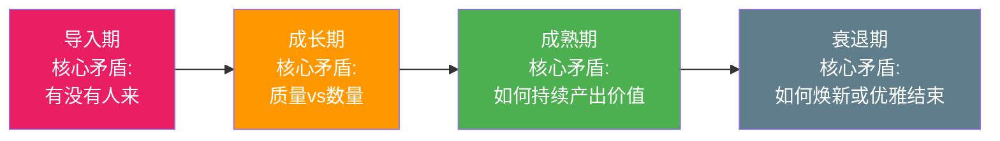
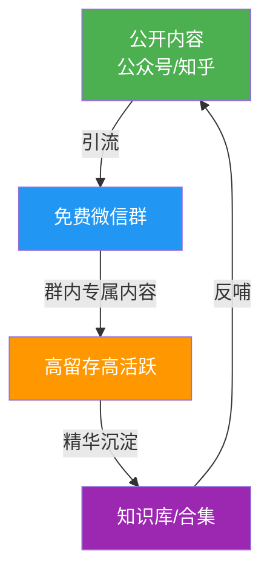
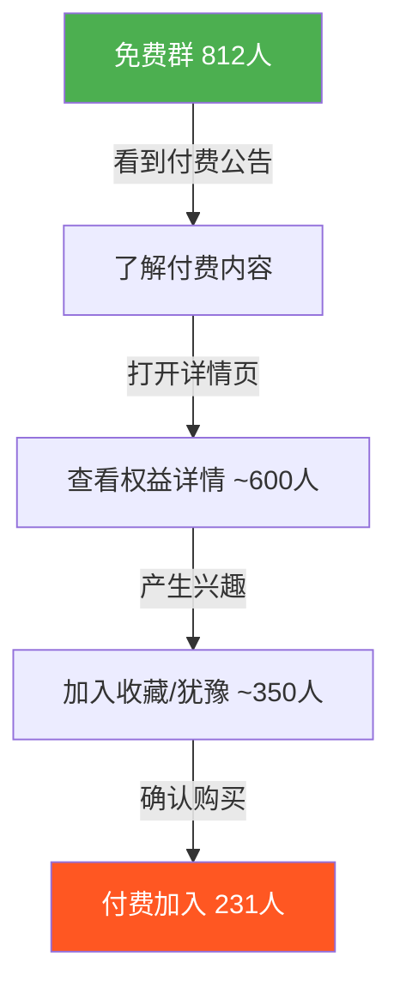
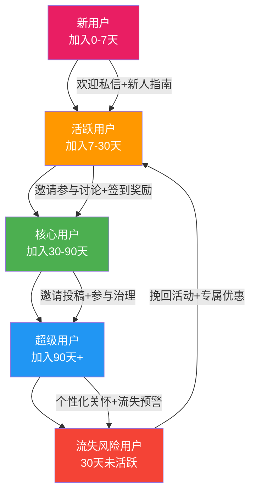
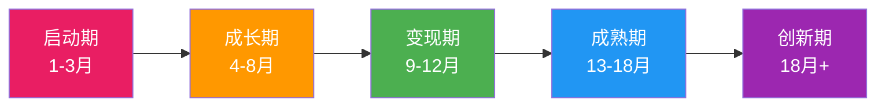

## 案例五：社群运营——从微信群到付费社区

社群运营是互联网副业中"门槛最低但天花板极高"的赛道。门槛低，是因为一个微信群就能起步；天花板高，是因为一个成熟社群可以衍生出课程、咨询、企业服务、品牌联名等多种变现形态。本案例完整记录了一位普通人如何用18个月，将一个200人的免费微信群演化为年营收52万元的付费知识社区，涵盖从零到一的每一步决策逻辑、数据验证和方法论沉淀。

### 社群运营的理论基础

在进入案例之前，先理解社群运营背后的科学原理，这些原理决定了所有后续策略的有效性。

#### 邓巴数与社群规模

英国人类学家罗宾·邓巴（Robin Dunbar）提出，人类大脑能够维持的稳定社交关系上限约为150人（邓巴数）。这个数字对社群运营有直接指导意义：

| 社群规模 | 关系特征 | 运营策略 |
|----------|----------|----------|
| 0-50人 | 强关系，互相认识 | 无需管理员，自然互动 |
| 50-150人 | 中等关系，部分相识 | 需要1-2名核心成员协助管理 |
| 150-500人 | 弱关系为主，大部分人互不认识 | 需要正式管理架构和规则体系 |
| 500人以上 | 陌生人社会，信息过载 | 必须分群、分层、建立子社区 |

老K的社群从200人到1200人的演化过程，恰好验证了这个理论——当人数突破150人后，他不得不引入管理员角色和正式规则体系。

#### 弱关系理论与信息流动

社会学家马克·格兰诺维特（Mark Granovetter）的"弱关系理论"指出：强关系（亲友）提供情感支持，弱关系（点头之交）提供新信息和机会。社群运营的核心价值之一，就是帮助成员建立大量有价值的弱关系——这些弱关系在求职、合作、信息获取上的价值，往往超过强关系。

社群运营的启示：不要只鼓励小圈子深度社交，还要创造跨圈层的交流机会（比如跨行业分享、不同背景成员的配对交流）。

#### 社群生命周期理论

社群和产品一样，遵循生命周期曲线：导入期→成长期→成熟期→衰退期。每个阶段的核心矛盾不同：



多数社群死在成长期到成熟期的过渡——规模扩大后内容质量下降，核心成员流失，最终沦为广告群。老K的成功之处在于，他用免费阶段的8个月时间建立了足够深的信任基础，才启动付费转化。

#### 社群价值公式

```text
社群价值 = 内容密度 × 成员质量 × 互动频率 × 信任深度
```

四个因子缺一不可：

- **内容密度**：没有持续高质量内容，群就会沦为灌水群。内容密度不是指消息数量，而是指"对成员有实际帮助的信息占比"。一个日均200条消息但90%是闲聊的群，内容密度远低于日均50条但每条都有干货的群。
- **成员质量**：成员越精准，讨论质量越高，社群对每个人的价值越大。一个群有5个活跃的行业从业者，比50个潜水的旁观者有价值得多。
- **互动频率**：沉默的社群等于死社群，互动是社群的血液。但互动不等于灌水——有质量的互动是"提出问题→获得回答→产生新问题"的循环。
- **信任深度**：信任是付费转化的前提，而信任需要时间+持续的价值交付来积累。信任深度可以通过一个简单指标衡量：成员是否愿意向群内其他人推荐自己的朋友或同事。

---

### 案例概述

本案例记录了一位互联网从业者（以下简称"老K"）从零开始，用18个月时间将一个200人的免费微信交流群，逐步演化为一个年营收超过50万元的付费知识社区的完整过程。这个案例的价值在于：它不是一夜爆红的神话，而是一条普通人可以复制的、靠持续输出价值和精细化运营逐步变现的路径。

#### 背景信息

| 维度 | 具体情况 |
|------|----------|
| 运营者背景 | 3年产品经理经验，业余时间充裕，无粉丝基础 |
| 启动时间 | 2023年3月 |
| 初始资源 | 一个个人公众号（800粉）、行业人脉约50人 |
| 核心领域 | B端产品设计与SaaS行业分析 |
| 第一笔付费收入 | 启动后第6个月 |
| 当前状态（18个月后） | 付费会员1200+人，年营收52万元 |

---

### 第一阶段：冷启动——免费社群的价值验证（第1-3个月）

#### 为什么从微信群开始

很多人做社群的第一反应是建一个高大上的平台，但实际上微信群是最高效的冷启动工具，原因有三：

- **零门槛**：用户不需要下载任何App，扫码即可加入。任何额外的下载步骤都会导致30%-50%的用户流失。
- **高频触达**：微信是国民级应用，用户每天打开数十次。群消息会出现在聊天列表中，天然获得曝光。相比之下，独立App或网页社区需要用户主动打开，触达率低一个数量级。
- **社交背书**：群成员之间的互动本身就是内容，降低信任成本。看到群里有认识的人，新成员的信任感会显著提升。

老K的启动逻辑很简单：先用免费群验证"这个领域到底有没有人愿意聚集"，再考虑是否值得投入更多资源做付费产品。这个逻辑背后是一个基本原则——**先验证需求，再投入资源**。太多人在没有验证需求的情况下，花几万块建App、买服务器，最终发现根本没有用户。

#### 具体执行步骤

**第一步：精准定位群主题（第1周）**

老K没有建一个泛泛的"产品经理交流群"，而是把主题缩窄到"SaaS产品经理实战交流"。这个定位遵循了一个关键原则：**人群越精准，社群价值越高**。

定位公式：

```text
目标人群 + 垂直领域 + 价值承诺
```

对比两种定位：

| 定位方式 | 示例 | 问题 |
|----------|------|------|
| 太宽泛 | "产品经理交流群" | 什么人都有，话题杂乱，缺乏深度 |
| 精准定位 | "B端SaaS产品实战交流群" | 聚集同频人群，讨论质量高，容易形成共识 |

精准定位的三个检验标准：

1. **你能用一句话说清楚这个群是给谁的**：如果说不清楚，说明太宽泛
2. **目标人群有自己的痛点和话题**：如果他们没有强烈的交流需求，群会冷清
3. **你在这个领域有足够的积累**：如果你自己都不是专家，凭什么让别人信你

**第二步：种子用户获取（第2-4周）**

老K用了三种方法获取第一批50个种子用户：

1. **朋友圈精准邀请**：发了一条带行业痛点的朋友圈——"最近在整理一份SaaS产品竞品分析模板，需要的评论区扣1，我私发给你。顺便建了个小群，定期分享B端产品干货，想进群的说一声。" 这条朋友圈带来了23个人。这个方法成功的关键是：**先给价值（竞品分析模板），再提要求（进群）**。直接发"建了个群，想进的扫码"效果会差很多。

2. **公众号导流**：在已有的800粉公众号发了一篇文章，文末附群二维码，带来15个人。文章内容是"我做B端产品3年踩过的10个坑"——这类"经验总结"型内容天然适合导流，因为读者会觉得"这个人有干货，他的群应该也有干货"。

3. **行业社群渗透**：在其他产品相关的微信群里积极回答问题、分享见解，建立专业形象后，自然有人私聊请教，顺势邀请入群。这个方法比较慢但质量最高，带来了12个人。具体做法：在目标群中每周至少回答3-5个问题，回答要详细、有深度，让人觉得你是这个领域的专家。坚持2-3周后，就会有人主动加你好友。

**关键原则**：种子用户宁缺毋滥。一个群里有5个活跃的行业从业者，比50个潜水的旁观者有价值得多。

**第三步：制定群规则（第1周内完成）**

群规则不是形式主义，而是社群质量的生命线。老K的群规简洁但明确：

```text
【群规 v1.0】

1. 本群聚焦B端SaaS产品设计、行业分析、职业发展
2. 禁止：广告、拉票、无关链接、政治敏感话题
3. 鼓励：提问、分享案例、讨论行业趋势
4. 每周三晚8点为固定话题讨论时间
5. 违规一次警告，两次移出
```

> **实操提醒**：群规要入群时就发，不要等人多了再补。第一批人养成什么习惯，后面的人就会跟着学。

**群规设计的深层逻辑**：群规的本质是"行为预期管理"。它告诉成员三件事——这里能做什么（鼓励）、不能做什么（禁止）、有什么固定活动（习惯养成）。规则不在多，在于执行。老K对违规者严格执行"一次警告两次移出"，短期内损失了几个成员，但长期来看建立了"这个群有规矩"的口碑。

#### 第一阶段成果

| 指标 | 数据 |
|------|------|
| 群成员数 | 50→186人 |
| 日均消息数 | 40-60条 |
| 固定参与周三讨论的人数 | 15-25人 |
| 内容产出 | 12篇行业分析文章（公众号） |
| 收入 | 0元（纯投入期） |

这一阶段的核心目标是**验证需求**——确认这个领域确实有一群人愿意持续交流，并且老K的输出能获得正反馈。

验证需求的三个量化标准：
1. 群成员自然增长（非强拉）超过100人：说明需求存在
2. 日均消息量稳定在30条以上：说明群有活力
3. 有5-10个成员主动参与讨论：说明不只是你一个人在唱独角戏

---

### 第二阶段：内容驱动增长——从186人到800人（第4-8个月）

#### 内容策略：三驾马车

进入增长期后，老K发现单纯靠拉人已经遇到瓶颈，必须建立可持续的内容引擎来吸引新用户。他设计了一个三层内容体系：

**第一层：公开内容（引流层）**

- 公众号每周更新2篇文章，选题围绕SaaS行业热点和产品方法论
- 文章末尾附群入口，每篇带来5-15个新成员
- 关键技巧：标题中包含具体数字和行业关键词，例如"我拆解了30个SaaS产品的定价策略，发现了这5个规律"

公开内容的选题公式：

```text
[数字/时间/范围] + [行业关键词] + [方法论/结论]
```

好的标题示例：
- "我分析了100个SaaS公司的客户成功部门，总结出这套搭建指南"
- "3年B端产品经验：需求评审会的12个避坑指南"
- "SaaS定价策略深度拆解：这5种模式覆盖90%的场景"

坏的标题示例：
- "产品经理心得分享"（太模糊）
- "关于SaaS的一些思考"（没有具体价值承诺）
- "干货！"（什么干货？）

**第二层：群内专属内容（留存层）**

- 每周三"话题讨论日"：老K提前发布一个讨论话题，引导群成员发表观点
- 每周五"案例拆解"：老K选一个SaaS产品做深度拆解分析
- 每月一次"群友分享"：邀请群内有经验的成员做主题分享

群内专属内容的核心价值是**让成员感受到"只有在这个群里才能获得这些内容"**。如果群里的内容和公众号完全一样，成员就没有留在群里的理由。

**话题讨论日的操作SOP**：

```text
周二晚8点：发布本周讨论话题 + 背景资料
周三晚8点：老K发表开场观点（300-500字）
周三晚8:15：引导第一位成员发言
周三晚8:30-9:30：自由讨论，老K适时总结和追问
周三晚10点：老K发布讨论总结（精华观点整理）
```

**第三层：精华沉淀（复利层）**

- 每月整理一次"群精华合集"，发布到公众号
- 建立了一个石墨文档，持续积累群内讨论的优质内容
- 这些沉淀物后来成了付费社区的核心资产

精华沉淀的关键是**不要让好的讨论消失在聊天记录里**。微信群的消息很难回溯查找，如果不主动沉淀，三个月前的一场精彩讨论就等于从未发生过。



#### 增长的关键转折点

第6个月，老K写了一篇《我分析了100个SaaS公司的客户成功部门，总结出这套搭建指南》的长文，被多个行业大号转载，单篇阅读量突破3万。这篇文章直接带来了300多个精准的新群成员，群人数从400多跳到800。

**从这件事中提炼的经验**：

1. **一篇爆款内容的拉新效果 > 三个月的日常运营**
2. 爆款不是随机的——老K在写这篇之前，已经在群里讨论过这个话题多次，积累了大量一手素材和群友反馈
3. 内容质量的根基在于日常积累，而非灵感爆发

**爆款内容的生产方法论**：

爆款不是等来的，而是"设计"出来的。老K的爆款生产流程：

```text
群内讨论（积累素材）→ 初稿写作（3-5天）→ 群内小范围试读（收集反馈）
→ 修改打磨（2-3天）→ 公众号发布 → 主动分发到行业群和大号（求转载）
```

关键点：在正式发布前，先在群里做小范围试读。群成员既是你的第一批读者，也是你的内容质检员。他们的反馈能帮你发现逻辑漏洞、补充案例、优化表达。

#### 群管理的挑战与应对

群人数超过300后，老K遇到了一系列典型问题：

| 问题 | 具体表现 | 解决方案 |
|------|----------|----------|
| 广告党入侵 | 每天3-5个新成员进群就发广告 | 设置入群验证：回答一个行业问题才能进群 |
| 话题发散 | 讨论经常跑题到无关领域 | 设置"话题管理员"角色，发现跑题及时引导 |
| 沉默螺旋 | 大部分人只看不说，群变成老K的独角戏 | 设计"每日一问"机制，降低发言门槛 |
| 信息过载 | 有价值的讨论被闲聊淹没 | 每天晚上整理"今日精华"，置顶重要消息 |
| 小团体冲突 | 两个核心成员因观点不合发生争吵 | 私聊调解，明确"对事不对人"原则 |

#### 入群验证的具体实现

老K设计了一个简单的入群流程：

```text
用户扫码 → 添加老K微信 → 老K发送验证问题
→ 用户回答 → 通过则拉群，不通过则引导关注公众号

验证问题示例：
"你目前在做什么类型的B端产品？遇到了什么问题？"

目的不是考倒用户，而是：
1. 确认是目标用户（不是广告党）
2. 了解成员背景（后续内容运营参考）
3. 让用户带着问题进群（提高参与度）
```

**验证流程的进阶优化**：当人数增长到每天需要验证20+人时，老K把验证流程半自动化：

```text
1. 用企业微信的自动回复功能，新好友自动收到验证问题
2. 用户回复后，老K批量审核（每天固定2个时间段）
3. 通过的用户自动拉入群
4. 不通过的用户自动发送公众号引导语
```

这个优化让老K每天花在审核上的时间从1小时降到15分钟。

#### 第二阶段成果

| 指标 | 数据 |
|------|------|
| 群成员数 | 186→812人 |
| 日均消息数 | 80-120条 |
| 公众号粉丝 | 800→3200人 |
| 核心活跃成员 | 约80人（每周至少发言3次） |
| 收入 | 0元（仍处于积累期） |

> **反思**：很多社群运营者在这个阶段就开始着急变现，但老K选择了继续积累。他的判断依据是：群内虽然活跃度不错，但还没有形成足够强的"离开成本"——如果现在收费，大部分人会直接走掉。需要再沉淀2-3个月，让群成员形成习惯依赖。

**离开成本的判断标准**：当群成员开始自发做以下事情时，说明离开成本已经足够高：
1. 主动在群里提问和回答问题（而不只是看）
2. 主动邀请自己的同事/朋友进群
3. 在其他场合提到"我在XX群里看到过..."
4. 对群规和讨论话题有认同感

---

### 第三阶段：付费转化——从免费到付费的惊险一跃（第9-12个月）

#### 变现前的准备工作

在正式启动付费之前，老K花了一个月做准备工作：

**1. 用户调研（第9个月初）**

在群内做了一次匿名问卷，核心问题：

- 你在这个群最大的收获是什么？（开放题）
- 如果有一个付费社区，你期望获得什么？（多选题）
- 你能接受的年费范围是多少？（单选：99/199/399/599/999元）

调研结果（有效样本186份）：

| 问题 | 结果 |
|------|------|
| 最大收获Top3 | 行业信息（72%）、人脉拓展（58%）、方法论学习（51%） |
| 付费期望Top3 | 深度行业报告（68%）、专属问答（61%）、线下活动（43%） |
| 可接受年费 | 199元（45%）、399元（32%）、99元（15%）、599元以上（8%） |

根据调研，老K定价**299元/年**——略低于主流选择但高于最低档，给用户一种"性价比高"的感觉。

**定价的心理学机制**：

老K的定价策略运用了三个心理学原理：

1. **锚定效应**：先展示599元的选项（虽然只有8%的人选），让299元显得"便宜"
2. **折中效应**：在99元和599元之间，299元是"中间偏左"的选择，大多数人会倾向于此
3. **尾数定价**：299比300感觉便宜很多，虽然只差1元

**免费到付费的五个前提条件**：

很多社群运营者急于变现，结果转化率极低。启动付费前必须满足以下五个条件：

1. **持续运营至少3个月**：用户需要时间建立习惯。不到3个月就收费，用户对社群还没有形成依赖
2. **活跃度稳定**：日均消息量不低于30条，且不是运营者独撑
3. **用户调研确认付费意愿**：至少30%的成员表示"愿意付费获取更多"
4. **有明确的差异化内容**：免费和付费之间的内容要有清晰的区分度
5. **运营者有持续产出能力**：至少能保证未来6个月的内容交付

**2. 产品设计**

老K设计的付费社区产品结构：

```text
免费群（保留）── 继续运营，作为引流入口
    │
    ├── 精华内容分享
    ├── 每周话题讨论
    └── 入群问答
    
付费社区（新建）── 知识星球 + 微信VIP群
    │
    ├── 【深度内容】月度行业报告（30-50页）
    ├── 【专属问答】48小时内必答
    ├── 【案例库】200+ SaaS产品拆解案例
    ├── 【模板库】PRD/竞品分析/需求文档模板
    ├── 【直播】每月2次主题直播+录播回放
    ├── 【VIP群】小群（限200人/群），高质量讨论
    └── 【线下】每季度1次线下沙龙（额外AA费用）
```

**产品设计的核心原则**：付费内容必须和免费内容有明确的"代差"。如果免费群已经能获得80%的价值，没有人会为剩下的20%付费。老K的差异化设计：

| 维度 | 免费群 | 付费社区 |
|------|--------|----------|
| 内容深度 | 观点讨论、热点点评 | 深度报告、系统方法论 |
| 互动方式 | 群聊、话题讨论 | 专属问答（48h必答） |
| 资源获取 | 公开文章 | 案例库、模板库、录播课 |
| 社交圈层 | 泛行业人群 | 精准从业者（限200人/群） |
| 线下活动 | 无 | 每季度1次沙龙 |

**3. 预热传播**

老K没有直接宣布开付费，而是用了两周时间做预热：

- 第1周：在免费群里分享了几份付费社区的核心内容（行业报告的摘要版），让大家尝到甜头
- 第2周：在公众号发布了一篇《为什么我决定做一个付费社区》，坦诚说明动机、预期价值和定价逻辑
- 同时邀请了10位群内的核心成员提前体验，并请他们在群里分享体验感受

**预热策略的心理学逻辑**：

预热的本质是"制造期待感"和"降低决策阻力"：

1. **分享摘要版** → 制造"想要更多"的欲望（稀缺效应）
2. **坦诚说明定价逻辑** → 建立信任，让觉得"他不是在割韭菜"（透明效应）
3. **核心成员体验分享** → 社会证明，"别人都觉得值，我也应该试试"（从众效应）

#### 转化数据

| 指标 | 数据 |
|------|------|
| 免费群总人数 | 812人 |
| 付费社区首日加入 | 89人 |
| 首周加入 | 167人 |
| 首月加入 | 231人 |
| 首月收入 | 69,069元（231×299） |
| 转化率 | 28.5%（231/812） |

> **关键洞察**：28.5%的转化率在知识付费领域属于非常高的水平。通常免费到付费的转化率在3%-10%。老K能实现高转化的核心原因有三个：（1）6个月的免费价值输出建立了信任；（2）定价合理；（3）预热充分，用户心理上已经准备好付费。

#### 转化漏斗分析



**漏斗优化要点**：

| 漏斗环节 | 转化率 | 优化方向 |
|----------|--------|----------|
| 看到公告→查看详情 | 74%（600/812） | 优化公告文案，突出核心价值 |
| 查看详情→产生兴趣 | 58%（350/600） | 丰富权益展示，增加社会证明 |
| 产生兴趣→付费 | 66%（231/350） | 设置限时优惠，减少犹豫时间 |

#### 首月运营的关键动作

付费社区开张后的第一个月至关重要——如果新付费用户感觉"不过如此"，不仅不会续费，还会在免费群里传播负面评价。老K在首月做了以下几件事：

1. **快速交付承诺内容**：首月的行业报告在开张第3天就发布，而不是等到月底
2. **高频互动**：每天在VIP群回答问题，响应时间控制在2小时内
3. **制造"惊喜感"**：额外赠送了一份价值99元的竞品分析工具包
4. **收集反馈**：第2周和第4周分别做了一次用户满意度调查

**"惊喜感"的设计原则**：首月要给用户超出预期的体验，让他们觉得"这299花得太值了"。具体做法：

- 承诺月度报告 → 首月给两份
- 承诺48h回答 → 首月做到2h内回答
- 承诺案例库 → 首月就开放200+案例
- 没承诺的 → 额外赠送工具包、模板、录播课

首月的超预期交付，会在用户心中建立"这个社群总是给我惊喜"的预期，这是续费率的核心保障。

---

### 第四阶段：规模化——从231人到1200人（第13-18个月）

#### 增长引擎：老带新机制

老K发现，社群最有效的拉新方式不是外部引流，而是老成员的口碑推荐。他设计了一套推荐机制：

```text
推荐机制 v1.0

推荐人奖励：
- 推荐1人成功付费 → 返现50元
- 推荐3人成功付费 → 免费续费一年
- 推荐10人成功付费 → 永久免费会员 + 署名感谢

被推荐人奖励：
- 通过推荐码注册 → 首年立减50元（249元）
```

效果：推荐渠道贡献了35%的新付费用户。

**推荐机制的设计要点**：

1. **推荐人奖励要阶梯化**：只推荐1人和推荐10人的奖励差距要大，激励深度推荐
2. **被推荐人也要有优惠**：否则推荐人会觉得"我在帮你拉人，但我的朋友没有好处"
3. **推荐码要简单易记**：复杂的推荐码没人愿意分享
4. **及时兑现奖励**：推荐成功后24小时内发放奖励，延迟兑现会打击积极性

**单位经济模型**：

```text
获客成本（CAC）计算：
- 推荐返现：50元/人
- 被推荐人优惠：50元/人
- 实际获客成本：100元/人（推荐渠道）
- 自然增长获客成本：~0元

用户终身价值（LTV）计算：
- 年费：299元
- 年续费率：78%
- 平均生命周期：1/(1-0.78) = 4.5年
- LTV = 299 × 4.5 = 1,346元

LTV/CAC = 1,346/100 = 13.5（健康值 > 3）
```

LTV/CAC比值达到13.5，说明社群的商业模式非常健康。每花100元获取一个用户，能获得1,346元的终身收入。

#### 内容体系升级

随着会员数量增加，老K的内容体系也做了升级：

| 内容类型 | 频率 | 负责人 | 备注 |
|----------|------|--------|------|
| 月度行业报告 | 每月1份 | 老K主笔 | 30-50页，有独家数据 |
| 主题直播 | 每月2次 | 老K + 嘉宾 | 录播回放，积累内容库 |
| 每日精选 | 每天1条 | 老K筛选 | 行业新闻+点评，发VIP群 |
| 案例拆解 | 每周1篇 | 老K + 社区投稿 | 200+案例持续增长 |
| 线下沙龙 | 每季度1次 | 老K组织 | 北上深轮流，AA制 |

**引入社区贡献者**：老K发现高质量内容的产出速度跟不上会员增长，于是推出了"社区贡献者"计划——会员投稿被采纳后，可获得稿费（200-500元/篇）和社区积分。这既解决了内容产能问题，又增强了会员的参与感和归属感。

**社区贡献者计划的运营细节**：

```text
投稿流程：
1. 会员提交选题大纲 → 老K审核（1个工作日内）
2. 审核通过 → 会员撰写全文
3. 老K编辑润色 → 发布到社区
4. 稿费在发布后3个工作日内支付

积分体系：
- 投稿被采纳：+500积分
- 提问获得高赞：+50积分
- 回答被标记为"优质回答"：+100积分
- 连续30天每日签到：+200积分

积分用途：
- 1000积分 = 免费续费1个月
- 5000积分 = 免费续费6个月
- 10000积分 = 永久免费会员
```

#### 运营团队的组建

到第15个月，老K意识到一个人已经无法覆盖所有运营工作。他组建了一个兼职团队：

| 角色 | 人数 | 来源 | 月薪 | 工作内容 |
|------|------|------|------|----------|
| 社群管理员 | 2人 | 优秀会员转兼职 | 2000元/人 | 群内秩序维护、问题解答 |
| 内容编辑 | 1人 | 外部招聘 | 3000元 | 报告排版、公众号运营 |
| 活动策划 | 1人 | 优秀会员转兼职 | 按项目付费 | 线下沙龙组织 |

月运营成本约9000元，相对于月均收入4.3万元，运营成本率约21%，健康可控。

**团队组建的注意事项**：

1. **优先从优秀会员中选拔**：他们了解社群文化，上手快，成本低
2. **先兼职后全职**：在社群收入没有稳定到每月5万以上之前，不要招全职
3. **明确分工和KPI**：每个角色要有明确的职责范围和考核标准
4. **建立SOP文档**：把所有运营流程文档化，避免对个人的依赖

#### 收入结构演变

| 收入来源 | 占比 | 说明 |
|----------|------|------|
| 年费会员 | 65% | 核心收入，299元/年 |
| 单次报告购买 | 15% | 非会员可单买，99元/份 |
| 企业定制报告 | 12% | 为SaaS公司做行业分析，5000-15000元/份 |
| 线下活动溢价 | 5% | 沙龙门票收入扣除场地费后的部分 |
| 广告/合作 | 3% | 精准的行业工具推荐 |

**收入结构的健康度分析**：

老K的收入结构有一个重要特征：**年费会员占比65%，而不是100%**。这意味着他的收入来源是多元化的。如果年费收入占比超过90%，一旦出现大规模退费或续费率下降，收入会断崖式下跌。多元化的收入结构提供了抗风险能力。

---

### 完整数据对比

| 指标 | 第3个月 | 第8个月 | 第12个月 | 第18个月 |
|------|---------|---------|----------|----------|
| 免费群人数 | 186 | 812 | 1,100 | 2,400 |
| 付费会员数 | 0 | 0 | 231 | 1,200 |
| 月均收入 | 0 | 0 | 5.8万 | 4.3万 |
| 公众号粉丝 | 1,200 | 3,200 | 5,800 | 12,000 |
| VIP群日均消息 | — | — | 60-80条 | 40-60条 |
| 月度续费率 | — | — | — | 78% |
| NPS（净推荐值） | — | — | 42 | 56 |

> **关于收入下降的说明**：第12个月的月均收入（5.8万）高于第18个月（4.3万），这是因为首月集中转化带来了一次性高峰。第18个月的收入更稳定，是续费+新增的常态水平。年化收入约52万元。

---

### 进阶运营：高级策略与深度玩法

#### 游戏化运营机制

当社群进入成熟期后，单纯的"内容+互动"模式会让成员产生疲劳感。老K引入了游戏化机制来维持活跃度：

**等级体系**：

```text
Lv1 新手（加入0-30天）：只能浏览和提问
Lv2 学徒（30天+，发言50+）：可以参与讨论和投票
Lv3 能手（90天+，投稿1+）：可以发起话题和投稿
Lv4 专家（180天+，优质回答20+）：可以参与社区治理
Lv5 导师（365天+，被邀请）：可以做主题分享和课程
```

等级体系的价值不在于"控制"，而在于**给成员提供明确的成长路径和目标感**。当成员知道自己"再发10篇优质回答就能升级"时，参与动力会显著增强。

**勋章系统**：

```text
首次提问勋章：第一次在社区提问
首答勋章：第一次回答他人问题
百帖勋章：累计发言100条
贡献者勋章：投稿被采纳1次
意见领袖勋章：回答被点赞100次
连续签到勋章：连续签到30天
```

#### 用户旅程设计

老K为不同阶段的用户设计了不同的运营策略：



**流失预警机制**：

```text
触发条件：
- 连续7天未发言 → 系统提醒管理员关注
- 连续14天未发言 → 管理员私聊关怀
- 连续30天未发言 → 发送专属优惠券（续费8折）
- 连续60天未发言 → 标记为"流失用户"，纳入召回名单

召回话术示例：
"XX你好，好久没在社区看到你了。最近社区上了一份XX行业的深度报告，
我觉得对你的工作可能有帮助，发你一份看看？"
```

#### 分层权益设计

随着会员数量增长到1000+，老K发现不同用户的需求差异很大。他设计了三级会员体系：

| 维度 | 基础会员（199元/年） | 进阶会员（399元/年） | VIP会员（799元/年） |
|------|---------------------|---------------------|---------------------|
| 内容获取 | 案例库+模板库 | +月度报告+录播课 | +专属行业简报 |
| 互动方式 | 群内讨论 | +48h专属问答 | +1v1咨询（每月1次） |
| 社交圈层 | 大群 | VIP小群（200人） | 核心圈（50人） |
| 线下活动 | 无 | 每季度沙龙 | +年度闭门会 |
| 转介绍 | 标准奖励 | +额外5%返现 | +10%返现+署名权 |

分层权益的核心逻辑是**让不同支付能力的用户都能找到适合自己的选项**，同时通过差异化权益激励升级。

---

### 风险管理与危机应对

#### 平台风险

社群运营最大的风险是**平台依赖**。微信群是腾讯的产品，你对它没有任何控制权。

| 风险类型 | 具体场景 | 应对策略 |
|----------|----------|----------|
| 群被封 | 微信群因举报或政策原因被封 | 建立备用群+企业微信群+独立平台三保险 |
| 账号被封 | 运营者微信号被封 | 注册企业微信作为备用，定期导出成员联系方式 |
| 政策变化 | 微信调整群功能或政策 | 不把所有鸡蛋放在一个篮子里，同步运营知识星球等独立平台 |
| 成员流失 | 某个平台突然不能用了 | 确保有至少2个触达成员的渠道（微信群+公众号+邮件列表） |

**多平台备份方案**：

```text
主阵地：微信群（日常交流、高频互动）
备份1：企业微信（政策风险对冲，功能更丰富）
备份2：知识星球（内容沉淀，不依赖微信）
备份3：公众号（单向触达，不受群封影响）
备份4：邮件列表（最古老的但最可靠的触达方式）
```

老K在第12个月就开始布局多平台：微信群做日常交流，知识星球做内容沉淀，公众号做单向推送，企业微信做管理工具。这样即使微信群出问题，社群也不会"消失"。

#### 内容危机

| 危机类型 | 具体场景 | 应对策略 |
|----------|----------|----------|
| 版权纠纷 | 成员举报内容侵权 | 建立内容审核机制，标注来源，获取授权 |
| 抄袭指控 | 被指控抄袭他人内容 | 保留创作过程记录，主动标注参考来源 |
| 负面评价 | 成员公开批评社群质量 | 私聊沟通，了解具体问题，公开回应改进计划 |
| 竞品攻击 | 竞争社群恶意抹黑 | 用事实和数据说话，不参与口水战 |

#### 成员冲突管理

社群越大，成员之间的冲突概率越高。老K制定了一套冲突管理SOP：

```text
冲突分级：
L1（轻微）：观点分歧、语气不当 → 不干预，让讨论自然进行
L2（中等）：人身攻击、恶意嘲讽 → 管理员警告，要求删除相关消息
L3（严重）：持续骚扰、恶意造谣 → 立即移出群聊，记录备案
L4（极端）：涉及法律问题（诽谤、泄露隐私） → 移出群聊+保留证据+建议当事人报警

处理原则：
1. 先私聊了解情况，不在公开场合裁决
2. 对事不对人，区分"观点冲突"和"人身攻击"
3. 处理结果公开透明（在不泄露隐私的前提下）
4. 建立申诉机制，被处罚者可以申诉
```

#### 税务与法律合规

当社群收入达到一定规模后，税务和法律合规就成为必须面对的问题。

**税务合规**：

```text
个人收入申报：
- 社群年费收入属于"劳务报酬"或"经营所得"
- 年收入超过12万元需要年度汇算清缴
- 建议在收入稳定后注册个体工商户或个人独资企业

企业化运营的税务优势：
- 可以开具发票（企业客户需要发票才能报销）
- 可以抵扣运营成本（工具费、场地费、兼职人员工资）
- 税率可能更低（小规模纳税人增值税免征额度内）
```

**知识产权保护**：

```text
内容版权：
- 原创内容自动享有著作权，但建议做版权登记（中国版权保护中心）
- 会员投稿的版权归属需要在投稿协议中明确
- 案例拆解中使用的公司信息需要注意不侵犯商业秘密

商标保护：
- 社群名称建议注册商标（第41类：教育/培训）
- 注册费用约300元/类，流程约12个月
```

**用户协议与隐私保护**：

```text
必备文件：
1. 社群服务协议（明确权利义务、退费政策）
2. 隐私政策（说明如何收集、使用、保护用户数据）
3. 投稿协议（明确版权归属、稿费标准）
4. 退款政策（建议设置7天无理由退款期）
```

---

### 常见误区与避坑指南

#### 误区一：一开始就收费

**错误做法**：建群第一天就收年费，理由是"筛选高质量用户"。

**为什么错**：没有信任基础的收费，只会把人吓走。免费阶段的价值输出是信任积累的唯一途径。信任是货币化的前提。

**正确做法**：先免费运营3-6个月，证明你的内容有价值、社群有活力，再通过调研确认付费意愿，最后设计付费产品。

#### 误区二：只建群不输出内容

**错误做法**：拉了一个群就等着大家自己聊，偶尔转发几篇别人的文章。

**为什么错**：没有核心内容输出的社群，初期靠新鲜感可以维持，两周后必然死寂。用户需要的不是"一个群"，而是"持续获得价值的渠道"。

**正确做法**：制定内容日历，保证每周有固定的高质量输出。内容形式可以多样——文章、讨论、直播、案例拆解——但必须有规律、可预期。

**内容日历模板**：

| 星期 | 内容类型 | 时间 | 负责人 |
|------|----------|------|--------|
| 周一 | 每日精选（行业新闻+点评） | 上午10点 | 老K |
| 周二 | 案例拆解 | 下午2点 | 老K/投稿 |
| 周三 | 话题讨论日 | 晚上8点 | 老K主持 |
| 周四 | 每日精选 | 上午10点 | 管理员 |
| 周五 | 案例拆解 | 下午2点 | 老K/投稿 |
| 周六 | 轻松话题/行业八卦 | 随时 | 自由讨论 |
| 周日 | 本周精华总结 | 晚上8点 | 管理员 |

#### 误区三：追求数量而非质量

**错误做法**：疯狂拉人，一个月拉到500人，但大部分是无关人群。

**为什么错**：社群的价值取决于成员质量而非数量。200个精准的行业从业者 > 2000个泛泛的围观者。低质量群会导致高质量成员离开（劣币驱逐良币）。

**正确做法**：设置入群门槛（验证问题、邀请制、付费制），确保成员画像一致。

#### 误区四：定价过高或过低

**错误做法**：要么定价999元/年觉得"我的内容值这个价"，要么定价9.9元觉得"薄利多销"。

**为什么错**：定价过高导致转化率低，定价过低会导致用户不珍惜（加入后不看不参与）且收入天花板低。

**正确做法**：通过用户调研确定价格区间，选择一个让用户觉得"略低于预期"的价格。通常知识社群的年费在199-599元之间。

#### 误区五：付费后降低服务质量

**错误做法**：免费群运营时很用心，付费社区开张后精力全放在拉新上，老会员服务跟不上。

**为什么错**：续费率是社群的生命线。如果续费率低于60%，你就需要每年拉到接近去年总人数的新会员才能维持规模——这几乎不可持续。

**正确做法**：付费社区运营的核心指标是续费率而非新增数。把至少50%的精力放在已有会员的服务上。

**续费率提升的具体策略**：

```text
1. 到期前30天：发送续费提醒+续费优惠（早鸟价9折）
2. 到期前14天：私聊了解满意度，解决遗留问题
3. 到期前7天：发送"你在这个社群的这一年"数据报告
4. 到期当天：最后提醒+限时优惠（24小时内续费8折）
5. 到期后7天：发送社群最新精华内容，唤起回忆
6. 到期后30天：标记为流失用户，纳入召回计划
```

#### 误区六：忽视社群文化建设

**错误做法**：只关注内容产出和人数增长，不关注社群氛围和文化。

**为什么错**：社群文化是社群的灵魂。没有文化的社群只是一个"信息发布渠道"，成员之间没有情感连接，离开成本极低。

**正确做法**：主动塑造社群文化，包括：称呼方式（是否有专属称呼）、讨论风格（是严肃专业还是轻松幽默）、价值主张（社群代表什么）、仪式感（周年庆、里程碑庆祝等）。

老K的社群文化建设案例：
- 给长期活跃成员起专属称号："案例王"、"提问之星"
- 每年3月举办"社群周年庆"活动，回顾一年的成长
- 每当社群人数达到整百（800、900、1000），在群里庆祝并抽奖
- 建立社群"黑话"体系：成员之间的暗号和梗，增强归属感

---

### 工具与资源推荐

#### 社群运营工具链

| 环节 | 推荐工具 | 用途 | 费用 |
|------|----------|------|------|
| 社群载体 | 微信群 + 企业微信 | 日常交流、快速触达 | 免费 |
| 付费社区 | 知识星球 / 小鹅通 | 内容沉淀、付费管理 | 知识星球年费399元起 |
| 内容创作 | 飞书文档 / 石墨文档 | 协作写作、报告制作 | 免费 |
| 数据分析 | 微信指数 / 新榜 | 行业热点追踪 | 免费/付费 |
| 活动管理 | 腾讯会议 / 线下活动行 | 直播、线下活动 | 免费/低成本 |
| 用户调研 | 问卷星 / 腾讯问卷 | 满意度调研、需求收集 | 免费 |
| 数据管理 | 飞书多维表格 | 会员管理、数据追踪 | 免费 |
| 自动化 | 企业微信API / 微伴助手 | 自动回复、标签管理 | 免费/付费 |
| 设计工具 | Canva / 稿定设计 | 海报、封面、社群视觉 | 免费/付费 |
| 邮件营销 | 邮件营销平台 | 会员通讯、到期提醒 | 免费起步 |

#### 关键数据指标体系

运营社群不能只凭感觉，需要建立数据指标体系：

| 指标类别 | 具体指标 | 健康值 | 预警值 |
|----------|----------|--------|--------|
| 增长 | 月新增付费会员数 | >50人 | <20人 |
| 留存 | 月续费率 | >70% | <60% |
| 活跃 | VIP群日均发言人数比例 | >15% | <8% |
| 内容 | 月度内容交付完成率 | 100% | <80% |
| 满意度 | NPS（净推荐值） | >40 | <20 |
| 收入 | 月均收入 | >3万 | <2万 |
| 成本 | 运营成本率 | <25% | >35% |
| 推荐 | 老带新比例 | >30% | <15% |

**数据看板搭建建议**：

用飞书多维表格搭建一个简单的数据看板，每天花5分钟更新核心指标。重点关注趋势变化而非绝对数字——月续费率从80%降到70%比绝对值70%更值得关注。

---

### 进阶策略：从年入50万到年入100万的路径

当社群稳定运营18个月、年营收达到50万后，老K规划了三条增长路径：

**路径一：产品化**

将社群内容打包成标准化产品：
- 将200+案例拆解整理成"SaaS产品经理案例库"电子书，定价199元
- 将行业报告体系化为"SaaS行业年度白皮书"，与行业媒体合作发布
- 将直播课程剪辑为录播课程，上架知识付费平台

产品化的核心价值是**摆脱对个人精力的依赖**。社群运营的天花板在于运营者的时间精力，而标准化产品可以"一次生产，无限销售"。

**路径二：企业服务**

利用社群积累的行业认知，拓展B端业务：
- 为SaaS企业提供竞品分析咨询（单价5000-20000元）
- 为企业做内部产品团队培训（单价10000-30000元）
- 成为行业媒体的特约分析师，获取稿费和曝光

企业服务的利润率远高于个人会员，但需要更强的专业能力和交付能力。建议在社群稳定运营1年后再尝试。

**路径三：横向复制**

将成功的社群运营模式复制到相邻领域：
- 从"SaaS产品经理"扩展到"SaaS销售"、"SaaS客户成功"
- 从单人群主模式发展为"多个垂直社群联盟"
- 每个新社群由该领域的专家运营，老K提供运营方法论支持

横向复制的风险在于**管理复杂度急剧上升**。建议先在一个相邻领域做试点，验证模式可行后再推广。

---

### 社群运营的底层逻辑

#### 从免费到付费的转化心法

整个过程可以浓缩为三个公式：

```text
信任 = 时间 × 持续的价值交付
转化率 = 信任基础 × 产品匹配度 × 定价合理性
长期收入 = 续费率 × 口碑裂变率 × 产品矩阵深度
```

#### 社群生命周期管理

社群和产品一样有生命周期，运营策略需要随阶段调整：



| 阶段 | 核心目标 | 关键动作 | 主要风险 |
|------|----------|----------|----------|
| 启动期 | 验证需求 | 精准拉人、建立规则、持续输出 | 方向错误，白费力气 |
| 成长期 | 扩大规模 | 内容驱动增长、优化群管理 | 质量下降、广告入侵 |
| 变现期 | 实现收入 | 用户调研、产品设计、预热转化 | 转化率低、口碑翻车 |
| 成熟期 | 稳定运营 | 团队化、多元化收入、口碑裂变 | 内容疲态、用户流失 |
| 创新期 | 突破增长 | 新产品、新渠道、新形式 | 创新失败、精力分散 |

---

### 总结

老K的社群运营案例证明了一个核心道理：**社群变现的本质不是"卖群位"，而是"卖价值"**。

如果你打算从零开始做一个付费社群，记住以下优先级：

1. **先验证需求**：别急着建群，先确认这个领域有人愿意聚集
2. **先免费后付费**：用3-6个月建立信任，再考虑变现
3. **先深度后广度**：100个精准用户比10000个泛用户有价值
4. **先续费后拉新**：留存是生命线，比新增重要3倍
5. **先单点后矩阵**：把一个社群做到极致，再考虑扩张
6. **先合规后规模**：收入达到一定规模后，及时处理税务和法律问题
7. **先备份后运营**：从第一天起就布局多平台，不要把命运交给任何一个平台

社群运营是一场长跑，不是短跑。能坚持18个月持续输出高质量内容的人，本身就已经淘汰了99%的竞争者。
