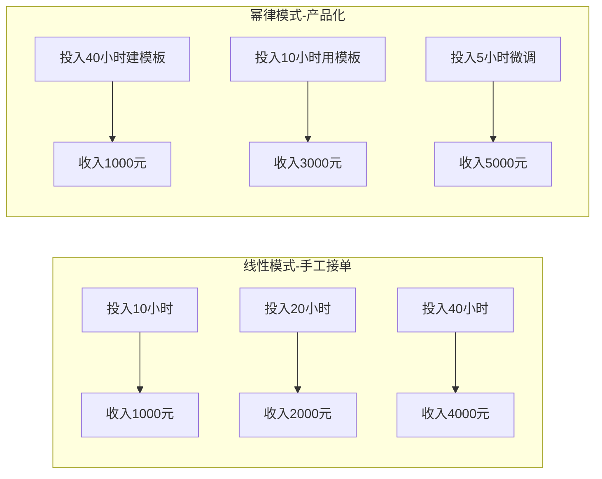
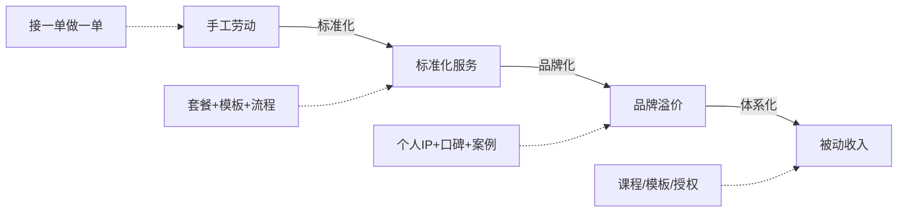
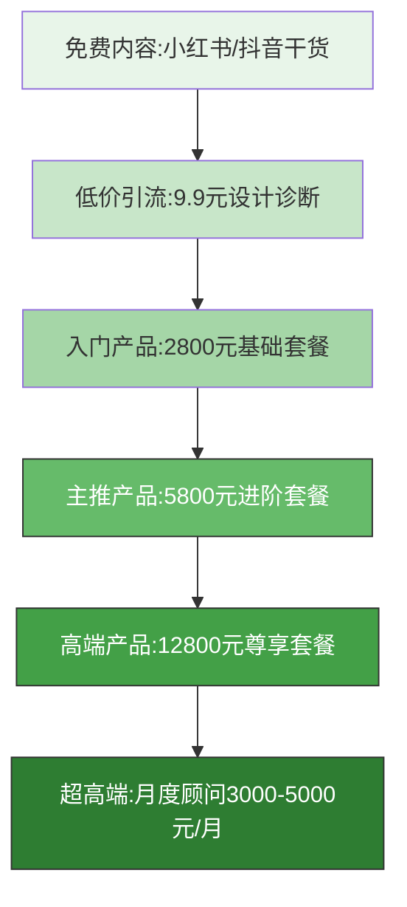
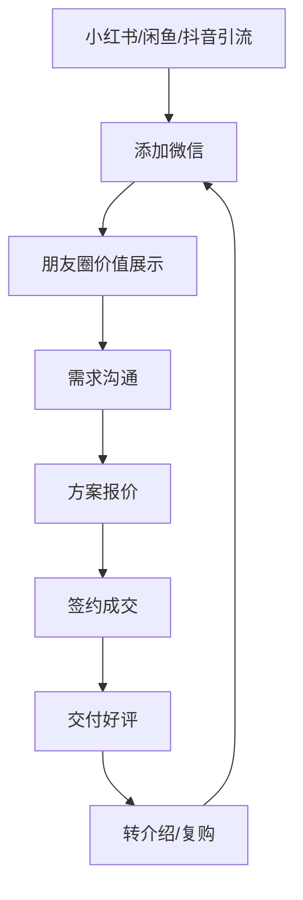
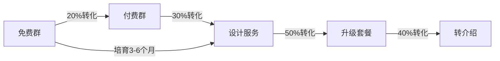
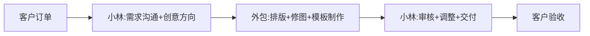
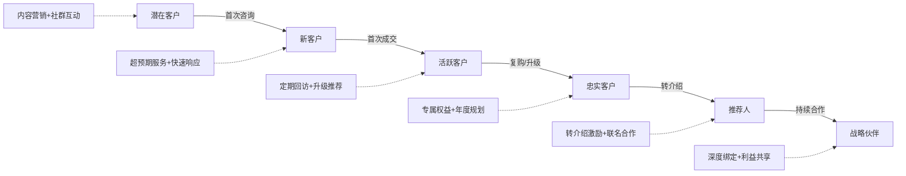
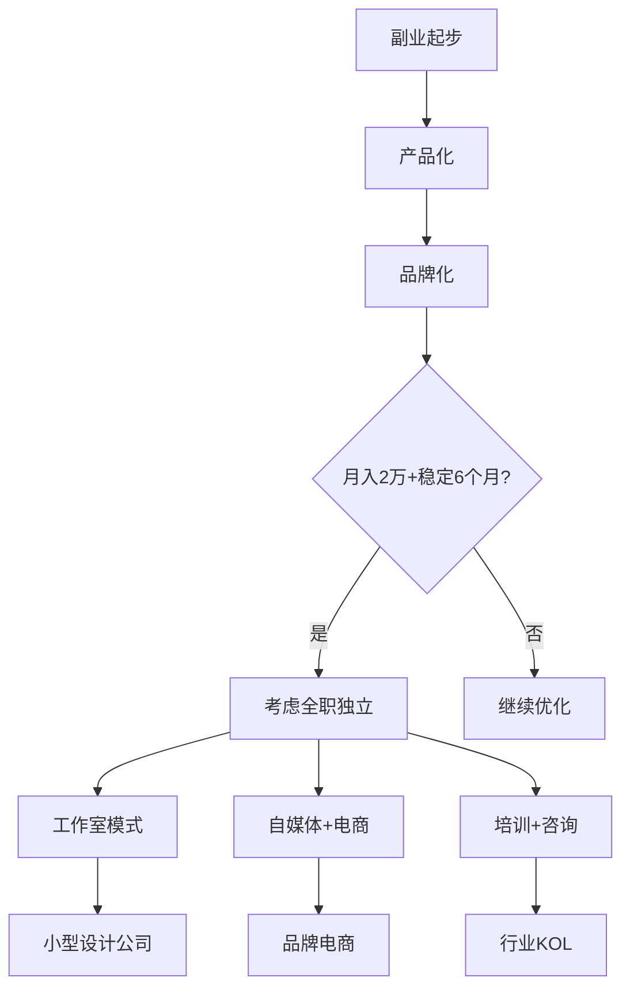
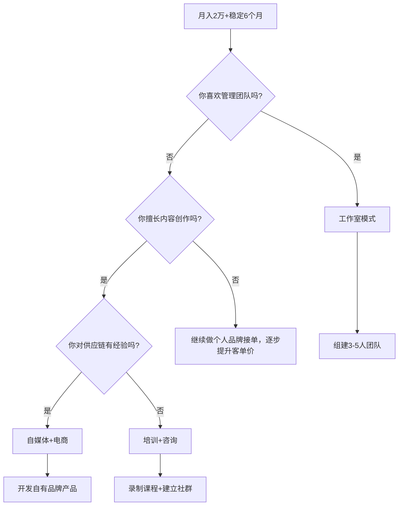
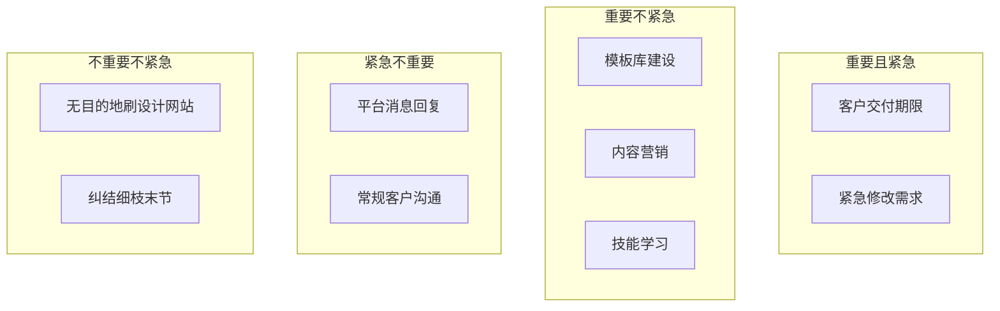

## 案例六：产品化副业——从手工到品牌

> **本案例核心命题：** 为什么同样做设计，有人时薪50元，有人时薪800元？差距不在技术，在商业模式。本章拆解一条从"零售时间"到"经营资产"的完整路径，所有方法论可直接迁移到摄影、写作、编程、咨询等技能型副业。

> 从接一单做一单的手工劳动，到建立可复制、可定价、有溢价的品牌体系——这是副业变现最具"复利效应"的一条路径。本章以一位UI设计师的真实转型为主线，但其中的方法论适用于所有"技能型副业"的产品化升级。

**先看结果，再看过程。** 以下是小林12个月后的经营数据，读完全文你会理解每一个数字背后的逻辑：

```text
┌─────────────────────────────────────────────────────────────────────┐
│  小林的12个月蜕变                                                     │
│                                                                     │
│  月收入：1,500元 → 18,000元（12倍）                                    │
│  时薪：  50元 → 500-800元（10-16倍）                                  │
│  周末：  全天加班 → 基本不工作                                         │
│  被动收入：0% → 35%（月均6,300元"睡后收入"）                            │
│  客户类型：比价散客 → 慕名而来的精准客户                                │
│  复购率：  10% → 65%                                                  │
│  小红书：  0粉 → 12,000粉                                             │
│                                                                     │
│  核心转变：从"卖时间"到"卖方案"到"卖品牌"                                │
└─────────────────────────────────────────────────────────────────────┘
```

### 案例背景

小林，28岁，互联网公司UI设计师，月薪15K。2023年初，她利用业余时间在小红书和闲鱼上接私单——帮人做Logo、海报、社交媒体配图，每单收费200-500元，月均接3-5单，副业收入约1500元/月。

**核心痛点：**

| 痛点维度 | 具体表现 | 量化影响 |
|---------|---------|---------|
| 时间换钱 | 每单从沟通到交付需4-8小时，反复修改占总工时40% | 时薪仅50-80元，低于主业时薪(85元) |
| 无积累性 | 做完一单归零，没有品牌溢价，客户只看价格 | 100%的客户首次比价后才下单 |
| 体力天花板 | 周末全部搭进去，工作日也经常加班改图 | 每周副业占用15-20小时 |
| 被动等单 | 依赖平台流量，没有稳定的获客渠道 | 月收入波动幅度±50% |
| 定价被动 | 客户开口就砍价，"别人家才150" | 实际成交价比报价低30% |
| 无品牌辨识度 | 和其他兼职设计师没有区分度 | 客户无法转介绍（"就是找了个做图的"） |
| 合同意识薄弱 | 口头约定，出纠纷时无据可依 | 曾因客户拒付尾款损失2000元 |

这个阶段的困境非常典型——**用体力换收入，收入上限被时间锁死**。小林算了一笔账：按当前模式，副业收入上限 = 每月可用时间(80小时) × 时薪(80元) = 6400元。扣掉沟通、改稿、等单的空转时间，实际天花板约4000元。如果不改变模式，副业永远只能是"加班的另一种形式"。

**这个困境的深层原因是什么？** 不是能力不够，而是**商业模式的问题**。手工接单的本质是"零售时间"，而时间是最稀缺的资源。产品化的核心，就是让你的价值输出不再与你的投入时间成线性关系。

#### 理论基础：为什么"卖时间"注定有天花板

从经济学视角看，手工接单遵循的是**线性生产函数**——产出（收入）与投入（时间）成正比。这意味着：

1. **边际收益递减**：当你接更多单时，每单的质量和客户体验都在下降（疲劳、赶工、沟通粗糙），导致客单价被迫降低或差评增加。
2. **零边际成本优势不存在**：你无法"复制"自己。每一次交付都从零开始消耗等量时间，不存在规模效应。
3. **风险集中**：一旦你生病、休假或主业加班，副业收入立刻归零——收入完全绑定在你这个"人"身上。
4. **议价权缺失**：客户知道你在"卖时间"，会本能地压低时薪。而"卖方案"的从业者，客户关注的是方案能解决什么问题，而非你花了多少时间。

产品化转型的本质，是将线性生产函数改造为**幂律生产函数**：前期投入固定成本（模板、品牌、内容资产），后期每增加一单位产出的边际成本趋近于零。这就是"复利效应"在副业领域的具体体现——你不是在"做更多单"，而是在"让每一单的价值更大、每一份投入持续产生回报"。



**时间价值的三重陷阱：**

| 陷阱 | 表现 | 真实成本 |
|------|------|---------|
| 沟通黑洞 | 需求不清→反复确认→来回改稿 | 占总工时30-50%，但不产生直接价值 |
| 定制诅咒 | 每单从零开始，没有可复用的积累 | 做100单和做10单的效率几乎一样 |
| 平台依赖 | 流量来自平台，客户不知道你是谁 | 平台抽成+算法变化=收入不可控 |

**经济学中"规模经济"的个人版：** 传统企业的规模经济来自厂房、设备、人员的复用。个人副业的规模经济来自模板、流程、品牌、内容资产的复用。小林的产品化转型，本质上是在个人层面实现了规模经济——用25小时建设模板库，3个月节省135小时，这就是个人版的"固定资产投资回报"。

---

### 产品化转型的底层逻辑

#### 什么是"产品化"？

产品化的核心是**将一次性的服务交付，转化为可标准化、可规模化、可溢价的价值输出**。



**产品化的四个阶段对比：**

| 阶段 | 模式 | 时薪 | 收入天花板 | 可复制性 | 典型特征 | 过渡条件 |
|------|------|------|-----------|---------|---------|---------|
| 手工劳动 | 接单→交付 | 50-100元 | 时间×时薪 | 极低 | 每单从零开始，客户只比价 | — |
| 标准化服务 | 套餐定价 | 200-500元 | 线性增长 | 中等 | 有流程、有模板、有报价体系 | 完成3单以上同类项目 |
| 品牌溢价 | 溢价定价 | 500-2000元 | 品牌认知×产能 | 较高 | 客户慕名而来，愿意付溢价 | 内容触达5000+精准用户 |
| 被动收入 | 产品/课程/授权 | 不限 | 几乎无限 | 极高 | 收入与个人时间脱钩 | 积累30+案例和成熟方法论 |

#### 产品化的三个关键转变

**转变一：从"卖时间"到"卖方案"**

手工阶段，客户买的是你画了几个小时。产品化之后，客户买的是"解决方案"——一套能帮他的烘焙店提升品牌形象、吸引更多顾客的完整方案。定价的锚点从"你的成本"变成"客户获得的价值"。同样一个Logo，花3小时做完卖300元，还是花2小时（因为有模板）卖2800元——区别在于你卖的是"帮你打造专业品牌形象"而不是"帮你画个图"。

**定价锚点转换的心理练习：**

```text
问自己三个问题：
1. 我的设计帮客户多赚了多少钱？（价值锚）
2. 客户自己做这件事要花多少时间/金钱？（替代成本锚）
3. 市场上同等质量的服务卖多少钱？（市场锚）

取三个锚点中最高的那个作为定价起点，而不是从"我花了多少小时"出发。
```

**转变二：从"散客"到"体系"**

建立标准化的报价体系（三档套餐）、服务流程（从需求收集到售后的SOP）、交付标准（明确的修改次数、文件格式、交付清单）。有了体系，每接一单的边际成本大幅下降——不用每次重新报价、重新沟通流程、重新整理交付物。

**体系化的三个支柱：**

| 支柱 | 包含什么 | 建设时间 | 复利效应 |
|------|---------|---------|---------|
| 报价体系 | 三档套餐+价格表+话术模板 | 2天 | 省去每次重新定价的时间，客户感知更专业 |
| 服务SOP | 需求问卷→签约→设计→反馈→交付→售后 | 3天 | 新手也能照着执行，为团队扩张打基础 |
| 交付标准 | 文件规范+命名规范+清单+使用指南 | 1天 | 交付物统一，减少客户"不知道怎么用"的售后 |

**转变三：从"个人能力"到"品牌资产"**

让客户为"你这个人"付费，而不是为"这类服务"付费。品牌资产包括：专业口碑（客户好评和案例积累）、内容影响力（小红书粉丝和内容沉淀）、行业认知（"找品牌设计就找小林"的心智占位）。这些资产会随时间增值，而手工劳动不会。

**品牌资产vs个人能力的本质区别：**

| 维度 | 个人能力 | 品牌资产 |
|------|---------|---------|
| 价值归属 | 绑定在你身上，你走了就没了 | 独立存在，可以转让、授权、出售 |
| 增长曲线 | 线性（每天最多24小时） | 指数（内容持续被搜索、推荐） |
| 可继承性 | 不可继承 | 可以交给团队、授权给他人 |
| 风险特征 | 一人生病全家喝西北风 | 多渠道+多产品分散风险 |
| 定价权 | 客户比价，你没有议价权 | 客户认品牌，你有定价权 |
| 护城河 | 技能可被模仿 | 品牌认知难以复制 |

> **关键认知：** 品牌资产不是"做大了才有"的东西。你发的第一篇小红书笔记、你的第一个标准化报价模板、你的第一份客户好评——这些都是品牌资产的种子。从第一天起就有意识地积累，比"等做大了再考虑"提前了半年到一年。

#### 产品化适用性自检表

不是所有副业都适合产品化。在投入时间之前，用这张表自检：

| 评估维度 | 高适用性 | 低适用性 | 你的评分(1-5) |
|---------|---------|---------|--------------|
| 标准化程度 | 服务可拆解为固定步骤和交付物 | 每次都是"看情况"的定制工作 | |
| 需求频次 | 客户有重复需求或市场规模大 | 极低频、一次性需求 | |
| 差异化空间 | 能找到独特定位和风格 | 高度同质化、纯价格竞争 | |
| 内容展示性 | 成果可视觉化、可截图分享 | 成果不可见或难以展示 | |
| 定价弹性 | 客户关注价值多于价格 | 客户极度价格敏感 | |
| 技能壁垒 | 需要长期积累，不易被速成 | 可快速学会，替代性强 | |
| 可模板化程度 | 60%以上工作步骤可复用 | 每单都是全新创作 | |
| 客户教育成本 | 客户能快速理解你卖什么 | 需要花大量时间解释服务价值 | |

**评分说明：** 总分30分以上，产品化潜力高；20-29分，需要找到差异化切入点；20分以下，建议先提升技能壁垒再考虑产品化。

**不同行业的适用性参考：**

| 行业 | 标准化 | 需求频次 | 差异化 | 展示性 | 定价弹性 | 壁垒 | 适用度 |
|------|--------|---------|--------|--------|---------|------|--------|
| Logo/品牌设计 | ★★★★ | ★★★★★ | ★★★★ | ★★★★★ | ★★★★ | ★★★ | 极高 |
| 短视频拍摄 | ★★★★ | ★★★★ | ★★★ | ★★★★★ | ★★★ | ★★★ | 高 |
| 简历优化 | ★★★★★ | ★★★ | ★★★ | ★★ | ★★ | ★★ | 中 |
| 心理咨询 | ★★ | ★★★★ | ★★★ | ★ | ★★★★ | ★★★★★ | 中 |
| 法律文书 | ★★★★ | ★★★ | ★★★ | ★ | ★★★★ | ★★★★★ | 中高 |
| 宠物写真 | ★★★★ | ★★★ | ★★★★ | ★★★★★ | ★★★ | ★★ | 高 |

---

### 第一阶段：技能梳理与市场定位（第1-2周）

#### 盘点自身技能资产

小林首先对自己的技能做了系统盘点：

| 技能维度 | 具体能力 | 市场需求 | 变现潜力 | 产品化难度 |
|---------|---------|---------|---------|-----------|
| 核心技能 | UI设计、Logo设计、排版 | 高 | 高 | 中（可标准化） |
| 辅助技能 | 摄影后期、动效设计 | 中 | 中 | 低（容易被AI替代） |
| 软技能 | 需求沟通、审美能力 | 高 | 间接变现 | 高（难以显性化） |
| 积累资产 | 过往作品集、客户评价 | 中 | 品牌背书 | 低（直接复用） |

**关键洞察：** 不是所有技能都值得产品化。要找到那个**交集——你擅长、市场需要、且能标准化交付**的领域。具体来说：

- **能标准化** = 你能写出"做这件事的10个步骤"，而且80%的项目都适用
- **有市场需求** = 在电商平台/社交媒体上搜索相关关键词，能看到活跃的交易和讨论
- **你能做到前20%** = 不需要是行业顶尖，但要比大多数兼职选手明显好一截

**技能资产盘点模板（可直接复用）：**

```text
1. 列出你所有会的技能（不限于工作技能，兴趣爱好也算）
2. 对每项技能打分：熟练度(1-5) × 市场需求(1-5) × 标准化潜力(1-5)
3. 取总分最高的3项，进入下一步调研
4. 对这3项分别回答：我能比市面上80%的人做得更好吗？
5. 最终锁定1-2项作为产品化的起点
```

**隐藏技能挖掘清单：** 很多人低估了自己会的东西。以下场景中的"顺手做的事"往往是产品化的好方向：

- 同事/朋友经常来找你帮忙做的事（说明你在这个领域有口碑）
- 你自学过且做出过成果的技能（说明你能教会别人）
- 你花了很多时间和金钱学习的领域（说明你有深度积累）
- 你做过且收到好评的副业/兼职（说明市场已验证）

#### 市场调研方法

小林做了三件事来验证方向：

**1. 平台数据调研（1天）**

- 在小红书搜索"Logo设计""品牌设计""烘焙店设计"等关键词，分析爆款笔记的共性：封面风格、标题公式、评论区的高频需求
- 在闲鱼搜索同类服务，记录价格区间、销量、评价关键词——特别注意差评在说什么，那就是你的机会
- 在淘宝/猪八戒网查看专业设计服务商的定价和套餐结构——你的定价不需要和他们一样，但要了解市场的价格锚点
- 用新榜/千瓜数据查看同类账号的粉丝量、互动率、内容风格
- 在抖音搜索同类服务，对比小红书和抖音的用户画像差异——同一个人在两个平台的消费行为可能完全不同

**平台调研数据记录模板：**

| 平台 | 关键词 | 搜索结果数 | Top10平均价格 | Top10平均销量 | 高频好评关键词 | 高频差评关键词 |
|------|-------|-----------|-------------|-------------|-------------|-------------|
| 小红书 | Logo设计 | | | | | |
| 闲鱼 | 品牌设计 | | | | | |
| 淘宝 | 店铺VI设计 | | | | | |
| 抖音 | 品牌视觉设计 | | | | | |
| 猪八戒 | 品牌设计全套 | | | | | |

**调研效率技巧：**
- 用"关键词变体法"扩大搜索范围：除了核心词，搜同义词（品牌设计/VI设计/视觉设计）、场景词（烘焙店设计/咖啡馆Logo）、长尾词（小店铺Logo设计多少钱）
- 记录时用截图+文字的方式，一周后回看时记忆更清晰
- 重点关注"差评"和"追问"——差评告诉你市场缺什么，追问告诉你客户真正想要什么

**2. 目标用户访谈（3天）**

找5-10个曾经找人做过设计的创业者/自媒体人，问三个核心问题：

- "你找设计时最看重什么？"（发现需求优先级）
- "你觉得多少钱合理？"（验证定价空间）
- "你遇到过哪些不满意的情况？"（找到差异化机会）

小林发现：客户最在意的不是"设计得多好看"，而是**"能不能理解我的需求"+"交付速度"+"改到满意"**。这颠覆了她的认知——她以为客户要的是"美"，实际上客户要的是"省心"。

**访谈技巧：**
- 不要问"你觉得XX好不好"（引导性问题），要问"你上次找设计的体验怎么样"（开放性问题）
- 记录原话而不是你的理解，原话中的关键词就是你后续营销的素材
- 如果5个人中有3个以上提到同一个痛点，那就是核心痛点
- 访谈对象要覆盖不同预算层级：只访谈低价客户，你的定价天花板会很低

**访谈对象招募渠道：**
- 朋友圈发布"免费设计诊断"活动，吸引创业者来咨询（顺便完成访谈）
- 在创业社群、店主群里发问卷（用红包激励）
- 让已有客户推荐他们的同行朋友

**3. 竞品分析（2天）**

收集10个做得好的设计类副业账号，分析他们的：

| 分析维度 | 记录内容 | 你能借鉴什么 |
|---------|---------|------------|
| 定价策略 | 按件/按套餐/按时长？价格区间？ | 定价框架参考 |
| 服务内容 | 包含什么？不包含什么？ | 套餐设计参考 |
| 内容营销 | 发什么类型的内容？频率？ | 内容策略参考 |
| 获客渠道 | 主要从哪里获客？ | 渠道选择参考 |
| 客户维护 | 有无复购机制？转介绍激励？ | 客户运营参考 |
| 痛点/短板 | 差评在说什么？什么没做好？ | 差异化切入点 |
| 内容数据 | 粉丝量、互动率、爆款特征 | 设定合理的增长目标 |

**竞品分析的"反面思考法"：** 不只看竞品做对了什么，更要看竞品**没做什么**。这些"没做的"就是你的蓝海机会：

- 竞品只做Logo不做全套品牌视觉？→ 你做一站式方案
- 竞品只在小红书？→ 你也做抖音+B站
- 竞品从不展示过程？→ 你做"设计过程全记录"
- 竞品报价不透明？→ 你公开套餐价格

#### 确定差异化定位

经过调研，小林锁定了一个细分方向：**"新消费品牌视觉设计"**——专门为新消费领域的创业者（烘焙店、咖啡馆、花店、民宿等）提供一站式品牌视觉方案。

**选择这个方向的理由：**

- **市场空间大**：这类创业者预算有限（5000-20000元），大设计公司看不上（最低起做价3-5万），但需求真实且持续——每年有大量新店开业
- **需求链条长**：他们需要的不只是一个Logo，而是**一整套可落地的品牌视觉**（Logo+名片+菜单+包装+社交媒体模板），客单价自然被拉高
- **内容素材多**：这类设计成果天然适合在小红书传播——漂亮的烘焙店设计、ins风的咖啡馆视觉，自带流量属性
- **竞争相对小**：大设计师不屑于做这个价位，兼职选手又没有系统化能力，中间地带正好是她的机会

**差异化定位公式：**

```text
你的定位 = [目标人群] + [具体场景] + [核心价值主张]

小林的定位：为新消费创业者提供"省心、落地、有温度"的品牌视觉方案
```

**定位验证三问：**
1. 你能用一句话说清楚"你是谁、服务谁、解决什么问题"吗？
2. 客户听到这句话，能立刻判断"这适不适合我"吗？
3. 和竞品相比，这个定位有明显的区分度吗？

如果三个问题的答案都是"是"，定位基本成立。

**定位的"窄到恐惧"测试：** 如果你觉得"我的定位会不会太窄了？"——说明窄对了。小众定位的优势在于：获客精准（广告费省一半）、竞争少（不用和大V抢流量）、专业度高（客户觉得你懂行）。宁可做一个细分领域的第一名，也不要做十个领域的平均水平。

---

### 第二阶段：打造标准化产品体系（第3-6周）

#### 设计服务套餐

小林将散乱的服务重新打包为三个阶梯套餐：

| 套餐名称 | 包含内容 | 定价 | 交付周期 | 目标客户 | 成本构成 |
|---------|---------|------|---------|---------|---------|
| 基础版 | Logo设计（3稿选1）+ 名片设计 + 基础VI手册 | 2800元 | 5个工作日 | 刚起步的个体户 | 时间成本约1200元 |
| 进阶版 | Logo + 名片 + 菜单/包装设计 + 社交媒体模板10套 | 5800元 | 10个工作日 | 小型连锁/成熟店铺 | 时间成本约1800元，外包约500元 |
| 尊享版 | 全套品牌VI + 包装系统 + 物料设计 + 3个月售后支持 | 12800元 | 20个工作日 | 有品牌意识的创业者 | 时间成本约3500元，外包约1500元 |

**定价逻辑详解：**

- **基础版**覆盖"入门客户"，利润率约60%。作用是获客——低门槛让客户先体验你的服务，后续有升级需求时自然选进阶版。这类客户虽然利润不高，但数量大，是稳定的现金流来源。
- **进阶版**是主推款，利润率约70%，性价比最高。在报价时将其放在中间位置，利用"锚定效应"——左边2800显得单薄，右边12800显得贵，5800恰好"够用且不贵"。
- **尊享版**是利润款，利润率约75%。即使成交率低（大概10-15%的客户选这个），它的存在本身就提升了品牌调性——"原来她还做12800的项目"。

**定价心理学要点：**

| 策略 | 原理 | 操作方法 |
|------|------|---------|
| 锚定效应 | 先看到高价，再看中价觉得便宜 | 报价从高到低：先说尊享版，再说进阶版 |
| 价格尾数 | 2800比3000感觉便宜很多，但只差200 | 用"非整数"定价，如2800、5800、12800 |
| 损失框架 | "不选会错过什么"比"选了能得到什么"更有驱动力 | "进阶版包含10套社交媒体模板，单独购买需要1500元" |
| 社会认同 | 别人都在选，我也选 | "80%的客户选择进阶版" |
| 稀缺性 | 限量产生紧迫感 | "本月剩余3个档期"（但要真实，不要虚假制造） |
| 捆绑收益 | 套餐比单买划算 | "全套购买比单独购买节省40%" |

> **定价心法：** 不要按"我做了多少小时"定价，要按"客户获得了多少价值"定价。一个好Logo帮烘焙店多吸引20%的顾客，2800元对客户来说是极划算的投资。如果客户说"太贵了"，问题不在价格，在于你没有让他感受到价值。

**涨价策略：**

```text
• 每6个月评估一次定价，按10-20%的幅度调整
• 新客户用新价格，老客户保持签约时的老价格（维护关系）
• 涨价的合理理由：案例积累更多、服务内容更丰富、交付质量更高
• 涨价前1个月，在社交媒体上发布"价格调整预告"，给犹豫的客户最后的决策窗口
• 如果涨价后成交率下降超过30%，说明要么涨幅太大，要么价值包装不到位
```

#### 高级定价策略与价值阶梯

在基础的三档套餐之上，成熟的副业经营者需要掌握更深层的定价策略。定价不只是"收多少钱"，更是一种筛选客户、塑造品牌认知、优化收入结构的系统工程。

**价值阶梯定价模型：**

价值阶梯的核心思想是：让不同预算的客户都能在你这里找到合适的选择，但每个层级的"性价比感知"都指向你最希望客户选择的那个档位。



**每一层的价值逻辑：**

| 层级 | 价格 | 客户获得 | 你的目的 | 定价依据 |
|------|------|---------|---------|---------|
| 免费内容 | 0元 | 知识和灵感 | 获取流量和信任 | 内容营销成本 |
| 低价引流 | 9.9-99元 | 具体问题的诊断报告 | 筛选有付费意愿的客户 | 客户的"试错成本" |
| 入门产品 | 2800元 | 解决基本设计需求 | 建立口碑，获得案例 | 客户的"起步预算" |
| 主推产品 | 5800元 | 完整的品牌方案 | 核心利润来源 | 客户的"理想预算" |
| 高端产品 | 12800元 | 一站式品牌体系 | 利润放大器 | 客户的"品牌投资" |
| 超高端服务 | 3000-5000元/月 | 持续的品牌顾问 | 时间杠杆最大化 | 客户的"战略投资" |

**动态定价策略——根据供需关系实时调整：**

很多副业经营者一年只定价一次，这是巨大的浪费。成熟的定价应该是动态的——根据你的产能、季节、客户类型灵活调整：

- **产能饱和期**（同时有3个以上项目在进行）：报价上调15-20%，用价格筛选出最匹配的客户
- **产能闲置期**（连续2周没有新项目）：提供限时优惠（如"本月预约享9折"），但不要公开降价
- **旺季**（设计行业3-5月、9-11月）：提前1个月涨价10-15%，并限制接单数量
- **淡季**：不做设计折扣，而是推出"年度品牌维护套餐"等新产品，拉动淡季收入

**价格歧视的合理运用：**

| 策略 | 具体做法 | 合理性 |
|------|---------|--------|
| 地域差异 | 一线城市客户按标准价，三四线城市适当下调 | 客户支付能力和市场竞争程度不同 |
| 行业差异 | 高利润行业（医美、金融）适当上浮，个体户适当下调 | 客户的投资回报率不同 |
| 紧急程度 | 标准交付周期不变，加急费为总价的30-50% | 你的额外时间成本和机会成本 |
| 批量优惠 | 同一客户同时订购多个套餐，总价优惠10-15% | 降低获客成本和沟通成本 |
| 转介绍优惠 | 老客户推荐新客户，双方各享5%折扣 | 降低获客成本，激励口碑传播 |

> **定价红线：** 永远不要因为"客户说贵"就直接降价。降价会破坏你的价格体系，让已付费客户觉得亏了，让新客户觉得你的报价水分大。正确的做法是"降档不降价"——推荐更低档的套餐，或者减少服务内容但保持单价不变。

**报价话术升级版：**

```text
您好！感谢您的咨询。

根据您描述的需求，我推荐「进阶版」套餐（最受客户欢迎的选择）：

📋 包含内容：
• 品牌Logo设计（3个方向，每个方向2个变体，共6个方案供选择）
• 名片设计（正反面，含印刷文件）
• 菜单/价目表设计（A4双面，含后续内容更新模板）
• 社交媒体视觉模板10套（小红书/朋友圈/抖音封面）
• 品牌色彩与字体规范手册

💰 价格：5800元
⏰ 交付周期：10个工作日
🔄 修改次数：每个交付物包含3次修改（超出部分100元/次）

📎 以下是类似项目的案例展示：[链接]

💡 补充说明：
• 所有源文件（AI/PSD格式）一并交付，后续可自行修改
• 交付后30天内免费微调
• 如后续需要扩展物料（包装、海报等），老客户享8折优惠

如果您有任何疑问，随时沟通。确认后我们签订电子合同，预付50%即可开工。
```

**应对"太贵了"的三种话术：**

```text
话术一（价值对比法）：
"理解您的顾虑。您看，这个方案包含Logo+名片+菜单+10套社交媒体模板，
如果分开找人做，至少需要8000元以上。套餐价格5800，相当于省了30%。
而且统一设计的视觉效果，比东拼西凑的效果好得多。"

话术二（ROI算法）：
"这个品牌方案帮您的店铺建立专业的视觉形象，假设每月因此多吸引
20位顾客，每人消费50元，一个月就是1000元的额外收入。
5800元的投入，不到6个月就回本了。"

话术三（降档不降价）：
"如果预算有限，我推荐先做基础版2800元，包含Logo+名片+基础VI手册。
等店铺走上正轨后，再升级到进阶版。老客户升级只需补差价。"
```

#### 建立标准化交付流程

```text
需求收集 → 签约付款 → 初稿设计 → 客户反馈 → 修改完善 → 最终交付 → 售后支持
   │            │           │           │           │           │           │
   ▼            ▼           ▼           ▼           ▼           ▼           ▼
 标准问卷    电子合同     3个方向    最多3次修改   源文件交付   使用指南    7天免费微调
 需求电话    预付50%     设计说明    修改记录表    品牌手册    维护建议    续约优惠
```

**每个环节的关键控制点：**

| 环节 | 关键动作 | 常见踩坑 | 防范措施 |
|------|---------|---------|---------|
| 需求收集 | 标准问卷+30分钟电话 | 客户说不清楚需求，导致后续大改 | 用参考图让客户"指"而不是"说"，提前确认风格方向 |
| 签约付款 | 电子合同+预付50% | 客户拖延付款或口头答应不签合同 | 不付款不开工，这是底线 |
| 初稿设计 | 3个方向供选择 | 给太多选择反而让客户纠结 | 3个方向足够，且每个方向有明确的设计说明 |
| 客户反馈 | 书面反馈+修改记录表 | 客户口头说"感觉不对"但说不清哪里 | 提供结构化反馈表：喜欢什么/不喜欢什么/想改成什么样 |
| 修改完善 | 最多3次修改 | "再改改"无限循环 | 合同写明次数，超出部分按次收费 |
| 最终交付 | 源文件+使用指南 | 客户拿到源文件不会用 | 附送PDF版使用指南+30分钟视频教程 |
| 售后支持 | 7天免费微调 | 客户3个月后来找你"微调" | 明确"微调"的定义和时间范围 |

**结构化反馈表模板：**

```text
请在以下方面给出您的反馈（请尽量具体）：

1. 整体感觉（1-10分）：___
2. 最喜欢的部分是：___（具体到颜色/字体/图形等）
3. 最不满意的部分是：___
4. 希望调整的方向：___（请参考以下选项或自行描述）
   □ 颜色偏暖/冷
   □ 字体更正式/更活泼
   □ 图形更简约/更丰富
   □ 整体风格参考：[附参考图]
5. 其他意见：___
```

**核心工具链：**

| 环节 | 工具 | 替代方案 | 选择理由 |
|------|------|---------|---------|
| 需求收集 | 腾讯文档在线问卷 | 金数据、问卷星 | 免费、客户熟悉、可导出数据 |
| 合同签约 | e签宝电子合同 | 法大大、上上签 | 法律效力+专业感+模板丰富 |
| 设计协作 | Figma | 蓝湖、墨刀 | 在线预览+实时协作+客户无需安装 |
| 文件交付 | 蓝奏云+百度网盘 | 阿里云盘、坚果云 | 蓝奏云不限速下载，网盘做备份 |
| 客户管理 | Notion | 飞书多维表格、Airtable | 灵活的数据库+看板+日历视图 |
| 财务记账 | 随手记/钱迹 | Excel表格 | 自动分类+报表导出 |
| 项目管理 | Notion看板 | Trello、飞书项目 | 免费+灵活+支持多视图 |
| 时间追踪 | Toggl | 番茄土豆、时间块 | 精确记录每单工时，用于优化定价 |

#### 模板化与效率提升

小林花了一周时间建立了自己的**设计模板库**：

- **Logo设计模板库**：按行业分类（餐饮、零售、服务业等），每个行业10-15个基础构型。不是直接套模板，而是用模板做"起点"——在此基础上做30%以上的定制修改，保证每个作品的独特性。
- **配色方案库**：按风格分类（清新、复古、高端、活力等），每种风格5套配色。每套配色标注了色值、适用场景、搭配字体。
- **字体搭配库**：按场景分类（标题字体+正文字体+装饰字体），全部使用免费商用字体或已购买授权的字体。这是很多新手设计师忽略的——**字体侵权的赔偿金额通常在3000-50000元**，远超一套字体的授权费。
- **排版模板库**：名片、菜单、海报、社交媒体等常用尺寸的排版模板。每个模板包含网格系统、参考线、常用版式。
- **交付模板库**：品牌手册模板、使用指南模板、文件命名规范、文件夹结构模板。

有了模板库，基础版套餐的交付时间从5天缩短到2-3天，效率提升60%以上。

**模板库建设的投入产出分析：**

| 模板类型 | 建设时间 | 使用频次 | 每次节省时间 | 3个月累计节省 |
|---------|---------|---------|------------|-------------|
| Logo基础构型 | 8小时 | 每单使用 | 2小时 | 约60小时 |
| 配色方案库 | 4小时 | 每单使用 | 0.5小时 | 约15小时 |
| 字体搭配库 | 3小时 | 每单使用 | 0.5小时 | 约15小时 |
| 排版模板库 | 6小时 | 每单使用 | 1小时 | 约30小时 |
| 交付模板库 | 4小时 | 每单使用 | 0.5小时 | 约15小时 |
| **合计** | **25小时** | | | **约135小时** |

投入25小时建设模板库，3个月就能节省135小时——相当于每周多出11小时可以用来接单或休息。这就是"产品化"思维：前期投入时间构建可复用资产，后期持续获得回报。

**模板库的维护原则：**
- 每完成一个项目，从中提取3-5个可复用的元素加入模板库
- 每季度清理一次，删除不再使用的模板，更新过时的元素
- 记录每个模板的使用频率和客户反馈，淘汰效果差的

---

### 第三阶段：内容营销与品牌建设（第4-12周）

#### 多平台内容矩阵策略

内容营销不是只做小红书。小林采用了**一鱼多吃**的策略——一个案例，多个平台，不同形式：

| 平台 | 内容形式 | 发布频率 | 目标受众 | 获客效率 | 内容调性 |
|------|---------|---------|---------|---------|---------|
| 小红书 | 图文笔记+视频 | 每周4-5篇 | 25-35岁女性创业者/店主 | ★★★★★ | 精致、ins风、干货+种草 |
| 抖音 | 短视频（设计过程/对比） | 每周2-3条 | 泛人群+创业者 | ★★★★ | 节奏快、视觉冲击、反差感 |
| B站 | 长视频教程/设计师日常 | 每周1条 | 设计爱好者/同行 | ★★★ | 专业、深度、人设感 |
| 微信视频号 | 短视频+直播 | 每周2条+月1场直播 | 私域客户+朋友圈 | ★★★★ | 真诚、接地气、互动感 |
| 微信公众号 | 深度案例文章 | 每月2篇 | 有决策权的企业主 | ★★★ | 专业、有深度、可留存 |

**"一鱼多吃"工作流：**

```text
一个设计案例完成
    │
    ├── 小红书：9宫格对比图 + 500字文案（15分钟）
    ├── 抖音：30秒设计过程快剪 + before/after（30分钟）
    ├── B站：10分钟设计过程详解+讲解（1小时，可延后发布）
    ├── 朋友圈：3张精选图 + 一句话感悟（5分钟）
    └── 公众号：3000字深度案例复盘（2小时，月度汇总）

总投入：约4小时，覆盖5个平台，触达不同人群
```

#### 小红书深度内容策略

小林在小红书上建立了系统的内容矩阵：

| 内容类型 | 发布频率 | 目的 | 示例标题 | 互动预期 |
|---------|---------|------|---------|---------|
| 案例展示 | 每周2篇 | 建立专业信任 | "给一家日式面包店做的品牌设计，老板说客流量涨了30%" | 点赞200+，收藏100+ |
| 设计教程 | 每周1篇 | 吸引精准粉丝 | "教你用Canva做出专业级菜单设计，3分钟学会" | 收藏300+，评论50+ |
| 行业洞察 | 每周1篇 | 展示专业深度 | "2024年新消费品牌设计的5个趋势" | 分享50+，关注转化高 |
| 日常分享 | 每周2篇 | 增加人格魅力 | "设计师的工作台长什么样？我的工具和装备分享" | 互动率高，涨粉快 |

**爆款内容公式：**

```text
标题 = 数字/情绪词 + 具体场景 + 利益点

高互动标题模板：
• "给300+小店做过品牌设计后，我总结了这5个最容易踩的坑"（经验+数字+避坑）
• "月薪3千和月薪3万的Logo差在哪？"（对比+悬念）
• "烘焙店老板必看：你的门头设计正在赶走顾客"（痛点+恐吓）
• "我花2小时做的设计，客户说比之前找的5000块的还好"（故事+反差）
• "90%的小店Logo都犯了这3个错误"（数据+痛点+具体数字）
• "看完这条笔记，你再也不用花冤枉钱找设计了"（利益承诺+情绪）
```

**内容日历示例（一周）：**

| 周一 | 周三 | 周五 | 周六 | 周日 |
|------|------|------|------|------|
| 案例展示 | 设计教程 | 行业洞察 | 日常分享 | 案例展示 |
| 发布时间12:00 | 发布时间18:00 | 发布时间12:00 | 发布时间10:00 | 发布时间18:00 |

**发布时间选择依据：** 小红书的流量高峰在午休(12:00-13:00)、下班路上(18:00-19:00)、睡前(21:00-22:00)。周一到周五选午休和下班时段，周末选上午和傍晚。

**小红书SEO优化要点：**
- 每篇笔记的正文必须包含3-5个目标关键词（自然植入，不要堆砌）
- 首图和标题决定80%的点击率——花最多时间在这两件事上
- 正文末尾加引导语："需要品牌设计可以私信我"（但不要每篇都加）
- 使用热门话题标签，但必须和内容相关
- 评论区回复越多，算法权重越高——前30分钟是黄金互动期

#### 抖音短视频策略

抖音的内容逻辑和小红书完全不同——**前三秒定生死，视觉冲击力优先**。

| 内容类型 | 时长 | 形式 | 示例 | 预期播放 |
|---------|------|------|------|---------|
| 设计过程快剪 | 15-30秒 | 加速录屏+卡点音乐 | "给烘焙店做Logo的60秒" | 1万-10万 |
| Before/After对比 | 10-20秒 | 左右分屏/转场 | "改之前vs改之后" | 5万-50万 |
| 设计翻车/趣事 | 30-60秒 | 口播+画面 | "客户说'五彩斑斓的黑'我是怎么理解的" | 10万+ |
| 行业科普 | 30-45秒 | 口播+文字卡片 | "为什么你的Logo看起来不专业" | 3万-20万 |

**抖音起号关键：** 前10条视频不要有任何广告痕迹，纯内容。用"设计过程快剪"类视频测试账号权重——这类视频制作成本低，能快速产出，且视觉吸引力强。

#### 从0到1000粉的冷启动策略

**第1-2周：基础内容积累**
- 先发10-15篇高质量笔记，确保主页有足够内容——用户点进你的主页，如果只有2-3篇笔记，很难产生信任
- 每篇笔记包含3-6张精美的设计作品图，第一张封面图决定80%的点击率
- 标题和正文包含目标关键词（品牌设计、Logo设计、店铺设计等），方便搜索流量进入
- 前10篇笔记不要有任何推广意图，纯粹展示专业能力

**第3-4周：主动互动引流**
- 每天在相关笔记下留有价值的评论（不是"好棒"，而是专业见解——比如在别人的设计作品下分析配色逻辑、字体选择）
- 关注同领域的博主，参与讨论，建立同行关系
- 加入设计/创业相关的社群，分享作品但不硬推销
- 每天花30分钟做这些"冷启动动作"

**第5-8周：优化内容策略**
- 分析哪类内容数据最好（看小红书创作者中心的数据），加大该类内容的比重
- 尝试不同的封面风格和标题公式，做A/B测试
- 开始在笔记中自然植入"可接设计私单"的信息——但不要每篇都植入，保持8:2的比例（80%纯内容，20%带转化意图）

**关键指标与时间预期：**

| 指标 | 4周目标 | 8周目标 | 12周目标 |
|------|--------|--------|---------|
| 粉丝数 | 300+ | 1000+ | 3000+ |
| 单篇平均互动量 | >30 | >50 | >100 |
| 每周私信咨询数 | 0-1个 | 2-3个 | 5-8个 |
| 内容产出效率 | 3小时/篇 | 2小时/篇 | 1.5小时/篇 |

#### 私域流量池搭建

小林建立了"设计咨询-私域-成交"的完整链路：



**微信承接的关键动作：**

- **添加后立刻发送**：自我介绍+作品集链接+服务说明PDF。不要等客户来问，主动提供信息。
- **打标签**：按来源渠道、需求类型、预算范围给每个潜在客户打标签，方便后续精准触达
- **设置备注**：记录客户的行业、需求、沟通要点，下次聊天时不用重新问

**朋友圈运营策略：**

| 内容类型 | 占比 | 发布时间 | 示例 |
|---------|------|---------|------|
| 设计作品分享 | 40% | 下午 | 新出炉的烘焙店品牌设计，从Logo到菜单一站搞定 |
| 客户好评/反馈 | 30% | 上午 | 客户发来的实拍图，比效果图还好看 |
| 设计干货/行业洞察 | 20% | 晚上 | 3个让你的菜单设计看起来更高级的小技巧 |
| 生活日常 | 10% | 随时 | 今天去了新开的咖啡馆，装修设计很有意思 |

**重要原则：** 不发硬广，通过价值输出吸引潜在客户主动咨询。朋友圈的本质是"展示"而不是"推销"。每周做一次"设计诊断"活动——免费帮粉丝分析一个设计案例，既能收集素材，又能吸引互动。

**朋友圈话术模板——设计诊断活动：**

```text
【本周设计诊断】免费名额3个 🔍

如果你的店铺/品牌有以下困扰：
- Logo总觉得不够专业，但说不清问题在哪
- 菜单/海报设计很乱，不知道怎么改
- 拍了好看的产品图，但配图文字总是不搭

直接私信我，发你的设计截图+简单描述
我会用15分钟帮你做一份简短的诊断报告
包含：问题分析 + 改进建议 + 参考案例

先到先得，本周3个名额 🙋‍♀️
```

**私域转化漏斗数据参考：**

```text
小红书曝光 10000次 → 主页访问 500人 → 私信咨询 20人 → 添加微信 15人
→ 需求沟通 10人 → 发送报价 8人 → 成交 3人 → 复购 2人 → 转介绍 1人

关键转化率：
• 曝光→主页：5%（取决于封面和标题）
• 主页→私信：4%（取决于主页内容和引导）
• 私信→微信：75%（取决于回复速度和专业度）
• 微信→成交：20%（取决于报价和价值包装）
```

#### 社群运营与付费社区

除了公域内容和私域朋友圈，小林还搭建了社群运营体系，这是很多副业经营者忽略的高价值渠道：

**社群的三种形态：**

| 社群类型 | 定位 | 人数 | 运营成本 | 价值 |
|---------|------|------|---------|------|
| 免费交流群 | 潜在客户聚集地 | 100-300人 | 低（每周发2-3次内容） | 培育信任、收集需求 |
| 付费会员群 | 深度服务+同行交流 | 30-80人 | 中（每周1次直播/答疑） | 稳定收入+口碑传播 |
| VIP客户群 | 售后服务+复购引导 | 10-30人 | 低（按需回复） | 复购率和转介绍的核心阵地 |

**免费交流群运营SOP：**

```text
群定位：XX行业品牌设计交流群
入群条件：关注小红书+私信申请
群规模：200人左右（太大管理不过来，太小没有氛围）

每周固定动作：
周一：分享1个设计干货（配色技巧/排版原则）
周三：发起互动话题（"你的店铺Logo是什么风格？晒出来大家帮忙看看"）
周五：分享1个行业案例+简短点评

群规则（入群时发送）：
1. 禁止发广告（违者踢出）
2. 欢迎分享自己的设计/店铺（互相交流）
3. 有问题可以直接@群主（工作日24小时内回复）
4. 每月1次免费设计诊断活动，仅限群成员参加
```

**付费会员群的产品设计：**

```text
「品牌设计研习社」季度会员 299元/季

包含权益：
• 每周1次设计直播课（45分钟，含实操演示）
• 每月1份行业设计趋势报告（PDF）
• 会员专属设计素材包（配色方案+字体推荐+排版模板）
• 群内1v1设计问题答疑（24小时内回复）
• 老会员续费享8折

适合人群：
• 正在筹备开店的创业者
• 想提升品牌视觉的店主
• 对设计感兴趣的职场人
```

**社群→成交的转化路径：**



**社群运营的关键指标：**

| 指标 | 计算方法 | 健康值 | 异常信号 |
|------|---------|--------|---------|
| 群活跃度 | 每日发言人数 ÷ 总人数 | >15% | <5%说明内容不吸引人 |
| 退群率 | 月退群人数 ÷ 总人数 | <5% | >10%说明群价值感低 |
| 咨询转化率 | 群内产生咨询数 ÷ 总人数 | >3%/月 | <1%说明引导不够 |
| 付费转化率 | 付费群成员 ÷ 免费群成员 | >10% | <5%说明付费产品价值感不足 |

---

### 第四阶段：规模化与被动收入（第13周起）

#### 从个人接单到团队协作

当月订单稳定在15单以上时，小林开始搭建协作体系：

**外包协作模式：**



- 基础设计工作（排版、修图、模板制作等）外包给2-3个兼职设计师
- 小林只负责核心创意、客户沟通和最终审核
- 通过Figma的协作功能实现远程协同——外包设计师在Figma里工作，小林实时查看进度

**外包成本控制：**

| 工作内容 | 外包单价 | 小林节省时间 | 小林的时间价值 | 净收益 |
|---------|---------|------------|-------------|-------|
| 菜单排版 | 200元 | 2小时 | 400元 | +200元 |
| 名片设计 | 100元 | 1小时 | 200元 | +100元 |
| 社交媒体模板 | 150元/套 | 1.5小时 | 300元 | +150元 |
| Logo基础构型 | 300元 | 3小时 | 600元 | +300元 |

**找外包设计师的渠道：**
- 站酷/Behance上找风格匹配的设计师，私信合作
- 大学设计专业的学生，性价比高，但需要更多指导
- 设计外包平台（猪八戒、一品威客），适合标准化程度高的简单任务
- 先用小单测试，质量稳定后再放量

**外包管理SOP：**
1. 提供详细的设计brief（参考图+尺寸+风格说明+交付格式）
2. 明确交付时间和质量标准
3. 第一次合作时做小单测试（100元以内的任务）
4. 建立设计师评分体系（质量/速度/沟通），优胜劣汰
5. 保持2-3个备选设计师，避免单一依赖

**外包质量控制流程：**

```text
小林接单 → 拆解任务 → 分配给外包 → 初步审核 → 细节调整 → 交付客户
                                      │
                                      ├── 通过 → 进入下一步
                                      └── 不通过 → 反馈修改（附具体修改意见截图）
```

**协作工具：**
- **任务分配**：Notion看板（To Do → In Progress → Review → Done）
- **文件协作**：Figma（实时协作，减少文件传输，版本管理自动保存）
- **沟通协调**：飞书群（项目群+文件共享+任务指派），避免微信群的信息淹没

**外包协议关键条款：**

```text
1. 保密义务：不得将客户信息和项目内容泄露给第三方
2. 知识产权：设计成果的著作权归甲方（小林）所有
3. 质量标准：首次交付合格率需达80%以上，低于此比例扣减10%费用
4. 交付时间：逾期1天扣减5%费用，逾期3天以上可单方面终止合作
5. 修改次数：包含2次修改，超出部分按50元/次结算
6. 付款方式：交付验收合格后7个工作日内支付
```

#### 构建被动收入管道

小林在稳定接单的同时，开始布局三条被动收入线：

**1. 设计模板售卖**

| 维度 | 详情 |
|------|------|
| 产品形态 | 将日常设计中通用性强的模板整理上架（社交媒体模板、名片模板、菜单模板等） |
| 售卖平台 | Canva模板市场（全球市场，美元定价）、站酷海洛、自己的小红书/微信小程序 |
| 定价策略 | 单套19-49元，套餐99-199元，年度会员499元 |
| 月均收入 | 2000-5000元（纯被动，上架后无需维护） |
| 关键成功因素 | 模板必须"好看且好改"——预设好图层、标注好替换位置、附带使用教程 |

**模板产品的设计原则：**
- **低门槛使用**：客户不需要会PS/AI，用Canva就能改——这是模板售卖的核心竞争力
- **高视觉标准**：封面图/展示图必须精美，因为客户是"看图下单"的
- **清晰的分类和命名**：客户能快速找到自己需要的模板（如"烘焙店菜单模板-清新绿"）
- **附带使用教程**：5分钟视频教程或图文说明，降低客户使用门槛，减少售后问题

**国际模板平台策略（Canva/Etsy）：**

| 平台 | 市场 | 定价区间 | 月均收入潜力 | 运营要点 |
|------|------|---------|------------|---------|
| Canva模板市场 | 全球（英语为主） | $3-15/套 | $200-800 | 模板必须英文化，符合欧美设计审美 |
| Etsy | 欧美 | $5-50/套 | $100-500 | SEO优化标题和标签，展示图要精美 |
| Creative Market | 设计师群体 | $10-100/套 | $100-400 | 质量要求高，适合精品模板 |
| Gumroad | 全球 | $5-30/套 | $50-200 | 适合打包销售，邮件列表营销 |

**国际平台运营要点：**
- 所有文案、标签、说明用英语（可以用AI翻译，但要人工校对）
- 设计风格要适配目标市场（欧美偏好简洁留白，日韩偏好精致细节）
- 定价参考美元市场（$9.99是甜蜜点），比国内市场溢价2-3倍
- 注意时区差异，客户咨询可能在你的深夜
- 利用AI工具批量生成不同风格的模板变体，提高上架效率

**2. 设计教程课程**

| 维度 | 详情 |
|------|------|
| 产品形态 | 将自己的设计方法论录制成系统课程（从软件操作到审美提升到接单技巧） |
| 售卖平台 | 网易云课堂、B站付费课程、小鹅通自建课程 |
| 定价策略 | 入门课99元、进阶课199元、全体系课299元 |
| 月均收入 | 3000-8000元（录制一次，持续收入，但需要定期更新内容） |
| 关键成功因素 | 课程要解决一个具体问题（"如何做出专业的Logo"比"设计入门"好卖10倍） |

**课程产品设计思路：**

```text
入门课（99元）："7天学会专业Logo设计"
├── Day 1: 设计思维基础（为什么好看的Logo是这样设计的）
├── Day 2: 软件操作速成（Figma/AI核心功能）
├── Day 3-5: 实战案例拆解（3个行业各做1个Logo）
├── Day 6: 作品包装与展示
└── Day 7: 接单定价与沟通技巧
目标：让学员能独立完成一个合格的Logo设计
```

**课程制作SOP：**
1. **大纲阶段**（1天）：用思维导图梳理课程结构，确保逻辑递进
2. **脚本阶段**（3天）：每个视频写出逐字稿，避免录制时废话太多
3. **录制阶段**（5天）：每天录2-3节，每节10-15分钟，录完当天回看检查
4. **剪辑阶段**（3天）：加字幕、加重点标注、剪掉口误和空白
5. **上架阶段**（1天）：上传平台、写课程介绍、设计封面图

**课程引流漏斗：**

```text
免费干货视频（小红书/B站） → 公众号/微信群 → 低价体验课(9.9元) → 正式课程(99-299元)
                                  │
                                  └── 1v1咨询转化（3000-5000元/次）
```

**3. 品牌设计咨询**

| 维度 | 详情 |
|------|------|
| 产品形态 | 为有设计团队的企业提供品牌视觉顾问服务（每月2次1小时咨询） |
| 目标客户 | 年营收100万+的小微企业，有内部设计师但缺乏品牌方向 |
| 定价策略 | 3000-5000元/月，季度起订 |
| 月均收入 | 6000-10000元（时间投入极低，纯知识变现） |
| 关键成功因素 | 建立案例库和方法论，让咨询有"框架"而不是随便聊 |

**咨询服务的标准化框架：**

```text
每次1小时咨询的标准流程：
0-10分钟：回顾上次的执行情况和问题
10-30分钟：针对当前问题进行诊断和分析
30-50分钟：给出具体的改进方案和执行建议
50-60分钟：明确下次咨询前的行动清单

配套工具：
• 品牌诊断问卷（10个维度，每个维度打分）
• 视觉风格定位画布（一页纸，帮客户理清品牌视觉方向）
• 竞品分析模板（结构化对比3-5个竞品的视觉策略）
```

#### 被动收入的复利杠杆——从"做一单赚一单"到"做一次赚无数次"

被动收入是产品化副业的终极目标，但很多人的理解停留在"录个课挂上去卖"。实际上，被动收入有三个层次，每一层的杠杆效应完全不同：

**被动收入的三层金字塔：**

| 层次 | 模式 | 边际成本 | 收入上限 | 持续性 | 典型产品 |
|------|------|---------|---------|--------|---------|
| 第一层：数字产品 | 一次性制作，重复销售 | 接近零 | 取决于市场规模 | 高（需偶尔更新） | 模板、素材包、电子书 |
| 第二层：知识产品 | 录制一次，持续销售 | 低（需定期更新内容） | 取决于个人品牌 | 中高（内容有生命周期） | 在线课程、付费社群 |
| 第三层：系统产品 | 建立一次，自动运转 | 极低 | 几乎无限 | 最高（系统自运转） | SaaS工具、授权体系、自动销售漏斗 |

**被动收入的关键认知：**

很多人对被动收入有误解——以为"做完了就不用管了"。事实上，被动收入的"被动"是指**收入与你的时间不再成线性关系**，但前期需要大量主动投入：

- **模板产品**：制作一套高质量模板需要8-16小时，但之后每卖出一份的边际成本几乎为零。小林的模板产品月均收入3000-5000元，但每周只需花30分钟处理售后问题。
- **在线课程**：录制一套完整课程需要1-2个月的业余时间，但之后可以持续销售。关键是选题要"常青"——"7天学会Logo设计"比"2024年Logo趋势"有更长的销售周期。
- **自动销售漏斗**：从内容获客到私域运营到自动成交，整个链路可以做到80%自动化。剩下的20%是处理特殊需求和客户维护。

**被动收入产品的"10倍法则"：**

判断一个被动收入产品是否值得做，用"10倍法则"检验：如果这个产品需要投入X小时制作，那么它是否能在未来12个月内产生至少10X小时等值的收入？

举例：花40小时制作一套设计模板包（X=40），定价99元，每月卖出30份 = 2970元/月 × 12个月 = 35640元。按你的时薪300元计算，35640 ÷ 300 ≈ 119小时。119 ÷ 40 ≈ 3倍。还没到10倍——说明要么提高售价，要么增加销量，要么降低制作时间。

#### AI时代的应对策略（2026版）

2024年以来，AI设计工具对设计行业产生了深远冲击。2025年出现了更强的多模态模型（如GPT-4o原生图像生成、Gemini 2.0图像能力），2026年AI设计工具已经从"辅助工具"进化到"核心生产力"。但这不是威胁，而是**加速器**——会用AI的设计师，效率是不用AI的设计师的3-5倍。

**小林的AI工具整合策略（2026版）：**

| 工具 | 用途 | 效率提升 | 使用频率 |
|------|------|---------|---------|
| Midjourney V7 / DALL·E 4 | 快速生成概念参考图、材质纹理、背景元素；品牌视觉探索 | 创意阶段提速70% | 每单使用 |
| GPT-5 / Claude Opus | 生成品牌故事文案、产品描述、社交媒体文案；分析客户需求邮件并提炼要点 | 文案工作提速80% | 每单使用 |
| Canva AI / Adobe Firefly | 快速生成社交媒体模板初稿；智能配色建议；一键扩展/裁剪图片 | 模板制作提速50% | 高频使用 |
| Remove.bg / Segment Anything | 一键抠图，替代手动抠图；批量处理产品图 | 抠图工作提速95% | 按需使用 |
| Figma AI插件 | 自动排版、组件化设计、AI生成UI变体、智能布局建议 | 排版工作提速40% | 每单使用 |
| Cursor / Copilot | 快速编写SVG动画、网页设计稿的前端代码 | 代码相关工作提速80% | 按需使用 |
| Stable Diffusion / Flux | 本地部署，批量生成风格一致的素材；产品图渲染 | 素材制作提速60% | 项目制使用 |
| Kling / Sora / Pika | 视频素材生成、动态设计展示、产品宣传短视频 | 视频内容提速70% | 内容营销使用 |

**AI辅助设计的完整工作流：**

```text
1. 需求理解阶段：用GPT分析客户需求邮件，提炼关键信息（2分钟）
2. 创意探索阶段：用Midjourney生成10-20个方向参考图（10分钟）
3. 方案确定阶段：AI辅助生成3个方向的初稿，人工筛选和调整（30分钟）
4. 细化执行阶段：在Figma中基于AI初稿精修，调整细节（2小时）
5. 文案配套阶段：用GPT生成品牌故事、产品描述（5分钟）
6. 交付包装阶段：用AI生成社交媒体展示图和mockup（15分钟）

总计：约3小时完成一个基础版套餐的80%工作
对比纯手工：12小时 → 效率提升4倍
```

**AI不会替代设计师的三个能力层：**

| 能力层 | AI能做到 | 人类不可替代的部分 | 产品化策略 |
|--------|---------|-------------------|-----------|
| 审美判断 | 生成多种方案 | 知道哪个方案"对"——符合品牌调性、目标受众、商业场景 | 把审美判断力打造成"品牌策略咨询"产品 |
| 需求理解 | 根据文字描述生成设计 | 读懂客户没说出口的需求（"高端但不要太冷"到底是什么） | 把需求翻译能力打造成"省心"的服务差异化 |
| 项目管理 | 无法协调多方利益 | 平衡客户预期、预算限制、时间约束、技术可行性 | 把项目管理能力打造成"一站式品牌方案" |
| 品牌策略 | 生成品牌元素 | 判断品牌在市场中的差异化定位 | 把策略能力打造成高端咨询服务 |
| 质量把控 | 生成大量方案 | 判断哪个方案在商业场景中能"跑通" | 把把控能力打造成"设计总监"角色 |

**核心观点：** AI替代的是"执行层"的工作（排版、抠图、基础构图），但替代不了"策略层"的能力（理解客户需求、制定品牌方向、把控审美品质）。小林把自己定位为"品牌策略+审美把控"，用AI工具处理执行层工作，反而提升了效率和利润率。

**AI时代的定价悖论：** 越是AI能做的工作，客户越觉得"应该便宜"；但越是AI做不好的工作（策略、审美、沟通），客户越愿意付高价。所以产品化方向要从"卖执行"转向"卖策略"——你不是在卖一个Logo，你是在卖"帮你做出正确的品牌视觉决策"。

**用AI提升竞争力的具体打法：**

```text
1. 用AI做"初稿探索"：10分钟生成20个方向，选3个精修 → 创意效率提升5倍
2. 用AI做"文案配套"：品牌故事、产品描述、社交媒体文案自动生成 → 附加值提升
3. 用AI做"内容营销"：批量生成教程脚本、标题优化、SEO分析 → 产出效率提升3倍
4. 用AI做"模板生产"：快速生成不同风格的模板变体 → 被动收入产品线扩展
5. 用AI做"客户服务"：自动回复常见问题、生成设计说明文档 → 售后效率提升

但永远记住：AI是工具，不是替代品。最终的审美判断、客户沟通、
品牌策略，必须由你来做。这是你的核心竞争力。
```

---

### 第五阶段：数据分析与持续优化（持续进行）

#### 副业经营数据仪表盘

小林建立了每周15分钟的数据复盘习惯，用数据驱动决策而非凭感觉：

| 指标类别 | 具体指标 | 计算方法 | 健康值 | 优化方向 |
|---------|---------|---------|--------|---------|
| 获客效率 | 获客成本（CAC） | 营销时间×时薪 + 平台费用 ÷ 新客户数 | <500元 | 优化内容转化率，降低渠道成本 |
| 客户价值 | 客户终身价值（LTV） | 平均客单价 × 复购次数 × 转介绍率 | >3000元 | 提升复购率和转介绍率 |
| 效率指标 | 产能利用率 | 有效工时 ÷ 总投入工时 | >60% | 模板化、外包非核心工作 |
| 收入结构 | 被动收入占比 | 被动收入 ÷ 总收入 | >30% | 增加模板/课程/咨询产品线 |
| 内容效率 | 内容转化率 | 咨询数 ÷ 内容曝光数 | >0.3% | 优化标题、封面、CTA |
| 客户质量 | 高价值客户占比 | 客单价>5000的客户 ÷ 总客户 | >20% | 精准定位，筛选客户 |
| 时间效率 | 有效时薪 | 总收入 ÷ 总投入时间 | >300元/小时 | 提升客单价，减少低效工作 |

**LTV/CAC比值解读：**

```text
LTV/CAC < 1：获客成本高于客户价值，商业模式不可持续
LTV/CAC = 1-3：勉强维持，需要提升复购或降低获客成本
LTV/CAC = 3-5：健康状态，服务有复利效应
LTV/CAC > 5：优秀状态，口碑驱动的自然增长（小林的LTV/CAC约16）
```

**每周数据复盘模板（15分钟）：**

```text
本周数据（填写）：
• 新增咨询：___人
• 新增成交：___单，金额___元
• 内容发布：___篇，总曝光___
• 最受欢迎的内容类型：___
• 客户反馈摘要：___
• 外包支出：___元
• 自己投入时间：___小时

下周调整：
• 内容策略调整：___
• 定价/套餐调整：___
• 外包/效率优化：___
```

#### 内容营销的数据化运营

| 数据维度 | 追踪指标 | 优化方向 |
|---------|---------|---------|
| 曝光量 | 单篇阅读/播放量 | 优化标题和封面（影响80%的点击率） |
| 互动率 | 点赞+收藏+评论 ÷ 曝光量 | 优化内容质量（干货密度、视觉吸引力） |
| 转化率 | 私信咨询 ÷ 曝光量 | 优化CTA（引导语、联系方式展示方式） |
| 粉丝质量 | 精准粉丝占比（有需求的创业者） | 优化内容方向，吸引目标人群而非泛流量 |
| 内容ROI | 带来的成交金额 ÷ 内容制作时间 | 聚焦高ROI内容类型，淘汰低效内容 |

**内容优化决策框架：**

```text
如果某类内容互动率高但转化率低 → 内容吸引了非目标人群，调整话题方向
如果某类内容互动率低但转化率高 → 内容精准但不够吸引眼球，优化标题和封面
如果某类内容两者都高 → 加大该类内容的比重（这是你的"王牌内容"）
如果某类内容两者都低 → 淘汰该类内容，把时间花在高效率内容上
```

---

### 成果数据

| 指标 | 起步时（手工阶段） | 6个月后（产品化初期） | 12个月后（品牌成熟期） |
|------|-------------------|---------------------|---------------------|
| 月收入 | 1500元 | 8000元 | 18000元 |
| 客户数 | 3-5个/月 | 8-12个/月 | 10-15个/月 |
| 平均客单价 | 300元 | 2800元 | 5200元 |
| 时薪 | 50-80元 | 200-350元 | 500-800元 |
| 复购率 | 10% | 40% | 65% |
| 被动收入占比 | 0% | 15% | 35% |
| 周末工作时间 | 全天 | 半天 | 基本不工作 |
| 小红书粉丝 | 0 | 3000 | 12000 |
| 外包协作 | 无 | 1人 | 3人 |
| LTV/CAC比值 | <1 | 8 | 16 |
| 产能利用率 | 35% | 55% | 72% |

**关键转折点：**

- **第1个月**：完成技能盘点和市场调研，确定"新消费品牌设计"方向
- **第3个月**：套餐化定价上线，客单价从300元跃升至2800元——这是最重要的转折点
- **第5个月**：小红书粉丝突破3000，开始有稳定私信咨询，不再依赖闲鱼等被动平台
- **第6个月**：月收入首次突破8000元，验证了产品化模式的可行性
- **第9个月**：外包体系搭建完成，个人时间投入减少40%，开始上线模板产品
- **第12个月**：被动收入占比达35%，真正实现"睡后收入"，月收入稳定在15000-20000元

**财务明细（第12个月）：**

| 收入来源 | 金额 | 占比 | 时间投入 | 投入产出比 |
|---------|------|------|---------|-----------|
| 设计套餐接单 | 12000元 | 67% | 约40小时/月 | 300元/小时 |
| 模板售卖 | 3000元 | 17% | 约5小时/月（维护） | 600元/小时 |
| 课程收入 | 2000元 | 11% | 0小时/月（已录制） | ∞ |
| 咨询服务 | 1000元 | 5% | 约2小时/月 | 500元/小时 |
| **合计** | **18000元** | **100%** | **约47小时/月** | **383元/小时** |

对比起步时的1500元/月、80小时/月（时薪约19元），时薪提升了20倍，而月工作时间反而减少了一半。

**收入增长的三个驱动因子：**

```text
收入 = 客户数 × 客单价 × 复购次数

手工阶段：3-5 × 300 × 1.1 = 990-1650元
产品化初期：10 × 2800 × 1.4 = 39200元（含复购）
品牌成熟期：12 × 5200 × 1.65 = 102960元（含复购+转介绍）

但实际收入低于理论值，因为被动收入和咨询收入不完全受此公式影响。
实际成熟期收入构成：接单67% + 被动收入33%
```

---

### 经验总结与方法论提炼

#### 选对方向：产品化的四个前提条件

1. **技能可标准化**：你的服务能被拆解为明确的步骤和交付物，而不是每次都"看情况"。测试方法：你能写出一份"新手照着做也能及格"的操作手册吗？
2. **需求可验证**：市场上已经有人为类似服务付费，不需要教育市场。测试方法：在电商平台搜索相关关键词，能看到活跃的交易吗？
3. **差异化可感知**：客户能一句话说出"为什么要找你而不是别人"。测试方法：你能不能用10个字说清你的独特定位？
4. **天花板足够高**：这个方向做深做透后，收入上限不是线性的。测试方法：这个领域的头部玩家，收入是你的多少倍？

#### 坚持输出：内容营销的复利效应

- **前3个月是"冷启动期"**：可能发了30篇笔记，只有几百个赞，没有一个客户。这是最考验耐心的阶段，90%的人在这里放弃。
- **3-6个月是"突破期"**：内容开始被推荐，咨询量逐渐增加。你之前的积累开始产生"复利"——老内容持续获得新的曝光。
- **6个月后是"收获期"**：老内容持续带来流量，新内容更容易爆，因为平台已经给你打了"标签"，知道把你的内容推给谁。

> **反直觉的真相：** 内容营销的ROI不是线性的。你发的第100篇笔记带来的客户，可能比前99篇加起来还多。因为平台算法需要积累足够的数据来给你打标签、匹配精准人群。所以不要在第30篇的时候放弃——你可能离突破只差10篇。

**内容复利的数学模型：**

```text
假设每篇笔记的"半衰期"是30天（发布30天后流量衰减到一半）：
• 发了10篇笔记：总有效曝光 = 10篇 × 平均500曝光 = 5000
• 发了50篇笔记：总有效曝光 = 50篇 × 平均500曝光 = 25000
• 发了100篇笔记：总有效曝光 = 100篇 × 平均500曝光 = 50000

但实际上，因为算法标签越精准、推荐越精准，第100篇的平均曝光
可能是第10篇的3-5倍。这就是"复利"的具体体现。
```

#### 服务至上：客户体验的五个关键时刻

| 时刻 | 客户期望 | 超预期做法 | 投入成本 | 回报 |
|------|---------|-----------|---------|------|
| 首次咨询 | 快速回复 | 5分钟内回复+主动发送作品集+行业案例 | 5分钟 | 建立专业第一印象 |
| 需求确认 | 听懂需求 | 用可视化方式呈现理解（草图/参考图/风格板） | 30分钟 | 减少80%的后续改稿 |
| 方案交付 | 按时完成 | 提前1天交付+附送使用说明+多格式文件 | 1小时 | 超预期的惊喜感 |
| 修改反馈 | 耐心修改 | 主动提出优化建议，超出客户预期 | 30分钟 | 从"满意"到"感动" |
| 项目结束 | 好的设计 | 附送品牌维护指南+3个月免费微调+推荐激励 | 30分钟 | 复购率和转介绍率翻倍 |

**超预期服务的ROI计算：** 每单多投入2小时做超预期服务，换来的是65%的复购率和持续的转介绍。假设每个客户平均复购2次、带来1个转介绍——2小时的投入创造了3倍的收入。

#### 数据驱动：副业经营的五个关键指标

1. **获客成本（CAC）**：每获取一个客户花了多少时间/金钱。计算方法：（营销时间×时薪 + 平台费用 + 工具费用）÷ 新客户数。小林的目标是CAC < 500元。
2. **客户终身价值（LTV）**：一个客户在你这里总共会消费多少。计算方法：平均客单价 × 平均复购次数 × 平均转介绍率。小林的LTV约8000元。
3. **LTV/CAC比值**：健康的比值应该 > 3。小林的比值约16，说明服务口碑带来的自然增长远超营销投入。
4. **产能利用率**：你的时间有多少在产生价值，多少在空转。目标是 > 60%。通过外包和模板化，小林的产能利用率从35%提升到72%。
5. **被动收入占比**：不依赖个人时间投入的收入比例。目标是逐步提升到30%以上，这是从"副业"到"事业"的关键指标。

---

### 常见误区与避坑指南

#### 误区一：先做大再做品牌

**错误想法：** 等我客户多了、经验丰富了，再考虑品牌化。

**正确做法：** 从第一天起就有品牌意识。统一的视觉风格（头像、封面、配色）、一致的服务标准（报价流程、合同模板、交付规范）、专业的沟通方式——这些不需要等到"做大"才能做，成本几乎为零。品牌是**建出来的**，不是**等出来的**。

**具体行动清单：**
- 设计一个专业的头像和封面图（花2小时，用一次管一年）
- 统一所有平台的个人简介（同一套话术，不同平台微调）
- 准备一份标准化的自我介绍和作品集PDF
- 建立统一的文件命名规范和交付格式

#### 误区二：价格越低越好接单

**错误想法：** 我刚起步，先用低价吸引客户，等口碑好了再涨价。

**正确做法：** 低价吸引的是**价格敏感型客户**，他们往往要求最多、忠诚度最低、转介绍意愿最弱。"价格敏感型客户"的典型行为：砍价30%、改稿7次、交付后还要"免费微调"、从不推荐朋友。合理的定价反而能筛选出**优质客户**——他们尊重你的专业，愿意为价值付费。

**定价锚定技巧：**
- 先报套餐价，而不是单次服务价——套餐价显得"有体系"，单次价显得"打零工"
- 提供三个档位（低中高），中间档位是主推款——利用"折中效应"
- 用"价值对比"而不是"成本加成"来定价——"这个Logo帮你多吸引10%的顾客，一年多赚1万元，投资2800元的品牌设计值不值？"
- 定期涨价（每6个月涨10-20%），新客户用新价格，老客户用老价格——既保持增长，又维护关系

#### 误区三：所有需求都要接

**错误想法：** 有客户就不错了，什么单都接。

**正确做法：** 学会说"不"。不符合你定位的需求、超出你能力范围的项目、利润太低的订单——果断拒绝。**接错一单的时间成本，可能比拒绝三单的损失更大。**

**判断标准——该拒绝的5种订单：**
1. 客户预算不到你最低套餐价的50%——沟通成本会吃掉所有利润
2. 客户说"随便做做就行"——"随便"的标准永远在变
3. 需求完全不在你的专业范围内——做不好反而砸招牌
4. 客户要求"先出方案再付款"——零保障，高风险
5. 交付时间极度紧迫（24小时内）——压缩的时间会体现在质量上

**拒绝话术模板：**

```text
感谢您的信任！不过这个项目的方向和我的专业领域不太匹配，
为了保证您的效果，我建议您找[XX方向]更专业的设计师。

如果后续有品牌视觉方面的需求，随时联系我！
```

#### 误区四：只做不学

**错误想法：** 反正我能交付，不需要再学习了。

**正确做法：** 持续投资自己。行业趋势、新工具、设计方法论、营销技巧——每个月至少花10小时在学习上。你的竞争力不在于"能做"，而在于"做得比别人好、比别人快、比别人有想法"。

**学习投资清单（每月10小时）：**
- 2小时：关注行业趋势（设计博客、Pinterest、Dribbble）
- 3小时：学习新工具或技巧（Figma新功能、AI工具、新插件）
- 3小时：研究优秀案例（拆解Top设计师的作品，分析为什么好）
- 2小时：提升软技能（沟通技巧、项目管理、营销知识）

#### 误区五：忽略法律和税务

**错误想法：** 反正是副业，收入也不多，不用管这些。

**正确做法：**

**合同层面：**
- 每单都签电子合同，明确交付物、修改次数、付款方式、知识产权归属
- 合同中注明：预付款不退（已完成工作量对应的部分）、超出修改次数按次收费
- 保留所有沟通记录（微信聊天记录），作为合同补充

**知识产权层面：**
- 确保使用的字体有商用授权——推荐使用免费商用字体（思源系列、阿里巴巴普惠体等）
- 图片素材使用正版图库（Unsplash、Pexels为免费；站酷海洛、视觉中国为付费）
- 交付给客户的源文件中，嵌入的字体必须有授权，否则客户也可能被追责
- 在合同中约定：设计作品的著作权归客户所有，设计师保留作品展示权（用于案例展示）
- 如果有自己的独特设计风格或方法论，可以考虑注册商标保护品牌名

**商标保护建议：**

```text
当你决定长期做这件事时，注册一个商标（费用约300-500元）：
• 保护你的品牌名不被抄袭
• 在社交平台认证时需要用到
• 如果未来要做工作室/公司，商标是必备资产
• 注册周期约6-12个月，建议在确定品牌名后尽早申请
```

**税务层面（中国大陆）：**
- 年副业收入不超过12万元，通常不需要额外申报（但建议保留收入记录）
- 年收入超过12万元，需要在次年3-6月进行个税汇算清缴
- 如果收入较高（月均超过2万元），建议注册个体工商户，可以享受小规模纳税人优惠政策
- 平台收入（小红书、闲鱼等）会被记录，税务部门可以通过平台数据追溯
- 建议找一位兼职会计，每年费用约2000-3000元，帮你处理报税和发票

**保密层面：**
- 客户的商业信息要严格保密，这是职业道德底线
- 案例展示前必须获得客户书面同意
- 不要在公开场合提及客户的具体经营数据

**劳动合同风险防范：**

很多副业经营者忽视了一个关键问题——你的主业劳动合同可能对副业有限制。以下是最常见的法律风险点：

| 风险项 | 检查方法 | 应对策略 |
|--------|---------|---------|
| 竞业限制条款 | 仔细阅读劳动合同中的竞业条款 | 副业方向避免与公司业务直接重叠 |
| 兼职禁止条款 | 检查是否有"不得从事其他有偿工作"的约定 | 用家人名义注册账号和收款（需谨慎，咨询律师） |
| 知识产权归属 | 检查"工作期间创作的知识产权归公司所有"的条款 | 副业项目使用个人设备和个人时间，保留时间记录 |
| 竞争关系 | 副业客户是否与公司客户重叠 | 建立客户清单，避免利益冲突 |
| 保密义务 | 公司的商业秘密是否被用于副业 | 严格区分公司资源和副业资源 |

> **法律建议：** 如果副业收入已经超过主业的50%，建议花500-1000元咨询一次劳动法律师，了解你的权利和义务。这笔投资可能帮你避免未来数万元的法律纠纷。

#### 副业财务规划与资产配置

很多副业经营者只关注"赚了多少"，却忽略了"留住了多少"和"钱去了哪里"。副业财务管理不是"做大了才需要"的事——从第一笔收入开始就应该有财务意识。

**副业收入的"三个账户"分配法：**

```text
副业总收入
    ├── 经营账户（50%）：用于副业的再投入
    │     ├── 工具订阅（Figma、Canva、域名等）
    │     ├── 外包费用
    │     ├── 学习投资（课程、书籍、行业活动）
    │     └── 营销费用（投流、付费推广）
    │
    ├── 储蓄账户（30%）：用于安全垫和未来规划
    │     ├── 应急储蓄金（目标：3个月生活费）
    │     ├── 税务准备金（预估年税额的120%）
    │     └── 长期储蓄（投资理财）
    │
    └── 自由账户（20%）：你的"劳动回报"
          └── 随意支配——这是你坚持副业的正反馈
```

**为什么很多副业经营者"赚了钱却存不下来"？** 因为他们把所有收入混在一个账户里，花的时候没有边界感。三个账户法的核心是**在收到钱的那一刻就分配好**，而不是月底看剩多少存多少。

**副业财务管理的五个关键指标：**

| 指标 | 计算方法 | 健康值 | 意义 |
|------|---------|--------|------|
| 毛利率 | （收入-直接成本）÷ 收入 | >70% | 你的服务是否有利可图 |
| 净利润率 | （收入-所有支出）÷ 收入 | >50% | 扣除所有成本后你实际赚了多少 |
| 储蓄率 | 储蓄 ÷ 总收入 | >30% | 你留住了多少"真金白银" |
| 再投资率 | 经营投入 ÷ 总收入 | 15-25% | 你为未来增长投入了多少 |
| 收入波动率 | 月收入标准差 ÷ 平均月收入 | <30% | 收入是否稳定可预期 |

**副业税务优化的合法路径：**

| 策略 | 适用条件 | 预计节税效果 | 操作复杂度 |
|------|---------|------------|-----------|
| 注册个体工商户 | 年收入>10万 | 节税30-50% | 中（需要营业执照和定期报税） |
| 利用小规模纳税人优惠 | 月收入<10万 | 免征增值税 | 低 |
| 合理列支成本 | 有明确的经营支出 | 减少应税所得 | 低 |
| 选择核定征收 | 收入较难精确核算 | 税率通常较低 | 低 |
| 年终汇算清缴 | 年收入>12万 | 专项附加扣除可退税 | 低 |

**副业经营的财务日历：**

```text
每月1日：核算上月收入、支出、利润
每月15日：缴纳增值税（如适用）
每季度末：评估定价和成本结构
每年3-6月：个人所得税汇算清缴
每年12月：制定下一年预算和收入目标
```

> **关键提醒：** 很多副业经营者忽视的一点——你的"免费时间"也是成本。如果你每周花20小时做副业，你的时薪应该是"主业时薪"至少1.5倍才值得。如果算下来副业时薪低于主业时薪，说明你需要提价或提效，而不是继续用低质量的时间投入硬撑。

#### 误区六：完美主义拖延

**错误想法：** 等我把所有模板都做好、所有内容都准备好、所有工具都配齐了再开始。

**正确做法：** 最小可行产品（MVP）先行。先用现有的能力接一单、发一篇笔记、建一个报价模板——在实战中迭代，比在脑子里规划强100倍。

**MVP清单——副业第一天就能做的3件事：**
1. 用1小时盘点你的技能，选定1个方向
2. 用1小时在3个平台上搜索同类服务，了解价格区间
3. 用1小时写一份基础的报价模板（哪怕只有3行字）

#### 误区七：凭感觉经营，忽视数据

**错误想法：** 我的直觉很准，感觉最近生意不错/不好就行了。

**正确做法：** 用数据替代感觉。"感觉不错"可能是上个月接了一单大客户拉高了均值，"感觉不好"可能只是淡季正常波动。没有数据支撑的决策，就是赌博。

**最小可行数据体系（每周15分钟）：**

```text
每周日晚上花15分钟记录：
1. 本周新增咨询数：___
2. 本周成交数：___，成交金额：___元
3. 本周发布内容数：___，总曝光：___
4. 本周投入时间：___小时
5. 本周外包支出：___元

计算三个关键比值：
• 咨询转化率 = 成交数 ÷ 咨询数（健康值>20%）
• 内容转化率 = 咨询数 ÷ 总曝光（健康值>0.3%）
• 有效时薪 = 收入 ÷ 投入时间（健康值>200元/小时）

连续记录8周后，你就能看到趋势——
哪些内容带来了客户，哪些是无效投入，你的时薪是在涨还是在跌。
```

**为什么很多人不愿意记录数据？** 因为数据会"打脸"——你可能发现每周花3小时做的某类内容从未带来过一个客户，但你一直觉得"效果还不错"。数据的价值在于帮你在早期及时止损，把资源集中到真正有效的地方。

#### 误区八：过早引入合伙人

**错误想法：** 一个人做太累了，找个合伙人一起干。

**正确做法：** 在副业阶段，合伙人引入的风险远大于收益。最常见的情况是：初期分工不明确→贡献不对等→心态失衡→关系破裂→品牌受损。

**引入合伙人的前提条件：**
- 你已经独立跑通了商业模式（不是两个人一起"探索"）
- 双方的能力有明确互补性（不是一个会设计另一个也会设计）
- 有书面的股权/利润分配协议（不是口头约定"五五分"）
- 有明确的退出机制（如果一方想退出怎么办）
- 双方都已全职投入（一方全职一方兼职是最大的矛盾源）

**替代方案——外包代替合伙：** 大多数情况下，你需要的不是"合伙人"，而是"外包协作"。外包的好处是：按项目付费，没有长期绑定；质量不好可以换人；没有股权纠纷。等到业务量稳定在需要2人以上全职投入时，再考虑引入合伙人。

---

### 心理建设：产品化路上的五个心理关卡

产品化不是纯技术活，它更是一场心理战。以下是小林亲身经历的五个心理关卡，以及具体的应对策略：

**关卡一：定价恐惧症**

症状：报价时心跳加速、手心出汗，话术发出去之前反复修改20遍，报完价立刻后悔"是不是太贵了"。

根源：把客户的"拒绝"等同于"我不值这个价"。实际上，客户拒绝的可能是预算不够、需求不匹配、时机不对——和你的价值无关。

破解方法：先报3次超出舒适区的价格。第1次会紧张，第3次就习惯了。记录每次报价后的成交率——你会发现，价格翻倍后成交率可能只下降20%，但每单利润增加了100%。用数据打败恐惧。

**关卡二：完美主义陷阱**

症状：一个Logo改了20遍还不满意，交付前反复调整微小细节，总觉得"还没准备好"。

真相：完美主义的本质是拖延。客户要的是"80分且准时交付"，而不是"95分但延迟两周"。80分的作品已经比市场上的大多数竞品好了。

破解方法：给自己设定"完成比完美更重要"的规则。初稿完成后，只允许做3轮修改，每轮不超过30分钟。到了时间就必须交付。

**关卡三：比较焦虑**

症状：看到同行作品比自己好就焦虑，看到别人月入5万就自我怀疑，觉得"我不够格"。

真相：你看到的是别人精心挑选的"高光时刻"，看不到的是他们的焦虑、加班和失败。每个人的节奏不同，你的对手只有昨天的自己。

破解方法：屏蔽焦虑源（取关让你焦虑的账号），建立自己的"进步档案"——每月对比上月的作品和收入，看到自己的成长曲线。

**关卡四：收入波动恐慌**

症状：某个月订单突然减少，就开始恐慌"是不是方向错了"，想放弃或转行。

真相：副业收入天然有波动。3-5月（装修季）和9-11月（开店季）是设计行业旺季，其余月份相对淡。这不是方向问题，是行业周期。

破解方法：建立"淡旺季缓冲池"——旺季收入的20%存入缓冲账户，淡季时用缓冲池平滑现金流。同时用淡季做"资产建设"（录课程、做模板、优化品牌），为下一个旺季蓄力。

#### 关卡五：副业与主业的平衡焦虑

症状：白天上班心不在焉，想着副业的事；晚上做副业又觉得精力不够，两边都做不好。担心公司发现副业，又怕副业做不大。

真相：副业和主业不是零和博弈。处理得好，副业能反哺主业——你在副业中锻炼的项目管理、客户沟通、营销能力，都是主业的加分项。关键是**严格区分时间和资源**。

破解方法：
- **时间隔离**：副业只在下班后和周末进行，绝不占用工作时间。用Notion或Toggl严格记录副业时间，确保不超过每周15-20小时
- **资源隔离**：不使用公司电脑、公司软件、公司素材做副业项目。用自己的设备、自己的Figma账号、自己的素材库
- **领域隔离**：副业方向尽量不与主业直接竞争。如果你是做ToB设计的，副业可以做ToC的品牌设计
- **心理隔离**：主业时间专注主业，副业时间专注副业。用"仪式感"切换状态——比如换一个工作地点、换一个电脑桌面背景
- **风险隔离**：检查劳动合同中的竞业限制条款。如果副业可能与公司业务产生利益冲突，建议咨询法律专业人士

---

### 风险管理与应急预案

产品化副业并非一帆风顺，需要提前做好风险预案：

| 风险类型 | 具体场景 | 发生概率 | 影响程度 | 应对策略 |
|---------|---------|---------|---------|---------|
| 客户纠纷 | 客户对设计不满意，要求退款 | 中 | 高 | 合同明确修改次数和退款条款；用可视化确认减少误解 |
| 收入波动 | 旺季/淡季收入差异大 | 高 | 中 | 淡季做模板产品、课程内容；旺季适当提价控制接单量 |
| 主业冲突 | 公司发现副业或时间精力不够 | 中 | 高 | 不使用公司资源；副业内容与主业无直接竞争；严格区分时间 |
| 健康问题 | 长期高强度工作导致疲劳 | 高 | 高 | 设定每周副业时间上限；外包执行层工作；定期休息 |
| 平台风险 | 小红书限流或封号 | 低 | 高 | 多平台分发；建立私域流量池；定期备份内容 |
| 技术替代 | AI工具大幅降低设计门槛 | 中 | 中 | 向策略层转型；用AI提升效率而非被替代；专注"理解需求"的能力 |
| 外包风险 | 外包设计师质量不稳定或跳单 | 中 | 中 | 保持2-3个备选；重要环节自己把关；签保密协议 |
| 现金流断裂 | 客户拖欠尾款或大额退款 | 低 | 高 | 预付50%制度；分散客户来源；保持3个月应急储蓄 |

**应急储蓄金计算：**

```text
月固定支出（房租+生活费+保险等）× 3个月 = 应急储蓄金底线
例：月支出8000元 × 3 = 24000元

建议在副业收入稳定后，先存满应急储蓄金，再考虑扩大投入。
这是你敢于拒绝不合理订单、敢于说"不"的底气。
```

---

### 客户关系管理系统——从"一锤子买卖"到"终身价值"

客户获取的成本是维护老客户的5-8倍。很多副业经营者把80%的精力花在获取新客户上，却忽略了老客户的复购和转介绍潜力。建立系统化的客户关系管理，是提升LTV（客户终身价值）的关键。

#### 客户分层管理体系

不是所有客户都值得同等投入。用RFM模型对客户进行分层管理：

| 客户层级 | 特征 | 管理策略 | 投入精力 |
|---------|------|---------|---------|
| S级（战略客户） | 高消费+高复购+高转介绍 | 定期关怀、优先排期、专属优惠、季度回访 | 40% |
| A级（优质客户） | 中高消费+有复购意愿 | 节日问候、新品推荐、升级引导 | 30% |
| B级（普通客户） | 单次消费+无明显复购 | 内容触达、活动邀请 | 20% |
| C级（低价值客户） | 低价单+高维护成本 | 标准化服务、不额外投入 | 10% |

**RFM评分标准：**
- **R（Recency）最近消费**：3个月内=5分，6个月内=3分，1年以上=1分
- **F（Frequency）消费频次**：3次以上=5分，2次=3分，1次=1分
- **M（Monetary）消费金额**：5000元以上=5分，2000-5000元=3分，2000元以下=1分

总分13-15分为S级，9-12分为A级，5-8分为B级，3-4分为C级。

#### 客户生命周期管理



**每个阶段的关键动作：**

**潜在客户→新客户（转化期，目标：30天内成交）：**
- 首次咨询后24小时内发送个性化方案（不是通用报价单）
- 提供"免费设计诊断"降低决策门槛
- 分享同行业成功案例（用数据说话）
- 设置7天跟进节奏：咨询后1天发方案、3天发补充案例、7天确认需求

**新客户→活跃客户（信任期，目标：6个月内复购）：**
- 交付后7天回访："使用中有没有遇到问题？"
- 交付后30天发送"品牌维护小贴士"（PDF文档，附你的联系方式）
- 交付后60天推荐相关产品："上次的Logo用得怎么样？要不要考虑做一套完整的社交媒体模板？"
- 节日/店庆日发送祝福+小礼物（设计好的节日海报模板，成本为零但用心满分）

**活跃客户→忠实客户（深度期，目标：年消费>10000元）：**
- 提供年度品牌维护方案（打包优惠）
- 邀请参与新模板/新服务的内测（给专属折扣）
- 为其设计专属的品牌升级路线图
- 重要决策时提供免费的5分钟电话咨询（种下"专业顾问"的心智）

**忠实客户→推荐人（裂变期，目标：每个忠实客户带来2个新客户）：**
- 设计转介绍激励方案：推荐成功返现200元或赠送设计服务
- 为客户的推荐提供"社交货币"——帮客户设计一张精美的推荐海报
- 定期举办"老客户专属"活动（设计沙龙、行业分享会）

#### 客户管理工具选型

| 工具 | 适用阶段 | 功能 | 成本 |
|------|---------|------|------|
| 微信标签+备注 | 起步期（<50客户） | 基础客户分类和记录 | 免费 |
| Notion数据库 | 成长期（50-200客户） | 客户档案、项目管理、复购提醒 | 免费/96元/年 |
| 飞书多维表格 | 团队协作期 | 多人协作、自动化流程、数据看板 | 免费 |
| 专业CRM（如纷享销客） | 成熟期（>200客户） | 全面的客户管理、销售漏斗、数据分析 | 3000-10000元/年 |

> **客户管理的"3-7-30"法则：** 3天内跟进新咨询，7天内完成首次交付后的回访，30天内完成第二次触达。错过这三个时间窗口，客户对你的记忆衰减80%。

---

### 进阶：从副业到事业的跃迁路径

当副业收入稳定超过主业，且持续6个月以上时，可以考虑以下跃迁路径：



**三条可选路径详解：**

**路径一：工作室模式**
- 适合人群：喜欢做项目、擅长团队管理
- 组建3-5人小团队，承接更大规模的项目
- 从个人品牌升级为工作室品牌
- 关键挑战：从"做设计"变成"管团队"，需要学习管理能力
- 收入预期：年营收50-100万，利润率30-40%
- **判断信号：** 你每月拒绝的订单超过3单（产能不够），且你能找到靠谱的协作者

**路径二：自媒体+电商**
- 适合人群：擅长内容创作、有商业敏感度
- 将内容影响力转化为电商能力
- 销售自有品牌的文创产品、设计周边、联名产品
- 关键挑战：供应链管理、库存风险
- 收入预期：年营收30-80万，取决于产品选择和运营能力
- **判断信号：** 你的小红书粉丝超过1万，且粉丝经常问"你卖不卖XX"

**路径三：培训+咨询**
- 适合人群：善于总结方法论、喜欢教学
- 将实战经验转化为知识产品
- 通过课程、咨询、社群实现规模化变现
- 关键挑战：从"做得好"到"教得好"需要额外能力
- 收入预期：年营收40-120万，知识产品的边际成本极低
- **判断信号：** 你经常被问"你是怎么做到的"，且你能把过程拆解成可教的步骤

**路径选择决策树：**



**注意：** 以上三条路径不是非此即彼的。很多成功的独立设计师会同时走两条路——比如"工作室接单+课程变现"或"自媒体内容+电商产品"。关键是先走通一条，再叠加第二条。

**跃迁前的准备清单：**

- [ ] 副业收入连续6个月超过主业
- [ ] 至少有3个月的应急储蓄金（覆盖生活开支）
- [ ] 已经验证了至少1个被动收入渠道
- [ ] 有稳定的合作外包团队
- [ ] 客户来源不依赖单一平台
- [ ] 已经了解全职独立后的社保、税务安排
- [ ] 和家人/伴侣充分沟通并获得支持
- [ ] 已经注册商标保护品牌名
- [ ] 有清晰的1年商业计划（收入目标、渠道策略、产品规划）

---

### 跨行业产品化案例速览

产品化思维不限于设计行业。以下是其他领域的参考，每个案例都包含"从哪一步开始"的具体建议：

| 行业 | 手工阶段 | 产品化后 | 关键转型动作 | 第一步怎么做 |
|------|---------|---------|------------|------------|
| 摄影 | 按次接拍，200-500元/次 | 套餐制（个人写真/企业宣传/产品拍摄），2000-8000元 | 建立风格模板、标准化修图流程 | 选定1个细分场景（如"餐饮菜品拍摄"），拍10个样板作品 |
| 翻译 | 按千字收费，80-150元/千字 | 行业垂直翻译（法律/医疗/技术），按项目5000-20000元 | 专注细分领域、建立术语库 | 选1个行业，整理该行业的核心术语表（500词以上） |
| 编程 | 按小时接外包，100-200元/小时 | SaaS产品/插件/工具，月订阅制 | 将重复需求抽象为产品 | 从客户重复提出的3个需求中选1个，做成可复用的工具 |
| 写作 | 按篇接稿，200-500元/篇 | 内容代运营套餐，5000-20000元/月 | 建立内容模板库、标准化运营SOP | 选1个行业（如教育/医疗），写出该行业的"内容日历模板" |
| 健身 | 按次私教课，200-300元/次 | 训练计划模板+在线指导，月订阅499-999元 | 将训练体系标准化、录制教学视频 | 把你最常给客户的3套训练计划整理成可编辑模板 |
| 烘焙 | 接单做蛋糕，100-300元/个 | 品牌化烘焙工作室+烘焙课程+配方授权 | 注册品牌、建立线上渠道、录制教程 | 选3款招牌产品，写出标准化配方和操作流程 |
| 咨询/顾问 | 按次聊天，免费或象征性收费 | 结构化咨询套餐（诊断+方案+跟踪），3000-10000元/期 | 将经验沉淀为方法论框架、标准化诊断流程 | 写出你帮助别人时反复使用的"诊断清单"，做成PDF |
| PPT设计 | 按页收费，20-50元/页 | 企业模板定制+培训，5000-30000元/项目 | 建立行业模板库、标准化制作流程 | 选1个行业（如金融/教育），做出3套该行业的专业模板 |

**共同规律：** 无论什么行业，产品化的本质都是三步走——①找到可标准化的核心服务 → ②建立套餐/流程/模板体系 → ③通过内容营销建立品牌溢价。

#### 跨行业深度案例：摄影与写作的产品化路径

**案例A：摄影师小陈的产品化之路**

小陈是一名自由摄影师，最初按次接拍，每次200-500元。产品化后，他建立了以下体系：

```text
手工阶段：
  按次拍摄 → 200-500元/次 → 月接10-15单 → 月入3000-5000元
  痛点：价格竞争激烈，客户只看价格，不看品质

产品化路径：
  第1步：选定"餐饮菜品摄影"细分方向
  第2步：建立标准化拍摄流程（布光方案库+修图预设库+交付模板）
  第3步：设计三档套餐（基础5张/1500元、进阶15张/3500元、全套30张+视频/8000元）
  第4步：在小红书持续发布"菜品拍摄前后对比"内容
  第5步：开发预设包和布光方案，在Etsy和小红书售卖

结果（12个月后）：
  • 月均收入：15000-20000元
  • 平均客单价：3500元（从350元提升10倍）
  • 被动收入占比：25%（预设包+布光方案月均3000-5000元）
  • 时薪：250-400元（从50-80元提升5倍）
```

**关键转折点：** 小陈发现，餐饮客户最在意的不是"拍得多好看"，而是"能不能直接用于外卖平台和社交媒体"。于是他把"拍摄+平台适配+社交媒体模板"打包，客单价立刻从500元跳到3500元。

**案例B：自由撰稿人小王的产品化转型**

小王是一名自由撰稿人，最初按篇接稿，200-500元/篇。产品化后：

```text
手工阶段：
  按篇写稿 → 200-500元/篇 → 月写15-20篇 → 月入5000-8000元
  痛点：写到手软，客户要求不断修改，时薪不到50元

产品化路径：
  第1步：专注"教育行业内容代运营"
  第2步：建立行业内容模板库（标题公式、开头模板、CTA模板）
  第3步：设计月度代运营套餐（4篇/3000元、8篇/5000元、12篇/7000元）
  第4步：用AI生成初稿，人工优化和品牌化，效率提升3倍
  第5步：开发"教育行业内容写作课程"，在知识星球和B站售卖

结果（12个月后）：
  • 月均收入：12000-18000元
  • 平均客单价：5000元/月（长期合作）
  • 被动收入占比：30%（课程+模板月均4000-6000元）
  • 时薪：200-350元（从50元提升5-7倍）
  • 客户数：5-8个长期客户（从20+个散客减少到稳定客户群）
```

**关键转折点：** 小王发现，客户真正需要的不是"一篇稿子"，而是"持续的内容输出能力"。月度代运营模式让客户省心（不用每次重新找人），也让小王收入稳定（每月固定进账）。

**产品化难度自测（跨行业通用）：**

回答以下5个问题，每个"是"得1分：

1. 你的服务中，是否至少60%的步骤是重复的？
2. 你是否能把"怎么做"写成一份新手也能执行的SOP？
3. 你的客户是否有重复需求（同一客户多次购买）？
4. 你的服务成果是否能被截图/拍照/录屏展示？
5. 你是否能说出"客户为什么选我不选别人"的3个具体原因？

| 得分 | 产品化建议 |
|------|-----------|
| 0-1分 | 先积累经验和案例，暂不适合产品化 |
| 2-3分 | 可以先做"半产品化"——标准化流程但保持定制化交付 |
| 4-5分 | 高度适合产品化，立刻开始建立套餐和模板体系 |

---

### 时间管理系统与效率优化——副业经营者的"第二主业"

副业最大的敌人不是能力不足，而是时间不够。如何在有限的业余时间里最大化产出，是每个副业经营者必须解决的问题。

#### 副业时间的"四象限管理"



**时间分配的黄金比例：**

| 时间类型 | 占比 | 具体活动 | 原因 |
|---------|------|---------|------|
| 产出型时间 | 50% | 设计执行、客户交付 | 直接产生收入 |
| 资产型时间 | 25% | 内容创作、模板建设、品牌运营 | 未来产生收入的资产 |
| 增长型时间 | 15% | 学习新技能、研究行业趋势、优化流程 | 提升竞争力 |
| 行政型时间 | 10% | 记账、客户沟通、平台维护 | 维持运营 |

**一个典型的副业周计划（每周投入15小时）：**

```text
周一至周五（每天1.5小时，共7.5小时）：
  • 18:30-19:00 处理客户消息和平台互动（行政型）
  • 19:00-20:00 设计执行/交付（产出型）

周六（5小时）：
  • 09:00-11:00 核心设计工作（产出型）
  • 11:00-12:00 内容创作（资产型）
  • 14:00-15:00 学习和技能提升（增长型）
  • 15:00-16:00 本周复盘+下周计划（行政型）

周日（2.5小时）：
  • 10:00-11:30 批量内容创作（资产型）
  • 11:30-12:30 模板库维护和优化（资产型）
```

#### 效率提升的"10倍杠杆"工具

| 杠杆点 | 传统方式 | 杠杆方式 | 效率提升 |
|--------|---------|---------|---------|
| 沟通效率 | 30分钟电话沟通需求 | 标准化需求问卷+参考图集 | 节省80%沟通时间 |
| 设计效率 | 每单从零开始 | 模板库+AI辅助生成 | 节省60%设计时间 |
| 内容效率 | 每次手写文案 | AI生成初稿+人工优化 | 节省70%写作时间 |
| 交付效率 | 手动整理文件 | 标准化交付模板+自动化打包 | 节省50%交付时间 |
| 客户管理 | 手动记录每个客户 | CRM系统+自动化提醒 | 节省90%管理时间 |
| 学习效率 | 看完整本书/课程 | AI总结要点+精准搜索 | 节省60%学习时间 |

**"批量处理"原则：** 把同类型的任务集中在一个时间段处理，避免频繁切换任务带来的效率损失。具体做法：
- 周一集中回复所有平台消息
- 周三集中处理修改反馈
- 周六上午集中创作下周的内容
- 月底集中更新模板库和复盘数据

> **效率陷阱警告：** 不要用"提升效率"作为"接更多单"的理由。效率提升的目的是**用更少的时间赚同样的钱**，而不是**用同样的时间赚更多的钱**。如果你发现自己越做越忙，说明你陷入了"效率陷阱"——效率提升了，但你把省下来的时间又填满了新任务。正确的做法是：效率提升后，用省下的时间休息、学习、或者做资产型工作。

---

### 副业常见问答（FAQ）

**Q1：我现在什么技能都没有，怎么做副业？**

A：你大概率低估了自己。回忆一下：同事/朋友经常找你帮忙做什么？你自学过什么并做出了成果？你花钱学过什么领域？这些就是你的"隐性技能"。如果真的找不到，那就选一个"边学边教"的方向——比如你正在学Figma，就把学习过程记录下来发到小红书，比你走得远的人觉得你太初级，但比你晚3个月开始的人会觉得你很有价值。教是最好的学。

**Q2：副业做到多少收入可以辞职？**

A：不要只看收入数字。满足以下4个条件再考虑：①副业收入连续6个月超过主业的1.5倍（留出安全边际）；②有3个月生活费的应急储蓄金；③客户来源不依赖单一渠道；④和家人充分沟通。很多人在副业收入刚超过主业时就冲动辞职，结果发现副业收入波动很大，又不得不重新找工作。

**Q3：AI会不会让我的副业技能变得不值钱？**

A：AI替代的是"执行层"能力（排版、抠图、基础构图、格式化写作），替代不了"策略层"能力（理解需求、审美判断、品牌策略、客户沟通）。如果你的副业收入主要靠"执行层"工作，确实需要尽快向策略层转型。但好消息是：会用AI的策略层人才，比不会用AI的更值钱——你能用AI把2小时的工作压缩到30分钟，你的时薪就自然提升了。

**Q4：做副业要不要告诉公司/领导？**

A：取决于你的劳动合同和公司文化。一般原则：①先检查合同中的竞业限制和兼职条款；②如果副业与主业有利益冲突，必须规避；③如果副业完全是不同领域且不影响工作表现，大多数公司不会干涉；④不建议主动告知，除非公司有明确的申报要求。关键是：副业不能影响你的主业表现——你的主业才是你最大的"安全网"。

**Q5：副业做了3个月还没赚到钱，要不要放弃？**

A：看具体情况。如果3个月来你只发了5篇内容、接了1单、还没有系统化的产品体系——这不是"方向不行"，是"投入不够"。给自己设定一个6个月的里程碑：至少完成50篇内容、10个成交客户、1套标准化产品。如果6个月后这些指标都达到了但收入依然低于预期，再考虑调整方向。大多数人在第3个月放弃，而第4-6个月恰恰是"突破期"。

**Q6：如何处理客户的不合理要求（无限改稿、压价、拖延付款）？**

A：预防胜于治疗。①合同写明修改次数和超出收费；②预付50%不开工；③每次沟通都留书面记录；④遇到不合理要求时，用"是的，而且"话术（"可以改，而且根据合同第X条，这次修改属于第N次，超出部分按X元/次计算"）。最有效的防线是：**让客户在签约前就充分了解你的服务边界**——很多纠纷的根源是期望不一致。

**Q7：副业和主业的技能方向不同，怎么平衡学习时间？**

A：这是好事——说明你的能力矩阵在扩展。平衡方法：①主业技能用工作时间学（8小时内精进）；②副业技能用业余时间学（每天1小时，周末多一些）；③找交叉点——比如你主业是程序员，副业做设计，那"前端设计+代码实现"就是你的独特竞争力。不要把两者看成竞争关系，而要看成互补关系。

**Q8：如何应对同行抄袭（抄你的内容、模仿你的定位）？**

A：被抄袭是好事——说明你做得好。应对策略：①保持内容更新速度，抄袭者永远在追你的上一期；②建立个人品牌辨识度——你的说话风格、设计风格、服务体验是抄不走的；③适当公开你的方法论——越公开，客户越知道谁是原创；④如果抄袭严重到侵犯著作权，保留证据，必要时发律师函。最好的护城河是：你比抄袭者更懂客户、更快迭代、服务更好。

**Q9：副业做了半年，收入稳定但感觉到了瓶颈，怎么办？**

A：瓶颈通常出现在三个地方：①定价瓶颈——你的套餐价格已经到了目标客群的上限，需要升级客户群或开发高端产品线；②产能瓶颈——你的时间已经排满，需要外包或建团队；③获客瓶颈——现有渠道的流量已经触顶，需要开拓新渠道。先诊断你的瓶颈在哪个环节，再对症下药。很多时候，突破瓶颈只需要一个关键动作——比如涨价20%、或者在抖音开一个新账号。

**Q10：家人不支持我做副业，怎么办？**

A：家人的反对通常来自两个原因：①担心影响你的健康和主业；②觉得"不靠谱"，在浪费时间。应对方法：①用数据说话——给家人看你的收入增长曲线和时间投入记录；②设定止损线——"给我6个月时间，如果月收入达不到XX元，我就调整方向"；③控制投入——不要让副业影响家庭生活质量，周末至少留一天给家人；④邀请参与——让家人帮你看看设计方案、提提意见，让他们从"旁观者"变成"参与者"。

---

### 附录：可复用工具和模板

#### 需求收集问卷模板

```text
1. 您的品牌/店铺名称是什么？
2. 您所在的行业是？（餐饮/零售/服务业/其他）
3. 您的目标客户群体是？（年龄、性别、消费水平）
4. 您希望传达的品牌感觉是？（高端/亲民/文艺/活力/其他）
5. 您喜欢哪些品牌的设计风格？（请提供2-3个参考，附链接或截图）
6. 您需要哪些设计内容？（Logo/名片/菜单/包装/其他）
7. 您的预算范围是？（2000-5000 / 5000-10000 / 10000+）
8. 您期望的交付时间是？（1周内 / 2周内 / 不急）
9. 您是否有现有的品牌元素？（Logo/配色/字体，如有请提供）
10. 您的竞争对手有哪些？（请列举2-3个，附链接或截图）
```

#### 报价话术模板

```text
您好！感谢您的咨询。

根据您描述的需求，我推荐「XX套餐」：

📋 包含内容：
• [具体内容1]
• [具体内容2]
• [具体内容3]

💰 价格：XX元
⏰ 交付周期：X个工作日
🔄 修改次数：包含X次修改

📎 以下是类似项目的案例展示：[链接]

💡 补充说明：
• 所有源文件一并交付，后续可自行修改
• 交付后30天内免费微调
• 如后续需要扩展物料，老客户享8折优惠

如果您有任何疑问，随时沟通。确认后我们签订电子合同，预付50%即可开工。
```

#### 客户好评引导话术

```text
感谢您的信任和配合！项目顺利完成，如果您满意的话：

1. 方便在小红书/朋友圈分享一下吗？我可以帮您设计一个精美的展示图，
   您只需要转发就行
2. 如果身边有朋友需要类似服务，欢迎推荐——推荐成功我会准备一份小礼物
   （价值200元的社交媒体模板一套）
3. 后续有任何设计调整需求，随时联系我

再次感谢您的支持，祝生意兴隆！🎉
```

#### 外包设计师Brief模板

```text
【项目名称】XX品牌XX设计
【交付时间】YYYY-MM-DD
【设计要求】
- 风格参考：[附3-5张参考图]
- 尺寸规格：[具体像素/毫米]
- 配色要求：[主色/辅色/色值]
- 字体要求：[字体名称+字号]
- 文件格式：AI源文件 + PNG预览图(300dpi) + PDF
【注意事项】
- 所有字体必须使用免费商用字体
- 图片素材必须有商用授权
- 交付前自查：对齐、间距、颜色一致性
【交付方式】通过Figma协作/网盘链接
```

#### 电子合同关键条款模板

```text
甲方（委托方）：_________
乙方（设计方）：_________

一、项目内容
乙方为甲方提供[具体服务]，具体包含：[详细清单]

二、费用及支付
• 总费用：_____元
• 支付方式：签约时预付50%，验收合格后支付剩余50%
• 支付方式：[银行转账/支付宝/微信]

三、交付标准
• 交付时间：签约后_____个工作日
• 交付物清单：[详细列表]
• 文件格式：[具体格式要求]

四、修改条款
• 包含_____次修改
• 超出部分按_____元/次收费
• "修改"定义：对已确认方向的细节调整，不包括方向性重做

五、知识产权
• 验收合格并付清全款后，设计作品的著作权归甲方所有
• 乙方保留将作品用于案例展示的权利（可应甲方要求隐藏）

六、退款条款
• 乙方开始设计前：可全额退款
• 乙方已提交初稿：退款50%
• 乙方已提交终稿：不退款

七、保密条款
双方对合作过程中获知的对方商业信息负有保密义务。
```

#### 月度财务报表模板

```text
月份：____年____月

一、收入明细
• 设计套餐接单：_____单 × 均价_____元 = _____元
• 模板产品销售：_____套 × 均价_____元 = _____元
• 课程/知识付费：_____元
• 咨询服务：_____元
• 其他收入：_____元
• 合计：_____元

二、支出明细
• 外包费用：_____元
• 工具订阅（Figma/Canva/Notion等）：_____元
• 平台费用：_____元
• 学习投资（课程/书籍）：_____元
• 其他支出：_____元
• 合计：_____元

三、关键指标
• 净收入：_____元
• 投入时间：_____小时
• 有效时薪：_____元/小时
• 被动收入占比：_____%
• 新客户数：_____人
• 复购客户数：_____人

四、下月计划
• 收入目标：_____元
• 重点事项：_____
• 需要优化：_____
```

---

> **最后的话：** 产品化副业不是一蹴而就的，它需要3-6个月的持续投入才能看到明显效果。但一旦跑通了从"手工劳动"到"品牌溢价"的路径，你会发现：你的收入不再和你的时间绑定，你的专业能力会持续增值，你的客户会主动为你带来新客户。这就是产品化的力量——让副业从"加班的另一种形式"变成"真正的时间自由"。
>
> 回顾小林的故事，核心其实只有三句话：**找到一个值得深耕的方向，建立一套可复制的体系，坚持输出有价值的内容**。这三件事，任何行业的人都可以做，区别只是做多久、做多深。现在就开始盘点你的技能资产吧——你的第一个产品化动作，就在今天。

**本章行动清单（按优先级排序）：**

| 序号 | 行动项 | 预计耗时 | 完成标准 |
|------|--------|---------|---------|
| 1 | 用"技能资产盘点模板"列出你的所有技能并打分 | 1小时 | 完成5项以上技能评估，锁定1-2个方向 |
| 2 | 在3个平台上做竞品调研，记录价格区间和高频需求 | 2小时 | 填完"平台调研数据记录模板" |
| 3 | 设计你的三档服务套餐（基础/进阶/尊享） | 2小时 | 每档有明确的包含内容、价格和交付周期 |
| 4 | 写出你的标准化服务流程（从需求到售后的SOP） | 3小时 | 流程图+每个环节的关键控制点 |
| 5 | 注册小红书/抖音账号，发布第一篇作品展示 | 1小时 | 主页完善，至少1篇带作品的笔记 |
| 6 | 准备报价话术和合同模板 | 2小时 | 可直接复用的话术+电子合同模板 |
| 7 | 建立第一个设计/交付模板 | 4小时 | 至少1个可复用的模板，节省50%以上时间 |

> **最小可行行动（MVA）：** 如果以上清单让你感到压力，只做第1步就够了。花1小时盘点技能，你已经比90%的"想做副业但一直没开始"的人领先了。行动产生信息，信息产生信心，信心产生动力。
