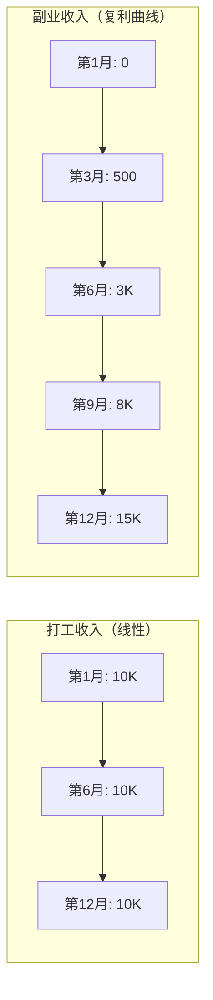
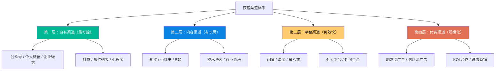
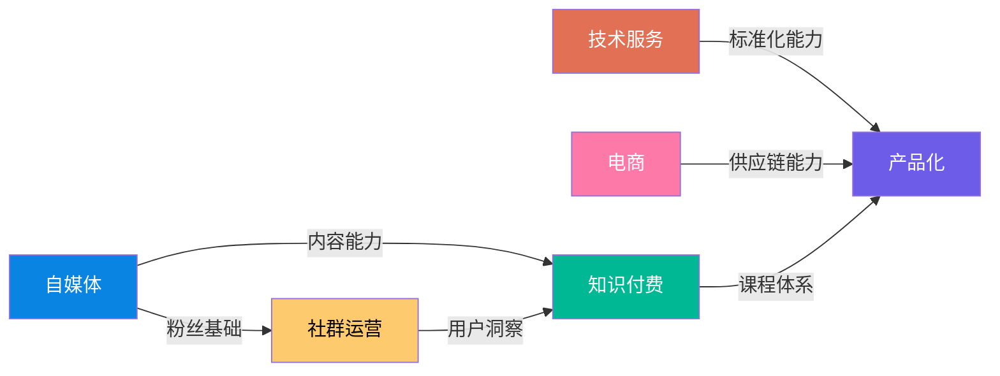
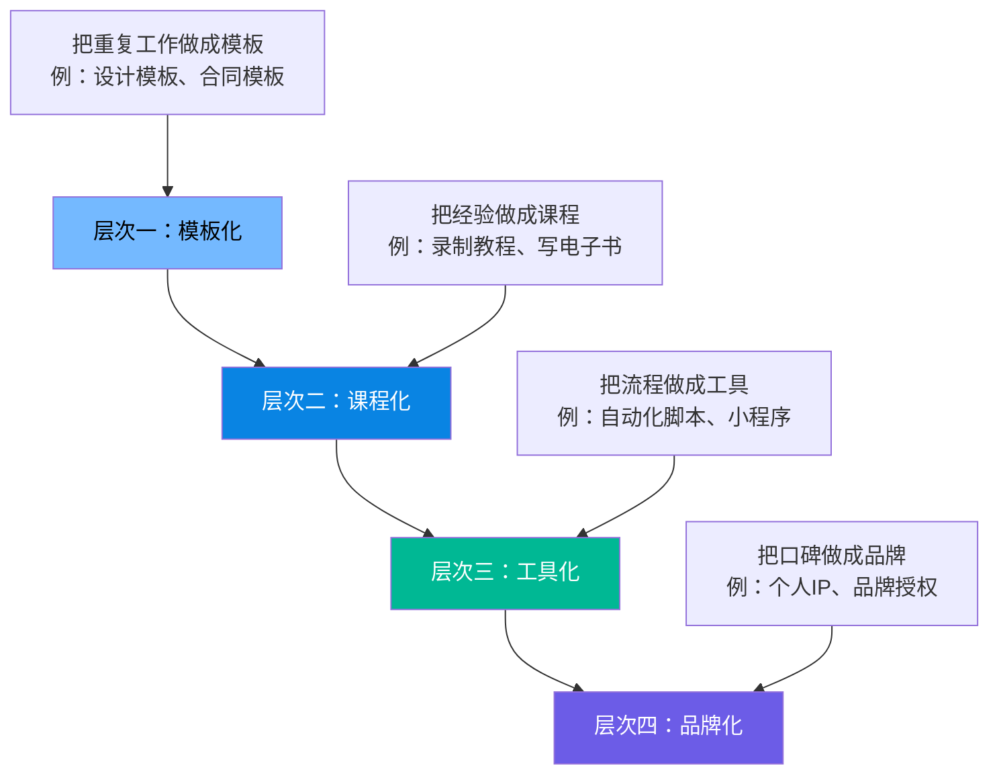
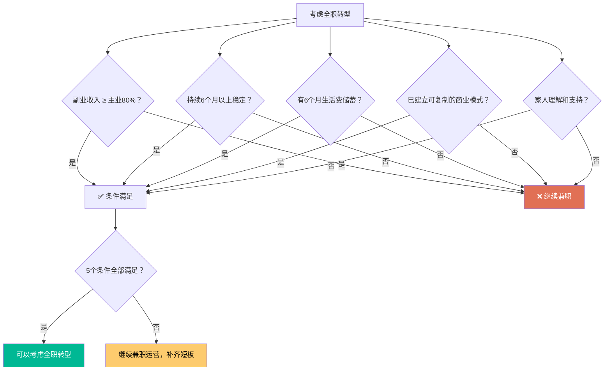
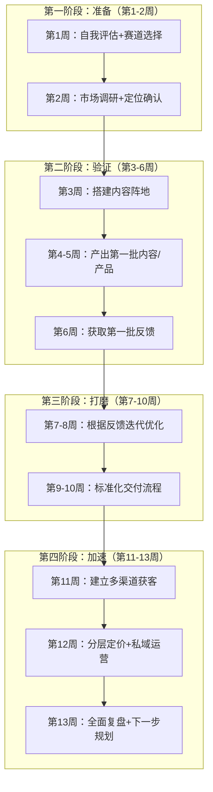
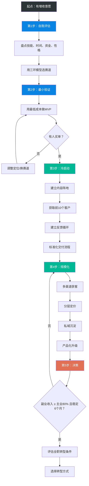

## 案例总结：六个副业路径的底层规律与行动指南

前六个案例分别展示了自媒体、电商、知识付费、技术服务、社群运营、产品化副业六条完全不同的路径。表面看，它们的赛道、技能、变现方式截然不同；但拆解到底层，成功的底层逻辑高度一致。本节将六个案例横向对比，提炼出**可复制的规律**、**可量化的决策框架**、**实战工具包**、以及**90%的人会踩的坑**，帮你找到最适合自己的那条路——并真正走通它。

---

### 六个案例全景对比

先把六个案例的关键数据拉到一张表里，建立全局视角：

| 维度 | 案例一：自媒体 | 案例二：电商 | 案例三：知识付费 | 案例四：技术服务 | 案例五：社群 | 案例六：产品化 |
|------|-------------|-----------|--------------|--------------|-----------|-------------|
| **主人公** | 张明，产品经理 | 小王，运营岗 | 林瑶，UI设计师 | 程序员，后端开发 | 老K，产品经理 | 小林，UI设计师 |
| **启动资金** | 0元 | 1.5万元 | 5,000元 | 0元 | 0元 | 约2,000元 |
| **每日投入** | 2-3小时 | 2-3小时 | 1-2小时 | 2-3小时 | 1-2小时 | 2-3小时 |
| **冷启动周期** | 3个月 | 2个月 | 4个月 | 2周 | 3个月 | 2周 |
| **达到月入过万** | 8个月 | 5个月 | 6个月 | 4个月 | 12个月 | 5个月 |
| **最终年收入** | 120万+ | 60万 | 80万 | 约15万 | 52万 | 约30万 |
| **核心壁垒** | 内容+个人IP | 供应链+选品 | 课程体系+口碑 | 技术深度+标准化 | 社群粘性+信任 | 品牌+设计体系 |
| **边际成本** | 极低 | 中等 | 极低 | 低 | 低 | 低 |
| **可复制性** | 中等 | 较高 | 较高 | 中等 | 较低 | 较高 |
| **风险等级** | 低 | 中等 | 低 | 低 | 低 | 低-中 |
| **收入天花板** | 极高（百万级） | 高（需规模化） | 高（百万级） | 中（受限于时间） | 中高 | 中高 |
| **被动收入比例** | 70%+ | 30-50% | 80%+ | <10% | 40-60% | 60-80% |
| **核心变现方式** | 广告+课程+咨询 | 商品销售 | 课程+训练营 | 项目交付 | 会员+活动+广告 | 模板+套餐+品牌授权 |

从这张表可以提炼出三个重要结论：

**结论一：启动资金不是门槛。** 六个成功案例的启动资金都没有超过1.5万元，其中三个是零启动资金。副业的第一原则不是"有钱才能做"，而是"用最少的钱验证能不能做"。

**结论二：被动收入比例决定了路径的"睡后收入"潜力。** 知识付费（80%+）和自媒体（70%+）的被动收入比例最高，这意味着一旦内容体系建立，收入增长不再严格依赖你的工时投入。技术服务的被动收入比例最低（<10%），本质上还是"用时间换钱"，只是时薪更高。

**结论三：年收入最高的路径（自媒体120万+）恰恰是冷启动最慢的路径之一（3个月），而冷启动最快的路径（技术服务2周）年收入最低（15万）。** 这说明速度和天花板之间存在权衡——选择哪条路，取决于你更看重短期回报还是长期上限。

#### 关键指标的量化解读

光看绝对数字还不够，需要理解每个数字背后的含义，才能做出正确决策：

**投入产出比（ROI）计算：**

| 案例 | 总投入时间（首年） | 按时薪50元计时间成本 | 启动资金 | 总投入 | 首年收入 | ROI |
|------|-----------------|-------------------|---------|--------|---------|-----|
| 自媒体 | 约1,000小时 | 50,000元 | 0元 | 50,000元 | 120万+ | 2,400% |
| 电商 | 约1,000小时 | 50,000元 | 15,000元 | 65,000元 | 60万 | 923% |
| 知识付费 | 约730小时 | 36,500元 | 5,000元 | 41,500元 | 80万 | 1,928% |
| 技术服务 | 约1,000小时 | 50,000元 | 0元 | 50,000元 | 15万 | 300% |
| 社群 | 约730小时 | 36,500元 | 0元 | 36,500元 | 52万 | 1,425% |
| 产品化 | 约1,000小时 | 50,000元 | 2,000元 | 52,000元 | 30万 | 577% |

**解读：** 自媒体和知识付费的ROI最高，但它们的共同特点是前期"零收入期"最长——你需要在看不到回报的情况下持续投入。技术服务的ROI最低，但它的优势是"即时回报"——第一周就能赚到钱。选择哪条路，本质上是一个"延迟满足"的心理测试。

---

### 七条底层规律

拆解六个案例后，所有成功的副业路径都遵循以下七条规律。不是"建议"，而是**必要条件**——缺少任何一条，大概率走不通。

#### 规律一：赛道选择决定80%的成败

六个案例的主人公在"做什么"这个决策上，都花了不少于一周的时间做系统调研，而不是"想到什么做什么"。

**赛道选择的核心公式：**

```text
最佳赛道 = 擅长 ∩ 热爱 ∩ 有市场需求
```

这三个条件缺一不可：

| 缺少哪个 | 后果 | 案例中的体现 |
|---------|------|------------|
| 缺"擅长" | 做不出差异化，陷入价格战，被同行碾压 | 一个不擅长写作的人做自媒体，内容质量无法突破，3个月后阅读量停滞在两位数，陷入"写不出→没人看→更不想写"的死循环 |
| 缺"热爱" | 3个月后放弃，无法持续输出 | 一个对设计没热情的程序员强行做UI课程，前3个月靠意志力撑着，第4个月开始拖延更新，第6个月彻底停更，之前积累的粉丝全部流失 |
| 缺"需求" | 做得再好也没人买单 | 一个手工达人花2个月做出精美的手工皮具，定价200元，在闲鱼挂了3个月只卖出2单——因为目标客户根本不在闲鱼，而手工皮具的真正市场在小红书和线下市集 |

**张明**擅长产品管理、热爱写作分享、产品经理群体有强烈学习需求——三环重合，所以冷启动顺利。**小林**擅长设计、热爱创作、市场对设计服务有刚需——三环重合，从接私单起步到建立品牌。

**反面教训：** 如果一个人擅长编程但讨厌写作，强行做技术自媒体，大概率在第三个月放弃。"擅长"和"热爱"必须同时满足。同样，如果一个人热爱烘焙但所在城市已经有50家私房蛋糕店，市场已经饱和——"热爱"和"需求"也必须同时满足。

**实操方法：三环定位法的四步执行**

第一步：分别列出三环内容（每环至少10项）

```text
擅长（硬技能+软技能）：
1. Python编程  2. 数据分析  3. 写技术文档  4. 项目管理  
5. 演讲表达  6. Excel高级功能  7. SQL查询优化  ...

热爱（愿意持续投入时间的事）：
1. 写作  2. 解决技术难题  3. 教别人  4. 研究新工具  
5. 整理知识体系  6. 和人聊天  7. 画流程图  ...

市场需求（别人愿意付钱的事）：
1. 企业数据分析培训  2. 技术博客代写  3. 自动化脚本定制  
4. SQL优化咨询  5. 数据看板搭建  6. Excel培训  ...
```

第二步：找出交叉项。以上面为例，"数据分析 + 教别人 + 企业数据分析培训"就是一个三环重合的赛道。

第三步：验证交叉项的市场规模。在知乎、小红书、B站搜索相关关键词，看搜索量、关注人数、竞品数量。

第四步：做一个最小测试。写一篇文章、发一条朋友圈、做一次免费分享，看有没有人回应。

**赛道评估的量化打分表：**

找到潜在交叉赛道后，用以下评分表进行量化评估。每个维度1-5分，总分≥15分的赛道值得深入测试：

| 评估维度 | 评分标准 | 权重 |
|---------|---------|------|
| 技能匹配度 | 1分=需要从零学；3分=有一定基础；5分=已有3年以上经验 | ×3 |
| 热情持久度 | 1分=三分钟热度；3分=愿意做半年；5分=做3年不厌倦 | ×2 |
| 市场规模 | 1分=几乎没有需求；3分=有需求但市场小；5分=需求旺盛且增长中 | ×3 |
| 竞争程度 | 1分=完全红海；3分=有竞争但有空间；5分=蓝海或竞争者弱 | ×2 |
| 变现清晰度 | 1分=不知道怎么赚钱；3分=有变现模式但未经验证；5分=已有人跑通 | ×2 |

**评分示例：**

```text
赛道：企业数据分析培训
技能匹配度：4分（有5年数据分析经验，但没做过培训）→ ×3 = 12
热情持久度：4分（喜欢教人，但不确定能不能持续）→ ×2 = 8
市场规模：5分（企业数字化转型需求旺盛）→ ×3 = 15
竞争程度：3分（有竞品，但大多质量一般）→ ×2 = 6
变现清晰度：4分（已有培训机构在做，模式清晰）→ ×2 = 8
总分：49分 → 强烈推荐，值得立即进入MVP验证阶段
```

#### 规律二：冷启动必须用最小成本验证需求

六个案例无一例外，都是先用最低成本验证"有没有人愿意买单"，再投入更多资源。

| 案例 | 验证方式 | 验证周期 | 验证成本 | 验证成功标志 |
|------|---------|---------|---------|------------|
| 自媒体 | 先写20篇看阅读量和关注增长 | 3个月 | 0元 | 单篇阅读量稳定>500，关注增长>100/月 |
| 电商 | 先上架10个品测试转化率 | 2周 | 2000元 | 至少1个品转化率>3%，日均出单>2 |
| 知识付费 | 先做免费分享看反馈 | 1个月 | 0元 | 分享后有>20人主动问"有没有付费课" |
| 技术服务 | 先接3单低价项目看满意度 | 2周 | 0元 | 3单全部好评，有1单主动转介绍 |
| 社群 | 先建免费群看活跃度 | 3个月 | 0元 | 200人群日活跃率>30%，有人主动问"有没有付费群" |
| 产品化 | 先在闲鱼接5单看评价 | 2周 | 0元 | 5单全部好评，客单价>100元且复购率>20% |

**验证的核心指标只有一个：有没有人愿意掏钱（或者掏时间）？**

- 阅读量、点赞、关注——这些是"兴趣信号"，不是"付费信号"
- 真正的验证是：有没有人愿意预付定金、加入付费群、购买你的服务
- 如果免费内容都没人看，付费产品更不会有人买

**验证的量化标准：**

```text
判断验证是否成功的三档标准：

✅ 强验证（可以全力投入）：
  - 有真实付费行为（哪怕只有1个人付了1块钱）
  - 有主动转介绍行为
  - 有复购行为

⚠️ 弱验证（需要调整后再测）：
  - 有很多人说"很好"但没人付钱
  - 免费参与度高但付费转化率<1%
  - 用户反馈中出现了你没想到的需求

❌ 验证失败（需要换方向）：
  - 免费都没人理
  - 找不到目标用户聚集的地方
  - 做了2轮调整仍然没有改善
```

**验证失败怎么办？** 两个选择：换赛道，或者调整定位。六个案例中，没有一个是一次就找到完美方向的——张明在第三个月调整了内容方向（从泛互联网转为产品经理垂直领域），小王测了20多个品才找到爆款品类。**验证-调整-再验证**，这是正常流程，不是失败。

**弱验证场景的五种调整策略：**

弱验证不代表方向错误，往往只是"切入点"不对。以下是五种经过验证的调整策略：

| 症状 | 诊断 | 调整策略 | 案例 |
|------|------|---------|------|
| 有人说"不错"但不付费 | 价值感不足，用户觉得"自己也能搞定" | 增加不可替代性：加入独家数据、专业工具、个性化方案 | 林瑶从"教UI设计"转为"UI设计师接单实战课"后，付费率从2%提升到15% |
| 目标人群找不到 | 渠道选错了 | 换一个用户聚集的平台重新测试 | 手工皮具在闲鱼无人问津，转到小红书后月销20单 |
| 有人付费但客单价太低 | 定价问题或客户群不对 | 针对B端而非C端，或加入增值服务提升客单价 | 技术博主从卖9.9元电子书转为企业培训咨询（单次5000元） |
| 首批客户满意但没有转介绍 | 交付缺乏"社交货币" | 让客户在分享时也能获得价值：推荐返利、专属身份标识 | 社群运营者推出"推荐1人入群，推荐人免费续期1个月"后，转介绍率提升3倍 |
| 反馈集中在需求A但你在做需求B | 市场告诉你真正的需求 | 认真对待用户反馈，调整产品方向 | 电商卖家原计划卖文具，发现用户问得最多的是"有没有学生党平价好物合集"，转做平价好物测评后流量暴增 |

#### 规律三：时间投入的"复利曲线"不同于工资

打工是"线性收入"——干一天拿一天的钱。副业的收入曲线完全不同：



**四个阶段的详细拆解：**

| 阶段 | 时间 | 收入特征 | 心理状态 | 核心任务 | 典型错误 |
|------|------|---------|---------|---------|---------|
| **积累期** | 第1-3月 | 接近于零 | 怀疑、焦虑、想放弃 | 产出内容/产品，获取反馈 | 急于变现，过早收费 |
| **起步期** | 第3-6月 | 零星收入（500-3000元） | 有希望但仍不确定 | 标准化交付流程 | 追求收入增长而忽略质量 |
| **加速期** | 第6-12月 | 快速增长（3K-15K） | 信心增强，方向清晰 | 多渠道获客，分层定价 | 被增长冲昏头脑，盲目扩张 |
| **收获期** | 12月后 | 稳定且持续增长 | 从容，开始思考转型 | 产品化升级，考虑全职 | 安于现状，停止迭代 |

**关键数据：** 六个案例中，主人公在"积累期"投入的总时间平均为240小时（3个月×每天2-3小时），按打工时薪50元计算，相当于"投资"了12,000元的时间成本。这些投入在第12个月时的回报率超过1000%。

**核心启示：** 副业前3个月的"零收入"不是失败，是投资。如果你在第2个月就放弃，相当于在股票最低点割肉。六个案例的主人公都经历了这个阶段——区别是他们没有在黎明前放弃。

**每个阶段的心理应对策略：**

| 阶段 | 最大心理挑战 | 具体应对方法 |
|------|------------|------------|
| 积累期（1-3月） | "我是不是在做无用功？" | 只看"领先指标"（内容产出量、用户反馈），不看"滞后指标"（收入）。每天记录产出日志，看到自己在进步。 |
| 起步期（3-6月） | "收入太少了，不值得继续" | 把收入换算成时薪："本月赚了1500，投入30小时=时薪50元"。和打工对比，通常会发现自己已经在进步。 |
| 加速期（6-12月） | "我是不是该All in？" | 保持主业稳定，用数据而非情绪做决策。每月只增加10-20%的副业时间投入。 |
| 收获期（12月+） | "我是不是应该辞职？" | 参考本章"从副业到全职转型的决策框架"，必须满足全部5个条件。 |

#### 规律四：标准化交付是规模化的前提

六个案例中，所有实现月入过万的主人公，都在达到这个节点之前完成了**交付流程的标准化**。

| 案例 | 标准化内容 | 标准化前时薪 | 标准化后时薪 | 提升倍数 |
|------|----------|------------|------------|---------|
| 自媒体 | 文章模板+选题库+排期表 | 约30元/篇 | 约200元/篇 | 6.7倍 |
| 电商 | 选品SOP+上架模板+客服话术 | 约50元/单 | 约150元/单 | 3倍 |
| 知识付费 | 课程大纲模板+录制流程+售后体系 | 约40元/小时 | 约500元/小时 | 12.5倍 |
| 技术服务 | 需求模板+报价体系+交付清单 | 约60元/小时 | 约200元/小时 | 3.3倍 |
| 社群 | 内容日历+活动模板+SOP手册 | 约30元/小时 | 约300元/小时 | 10倍 |
| 产品化 | 设计套餐+报价体系+交付流程 | 约80元/小时 | 约400元/小时 | 5倍 |

**标准化的本质：** 把"每次都要从头想"变成"照着流程走"，把"个人经验"变成"可复制的系统"。

**标准化的三步法：**

**第一步：记录全过程。** 从现在开始，每做一个项目/每写一篇文章/每服务一个客户，用以下模板记录：

```text
项目记录模板：
- 项目名称：
- 客户需求（原始描述）：
- 我的理解（翻译后的需求）：
- 执行步骤：1. ___ 2. ___ 3. ___ ...
- 耗时分布：需求沟通___h + 方案设计___h + 执行___h + 修改___h + 交付___h
- 客户反馈：
- 我的复盘：哪里做得好？哪里浪费了时间？
```

**第二步：提炼重复模式。** 做过5个以上项目后，回头分析记录，问自己三个问题：

1. 哪些步骤每次都一样？→ 写成模板（如：需求沟通的20个标准问题）
2. 哪些决策每次都纠结？→ 写成决策树（如：客户要加功能→看是否超出范围→超出则报价→不超出则记录到SOP）
3. 哪些沟通每次都要解释？→ 写成FAQ（如："为什么需要3天而不是1天？""为什么不能中途改需求？"）

**第三步：迭代优化。** 每月回顾一次SOP，根据新的项目经验更新。标准化不是一次性的工作，而是一个持续的过程。

**案例详解：知识付费的标准化过程**

林瑶（案例三）在录制第一门课程时，从大纲设计到最终上线花了整整6周。她把整个过程记录下来，发现最大的时间浪费在三个环节：大纲反复修改（耗时1周）、录制时反复NG（耗时2周）、后期剪辑不熟练（耗时1周）。于是她建立了三个标准化模块：

```text
模块一：大纲设计（从1周压缩到2天）
- 标准大纲模板：痛点分析→原理讲解→案例演示→实操练习→总结
- 同行课程分析表：收集10门同类课程的大纲结构，提取共性模块
- 用户需求问卷：在社群发问卷，收集"最想学什么"

模块二：录制流程（从2周压缩到3天）
- 设备检查清单：麦克风→灯光→背景→软件设置
- 录制规范：每节课15-20分钟，开头30秒必须有钩子
- NG处理规则：连续NG 3次则暂停，先调整状态再继续

模块三：后期处理（从1周压缩到2天）
- 剪辑模板：片头→正片→小结→下期预告
- 字幕工具：用飞书妙记自动生成字幕，人工校对
- 封面模板：统一风格的封面设计，只需替换文字
```

标准化完成后，林瑶录制一门新课程的时间从6周缩短到了1.5周，时薪从40元提升到500元。更重要的是，标准化让她可以把录制工作外包给助手，自己只负责大纲设计和质量把控——这就是从"手艺人"到"经营者"的转变。

标准化完成后，你还可以把SOP本身变成产品（卖课、卖模板、卖咨询服务）——这就是案例六"产品化"的核心逻辑。

**标准化程度自检清单：**

对照以下清单，勾选你已经完成的项目。完成度≥70%说明你的交付流程已经足够标准化，可以进入规模化阶段：

```text
□ 需求沟通有标准问题清单（至少10个核心问题）
□ 报价有明确公式（不是"看心情"或"参考竞品"）
□ 交付物有标准清单（每个项目交付什么，格式是什么）
□ 交付时间可以准确预估（误差不超过20%）
□ 修改流程有明确规定（免费几次、超出怎么收费）
□ 客户常见问题有标准回答（FAQ文档≥15条）
□ 售后服务有固定流程（交付后多久跟进、怎么跟进）
□ 新项目启动时可以"照着流程走"而不需从头思考
□ 你可以在30分钟内向新人解释清楚整个交付流程
□ 过去10个项目的交付质量波动<20%
```

#### 规律五：获客渠道必须多元化且可控

六个案例的主人公在成熟阶段，都建立了至少三个独立的获客渠道：

| 案例 | 主要获客渠道 | 各渠道贡献占比 |
|------|------------|-------------|
| 自媒体 | 微信搜一搜 + 互推合作 + 社群裂变 | 40% + 30% + 30% |
| 电商 | 平台自然流量 + 直播 + 私域复购 | 50% + 20% + 30% |
| 知识付费 | 自媒体内容引流 + 学员转介绍 + 平台推荐 | 45% + 35% + 20% |
| 技术服务 | 外部平台接单 + 老客户转介绍 + 技术博客引流 | 30% + 50% + 20% |
| 社群 | 公众号内容 + 成员口碑 + 行业活动 | 40% + 40% + 20% |
| 产品化 | 小红书展示 + 闲鱼接单 + 老客户转介绍 | 35% + 25% + 40% |

**关键原则：** 不要把所有鸡蛋放在一个篮子里。平台规则会变，算法会调整，但你自己的私域流量（微信好友、公众号粉丝、社群成员）是可控的。

**获客渠道的四个层级：**



**各渠道的详细对比：**

| 渠道层级 | 获客成本 | 转化率 | 可控性 | 长尾效应 | 启动难度 |
|---------|---------|--------|-------|---------|---------|
| 自有渠道 | 极低（0-5元/人） | 最高（10-30%） | 完全可控 | 强 | 需要先积累种子用户 |
| 内容渠道 | 低（5-20元/人） | 中等（3-10%） | 部分可控（受平台算法影响） | 最强（一篇好文持续引流数年） | 需要内容创作能力 |
| 平台渠道 | 中等（20-50元/人） | 较低（1-5%） | 弱（依赖平台规则） | 弱（停止投放即停） | 低（注册即可开始） |
| 付费渠道 | 高（50-200元/人） | 取决于投放能力 | 可控但烧钱 | 无 | 需要资金和投放经验 |

**所有案例的共同经验：** 初期靠平台获取第一批客户，中期靠内容建立长期流量，成熟期靠口碑实现客户自增长。这三个阶段不能跳过。

**转介绍机制的设计：**

老客户转介绍是成本最低、转化率最高的获客方式。六个案例中，转介绍占成熟期获客的30-50%。设计有效的转介绍机制需要三个要素：

| 要素 | 设计原则 | 具体做法 |
|------|---------|---------|
| **动机** | 让推荐人有"利他+利己"的双重动力 | 推荐返利（推荐1人返现50元）+ 社交货币（"我是XX社群推荐人"专属身份） |
| **时机** | 在客户满意度最高的时刻触发 | 交付完成后的"好评时刻"、客户主动表达满意时、续费/复购时 |
| **工具** | 降低推荐的操作门槛 | 生成专属推荐链接/海报、一键转发话术模板、推荐进度可视化 |

**案例：** 社群运营者老K在会员续费时推出"推荐1位新会员，推荐人免费续期1个月，新会员首月7折"的机制。实施后，转介绍率从8%提升到25%，每月新增会员中转介绍占比从20%提升到40%，获客成本下降了60%。

#### 规律六：定价策略直接影响商业模式的天花板

六个案例中，定价策略的演变路径惊人地一致：

```text
低价引流 → 中价验证 → 高价定位 → 套餐分层
```

| 阶段 | 定价策略 | 目的 | 典型定价 | 持续时间 |
|------|---------|------|---------|---------|
| 冷启动期 | 低于市场价30-50% | 获取第一批客户和评价 | 免费/9.9元/成本价 | 1-2个月 |
| 验证期 | 接近市场价 | 测试客户对价值的真实认可度 | 市场均价 | 2-3个月 |
| 增长期 | 高于市场价20-50% | 建立品质认知，筛选高质量客户 | 溢价20-50% | 3-6个月 |
| 成熟期 | 套餐分层定价 | 覆盖不同消费能力的客户群 | 低/中/高三档 | 持续优化 |

**关键教训：** 永远不要用"低价"作为核心竞争力。低价吸引来的客户忠诚度最低，他们会因为别人更便宜而离开。六个案例的主人公都经历过"越便宜越没人买"的阶段——**价格是价值的信号**，太便宜反而让人怀疑品质。

**定价的实操公式：**

```text
基础定价 = 你的目标时薪 × 交付时间 × 1.5（溢价系数）

例如：
  目标时薪：200元
  项目耗时：10小时
  报价 = 200 × 10 × 1.5 = 3,000元

溢价系数说明：
  1.2 → 标准服务，无附加价值
  1.5 → 有一定口碑和案例支撑
  2.0 → 有个人品牌，客户主动找上门
  3.0+ → 行业头部，供不应求
```

**分层定价的三层体系设计：**

| 层级 | 价格定位 | 内容设计 | 目标客户 | 占比 |
|------|---------|---------|---------|------|
| 入门层 | 低价（市场价30-50%） | 基础服务/自助工具/模板/电子书 | 价格敏感型，用作获客漏斗入口 | 20-30% |
| 标准层 | 中价（市场均价） | 完整服务/标准课程/标准套餐 | 主力收入来源 | 50-60% |
| 高端层 | 高价（市场价2-5倍） | 定制服务/一对一辅导/VIP权益/年度顾问 | 高净值客户，利润最高 | 10-20% |

**分层定价的心理学原理：** 当你只提供一个价格时，客户的选择是"买或不买"；当你提供三个价格时，客户的选择变成了"买哪个"——这大幅提高了转化率。同时，中间价位会成为"锚点"，让低价显得超值、让高价显得合理。

**定价调整的信号与节奏：**

| 信号 | 含义 | 操作 |
|------|------|------|
| 转化率>30%且持续2周 | 价格可能太低，你在"亏待自己" | 提价10-20%，观察转化率变化 |
| 转化率<5%且持续2周 | 价格可能太高，或价值传达不足 | 先优化价值展示（案例、评价），再考虑降价 |
| 客户砍价率>50% | 客户对价格敏感，但对价值认知不够 | 增加对比展示（"这个价格包含什么"清单） |
| 老客户复购率>40% | 客户认可价值，可以考虑推出高端服务 | 设计VIP/年度服务，客单价提升3-5倍 |
| 竞品频繁降价 | 市场进入价格战，你需要差异化而非跟进 | 强化独特价值主张，避开纯价格竞争 |

#### 规律七：数据驱动决策，不凭感觉

六个案例的主人公都有一个共同习惯：**每周复盘关键数据**。

| 案例 | 追踪的核心数据 | 复盘频率 | 复盘工具 |
|------|-------------|---------|---------|
| 自媒体 | 阅读量、关注增长率、广告收入、课程转化率 | 每周 | 公众号后台+Excel |
| 电商 | 访客数、转化率、客单价、退货率、利润率 | 每天 | 生意参谋+Excel |
| 知识付费 | 课程完课率、复购率、转介绍率、NPS评分 | 每周 | 课程平台后台+问卷 |
| 技术服务 | 报价成功率、交付准时率、客户满意度、复购率 | 每月 | CRM表格 |
| 社群 | 日活跃率、续费率、付费转化率、NPS评分 | 每周 | 社群管理工具+Excel |
| 产品化 | 获客成本、成交率、客单价、复购率、品牌搜索量 | 每周 | 多平台后台+Excel |

**不需要复杂的工具。** 一个Excel表格就够了：

```text
每周复盘表模板：

| 日期 | 获客数 | 成交数 | 转化率 | 收入 | 成本 | 利润 | 利润率 | 备注 |
|------|--------|--------|--------|------|------|------|--------|------|
| W1   | 100    | 5      | 5%     | 2500 | 500  | 2000 | 80%    | 正常 |
| W2   | 120    | 4      | 3.3%   | 2000 | 600  | 1400 | 70%    | 转化率下降，需排查 |
| W3   | 150    | 8      | 5.3%   | 4000 | 500  | 3500 | 87.5%  | 优化卖点后回升 |
```

**关键指标的含义与应对策略：**

| 指标 | 健康值 | 问题信号 | 应对策略 |
|------|-------|---------|---------|
| **转化率** | >5% | <5%说明产品/服务吸引力不足 | 优化卖点文案、增加案例展示、降低首次尝试门槛 |
| **复购率** | >30% | <30%说明交付质量或客户关系有问题 | 回访老客户找出不满点、建立会员体系、提供复购优惠 |
| **利润率** | >30% | <30%说明成本结构不合理 | 砍掉低效支出、提高自动化程度、优化供应链 |
| **NPS评分** | >40 | <40说明客户体验有明显短板 | 找出"贬损者"的具体不满、逐一修复体验痛点 |
| **获客成本** | <客户终身价值的1/3 | 获客成本过高则不可持续 | 优化投放策略、加强内容获客、提升转介绍率 |
| **关注增长率** | >5%/周 | 持续下降说明内容吸引力不足 | 分析爆款内容特征、调整选题方向、优化标题和封面 |

**数据复盘的"四看"方法：**

1. **看趋势**：不要看单点数据，要看连续4周的趋势。单周波动是正常的，连续下降才是信号。
2. **看异常**：任何偏离均值20%以上的数据点都值得深挖。收入突然翻倍？找出为什么，然后复制。转化率突然腰斩？找出为什么，然后修复。
3. **看关联**：A指标的变化是否和B指标相关？比如：发了某篇文章后关注量暴增——这篇文章有什么特别？提炼出来，变成模板。
4. **看漏斗**：把获客→转化→交付→复购的全链路数据串起来，找到漏斗中流失最大的环节，优先优化。

**案例：数据驱动决策的实战**

张明（案例一）在第6个月时发现，公众号文章的打开率从12%降到了6%。他没有凭直觉判断"读者变少了"，而是用数据做了四步排查：

```text
第一步：看趋势——打开率是突然下降还是缓慢下降？
→ 缓慢下降，从第4个月开始，每月降2个百分点

第二步：看异常——哪类文章的打开率最低？
→ 技术教程类文章打开率仅3%，而行业分析类文章打开率15%

第三步：看关联——发技术教程期间是否取关率上升？
→ 是，发技术教程当天取关率是平时的3倍

第四步：看漏斗——粉丝画像是否变化？
→ 是，公众号新增粉丝中70%是初级产品经理，而技术教程是给高级产品经理看的

结论：粉丝结构变了，内容方向需要调整。
行动：将技术教程的比例从40%降到10%，增加初级产品经理的内容。
结果：两周后打开率回升到14%。
```

---

### 能力矩阵：六条路径所需的核心技能

不同路径对能力的要求截然不同。以下矩阵帮你快速识别自己的能力匹配度：

| 能力维度 | 自媒体 | 电商 | 知识付费 | 技术服务 | 社群运营 | 产品化 |
|---------|--------|------|---------|---------|---------|--------|
| **写作/表达** | ★★★★★ | ★★ | ★★★★ | ★★ | ★★★ | ★★★ |
| **专业技术** | ★★★ | ★★ | ★★★★★ | ★★★★★ | ★★ | ★★★★ |
| **销售/谈判** | ★★ | ★★★★ | ★★★ | ★★★★ | ★★★ | ★★★★ |
| **视觉设计** | ★★★★ | ★★★ | ★★★ | ★ | ★★ | ★★★★★ |
| **数据分析** | ★★★ | ★★★★★ | ★★★ | ★★ | ★★★ | ★★★ |
| **人际沟通** | ★★★ | ★★★ | ★★★★ | ★★★ | ★★★★★ | ★★★ |
| **项目管理** | ★★ | ★★★ | ★★★★ | ★★★★★ | ★★★★ | ★★★★ |
| **营销策划** | ★★★★ | ★★★★ | ★★★★ | ★ | ★★★★ | ★★★ |
| **产品思维** | ★★★★ | ★★★ | ★★★★★ | ★★★ | ★★★ | ★★★★★ |
| **抗压能力** | ★★★★ | ★★★★ | ★★★ | ★★★★ | ★★★★★ | ★★★ |

**如何使用这个矩阵：**

1. 给自己的每项能力打分（1-5分）
2. 对比目标路径的要求
3. 如果匹配度>70%，可以直接开始
4. 如果匹配度50-70%，建议先花1-2个月补齐短板
5. 如果匹配度<50%，建议换一条更匹配的路径

**跨路径的能力迁移：** 六条路径并非完全独立，很多能力可以迁移：



最常见的进阶路径是：**先做自媒体积累粉丝 → 转型知识付费变现 → 逐步产品化**。张明（案例一）和林瑶（案例三）都走了这条路。

---

### 实战工具包

每个路径都有对应的工具链。以下按路径整理，从免费到付费排列：

#### 自媒体工具链

| 环节 | 免费工具 | 付费工具 | 说明 |
|------|---------|---------|------|
| 写作 | 微信公众号后台、Typora | Notion、语雀 | 先用免费的，月入过万后再考虑付费 |
| 排版 | 秀米免费版、135编辑器 | 壹伴（付费版） | 排版工具差异不大，内容质量更重要 |
| 数据分析 | 公众号后台、新榜免费版 | 西瓜数据、新榜Pro | 冷启动期免费版足够 |
| 选题 | 微信搜一搜、知乎热榜 | 新榜热文、5118 | 用手动搜索替代付费工具 |
| 图片 | Canva免费版、Pexels | Canva Pro、稿定设计 | 用免费素材库+Canva免费版起步 |
| 视频 | 剪映（免费） | PR、Final Cut | 剪映完全够用，不需要专业剪辑软件 |

#### 电商工具链

| 环节 | 免费工具 | 付费工具 | 说明 |
|------|---------|---------|------|
| 选品 | 1688、拼多多热销榜 | 生意参谋、蝉妈妈 | 冷启动期靠手动刷热销榜 |
| 上架 | 淘宝/拼多多后台 | 千牛工作台 | 后台免费功能足够 |
| 图片 | 手机拍照+美图秀秀 | 专业摄影+PS | 先用手拍测试，跑通后再投资摄影 |
| 客服 | 平台自带客服 | 智能客服机器人 | 初期手动回复，日均>50单再上机器人 |
| 发货 | 手动打包+快递驿站 | ERP系统（旺店通） | 日均<20单手动处理，>20单上ERP |
| 数据 | 平台免费数据 | 生意参谋专业版 | 用免费版跑通模型再升级 |

#### 知识付费工具链

| 环节 | 免费工具 | 付费工具 | 说明 |
|------|---------|---------|------|
| 课程制作 | PPT+OBS录屏 | 小鹅通、知识星球 | 先用免费组合验证需求 |
| 直播 | 微信视频号直播 | 小鹅通直播、保利威 | 视频号直播免费且自带流量 |
| 社群 | 微信群 | 知识星球、小鹅通社群 | 先用微信群，付费社群用知识星球 |
| 分销 | 手动管理 | 小鹅通分销系统 | 规模大了再上分销系统 |
| 数据 | 手动记录 | 小鹅通数据后台 | 初期Excel足够 |

#### 技术服务工具链

| 环节 | 免费工具 | 付费工具 | 说明 |
|------|---------|---------|------|
| 接单 | 闲鱼、V2EX、GitHub | 猪八戒、程序员客栈 | 先从免费平台起步 |
| 项目管理 | GitHub Projects、Notion | Jira、飞书项目 | 个人项目GitHub Projects足够 |
| 合同 | 微信确认+简单合同模板 | 专业合同审核 | 小项目用微信确认，大项目请律师审核合同模板 |
| 收款 | 微信/支付宝转账 | 对公账户 | 月入<5万用个人收款，>5万考虑注册个体户 |
| 代码管理 | GitHub（免费） | GitHub Pro | 免费版完全够用 |

#### 社群运营工具链

| 环节 | 免费工具 | 付费工具 | 说明 |
|------|---------|---------|------|
| 社群管理 | 微信群+群公告 | 企业微信、微伴助手 | 先用微信群，规模大了转企业微信 |
| 内容管理 | 微信群精华消息 | 知识星球、飞书知识库 | 重要内容手动整理到知识库 |
| 活动管理 | 腾讯文档接龙 | 互动吧、活动行 | 小活动用文档接龙，大型活动用专业工具 |
| 数据统计 | 手动统计 | 微伴助手、艾客 | 初期手动记录关键数据 |

#### 产品化工具链

| 环节 | 免费工具 | 付费工具 | 说明 |
|------|---------|---------|------|
| 设计 | Figma（免费版）、Canva | Figma Pro、Adobe CC | Figma免费版足够个人使用 |
| 模板分发 | 闲鱼、微信群 | 自建网站（Hugo/GitHub Pages） | 先用免费渠道，积累后建独立站 |
| 品牌建设 | 小红书、朋友圈 | 专业品牌设计 | 先用个人风格，收入稳定后再请设计师 |
| 自动化 | 手动处理 | n8n、Zapier | 规模小时手动处理，月入>2万再上自动化 |

---

### 六条路径的适用人群画像

不是每条路径都适合每个人。根据你的背景、性格、可用时间，选择最匹配的路径：

| 你的特征 | 推荐路径 | 原因 | 注意事项 |
|---------|---------|------|---------|
| 有专业技能（设计/编程/翻译/咨询） | 技术服务（案例四） | 技能直接变现，启动最快 | 注意不要陷入"接单→交付→接单"的循环，要逐步标准化 |
| 擅长写作/表达/分享 | 自媒体（案例一）或知识付费（案例三） | 内容能力是核心竞争力 | 前3个月几乎零收入，需要心理准备 |
| 有电商经验或对选品有兴趣 | 电商（案例二） | 门槛低，可快速验证 | 需要1-2万启动资金，注意库存风险 |
| 人脉广、擅长社交 | 社群运营（案例五） | 核心资产是信任和关系网 | 冷启动最慢（3个月+），需要极强的耐心 |
| 已在某个领域有积累和口碑 | 产品化（案例六） | 把经验打包成可复制的产品 | 需要产品化思维，不是简单地卖服务 |
| 每天只有1-2小时 | 知识付费（案例三）或产品化（案例六） | 边际成本低，时间杠杆最大 | 不适合需要实时互动的路径（如社群） |
| 启动资金为零 | 技术服务（案例四）或自媒体（案例一） | 纯技能变现，不需要资金 | 需要投入更多时间来弥补资金不足 |
| 想快速看到收入 | 电商（案例二）或技术服务（案例四） | 冷启动周期最短（2周-2个月） | 快速收入≠持续收入，后续需要建立壁垒 |
| 追求长期被动收入 | 知识付费（案例三）或产品化（案例六） | "睡后收入"属性最强 | 前期投入大，需要6-12个月才能看到被动收入效果 |
| 性格内向 | 技术服务/自媒体/产品化 | 不需要大量社交 | 可以通过文字和作品展示能力 |
| 性格外向 | 社群运营/电商/知识付费 | 擅长与人互动 | 社交能力是天然优势 |

**自测清单（回答以下5个问题）：**

1. **你每天能稳定投入多少小时？**
   - <1小时 → 选时间杠杆大的路径（知识付费、产品化）
   - 1-2小时 → 大部分路径都可以，但社群运营较吃力
   - >3小时 → 任何路径都可以

2. **你有没有一项别人愿意为之付钱的技能？**
   - 有 → 直接从技能变现起步（技术服务、产品化）
   - 没有 → 从内容积累开始（自媒体），边学边输出

3. **你有没有1万元以上的启动资金？**
   - 有 → 可以考虑电商（需要资金周转）
   - 没有 → 选零成本路径（自媒体、技术服务、社群）

4. **你能不能接受3-6个月没有收入？**
   - 能 → 选自媒体/社群（长线收益高）
   - 不能 → 选技术服务/电商（冷启动快）

5. **你的性格更偏向内向还是外向？**
   - 内向 → 内容/技术路径（用作品说话）
   - 外向 → 社群/咨询路径（用关系变现）

**多路径组合策略：**

并非只能选一条路。许多成功的副业者在不同阶段组合了多条路径。以下是经过验证的高成功率组合：

| 组合方式 | 适用场景 | 操作方法 | 风险提示 |
|---------|---------|---------|---------|
| 技术服务+产品化 | 有专业技能且想建立被动收入 | 先用技术服务验证需求→将标准化的服务做成模板/工具 | 前期需要同时兼顾接单和产品开发，时间压力大 |
| 自媒体+知识付费 | 擅长内容创作且有专业知识 | 自媒体积累粉丝→用课程/训练营变现 | 从粉丝到付费客户的转化需要精准定位 |
| 电商+社群 | 有供应链资源且擅长社交 | 电商获取第一批客户→建立社群提升复购和粘性 | 社群运营需要持续投入精力，不能"建完就不管" |
| 自媒体+电商 | 擅长内容且对消费品有兴趣 | 内容种草→电商带货 | 需要平衡内容调性和商业化，避免"恰饭"引起反感 |

**不推荐的组合：**
- 自媒体+社群+知识付费同时做 → 精力过于分散，三个都做不好
- 电商+技术服务同时做 → 运营逻辑完全不同，容易互相干扰

建议先选一条路径做到月入5000+，再考虑叠加第二条路径。

---

### 跨案例的共性方法论

#### 冷启动阶段（0-3个月）必做的五件事

不管你选择哪条路径，冷启动阶段的行动清单是高度一致的：

**第一件事：明确定位**

用一句话说清楚"你是谁，你帮谁解决什么问题"。这句话要出现在你的所有平台上——公众号简介、闲鱼个人介绍、小红书账号、朋友圈签名。

```text
定位公式：我是[角色]，帮助[目标人群]解决[具体问题]，通过[方法/产品]
```

定位示例：

- "我是5年产品经理，帮助初级产品经理掌握面试技巧，通过实战案例拆解"
- "我帮小红书博主找到爆款选题，通过数据化选题工具"
- "我帮中小企业搭建自动化数据报表，通过Python脚本定制"

**定位的三个检验标准：**

1. **能不能在10秒内说清楚？** 如果不能，说明定位太模糊。
2. **目标用户听到后会不会说"我需要"？** 如果不会，说明痛点没找准。
3. **和竞品有没有明显区别？** 如果没有，说明差异化不够。

**第二件事：建立内容阵地**

至少选择一个内容平台作为主阵地，持续输出与你定位相关的内容。推荐优先级：

1. **公众号**（私域属性最强，适合长期积累，SEO价值高）
2. **小红书**（图文+短视频，女性用户多，适合消费品和服务类）
3. **知识星球**（适合知识付费和社群，付费门槛筛选高质量用户）
4. **B站**（适合教程类内容，年轻用户多，长视频有长尾效应）
5. **知乎**（适合专业内容，搜索引擎收录好，长尾流量强）

**内容产出的最低标准：**

| 平台 | 最低频率 | 单篇最低字数 | 内容类型 |
|------|---------|------------|---------|
| 公众号 | 每周2篇 | 1500字 | 深度分析/教程/案例 |
| 小红书 | 每天1条 | 300字+3张图 | 干货/对比/教程 |
| 知乎 | 每周3个回答 | 500字 | 专业解答/经验分享 |
| B站 | 每周1个视频 | 5分钟 | 教程/拆解/实操 |

**第三件事：获取第一批10个客户**

这10个客户不是用来赚钱的，而是用来**验证你的产品/服务是否有价值**的。方法：

- 在朋友圈发布你的服务（转化率最高的渠道，因为有信任基础）
- 在相关社群提供免费/低价体验
- 在平台（闲鱼、淘宝、猪八戒）上架低价引流产品
- 找3-5个朋友免费体验，换取真实反馈和推荐
- 在目标用户聚集的论坛/社群回答问题，建立专业形象后自然引流

**获取第一批客户的话术模板：**

```text
朋友圈发布模板：

【免费/低价体验】我在做[你的服务]，现在开放[数量]个免费/低价体验名额。

适合谁：[目标人群描述]
你会得到：[具体交付物]
条件：[需要对方做什么，如给反馈、允许用作案例]

感兴趣的朋友评论"报名"或私信我👇
```

**第四件事：建立反馈循环**

每完成一个客户的服务，做一次5分钟的回访：

1. 你最满意的是什么？（保留并强化）
2. 你最不满意的是什么？（立即改进）
3. 你愿意推荐给朋友吗？为什么？（NPS的核心问题）
4. 你还需要什么相关服务？（发现新机会）

**反馈收集的工具选择：**

- **微信直接聊天**：最自然，回复率最高（>80%）
- **腾讯问卷/金数据**：适合需要量化分析的场景
- **电话回访**：适合高客单价服务，能获取更深层的反馈

**第五件事：标准化你的流程**

当你做过5个以上的客户后，你应该能总结出一套可重复的流程。把它写下来，包括：

- 需求沟通模板（问哪些问题）
- 报价公式（怎么算价格）
- 交付清单（每个项目要交付什么）
- 常见问题FAQ（客户最常问什么）
- 售后服务流程（交付后怎么跟进）

#### 增长阶段（3-12个月）的三个关键动作

**动作一：从"做项目"到"做产品"**

不要永远停留在"接一单做一单"的模式。在增长阶段，你需要开始思考：

- 你的服务中，哪些部分可以做成模板/工具/课程？
- 你的客户中，最常出现的需求模式是什么？
- 你能不能把10次服务经验打包成一个标准化产品？

案例六的小林就是在这个阶段完成了从"接设计私单"到"卖设计套餐+设计模板"的转型，收入翻了3倍，但工作时间反而减少了。

**产品化的四个层次：**



**动作二：建立私域流量池**

不管你从哪个平台获客，最终都要把客户沉淀到你的私域（通常是微信个人号或企业微信）。

私域流量的三个核心价值：

- **复购**：老客户复购的成本是新客户获客成本的1/5
- **转介绍**：满意的客户是最好的销售员
- **数据**：你可以直接了解客户的需求和反馈，不依赖平台

**私域运营的核心动作：**

| 动作 | 频率 | 具体做法 |
|------|------|---------|
| 朋友圈运营 | 每天2-3条 | 1条干货+1条生活+1条产品/服务 |
| 社群互动 | 每天1次 | 抛出话题讨论、回答问题、分享资源 |
| 1对1私聊 | 每周1次 | 和核心客户保持联系，了解新需求 |
| 内容推送 | 每周1-2次 | 推送有价值的长内容（文章/视频） |

**动作三：开始分层定价**

当客户多了以后，不要对所有人收一样的价格。建立三层定价体系：

| 层级 | 价格 | 内容 | 目标客户 |
|------|------|------|---------|
| 入门层 | 低价 | 基础服务/自助工具/模板 | 价格敏感型客户，用作获客 |
| 标准层 | 中价 | 完整服务/标准课程 | 主力收入来源，占比60-70% |
| 高端层 | 高价 | 定制服务/一对一辅导/VIP | 高净值客户，利润最高 |

---

### 失败模式与避坑指南

六个成功案例的背后，是大量失败者的沉默。综合这些案例中提到的挫折和踩过的坑，总结出最常见的六种失败模式，每一种都配有详细的识别方法、纠正步骤和预防措施。

#### 失败模式一：赛道选择凭感觉

**表现：** "我觉得这个方向应该能赚钱" → 做了3个月发现没人买单

**深层原因：** 把"我感兴趣"等同于"市场有需求"。个人兴趣和市场需求是两个完全不同的维度。

**真实场景：** 一个热爱手账的女生，花2个月做出精美的手账教程，发在小红书上只有个位数点赞。原因：手账教程在小红书已经严重饱和，头部博主占据了90%的流量，新入局者几乎没有机会。

**纠正方法（四步验证法）：**

1. **搜索验证**：在目标平台搜索同类产品/服务，看有多少竞争者、定价多少、销量如何。如果搜索结果超过100页且头部账号粉丝>10万，说明赛道已饱和。
2. **用户验证**：找5-10个目标用户聊天，问他们"你愿意为XX付多少钱？""你现在怎么解决这个问题？"。如果他们说"我自己就能搞定"，说明需求不够强烈。
3. **MVP验证**：先做一个最简版本（一篇文章、一个样品、一次免费服务），看反馈。MVP的投入不要超过1周时间。
4. **付费验证**：最严格的验证——有没有人愿意掏钱？哪怕只是9.9元。

**预防措施：** 在正式投入之前，用上面的"赛道评估量化打分表"进行评分。总分<12分的赛道直接放弃，12-15分需要更多测试，>15分才值得投入。

#### 失败模式二：完美主义导致永不开始

**表现：** "等我再学半年就开始" → "等我准备好设备就开始" → 永远在准备

**深层原因：** 害怕失败，用"准备"来逃避行动。完美主义的本质是拖延症的伪装。

**真实场景：** 一个想做B站UP主的程序员，花了3个月学习视频剪辑、购买了专业麦克风和灯光设备、设计了精美的片头动画——但至今没有发布过一条视频。因为他觉得"还不够好"。

**纠正方法：**

1. **设定"烂开始"标准**：给自己一个"不完美但可交付"的最小版本，然后发布。张明的第一篇文章写得很烂，林瑶的第一期课程录了三遍才勉强能看——但他们**发布了**。
2. **公开承诺**：在朋友圈宣布"我从下周开始每周发一篇文章"。社交压力是最好的推动力。
3. **设置deadline**：给每个阶段设定不可商量的截止日期。"6月30日之前必须发出第一条内容"——不管质量如何。
4. **接受"60分作品"**：第一个版本只要60分就够了。完美是迭代出来的，不是准备出来的。你的第10篇文章一定比第1篇好10倍——但前提是你必须先写出第1篇。

**预防措施：** 给自己定一个"准备时间上限"——任何准备工作不能超过2周。超过2周还没开始，就强制自己发布第一个版本。

#### 失败模式三：只做不复盘

**表现：** 每天很忙，但三个月后收入没有增长，也不知道为什么

**深层原因：** 用"忙碌感"代替"进步感"。忙不等于有效，重复不等于进步。

**真实场景：** 一个做闲鱼电商的卖家，每天花3小时上新品、回复消息、处理售后，但月收入始终卡在3000元。复盘后发现：80%的时间花在了低客单价（<30元）的商品上，这些商品利润率不到10%——相当于时薪不到10元。

**纠正方法：**

1. **每周30分钟复盘**：固定时间（如周日晚上），打开你的数据表格，看四个指标：收入、成本、利润率、客户数。
2. **找到"杠杆点"**：问自己"如果我只能做一件事来提升收入，那是什么？"——然后集中精力做那件事。
3. **砍掉低效动作**：如果某件事做了一个月没有产出，果断停掉。不是所有努力都有价值。
4. **对比标杆**：找到你所在赛道的头部玩家，分析他们的内容/产品/定价/获客方式，找出差距。

**预防措施：** 在日历上固定每周日晚上8:00-8:30为"数据复盘时间"。设置手机提醒，像刷牙一样养成习惯。

#### 失败模式四：定价太低陷入恶性循环

**表现：** "我先便宜点做，等出名了再涨价" → 低价吸引来低质量客户 → 差评多 → 更不敢涨价

**深层原因：** 不理解"价格是价值的信号"。低价不是竞争力，是自杀。

**真实场景：** 一个设计师在闲鱼接单，logo设计定价50元。结果：客户要求无限修改、要求源文件、还要求额外做名片和海报——因为"50块钱已经付了"。设计师每天工作10小时，月收入不到4000元，且身心俱疲。

**纠正方法：**

1. **从第一天起按价值定价**：用公式"目标时薪 × 交付时间 × 1.5"定价。如果你的目标时薪是100元，一个logo需要3小时，报价就是450元。
2. **用案例和评价支撑价格**：与其降价，不如花时间打造3-5个高质量案例，写好评价展示页。
3. **学会说"不"**：对于预算不够的客户，礼貌拒绝比降价成交好得多。"抱歉，我的服务目前是XX价位，如果您预算有限，我可以推荐其他适合的方案。"
4. **逐步涨价**：每服务10个客户，涨价10-20%。涨价的同时提升服务质量，让客户觉得"物超所值"。

**预防措施：** 在开始接单前，先调研5-10个同赛道竞品的定价，取中位数作为你的起步定价。不要凭感觉定价。

#### 失败模式五：单点依赖，没有B计划

**表现：** 所有客户都来自一个平台 → 平台改规则 → 收入归零

**深层原因：** 舒适区效应。当一个渠道运转良好时，人会本能地不想开发新渠道——直到这个渠道崩塌。

**真实场景：** 2023年小红书算法调整，大量博主的阅读量暴跌50-80%。一些完全依赖小红书引流的知识付费博主，月收入从3万直接降到5000元。而那些同时运营公众号和私域的博主，收入几乎没有受影响。

**纠正方法：**

1. **"1+1+1"渠道策略**：在主要渠道稳定后，立即开发第二渠道。最稳妥的组合是"一个平台渠道 + 一个内容渠道 + 一个私域渠道"。
2. **每月花20%时间在新渠道上**：即使现有渠道很好，也要持续投入时间开发新渠道。
3. **定期导出数据**：把平台上的粉丝/客户数据定期导出备份，不要完全依赖平台。

**预防措施：** 每季度做一次"渠道压力测试"——假设你的主要渠道明天消失，你的收入会下降多少？如果超过50%，说明你需要紧急开发新渠道。

#### 失败模式六：忽视法律和财务风险

**表现：** 没签合同就开始做 → 客户拖欠款项；没报税 → 被税务稽查

**深层原因：** "小打小闹不用那么正式"。但当副业收入增长后，法律和财务问题会变成定时炸弹。

**真实场景：** 一个做自媒体的博主，年收入30万，全部通过微信收款。第二年被税务部门约谈，补缴个人所得税+滞纳金共6万余元。如果他一开始就注册了个体户并合理报税，实际税负可能不到2万。

**纠正方法（从第一笔收入开始就做好的四件事）：**

**1. 签简单合同**

哪怕是一份微信确认的"需求确认书"，也比口头约定强一万倍。合同模板的核心要素：

```text
服务确认书模板：

甲方（客户）：
乙方（服务方）：

一、服务内容：[具体描述]
二、交付标准：[量化标准]
三、交付时间：[具体日期]
四、服务费用：[金额]元
五、付款方式：[预付比例]% + [尾款支付条件]
六、修改次数：[免费修改N次，超出部分每次XX元]
七、知识产权：[归属约定]
八、违约责任：[违约金或赔偿方式]

甲方确认：____________  日期：____________
乙方确认：____________  日期：____________
```

**2. 记账**

收入、成本、利润，每月做一次。推荐工具：

- **简单版**：Excel表格（收入-成本=利润）
- **进阶版**：随手记、钱迹等记账App
- **专业版**：如果月收入>5万，建议请兼职会计

**3. 了解税务义务**

副业收入在中国的税务处理：

| 收入类型 | 税种 | 税率 | 说明 |
|---------|------|------|------|
| 个人劳务报酬 | 个人所得税 | 20-40% | 单次收入>800元需缴税 |
| 个体户经营所得 | 个人所得税 | 5-35% | 注册个体户后按经营所得缴税 |
| 平台收入 | 平台代扣 | 视平台而定 | 部分平台会代扣代缴 |

**实操建议：** 副业月收入超过1万元时，建议注册个体户。个体户可以享受小规模纳税人优惠政策（月收入<10万免增值税），综合税负远低于个人劳务报酬。

**4. 知识产权保护**

如果你的副业涉及原创内容/设计/代码，注意保护自己的知识产权：

- **内容类**：在文章/视频中标注版权声明，定期搜索是否有盗用
- **设计类**：在交付前签署知识产权协议，明确归属
- **代码类**：使用开源协议（MIT/Apache）保护自己的开源项目

**预防措施：** 建一个"法律财务检查清单"，在副业收入达到以下里程碑时逐项完成：

```text
□ 第一笔收入：开始记账
□ 月收入>3000元：签标准合同模板
□ 月收入>1万元：注册个体户
□ 月收入>3万元：请兼职会计
□ 月收入>5万元：咨询律师，完善合同体系
□ 年收入>20万元：配置商业保险（重疾+意外+医疗）
```

---

### 从副业到全职转型的决策框架

当你副业收入稳定达到主业收入的80%以上时，可以考虑全职转型。但这是一个重大决策，不能冲动。

**全职转型的五个前提条件（必须全部满足）：**



**每个条件的详细解释：**

**条件一：副业收入≥主业80%。** 为什么不是100%？因为全职后你有更多时间投入副业，收入通常会增长。但80%是底线——低于这个数字，风险太大。

**条件二：持续6个月以上稳定。** 一个月的高收入可能是偶然，连续6个月的稳定收入才说明商业模式成立。注意"稳定"不等于"不变"，允许月度波动在±20%以内。

**条件三：有6个月生活费储蓄。** 全职转型后，收入可能会有波动期。6个月的储蓄是你最坏情况下的安全网。计算方式：月支出 × 6（包括房租、餐饮、社保、保险等固定支出）。

**条件四：已建立可复制的商业模式。** 你的收入不能高度依赖某一个客户或某一个平台。如果失去一个客户/平台，收入下降不应超过30%。

**条件五：家人理解和支持。** 这不是"可选"条件，而是"必须"条件。家人的不理解会带来巨大的心理压力，直接影响你的工作状态。

**转型的三种方式：**

| 方式 | 风险等级 | 适合人群 | 操作方法 | 优缺点 |
|------|---------|---------|---------|--------|
| 直接辞职 | 高 | 副业收入已超过主业且有充足储蓄 | 提前30天提离职，做好工作交接 | 优：全力投入，发展最快；缺：无退路 |
| 谈判兼职 | 中 | 和公司关系好，副业不冲突 | 谈判转为兼职/远程/顾问 | 优：保留基本收入；缺：精力分散 |
| 渐进过渡 | 低 | 不确定副业能否持续 | 先用年假/调休集中精力做副业 | 优：风险最低；缺：过渡期很累 |

**最推荐的方式是"渐进过渡"。** 案例一的张明就是在副业收入达到主业3倍时才辞职的——不是因为需要那么多钱，而是因为这个倍数给了他足够的安全边际。

**转型前的最后检查清单：**

```text
□ 社保续缴方案（自行缴纳或挂靠）
□ 商业保险配置（重疾险+意外险+医疗险）
□ 工作室/公司注册（月入>5万建议注册）
□ 财务管理系统（记账+报税+发票）
□ 家庭应急基金（6个月生活费）
□ 和关键客户/合作伙伴的沟通（告知你的转型计划）
□ 工作交接（确保不影响副业的客户关系）
□ 心理准备（自由职业的孤独感和不确定性）
```

---

### 90天行动计划

以下是一份可执行的90天行动计划，按周拆解，适用于大多数副业路径：



**每周具体行动：**

| 周次 | 核心任务 | 每日时间投入 | 交付物 | 检查标准 |
|------|---------|------------|--------|---------|
| 第1周 | 自我评估+三环定位 | 2小时 | 三环交叉表 | 至少找到2个可行赛道 |
| 第2周 | 市场调研+竞品分析 | 2小时 | 调研报告（竞品清单+定价+差异化点） | 明确最终赛道 |
| 第3周 | 注册平台账号+完善个人资料 | 1.5小时 | 至少2个平台的账号 | 简介清晰传达定位 |
| 第4周 | 产出第一批内容/产品 | 3小时 | 5篇文章/3个产品/1次服务 | 质量>60分即可发布 |
| 第5周 | 继续产出+开始推广 | 3小时 | 又5篇文章/3个产品 | 开始有自然流量 |
| 第6周 | 收集反馈+数据分析 | 2小时 | 反馈汇总表+数据分析报告 | 至少收集5条有效反馈 |
| 第7周 | 根据反馈优化内容/产品 | 3小时 | 优化后的内容/产品 | 反馈中的高频问题已解决 |
| 第8周 | 优化定价+完善服务流程 | 2小时 | 定价方案+服务流程文档 | 定价公式已确定 |
| 第9周 | 建立交付SOP | 2小时 | SOP文档（需求模板+报价模板+交付清单） | 新客户可以"照着流程走" |
| 第10周 | 标准化+模板化 | 2小时 | 可复用模板至少3个 | 同类项目交付时间减少30% |
| 第11周 | 开拓第二个获客渠道 | 2小时 | 新渠道已开通并开始产出 | 新渠道有初始流量 |
| 第12周 | 建立私域+分层定价 | 2小时 | 私域已建立+三层定价方案 | 至少有1个付费客户 |
| 第13周 | 全面复盘+制定下一阶段计划 | 3小时 | 90天复盘报告+下阶段计划 | 关键指标有增长趋势 |

**90天后的评估标准：**

完成90天计划后，用以下标准评估你是否应该继续：

| 指标 | 继续 | 调整方向 | 放弃或换赛道 |
|------|------|---------|------------|
| 付费客户数 | ≥3个 | 1-2个 | 0个 |
| 用户反馈 | 正面为主（>70%好评） | 正负参半 | 负面为主或无反馈 |
| 收入趋势 | 逐月增长 | 平稳但不增长 | 持续为零或下降 |
| 个人感受 | 有成就感，愿意继续 | 有些疲惫但不排斥 | 强烈抵触，每天都在拖延 |
| 可复制性 | 已有标准化流程 | 流程初步形成 | 每次都像第一次做 |

**"调整方向"不等于"失败"。** 六个案例中，没有任何一个是一帆风顺的——张明在第3个月调整了内容方向，小王测了20多个品类才找到爆款，林瑶的第一门课程销量平平但第二门课程爆发。调整是正常流程的一部分。

---

### 常见问题Q&A

**Q1：我应该辞职全职做副业吗？**

A：绝对不要在副业没有稳定收入之前辞职。参考"从副业到全职转型的决策框架"部分，必须满足全部5个条件。在此之前，副业就是副业——用业余时间做。

**Q2：我同时对好几个方向感兴趣，怎么选？**

A：用"最小验证法"——给每个方向1-2周时间做MVP测试，用数据说话。不要在脑子里分析，去市场上验证。哪个方向的验证结果最好，就选哪个。

**Q3：副业会不会影响主业？**

A：会有影响，但可以管理。核心原则：①工作时间不做副业；②副业不使用公司资源（电脑、账号、客户数据）；③副业不与主业产生利益冲突；④查看劳动合同中的竞业限制条款。

**Q4：我没有特别擅长的技能怎么办？**

A：从"学习+输出"开始。选一个你感兴趣的方向，边学边输出。学习的过程本身就是内容——"一个普通人如何从零学会XX"这种内容天然有人看。

**Q5：副业需要注册公司/个体户吗？**

A：月收入<1万：不需要，个人收款即可。月收入1-5万：建议注册个体户，享受小规模纳税人优惠。月收入>5万：建议注册公司，方便开发票和合规经营。

**Q6：如何平衡主业、副业和生活？**

A：时间管理的核心是"固定时间段"。建议：工作日早上6:30-8:00（1.5小时）+ 晚上9:00-10:30（1.5小时）= 每天3小时。周末集中半天。关键是把副业时间固定下来，变成"不可商量"的习惯。

**Q7：副业做了3个月还没有收入，正常吗？**

A：完全正常。六个案例中，最短的冷启动期是2周（技术服务），最长的是3个月（自媒体、社群）。如果你选择的是内容型路径，3个月零收入是常态。关键是看"领先指标"（内容产出量、粉丝增长、用户反馈），而不是只看"滞后指标"（收入）。

**Q8：如何防止副业变成"第二份工作"？**

A：副业的终极目标是建立"资产"，而不是"第二份工资"。资产的特征是：你不在的时候它仍然能产生收入。所以从一开始就要有意识地做产品化——把你的一次性服务变成可复制的产品。

**Q9：竞争对手太多怎么办？**

A：竞争对手多说明市场大。关键是找到差异化——不是"做得更好"，而是"做得不同"。差异化可以来自：①人群细分（不做"设计师"，做"餐饮品牌设计师"）；②交付方式（不做"一对一咨询"，做"视频课程+社群答疑"）；③价格定位（不做"最便宜"，做"性价比最高"）。

**Q10：副业收入要交税吗？**

A：要。个人劳务报酬超过800元就需要缴纳个人所得税。建议月收入超过1万元时注册个体户，可以享受小规模纳税人优惠政策。具体税务问题请咨询当地税务局或专业会计。

**Q11：如何处理客户的不合理要求？**

A：在合同/确认书中明确约定服务范围、修改次数、交付标准。超出约定范围的需求，礼貌但坚定地说明"这超出了本次服务范围，我可以另外报价"。不要为了维护客户关系而无限让步——这会让你的时间被一个客户耗尽。

**Q12：一个人做副业太孤独怎么办？**

A：加入副业/创业社群，找到同频的人。可以在知识星球、微信群、线下活动中找到志同道合的伙伴。孤独感是自由职业者最大的挑战之一——有同伴的支持和交流，坚持下去的概率会大很多。

**Q13：副业做起来了，但被抄袭/模仿怎么办？**

A：抄袭是不可避免的，但也是好事——说明你的方向被验证了。应对策略：①持续迭代，让模仿者永远在追你的上一个版本；②建立品牌壁垒，用户认的是"你这个人"而不是"某个产品"；③在交付中加入不可复制的元素（个人经验、独家资源、定制化服务）；④对严重的侵权行为，保留证据并依法维权。

**Q14：副业做到一定规模后，如何雇人帮忙？**

A：当你的月收入稳定超过2万元且有持续增长趋势时，可以考虑雇人。第一步：把标准化的、重复性的工作外包（如：图片处理、数据录入、客服回复）。第二步：找兼职助手（大学生、自由职业者），按项目付费。第三步：当月收入超过5万元且工作量持续饱和时，考虑全职员工。核心原则：**只外包流程明确的工作，核心创意和客户关系必须自己把控。**

---

### 六个案例的思维模型提炼

从六个案例中，可以提炼出四个底层思维模型，适用于任何副业甚至创业场景。这些不是抽象的理论，而是六个活生生的案例反复验证过的实操框架。

#### 思维模型一：MVP思维（最小可行产品）

MVP的全称是Minimum Viable Product（最小可行产品），源自硅谷精益创业方法论。核心思想是：**不要等到产品完美才推向市场，而是用最小的成本、最快的速度推出一个"能用"的版本，用市场的真实反馈来指导后续迭代。**

**为什么MVP思维如此重要？**

因为它直接解决了副业起步阶段最大的两个敌人：**完美主义**和**盲目投入**。很多人花3个月准备一门课程、花2万块囤一批货、花半年学一项新技能——结果推到市场上发现没人买。MVP思维让你在投入1周时间和500块钱之前，就能知道这条路走不走得通。

**六个案例的MVP实践：**

| 案例 | MVP版本 | 投入成本 | 验证周期 | 验证结果 | 后续决策 |
|------|---------|---------|---------|---------|---------|
| 张明（自媒体） | 写20篇产品经理文章发布在公众号 | 0元，约60小时 | 3个月 | 单篇阅读量稳定500+，月增粉100+ | 确认方向，开始系统化产出 |
| 小王（电商） | 在1688拿10个样品上架闲鱼测试 | 2,000元 | 2周 | 3个品有出单，1个品转化率>5% | 聚焦爆款品类，批量进货 |
| 林瑶（知识付费） | 在社群做3次免费分享+1次9.9元试听 | 0元 | 1个月 | 20+人主动问"有没有正式课程" | 开发完整课程体系 |
| 程序员（技术服务） | 在V2EX发帖接3单低价项目 | 0元 | 2周 | 3单全部好评，1单主动转介绍 | 提价并建立标准化服务流程 |
| 老K（社群） | 建200人免费微信群运营3个月 | 0元 | 3个月 | 日活跃率>30%，10+人问"有没有付费群" | 推出付费社群 |
| 小林（产品化） | 在闲鱼接5单设计私单并制作模板 | 约500元（软件费用） | 2周 | 5单好评，3个客户复购 | 标准化设计套餐，上架模板 |

**MVP的四步执行法：**

```text
第一步：定义核心假设
  问自己："我这个副业能成功，最核心的前提是什么？"
  例：自媒体的核心假设是"有人愿意看我写的内容"
  例：电商的核心假设是"有人愿意在我这里买东西"

第二步：设计最小验证
  问自己："用最少的时间和金钱，怎么验证这个假设？"
  原则：投入不超过1周时间+500元
  例：写5篇文章发到平台上（验证"有人看"）
  例：拿3个样品上架闲鱼（验证"有人买"）

第三步：定义成功标准
  在开始之前就明确：什么算成功？什么算失败？
  例："5篇文章总阅读量>1000"→成功
  例："3个样品在1周内至少卖出1个"→成功

第四步：根据结果决策
  成功 → 进入下一阶段（增加投入、扩大规模）
  弱信号 → 调整定位后再测一轮
  失败 → 换方向，不要在错误的方向上继续投入
```

**MVP思维的常见误区：**

| 误区 | 正确做法 |
|------|---------|
| "我的MVP也要做到80分" | MVP只要能验证核心假设就行，60分足够 |
| "MVP失败了说明我不行" | MVP失败只说明"这个方向/定位不对"，换一个再试 |
| "我要把所有功能都做完再测试" | 只做最核心的1-2个功能，其他功能等验证通过后再加 |
| "测试结果不错，直接All in" | 先增加投入做第二轮验证，确认信号稳定后再加大投入 |

#### 思维模型二：复利思维

爱因斯坦（据传）说过："复利是世界第八大奇迹。"在副业领域，复利思维意味着：**优先做那些"做一次、收益持续产生"的事情，而不是"做一次、只赚一次钱"的事情。**

**线性收入 vs 复利收入的对比：**

| 维度 | 线性收入（接单/打工） | 复利收入（内容/产品/品牌） |
|------|-------------------|----------------------|
| 收入模式 | 做一单赚一单 | 做一次，持续赚 |
| 时间投入 | 和收入严格正相关 | 前期投入大，后期投入递减 |
| 停工影响 | 停工=停收入 | 停工后收入仍持续（一段时间内） |
| 增长曲线 | 线性（斜率固定） | 指数型（越往后越快） |
| 典型代表 | 咨询、接单、代运营 | 课程、模板、品牌授权、广告 |

**六个案例的复利实践：**

- **张明**：写一篇文章需要3小时，但这篇文章在公众号上持续被搜索、转发、带来新粉丝，3年后仍然在产生流量和收入。一篇文章的"生命周期价值"可能是它写作成本的50-100倍。
- **林瑶**：录制一门课程需要6周，但这门课程可以无限次销售，每多卖出一份的边际成本几乎为零。她的第一门课程在上线18个月后仍在产生收入，累计收入是制作成本的200倍。
- **小林**：设计一套模板需要1天，但这套模板可以在闲鱼上反复销售。她有50套模板在售，每月自动产生8000-12000元收入——相当于"睡后收入"。

**如何在副业中应用复利思维：**

```text
核心原则：每周至少花30%的时间在"复利型"工作上

复利型工作清单：
✅ 写一篇高质量的文章/教程
✅ 录制一个可复用的课程/视频
✅ 设计一个可反复销售的模板/工具
✅ 建立一个标准化的交付流程
✅ 培养一个长期客户关系
✅ 建设个人品牌（积累口碑和影响力）

线性型工作清单：
⚠️ 接一单做一单的项目
⚠️ 一对一的咨询/辅导
⚠️ 处理日常客服/售后
⚠️ 平台运营的琐碎事务

理想的时间分配：
  复利型工作：30-40%
  线性型工作：40-50%
  学习提升：10-20%
```

**复利思维的量化计算：**

假设你每周花10小时做内容，每篇文章需要2小时，即每周产出5篇。假设每篇文章在发布后的12个月内平均带来100元收入（通过广告、引流、转介绍等）：

```text
第1个月：产出20篇，累计收入 ≈ 0（刚开始没流量）
第3个月：累计产出60篇，月收入 ≈ 1,000元（早期文章开始产生流量）
第6个月：累计产出120篇，月收入 ≈ 5,000元（更多文章进入长尾期）
第12个月：累计产出240篇，月收入 ≈ 15,000元（大量文章的复利效应叠加）
```

这就是复利的力量——你的收入增长速度远快于你的时间投入增长速度。

#### 思维模型三：杠杆思维

杠杆思维的核心是：**找到能放大你价值的支点，而不是单纯地投入更多时间。** 时间是有限的，但杠杆是无限的。

**四种杠杆及其适用场景：**

| 杠杆类型 | 原理 | 适用路径 | 具体做法 | 投入要求 |
|---------|------|---------|---------|---------|
| **时间杠杆** | 做一次，卖一万次 | 知识付费、产品化 | 录制课程、设计模板、写电子书 | 前期大量时间投入 |
| **资金杠杆** | 用钱生钱 | 电商 | 投入广告扩大获客、批量采购降低成本 | 需要启动资金 |
| **人脉杠杆** | 一个人带来十个客户 | 社群运营、转介绍 | 建立推荐机制、维护核心客户关系 | 需要社交能力和信任积累 |
| **技术杠杆** | 用工具替代重复劳动 | 所有路径 | 自动化脚本、AI工具、SaaS平台 | 需要技术能力或学习意愿 |

**选择杠杆的原则：**

```text
你最稀缺的资源是什么？
→ 时间少 → 用技术杠杆（自动化替代人工）
→ 资金少 → 用人脉杠杆（口碑传播替代付费广告）
→ 人脉少 → 用时间杠杆（内容积累替代关系驱动）
→ 技术弱 → 用资金杠杆（花钱买工具和服务）
```

**案例中的杠杆应用：**

- **张明（自媒体）**：时间杠杆——一篇文章投入3小时，但被10万人阅读。他的"时薪"不是按写作时间计算的，而是按阅读量计算的。
- **小王（电商）**：资金杠杆——用首批利润投入直通车广告，广告带来的收入再投入更多广告，形成正循环。
- **老K（社群）**：人脉杠杆——每个核心会员都是一个"推荐节点"，一个人的推荐带来5-10个新会员。他的获客成本几乎为零。
- **小林（产品化）**：技术杠杆——用Figma组件库和自动化工具，把设计效率提升了5倍。原来需要1天完成的设计，现在2小时搞定。

**杠杆思维的进阶：叠加杠杆**

最强大的策略是叠加多种杠杆。例如：

```text
单杠杆：写一篇文章（时间杠杆）→ 获得100个读者
叠加杠杆：写一篇文章（时间杠杆）→ 文章中推荐付费课程（产品杠杆）→ 
          学员在社群分享（人脉杠杆）→ 社群中用自动化工具管理（技术杠杆）

单杠杆的收入：文章广告收入 ≈ 50元
叠加杠杆的收入：文章引流→课程销售→社群裂变→自动化交付 ≈ 5,000元
```

#### 思维模型四：反脆弱思维

"反脆弱"是纳西姆·塔勒布提出的概念。脆弱的系统受到冲击会破碎，强韧的系统受到冲击能保持原样，而**反脆弱的系统受到冲击反而会变得更强**。

**脆弱 vs 强韧 vs 反脆弱的副业系统：**

| 特征 | 脆弱系统 | 强韧系统 | 反脆弱系统 |
|------|---------|---------|----------|
| 获客渠道 | 单一平台 | 2-3个平台 | 多平台+私域+口碑 |
| 收入来源 | 单一收入 | 2-3种收入 | 多元收入矩阵 |
| 面对失败 | 崩溃放弃 | 恢复原样 | 从失败中学习并迭代 |
| 面对竞争 | 被淘汰 | 维持现状 | 差异化进化 |
| 面对政策变化 | 收入归零 | 收入下降 | 快速调整适应 |
| 典型案例 | 只在小红书引流的博主 | 有公众号+小红书的博主 | 公众号+小红书+私域+课程+社群的博主 |

**如何构建反脆弱的副业系统：**

```text
反脆弱系统的五个支柱：

支柱一：多渠道获客
  - 至少3个独立获客渠道
  - 每个渠道占比不超过50%
  - 定期测试新渠道

支柱二：多元收入来源
  - 广告收入 + 产品销售 + 服务收入 + 授权收入
  - 每种收入占比不超过40%
  - 至少有一种被动收入

支柱三：持续学习和迭代
  - 每月花10%的时间学习新技能
  - 每季度更新一次产品/服务
  - 每半年做一次全面复盘

支柱四：低成本试错
  - 每个新方向的验证成本不超过1周+500元
  - 失败了损失可承受，成功了收益可观
  - 同时测试2-3个方向，分散风险

支柱五：建立护城河
  - 个人品牌（别人模仿不了你这个人）
  - 客户关系（深度信任不是一朝一夕能建立的）
  - 独特资源（独家数据、行业人脉、技术壁垒）
```

**案例：反脆弱系统如何在危机中发挥作用**

2023年某平台算法大调整，大量博主流量暴跌。但老K（案例五）几乎没有受到影响，原因是他的获客来源分布为：公众号内容引流40% + 社群成员口碑推荐40% + 行业活动20%。即使某个渠道出了问题，其他渠道仍然能支撑收入。

更关键的是，老K在危机中反而获得了机会——大量流量受损的博主需要学习社群运营来建立自己的私域流量池，他的付费社群在那个月新增了50名会员。

**这就是反脆弱的力量：危机对别人是灾难，对你却是机会。**

---

### 一张图总结：副业成功的行动路线图



---

### 最后的提醒

六个案例，六条路径，但它们的共同点比不同点更重要。把这五条刻进脑子里：

**第一，没有捷径，但有最优路径。** 最快的路径（电商、技术服务）也需要2个月冷启动；最慢的路径（社群、自媒体）需要6-12个月。但所有路径都有一个共同的加速器——**坚持不放弃**。数据显示，副业第3个月的放弃率高达70%——这意味着只要你撑过第3个月，你就已经淘汰了七成竞争者。撑过第3个月的方法很简单：不要看收入，看你产出了多少内容、服务了多少客户、收到了多少反馈。这些"领先指标"才是你真正应该关注的。

**第二，副业的本质是"用杠杆放大你的价值"。** 时间杠杆（内容/课程）、资金杠杆（电商）、人脉杠杆（社群）、技术杠杆（自动化）——选一个适合你的杠杆，然后全力放大它。不要试图同时使用所有杠杆，先用好一个，再叠加第二个。

**第三，90%的人不是输在能力上，而是输在坚持上。** 第3个月的放弃率最高，因为这时候投入最多、收入最少、自我怀疑最强烈。熬过这个阶段，你就淘汰了90%的竞争者。六个案例的主人公都经历了"第3个月的黑暗"——张明那个月的公众号阅读量降到了两位数，小王那个月亏了3000元，林瑶那个月的课程只卖出了2份。但他们都没有放弃。

**第四，最好的副业不是"第二份工作"，而是"第一个资产"。** 工作停了收入就停，资产建好了收入自动增长。从第一天起就要有"建资产"的意识——你的内容库、你的客户群、你的品牌影响力、你的标准化流程，这些都是资产。资产的价值不在于它今天赚了多少钱，而在于它明天、后天、明年还能持续赚钱。

**第五，从今天开始，不要等到"准备好"。** 你永远不会完全准备好。最好的开始时间是去年，其次是现在。

> 读完这六个案例，如果你还没有开始行动，那它们对你来说只是"别人的故事"。关掉这本书，花30分钟做第一步：拿出一张纸，写下你擅长什么、热爱什么、市场需要什么。找到交叉点——那就是你的起点。然后，用接下来的90天，把这个起点变成一条路。
