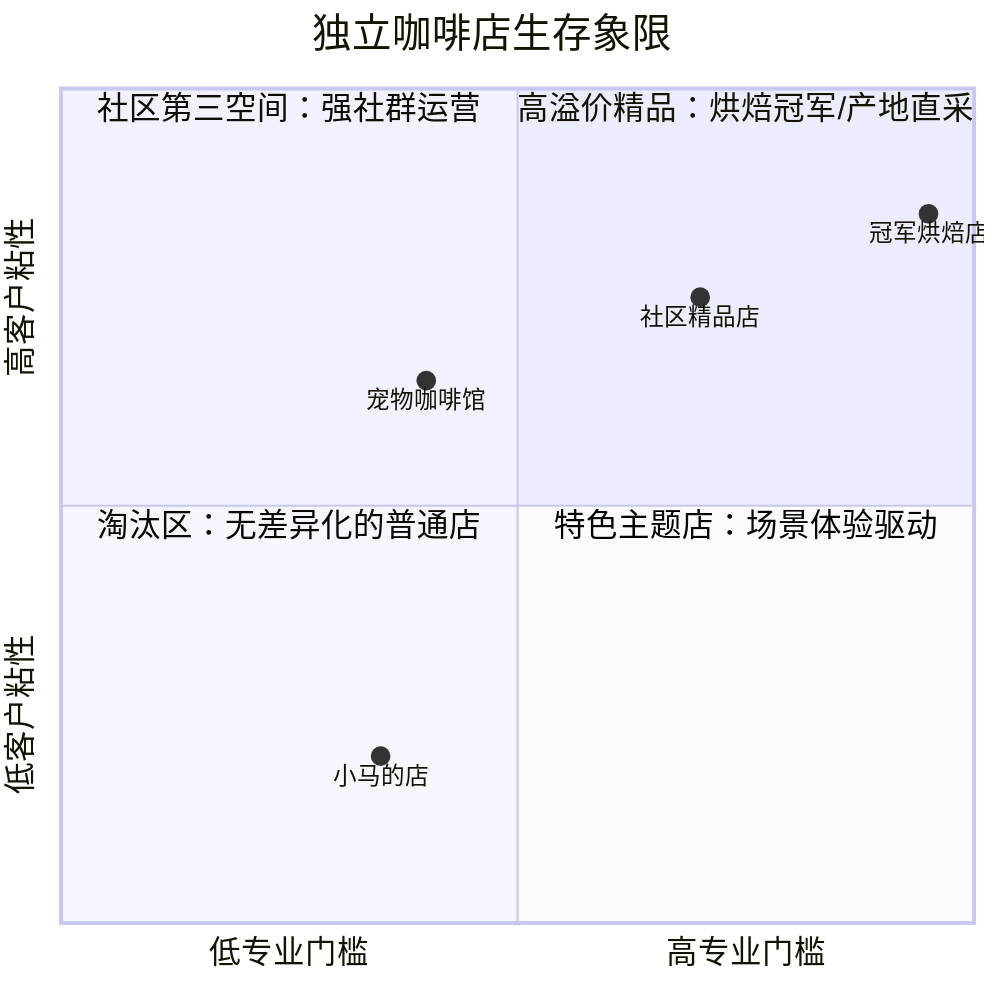
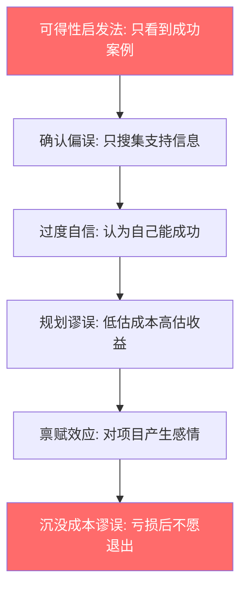
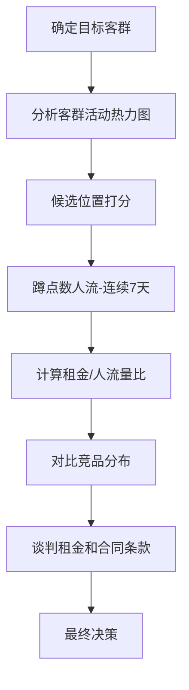
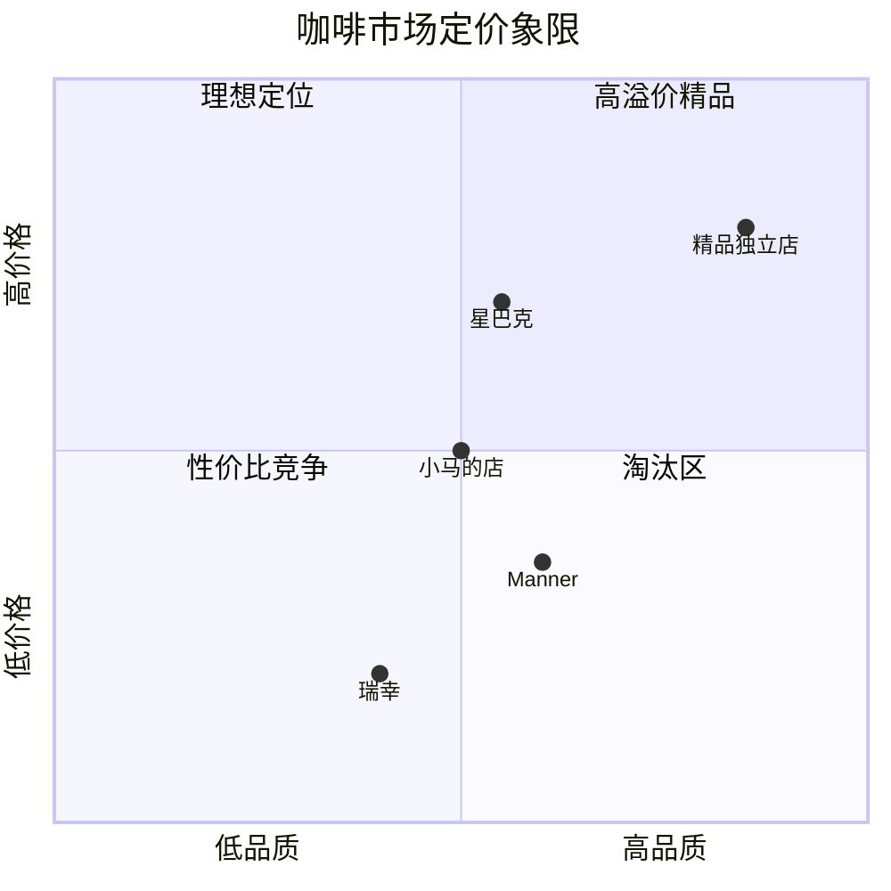
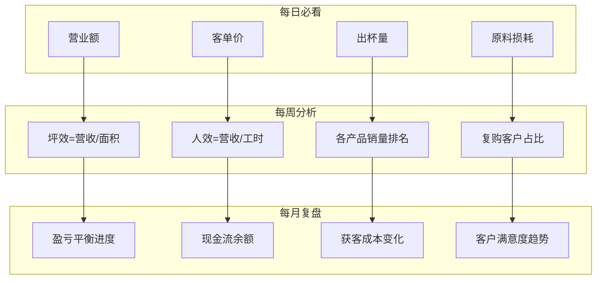
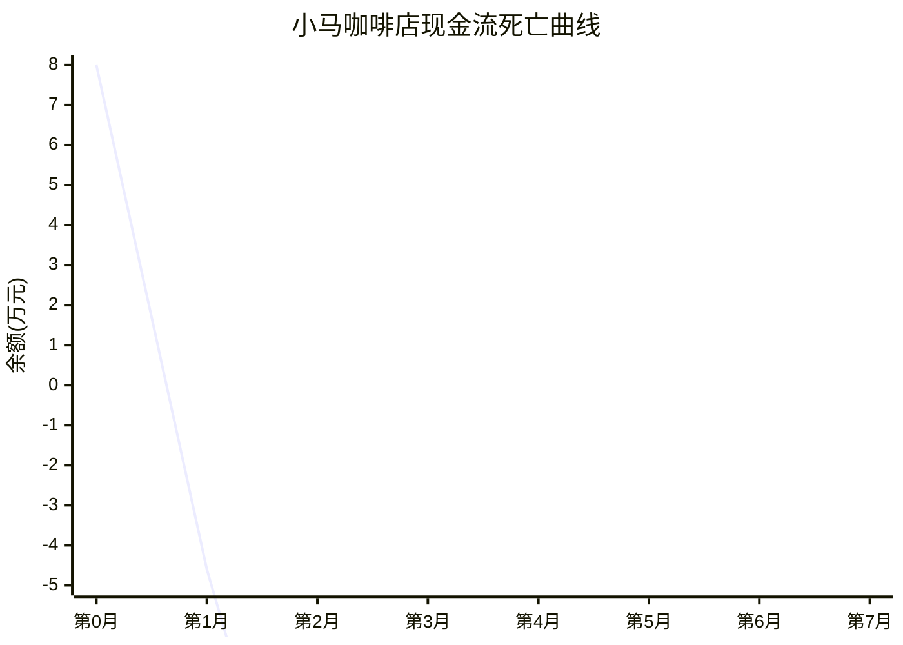
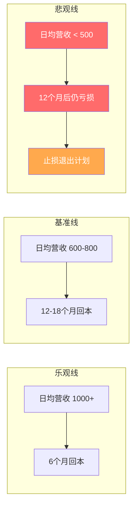
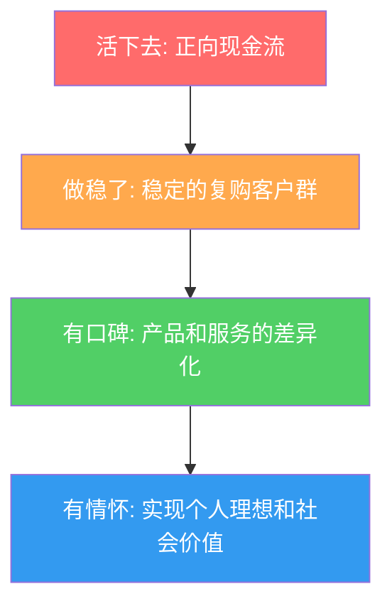
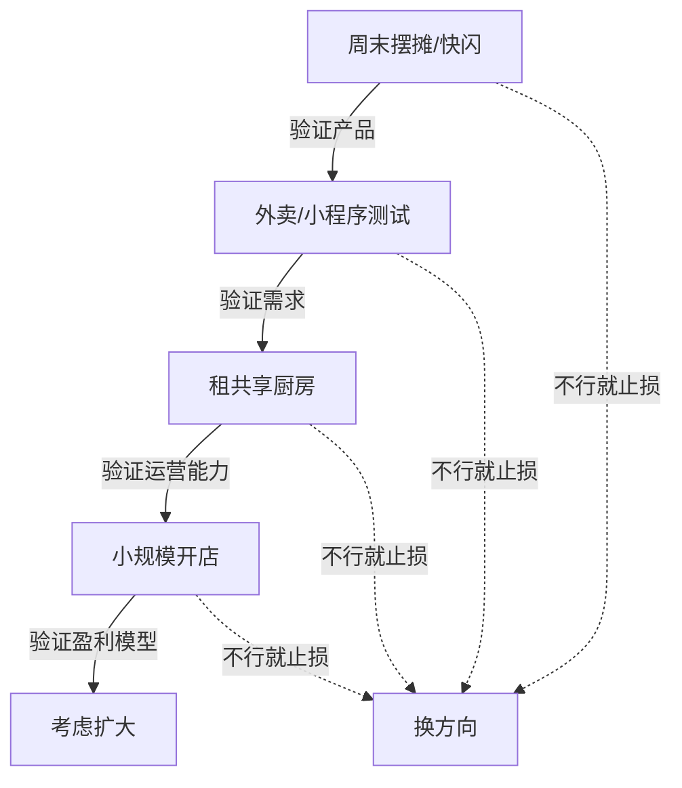
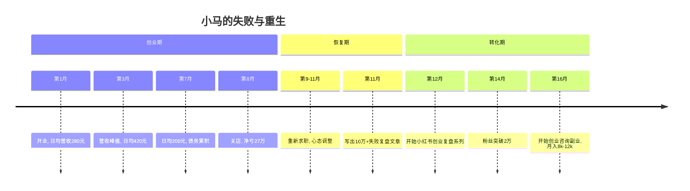

## 案例八：失败的创业经历——小马的咖啡店

前面七个案例展示了各种成功的副业和创业路径，但真实世界的创业并非只有鲜花与掌声。创业失败率在中国一线城市高达 80% 以上，其中餐饮行业更是"重灾区"——中国餐饮协会数据显示，新开餐厅一年内倒闭率超过 60%，能撑过三年的不足 20%。2023 年《中国餐饮创业白皮书》进一步指出，咖啡赛道的新店存活率仅为 18.7%，低于餐饮行业平均水平的 25%。

本案例完整复盘一位互联网从业者"小马"从辞职开咖啡店到关门大吉的全过程，不为制造焦虑，而是让你在别人的真实教训中建立风险意识，学会在创业前识别致命陷阱。更重要的是，这个案例将告诉你：**失败本身不是价值，从失败中提炼出可复用的认知框架才是价值**。

本文按照"道法术器"四层逻辑展开：先讲底层认知（咖啡行业的真实竞争格局与创业决策心理学），再讲方法论（选址、定价、获客的正确框架），然后落到实操（财务模型、数据工具、运营清单、日常SOP），最后给出工具包（决策自检清单、止损线模板、合规指南、自检清单）。

---

### 一、行业背景：中国咖啡市场的真实面貌

在复盘小马的故事之前，有必要先了解他进入的究竟是一个什么样的市场。很多创业者对行业的认知停留在"咖啡市场很大、增长很快"的表面数据上，却对竞争格局、盈利模型和结构性风险一无所知。

#### 1.1 市场规模与增长

中国咖啡市场确实在高速增长。据艾瑞咨询数据，2023 年中国咖啡市场规模约 3,817 亿元，预计 2025 年将突破 6,000 亿元。但"市场大"不等于"你能赚到钱"——这个市场正在被头部品牌快速瓜分：

| 品牌 | 门店数量（2024年） | 定价区间 | 核心竞争力 |
|------|-------------------|---------|-----------|
| 瑞幸咖啡 | 20,000+ | 9-20 元 | 供应链规模效应、数字化运营、低价策略 |
| 库迪咖啡 | 8,000+ | 8-15 元 | 极致低价、快速扩张 |
| 星巴克 | 7,000+ | 30-45 元 | 品牌溢价、第三空间、会员体系 |
| Manner | 1,200+ | 15-25 元 | 精品品质 + 性价比、小面积高坪效 |
| 幸运咖 | 3,000+ | 5-12 元 | 蜜雪冰城供应链、下沉市场 |

**小马的竞争对手不是"其他独立咖啡店"，而是这些拥有数十亿资本、万级门店和完整供应链的巨头。** 这是一场资源极度不对称的战争。

更关键的是，这些连锁品牌的定价策略已经把独立咖啡店的生存空间压缩到了极限。瑞幸用 9.9 元活动价拉走了价格敏感型客户，星巴克用品牌力锁住了社交需求型客户，Manner 用 15 元精品咖啡截住了品质追求型客户。留给独立咖啡店的客群非常窄——而且这部分客群对产品和服务的要求极高。

#### 1.2 独立咖啡店的生存真相

独立咖啡店在这样的市场格局下如何生存？答案是：只有两种路径可以走通。



**路径一：极致专业型。** 店主本人是咖啡领域的专家（SCA 认证、烘焙冠军、产地直采能力），产品品质碾压连锁品牌，吸引真正的咖啡爱好者。这类店面积小、租金低、产品线窄但精，靠口碑和社群生存。典型代表是一些 SCA 评分 85+ 的精品烘焙店，客单价可以做到 50-80 元，毛利率 65%+，日均出杯量虽少但利润丰厚。

**路径二：社区第三空间型。** 店主善于经营社群，咖啡店成为社区居民的"客厅"——固定的常客、定期的活动、强烈的人情味。这类店的核心产品不是咖啡，而是"归属感"。他们的获客成本几乎为零（口碑传播），复购率可以高达 60%+，客户终身价值（LTV）远超普通咖啡店。

**路径三：特色主题型。** 宠物咖啡馆、书店咖啡、花艺咖啡等，通过场景差异化吸引特定人群。核心收入可能不是咖啡本身，而是场景体验费、周边产品、活动场地等。这类店对"内容运营能力"要求极高，本质上是在做"线下内容生意"。

**小马三条路径都没走通。** 他既没有专业咖啡技术，也没有社区运营能力，更没有特色主题。他的店从第一天起就处于"无差异化的普通店"象限——这个象限的存活率接近零。

#### 1.3 咖啡行业的成本结构

了解行业成本结构是判断商业模型是否可行的前提。一杯拿铁的真实成本构成如下：

| 成本项 | 占售价比例 | 以25元拿铁为例 | 说明 |
|--------|-----------|--------------|------|
| 原料成本（豆+奶+杯） | 25-35% | 6.25-8.75 元 | 精品豆更高，连锁品牌通过规模压到 20% |
| 租金 | 15-25% | 3.75-6.25 元 | 核心商圈可达 30% |
| 人工 | 15-25% | 3.75-6.25 元 | 兼职 vs 全职差异大 |
| 水电杂费 | 5-8% | 1.25-2.00 元 | 制冰机和空调是大头 |
| 设备折旧 | 3-5% | 0.75-1.25 元 | 咖啡机按 5 年折旧 |
| 平台抽成 | 3-5% | 0.75-1.25 元 | 外卖渠道 15-20% |
| **净利润** | **10-20%** | **2.50-5.00 元** | 管理得好的精品店可达 20%+ |

**关键结论：一杯 25 元的拿铁，净利润只有 2.5-5 元。** 这意味着一家小店每天必须卖出 100-200 杯才能维持基本生存。小马日均出杯量不到 30 杯，远远达不到盈亏平衡点。

**原料成本的隐藏陷阱：** 很多新手只计算了咖啡豆和牛奶的成本，忽略了杯盖、吸管、纸巾、打包袋、糖浆损耗、过期原料报废等"隐形消耗"。这些加起来通常占原料总成本的 15-20%。以小马的情况为例，他买的中等产区豆 80 元/公斤，一杯拿铁用豆 18g（约 1.44 元），鲜奶 150ml（约 1.2 元），但加上杯子（0.5 元）、杯盖（0.3 元）、吸管（0.1 元）、纸巾（0.05 元）、糖浆（0.2 元），实际一杯拿铁的原料成本约为 3.8 元，而非他估算的 2.6 元。看似只有 1.2 元的差距，乘以每天 18 杯、30 天，就是每月 648 元的"隐藏亏损"。

---

### 二、人物画像：小马是谁

| 维度 | 具体情况 |
|------|----------|
| 年龄 | 29 岁，工作 6 年 |
| 职业背景 | 互联网公司产品经理，月薪 18,000 元 |
| 储蓄 | 约 25 万元（多年积蓄 + 年终奖） |
| 家庭状况 | 未婚，无房贷压力 |
| 副业经历 | 此前零创业经验，仅有公司内部项目管理经验 |
| 性格特征 | 理想主义，执行力强但缺乏财务敏感度 |
| 社交资本 | 无餐饮行业人脉，朋友圈以互联网从业者为主 |
| 学历 | 985 本科，计算机相关专业 |
| 兴趣爱好 | 旅行、摄影、精品咖啡（喝但不会做） |

小马的典型特征是"高学历、高收入、零商业经验"。这类人群创业时往往带着互联网行业的线性思维——"把事情做好，用户自然会来"，却忽略了实体商业的残酷本质。在行为经济学中，这种现象被称为**"能力迁移幻觉"**（Transfer Illusion）：人们倾向于高估自己在一个领域积累的能力对另一个陌生领域的适用性。

哈佛商学院 Noam Wasserman 教授在其对 10,000+ 创业者的研究中发现，首次创业者的失败率是有行业经验创业者的 2.3 倍。小马的画像几乎完美匹配"高风险创业者"的全部特征。

**小马的"能力-需求"错配分析：**

| 他拥有的能力 | 咖啡店的实际需求 | 匹配度 |
|------------|----------------|--------|
| 产品原型设计 | 咖啡出品标准化 | ★☆☆☆☆ |
| 数据分析（SQL/Excel） | 进销存管理 | ★★☆☆☆ |
| 项目管理 | 每日重复性运营 | ★★☆☆☆ |
| 用户研究（线上） | 线下客流分析 | ★★☆☆☆ |
| 跨部门沟通 | 供应商谈判 | ★☆☆☆☆ |
| PPT/文档能力 | 菜单设计/营销物料 | ★★★☆☆ |

6 项核心能力中，没有一项能直接对口咖啡店的关键需求。这不是说他的能力不行，而是**领域错配**——用互联网的锤子去钉餐饮的螺丝。

**更深层的问题——"能力幻觉"的来源：**

小马之所以认为自己能开好咖啡店，还有一个心理机制在起作用：**"消费者专家幻觉"**。作为一个喝了 3 年精品咖啡的消费者，他觉得自己"很懂咖啡"。但消费者视角和经营者视角的差距，就像乘客和飞行员的差距——你会坐飞机不代表你会开飞机。他能分辨一杯咖啡好不好喝，但不知道怎么用 15 秒判断一台磨豆机的刀盘是否需要更换、怎么在高峰期同时处理 3 个订单不让品质下降、怎么和牛奶供应商谈判月结账期。

---

### 三、创业动因：情怀驱动的决策

#### 3.1 触发点

小马在一次成都旅行中走进了一家独立咖啡馆，被店主的从容生活打动——"每天做自己喜欢的事，和有趣的客人聊天，还能养活自己"。他开始幻想自己也能拥有一家"有灵魂的咖啡店"。

这个触发点在心理学中被称为**"峰终体验偏差"**（Peak-End Rule）：人们对一段经历的记忆取决于其最强烈的瞬间和结尾，而非整体平均体验。小马记住了那家成都咖啡馆最美好的一个下午，却没有看到店主凌晨 5 点起来备料、月底算账发现亏损、连续三个月没有休息日的另一面。

#### 3.2 决策过程（有缺陷的）


注意这条决策链中**缺失的关键环节**：

- ❌ 没有做市场调研（该区域咖啡消费人群画像、竞争对手数量、客流量统计）
- ❌ 没有做财务模型（盈亏平衡点测算、现金流预测、最坏情况模拟）
- ❌ 没有行业实习或深入学习（连咖啡师培训都没参加）
- ❌ 没有 MVP 验证（比如先摆摊、先做外卖测试市场反应）
- ❌ 没有咨询有经验的人（同行前辈、创业导师、餐饮从业者）
- ❌ 没有做竞品实地调研（没有去竞品门店消费、观察客流、分析菜单）
- ❌ 没有评估自己的退出成本（如果失败，能承受多大损失）

他用了一种典型的"拍脑袋决策法"：**喜欢 → 想做 → 找铺 → 开干**。

#### 3.3 情怀 vs. 商业的本质区别

| 维度 | 情怀型思维 | 商业型思维 |
|------|-----------|-----------|
| 核心驱动 | "我想开一家店" | "市场需要什么" |
| 选址逻辑 | "这个地方有感觉" | "目标客群密度最高的位置" |
| 产品逻辑 | "我觉得好喝就行" | "目标客户愿意为什么口味付钱" |
| 成本意识 | "差不多就行" | "每一分钱都要有回报" |
| 风险评估 | "大不了亏点钱" | "最坏情况我能否承受" |
| 退出机制 | "走一步看一步" | "亏损到什么程度必须止损" |
| 成功定义 | "做自己喜欢的事" | "持续产生正向现金流" |
| 时间观念 | "慢慢来总会好的" | "资金有时间成本，窗口期有限" |

小马在决策阶段犯的错误，是后面所有问题的**根本原因**。

#### 3.4 决策背后的心理学机制

小马的决策失误不是偶然的，而是多种认知偏差共同作用的结果。理解这些机制，可以帮助你在自己的创业决策中提前识别危险信号。

**（1）可得性启发法（Availability Heuristic）**

人们倾向于根据容易回忆起来的信息做判断。小马在社交媒体上频繁看到"辞职开咖啡店"的成功故事，这些信息在他的记忆中极度活跃，导致他严重高估了成功概率。而那些失败关店的故事——店主们沉默了，没有发帖——在他的认知中几乎不存在。

**实操建议：** 在做创业决策前，强制自己花等量时间搜索"XX行业失败案例""XX开店亏损"。如果你在小红书上收藏了 20 篇成功案例，就必须看 20 篇失败案例。信息对称是理性决策的前提。

**（2）确认偏误（Confirmation Bias）**

一旦小马产生了"我想开咖啡店"的念头，他开始不自觉地寻找支持这个决定的信息：关注咖啡博主、收藏咖啡店装修方案、研究咖啡豆产区——但从未主动搜索"咖啡店失败案例""餐饮创业亏损"。他的信息搜集从一开始就是偏斜的。

**（3）规划谬误（Planning Fallacy）**

诺贝尔经济学奖得主 Daniel Kahneman 提出的"规划谬误"指出：人们在规划未来项目时，系统性地低估完成所需的时间和成本，同时高估收益。小马预估 10 万装修，实际花了 16.5 万；预估半年回本，实际八个月关店——这正是规划谬误的经典表现。

**打破规划谬误的方法——"参考类别预测法"（Reference Class Forecasting）：** 不要从自己的项目细节出发做预测，而是先看"类似项目"的平均结果。具体做法：找到 10 家同城市、同规模、同品类的咖啡店，了解它们的平均开业成本、平均回本周期、平均存活时间。用这个"参考类别"的中位数作为你的预测基准，然后根据自己的具体情况做上下 20% 的调整。你会发现，大多数独立咖啡店的回本周期是 18-24 个月，而非小马预期的 6 个月。

**（4）过度自信效应（Overconfidence Effect）**

研究显示，约 80% 的人认为自己的驾驶水平高于平均——这在统计学上不可能成立。创业领域同样如此：首次创业者普遍认为自己属于那 20% 能成功的少数人。小马从未认真评估过自己属于失败的 80% 的可能性。

**（5）禀赋效应（Endowment Effect）**

一旦小马开始投入时间看铺面、聊租金，他就会对"开咖啡店"这个想法产生一种"所有权"感——"这毕竟是我想出来的，不能轻易放弃"。行为经济学研究表明，人们对"自己拥有"的东西会赋予比实际高出 2-3 倍的价值。这种效应让小马在后续决策中越来越难理性评估。

**认知偏差叠加效应图：**



这六个偏差不是独立发生的，而是**链式反应**：一个偏差导致错误决策，错误决策强化下一个偏差，最终形成一个封闭的决策幻觉泡泡。小马在这个泡泡里待了 8 个月，直到花光所有积蓄才被迫清醒。

**打断链式反应的方法——"魔鬼代言人清单"：** 在做任何重大决策之前，找一个你信任的人，让他专门扮演反对者角色，用以下问题挑战你的每一个假设：

1. "如果这件事 100% 会失败，原因会是什么？"
2. "你有没有只看支持你决定的信息？"
3. "如果这笔钱全部亏完，你的生活会怎样？"
4. "你认识的最理性的人会怎么做这个决定？"
5. "你有没有问过已经在做这件事的人，他们后悔吗？"

---

### 四、执行过程：每一步都踩坑

#### 4.1 选址：用情怀代替数据

小马选择了某二线城市一条文创街区的临街铺面，面积约 45 平方米，月租金 8,500 元。他选择这里的理由是"这条街有文艺氛围，适合咖啡馆"。

**实际问题：**

- 该街区日均人流量约 2,000 人，但其中大部分是路过的上班族，不是咖啡消费群体
- 周边 500 米内已有 3 家连锁咖啡品牌（瑞幸、星巴克、Manner），价格区间 9-30 元
- 文创街区的客流量严重依赖周末和节假日，工作日几乎门可罗雀
- 没有停车位，不适合开车的商务客户
- 文创街区的租约通常有"旺季效应"——房东看到客流好会涨租金，而你无法将成本转嫁给消费者
- 该铺面的上下水管道老化，改造花了 8,000 元（当初看铺时没有检查）
- 电力容量只有 220V，咖啡机需要 380V 商用电，增容申请等了 3 周、花了 3,000 元

**选址是实体创业中最关键的单一决策。** 业内有句话叫"选址选对了，成功一半；选址选错了，神仙难救"。选址错误的可怕之处在于，它是一个**不可逆的沉没成本**——装修、设备、押金全部绑定在这个位置上，一旦发现错误，搬迁意味着几乎全部重来。

**正确的选址方法应该是：**



**选址核心数据采集清单：**

| 数据项 | 采集方法 | 判断标准 |
|--------|---------|---------|
| 工作日人流量 | 分时段蹲点（早/中/晚/周末各 2 小时） | 日均有效客流 ≥ 1,000 人 |
| 目标客群比例 | 观察路人特征（年龄、穿着、是否携带咖啡） | 目标客群占比 ≥ 30% |
| 竞品密度 | 高德/美团搜索 500 米内咖啡店 | 同品类 ≤ 2 家为佳 |
| 竞品经营状况 | 查看大众点评评分和月销量 | 竞品月销 > 500 单说明有市场 |
| 租金/营收比 | 月租金 / 预估月营收 | ≤ 15% 为健康区间 |
| 周边业态 | 实地走访，记录所有商户类型 | 有写字楼/学校/社区为佳 |
| 合同条款 | 仔细审阅租约 | 涨租上限、转让条件、退出条款 |
| 排他条款 | 与房东确认 | 同栋/同街是否有排他保护 |
| 工程条件 | 实地测量水电气容量 | 咖啡机需 380V 商用电，上下水要达标 |
| 物业费和公摊 | 询问物业或前任租户 | 有些商业综合体公摊面积高达 30% |
| 周边规划 | 查询城市规划局公告 | 是否有拆迁、修路、新竞品入驻风险 |

**选址打分表示例：**

| 评估项 | 权重 | 候选A得分 | 候选B得分 | 候选C得分 |
|--------|------|----------|----------|----------|
| 目标客群密度 | 30% | 5 | 8 | 7 |
| 租金性价比 | 25% | 7 | 6 | 8 |
| 竞争激烈度 | 20% | 3 | 6 | 7 |
| 交通便利性 | 15% | 6 | 8 | 5 |
| 长期发展潜力 | 10% | 7 | 5 | 6 |
| **加权总分** | 100% | **5.25** | **6.65** | **6.90** |

小马从未做过这样的分析。

**选址中的"隐性成本陷阱"：** 小马只看了月租金 8,500 元，忽略了以下隐性成本：

| 隐性成本 | 说明 | 小马是否考虑 |
|---------|------|------------|
| 物业费 | 商业物业费通常 3-8 元/平米/月 | ❌ 未考虑 |
| 转让费 | 热门铺面转让费可达 5-15 万 | ❌ 付了 3 万 |
| 公摊面积 | 实际使用面积可能只有建筑面积的 70% | ❌ 45 平米实际使用约 32 平米 |
| 装修还原费 | 退租时需恢复原状的费用 | ❌ 未在合同中约定 |
| 淡季空置风险 | 文创街区工作日客流可能只有周末的 20% | ❌ 完全没考虑 |

#### 4.2 装修：预算失控

小马初始预算 10 万元装修，最终花了 16.5 万元。超支原因：

- 设计师费用：1.2 万（找了一个"有感觉"的独立设计师，但对方不懂餐饮动线设计）
- 硬装超支：原计划简单装修，但"总觉得不够有氛围"，不断追加木工、灯光、绿植
- 设备采购：买了一台 La Marzocco 意式咖啡机（4.8 万），远超实际需求
- 家具定制：定制了实木桌椅（2.3 万），远比成品贵
- 消防/排烟/排水改造：1.5 万（之前完全没考虑过）

**装修预算超支的心理学解释——"宜家效应"的反面：**

行为经济学家 Dan Ariely 提出的"宜家效应"（IKEA Effect）指出，人们对亲手参与创建的事物会赋予过高的价值。小马在装修过程中不断追加投入，不是因为客观需要，而是因为每一笔追加投入都让他对这家店的感情更深，形成了一种**"投入→情感绑定→继续投入"的正反馈循环**。这种循环在心理学中被称为**"承诺升级"**（Escalation of Commitment）。

**装修成本对比：**

| 项目 | 小马实际支出 | 合理预算（同规模） | 超支比例 |
|------|------------|------------------|---------|
| 设计费 | 12,000 | 3,000-5,000 | +140% |
| 硬装 | 45,000 | 25,000-30,000 | +67% |
| 设备 | 65,000 | 25,000-35,000 | +100% |
| 家具 | 23,000 | 8,000-12,000 | +118% |
| 改造工程 | 15,000 | 5,000-8,000 | +114% |
| 其他 | 5,000 | 3,000-5,000 | +40% |
| **合计** | **165,000** | **69,000-95,000** | **+90%** |

这意味着还没开业，小马就多花了近 7 万元。对于一个没有稳定收入的新店来说，这笔钱直接缩短了至少 4 个月的生存窗口期。

**装修成本控制的正确方法：**

| 阶段 | 关键动作 | 具体操作 |
|------|---------|---------|
| 前期 | 明确预算上限 | 总预算 = 装修 + 设备 + 3 个月运营资金，装修部分不超过总预算的 40% |
| 设计 | 找餐饮空间设计师 | 在大众点评/小红书找有餐饮案例的设计师，而非纯审美型设计师 |
| 采购 | 二手设备优先 | 咖啡机、制冰机等可在闲鱼/餐饮设备回收商处购买，价格为新品的 30-50% |
| 执行 | 分阶段验收 | 硬装完成验收后才付尾款，避免被施工队"绑架" |
| 验收 | 严格对照清单 | 所有设备到场后逐一测试，保留保修卡和发票 |

**45 平米咖啡店设备预算参考（最低配置）：**

| 设备 | 新品价格 | 二手价格 | 推荐品牌（性价比款） |
|------|---------|---------|-------------------|
| 半自动意式咖啡机 | 8,000-30,000 | 3,000-12,000 | 惠家 210S2、格米莱 3018 |
| 磨豆机 | 3,000-10,000 | 1,500-5,000 | 惠家 ZD-10、Eureka Mignon |
| 制冰机 | 3,000-6,000 | 1,500-3,000 | 乐创、喜莱盛 |
| 冰箱（冷藏+冷冻） | 3,000-5,000 | 1,500-2,500 | 海尔商用 |
| 净水器 | 2,000-4,000 | 不建议买二手 | 沁园、美的商用 |
| 收银系统 | 2,000-3,000 | — | 美团收银、客如云 |
| 杯具/器具/杂项 | 3,000-5,000 | — | — |
| **合计** | **24,000-63,000** | **8,000-22,500** | — |

小马花了 6.5 万买设备，一台 La Marzocco 就占了 4.8 万——这是精品咖啡馆级别的配置，对于一个非专业咖啡师来说完全浪费。用 8,000 元的惠家半自动机 + 3,000 元的磨豆机，出品差距对普通消费者几乎不可感知。

**设备采购的"80/20法则"：** 80% 的出品品质来自 20% 的设备投入。对普通消费者来说，影响口感的因素排序是：**咖啡豆品质 > 萃取参数 > 磨豆机 > 咖啡机**。一台 8,000 元的半自动咖啡机配上新鲜烘焙的好豆子和正确的萃取参数，出品品质远超一台 5 万的 La Marzocco 配上放了两周的豆子和随意的参数。小马把预算花在了最不重要的环节上。

#### 4.3 产品：自嗨式出品

小马自己不是专业咖啡师，开业前只参加了 3 天的"咖啡体验课"。他的产品策略是：

- 菜单上写了 30+ 款饮品（意式、手冲、特调、甜品、简餐）
- 豆子用的是中等偏上的产区豆，成本不低
- 定价：美式 22 元，拿铁 28 元，特调 35 元，略低于星巴克但远高于瑞幸

**问题分析：**

**定价困境——夹在中间地带：**



小马的店卡在了一个**最尴尬的位置**：品质不如精品店，价格又不够亲民，品牌溢价为零。消费者没有理由选他而不选瑞幸（更便宜）或星巴克（更有品牌社交价值）。

迈克尔·波特的**竞争战略理论**明确指出：企业必须在"成本领先"和"差异化"之间做出选择，**卡在中间（Stuck in the Middle）是最危险的位置**。小马既没有瑞幸的规模效应带来的低成本，也没有精品咖啡馆的专业度和社群粘性，最终被两头夹击。

**产品线过宽**——45 平米的小店，菜单却比星巴克还复杂。结果是：

- 每款产品出杯量都很少，原料浪费严重
- 咖啡师（小马自己）技术不精，每款都做得平庸
- 备料复杂，高峰期出品速度慢
- 顾客选择困难，增加决策成本

心理学中的**"选择悖论"**（Paradox of Choice，Barry Schwartz）指出：选项越多，消费者的决策满意度越低，最终购买概率反而下降。哥伦比亚大学的研究显示，当果酱样品从 24 种减少到 6 种时，购买率从 3% 提升到了 30%。小马的 30+ 款菜单，每一款都在稀释顾客的注意力。

**餐饮产品设计的"1-3-5 法则"：**

| 层级 | 数量 | 作用 | 定价策略 |
|------|------|------|---------|
| 招牌产品 | 1-2 款 | 引流和口碑，必须做到区域内最好 | 微利或平价，目的是让人记住你 |
| 利润产品 | 3-5 款 | 真正赚钱的产品 | 中高价位，搭配销售提高客单价 |
| 补充产品 | 3-5 款 | 覆盖不同口味偏好 | 正常定价 |

小马把 30+ 款产品全部平铺在菜单上，没有层级、没有主次、没有策略——每款都是"平均水平"，没有一款能让人记住。

**正确的菜单设计应该是这样的（45 平米社区咖啡店参考）：**

| 产品类别 | 具体产品 | 定价 | 成本 | 毛利率 | 战略角色 |
|---------|---------|------|------|--------|---------|
| 招牌美式 | 冷/热美式 | 15 元 | 3 元 | 80% | 引流爆款，打破"贵"的认知 |
| 核心意式 | 拿铁/卡布/Dirty | 20-25 元 | 5-7 元 | 70% | 利润主力 |
| 季节特调 | 每季 2-3 款限定 | 28-32 元 | 8-10 元 | 68% | 新鲜感 + 社交媒体传播 |
| 非咖啡饮品 | 柠檬茶/可可/鲜榨 | 15-22 元 | 4-8 元 | 65% | 覆盖不喝咖啡的客群 |
| 简餐甜品 | 2-3 款烘焙/三明治 | 12-18 元 | 4-6 元 | 65% | 提高客单价，解决"只喝一杯"问题 |

总 SKU 控制在 12-15 款，每一款都有明确的战略角色。小马的 30+ 款菜单中，至少有 15 款是"因为觉得应该有"而加上去的，它们消耗了备料成本却没有带来相应回报。

#### 4.4 获客：以为"开在那就会有人来"

小马的获客策略：

1. 开业第一天在朋友圈发了 9 张精修图
2. 做了一张开业海报，打折 8 折
3. 在大众点评注册了店铺

然后就没有然后了。

**他完全忽略了：**

- 没有做任何开业活动来吸引首批客流（试饮、打卡、社群引流）
- 没有建立私域流量池（微信群、公众号、小红书账号）
- 没有与周边商家做联合引流
- 没有持续的内容输出（咖啡知识、探店笔记、幕后故事）
- 大众点评上线后没有维护评价，前 3 条评价有 1 条差评，直接影响了后续转化
- 没有做外卖渠道（美团、饿了么）
- 没有设计任何会员或复购机制

**有效的低成本获客矩阵应该是：**

| 渠道 | 成本 | 预期效果 | 启动难度 | 关键指标 |
|------|------|---------|---------|---------|
| 小红书内容运营 | 0 元 | 持续曝光，吸引精准客群 | 中（需持续产出） | 笔记互动率 > 5% |
| 大众点评运营 | 500-2,000 元/月 | 本地搜索流量 | 低 | 评分 ≥ 4.5，月曝光 > 5,000 |
| 企业微信社群 | 0 元 | 复购和口碑传播 | 中 | 社群人数 > 200，月复购率 > 30% |
| 周边商户联盟 | 0 元 | 互相导流 | 低 | 月互推引流 > 50 人 |
| 抖音本地生活 | 1,000-3,000 元/月 | 短视频引流到店 | 中 | 视频播放 > 1 万/条 |
| 美团/饿了么外卖 | 平台抽成 15-20% | 增量收入 | 低 | 月订单 > 300 单 |
| 写字楼地推 | 500 元/月 | 稳定办公客群 | 中 | 月新增企微好友 > 100 人 |

**私域运营的"SOP 化"流程（小马完全没做）：**

```text
【新客转化流程】
第1步：到店消费 → 引导扫码加企业微信 → 送一张"第二杯半价"券
第2步：24小时内发送欢迎消息 + 自我介绍 + 今日推荐
第3步：第3天发送咖啡知识小贴士（非推销）
第4步：第7天发送专属优惠（限时3天）
第5步：入群邀请 → 社群每周2-3次互动（投票选新品、咖啡知识问答、用户UGC分享）

【老客维护流程】
- 生日当月：免费赠饮一杯（提前在微信备注生日信息）
- 消费满10次：升级为"咖啡挚友"，永久9折
- 连续2周未来店：自动触发关怀消息（"好久不见，最近有新品想请你试"）
- 用户好评截图：转到社群+朋友圈（获得用户授权后）
```

**"开业前 30 天"获客时间线（小马完全没做）：**

| 时间节点 | 动作 | 目标 |
|---------|------|------|
| 开业前 30 天 | 注册小红书/抖音，发第一条"装修日记" | 积累第一批关注者 |
| 开业前 21 天 | 发布"咖啡学习过程"内容，展示专业度 | 建立信任 |
| 开业前 14 天 | 在大众点评上架"1 元预售套餐" | 锁定首批到店客户 |
| 开业前 7 天 | 邀请 20 位种子用户免费体验，收集反馈 | 优化产品和服务流程 |
| 开业前 3 天 | 发布开业倒计时内容，预告开业活动 | 制造期待感 |
| 开业当天 | "1 元美式限 100 杯"活动 | 快速积累好评和口碑 |
| 开业后 7 天 | 每天发布探店/幕后内容 | 维持热度 |

**获客成本的数学真相：**

假设小马每天需要 100 个客户才能保本，获客渠道和成本如下：

| 渠道 | 日均获客量 | 单客成本 | 月成本 |
|------|-----------|---------|--------|
| 自然路过 | 20 人 | 0 元 | 0 元 |
| 大众点评搜索 | 15 人 | 3 元 | 1,350 元 |
| 小红书引流 | 10 人 | 2 元 | 600 元 |
| 外卖平台 | 25 人 | 平台抽成 | 按比例 |
| 社群复购 | 20 人 | 0.5 元 | 300 元 |
| 地推/活动 | 10 人 | 5 元 | 1,500 元 |
| **合计** | **100 人** | — | **3,750+ 元** |

每月 3,750 元的获客成本对小店来说是一笔不小的支出。但如果不投入，就只有 20 个路过客——远不够保本。这就是新店的"冷启动困境"：**你需要客流量来证明商业模型，但获得客流量本身就需要成本**。

#### 4.5 运营：没有数据意识

小马的日常管理完全凭感觉：

- 不知道每天卖了多少杯，哪些产品卖得好
- 不知道原材料损耗率是多少
- 不知道获客成本、客单价、翻台率
- 不知道哪些时间段客流高峰，该不该排班

**餐饮运营必须追踪的核心数据：**



**小餐饮店实用数据工具推荐：**

| 工具 | 用途 | 成本 | 推荐理由 |
|------|------|------|---------|
| 美团收银/客如云 | 收银 + 基础数据统计 | 50-200 元/月 | 与外卖平台打通，自动生成日报 |
| 飞书多维表格 | 自定义数据看板 | 免费 | 可设计每日数据录入模板，自动生成趋势图 |
| 微信记账小程序 | 简单收支记录 | 免费 | 适合早期开店，0 门槛 |
| 进销存软件（秦丝等） | 原料采购和库存管理 | 免费基础版 | 控制原料损耗的关键 |

小马只在月底看一下银行余额，然后焦虑一下。

**每日数据记录模板（建议打印贴在收银台旁）：**

```text
日期：______ 星期：______ 天气：______

【营收数据】
营业额：______ 元  出杯量：______ 杯  客单价：______ 元
现金收入：______ 元  移动支付：______ 元  外卖收入：______ 元

【产品销量 TOP5】
1. ______ x______ 杯
2. ______ x______ 杯
3. ______ x______ 杯
4. ______ x______ 杯
5. ______ x______ 杯

【原料损耗】
丢弃/过期原料：______（品名） 价值：______ 元

【客流时段分布】
早（7-10）：______ 人  中（10-14）：______ 人
下午（14-18）：______ 人  晚（18-21）：______ 人

【今日备注】
_______________________________________
```

#### 4.6 团队：单人作战的局限

小马选择自己当咖啡师、店长、采购、营销、财务于一身，只雇了一个兼职。这带来了几个致命问题：

**精力分散导致全面平庸。** 一个人每天要在做咖啡、接待客人、采购原料、打扫卫生、处理账目之间切换，每一项都只能做到 60 分。而餐饮行业的残酷现实是：任何一项低于 80 分，都可能导致客户流失。

**无休息日导致身心崩溃。** 小马连续 3 个月没有完整休息日，到第 4 个月时已经明显出现倦怠症状——对客人态度变冷、产品品质波动、创新动力消失。员工倦怠（Burnout）是小餐饮店倒闭的隐性杀手。

**正确的团队配置建议（45 平米咖啡店）：**

| 阶段 | 团队配置 | 月人力成本 |
|------|---------|-----------|
| 开业期（1-3 月） | 店主（全职）+ 1 名全职咖啡师 | 5,000-7,000 元 |
| 稳定期（4-12 月） | 店主（半职管理）+ 1 名全职 + 1 名兼职 | 8,000-10,000 元 |
| 扩张期（12 月+） | 店主（管理）+ 2 名全职 | 12,000-15,000 元 |

关键原则：**创始人必须从"做事"转向"管事"**。如果你每天都在做咖啡，你就没有时间思考战略、优化流程、拓展渠道。

#### 4.7 日常运营：缺乏 SOP 导致品质波动

小马的另一个致命问题是缺乏标准化操作流程（SOP）。每天的出品品质完全取决于他的个人状态——精力好时做得不错，疲惫时出品明显变差。这种品质波动对复购率的打击是毁灭性的。

**开档/收档标准流程（小马从未建立）：**

```text
【开档流程 - 营业前30分钟】
□ 检查制冰机冰量，不足则提前制冰
□ 开启咖啡机预热（至少15分钟）
□ 检查磨豆机刀盘清洁度，必要时清洁
□ 校准磨豆机研磨度（每天第一杯必须校准）
□ 检查鲜奶、糖浆等冷藏原料保质期
□ 准备当日新鲜水果/辅料
□ 清洁所有操作台面和器具
□ 检查收银系统、打印机、Wi-Fi
□ 检查净水器滤芯状态
□ 播放背景音乐，调整灯光
□ 检查座位区整洁度

【收档流程 - 营业结束后】
□ 清洗所有器具（咖啡机冲煮头、蒸汽棒、手冲壶）
□ 清洁磨豆机（清空残粉）
□ 清洁制冰机外部
□ 清洗冰箱，处理过期食材
□ 清洁所有操作台面和地面
□ 核对当日营收数据，录入系统
□ 检查原料库存，列出明日采购清单
□ 关闭所有设备电源（冰箱除外）
□ 检查门窗锁闭
□ 拍照记录当日状态（用于复盘）
```

**食品安全 SOP（餐饮合规基础）：**

| 环节 | 标准操作 | 检查频率 |
|------|---------|---------|
| 原料验收 | 检查生产日期、保质期、包装完整性 | 每次进货 |
| 冷藏温度 | 鲜奶/奶油 2-6°C，冷冻 -18°C 以下 | 每日 2 次 |
| 原料先进先出 | 新货放后面，旧货放前面 | 每次补货 |
| 手部清洁 | 接触食物前、使用洗手间后、接触垃圾后 | 每次 |
| 器具消毒 | 奶缸、拉花缸每 4 小时深度清洗 | 每日 2 次 |
| 环境消杀 | 操作台面、门把手、菜单 | 每日 |
| 废弃物处理 | 当日垃圾当日清，分类存放 | 每日 |

**原料采购与供应链管理（小马的盲区）：**

| 采购要点 | 说明 | 常见错误 |
|---------|------|---------|
| 供应商比价 | 至少找 3 家供应商报价 | 只找一家就下单 |
| 账期谈判 | 争取月结（30天），减少现金流压力 | 全部现金采购 |
| 最低起订量 | 了解每家供应商的起订量，避免囤货 | 一次买太多导致过期 |
| 品质验收 | 每批原料开箱抽检，不合格拒收 | 盲目信任供应商 |
| 备选供应商 | 主力供应商之外至少备选 1 家 | 供应商断货时无替代方案 |
| 季节性调整 | 夏季冷饮原料增加，冬季热饮原料增加 | 全年同一采购清单 |

小马的采购方式是"用完了再去超市买"——这意味着他永远拿不到批量价格，永远在应急采购，原料成本比行业平均高出 20-30%。

---

### 五、财务复盘：钱是怎么烧完的

#### 5.1 启动资金投入

| 项目 | 金额（元） |
|------|-----------|
| 转让费 | 30,000 |
| 押金（押三付一） | 34,000 |
| 装修 | 165,000 |
| 首批原料采购 | 8,000 |
| 杂项（执照、保险、绿植等） | 5,000 |
| **合计** | **242,000** |

25 万积蓄几乎一次性投入，手头仅剩 8,000 元流动资金。

**第一个致命错误：没有留安全垫。** 创业财务的基本原则是"永远留 6 个月运营资金"。按照小马每月约 2 万元的固定支出，他至少应该留 12 万元作为安全垫，这意味着启动资金应该控制在 13 万元以内。但他把 25 万全部投入，开业第一天就处于"裸奔"状态。

**创业资金分配的"5-3-2 原则"：**

| 资金用途 | 占总积蓄比例 | 小马的实际 | 正确做法 |
|---------|------------|-----------|---------|
| 启动投入（装修+设备+押金） | ≤ 50% | 96%（24.2 万/25 万） | 12.5 万 |
| 安全垫（6 个月运营资金） | ≥ 30% | 3%（0.8 万/25 万） | 7.5 万 |
| 个人生活备用金 | ≥ 20% | 0% | 5 万 |

#### 5.2 月度固定支出

| 项目 | 金额（元/月） |
|------|-------------|
| 租金 | 8,500 |
| 水电物业 | 1,800 |
| 原料采购 | 4,000-6,000 |
| 兼职工资（1人） | 3,000 |
| 外卖平台抽成 | 1,000-2,000 |
| 杂项损耗 | 500 |
| **合计** | **18,800-21,800** |

月固定支出约 **2 万元**，意味着每天至少要营收 **670 元**才能保本。这个数字意味着每天要卖出约 **35 杯拿铁**（28 元/杯）——对于一个没有品牌知名度、没有稳定客流的新店来说，这是相当高的要求。

**盈亏平衡点的敏感性分析：**

| 场景 | 客单价 | 日均出杯量 | 日营收 | 能否保本 |
|------|--------|-----------|--------|---------|
| 全卖美式 | 22 元 | 35 杯 | 770 元 | ✓ 刚好 |
| 全卖拿铁 | 28 元 | 25 杯 | 700 元 | ✓ 刚好 |
| 混合出品 | 25 元 | 30 杯 | 750 元 | ✓ 刚好 |
| 实际情况 | 23 元 | 18 杯 | 414 元 | ✗ 日亏 256 元 |

小马的实际日均出杯量只有 18 杯，距离保本线还有近一倍的差距。

#### 5.3 实际营收 vs. 盈亏平衡

| 月份 | 日均营收（元） | 月营收（元） | 月支出（元） | 月亏损（元） | 累计亏损 |
|------|--------------|------------|------------|------------|---------|
| 第1月 | 280 | 8,400 | 21,000 | -12,600 | -12,600 |
| 第2月 | 350 | 10,500 | 20,000 | -9,500 | -22,100 |
| 第3月 | 420 | 12,600 | 19,500 | -6,900 | -29,000 |
| 第4月 | 380 | 11,400 | 19,000 | -7,600 | -36,600 |
| 第5月 | 310 | 9,300 | 18,800 | -9,500 | -46,100 |
| 第6月 | 250 | 7,500 | 18,500 | -11,000 | -57,100 |
| 第7月 | 200 | 6,000 | 18,000 | -12,000 | -69,100 |
| 第8月 | — | 关店 | — | — | — |

小马的店在第 3 个月曾短暂回升，因为做了一波大众点评推广。但推广结束后客流迅速回落，说明产品和服务本身没有形成口碑。

**关键教训：第 3 个月的日均营收 420 元是峰值，距离保本线 670 元仍有 37% 的差距。即便在最好的月份，这家店也是亏损的。**

**营收曲线的"死亡信号"解读：**

- **第 1-3 月的缓慢上升**：新店的自然流量 + 亲友捧场 + 开业活动余温，属于"虚假繁荣期"
- **第 3 月的短暂峰值**：大众点评推广带来的脉冲式流量，不可持续
- **第 4-7 月的持续下滑**：新店红利消退，口碑没有建立，复购率极低——这是真正的经营信号
- **日均营收从未突破 500 元**：说明这家店的商业模型存在根本性缺陷，不是"再坚持一下"就能解决的

**现金流死亡曲线：**



开业前有 8,000 元流动资金，第 1 月就跌入负值。之后每月都在"借新债补旧债"的恶性循环中。到第 5 月，积蓄彻底耗尽，小马开始刷信用卡维持运营——这是最危险的信号，因为信用卡的利息会加速资金消耗。

**信用卡负债的雪球效应：** 小马从第 5 月开始用信用卡支付原料和房租，信用卡年化利率约 18%。假设他累计透支 3 万元，按最低还款额计算，一年后实际还款总额约为 3.5 万元——多出的 5,000 元利息，相当于他需要额外卖出 1,000 杯拿铁才能覆盖。用借来的钱维持一个持续亏损的生意，就像用汽油灭火。

#### 5.4 关店清算

| 项目 | 金额（元） |
|------|-----------|
| 设备残值（二手转让） | 22,000 |
| 退还押金 | 17,000（扣除违约金后） |
| 剩余原料处理 | 1,500 |
| **回收合计** | **40,500** |

总投入约 242,000 + 8 个月运营亏损约 69,100 = **311,100 元**
总回收约 40,500 元
**净亏损约 270,600 元**——几乎是他全部积蓄。

**更残酷的账：** 如果把小马这 8 个月的时间成本算进去（18,000 × 8 = 144,000 元），加上机会成本（如果继续上班可能获得的晋升和加薪），他的总损失接近 **40 万元**。

**关店的隐性成本（常被忽略）：**

| 隐性成本 | 说明 |
|---------|------|
| 信用损失 | 信用卡透支、朋友借款未还，影响个人信用和人际关系 |
| 心理创伤 | 失败带来的自我怀疑、焦虑、社交回避，恢复期通常 3-6 个月 |
| 简历空白 | 8 个月的"创业失败"经历在求职时是减分项 |
| 家庭关系 | 如果有家人支持/借款，失败会影响家庭信任 |
| 健康损耗 | 长期高压+无休息日导致的身体透支 |
| 社交资本消耗 | 创业期间疏于维护的人际关系需要重建 |

---

### 六、深层原因分析：不只是"运气不好"

很多人复盘失败时会归结为"选址不好""时机不对""疫情影响"。但这些只是表面原因。小马咖啡店倒闭的深层原因是一套系统性的决策失误链。

#### 6.1 根因一：认知偏差——幸存者偏差

小马看到的咖啡馆案例全是成功的：小红书上那些"辞职开了梦想中的咖啡店"的帖子，博主们展示的是精心拍摄的环境照和排队打卡的顾客。他看不到的是：

- 那些帖子背后有多少人已经关店了
- 成功案例的店主往往有餐饮行业背景或强大的本地人脉
- "月入 X 万"的收入可能不包含房租、水电、原料成本
- 很多"成功帖"本身就是营销内容，目的是卖课或招商

**社交媒体上的"咖啡店创业"内容生态真相：**

| 内容类型 | 占比（估算） | 真实目的 |
|---------|------------|---------|
| 真实成功分享 | ~10% | 记录生活，附带分享 |
| 卖课/招商软文 | ~40% | 引流到付费课程或加盟项目 |
| 装修/设备商推广 | ~25% | 推销设计服务或咖啡设备 |
| 精心包装的"半成功" | ~20% | 账面好看但实际不赚钱 |
| 真实失败分享 | ~5% | 极少数愿意公开失败的人 |

你在社交媒体上看到的"咖啡店创业"内容，超过 80% 有商业目的。只有不到 5% 是真实的失败复盘。这就是小马的信息环境。

#### 6.2 根因二：零行业认知

小马在互联网行业积累了 6 年产品经理经验，但这些经验在实体咖啡店运营中几乎**全部失效**：

| 互联网技能 | 在咖啡店运营中的适用性 | 为什么失效 |
|-----------|---------------------|-----------|
| 用户需求分析 | 有一定帮助，但小马没有用于选址和选品 | 互联网的"用户研究"方法（问卷、访谈）不适用于线下随机客流 |
| 产品设计 | 不适用于实体出品流程 | 数字产品的"迭代"成本极低，实体产品的"迭代"意味着原料浪费和客户流失 |
| 项目管理 | 对日常运营帮助有限 | 项目有终点，运营没有终点——这是持续性劳动，不是阶段性任务 |
| 数据分析 | 他根本没有采集运营数据 | 互联网有天然的数据埋点，实体运营需要主动设计数据采集系统 |
| 市场营销 | 线上营销思维无法直接迁移到线下获客 | 线上获客靠流量算法，线下获客靠地理位置和口碑 |

相反，他缺的恰恰是**餐饮行业的核心能力**：

- 咖啡制作技术（直接影响产品品质和出品效率）
- 原料供应链管理（成本控制的关键）
- 门店选址的实战经验（决定生死的能力）
- 餐饮财务管理（控制现金流的命脉）
- 员工管理和服务标准（影响复购的核心）
- 食品安全与卫生管理（合规底线）

**跨行业创业的能力迁移评估框架：**

在考虑从行业 A 转到行业 B 创业时，用这个框架评估迁移风险：

| 评估维度 | 问题 | 风险等级判定 |
|---------|------|------------|
| 核心技能可迁移性 | 你的核心技能在新行业是否有直接应用？ | >50% 可迁移 = 低风险，<20% = 高风险 |
| 行业知识差距 | 你需要学习多少新知识才能达到入门水平？ | 3 个月内可补齐 = 低风险 |
| 人脉资源可复用性 | 现有人脉在新行业是否有价值？ | 有直接行业人脉 = 低风险 |
| 资金门槛匹配度 | 你的资金是否足够覆盖新行业的启动成本+安全垫？ | 资金充足 = 低风险 |
| 试错成本承受力 | 如果失败，你的退路是什么？ | 有明确退路 = 低风险 |

小马在 5 个维度中，4 个处于高风险区。这不意味着他不能创业，而是意味着他**不应该以全押积蓄的方式直接进入**。

#### 6.3 根因三：没有做"最坏情况"推演

小马在投入 25 万之前，只想过"如果生意不错会怎样"，从未认真想过：

- 如果前 6 个月持续亏损怎么办？
- 如果积蓄花完还没盈利，靠什么维持生活？
- 如果发现选址错误，能否承受搬迁的沉没成本？
- 如果自己不适合做餐饮，能否快速转型？

**一个健康的创业决策应该包含"三线推演"：**



小马只做了乐观线推演。

**止损线设定模板：**

| 维度 | 止损条件 | 小马的实际表现 |
|------|---------|--------------|
| 时间止损 | 开业 6 个月后日均营收仍低于保本线的 70% | ✓ 日均 250 元 < 470 元（670×70%） |
| 现金止损 | 流动资金低于 2 个月运营成本 | ✓ 第 5 月时已耗尽全部积蓄 |
| 情绪止损 | 连续 2 周对工作感到厌恶和疲惫 | ✓ 第 4 月时已出现明显倦怠 |
| 机会成本止损 | 如果回去上班的收入 > 当前经营的净收入 | ✓ 关店后上班月薪 18,000 > 经营月亏损 -10,000 |

如果小马在第 4 月执行任何一个止损条件，他至少能省下 3-4 万元。

#### 6.4 根因四：沉没成本谬误

在第 3 个月日均营收达到峰值后开始下滑时，小马已经意识到问题。但他选择继续坚持，理由是"已经投入这么多了，现在放弃就全亏了"。

这就是经典的**沉没成本谬误**——已经花出去的钱不应该影响未来的决策。正确的思考方式是：

> "如果我现在是零投入状态，面对这个日营收 300 元、月亏 1 万的店铺，我还会选择投资 25 万进来吗？"

答案显然是否定的。但因为已经投入了 24 万，小马选择继续烧钱。

**打破沉没成本谬误的"重置测试法"：**

1. 假设你今天刚拿到这家店（零成本获得），但要承担所有未来成本
2. 你会选择继续经营，还是立刻关店转让？
3. 如果答案是"关店"，那现在就关——因为沉没成本不应该影响这个判断
4. 把省下的钱投入到更有希望的方向

#### 6.5 根因五：孤独的决策者

小马从创业决策到关店，全程**没有一个有经验的参谋**。他没有：

- 加入过任何餐饮创业者社群
- 咨询过专业的商业顾问
- 请朋友或家人做过"魔鬼代言人"式的质疑
- 参加过任何创业培训或孵化器

一个人做决策的最大风险是**盲点无人指出**。

**创业顾问的价值不在于告诉你"做什么"，而在于告诉你"不要做什么"。** 一个好的创业导师的价值可能相当于帮你省下 10 万块的试错成本。

**如何找到创业导师：**

| 渠道 | 成本 | 适合阶段 | 怎么找到 |
|------|------|---------|---------|
| 行业社群（微信群/知识星球） | 0-300 元/年 | 决策前期 | 搜索"餐饮创业""咖啡行业"相关社群 |
| 创业孵化器/加速器 | 0-5,000 元 | 早期验证期 | 当地科技局、创业服务中心官网查询 |
| 专业商业顾问 | 500-2,000 元/次 | 关键决策节点 | 在行 APP、知乎咨询、LinkedIn 搜索 |
| 同行前辈（直接约咖啡请教） | 一杯咖啡钱 | 全程 | 去你目标区域的咖啡店消费，和店主聊天 |
| 创业培训课程 | 1,000-5,000 元 | 决策前期 | 线下创业沙龙、混沌大学、得到 |
| 本地商会/行业协会 | 0-500 元/年 | 全程 | 当地工商联、餐饮协会 |

**找导师的具体话术（避免尴尬）：** 不要上来就说"请收我为徒"，而是用具体问题切入。例如："我正在考虑在XX商圈开一家咖啡店，看到您在这个区域做了3年，想请您喝杯咖啡，请教一下这个区域的客流规律和经营要点，大概占用您30分钟。"大多数成功的店主愿意分享经验，因为他们也曾经得到过别人的帮助。

#### 6.6 根因六：对"赚钱"的错误理解

小马对咖啡店的期望是"做自己喜欢的事，顺便赚钱"。但实体商业的真相是：**你必须先赚钱，才有资格做自己喜欢的事**。

这不是说情怀不重要，而是说情怀是锦上添花，不是雪中送炭。一家月亏 1 万的咖啡店，再有情怀也撑不住。一家月赚 2 万的咖啡店，哪怕没那么"有灵魂"，至少能让店主有底气去慢慢实现理想。

**商业优先级的正确排序：**



小马试图从 D 直接跳到 A——先实现情怀，再考虑赚钱。正确的顺序是从 A 开始，逐步向 D 进化。

---

### 七、餐饮开店合规指南

小马在开店过程中还忽略了一个重要维度：法律法规和合规要求。很多首次创业者以为"办个营业执照就能开"，实际上餐饮行业的合规要求远比想象中复杂。以下是完整的合规清单。

#### 7.1 必备证照清单

| 证照名称 | 办理部门 | 办理周期 | 费用 | 注意事项 |
|---------|---------|---------|------|---------|
| 营业执照 | 市场监管局 | 3-5 个工作日 | 免费 | 经营范围必须包含"餐饮服务" |
| 食品经营许可证 | 市场监管局 | 10-20 个工作日 | 免费 | 需要有合格的厨房布局图、设备清单 |
| 消防安全检查合格证 | 消防部门 | 5-15 个工作日 | 免费 | 50 平米以上必须办理 |
| 环保审批（油烟/噪音） | 生态环境局 | 10-20 个工作日 | 免费 | 有油烟排放的必须办理 |
| 健康证 | 疾控中心/社区医院 | 3-7 个工作日 | 50-150 元/人 | 所有接触食品的员工必须持有 |
| 税务登记 | 税务局 | 1-3 个工作日 | 免费 | 营业执照办完后 30 天内 |
| 食品安全管理员证 | 线上考试 | 1-3 天 | 免费 | 至少 1 人持证 |

#### 7.2 食品安全法核心要求

很多新手忽视食品安全法的细节，直到被罚款才后悔。以下是《食品安全法》中与咖啡店最相关的条款：

| 条款 | 要求 | 违反后果 |
|------|------|---------|
| 食品原料溯源 | 所有食品原料必须有合法来源，保留进货凭证至少 2 年 | 没收违法所得 + 罚款 5,000-50,000 元 |
| 食品添加剂管理 | 咖啡中使用的糖浆、香精等需符合 GB 2760 标准 | 罚款 5,000-50,000 元 |
| 从业人员健康 | 所有接触食品的人员必须持有效健康证 | 罚款 5,000-50,000 元 |
| 食品储存条件 | 冷藏 0-8°C，冷冻 -18°C 以下，生熟分开 | 警告或罚款 |
| 餐具消毒 | 提供给顾客的餐具必须经过消毒 | 罚款 5,000-20,000 元 |
| 食品安全事故 | 发生食品安全事故必须 2 小时内报告 | 吊销许可证 + 追究刑事责任 |

**咖啡店常见的食品安全违规：**

1. **鲜奶过期继续使用**：开封后的鲜奶保质期通常只有 48 小时（冷藏条件下），但很多店主为减少损耗会延长使用
2. **制冰机不清洁**：制冰机内部容易滋生霉菌，需要每月深度清洁一次
3. **抹布混用**：擦桌子的抹布和擦操作台的抹布必须分开
4. **原料未离地存放**：所有原料必须离地 10cm 以上存放，防止受潮和虫害
5. **没有留样制度**：部分城市要求餐饮店对每餐食品留样 48 小时（125g 以上）

#### 7.3 税务实操要点

| 税种 | 说明 | 小规模纳税人优惠 |
|------|------|----------------|
| 增值税 | 餐饮服务适用 6% 税率 | 月销售额 ≤ 15 万免征增值税 |
| 个人所得税 | 个体工商户按经营所得缴纳 | 年应纳税所得额 ≤ 100 万减半征收 |
| 城建税/教育费附加 | 随增值税附征 | 增值税免征时同步免征 |
| 印花税 | 租赁合同、采购合同 | 金额较小，按合同金额的 0.1% |

**税务建议：** 小规模纳税人（月营收 15 万以下免征增值税）是小咖啡店的最佳税务身份。建议找一个兼职会计（200-500 元/月）处理报税，避免因不懂税务而被罚款。小马直到关店都没有做过税务登记，如果被查到，罚款可能高达数千元。

#### 7.4 保险建议

| 保险类型 | 说明 | 年费用 | 必要性 |
|---------|------|--------|--------|
| 食品安全责任险 | 因食品安全问题导致顾客伤害时的赔偿 | 500-2,000 元 | 强烈建议 |
| 公众责任险 | 顾客在店内滑倒、烫伤等意外 | 300-800 元 | 建议 |
| 财产一切险 | 火灾、水灾、盗窃等导致的财产损失 | 500-1,500 元 | 建议 |
| 雇主责任险 | 员工工伤时的赔偿 | 300-1,000 元/人 | 有员工时必须 |

小马没有购买任何保险。如果发生食品安全事故或顾客受伤，他将面临个人赔偿，这对已经负债的他来说是雪上加霜。

#### 7.5 合同风险要点

签订租赁合同前，务必确认以下条款：

| 条款 | 风险点 | 建议 |
|------|-------|------|
| 租期 | 租期太短导致装修回本困难 | 至少签 3 年，最好 5 年 |
| 涨租条款 | 房东随意涨租 | 写明年涨幅上限（如 5%/年） |
| 转让条款 | 不允许转让则退出困难 | 合同中明确"可自由转让" |
| 优先续租权 | 到期后房东不续 | 明确"同等条件优先续租" |
| 违约金 | 提前退租的违约成本 | 不超过 2 个月租金 |
| 排他条款 | 同栋/同街开竞品 | 谈判加入排他保护 |
| 装修补偿 | 退租时装修归属 | 明确装修残值补偿机制 |

小马的租约中没有涨租上限条款，也没有转让优先权。关店时设备转让和押金退还都因此吃了亏。

---

### 八、如果重来：小马应该怎么做

基于小马的情况，一个更理性的方案是：

#### 8.1 方案一：先做"轻量级验证"再投入



**每个阶段投入递增，但止损成本极低：**

| 阶段 | 投入 | 风险 | 学到什么 | 止损成本 |
|------|------|------|---------|---------|
| 周末摆摊 | 3,000-5,000 元 | 极低 | 产品是否有人买单 | 3,000 元 |
| 外卖/小程序 | 5,000-10,000 元 | 低 | 复购率和口碑 | 5,000 元 |
| 共享厨房 | 8,000-15,000 元/月 | 中低 | 运营能力和成本控制 | 15,000 元 |
| 小规模开店 | 8-15 万元 | 中 | 完整商业模型验证 | 视具体情况 |

对比小马一次性投入 24.2 万元，方案一的总止损成本仅为 2-3 万元——**减少了 90% 的风险**。

#### 8.2 方案二：不辞职，先做咖啡副业

小马完全可以在保住 18,000 元月薪的同时：

- 工作日下班后做线上咖啡豆/挂耳包销售（月入 2,000-5,000 元）
- 周末在市集或活动上做咖啡快闪（验证线下产品）
- 用 6-12 个月时间积累咖啡技能、客户资源和行业认知
- 在副业月入稳定过万后再考虑全职投入

这样即便咖啡副业失败，他的主业收入不受影响，试错成本仅为时间。

**副业验证的里程碑：**

| 里程碑 | 验证内容 | 达标标准 |
|--------|---------|---------|
| M1：产品验证 | 咖啡有人买吗？ | 连续 4 周，周末摆摊日均收入 > 500 元 |
| M2：需求验证 | 有没有复购？ | 回头客占比 > 20%，主动问"下次什么时候来" |
| M3：模式验证 | 能赚钱吗？ | 月均净利润 > 5,000 元（扣除原料和摊位费） |
| M4：能力验证 | 能持续运营吗？ | 连续 3 个月达标，且自己不觉得痛苦 |
| M5：时机验证 | 该全职投入吗？ | 副业收入 > 主业收入的 70%，且有明确的增长路径 |

只有全部 5 个里程碑都达成，才考虑辞职全职做咖啡。

#### 8.3 方案三：如果一定要开店，怎么做才能降低风险

如果小马经过充分验证后仍然决定开咖啡店，以下是关键优化点：

**（1）预算控制——总投入不超过 15 万**

| 项目 | 优化方案 | 节省 |
|------|---------|------|
| 转让费 | 选择不需要转让费的铺面 | -30,000 |
| 装修 | 选择已装修的铺面或极简风装修 | -80,000 |
| 设备 | 买二手商用咖啡机（国产半自动 5,000-8,000 元） | -40,000 |
| 家具 | 宜家或二手桌椅 | -15,000 |

**（2）选址——数据驱动**

- 用美团/饿了么查看周边咖啡店的月销量和评分
- 在候选位置蹲点 3 天，分时段统计人流量
- 计算"租金/日均目标客流"比率，低于 5 元/人才考虑
- 优先选择写字楼底商或社区商业街，而非文创街区

**（3）产品——做减法**

- 精简菜单到 8-12 款核心产品
- 先主打 1-2 款"招牌产品"做口碑
- 美式 15 元、拿铁 20 元，打性价比
- 搭配 3-4 款简餐/甜品提高客单价

**（4）获客——开业前就启动**

开业前 30 天就开始运营小红书和朋友圈，记录装修过程、咖啡学习过程，建立第一批种子用户。开业首周做"1 元美式"活动（限 100 杯），快速积累大众点评好评。

**（5）财务——严格的安全垫**

- 总投入不超过总积蓄的 50%
- 开业前确保银行账户有 6 个月运营资金（约 12 万元）
- 设定明确的止损线并写下来，贴在每天能看到的地方

**（6）技能——先成为半个行家**

| 学习内容 | 学习方式 | 时间投入 | 费用 |
|---------|---------|---------|------|
| SCA 咖啡师初级认证 | 线下培训 | 3-5 天 | 3,000-5,000 元 |
| 咖啡豆烘焙基础 | 线上课程 + 实操 | 2-4 周 | 500-2,000 元 |
| 餐饮财务管理 | 书籍 + 网课 | 1-2 周 | 200-500 元 |
| 门店运营实习 | 在咖啡店打工 1-3 个月 | 1-3 个月 | 0（还赚工资） |

**最后一条是最重要的：在投入真金白银之前，先去一家咖啡店打工 3 个月。** 你将学到：真实的日常运营是什么样的、客流低谷期有多煎熬、供应链管理有多琐碎、以及你是否真的适合这个行业。如果打工 3 个月后你仍然想开店，说明你是认真的；如果你已经觉得痛苦，恭喜你省了 25 万。

---

### 九、关键教训清单

从这个案例中提炼出的可执行教训：

#### 9.1 创业决策前必须回答的 10 个问题

1. **你对这个行业了解多少？** 如果答案是"很少"，先花 3-6 个月深入学习
2. **你的目标客户是谁？** 越具体越好，"所有人"等于"没有人"
3. **他们现在在哪里消费？** 了解竞争对手的定价、产品、优劣势
4. **你的差异化优势是什么？** 如果没有，你凭什么赢
5. **盈亏平衡点在哪里？** 精确到每天需要多少营收
6. **你能承受的最大亏损是多少？** 这笔钱亏完不影响基本生活
7. **最坏情况下你的退出计划是什么？** 不是"大不了怎样"，而是具体的止损线
8. **你有没有行业内的导师或顾问？** 至少要有 2-3 个可以随时请教的人
9. **你是否做过最小化验证？** 先花 10% 的成本验证 80% 的假设
10. **你的合伙人/家人是否支持？** 创业最怕后院起火

#### 9.2 创业决策自检清单

在投入真金白银之前，逐项打分。如果总分低于 60 分，请暂缓创业计划。

| 检查项 | 自评（1-10 分） | 小马的得分 |
|--------|---------------|-----------|
| 行业认知深度 | — | 2 |
| 目标客群清晰度 | — | 3 |
| 竞品分析完成度 | — | 1 |
| 差异化优势明确度 | — | 2 |
| 财务模型完整性 | — | 1 |
| 安全垫充足度 | — | 1 |
| 止损线明确度 | — | 0 |
| 行业人脉/导师 | — | 0 |
| MVP 验证完成度 | — | 0 |
| 心理准备充分度 | — | 3 |
| **总分** | — | **13/100** |

小马的得分是 13 分——这个分数已经明确告诉你，他不应该在那个时间点开店。

#### 9.3 实体创业的 7 条铁律

1. **先验证后投入**：摆摊→外卖→共享空间→小店，每一步都是验证
2. **现金为王**：永远留 6 个月运营资金作为安全垫
3. **做减法**：产品越少越好，做到极致再扩展
4. **数据驱动**：每天记录核心指标，每周复盘
5. **止损纪律**：提前设定止损线，到了就执行，不犹豫
6. **持续学习**：加入行业社群，每月至少与 2 位同行交流
7. **不要全押**：用不超过总积蓄 50% 的钱创业，保留退路

#### 9.4 小马错过的"翻盘窗口"

即便已经开店，小马在第 2-3 个月仍有翻盘机会。如果当时：

- 砍掉 2/3 的菜单，聚焦 5 款核心产品
- 加入美团外卖，用外卖订单补线下不足
- 每天发小红书，打造"社区咖啡馆"人设
- 降低价格到瑞幸水平，用性价比抢客
- 与周边商家互推，做联合活动

这些动作加起来成本不超过 5,000 元/月，但有可能把日均营收从 400 元推到 800 元以上，实现盈亏平衡。

但他没有这样做，因为他不知道该怎么做——这又回到了"行业认知不足"的根因。

#### 9.5 失败咖啡店的 10 个危险信号

如果你正在经营一家咖啡店（或任何餐饮店），当出现以下信号时，必须立即采取行动：

| 危险信号 | 含义 | 应对措施 |
|---------|------|---------|
| 日均营收连续 2 周下降 | 客户在流失 | 分析原因：产品？服务？竞品？ |
| 复购率 < 10% | 产品没有黏性 | 优化招牌产品，增加会员体系 |
| 大众点评评分 < 4.0 | 口碑在恶化 | 逐一回应差评，改进服务流程 |
| 原料损耗率 > 15% | 菜单设计有问题 | 精简菜单，优化备料量 |
| 员工流失率高 | 管理或薪酬有问题 | 检查管理方式，调整薪酬结构 |
| 租金/营收比 > 20% | 选址或定价有问题 | 考虑搬迁或调整定价策略 |
| 现金流 < 2 个月运营成本 | 财务风险极高 | 立即开源节流，考虑止损 |
| 连续 3 个月无新客户 | 获客渠道失效 | 切换获客策略，尝试新渠道 |
| 创始人出现倦怠 | 身心状态影响经营 | 安排休息，考虑招人分担 |
| 核心产品被竞品超越 | 竞争优势丧失 | 升级产品或切换赛道 |

---

### 十、餐饮创业的常见失败模式

小马的案例不是孤例。餐饮创业有几种典型的失败模式，识别它们可以帮助你在投入之前排除明显的错误路径。

#### 10.1 五种常见的餐饮创业失败模式

| 失败模式 | 核心问题 | 典型表现 | 小马是否中招 |
|---------|---------|---------|------------|
| 情怀驱动型 | 用情感代替商业判断 | 选址凭感觉、定价凭喜好、不做财务测算 | ✓ |
| 资金断裂型 | 没有安全垫，一次亏损就致命 | 全部积蓄投入、没有预留运营资金 | ✓ |
| 产品平庸型 | 没有差异化，"什么都做但什么都不精" | 菜单过长、品质一般、没有招牌产品 | ✓ |
| 孤岛经营型 | 不了解行业、不借助外力 | 没有导师、没有社群、不学同行 | ✓ |
| 渠道缺失型 | 以为"开在那就会有人来" | 没有线上运营、没有外卖、没有私域 | ✓ |

小马一个人中了全部五种模式——这才是 27 万"学费"的真正含义。

#### 10.2 不同餐饮业态的风险对比

如果你考虑进入餐饮行业但还没选定具体业态，这张对比表可以帮你做初步筛选：

| 业态 | 启动资金 | 技术门槛 | 竞争强度 | 存活率 | 适合新手程度 |
|------|---------|---------|---------|--------|------------|
| 咖啡店 | 15-30 万 | 中 | 极高 | 18.7% | ★★☆☆☆ |
| 奶茶店 | 10-20 万 | 低 | 极高 | 22% | ★★★☆☆ |
| 简餐/快餐 | 15-30 万 | 中高 | 高 | 30% | ★★☆☆☆ |
| 烘焙店 | 10-25 万 | 高 | 中 | 25% | ★★☆☆☆ |
| 摆摊/夜市 | 0.5-3 万 | 低 | 中 | 50%+ | ★★★★★ |
| 外卖专营 | 3-8 万 | 中 | 高 | 35% | ★★★★☆ |
| 社区早餐店 | 5-10 万 | 中 | 低 | 40% | ★★★★☆ |

**摆摊/夜市和外卖专营是新手最友好的起步方式**——启动成本低、试错空间大、退出成本几乎为零。小马如果从摆摊起步，即便失败也只损失几千块钱。

---

### 十一、小马后来怎么样了

关店后，小马花了 3 个月调整心态，重新回到互联网行业上班。但他没有白白浪费这段经历：

- 他把自己的失败复盘写成了一篇公众号文章，意外获得了 10 万+ 阅读
- 他开始在小红书上做"创业失败复盘"系列内容，积累了 2 万粉丝
- 半年后他利用这些内容影响力，开始做创业咨询的副业，月入 8,000-12,000 元
- 他把这段经历变成了自己的"差异化标签"——"一个真正失败过的人的建议"

**失败后的心理恢复路径：**

关店后的小马经历了典型的"创业失败心理周期"：

| 阶段 | 时间 | 心理状态 | 关键应对 |
|------|------|---------|---------|
| 否认期 | 第 1-2 周 | "也许还能挽救" | 接受现实，停止幻想 |
| 愤怒期 | 第 2-4 周 | "都怪XX/市场/运气" | 把愤怒转化为分析，写复盘日记 |
| 讨价还价期 | 第 1-2 月 | "如果当时XX就好了" | 接受"已经发生的事无法改变" |
| 抑郁期 | 第 2-3 月 | 自我怀疑、社交回避 | 寻求朋友支持，必要时找心理咨询 |
| 接受期 | 第 3 月+ | 理性复盘，重新出发 | 提炼教训，规划下一步 |

**恢复期的关键建议：**

1. **不要急于"证明自己"**：很多创业失败的人会立刻投入下一个项目，想用成功来洗刷失败感。这往往导致更大的失败。给自己至少 3 个月的冷静期。
2. **写详细的复盘日记**：不是为了自责，而是为了把模糊的失败感转化为具体的教训。每天写 30 分钟，持续 2 周，你会发现自己对失败的理解从"我不行"变成了"我在 XX 环节做了错误决策"。
3. **找到"同类"**：加入创业失败者社群（豆瓣、知乎都有），你会发现失败是常态而非例外，这会极大地缓解孤独感。
4. **把失败转化为内容资产**：小马最聪明的做法是把失败经历变成了内容。这不仅帮他重建了自信，还创造了新的收入来源。

**失败不是终点，但前提是你从中学到了东西。**

小马的咖啡店亏了 27 万，但如果他把这次失败转化为创业认知和内容资产，这笔"学费"最终可能是他最有价值的投资。

**失败转化为资产的三个条件：**

| 条件 | 说明 | 小马是否做到 |
|------|------|------------|
| 深度复盘 | 不是简单总结"我失败了"，而是分析每个决策节点的对错 | ✓ 他写了详细的复盘文章 |
| 公开分享 | 把失败经历变成内容资产，建立"真实感"信任 | ✓ 他在公众号和小红书分享 |
| 提炼方法论 | 从个人经历中抽象出可复用的框架和方法 | ✓ 他开始做创业咨询 |

**但大多数人做不到第三步。** 他们能分享"我失败了"的故事，但无法从中提炼出"你应该怎么做"的方法论。小马做到了，所以他能把 27 万的学费变成持续的收入来源。

**小马的"失败-转化"时间线：**



---

### 十二、延伸思考：为什么"失败案例"比成功案例更有价值

成功案例展示的是**可能性**——"别人做到了"。但你不知道他成功有多少是因为运气、时机、资源，这些你未必具备。

失败案例展示的是**确定性风险**——"这样做会死"。这些坑是可复制的，只要你踩了就会掉进去。

在创业这件事上，**避开致命错误比追求完美策略更重要**。因为创业是一场"不淘汰就赢了"的游戏——你不需要跑得最快，你只需要不摔倒。

> 查理·芒格说过："如果我知道我会死在哪里，我就永远不去那个地方。"
>
> 创业也是一样：如果你知道哪些错误会导致失败，你就永远不犯那些错误。

这就是本案例的价值所在。

**建立你的"负面清单"：** 不要只收藏成功案例，更要收藏和分析失败案例。建议你建立一个"创业避坑清单"，每次看到一个失败案例，就提取出 1-3 条"绝对不要做的事"。当你的清单积累了 50 条以上，你就拥有了比大多数创业者更强的风险识别能力。

**小马案例的"负面清单"提取（可直接收藏）：**

| 编号 | 绝对不要做的事 | 对应的心理陷阱 |
|------|-------------|--------------|
| 1 | 不要在旅行/体验后冲动决定辞职创业 | 峰终体验偏差 |
| 2 | 不要全押积蓄，至少留 30% 作为安全垫 | 过度自信效应 |
| 3 | 不要跳过行业学习直接开干 | 能力迁移幻觉 |
| 4 | 不要用情怀选址，要用数据选址 | 确认偏误 |
| 5 | 不要买超出需求的设备 | 宜家效应 |
| 6 | 不要把菜单做得很长 | 选择悖论 |
| 7 | 不要以为开在那就会有人来 | 被动获客幻觉 |
| 8 | 不要不记录运营数据 | 直觉管理陷阱 |
| 9 | 不要亏损后因为"已经投了这么多"继续坚持 | 沉没成本谬误 |
| 10 | 不要一个人闷头做决定 | 孤岛决策盲点 |
| 11 | 不要忽略合规和证照要求 | 侥幸心理 |
| 12 | 不要在没有建立SOP的情况下开业 | 凭感觉管理幻觉 |

记住：**在创业这场游戏中，活得久比跑得快更重要。**
