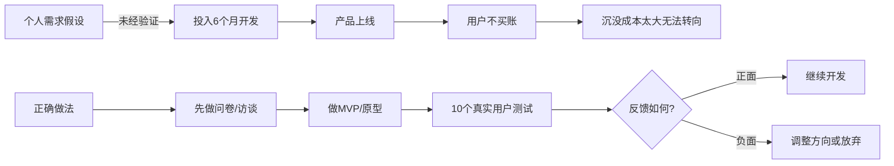
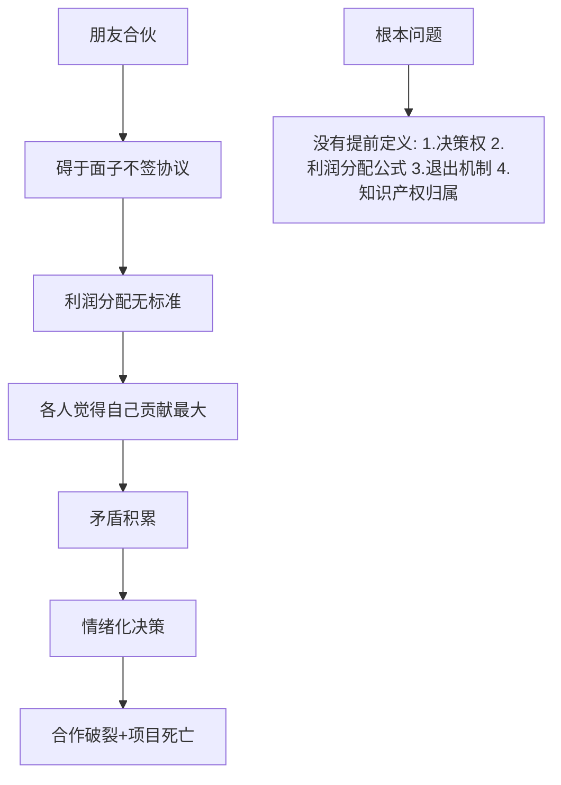
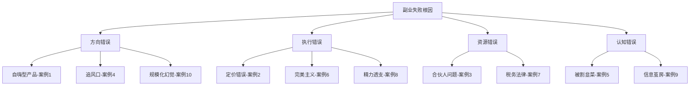

## 从失败案例中学到的教训

> 成功的故事总是相似的，失败的故事各有各的精彩。研究失败比研究成功更有价值——因为成功包含大量运气成分，而失败往往暴露了可复制的规律性错误。

创业和副业的真实数据令人警醒：中国中小企业平均寿命2.5年，首次创业失败率超过80%，副业项目半年内放弃率超过70%。这些数字背后不是运气不好，而是踩中了可预见、可避免的坑。本章通过10个真实失败案例的深度拆解，帮你建立"反模式识别"能力——在犯错之前就认出错误的形状。

### 为什么研究失败比研究成功更重要

#### 成功者偏差陷阱

幸存者偏差（Survivorship Bias）是商业认知中最危险的思维陷阱。你在社交媒体上看到的"副业月入X万"帖子，是经过层层筛选后的极少数幸运儿。那些使用了完全相同方法但失败的人，根本不会发帖——他们要么默默放弃，要么觉得丢人不愿分享。

```mermaid
graph TD
    A[100个人尝试同一方法] --> B{结果}
    B -->|95人失败| C[沉默消失]
    B -->|5人成功| D[发帖分享]
    D --> E[你看到的"方法论"]
    E --> F[你以为成功率很高]
    F --> G[你也去尝试]
    G --> H[大概率成为沉默的95人]
```

#### 失败中的规律性

心理学家Daniel Kahneman在《思考，快与慢》中指出：人类大脑天生倾向于为成功编造因果关系，却忽视失败中的统计规律。实际上，失败案例中的错误模式高度集中，主要归结为有限的几类根本原因：

| 失败类型 | 占比 | 核心原因 | 可预防程度 |
|---------|------|---------|-----------|
| 产品-市场不匹配 | 42% | 没验证需求就投入 | 高 |
| 现金流断裂 | 29% | 财务规划不足 | 高 |
| 团队/合作崩溃 | 23% | 人的问题 | 中 |
| 竞争失败 | 18% | 差异化不足 | 中 |
| 执行力崩溃 | 15% | 精力管理失败 | 高 |
| 外部环境变化 | 8% | 政策/市场突变 | 低 |

（注：一个失败项目通常涉及多个原因，故占比总和超过100%）

### 10个典型失败案例深度拆解

#### 案例1：自嗨型产品——"我觉得大家都需要"

**背景**：程序员小李，月薪15K，利用业余时间开发了一款"智能记账+AI理财建议"App。他坚信"每个人都需要理财"，于是花了6个月时间开发，投入积蓄8万元。

**失败过程**：

- 第1-2月：产品设计，画原型，技术选型
- 第3-5月：全栈开发，实现AI推荐算法
- 第6月：上线，信心满满等待用户涌入
- 第7月：日活不到50人，其中30个是朋友
- 第8月：花钱投了2万广告，注册200人，次日留存3%
- 第10月：彻底放弃，亏损10万+

**根本原因诊断**：



**核心教训**：

1. **"我觉得"是最贵的三个字**。个人需求不等于市场需求。在投入任何开发资源之前，必须完成需求验证三步法：问卷调研（至少100份）→ 深度访谈（至少10人）→ 最小可行产品测试（至少30人试用）。

2. **开发时间是隐性成本**。6个月的业余时间，如果按程序员时薪100元计算，机会成本至少3.6万元。加上直接投入的8万，真实成本超过11万。

3. **越"通用"的需求越危险**。"人人都需要理财"这句话在逻辑上没错，但在商业上是灾难——它意味着你没有任何精准的目标用户，获客成本将无限高。

**正确的做法**：

- 先找到10个明确表示"愿意付费"的真实用户
- 用最简单的方式验证（微信群+手动记账服务）
- 确认付费意愿后再考虑开发工具
- 第一版只做核心功能，开发周期不超过2周

---

#### 案例2：定价恐惧症——免费策略的致命陷阱

**背景**：自由设计师小王，擅长UI设计，决定通过社交媒体接单做副业。为了快速获取客户，她选择了"先免费做，积累口碑后再收费"的策略。

**失败过程**：

- 第1月：免费帮5个客户做了设计，获得好评
- 第2月：开始收500元/单（市场价2000+），接了8单
- 第3月：客户习惯了低价，推荐来的新客户也期望低价
- 第4月：尝试涨价到1000元，3个客户直接流失
- 第5月：工作量越来越大，收入却很低，身心俱疲
- 第6月：放弃副业，觉得自己"不适合做生意"

**根本原因诊断**：

定价不是营销手段，而是价值锚定。一旦你把自己定位为"便宜货"，改变这个认知的成本是重新建立品牌的3-5倍。

免费策略的三个致命后果：

| 后果 | 具体表现 | 长期影响 |
|------|---------|---------|
| 价格锚定 | 客户心理价位被锁定在低价 | 涨价即流失 |
| 客户质量 | 吸引来的是价格敏感型客户 | 难缠、要求多、不尊重专业 |
| 自我认知 | 开始怀疑自己的价值 | 职业自信崩塌 |

**正确的定价策略**：

1. **首次定价就是品牌定价**。宁可少接单，不要贱卖。你的第一单价格决定了后续所有客户的心理锚点。

2. **用"价值锚定"取代"价格竞争"**。不要说"我收500元"，要说"这个项目通常需要3天，按我的日费率1500元计算，总费用4500元"。

3. **阶梯式定价结构**：

```text
基础版：1500元 — 标准设计交付
进阶版：3000元 — 含2次修改 + 源文件
高级版：5000元 — 含品牌指南 + 3次修改 + 30天售后
```

4. **免费只用于一种场景**：个人作品练习或公益项目，明确标注"非商业用途"。

---

#### 案例3：合伙人灾难——朋友合伙的典型翻车

**背景**：三个大学好友决定合伙做跨境电商副业。小张负责选品，小刘负责运营，小赵负责资金。口头约定"利润平分"，没有签任何书面协议。

**失败过程**：

- 前3月：每人投入2万，选品上架，订单逐渐增长
- 第4月：开始有利润，月利润约8000元，每人分2600+
- 第5月：小张觉得选品功劳最大（确实爆款是他选的），要求多分
- 第6月：小刘运营工作量暴增（每天处理客服到凌晨），觉得自己付出最多
- 第7月：小赵认为自己的资金承担了最大风险，应该优先回本
- 第8月：三人产生严重分歧，小刘退出并带走了运营资料
- 第9月：店铺因运营断档大量差评，最终关闭
- 最终结果：三人投入共6万，最终回收2万，亏损4万，友谊破裂

**根本原因诊断**：



**合伙副业的防坑清单**：

1. **必须签书面协议**，至少包含以下条款：
   - 各自出资金额和到位时间
   - 利润分配公式（不是"平分"，而是基于贡献的量化公式）
   - 决策权归属（日常决策谁拍板，重大决策如何表决）
   - 退出机制（中途退出如何清算，带走什么不能带走什么）
   - 知识产权归属（客户资源、运营方法、品牌归属谁）

2. **角色分工必须量化**。"小张负责选品"太模糊，应该定义为：每周选品20个，每个选品附带市场分析报告，选品通过率不低于30%。

3. **先试运行3个月再正式合作**。用一个小型项目测试彼此的协作默契、执行力和沟通方式。

4. **利润分配建议公式**：

```text
基础分配 = 出资比例 × 40% + 工作量评估 × 40% + 绩效贡献 × 20%
```

---

#### 案例4：盲目追风口——短视频带货的泡沫

**背景**：传统行业从业者老陈，看到短视频带货的风口后辞掉工作全力投入。购买了3万元的拍摄设备，租了工作室，组建了2人小团队。

**失败过程**：

- 第1月：学习拍摄剪辑，模仿头部达人风格
- 第2月：日更3条短视频，粉丝增长缓慢（500人）
- 第3月：付费投流2万，粉丝到5000人，但ROI为负
- 第4月：尝试直播带货，场均在线10人
- 第5月：资金紧张，裁员
- 第6月：设备折价卖出，工作室退租，亏损15万

**根本原因诊断**：

风口≠机会。真正的机会需要匹配三个条件：

```text
机会 = 市场趋势 × 个人优势 × 资源匹配度
```

老陈的问题在于：

- **没有内容创作基础**：短视频带货的本质是内容创作+销售能力，不是"有设备就行"
- **低估了竞争烈度**：2023年抖音日均新增创作者超过200万，没有差异化定位就是在大海里撒盐
- **高估了初期回报**：头部达人多数有2-3年的积累期，新入局者期望3个月见效是不现实的
- **一次性投入过重**：还没验证模式就辞职+租工作室+买设备，犯了"重资产开局"的大忌

**追风口的正确姿势**：

1. **用最小成本验证**。先用手机拍摄10条视频测试，不要先买设备。
2. **保留退路**。至少保留主业收入的60%以上，副业验证成功后再逐步过渡。
3. **研究失败者**。去找那些尝试短视频带货但失败的人，了解他们的痛点。
4. **设定止损线**。投入超过X元或Y个月还没有正向反馈，果断止损。

---

#### 案例5：知识付费陷阱——被"割韭菜"的连锁反应

**背景**：职场新人小周，月薪8K，看到"副业月入5万"的课程广告后，先后购买了多个付费课程：短视频运营（3980元）、私域流量（2999元）、AI变现（4980元），总计花费超过1.2万。

**失败过程**：

- 课程1（短视频运营）：学完后发现内容网上免费都能找到，实操遇到问题无人解答
- 课程2（私域流量）：承诺的"独家资源"只是一个微信群，导师3天回一次消息
- 课程3（AI变现）：教的是用ChatGPT写文章发头条，单价不到1元/篇
- 总投入：1.2万课程费 + 3个月时间
- 总收入：不到200元

**核心教训**：

知识付费市场存在系统性的信息不对称。卖课的人赚钱的方式就是卖课本身，而不是他们教你的那个方法。这不是说所有课程都是骗局，但你需要一个识别框架。

**课程质量鉴别清单**：

| 维度 | 高质量课程 | 割韭菜课程 |
|------|-----------|-----------|
| 讲师背景 | 有可验证的实操成果 | 只有"帮助XX人月入X万" |
| 课程内容 | 系统化知识体系 | 碎片化技巧堆砌 |
| 价格合理性 | 与内容深度匹配 | 动辄几千上万 |
| 售后服务 | 有社群答疑+作业批改 | 卖完就消失 |
| 退款政策 | 7天无理由退款 | "一经售出概不退换" |
| 承诺程度 | "教你方法论" | "保证月入X万" |
| 学员案例 | 有真实可验证的案例 | 只有截图没有身份 |

**正确的学习路径**：

1. **先自学**：B站、YouTube、知乎、GitHub上有大量免费优质内容
2. **再实践**：至少实操1-2个月，带着具体问题去学习
3. **后付费**：只购买你能明确说出"我需要解决什么具体问题"的课程
4. **设预算**：学习投资不超过预期月收入的20%

---

#### 案例6：过度优化陷阱——完美主义杀死的副业

**背景**：产品经理小吴，决定做一款小程序工具作为副业。她对产品品质有极高要求，追求"每个像素都完美"。

**失败过程**：

- 第1-2月：竞品调研，写了50页PRD
- 第3-5月：UI设计改了8版，交互稿画了200多页
- 第6-8月：开发中不断推翻重来，"这个动画不够丝滑"
- 第9月：终于上线，但市场已经有3个类似产品
- 第10月：发现核心功能用户根本不用，反而是被忽略的小功能受欢迎
- 第11月：资金和精力耗尽，无力迭代

**完美主义的商业代价**：

```text
完美度 100% → 交付时间无限 → 错过市场窗口 → 商业价值为0
完美度 80% → 交付时间合理 → 抢占市场先机 → 商业价值 100%
```

**"足够好"原则（Good Enough Principle）**：

在创业和副业中，完成比完美重要10倍。具体标准：

- **核心功能可用**：能解决用户的核心问题
- **体验不低于行业平均**：不追求极致，但不能让人想卸载
- **有明确的迭代计划**：V1.0只做60分，V1.1做到75分，V2.0做到90分

**MVP（最小可行产品）检查清单**：

```text
□ 核心功能只有1个（不是3个，就是1个）
□ 不需要用户注册就能体验核心价值
□ 开发周期不超过2周（业余时间计算）
□ 能用现有工具/框架快速搭建
□ 有明确的成功指标（如：10个用户中有3个表示愿意付费）
```

---

#### 案例7：税务与法律盲区——合法赚钱的隐形门槛

**背景**：技术达人老赵，通过GitHub开源项目积累了大量粉丝，开始接私活做技术咨询。月收入从零增长到3万+，但完全没有考虑税务和法律问题。

**翻车过程**：

- 前6个月：通过微信/支付宝收款，没有开票，没有申报
- 第7个月：收到税务部门的补税通知
- 处理结果：补缴个人所得税+滞纳金+罚款，总计4.8万
- 附加影响：被公司发现有外部收入，差点被开除
- 心理打击：从此对副业产生恐惧心理

**副业涉及的法律风险清单**：

| 风险类型 | 具体场景 | 后果 |
|---------|---------|------|
| 税务风险 | 个人收入不申报 | 补税+滞纳金+0.5-5倍罚款 |
| 竞业限制 | 与本职工作存在竞争 | 被公司起诉索赔 |
| 知识产权 | 使用公司资源做副业 | 成果归公司所有 |
| 劳动合同 | 违反"不得兼职"条款 | 解雇+赔偿 |
| 营业资质 | 无照经营 | 行政处罚 |
| 消费者权益 | 产品/服务出问题 | 民事赔偿 |

**合规副业起步指南**：

1. **第一步：检查劳动合同**。仔细阅读竞业限制、兼职条款、知识产权归属条款。如果不确定，咨询劳动法律师（300-500元/次咨询费）。

2. **第二步：税务合规**。
   - 年收入超过12万需要个税汇算清缴
   - 持续性副业收入属于"经营所得"，税率5%-35%
   - 建议注册个体工商户（成本低，可以开票，税率更优）
   - 个体工商户月收入10万以下免征增值税

3. **第三步：建立财务体系**。
   - 副业收入走单独的银行账户
   - 保留所有收支凭证
   - 每月做一次收支记录
   - 每季度预估一次税款

---

#### 案例8：精力透支——副业拖垮主业的恶性循环

**背景**：运营经理小孙，白天上班做运营，晚上做自媒体副业。起初精力充沛，每天工作14-16小时。

**崩溃时间线**：


- 第4月：开始出现失眠、焦虑、注意力下降
- 第5月：主业工作中出现两次重大失误，被领导约谈
- 第6月：体检发现轻度脂肪肝、颈椎病、焦虑症倾向
- 第7月：副业更新频率下降，粉丝流失；主业绩效考核垫底
- 最终：副业放弃，主业调岗，医疗费花了5000+

**精力管理的科学框架**：

人的精力是有限资源，不是时间管理问题，而是精力分配问题。

**四象限精力分配法**：

```text
              高价值
                |
    I.核心深耕  |  II.战略投资
    (主业核心   |  (副业探索
     能力提升)   |   需要学习)
   ————————————+————————————
    III.日常消耗 |  IV.果断放弃
    (重复性工作  |  (低回报+高消耗
     可以外包)   |   的活动)
                |
              低价值
         ←低精力消耗  高精力消耗→
```

**可持续副业的精力管理规则**：

1. **每日副业时间不超过2小时**。超过这个时间，边际收益递减，边际损害递增。
2. **每周至少1天完全休息**。不工作、不想工作、不看工作消息。
3. **主业绩效不能下降**。如果主业开始出问题，立刻缩减副业投入。
4. **定期体检**。每半年一次，关注睡眠质量、颈椎、视力、心理状态。
5. **建立"精力预算"**。像管钱一样管精力，每周精力总量固定，分配给不同角色。

---

#### 案例9：信息茧房——只听好话的决策灾难

**背景**：设计师小美做手工饰品副业，在小红书上获得了不少好评。她坚信自己走在正确的道路上，忽略了所有负面信号。

**被忽视的危险信号**：

- 信号1：评论区好评多，但实际下单率不到1%
- 信号2：退货率高达25%，但"可能是快递问题"
- 信号3：复购率接近0，但"可能是产品线还不够丰富"
- 信号4：每月亏损3000+，但"投资期嘛，后面会好的"
- 信号5：朋友说"挺好的"，但朋友可能只是客气

**确认偏误（Confirmation Bias）的陷阱**：

人类大脑天生会过滤掉与已有信念矛盾的信息，只保留支持性信息。在创业中，这意味着你会：

- 只看好评，忽视差评
- 只算收入，不算成本
- 只听支持者的话，屏蔽质疑声
- 只看增长数据，忽视留存数据

**建立"反偏见"决策机制**：

1. **魔鬼代言人制度**。找一个信得过的人，专门负责挑你的毛病。每次重大决策前，先听他说15分钟反对意见。

2. **关键指标仪表盘**。建立一个每周必看的数据面板：

```text
必看指标（每周更新）:
├── 获客成本（CAC）：获取一个付费客户花了多少钱
├── 客户终身价值（LTV）：一个客户总共会给你带来多少收入
├── LTV/CAC 比值：< 3 则商业模式有问题
├── 月度净现金流：收入 - 所有支出（含你的时间成本）
├── 复购率：老客户再次购买的比例
└── NPS（净推荐值）：用户有多愿意推荐你
```

3. **月度复盘会**。每月固定一天，回顾上月数据，回答三个问题：
   - 哪个假设被证伪了？
   - 最大的风险是什么？
   - 如果今天重新开始，还会做同样的选择吗？

4. **设定客观止损线**。在情绪好的时候（而不是情绪差的时候）设定：连续亏损X个月、现金流低于Y元、客户满意度低于Z分时，必须暂停并重新评估。

---

#### 案例10：规模化幻觉——小而美才是副业的最优解

**背景**：英语教师老刘，线上一对一辅导做得不错，月收入稳定在1.5万。但他不满足，决定"做大做强"。

**失败的扩张路径**：

- 阶段1：招了3个兼职老师，扩大招生
- 阶段2：兼职老师质量参差不齐，学员投诉增多
- 阶段3：为了管理团队，教学时间减少，自己的口碑学员流失
- 阶段4：运营成本（平台费+兼职费+客服）吃掉了大部分利润
- 阶段5：管理精力远超预期，主业受到影响
- 最终：关闭扩招，回到一对一，但已经流失了30%的优质学员

**副业的"天花板思维"错误**：

很多人把"扩大规模"当作成功的标志，但副业的本质不同于创业：

| 维度 | 副业 | 创业 |
|------|------|------|
| 目标 | 补充收入+探索可能 | 构建可规模化的商业模式 |
| 时间投入 | 每天1-3小时 | 全职甚至超全职 |
| 风险偏好 | 低风险，保住主业 | 高风险高回报 |
| 最优规模 | 个人能力上限 | 团队能力上限 |
| 核心指标 | 时薪（单位时间收入） | GMV/营收 |

**副业的正确增长路径**：

```text
阶段1: 验证（0-3个月）
├── 目标：确认有人愿意付费
├── 策略：服务3-5个客户
└── 指标：复购率 > 30%

阶段2: 优化（3-6个月）
├── 目标：提高单位时间收入
├── 策略：提价+优化交付流程
└── 指标：时薪 > 主业时薪的1.5倍

阶段3: 系统化（6-12个月）
├── 目标：减少个人时间投入
├── 策略：产品化/模板化/外包非核心环节
└── 指标：每周投入时间 < 10小时

阶段4: 决策点（12个月+）
├── 路径A：保持小而美（副业模式）
├── 路径B：全职创业（商业模式验证完成后）
└── 路径C：转型（发现更适合的方向）
```

### 失败案例的系统性分类与应对策略

将上述10个案例归纳为四大类根本原因，建立系统性的防错框架：



### 通用防错清单：开始副业前的20个自检问题

在投入任何时间和金钱之前，诚实回答以下问题：

**需求验证类（1-5）**：
1. 你能否在5分钟内说清楚你的副业是为谁解决什么问题？
2. 你是否与至少10个潜在客户进行过面对面或电话沟通？
3. 其中是否有人明确表示"我现在就需要这个"？
4. 你是否知道客户目前用什么替代方案解决这个问题？
5. 你的解决方案相比替代方案，优势在哪里（必须具体，不能是"更好"）？

**财务安全类（6-10）**：
6. 你是否有至少6个月的生活费储蓄（不包含副业投入）？
7. 你是否设定了明确的止损金额和止损时间？
8. 你是否计算过副业的真实成本（含时间机会成本）？
9. 你是否了解副业收入的税务处理方式？
10. 你是否与配偶/家人达成共识？

**能力匹配类（11-15）**：
11. 你是否具备这个副业所需的核心技能（不是"可以学"，是"现在就会"）？
12. 你是否有相关的行业经验或人脉？
13. 你能否在不影响主业的前提下，每周投入至少8小时？
14. 你是否有处理客户投诉和售后的经验？
15. 你是否了解这个行业的基本规则和潜规则？

**风险评估类（16-20）**：
16. 你的劳动合同是否允许兼职？
17. 你的副业是否与主业存在竞业冲突？
18. 你是否清楚如果副业失败，最坏的结果是什么？你能承受吗？
19. 你是否有至少一个"过来人"可以咨询？
20. 如果半年后副业没有任何收入，你会后悔投入的时间吗？

### 从失败中恢复的心理建设

失败不仅是商业事件，更是心理事件。很多人不是被失败本身击垮的，而是被失败带来的自我否定击垮的。

#### 失败后的心理恢复四阶段


**每个阶段该做什么**：

1. **冲击期（1-2周）**：允许自己难过，不急于找原因。和信任的人倾诉，做让自己放松的事。
2. **混乱期（2-4周）**：不做出任何重大决策（不要立刻开始新项目，也不要彻底放弃）。开始记录这次经历。
3. **反思期（1-2月）**：进行结构化复盘，区分"运气因素"和"可控因素"，提取可复用的教训。
4. **重建期（2-3月）**：带着教训制定新的计划，以更低的成本重新开始或选择新的方向。

#### 失败复盘模板

每次失败后，用以下模板进行结构化复盘：

```markdown
## 项目失败复盘报告

### 基本信息
- 项目名称：
- 起止时间：
- 总投入（金钱）：
- 总投入（时间）：
- 最终结果：

### 假设验证回顾
| 当初的假设 | 实际结果 | 差距原因 |
|-----------|---------|---------|
|           |         |         |

### 关键转折点
- 最好的一个决策是：
- 最差的一个决策是：
- 如果重来，第一个会改变的事情是：

### 提取的教训
1. （具体、可操作的教训）
2.
3.

### 下一步行动
- 带着这些教训，我计划：
```

### 进阶：建立你的"失败案例库"

最聪明的学习方式不是只分析别人的失败，而是系统性地收集和分析失败案例。

**建立案例库的方法**：

1. **关注"失败叙事"**。在知乎、小红书、即刻上搜索"创业失败"、"副业踩坑"、"我亏了多少"等关键词。
2. **加入创业社群**。真实的一手失败故事只在小圈子里流通。
3. **记录自己的小失败**。每次副业中的小挫折（一个客户流失、一次推广失败）都值得记录和分析。
4. **定期回顾**。每月花1小时回顾你的失败案例库，看看新项目是否在重复旧错误。

**案例记录格式**：

```text
[日期] 案例标题
- 行业：
- 失败类型：方向/执行/资源/认知
- 投入规模：
- 关键错误：
- 可提取的教训：
- 与我的相关性：高/中/低
```

### 结语：失败是最好的商学院

> "我从失败中学到的东西，比从成功中学到的多十倍。" —— Henry Ford

每一个失败案例都是一堂价值数万甚至数十万的课。通过研究别人的失败，你可以用极低的成本（阅读时间）获得宝贵的商业认知。这比任何付费课程都更有价值。

记住三条核心原则：

1. **验证先于投入**。任何未经验证的假设都是赌博。
2. **小步快跑优于大步慢走**。用最小的成本试错，用最快的速度迭代。
3. **认知升级是最好的投资**。你对失败模式的认知深度，决定了你的成功概率。

失败不可怕，可怕的是重复别人的失败。现在你已经知道了这些坑长什么样，下一步就是带着这份认知地图，谨慎而勇敢地走自己的路。
