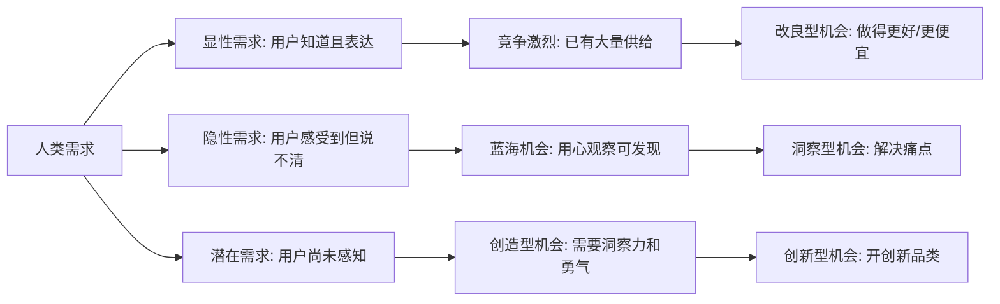
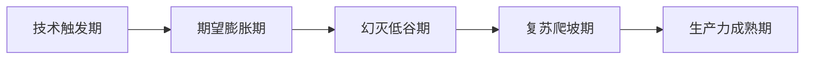
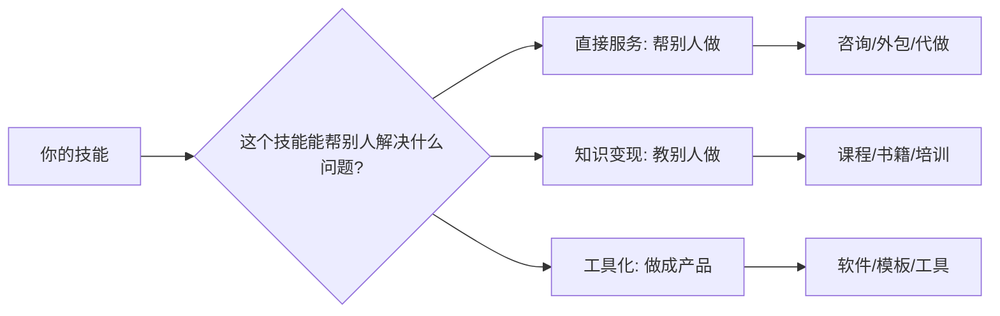
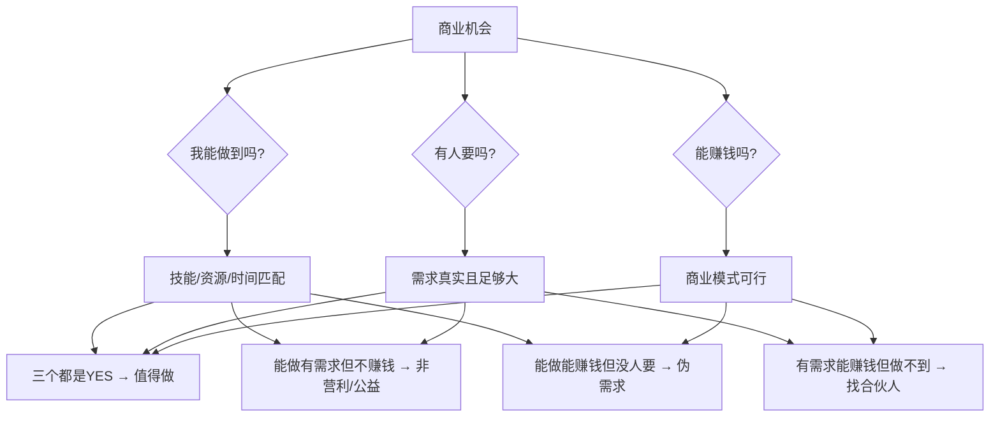
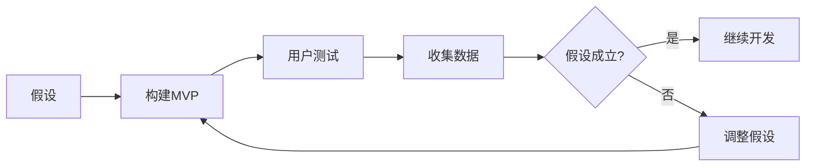
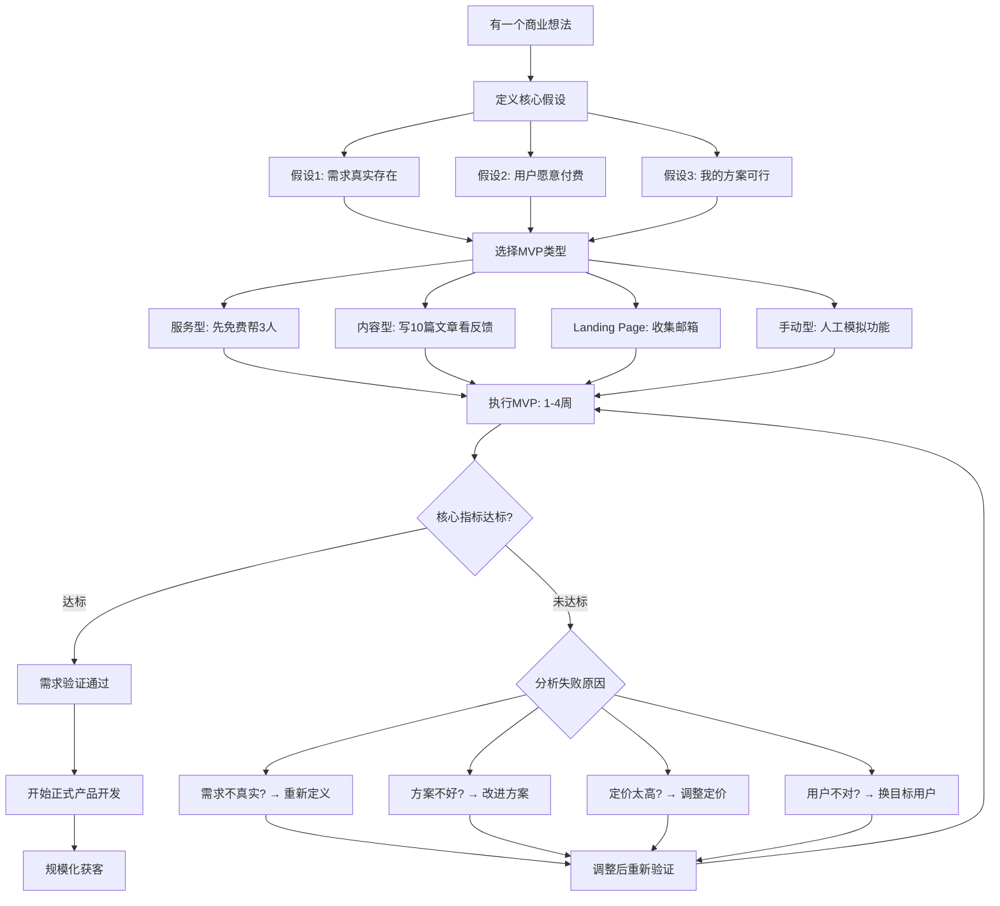
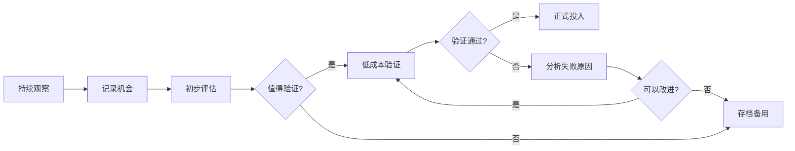

## 一、发现商业机会与验证需求

> "商业机会不是等来的，是看见的。大多数人看见的是问题，少数人看见的是问题背后的生意。"

发现商业机会是创业和副业的起点。很多人卡在"不知道做什么"这一步——不是因为没有机会，而是缺少发现机会的思维框架和方法论。本节将系统讲解如何从多个维度发现商业机会、如何科学评估机会质量、如何用最低成本验证机会真伪，以及如何管理你的机会管道，让你永远不会"无事可做"。

### 1.1 商业机会的本质

商业机会的本质是：**未被满足的需求，或者未被很好满足的需求。**

这句话听起来简单，但拆开来看，它包含三个层次：

1. **未被满足的需求**：市场上完全没有解决方案。比如十年前没有外卖平台时，人们想在家吃到附近餐厅的菜，只能自己打电话、自己去取。
2. **未被很好满足的需求**：有解决方案，但体验差、价格高、效率低。比如传统出租车行业存在的打车难、服务差、价格不透明等问题，催生了网约车。
3. **潜在需求**：用户自己都没意识到的需求。比如在智能手机出现之前，没有人会说"我需要一个能装进口袋的电脑"。

理解这三个层次，你就不会把眼光局限在"解决已知问题"上，还能看到"创造新需求"的可能性。

**机会与需求的关系模型：**



#### 1.1.1 Jobs-to-be-Done：需求分析的底层理论

哈佛商学院教授克莱顿·克里斯坦森（Clayton Christensen）提出的"用户任务理论"（Jobs-to-be-Done，JTBD）是理解需求本质最有力的框架。其核心观点是：**用户不是在"购买产品"，而是在"雇佣产品完成某个任务"。**

这个理论颠覆了传统的需求分析方式。传统方式按人口统计学分类用户（年龄、性别、收入），JTBD则按"用户想完成什么任务"来分类。这意味着你不需要猜测"25岁女性喜欢什么"，而是去理解"用户在什么情境下想完成什么任务"。

**经典案例：奶昔困境**

克里斯坦森受麦当劳委托研究如何卖出更多奶昔。传统思路是调查用户喜欢什么口味、什么甜度。但JTBD调研发现：早上买奶昔的顾客大多独自开车上班，他们"雇佣"奶昔完成的任务是——在无聊的通勤路上用一只手方便地吃一顿耐饿的早餐。竞争对手不是其他奶昔，而是香蕉、百吉饼、甜甜圈。理解了这个"任务"，改进方向就清晰了：让奶昔更浓稠（喝得更慢、更耐饿）、杯子设计更方便单手握持。结果奶昔销量大幅提升。

**JTBD的三层任务结构：**

| 层次 | 含义 | 示例（以在线学习为例） | 示例（以外卖为例） |
|------|------|----------------------|-------------------|
| 功能任务 | 解决具体问题 | 学会Python编程 | 吃到饭 |
| 情感任务 | 获得某种感受 | 感到自己在进步、不焦虑 | 不用出门的轻松感 |
| 社会任务 | 给别人留下印象 | 让同事觉得我技术好 | 请客时显得体面 |

很多产品只满足了功能任务，但真正让用户产生忠诚度的是情感任务和社会任务。微信读书不仅满足"看书"的功能任务，还满足"看看朋友在读什么"的社交任务——这就是它的护城河。

**JTBD实践方法——"四问法"：**

1. **用户在什么情境下想完成这个任务？** （Context）——时间、地点、状态
2. **用户目前用什么方式完成这个任务？** （Current Solution）——现有替代方案
3. **现有方案有什么不满意的？** （Pain Points）——哪里做得不够好
4. **用户期望的理想结果是什么？** （Desired Outcome）——完美的解决方案长什么样

这四个问题的答案，就是你的商业机会所在。好的机会往往是：用户有明确的任务要完成，现有方案让他们不满意，而你有更好的方式帮他们完成。

**JTBD访谈的注意事项：**

- **追问"为什么"至少三次**：用户说"我想要更快的快递"，问"为什么"→"因为我不想等"→再问"为什么等不了"→"因为我下班后才有时间拆快递，但快递站6点就关了"。真正的痛点是"快递站营业时间和我的空闲时间不匹配"，解决方案可能不是更快的快递，而是延长快递站营业时间或设置智能柜。
- **关注用户的行为而非言语**：用户说"我想要健康饮食"，但他每天中午都点炸鸡外卖。行为比言语更真实。访谈时要问"你上次遇到这个问题时具体做了什么"，而不是"你会怎么做"。
- **记录用户的原话**：用户的措辞往往比你的总结更精准。"太麻烦了"和"每次都要打开三个App才能完成一件事"，后者直接告诉你问题在哪里。

#### 1.1.2 供需失衡：机会产生的经济学原理

从经济学角度看，商业机会的本质是**供需失衡**。当某种需求的增长速度跟不上供给的增长速度（或反过来），就产生了套利空间。

**供需失衡的五种类型：**

| 失衡类型 | 产生原因 | 商业机会 | 典型案例 |
|----------|----------|----------|----------|
| 供给不足 | 需求突然爆发，供给来不及跟上 | 快速提供供给 | 2020年初口罩需求暴涨，快速转产的企业获利 |
| 供给过时 | 需求升级了，但供给还是旧的 | 用新供给替代旧供给 | 智能手机替代功能机，电动车替代燃油车 |
| 信息不对称 | 买方和卖方互相找不到 | 做信息撮合平台 | 58同城、贝壳找房、Boss直聘 |
| 效率低下 | 供给存在但获取成本太高 | 降低获取成本 | 拼多多降低电商门槛，SaaS降低企业软件门槛 |
| 体验不佳 | 供给能满足需求但体验差 | 重新设计体验 | 苹果重新定义手机体验，蔚来重新定义购车体验 |

理解供需失衡，你就不会盲目寻找"没人做过的事"，而是去观察"哪些领域存在明显的供需落差"。这种落差越大、持续越久，商业机会就越大。

**如何识别供需失衡的信号：**

- **价格信号**：某项服务的价格远高于其成本，说明供给不足（如早年的打车难导致黑车盛行）
- **等待信号**：用户需要排队、预约、等待很长时间才能获得服务，说明供给不足
- **抱怨信号**：社交媒体上大量用户抱怨某类产品/服务，说明体验不佳
- **替代信号**：用户用"不正规"的方式自行解决（如用Excel管理复杂的项目），说明正式供给缺失或过时
- **灰色市场信号**：代购、海淘、灰色渠道的存在，说明正规供给不足或价格不合理

#### 1.1.3 机会窗口理论：为什么时机比想法重要

同一个商业想法，在不同时间点执行，结果可能天差地别。2010年做短视频和2016年做短视频，虽然想法一样，但前者大概率失败（移动网络和智能机摄像头还不够好），后者诞生了抖音。

**技术成熟度曲线（Gartner Hype Cycle）的启示：**



- **期望膨胀期**入场：媒体热炒，资本涌入，但产品不成熟，用户期望落空。此时入场容易成为"炮灰"。
- **幻灭低谷期**入场：大多数人已经放弃，但技术正在悄悄成熟。此时入场成本最低，竞争对手最少。
- **复苏爬坡期**入场：产品开始真正解决用户问题，市场开始快速增长。这是最佳入场时机——技术已成熟，市场已确认，但大众尚未入场。

**判断时机的实操信号：**

| 信号类别 | 具体表现 | 含义 |
|----------|----------|------|
| 基础设施就绪 | 相关工具/平台/技术已普及 | 供给端准备好了 |
| 头部用户出现 | 少数极客/专业人士已在使用 | 需求端开始萌芽 |
| 成本下降 | 使用/获取成本降到大众可接受水平 | 市场爆发的前兆 |
| 监管明确 | 相关政策法规已经出台或正在制定 | 风险可控 |
| 教育成本降低 | 普通人开始理解这个概念 | 用户获取成本下降 |

### 1.2 发现机会的六个视角

#### 视角一：从自己的痛点出发

这是最自然、最可靠的发现机会的方式。因为你自己就是用户，你的真实感受比任何市场调研都准确。

**核心问题清单：**

- 你日常生活中遇到什么问题没有好的解决方案？
- 你的工作中有什么低效的环节可以优化？
- 你的兴趣爱好中有什么需求没有被满足？
- 你经常听到朋友抱怨什么？
- 你买东西时觉得哪里不满意？
- 你做某件事时觉得"要是能……就好了"？

**真实案例：**

| 痛点 | 机会 | 最终产品 | 初始验证方式 |
|------|------|----------|-------------|
| 觉得找靠谱的家政太难 | 家政信息不对称 | 家政平台（如58到家） | 先做微信群撮合 |
| 觉得学英语没有好工具 | 语言学习效率低 | 英语学习App（如多邻国） | 先做网页版闪卡 |
| 觉得买不到合身的衣服 | 服装标准化尺码不适合所有人 | 定制服装平台 | 先帮身边朋友量体推荐 |
| 请假审批流程太繁琐 | 企业OA系统难用 | 简道云等低代码平台 | 先用Excel帮同事做表单 |
| 贴手机膜总是有气泡 | DIY贴膜难度高 | 手机贴膜服务摊位 | 先帮同事免费贴 |
| 出差报销流程太复杂 | 企业报销系统体验差 | 分贝通等企业支出管理平台 | 先做Excel模板分享 |

**实操建议：**

- 从今天开始，记录你每天遇到的"不方便"和"不爽"，坚持一周，你会积累至少20个痛点
- 和5个不同行业的朋友聊天，问他们"工作中最烦的事是什么"
- 在社交媒体搜索"好烦""太难了""为什么没有"等关键词，看看人们在抱怨什么
- 回顾你最近三次退货/差评/投诉的经历，这些是需求信号最强烈的时刻

#### 视角二：从你的技能出发

每个人都有别人没有的技能、知识或经验。你习以为常的能力，对别人来说可能是急需的。

**技能盘点方法：**

1. **硬技能盘点**：列出你会的所有具体技能（编程、设计、写作、财务、翻译、摄影等）
2. **软技能盘点**：你的沟通能力、组织能力、教学能力等
3. **经验盘点**：你经历过什么别人没经历过的（创业、留学、考研、转行、育儿等）
4. **知识盘点**：你深入了解的领域（某个行业、某项技术、某个爱好）
5. **工具盘点**：你熟练使用什么工具（Excel、PS、Figma、各种AI工具等）

**技能 → 商业机会的转化路径：**



**真实案例：**

| 你的技能 | 直接服务 | 知识变现 | 工具化 | 典型月收入范围 |
|----------|----------|----------|--------|---------------|
| 会做PPT | PPT定制设计 | PPT制作课程 | PPT模板商城 | 5K-50K |
| 懂财务 | 财税咨询服务 | 财务管理课程 | 记账工具/Excel模板 | 8K-80K |
| 会拍照 | 摄影服务 | 摄影教学 | 修图预设包/摄影App | 3K-30K |
| 会写代码 | 技术外包 | 编程教程 | SaaS产品/Chrome插件 | 10K-100K+ |
| 懂健身 | 私人教练 | 健身课程 | 健身计划生成器 | 5K-50K |
| 会做饭 | 私厨/上门做饭 | 烹饪教程 | 食谱小程序/料理包 | 3K-30K |
| 英语好 | 翻译/口译服务 | 英语学习课程 | AI英语练习工具 | 5K-60K |
| 懂法律 | 法律咨询 | 法律知识科普 | 合同模板库 | 10K-100K+ |

**技能定价的"三步法"：**

1. **定位你的技能等级**：入门（60分水平）→ 可以教0-40分的人；精通（90分水平）→ 可以教0-80分的人。你不需要是世界顶尖才能变现，只需要比目标客户强。
2. **测算时间成本**：你完成一次服务需要多少时间？你的时间值多少钱/小时？两者相乘就是你的底价。
3. **对标市场价格**：在淘宝、知乎、在行、Fiverr等平台搜索同类服务的定价，取中位数作为参考。定价可以略低于市场中位数起步，验证后再逐步提价。

**技能组合的威力：** 单一技能可能竞争激烈，但两项技能的组合往往能创造独特价值。"会编程 + 懂财务"= 独特的财税SaaS产品能力；"会摄影 + 懂电商"= 专业的电商产品拍摄服务；"会写作 + 懂医学"= 医学科普自媒体。列出你的所有技能，看看哪些组合是稀缺的。

#### 视角三：从趋势出发

趋势意味着大量新需求正在涌现，而供给还没有跟上。抓住趋势窗口期，往往能事半功倍。

**如何识别趋势：**

1. **技术趋势**：关注新技术的普及曲线。当一项技术从"极客玩具"变成"大众工具"时，围绕它的服务和应用会爆发式增长。
   - 2012-2015年：移动互联网普及 → 催生大量App和O2O服务
   - 2016-2018年：短视频崛起 → 催生MCN、短视频代运营
   - 2020-2021年：直播电商爆发 → 催生直播代运营、选品服务
   - 2023-2026年：AI大模型普及 → 催生AI应用开发、AI培训、AI工作流咨询、AI Agent定制

2. **政策趋势**：政策变化会创造或消灭市场。
   - 双减政策 → 素质教育、成人教育、AI教育工具机会涌现
   - 碳中和政策 → 新能源、碳交易、ESG咨询服务
   - 数据安全法规 → 数据合规咨询、隐私计算技术
   - 跨境电商政策 → 跨境独立站、海外仓服务

3. **社会趋势**：人口结构、生活方式的变化。
   - 老龄化 → 养老服务、适老化改造、健康管理
   - 少子化 → 精细化育儿、宠物经济、单身经济
   - 远程办公 → 协作工具、数字游民服务、远程团队管理
   - 知识焦虑 → 终身学习、技能提升、职业转型服务

**趋势判断的三层验证法：**

| 验证层 | 方法 | 示例 | 判断标准 |
|--------|------|------|----------|
| 信息层 | 看媒体报道、行业报告、搜索引擎指数 | "AI"在2024年被主流媒体大量报道 | 百度指数/微信指数持续上升3个月以上 |
| 行为层 | 看身边人是否在用/讨论/付费 | 朋友圈开始有人用ChatGPT | 你认识的人中至少10%在主动使用 |
| 资金层 | 看资本是否在投入，企业是否在布局 | AI创业公司融资金额持续增长 | 头部VC重仓、大厂成立专门团队 |

只有三层都满足，才是真正的趋势，而不是"伪风口"。只满足信息层的，很可能是媒体炒作；只满足资金层的，可能是资本泡沫。

**趋势时机的把握——"先半步"原则：**

太早进入趋势市场，你需要花大量时间教育市场、等待基础设施成熟，现金流可能撑不到爆发期。太晚进入，市场已被先行者占据，获客成本高企。最佳时机是**趋势确认但大众尚未入场**的窗口期——比大众早半步。

判断方法：当行业报告、媒体报道和资本投入三个信号同时出现，但你的非行业朋友还没听说过这个概念时，就是最佳入场窗口。

**2025-2026年值得关注的趋势机会：**

| 趋势 | 当前阶段 | 个人可切入的方向 |
|------|----------|-----------------|
| AI Agent | 复苏爬坡期 | 企业AI工作流定制、AI工具培训、行业垂直Agent开发 |
| 短剧/微短剧 | 生产力成熟期 | 短剧编剧、短剧投流服务、短剧翻译出海 |
| 跨境电商 | 生产力成熟期 | TikTok Shop运营、独立站代运营、选品服务 |
| 银发经济 | 期望膨胀期 | 适老化产品评测、老年人数字技能培训、健康管理 |
| AI+教育 | 复苏爬坡期 | AI辅助教学工具、个性化学习方案、教育内容AI化 |
| 新能源 | 生产力成熟期 | 充电桩安装运维、新能源车后市场、碳足迹咨询 |

#### 视角四：从已有市场出发

很多成功的商业不是创造全新市场，而是在已有市场上做得更好。

**四种改良模式：**

1. **降维打击**：把高端产品做成平价版
   - 案例：Canva把专业设计软件的能力，用极简界面提供给非设计师，2024年估值400亿美元
   - 案例：得到App把MBA课程精华做成音频课，价格从数十万降低到199元
   - 案例：ChatGPT把专业AI能力免费开放给普通用户，颠覆了AI行业定价体系

2. **体验升级**：把体验差的产品做得更好用
   - 案例：微信读书 vs Kindle——在微信生态内无缝阅读、社交分享，DAU超千万
   - 案例：美团外卖优化了电话订餐的全部痛点（不知道吃什么、等太久、不能追踪进度）
   - 案例：飞书 vs 传统OA——用消费级产品的体验做企业级工具

3. **渠道迁移**：把线下服务搬到线上，或反之
   - 案例：在线问诊（好大夫）把医院门诊搬到手机上，日均问诊量超50万
   - 案例：盒马鲜生把线上生鲜搬到线下体验店，坪效是传统超市的5倍
   - 案例：泡泡玛特把盲盒从线上搬到线下自动贩卖机和实体店，创造了全新的消费场景

4. **跨界组合**：把A领域的模式搬到B领域
   - 案例：Uber模式被搬到外卖（Uber Eats）、货运（货拉拉）、跑腿（闪送）
   - 案例：订阅制从软件（SaaS）搬到实体商品（订阅盒子）、内容（知识星球）
   - 案例：游戏化机制从游戏搬到教育（Duolingo）、健身（Keep）、金融（蚂蚁森林）

**改良型机会的评估公式：**

> 改良价值 = (新体验 - 旧体验) × 使用频率 × 用户基数

三个因子缺一不可。体验提升再大，如果使用频率低（如搬家服务），也难以支撑独立业务。使用频率再高，如果体验提升小（如改进了闹钟App的UI），用户也不会切换。用户基数再大，如果体验提升不明显，用户迁移的动力不足。

#### 视角五：从信息差出发

信息差是最古老、最稳定的商业机会来源。你知道而别人不知道的信息，就是价值。

**常见信息差类型：**

| 信息差类型 | 示例 | 变现方式 | 持久性 |
|------------|------|----------|--------|
| 地域信息差 | 国外有但国内没有的产品/模式 | 代购、引进代理 | ★★★ 逐渐缩小 |
| 行业信息差 | 某行业内部的效率工具/方法 | 行业咨询、跨行业应用 | ★★★★ 持续存在 |
| 技能信息差 | 专业人士才知道的操作技巧 | 培训、代操作 | ★★★ 可被学习替代 |
| 时间信息差 | 你知道即将发生的政策/技术变化 | 提前布局相关服务 | ★★ 窗口期短 |
| 认知信息差 | 你的专业判断比普通人准确 | 咨询、决策服务 | ★★★★★ 最难替代 |
| 工具信息差 | 你知道某个高效工具/平台 | 教学、代操作、工具集成 | ★★★ 新工具持续出现 |

**信息差正在缩小，但永远不会消失。** 互联网让基础信息透明化，但深度信息、实操经验、行业判断力仍然稀缺。信息差从"我知道你不知道"升级为"我懂你不懂""我能你不能""我早你晚"。形式变了，但本质没变。

**信息差套利的三步法：**

1. **发现**：盘点你的信息优势（你在哪里比大多数人知道得更多、更深、更早）
2. **封装**：把信息差打包成可消费的形式（文章、课程、咨询、工具、服务）
3. **传播**：到信息劣势方聚集的地方推广（社群、论坛、短视频平台）

**AI时代的信息差新形态：**

AI的普及并没有消灭信息差，反而创造了新的信息差：

- **工具信息差**：大多数人不会用AI工具，你会用就是优势。比如用Cursor写代码、用Midjourney做设计、用Claude做分析——掌握这些工具的人效率是不掌握的人的10倍。
- **提示词信息差**：同一个AI工具，不同人使用的效果天差地别。写好提示词本身就是一种技能。
- **工作流信息差**：知道如何把多个AI工具串联成一个高效工作流，这种知识非常稀缺。
- **行业+AI信息差**：懂医疗的人+懂AI = 医疗AI应用的独特视角；懂教育的人+懂AI = 教育AI产品的独特理解。

#### 视角六：从资源和关系出发

有时候机会不是"想"出来的，而是"碰"到的。你的社交圈、你所在的地理位置、你的家庭背景，都可能成为独特的机会来源。

**资源清单自检：**

- 你认识哪些行业的关键人物？
- 你的家乡有什么特色产业？
- 你的公司/行业有哪些上下游资源？
- 你有什么别人难以获取的信息渠道？
- 你有什么闲置的设备、场地、账号？
- 你的学校/校友有什么独特的资源？
- 你的社区/小区有什么未被满足的需求？

**案例：**

| 你的资源 | 可做的生意 | 启动成本 | 收入潜力 |
|----------|-----------|----------|----------|
| 在义乌生活 | 跨境电商、小商品批发 | 低（天然货源和物流优势） | 高 |
| 在高校工作 | 考研辅导、学术咨询 | 极低（天然学生流量和信任背书） | 中高 |
| 有海外留学经历 | 留学咨询、海淘代购 | 极低（第一手信息和校友资源） | 中 |
| 在医院工作 | 健康科普、医疗咨询 | 极低（专业信任背书） | 中高 |
| 有工厂资源 | 定制产品、OEM/ODM | 中（需要起订量） | 高 |
| 在科技园区工作 | 技术咨询、企业服务 | 低（天然企业客户触达） | 高 |
| 有物业/房东资源 | 房屋改造、民宿运营 | 中高（需要装修投入） | 高 |

**资源的"杠杆效应"：** 资源本身不是机会，但资源可以大幅降低你验证和启动一个机会的成本。同样一个商业想法，有资源的人可能花1000元和一周就能验证，没资源的人可能需要花10000元和一个月。这就是为什么在评估机会时，"你的匹配度"是一个关键维度。

### 1.3 机会发现的系统方法

除了六个"视角"，还有一些具体的、可执行的方法帮你系统性地发现机会。

#### 1.3.1 搜索数据挖掘法

搜索引擎是人类意图的集中表达——每一次搜索都是一个未被满足的需求信号。

**百度指数/微信指数分析：**

1. 输入你感兴趣的关键词，查看搜索趋势
2. 关注"需求图谱"：看用户搜索这个词的同时还在搜什么
3. 关注"相关词"：看上下游关联需求
4. 关注搜索量的变化趋势：上升趋势说明需求在增长

**电商平台评论挖掘：**

1. 打开淘宝/京东/拼多多，找到你感兴趣的品类
2. 按"差评"排序，逐条阅读
3. 把差评归类：产品问题、物流问题、售后问题、功能缺失
4. 出现频率最高的3个问题就是改进机会

**具体操作流程（以淘宝差评挖掘为例）：**

```text
步骤1：打开淘宝，搜索你感兴趣的品类关键词（如"筋膜枪"）
步骤2：找到销量前10的商品
步骤3：逐个查看差评和中评（好评信息量低，重点看差评和中评）
步骤4：建立一个表格，记录每条差评的核心问题
步骤5：按问题类型归类（如：噪音大、续航短、力度不够、售后差）
步骤6：统计每类问题的出现频率
步骤7：频率最高的前3个问题 = 你的产品/服务的差异化切入点
```

**知乎/小红书问题挖掘：**

1. 搜索"有没有""哪里可以""怎么解决""推荐"等需求型关键词
2. 关注高关注量、低满意度的问题
3. 如果一个问题下大量回答都是"我也在找"或"目前没有好的方案"，这就是一个机会信号

**搜索数据挖掘的进阶工具：**

| 工具 | 用途 | 免费/付费 |
|------|------|----------|
| 百度指数 | 搜索趋势分析、需求图谱 | 免费 |
| 微信指数 | 微信生态内的热度趋势 | 免费 |
| 5118 | 长尾关键词挖掘、需求图谱 | 部分免费 |
| 生意参谋 | 淘宝/天猫品类数据分析 | 付费（有免费试用） |
| 新榜/蝉妈妈 | 小红书/抖音内容和商品分析 | 部分免费 |
| Google Trends | 全球搜索趋势（适合出海业务） | 免费 |
| AnswerThePublic | 用户搜索问题可视化 | 部分免费 |
| 各平台热搜榜 | 微博/抖音/知乎热搜 | 免费 |

#### 1.3.2 行业拆解法

每周选一个你感兴趣的行业，用以下框架拆解它的商业模式：

**行业拆解五问：**

1. **谁在付钱？** ——这个行业的客户是谁？B端还是C端？决策链是什么样的？
2. **钱花在哪里？** ——成本结构是什么？最大的支出项是什么？
3. **怎么赚钱？** ——盈利模式是什么？一次性收费还是持续收费？毛利多少？
4. **有什么痛点？** ——用户在抱怨什么？行业效率瓶颈在哪里？
5. **有什么变化？** ——新技术、新政策、新玩家会带来什么冲击？

**推荐工具：**

| 工具 | 用途 | 说明 |
|------|------|------|
| 天眼查/企查查 | 查行业公司和融资情况 | 了解竞争格局、融资趋势 |
| 知乎/小红书 | 看用户吐槽 | 第一手需求信号 |
| 36氪/虎嗅 | 行业趋势分析 | 了解行业变化和新机会 |
| 艾瑞咨询/易观 | 行业报告 | 量化市场规模和增长趋势 |
| 上市公司年报 | 行业财务数据 | 了解行业的利润水平和成本结构 |
| 招聘网站 | 行业人才需求 | 某类岗位大量招聘说明行业在增长 |

#### 1.3.3 跨界观察法

跨界思维能带来最有价值的创新。很多成功的商业模式是把A领域的成熟模式搬到B领域：

| 源领域 | 模式 | 跨界应用 |
|--------|------|----------|
| 外卖行业的"即时配送" | 30分钟内送达 | 药品、鲜花、文件、数码配件 |
| 游戏行业的"成就系统" | 积分、徽章、排行榜激励 | 教育（Duolingo）、健身（Keep）、员工管理 |
| 电商行业的"推荐算法" | 个性化内容推荐 | 内容（今日头条）、社交（Soul）、招聘（Boss直聘） |
| 订阅制模式 | 按月付费持续使用 | SaaS → 订阅盒子 → 订阅健身 → 订阅咖啡 |
| 共享经济 | 使用权替代所有权 | 共享单车 → 共享充电宝 → 共享办公 → 共享厨房 |
| 盲盒机制 | 不确定性+收藏欲 | 泡泡玛特 → 盲盒文具 → 盲盒生鲜 → 盲盒机票 |

**实操建议：** 每月花半天时间，去了解一个你完全陌生的行业。读该行业的3篇深度分析文章，体验该行业的2个头部产品，和该行业的1个从业者聊天。跨界视野是最好的创新催化剂。

#### 1.3.4 社群倾听法

目标用户聚集的社群是需求信号的富矿。

**去哪里听：**

- **微信群**：加入目标用户活跃的微信群，潜水观察他们聊什么
- **知乎**：关注相关话题，看高赞回答和评论区的讨论
- **小红书**：搜索相关关键词，看笔记评论区的真实反馈
- **贴吧/豆瓣小组**：这些"古早"社区的用户表达更真实、更直接
- **B站弹幕/评论**：视频内容下的即时反应往往最真实
- **Twitter/X**：关注海外同行动态，获取前沿信息差
- **Reddit/Discord**：海外社群的真实需求和讨论

**听什么：**

- 用户在抱怨什么？（痛点）
- 用户在问"有没有人推荐……"？（需求）
- 用户在分享什么"好物""神器"？（现有满足方案）
- 用户在说"要是能……就好了"？（未满足的期望）
- 用户在问"怎么解决……"？（遇到困难，现有方案不足）
- 用户自发组织了什么活动/群？（未被服务的需求聚集）

**社群倾听的记录模板：**

```text
日期：____
社群：____
原始发言：____（原话复制，不要总结）
发言者身份：____（行业/年龄/角色，如可知）
需求类型：痛点 / 需求 / 期望 / 抱怨
出现频率：首次看到 / 已多次出现
可操作性：高 / 中 / 低
备注：____
```

### 1.4 评估机会的框架

发现机会后，需要用科学的框架评估是否值得投入。冲动行事是创业失败的首要原因之一。

#### 核心评估清单

| 评估维度 | 核心问题 | 评分标准(1-5) |
|----------|----------|---------------|
| 需求真实性 | 这个需求是真实的吗？有人愿意付钱吗？ | 1=纯猜测, 5=已有人付费 |
| 市场规模 | 目标市场有多大？够不够养活你？ | 1=极小众, 5=万亿级市场 |
| 竞争强度 | 竞争对手多吗？强吗？你有什么优势？ | 1=红海巨头林立, 5=蓝海无竞争 |
| 你的匹配度 | 你有相关的技能/资源/热情吗？ | 1=完全不匹配, 5=完美匹配 |
| 启动成本 | 需要多少钱、多少时间才能开始？ | 1=巨额投入, 5=几乎零成本 |
| 盈利速度 | 多快能产生收入？ | 1=遥遥无期, 5=当天就有收入 |
| 可扩展性 | 做大后能规模化吗？还是只能赚辛苦钱？ | 1=完全靠个人时间, 5=自动化规模化 |

**评分标准：**

- 总分 30-35 分：强烈推荐，立即行动
- 总分 22-29 分：值得进一步验证，先做MVP
- 总分 15-21 分：需要重大调整才有可行性
- 总分 <15 分：建议放弃或重新定义

**使用说明：** 对同一个机会，邀请2-3个不同背景的人独立打分，取平均值。自评容易高估"你的匹配度"和"需求真实性"，他人的视角能校正偏差。

#### 三维机会评估模型

除了打分清单，还可以用三个维度做直观判断：



**三个YES才行动。** 任何一个维度是NO，都需要重新审视。

#### 1.4.1 TAM/SAM/SOM：市场规模评估法

很多创业者只说"这个市场很大"，但没有量化。TAM/SAM/SOM模型是评估市场规模的标准工具：

| 层级 | 含义 | 示例（在线Python教育） |
|------|------|----------------------|
| TAM（Total Addressable Market） | 总可用市场：你的产品/服务理论上的最大市场 | 中国所有想学编程的人，约2亿人 |
| SAM（Serviceable Addressable Market） | 可服务市场：你能实际触达的细分市场 | 想学Python的职场人，约3000万人 |
| SOM（Serviceable Obtainable Market） | 可获得市场：你短期内实际能获取的市场份额 | 通过内容营销能触达的Python学习者，约50万人 |

**SOM才是你真正应该关注的数字。** TAM只是讲故事用的，SOM决定了你能不能活下来。

**估算方法：**

1. **自上而下**：从行业总规模出发，逐步缩小到你的细分市场。例如：中国宠物市场3000亿 → 猫用品占40%=1200亿 → 猫粮占60%=720亿 → 天然猫粮占15%=108亿。你的SOM可能是这108亿中的一个很小比例。
2. **自下而上**：从你能触达的渠道出发，估算每个渠道能带来多少客户。例如：你的公众号有1万粉丝 → 5%会看到你的产品 → 10%会点进详情页 → 5%会付费 = 25个客户/月。
3. **对标法**：找一个和你类似的已有产品/服务，估算它的市场规模，取其一部分作为你的参考。

**市场规模与机会类型的匹配：**

| 市场规模 | 适合的机会类型 | 典型月收入天花板 |
|----------|--------------|----------------|
| SOM < 100万 | 个人副业、自由职业 | 1-3万 |
| SOM 100万-1000万 | 小型创业、工作室 | 3-20万 |
| SOM 1000万-1亿 | 中型创业、需要团队 | 20-100万 |
| SOM > 1亿 | 需要融资、规模化运营 | 无上限 |

#### 1.4.2 竞争分析的正确方法

很多人看到有竞争就害怕，或者看到没有竞争就兴奋——这两种反应都可能是错的。

**有竞争不一定是坏事：**

- 说明市场真实存在，需求已被验证
- 竞争对手已经完成了市场教育
- 你只需要找到差异化切入点

**没有竞争不一定是好事：**

- 可能是伪需求，没人愿意做
- 可能市场太小，不值得做
- 可能有你没看到的隐性壁垒（牌照、技术、资源）

**正确的竞争分析步骤：**

1. **列出竞争者**：直接竞争对手（做同样事情的）和间接竞争对手（用不同方式满足同一需求的）
2. **分析定价策略**：竞争对手的价格区间是什么？高端还是低端？订阅还是一次性？
3. **读用户评价**：好评告诉你用户最看重什么，差评告诉你市场还有哪些未被满足的需求
4. **分析获客渠道**：竞争对手从哪里获取客户？SEO、社交媒体、线下渠道？
5. **评估护城河**：竞争对手有什么你短期内无法复制的优势？品牌、技术、规模、网络效应？

**竞品差评分析法：** 去竞争对手的产品评论区、社交媒体、投诉平台（黑猫投诉），收集差评。把差评归类，找出出现频率最高的3个问题。如果你能解决这些问题，你就找到了差异化机会。

**竞争分析模板：**

| 分析维度 | 竞品A | 竞品B | 竞品C | 你的方案 |
|----------|-------|-------|-------|---------|
| 核心功能 | | | | |
| 价格区间 | | | | |
| 目标用户 | | | | |
| 获客渠道 | | | | |
| 用户好评点 | | | | |
| 用户差评点 | | | | |
| 你的差异化机会 | | | | |

**竞争分析的进阶维度：**

| 维度 | 分析内容 | 信息来源 |
|------|----------|----------|
| 营收规模 | 竞品的年营收大概多少？ | 上市公司财报、行业报告、招聘规模推测 |
| 增长趋势 | 竞品在增长还是衰退？ | 百度指数趋势、App下载量、招聘信息变化 |
| 团队规模 | 竞品有多少人？什么背景？ | 天眼查、LinkedIn、招聘信息 |
| 融资情况 | 竞品融了多少钱？估值多少？ | 天眼查、36氪、IT桔子 |
| 用户口碑 | 用户对竞品的真实评价？ | 应用商店评分、社交媒体、投诉平台 |

### 1.5 避免伪需求

伪需求是创业最大的陷阱。你以为发现了蓝海，其实那片海里根本没有鱼。

#### 伪需求的五种典型表现

1. **自己觉得需要，但别人不需要**
   - 症状：你是唯一的用户，身边人对此毫无兴趣
   - 案例：某创业者做了一个"帮程序员管理收藏夹"的工具，因为他自己有这个需求，但最终发现99%的程序员用浏览器自带书签就够了
   - 检验：找20个目标用户，如果超过一半表示"我不需要"，很可能是伪需求

2. **别人说需要，但不愿意付钱**
   - 症状：用户说"这个很好"，但你让他们付费时各种犹豫
   - 警示：口头认可 ≠ 付费意愿。永远不要用"很多人说好"来判断需求真伪
   - 检验：直接报价格，看对方的反应。犹豫超过3次就是不愿意付钱

3. **需求存在，但频率太低**
   - 症状：用户确实有这个需求，但一年只遇到一两次
   - 案例：搬家服务是真实需求，但大多数人几年才搬一次，单靠搬家很难建立持续业务
   - 检验：问目标用户"你多久遇到一次这个问题"，低于每季度一次的频率很难支撑独立业务

4. **需求存在，但解决方案太简单**
   - 症状：用户可以用免费/极低成本的方式自己解决
   - 案例：有人想做"帮人设定手机闹钟"的App，但手机自带闹钟功能已经够用了
   - 检验：问"你现在怎么解决这个问题"，如果答案是"挺方便的"或"没什么大不了的"，说明现有方案已经足够好

5. **需求存在，但目标用户不愿公开使用**
   - 症状：涉及隐私、面子等敏感问题，用户不愿让别人知道
   - 案例：某些社交产品的用户不愿意分享给朋友，因为使用场景太私密
   - 检验：问用户"你会把这个推荐给朋友吗"，如果答案是"不会"，产品的口碑传播链就断了

#### 需求验证的四个黄金问题

在投入任何资源之前，至少要回答以下四个问题：

| 验证问题 | 验证方法 | 通过标准 |
|----------|----------|----------|
| 1. 有人愿意为此付钱吗？ | 真实收费测试（不是问"你愿意吗"） | 至少10%的目标用户愿意付费 |
| 2. 他们现在怎么解决这个问题？ | 深度访谈10-20个目标用户 | 现有方案有明显痛点 |
| 3. 你的方案比现有方案好多少？ | 可量化对比（更快/更便宜/更方便） | 至少好3倍，用户才愿意切换 |
| 4. 他们会多频繁地使用/购买？ | 观察用户现有行为频率 | 至少每月一次才能支撑业务 |

**最致命的错误：** 直接问朋友"你觉得这个想法怎么样？"——朋友为了不打击你，几乎100%会说"挺好的"。正确做法是：做出一个最小版本，看有没有陌生人愿意花钱。

#### 1.5.1 伪需求的深层原因分析

伪需求不是凭空出现的，它通常有以下几种根源：

| 根源 | 描述 | 如何避免 |
|------|------|----------|
| 创业者偏见 | 你太想做某件事，所以选择性忽略反面证据 | 每次做判断前，先列3个"这个想法行不通的理由" |
| 同理心缺失 | 你不了解目标用户，用自己的感受代替用户的真实感受 | 至少和20个目标用户深度对话 |
| 幸存者偏差 | 你只看到成功案例，没看到大量做同样事情失败的人 | 搜索失败案例，分析他们失败的原因 |
| 解决方案执着 | 你先想好了方案，再去找问题来匹配 | 先找问题，再想方案；而不是反过来 |
| 锚定效应 | 你被第一个想法锚定，不愿接受其他可能性 | 强制自己至少想出3种完全不同的方案 |

#### 1.5.2 识别伪需求的"Willingness to Pay"测试

不要问用户"你愿意付多少钱"——用户在假设情境下的回答和真实行为差距极大。以下是更可靠的测试方法：

**方法一：真实支付测试**

在产品还没做出来之前，创建一个购买页面（Landing Page），设定真实价格。用户点击"购买"后显示"即将上线，留下联系方式"。关键指标：有多少人点了"购买"按钮并留下了联系方式。

**方法二：抢购测试**

在社群中发布限量优惠（如"仅限前10名，半价体验"），观察多快被抢完。如果10个名额放了一天还没满，需求很可能不够强。

**方法三：升价测试**

先用低价（如9.9元）测试，如果转化率很高，逐步涨价到19.9、49.9、99.9。找到转化率明显下降的价格点，那就是用户心中的"合理价格"。

### 1.6 快速验证需求的五种低成本方法

在正式开发产品之前，用以下方法快速验证需求真伪：

#### 方法一：假门测试（Fake Door Test）

**适用场景：** 不确定需求是否存在的早期阶段。

**具体做法：**

1. 做一个产品介绍页面，用一两句话说清楚产品解决什么问题
2. 页面上放"立即购买"或"立即体验"按钮
3. 用户点击后显示"即将上线，留下邮箱通知你"
4. 通过社交媒体、社群、论坛等渠道推广页面
5. 统计页面访问量和按钮点击率

**成本：** 几百元建站费 + 1-2天时间

**成功标准：** 页面访问量的5%以上点击购买按钮

**进阶技巧：** 在按钮点击后的页面做一个简短问卷："你最希望这个产品有什么功能？"——这些回答是金矿

**工具推荐：** Carrd（单页建站，年费$19）、Notion+Super（免费建站）、腾讯问卷（免费问卷）

#### 方法二：预售测试

**适用场景：** 你对需求有信心，想验证付费意愿。

**具体做法：**

1. 在产品还没做出来时就接受预订
2. 用真实的定价，不是打折价（打折价会扭曲验证结果）
3. 提供明确的交付时间（如"30天内发货"）
4. 如果最终产品没做出来，全额退款

**成本：** 零

**成功标准：** 能收到10个以上付费订单

**注意事项：** 预售不是诈骗——你必须有真正做出来的计划和能力

**提高预售转化的技巧：**

- 提供"早鸟价"（比正式价低20-30%），制造紧迫感
- 展示产品原型/效果图，降低用户的不确定性
- 提供"不满意全额退款"承诺，降低用户风险
- 展示你过往的相关作品/经历，建立信任

#### 方法三：社群测试

**适用场景：** 目标用户聚集在特定社群中。

**具体做法：**

1. 找到目标用户活跃的社群（微信群、贴吧、知乎圈子、Reddit）
2. 发布你的方案描述（不要硬广，以分享/求助的形式）
3. 观察反应：是热烈讨论还是无人问津
4. 重点关注：有多少人私信你、有多少人问"在哪里买"

**成本：** 零

**成功标准：** 帖子互动率高于同类帖子，至少有5个以上用户主动询问购买方式

**避坑指南：**

- 不要在社群里直接发广告，会被踢
- 以"分享经验""求助建议"的形式切入，自然引出你的产品
- 先在社群里贡献价值（回答问题、分享干货），建立信任后再推广

#### 方法四：一对一访谈

**适用场景：** 任何阶段，尤其是B2B业务或高价产品。

**具体做法：**

1. 找20个目标用户，每人聊30分钟
2. 不要问"你会不会用"，问以下问题：
   - "你现在怎么解决这个问题？"
   - "上次遇到这个问题是什么时候？"
   - "花了多少钱/时间解决的？"
   - "如果有一个工具能帮你……你觉得值多少钱？"
3. 记录用户的原话，而不是你的理解

**成本：** 请用户喝咖啡的钱（或线上免费）

**成功标准：** 超过一半的用户表达了明确的购买意愿

**访谈的注意事项：**

- 不要引导用户："你是不是觉得……很难用？"——这会暗示用户说"是"
- 用开放式问题："你平时怎么处理……？"——让用户自己描述
- 追问细节："能举个具体的例子吗？""那次花了多长时间？"
- 关注情绪：用户在说到什么问题时语气变化最大（激动、无奈、愤怒），那里就是最强的需求

**如何找到访谈对象：**

| 渠道 | 方法 | 成功率 |
|------|------|--------|
| 朋友圈 | 发朋友圈"我在研究XX领域，有没有这个行业的朋�友愿意聊聊" | 高 |
| 社群 | 在相关社群发"我在做XX调研，求30分钟语音交流" | 中 |
| 小红书/知乎 | 私信活跃用户，说明来意 | 中低 |
| 在行/知乎付费咨询 | 付费约行业人士 | 高（但有成本） |
| 朋友介绍 | 请已访谈的用户推荐其他目标用户 | 高 |

#### 方法五：竞品替代测试

**适用场景：** 已有竞品存在，你想验证能否抢到用户。

**具体做法：**

1. 做一个比竞品好一点的版本（不需要全面超越，只需要在一个维度上明显更好）
2. 在竞品的用户群里推广
3. 观察有多少人愿意切换

**成本：** 取决于产品类型

**成功标准：** 能在一个月内获取50个以上竞品用户

**差异化切入的五个维度：**

1. **更便宜**：同样的功能，价格更低（适合价格敏感市场）
2. **更方便**：使用门槛更低、步骤更少（适合非专业用户）
3. **更快**：同样的结果，时间更短（适合效率敏感场景）
4. **更好看**：同样的功能，界面/体验更优（适合消费级产品）
5. **更垂直**：聚焦某个细分场景，做得更深（适合被大平台忽略的细分需求）

### 1.7 最小可行产品（MVP）验证

> "在创业中，最大的浪费不是做错事，而是做了一件没人要的东西。" —— Eric Ries，《精益创业》作者

MVP（Minimum Viable Product，最小可行产品）是验证商业机会最有效的方法论。据统计，采用MVP方法的创业公司，产品市场匹配（PMF）的达成速度比传统方法快3-5倍，资金消耗降低60%以上。

#### 1.7.1 什么是MVP

MVP是用最少的资源做出一个能验证核心假设的产品版本。它的目的不是"做一个最小的产品"，而是"用最快的速度学习"——学习用户真正想要什么。

**MVP的核心逻辑：**



**MVP与传统开发的区别：**

| 对比维度 | 传统开发方式 | MVP方式 |
|----------|-------------|---------|
| 开发周期 | 3-12个月 | 1-4周 |
| 资金投入 | 数万到数百万 | 几乎零到数千元 |
| 产品形态 | 功能完整 | 只保留核心功能 |
| 用户反馈时机 | 产品上线后 | 开发过程中 |
| 失败成本 | 极高（可能倾家荡产） | 极低（损失几天时间） |
| 学习速度 | 慢（做完才知道对不对） | 快（边做边学） |

**MVP的常见误解：**

- **误解一：MVP = 粗糙的产品。** 不对。MVP的核心是"最小"和"可行"——最小是指功能最少，可行是指在最小功能范围内做到足够好。一个简陋的、让用户骂的产品不是MVP，是灾难。
- **误解二：MVP只适用于互联网产品。** 不对。任何业务都可以做MVP——服务业可以先免费做几个客户，实体产品可以先做手工样品，内容创业可以先写几篇文章。
- **误解三：MVP就是最终产品。** 不对。MVP是验证工具，不是产品形态。验证通过后，你需要基于真实反馈重新设计产品。
- **误解四：MVP只做一次。** 不对。MVP是一个循环——假设→构建→测试→学习→调整→再构建。可能需要2-3轮循环才能找到产品市场匹配。

#### 1.7.2 MVP的五种类型

根据你的商业类型和资源情况，选择最适合的MVP类型：

**类型一：服务型MVP**

- **适用场景：** 咨询、培训、设计、代运营等服务类业务
- **做法：** 不需要任何产品，直接提供服务。先免费或低价帮3-5个客户做，验证你的服务是否真的有价值
- **成本：** 几乎为零
- **验证周期：** 1-2周
- **案例：** 想做心理咨询师？先免费帮5个朋友做一次咨询，看他们是否愿意继续付费

**类型二：内容型MVP**

- **适用场景：** 知识付费、教育、自媒体等基于内容的业务
- **做法：** 通过内容吸引目标用户，观察他们的反应和付费意愿
- **成本：** 只需要时间
- **验证周期：** 2-4周
- **案例：** 想做Python培训？先在知乎写10篇Python教程，如果每篇都有上百个赞和大量私信问"有没有更系统的课程"，说明需求是真实的

**类型三：Landing Page MVP**

- **适用场景：** SaaS产品、App、在线工具等需要技术开发的业务
- **做法：** 做一个产品介绍页面，看有多少人对你的产品感兴趣
- **成本：** 几百元（域名+建站）
- **验证周期：** 1-2周
- **工具推荐：** Carrd（单页建站）、Typeform（表单收集）、Mailchimp（邮件列表）
- **成功标准：** 页面访问量的5%以上点击了按钮

**类型四：众筹型MVP**

- **适用场景：** 实体产品、硬件、创意产品
- **做法：** 在众筹平台上预售你的产品，用真实的购买行为验证需求
- **成本：** 平台费用（通常5-10%）+ 产品原型制作费用
- **验证周期：** 1-2个月
- **国内平台：** 京东众筹、淘宝众筹、开始吧

**类型五：手动型MVP（Concierge MVP）**

- **适用场景：** 想做自动化工具/平台/算法等技术含量高的业务
- **做法：** 用人工方式模拟产品功能，先验证需求是否存在
- **成本：** 你的时间
- **验证周期：** 2-4周
- **经典案例：** Zappos创始人最初是去鞋店拍照上传网站，有人下单后自己去鞋店买来寄出——完全手动模拟了整个电商流程，验证了"人们愿意在网上买鞋"这个核心假设
- **另一个案例：** Airbnb创始人最初是把自己的客厅放上网站，验证"陌生人愿意住在别人家里"这个假设。他们甚至亲自去拍了专业照片——没有产品功能，只有人工服务。

#### 1.7.3 MVP验证的关键指标

MVP不是做完就完了，关键是看数据、看反馈、做决策。

**核心验证标准：**

| 产品类型 | 通过标准 | 未通过标准 |
|----------|----------|------------|
| 免费产品 | 至少100个用户表示愿意使用 | 使用率低于10% |
| 付费产品（<500元） | 至少10个用户实际付费 | 付费转化率低于2% |
| 高价产品（>1000元） | 至少3个用户实际付费 | 无人愿意付费 |
| 订阅产品 | 至少5个用户订阅，且次月留存>50% | 次月留存低于20% |

**需要跟踪的关键数据：**

| 数据指标 | 含义 | 重要性 |
|----------|------|--------|
| 转化率 | 看到产品的人中有多少付费/注册 | 最核心指标 |
| 留存率 | 用了一次后继续使用的比例 | 反映产品真实价值 |
| NPS（净推荐值） | 用户愿不愿意推荐给朋友 | 反映口碑传播潜力 |
| 获客成本（CAC） | 获取一个客户花多少钱 | 决定是否能规模化 |
| 用户反馈关键词 | 用户最常提到的正面/负面词 | 指导产品改进方向 |

**NPS的计算方法：** 问用户"你有多大可能把这个产品推荐给朋友？（0-10分）"。打9-10分的是"推荐者"，打7-8分的是"被动者"，打0-6分的是"贬损者"。NPS = 推荐者比例 - 贬损者比例。NPS > 50为优秀，> 70为卓越。

#### 1.7.4 MVP决策流程图



#### 1.7.5 验证失败了怎么办

MVP验证失败不是终点，而是学习的起点。重要的是搞清楚"为什么失败"。

**四步失败分析法：**

1. **需求不真实？** → 回到第一步，重新定义问题。也许你理解的痛点不是用户真正的痛点。
2. **方案不好？** → 改进你的解决方案。也许需求真实存在，但你的方案不够好。
3. **定价太高？** → 调整定价策略。也许用户觉得你的产品值100元，但你标价500元。
4. **目标用户不对？** → 换一批用户。也许你的产品很好，但推给了错误的人群。

**关键心态：MVP失败不是创业失败，是学习。** 每次失败都让你更接近真相。硅谷有句话叫"Fail fast, learn fast"——快速失败，快速学习。花两周时间和几百元的MVP失败，比花六个月和十万元的产品上线后才发现没人要，好一万倍。

**失败分析模板：**

```text
MVP名称：____
验证的核心假设：____
执行时间：____
投入成本：____

核心数据：
- 页面访问量/触达人数：____
- 转化率：____
- 付费用户数：____
- 用户反馈关键词：____

失败原因分析：
- 需求真实性：真实 / 不确定 / 不真实
- 方案质量：好 / 一般 / 差
- 定价：合理 / 偏高 / 偏低
- 目标用户：正确 / 需调整

关键学习：
1. ____
2. ____
3. ____

下一步行动：
- 继续验证（调整____后重新测试）
- 放弃（原因：____）
- 转型（新方向：____）
```

#### 1.7.6 从MVP到正式产品的过渡

当MVP验证通过后，不要急于开发"完整版"产品。正确的过渡路径是：

**第一阶段：优化MVP（1-2周）**

- 根据用户反馈优化核心功能
- 建立基本的用户反馈收集机制
- 确定定价策略

**第二阶段：小规模推广（2-4周）**

- 将用户规模从10-20人扩大到100-200人
- 观察用户行为数据
- 收集更多反馈，确定产品路线图

**第三阶段：正式开发（1-3个月）**

- 基于真实用户需求设计产品功能
- 开发正式版本
- 建立客户服务体系

**第四阶段：规模化（持续）**

- 优化获客渠道
- 提升产品体验
- 扩展产品功能

每个阶段都要保持"假设-验证-学习"的循环，不要脱离用户闭门造车。

### 1.8 发现机会的日常训练

发现商业机会不是天赋，是可以训练的能力。以下是可以每天练习的方法：

#### 训练一：需求日记

每天花10分钟，记录当天遇到的3个"不方便"或"不爽"：

- 什么事让你觉得"太麻烦了"？
- 什么事让你觉得"为什么这么贵"？
- 什么事让你觉得"为什么没有人做这个"？

坚持30天，你会积累至少90个痛点。从中筛选出出现频率最高、你自己最有能力解决的3-5个，进行深度验证。

**需求日记模板：**

```text
日期：____年____月____日

痛点1：________________________
  发生场景：____________________
  现有解决方案：________________
  不满意的地方：________________
  频率：每天/每周/每月/偶尔

痛点2：________________________
  发生场景：____________________
  现有解决方案：________________
  不满意的地方：________________
  频率：每天/每周/每月/偶尔

痛点3：________________________
  发生场景：____________________
  现有解决方案：________________
  不满意的地方：________________
  频率：每天/每周/每月/偶尔
```

#### 训练二：行业拆解

每周选一个你感兴趣的行业，拆解它的商业模式：

- 这个行业的钱从哪来？（谁在付钱）
- 这个行业的钱到哪去？（成本结构）
- 这个行业有什么痛点？（用户抱怨什么）
- 这个行业有什么机会？（新趋势/新技术/新政策）

坚持12周，你就有了12个行业的基础认知，跨界思维会大幅提升。

#### 训练三：用户同理心练习

每月做一次"角色扮演"：

- 选择一个目标用户群体（如大学生、宝妈、外卖骑手）
- 花一天时间像他们一样生活（或深度观察）
- 记录你遇到的所有不便和需求
- 思考你能为他们做什么

#### 训练四：产品拆解练习

每周深度体验一个新产品（App/网站/服务），分析以下问题：

- 这个产品解决了什么问题？（核心价值主张）
- 目标用户是谁？（用户画像）
- 怎么赚钱？（商业模式）
- 为什么用户会选择它而不是竞品？（差异化）
- 有什么明显的不足？（改进机会）

#### 训练五：趋势追踪

每天花15分钟浏览以下内容：

- 36氪/虎嗅的行业新闻
- 知乎热搜/微博热搜
- 你所在行业的社群动态
- Product Hunt（全球新产品发现平台）

重点关注：有什么新的需求信号？有什么新的解决方案？有什么跨界组合的可能性？

### 1.9 常见的机会发现误区

#### 误区一：等待灵感

**错误认知：** 商业机会是灵光一闪的产物。

**真相：** 绝大多数成功的商业机会来自系统性的观察和分析，不是偶然的灵感。如果你每天花时间观察、记录、思考，机会自然会出现。Instagram的创始人最初做的是一个签到应用Burbn，在用户行为数据中发现照片分享是最高频的功能，才转型做照片分享——这不是灵感，是数据驱动的决策。

#### 误区二：只看大机会

**错误认知：** 要做就做大的，小机会不值得做。

**真相：** 对于个人创业者和副业者来说，小机会反而是最好的起点。一个能月入1万的小副业，比一个需要100万启动资金的"大机会"实际得多。小机会的风险低、验证快、学习成本低。而且小机会做着做着，可能会发现更大的机会——很多大公司都是从小业务长出来的。

**具体建议：** 先找一个能月入3000-5000元的副业机会，用业余时间验证。验证通过后，再考虑是否扩大。不要一上来就想"改变世界"——先改变你的银行账户余额。

#### 误区三：过度依赖数据

**错误认知：** 没有市场调研数据就不敢行动。

**真相：** 对于个人创业者来说，完美的市场调研数据往往获取不到，也不必要。一个创始人对目标用户的深度理解，比一份市场研究报告更有价值。先做、先试、先学，比先分析更重要。数据是辅助决策的工具，不是决策的前提条件。

#### 误区四：看到机会但不做

**错误认知：** 我看到了机会，但觉得自己做不了/没时间/没资金。

**真相：** 发现机会只是第一步，更重要的是行动。你不需要辞职、不需要融资、不需要完美准备。今晚就可以开始：写一篇文章、建一个页面、联系一个潜在客户。行动本身就是最好的验证。大多数人不是没有机会，而是有太多理由不做。

**行动清单（今晚就能做的5件事）：**

1. 花10分钟写下你最近遇到的3个"不方便"
2. 在小红书/知乎搜索这些关键词，看有没有人有同样的问题
3. 找到3个相关产品，看看它们的差评
4. 想一想你的哪些技能可以帮别人解决这些问题
5. 给一个目标用户发消息，问他们"你现在怎么解决这个问题"

#### 误区五：忽视"无聊"的机会

**错误认知：** 好机会应该是创新的、酷的、让人兴奋的。

**真相：** 最赚钱的生意往往是"无聊"的：会计服务、保洁公司、打印店、五金店。不要被"改变世界"的故事迷惑，先从"帮邻居解决一个小问题"开始。Boring businesses往往竞争更小、利润更稳、客户更忠诚——因为"聪明人"都不屑于做。

#### 误区六：信息差思维过时了

**错误认知：** 互联网时代信息透明，信息差已经不存在了。

**真相：** 基础信息确实透明了，但深度信息、实操经验、行业判断力、跨文化理解仍然稀缺。信息差从"我知道你不知道"升级为"我懂你不懂""我能你不能""我早你晚"。形式变了，但本质没变。尤其是AI时代，"会用AI"和"不会用AI"之间的效率差距正在拉大——这就是新的信息差。

#### 误区七：一个人闷头想

**错误认知：** 我要自己想出一个绝妙的商业点子，然后惊艳所有人。

**真相：** 最好的商业机会来自和目标用户的对话，不是来自你的大脑。出去和人聊天，去社群里潜水，去做用户访谈。你一个人坐在房间里想出来的东西，大概率是伪需求。90%的创业者回头看，都会说"最终成功的产品和我最初想的完全不一样"——因为他们是在和用户的互动中发现了真正的需求。

### 1.10 机会管理：建立你的机会管道

好的机会不是一次性发现的，而是在持续观察中积累的。你需要一个系统来管理你发现的机会。

#### 机会记录模板

| 字段 | 内容 |
|------|------|
| 机会名称 | 一句话描述这个机会 |
| 发现日期 | 你第一次注意到它的时间 |
| 来源 | 从哪个视角发现的（痛点/技能/趋势/市场/信息差/资源） |
| 目标用户 | 谁会为此付钱？ |
| 需求描述 | 用户的具体需求是什么？ |
| 现有方案 | 用户目前怎么解决？有什么不满意？ |
| 你的方案 | 你打算怎么做得更好？ |
| 竞争情况 | 有没有竞品？他们做得怎么样？ |
| 评估得分 | 用七维评估框架打分 |
| 验证状态 | 未验证 / 已验证 / 已放弃 |
| 下一步 | 接下来要做什么？ |

#### 机会管道管理流程



**关键原则：** 不要在第一个机会上All in。保持你的机会管道里有3-5个待验证的机会，这样即使某一个验证失败，你还有其他选择。

**机会管道的维护节奏：**

| 频率 | 活动 | 时间投入 |
|------|------|----------|
| 每天 | 记录1-2个新发现的机会/痛点 | 10分钟 |
| 每周 | 回顾记录，筛选有价值的机会做初步评估 | 30分钟 |
| 每月 | 选择1-2个最佳机会启动低成本验证 | 2-4小时 |
| 每季度 | 复盘验证结果，决定哪些机会值得正式投入 | 半天 |

**用什么工具管理：** 简单的Excel/Notion表格就够了。关键是持续记录和定期回顾，而不是工具多高级。

---

> **本节小结：** 发现商业机会的核心不是天赋，而是方法论。从六个视角（痛点、技能、趋势、市场、信息差、资源）系统性地扫描机会，用七维评估框架科学地筛选机会，用MVP低成本快速地验证机会——这是一套可复制、可训练的能力。最重要的是：观察、记录、验证、行动，循环往复。今晚就开始记录你的第一个"不方便"。
