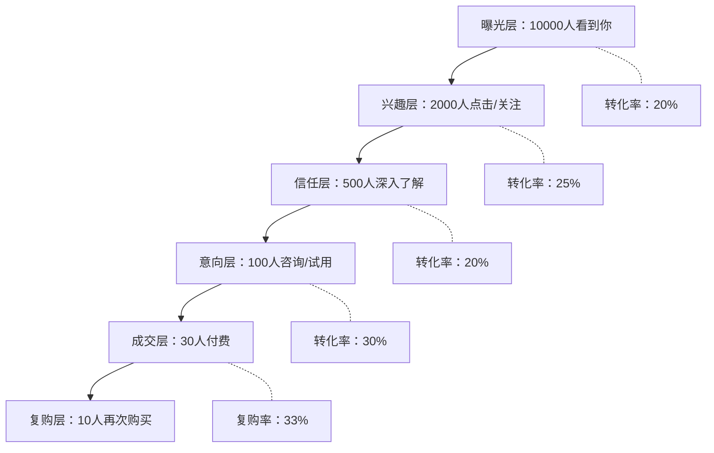
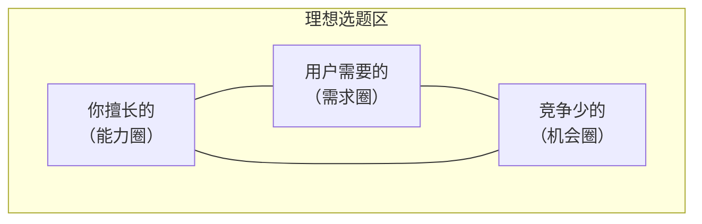
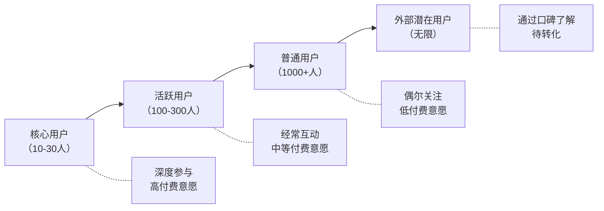
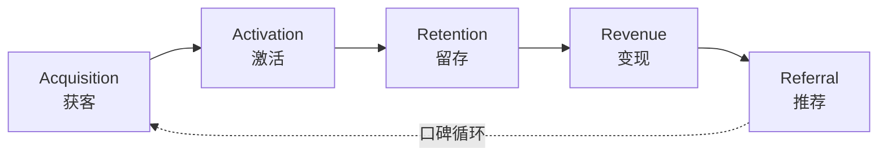
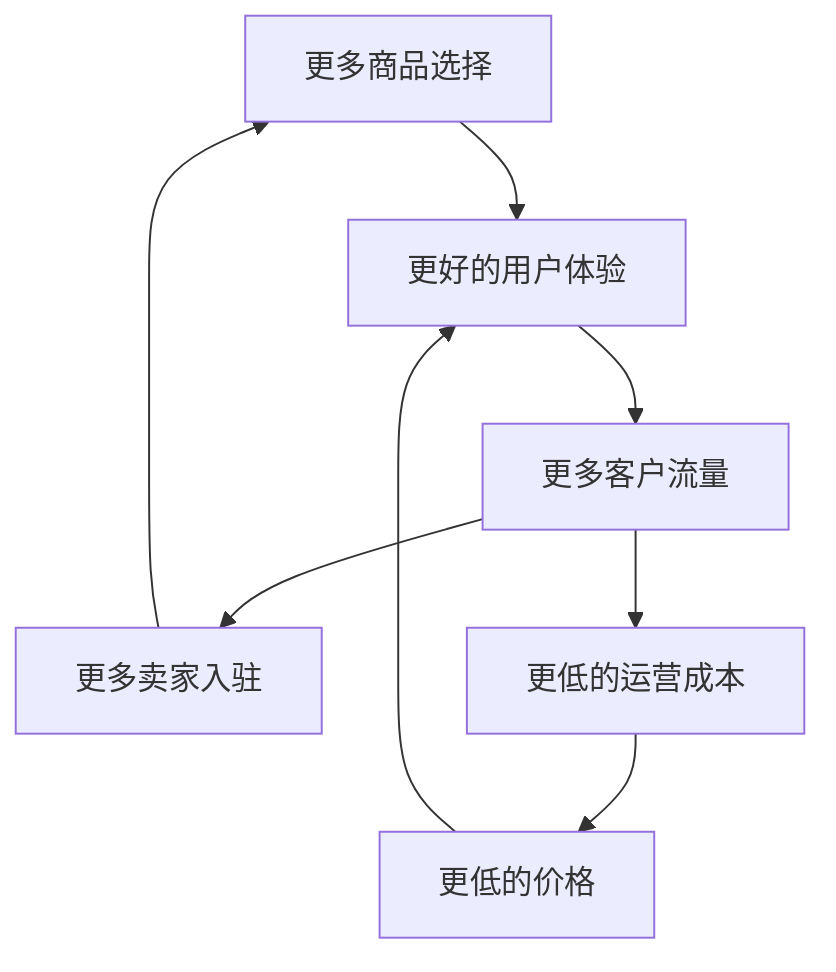
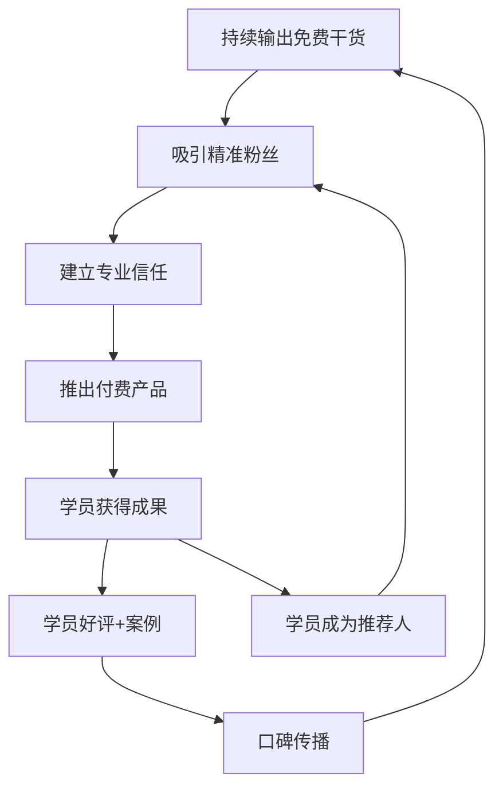
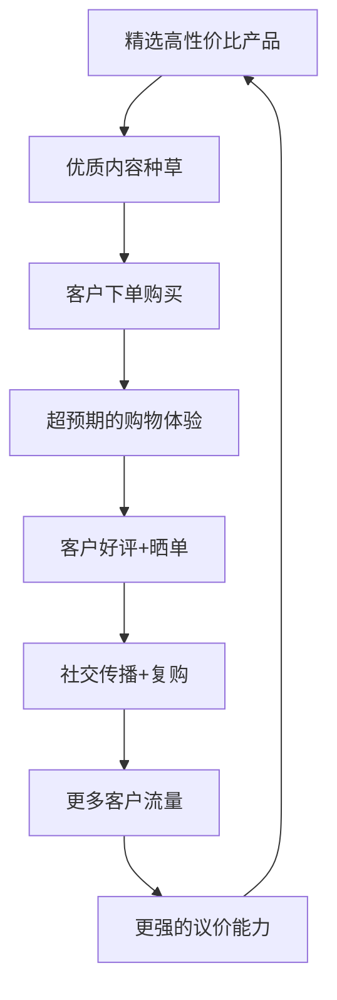
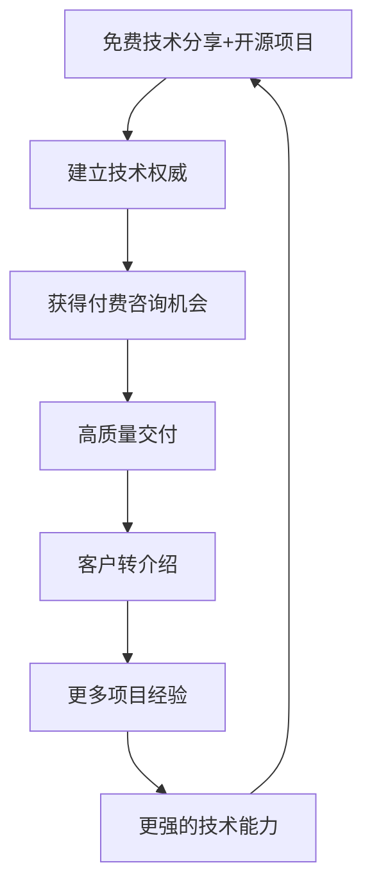
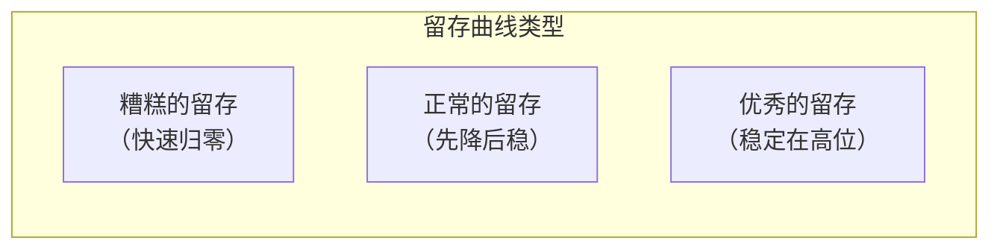

## 三、获客与增长

> "产品再好，没有客户就是零。获客不是一次性活动，而是一套可复制、可优化、可规模化的系统工程。"

上一节我们讲了如何发现商业机会、验证需求真伪。当你确认了一个值得做的方向，接下来最紧迫的问题就是：**客户从哪里来？如何持续不断地获得新客户？如何让增长进入自循环？**

这就是获客与增长要解决的核心命题。很多人把获客理解为"打广告"或者"发朋友圈"，这只是冰山一角。真正的获客是一门融合了心理学、经济学、数据分析和系统设计的综合能力。本节将从底层逻辑到实操方法，系统讲解如何构建你的获客引擎。

### 3.1 获客的底层逻辑

#### 3.1.1 获客漏斗：从曝光到成交的路径

任何获客行为都可以抽象为一个漏斗模型——从最外层的"看到你"到最终的"付钱给你"，每一层都会有流失。



**关键洞察：**

- **每一层的转化率决定了获客效率。** 假设你的产品售价100元，获客漏斗从10000次曝光到30次成交，那么每获取一个客户的"曝光成本"是333次。如果你能将信任层到意向层的转化率从20%提升到40%，同样的曝光量就能带来60个客户，获客效率直接翻倍。
- **漏斗越窄的环节，优化价值越大。** 这就是为什么成熟的营销人不会平均用力，而是聚焦在转化率最低的那个瓶颈环节。
- **不同业务的漏斗形状完全不同。** 高频低价的副业（如自媒体课程）漏斗宽而浅，低频高价的服务（如企业咨询）漏斗窄而深。理解你的漏斗形状，才能制定正确的策略。

**漏斗诊断的实操方法：**

当你觉得"获客效果不好"时，不要笼统地归因，先定位到底哪一层出了问题。以下是逐层诊断的检查清单：

| 漏斗层级 | 症状 | 可能原因 | 优化方向 |
|----------|------|----------|----------|
| 曝光层 | 曝光量低 | 渠道选择错误、内容分发不足、SEO未优化 | 拓展渠道、增加发布频率、优化关键词 |
| 兴趣层 | 曝光高但点击率低 | 标题/封面不吸引人、选题偏离用户需求 | A/B测试标题、优化封面设计、调整选题方向 |
| 信任层 | 点击多但深入了解少 | 内容深度不够、缺乏社会证明、品牌感弱 | 增加案例和数据、展示用户评价、优化个人品牌 |
| 意向层 | 了解多但咨询少 | 缺乏明确的行动引导、产品价值不清晰 | 添加CTA按钮、优化产品介绍页、提供免费试用 |
| 成交层 | 咨询多但付费少 | 定价过高、信任不足、支付流程复杂 | 调整价格策略、增加保障承诺、简化支付流程 |
| 复购层 | 首次付费后不再来 | 产品体验差、缺乏后续价值、没有复购激励 | 优化产品体验、设计复购权益、定期推送新内容 |

#### 3.1.2 获客经济学：CAC与LTV

任何可持续的获客策略都必须满足一个基本不等式：

**LTV > 3 × CAC**

- **CAC（Customer Acquisition Cost，客户获取成本）**：获取一个付费客户所花费的全部成本。包括广告费、内容制作成本、时间成本、工具费用等。
- **LTV（Lifetime Value，客户终身价值）**：一个客户在整个生命周期内为你贡献的总利润。

**为什么是3倍而不是刚好大于？** 因为CAC和LTV的计算都有不确定性——市场变化、竞争加剧、客户流失等因素会导致实际数据波动。3倍的安全边际能确保你在最差情况下仍然盈利。

**CAC计算实操：**

| 计算项 | 金额/数值 | 说明 |
|--------|-----------|------|
| 月度营销总支出 | 5000元 | 广告费+内容制作+工具+时间成本 |
| 月度新增付费客户 | 50人 | 只计算真正付费的，不含免费用户 |
| **单客获取成本CAC** | **100元** | 5000 ÷ 50 |

**时间成本的计算方法（很多人忽略这一项）：**

如果你是副业者，你的营销时间是有机会成本的。假设你每小时副业产出价值100元（按你的副业月收入除以投入时间计算），每周花10小时做获客相关工作，那么月度时间成本 = 100 × 10 × 4 = 4000元。这部分必须计入CAC，否则你的获客成本会被严重低估。

**LTV计算实操：**

| 计算项 | 金额/数值 | 说明 |
|--------|-----------|------|
| 客单价 | 299元 | 单次购买金额 |
| 毛利率 | 70% | 扣除直接成本后的利润率 |
| 年均购买次数 | 3次 | 包含复购和追加购买 |
| 平均客户生命周期 | 2年 | 客户活跃的平均时长 |
| **客户终身价值LTV** | **1255.8元** | 299 × 70% × 3 × 2 |

上例中 LTV/CAC = 1255.8/100 = 12.6倍，远超3倍安全线，说明获客模型非常健康，可以加大投入。

**危险信号：**

- LTV/CAC < 1：每获取一个客户就亏钱，规模越大亏损越多
- LTV/CAC 在 1-3 之间：微利或盈亏平衡，极其脆弱，一次市场波动就可能亏损
- LTV/CAC > 3：健康模型，可以持续扩大获客规模
- LTV/CAC > 10：获客投入严重不足，应该加大投入抢占市场

**分渠道追踪CAC的重要性：**

不同渠道的CAC差异巨大。一个实操案例：某知识付费博主月投5000元做获客，平均CAC为100元。但分渠道一看——

| 渠道 | 月投入 | 新客数 | 渠道CAC | 判断 |
|------|--------|--------|---------|------|
| 小红书内容 | 1000元（时间成本） | 20人 | 50元 | 极优，加大投入 |
| 知乎回答 | 800元（时间成本） | 15人 | 53元 | 优秀，持续投入 |
| 抖音短视频 | 1500元（时间+制作） | 8人 | 188元 | 偏高，优化内容 |
| 朋友圈广告 | 1700元（广告费） | 7人 | 243元 | 超标，暂停或优化 |

如果不分渠道看，你可能觉得"平均CAC=100元还不错"，但实际上有一个渠道在严重拖后腿。**分渠道追踪CAC是获客优化的基础。**

#### 3.1.3 获客的四象限模型

根据获客方式的两个维度——**成本高低**和**速度快慢**——可以将获客策略分为四个象限：

| | 快速见效 | 长期积累 |
|---|---------|---------|
| **低成本** | 社群裂变、老带新、限时活动 | 内容营销、SEO、品牌建设 |
| **高成本** | 付费广告、信息流投放、KOL合作 | 线下活动、渠道建设、品牌代言 |

**策略组合建议：**

- **起步期（0-6个月）**：以左下角（低成本快速）和右下角（低成本长期）为主。先把免费渠道做透，用社群裂变和内容营销获取第一批客户。
- **成长期（6-18个月）**：在已有数据验证的基础上，开始测试付费广告。先小预算试错，找到正向ROI的投放模型后再放大。
- **成熟期（18个月以上）**：四个象限全面布局，但始终确保有机流量（内容+SEO+口碑）占比不低于50%，避免对付费渠道过度依赖。

**不同副业类型的渠道组合推荐：**

| 副业类型 | 首选渠道 | 次选渠道 | 不推荐 | 原因 |
|----------|----------|----------|--------|------|
| 知识付费/课程 | 内容营销+社群 | SEO+口碑 | 纯付费广告 | 需要信任积累，冷广告转化率低 |
| 电商/带货 | 付费广告+短视频 | 社群+口碑 | 纯SEO | 需要视觉冲击和即时转化 |
| 技术服务/接单 | SEO+口碑 | 社群+内容 | 短视频 | 客户搜索意图明确，短视频转化路径太长 |
| 本地服务 | 社群+口碑 | 本地SEO+付费广告 | 全国性内容平台 | 地理限制决定了渠道选择 |
| 内容创作/自媒体 | 平台算法+SEO | 社群+口碑 | 付费广告 | 本身就是内容，不需要花钱买流量 |

### 3.2 六大获客渠道深度解析

#### 3.2.1 内容营销获客

**核心原理：** 通过持续输出有价值的内容，吸引目标客户主动找到你。这是成本最低、壁垒最高、效果最持久的获客方式。

**内容营销的"鱼塘理论"：**

把互联网想象成一片大海，你的目标客户是鱼。内容营销不是拿一根鱼竿去海里钓（效率极低），而是挖一个鱼塘，把鱼吸引过来养着（高效且可控）。

鱼塘由三个要素构成：
1. **引水**（引流内容）：在公域平台发布能吸引目标客户的内容
2. **蓄水**（承载平台）：公众号、个人网站、社群等你可控的阵地
3. **养鱼**（价值输出）：持续提供有价值的内容，建立信任

**内容营销的五大内容类型：**

| 内容类型 | 目的 | 适合阶段 | 示例 |
|----------|------|----------|------|
| 引流型内容 | 吸引新用户关注 | 曝光层 | 热点解读、行业报告、免费工具 |
| 教育型内容 | 建立专业信任 | 信任层 | 教程、方法论、案例拆解 |
| 转化型内容 | 推动购买决策 | 意向层 | 产品对比、用户见证、限时优惠 |
| 留存型内容 | 维系老客户关系 | 复购层 | 使用技巧、进阶教程、社群活动 |
| 传播型内容 | 引发用户转发分享 | 全阶段 | 争议观点、情感共鸣、实用干货 |

**实操：内容选题的"三圈交叉法"**

好的选题处于三个圈的交叉区域：



- **你擅长的**：你的专业技能、经验积累、独特视角
- **用户需要的**：目标客户的真实痛点、困惑、渴望
- **竞争少的**：现有内容质量低、角度少、或完全空白的领域

**选题实操步骤：**

1. 打开知乎/小红书/抖音，搜索你的领域关键词
2. 按"最热"排序，记录前20个问题/话题
3. 逐个评估：这个问题我有独特见解吗？现有回答质量如何？
4. 选择3-5个"你有见解+现有回答质量低"的选题优先创作
5. 每个选题用不同的内容形式（图文/视频/音频）在多个平台分发

**内容创作的"价值密度"原则：**

每1000字至少包含以下之一：
- 一个可立即执行的方法或步骤
- 一个有数据支撑的案例
- 一个反直觉但有逻辑的观点
- 一个可以直接使用的模板或工具

如果你的内容1000字读下来，读者没有获得任何可带走的东西，那就是在浪费他们的时间——他们会用脚投票。

**内容矩阵搭建：如何用一份核心内容覆盖多个平台**

很多副业者最大的痛点是"没时间做内容"。解决方案不是更努力地写，而是聪明地复用。以下是内容矩阵的实操方法：

**核心内容 → 多平台分发的工作流：**

1. **创作一篇深度长文**（3000-5000字），作为核心内容
2. 从长文中提炼3-5个核心观点，每个观点写成一条**小红书笔记**（300-500字+配图）
3. 将核心观点改编为**短视频脚本**（15-60秒），拍摄发布到抖音/视频号
4. 将长文发布到**公众号**和**知乎专栏**
5. 将关键数据和案例制作成**信息图**，发布到微博/朋友圈
6. 将长文的音频版录制为**播客**，发布到喜马拉雅/小宇宙

**一份内容 → 6种形态 → 6个平台**，时间投入只多了50%，但覆盖面扩大了6倍。

**工具推荐：**

| 环节 | 推荐工具 | 用途 | 费用 |
|------|----------|------|------|
| 选题研究 | 5118、新榜、蝉妈妈 | 热点追踪、竞品分析 | 免费-299元/月 |
| 内容创作 | ChatGPT、Claude、Notion AI | 辅助写作、大纲生成 | 免费-200元/月 |
| 图片制作 | Canva、创客贴、稿定设计 | 封面图、信息图 | 免费-99元/月 |
| 视频剪辑 | 剪映、CapCut | 短视频制作 | 免费 |
| 数据分析 | 各平台自带数据后台 | 内容效果追踪 | 免费 |
| 多平台分发 | 蚁小二、融媒宝 | 一键多平台发布 | 免费-99元/月 |

#### 3.2.2 社交媒体获客

**核心原理：** 利用社交平台的算法推荐和社交关系链，将内容推送给潜在客户。

**主流平台获客特性对比：**

| 平台 | 核心优势 | 内容形式 | 获客周期 | 适合人群 |
|------|----------|----------|----------|----------|
| 小红书 | 精准的消费决策影响 | 图文笔记、短视频 | 1-3个月 | 生活方式、消费品、知识服务 |
| 抖音 | 巨大的流量池 | 短视频、直播 | 即时-1个月 | 有表现力、能持续产出视频 |
| 微信公众号 | 深度内容+私域沉淀 | 长图文 | 3-6个月 | 深度内容创作者、B2B服务 |
| 知乎 | 长尾搜索流量 | 问答、文章 | 3-12个月 | 专业知识、技术领域 |
| B站 | 高粘性年轻用户 | 中长视频 | 3-6个月 | 教程类、深度内容 |
| 视频号 | 微信生态导流 | 短视频、直播 | 1-3个月 | 有微信私域基础的人 |

**社交媒体获客的关键动作：**

**1. 账号定位的"一句话测试"：**

如果你不能用一句话说清楚"关注我能获得什么"，说明定位不够清晰。例如：
- ❌ "分享生活和干货"——太模糊，没有筛选人群
- ✅ "帮0基础小白3个月学会Python自动化办公"——明确价值、明确人群、明确结果

**2. 内容发布的"黄金时间+频率"：**

| 平台 | 最佳发布时间 | 建议频率 | 内容节奏 |
|------|-------------|----------|----------|
| 小红书 | 12:00-13:00, 18:00-20:00, 21:00-23:00 | 每天1-2篇 | 70%干货+30%人设 |
| 抖音 | 12:00-13:00, 18:00-20:00 | 每天1-3条 | 前3秒必须抓人 |
| 公众号 | 8:00-9:00, 20:00-22:00 | 每周2-3篇 | 深度>数量 |
| 知乎 | 全天均可（长尾流量） | 每周3-5个回答 | 回答高关注问题 |

**3. 从公域到私域的导流路径：**

```text
公域平台内容 → 个人主页/简介引导 → 添加微信/进群 → 私域运营转化
```

关键细节：
- 不要在内容正文中放微信号（容易被限流），放在个人简介、评论区置顶或私信自动回复中
- 导流话术要给出明确的"加你的好处"，比如"加我领取XX资料包"
- 通过率最高的路径是：小红书私信 → 发送微信号图片（不是文字）→ 用户主动添加

**4. 短视频爆款公式（抖音/视频号适用）：**

短视频的算法核心是**完播率**和**互动率**。以下是一套经过验证的内容结构：

**黄金3秒开头公式：**
- **痛点提问**："你是不是也遇到过XX问题？"
- **反常识**："90%的人不知道，XX其实可以这样用"
- **数字冲击**："3个月，我用这个方法赚了XX万"
- **悬念前置**："今天发生了一件事，让我彻底改变了对XX的看法"

**15-60秒短视频结构模板：**

```text
0-3秒：钩子（痛点/悬念/冲击）→ 决定用户是否继续看
3-15秒：核心价值（直接给干货/方法/观点）→ 满足用户期待
15-30秒：案例/证据（数据、截图、前后对比）→ 增强说服力
最后5秒：行动引导（关注/收藏/评论/私信）→ 转化
```

**提升完播率的技巧：**
- 视频时长控制在30-45秒（完播率最高的区间）
- 用字幕和画面变化保持视觉节奏
- 在视频中设置"信息缺口"（"最后一个方法最重要"）
- 用争议性观点引发评论（评论互动会提升推荐权重）

**5. 小红书爆款笔记的底层逻辑：**

小红书的算法与其他平台最大的区别是**搜索权重极高**——接近50%的流量来自搜索。这意味着SEO思维在小红书上极其重要。

**小红书笔记优化清单：**

| 优化项 | 具体做法 | 为什么重要 |
|--------|----------|-----------|
| 标题 | 包含2-3个目标关键词，用数字和情感词 | 决定搜索排名和点击率 |
| 封面图 | 高对比度、有文字、有信息量 | 决定笔记是否被点击 |
| 正文前3行 | 必须包含核心关键词和价值承诺 | 决定用户是否继续读 |
| 标签 | 5-10个，混合大标签和精准小标签 | 影响搜索曝光 |
| 话题 | 带1-2个热门话题 | 获得话题流量加成 |
| 评论区 | 自己先评论补充信息，引导互动 | 互动率影响推荐权重 |

#### 3.2.3 搜索引擎获客（SEO/SEM）

**核心原理：** 当用户主动搜索某个关键词时，你的内容出现在搜索结果的前列。这是"需求最明确"的获客渠道——用户已经在主动寻找解决方案了。

**SEO（搜索引擎优化）——免费但慢：**

SEO的核心逻辑只有一条：**让搜索引擎认为你的内容是某个关键词下最好的答案。**

**SEO实操的"四步法"：**

1. **关键词研究**：找到目标客户会搜索的词
   - 工具：5118、百度关键词规划师、Google Keyword Planner
   - 策略：优先做"长尾词"（如"宝妈在家副业月入3000的方法"），而非"大词"（如"副业"）
   - 原因：长尾词竞争小、转化率高、容易排到前面

2. **内容创作**：围绕关键词写出最好的内容
   - 标题必须包含目标关键词
   - 内容深度超过现有排名前10的所有文章
   - 结构清晰：目录、小标题、列表、表格
   - 字数通常需要3000字以上才有竞争力

3. **技术优化**：确保搜索引擎能正常抓取
   - 网站加载速度（3秒以内）
   - 移动端适配
   - 合理的URL结构和内链
   - 提交sitemap到搜索引擎

4. **外链建设**：让其他网站指向你的内容
   - 在知乎、简书等平台发布内容并链接回你的网站
   - 参与行业论坛讨论，自然嵌入链接
   - 与同领域博主互换友情链接

**关键词研究的完整实操流程：**

关键词研究不是"想几个词"就完了，而是一个系统性的分析过程：

**第一步：种子词收集（30分钟）**
- 列出你业务相关的10-20个核心词
- 用百度下拉框、相关搜索扩展词库
- 查看竞品网站的标题和描述中用了哪些词
- 在知乎、小红书搜索框看用户在搜什么

**第二步：关键词评估（1小时）**
用5118或百度关键词规划师查询以下数据：

| 评估维度 | 理想状态 | 避免 |
|----------|----------|------|
| 月搜索量 | 500-5000 | <100（太冷）或>50000（太热） |
| 竞争度 | 低-中 | 高（大站霸占前排） |
| 商业意图 | 有购买意向词（"推荐""哪家好""价格"） | 纯信息词（"什么是""定义"） |
| 长尾潜力 | 可以衍生出多个相关长尾词 | 孤立词，无法扩展 |

**第三步：关键词分组（30分钟）**
将关键词按搜索意图分组：
- **信息型**（"怎么""如何""什么是"）→ 写教程、指南类内容
- **商业型**（"推荐""对比""哪家好"）→ 写测评、对比类内容
- **交易型**（"价格""购买""优惠"）→ 做产品页、促销页

**第四步：内容规划（持续执行）**
为每组关键词规划对应的内容，建立关键词-内容映射表：

| 关键词 | 搜索量 | 竞争度 | 内容类型 | 优先级 | 状态 |
|--------|--------|--------|----------|--------|------|
| 副业推荐2026 | 2400 | 中 | 深度指南 | ★★★★★ | 已发布 |
| 宝妈在家副业 | 1800 | 低 | 案例合集 | ★★★★ | 撰写中 |
| ... | ... | ... | ... | ... | ... |

**SEM（搜索引擎营销）——付费但快：**

适合需要快速验证市场需求或已经有成熟转化路径的场景。

**SEM投放的"三阶优化法"：**

1. **测试期（1-2周）**：小预算（日均50-100元）投放5-10组关键词，收集点击率和转化率数据
2. **优化期（2-4周）**：砍掉转化成本高于目标的关键词，加大投放转化好的词
3. **放量期**：将单客获取成本控制在LTV的1/3以内，逐步加大预算

**百度SEO vs. Google SEO的关键差异：**

| 维度 | 百度SEO | Google SEO |
|------|---------|------------|
| 内容偏好 | 偏好长图文、百家号优先 | 偏好结构化、E-E-A-T权威性 |
| 外链权重 | 较低，百度更看站内 | 高权重，外链是核心排名因素 |
| 移动优先 | 必须移动适配 | 同样移动优先索引 |
| 收录速度 | 较慢，需主动提交 | 较快，自动抓取 |
| 流量特征 | PC+移动并重 | 移动端为主 |

#### 3.2.4 社群运营获客

**核心原理：** 将有共同需求或兴趣的人聚集在一个社群中，通过持续的价值输出和社交互动，实现信任建立和口碑传播。

**社群获客的"涟漪模型"：**



**社群搭建的完整流程：**

**第一步：确定社群定位**
- 这个群为谁服务？（人群画像越具体越好）
- 加入这个群能获得什么？（核心价值主张）
- 群的生命周期是多久？（长期群 vs. 项目制群）

**第二步：设计入群门槛**
免费群和付费群的选择：

| 维度 | 免费群 | 付费群 |
|------|--------|--------|
| 适合阶段 | 冷启动、引流 | 已验证需求、有口碑 |
| 人员质量 | 参差不齐 | 相对精准 |
| 运营成本 | 高（需要大量内容维持活跃） | 低（付费本身就是筛选） |
| 变现方式 | 后端产品转化 | 群费+后端产品 |
| 建议金额 | — | 9.9-99元（入门级）、999-4999元（深度服务） |

**第三步：设计群规和运营节奏**
- 每日：早安分享（1条干货）+ 晚间互动（1个话题讨论）
- 每周：1次主题分享（群成员或外部嘉宾）
- 每月：1次线下/线上活动（增强连接感）
- 每季度：1次复盘和群规优化

**社群运营SOP模板（可直接套用）：**

| 时间 | 动作 | 内容示例 | 负责人 | 目的 |
|------|------|----------|--------|------|
| 每日8:30 | 早安分享 | "今日一句：XX行业最值得看的一篇文章" | 群主/助理 | 维持活跃 |
| 每日12:00 | 午间互动 | "大家今天遇到什么问题？提出来一起讨论" | 群主 | 收集需求 |
| 每日20:00 | 晚间话题 | "你觉得XX领域未来3年最大的机会是什么？" | 群主 | 深度交流 |
| 每周三20:00 | 主题分享 | 邀请群成员或外部嘉宾做30分钟分享 | 群主 | 价值输出 |
| 每周五17:00 | 周报总结 | 本周精华内容回顾+下周预告 | 助理 | 内容沉淀 |
| 每月第1个周六 | 线上活动 | 案例拆解/实战演练/答疑专场 | 群主 | 增强粘性 |
| 每季度末 | 满意度调查 | 发放问卷，收集改进建议 | 群主 | 持续优化 |

**第四步：裂变增长**
社群裂变的"三要素"：
1. **诱饵**：足够有吸引力的福利（免费课程、资料包、优惠券）
2. **规则**：简单明确的参与方式（转发海报+截图回群）
3. **紧迫感**：限时限量（"前100名""今晚截止"）

**裂变活动的完整执行流程：**

```text
准备阶段（活动前3天）
├── 设计裂变海报（核心要素：大标题+利益点+二维码+紧迫感）
├── 准备诱饵内容（课程/资料/工具包）
├── 搭建自动化流程（企业微信/小裂变/wetool）
└── 测试完整流程（自己走一遍用户路径）

执行阶段（活动当天-3天）
├── 种子用户首发（核心用户群先启动）
├── 实时监控数据（参与人数、邀请人数、入群数）
├── 及时处理异常（链接失效、审核延迟）
└── 中途追加激励（"再邀请2人解锁额外奖励"）

收尾阶段（活动后2天）
├── 兑现承诺（发放奖励、交付诱饵内容）
├── 数据复盘（参与率、转化率、CAC、K值）
├── 用户分层（高活跃/普通/沉默用户分别运营）
└── 经验记录（什么有效、什么失败、下次改进什么）
```

**社群运营的五个致命错误：**

1. **只拉人不运营**：群建好之后无人管理，广告满天飞，最终沦为死群
2. **过度营销**：每天推送产品广告，把社群当成免费广告位
3. **没有价值输出**：群主不持续分享干货，群成员找不到留下来的理由
4. **管理过于松散**：没有群规，没有管理员，消息质量无法保证
5. **急于变现**：社群刚建立就卖高价产品，信任还没建立就收割

#### 3.2.5 口碑转介绍获客

**核心原理：** 让满意的客户主动帮你推荐新客户。这是成本最低、转化率最高、客户质量最好的获客方式。

**口碑传播的"Net Promoter Score"（NPS）模型：**

向客户提问："你有多大可能向朋友推荐我的产品/服务？"（0-10分）
- **9-10分（推荐者）**：忠诚的品牌拥护者，会主动推荐
- **7-8分（被动者）**：满意但不热情，不会主动推荐
- **0-6分（贬损者）**：不满意，可能传播负面口碑

**NPS = 推荐者% - 贬损者%**

- NPS > 50：优秀，口碑增长引擎已经启动
- NPS 0-50：良好，有提升空间
- NPS < 0：危险，需要先解决产品/服务问题

**让客户愿意推荐的四个条件：**

1. **超预期体验**：不仅仅满足承诺，还给客户额外惊喜。比如承诺3天发货，实际当天发货并附赠手写感谢卡
2. **降低推荐门槛**：提供现成的推荐话术和分享素材，客户只需要"转发"就行
3. **给予推荐奖励**：双向奖励——推荐人和被推荐人都能获得好处（如各得50元优惠券）
4. **创造社交货币**：让推荐你的产品成为一种"品味/能力的证明"，客户推荐时自带优越感

**转介绍体系设计模板：**

| 要素 | 设计内容 | 示例 |
|------|----------|------|
| 推荐人奖励 | 每成功推荐1人获得 | 50元现金/课程优惠券/增值服务 |
| 被推荐人福利 | 首次购买享受 | 9折优惠/免费试用7天/赠品 |
| 推荐方式 | 让推荐变得简单 | 专属推荐链接/推荐码/海报一键生成 |
| 追踪机制 | 确保推荐可追溯 | 推荐码系统/UTM链接/手动登记 |
| 兑现时间 | 奖励发放时机 | 被推荐人付款后即时发放 |

**副业场景下的口碑获客实操：**

对于个人副业者来说，不需要搭建复杂的推荐系统，以下是最简单有效的口碑获客方法：

**方法一：服务结束后的"推荐请求"话术**

```text
"很高兴这次能帮到你。如果你身边也有朋友遇到类似的问题，
欢迎推荐给他们。推荐成功的话，你下次的服务我会给你 [具体优惠]。
我把我的介绍页/名片发给你，方便你转发。"
```

关键：在客户最满意的时刻提出请求（服务刚完成、收到好评反馈时），成功率最高。

**方法二：案例包装**

把服务过的客户案例（征得同意后）制作成精美的案例卡片，包含：
- 客户的问题/痛点
- 你的解决方案
- 最终效果/数据
- 客户的一句话评价

这张案例卡片既是你的营销素材，也是客户转发推荐的"社交货币"。

**方法三：定期回访**

不要等客户找你，主动回访。每隔1-3个月给老客户发一条消息：
```text
"你好，距离上次合作已经3个月了，想了解一下 [服务/产品] 使用得怎么样？
有没有遇到什么新的问题？"
```
回访的目的是：发现新需求（追加销售）+ 保持关系（口碑推荐）+ 收集反馈（产品优化）。

#### 3.2.6 付费广告获客

**核心原理：** 通过花钱购买流量，快速触达目标客户。这是见效最快但也最容易亏钱的获客方式。

**付费广告的"三道关卡"：**

1. **第一关：平台选择**——选错平台，钱全白花
2. **第二关：素材制作**——广告不够吸引人，用户直接划走
3. **第三关：转化承接**——用户点了广告但落地页不行，白白浪费流量

**主流广告平台特性：**

| 平台 | 用户特征 | 最低日预算 | 适合产品 | 核心优势 |
|------|----------|------------|----------|----------|
| 微信朋友圈广告 | 全年龄段、社交属性 | 50元/天 | 本地服务、消费品 | 精准定向+社交背书 |
| 抖音巨量引擎 | 年轻用户、娱乐消费 | 100元/天 | 视觉化产品、快消品 | 算法推荐精准 |
| 小红书聚光 | 女性为主、消费决策 | 100元/天 | 美妆、生活方式、知识 | 种草转化链路短 |
| 百度搜索广告 | 主动搜索意图 | 50元/天 | 高客单价、B2B服务 | 搜索意图明确 |
| 知乎知+ | 高学历、理性决策 | 50元/天 | 教育、科技、专业服务 | 内容信任度高 |

**付费广告的"小步快跑"投放法：**

**阶段一：测素材（预算200-500元）**
- 准备5-10组不同的广告素材（标题、图片、文案组合）
- 每组素材投50元，观察点击率（CTR）
- 保留CTR最高的2-3组素材

**阶段二：测转化（预算500-2000元）**
- 用胜出的素材，测试不同的落地页
- A/B测试：同一素材指向不同的落地页
- 计算每条路径的转化成本（CPA）

**阶段三：放量（持续优化）**
- 将预算集中在CPA最低的组合上
- 每周优化一次素材（避免素材疲劳导致CTR下降）
- 持续监控ROI，一旦ROI低于1.5立即暂停

**广告素材的"3秒法则"：**

用户在信息流中决定是否看你的广告，平均只有3秒。前3秒必须做到：
1. **直击痛点**：用一句话说出目标客户最头疼的问题
2. **制造好奇**：用反常识或悬念吸引继续看下去
3. **视觉冲击**：图片或视频前3帧必须足够吸引眼球

**广告文案的万能公式：**

**公式一：PASA公式（适用于信息流广告）**
- **P（Problem）**：指出痛点——"还在为XX烦恼？"
- **A（Agitate）**：放大痛苦——"每天浪费3小时在XX上，一年就是1095小时"
- **S（Solution）**：给出方案——"XX工具帮你10分钟搞定"
- **A（Action）**：行动引导——"立即领取7天免费试用"

**公式二：FABE公式（适用于产品广告）**
- **F（Feature）**：产品特征——"XX课程，21天系统学习"
- **A（Advantage）**：竞争优势——"业内唯一由XX专家亲自授课"
- **B（Benefit）**：用户利益——"学完能独立完成XX项目"
- **E（Evidence）**：证据支撑——"已有3000+学员，好评率98%"

**落地页设计的核心原则：**

用户点击广告后到达的页面（落地页）决定了你花的广告费能不能变成客户。一个高转化率的落地页必须做到：

| 要素 | 要求 | 常见错误 |
|------|------|----------|
| 首屏 | 3秒内传达核心价值+行动按钮 | 首屏是公司介绍，用户直接关掉 |
| 标题 | 与广告文案一致，兑现广告承诺 | 标题与广告不匹配，用户觉得被骗 |
| 社会证明 | 在首屏下方展示客户评价/数据/案例 | 没有社会证明，用户不信任 |
| 行动按钮 | 页面至少3个CTA，颜色醒目 | 只有底部一个按钮，用户懒得往下翻 |
| 加载速度 | 3秒以内打开 | 图片太大或服务器太慢 |
| 移动适配 | 手机端体验优先 | 只适配了PC端 |

**重定向广告（Retargeting）——被忽略的转化利器：**

95%的首次访问者不会立即购买。重定向广告的作用是：对"来过但没买"的用户再次投放广告，把他们拉回来。

**重定向的实操策略：**
1. 在落地页/网站安装像素代码（各广告平台都有）
2. 对过去7天访问过但未转化的用户投放提醒广告
3. 广告内容不要重复，提供新的价值点（如限时优惠、新增案例）
4. 频率控制在每天1-2次，避免骚扰

### 3.3 私域流量运营：获客的终极形态

#### 3.3.1 为什么私域是副业者的必修课

公域平台的流量是"租来的"——平台随时可以改变算法、提高广告费、甚至封你的号。而私域流量是"自己的"——你拥有用户关系，可以随时、免费、反复触达。

**公域 vs. 私域的本质区别：**

| 维度 | 公域流量 | 私域流量 |
|------|----------|----------|
| 流量归属 | 平台所有 | 你自己所有 |
| 触达成本 | 每次都要付费/内容竞争 | 免费触达 |
| 触达频率 | 受平台规则限制 | 随时可以触达 |
| 用户关系 | 弱关系（关注≠信任） | 强关系（已建立连接） |
| 转化率 | 1-5% | 10-30% |
| 数据资产 | 平台拥有 | 你自己拥有 |
| 风险 | 平台封号/算法变化 | 运营不当导致流失 |

**副业者必建的私域阵地：**

1. **微信个人号**：最强的私域载体，朋友圈+私聊+社群三位一体
2. **微信社群**：用户聚集、价值输出、口碑裂变的主阵地
3. **企业微信**：适合有一定规模后升级，支持自动化和客户管理
4. **个人网站/博客**：SEO流量的终极承接地，不受平台限制
5. **邮件列表**：海外市场的核心私域渠道，国内适合B2B场景

#### 3.3.2 朋友圈运营的"黄金法则"

对于大多数副业者来说，微信朋友圈是最低成本、最高效率的获客阵地。但90%的人朋友圈运营方式是错误的。

**朋友圈内容的4:2:1法则：**
- **4条价值内容**：干货分享、行业洞察、用户反馈、生活态度
- **2条互动内容**：提问、投票、话题讨论、抽奖
- **1条转化内容**：产品介绍、服务说明、促销信息

**发朋友圈的最佳时间：**

| 时段 | 适合内容 | 原因 |
|------|----------|------|
| 7:30-8:30 | 干货/早安问候 | 通勤时间，刷手机高峰 |
| 12:00-13:00 | 轻松内容/互动 | 午休时间，心情放松 |
| 18:00-19:00 | 案例/故事 | 下班路上，有时间阅读 |
| 21:00-22:30 | 深度内容/转化 | 睡前最放松，决策意愿高 |

**朋友圈文案的写作模板：**

**模板一：痛点-方案型**
```text
今天帮一个客户解决了 [具体问题]。

他之前的情况是：[痛点描述，越具体越好]

我给他的方案是：[简述方案]

结果：[具体效果/数据]

如果你也遇到类似的问题，评论区扣1，我私信你具体方法。
```

**模板二：认知颠覆型**
```text
说一个反常识的观点：[争议性观点]

大多数人觉得 [常见认知]，但实际上 [真相]。

举个例子：[具体案例]

所以 [行动建议]。

你怎么看？评论区聊聊。
```

**模板三：成果展示型**
```text
又一个好消息：[客户/学员的具体成果]

[客户姓名] 从 [起点] 到 [终点]，只用了 [时间]。

关键是 [核心方法/策略]。

截图是TA的反馈（已获授权）。

[配图：聊天截图/成果截图]
```

### 3.4 增长飞轮：从线性增长到指数增长

#### 3.4.1 AARRR海盗模型

AARRR是增长领域最经典的框架，描述了用户从"知道你"到"帮你传播"的完整生命周期：



每个环节的关键指标和优化策略：

| 环节 | 定义 | 关键指标 | 优化方向 |
|------|------|----------|----------|
| Acquisition（获客） | 用户首次接触你 | 曝光量、点击率、注册量 | 优化渠道投放、提升内容吸引力 |
| Activation（激活） | 用户首次体验核心价值 | 激活率、首次体验完成率 | 简化使用流程、突出核心价值 |
| Retention（留存） | 用户持续回来使用 | 日活/月活、留存率 | 建立使用习惯、持续提供价值 |
| Revenue（变现） | 用户付费 | 付费转化率、客单价、ARPU | 优化定价、设计付费阶梯 |
| Referral（推荐） | 用户推荐给别人 | 推荐率、病毒系数K值 | 设计激励机制、降低推荐门槛 |

**关键：** AARRR不是线性的，而是循环的。Referral回到Acquisition形成闭环，这就是增长飞轮的雏形。

#### 3.4.2 病毒系数K值

**K值 = 每个用户平均邀请人数 × 被邀请人的转化率**

- **K > 1**：每个用户带来的新用户超过1个，指数级增长（病毒式传播）
- **K = 1**：用户量保持不变（稳态）
- **K < 1**：用户量持续下降，需要外部流量持续注入

**K值计算实例：**

假设你做了一个付费社群：
- 每个成员平均推荐3个人加入（邀请率 = 3）
- 被推荐的人中有40%会真正加入（转化率 = 0.4）
- K = 3 × 0.4 = 1.2 > 1 ✅ 可以实现病毒式增长

**提升K值的策略：**
1. **提高邀请率**：给推荐人更强的激励（金钱/荣誉/专属权益）
2. **提高转化率**：让被邀请人的第一次体验足够好（新人专属福利）
3. **降低传播摩擦**：一键分享、自动生成推荐海报、推荐码简单好记

#### 3.4.3 构建你的增长飞轮

增长飞轮是比AARRR更高阶的概念——它描述的是一组相互增强的商业活动，每一项都在为下一项提供动力，形成正向循环。

**经典案例：亚马逊的增长飞轮**



**副业场景的增长飞轮案例：**

**案例一：知识付费副业飞轮**



**案例二：电商副业飞轮**



**案例三：技术服务副业飞轮**



**飞轮构建的三个原则：**

1. **每一步的输出是下一步的输入**：免费内容→粉丝→信任→付费→成果→口碑→更多粉丝
2. **飞轮一旦转起来，越转越快**：早期启动困难（冷启动），但后期每转一圈都在为下一圈蓄能
3. **找到飞轮的"第一推动力"**：通常是免费内容的持续输出，或者第一批种子用户的深度服务

### 3.5 冷启动：从0到100个客户

冷启动是获客中最难的阶段——没有口碑、没有案例、没有流量，一切从零开始。

#### 3.5.1 冷启动的"五步法"

**第一步：列出你的"100人名单"**

在你开始任何线上获客之前，先从你现有的社交关系中找客户。

- 打开微信通讯录，逐个过一遍
- 列出所有可能对你产品/服务感兴趣的人
- 不要假设"他们不会买"——你不是他们，你不知道他们要什么
- 目标：从中筛选出50-100个潜在客户

**第二步：一对一私聊触达**

这不是群发广告。而是一对一真诚沟通：

```text
❌ 错误示范：群发"我在做XX，有需要找我"（跟垃圾短信没区别）

✅ 正确示范：
"XX你好，最近我在做[具体服务]，帮[具体人群]解决[具体问题]。
看到你之前[相关的背景/需求]，想问问你这方面有没有需求？
不管有没有都没关系，就是想跟你聊一下。"
```

关键要素：
- 个性化（提到对方的具体情况）
- 具体（说清楚你做什么、帮谁、解决什么问题）
- 无压力（"不管有没有都没关系"降低对方的心理负担）

**第三步：用"免费/低价"获取第一批案例**

前10个客户不要追求利润，追求案例和口碑：
- 提供免费体验或超低价试用
- 条件是：对方需要提供详细反馈+允许你用作案例
- 这10个案例是你后续所有获客的"弹药"

**第四步：在目标客户聚集的地方"刷存在感"**

- 找到你的目标客户在哪些平台/社群活跃
- 在这些地方持续输出有价值的回答和内容
- 不要推销——先建立"这个人很专业"的认知
- 自然会有人主动找你咨询

**第五步：让第一批客户帮你传播**

- 每个满意的客户都请求推荐（不要害羞，这是正当的商业行为）
- 准备好推荐话术和素材，降低客户的推荐成本
- 对推荐人表达感谢并给予回报（不一定是金钱，可以是额外服务）

#### 3.5.2 冷启动的MVP思维

MVP（Minimum Viable Product，最小可行产品）在获客中的应用：

**不要等到产品完美才开始获客。** 用最简单的方式验证"有人愿意为这个价值付费"。

| 验证层级 | 时间成本 | 金钱成本 | 验证目标 |
|----------|----------|----------|----------|
| 发一条朋友圈 | 10分钟 | 0 | 有没有人表示感兴趣 |
| 做一次免费分享 | 2小时 | 0 | 有没有人主动追问付费方式 |
| 卖出第一单 | 1天 | 0-100元 | 有没有人真正付钱 |
| 卖出10单 | 1周 | 100-500元 | 这个需求是否可以复制 |
| 建立稳定的获客通道 | 1月 | 500-2000元 | 获客模型是否可持续 |

**冷启动阶段的常见心理障碍及破解：**

| 心理障碍 | 内心独白 | 破解方法 |
|----------|----------|----------|
| 怕被拒绝 | "万一没人买怎么办" | 被拒绝是常态，10%的转化率已经很好了。100次尝试中有10次成功就是胜利 |
| 怕丢面子 | "朋友会不会觉得我在卖东西" | 你是在提供价值，不是在推销垃圾。如果产品真的能帮到人，推荐是好事 |
| 觉得不够好 | "我还不够专业，再准备准备" | 永远没有"准备好"的时候。60分就可以开始，边做边提升到80分 |
| 不好意思收钱 | "帮个忙而已，收钱不好意思" | 免费的东西没人珍惜。收费是对双方的尊重，也是对产品价值的验证 |

### 3.6 用户留存：让客户持续产生价值

获客只是起点，留存才是利润的核心来源。研究表明：**将留存率提升5%，利润可以提升25%-95%。**

#### 3.6.1 留存曲线与留存类型

留存曲线描述了用户在不同时间节点的活跃比例。典型分为三种模式：



- **糟糕的留存**：首月流失80%以上，之后继续流失。说明产品没有解决真实需求。
- **正常的留存**：首月流失40-60%，之后趋于稳定。这是大多数业务的现实情况。
- **优秀的留存**：首月流失20%以内，之后维持在60%以上。说明产品体验和价值交付做得很好。

**提升留存的前提是理解流失原因。** 用户流失通常有五类原因：

| 流失类型 | 表现 | 根因 | 解决方案 |
|----------|------|------|----------|
| 价值流失 | "没用" | 产品没解决真实需求 | 回归需求验证，调整产品方向 |
| 体验流失 | "太麻烦" | 使用流程太复杂 | 简化流程，优化新手引导 |
| 竞争流失 | "别家更好" | 竞品体验更好或价格更低 | 差异化定位，提升独特价值 |
| 信任流失 | "不靠谱" | 产品不稳定或服务态度差 | 提升产品质量和服务标准 |
| 遗忘流失 | "忘了" | 缺乏触达和提醒 | 建立定期触达机制（推送/社群/邮件） |

#### 3.6.2 提升留存的"五感模型"

1. **价值感**：用户持续感受到产品/服务带来的价值
   - 定期推送使用技巧和进阶内容
   - 展示用户使用后的成果和变化
   - 持续迭代优化，让用户感受到"越来越好"

2. **归属感**：用户觉得自己属于一个群体
   - 建立用户社群，促进用户之间的连接
   - 创造共同的仪式感（打卡、签到、周报）
   - 给予用户身份认同（"XX学员""XX认证"）

3. **成就感**：用户在使用过程中获得正反馈
   - 设计进阶体系（青铜→白银→黄金→钻石）
   - 可视化用户成长路径
   - 定期颁发证书或荣誉

4. **紧迫感**：让用户觉得"现在不看就亏了"
   - 限时内容（直播回放、限时课程）
   - 连续签到奖励
   - 社群内的实时讨论热度

5. **信任感**：用户相信你会持续提供价值
   - 稳定的内容更新频率
   - 透明的运营数据和反馈
   - 真诚处理用户投诉和建议

#### 3.6.3 用户分层运营

不是所有用户都一样——用RFM模型对用户进行分层，对不同层级的用户采取不同的运营策略：

| 用户类型 | R（最近消费） | F（消费频率） | M（消费金额） | 运营策略 |
|----------|-------------|-------------|-------------|----------|
| 高价值用户 | 近期 | 高 | 高 | VIP服务、专属权益、邀请成为合伙人 |
| 潜力用户 | 近期 | 低 | 高 | 推荐更多产品、提升使用频率 |
| 流失预警用户 | 较久未消费 | 曾经高 | 中 | 发送回归优惠、了解流失原因 |
| 新用户 | 刚注册 | 低 | 低 | 新手引导、首单优惠、快速体验价值 |
| 沉睡用户 | 很久未消费 | 低 | 低 | 唤醒邮件/消息、大力度回归优惠 |

### 3.7 数据驱动增长

#### 3.7.1 获客核心指标体系

不要凭感觉做决策，用数据指导每一步优化。以下是你必须关注的核心指标：

| 指标类别 | 核心指标 | 计算公式 | 健康范围 |
|----------|----------|----------|----------|
| 流量指标 | UV（独立访客） | 每日去重访问人数 | 持续增长 |
| 转化指标 | 注册转化率 | 注册人数 ÷ UV | 5%-20% |
| 转化指标 | 付费转化率 | 付费人数 ÷ 注册人数 | 2%-10% |
| 成本指标 | CAC | 营销总成本 ÷ 新增客户数 | < LTV/3 |
| 价值指标 | LTV | 客单价 × 毛利率 × 购买频次 × 生命周期 | > 3×CAC |
| 留存指标 | 次日留存率 | 次日活跃 ÷ 新增用户 | 30%-60% |
| 留存指标 | 7日留存率 | 第7日活跃 ÷ 新增用户 | 15%-35% |
| 推荐指标 | K值（病毒系数） | 邀请率 × 邀请转化率 | > 0.5 |

**数据追踪工具推荐：**

| 场景 | 推荐工具 | 费用 | 适合阶段 |
|------|----------|------|----------|
| 网站流量分析 | Google Analytics / 百度统计 | 免费 | 所有阶段 |
| 微信生态数据 | 微信公众平台数据助手 / 企业微信后台 | 免费 | 所有阶段 |
| 短视频数据 | 蝉妈妈 / 飞瓜数据 | 99-999元/月 | 有一定规模后 |
| 用户行为分析 | GrowingIO / 神策数据 | 免费-定制 | 产品型副业 |
| 简易数据看板 | 腾讯文档/飞书多维表格 | 免费 | 所有阶段 |

#### 3.7.2 A/B测试实操

A/B测试是优化转化率的核心方法——同时运行两个版本，用数据决定哪个更好。

**A/B测试的正确流程：**

1. **提出假设**："我认为修改XX会提升YY指标"
   - 例："我认为将按钮颜色从灰色改为橙色会提升点击率"
2. **确定变量**：每次只改一个元素
   - ❌ 同时改标题+图片+按钮颜色（不知道哪个因素起作用）
   - ✅ 只改按钮颜色，其他全部保持一致
3. **确定样本量**：流量太小，测试结果不可靠
   - 最低要求：每个版本至少100次展示
   - 推荐：每个版本500-1000次展示
4. **运行测试**：通常持续3-7天
   - 避免节假日等异常流量时段
   - 两个版本同时运行，不能先后运行
5. **分析结果**：看转化率差异是否有统计显著性
   - 差异小于5%可能是随机波动
   - 差异超过10%大概率是真实差异

**高优先级的A/B测试方向（按影响排序）：**

1. 落地页的标题和副标题（决定用户是否继续看下去）
2. CTA按钮文案和位置（决定用户是否点击）
3. 社会证明的展示方式（评价、案例、数据）
4. 定价和优惠策略（直接影响付费转化率）
5. 表单字段数量（字段越少，提交率越高）

### 3.8 获客计划模板

将以上所有内容落地为一份可执行的获客计划：

**月度获客计划模板**

```markdown
## 月度获客计划（YYYY年MM月）

### 目标
- 本月新增付费客户：___人
- 目标CAC：___元以内
- 目标营收：___元

### 渠道分配
| 渠道 | 预算 | 预期获客数 | 预期CAC | 负责人 |
|------|------|-----------|---------|--------|
| 内容营销 | ¥___ | ___人 | ¥___ | ___ |
| 社交媒体 | ¥___ | ___人 | ¥___ | ___ |
| 社群运营 | ¥___ | ___人 | ¥___ | ___ |
| 口碑转介绍 | ¥___ | ___人 | ¥___ | ___ |
| 付费广告 | ¥___ | ___人 | ¥___ | ___ |
| **合计** | **¥___** | **___人** | **¥___** | — |

### 内容日历
| 日期 | 平台 | 内容类型 | 主题 | 目的 |
|------|------|----------|------|------|
| 每周一 | 公众号 | 深度文章 | ___ | 引流 |
| 每周三 | 小红书 | 干货笔记 | ___ | 引流 |
| 每周五 | 社群 | 主题分享 | ___ | 留存 |
| ... | ... | ... | ... | ... |

### 本月实验
| 实验名称 | 假设 | 变量 | 成功标准 | 预计周期 |
|----------|------|------|----------|----------|
| ___ | ___ | ___ | ___ | ___ |

### 复盘节点
- 第1周复盘：检查各渠道数据，及时调整
- 第2周复盘：评估实验结果，决定继续或停止
- 月度复盘：总结本月获客效果，制定下月计划
```

### 3.9 常见误区与纠正

#### 误区一：只关注获客数量，忽视获客质量

**错误表现：** 追求粉丝数、注册量，但转化率极低。10000个不精准的粉丝不如100个精准客户。

**纠正方法：** 始终以"付费客户数"和"LTV/CAC"作为北极星指标。如果你的内容吸引了大量非目标人群关注，说明你的内容定位有问题——不是越多人看越好，而是对的人看才好。

**实操检验：** 问自己一个问题——"如果我的粉丝/关注者明天全部消失，只剩下真正买过我产品的人，还剩多少？"如果答案是"不到5%"，说明你的获客质量严重不达标。

#### 误区二：把获客当成一次性活动

**错误表现：** 做了一次推广活动，来了20个客户，然后停下来等着下次活动。

**纠正方法：** 获客是持续的系统工程。把获客动作嵌入日常运营——每天发内容、每天互动、每天优化。不要指望"一场活动解决所有问题"。

**正确的获客节奏：**

```text
每天：发布1-2条内容（公域平台）+ 1条朋友圈（私域）
每周：深度内容1篇 + 社群互动3次 + 数据复盘1次
每月：1次小型活动/促销 + 渠道效果分析 + 下月计划制定
每季度：1次大型活动 + 获客策略全面复盘 + 新渠道测试
```

#### 误区三：过度依赖单一渠道

**错误表现：** 全部精力放在抖音上，账号被限流后客户来源瞬间归零。

**纠正方法：** 至少布局3个获客渠道，确保任何一个渠道出问题都不会致命。推荐组合：内容营销（长期）+ 社交媒体（中期）+ 社群/口碑（持续）。

**渠道风险评估表：**

| 风险类型 | 具体表现 | 影响程度 | 防范措施 |
|----------|----------|----------|----------|
| 平台封号 | 违规操作或误封 | 致命 | 不要把所有内容只放在一个平台 |
| 算法变化 | 推荐流量骤降 | 严重 | 保持50%以上的自有流量（SEO+私域） |
| 竞争加剧 | 同类内容过多，流量被分 | 中等 | 持续提升内容质量和差异化 |
| 平台衰退 | 用户流失，平台没落 | 中等 | 关注新兴平台，及时布局 |
| 政策变化 | 行业监管收紧 | 看行业 | 合规运营，不打擦边球 |

#### 误区四：不做数据分析，凭感觉决策

**错误表现：** "我觉得这个内容挺好的"但实际没人看。"感觉最近客户少了"但不看具体数据。

**纠正方法：** 每周至少看一次核心数据（流量、转化率、CAC、留存率）。每个决策都要有数据支撑——即使是"感觉"也要想办法用数据验证或推翻。

**最小数据看板（每周必看）：**

| 指标 | 上周 | 本周 | 变化 | 行动 |
|------|------|------|------|------|
| 内容曝光量 | — | — | ↑↓ | 持续/调整选题 |
| 新增关注/粉丝 | — | — | ↑↓ | 持续/优化引流 |
| 咨询/私信数 | — | — | ↑↓ | 持续/优化转化 |
| 新增付费客户 | — | — | ↑↓ | 持续/优化销售 |
| 复购/续费数 | — | — | ↑↓ | 持续/优化留存 |

#### 误区五：忽视老客户，只追新客户

**错误表现：** 把80%的精力放在获取新客户上，老客户体验越来越差，复购率持续下降。

**纠正方法：** 维护一个老客户的成本通常是获取新客户的1/5。把至少30%的精力放在老客户身上——做好售后、持续提供价值、设计复购和升级路径。

**老客户维护的具体动作：**

| 动作 | 频率 | 目的 | 成本 |
|------|------|------|------|
| 售后回访 | 服务后3天 | 了解满意度、收集反馈 | 时间成本 |
| 定期问候 | 每月1次 | 维持关系、了解新需求 | 时间成本 |
| 专属福利 | 每季度1次 | 提升忠诚度、促进复购 | 少量成本 |
| 新品/新服务优先体验 | 有新品时 | 让老客户有"特权感" | 时间成本 |
| 年度感谢 | 每年1次 | 深化关系、收集年度反馈 | 少量成本 |

#### 误区六：盲目模仿大品牌的获客策略

**错误表现：** 看到瑞幸咖啡做私域做得好，就照搬它的社群运营模式。看到完美日记做小红书种草，就学它大量铺KOC。

**纠正方法：** 大品牌的获客策略建立在充足的预算、成熟的团队和规模化的产品基础上。个人副业者必须根据自己的资源约束来设计策略——你的优势是灵活、低成本、能做个性化服务，而不是砸钱铺量。

### 3.10 进阶：增长黑客的核心思维

当你把基础获客渠道做扎实之后，可以尝试一些更高阶的增长策略：

#### 3.10.1 增长实验的"ICE评分法"

面对无数可能的增长实验，如何决定优先级？用ICE评分法：

| 维度 | 含义 | 评分（1-10） |
|------|------|-------------|
| Impact（影响力） | 如果成功，对指标的提升有多大？ | ___ |
| Confidence（信心） | 有多大把握它会成功？ | ___ |
| Ease（容易度） | 实施难度有多低？ | ___ |
| **ICE总分** | **I × C × E** | **___** |

优先做ICE得分最高的实验。

**ICE评分实操示例：**

| 增长实验 | Impact | Confidence | Ease | ICE总分 | 优先级 |
|----------|--------|------------|------|---------|--------|
| 优化落地页标题 | 8 | 7 | 9 | 504 | ★★★★★ |
| 增加推荐奖励机制 | 7 | 6 | 5 | 210 | ★★★ |
| 启动抖音短视频 | 9 | 4 | 3 | 108 | ★★ |
| 做一次线下活动 | 6 | 5 | 2 | 60 | ★ |

#### 3.10.2 "增长杠杆"思维

不是所有增长手段的效果都一样。找到你的"增长杠杆"——一个变量的微小变化能带来结果的巨大变化。

**识别增长杠杆的三个特征：**
1. **可规模化**：不是一对一的（比如发传单），而是一对多的（比如一篇爆款文章）
2. **有复利效应**：今天做的事明天还在产生效果（比如SEO内容）
3. **竞争对手难以复制**：有自己的壁垒（比如独特的品牌认知、积累的用户数据）

**常见的增长杠杆：**

| 增长杠杆 | 杠杆原理 | 适用场景 | 复利周期 |
|----------|----------|----------|----------|
| 爆款内容 | 一篇好内容持续带来流量 | 内容型副业 | 6-24个月 |
| SEO排名 | 排名上去后持续获得免费流量 | 有网站/博客的副业 | 12-36个月 |
| 口碑网络 | 满意客户带来更多客户 | 服务型副业 | 持续累积 |
| 社群效应 | 群内互动产生内容和信任 | 社群型副业 | 3-12个月 |
| 品牌认知 | 品牌建立后获客成本持续降低 | 所有副业 | 12-60个月 |

#### 3.10.3 增长团队的"每周实验"节奏

如果你的业务已经有一定规模（月营收5万以上），建议建立固定的"增长实验"节奏：

- **周一**：回顾上周实验结果，确定本周实验
- **周二到周四**：执行实验
- **周五**：收集数据，分析结果，记录学习

每周至少运行1-2个增长实验，持续迭代。即使90%的实验失败了，那10%的成功带来的增长足以改变业务轨迹。

**实验记录模板：**

```markdown
## 增长实验 #N

### 基本信息
- 实验名称：___
- 开始日期：___
- 结束日期：___
- 负责人：___

### 假设
我认为 [做某个改变] 会导致 [某个指标] 提升 [预期幅度]，因为 [逻辑推理]。

### 实验设计
- 变量：___
- 对照组：___
- 样本量：___
- 成功标准：___

### 实验结果
- 指标变化：___
- 是否达到成功标准：是/否
- 统计显著性：是/否

### 学习与行动
- 学到了什么：___
- 下一步行动：___
- 是否推广到全量：是/否
```

#### 3.10.4 AI时代的获客新趋势（2024-2026）

AI正在深刻改变获客的方式。以下是最值得关注的趋势：

**趋势一：AI辅助内容生产**

用AI工具（ChatGPT、Claude等）辅助内容创作，效率提升3-10倍。但要注意：AI生成的内容只是起点，必须加入你的独特观点、真实案例和个人风格，否则内容同质化严重，无法建立差异化。

**实操建议：** 用AI生成初稿和大纲 → 加入你的个人观点和真实案例 → 人工润色和校准 → 发布。把AI当作"写作助手"而非"内容工厂"。

**趋势二：AI驱动的个性化营销**

通过AI分析用户行为数据，实现千人千面的内容推送和产品推荐。即使是个体副业者，也可以用简单的工具（如企业微信的标签系统）实现基础的个性化触达。

**趋势三：AI客服和自动化获客**

用AI聊天机器人处理80%的常规咨询，释放你的时间用于高价值的1对1沟通。推荐工具：企业微信的自动回复、Dify搭建的AI客服、Coze等平台。

**趋势四：短视频+AI的结合**

用AI生成短视频脚本、字幕、配音，大幅降低短视频制作门槛。但最终出镜和人设打造仍然需要真人——AI降低的是制作成本，不是内容深度。

### 3.11 本节核心行动清单

读完本节后，根据你当前的阶段选择对应的行动：

**如果你还没有任何客户（冷启动阶段）：**
1. 列出你的100人名单，今天就开始一对一私聊
2. 确定一个获客平台（根据你的优势选择），开始每天发布内容
3. 用免费/低价方式获取前10个客户案例
4. 搭建微信私域（个人号+朋友圈+至少1个社群）

**如果你已有少量客户但增长缓慢（成长阶段）：**
1. 计算你的CAC和LTV，确认获客模型是否健康
2. 分渠道追踪CAC，找到最高效的渠道加大投入
3. 建立内容矩阵，一份核心内容分发到3个以上平台
4. 启动口碑转介绍体系，给老客户推荐的理由和工具
5. 每周做1-2个增长实验，用数据驱动优化

**如果你已有稳定客户想突破增长瓶颈（规模化阶段）：**
1. 构建你的增长飞轮，找到相互增强的商业活动
2. 测试付费广告，小步快跑找到正向ROI模型
3. 建立用户分层运营体系（RFM模型）
4. 用ICE评分法系统性地排列增长实验优先级
5. 考虑引入AI工具提升获客效率
