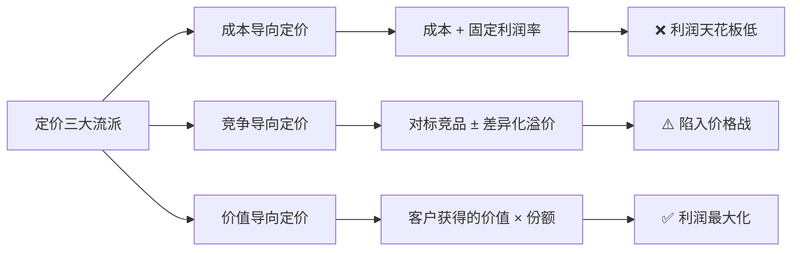
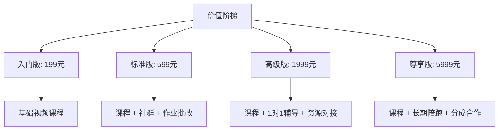
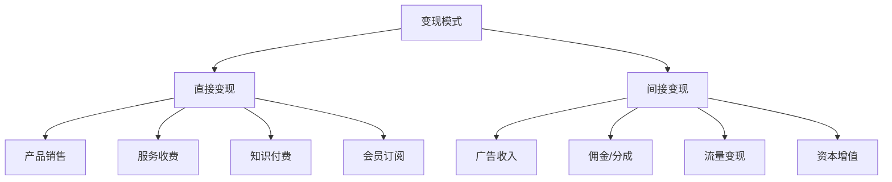
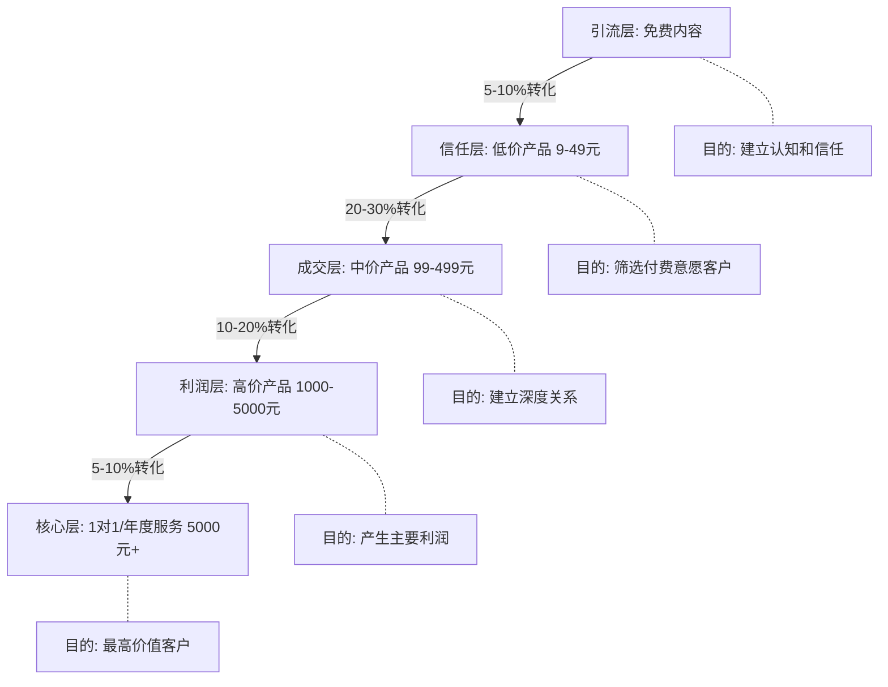
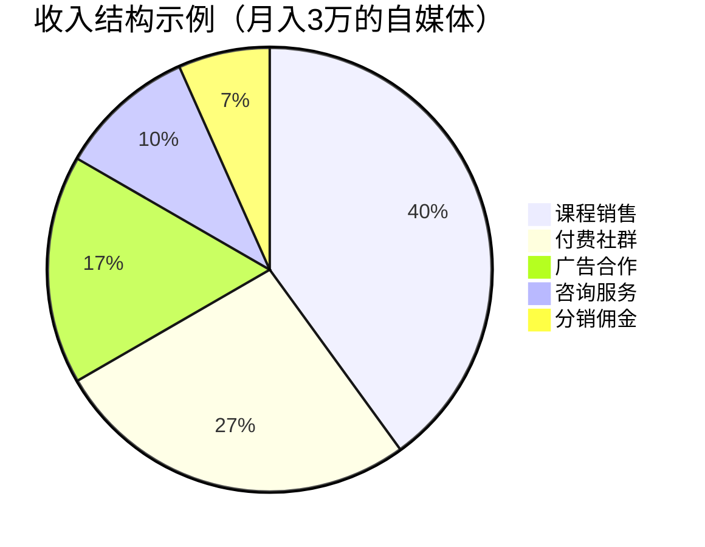
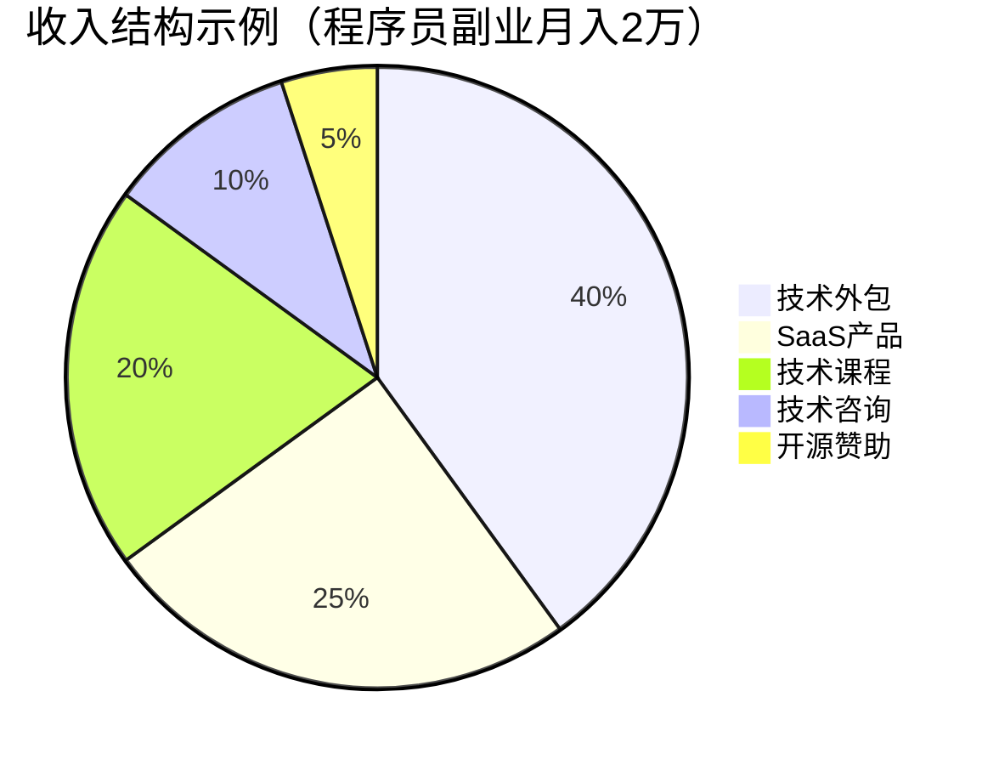
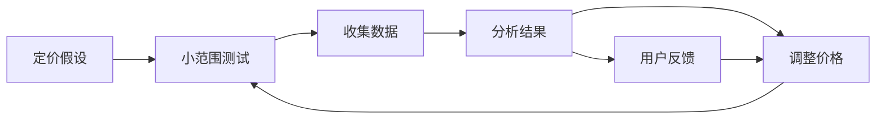

## 四、定价与变现

> "定价不是成本加利润的算术题，而是一场关于价值认知的心理博弈。定错价，要么亏钱，要么丢单；定对价，利润翻倍客户还觉得值。"

上一节我们解决了"客户从哪里来"的问题。有了客户，接下来最现实的问题就是：**怎么定价？怎么把流量和信任变成真金白银？** 定价与变现是创业和副业中最具杠杆效应的环节——同样的产品，定价策略不同，收入可能相差10倍。

举一个真实例子：一位设计师同时在两个平台出售几乎相同的 UI 模板包。在平台A上定价 29 元，月销 200 份，月收入 5,800 元。在平台B上重新包装后定价 199 元，月销 45 份，月收入 8,955 元。价格翻了近 7 倍，收入反而多了 54%。差别在哪？不是产品质量，而是定价策略和价值呈现方式。

本节将从底层逻辑到实操技巧，系统讲解如何科学定价、高效变现。

### 4.1 定价的底层逻辑

#### 4.1.1 价格的本质：价值感知的锚定

价格不是数字，是信号。消费者看到价格时，大脑做的是一个"值不值"的快速判断——这个判断基于三件事：

1. **参考价格**：他们见过的同类产品价格（锚定效应）
2. **感知价值**：他们认为这个产品能带来的好处
3. **支付能力**：他们的预算和消费意愿

| 因素 | 影响机制 | 举例 |
|------|----------|------|
| 锚定效应 | 第一个看到的价格成为判断基准 | 先展示9999元的套餐，再展示2999元的就显得便宜 |
| 价格-质量推断 | 消费者用价格反推质量 | 9.9元的课程 vs 999元的课程，后者天然被认为更专业 |
| 损失厌恶 | 失去的痛苦大于得到的快乐 | "不学这门课你每年多亏5万"比"学了能赚5万"更有说服力 |
| 心理账户 | 不同来源的钱有不同的消费阈值 | 年终奖更舍得花，工资精打细算 |

**核心公式：**

```text
成交价格 = 感知价值 × 信任系数 - 风险感知
```

当感知价值远大于价格时，成交是自然的。你的工作不是"降价到客户愿意付"，而是"提升价值感知让价格合理"。

**公式拆解：**

- **感知价值**：客户认为产品能带来的好处总和。包括功能价值（解决什么问题）、情感价值（带来什么感觉）、社会价值（身份认同）。知识付费产品中，情感价值和社会价值往往比功能价值更重要——学员买的不只是知识，还有"我在投资自己"的自我认同感。
- **信任系数**：0到1之间的数值。完全不信任 = 0，再便宜也不买；完全信任 = 1，按实际价值买单。品牌、口碑、案例、退款承诺都是提升信任系数的手段。
- **风险感知**：客户觉得买了之后可能损失什么。包括金钱风险（花冤枉钱）、时间风险（学了没用）、社交风险（被朋友嘲笑）。退款承诺、免费试用、社会证明都是降低风险感知的方法。

#### 4.1.2 定价的三大流派



| 流派 | 计算方式 | 优点 | 缺点 | 适用场景 |
|------|----------|------|------|----------|
| 成本导向 | 成本 × (1 + 加价率) | 简单明确，保底不亏 | 忽略需求弹性，利润上限低 | 实体商品、标准化服务 |
| 竞争导向 | 参考竞品 ± 调整 | 市场接受度高 | 容易陷入价格战，丧失定价权 | 红海市场、同质化产品 |
| 价值导向 | 客户感知价值 × 份额 | 利润最大化，建立品牌溢价 | 需要深入理解客户 | 知识付费、高端服务、SaaS |

**结论：对于创业和副业，90%的场景应该用价值导向定价。** 原因很简单：你的边际成本几乎为零（数字产品、服务、知识），用成本定价等于自废武功。

#### 4.1.3 三种定价流派的混合运用

实际操作中，纯粹使用某一种定价流派的情况很少。更常见的做法是以价值导向为主，用竞争导向做校准，用成本导向做底线：

```text
定价区间 = [成本底线, 价值上限]

成本底线 = 总成本 × 1.5（至少50%毛利）
价值上限 = 客户获得价值 × 30%（最多拿三成）
竞争参考 = 竞品价格中位数

最终价格 = 在成本底线和价值上限之间，参考竞争价格确定
```

这个方法确保你：（1）不亏钱（成本底线）；（2）不过度收费导致客户觉得被宰（价值上限）；（3）不脱离市场太远（竞争参考）。

### 4.2 六大定价模型详解

#### 4.2.1 成本加成定价

最基础的定价方式：算出成本，加上你想要的利润率。

```text
售价 = 直接成本 × (1 + 目标利润率)
```

**示例：** 你做了一门在线课程，录制设备500元，平台抽成20%，你的时间成本（假设20小时 × 100元/小时）= 2000元，总成本2500元。目标利润率200%。

```text
售价 = 2500 × (1 + 200%) = 7500元
```

**问题：** 这个定价完全忽略了市场需求。如果市场上同类课程只卖199元，你定7500元就是自嗨。

**适用场景：** 实体商品（需要控制利润率）、外包开发（按工时计费）、定制服务。

**实操模板：**

```markdown
## 成本核算清单
1. 直接成本：材料/工具/平台费/支付手续费
2. 时间成本：投入小时数 × 时薪（至少按市场价算）
3. 隐性成本：学习成本、试错成本、机会成本
4. 固定成本分摊：房租/设备/软件订阅（按月分摊到每个产品）
5. 营销成本：广告费/推广费/佣金
6. 售后成本：客服时间、退款损失、维护更新
```

**注意"隐性成本"：** 很多创业者只算直接成本，忽略了时间投入。一门课程你花了 100 小时制作，如果你的自由职业时薪是 200 元/小时，那时间成本就是 20,000 元——这是真实的机会成本，做课程的这 100 小时你本可以接外包赚 20,000 元。不把这个算进去，你可能在"赚钱"的幻觉中亏钱。

#### 4.2.2 竞争对标定价

看同行定多少，你定一个相近或略高的价格。

**操作步骤：**

1. 找到5-10个直接竞品
2. 整理他们的定价表（价格区间、套餐结构、包含内容）
3. 找出价格带集中区域（比如大部分人在199-399元之间）
4. 根据你的差异化程度决定位置

| 你的定位 | 价格策略 | 示例 |
|----------|----------|------|
| 入门级，快速获客 | 低于市场均价20-30% | 市场399元，你定299元 |
| 同等水平，直接竞争 | 持平或略低 | 市场399元，你定399元 |
| 差异化优势明显 | 高于市场均价20-50% | 市场399元，你定499-599元 |
| 高端品牌定位 | 高于市场均价100%+ | 市场399元，你定999元 |

**竞品调研模板：**

```markdown
| 竞品名称 | 价格 | 核心卖点 | 交付形式 | 客户评价 | 我的差异化 |
|----------|------|----------|----------|----------|-----------|
| A课程 | 299元 | 系统全面 | 视频+文档 | 4.2分 | 我有实战案例 |
| B课程 | 499元 | 名师授课 | 直播+社群 | 4.5分 | 我价格更低 |
| C课程 | 99元 | 入门速成 | 短视频 | 3.8分 | 我更深入 |
```

**竞品定价调研的实操方法：**

| 方法 | 操作 | 获取信息 |
|------|------|----------|
| 直接购买 | 购买竞品产品体验完整流程 | 产品内容、交付质量、售后流程 |
| 销售页面分析 | 截图并拆解竞品的销售页 | 价值呈现方式、定价结构、促销策略 |
| 客户评价 | 翻看评论区和社群反馈 | 客户真实痛点、对价格的敏感点 |
| 行业报告 | 查找行业分析和市场报告 | 整体价格带、增长趋势、用户画像 |
| 搜索引擎 | 搜索"XX课程多少钱""XX服务价格" | 用户对价格的预期和讨论 |

#### 4.2.3 价值定价（核心模型）

**这是定价的最高境界，也是利润最大化的关键。**

价值定价的核心思想：**客户买的不是你的产品，是产品带给他们的结果。价格应该基于结果的价值，而非你的成本。**

**价值定价四步法：**

**第一步：量化客户获得的价值**

问自己：客户使用我的产品/服务后，能多赚多少钱？省多少钱？避免多大损失？

```text
价值 = 客户多赚的钱 + 客户省的钱 + 客户避免的损失
```

**示例：** 你卖一门"短视频运营课"，学员学完后平均每月多赚3000元。那这门课的价值至少是 3000 × 12 = 36000元/年。你定3000元，客户花3000元换36000元的回报，12倍ROI——太值了。

**不同场景的价值量化方法：**

| 场景 | 价值量化公式 | 示例 |
|------|-------------|------|
| 帮客户赚钱 | 额外收入 × 时间跨度 | 学完课程月入多3000元 → 年价值3.6万 |
| 帮客户省钱 | 替代方案成本 - 产品价格 | 请顾问5万，课程1999元 → 省4.8万 |
| 帮客户省时间 | 节省小时数 × 时薪 | 省100小时 × 200元/时 → 价值2万 |
| 帮客户避风险 | 风险发生概率 × 损失金额 | 安全漏洞可能损失50万 → 即使10%概率也值5万 |
| 帮客户提升身份 | 无法精确量化，用案例代替 | "学完拿到XX认证，薪资涨30%" |

**第二步：确定价值分配比例**

行业惯例：你拿价值的10-30%，客户拿70-90%。

```text
定价 = 客户获得的总价值 × 分配比例（10-30%）
```

分配比例的确定取决于三个因素：

| 因素 | 倾向高比例（20-30%） | 倾向低比例（10-15%） |
|------|---------------------|---------------------|
| 价值确定性 | 效果明确可量化 | 效果因人而异 |
| 竞争程度 | 竞品少、替代方案少 | 竞品多、容易替代 |
| 品牌势能 | 知名度高、口碑好 | 刚起步、缺乏信任 |

**第三步：构建价值证明体系**

光说"值"不行，你需要证据：

- **结果案例**：学员/客户的真实成果数据，最好有截图、视频、第三方验证
- **对比算账**：不买你的产品，客户要花多少钱/时间才能达到同样效果
- **风险保障**：不满意退款、效果承诺，降低客户感知风险
- **社会证明**：购买人数、好评数量、知名客户背书
- **权威背书**：行业认证、媒体报道、专家推荐

**第四步：设置价格阶梯**

不同客户的支付能力和需求不同，提供多个选项：



**阶梯设计的核心逻辑：** 入门版让客户"进来"，标准版让你"赚钱"，高级版建立"深度关系"，尊享版是"利润炸弹"。每个阶梯不是简单地叠加功能，而是解决不同层级客户的核心需求——入门版客户要"知识"，标准版客户要"效果"，高级版客户要"个性化"，尊享版客户要"关系和资源"。

#### 4.2.4 订阅制定价

把一次性交易变成持续性收入。这是SaaS和内容创作者最偏爱的模型。

**订阅制的优势：**

| 维度 | 一次性销售 | 订阅制 |
|------|-----------|--------|
| 收入模式 | 不稳定，每次要重新获客 | 稳定现金流，可预测 |
| 客户关系 | 交易结束即断联 | 持续互动，深度绑定 |
| LTV（客户终身价值） | 单次购买金额 | 月费 × 平均订阅月数 |
| 心理门槛 | 一次性大额支付 | 小额持续支付，决策轻松 |
| 产品迭代 | 卖完即止，更新动力弱 | 持续付费倒逼持续优化 |

**订阅制定价策略：**

1. **免费增值（Freemium）**：基础功能免费，高级功能付费。适合工具类产品。转化率通常2-5%。免费用户比例控制在70-85%——太少则增长慢，太多则服务器成本失控。
2. **分层订阅**：不同价格对应不同功能/服务等级。常见三层结构（基础/专业/企业），中间层通常贡献60-70%的收入。
3. **按量计费**：按使用量收费（API调用次数、存储空间、用户数）。适合技术产品。设置最低消费门槛，避免管理大量微付费用户。
4. **会员制**：按月/年付费获取持续内容或服务。适合知识付费、社群。关键在于持续提供新鲜内容，否则续费率会断崖式下降。

**订阅制定价的关键指标：**

```text
月度经常性收入（MRR） = 付费用户数 × 平均月费
客户终身价值（LTV） = 月费 × 平均留存月数
LTV/CAC 比值 > 3 表示健康（CAC = 获客成本）
净收入留存率（NRR）= (期初MRR + 扩展收入 - 流失收入) / 期初MRR × 100%
```

**示例：** 一个付费社群定价99元/月，平均留存8个月，获客成本50元。

```text
LTV = 99 × 8 = 792元
LTV/CAC = 792 / 50 = 15.84 ✅ 非常健康
```

**订阅制的常见坑：**

| 坑 | 表现 | 解法 |
|----|------|------|
| 高开低走 | 首月大量订阅，3个月后断崖流失 | 每月制造"新鲜感"：新内容、新活动、新嘉宾 |
| 只看订阅数不看留存 | MRR看似增长但churn rate > 增长率 | 每周监控留存曲线，找到流失节点干预 |
| 年付锁定期过长 | 用户犹豫不敢买 | 提供"不满意随时退剩余月份"的年付方案 |
| 定价太低 | 9.9元/月导致用户不珍惜、不使用 | 社群类至少49元/月，让用户有"投资感" |

#### 4.2.5 阶梯式定价（套餐策略）

心理学中有个经典发现：**给客户三个选项，他们大多会选中间那个。** 这叫做"折中效应"（Compromise Effect），由诺贝尔经济学奖得主丹尼尔·卡尼曼的研究团队证实。人们在面对极端选项时会感到不安全，倾向于选择"中间路线"来规避风险。

**三套餐设计模板：**

| 套餐 | 价格 | 定位 | 包含内容 |
|------|------|------|----------|
| 基础版 | 199元 | 引流 | 核心功能/内容，满足基本需求 |
| 标准版 | 499元（推荐） | 利润主力 | 全部内容 + 社群 + 增值服务 |
| 高级版 | 1299元 | 锚定 | 1对1辅导 + 源码/素材 + 终身更新 |

**设计要点：**

- 基础版足够好用，但让你想要更多
- 标准版是"性价比最高"的感觉，引导选择
- 高级版的作用是锚定——让标准版看起来便宜
- 高级版要有"独家"内容，否则没人买
- 标准版和高级版的价差要大于基础版和标准版的价差（强化"标准版最划算"的感知）

**价格梯度的数学规律：**

研究表明，相邻套餐之间的价格比在 2-3 倍时，折中效应最明显。太接近（1.2倍）则锚定效果弱，太远（5倍以上）则客户觉得跳跃太大。

```text
基础版：199元
标准版：199 × 2.5 ≈ 499元 ✅
高级版：499 × 2.5 ≈ 1249元 → 取整1299元 ✅

错误示例：
基础版：199元
标准版：250元 ← 价差太小，没有锚定效果
高级版：10000元 ← 跳跃太大，锚定失真
```

#### 4.2.6 动态定价与促销策略

**动态定价不是乱涨价，是根据供需关系、时间、用户行为灵活调整价格。**

常用促销策略：

| 策略 | 操作方式 | 适用场景 | 注意事项 |
|------|----------|----------|----------|
| 早鸟价 | 提前购买享折扣 | 课程预售、新品上市 | 早鸟价是日后正常价的60-70% |
| 限时折扣 | 规定时间内降价 | 节日促销、清库存 | 必须有真实截止时间，否则失去信任 |
| 阶梯涨价 | 每卖出N份涨一次价 | 知识付费、限量服务 | "已涨价"本身就是营销素材 |
| 老客户优惠 | 续费/升级打折 | 订阅产品、系列课程 | 维护老客比获取新客便宜5-7倍 |
| 推荐奖励 | 推荐成功双方获益 | 社群、课程、SaaS | 奖励金额通常为客单价的10-20% |
| 捆绑销售 | 多个产品打包降价 | 产品线丰富时 | 捆绑价要明显低于单买总价 |

**阶梯涨价实操示例：**

```text
第一批：199元（前100人，制造紧迫感）
第二批：299元（101-500人，正常销售期）
第三批：399元（500人以后，长期价格）
每涨价一次，发朋友圈/社群公告"恭喜XX位同学，下一波涨价到XXX"
```

**促销节奏设计：** 全年无休的促销等于没有促销。健康的促销节奏：

| 时间 | 促销类型 | 折扣幅度 | 持续时间 |
|------|----------|----------|----------|
| 新品上市 | 早鸟价 | 正常价的60-70% | 7-14天 |
| 3月/9月 | 开学季/换季促销 | 正常价的80-85% | 7天 |
| 6月/11月 | 年中/年末大促 | 正常价的75-80% | 3-5天 |
| 日常 | 限时闪购 | 正常价的90% | 24小时 |

**促销的"理由"很重要：** 没有理由的降价让人怀疑产品质量。合理的理由包括：周年庆、学员突破XX人、产品重大升级、节日特惠、回馈老客户。给降价一个故事，客户更容易接受。

### 4.3 定价心理学：让客户觉得"值"

定价心理学是将行为经济学原理应用到实际定价中的学问。掌握这些原理，你可以在不改变产品质量的情况下，显著提升成交率和客单价。

#### 4.3.1 锚定效应

人脑在做决策时会依赖第一个接收到的信息作为参照点。这个原理由特沃斯基和卡尼曼在1974年的经典实验中证实。

**实操方法：**

1. **展示原价**：~~原价1999~~ 现价599元
2. **对比法**：请一个设计师做同样的东西要5000元，这个模板只要99元
3. **日均价格**：每天不到2元，比一杯奶茶还便宜
4. **锚定高价选项**：先展示最贵的套餐，让中间的看起来合理

**进阶用法——三重锚定：** 在销售页面上同时使用三个锚点：

```text
第一锚（行业锚）：行业培训平均收费 8000-15000元
第二锚（替代方案锚）：请顾问做同样事情需要 50000元
第三锚（自身锚）：~~原价 2999元~~，限时特惠 999元

三重锚定下来，999元感觉像捡了便宜
```

#### 4.3.2 诱饵效应（Decoy Effect）

诱饵效应是比折中效应更精细的心理学工具。当三个选项中，有一个"明显不如另一个"时，那个被压制的选项就成了"诱饵"，它的唯一作用就是让目标选项看起来更划算。

**经典案例——《经济学人》订阅实验：**

```text
选项A：电子版 59元
选项B：纸质版 125元
选项C：电子版 + 纸质版 125元

选项B就是诱饵。单独看，59元 vs 125元，很多人选A。
但有了B（125元只买纸质版），C（125元买两样）就显得太划算了。
结果：84%的人选C。
```

**实操应用：**

```text
基础版：视频课程 299元
高级版（诱饵）：视频课程 + 社群 699元 ← 让尊享版显得超值
尊享版：视频课程 + 社群 + 1对1辅导 799元 ✅ 推这个

逻辑：699元只有课程+社群，多花100元就能得到1对1辅导，当然选799。
```

**诱饵设计的三个条件：**

1. 诱饵选项和目标选项必须共享某些特征（比如都有社群）
2. 诱饵必须被目标选项"占优"（dominated）——即目标选项在各方面都更好或性价比更高
3. 诱饵不能太离谱——如果它明显不合理，客户会怀疑你的诚意

#### 4.3.3 价格尾数效应

| 尾数 | 心理暗示 | 适用场景 |
|------|----------|----------|
| 9 | "便宜"的感觉 | 大众消费品、促销 |
| 0 | "整数"的高级感 | 高端产品、B2B |
| 7 | 感觉经过精确计算 | 专业服务 |
| 8 | 吉利数字（中国市场） | 礼品、节日促销 |
| 5 | "半价"的暗示 | 中间档位产品 |

**定价数字选择：**

- 低价引流产品：9.9元、19.9元、49元
- 中端产品：199元、299元、365元
- 高端产品：999元、1999元、3699元
- 顶级产品：9999元、19800元

**尾数选择的底层逻辑：**

以"9"结尾的价格触发"左位效应"——大脑首先处理最左边的数字。199元被处理为"一百多"，而200元被处理为"两百"。虽然只差1元，心理感受却差了一个数量级。

以"0"结尾的价格传递"品质信号"——高端品牌（如苹果）的定价几乎从不使用 .99 结尾，因为整数价格暗示"我们不需要用价格技巧吸引你"。

实操建议：引流产品用 9 结尾（强调便宜），高端产品用 0 或整百/整千（强调品质），中间产品用 8 结尾（中国市场偏好）。

#### 4.3.4 拆解与打包

**同样的东西，拆开卖和打包卖，感知完全不同：**

```text
拆解卖（显得贵）：
- 视频课程 299元
- 社群服务 199元/年
- 模板素材 99元
- 1对1答疑 199元/次
总计：796元

打包卖（显得便宜）：
全套学习礼包 399元（价值796元，限时5折）
```

打包的关键是让客户看到"原价总和"和"打包价"的差距，制造"赚到了"的感觉。

**打包定价的高级技巧：**

1. **"锚定包"设计**：在打包中加入一个高价值但低成本的赠品（如独家模板、内部资料），让整个包的价值感飙升
2. **限时打包**：打包价只有特定时间有效，过期恢复单买价格
3. **等级打包**：根据打包数量给不同折扣——买2件9折，买3件8折，买全套6折
4. **隐藏打包**：不在公开页面展示打包价，而是在客户犹豫时"特别申请"——制造专属感

#### 4.3.5 免费试用与试看

降低决策风险的有效手段：

| 策略 | 操作 | 转化率 | 适用产品 |
|------|------|--------|----------|
| 免费试看 | 前3节免费，后续付费 | 8-15% | 视频课程、电子书 |
| 免费试用期 | 7天/14天免费使用 | 10-25% | SaaS工具、会员服务 |
| 部分功能免费 | 基础功能免费，高级付费 | 2-5% | 工具类产品 |
| 满意保障 | 7天无理由退款 | 提升20-40%下单率 | 高价课程、训练营 |
| 效果承诺 | 达不到效果全额退款 | 大幅提升信任，需有把握 | 高价值服务 |
| 样品体验 | 提供部分内容/功能的完整体验 | 12-20% | 模板、素材、工具 |

**退款承诺的精细化设计：**

不要简单地说"不满意就退款"——这会吸引"白嫖"用户。更好的做法是设置"有条件退款"：

```text
退款政策设计：
1. 7天内无理由退款（降低首次决策风险）
2. 30天内完课率超过80%仍未达效果，退款（展示对产品效果的信心）
3. 退款扣除已使用的1对1辅导费用（保护高成本服务）
```

#### 4.3.6 损失厌恶在定价中的应用

人们对"失去"的恐惧是"得到"的快乐的2-2.5倍（卡尼曼前景理论）。这意味着"不买会损失什么"比"买了能得到什么"更有说服力。

**实操话术转换：**

| 普通话术（强调获得） | 损失厌恶话术（强调损失） | 效果差异 |
|---------------------|------------------------|----------|
| "学了这门课你能多赚5万" | "不学这门课你每年少赚5万" | 后者转化率高30-50% |
| "买这个工具提高效率" | "你的团队每天浪费3小时在重复劳动" | 后者更容易行动 |
| "加入社群获得人脉" | "你正在错过这个行业最核心的信息圈子" | 后者紧迫感更强 |

**限时策略的本质也是损失厌恶：** "还剩最后20个名额"让客户担心的是"失去购买机会"，而不是"得到产品"。这是所有限时限量策略的心理学基础。

#### 4.3.7 社会认同与从众效应

当人们不确定时，会参考其他人的行为来做决策。

**在定价页面植入社会证明：**

| 社会证明类型 | 实现方式 | 效果 |
|-------------|----------|------|
| 购买人数 | "已有12,836人购买" | 降低决策不确定感 |
| 实时购买通知 | 弹窗"北京的张先生刚购买了..." | 制造"大家都在买"的感觉 |
| 用户评价 | 带头像和姓名的真实评价 | 提升信任感 |
| 专家推荐 | 行业KOL的推荐语和签名 | 权威背书 |
| 媒体报道 | "XX媒体专题报道" | 第三方验证 |
| 社群截图 | 社群活跃讨论的截图 | "加入一个活跃的圈子" |

### 4.4 变现模式全景图

定价解决了"收多少钱"，变现模式解决"通过什么方式收钱"。不同的变现模式决定了你的天花板和运营难度。

#### 4.4.1 八大变现模式对比



| 变现模式 | 收入上限 | 启动难度 | 运营复杂度 | 天花板 | 典型场景 |
|----------|----------|----------|-----------|--------|----------|
| 产品销售（实体） | 中 | 高 | 高（供应链/库存） | 受限于产能 | 电商、品牌 |
| 产品销售（数字） | 高 | 中 | 低 | 几乎无限 | 课程、模板、软件 |
| 服务收费 | 中高 | 低 | 中（受时间约束） | 受限于时间 | 咨询、设计、开发 |
| 知识付费 | 高 | 中 | 低 | 高 | 课程、训练营、电子书 |
| 会员订阅 | 高 | 中 | 中（持续产出） | 取决于留存 | 社群、内容平台 |
| 广告收入 | 低→高 | 低 | 低 | 受限于流量 | 自媒体、博客、播客 |
| 佣金/分成 | 中 | 低 | 低 | 取决于成交额 | 分销、CPS、联盟营销 |
| 资本增值 | 极高 | 高 | 高 | 取决于估值 | 创业公司、IP孵化 |

#### 4.4.2 变现漏斗设计

成功的变现不是单一动作，而是一个层层递进的漏斗。每一层的目的不同：



**各层级产品设计：**

| 层级 | 产品类型 | 价格区间 | 转化率 | 关键指标 |
|------|----------|----------|--------|----------|
| 引流层 | 公众号文章、短视频、免费PDF、直播 | 免费 | — | 阅读量/播放量/关注数 |
| 信任层 | 电子书、小课、工具模板、低价试用 | 9-49元 | 5-10% | 下单量、评价 |
| 成交层 | 系统课程、社群、标准化服务 | 99-499元 | 20-30% | 完课率、满意度 |
| 利润层 | 训练营、高端社群、定制方案 | 1000-5000元 | 10-20% | 续费率、转介绍率 |
| 核心层 | 1对1咨询、年度顾问、分成合作 | 5000元+ | 5-10% | LTV、合作深度 |

**关键洞察：** 引流层和信任层的目的不是赚钱，而是筛选和培养客户。真正的利润来自高价层。很多创业者的错误是只有一层（比如只卖课程），没有设计上升通道。

**漏斗的实际营收计算示例：**

```text
假设每月有 10,000 人看到你的免费内容：

引流层：10,000 粉丝（免费内容触达）
信任层：10,000 × 8% = 800 人购买低价产品，均价 29元 → 收入 23,200元
成交层：800 × 25% = 200 人购买中价产品，均价 299元 → 收入 59,800元
利润层：200 × 15% = 30 人购买高价产品，均价 2999元 → 收入 89,970元
核心层：30 × 8% ≈ 2-3 人购买顶级服务，均价 9999元 → 收入 24,998元

月总收入 ≈ 197,968元

关键：如果只有成交层（200人 × 299元），月收入只有 59,800元。
漏斗设计让收入翻了 3.3 倍。
```

#### 4.4.3 多元收入结构设计

不要依赖单一收入来源。健康的收入结构像一个投资组合——分散风险、互相补充。

**自媒体创作者的收入组合示例：**



**程序员副业的收入组合示例：**



**收入结构的健康度评估：**

| 指标 | 健康 | 警告 | 危险 |
|------|------|------|------|
| 单一收入占比 | <50% | 50-70% | >70% |
| 主动收入占比 | <60% | 60-80% | >80%（时间换钱） |
| 订阅/被动收入占比 | >30% | 15-30% | <15% |
| 最大客户收入占比 | <10% | 10-20% | >20%（大客户依赖） |

**理想收入结构演变路径：**

```text
阶段1（起步）：100% 主动收入（接单、服务）
   ↓
阶段2（发展）：60% 主动 + 40% 产品收入（课程、模板）
   ↓
阶段3（成熟）：30% 主动 + 40% 产品 + 30% 订阅收入
   ↓
阶段4（自由）：10% 主动 + 30% 产品 + 40% 订阅 + 20% 投资/被动
```

### 4.5 不同副业类型的定价实操

#### 4.5.1 知识付费产品定价

知识付费（课程、电子书、训练营）是最常见的副业变现方式，也是定价最容易出错的领域。

**课程定价参考表：**

| 课程类型 | 时长 | 定价区间 | 决定因素 |
|----------|------|----------|----------|
| 入门速成课 | 1-3小时 | 9-99元 | 引流工具，低门槛 |
| 系统课程 | 5-20小时 | 199-599元 | 核心产品，价值密度 |
| 深度训练营 | 4-8周 | 999-2999元 | 含互动、作业、反馈 |
| 大师班/工作坊 | 1-3天 | 2999-9999元 | 限时、稀缺、高互动 |
| 1对1辅导 | 按次/按月 | 500-5000元/次 | 个性化、排他性 |

**定价检查清单：**

1. 学完后学员能获得什么具体结果？（量化）
2. 达到同样结果，学员需要花多少钱和时间？（替代成本）
3. 市场上同类课程价格带是多少？（竞争参考）
4. 你的独特价值主张是什么？（差异化溢价）
5. 你的目标客群的支付能力如何？（受众画像）
6. 你的品牌势能支撑什么价位？（信任基础）

**常见错误：**

- ❌ 定价太低（9.9元卖系统课程）：吸引低质量用户，完课率低，赚不到钱
- ❌ 只有一个价位：没有梯度，无法满足不同层级客户需求
- ❌ 不敢涨价：品牌成长后应该同步提价
- ❌ 频繁大促：用户养成"等促销"的习惯，原价失去意义

**不同平台的定价差异：**

同一门课程在不同平台上可以定不同价格——这不矛盾，因为平台的用户画像、品牌调性、竞争环境都不同：

| 平台 | 价格策略 | 原因 |
|------|----------|------|
| 自有官网/小程序 | 最高价（原价） | 品牌信任最高，无平台抽成 |
| 小鹅通/千聊 | 原价或9折 | 知识付费垂直平台，用户付费意愿强 |
| 得到/知乎 | 原价的80-90% | 平台有品牌背书，但抽成较高 |
| 淘宝/拼多多 | 原价的50-70% | 价格敏感用户为主，需配合促销 |
| B站/抖音 | 免费或极低价引流 | 用免费内容导流到私域后高价转化 |

#### 4.5.2 咨询/服务定价

咨询和服务的定价核心是**按价值收费，不按时间收费**。

**从按小时到按价值的转变：**

```text
按小时：我工作10小时，时薪200元 = 收费2000元
按价值：我的方案帮你多赚10万，收你5000元（5%价值分成）
```

后者对客户来说更划算（花5000换10万），对你的收入也更高。

**咨询服务定价阶梯：**

| 服务类型 | 定价方式 | 参考价格 | 交付物 |
|----------|----------|----------|--------|
| 初次诊断 | 固定价 | 500-2000元 | 问题诊断报告 + 行动建议 |
| 方案设计 | 固定价/按项目 | 2000-10000元 | 详细方案 + 执行指南 |
| 陪跑执行 | 月费 | 3000-10000元/月 | 每周1-2次沟通 + 持续指导 |
| 战略顾问 | 年费 | 5万-20万/年 | 随时咨询 + 季度复盘 |

**溢价因素：** 有成功案例、有行业知名度、服务稀缺性高、客户紧急度高，都可以加价。

**处理价格异议的实操话术：**

当你报价后客户说"太贵了"，这通常不是真正的拒绝，而是需要更多信息。以下是逐层应对策略：

| 客户异议 | 应对策略 | 话术示例 |
|----------|----------|----------|
| "太贵了" | 拆解价值，回到ROI | "这5000元帮你省的试错成本和时间价值远超这个数字" |
| "别人更便宜" | 对比差异化价值 | "是的，那个课程更便宜但它没有XX和XX，你之前也试过类似方案效果如何？" |
| "我再考虑" | 制造紧迫感或降低门槛 | "完全理解。这周报名的话有早鸟价，下周恢复原价。也可以先买个基础版试试" |
| "能不能打折" | 不降价，但加赠品 | "价格没法降了，但我可以额外送你一次1对1诊断，价值1000元" |
| "预算不够" | 提供分期或低价替代 | "可以分3期，每期xxx元。或者先看我的入门课程，才199元" |
| "我需要和XX商量" | 提供决策支持材料 | "我给你整理一份简要的方案摘要和预期收益分析，方便你和团队讨论" |

**关键原则：** 永远不要第一时间降价。降价传递的信号是"你之前的报价有水分"，会严重损害信任。如果确实需要让步，用"加赠品"代替"减价格"——成本更低，但感知价值更高。

#### 4.5.3 数字产品定价

数字产品（模板、工具、素材、插件）的边际成本几乎为零，定价空间大。

**定价策略：**

- **模板/素材包**：19-99元（一次性购买）
- **效率工具/插件**：49-299元（一次性或订阅）
- **设计系统/UI Kit**：99-499元
- **行业报告/数据包**：199-999元
- **源码/脚本**：29-199元

**提高客单价的技巧：**

1. **捆绑销售**：单个模板39元，全套打包199元（原价585元）
2. **分版本**：个人版49元，团队版149元，企业版499元
3. **增值服务**：基础产品 + 安装服务/定制化/技术支持
4. **更新订阅**：一次性购买 + 年费更新（软件行业标准做法）

**数字产品的"版本定价"策略：**

```text
个人版：49元
  - 个人使用授权
  - 基础文档
  
团队版：149元（3倍价格）
  - 5人团队授权
  - 源文件 + 可编辑格式
  - 优先技术支持

企业版：499元（10倍价格）
  - 无限团队授权
  - 源文件 + 定制化
  - 专属技术支持
  - 发票 + 合同
```

关键：个人版已经"够用"了，但团队版和企业版的存在让个人版显得便宜。而真正的大客户会直接买企业版——对他们来说，499元和49元没有本质区别。

#### 4.5.4 社群/会员定价

**社群定价的核心公式：**

```text
月费 = (社群提供的资源价值 + 社交价值 + 独家机会价值) × 0.1 ~ 0.3
```

**不同规模社群的定价参考：**

| 社群类型 | 人数 | 定价 | 核心价值 |
|----------|------|------|----------|
| 信息分享群 | 100-500 | 99-199元/年 | 资源聚合、信息差 |
| 学习交流群 | 50-200 | 299-999元/年 | 系统学习、互助成长 |
| 高端人脉群 | 20-50 | 1999-9999元/年 | 精准人脉、资源对接 |
| 行业圈子 | 10-30 | 5000-20000元/年 | 信息壁垒、独家机会 |

**定价心理学技巧：**

- 年费比月费×12便宜15-20%（鼓励长期承诺）
- 设置"推荐返现"（老成员推荐新成员，双方各减100元）
- 定期涨价（每新增100人涨价一次，早加入更划算）

**社群定价的"价值递增"设计：**

好的社群不是"买了就完了"，而是价值随时间递增的：

```text
第1个月：加入即得的资源包（模板、文档、录播课程）
第2-3个月：每周直播答疑 + 作业批改
第4-6个月：行业报告 + 独家嘉宾分享
第7-12个月：资源对接 + 合作机会 + 线下活动

价值递增 → 续费率提升 → LTV提升
```

### 4.6 定价实验与优化

#### 4.6.1 A/B测试定价

不要凭感觉定价，要用数据说话。

**A/B测试步骤：**

1. 准备两个或多个价格版本
2. 随机分配给不同用户群
3. 追踪关键指标：转化率、客单价、总营收
4. 运行足够长的时间（至少1-2周）
5. 选择总营收最高的方案

**关键指标公式：**

```text
总营收 = 流量 × 转化率 × 客单价

示例：
价格A（199元）：转化率8%，总营收 = 1000 × 8% × 199 = 15,920元
价格B（299元）：转化率5%，总营收 = 1000 × 5% × 299 = 14,950元
价格C（399元）：转化率3%，总营收 = 1000 × 3% × 399 = 11,970元

结论：选价格A（199元），总营收最高
```

**注意：** 如果价格B虽然总营收略低，但客单价高、客户质量好、退款率低，长期来看可能更好。要综合评估。

**A/B测试的进阶指标体系：**

| 指标 | 计算方式 | 为什么重要 |
|------|----------|-----------|
| 首次购买转化率 | 购买人数 / 访问人数 | 衡量价格的即时接受度 |
| 客单价 | 总收入 / 付费人数 | 衡量单个客户贡献 |
| 退款率 | 退款数 / 购买数 | 价格越高退款率可能越高 |
| 7日复访率 | 7天内再次访问的比例 | 反映用户对产品的兴趣持续度 |
| LTV预估 | 客单价 × 预估复购次数 | 最终衡量指标 |
| 毛利润 | 总收入 - 总成本 - 退款 | 真正的盈利指标 |

**A/B测试的常见陷阱：**

| 陷阱 | 表现 | 正确做法 |
|------|------|----------|
| 样本量不够 | 50个人就下结论 | 至少每组200+样本，大品类1000+ |
| 测试时间太短 | 3天就出结果 | 至少1-2周，覆盖工作日和周末 |
| 只看转化率 | 转化率高但客单价低 | 以总营收（流量×转化率×客单价）为准 |
| 同时改多个变量 | 价格和页面同时改 | 每次只改价格一个变量 |
| 忽略长期指标 | 首月数据好看但复购差 | 至少追踪30-90天的用户行为 |

**A/B测试实操工具推荐：**

| 工具 | 适用场景 | 成本 |
|------|----------|------|
| Google Optimize | 独立网站/落地页 | 免费 |
| 小鹅通/有赞后台 | 知识付费平台内 | 平台内置 |
| 腾讯问卷+手动分组 | 低成本快速测试 | 免费 |
| 自建落地页+统计 | 精细化控制 | 技术成本 |

#### 4.6.2 定价迭代周期



**迭代节奏建议：**

- 新产品：每2周评估一次定价效果
- 稳定产品：每月复盘一次价格策略
- 成熟产品：每季度评估是否需要调价
- 重大调整：涨价前先测试小幅度（5-10%）

**定价迭代的决策矩阵：**

```text
如果转化率下降但客单价上升：
  → 计算总营收，如果总营收增加则保持
  → 如果总营收下降，考虑中间价格

如果转化率上升但客单价下降：
  → 短期可行（快速获客），但长期不可持续
  → 逐步提价筛选高质量客户

如果转化率和客单价都下降：
  → 产品或营销出了问题，不只是价格问题
  → 回头检查价值呈现和目标人群

如果转化率和客单价都上升：
  → 继续提价，直到找到平衡点
```

#### 4.6.3 涨价的艺术

涨价是好事——说明你的价值在增长。但涨价需要技巧：

**涨价前的准备：**

1. 积累足够的成功案例和好评（涨价的理由）
2. 提前1-2周预告涨价（制造紧迫感）
3. 给老客户续费窗口（感恩回馈）
4. 同步提升产品/服务质量（涨价涨的是价值）

**涨价幅度参考：**

| 场景 | 建议涨幅 | 说明 |
|------|----------|------|
| 常规涨价 | 10-20% | 每年一次，跟通胀和品牌成长同步 |
| 重大升级 | 30-50% | 产品有质的飞跃时 |
| 品牌升级 | 50-100% | 从"平价"转向"高端"定位 |
| 限时涨价 | 20-50% | 阶梯涨价策略，每N人涨一次 |

**涨价的"软着陆"策略：**

直接涨价容易引发老客户不满。以下方法可以让涨价更平滑：

| 策略 | 操作 | 效果 |
|------|------|------|
| 老客户锁价 | 老客户续费保持原价1年 | 减少流失，体现尊重 |
| 涨价+升级 | 涨价的同时增加新内容/功能 | 让涨价"有理有据" |
| 涨价预告 | 提前2周宣布涨价日期 | 制造紧迫感，提前收割一波 |
| 分批涨价 | 先涨10%，观察1个月，再涨10% | 降低单次冲击 |
| 新产品替代 | 推出"升级版"产品定高价，老产品维持 | 渐进式过渡 |

### 4.7 变现效率优化

#### 4.7.1 提高转化率的核心方法

| 优化方向 | 具体方法 | 预期效果 |
|----------|----------|----------|
| 信任建设 | 真实案例、数据背书、名人推荐 | 转化率提升20-50% |
| 降低门槛 | 免费试用、分期付款、小额体验品 | 转化率提升30-60% |
| 制造紧迫 | 限时限量、阶梯涨价、名额限制 | 短期转化率提升50-100% |
| 优化详情页 | 痛点切入、价值量化、FAQ解答 | 转化率提升15-30% |
| 社会证明 | 学员评价、购买人数、专家背书 | 转化率提升20-40% |

**销售页面的定价呈现优化：**

销售页面上价格出现的位置、大小、颜色都会影响转化率：

| 优化点 | 错误做法 | 正确做法 |
|--------|----------|----------|
| 价格位置 | 页面最顶部就显示价格 | 先展示价值、案例、好处，最后展示价格 |
| 价格大小 | 价格用最大字号突出 | 价格用适中字号，"推荐"标签用醒目颜色 |
| 价格旁边 | 价格孤零零放着 | 旁边放"原价XXX"或"价值XXX"做对比 |
| 支付按钮 | "立即购买" | "立即开始赚回学费"或"马上锁定优惠价" |
| 价格下方 | 什么都没有 | 加一行"每天不到X元"或"X人已购买" |

#### 4.7.2 提高客单价的五种方法

1. **向上销售（Upsell）**：客户买了A，推荐更高级的B。"你已购买基础版，升级专业版立减100元"
2. **交叉销售（Cross-sell）**：买了A的客户，推荐相关产品B。"购买课程的用户还买了XX模板"
3. **捆绑销售**：多个产品打包优惠价
4. **增值服务**：在基础产品上叠加安装、定制、培训等服务
5. **阶梯定价**：提供多档选择，用高价锚定推高中间档选择率

**向上销售的最佳时机：**

| 时机 | 操作 | 转化率 |
|------|------|--------|
| 购买确认页 | "再加XX元即可升级" | 15-25% |
| 首次使用后 | "你已用完基础功能，解锁更多" | 10-20% |
| 使用满一周 | "基于你的使用情况，推荐XX" | 8-15% |
| 续费时 | "续费升级享XX折" | 20-35% |
| 特定行为触发 | 达到用量上限、使用高级功能时 | 12-18% |

#### 4.7.3 提高复购率的关键动作

```text
复购 = 满意度 × 需求延续 × 触达频率
```

- **超预期交付**：承诺10分，交付12分
- **建立习惯**：每日/每周固定触达（日报、周报、提醒）
- **产品生态**：设计产品矩阵，让一个客户购买多个产品
- **会员体系**：积分、等级、专属权益
- **定期回访**：购买后7天、30天、90天回访

**复购率提升的"3-7-30"法则：**

```text
购买后3天：发送"快速入门指南"，确保客户开始使用
购买后7天：发送"进阶技巧"，提升使用深度
购买后30天：发送"成果回顾"，展示使用效果 + 推荐关联产品
购买后90天：发送"升级邀请"，推送更高级产品
```

每一步都是为了一个目的：让客户觉得"上次买得值"，从而愿意再次购买。

### 4.8 收款与支付系统

#### 4.8.1 国内主流收款方式对比

| 平台 | 手续费 | 适合场景 | 结算周期 |
|------|--------|----------|----------|
| 微信支付 | 0.6% | 微信生态内的课程、社群 | T+1 |
| 支付宝 | 0.6% | 淘宝/独立站商品 | T+1 |
| 小鹅通 | 平台抽成1-5% | 知识付费课程 | T+7 |
| 知识星球 | 平台抽成5% | 付费社群 | T+30 |
| 有赞 | 基础版免费，高级版年费 | 电商、分销 | T+1 |
| Stripe（海外） | 2.9% + 0.3美元 | 海外客户、SaaS | T+7 |
| PayPal（海外） | 3.49% + 固定费用 | 海外个人客户 | 即时到PayPal余额 |
| Paddle（海外） | 5% + 0.5美元 | 海外SaaS（含税务处理） | 月结 |

**选择收款方式的决策流程：**

```text
1. 客户在哪里？
   - 国内 → 微信支付/支付宝（必须支持）
   - 海外 → Stripe 或 Paddle
   
2. 卖什么产品？
   - 课程/社群 → 小鹅通/知识星球（自带支付）
   - 实体商品 → 有赞/微店
   - SaaS/数字产品 → Stripe + 自建系统
   
3. 需要什么功能？
   - 分销/分销员体系 → 有赞/小鹅通
   - 自动续费 → Stripe/支付宝自动扣款
   - 多币种 → Stripe/Paddle
```

#### 4.8.2 定价与支付的配合

- **小额产品（<100元）**：直接扫码支付或平台内支付，减少摩擦
- **中额产品（100-1000元）**：支持花呗/信用卡分期，降低心理门槛
- **大额产品（>1000元）**：提供分期方案（3期/6期/12期），大幅降低决策门槛
- **年度订阅**：年费比月费×12便宜15-20%，鼓励一次性支付

**分期付款的定价设计：**

```text
总价 2999元 的训练营：

方案1：全款 2999元（优惠200元，实付2799元）
方案2：3期免息，每期 999元
方案3：6期，每期 499元 + 100元手续费

技巧：
- 全款优惠给"一次付清"的客户，加速回款
- 3期免息降低决策门槛，但总额不变
- 6期加手续费，用"每月只要499"的话术弱化总价感知
```

#### 4.8.3 海外收款注意事项

如果你的产品面向海外客户，需要注意：

| 注意事项 | 说明 |
|----------|------|
| 税务合规 | 欧盟VAT、美国各州销售税需要代扣代缴 |
| 货币选择 | 定价用美元/欧元为主，支持本地货币显示 |
| 支付方式 | 欧洲客户偏好SEPA转账，日本偏好便利店支付 |
| 退款政策 | 海外消费者的退款期望更强，7-30天退款窗口是标配 |
| 发票 | B2B客户一定需要发票/Receipt |
| 合规工具 | 用Paddle/LemonSqueezy做Merchant of Record，自动处理全球税务 |

### 4.9 定价合规与法律风险

#### 4.9.1 中国《价格法》核心条款

副业和创业定价必须遵守《中华人民共和国价格法》。以下是关键合规要求：

| 条款 | 要求 | 违规后果 |
|------|------|----------|
| 明码标价 | 所有商品/服务必须明确标示价格 | 罚款5000元以下 |
| 禁止价格欺诈 | 不得虚构原价、虚假折扣 | 罚款违法所得5倍以下 |
| 禁止串通定价 | 不得与竞争对手约定价格 | 罚款100万-1000万元 |
| 禁止低价倾销 | 不得以低于成本价排挤对手 | 罚款违法所得5倍以下 |
| 价格歧视 | 不得对同等交易条件的客户差别定价 | 一般不违法，但需注意公平性 |

**"虚构原价"的法律定义：**

很多创业者不知道，"原价"在法律上有严格定义——指本次促销前7天内，在同一交易场所有交易票据的最低交易价格。如果你从来没有以1999元卖过产品，就不能写"~~原价1999~~，现价599"。

```text
合规的促销写法：
✅ "限时特惠599元" （不提原价）
✅ "价值1999元的课程内容，特惠599元"（用"价值"代替"原价"）
✅ "前7天销售价799元，限时599元"（原价有真实交易记录）

违规的促销写法：
❌ "原价1999，现价599"（从未以1999元成交过）
❌ "全网最低价"（无法证明）
❌ "仅剩最后10个名额"（实际还剩1000个）
```

#### 4.9.2 退款政策合规

根据《消费者权益保护法》，线上销售的商品（包括数字产品）消费者有权在7天内无理由退货。但以下情况例外：

- 消费者定制的商品
- 在线下载的数字商品（已下载/已观看视为消费）
- 交付的报纸、期刊

**实操建议：** 即使法律允许不退款（数字内容已消费），主动提供退款承诺仍然有利于转化率。建议提供"7天内未学习超过20%内容可退款"的政策——既保护自己，又降低客户风险感知。

#### 4.9.3 税务合规

| 收入类型 | 税种 | 税率 | 说明 |
|----------|------|------|------|
| 个人劳务报酬 | 个人所得税 | 20-40% | 单次收入超过800元起征 |
| 个体工商户 | 增值税+个税 | 1-3%增值税，5-35%个税 | 月收入10万以下免增值税 |
| 公司收入 | 增值税+企业所得税 | 1-13%增值税，25%企业所得税 | 小规模纳税人1%增值税 |
| 海外收入 | 视身份而定 | — | 需要咨询专业税务师 |

**实操建议：** 副业收入超过每月10万元时，建议注册个体工商户或公司，可以合法降低税负。年收入低于10万元的个人副业，通过个人所得税APP自行申报即可。

### 4.10 常见定价误区与纠正

| 误区 | 为什么是错的 | 正确做法 |
|------|-------------|----------|
| "越便宜越好卖" | 低价吸引低质量客户，利润薄，无法投入产品优化 | 价值定价，让客户觉得"值"而非"便宜" |
| "先免费再收费" | 免费用户很难转化为付费用户，且免费拉低品牌价值 | 入门低价（如9.9元），但不免费 |
| "别人卖多少我卖多少" | 忽略了你的差异化价值和目标客群差异 | 以竞品为参考，但以自身价值为核心定价依据 |
| "定了价就不改了" | 市场在变、产品在变、品牌在变，价格也要变 | 定期评估，小步快跑式调价 |
| "只有一个价格" | 不同客户支付能力不同，单一价格错过大量潜在客户 | 至少3个价格梯度 |
| "折扣越多越好" | 频繁打折损害品牌价值，用户习惯等促销 | 促销要有节奏，有理由，有时间限制 |
| "只看客单价" | 忽略了转化率、复购率、LTV等综合指标 | 以总利润和LTV为核心衡量指标 |
| "按心情定价" | 随意定价导致价格混乱，客户不信任 | 建立定价体系，所有产品价格有逻辑关系 |
| "免费内容给太多" | 客户免费就能满足，没有付费动力 | 免费给"是什么"和"为什么"，收费给"怎么做" |
| "高端=高价" | 只涨价不提升品质和体验，客户觉得被宰 | 高端定价需要高端品质、服务、品牌同步支撑 |

### 4.11 定价工具与资源

| 工具 | 用途 | 说明 |
|------|------|------|
| Excel/Google Sheets | 定价模型计算 | 成本核算、利润模拟、A/B测试分析 |
| Hotjar/百度统计 | 用户行为分析 | 看用户在价格页面的停留和流失 |
| Stripe/微信支付 | 支付处理 | 支持多种支付方式和分期 |
| 小鹅通/知识星球 | 知识付费平台 | 自带定价和支付系统 |
| Typeform/问卷星 | 定价调研 | 了解用户支付意愿（Van Westendorp法） |
| ProfitWell | SaaS指标监控 | MRR、LTV、流失率等关键指标 |

**Van Westendorp 定价敏感度测试法：**

向目标用户问四个问题：
1. 什么价格你觉得太便宜，质量可能有问题？（太便宜阈值）
2. 什么价格你觉得很划算？（便宜阈值）
3. 什么价格你觉得有点贵但可以接受？（贵阈值）
4. 什么价格你觉得太贵了，绝对不会买？（太贵阈值）

收集足够样本后，画出四条曲线，交叉点就是最优价格区间。

**Van Westendorp 实操示例：**

假设你做了一个问卷调查，收到 200 份有效回答，统计结果如下：

```text
太便宜阈值（低于此价觉得有猫腻）：50元
便宜阈值（觉得划算的价格）：99元
贵阈值（有点贵但可接受）：299元
太贵阈值（绝对不会买）：599元

最优价格区间：99-299元
建议定价：199元（便宜阈值和贵阈值的中点）
```

注意：样本量至少需要 100 份以上才有统计意义。目标用户必须是你的实际客户画像，而不是随机人群。

### 4.12 本节行动清单

1. **立即做**：用价值定价四步法重新评估你当前产品的定价
2. **本周做**：设计3档价格阶梯，覆盖不同客户层级
3. **本月做**：搭建变现漏斗（引流→信任→成交→利润→核心五层）
4. **持续做**：每2周追踪转化率和客单价，每月做一次定价复盘

**记住：定价是一门实践科学，不是一次性的决定。最好的定价策略来自持续的测试、学习和优化。**

**定价自检表（每季度回顾一次）：**

```text
□ 我的产品是否使用了价值导向定价？（而非成本或竞争导向）
□ 我是否有至少3个价格梯度？（基础/标准/高级）
□ 我的变现漏斗是否完整？（5层漏斗至少覆盖3层）
□ 我是否做过A/B测试？（而非拍脑袋定价）
□ 我的价格是否在6个月内调整过？（太长不调=落后于市场）
□ 我的收入结构是否多元？（单一收入<50%）
□ 我的退款率是否在5%以下？（超过说明定价或产品有问题）
□ 我的促销是否有节奏？（而非全年打折）
□ 我是否合规？（明码标价、无虚假折扣、税务申报）
□ 我是否处理好了价格异议？（有标准话术和应对流程）
```
