## 五、副业选择框架

> "选对赛道，比努力奔跑重要100倍。一个时薪200元的副业，做10小时抵得上一个时薪20元的副业做100小时。副业选择的本质，是把你有限的时间和精力，配置到回报率最高的方向上。"

前面四节讲了"怎么发现机会、怎么获客、怎么定价"——这些都是"术"的层面。但在你动手之前，有一个更根本的决策要做：**选什么类型的副业？** 选错了方向，再强的执行力也只是在错误的路上越跑越远。本节提供一套系统化的副业选择框架，帮你从自身条件出发，找到最适合自己的副业方向。

### 5.1 副业选择的底层逻辑

#### 5.1.1 为什么需要框架而不是"跟着感觉走"

大多数人选副业的方式是：看到别人做什么赚钱，就跟风去做。这种方式有四个致命陷阱：

| 陷阱 | 机制说明 | 真实后果 |
|------|----------|----------|
| **幸存者偏差** | 你看到的成功案例是幸存者，大量失败者没有发声。某平台"月入10万"的案例背后，可能是1000个尝试者中唯一的成功者 | 高估成功率，低估难度，盲目入场 |
| **能力错配** | 别人的优势（资源、技能、人脉、时机）和你完全不同。同一个赛道，有行业资源的人和从零开始的人，成功率相差数十倍 | 照搬别人的路径，发现自己走不通 |
| **时机错位** | 你入场时市场可能已经进入红海。2020年做短视频和2025年做短视频，难度完全不同 | 用过时的成功经验做今天的决策 |
| **兴趣缺失** | 没有内在动力，遇到困难容易放弃。副业的前3-6个月几乎看不到回报，没有热情撑不过去 | 浪费3个月后放弃，又重新选方向 |

**一个真实的对比：**

小A看到朋友做小红书探店月入8000，于是也去做。结果发现：朋友本身是美食博主，有5000粉丝基础，和多家餐厅有合作关系。小A从零开始，发了30条笔记，粉丝不到200，一单合作都没接到，3个月后放弃。

如果小A用框架来选择，他会先评估自己的优势——他是程序员，擅长自动化和数据分析。最终他做了一个"用AI批量生成数据分析报告"的副业，第一个月就赚了3000元，因为他选择的是**能力匹配+市场需求**的方向。

#### 5.1.2 副业选择的三圈模型

最有效的副业选择方法，是找到三个圈的交集：

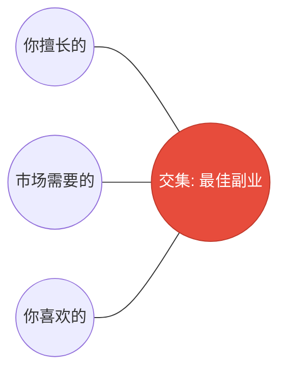

- **你擅长的**：已有技能、经验积累、天赋优势、可调动的资源（人脉、设备、资金）
- **市场需要的**：有人愿意为此付费、需求真实存在、且需求在增长
- **你喜欢的**：能长期坚持、不会因为困难就放弃、做的过程本身有满足感

**交集的优先级排序：**

| 组合 | 为什么这个优先级 | 典型场景 |
|------|------------------|----------|
| **擅长 + 需要（不喜欢）** | 能快速变现，用结果驱动兴趣。很多成功的副业者最初并不是因为"热爱"才开始的，而是因为"擅长+能赚钱"，做出成果后才产生兴趣 | 程序员接外包、财务人员做代理记账 |
| **需要 + 喜欢（不擅长）** | 市场有需求、你有热情，但需要学习期。这个组合的关键是评估学习成本——如果3-6个月能达到"能交付"的水平，就值得投入 | 喜欢摄影的人学商业摄影 |
| **擅长 + 喜欢（不需要）** | 做起来很爽但赚不到钱。这适合做爱好，不适合做副业。除非你能找到将这个能力商业化的新场景 | 喜欢写诗的人很难靠写诗赚钱，但如果做"诗词鉴赏课"就有可能 |

**关键判断**：如果三个圈只满足一个，基本不值得做。满足两个，可以尝试。三个都满足，全力投入。

**技能叠加策略（Skill Stacking）**：如果单个技能不够突出，可以组合多个"中等水平"的技能，形成独特竞争力。这是普通人最实用的竞争策略：

| 单技能 | 竞争激烈度 | 叠加技能组合 | 竞争激烈度 | 市场价值 |
|--------|-----------|-------------|-----------|----------|
| 会写作 | 极高（百万级竞争者） | 写作 + 医疗行业知识 | 低 | 医疗健康内容创作，时薪300-800元 |
| 会编程 | 高（数十万竞争者） | 编程 + 法律知识 | 低 | 法律科技工具开发，时薪500-1500元 |
| 会设计 | 高 | 设计 + 心理学 | 低 | 用户体验设计咨询，时薪400-1000元 |
| 会英语 | 极高 | 英语 + 芯片行业经验 | 极低 | 半导体技术文档翻译，千字300-600元 |

> **核心洞察**：在任何一个单一技能领域做到前1%极其困难，但把两个技能都做到前25%的组合，远比想象中容易——而且这种组合在市场上几乎没有竞争对手。

#### 5.1.3 副业的"道"：时间杠杆原理

副业的本质是**用有限的时间创造最大的价值**。理解这个原理，才能做出正确的选择：

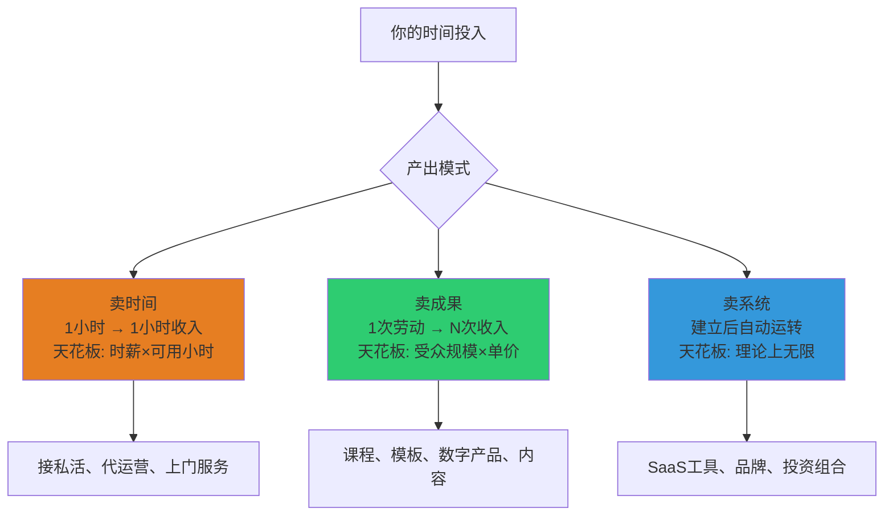

**三种模式的核心区别**：

| 模式 | 时间投入 | 收入特征 | 启动难度 | 天花板 |
|------|----------|----------|----------|--------|
| 卖时间 | 持续投入 | 线性增长，停手停收入 | 最低 | 低（受限于可用时间） |
| 卖成果 | 一次投入 | 复利增长，可积累 | 中 | 中高（受限于受众规模） |
| 卖系统 | 前期重投入 | 指数增长，可被动化 | 高 | 极高（受限于市场规模） |

**最优路径**：先用"卖时间"快速赚到第一桶金并验证方向 → 逐步将重复性工作"产品化"为"卖成果" → 最终构建"卖系统"实现被动收入。不要跳过第一阶段直接做第三阶段，因为没有前期的客户洞察和行业理解，你不知道该建什么系统。

### 5.2 副业选择决策矩阵

#### 5.2.1 核心评估维度

选择副业时，最关键的两个量化维度是**启动成本**和**收入上限**：

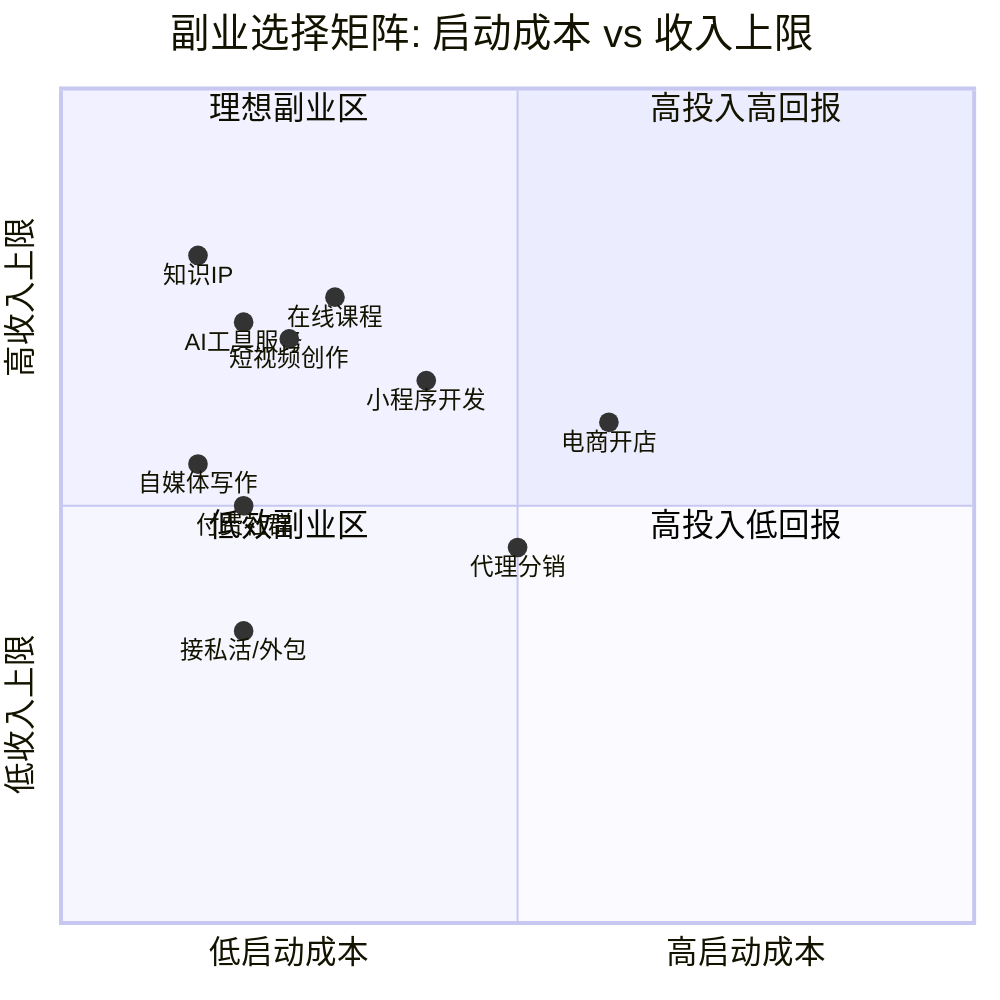

**四象限解读：**

| 象限 | 特征 | 代表副业 | 建议 |
|------|------|----------|------|
| 右上：高投入高回报 | 需要资金或大量时间投入，但收入上限高 | 电商开店、小程序开发 | 有积蓄且愿意承担风险的人 |
| **左上：理想副业区** | **低成本启动，收入上限高** | **自媒体、在线课程、AI工具服务、知识IP** | **大多数人首选** |
| 左下：低效副业区 | 启动成本低但收入也低 | 纯体力兼职、简单代购 | 只适合短期过渡 |
| 右下：高投入低回报 | 投入大但回报有限 | 传统代理分销、重资产项目 | 一般不推荐 |

> **核心原则**：优先选择"左上象限"——低启动成本、中高收入上限的副业。这类副业失败代价极低（最多损失时间），但一旦成功可以建立被动收入。避免一开始就投入大量资金做电商或代理，先用低成本方式验证方向。

#### 5.2.2 完整评估清单（含量化模板）

在做最终决定前，用这个清单逐项打分（1-5分）。以下是一个**可直接使用的评分模板**：

| 评估维度 | 评估问题 | 权重 | 候选A得分 | 候选B得分 | 候选C得分 |
|----------|----------|------|-----------|-----------|-----------|
| 技能匹配度 | 我现有的能力能直接用上吗？不需要额外学习就能开始吗？ | ×3 | ___ | ___ | ___ |
| 学习曲线 | 从零到能赚钱需要多久？1周/1月/3月/半年/1年？ | ×3 | ___ | ___ | ___ |
| 启动成本 | 需要投入多少钱才能开始？0/几百/几千/几万？ | ×2 | ___ | ___ | ___ |
| 时间灵活性 | 能否在主业之余灵活安排？能否利用碎片时间？ | ×3 | ___ | ___ | ___ |
| 收入上限 | 做到极致能赚多少？月入5000/1万/5万/10万+？ | ×2 | ___ | ___ | ___ |
| 收入稳定性 | 收入是否可持续、可预期？是波动型还是稳定型？ | ×2 | ___ | ___ | ___ |
| 被动收入潜力 | 能否建立"睡后收入"？停手后收入能持续多久？ | ×3 | ___ | ___ | ___ |
| 竞争壁垒 | 别人容易复制吗？我有什么独特优势？ | ×2 | ___ | ___ | ___ |
| 退出成本 | 如果做不下去，损失多大？能否全身而退？ | ×1 | ___ | ___ | ___ |
| 成长性 | 这个方向未来3-5年还有机会吗？是在上升还是衰退？ | ×2 | ___ | ___ | ___ |

**评分标准参考**：

- **5分**：完全匹配 / 极低门槛 / 极高上限
- **4分**：大部分匹配 / 门槛低 / 上限高
- **3分**：一般 / 中等门槛 / 中等上限
- **2分**：部分不匹配 / 门槛较高 / 上限较低
- **1分**：完全不匹配 / 门槛极高 / 上限很低

**计算方法**：每个维度得分 × 权重，加总后比较不同候选方向的总分。总分最高的方向就是你的最优选。满分 = 5 × (3+3+2+3+2+2+3+2+1+2) × 各项满分 = 5 × 23 = 115分。

**得分解读**：
- **90分以上**：非常适合，可以快速启动
- **70-89分**：比较适合，值得尝试
- **50-69分**：一般，需要谨慎评估
- **50分以下**：不建议，换方向

#### 5.2.3 副业与主业的合规检查

很多人忽略了一个关键问题：**你的副业是否与主业存在冲突？** 在开始之前，必须做以下检查：

| 检查项 | 具体内容 | 风险等级 |
|--------|----------|----------|
| **劳动合同限制** | 查看劳动合同中是否有竞业限制、禁止兼职条款 | 高 |
| **知识产权归属** | 很多公司规定工作时间内或使用公司资源创造的知识产权归公司所有 | 高 |
| **利益冲突** | 副业是否与公司业务存在竞争关系 | 极高 |
| **时间精力影响** | 副业是否会影响主业的工作质量，导致被辞退 | 中 |
| **税务合规** | 副业收入是否需要申报个税，是否需要开发票 | 中 |

**实操建议**：

1. **仔细阅读劳动合同**：重点看"竞业限制"、"兼职规定"、"知识产权归属"三个条款。如果有不明确的地方，咨询HR或律师。
2. **选择与主业互补而非竞争的方向**：程序员做技术博客（互补）vs 程序员接同行业外包（可能竞争）。
3. **不使用公司资源**：不使用公司电脑、公司账号、工作时间做副业。
4. **副业收入依法纳税**：年收入超过12万需要自行申报，劳务报酬所得适用20%-40%税率。建议咨询当地税务局或使用"个人所得税"APP申报。
5. **必要时注册个体工商户**：如果副业收入稳定且金额较大，注册个体户可以享受小规模纳税人优惠政策（月收入10万以下免增值税）。

**个体户注册实操指南**：

| 步骤 | 具体操作 | 耗时 | 费用 |
|------|----------|------|------|
| 核名 | 在当地市场监管局官网或APP上自主核名，准备3-5个备选名称 | 当天 | 免费 |
| 准备材料 | 身份证原件+复印件、经营场所证明（自有房产证或租赁合同）、1寸照片 | 1-2天 | 免费 |
| 线上提交 | 通过"企业开办一网通"或当地政务APP在线提交，部分城市支持全程电子化 | 当天 | 免费 |
| 领取执照 | 审核通过后到窗口领取或等待邮寄，同步完成税务登记 | 1-3个工作日 | 免费 |
| 刻章+开户 | 刻公章（可选）、开对公账户（可选，也可用个人账户） | 1-2天 | 刻章200-500元 |

**个体户 vs 个人的税务区别**：

| 对比项 | 个人收入 | 个体工商户 |
|--------|----------|------------|
| 税种 | 劳务报酬所得（20%-40%预扣） | 经营所得（5%-35%） |
| 开票 | 需到税务局代开 | 自行开具普票，可申请专票 |
| 免税额度 | 无免税额度 | 月收入10万以下免增值税（2026年政策） |
| 成本抵扣 | 无法抵扣成本 | 可扣除经营相关成本费用 |
| 年度汇算 | 并入综合所得汇算 | 单独汇算，可享受减半征收优惠 |

> **实操建议**：月副业收入稳定在5000元以上时，建议注册个体户。综合税负可从劳务报酬的20%以上降至经营所得的3-5%（享受小规模纳税人优惠后）。注册全程免费，线上可办，无需找代办机构。

### 5.3 六大副业类型深度解析

#### 5.3.1 技能变现型副业

**本质**：把你已有的专业能力直接卖给需要的人。这是启动最快的副业类型，因为不需要额外学习，只需要找到客户。

**适合人群**：有一技之长的在职人士，包括但不限于：

| 技能类型 | 具体方向 | 时薪范围 | 获客渠道 | 核心工具 |
|----------|----------|----------|----------|----------|
| 设计 | UI/UX设计、LOGO设计、海报制作、PPT美化 | 100-500元 | 猪八戒、站酷、Dribbble、即刻 | Figma、Photoshop、Canva Pro |
| 开发 | 网站开发、小程序开发、爬虫脚本、自动化工具 | 150-800元 | GitHub、V2EX、技术社群、电鸭 | VS Code、Cursor、Vercel |
| 写作 | 公众号代写、SEO文章、商业文案、品牌故事 | 50-300元/千字 | 豆瓣、写作社群、公众号互推 | Notion、语雀、AI写作辅助 |
| 翻译 | 商务翻译、技术文档翻译、字幕翻译 | 80-300元/千字 | 有道翻译、Gengo、ProZ、做到 | CAT工具、DeepL、术语库 |
| 财务 | 代理记账、税务筹划、财务分析 | 2000-8000元/月 | 本地企业社群、会计平台 | 金蝶、用友、Excel |
| 法律 | 合同审核、知识产权咨询、劳动纠纷 | 500-2000元/次 | 法律咨询平台、律师社群 | 法律数据库、合同模板库 |
| 摄影 | 产品拍摄、活动跟拍、证件照 | 500-3000元/次 | 小红书、本地生活平台 | Lightroom、Photoshop、影棚设备 |
| 咨询 | 职业规划、行业分析、管理咨询 | 300-2000元/小时 | 在行、知乎咨询、LinkedIn | Calendly、腾讯会议、报告模板 |

**起步四步法**：

1. **盘点技能库存**——列出你会的所有技能，标注两个维度：熟练度（入门/熟练/精通）和市场需求度（冷门/一般/热门）。用这个矩阵筛选：

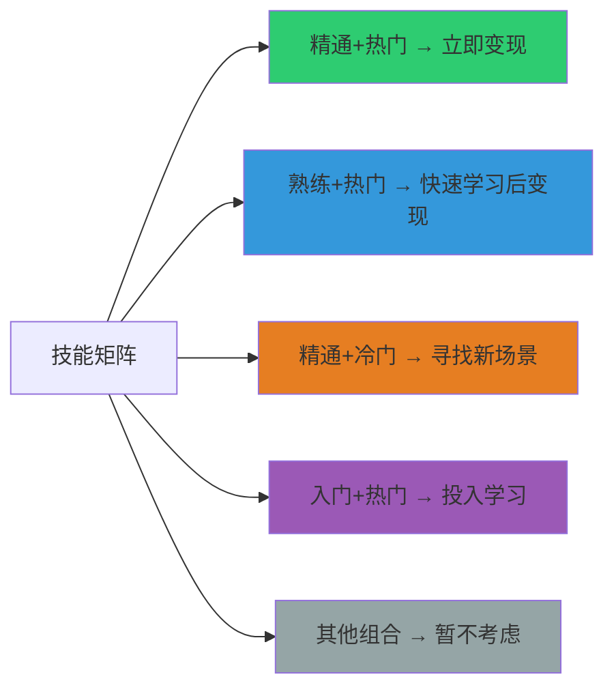

2. **建立作品集**——没有客户之前，用三种方式积累案例：
   - **模拟项目**：给自己假设一个需求，完整做出来。比如设计师可以"假设为某品牌重新设计LOGO"。
   - **免费帮朋友做**：找3-5个朋友，免费帮他们做，换取好评和推荐。但要设定边界——只做"作品集级别"的项目，不做琐碎的小活。
   - **参加比赛/开源项目**：设计类参加站酷比赛，开发类在GitHub贡献开源项目。
   - 作品集是你的"无声销售员"，比任何话术都管用。

3. **低价切入市场**——前5个客户可以打5-7折，目的是拿到好评和口碑。但注意：**低价不等于免费**。免费会吸引"白嫖党"而非真正的客户，而且免费客户往往最难伺候——因为他们不珍惜免费得到的东西。建议以市场价的50-70%起步，明确告知"这是新客户优惠价"。

4. **逐步提价筛选**——每完成3-5个项目，涨价10-20%。价格提升的过程也是客户筛选的过程——愿意付高价的客户，沟通成本反而更低，因为他们尊重专业价值。当你的客单价翻倍但客户数量减半时，你会发现：总收入不变，但工作量减少了一半，客户质量提升了一个档次。

**收入天花板突破策略**：技能变现的本质是**卖时间**，所以收入上限 = 时薪 × 可用小时数。假设时薪300元，每周投入10小时，月收入约12,000元。要突破这个天花板，有三条路：

| 突破路径 | 具体做法 | 收入提升幅度 |
|----------|----------|-------------|
| **提高时薪** | 专注高价值细分领域（如：UI设计→SaaS产品设计） | 2-5倍 |
| **产品化** | 把重复性工作做成模板、课程或工具，一次劳动多次变现 | 5-20倍 |
| **团队化** | 培训助理做执行层，自己专注获客和质量把控 | 3-10倍 |

#### 5.3.2 内容创作型副业

**本质**：通过持续输出有价值的内容，积累受众，再通过广告、带货、知识付费等方式变现。这是建立个人品牌最强的副业类型，也是"复利效应"最明显的副业——一篇好文章可以在发布后持续带来流量和收入数月甚至数年。

**平台选择矩阵**：

| 平台 | 内容形式 | 适合领域 | 粉丝积累速度 | 变现效率 | 运营难度 | 核心算法逻辑 |
|------|----------|----------|--------------|----------|----------|-------------|
| 公众号 | 深度长文 | 专业知识、行业分析 | 慢（需SEO+互推） | 高（广告+知识付费） | 中 | 社交传播+搜一搜 |
| 小红书 | 图文笔记 | 生活方式、教程、种草 | 快（算法推荐） | 中（品牌合作） | 低 | 兴趣标签+互动率 |
| 抖音 | 短视频 | 娱乐、教程、带货 | 最快（流量池机制） | 高（直播+带货） | 高 | 完播率+互动率+转粉率 |
| 视频号 | 短视频+直播 | 知识分享、本地生活 | 中（社交推荐） | 中（打赏+带货） | 中 | 社交推荐+算法推荐 |
| B站 | 中长视频 | 深度内容、教程、评测 | 慢但粘性高 | 中（创作激励+商单） | 高 | 完播率+三连率 |
| 知乎 | 问答+文章 | 专业知识、经验分享 | 中（搜索流量） | 中（付费咨询+好物推荐） | 低 | 内容质量+盐值 |
| 播客 | 音频 | 对话、访谈、深度思考 | 最慢 | 低（广告+付费节目） | 低 | 订阅+推荐 |
| 即刻 | 短动态 | 科技、创业、生活方式 | 中 | 低（引流为主） | 最低 | 社交图谱 |

**内容创作的三个阶段**：

**阶段一：冷启动期（0-3个月）**

- **目标**：找到你的内容定位和风格
- **动作**：每周发布3-5条内容，测试不同选题和形式。用A/B测试思维——同一个主题用不同角度、不同标题、不同封面来测试，看哪种方式数据最好。
- **关键指标**：互动率（点赞/评论/收藏），而非粉丝数。互动率高说明内容质量好，粉丝增长只是时间问题。
- **常见错误**：追求完美而不敢发布（"再改改"心态），或者什么热追什么没有定位（今天美食明天科技）。
- **具体工具**：新榜（查看行业热词和爆款案例）、蝉妈妈（抖音数据分析）、灰豚数据（小红书数据分析）

**阶段二：增长期（3-12个月）**

- **目标**：建立稳定的内容节奏，积累核心粉丝
- **动作**：固定更新频率（如每周2-3篇），建立内容模板提高效率。复盘表现最好的内容，总结"爆款公式"——标题结构、开头模式、内容框架。
- **关键指标**：粉丝增长率、内容完播率/阅读完成率、分享率
- **常见错误**：数据焦虑（每天看10次数据）、频繁换方向（这个月做知识分享下个月做搞笑视频）、忽视与粉丝互动（不回复评论）
- **效率工具链**：Notion（内容日历和选题库）、Canva/创客贴（封面制作）、剪映/CapCut（视频剪辑）、讯飞语记（语音转文字快速出稿）

**阶段三：变现期（12个月+）**

- **目标**：将流量和信任转化为收入
- **动作**：推出付费产品（课程、社群、咨询），接品牌合作。核心原则——先提供10倍价值再谈变现，用免费内容建立信任，用付费产品深度服务。
- **关键指标**：变现转化率、客单价、复购率、用户终身价值（LTV）
- **常见错误**：过早变现伤害信任（粉丝500就开始卖课）、接太多广告降低内容质量（每3条内容1条广告）

**变现方式对比**：

| 变现方式 | 收入模式 | 门槛 | 收入上限 | 稳定性 | 启动建议 |
|----------|----------|------|----------|--------|----------|
| 流量主广告 | 按阅读量计费 | 低（500粉丝即可开通） | 低（万次阅读约50-200元） | 不稳定 | 先积累到1000粉，作为基础收入 |
| 品牌合作 | 按篇/条收费 | 中（需一定粉丝量） | 中（万粉账号单条500-5000元） | 不稳定 | 粉丝5000+后主动在蒲公英/星图接单 |
| 知识付费 | 课程/社群收费 | 高（需专业背书） | 高（单课程可收入数万-数十万） | 较稳定 | 先用免费内容验证需求，再做付费 |
| 电商带货 | 按成交抽佣 | 低 | 中 | 不稳定 | 选高佣金品类（美妆>30%、食品>20%） |
| 付费咨询 | 按小时/次收费 | 高（需行业影响力） | 中（但单价高） | 稳定 | 用"在行"等平台降低获客成本 |

**内容创作的七个致命错误**：

| 错误 | 表现 | 后果 | 纠正方法 |
|------|------|------|----------|
| 定位模糊 | 今天发美食明天发科技，什么都发 | 粉丝画像混乱，无法变现 | 选择1-2个垂直领域，至少坚持3个月不换 |
| 自嗨式创作 | 只写自己想表达的，不考虑读者需求 | 阅读量低，互动差 | 先研究目标读者的痛点和搜索习惯，再决定写什么 |
| 追热点无角度 | 热点事件出来就转发评论，没有独特视角 | 淹没在海量同类内容中 | 热点+专业领域交叉才有价值（如：程序员角度分析AI热点） |
| 标题党无内核 | 标题夸张吸引点击，内容空洞 | 点击率高但取关率更高，信任崩塌 | 标题吸引人是必要的，但内容必须对得起标题 |
| 忽视数据分析 | 凭感觉创作，不看后台数据 | 无法优化，原地踏步 | 每周复盘一次数据：完播率、互动率、涨粉率，找出规律 |
| 过度依赖AI | AI生成内容直接发布，不做人工优化 | 内容同质化严重，缺乏个人特色 | AI生成60%的初稿，人工注入40%的独特观点和个人经验 |
| 急于变现 | 粉丝不到1000就开始卖课、接广告 | 信任未建立就收割，粉丝反感 | 先用免费内容建立信任，粉丝5000+后再考虑变现 |

#### 5.3.3 产品/服务型副业

**本质**：创建可复制的产品或标准化的服务，突破"卖时间"的限制。这类副业前期投入较大，但一旦跑通，收入可以指数增长。

**五大方向详解**：

**方向一：电商（实物产品）**

从1688等批发平台进货，通过淘宝、拼多多、抖音小店等渠道销售。关键在于选品——好的选品能让你事半功倍。

选品核心指标：
- 毛利率 > 50%（低于50%很难覆盖推广和退货成本）
- 月搜索量 > 1万（证明有需求）
- 竞争商品数 < 5000（竞争不过于激烈）
- 复购率高（一次获客多次消费）
- 体积小、不易碎（降低物流和售后成本）

**选品工具链**：

| 工具 | 用途 | 价格 |
|------|------|------|
| 生意参谋（淘系） | 关键词搜索量、竞争度分析 | 标准版1188元/年 |
| 蝉妈妈（抖音） | 抖音热销商品、达人数据 | 基础版免费 |
| 1688找工厂 | 货源搜索、工厂直连 | 免费 |
| 店透视 | 竞品销量分析 | 基础版免费 |
| 蓝海词公式 | 高需求低竞争关键词挖掘 | 手动计算或工具辅助 |

**电商启动流程**（以淘宝为例）：
1. 注册店铺（个人店免费，企业店需营业执照）
2. 选品+找货源（1688拿样验货，确认品质）
3. 拍摄主图和详情页（手机+简易灯箱即可起步）
4. 上架优化标题（用蓝海词公式找长尾关键词）
5. 基础销量破零（亲友购买+好评晒图）
6. 开直通车测款（每天50-100元预算，测3-5天）
7. 数据好的款加大投入，数据差的果断放弃

**方向二：数字产品**

电子书、模板、素材包、插件、工具等。制作一次，无限复制销售，边际成本接近零。这是最接近"被动收入"的副业模式。

| 数字产品类型 | 示例 | 定价范围 | 销售平台 | 制作周期 |
|-------------|------|----------|----------|----------|
| 设计模板 | PPT模板、简历模板、海报模板 | 9.9-199元 | 稿定设计、Canva、自建小程序 | 1-2周/套 |
| 代码工具 | Chrome插件、VS Code扩展、脚本 | 免费-999元 | Chrome商店、GitHub、独立站 | 2-8周 |
| 教育资料 | 学习笔记、思维导图、题库 | 9.9-99元 | 知识星球、小报童、Gumroad | 1-4周 |
| 素材资源 | 字体包、图标库、音效包 | 19.9-299元 | 自建、包图网、Epidemic Sound | 2-6周 |
| 工具服务 | SaaS小工具、API服务 | 月费制9.9-99元 | 自建 | 4-12周 |

**数字产品的关键成功因素**：
- **解决具体痛点**：不要做"通用型"产品，要做"解决某个具体问题"的产品。"100套PPT模板"不如"10套融资路演PPT模板"有吸引力。
- **高质量预览**：用户无法试用，只能通过预览图和描述做决策。花时间做好产品展示页。
- **持续迭代**：根据用户反馈不断优化，增加新功能或新内容。老用户的口碑是最好的推广。

**数字产品定价策略**：

定价不是拍脑袋，而是有方法论的。核心原则：**定价 = 用户感知价值 × 心理锚定系数**。

| 定价区间 | 用户心理 | 适用场景 | 转化特点 |
|----------|----------|----------|----------|
| 9.9-29元 | "一杯奶茶钱，试试无所谓" | 引流品、试用装、入门资料 | 决策快，转化率高，但利润薄 |
| 49-199元 | "需要认真考虑，但不会太纠结" | 主力产品、模板包、入门课程 | 需要展示价值证明（案例、评价） |
| 199-999元 | "这是一笔投资，需要回报" | 专业课程、系统工具、深度服务 | 需要强信任基础+详细价值说明 |
| 1000元+ | "要么是专业服务，要么是高端圈层" | 一对一咨询、高端社群、企业服务 | 需要个人品牌背书+社交证明 |

**定价实操技巧**：
1. **锚定效应**：先展示高价版本，再展示标准版，用户会觉得标准版"便宜"。如：课程分"基础版199 / 进阶版499 / VIP版999"
2. **免费引流→付费转化**：先提供一个免费的"精简版"产品（如：5页PPT模板），用户试用后觉得好，自然愿意付费购买完整版（100页模板包）
3. **阶梯式涨价**：首批用户特价（5折），每售出100份涨价一次，制造紧迫感。这也是验证市场需求的方式——如果特价都卖不出去，说明产品本身有问题
4. **捆绑销售**：单个模板29元，5个模板套餐99元（原价145元），引导用户购买更高客单价的套餐

**方向三：付费社群**

把一群有共同需求或兴趣的人聚集在一起，收取会员费。核心价值在于"信息差"和"社交圈"。

社群运营的关键公式：**社群价值 = 信息密度 × 连接质量 × 持续时间**

- **信息密度**：你能提供什么别人获取不到的信息？行业内部消息、一手数据、独家资源、实操经验。
- **连接质量**：社群成员之间能产生什么化学反应？资源对接、项目合作、经验交流。
- **持续时间**：你能持续运营多久？多数社群活不过6个月——运营者的热情消退后，社群就死了。

**社群定价参考**：

| 社群类型 | 年费范围 | 服务内容 | 运营投入 |
|----------|----------|----------|----------|
| 信息分享型 | 99-299元 | 每日精选资讯、周报、资料库 | 每天30分钟 |
| 学习成长型 | 299-999元 | 课程+作业+答疑+直播 | 每天1-2小时 |
| 资源对接型 | 999-4999元 | 人脉推荐、项目对接、深度交流 | 每天1小时+ |
| 高端圈层型 | 5000-50000元 | 线下聚会、私董会、一对一咨询 | 每周数小时 |

**方向四：代理/分销**

代理他人的产品或服务，赚取差价或佣金。优势是不需要自己生产产品，劣势是利润受制于上游，且客户关系不在自己手里。

适合代理的产品特征：
- 品牌有一定知名度（降低信任成本）
- 复购率高（持续赚佣金）
- 佣金比例合理（至少20%以上）
- 有培训和支持体系（降低运营难度）
- 不需要大量售后（降低运营压力）

**2026年值得关注的代理方向**：
- **AI工具代理**：企业AI工具（如企业版ChatGPT、AI客服系统）的销售代理，佣金通常30-50%
- **SaaS产品分销**：协同办公、CRM、ERP等企业软件的分销商
- **健康/养生产品**：保健品、健身器材、有机食品，复购率高
- **教育产品代理**：在线课程、学习工具、考试培训的分销

**方向五：手工/定制服务**

手工制品、定制蛋糕、个性化礼品等。优势是差异化强、竞争小，劣势是难以规模化、依赖个人手艺。

**规模化路径**：
1. **初期**：个人手工制作，小红书/闲鱼获客
2. **中期**：标准化流程，培训1-2个助手，提高产量
3. **后期**：建立品牌，部分环节外包，自己专注设计和品控

#### 5.3.4 AI赋能型副业（2026前沿方向）

**本质**：利用AI工具大幅提升效率，在传统副业上获得降维打击优势。2025-2026年的AI已经从"工具"进化为"协作伙伴"，关键不是"会用AI"，而是**理解AI的能力边界，在正确的场景中用正确的方式调用它**。

**具体方向**：

| 方向 | 使用的AI工具 | 月收入潜力 | 核心竞争力 | 技能要求 |
|------|-------------|-----------|------------|----------|
| AI内容工厂 | Claude/GPT+Cursor+剪映 | 8000-50000元 | 批量生产+质量把控 | 提示词工程+行业知识+编辑能力 |
| AI设计服务 | Midjourney/SD/ComfyUI+Figma | 10000-80000元 | 审美+后期精修+客户沟通 | 审美能力+后期调整+商业理解 |
| AI视频制作 | Runway/Pika/可灵+剪映 | 8000-30000元 | 创意脚本+后期合成 | 视频剪辑+脚本写作+镜头语言 |
| AI数据分析 | ChatGPT Code Interpreter+Python | 15000-60000元 | 业务洞察+数据叙事 | 数据分析基础+业务理解+可视化 |
| AI客服/虚拟助手 | Coze/Dify/自定义Agent | 5000-30000元 | 业务流程理解+系统集成 | 业务理解+API对接+提示词优化 |
| AI课程/培训 | AI工具+录屏+剪映 | 15000-100000元 | 教学设计+内容体系化 | 教学设计+内容专业度+课程包装 |
| AI代运营 | 全套AI工具链 | 10000-40000元 | 平台运营经验+AI效率 | 平台规则+内容策划+数据分析 |

**AI副业的三重境界**：

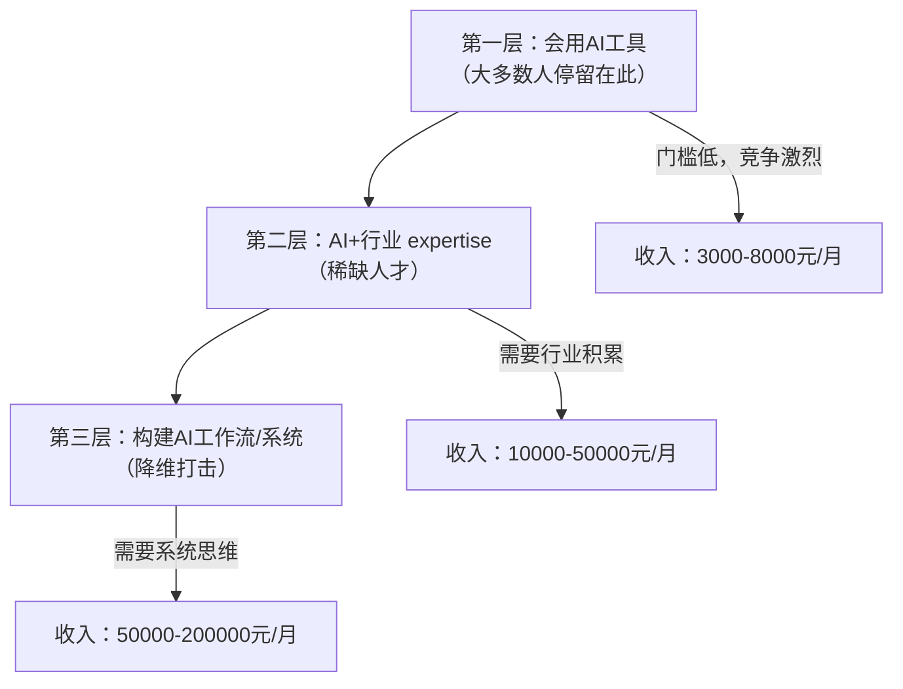

**AI副业的典型工作流（以AI内容代运营为例）**：

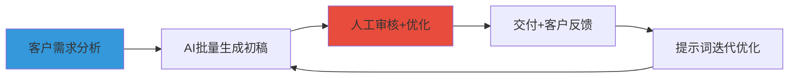

| 环节 | AI承担 | 人工承担 | 效率提升 |
|------|--------|----------|----------|
| 选题策划 | 趋势分析、关键词挖掘 | 判断选题价值、确定角度 | 3-5倍 |
| 内容创作 | 初稿生成、大纲扩展 | 事实核查、观点注入、品牌调性调整 | 5-10倍 |
| 图片/视频 | AI生成素材 | 精修、排版、品牌适配 | 3-8倍 |
| 数据分析 | 自动采集、趋势报告 | 策略决策、方向调整 | 2-3倍 |

**真实案例**：

**案例1：AI内容代运营**——一位前电商运营，利用AI批量生成商品描述、主图文案、短视频脚本，一个人同时服务8家店铺，月收入3.5万。他的核心竞争力不是AI操作，而是5年电商运营经验让他知道"什么样的内容能带来转化"。

**案例2：AI设计工作室**——一位设计师用Midjourney生成初稿，自己做精修和排版，将单个设计项目的交付时间从3天缩短到半天。客单价不变（2000-5000元），但接单量提升了5倍，月收入从8000提升到4万。

**案例3：AI课程讲师**——一位Python工程师用AI辅助制作课程大纲、代码示例、练习题，在B站和网易云课堂上线了3门课程，总销售额超过20万。他的课程之所以卖得好，是因为他用AI提高了课程质量，同时保持了专业深度。

**案例4：AI数据分析服务**——一位前数据分析师，用ChatGPT Code Interpreter + Python脚本构建了一套自动化的行业数据分析报告流水线。客户只需提供原始数据，他用AI完成数据清洗、统计分析、可视化图表、报告撰写，单份报告收费2000-5000元，每月产出15-20份，月收入4-6万。

**关键提醒**：AI副业的核心竞争力不是"会用AI"，而是"懂业务+会用AI"。纯粹的AI操作门槛越来越低，但能把AI和具体行业需求结合起来的人，才是真正的稀缺资源。

#### 5.3.5 本地服务型副业

**本质**：利用你所在城市/社区的地理优势，提供本地化的服务。这类副业竞争相对小（因为只和本地人竞争），且容易建立口碑——一次好的服务体验，能带来持续的转介绍。

**方向详解**：

| 方向 | 具体服务 | 启动成本 | 月收入潜力 | 获客方式 | 核心工具 |
|------|----------|----------|-----------|----------|----------|
| 上门服务 | 家电清洗、甲醛检测、收纳整理、宠物上门喂养 | 500-3000元（工具+培训） | 5000-20000元 | 美团、58同城、小红书、业主群 | 专业工具+服务流程SOP |
| 本地导览 | 城市徒步、美食探店团、摄影跟拍 | 几乎为零 | 3000-15000元 | 小红书、马蜂窝、飞猪 | 路线规划+讲解稿+摄影设备 |
| 社区团购 | 生鲜水果、日用品团购，赚取佣金+差价 | 1000-5000元（首批货款） | 3000-12000元 | 微信群、业主群、社区公告 | 群接龙、快团团、微信小程序 |
| 技能教学 | 乐器教学、健身私教、书法/绘画培训 | 500-5000元（场地+教具） | 5000-30000元 | 小红书、大众点评、转介绍 | 教学场地+教材+预约系统 |
| 代办服务 | 跑腿代办、证件办理协助、搬家服务 | 几乎为零 | 3000-10000元 | 58同城、闲鱼、本地群 | 交通工具+本地人脉 |

**本地副业的三大护城河**：
1. **口碑网络**：本地客户之间会互相推荐，一个满意的客户可能带来5-10个新客户
2. **地理壁垒**：你的竞争对手只限于本地区域，不会面对全国性竞争
3. **信任成本低**：面对面服务天然比线上更容易建立信任

**本地服务升级路径**：

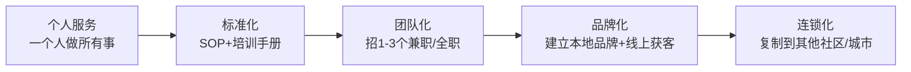

#### 5.3.6 投资理财型"副业"

**本质**：用钱生钱，严格来说不算"副业"（因为不直接投入时间），但它是从副业收入走向财务自由的必经之路。**副业赚到的钱如果只是躺在银行里，等于在慢性贬值。**

> 注意：投资理财有风险，这里仅提供框架性思路，不构成投资建议。投资前请充分了解产品特性和风险。

**投资的"道"——理解复利**：

假设你每月副业收入5000元，全部存银行（年利率2%），10年后你有约66万。但如果投资基金（年化8%），10年后你有约91万。差距是25万——这就是复利的力量。

**适合普通人的投资副业组合**：

| 资产类型 | 预期年化收益 | 风险等级 | 适合阶段 | 配置建议 | 核心工具/平台 |
|----------|-------------|----------|----------|----------|--------------|
| 货币基金 | 2-3% | 极低 | 任何时候（应急资金） | 保留3-6个月生活费 | 余额宝、零钱通 |
| 指数基金定投 | 8-12% | 中 | 副业收入稳定后 | 每月副业收入的30-50% | 天天基金、蛋卷基金 |
| 可转债 | 5-15% | 中低 | 有一定投资知识后 | 总投资资金的10-20% | 集思录、同花顺 |
| 优质个股 | 不确定 | 高 | 有深入研究能力后 | 不超过总投资的20% | 雪球、东方财富 |
| REITs | 5-8% | 中 | 了解不动产投资后 | 总投资的5-10% | 券商APP |
| 数字资产 | 不确定 | 极高 | 仅用"亏了不心疼"的钱 | 不超过总资产的5% | OKX、Binance |

**投资纪律三条**：
1. **永远不用借来的钱投资**——杠杆会放大亏损，让你在最需要冷静的时候做出最冲动的决定
2. **分散投资，不押单一标的**——"不要把所有鸡蛋放在一个篮子里"不是废话，是血泪教训
3. **设定止损线，严格执行**——买入前就确定"亏多少我认"，到了就走，不要心存侥幸

### 5.4 副业选择的实操决策流程

#### 5.4.1 五步决策法

**第一步：自我盘点（1-2天）**

拿出纸笔或打开Notion，做一次彻底的自我盘点：

**技能清单模板**：

| 技能/能力 | 熟练度 (1-5) | 市场需求 (1-5) | 热爱程度 (1-5) | 综合得分 | 备注 |
|-----------|-------------|----------------|----------------|----------|------|
| 例：Python编程 | 4 | 5 | 4 | 13 | 可做外包、自动化工具 |
| 例：PPT设计 | 3 | 4 | 2 | 9 | 可做模板销售 |
| 例：写作 | 3 | 4 | 5 | 12 | 可做自媒体、代写 |

综合得分 = 熟练度 + 市场需求 + 热爱程度。得分最高的3-5项就是你的候选方向。

**第二步：市场验证（3-5天）**

对每个候选方向，做以下五项验证：

```python
# 市场验证检查清单
验证项 = {
    "搜索热度": "百度指数、微信指数搜索相关关键词，看趋势是否上升",
    "竞争程度": "在目标平台搜索同类内容/产品，评估数量和质量",
    "付费意愿": "在淘宝/知识星球搜索同类付费产品，看销量和评价",
    "供给缺口": "看现有产品/服务的差评，找到用户的未满足需求",
    "增长趋势": "这个方向是上升期还是衰退期？未来2-3年会怎样？"
}
```

**验证的红线标准**：
- 如果搜索热度在下降 → 大概率是衰退期，慎重考虑
- 如果竞争者数量多且质量高 → 需要找到差异化切入点
- 如果同类付费产品销量低 → 可能市场需求不足，也可能你找到了蓝海
- 如果差评集中在"服务态度"而非"产品本身" → 说明市场有需求，现有供给者做得不好

**第三步：能力差距分析（1天）**

对比"做好这个副业需要的能力"和"我现在的能力"，列出差距清单：

| 需要的能力 | 我的现状 | 差距等级 | 学习路径 | 学习时间 | 是否阻塞启动 |
|-----------|---------|----------|----------|----------|-------------|
| 例：视频剪辑 | 不会 | 大 | B站教程+剪映实操 | 2-4周 | 是（需要先学会） |
| 例：文案写作 | 一般 | 中 | 多写+看优秀案例 | 1-2周 | 否（可以边做边学） |
| 例：社群运营 | 没经验 | 中 | 加入别人的社群观察学习 | 1周 | 否（可以边做边学） |

**关键判断**：如果"阻塞启动"的能力差距需要超过1个月才能弥补，考虑是否值得投入。如果需要3个月以上，建议换方向——副业的关键是快速验证，不是长期准备。

**第四步：最小可行测试（1-2周）**

不要一开始就全力投入，先做最小测试：

| 副业类型 | 最小测试方式 | 成功标准 | 测试成本 |
|----------|-------------|----------|----------|
| 技能变现 | 免费帮3个人做，看反馈和自己的感受 | 3人都给好评+自己不排斥 | 0元，约10小时 |
| 内容创作 | 发布10条内容，看数据和互动 | 至少1条互动率超过5% | 0元，约15小时 |
| 产品销售 | 先预售或找3-5个种子用户试用 | 至少2人愿意付费 | 500元以内 |
| 服务型 | 先小范围做1-2单，验证流程和定价 | 客户满意+利润合理 | 500元以内 |

**第五步：做出决定并承诺最低投入期**

选定方向后，给自己一个**最低投入期**（建议3-6个月），在此期间不轻易换方向。多数副业的前期都是"积累期"，看不到明显回报是正常的。

**最低投入期的承诺书**（写下来，贴在看得见的地方）：

> 我选择 [副业方向] 作为我的副业方向。我承诺至少投入 [3/6] 个月，每周投入 [X] 小时。在此期间，我不会因为"看不到效果"而放弃，除非出现以下情况：
> 1. 连续2个月零收入且零增长
> 2. 严重影响主业表现
> 3. 发现重大法律/合规风险
>
> 签名：____  日期：____

#### 5.4.2 不同人群的推荐路径

| 人群特征 | 推荐方向 | 理由 | 典型时间线 |
|----------|----------|------|-----------|
| 程序员/技术人员 | 技术外包 → 工具产品 → 技术课程 | 技能直接变现，逐步产品化 | 第1-3月：接外包；第4-8月：做工具；第9月+：出课程 |
| 设计师/创意人 | 设计私活 → 模板/素材 → 设计课程 | 作品即口碑，容易建立品牌 | 第1-3月：接私活；第4-6月：做模板；第7月+：开课程 |
| 文字工作者 | 自媒体写作 → 付费专栏 → 出版/课程 | 内容积累快，变现路径清晰 | 第1-6月：积累内容；第7-12月：付费产品；第13月+：出书 |
| 销售/市场人员 | 代理分销 → 自有品牌 → 咨询服务 | 天生懂获客和变现 | 第1-3月：代理起步；第4-9月：自有品牌；第10月+：咨询 |
| 教师/培训师 | 在线课程 → 付费社群 → 教育产品 | 教学能力直接迁移 | 第1-3月：录制课程；第4-6月：建社群；第7月+：教育产品 |
| 在校学生 | 自媒体 → 技能兼职 → 数字产品 | 时间充裕，试错成本低 | 第1-6月：做自媒体练手；第7-12月：技能兼职；第13月+：数字产品 |
| 全职妈妈/爸爸 | 本地服务 → 社群团购 → 母婴内容 | 熟悉需求，信任度高 | 第1-3月：本地服务；第4-8月：社群团购；第9月+：内容创作 |
| 有积蓄的上班族 | 数字产品 → 投资理财 → 小型创业 | 有资金缓冲，可承受更长回报周期 | 第1-6月：做数字产品；第7月+：学习投资；第13月+：考虑创业 |

#### 5.4.3 副业退出决策框架

不是所有副业都值得坚持。当出现以下信号时，需要认真考虑退出：

**红灯信号（立即评估是否退出）**：
- 连续3个月收入为零且无增长趋势
- 投入产出比持续低于1:1（投入的时间价值高于收入）
- 严重影响主业，面临被辞退风险
- 出现法律/合规问题

**黄灯信号（需要调整策略）**：
- 收入增长停滞超过2个月
- 客户/用户反馈持续不佳
- 竞争突然加剧（大玩家入场）
- 自己越来越不想做

**退出时的止损策略**：
1. **转型而非放弃**：也许不是方向错了，而是切入点错了。尝试调整定位、目标客户或变现方式。
2. **资产化退出**：如果有积累（粉丝、客户、品牌），可以转让或出售。一个有1万粉丝的账号可以卖几千到几万元。
3. **经验复盘**：退出前做一次完整的复盘——什么做对了？什么做错了？下次怎么做？这些经验是无价的。

### 5.5 常见选择误区

#### 误区一：只看收入上限，不看启动难度

"做电商月入10万"听起来很诱人，但你可能需要：选品、进货、拍照、上架、推广、客服、物流、售后……每个环节都是坑。相比之下，"写公众号月入5000"虽然收入上限低，但启动难度也低得多。

**纠正方法**：用"投入产出比"而非"绝对收入"来评估。一个每周投入5小时、月入5000元的副业，远比每周投入40小时、月入20000元的副业更值得做（尤其是你还有主业的情况下）。计算公式：

```text
效率值 = 月收入 ÷ (每周投入小时数 × 4)
```

效率值 > 100元/小时的副业，值得做。效率值 < 50元/小时的副业，需要重新评估。

#### 误区二：忽略"隐性成本"

很多人只算"显性成本"（资金投入），忽略了"隐性成本"：

| 成本类型 | 具体表现 | 如何量化 |
|----------|----------|----------|
| **时间成本** | 每天花3小时做副业，意味着少3小时休息、学习或陪伴家人 | 你的时薪 × 投入时间 |
| **精力成本** | 副业消耗的精力会影响主业表现，可能导致升职加薪延迟 | 主业收入增长的预期损失 |
| **机会成本** | 做这个副业的时间，本可以用来做另一个回报更高的事 | 最优替代方案的预期收益 |
| **情绪成本** | 副业不顺利带来的焦虑和挫败感，影响生活质量和人际关系 | 难以量化但不可忽视 |
| **健康成本** | 长期双重工作导致睡眠不足、运动减少、压力增大 | 医疗费用+生活质量下降 |

**纠正方法**：做决策前，把所有成本（包括隐性成本）列出来，给自己一个"最坏情况承受力测试"——如果这个副业半年没收入，你能接受吗？你的主业收入能覆盖所有生活开支吗？你的家人支持吗？

#### 误区三：追求"完美方向"而迟迟不开始

有些人花了3个月研究"该做什么副业"，结果一个都没开始。完美方向不存在，你需要的是"足够好"的方向+快速行动。

**纠正方法**：给自己设一个决策截止日期（比如一周内），用上面的评估框架快速打分，选最高分的那个就开始做。做了才能知道对不对，光想是想不出来的。记住：**完成比完美更重要**。一个"60分的开始"胜过"100分的计划"。

#### 误区四：同时做多个副业

"我既想写公众号，又想做短视频，还想开个淘宝店"——三个方向同时推进，每个都只投入30%的精力，结果每个都做不好。

**纠正方法**：同一时间只做一个副业。做到稳定盈利（或明确判断不适合）后，再考虑切换或叠加。专注是最大的竞争优势。用这个决策树判断：

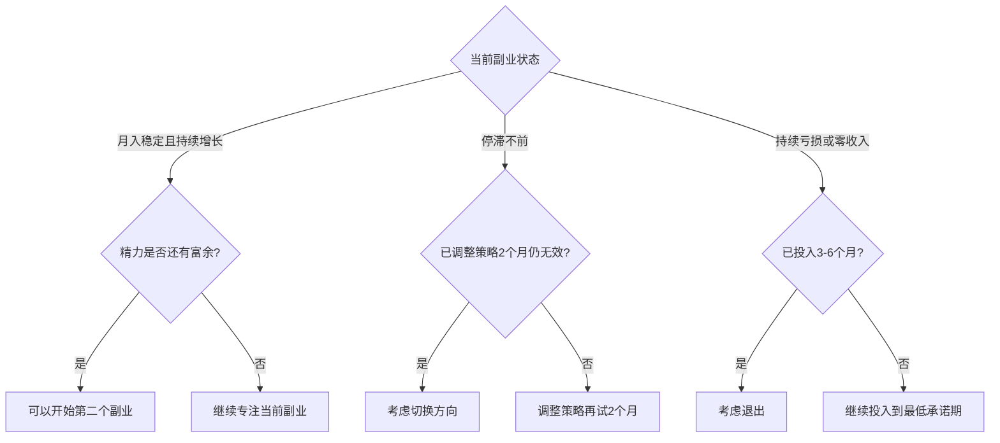

#### 误区五：只看别人的结果，不看过程

看到"某某靠短视频月入10万"就去做短视频，却不知道对方可能已经积累了5年的内容创作经验，或者背后有团队支撑，或者赶上了平台红利期。

**纠正方法**：看案例时，不仅看结果，更要深挖以下五个维度：

1. **时间线**：他们花了多久才达到现在的水平？
2. **前期积累**：入场前有什么独特优势（资源、人脉、经验）？
3. **踩过的坑**：他们失败过几次？每次失败后怎么调整的？
4. **不可复制因素**：有哪些是"天时地利人和"的因素，你无法复制？
5. **可复制因素**：有哪些方法论和策略是你能借鉴的？

#### 误区六：忽视精力管理

很多人同时承担主业和副业，却没有系统管理自己的精力。结果是：主业表现下降，副业效率低下，身体透支。

**精力管理四象限**：

| 精力状态 | 主业 | 副业 | 建议 |
|----------|------|------|------|
| 高精力时段（上午） | 高难度工作 | - | 保护主业的高质量产出 |
| 中精力时段（下午） | 常规工作 | 创意/规划类 | 副业的思考和规划放在这里 |
| 低精力时段（晚上） | - | 执行/机械类 | 副业的执行类工作放在这里 |
| 恢复时段（睡前） | - | - | 不工作，用于休息和充电 |

**防止副业导致倦怠的五条原则**：
1. 每周至少保留1天完全不工作（包括副业）
2. 设置副业的"工作时间边界"——比如每天最多2小时
3. 每月做一次"精力审计"——评估当前状态是否可持续
4. 副业应该是"第二份热情"而不是"第二份负担"
5. 如果副业让你越来越焦虑而不是越来越兴奋，需要重新评估方向

### 5.6 进阶：副业组合策略

当你的第一个副业稳定盈利后，可以考虑构建**副业组合**，类似于投资中的资产组合——不同副业承担不同角色：

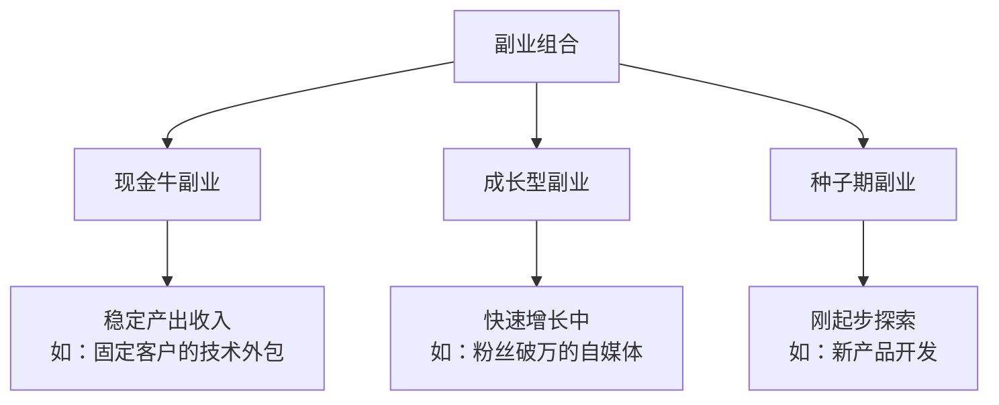

**组合原则**：

| 副业类型 | 角色 | 精力分配 | 收入预期 | 风险等级 | 管理方式 |
|----------|------|----------|----------|----------|----------|
| 现金牛 | 提供稳定现金流，覆盖生活开支和副业投入 | 20% | 稳定，可预期 | 低 | 维护现有客户和流程 |
| 成长型 | 未来的主要收入来源，需要重点投入 | 70% | 快速增长中 | 中 | 持续优化和扩展 |
| 种子期 | 长期布局，允许失败，但成功了回报巨大 | 10% | 目前为零或极少 | 高 | 小成本快速验证 |

**构建组合的时间线**：

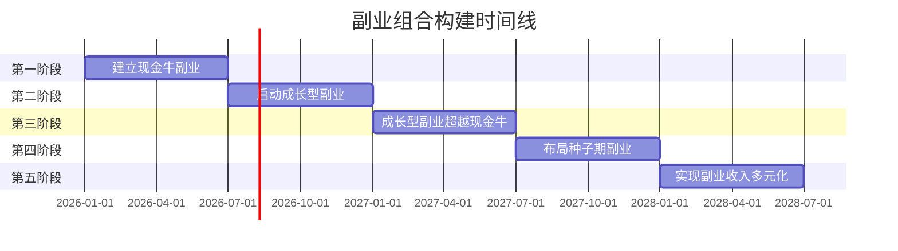

**组合的风险管理**：
- 三个副业最好分布在不同行业/平台，避免"一损俱损"
- 现金牛副业要保持"可放弃"状态——如果它不再盈利，能快速切换
- 种子期副业的试错成本控制在总副业收入的10%以内
- 每季度做一次"组合审视"——评估每个副业的角色定位是否还合理

### 5.7 副业到全职的决策框架

当副业收入持续超过主业收入的1.5倍，且持续6个月以上时，可以考虑将副业转为全职。但这个决策需要系统评估：

**决策评估表**：

| 评估维度 | 全职条件 | 你的现状 |
|----------|----------|----------|
| 收入稳定性 | 副业收入连续6个月 ≥ 主业收入×1.5 | ___ |
| 现金储备 | 至少有12个月生活费的存款 | ___ |
| 客户基础 | 有稳定的客户来源，不依赖单一大客户 | ___ |
| 增长潜力 | 副业有明确的增长空间，全职能带来更大产出 | ___ |
| 家庭支持 | 家人理解并支持你的决定 | ___ |
| 保险衔接 | 已规划好社保、医保的衔接方案 | ___ |
| 退出计划 | 如果全职做副业失败，有回到职场的路径 | ___ |

**建议的过渡方式**：不要"裸辞"。先申请转为兼职或远程办公，用多出来的时间加速副业增长。等副业完全稳定后，再正式辞职。

### 5.8 本节核心要点

| 要点 | 说明 |
|------|------|
| 用框架选方向 | 不要"跟着感觉走"，用三圈模型和决策矩阵做理性评估 |
| 理解时间杠杆 | 从"卖时间"起步，逐步走向"卖成果"和"卖系统" |
| 合规先行 | 检查劳动合同限制、知识产权归属、税务义务，避免法律风险 |
| 优先低成本方向 | 先用最小代价验证，跑通了再加大投入 |
| 六种副业类型 | 技能变现、内容创作、产品服务、AI赋能、本地服务、投资理财 |
| 五步决策法 | 自我盘点→市场验证→能力分析→最小测试→承诺投入期 |
| 避开六大误区 | 不唯收入论、算清隐性成本、不过度纠结、不贪多、看过程不只看结果、管理精力 |
| 建立退出机制 | 设定红灯/黄灯信号，知道何时坚持、何时调整、何时退出 |
| 构建副业组合 | 稳定后用"现金牛+成长型+种子期"组合分散风险 |
| 副业到全职 | 收入1.5倍×6个月+12个月现金储备+客户多元化，再考虑全职 |

**副业选择全景路线图**：

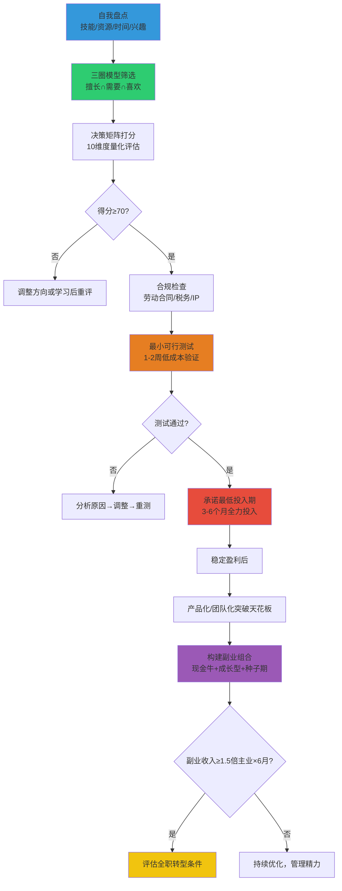

> **最后一句话**：副业不是"多打一份工"，而是**用系统思维把你的能力、时间和精力配置到回报率最高的方向上**。选对方向、快速验证、持续迭代——这三步做好了，副业收入超过主业只是时间问题。
