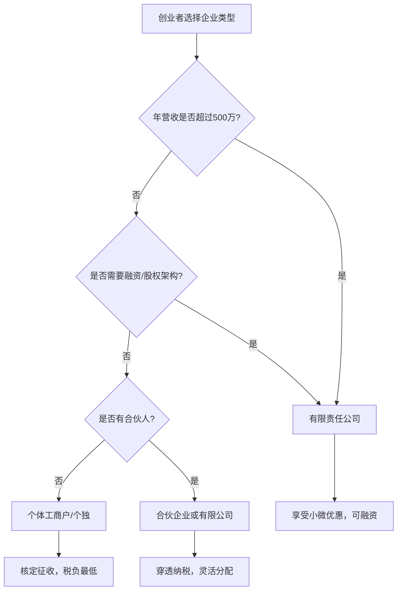

# 六、创业者必知的财务知识

创业失败的案例中，超过 80% 与现金流管理失控直接相关。CB Insights 对 101 家失败创业公司的分析显示，"花光了钱"（Ran out of cash）高居失败原因第二位，仅次于"市场不需要"。然而更深层的问题是：绝大多数创业者并非不知道钱重要，而是不懂财务语言，无法在关键时刻做出正确判断。

一个残酷的现实是：中国中小企业的平均寿命仅 2.5 年（国家工商总局数据），其中财务管理混乱是头号杀手。创始人往往把精力集中在产品和市场，把财务当作"后面再补"的事情——直到税务稽查上门、合伙人因为账目不清反目、或者账上只剩两个月工资才追悔莫及。

本章系统梳理创业者必须掌握的财务知识体系——从基础概念到税务筹划，从融资决策到现金流管控，从财务报表到估值模型，帮助你建立完整的创业财务思维框架。无论你是刚注册公司的新手，还是已经拿到A轮的创始人，这里都有你需要的知识。

---

## 1. 财务三表：创业者的第一语言

财务报表是企业的体检报告。看不懂报表的创始人，就像不看仪表盘开车的司机——短期可能没事，长期必然翻车。

### 1.1 利润表（Income Statement）

利润表回答一个核心问题：**这段时间你赚了还是亏了？**

利润表的基本结构：

```text
营业收入（Revenue）
  - 营业成本（COGS）
= 毛利润（Gross Profit）
  - 运营费用（Operating Expenses）
    - 人员工资
    - 办公租金
    - 营销费用
    - 研发投入
    - 管理费用
= 营业利润（Operating Profit / EBITDA）
  - 折旧与摊销
  - 利息支出
= 税前利润（EBT）
  - 所得税
= 净利润（Net Profit）
```

**创业者必须理解的关键概念：**

| 概念 | 定义 | 创业者关注点 |
|------|------|-------------|
| 毛利率 | (营收-成本)/营收 | 反映产品/服务的基础盈利能力，低于40%需警惕 |
| 净利率 | 净利润/营收 | 最终到手的钱，很多创业公司长期为负 |
| 营收增长率 | (本期-上期)/上期 | 早期公司核心指标，月环比20%+为健康 |
| 人均产出 | 营收/团队人数 | 衡量人效，低于行业均值说明管理有问题 |
| 费用率 | 各项费用/营收 | 各项费用占比，超过营收的异常值需审视 |

**利润表的陷阱——权责发生制 vs 收付实现制：**

中国会计准则要求使用权责发生制记账，这意味着：
- 你签了一份120万的年度合同，当月只能确认10万收入（按月分摊）
- 你12月发了1月的工资，费用记在12月而非1月
- 客户欠你50万还没付，但收入已经确认了

这就是为什么利润表上有利润，银行账户里却可能没有钱。**永远不要只看利润表，必须结合现金流量表一起看。**

**实操建议：** 初创阶段按月编制利润表，哪怕只有一页Excel。重点追踪三个数字：收入、支出、净现金流。很多创业者用"感觉还行"代替数据，直到账上没钱才慌。

### 1.2 资产负债表（Balance Sheet）

资产负债表回答：**你的公司此刻值多少钱？**

```text
资产（Assets）            = 负债（Liabilities） + 所有者权益（Equity）
├─ 流动资产                ├─ 流动负债              ├─ 实收资本
│  ├─ 现金及等价物          │  ├─ 应付账款            ├─ 资本公积
│  ├─ 应收账款              │  ├─ 短期借款            ├─ 盈余公积
│  └─ 存货                 │  └─ 预收款项            └─ 未分配利润
└─ 非流动资产               └─ 非流动负债
   ├─ 固定资产                 └─ 长期借款
   └─ 无形资产
```

**创业者必须关注的比率：**

| 比率 | 计算公式 | 健康范围 | 异常信号 |
|------|---------|---------|---------|
| 流动比率 | 流动资产/流动负债 | 1.5-2.0 | <1意味着短期偿债能力不足 |
| 资产负债率 | 总负债/总资产 | 30%-60% | >70%杠杆过高，抗风险能力弱 |
| 速动比率 | (流动资产-存货)/流动负债 | >1.0 | <0.5表示短期偿债压力极大 |
| 应收账款周转天数 | 应收账款/日均营收 | <45天 | >90天说明回款管理失控 |

**常见陷阱：** 很多创业者把公司账户和个人账户混在一起，导致资产负债表无法反映真实经营状况。更有甚者用个人账户收款来"避税"，一旦被税务机关发现，面临的不仅是补税和罚款，还有可能触犯刑法。第一步就是设立独立的对公账户，严格分离个人与公司财务。

**一个真实的反面案例：** 某餐饮创业公司老板习惯用个人微信收营业款，年底一算"利润"200万，但公司账上只有30万——因为170万都在他个人账户上混着花了。到补缴税款时才发现，个人账户进账被税务大数据标记，不仅要补缴企业所得税，还要补缴个人所得税，加上滞纳金和罚款，总金额比他"省"下的税多了三倍。

### 1.3 现金流量表（Cash Flow Statement）

**这是创业者最应该看、但最常忽略的报表。** 利润不等于现金——你可以账面盈利但现金枯竭（比如客户拖欠货款），也可以账面亏损但现金流充裕（比如预收了全年服务费）。

现金流量表分为三部分：

| 类别 | 包含内容 | 意义 |
|------|---------|------|
| 经营活动现金流 | 日常业务产生的现金流入流出 | 核心造血能力，必须为正 |
| 投资活动现金流 | 购买设备、投资等 | 为未来布局，通常为负 |
| 筹资活动现金流 | 融资、借款、分红 | 外部输血能力 |

**黄金法则：经营现金流为正是公司存活的底线。** 如果连续三个月经营现金流为负，你必须立即行动——砍成本、催回款、或者融资。

**利润与现金流差异的四种场景：**

| 场景 | 利润表 | 现金流 | 说明 | 行动 |
|------|--------|--------|------|------|
| 健康增长 | 盈利 | 正向 | 最理想状态 | 保持节奏，适度扩张 |
| 账面繁荣 | 盈利 | 负向 | 应收账款堆积，钱没收回来 | 立即催收，收紧信用政策 |
| 战略亏损 | 亏损 | 正向 | 预收款模式或前期投入期 | 评估亏损是否可控，关注跑道 |
| 危机状态 | 亏损 | 负向 | 最危险，双重失血 | 立即止血：砍成本或紧急融资 |

---

## 2. 创业公司的财务建模

### 2.1 收入模型设计

收入模型决定了你的公司如何赚钱，不同模型的财务特征截然不同：

| 收入模型 | 代表公司 | 现金流特征 | 核心指标 | 风险点 |
|---------|---------|-----------|---------|--------|
| SaaS订阅 | 飞书、Notion | 前期投入大，后期稳定 | MRR、ARR、Churn Rate | 获客成本高，回本周期长 |
| 交易抽成 | 淘宝、美团 | 随交易量波动 | GMV、Take Rate | 依赖交易量，双边市场难建 |
| 广告模式 | 抖音、知乎 | 用户量驱动 | DAU、ARPU、eCPM | 变现效率受宏观经济影响大 |
| 一次性销售 | 传统软件 | 不稳定，需要持续获客 | 客单价、复购率 | 收入波动大，难以预测 |
| Freemium | 印象笔记 | 免费用户是成本，付费是收入 | 转化率、LTV | 免费用户可能永远不变现 |
| 平台模式 | 滴滴、Airbnb | 网络效应带来飞轮 | 供需匹配率、客单价 | 冷启动极难，补贴战消耗大 |
| 硬件+服务 | 大疆、小米 | 硬件低利润，服务长期收入 | 硬件毛利率、服务续费率 | 库存风险，供应链管理复杂 |

**实操步骤——设计你的收入模型：**

1. **明确价值交付方式**：你的产品是持续服务（订阅）还是一次性交付（项目）？如果是硬件，后续是否有软件/服务收入？
2. **测算单位经济模型**：每获取一个客户要花多少钱（CAC），这个客户生命周期内能贡献多少收入（LTV），LTV/CAC 应大于3。如果小于1，你每获取一个客户就在亏钱。
3. **设计定价阶梯**：至少3个价格档次，锚定效应让中间档成为主推。心理学研究表明，当有三个选项时，70%的用户会选择中间那个。
4. **估算现金流时间差**：从获客到收到第一笔钱需要多久？B2B企业平均45-90天，B2C当天就能收。这个时间差决定了你需要多少启动资金。
5. **验证价格敏感度**：用A/B测试或小范围调研验证定价，不要拍脑袋定价格。10%的价格变动可能带来30%以上的利润变化。

### 2.2 成本结构分析

创业公司的成本分为两类，理解区别决定了你的优先级：

**固定成本（Fixed Costs）：** 不随业务量变化的成本
- 办公租金、基础团队工资、服务器基础费用、保险、软件订阅费
- 特点：每月固定支出，裁员和退租是最后手段
- 策略：初期尽可能压缩，用远程办公、共享空间替代独立办公室；用开源工具替代付费SaaS；用兼职/外包替代全职

**可变成本（Variable Costs）：** 随业务量线性变化的成本
- 原材料、交易手续费、流量投放费用、客服人力、云服务按量计费部分
- 特点：收入增长时同步增长
- 策略：确保可变成本率低于毛利率，否则越做越亏

**半可变成本（Semi-Variable Costs）：** 容易被忽视的第三类
- 服务器费用（基础固定+按量增长）、销售提成（底薪固定+提成可变）、客服团队（基础人员固定+临时扩编可变）
- 特点：阶梯式增长，到了某个阈值会跳升
- 策略：提前规划扩容节点，避免被动应对

**关键公式：盈亏平衡点 = 固定成本 / (1 - 可变成本率)**

举例：你的SaaS产品月固定成本10万元，可变成本率30%（服务器+客服），那盈亏平衡点 = 10万/0.7 = 14.3万元月收入。假设客单价500元/月，需要286个付费客户才能不亏。

**成本优化的优先级矩阵：**

| 优先级 | 成本类型 | 策略 | 节省潜力 |
|--------|---------|------|---------|
| P0-立即 | 无直接产出的固定支出 | 砍掉不常用的SaaS订阅、退租闲置工位 | 10%-30% |
| P1-本月 | 营销投放效率低的渠道 | 暂停ROI<1的广告渠道 | 20%-50% |
| P2-本季度 | 人力结构优化 | 用自动化替代重复性工作 | 15%-25% |
| P3-长期 | 技术架构优化 | 用云原生替代传统部署，降低运维成本 | 30%-60% |

### 2.3 现金流预测模型

**18个月滚动现金流预测是创业者的生存工具。** 具体做法：

```text
第1步：列出每月固定支出（工资+租金+基础服务费）
第2步：预测每月收入（保守/中性/乐观三档）
第3步：计算每月净现金流 = 收入 - 支出
第4步：累加得到月末现金余额
第5步：标记现金余额归零的月份——这就是你的"跑道"（Runway）
```

**跑道计算公式：** Runway（月）= 当前现金余额 / 月均烧钱速度

假设你账上有100万，月均支出15万，月收入5万，净烧钱速度10万/月。你的跑道 = 100万/10万 = 10个月。**在跑道耗尽前3-6个月就必须开始融资**，因为融资周期通常需要3-6个月。

**现金流预测的三档模型：**

```text
                保守档          中性档          乐观档
收入假设    月增长5%        月增长15%       月增长25%
客户流失    月流失5%        月流失3%        月流失1%
成本增长    月增10%         月增8%          月增5%
跑道(月)    8个月           12个月          18个月
```

**为什么一定要做三档？** 因为未来不可能完全按你的预期发展。保守档告诉你"最坏能撑多久"，乐观档告诉你"最好能走到哪"。决策永远基于保守档——用最坏的情况做计划，用最好的情况做激励。

**现金流预测模板（简化版Excel结构）：**

| 行项目 | 1月 | 2月 | 3月 | ... | 18月 |
|--------|-----|-----|-----|-----|------|
| 期初现金余额 | | | | | |
| + 收入（保守） | | | | | |
| - 人员工资 | | | | | |
| - 办公租金 | | | | | |
| - 营销费用 | | | | | |
| - 服务器/工具 | | | | | |
| - 其他支出 | | | | | |
| = 月净现金流 | | | | | |
| = 期末现金余额 | | | | | |
| 跑道（月） | | | | | |

---

## 3. 税务筹划：合法省税的底层逻辑

### 3.1 企业组织形式与税负

不同组织形式的税负差异巨大：

| 组织形式 | 企业所得税 | 个人所得税 | 增值税 | 适用场景 |
|---------|-----------|-----------|--------|---------|
| 个体工商户 | 免（核定征收） | 经营所得5%-35% | 小规模1% | 年营收50万以下的小生意 |
| 个人独资企业 | 免 | 经营所得5%-35% | 小规模1% | 咨询、设计等专业服务 |
| 有限责任公司 | 25%（一般）/ 5%（小微） | 分红20% | 一般6%-13% | 大多数创业公司 |
| 合伙企业 | 免（穿透纳税） | 经营所得5%-35% | 视业务类型 | 投资基金、律所 |

**小微企业优惠政策（截至2025年）：** 年应纳税所得额≤300万元的部分，实际税率仅5%。这是国家给创业者的红利，一定要充分利用。

**选择企业类型的决策树：**



**综合税负计算示例：**

假设你的创业公司年利润200万，我们对比不同组织形式的实际税负：

| 项目 | 个体工商户 | 有限责任公司(小微) | 有限责任公司(一般) |
|------|-----------|-------------------|-------------------|
| 企业所得税 | 0 | 200万×5%=10万 | 200万×25%=50万 |
| 个人所得税/分红 | ~30万(核定) | (200-10)万×20%=38万 | (200-50)万×20%=30万 |
| 合计税负 | ~30万 | ~48万 | ~80万 |
| 综合税率 | ~15% | ~24% | ~40% |

结论：年利润300万以下，小微企业（有限公司）的综合税负约24%，远低于一般企业的40%。但如果不需要公司制，个体工商户核定征收的税负更低。

### 3.2 合法节税的七个策略

1. **充分利用小微企业优惠**：控制公司利润在300万以内，超出部分通过合理方式处理。如果业务规模较大，可以考虑拆分为多个关联公司，每个公司独立享受小微优惠（需有合理商业目的，不能仅为避税）。

2. **研发费用加计扣除**：科技型企业的研发费用可按100%加计扣除，相当于研发投入的25%直接免税。例如你今年研发投入100万，可以在税前多扣除100万，节省25万所得税。关键是要做好研发费用的归集和核算——人员人工、直接投入、折旧费用、无形资产摊销、设计费、装备调试费等都可以计入。

3. **合理利用费用列支**：
   - 员工福利费：工资总额的14%以内可税前扣除
   - 工会经费：工资总额的2%以内
   - 职工教育经费：工资总额的8%以内（超出部分可结转以后年度）
   - 业务招待费：实际发生额的60%，且不超过营收的5‰
   - 广告和业务宣传费：不超过营收15%的部分（超出可结转）

4. **固定资产加速折旧**：500万以下设备可一次性税前扣除，提前抵税。这意味着你花100万买服务器，当年就能全额抵扣，而不是分5年慢慢折旧。对现金流紧张的初创公司来说，这是实打实的现金节省。

5. **选择合适的纳税人身份**：年营收500万以下可选择小规模纳税人，增值税率仅1%（一般纳税人6%-13%）。但要注意：一般纳税人可以抵扣进项税，如果你的上游供应商能开专票，实际税负可能更低。需要具体测算后选择。

6. **合理规划收入确认时间**：利用合同约定的付款方式控制收入确认节点。例如12月签的合同约定"次年1月开始服务"，收入就确认在次年，可以推迟一年纳税。这不是造假，是合理利用会计准则。

7. **利用税收优惠园区**：部分地区对特定行业有财政返还政策。例如海南自贸港对鼓励类企业按15%征收企业所得税（一般为25%）；西部大开发政策对特定行业也按15%征收。但要注意：税收洼地不是法外之地，必须在当地有真实经营。

**警告：** 节税与偷税的界限是"是否有真实的业务实质"。金税四期上线后，税务大数据分析能力极强，虚开发票、阴阳合同等行为几乎必然被查。合法节税与违法偷税之间，隔着的是真实的业务交易。

### 3.3 创业者常见的税务误区

| 误区 | 正确认知 | 风险等级 |
|------|---------|---------|
| "我不赚钱就不用报税" | 零申报也要按时申报，逾期罚款且影响信用 | ⚠️ 高 |
| "个人账户收款没关系" | 个人账户大额频繁交易会被银行反洗钱监控 | 🔴 极高 |
| "发票可以随便开" | 虚开发票最高可判无期徒刑 | 🔴 极高 |
| "税务筹划就是找发票抵扣" | 没有真实业务的发票抵扣就是偷税 | 🔴 极高 |
| "注销公司就没事了" | 注销前需清税，历史问题仍然追溯 | ⚠️ 高 |
| "请客吃饭都能报销" | 业务招待费只有60%可扣除，且有营收上限 | ⚠️ 中 |
| "员工工资发现金就不用交社保" | 劳动关系下缴纳社保是法定义务，不缴可追溯 | 🔴 极高 |
| "个体户不用建账" | 达到标准的个体户也必须建账，否则核定征收可能被调高 | ⚠️ 中 |

### 3.4 金税四期下的合规要点

金税四期（2024年全面上线）实现了"以数治税"，税务机关可以通过大数据比对发现异常。以下是创业者必须知道的监控指标：

- **银行账户监控**：对公账户单笔或当日累计超过200万、个人账户超过50万的大额交易会被自动上报
- **发票比对**：进销项发票的品名、数量、金额自动比对，不一致会被预警
- **社保与个税联动**：申报的工资与社保基数不一致会被标记
- **上下游关联分析**：你的供应商和客户的税务异常会牵连到你
- **行业税负率异常**：你的实际税负率远低于同行业平均水平会被约谈

**应对建议：** 从创业第一天就做到"三流一致"——合同流、资金流、发票流保持一致。每笔交易都要有真实合同、真实付款、合规发票，三者缺一不可。

---

## 4. 融资决策：什么时候拿钱、拿多少钱

### 4.1 融资时机判断

**该融资的信号：**
- 跑道不足6个月，且业务尚未盈利
- 产品PMF（Product-Market Fit）已验证，需要资金加速扩张
- 竞争对手在融资，不跟会被甩开
- 出现明确的增长机会（大客户、新市场），但缺乏资金抓住
- 需要资金来建立竞争壁垒（专利、数据、网络效应）

**不该融资的信号：**
- 业务模式还没跑通，融到钱也烧不出结果
- 现金流已经能自我循环，不需要外部资金
- 资本市场环境极差，估值会被严重压缩
- 对投资人可能带来的资源和压力没有清醒认知
- 你还不清楚融到钱后具体怎么花

**自问清单——融资前的十个问题：**

1. 我融这笔钱的具体用途是什么？（不能是"发展业务"这种模糊答案）
2. 这笔钱能帮我达到什么里程碑？（用户数、营收、市场份额）
3. 达到这个里程碑后，下一轮估值能提升多少？
4. 如果不融资，我能不能靠自己走到那个里程碑？
5. 我目前的跑道还有多久？
6. 现在的资本市场环境适合融资吗？
7. 我愿意出让多少股权？底线在哪里？
8. 我能接受投资人的哪些条件？（董事会席位、一票否决权、回购条款）
9. 投资人除了钱还能带来什么？（资源、人脉、品牌背书）
10. 如果融不到钱，我的Plan B是什么？

### 4.2 股权稀释计算

每轮融资都会稀释你的股权，必须提前计算：

```text
稀释后持股比例 = 当前持股比例 × (1 - 本轮融资稀释比例)

示例：
- 创始人初始持股：100%
- 天使轮出让：15% → 创始人持股：85%
- A轮出让：20% → 创始人持股：85% × 80% = 68%
- B轮出让：15% → 创始人持股：68% × 85% = 57.8%
- C轮出让：10% → 创始人持股：57.8% × 90% = 52.02%
```

**控制权红线：**
- **67%以上**：绝对控制权，可以通过所有重大决议
- **50%以上**：相对控制权，可以通过普通决议
- **34%以上**：一票否决权，可以阻止重大事项（需要2/3以上表决权的事项）
- **10%以上**：可以提议召开临时股东会
- **1%以上**：可以查阅公司账簿

很多创始人在C/D轮后发现自己成了"打工的"，就是因为早期稀释过度。**建议预留10%-20%的期权池给核心团队，但在融资谈判中，期权池应该在融资前设立（即从创始人股权中划出），而不是从融资后的股权中再稀释。**

**股权稀释的保护条款：**

| 条款 | 含义 | 创始人立场 |
|------|------|-----------|
| 反稀释条款 | 后轮估值低于前轮时，前轮投资人的股权比例自动上调 | 尽量争取"加权平均"而非"完全棘轮" |
| 优先清算权 | 公司被收购/清算时，投资人先拿回投资款再分配 | 注意倍数，1x是合理的，2-3x对创始人不利 |
| 跟投权 | 后续融资轮次中，现有投资人有权按比例跟投 | 可以接受，但要约定行使期限 |
| 领售权 | 多数投资人同意出售时，可以强制创始人一起卖 | 尽量争取50%以上的触发比例 |
| 回购权 | 投资人在一定年限后可要求公司回购其股权 | 极其危险，尽量拒绝或设置极长的行使期限 |

### 4.3 估值方法入门

早期公司没有标准化估值方法，常用以下三种：

**1. 可比公司法**
找同行业、同阶段的已融资公司，参考其估值水平。例如同赛道的A公司Pre-A轮融了500万出让15%，估值约3300万，你业务数据接近，估值可参照这个区间。

数据来源：IT桔子、天眼查、36氪创投、Crunchbase（海外公司）。

**2. 收入倍数法**
适用于有稳定收入的公司。SaaS公司通常按ARR的5-15倍估值，ARR 100万的SaaS公司估值约500-1500万。不同行业倍数差异巨大：

| 行业 | 常用倍数 | 数据来源 |
|------|---------|---------|
| SaaS软件 | ARR × 5-15倍 | 收入增速越快倍数越高 |
| 电商 | GMV × 0.5-2倍 | 取决于毛利率和复购率 |
| 游戏 | 年流水 × 3-8倍 | 取决于IP和用户粘性 |
| 硬件 | 年营收 × 1-3倍 | 利润率低，倍数也低 |
| 生物医药 | 阶段性估值，差异极大 | 看管线进度和市场空间 |

**3. DCF折现法（Discounted Cash Flow）**
预测未来5年的自由现金流，按折现率（通常15%-30%）折算到当前。公式：

```text
企业价值 = Σ(第n年自由现金流 / (1+折现率)^n) + 终值/(1+折现率)^5
终值 = 第5年自由现金流 × (1+永续增长率) / (折现率-永续增长率)
```

适用于现金流可预测的成熟业务。早期公司用此法误差极大，仅供参考。

**投资人视角：** 投资人关心的是退出回报倍数。如果你融Pre-A轮估值3000万，投资人期望退出时至少达到3-5亿（10-15倍回报）。你的故事必须能支撑这个倍数的增长逻辑。

### 4.4 融资流程与关键节点


**Term Sheet（投资条款清单）的核心条款：**

| 条款 | 说明 | 创始人关注点 |
|------|------|-------------|
| 投资金额与估值 | 投多少钱，占多少比例 | 投前估值还是投后估值，差异可达20%+ |
| 优先股条款 | 投资人获得优先股权 | 优先股的权利（清算优先、反稀释等） |
| 董事会席位 | 投资人是否要董事会席位 | 保持创始人在董事会的多数 |
| 一票否决权 | 哪些事项需要投资人同意 | 限制范围，避免日常经营被干预 |
| 竞业限制 | 创始人离职后的限制 | 时限和范围要合理 |
| 对赌条款 | 未达标时的补偿机制 | 尽量避免，或争取极宽松的目标 |

**尽职调查（DD）准备清单：**
- 公司注册文件、股权架构图
- 近3年财务报表及审计报告
- 核心客户合同和供应商合同
- 知识产权清单（专利、商标、软著）
- 员工花名册及社保缴纳记录
- 已有的融资协议和股东协议
- 关联交易说明
- 诉讼/仲裁情况说明

---

## 5. 现金流管控：创业公司的生命线

### 5.1 现金流断裂的六大原因

1. **应收账款周期过长**：企业客户通常30-90天付款，但你的工资要月月发。更糟糕的是，大客户往往还会拖延——合同写的是30天，实际90天才付。
2. **库存积压**：现金变成了卖不掉的货。某电商创业公司囤了200万的季节性商品，结果市场风向突变，最终以3折清仓，直接亏损140万。
3. **过度扩张**：业务增长带来的人力和设备投入快于收入增长。签了一个大客户，高兴之下招了20个人，结果客户第二年没续约，20人的工资成了绞索。
4. **回款率低**：签了合同但钱收不回来。B2B领域，坏账率3%-5%是常态。
5. **季节性波动**：某些行业收入有明显淡旺季。教育行业暑假是旺季但收款在秋季，冬季是淡季但固定成本照付。
6. **一次性大额支出**：搬家、系统升级、诉讼赔偿等突发支出。没有应急储备金的公司，一次意外就能致命。

### 5.2 现金流管控的实操框架

**日常管控清单（每日/每周执行）：**

- [ ] 查看银行余额（每天早上第一件事）
- [ ] 核对本周应收款项，催收到期未付的
- [ ] 审批所有超过5000元的支出
- [ ] 更新未来3个月的现金流预测表
- [ ] 检查信用卡和贷款还款日历
- [ ] 确认本周是否有大额回款预期未到账

**月度管控清单：**

- [ ] 编制当月现金流量表
- [ ] 对比预测与实际，分析偏差原因
- [ ] 应收账款账龄分析（超60天的重点跟进）
- [ ] 审查所有订阅服务和固定支出，砍掉不用的
- [ ] 更新18个月滚动现金流预测
- [ ] 评估下月是否有大额支出需要提前准备

**季度管控清单：**

- [ ] 审查整体成本结构，与上季度对比
- [ ] 评估跑道是否充足，是否需要启动融资
- [ ] 检查税务合规（发票、社保、个税）
- [ ] 盘点库存（如有），处理滞销品
- [ ] 更新财务预测模型的假设参数

### 5.3 应收账款管理

应收账款是创业公司最容易忽视的定时炸弹。管理方法：

**1. 合同条款前置**
在签约时就约定付款条件——预付比例、里程碑付款、尾款时间。尽量争取50%预付。对于新客户，首单建议100%预付或货到付款。

**2. 分级催收机制**

| 阶段 | 时间节点 | 动作 | 态度 |
|------|---------|------|------|
| 预警 | 到期前7天 | 发送对账单，友好提醒 | 友好专业 |
| 正式催收 | 到期当天 | 正式邮件催款 | 正式但礼貌 |
| 电话跟进 | 超期3天 | 电话催收，了解原因 | 关切但坚持 |
| 升级催收 | 超期7天 | 升级到对方管理层 | 严肃 |
| 律师函 | 超期30天 | 委托律师发函 | 强硬 |
| 法律行动 | 超期60天 | 考虑诉讼或仲裁 | 最后手段 |

**3. 应收账款融资**
如果急需现金，可将应收账款质押给银行或保理公司提前变现，通常扣除3%-8%的费用。这是合法的融资方式，叫"保理融资"或"应收账款质押贷款"。

**4. 客户信用分级管理**

| 客户等级 | 信用政策 | 审批要求 |
|---------|---------|---------|
| A级（长期合作、按时付款） | 月结60天，额度100万 | 常规审批 |
| B级（合作半年以上、偶有延迟） | 月结30天，额度50万 | 销售总监审批 |
| C级（新客户或有延迟记录） | 预付50%，货到付尾款 | 创始人审批 |
| D级（有坏账记录） | 100%预付 | 创始人审批 |

### 5.4 现金储备管理

**应急储备金规则：** 始终保持至少3个月固定支出的现金储备。这不是"闲钱"，这是你的"保险"。

**现金的三层结构：**

```text
第一层：活期存款（银行账户）
  → 保持1个月固定支出，用于日常运营
  → 随时可用，利率极低

第二层：短期理财（货币基金/短期理财）
  → 保持2-3个月固定支出
  → T+1可赎回，年化2%-3%
  → 余额宝、零钱通等

第三层：战略性储备（定期存款/大额存单）
  → 融资到账后的储备资金
  → 3-6个月定期，利率2.5%-3.5%
  → 到期后根据经营情况决定用途
```

---

## 6. 财务指标看板：创业者每天该看什么

### 6.1 SaaS/订阅模式核心指标

| 指标 | 计算方式 | 健康基准 | 危险信号 |
|------|---------|---------|---------|
| MRR（月经常性收入） | 付费客户数 × 月均客单价 | 月环比增长5%+ | 连续2月不增长 |
| Churn Rate（流失率） | 流失客户数/期初客户数 | 月流失<3% | >5%需要立即干预 |
| LTV（客户终身价值） | ARPU / Churn Rate | LTV > 3×CAC | <2×说明获客不经济 |
| CAC（获客成本） | 销售营销总费用/新增客户数 | 回收周期<12个月 | >18个月严重不健康 |
| NDR（净收入留存率） | (期初MRR+扩展-流失-降级)/期初MRR | >100% | <90%说明现有客户在流失价值 |
| Burn Rate（烧钱速度） | 月净现金流出 | 正在下降 | 持续上升说明效率在恶化 |
| Magic Number | 净新ARR/上季度销售营销费用 | >0.75 | <0.5说明销售效率极低 |

### 6.2 电商/交易模式核心指标

| 指标 | 计算方式 | 健康基准 | 危险信号 |
|------|---------|---------|---------|
| GMV（总交易额） | 订单数 × 客单价 | 月环比增长10%+ | 增长靠补贴而非自然增长 |
| Take Rate（抽佣率） | 平台收入/GMV | 取决于品类，5%-25% | 持续下降说明竞争加剧 |
| 复购率 | 再次购买客户/总客户 | >30%（90天内） | <15%说明产品粘性不足 |
| 库存周转天数 | 平均库存/日均成本 | <30天为优 | >60天说明库存管理失控 |
| 毛利率 | (售价-成本)/售价 | >50%可持续 | <30%难以为继 |
| 退货率 | 退货订单/总订单 | <5% | >15%说明产品或描述有问题 |
| 客单价 | 总销售额/订单数 | 稳定或上升 | 持续下降说明价值在缩水 |

### 6.3 不同阶段的核心关注点

| 阶段 | 最重要的指标 | 次要指标 | 可以暂时忽略的 |
|------|------------|---------|---------------|
| 种子期（0-6月） | 现金跑道 | 月烧钱速度 | 利润率、估值 |
| 天使期（6-18月） | PMF验证指标 | 用户增长 | 规模化效率 |
| A轮（18-36月） | 收入增长率 | LTV/CAC | 精细化运营指标 |
| B轮及以后 | 单位经济模型 | NDR、毛利率 | 用户总量（质量优先） |

### 6.4 搭建个人财务看板

用一张Excel/Google Sheet就能搭建够用的财务看板，包含以下模块：

1. **现金仪表盘**：当前余额、本月收支、跑道月数（用红黄绿三色标注状态）
2. **收入追踪**：各产品线/渠道的月度收入趋势（折线图）
3. **成本结构**：固定成本vs可变成本占比，Top 5支出项（饼图）
4. **应收应付**：到期日历、逾期预警（条件格式高亮）
5. **关键比率**：毛利率、净利率、流动比率的月度趋势（趋势图）
6. **跑道预测**：三种情景下的现金耗尽月份（折线图）

**推荐的看板更新频率：**

| 模块 | 更新频率 | 责任人 | 耗时 |
|------|---------|--------|------|
| 现金余额 | 每天 | 创始人本人 | 1分钟 |
| 收支流水 | 每周 | 财务/创始人 | 30分钟 |
| 财务报表 | 每月 | 财务/代账 | 2-4小时 |
| 现金流预测 | 每月 | 创始人+财务 | 1-2小时 |
| 全面财务分析 | 每季度 | 创始人+财务顾问 | 半天 |

---

## 7. 财务合规与内控

### 7.1 必须遵守的财务合规事项

1. **记账报税**：每月按时记账，季度预缴所得税，年度汇算清缴。找一个靠谱的代理记账公司（月费200-500元），比自己乱记好100倍。如果年营收超过500万，建议聘请专职会计或财务公司。
2. **发票管理**：建立发票领购、开具、作废、保管的完整流程。增值税发票丢失可能面临罚款。电子发票普及后，建议全部使用电子发票，便于管理和查询。
3. **银行对账**：每月核对银行流水与账面余额，及时发现差异。差异超过1000元必须立即查明原因。
4. **社保公积金**：雇佣员工必须缴纳社保，不缴社保的法律风险远大于成本节省。员工可以随时向社保局投诉，一投一个准，不仅要补缴还要交滞纳金。
5. **关联交易**：创始人与公司之间的资金往来必须有合理商业理由和书面记录。从公司借款超过一年未归还，视同分红缴纳20%个人所得税。
6. **外汇合规**：如果有海外收入或海外投资，需要办理外汇登记。违规操作可能被列入外汇管理黑名单。

### 7.2 内部控制的基本框架

即使只有3个人的创业公司，也需要基本的内控：

**不相容职务分离：**
- **钱账分离**：管钱的人不记账，记账的人不碰钱
- **采购与验收分离**：下单的人不能同时验收
- **审批与执行分离**：审批人不能同时是执行人

**审批权限设计：**

| 金额区间 | 审批权限 | 复核要求 |
|---------|---------|---------|
| <5000元 | 部门负责人 | 无 |
| 5000-5万元 | 创始人/CEO | 财务复核 |
| 5万-20万元 | 创始人/CEO | 财务+法务复核 |
| >20万元 | 董事会/股东会 | 全套尽调 |

**其他内控措施：**
- **定期对账**：银行流水、现金、应收应付每月核对
- **凭证管理**：每笔收支都要有对应的发票或收据
- **财务审计**：年度找第三方审计，融资前必须做
- **印章管理**：公章、财务章、法人章分人保管，用章必须登记

### 7.3 创始人常见的财务风险

| 风险 | 描述 | 后果 | 预防措施 |
|------|------|------|---------|
| 个人担保 | 为公司贷款提供个人无限连带担保 | 公司破产时个人承担全部债务 | 尽量拒绝，或限制担保金额 |
| 挪用公款 | 用公司账户支付个人消费 | 涉嫌挪用资金罪 | 严格分离个人与公司账户 |
| 偷逃税款 | 隐匿收入、虚列成本 | 补税+滞纳金+0.5-5倍罚款，严重的刑事责任 | 合规纳税，合法节税 |
| 股权纠纷 | 口头约定股权比例，无书面协议 | 公司控制权争夺，甚至公司解散 | 签署正式股东协议 |
| 担保链风险 | 为关联公司或朋友公司担保 | 被担保方违约时承担连带责任 | 不做无对价担保 |

---

## 8. 创始人的财务决策清单

### 8.1 公司注册阶段

- [ ] 确定企业类型（有限责任公司最常见）
- [ ] 设立独立对公银行账户（至少开两个：基本户+一般户）
- [ ] 选择小规模纳税人还是一般纳税人（年营收500万以下建议小规模）
- [ ] 确定股权比例和出资方式（建议实缴，认缴有法律风险）
- [ ] 签署股东协议（含退出机制、竞业限制、知识产权归属）
- [ ] 设立股权激励池（预留10%-20%）
- [ ] 办理税务登记和社保开户
- [ ] 选择代理记账公司或聘请专职会计

### 8.2 日常运营阶段

- [ ] 每日查看银行余额
- [ ] 每周更新现金流预测
- [ ] 每月编制财务报表（利润表+现金流量表）
- [ ] 每月核对应收账款，催收到期款项
- [ ] 每季度审查成本结构，砍掉低效支出
- [ ] 每年进行税务筹划（最好在12月前完成）
- [ ] 每年做一次全面财务审计

### 8.3 融资前后

- [ ] 准备3年财务预测（保守/中性/乐观）
- [ ] 整理历史财务数据（至少12个月）
- [ ] 明确资金用途和里程碑
- [ ] 计算稀释后持股比例
- [ ] 设定估值底线和谈判区间
- [ ] 准备尽调材料包
- [ ] 聘请律师审核投资协议
- [ ] 融资到账后立即更新现金流预测
- [ ] 按约定用途使用资金，定期向投资人汇报

### 8.4 危机应对

- [ ] 立即盘点所有可用现金（含短期理财）
- [ ] 计算极端情况下的最短跑道
- [ ] 列出可立即削减的成本（30天内生效）
- [ ] 联系所有应收账款客户，加速回款
- [ ] 评估紧急融资方案（过桥贷款、创始人借款）
- [ ] 与核心团队坦诚沟通现状（不要隐瞒）
- [ ] 制定30天/60天/90天止血计划

---

## 9. 创始人薪酬与期权

### 9.1 创始人薪酬的平衡术

创始人薪酬是一个微妙的平衡问题：拿太少影响生活质量和决策心态，拿太多消耗公司现金。

**创始人薪酬的参考标准：**

| 公司阶段 | 建议薪酬 | 说明 |
|---------|---------|------|
| 种子前（自筹） | 0或极低 | 用积蓄或兼职收入支撑 |
| 种子轮后 | 行业同等岗位的50%-70% | 保证基本生活，不消耗过多现金 |
| A轮后 | 行业同等岗位的70%-80% | 适度提高，但低于市场价 |
| B轮及盈利后 | 市场水平 | 可以正常领取薪酬 |

**原则：** 创始人薪酬不应超过公司月营收的5%。如果你的公司月营收50万，你的月薪不应超过2.5万。

### 9.2 股权激励（ESOP）设计

**期权池大小：**
- 种子期：预留10%-15%
- A轮：扩展到15%-20%（投资人在融资时通常会要求）
- B轮及以后：根据团队规模调整，保持5%-10%的可用额度

**期权发放的四大原则：**

1. **分批归属（Vesting）**：标准是4年归属期+1年cliff（悬崖期）。即工作满1年获得25%，之后每月获得1/48。这确保了员工不会拿了期权就走。
2. **定价合理**：行权价通常设为最近一轮估值对应的每股价格。价格太低员工不珍惜，太高没有激励效果。
3. **覆盖关键人才**：优先给CTO、核心工程师、销售负责人等对公司价值影响最大的人。
4. **预留回购条款**：员工离职时，公司有权按约定价格回购已归属的期权。避免前员工持有大量期权影响后续融资。

**期权发放的参考比例：**

| 角色 | 建议比例 | 说明 |
|------|---------|------|
| CTO/联合创始人 | 3%-10% | 根据贡献和加入时间 |
| VP级别 | 1%-3% | 高管层 |
| 核心工程师/产品经理 | 0.5%-1% | 关键岗位 |
| 普通员工 | 0.05%-0.3% | 按层级和入职时间 |

---

## 10. 退出与并购基础

### 10.1 创业公司的退出路径

| 退出方式 | 占比 | 回报倍数 | 适用场景 |
|---------|------|---------|---------|
| IPO上市 | <1% | 10-100倍 | 规模足够大，业务成熟 |
| 并购收购 | ~20% | 3-10倍 | 有技术/用户/数据价值 |
| 管理层回购 | ~10% | 1-3倍 | 公司稳定但不高速增长 |
| 股权转让 | ~30% | 1-5倍 | 找到下一轮投资人接手 |
| 清算关闭 | ~40% | 0-0.5倍 | 最不理想但最常见的结局 |

**并购估值的常见方法：**

- **收入倍数法**：收购方按被收购公司年收入的N倍报价
- **用户价值法**：每个活跃用户值多少钱（社交产品常用）
- **技术价值法**：专利、算法、数据资产的重置成本
- **协同效应法**：收购后双方合并能节省/多赚多少钱

### 10.2 并购谈判的关键要点

1. **确定底线估值**：低于这个价格宁可不卖
2. **了解收购方动机**：是买技术、买团队、还是买用户？动机不同估值不同
3. **争取earn-out条款**：部分对价与未来业绩挂钩，可以获得更高总价
4. **注意税务结构**：股权收购和资产收购的税务处理差异巨大
5. **处理好员工安置**：核心团队的留任是收购方最关心的问题之一

---

## 11. 常见误区与纠偏

| 误区 | 真相 | 行动建议 |
|------|------|---------|
| "先烧钱抢市场，盈利以后再说" | 没有盈利模式的扩张是加速死亡 | 在验证盈利模型之前控制增速 |
| "财务报表是给投资人看的" | 财务报表是你管理公司的仪表盘 | 从创业第一天就开始正规记账 |
| "融资越多越好" | 融资越多稀释越多，估值不合理会埋雷 | 按需融资，留够12-18个月跑道即可 |
| "利润高就是好" | 利润高但现金流差可能意味着大量应收款 | 同时关注利润和经营现金流 |
| "税务筹划就是少交税" | 好的税务筹划是在合规框架下优化税负 | 找专业税务师，不要自己搞灰色操作 |
| "小公司不需要财务制度" | 财务混乱的直接后果是内控失效和合规风险 | 至少做到钱账分离、定期对账 |
| "股权平分最公平" | 股权平分导致无人拍板，决策效率极低 | 必须有一个大股东（>50%或至少>34%） |
| "投资人是来帮忙的" | 投资人的核心诉求是财务回报 | 看清条款，保护创始人利益 |
| "先做再说，财务以后补" | 财务不规范的代价远大于早期规范的成本 | 第一天就正规化 |
| "代账公司就够了" | 代账只管记账报税，不管财务分析和决策支持 | 创始人自己必须懂财务 |

---

## 12. 推荐工具与资源

### 12.1 财务管理工具

| 工具 | 适用场景 | 价格 | 推荐指数 |
|------|---------|------|---------|
| 金蝶云星辰 | 小微企业财务记账 | 200-500元/年 | ⭐⭐⭐⭐ |
| 用友畅捷通T+ | 中小企业财务管理 | 300-800元/年 | ⭐⭐⭐⭐ |
| 飞书多维表格 | 轻量财务看板搭建 | 免费 | ⭐⭐⭐⭐⭐ |
| Excel/Google Sheets | 现金流预测模型 | 免费 | ⭐⭐⭐⭐⭐ |
| 钉钉智能财务 | 发票管理+报销 | 基础免费 | ⭐⭐⭐ |
| 慧算账 | 代理记账服务 | 200元/月起 | ⭐⭐⭐⭐ |
| 理杏仁/东方财富 | 上市公司财务数据查询 | 免费/付费 | ⭐⭐⭐⭐ |
| IT桔子 | 融资数据和估值参考 | 免费/付费 | ⭐⭐⭐⭐ |

### 12.2 学习资源

- **书籍**：
  - 《财务自由之路》（博多·舍费尔）—— 个人财务思维入门
  - 《创业维艰》（本·霍洛维茨）—— 创业者视角的财务管理实战
  - 《一本书读懂财报》（肖星）—— 最好的中文财报入门书
  - 《精益创业》（埃里克·莱斯）—— 单位经济模型和验证思维
  - 《风险投资交易条款揭秘》（布拉德·菲尔德）—— 融资条款的圣经

- **课程**：
  - 清华肖星《财务分析与决策》（网易公开课免费）—— 最好的中文财务课程
  - 中欧商学院创业财务公开课
  - YC Startup School（英文）—— 硅谷创业方法论
  - Coursera Wharton《Financial Accounting》—— 系统学习会计基础

- **社区与信息源**：
  - 创业邦、36氪创始人社群
  - YC Startup School 社区
  - 知乎"创业财务"话题
  - 微信公众号：财务第一教室、创业邦

---

## 13. 总结：创业者的财务思维框架

```mermaid
graph TD
    A[创业者的财务思维] --> B[看懂三表]
    A --> C[管好现金流]
    A --> D[控好成本]
    A --> E[做好税务]
    A --> F[想清融资]
    A --> G[设计薪酬]
    A --> H[规划退出]

    B --> B1[利润表: 赚没赚钱]
    B --> B2[资产负债表: 家底多厚]
    B --> B3[现金流量表: 钱从哪来到哪去]

    C --> C1[18个月滚动预测]
    C --> C2[应收账款管理]
    C --> C3[跑道监控]
    C --> C4[现金三层储备]

    D --> D1[固定成本压缩]
    D --> D2[可变成本控制]
    D --> D3[盈亏平衡分析]

    E --> E1[选择合适企业类型]
    E --> E2[充分利用优惠政策]
    E --> E3[合规第一 节税第二]

    F --> F1[何时融资]
    F --> F2[融多少钱]
    F --> F3[稀释多少]
    F --> F4[条款谈判]

    G --> G1[创始人薪酬]
    G --> G2[期权池设计]
    G --> G3[Vesting机制]

    H --> H1[IPO/并购/回购]
    H --> H2[估值与谈判]
    H --> H3[税务结构]
```



**最后的话：** 财务不是会计的事，是创始人的事。你不需要成为注册会计师，但你必须能看懂三张报表、算清单位经济模型、管住现金流、做好税务合规。这四项能力，决定了你的公司能走多远。

每个月花2个小时认真看财务数据，比花20个小时参加创业活动有价值得多。一个能看懂财务报表的创始人，做出的每一个决策都会更精准——什么时候该扩张、什么时候该收缩、什么时候该融资、什么时候该盈利。财务数据不会说谎，但前提是你得看得懂它。

从今天开始，打开你的银行账户，看看余额；打开你的记账软件，看看这个月的收支；打开你的Excel，建一个现金流预测表。这三个动作，可能比你参加十场创业沙龙更有价值。

创业是一场马拉松，财务健康就是你的体能。体能不好的人，跑不到终点。
