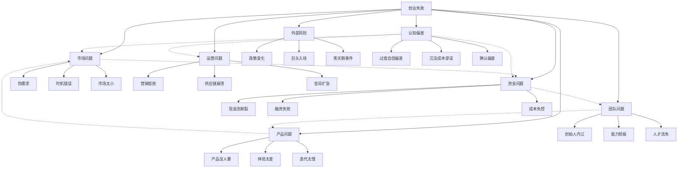
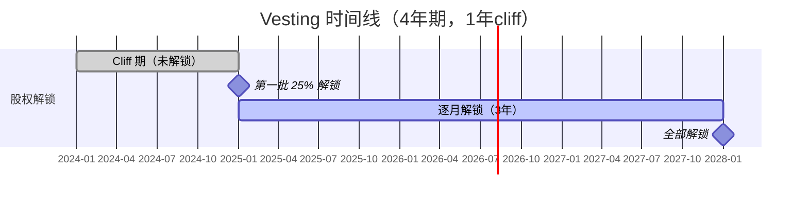

## 七、创业失败的常见原因及防范

创业是一场九死一生的征途。根据中国中小企业协会的数据，中国初创企业的一年存活率约为 60%，三年存活率降至 30% 左右，五年存活率不足 15%。CB Insights 曾对 101 家失败创业公司进行事后分析，梳理出 20 个最致命的失败原因，其中排名第一的"没有市场需求"占比高达 42%。哈佛商学院 Shikhar Ghosh 的研究则更为惊人：约 75% 的创业公司最终无法向投资者返还本金。

了解前人为何倒下，不是为了制造恐惧，而是为了在自己出发前就把雷区标出来。本节将系统剖析创业失败的核心原因，给出可落地的防范策略，并建立一套完整的风险自检与退出决策框架。

### 1. 创业失败原因全景图

创业失败很少由单一因素导致，通常是多个问题叠加形成的"死亡螺旋"。一个资金紧张的团队会做出短视的产品决策，产品方向错误导致用户流失，用户流失加剧现金流恶化，现金流压力又进一步撕裂团队——这就是典型的死亡螺旋。

下图展示了主要失败原因之间的关联：



上图中，虚线箭头表示常见的因果传导路径：市场问题导致收入不足进而引发资金危机，资金压力撕裂团队，认知偏差则会同时扭曲市场判断、资金规划和扩张决策。

按影响程度排序，以下是最常见的失败原因及其防范方案。

### 2. 第一致命原因：伪需求陷阱

#### 2.1 什么是伪需求

伪需求是指创业者自以为存在、但实际用户并不愿意为之付费（甚至不愿使用）的需求。这是创业失败中占比最高的原因（42%），也是最难自我察觉的——因为创业者往往对自己的想法深信不疑。

伪需求的五种典型表现：

| 类型 | 心理机制 | 表现 | 典型案例 |
|------|----------|------|----------|
| 自嗨型 | 虚假共识效应——误以为自己的偏好是大众偏好 | "我觉得这个功能超酷" | 某社交 App 加了 20 个花哨功能，用户只用聊天 |
| 技术驱动型 | 锤子定律——手里有锤子看什么都像钉子 | "我们有领先的技术" | 某 AI 公司技术领先但产品无人问津 |
| 想象型 | 投影偏差——把自己当成用户 | "用户一定需要这个" | 某上门洗车服务忽略了用户要在家等的麻烦 |
| 跟风型 | 幸存者偏差——只看到成功者 | "别人做这个赚钱了" | 盲目模仿成功案例但忽略差异化条件 |
| 痛点幻觉型 | 问题≠需求——问题存在不代表用户愿意付费解决 | "这个问题很大" | 噪音确实烦人，但没人愿意花钱买降噪窗帘 |

#### 2.2 如何识别伪需求

验证需求的核心原则是：**在投入大量资源之前，用最小成本获得真实的用户反馈**。

**第一步：问题访谈（而非方案访谈）**

这是最容易犯错的一步。很多人做的"用户调研"本质上是在推销自己的想法：

| 错误问法（方案访谈） | 正确问法（问题访谈） |
|----------------------|----------------------|
| "你觉得这个 App 怎么样？" | "你平时遇到 XX 问题时怎么处理的？" |
| "你会用这个功能吗？" | "你现在用什么工具解决这个问题？" |
| "这个设计好不好看？" | "你在这个环节最头疼的是什么？" |
| "如果免费你愿意用吗？" | "你上一次遇到这个问题是什么时候？" |

关键执行细节：
- 访谈至少 30 个目标用户，找到共性痛点（30 是统计显著性的最低门槛）
- 记录用户现有解决方案——他们已经在用的东西才是真正的竞争对手
- 注意区分"礼貌性肯定"和"真实兴趣"：用户说"挺好的"不代表会付费
- 访谈时观察用户的表情和语气，真诚的兴奋和礼貌的微笑差别很大

**第二步：Landing Page 测试**

用一个简单的产品介绍页面验证用户是否有行动意愿：

- 用 Carrd（$19/年）或 Notion 快速搭建一个单页网站
- 投放小预算广告（500-1000 元），百度竞价或微信朋友圈广告均可
- 核心指标：点击率（CTR）> 1% 说明广告素材有吸引力；注册/预约转化率 > 2% 说明需求可能成立
- 转化率 < 2% 先排查页面设计问题，如果优化后仍然低，说明需求不够强

**第三步：最小可行产品（MVP）验证**

MVP 的核心不是"简陋的产品"，而是"用最低成本验证核心假设的实验"。

MVP 的四种形态（按成本从低到高）：

| 形态 | 成本 | 适用场景 | 示例 |
|------|------|----------|------|
| 人工模拟 | 0-500 元 | 验证服务流程 | 手动帮用户完成任务，不写代码 |
| 绿野仙踪 | 500-5000 元 | 验证产品价值 | 前端看起来是自动化，后端人工处理 |
| 单功能原型 | 5000-2万元 | 验证技术可行性 | 只实现核心的一个功能 |
| Concierge | 时间成本 | 验证商业模式 | 为 10 个客户提供完全定制的服务 |

关键判断标准：关注"没有这个产品我会怎么办"的回答——如果用户说"也无所谓"，这就是危险信号；如果用户说"那我只能继续用 XX（很痛苦的方式）"，说明痛点真实存在。

**第四步：付费验证**

免费用户数不能证明需求——愿意付钱的用户数才是。在产品成型前就尝试预售或众筹。如果连定金都收不到，说明需求不够痛。

验证付费意愿的具体方法：
- 预售页面：明确标价，观察下单转化率
- 众筹平台：摩点、Kickstarter 等，验证是否有社区愿意支持
- 种子用户收费：哪怕只是象征性的 9.9 元/月，付费行为本身就是最强信号
- 企业客户 LOI（意向书）：To B 产品可以让客户签署合作意向函

#### 2.3 防范清单

- [ ] 至少与 30 个目标用户做过深度访谈
- [ ] 用户主动表达"我愿意为此付费"（而非你追问出来的）
- [ ] 已用 Landing Page 或 MVP 获得了真实数据（转化率、留存率、付费率）
- [ ] 存在至少一种竞品或替代方案（证明市场存在，没有竞品往往意味着没有市场）
- [ ] 能用一句话说清楚"谁在什么场景下愿意花多少钱解决什么问题"
- [ ] 验证了用户的现有替代方案及其痛点（用户愿意切换的成本底线）

#### 2.4 需求验证中的常见陷阱

**陷阱一：访谈对象偏差**

只访谈了身边朋友或同事——他们出于关系会给出正面反馈。正确做法是找到完全不认识你的目标用户。

**陷阱二：样本量不足**

访谈了 5 个人都说好，就信心满满开始投入。5 个人的"都说好"在统计上毫无意义，至少需要 30 个独立样本。

**陷阱三：混淆"需求"和"解决方案"**

用户说"我想要一个更快的马"——"更快的马"是解决方案，"快速到达目的地"才是需求。不要被用户的具体方案带偏，要挖掘底层需求。

**陷阱四：忽略竞争格局**

用户说"你的产品不错"但回去继续用竞品——这说明你的差异化不够。真正的验证是用户愿意从现有方案切换到你这里。

### 3. 第一致命搭档：资金链断裂

#### 3.1 资金链断裂的三种模式

资金问题导致的死亡有三种典型模式，每一种都有不同的预防策略：

**模式一：烧钱速度 > 收入速度（占比最高）**

最常见的情况。创始人低估了获取客户的成本，高估了收入增长速度，导致账上的钱比预期更早用完。

计算你的"跑道"（Runway）：

```text
跑道（月）= 当前现金余额 ÷ 每月净烧钱量
每月净烧钱量 = 每月总支出 - 每月总收入
```

例如：账上有 50 万，每月支出 8 万、收入 2 万，净烧钱 6 万/月，跑道约 8 个月。低于 6 个月就该拉响警报。

更深一层的分析——拆解你的烧钱结构：

| 支出类别 | 典型占比 | 可压缩性 | 优先级 |
|----------|----------|----------|--------|
| 人力成本 | 60-70% | 中（裁员有法律和士气成本） | 最后压缩 |
| 办公租金 | 10-15% | 高（可远程、共享办公） | 优先压缩 |
| 营销费用 | 10-20% | 高（可按 ROI 动态调整） | 根据效果调整 |
| 技术基础设施 | 5-10% | 中（可优化架构降本） | 持续优化 |
| 行政杂费 | 3-5% | 高 | 立即压缩 |

**模式二：融资时机错误**

- 账上只剩 3 个月才开始融资——投资人感知到你的窘迫，谈判筹码全无
- 在市场下行期被迫融资，估值大幅缩水
- 过度依赖单一融资渠道

融资的时间窗口规则：
- 健康状态（跑道 > 12 个月）：可以挑选投资人，争取最好条件
- 正常状态（跑道 6-12 个月）：应该启动融资流程（融资通常需要 3-6 个月）
- 紧急状态（跑道 < 6 个月）：被迫融资，估值会被压 30-50%
- 危险状态（跑道 < 3 个月）：可能融不到钱，需要考虑其他选项

**模式三：应收账款 / 回款周期问题（To B 企业高发）**

签了 100 万的合同，但回款周期 90 天，而员工工资和供应商付款必须按月结。账面盈利但实际现金流崩溃。

解决回款问题的具体方法：
- 合同中争取预付款比例（至少 30%）
- 设置阶段性付款里程碑（如 30%+30%+30%+10%）
- 对长期回款困难的客户引入保理服务（应收账款融资）
- 建立客户信用评级体系，对高风险客户缩短账期或要求担保

#### 3.2 资金管理实战框架

**预算管理三表法：**

| 报表 | 内容 | 频率 | 责任人 |
|------|------|------|--------|
| 现金流预测表 | 未来 12 个月的现金流入/流出预测（乐观/中性/悲观三个版本） | 每月更新 | CEO + 财务 |
| 资金消耗率表 | 每月实际支出 vs 预算对比，标注超支项 | 每周跟踪 | 财务 |
| 跑道预警表 | 按当前消耗率还能撑多久，触发不同级别的应对方案 | 每周更新 | CEO |

**资金安全线规则：**

| 区间 | 跑道 | 状态 | 必须执行的动作 |
|------|------|------|---------------|
| 绿灯区 | > 12 个月 | 安全 | 正常运营，可适度投入增长 |
| 黄灯区 | 6-12 个月 | 警觉 | 启动融资准备，压缩非必要开支 |
| 红灯区 | 3-6 个月 | 危险 | 紧急融资或战略调整，砍掉一切非核心支出 |
| 黑灯区 | < 3 个月 | 紧急 | 全面收缩，考虑合并/收购/有序退出，通知核心团队 |

**成本控制的关键原则：**

1. **固定成本最小化**：能租不买、能外包不招、能共享不独占。早期创业公司最大的固定成本陷阱是过早租大办公室和过快扩招。
2. **变动成本与收入挂钩**：营销费用按 ROI 动态调整，每一分钱都要可量化回报。
3. **至少保留 3 个月的应急储备金**：这笔钱不到生死关头绝不动用。
4. **创始团队在盈利前控制薪资**：建议不超过市场价的 60-70%，差额部分用股权补偿。
5. **砍成本要快、要狠**：一旦进入黄灯区，48 小时内做出削减决定。拖延一个月可能就是致命的。

#### 3.3 融资失败后的自救方案

融资不是唯一的生存方式。如果融资失败，还有这些路径：

| 方案 | 适用条件 | 具体做法 |
|------|----------|----------|
| Bootstrapping（自力更生） | 有收入能力但不够规模化 | 极致压缩成本，靠收入维持，等待时机 |
| Revenue-based Financing | 有稳定收入流 | 按月收入的一定比例偿还融资 |
| 战略合作 | 有互补的大企业客户 | 以服务换投资、以数据换资源 |
| 并购/合并 | 有互补的创业公司 | 合并团队和资源，降低整体成本 |
| 资产变现 | 有可出售的技术/数据/用户 | 有选择地出售部分资产续命 |
| Pivot（转型） | 原方向走不通但积累了可迁移的能力 | 转向相关但更有需求的方向 |

### 4. 团队内讧：创业公司最大的隐形杀手

#### 4.1 为什么团队问题如此致命

CB Insights 数据显示，23% 的创业公司死于团队问题。在早期阶段，团队几乎是全部资产——产品可以改、方向可以转，但核心团队一旦崩裂，公司基本就结束了。

创始人之间的问题主要集中在四个方面：

**（1）股权分配不合理**

最常见的致命错误：平均分配股权（如两个创始人各 50%）。这会导致：

- 重大决策陷入僵局，没有人有最终拍板权
- 贡献不对等时产生巨大怨恨
- 投资人看到 50/50 的股权结构会非常担忧（意味着公司可能陷入决策瘫痪）

合理的股权分配原则：

```text
核心创始人 ≥ 51%（或至少拥有决策权的投票权设计）
联合创始人 15-30%（根据能力稀缺性和投入程度）
期权池 10-20%（留给未来核心员工）
```

股权分配的量化参考框架：

| 维度 | 权重 | 评估要素 |
|------|------|----------|
| 创意/发起 | 10-15% | 谁提出的创业想法，谁做了前期验证 |
| 全职投入 | 20-30% | 谁全职参与，谁兼职或尚未加入 |
| 核心能力 | 20-30% | 谁的能力最难替代（技术壁垒、行业资源等） |
| 资金投入 | 10-20% | 谁出了启动资金 |
| 既有贡献 | 10-15% | 谁已经做了客户开发、产品原型等实际工作 |
| 未来承诺 | 5-10% | 未来 2-3 年的投入承诺和里程碑 |

**（2）角色和权责不清**

必须在公司注册前就明确：
- 谁负责产品？谁负责销售？谁负责技术？谁负责融资？
- 遇到分歧时谁拍板？（CEO 有最终决定权，但重大事项需要董事会讨论）
- 各自的 KPI 和 OKR 是什么？
- 谁有权做多少钱以下的决定不需要其他人同意？

**（3）能力互补失败**

三个技术背景的创始人做 C 端产品，没有一个懂营销和增长——这是真实的常见场景。创始团队至少需要覆盖三个核心能力象限：

| 能力象限 | 负责内容 | 关键技能 |
|----------|----------|----------|
| 产品/技术 | 产品研发、技术架构 | 工程能力、产品思维、架构设计 |
| 市场/销售 | 获客、变现、品牌 | 增长黑客、销售管理、品牌营销 |
| 运营/管理 | 内部管理、财务、法务 | 财务管理、HR、法务合规 |

如果创始团队只覆盖 1-2 个象限，早期可以通过外包或顾问补足，但必须在 6 个月内补齐核心能力。

**（4）信任崩塌**

信任一旦破裂，几乎不可能修复。常见触发点：
- 一方发现另一方隐瞒了关键信息（财务状况、客户关系、技术能力）
- 利益分配不透明（私自给自己发奖金、关联交易）
- 关键决策被绕过（一方单方面做了重大承诺）
- 工作投入严重不对等（一人 996 另一人朝九晚五）

#### 4.2 防范措施

**联合创始人协议（必签）：**

在正式合作前，必须书面约定以下内容：

| 条款 | 要点 | 常见坑 |
|------|------|--------|
| 股权分配 | 明确比例，附带 vesting 条款（通常 4 年，1 年 cliff） | 没有 vesting 导致早期退出者带走大量股权 |
| 角色分工 | 谁负责什么，决策权归属，KPI | 角色模糊导致互相推诿或争夺 |
| 退出机制 | 如果一方要退出，股份如何处理（回购价格、回购期限） | 没有约定退出价格，退出时扯皮 |
| 竞业限制 | 离职后多久不能做同类业务，地域范围 | 条款太宽泛被法院认定无效 |
| 分歧解决 | 重大分歧如何裁决（CEO 拍板、董事会投票、外部仲裁） | 没有仲裁机制导致僵局 |
| 薪酬标准 | 创始人薪酬、报销标准、涨薪条件 | 一人高薪一人低薪但没人说破 |
| 知识产权 | 创业前的 IP 如何注入公司，创业期间的 IP 归属 | 前东家技术被带入引发诉讼 |
| 配偶同意 | 股权不属于夫妻共同财产的声明 | 离婚导致股权被分割 |

**Vesting 条款的意义与细节：**

Vesting（股权成熟）是指创始人的股权不是一次性获得，而是分批"解锁"。标准方案是 4 年期限、1 年 cliff（干满一年才能拿到第一批 25%，之后每月解锁 1/48）。



这保护了所有创始人：如果有人半年就跑了，他只拿走应得的部分，不会带走 50% 的股权。

**加速解锁条款（Acceleration）：**
- 单触发（Single Trigger）：公司被收购时，未解锁股权立即全部解锁
- 双触发（Double Trigger）：公司被收购 + 创始人被解雇，才加速解锁
- 建议采用双触发，保护公司利益

#### 4.3 创始人关系维护的日常机制

协议只能解决"规则"问题，关系维护需要持续投入：

1. **每周一对一沟通**：不是业务会议，而是检查彼此的状态、压力、满意度
2. **季度复盘会**：回顾过去一个季度各自的表现，坦诚给反馈
3. **年度股权/薪酬审视**：如果贡献长期不对等，主动调整股权或补偿
4. **外部教练/导师**：找一个有经验的创业者定期辅导创始团队
5. **冲突升级机制**：小分歧 → 直接沟通 → 引入顾问 → 董事会裁决

### 5. 产品问题：做出没人要的东西

#### 5.1 产品失败的典型模式

**功能过度（Feature Creep）：**

创业者担心产品"不够好"，不断加功能，结果做出来一个臃肿、复杂、核心价值模糊的产品。用户面对 50 个功能不知所措，而竞争对手用 3 个核心功能就解决了 80% 的痛点。

功能优先级决策框架（RICE 评分法）：

| 维度 | 说明 | 评分范围 |
|------|------|----------|
| Reach（覆盖） | 多少用户会受影响 | 1-10 |
| Impact（影响） | 对单个用户的影响程度 | 0.25/0.5/1/2/3 |
| Confidence（信心） | 对估算的把握程度 | 10%/50%/80%/100% |
| Effort（工作量） | 需要多少人/周 | 1-10 |

```text
RICE 分数 = (Reach × Impact × Confidence) ÷ Effort
```

只做 RICE 分数排名前 20% 的功能，剩下的全部放入"不做"列表。

**用户获取成本（CAC）远超用户终身价值（LTV）：**

```text
LTV = ARPU（每用户平均收入）× 用户平均生命周期（月）
CAC = 总获客成本 ÷ 新增付费用户数
健康标准：LTV / CAC ≥ 3
危险信号：LTV / CAC < 1（每获取一个用户就亏钱）
```

例如：获取一个用户花了 100 元，但这个用户在整个生命周期里只贡献了 60 元收入——越做越亏。

不同行业的 LTV/CAC 基准参考：

| 行业 | 健康 LTV/CAC | 典型 CAC | 典型回收周期 |
|------|-------------|----------|-------------|
| SaaS（B端） | 3-5 | 500-5000 元 | 12-18 个月 |
| 电商（C端） | 3-4 | 20-200 元 | 1-3 个月 |
| 移动应用 | 2-3 | 5-50 元 | 1-6 个月 |
| 教育培训 | 4-6 | 200-2000 元 | 3-6 个月 |
| 本地生活 | 2-3 | 10-100 元 | 1-3 个月 |

**产品-市场契合（PMF）未达成就开始扩张：**

PMF 的判断标准：
- 用户自发推荐（NPS > 40）
- 用户留存率稳定（周留存 > 40% 或月留存 > 25%）
- 有用户主动抱怨"你们为什么不加 XX 功能"（说明他们在意，是好事）
- 不做推广用户也会自然增长（口碑传播占比 > 30%）
- Sean Ellis 测试：问用户"如果明天这个产品消失了你会怎么办？"——超过 40% 回答"非常失望"即达到 PMF

没达到 PMF 就招大量销售、投大量广告，相当于往漏桶里灌水。

#### 5.2 产品策略的正确姿势

**聚焦核心价值主张：**

用这个公式检验你的产品：

> 对于 [目标用户]，他们在 [场景] 下遇到 [问题]，我们的产品通过 [方案] 帮他们实现 [价值]，与 [竞品] 不同的是 [差异化]。

如果说不清楚，说明产品定位还不够清晰。建议团队每个人各自写下这段话，如果写出来的版本差异很大，说明团队对产品方向没有共识。

**用数据而非直觉驱动迭代：**

| 阶段 | 关注指标 | 工具 | 决策依据 |
|------|----------|------|----------|
| 验证期 | 注册转化率、首次使用率、激活率 | Google Analytics、GrowingIO、友盟 | 转化漏斗中哪一步流失最大 |
| 成长期 | 日活/周活、留存曲线、功能使用热力图 | Mixpanel、Amplitude、神策 | 哪些功能驱动留存，哪些是僵尸功能 |
| 成熟期 | LTV、CAC、NPS、流失率、推荐率 | 自建 BI、Tableau、Metabase | 单位经济是否健康，增长引擎是否可持续 |

**北极星指标（North Star Metric）的选择：**

每个阶段只关注一个最重要的指标，所有团队对齐它：

| 业务类型 | 推荐北极星指标 | 解释 |
|----------|---------------|------|
| SaaS | 周活跃付费用户数 | 反映真实使用价值 |
| 电商 | 月度 GMV（成交总额） | 反映交易规模 |
| 社交 | 日活用户平均使用时长 | 反映产品粘性 |
| 工具 | 周活跃用户中完成核心动作的比例 | 反映功能价值交付 |

#### 5.3 竞争壁垒的构建

产品不仅要"有人要"，还要"不容易被抢走"。创业公司应该尽早建立护城河：

| 壁垒类型 | 建设周期 | 难度 | 示例 |
|----------|----------|------|------|
| 网络效应 | 长 | 高 | 用户越多产品越好的平台（微信、淘宝） |
| 数据壁垒 | 中 | 中 | 积累的数据让产品越用越精准（推荐算法） |
| 转换成本 | 中 | 中 | 用户迁移成本高的产品（企业 ERP、CRM） |
| 品牌认知 | 长 | 高 | 品类即品牌（搜索=百度） |
| 技术专利 | 长 | 高 | 核心技术受专利保护 |
| 规模经济 | 长 | 高 | 规模越大单位成本越低（物流、供应链） |
| 生态锁定 | 极长 | 极高 | 围绕核心产品构建的生态系统（微信小程序） |

早期创业公司最现实的壁垒选择：数据壁垒 + 转换成本。通过快速积累用户数据提升产品体验，同时增加用户的迁移成本。

### 6. 营销与增长：酒香也怕巷子深

#### 6.1 营销失败的常见原因

**（1）没有找到可规模化的获客渠道**

很多创业公司的早期客户来自创始人的个人关系和人脉——这批客户不能代表真实的市场需求。当关系网用完后，增长就停滞了。

判断一个渠道是否可规模化的三个条件：
1. 获客成本可量化且可接受
2. 渠道天花板足够高（市场足够大）
3. 有优化空间（成本可进一步降低或效率可提升）

**（2）目标用户画像模糊**

"我们的产品面向所有人"等于"面向没有人"。精准的用户画像是有效营销的前提。

构建用户画像的具体方法：

| 维度 | 具体内容 | 数据来源 |
|------|----------|----------|
| 人口统计 | 年龄、性别、城市、收入、职业 | 注册数据、问卷调研 |
| 行为特征 | 使用频率、使用时段、核心路径 | 产品埋点数据 |
| 痛点需求 | 最大的三个痛点、现有解决方案 | 用户访谈 |
| 决策因素 | 价格敏感度、信息获取渠道、决策链 | 销售反馈、访谈 |
| 心理动机 | 使用产品的深层原因（省时/省钱/面子/恐惧） | 深度访谈 |

**（3）营销投入与阶段不匹配**

| 阶段 | 应该做什么 | 不应该做什么 |
|------|-----------|-------------|
| 验证期（0-100 用户） | 口碑、社群、内容营销 | 大规模投放广告 |
| 成长期（100-10000 用户） | 打透一个核心渠道 | 同时铺 10 个渠道 |
| 规模期（10000+ 用户） | 多渠道组合、品牌建设 | 只依赖单一渠道 |

#### 6.2 低成本增长策略

**种子用户获取（0→100）：**

| 方法 | 成本 | 适用场景 | 关键要点 |
|------|------|----------|----------|
| 社群渗透 | 低 | C 端产品 | 深入目标用户聚集的微信群、论坛、贴吧，先提供价值再推广 |
| 内容营销 | 低 | 专业服务/工具 | 在知乎、公众号、B 站输出专业内容，建立信任和权威 |
| 种子用户邀请 | 低 | 需要口碑传播 | 精选 50-100 个核心用户，给予 VIP 待遇，换取真实反馈和推荐 |
| 冷启动合作 | 中 | B 端产品 | 与互补产品/服务交叉推广 |
| 地推/线下 | 中 | 本地服务 | 精准覆盖目标区域，面对面建立信任 |
| 产品猎人/论坛 | 低 | 工具/应用 | 在 Product Hunt、V2EX 等平台发布 |

**规模化增长（100→10000）：**

找到一个经过验证的获客渠道后，集中资源把它打透，而不是分散到 10 个渠道各做一点。

判断渠道是否值得加注的三个条件：
1. 单位获客成本可量化
2. 渠道规模足够大（天花板够高）
3. 有优化空间（成本可进一步降低）

**增长飞轮的设计：**

最好的增长不是靠持续投入，而是靠飞轮效应——用户行为本身带来新用户：


设计增长飞轮时要问：用户的哪些行为会自然地吸引新用户？能否把"分享"嵌入产品核心流程？

### 7. 盲目扩张：增长的幻觉

#### 7.1 扩张失败的典型路径


**经典案例模式：**

- **瑞幸咖啡（2019年前）**：疯狂扩张开店，财务造假暴露后股价暴跌 80%，后通过收缩和调整模式起死回生
- **共享单车（2017-2018）**：ofo、摩拜等公司在资本驱动下无序投放，最终 ofo 欠债数十亿、用户押金无法退还
- **某餐饮品牌**：拿到融资后 6 个月开了 50 家店，供应链和品控跟不上，口碑崩塌，一年内关掉 40 家
- **某 SaaS 公司**：在核心产品 PMF 还没达成时同时开发 3 个新产品线，每个都做到半吊子，最终全部砍掉

#### 7.2 健康增长的判断标准

**扩张前必须满足的五个条件：**

1. **核心业务已经盈利**（或至少实现了 PMF，用户留存和 NPS 达标）
2. **单位经济模型健康**（LTV/CAC ≥ 3，且有优化空间）
3. **管理团队已经成熟**（不是只有创始人一个人能管，有中层管理者）
4. **有充足的现金储备**（扩张资金不依赖下一轮融资的预期）
5. **有清晰的扩张路径**（不是"先扩了再说"，而是有详细的执行计划和里程碑）

**扩张节奏建议：**

| 阶段 | 策略 | 原则 | 关键动作 |
|------|------|------|----------|
| 0→1 | 单点突破 | 只做一件事，做到极致 | 找到 PMF，建立核心流程 |
| 1→10 | 区域/品类扩展 | 复制已验证的模式到新场景 | 先验证可复制性，再扩大规模 |
| 10→100 | 体系化增长 | 建立可复制的运营体系和人才梯队 | 标准化流程、培训体系、管理系统 |

**团队扩张的节奏控制：**

一个常见的错误是"先招人再找事做"。正确做法是：

1. 现有团队已经超负荷运转 2-3 个月（不是感觉忙，是数据证明忙）
2. 明确新岗位的 KPI 和产出预期（招来的人第一个月要完成什么）
3. 先用外包/兼职验证需求的持续性
4. 确认持续性后再正式招聘

### 8. 认知偏差：创业者的心理陷阱

创业失败的根本原因往往不是外部环境，而是决策者自身的认知缺陷。以下是创业者最容易犯的认知偏差：

#### 8.1 致命认知偏差清单

| 偏差 | 定义 | 在创业中的表现 | 纠正方法 |
|------|------|---------------|----------|
| 过度自信偏差 | 高估自己判断的准确性 | "我最了解这个市场"（其实你了解的是三年前的市场） | 每个重要假设都找一个持反对意见的人 |
| 沉没成本谬误 | 因为已经投入太多而不愿放弃 | "我们已经花了 200 万做这个方向，不能放弃" | 问自己：如果今天从零开始，还会选这个方向吗？ |
| 确认偏差 | 只关注支持自己观点的信息 | 只看正面反馈，忽略负面信号 | 专门安排"唱反调"的角色或外部顾问 |
| 幸存者偏差 | 只看到成功案例 | "XX 公司也是这样成功的" | 研究同方向失败的案例（数量远多于成功的） |
| 光环效应 | 因为某一方面出色就认为全面出色 | "技术这么强，产品肯定没问题" | 分开评估每个维度 |
| 锚定效应 | 第一个接触到的数字影响后续判断 | 对标的第一个竞品的定价锚定了自己的定价 | 多看几个参考点，独立评估 |
| 从众心理 | 别人做什么自己也做什么 | "大家都在做 AI，我也要做" | 独立验证需求，不跟风 |
| 现状偏好 | 倾向于维持现状而非改变 | "现在这样也能过"（其实在慢性死亡） | 定期做"如果明天行业变了怎么办"的推演 |

#### 8.2 建立反偏差决策机制

1. **预设终止条件**：在启动项目前就约定"如果 6 个月内没有达到 X 指标，我们就 Pivot 或关闭"，写下来，让团队见证
2. **定期魔鬼辩护**：每月安排一次"为什么我们应该放弃"的讨论会，让团队成员自由列举理由
3. **外部视角引入**：每季度请 2-3 位行业外的人审视你的业务，他们没有你的偏见
4. **数据驱动决策**：所有重大决策必须有数据支撑，"我觉得"不能作为决策依据
5. **决策日志**：记录每个重大决策的理由和预期结果，定期回顾——你会发现自己的判断并不总是对的

### 9. 法律与合规风险

#### 9.1 常见法律风险

创业公司最容易忽视的法律问题：

**（1）股权纠纷**

- 没有签书面协议，口头约定无法举证——法院审理时"谁主张谁举证"，没有书面文件等于没有约定
- 代持股权引发归属争议——代持人可能否认代持关系，或被代持人的债权人申请冻结代持股权
- 退出条款缺失导致"僵尸股东"——离开的人仍持有股权但不做任何贡献

**（2）知识产权**

- 创始人在前东家工作期间开发的技术带入新公司，引发侵权诉讼——尤其注意前东家的竞业限制协议和知识产权归属条款
- 公司核心技术没有申请专利或软件著作权——被竞对抄袭时无法维权
- 使用了开源代码但违反了其许可证条款——GPL 的"传染性"要求衍生作品也必须开源

**（3）劳动用工**

- 未签劳动合同：入职一个月内未签，需支付双倍工资（最多 11 个月）
- 社保公积金违规：员工可主张被迫解除劳动合同，公司需支付经济补偿
- 竞业限制协议不规范：未约定补偿金的竞业限制条款可能被认定无效

**（4）数据合规**

- 《个人信息保护法》（2021年11月生效）对用户数据收集、存储、使用提出了严格要求
- 收集个人信息需要"知情+同意"，且不得过度收集
- 跨境数据传输需做安全评估（影响有海外业务的公司）
- 数据泄露事件可能面临行政处罚和民事赔偿

**（5）税务风险**

- 公私不分（个人消费走公司账）：被税务局认定为偷税，补税+罚款+滞纳金
- 关联交易定价不合理：关联方之间的交易价格需符合市场公允价格
- 发票管理混乱：虚开发票是刑事犯罪，创业者切勿心存侥幸

#### 9.2 防范措施

创业公司在法律合规方面的投入建议：

| 阶段 | 最低投入 | 关键动作 |
|------|----------|----------|
| 天使轮前 | 5000-10000 元 | 公司注册、股权协议、基础合同模板、竞业限制审查 |
| A 轮前 | 2-5 万元/年 | 法律顾问、知识产权申请（专利+软著）、员工手册、数据合规审查 |
| A 轮后 | 5-20 万元/年 | 专职法务或外部律所、合规体系搭建、投融资法律支持 |

**强烈建议**：在创业初期就找一位靠谱的创业律师（很多孵化器提供免费法律咨询），不要等到出了问题才找律师——那会贵 10 倍。

#### 9.3 创业者必须知道的法律底线

| 红线行为 | 后果 | 建议 |
|----------|------|------|
| 虚开发票 | 刑事责任（最高无期徒刑） | 绝对不做，找正规税务筹划 |
| 挪用公司资金 | 职务侵占罪 | 公私账户严格分开 |
| 非法集资 | 刑事责任 | 融资走正规渠道 |
| 侵犯商业秘密 | 民事赔偿+刑事责任 | 离职创业前审查竞业限制和保密协议 |
| 数据贩卖 | 刑事责任（侵犯公民个人信息罪） | 数据使用严格合规 |

### 10. 外部风险：不可控但可预防

#### 10.1 政策风险

2021 年的教培行业"双减"政策、游戏行业的版号收紧、互联网平台的反垄断监管——政策变化可以在一夜之间改变整个行业格局。

**防范策略：**

- 密切关注所在行业的政策动向，订阅国务院、工信部、行业主管部门的公告
- 不要把全部赌注押在单一政策红利上（如补贴、牌照）
- 保持业务的灵活性，确保能在 3-6 个月内完成业务方向调整
- 与行业协会保持联系，提前获取政策风向

**高风险行业清单（政策敏感度高）：**

| 行业 | 主要政策风险 | 典型监管机构 |
|------|-------------|-------------|
| 教育培训 | 行业准入、内容审查、收费监管 | 教育部、市场监管局 |
| 金融科技 | 牌照要求、利率限制、数据安全 | 央行、银保监会 |
| 医疗健康 | 资质要求、广告限制、数据合规 | 药监局、卫健委 |
| 游戏/内容 | 版号审批、内容审查、未成年人保护 | 版署、网信办 |
| 数据服务 | 数据安全法、个人信息保护法 | 网信办、工信部 |

#### 10.2 巨头入场

你的小众市场被验证后，巨头大概率会跟进。BAT、字节、美团等公司的"复制+补贴"策略消灭了无数创业公司。

**应对策略：**

- 深耕巨头不愿做的脏活累活（重运营、重线下、重垂直）
- 建立网络效应和数据壁垒——用户越多越好用的产品不容易被复制
- 速度为王：在巨头反应过来之前建立起规模优势
- 考虑被收购作为一种合理的退出路径（这不丢人，是成功的一种形式）

**巨头入场时的决策矩阵：**

| 你的位置 | 巨头的力度 | 建议策略 |
|----------|-----------|----------|
| 已有壁垒 + 巨头轻度试水 | 低风险 | 加速深耕，巩固壁垒 |
| 已有壁垒 + 巨头全力进入 | 中风险 | 考虑差异化或被收购 |
| 无壁垒 + 巨头轻度试水 | 中风险 | 快速建立壁垒 |
| 无壁垒 + 巨头全力进入 | 高风险 | 认真考虑 Pivot 或退出 |

#### 10.3 黑天鹅事件

新冠疫情、国际冲突、金融危机——突发事件对小微企业的影响尤为剧烈。

**底线准备：**

- 至少 6 个月的现金储备（疫情期间很多企业 2 个月就撑不住了）
- 核心业务的远程化能力（是否有 SaaS 化的备选方案）
- 关键供应商至少 2 个备选（不要把供应链放在一个篮子里）
- 商业保险（尤其是营业中断险、雇主责任险）
- 业务连续性计划（BCP）：至少做一次"如果明天办公室进不去，我们能继续运营吗"的推演

### 11. 创业失败的早期预警信号

不要等到山穷水尽才意识到问题。以下信号出现 2 个以上，就该认真审视方向了：

| 预警信号 | 严重程度 | 应对策略 | 观察周期 |
|----------|----------|----------|----------|
| 用户增长连续 3 个月停滞 | ⚠️ 中 | 重新审视获客渠道和产品价值 | 每月 |
| 月流失率 > 15% | 🔴 高 | 紧急排查流失原因，做用户回访 | 每周 |
| 创始团队出现严重分歧 | 🔴 高 | 引入第三方调解，或明确决策机制 | 立即 |
| CAC 持续上升但 LTV 不变 | 🔴 高 | 优化获客策略或提升用户价值 | 每月 |
| 现金跑道 < 6 个月 | 🔴 高 | 立即启动融资或成本优化 | 每周 |
| 核心员工离职率 > 20%/年 | ⚠️ 中 | 审视文化、薪酬和管理问题 | 每季度 |
| 产品 NPS < 0 | 🔴 高 | 用户已经不愿意推荐，产品需要大改 | 每月 |
| 无法用一句话说清价值主张 | ⚠️ 中 | 重新定位，聚焦核心价值 | 随时 |
| 竞品持续获得融资而你没有 | ⚠️ 中 | 分析竞品做对了什么，审视自己的差异化 | 每季度 |
| 创始人开始逃避问题 | 🔴 高 | 这是最危险的信号——正视它，寻求外部帮助 | 立即 |

**预警信号的监控方法：**

建立一个简单的"健康仪表盘"，每周更新一次，包含以下核心指标：

```text
┌─────────────────────────────────────────┐
│         创业健康仪表盘（每周更新）        │
├─────────────────────────────────────────┤
│ 现金跑道：___ 月    目标：> 6 月         │
│ 月活跃用户：___     趋势：↑/↓/→         │
│ 月流失率：___%      目标：< 10%         │
│ CAC：___ 元         趋势：↑/↓/→         │
│ LTV：___ 元         LTV/CAC：___        │
│ 团队满意度：___/10  目标：> 7           │
│ 本周最大风险：___________________________ │
│ 下周必须解决：___________________________ │
└─────────────────────────────────────────┘
```

### 12. 失败后的正确姿势

#### 12.1 复盘而非逃避

创业失败不是终点，而是下一次创业最重要的学费。但前提是你要真正从中学到东西。

**复盘四步法：**

1. **列出事实**：资金什么时候开始紧张的？用户增长什么时候停滞的？团队什么时候开始出问题的？按时间线梳理关键事件。
2. **分析根因**：用"5 个为什么"法追到根本原因，不要停在表面。例如："用户流失了" → 为什么？→ "产品不好用" → 为什么？→ "我们没有做用户测试" → 为什么？→ "团队赶进度忽略了质量" → 为什么？→ "创始人只关注增长不关注体验" → 根因：创始人的认知偏差。
3. **提取教训**：哪些错误是可以避免的？哪些信号被忽略了？如果重来会怎么做？每个教训要具体到"下次我会在什么时间点做什么不同的事"。
4. **记录存档**：写一份详细的复盘文档，这是最宝贵的创业资产。建议包含：时间线、关键决策点、数据变化、团队状态、外部环境变化、每个阶段的教训。

#### 12.2 善后处理清单

如果公司不得不关闭，以下事项必须妥善处理：

**人员处理：**
- 提前至少 30 天通知员工（法律要求 N+1 赔偿）
- 依法支付经济补偿金（N+1 或协商解除）
- 帮助推荐工作——创业者的口碑在圈子里传播很快
- 与核心团队做正式的告别和感谢

**投资人关系：**
- 主动沟通、坦诚说明情况（不要等投资人来问）
- 提供资产处置方案（剩余资金如何分配、IP 如何处理）
- 保持透明——投资人更恨隐瞒，不恨失败
- 失败后的坦诚沟通可能为下一次创业保留投资人人脉

**客户处理：**
- 提前通知客户停止服务的时间
- 确保数据安全转移或删除
- 已完成的服务义务要履行
- 提供替代方案推荐

**法律清算：**
- 成立清算组或聘请清算机构
- 通知债权人申报债权
- 清算资产、偿还债务
- 注销营业执照、税务登记、银行账户
- 处理未结合同和知识产权

**清算顺序（法定）：**

```text
1. 清算费用
2. 员工工资和社保
3. 税款
4. 普通债务
5. 股东分配（如有剩余）
```

#### 12.3 从失败中崛起

数据显示，连续创业者的成功率远高于首次创业者。Second-time founders 的成功率约为 20-30%，而首次创业者的成功率只有 10% 左右。你之前的失败经历不是污点，而是稀缺的实战经验。

很多知名企业家都经历过失败：
- **马云**：创办阿里巴巴之前，海博翻译社和中国黄页都不算成功
- **任正非**：创办华为之前，因经营不善被骗 200 万而离职
- **刘强东**：京东之前开的餐饮店倒闭了
- **史玉柱**：巨人大厦烂尾导致负债 2.5 亿，后来靠脑白金翻身
- **乔布斯**：被自己创办的苹果公司开除，创办 NeXT 失败后才回归苹果

关键不是你摔倒了几次，而是你从每次摔倒中学到了什么。

**失败后的心理恢复：**

创业失败带来的不仅是经济损失，还有严重的心理创伤。很多创业者在失败后陷入抑郁、自我怀疑、社交退缩。

| 阶段 | 典型表现 | 建议 |
|------|----------|------|
| 震惊期（1-2周） | 否认、愤怒、自责 | 给自己时间消化，不要做重大决定 |
| 低谷期（1-3月） | 抑郁、失眠、社交退缩 | 寻求心理咨询，保持运动和社交 |
| 接受期（3-6月） | 开始正视现实，能平静讨论 | 开始复盘，提取教训 |
| 重建期（6月+） | 重新找到方向和动力 | 规划下一步，可以是再次创业也可以是先加入其他公司 |

不要在低谷期做重大决定（包括"再也不创业了"的决定）。给自己时间恢复，再决定下一步。

### 13. 创业风险自检清单

在正式启动前，用这份清单做一次全面体检。每项如果打不到 3 分（满分 5 分），需要认真补足后再启动。

**市场维度：**
- [ ] 我验证了目标用户真的有这个需求（不是我觉得他们有）
- [ ] 我知道目标市场的规模有多大（TAM/SAM/SOM 分别是多少）
- [ ] 我了解主要竞品和替代方案（至少分析过 5 个竞品）
- [ ] 我能说清楚我们的差异化优势（用一句话）

**资金维度：**
- [ ] 我有足够的现金支撑至少 12 个月
- [ ] 我做好了收支预测和现金流计划（乐观/中性/悲观三个版本）
- [ ] 我知道在什么条件下启动融资，已经准备了融资材料
- [ ] 我的个人生活有 6 个月以上的缓冲（创业失败不会导致个人破产）

**团队维度：**
- [ ] 创始团队签订了正式的股权和分工协议
- [ ] 股权分配合理且附带 vesting 条款
- [ ] 团队能力覆盖产品、技术、市场三个核心领域
- [ ] 有明确的决策机制和分歧解决流程

**产品维度：**
- [ ] 已有 MVP 并获得了真实用户反馈
- [ ] 有至少 10 个非亲非友的用户愿意付费
- [ ] 单位经济模型是健康的（LTV/CAC ≥ 3）
- [ ] 产品能用一句话说清楚核心价值

**法律维度：**
- [ ] 公司注册和基本法律文件完备
- [ ] 知识产权归属清晰（包括创始人的前东家 IP 审查）
- [ ] 了解所在行业的监管要求
- [ ] 有基础的法律顾问关系

**心理维度：**
- [ ] 我预设了终止条件（什么情况下我会选择关闭或 Pivot）
- [ ] 我的家人/伴侣理解并支持这个决定
- [ ] 我有应对失败的心理准备和经济缓冲
- [ ] 我能区分"坚持"和"固执"——知道什么时候该放弃

### 14. 退出决策框架

知道什么时候该退出，和知道什么时候该开始一样重要。很多创业者之所以损失惨重，不是因为创业失败，而是因为明知不可为而固执坚持，把小亏拖成了大亏。

#### 14.1 退出信号矩阵

| 维度 | 继续坚持 | 考虑 Pivot | 考虑退出 |
|------|----------|-----------|----------|
| 市场 | 需求存在且增长 | 需求存在但方向需要调整 | 伪需求已被验证 |
| 资金 | 跑道 > 6个月且有融资可能 | 跑道 3-6个月，需要削减 | 跑道 < 3个月且融资无望 |
| 团队 | 核心团队稳定且有能力 | 有人离开但核心还在 | 核心团队已经分裂 |
| 产品 | 有 PMF 或接近 PMF | 没有 PMF 但有可迁移的技术/数据 | 没有 PMF 且产品没有壁垒 |
| 创始人 | 充满动力，有清晰方向 | 疲惫但仍有信心 | 身心俱疲，看不到希望 |

#### 14.2 退出的几种方式

| 方式 | 适用条件 | 收益预期 | 时间周期 |
|------|----------|----------|----------|
| 并购/被收购 | 有技术、数据或用户价值 | 中等（取决于谈判） | 3-12 个月 |
| 业务转让 | 有盈利能力但规模不够 | 较低 | 1-3 个月 |
| 资产清算 | 有可变现的资产 | 低 | 1-6 个月 |
| 有序关闭 | 无资产可变现 | 零（但控制损失） | 1-3 个月 |
| Pivot 转型 | 有能力可迁移但方向需调整 | 不确定（可能是新的开始） | 3-6 个月 |

**被收购的准备工作：**
- 整理好公司的技术文档、用户数据、财务报表
- 评估公司的核心资产价值（IP、用户、数据、团队）
- 聘请财务顾问或投资银行协助谈判
- 同时接触 2-3 个潜在买家以获得议价能力
- 确保创始人和核心团队的绑定条款（acqui-hire 场景下尤为重要）

> 创业不是赌博。赌博靠运气，创业靠准备。充分了解失败的原因，不是为了让你不敢创业，而是为了让你在该谨慎的地方谨慎，在该果断的地方果断。每一个被你提前识别并防范的风险，都是你比竞争对手多出的一份生存概率。而知道什么时候该体面退出，同样是创业智慧的重要组成部分。
