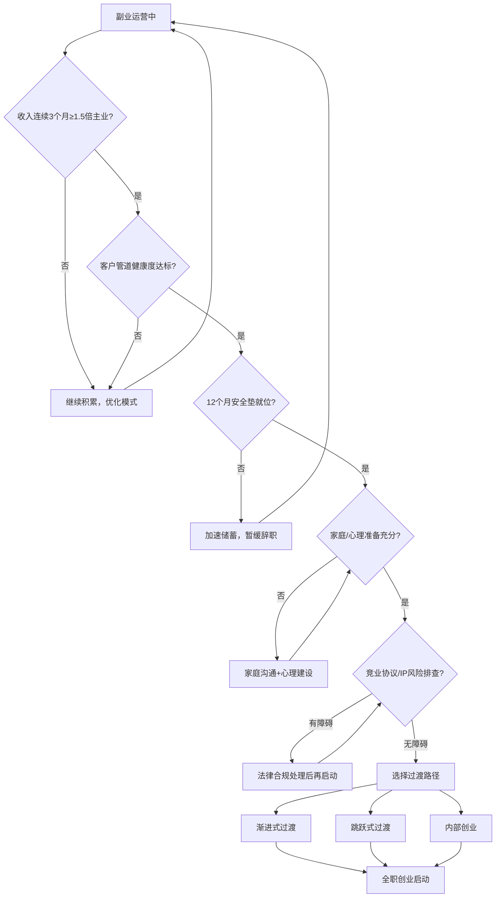
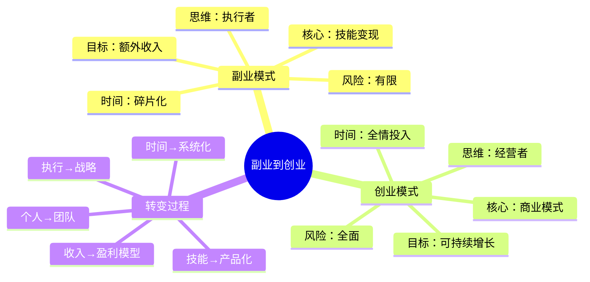
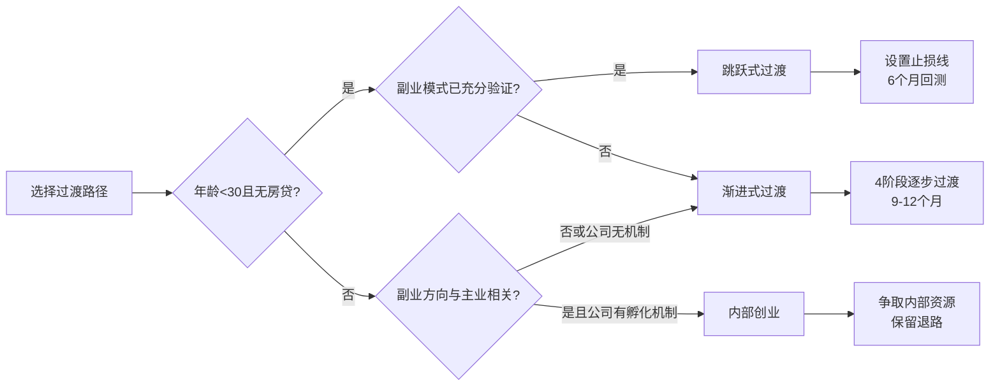
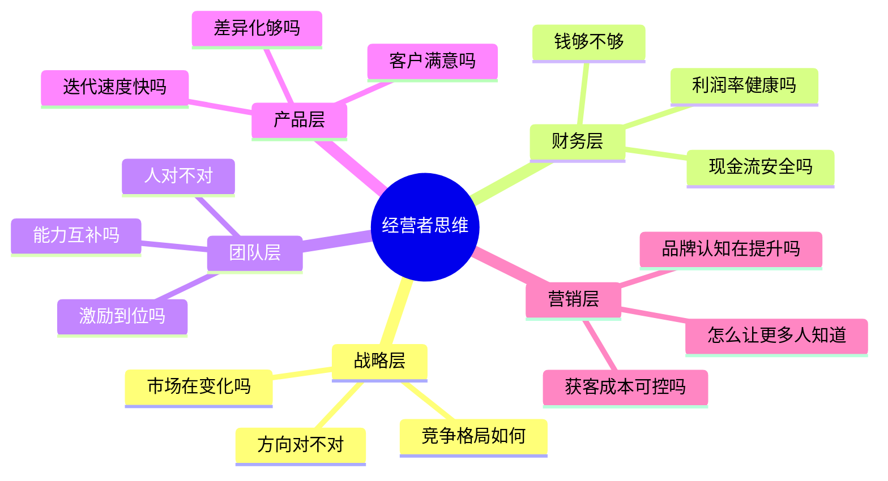
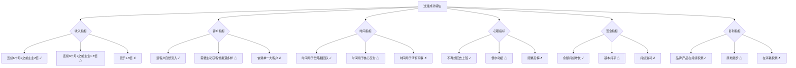

## 八、从副业到创业的过渡策略

副业和创业之间隔着一道看不见的门槛。很多人在副业阶段做得风生水起，一旦辞职全职投入反而迅速失败；也有人犹豫不决，在"再等等"中错失了最佳窗口期。根据中国中小企业协会2024年数据，从副业过渡到全职创业的群体中，前12个月的存活率仅为38%，远低于直接创业的52%——这组反直觉的数据说明：**过渡本身就是一种特殊的风险形态，需要专门的策略来应对。**

本章提供一套系统化的过渡决策框架，覆盖评估决策、路径选择、法务财务、心理建设、行业差异五大模块，帮你判断何时该跳、怎么跳、跳过去之后如何站稳。



### 1. 过渡的本质：从"兼职试错"到"全押命运"

副业的本质是**有限风险试错**——你有主业兜底，副业亏了顶多损失时间。创业的本质是**全面资源押注**——你的收入、社保、社交圈、心理状态全部围绕这个项目重新构建。

这两种状态的区别不只是"有没有全职工作"，而是一整套思维模式和资源分配方式的切换：

| 维度 | 副业模式 | 创业模式 | 切换难点 |
|------|----------|----------|----------|
| 时间投入 | 每天2-4小时，弹性安排 | 每天10-14小时，持续高强度 | 体力与意志力的极限挑战 |
| 收入结构 | 副业收入是"加法"，亏了不影响生活 | 创业收入是唯一来源，波动直接影响生存 | 从"安全垫思维"到"悬崖边行走" |
| 决策速度 | 可以慢慢试，错了就改 | 必须快速决策，犹豫就是成本 | 决策焦虑和信息过载 |
| 资源调配 | 用业余时间和少量资金 | 全部时间+可能需要外部融资 | 从个人能力到资源整合能力的跃迁 |
| 风险承受 | 最大损失是投入的时间 | 可能负债、断社保、影响家庭 | 风险认知的根本性转变 |
| 心理状态 | 有退路，心态轻松 | 无退路，压力巨大 | 自我身份认同的重建 |
| 税务身份 | 个人兼职收入 | 企业法人，需纳税申报 | 从个人税务到企业税务的合规升级 |
| 社会关系 | 朋友圈为主 | 需要构建供应商、客户、合作方网络 | 从"做事的人"到"做生意的人" |
| 知识边界 | 精通本职即可 | 需要通晓法律、财务、营销、管理 | 能力矩阵的全面扩张 |
| 时间价值 | 用时间换钱 | 用系统换钱 | 从"卖时间"到"卖产品/系统"的质变 |

**关键认知：副业做得好≠创业就能成功。** 副业成功依赖的是个人技能+碎片时间的组合，而创业成功依赖的是商业模式+全栈能力+资源杠杆的系统。很多副业做得好的人倒在创业路上，根本原因是**把"会做"等同于"会卖"，把"赚钱"等同于"做生意"。**

#### 1.1 副业与创业的本质区别：认知地图



### 2. 过渡前的核心评估：五个维度自检

在做出"辞职创业"这个不可逆决定之前，必须从五个维度严格评估自己的准备程度。每个维度给出具体指标，而不是模糊的"感觉差不多了"。

#### 2.1 收入稳定性评估

**核心标准：副业收入连续3个月超过主业收入的1.5倍**

为什么是1.5倍而不是1倍？因为：

- **社保成本增加**：创业后你需要自己缴纳社保（原来公司承担的部分现在全部自付），每月多出1000-3000元。以北京2025年标准为例，企业职工社保个人承担约10.5%，企业承担约27.8%，月薪1万的情况下，辞职后你每月多承担约2780元的社保费用。
- **收入波动缓冲**：创业初期收入必然有波动，需要留出缓冲空间。据调研，副业转全职创业的前6个月，月收入波动幅度平均达到40%-60%。
- **运营成本增加**：你可能需要投入资金购买设备、软件、推广等。
- **心理安全垫**：如果收入刚好持平，焦虑会影响判断力，导致急功近利的错误决策。

**具体验证方法：**

```text
月度收入追踪表（至少记录6个月）

月份 | 副业收入 | 主业收入 | 副业/主业比 | 副业成本 | 净利润 | 收入来源数
-----|----------|----------|-------------|----------|--------|----------
1月  |          |          |             |          |        |
2月  |          |          |             |          |        |
...  |          |          |             |          |        |

判断标准：
- 连续3个月比率 >= 1.5  → 收入维度达标
- 收入来源 >= 2个渠道    → 抗风险能力达标
- 净利润率 >= 30%        → 盈利能力达标
- 收入中位数(剔除极值) >= 主业收入的1.3倍 → 去除运气因素后的真实水平
```

**常见误区：把"偶然大单"当作稳定收入。** 比如某个月接了一个2万的项目，不代表每个月都能接到。要看**中位数**而不是平均数，剔除最高和最低月份后再计算。

**进阶工具——收入置信区间分析：**

```text
1. 收集至少6个月的副业月收入数据
2. 计算均值(X̄)和标准差(σ)
3. 计算95%置信下限：X̄ - 1.96σ
4. 如果置信下限 > 主业收入，说明收入稳定性有统计学支撑
5. 如果置信下限 < 主业收入，说明还有较大不确定性

示例：
月收入数据：8000, 12000, 15000, 9000, 20000, 11000
均值 = 12500，标准差 = 4213
95%置信下限 = 12500 - 1.96×4213 = 4242
主业收入 = 10000
结论：置信下限(4242) < 主业收入(10000)，收入稳定性不足，需要继续积累
```

#### 2.2 客户管道评估

**核心标准：至少有3个月的稳定客户来源，不依赖单一获客渠道**

客户管道的健康度直接决定创业后的生存能力。你需要回答以下问题：

1. **获客渠道多样性**：你的客户从哪里来？如果只依赖一个平台（比如只靠小红书引流），平台规则一变你就断粮。至少需要2-3个独立的获客渠道。
2. **客户复购率**：有多少客户会持续购买你的产品或服务？复购率低于20%说明你的产品黏性不足。
3. **客户获取成本（CAC）**：每获取一个客户需要花多少钱（包括时间和金钱）？如果CAC高于客户终身价值（LTV）的1/3，商业模式就有问题。
4. **客户画像清晰度**：你能否用3句话描述你的典型客户？如果描述不出来，说明你还没有真正理解自己的市场。

**客户管道健康度评分卡：**

| 指标 | 优秀 | 合格 | 需改进 | 计算方法 |
|------|------|------|--------|----------|
| 获客渠道数 | ≥3个独立渠道 | 2个渠道 | 仅1个渠道 | 统计过去3个月获客来源 |
| 月新增客户数 | 稳定增长(>10%月环比) | 基本稳定(±10%) | 波动剧烈(>±30%) | 月度新客户数量统计 |
| 客户复购率 | ≥40% | 20%-40% | <20% | 重复购买客户数/总客户数 |
| 客户转介绍率 | ≥20% | 10%-20% | <10% | 转介绍客户数/总客户数 |
| 客单价趋势 | 稳步上升 | 持平 | 持续下降 | 月度平均客单价对比 |
| 服务交付满意度 | ≥90%好评 | 70%-90% | <70% | 客户评价/回访统计 |
| LTV/CAC比 | ≥5:1 | 3:1-5:1 | <3:1 | 客户终身价值÷获客成本 |

**案例：一位副业做设计的朋友的客户管道分析**

```text
获客渠道：
  1. 朋友圈口碑推荐 —— 60%客户来源（过度集中）
  2. 小红书作品展示 —— 30%（平台依赖）
  3. 老客户复购 —— 10%

问题诊断：
  - 单一渠道依赖度过高（朋友圈=60%）
  - 复购率仅15%（项目制设计的通病）
  - 无转介绍激励机制

改进方案：
  - 开发第3渠道：知乎专业回答引流
  - 建立设计模板产品线，实现被动复购
  - 设计转介绍奖励：老客户介绍新客户享9折
  - 目标：3个月后渠道分布为40%/25%/20%/15%
```

#### 2.3 能力储备评估

副业阶段你可能只需要做好"交付"这一件事。创业后你需要同时扮演多个角色。美国小企业管理局(SBA)的研究表明，创业失败的首要原因不是资金不足，而是**能力矩阵不完整**——创始人只会做产品，不会卖产品。

**必须自己掌握的核心能力：**

- **产品/服务设计**：能独立完成从需求分析到交付的全流程。不只是"能做出来"，而是"能做出客户愿意持续付费的东西"。
- **销售与谈判**：能独立谈下客户，而不是等客户自己找上门。这是副业转创业最核心也最容易被忽视的能力——副业时你可能靠口碑被动接单，创业后你必须主动出击。
- **财务基础**：能看懂现金流、利润表，知道自己的钱花在哪里。不是要你成为会计师，但你至少要知道"这个月是赚了还是亏了"、"利润率是多少"、"现金还能撑多久"。
- **法律常识**：合同、知识产权、税务、劳动法的基本知识。一条竞业协议可能让你整个创业计划泡汤。

**可以外包但需要了解的能力：**

- 财务记账（可以请代账公司，但你必须能看懂报表）
- 设计（可以外包，但你要能判断好坏）
- 技术开发（可以雇人，但你要能评估技术方案）

**能力自评矩阵：**

对每项能力打分（1-5分），3分以上为达标：

```text
能力项          | 自评分 | 验证方式                    | 最低要求 | 达标后下一步
----------------|--------|-----------------------------|----------|------------
产品交付能力    |   ?    | 客户好评率、复购率          | 4分      | 建立标准化交付流程
销售能力        |   ?    | 独立成交的客户数量          | 3分      | 优化销售漏斗转化率
营销推广能力    |   ?    | 各渠道获客成本              | 3分      | 扩展至付费渠道测试
财务管理能力    |   ?    | 能否独立做月度收支表        | 3分      | 学习税务筹划基础
团队管理能力    |   ?    | 是否有协作/外包管理经验     | 2分      | 先从管理1个外包开始
抗压能力        |   ?    | 连续3个月无收入能否坚持     | 4分      | 建立压力管理机制
学习能力        |   ?    | 遇到新问题的解决速度        | 3分      | 建立知识管理系统
谈判能力        |   ?    | 能否在报价中不主动降价      | 3分      | 学习价值定价策略
```

**能力缺口的补充方案：**

| 缺口能力 | 快速补充方法 | 周期 | 成本 |
|----------|-------------|------|------|
| 销售 | 加入销售社群、阅读SPIN Selling、跟单练习 | 2-3个月 | <500元 |
| 财务 | 学习"小微企业财务实操"课程 | 1-2个月 | 500-2000元 |
| 法律 | 阅读《创业法律实务》+找律师做1次咨询 | 1个月 | 1000-3000元 |
| 营销 | 实操学习SEO/SEM/社交媒体营销 | 2-3个月 | <1000元 |
| 团队管理 | 先管理1-2个外包，在实践中学习 | 3-6个月 | 按项目付费 |

#### 2.4 现金储备评估

**核心标准：至少准备12个月的生活费作为安全垫**

为什么是12个月而不是6个月？统计数据表明，创业失败的高峰期在6-12个月。如果6个月时资金耗尽，你会被迫做出短视决策（降价接烂单、放弃长期方向追短期收益），这往往导致更快的失败。哈佛商学院的研究指出，充足的资金缓冲能让创业者的决策质量提升40%——因为他们在做决策时不会被生存焦虑绑架。

**现金储备计算公式：**

```text
安全垫 = 月固定支出 × 12 + 创业启动资金 + 应急预备金

月固定支出包括：
  房租/房贷
  餐饮
  交通
  社保（自缴部分）
  通讯费
  保险
  其他固定支出

创业启动资金包括：
  设备采购（电脑、工具等）
  办公场地（如果需要）
  公司注册费用
  首期营销预算
  外包服务预付
  专业服务费（律师、会计师首次咨询）

应急预备金：
  突发医疗
  家庭紧急支出
  建议预留 2-3个月固定支出
```

**实际案例：** 假设月固定支出8000元，创业启动需要2万元，应急预备2万元：
安全垫 = 8000 × 12 + 20000 + 20000 = 136,000元

这意味着你在辞职前，银行账户里至少要有13.6万元。如果达不到，继续攒钱，不要冲动辞职。

**进阶——现金流压力测试：**

```text
模拟三种场景下的现金消耗：

乐观场景（收入每月增长15%）：
  月份:  1    2    3    4    5    6    7    8    9    10   11   12
  收入:  8k   9k   10k  12k  14k  16k  18k  21k  24k  28k  32k  37k
  支出:  12k  12k  12k  13k  13k  14k  14k  15k  15k  16k  16k  17k
  净额: -4k  -3k  -2k  -1k  +1k  +2k  +4k  +6k  +9k  12k  16k  20k
  累计: -4k  -7k  -9k  -10k -9k  -7k  -3k  +3k  +12k 24k  40k  60k
  结论: 第4个月触底(-10k)，第8个月转正

基准场景（收入持平）：
  月份:  1    2    3    4    5    6    7    8    9    10   11   12
  收入:  8k   8k   8k   8k   8k   8k   8k   8k   8k   8k   8k   8k
  支出:  12k  12k  12k  12k  12k  12k  12k  12k  12k  12k  12k  12k
  净额: -4k  -4k  -4k  -4k  -4k  -4k  -4k  -4k  -4k  -4k  -4k  -4k
  累计: -4k  -8k  -12k -16k -20k -24k -28k -32k -36k -40k -44k -48k
  结论: 全年亏损48k，需要48k额外储备

悲观场景（收入下降20%后恢复）：
  结论: 需要更多储备或在第6个月启动止损计划

如果乐观场景下都撑不过6个月，绝对不要辞职。
```

#### 2.5 家庭与心理准备

这是最容易被忽视、却最容易导致失败的维度。据《创业心理学》期刊统计，创业过渡期内因家庭矛盾导致创业失败的案例占总失败数的23%。

**家庭层面：**

- **配偶/伴侣是否支持？** 不支持的后果是：创业压力 + 家庭矛盾双重夹击，极易崩溃。支持不只是"不反对"，而是"理解风险、愿意一起承担、在困难时不会施压让你回去上班"。建议在正式决定前，与伴侣进行至少3次深度沟通，内容包括：财务计划、风险预案、最坏情况下的应对方案、家务分工调整。
- **家庭是否有其他稳定收入来源？** 双职工家庭的风险承受能力远高于单收入家庭。如果伴侣有稳定收入，12个月安全垫可以适当减少到8-10个月。
- **是否有需要持续支出的刚性义务？** 比如房贷（占月收入比例超过40%需谨慎）、孩子教育（尤其是国际学校等高额支出）、老人赡养。

**心理层面自测清单：**

```text
□ 你能接受连续6个月没有任何"正反馈"吗？
□ 你能在朋友聚会时坦然说出"我在创业"而不是"我在某某公司上班"吗？
□ 你能独自承受重大决策的压力，而没有人可以商量吗？
□ 你的自我价值感是否依赖于"稳定的工作身份"？
□ 你能接受收入比上班时低30%-50%的现实吗？
□ 你在面对拒绝和失败时，恢复速度有多快？
□ 你是否有稳定的减压方式（运动、冥想、社交等）？

评分标准：
  5项以上为"是" → 心理准备较为充分
  3-4项为"是" → 需要加强心理建设，建议先做3个月的"模拟创业"测试
  2项以下为"是" → 不建议现阶段辞职创业
```

### 3. 过渡的三种路径

不是所有过渡都必须是"辞职→全职创业"这种非黑即白的模式。根据你的具体情况，有三种路径可选。



#### 3.1 路径一：渐进式过渡（推荐）

**适合人群：** 大多数人，尤其是有房贷/家庭负担的人

**核心思路：** 逐步减少主业投入，增加副业投入，直到副业完全取代主业

```text
阶段一（1-3个月）：主业100% + 副业兼职
  ↓ 目标：验证副业模式，建立稳定收入
  ↓ 关键动作：记录所有收入数据，建立客户档案
阶段二（3-6个月）：主业80% + 副业加码
  ↓ 目标：副业收入稳定超过主业
  ↓ 方法：申请减少主业工时，或转为远程/弹性工作
  ↓ 关键动作：注册公司/个体户，建立独立品牌
阶段三（6-9个月）：主业50% + 副业主导
  ↓ 目标：副业收入达到主业1.5倍
  ↓ 方法：与公司协商转为兼职/顾问
  ↓ 关键动作：搭建财务体系，建立标准化交付流程
阶段四（9-12个月）：辞职，全职创业
  目标：平稳过渡，无缝衔接
  关键动作：完成社保衔接，通知核心客户，启动增长计划
```

**优势：** 风险最低，随时可以回退
**劣势：** 过渡期长，需要同时兼顾两份工作，非常辛苦

**实操建议：**

- 阶段二中，尝试跟公司谈弹性工作制。很多公司愿意给核心员工灵活安排，尤其是远程办公已经普及的今天。谈判话术示例："我想申请每周一天远程办公，用于处理个人项目。我在过去X年的表现证明了我的自驱力，远程不会影响工作质量。"
- 利用主业的资源和人脉为副业铺路，但**必须检查竞业协议**（详见第4节法律部分）。
- 在阶段三之前不要辞职，即使你觉得"差不多了"。"差不多"是最危险的感觉，它意味着你还没有真正的数据支撑。
- 每个阶段结束时做一次"是否继续"的决策，如果阶段二结束时副业收入没有达到主业的1.5倍，延长过渡期而非强行推进。

#### 3.2 路径二：跳跃式过渡

**适合人群：** 年轻（<35岁）、无家庭负担、有一定积蓄（≥18个月安全垫）、副业模式已经充分验证（≥6个月稳定数据）

**核心思路：** 在一个时间节点果断辞职，全身心投入

**执行要点：**

1. **选择辞职时机**：最好在拿到一个大项目或签约长期客户之后。比如你刚签了一个6个月的服务合同，金额覆盖你半年生活费——这是最佳跳板。
2. **设置"止损线"**：比如"如果6个月后月收入低于X元，就回去上班"。止损线要写下来，贴在你看得到的地方，防止"再给自己一个月"的无限循环。
3. **辞职前完成所有准备工作**：公司注册、银行开户、办公场地、工具采购、客户迁移方案。辞职的第一天就应该是"开始工作"而不是"开始准备"。
4. **辞职后的第一周不要急着"开始创业"**，先花一周时间制定详细的90天计划。90天计划要包含：月度收入目标、客户开发计划、营销执行计划、财务预算。
5. **建立每日执行纪律**：固定作息时间（如早8晚7），打卡记录，每周复盘。

**风险提示：** 这条路径的心理压力极大。研究表明，创业者在创业初期的焦虑水平是上班族的2-3倍。如果你的心理承受能力一般，不建议选这条路。

**跳跃式过渡的决策检查清单（全部打勾才执行）：**

```text
□ 副业收入连续6个月≥主业收入2倍
□ 18个月安全垫已到位
□ 竞业协议排查完毕，无法律障碍
□ 至少2个独立获客渠道已验证
□ 1-2个稳定客户已签署过渡期合同
□ 配偶/家人明确支持
□ 心理自测≥5项"是"
□ 公司注册/个体户已完成
□ 90天启动计划已制定
□ 止损线已设定并书面记录
```

#### 3.3 路径三：内部创业

**适合人群：** 副业方向与主业高度相关，且公司有内部创业/孵化机制

**核心思路：** 不辞职，把副业项目变成公司内部项目

**操作方式：**

- 向公司提出项目方案，争取内部孵化资源。方案要突出：项目与公司战略的协同性、预期收益、所需资源、时间表。
- 以项目负责人的身份运营，公司提供资金、场地、人力
- 约定收益分成或股权。关键条款：项目失败后的去留安排、项目成功后的股权比例、知识产权归属。

**优势：** 零风险创业，有公司资源支持
**劣势：** 你可能失去项目的完全控制权，决策受公司政治影响

**内部创业的风险管理：**

| 风险点 | 预防措施 |
|--------|----------|
| 公司随时收回项目 | 在协议中约定最低运营期限（建议≥2年） |
| 知识产权归公司 | 提前约定个人在项目中的权益比例 |
| 收益分配不透明 | 约定独立核算、定期审计、分配时间表 |
| 公司战略调整导致项目终止 | 约定终止补偿条款和个人IP保留 |
| 核心团队被调走 | 约定核心成员的最低任期 |

**内部创业的谈判策略：** 先用数据证明项目的可行性（最好带着已经产生的副业收入数据），再谈资源和分成。用"我已经验证了市场需求，现在需要公司资源帮助规模化"的逻辑，比"我有一个想法"有力得多。

### 4. 过渡期的关键执行步骤

确定了路径之后，以下是具体的操作步骤。每一步都有明确的交付物和验收标准。

#### 4.1 法律与工商准备

**注册公司的时间窗口：** 在副业月收入稳定超过1万元时就应该注册，不要等到辞职时才做。提前注册的好处：以公司名义签合同更专业、可以开发票、为后续融资留接口。

**公司类型选择：**

| 类型 | 适合场景 | 税负 | 责任 | 注册难度 | 年度维护成本 |
|------|----------|------|------|----------|-------------|
| 个体工商户 | 小规模服务、自由职业 | 低（核定征收，月入10万以下免增值税） | 无限责任 | 最简单 | 几乎为零 |
| 个人独资企业 | 单人运营的咨询/设计类 | 中等（经营所得税5%-35%累进） | 无限责任 | 简单 | 代账费约2000-4000元/年 |
| 有限责任公司 | 需要融资、有合伙人 | 较高（企业所得税25%+分红个税20%） | 有限责任 | 中等 | 代账费约3000-6000元/年 |

**税务筹划要点：**

```text
场景：年收入30万的副业创业者

方案A：个体工商户（核定征收）
  增值税：月收入<10万免征（小规模纳税人）
  个人经营所得税：核定征收约1%-3%
  年税负：约3000-9000元（税负率1%-3%）

方案B：个人独资企业（查账征收）
  增值税：小规模纳税人3%（可抵扣进项）
  个人经营所得税：5%-35%累进，扣除成本后约10%-15%
  年税负：约30000-45000元

方案C：有限责任公司
  增值税：3%-13%（看行业）
  企业所得税：25%（小微优惠后实际5%-10%）
  分红个税：20%
  年税负：综合约25%-35%

结论：年收入50万以下且无特殊需求，个体工商户是税负最优选择。
     年收入超过50万或需要融资，考虑升级为有限责任公司。
```

**具体注册流程（以有限责任公司为例）：**

1. **核名**：在当地市场监管局网站查询公司名称是否可用。准备3-5个备选名称，避免热门词汇导致重名。
2. **准备材料**：身份证、注册地址证明（可用虚拟地址）、公司章程。公司章程要明确经营范围、股权结构、决策机制。
3. **提交申请**：线上（各地政务服务网）或线下提交。线上办理通常更快，3-5个工作日。
4. **领取营业执照**：通常3-5个工作日。
5. **刻章**：公章、财务章、法人章，费用约200-500元。
6. **银行开户**：开立对公账户，选择手续费低、网点方便的银行。四大行网点多但手续费高，招商/浦发等对小微企业更友好。
7. **税务登记**：在税务局完成登记，选择纳税人类型（小规模/一般纳税人）。年收入500万以下建议选小规模纳税人。
8. **社保开户**：为自己缴纳社保。

**费用预估：** 自己办理几乎免费（虚拟地址年费2000-5000元），找代办公司500-2000元服务费。

**竞业协议风险排查（极其重要）：**

在注册公司之前，必须检查与当前雇主的劳动合同中是否有竞业限制条款：

```text
竞业协议排查清单：

1. 找出劳动合同和保密协议，逐条检查竞业限制条款
2. 关注以下关键信息：
   - 竞业限制的行业范围（是"同行业"还是"任何竞争业务"）
   - 竞业限制的地域范围（是"全市"还是"全国"）
   - 竞业限制的时间期限（最长2年，超过部分无效）
   - 竞业补偿金（公司是否支付了竞业补偿？未支付则条款可能无效）
3. 如果副业方向与主业在同一行业：
   - 最安全：辞职后等竞业期满再开展相关业务
   - 次安全：与公司协商解除竞业限制
   - 风险方案：在不同细分领域开展，但需律师评估
4. 知识产权归属检查：
   - 利用公司资源（设备、时间、信息）开发的成果可能归公司所有
   - 副业开发时间必须与工作时间严格分离
   - 不使用公司的代码、设计、客户资源等任何资产
5. 建议花1000-3000元请劳动法律师做一次全面审查
```

#### 4.2 财务体系搭建

**创业第一天就要做的事：**

1. **开设独立银行账户**：个人账户和经营账户严格分开，这是最基本也是最重要的财务纪律。混用账户会导致：税务风险（个人消费计入经营成本）、法律风险（公司债务与个人债务混同）、管理风险（无法准确计算盈亏）。

2. **选择记账工具**：
   - **轻量级**：用Excel或Google Sheets建立收支表（适合月收入<2万）
   - **专业级**：用金蝶云星辰、用友好会计等SaaS记账软件（年费500-2000元，适合月收入2-10万）
   - **请代账公司**：月费200-500元，适合不懂财务的创业者。选择代账公司时注意：确认是否有代理记账许可证、了解服务内容（是否含报税、年报）、查看其他客户评价。

3. **建立预算制度**：每月初制定预算，月末复盘。预算偏差超过20%时必须分析原因。

**现金流管理模板：**

```text
月度现金流表

收入项               | 预算    | 实际    | 差异    | 备注
---------------------|---------|---------|---------|--------
产品/服务收入         |         |         |         |
咨询/培训收入         |         |         |         |
被动收入(模板/课程等)  |         |         |         |
其他收入             |         |         |         |
收入合计             |         |         |         |

支出项               | 预算    | 实际    | 差异    | 备注
---------------------|---------|---------|---------|--------
固定成本             |         |         |         |
  - 房租/场地        |         |         |         |
  - 软件/工具订阅    |         |         |         |
  - 社保/公积金      |         |         |         |
  - 代账费用         |         |         |         |
变动成本             |         |         |         |
  - 营销推广         |         |         |         |
  - 外包服务         |         |         |         |
  - 差旅交通         |         |         |         |
  - 原材料/库存      |         |         |         |
支出合计             |         |         |         |

净现金流             |         |         |         |
累计现金余额         |         |         |         |
现金可支撑月数       |         |         |         | 累计余额÷月均支出
```

**关键财务指标监控（每月必看）：**

| 指标 | 计算方式 | 健康值 | 警戒线 | 危险线 |
|------|----------|--------|--------|--------|
| 毛利率 | (收入-直接成本)/收入 | >50% | 30%-50% | <30% |
| 现金流覆盖率 | 现金余额/月均支出 | >6个月 | 3-6个月 | <3个月 |
| 客户集中度 | 最大客户收入/总收入 | <30% | 30%-50% | >50% |
| 固定成本占比 | 固定成本/总收入 | <30% | 30%-50% | >50% |
| 应收账款周转天数 | 应收账款/日均收入 | <30天 | 30-60天 | >60天 |

#### 4.3 社保与福利衔接

辞职后最大的现实问题之一是社保断缴。社保断缴影响：

- **医保**：断缴次月无法报销（部分地区有缓冲期，如北京允许3个月内补缴）
- **养老**：累计计算，断缴不影响总年限，但影响最终金额
- **购房/落户**：部分城市要求连续缴纳社保（如上海要求5年连续）
- **生育**：断缴后重新缴纳需满一定期限才能享受生育保险

**解决方案：**

1. **灵活就业社保**：以灵活就业身份自己缴纳养老和医保，去当地社保局办理即可。费用约为当地最低基数的20%-30%（养老20%+医保约10%）。以2025年北京为例，灵活就业社保月缴费约1800-2500元。
2. **注册公司后以企业身份缴纳**：公司成立后，可以给自己发工资并缴纳社保。这是最正规的方式，还可以把工资作为公司成本税前扣除。
3. **挂靠代缴**：找第三方公司代缴五险一金，费用较高且存在法律灰色地带（2023年人社部已明文禁止虚构劳动关系参保），不推荐使用。

**建议时间线：** 辞职前1个月就开始办理灵活就业社保或公司社保的衔接，确保无缝过渡。具体步骤：

```text
辞职前1个月：
  1. 向HR确认最后工作日和社保缴纳截止月
  2. 办理灵活就业社保登记（或确保公司已注册并开通社保账户）
  3. 确保医保无断缴窗口期

辞职当月：
  4. 确认原公司社保已减员
  5. 新的社保缴纳方式已生效
  6. 保留原公司社保缴纳记录备份
```

#### 4.4 客户与业务迁移

**不要让客户感受到"动荡"。** 你的过渡对客户来说应该是无感的。

具体操作：

1. **提前通知重要客户**：在辞职前1-2个月，私下告知核心客户你的变化。通知话术示例："张总，跟您说个事，我准备全职做XX方向了，之前给您做的那些项目以后会以XX公司的名义继续。服务标准不会变，反而因为全职投入，响应速度会更快。您放心，之前承诺的服务和售后一切照旧。"
2. **更新联系方式**：从"某某公司的某某"变为"某某公司的创始人/负责人"，而不是"自由职业者"。"创始人"比"自由职业者"带来的信任度完全不同。
3. **签署新合同**：以公司名义与客户重新签署服务协议。新合同要明确：服务范围、交付标准、付款方式、违约责任。
4. **保持服务标准**：过渡期的服务质量只能提高不能降低。这是建立客户信任的关键窗口期。
5. **建立客户迁移时间表**：

```text
客户迁移执行表：

客户名称 | 优先级 | 通知时间 | 新合同签署 | 备注
---------|--------|----------|-----------|------
大客户A  | P0     | 辞职前2个月 | 辞职前1个月 | 年框合同
大客户B  | P0     | 辞职前2个月 | 辞职前1个月 | 月度服务
中客户C  | P1     | 辞职前1个月 | 辞职当月   | 项目制
散客D-Z  | P2     | 辞职当月   | 随时       | 按需服务
```

#### 4.5 团队与外包体系

**创业初期不要急着招人。** 先用外包验证需求，再考虑全职雇员。招聘一个全职员工的真实成本是其工资的1.4-1.7倍（含社保、公积金、办公成本、管理成本）。

```text
用工策略演进路径：

第一阶段：100%自己做
  → 优势：成本最低，完全掌控
  → 适合：月收入 < 2万
  → 注意：记录所有任务耗时，为后续外包提供依据

第二阶段：核心自己做 + 非核心外包
  → 优势：聚焦核心价值，控制成本
  → 适合：月收入 2-5万
  → 外包方向：设计、客服、内容编辑、财务
  → 关键：建立标准化外包SOP，确保质量可控

第三阶段：小团队协作
  → 优势：可以接更大的项目
  → 适合：月收入 > 5万
  → 优先招聘：与你能力互补的人（你做技术就招销售，你做内容就招运营）
  → 关键：先签3个月试用合同，双向磨合

第四阶段：规模化团队
  → 需要管理体系、培训体系、绩效体系
  → 适合：业务已经标准化、可复制
  → 关键：建立组织架构图，明确汇报关系和KPI
```

**外包管理实操要点：**

| 要点 | 具体做法 |
|------|----------|
| 需求文档化 | 每个外包任务写brief：目标、标准、截止日期、验收条件 |
| 小批量试单 | 先给1个小任务测试质量和效率，再扩大合作范围 |
| 里程碑付款 | 按完成节点付款，不一次性全款预付 |
| 质量验收 | 设定明确的验收标准和修改次数上限 |
| 知识沉淀 | 外包交付的源文件、账号权限必须掌握在自己手中 |

**外包平台推荐：**
- 综合外包：猪八戒网、一品威客
- 设计外包：站酷海洛、千图网设计师、花瓣网设计师
- 开发外包：程序员客栈、开源众包、电鸭社区
- 写作外包：各写手群、豆瓣稿费银行
- 客服外包：专业客服外包公司，月费1500-3000元/坐席
- 短视频外包：各MCN机构的散单服务

### 5. 过渡期的常见陷阱与应对

#### 陷阱一：过早辞职

**症状：** 副业刚有起色，月入几千块就辞职了
**后果：** 经济压力导致焦虑，焦虑导致错误决策（如降价接烂单、盲目扩品类），错误决策导致失败
**应对：** 严格执行"连续3个月1.5倍"标准，不要用"感觉差不多了"替代数据
**真实案例：** 某自媒体博主粉丝5万时辞职，辞职后因急于变现接了大量低质量广告，粉丝3个月掉了2万，最终不得不回去上班

#### 陷阱二：永远不辞职

**症状：** 副业收入已经远超主业，但总觉得"再稳定一点"
**后果：** 错过市场窗口期，精力分散导致两边都做不好，副业增长停滞
**应对：** 设定明确的"触发条件"（如连续3个月副业收入≥主业2倍），满足就执行，不给自己犹豫的机会
**诊断方法：** 问自己——"如果我今天被公司辞退，我会选择去找下一份工作还是全力做副业？"如果答案是全力做副业，说明你已经准备好了

#### 陷阱三：辞职后松懈

**症状：** 终于自由了，先休息两个月再说
**后果：** 惰性一旦形成很难逆转，客户流失，收入断崖式下降，自信心受损
**应对：** 辞职后的第一天就按照创业作息开始工作，保持甚至提高工作强度。具体做法：在辞职前就制定好第一周的每日工作计划，打印出来贴在书桌前

#### 陷阱四：过度投入固定成本

**症状：** 租豪华办公室、买高端设备、请一堆人，觉得"创业就要有创业的样子"
**后果：** 现金流快速消耗，在产生收入之前就烧完积蓄
**应对：** 创业前6个月，固定成本控制在月收入的30%以内。办公可以在家或共享空间（月费500-2000元），设备够用就行，人员能外包就不雇全职
**关键原则：** 先证明商业模式可行，再投入固定成本。用"精益创业"的方式，最小化试错成本

#### 陷阱五：忽视法律风险

**症状：** 不签合同、口头约定、不开发票、不检查竞业协议
**后果：** 客户赖账无保障、税务违规被处罚、前东家起诉竞业违约
**应对：** 从第一笔业务开始就规范操作——签合同、开发票、留书面记录、请律师审查关键文件

**最低法律合规清单：**

```text
□ 标准服务合同模板（找律师定制或使用权威模板）
□ 发票开具能力（个体户/公司注册完成）
□ 竞业协议排查（与前雇主的劳动关系梳理）
□ 知识产权归属确认（副业作品不涉及前雇主IP）
□ 隐私政策（如有网站/小程序收集用户数据）
□ 商标注册（至少注册核心品牌名称的商标）
□ 保密协议模板（与客户、外包签订）
```

#### 陷阱六：单点依赖

**症状：** 80%的收入来自一个客户或一个平台
**后果：** 这个客户/平台一旦变动，你的业务直接归零
**应对：** 任何单一客户收入占比不超过40%，任何单一平台获客占比不超过50%
**分散策略：**

```text
收入分散目标（健康比例）：
  最大客户收入占比 ≤ 30%
  前3大客户合计占比 ≤ 60%
  主动获客渠道数 ≥ 3个
  被动收入占比目标 ≥ 20%

平台分散策略：
  不要把所有内容只发一个平台
  建立私域流量池（微信群、邮件列表、自建网站）
  定期导出平台数据备份
  每个平台的粉丝至少导流30%到私域
```

### 6. 过渡期的心态管理

创业过渡期最大的挑战往往不是业务层面，而是心理层面。据《创业者心理健康白皮书》数据，72%的创业者经历过中度以上的焦虑，45%经历过抑郁情绪。心态管理不是"鸡汤"，而是实实在在的生存技能。

#### 6.1 从"执行者"到"经营者"的思维转变

副业阶段你可能只需要做好手头的工作。创业后你必须同时思考：



**具体练习：** 每周花2小时做"CEO时间"——不处理具体事务，只思考方向性问题。可以用以下框架：

```text
每周CEO复盘模板

1. 本周最重要的3个成果是什么？（必须可量化）
   - 成果1: ___
   - 成果2: ___
   - 成果3: ___

2. 本周最大的1个问题是什么？根因是什么？（5个Why分析）
   - 问题: ___
   - Why1: ___
   - Why2: ___
   - Why3: ___
   - Why4: ___
   - Why5: ___
   - 根因: ___

3. 下周最重要的3件事是什么？（必须有明确的完成标准）
   - 事项1: ___ (完成标准: ___)
   - 事项2: ___ (完成标准: ___)
   - 事项3: ___ (完成标准: ___)

4. 我的时间花在了哪里？是否在做最重要的事？
   - 本周时间分配: 核心业务___% / 营销___% / 行政___% / 学习___%
   - 理想时间分配: 核心业务60% / 营销20% / 行政10% / 学习10%
   - 调整计划: ___

5. 现金流还能支撑多久？是否需要调整策略？
   - 当前现金余额: ___
   - 月均支出: ___
   - 可支撑月数: ___
   - 是否需要调整: ___
```

#### 6.2 建立创业者社交圈

上班族的朋友圈很难理解创业者的处境。当你在朋友圈说"这个月又亏了"，上班族的反应是"那你回去上班啊"——这不是恶意，而是认知差异。你需要找到"同类"：

- **本地创业者社群**：很多城市有创业者咖啡、孵化器社群。搜索"[你所在城市] 创业者社群"。
- **行业线下活动**：参加行业峰会、沙龙、meetup。不只是为了社交，更是为了获取行业信息和潜在合作伙伴。
- **创业导师**：找1-2个比你早3-5年的创业者作为导师。他们踩过的坑就是你的捷径。导师不一定需要正式拜师，定期吃饭聊天、请教问题即可。
- **线上社群**：知识星球中的创业类星球、行业微信群、即刻创业圈。
- **创业加速器/孵化器**：如果你的项目有一定规模，可以申请入驻。提供办公场地、导师资源、投资人对接。

**选择社交圈的原则：质量>数量。** 3个真正能聊深入的创业者朋友，比300个泛泛之交有用得多。

#### 6.3 管理焦虑的实用方法

1. **保持作息规律**：不要因为"自己当老板了"就作息混乱。固定的起床时间和工作时间能提供结构感，降低焦虑。建议：设定固定的"上班时间"（如早8:30），到点就坐到工作位上，下班时间也固定（如晚7:00），之后不再处理工作。

2. **运动**：每周至少3次30分钟以上的有氧运动。这不是鸡汤——运动确实能降低皮质醇（压力激素）水平，提升血清素（快乐激素）。据《柳叶刀》研究，规律运动对轻中度焦虑的效果与药物治疗相当。

3. **写下来**：把焦虑的事情写在纸上，然后分类——哪些是可以行动的，哪些是无能为力的。只关注可以行动的部分。对无能为力的部分，练习接受而非对抗。

4. **设置"焦虑时间"**：每天给自己15分钟专门用来焦虑，其他时间如果焦虑冒出来就告诉自己"留到焦虑时间再想"。这个认知行为疗法(CBT)技巧被大量研究证实有效。

5. **建立"成就日记"**：每天结束前写下3件今天做到的事，无论大小。创业初期正反馈很少，这个方法能帮你看到自己的进步。

6. **设定"不可谈判"的休息时间**：每周至少1天完全不工作。烧毁是创业失败的重要原因，持续高强度工作6个月后，你的决策质量会显著下降。

### 7. 不同行业的过渡策略差异

不同行业的过渡节奏和重点完全不同。以下是四个主要类别的详细分析。

#### 7.1 知识服务类（咨询、培训、写作）

- **过渡门槛最低**：几乎不需要固定资产投入，一部手机一台电脑就能开始
- **核心资产是个人品牌**：在辞职前就要把个人品牌做到行业前20%。具体指标：微信好友中目标客户≥500人、公域平台粉丝≥1万、有至少1个成功的标杆案例
- **收入天花板取决于定价能力**：学会从"按小时收费"过渡到"按价值收费"。按小时收费天花板是时间，按价值收费天花板是你的影响力
- **定价策略升级路径**：
  - 入门：按小时收费（100-500元/小时）
  - 进阶：按项目收费（5000-50000元/项目）
  - 高阶：按价值收费（帮客户多赚100万，收10万）
  - 顶级：订阅制/年费制（年度顾问费10-50万）
- **典型过渡周期：** 6-12个月
- **关键里程碑**：有3个以上可公开引用的成功案例、有稳定的被动流量来源、客单价持续上升

#### 7.2 电商类（实物产品、跨境电商）

- **需要资金压货**：库存是最大的现金流杀手。建议初期采用"一件代发"或"预售制"，验证需求后再囤货
- **供应链是核心壁垒**：在过渡期就要建立稳定的供应商关系。至少有2-3个备选供应商，避免单点依赖
- **平台规则风险**：不要只依赖一个平台，尽早建立独立站。2023年某平台大规模封店事件导致大量卖家断收
- **库存管理黄金法则**：
```text
  初期：一件代发（零库存）
    ↓ 月销稳定后
  中期：小批量备货（库存周转天数<30天）
    ↓ 品类验证后
  成熟期：正常备货（库存周转天数<60天）
  
  警戒线：库存金额超过月销售额的3倍 → 立即清仓减压
  ```
- **典型过渡周期：** 12-18个月
- **关键里程碑**：月销稳定在5万以上、库存周转天数<45天、有独立站且私域用户>1000人

#### 7.3 技术服务类（开发、设计、数据分析）

- **技术能力是基础但不是全部**：很多技术人创业失败是因为只会写代码不会卖。你需要培养"技术商业化"的能力——能用非技术语言向客户解释技术方案的价值
- **项目制收入波动大**：需要建立产品化思维，把服务变成可复用的产品。比如：把"定制开发网站"变成"行业网站模板+定制化配置"，提高交付效率和利润率
- **开源和个人项目是最好的名片**：GitHub上的项目star数比简历更有说服力。建议在辞职前维护2-3个有影响力的开源项目
- **技术创业的定价误区**：不要按"工时"定价（这是把自己当外包），要按"解决方案的价值"定价
```text
  错误定价：这个网站我做2周，按2000元/周收4000元
  正确定价：这个网站帮你每月多获取50个线索，每个线索价值200元，
           年增收12万，我收2万（1/6），3个月见效，无效退款
  ```
- **典型过渡周期：** 6-12个月
- **关键里程碑**：有可复用的技术产品或模板、GitHub项目有一定影响力、有1-2个长期维护客户

#### 7.4 内容创作类（自媒体、短视频、播客）

- **流量不等于收入**：10万粉丝不意味着能养活自己。关键指标是"粉丝变现效率"——每个粉丝每月能贡献多少收入
- **变现模式要提前验证**：
```text
  变现模式对比：
  
  广告变现：门槛低，但收入不稳定，受平台政策影响大
    适合：粉丝>10万的泛娱乐内容
  
  带货变现：收入可观，但需要选品能力和供应链
    适合：垂直领域、有信任基础的账号
  
  知识付费：利润率高(>70%)，但需要强专业背景
    适合：教育、技能、行业洞察类内容
  
  品牌合作：收入高且稳定，但门槛高
    适合：有明确人设和影响力的账号
  
  私域运营：最稳定，但前期投入大
    适合：所有类型，是长期最优解
  ```
- **平台依赖是最大风险**：尽早把粉丝沉淀到私域（微信、邮件列表、自建社区）。目标：私域用户数达到公域粉丝数的10%以上
- **典型过渡周期：** 12-24个月（内容创作需要较长的积累期）
- **关键里程碑**：至少2个变现模式已验证、私域用户>1000人、月被动收入>5000元

### 8. 过渡成功的标志

如何判断你已经成功过渡？以下是几个客观指标：



1. **收入指标**：连续6个月创业收入超过之前主业收入的2倍。1.5倍是"生存线"，2倍是"发展线"——达到2倍说明你不仅活下来了，还有余力投资增长。
2. **客户指标**：不依赖任何单一客户或渠道，新客户自然流入（至少30%的新客户是主动找上门的）。
3. **时间指标**：你的时间已经从"接单交付"转向"思考方向和培养团队"。如果80%的时间还在做具体执行，说明你还没有真正过渡到经营者角色。
4. **心理指标**：你不再怀念上班的日子，不再有"要不要回去上班"的念头。注意区分：这是真正的安心，还是自我欺骗。
5. **现金指标**：银行余额在增长而不是持续消耗。即使收入不错，如果支出更高，也不算成功过渡。
6. **复利指标**：你的品牌、客户群、产品体系在持续积累价值。如果你停止工作一个月收入就归零，说明你还在"卖时间"而不是"卖系统"。

当以上6个指标全部达标时，恭喜你——你已经完成了从副业到创业的过渡。接下来的挑战是**如何把小生意做成真正的企业**，那是另一个话题了。

**部分达标时的建议：**

| 达标数量 | 状态评估 | 下一步行动 |
|----------|----------|-----------|
| 6/6 | 过渡成功 | 聚焦规模化和团队建设 |
| 4-5/6 | 基本成功 | 针对未达标的1-2项重点突破 |
| 2-3/6 | 过渡中 | 继续保持，审视是否有结构性问题 |
| 0-1/6 | 过渡受阻 | 重新评估是否选对了方向，考虑调整或止损 |

### 9. 本章小结

从副业到创业不是一道"跳不跳"的选择题，而是一道"怎么跳"的系统工程。核心要点：

1. **用数据做决策，不要用感觉**：收入、客户、现金流，一切看数字。"感觉差不多了"是最危险的决策依据
2. **准备安全垫**：12个月生活费是底线，不是目标。算清楚你的具体数字，而不是用"大概够"来安慰自己
3. **选择适合自己的路径**：渐进式最安全（推荐大多数人），跳跃式最高效（适合年轻无负担者），内部创业最稳妥（适合主业高度相关者）
4. **先规范再做大**：法律、财务、合同，从第一天就正规化。前期多花1万元请律师，后期可能帮你避免100万的损失
5. **心态管理是必修课**：创业最难的不是赚钱，而是在不确定性中保持稳定输出。建立规律作息、运动习惯、社交支持系统
6. **不要孤军奋战**：找到同行者、导师和社群。创业是孤独的，但不需要独自承受
7. **认识行业差异**：知识服务类过渡最快（6-12个月），电商和内容创作类需要更长的验证期（12-24个月），每种类型的核心壁垒和风险点不同

**最终记住一句话：最好的过渡时机不是"准备好了"的时候，而是"准备充分且数据支持"的时候。"准备好"是一个永远不会到来的状态，但数据不会骗人。**
