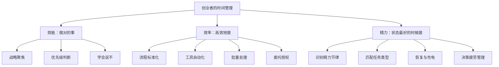

## 九、创业者的时间管理

创业者的最大瓶颈不是资金、不是技术，而是**时间**。与上班族不同，创业者没有固定的上下班边界，没有上级帮你排优先级，所有事情同时涌来——产品、客户、团队、财务、营销——每一件都"紧急"，每一件都"重要"。时间管理不是锦上添花的效率技巧，而是决定创业生死存亡的核心能力。

本章从效能（做对的事）、效率（高效地做）、精力管理（状态最好的时候做）三个层次出发，覆盖从时间审计到系统构建的完整链路，帮助你建立一套可执行、可迭代的个人时间管理系统。

### 1. 为什么创业者的时间管理与众不同

#### 1.1 创业者面临的独特时间困境

上班族的时间被组织结构切割好了：会议、流程、汇报，虽然限制自由但提供了秩序。创业者则完全相反——自由度极高，但正是这种自由让人陷入混乱。

**创业者的时间困境有四个特征：**

| 困境 | 表现 | 后果 |
|------|------|------|
| 无限职责边界 | 产品、销售、客服、财务、HR 一人兼任 | 每天切换十几种角色，认知负荷极高 |
| 无外部约束 | 没人打卡、没人催进度 | 拖延症被放大，一天结束发现什么都没做 |
| 高度不确定性 | 市场随时变化，计划随时被打断 | 原定计划频繁作废，挫败感积累 |
| 决策疲劳 | 每天要做几十个大小决策 | 到下午脑子已经不转了，错误决策增加 |
| 角色切换成本 | 从写代码到接客户电话到对账 | 每次切换需要15-23分钟重新进入状态 |

#### 1.2 Paul Graham 的 Maker's Schedule vs Manager's Schedule

这是理解创业者时间困境最重要的一个框架。Paul Graham 在2009年提出，世界上存在两种截然不同的日程模式：

| 维度 | Maker's Schedule（创造者日程） | Manager's Schedule（管理者日程） |
|------|------|------|
| 最小时间单位 | 半天（3-4小时） | 1小时 |
| 典型职业 | 程序员、设计师、写作者 | 管理者、销售、投资人 |
| 会议的影响 | 一场1小时的会议可以毁掉整个半天 | 会议是日程的基本单元 |
| 核心要求 | 不被打断的连续时间块 | 快速在不同事项间切换 |

**创业者的问题在于：你同时需要两种日程。** 产品开发需要Maker's Schedule，但团队管理和客户沟通需要Manager's Schedule。解决方案是**按时间段分隔两种模式**，而不是混合在一起。比如上午是Maker模式（深度工作），下午是Manager模式（会议和沟通）。

#### 1.3 时间管理的底层逻辑

时间管理的本质不是"把更多事情塞进一天"，而是**确保你在有限时间里做对了最重要的事**。

这里有三个层次：

1. **效能（Effectiveness）**：选择做正确的事 → 战略和优先级判断
2. **效率（Efficiency）**：用更少时间完成同一件事 → 工具和流程优化
3. **精力管理（Energy Management）**：在高能量时段做高价值事 → 生理节律匹配

大多数时间管理培训只教第二层。但创业者真正需要的是三层同时做好——**做对的事（效能），高效地做（效率），在状态最好的时候做（精力管理）**。



### 2. 效能层：确保你在做正确的事

#### 2.1 艾森豪威尔矩阵的创业版

经典的"重要-紧急"四象限所有人都听过，但大多数创业者用错了——因为他们没有区分**创业阶段**。

**创业早期（0-1阶段）的优先级逻辑：**

```text
┌─────────────────────────────────────────────────────────┐
│                    紧急         不紧急                    │
│  ┌───────────────────────┬───────────────────────────┐  │
│  │       第一象限         │       第二象限             │  │
│  │   紧急且重要           │   重要但不紧急             │  │
│  │                       │                           │  │
│  │ · 客户投诉/退款        │ · 产品迭代优化             │  │
│  │ · 系统宕机/线上事故     │ · 学习新技能               │  │
│  │ · 供应商最后期限        │ · 建立人脉关系             │  │
│  │ · 合伙人冲突           │ · 制定长期战略             │  │
│  │ · 现金流危机           │ · 健康和家庭               │  │
│  │                       │ · SOP和流程建设            │  │
│  │ 处理完立刻回到第二象限   │ ← 你的主战场              │  │
│  ├───────────────────────┼───────────────────────────┤  │
│  │       第三象限         │       第四象限             │  │
│  │   紧急但不重要         │   不紧急也不重要           │  │
│  │                       │                           │  │
│  │ · 大部分邮件/微信       │ · 刷社交媒体               │  │
│  │ · 不必要的会议          │ · 过度研究竞品             │  │
│  │ · 别人的紧急请求        │ · 完美主义打磨             │  │
│  │ · 行政杂务             │ · 无目的的网络浏览          │  │
│  │ · 非核心的群消息        │ · 低质量的社交应酬          │  │
│  │                       │                           │  │
│  │ 委托/自动化/批量处理    │ 直接砍掉                   │  │
│  └───────────────────────┴───────────────────────────┘  │
└─────────────────────────────────────────────────────────┘
```

**关键认知：** 创业者80%的时间应该花在第二象限（重要但不紧急的事）。如果你发现自己整天都在救火（第一象限），说明系统出了问题——要么流程有缺陷，要么你没有正确授权。

**实操：四象限每日校准法**

每天早上花3分钟，把今天要做的事分别放进四个象限：

1. 先列出所有待办（通常15-25项）
2. 逐项问自己：这件事重要吗？（对核心目标有贡献）紧急吗？（今天不做会有不可逆后果）
3. 第一象限的事先做，然后把所有时间投入第二象限
4. 第三象限的事批量处理或委托
5. 第四象限的事直接删掉

#### 2.2 帕累托法则的深度应用

80/20法则人人都会说，但创业者需要往下想三层：

**第一层：** 你80%的收入来自20%的客户 → 把时间花在高价值客户上

**第二层：** 你80%的成果来自20%的工作内容 → 识别你的"高杠杆活动"

**第三层：** 你80%的时间被20%的低效习惯消耗 → 找到并消灭这些时间黑洞

**实操：如何找到你的高杠杆活动**

1. 连续一周，每小时记录你在做什么（用 Toggl 或手动记录）
2. 周末回顾，给每项活动打分：1-10 分评估它对收入/增长的贡献
3. 找出得分 ≥8 的活动，这就是你的高杠杆活动
4. 下周把这些活动的时间占比从当前水平提高 50%

**案例：** 一位做独立开发的创业者发现，他的高杠杆活动是"写技术博客引流"和"与用户一对一访谈"，而"优化代码性能"和"回复社媒消息"是低杠杆活动。他把每天早上最清醒的2小时留给博客写作，访谈固定在每周三下午，其他事情要么自动化要么推迟。三个月后，博客带来的自然流量增长了340%，用户访谈直接推动了两个核心功能的上线。

#### 2.3 OKR 目标对齐法：确保每周的努力指向正确方向

很多创业者忙碌但没有成果，根本原因是**周计划和月度/季度目标脱节**。OKR（Objectives and Key Results）是硅谷创业公司最常用的目标对齐工具。

**创业者的简化版OKR：**

```text
季度目标（O）：3个月内将月收入从5万提升到15万
  ├── KR1：新增付费用户300人（当前100人/月）
  ├── KR2：客单价从500元提升到800元
  └── KR3：月流失率从15%降到8%

月度拆解（3月）：
  ├── KR1 对应动作：启动内容营销（每周3篇）+ 老带新裂变活动
  ├── KR2 对应动作：推出高级版套餐 + 年付优惠
  └── KR3 对应动作：上线新手引导优化 + 建立用户社群

本周重点（第2周）：
  ├── 写3篇SEO文章（指向KR1）
  ├── 完成高级版定价方案（指向KR2）
  └── 设计新手引导流程图（指向KR3）
```

**核心规则：** 每周的3件MIT（Most Important Tasks）必须能追溯到季度OKR。如果追溯不到，要么这个任务不该做，要么你的OKR需要调整。

#### 2.4 学会说"不"：创业者的必修课

创业早期最难的事情之一就是拒绝。每个机会看起来都可能是突破口，每个请求都可能是潜在客户。但**每一个"是"的背后都是对现有承诺的稀释**。

Warren Buffett 说过："成功人士和非常成功人士的区别在于，非常成功人士几乎对所有事情说不。"

**判断是否接受的五层过滤器：**

```text
第1层：这件事推进我的OKR吗？
  ├── 是 → 进入第2层
  └── 否 → 拒绝（或放入"未来也许"清单）

第2层：这件事只有我能做吗？
  ├── 是 → 进入第3层
  └── 否 → 委托（指定人+截止时间）

第3层：这件事的时间窗口是什么？
  ├── 永久开放 → 推迟到本季度OKR完成后
  └── 有截止日 → 进入第4层

第4层：投入产出比如何？
  ├── 高回报（>5倍） → 接受
  ├── 中等回报（2-5倍） → 看是否有带宽
  └── 低回报（<2倍） → 拒绝

第5层：接受它会让我放弃什么？
  └── 用"机会成本"做最终决定
```

**实用拒绝话术（按场景分类）：**

| 场景 | 话术 | 要点 |
|------|------|------|
| 商务合作邀约 | "这个方向很好，但我这个月集中精力在X上，我们下个月再聊？" | 给出具体时间，而非模糊的"以后" |
| 社交/活动邀请 | "感谢邀请，但目前不符合我的优先级。" | 不需要解释原因 |
| 朋友求帮忙 | "我很感兴趣，但我目前没有带宽。我推荐你联系Y，他在这方面很强。" | 提供替代方案 |
| 投资人/媒体邀约 | "非常感谢关注，我们目前阶段聚焦在产品打磨上，合适的时候会主动联系。" | 保持关系但不消耗时间 |
| 内部团队请求 | "这个想法不错，你能不能先写一个简短的方案？我们周三快速过一下。" | 把球踢回去，让对方做准备 |

### 3. 效率层：如何更快更好地完成任务

#### 3.1 时间块（Time Blocking）系统

时间块是创业者最强大的效率工具。Cal Newport 在《Deep Work》中系统阐述了这个方法：**把一天分成若干个固定的"块"，每个块只做一类事情**。核心原理是减少决策成本——你不需要在每个时刻重新决定"现在做什么"，日程表已经告诉你了。

**推荐的创业者日常时间块模板：**

| 时间段 | 块类型 | 具体内容 | 时长 |
|--------|--------|----------|------|
| 6:30-7:30 | 晨间仪式 | 运动/冥想/阅读 | 60 min |
| 7:30-8:00 | 日计划 | 回顾今日3件要事（MIT），检查日程 | 30 min |
| 8:00-10:00 | 深度工作块 1 | 最重要的创造性工作（Maker模式） | 120 min |
| 10:00-10:15 | 休息 | 走动、喝水、远眺 | 15 min |
| 10:15-11:30 | 深度工作块 2 | 第二重要的工作（Maker模式） | 75 min |
| 11:30-12:30 | 沟通块 | 处理邮件、消息、电话 | 60 min |
| 12:30-13:30 | 午餐+休息 | 午睡20分钟效果极佳 | 60 min |
| 13:30-15:00 | 协作块 | 会议、团队沟通、面试（Manager模式） | 90 min |
| 15:00-16:30 | 执行块 | 行政事务、流程优化、审批 | 90 min |
| 16:30-17:00 | 日复盘 | 今天完成了什么，明天最重要的1件事 | 30 min |
| 17:00以后 | 恢复时间 | 家庭、爱好、社交 | — |

**时间块的四条铁律：**

1. **深度工作块不可侵犯**——把手机调成勿扰，关掉所有通知，不看微信不看邮件。这两小时产出可能等于你其余所有时间的总和。如果必须在深度工作时间开会，把会议移到协作块。
2. **沟通必须集中处理**——每次被打断后需要23分钟才能恢复专注（UC Irvine 研究数据）。散落在全天的碎片化回复是效率杀手。
3. **灵活但不随意**——如果计划被意外打乱，不要放弃时间块，而是重新分配剩余的块。被打乱≠失败，放弃系统才是失败。
4. **每周固定"大块"主题日**——比如周一战略思考日、周三客户日、周五财务+复盘日。同类型任务放在同一天，减少角色切换。

**进阶：主题日（Theme Day）模板**

| 日 | 主题 | 主要活动 |
|------|------|------|
| 周一 | 战略日 | 本周目标设定、方向思考、关键决策 |
| 周二 | 产品日 | 产品开发、设计评审、技术方案 |
| 周三 | 客户日 | 客户访谈、销售跟进、用户反馈 |
| 周四 | 团队日 | 1对1会议、流程优化、招聘面试 |
| 周五 | 运营日 | 财务对账、数据复盘、下周计划 |

Jack Dorsey 在同时运营 Twitter 和 Square 时就采用了主题日方法，确保每周对每家公司都有足够的专注时间。

#### 3.2 任务批处理（Batching）

把同类任务集中在一起一次性处理，而不是来一个处理一个。批处理之所以高效，是因为它消除了**上下文切换成本**——大脑不需要在不同任务类型之间反复重启。

**适合批处理的任务：**

| 任务类型 | 批处理方式 | 节省时间 | 工具辅助 |
|----------|-----------|----------|----------|
| 邮件和消息回复 | 固定2-3个时间点集中回复，设置自动回复告知 | 每周5-8小时 | 邮件客户端定时检查 |
| 社交媒体发布 | 一次性排好一周的内容 | 每周3-5小时 | Buffer / Later / 微信公众号定时发布 |
| 财务记账 | 每周五下午统一处理发票、报销、对账 | 每月4-6小时 | 金蝶 / FreshBooks |
| 内容创作 | 一次录制3-5个视频/写3-5篇文章 | 效率提升2-3倍 | 提前列好选题清单 |
| 客户回访 | 集中时间段打电话 | 每周2-3小时 | CRM系统批量拨号 |
| 代码Review | 每天2次集中review，非即时 | 每周3-4小时 | GitHub PR通知 |
| 审批和签字 | 每天固定1-2个时间点统一处理 | 每周1-2小时 | OA系统 |

#### 3.3 两分钟法则

来自 David Allen 的 GTD（Getting Things Done）方法论：**如果一件事能在2分钟内完成，立刻做掉，不要记录、不要推迟**。

这条规则之所以强大，是因为它消除了"记录-回忆-启动"的认知成本。回复一条确认消息、签一份文件、发一个链接——这些小事如果堆积起来会占据你的心理内存（蔡格尼克效应：未完成的事会持续消耗注意力）。

**边界判断：** 真正的2分钟法则要求你快速判断——是立刻做，还是进入收集系统（待办清单）。犹豫本身不应该超过10秒。

#### 3.4 自动化和委托

创业者的终极效率杠杆是**让别人（或系统）替你做事**。杠杆的本质是用1块钱/1分钟换回10块钱/10分钟的价值。

**可自动化的工作：**

| 工作内容 | 自动化工具 | 节省时间 |
|----------|-----------|----------|
| 社媒发布排期 | Buffer / Later / 微信公众号定时发布 | 每周3-5小时 |
| 客户跟进邮件 | Mailchimp / ConvertKit 自动序列 | 每周2-3小时 |
| 发票和记账 | FreshBooks / 随手记 / 金蝶 | 每月4-6小时 |
| 数据报表 | Google Sheets 自动化 / 简道云 | 每周2-4小时 |
| 客服常见问题 | Chatbot / FAQ 页面 / 微信自动回复 | 每周3-5小时 |
| 文件备份 | NAS自动同步 / 坚果云 | 持续运行 |
| 竞品监控 | Google Alerts / 5118 / 新榜 | 每周2-3小时 |
| 合同签署 | 电子签章（e签宝 / 法大大） | 每次30-60分钟 |

**可委托的工作（按优先级）：**

1. **行政杂务**：快递、跑腿、简单数据录入 → 虚拟助理（VA），平台：电鸭社区、甜薪工场、Upwork
2. **设计工作**：海报、UI、社交媒体图片 → 兼职设计师或 Canva 模板
3. **内容编辑**：文章校对、视频剪辑 → 兼职编辑，平台：猪八戒、Fiverr
4. **财务税务**：记账、报税 → 代账公司（每月200-500元）
5. **技术开发**：非核心功能开发 → 外包或兼职开发者

**委托的正确姿势：**

- **SOP先行**：先花时间写清楚标准操作流程，再交给别人。没有 SOP 的委托=混乱。
- **验收标准明确**：告诉对方"完成的定义"是什么，而不是模糊地说"做好就行"。
- **从小任务开始**：先委托低风险的小事，建立信任后再逐步放权。
- **接受"70分"**：别人做得不如你亲自动手好，这是正常的。70分×别人做 > 100分×你做但占用了你的时间。
- **设定检查点**：大任务拆成小里程碑，每个节点检查一次，而非等到最后才发现方向偏了。

**SOP模板示例（以"发布公众号文章"为例）：**

```text
任务名称：发布公众号文章
执行频率：每周一、三、五
负责人：内容助理

步骤：
1. 打开共享文档，找到标记为"待发布"的文章
2. 检查错别字和格式（使用WPS校对功能）
3. 在微信公众号后台创建新图文
4. 复制正文，按模板设置标题、封面图、摘要
5. 预览发到内部群，等待确认（最长等待2小时）
6. 确认后设置定时发布（次日早上8:00）
7. 在共享文档将状态改为"已发布"，记录发布链接

完成的定义：
- 文章在指定时间成功发布
- 封面图、标题、正文无格式错误
- 共享文档状态已更新

常见问题：
- Q: 文章内容有明显错误怎么办？ A: 不发布，标记为"待修改"并@作者
- Q: 排版和模板不一样怎么办？ A: 按模板调整，模板在共享文件夹/模板/公众号.md
```

#### 3.5 AI辅助：2024-2026年的效率倍增器

AI工具正在从根本上改变创业者的时间管理格局。以下是经过验证的AI辅助场景：

| 场景 | AI工具 | 效率提升 | 注意事项 |
|------|--------|----------|----------|
| 邮件分类和草拟回复 | Gmail智能回复 / ChatGPT | 50-70% | 重要邮件仍需亲自审阅 |
| 会议纪要 | 飞书妙记 / Otter.ai / 通义听悟 | 80% | 录音前确保获得参会者同意 |
| 数据分析和报表 | Code Interpreter / ChatGPT | 60-80% | 验证AI计算结果 |
| 竞品研究 | Perplexity / ChatGPT+搜索 | 50% | 交叉验证关键数据 |
| 合同初审 | ChatGPT / 通义法睿 | 40% | 最终仍需律师把关 |
| 客服回复 | AI客服+人工审核 | 60-80% | 复杂问题仍需人工介入 |
| 内容初稿 | Claude / ChatGPT / 通义千问 | 50-70% | 必须修改为自己的风格和观点 |
| 代码开发 | Cursor / Copilot / Claude Code | 30-50% | 必须review AI生成的代码 |

**使用AI的原则：** AI是放大器，不是替代品。用它加速80%的标准化工作，把省下来的时间用在需要人类判断力的20%上——战略决策、创意构思、人际关系。

#### 3.6 番茄工作法的创业改良版

经典番茄工作法是25分钟工作+5分钟休息。对创业者来说，25分钟太短——刚进入心流状态就被打断了。

**改良方案：**

- **深度工作（写代码、写方案、设计产品）**：50分钟工作 + 10分钟休息
- **常规工作（邮件、会议、行政）**：25分钟工作 + 5分钟休息
- **创意工作（头脑风暴、战略思考）**：不设时间限制，进入心流后持续到自然中断

每完成3-4个番茄钟后，休息20-30分钟。休息时不看手机——站起来走动、做拉伸、看看窗外。

### 4. 精力管理：在对的时间做对的事

#### 4.1 认识你的昼夜节律

每个人的精力在一天中呈波动状态。大多数人有两个高峰期：**上午9-12点**和**下午4-6点**，以及一个低谷：**下午1-3点**。

但每个人不同。你需要找到自己的节律：

**自测方法：**

连续两周，每小时（清醒时间）给自己打一个精力分数（1-10分）。两周后取平均值，你就能看到自己的精力曲线。

**精力匹配原则：**

| 精力状态 | 适合做的工作 | 不适合做的工作 |
|----------|-------------|---------------|
| 精力高峰期（8-10分） | 战略思考、产品设计、写代码、写方案 | 回邮件、开会 |
| 精力中等期（5-7分） | 开会、谈判、面试、团队沟通 | 需要深度创意的工作 |
| 精力低谷期（3-4分） | 回复邮件、整理文件、报销、行政 | 重要决策、客户谈判 |
| 精力恢复期（1-2分） | 休息、运动、社交、散步 | 任何需要产出的工作 |

**案例：** 一位创业者通过两周的精力追踪发现，自己的创造力高峰在早上7-9点和晚上9-11点，而下午2-4点精力最低。于是他把产品设计放在早上，团队会议放在下午（会议不需要太多创造力），战略思考放在晚上。三个月后，他的核心产出提升了约40%，而工作总时长反而减少了。

#### 4.2 决策疲劳的应对策略

创业者一天要做上百个决策，从产品定价到午餐吃什么。每一个决策都消耗意志力，到下午你的决策质量会显著下降。Roy Baumeister 的研究表明，决策消耗的是一种有限的认知资源——就像肌肉一样，用多了会疲劳。

**减少决策疲劳的策略：**

1. **预决策（Pre-deciding）**：提前做决定。比如 Steve Jobs 每天穿同样的衣服，Barack Obama 只穿蓝色或灰色西装，Mark Zuckerberg 的灰色T恤——都是为了不在穿搭上浪费决策力。
2. **决策模板化**：反复出现的同类决策，建立固定的决策规则。例如："合作请求 → 月收入分成低于20%的一律拒绝"、"招聘 → 技术面试评分低于7分一律不录用"。
3. **重要决策放在上午**：把需要深思熟虑的决定安排在精力最好的时候。下午3点之后不要做任何重大决策——这是你一天中判断力最差的时候。
4. **小决策自动化**：午餐固定3个选择轮着来，通勤路线固定，衣服提前一周搭配好。
5. **设截止时间**：给自己规定"这个决策必须在15分钟内做出"，避免无限纠结。90%的决策不需要更多信息，需要的是勇气。
6. **决策日志**：记录重要决策的理由和预期结果。事后复盘时你会发现，大多数错误决策都发生在精力低谷期。

#### 4.3 创业者的精力恢复策略

高产出不等于不停工作。研究表明，持续工作超过90分钟后，注意力和判断力会显著下降。**战略性恢复是高效的前提。**

**每日恢复策略：**

- **微休息（每60-90分钟）**：站起来走5分钟，做深呼吸，看远处。这不是偷懒，是让大脑从"聚焦模式"切换到"发散模式"——很多灵感恰恰在休息时产生。
- **午休（15-20分钟）**：NASA研究显示26分钟午睡可提升34%的工作效能和54%的警觉性。超过30分钟会进入深度睡眠，醒来反而更困。
- **运动（每天30分钟）**：跑步、力量训练或快走，是提升整体精力水平最有效的方法。哈佛医学院研究显示，运动后2小时内认知能力提升15-20%。
- **数字日落（睡前1小时）**：停止看屏幕，让大脑从信息过载中恢复。蓝光会抑制褪黑素分泌，影响睡眠质量。

**每周恢复策略：**

- **至少一个完整的休息日**：不看工作消息、不想工作的事。这不是懒惰，是投资。
- **一次户外活动**：爬山、骑行、散步——自然环境对恢复注意力有显著效果（注意力恢复理论，ART，由Rachel和Stephen Kaplan提出）
- **社交时间**：和家人朋友在一起，非功利性的社交关系是长期创业的续航燃料
- **一次"无聊时间"**：刻意留出30分钟什么都不做——发呆、看云、泡茶。在信息过载的时代，无聊是创造力的温床

#### 4.4 中断管理：保护你的专注力

创业者的最大敌人不是任务太多，而是**被中断得太频繁**。研究表明，一个典型的办公室工作者每11分钟就被打断一次，而恢复到中断前的专注水平需要23分钟。这意味着你可能有80%的时间处于"半专注"状态。

**中断分类和应对策略：**

| 中断类型 | 例子 | 应对策略 |
|----------|------|----------|
| 自我中断 | 想起一件事，忍不住去查 | 记在"收集篮"里，继续当前任务 |
| 同事/团队中断 | "这个你看一下"、"有空吗" | 设"办公时间"，非紧急事项集中处理 |
| 外部中断 | 客户电话、快递、访客 | 深度工作时手机勿扰，前台/助理挡驾 |
| 数字中断 | 微信消息、邮件通知、App推送 | 关闭所有非紧急通知，固定时间查看 |
| 环境中断 | 噪音、温度、光线 | 降噪耳机、固定工作位置、改善环境 |

**实操：专注力保护清单**

1. **深度工作时**：手机勿扰模式 + 关闭电脑通知 + 降噪耳机 + 在门上挂"专注中，X点后可找我"
2. **告知团队**：在团队群里明确你的深度工作时间段，紧急事打电话，非紧急留言等你回复
3. **收集篮机制**：工作中突然想到其他事，立刻记在收集篮（便签/备忘录），不要切换去做。每天集中处理收集篮。
4. **环境设计**：在固定的地方做深度工作，训练大脑"坐在这个位置=进入专注模式"的条件反射

### 5. 会议管理：创业者的最大时间黑洞

#### 5.1 会议的真实成本

创业者平均每周花15-20小时在会议中。假设你每周开15小时的会，平均4人参会，每人时薪200元，那么一周的会议成本就是 15×4×200 = **12,000元**。一年下来是62.4万元。

而且会议还有隐性成本：**上下文切换**。一场1小时的会议实际占用的时间是1.5-2小时（准备+恢复专注）。

**会议ROI计算公式：**

```text
会议价值 = 参会人数 × 时薪 × 会议时长
决策质量 = 会后行动清晰度 × 执行速度

如果 会议价值 > 决策带来的预期收益，这个会就不该开。
```

#### 5.2 会议管理的五条规则

**规则一：不开没有议程的会**

没有议程的会议是时间的黑洞。任何人发起会议前必须提供：
- 会议目标（要解决什么问题？）
- 议程（讨论顺序和每个议题的时间）
- 必要的预读材料（会前24小时发送）

**规则二：默认30分钟，而非60分钟**

Parkinson定律：工作会自动膨胀到填满可用时间。把默认会议时长从60分钟改为30分钟，你会发现大多数会议能在30分钟内开完。

**规则三：站着开会（Standup）**

对于日常站会，站着开能显著缩短时长——从坐着的45分钟变成站着的15分钟。因为人站久了会累，自然加快节奏。

**规则四：每场会议必须有结论和行动项**

会议结束前5分钟，主持人必须确认：
1. 今天讨论了什么？（结论）
2. 接下来谁做什么？（行动项+截止时间）
3. 下次跟进的时间是什么？

没有结论的会议等于没有开。

**规则五：定期审计你的会议**

每月审查一次你的会议清单，问自己：
- 这个会议还有必要吗？
- 我必须参加吗？还是看会议纪要就够了？
- 频率可以降低吗？（每周改为每两周）
- 能否用异步沟通替代？（文档/消息/视频录制）

#### 5.3 异步沟通替代方案

很多会议可以用异步方式替代，节省大量时间：

| 会议类型 | 异步替代方案 | 适用条件 |
|----------|------------|----------|
| 信息同步会 | 共享文档 + 评论 | 单向信息传递，无需讨论 |
| 进度汇报会 | 每日站会bot / 周报 | 常规进度更新 |
| 方案评审 | 文档 + 录制讲解视频 + 评论 | 参与者时间不一致 |
| 头脑风暴 | 在线白板（Miro/FigJam）+ 异步留言 | 不需要即时讨论 |
| 1对1沟通 | 语音消息 / 长消息 | 非紧急、信息量大的沟通 |

### 6. 创业者的周计划系统

#### 6.1 周计划的黄金模板

日计划太短，月计划太长。**周计划是创业者最佳的规划周期**。

**周日晚上（30分钟）——周计划仪式：**

```text
┌───────────────────────────────────────────┐
│            每周计划模板                     │
├───────────────────────────────────────────┤
│                                           │
│  1. 回顾上周                              │
│     · 完成了哪些关键成果？                  │
│     · 哪些事情没有完成？为什么？             │
│     · 有什么教训或发现？                    │
│     · 时间使用是否符合预期优先级？           │
│                                           │
│  2. 对齐季度OKR                           │
│     · OKR1进度：____% （目标推进情况）      │
│     · OKR2进度：____%                      │
│     · OKR3进度：____%                      │
│     · 是否需要调整方向？                    │
│                                           │
│  3. 设定本周的 3 个关键目标                 │
│     · 目标 1: _____________（对应OKR__）   │
│     · 目标 2: _____________（对应OKR__）   │
│     · 目标 3: _____________（对应OKR__）   │
│     （每个目标必须可衡量、可完成）            │
│                                           │
│  4. 分解到每天                             │
│     · 周一(战略): _____ + _____           │
│     · 周二(产品): _____ + _____           │
│     · 周三(客户): _____ + _____           │
│     · 周四(团队): _____ + _____           │
│     · 周五(运营): _____ + _____           │
│                                           │
│  5. 预留缓冲区                             │
│     · 每天预留 30% 的时间应对意外           │
│     · 标注本周不可移动的固定事项             │
│                                           │
│  6. 自我关怀                               │
│     · 本周安排了运动吗？______              │
│     · 本周安排了休息日吗？______            │
│     · 本周有社交活动吗？______              │
│                                           │
└───────────────────────────────────────────┘
```

#### 6.2 每日三件事（MIT）

每天早上花5分钟确定**当天最重要的三件事（Most Important Tasks）**。

规则：
- 第一件事一定是推进你的核心目标的（不是回复邮件）
- 三件事总工时不超过你可用深度工作时间的70%
- 如果今天只能完成一件事，哪件完成了你会觉得今天没白过？那就是第一件事

**MIT的常见误区：**

| 误区 | 正确做法 |
|------|----------|
| MIT列了7件事 | 最多3件，多了就不是"最重要的"了 |
| 把"回邮件"列为MIT | MIT必须是推进核心目标的事，回邮件是常规任务 |
| 晚上才定MIT | MIT应该在一天开始时定，不是结束时补 |
| MIT全部是创造性工作 | 至少留1个MIT给"重要但一直拖着"的事 |

#### 6.3 周复盘框架

**每周五下午（20分钟）：**

1. **数字复盘**：本周核心指标是什么？比上周好了还是差了？（用户数、收入、转化率、留存率——选1-3个最关键的）
2. **时间审计**：本周的时间花在了哪里？是否符合预期的优先级？（对照周计划检查）
3. **能量审计**：本周精力状态如何？哪些事情消耗了过多精力？哪个时间段产出最高？
4. **OKR检查**：本周的3个MIT是否真正推进了OKR？
5. **下周转折点**：下周有什么关键事件需要提前准备？

**复盘的黄金问题：**

- 本周如果重来一次，我会做什么不同的事？
- 本周我做得最好的一件事是什么？怎么复制这个成功？
- 本周我在什么任务上浪费了最多时间？下次怎么避免？

### 7. 不同创业阶段的时间分配策略

#### 7.1 验证期（0-3个月）

核心目标：验证产品/市场匹配度（PMF）

| 活动 | 时间占比 | 说明 |
|------|----------|------|
| 客户访谈和调研 | 40% | 跟用户聊，理解真实需求。至少每周5-10次用户访谈 |
| MVP开发 | 30% | 最小可行产品，快速迭代。功能砍到不能再砍 |
| 学习和研究 | 20% | 行业知识、竞品分析、商业模式研究 |
| 行政和杂务 | 10% | 能省则省，能自动化就自动化 |

**这个阶段的时间陷阱：** 过度打磨产品而忽视用户访谈。很多技术型创业者把90%的时间花在写代码上，结果产品上线后没人要。正确比例应该是：50%时间在外面（和用户在一起），50%时间在里面（做产品）。

#### 7.2 增长期（3-12个月）

核心目标：获取用户，建立收入

| 活动 | 时间占比 | 说明 |
|------|----------|------|
| 营销和获客 | 35% | 内容营销、社群运营、投放、SEO |
| 产品迭代 | 25% | 根据用户反馈优化，数据驱动 |
| 客户服务 | 20% | 留存比拉新重要5倍，早期客户是你的增长引擎 |
| 团队和流程 | 15% | 开始建立SOP，招第一个人 |
| 战略思考 | 5% | 每周至少2小时想方向 |

**这个阶段的时间陷阱：** 忙于增长而忽视留存。数据显示，留存率提升5%，利润可以提升25-95%（贝恩咨询）。不要把所有时间花在拉新上。

#### 7.3 规模期（12个月+）

核心目标：建立可复制的增长引擎

| 活动 | 时间占比 | 说明 |
|------|----------|------|
| 团队管理 | 30% | 你的时间应该花在"通过别人拿结果" |
| 战略和决策 | 25% | 想方向比做执行更重要 |
| 关键关系 | 20% | 合作伙伴、投资人、行业人脉 |
| 产品和创新 | 15% | 下一代产品、新业务线 |
| 学习和恢复 | 10% | 阅读、参加行业活动、休息 |

**这个阶段的时间陷阱：** 仍然亲力亲为做执行。创始人最大的价值不是做事，而是让对的人做对的事。如果你的日程表里60%以上是执行性工作，说明你没有正确授权。

### 8. 时间审计：找到你的时间黑洞

#### 8.1 时间审计的完整流程

时间审计是所有时间管理的起点。你无法优化你不了解的东西。

**第一步：记录（1-2周）**

用工具记录你每30分钟在做什么。不要改变行为，只是如实记录。

推荐工具：
- **Toggl Track**：手动开始/停止计时，最灵活
- **RescueTime**：自动追踪电脑使用，被动记录
- **时间块App**：拖拽式记录，适合手机端
- **手动记录**：纸笔或备忘录，最简单但需要自律

**第二步：分类（2小时）**

把所有活动分成四类：

| 分类 | 定义 | 示例 | 目标占比 |
|------|------|------|----------|
| 高价值创造 | 直接推进核心目标的活动 | 产品开发、客户访谈、战略思考、关键销售 | 40-50% |
| 必要维护 | 不直接创造价值但必须做 | 团队沟通、财务处理、行政事务 | 20-30% |
| 可委托 | 别人可以做得差不多好的 | 数据录入、初级客服、排版、跑腿 | 10-15% |
| 可砍掉 | 不做也不会有实质后果 | 无目的浏览、低效会议、完美主义打磨 | 0-5% |

**第三步：诊断（1小时）**

回答以下问题：
1. 高价值创造占比是多少？（如果低于30%，严重警告）
2. 最大的时间黑洞是什么？（精确到具体活动）
3. 哪些活动的时间超出你的预期？
4. 哪些活动可以合并或批量处理？
5. 哪些活动可以用工具自动化？

**第四步：重建（1天）**

根据诊断结果，重新设计你的时间块模板。核心原则：**高价值创造的时间占比不低于40%**。

#### 8.2 时间审计结果示例

```text
时间审计报告（某独立开发者，一周数据）

总计清醒时间：112小时

高价值创造：28小时（25%）← 严重不足
  · 产品开发：18小时
  · 用户访谈：5小时
  · 内容创作：5小时

必要维护：35小时（31%）
  · 团队沟通：12小时
  · 客户服务：10小时
  · 财务行政：8小时
  · 邮件/消息：5小时

可委托：28小时（25%）← 委托不足
  · 数据录入：8小时
  · 图片处理：6小时
  · 客服常见问题：8小时
  · 简单代码修改：6小时

可砍掉：21小时（19%）← 严重浪费
  · 社交媒体浏览：8小时
  · 低效会议：7小时
  · 竞品过度研究：4小时
  · 完美主义打磨：2小时

诊断结论：
1. 高价值创造只有25%，远低于40%的目标
2. 可委托+可砍掉占44%，近一半时间被浪费
3. 具体行动：委托数据录入和客服（省16小时），取消3个低效会议（省5小时），设置社交媒体使用限制（省5小时）
4. 重建后预计高价值创造时间提升到44%（49小时/112小时）
```

### 9. 创业者最常犯的10个时间管理错误

#### 9.1 把"忙碌"当"产出"

**症状**：一天处理了200条消息、开了5个会、回了30封邮件，但没有任何推进核心目标的成果。

**纠正**：每天结束时问自己："今天做的最重要的事是什么？它推动了我的核心目标吗？"如果答案是否，你今天就是在用忙碌逃避真正重要的事。忙碌是一种精神鸦片——它让你觉得自己很努力，但实际上你在原地踏步。

#### 9.2 完美主义陷阱

**症状**：一个功能反复打磨了两周还没上线，一个文案改了20遍还没发。

**纠正**：记住 Reid Hoffman 的话——"如果你对你产品的第一个版本不感到尴尬，那说明你发布得太晚了。" 80分就发布，用真实反馈迭代，比闭门打磨到95分快10倍。完美主义的本质是恐惧——害怕被批评，害怕不够好。但市场不会因为你晚发布3个月而对你更宽容。

#### 9.3 不设边界

**症状**：随时回复消息，客户凌晨3点打电话也接，周末被工作填满。

**纠正**：设定明确的可联系时间（如工作日9:00-18:00），在签名和自动回复中告知客户。大部分紧急消息等1小时也不会死。真正紧急的事不到5%——学会区分"别人觉得紧急"和"真的紧急"。

#### 9.4 一人扛所有事

**症状**：什么都自己做——自己当客服、自己修电脑、自己报税。

**纠正**：计算你的时薪。如果你的时薪是200元/小时，而报税可以花500元/月请代账公司做，那你亲自报税每个月都在亏钱。创业者的时薪应该随着业务增长而提高——能用低于你时薪的成本解决的事，都不应该自己做。

#### 9.5 忽视精力管理

**症状**：靠咖啡续命，凌晨还在工作，不运动不休息。

**纠正**：你的身体是你最重要的创业资产。每天7-8小时睡眠、每周3次运动、每年一次体检——这不是奢侈，是基本维护。Arianna Huffington 在办公室晕倒后创办了Thrive Global，她说："成功不应该以健康为代价。"

#### 9.6 过度学习，不足执行

**症状**：看了100篇创业文章，听了50个播客，但产品还没上线。

**纠正**：采用"70%法则"——当你觉得自己准备了70%的时候就开始行动。剩下的30%在实践中学习。信息焦虑是创业者常见的心理陷阱——总觉得"还需要再了解一点"。但实际上，行动中获得的1小时经验 > 书本上的10小时理论。

#### 9.7 不复盘

**症状**：每天埋头干活，从不回头看。

**纠正**：建立复盘节奏——每日5分钟（今天最重要的完成情况）、每周20分钟（本周成果和教训）、每月1小时（月度目标达成率和方向校准）。不复盘就像开车不看后视镜——你可以开，但迟早会出事。

#### 9.8 用战术的勤奋掩盖战略的懒惰

**症状**：每天加班到深夜，但方向可能根本就是错的。

**纠正**：每周至少花2小时"抬头看路"——行业在发生什么变化？你的方向还对吗？有没有更好的方式？这2小时的思考可能比你100小时的执行更有价值。亚马逊的"两个披萨"规则也适用于思考：如果一个战略方向两个披萨的团队都喂不饱，那它可能太复杂了。

#### 9.9 不拒绝"好机会"

**症状**：每个看起来不错的机会都去追，结果什么都没做成。

**纠正**：好机会很多，但你的时间是有限的。一流的战略执行力 > 三流的战略发散力。对创业早期来说，**专注**比**多元**重要100倍。把一件事做到极致，比把十件事做到及格要有效得多。

#### 9.10 不休息的"英雄主义"

**症状**：以每天工作16小时为荣，觉得休息是偷懒。

**纠正**：研究显示，持续工作超过6周高强度后，认知能力会下降到相当于连续24小时不睡觉的水平。你不是机器——即使是机器也需要维护。最聪明的创业者不是工作最久的人，而是每小时产出最高的人。

### 10. 推荐工具栈

#### 10.1 任务管理

| 工具 | 适合场景 | 价格 | 特点 |
|------|----------|------|------|
| Todoist | 个人任务管理 | 免费/Pro $4/月 | 自然语言输入，跨平台 |
| Notion | 任务+笔记+知识库 | 免费/Pro $8/月 | 灵活度极高，可搭建任意系统 |
| Things 3 | Apple 生态用户 | $49.99 买断 | 设计精美，GTD友好 |
| 滴答清单 | 国内用户首选 | 免费/高级 ¥139/年 | 中文支持好，番茄钟内置 |
| Linear | 技术团队任务管理 | 免费/Pro $8/月 | 为开发者设计，极快 |

#### 10.2 时间追踪

| 工具 | 适合场景 | 价格 |
|------|----------|------|
| Toggl Track | 自由职业者/创业者 | 免费/Pro $9/月 |
| Clockify | 团队时间追踪 | 免费/Pro $3.99/月 |
| RescueTime | 自动追踪电脑使用 | 免费/Premium $12/月 |
| 番茄Todo | 番茄工作法 | 免费 |
| 时间块 | 手机端时间记录 | 免费/Pro ¥12/年 |

#### 10.3 自动化工具

| 工具 | 功能 | 价格 |
|------|------|------|
| Zapier | 5000+应用互联 | 免费（100任务/月）/ $19.99 |
| n8n | 开源自动化工作流 | 免费自托管/云端$20/月 |
| Make（原Integromat） | 可视化自动化 | 免费（1000操作/月）/ $9/月 |
| 企业微信 | 自动回复、标签管理、机器人 | 按需 |
| IFTTT | 简单自动化 | 免费/Pro $3.49/月 |

#### 10.4 专注力工具

| 工具 | 功能 | 价格 |
|------|------|------|
| Forest | 专注计时+种树激励 | ¥12买断 |
| Cold Turkey | 屏蔽网站/应用 | 免费/Pro $39买断 |
| Focus@Will | 专注力背景音乐 | $9.99/月 |
| 潮汐 | 白噪音+专注计时 | 免费/高级 ¥98/年 |
| Focusmate | 虚拟共同工作伙伴 | 免费（3次/周）/ $9.99/月 |

### 11. 进阶：构建你的个人时间管理系统

#### 11.1 四步建立你自己的系统

**第一步：审计（1-2周）**
用 Toggl 或手写记录你两周的时间使用情况。不评判、不改变，只是记录。记录的颗粒度是30分钟。

**第二步：分析（半天）**
把所有活动分为四类：高价值创造、必要维护、可委托、可砍掉。计算每类占用的时间。找到你最大的3个时间黑洞。

**第三步：重建（1天）**
根据分析结果，重新设计你的时间块模板。确保高价值创造占40%以上。把可委托的活动列出来，本周就开始委托。把可砍掉的活动直接删除。

**第四步：迭代（持续）**
每周复盘，每月调整。没有完美的系统，只有不断进化的系统。每季度做一次完整的时间审计，确保系统还在为你服务。

#### 11.2 时间管理的终极心法

所有的工具和方法都只是手段。真正的时间管理高手，内心有三个坚定的信念：

1. **时间是唯一不可再生的资源。** 钱亏了可以赚回来，关系破裂了可以修复，但时间过去了就永远过去了。用这个视角审视你的每一天。

2. **完成比完美重要。** 一个上线的产品胜过100个完美的计划。80分的执行+持续迭代，碾压100分的规划+永远不开始。

3. **休息是工作的一部分。** 最高产的创业者不是工作时间最长的人，而是工作时最专注、休息时最彻底的人。Jog、散步、发呆——这些"无用"的时间，恰恰是你最有价值的投资。

> "时间管理不是把所有事情都做了，而是确保最重要的事情一定被做了。" —— 这是创业者最值得记住的一句话。

**最后，给你一个30天行动计划：**

| 周 | 行动 | 预期效果 |
|------|------|----------|
| 第1周 | 开始时间记录（每天30分钟粒度） | 了解时间真实去向 |
| 第2周 | 完成时间审计，找出3大时间黑洞 | 识别优化空间 |
| 第3周 | 设计时间块模板，开始执行 | 建立基本系统 |
| 第4周 | 第一次周复盘，调整模板 | 系统迭代 |

一个月后，你将拥有一套为自己量身定制的时间管理系统。这套系统会随着你的创业阶段不断进化——但核心原则不变：**效能优先，精力匹配，持续迭代。**
