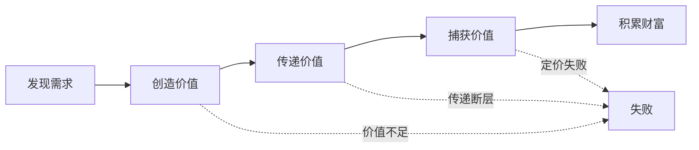
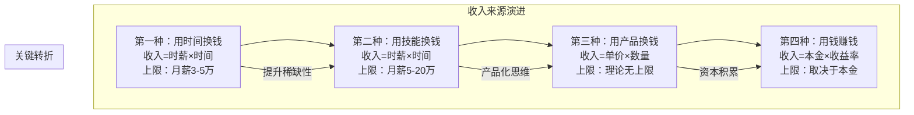
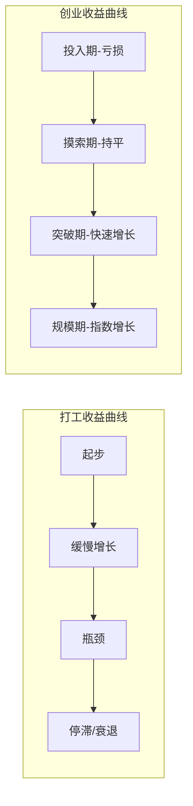
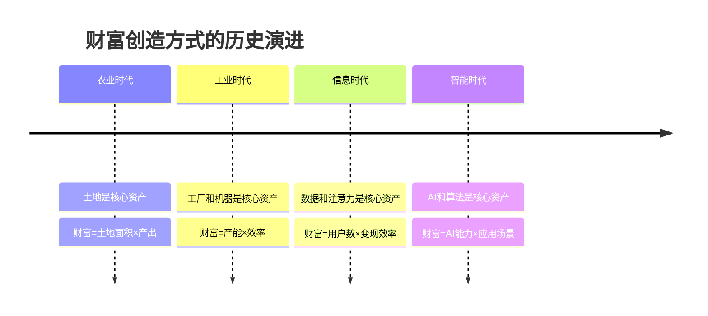
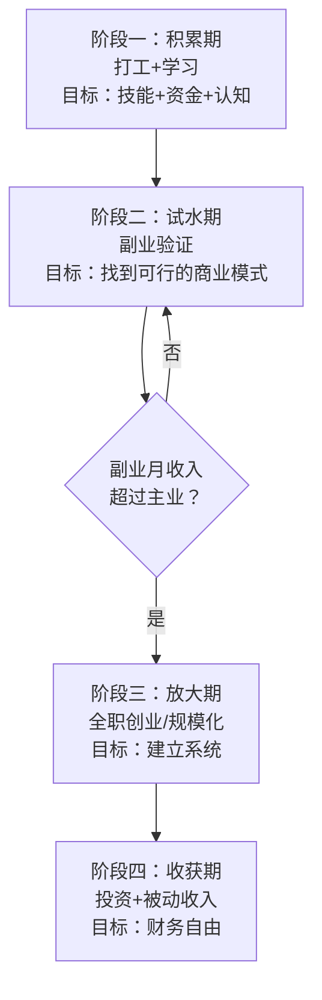

## 一、财富创造的本质

在谈论创业和副业之前，必须先理解一个根本问题：**财富到底是怎么创造出来的？** 这不是哲学问题，而是一个有明确答案的经济学问题。搞不清楚这一点，后面的创业方法论就是空中楼阁。

> **本节定位：** 这是整个创业与副业章节的理论地基。后续所有方法论——发现机会、设计模式、获客增长、定价变现——都是本节所述原理的具体展开。建议精读而非速读。

### 1.1 财富的经济学定义

很多人把"财富"等同于"钱"，这是一个致命的误解。

**财富的本质是：能够满足人类需求的价值载体。** 钱只是价值的度量工具，不是价值本身。

这个区分至关重要。如果你只是在"搞钱"而不创造价值，你做的是零和博弈（赌博、投机、诈骗）；如果你创造了价值但赚不到钱，说明你的价值转化机制出了问题。真正的财富创造，是**价值创造**和**价值捕获**两个环节都做好。



**价值创造的三种基本方式：**

| 方式 | 核心逻辑 | 典型案例 | 财富倍数 |
|------|---------|---------|---------|
| 效率提升 | 用更少资源做同样的事 | 流水线、自动化软件、AI工具 | 10x-100x |
| 需求满足 | 解决已存在的问题 | 外卖平台、在线教育、医疗 | 1x-10x |
| 需求创造 | 让人发现自己需要什么 | iPhone、社交媒体、元宇宙 | 100x-1000x |

苹果公司创造iPhone不是在"满足需求"——在iPhone出现之前，没有人"需要"一个没有键盘的手机。它创造了需求。这种创造的财富量级远超效率提升。

#### 价值创造的深层机制

价值不是凭空产生的。从经济学视角看，每一次价值创造都遵循同一个底层公式：

```text
创造的价值 = 新状态的效用 - 旧状态的效用 - 转换成本
```

当一个人饿了（旧状态效用低），吃了一顿饭（新状态效用高），餐饮业创造的价值就是两者之差减去获取食物的成本（时间、金钱、精力）。如果转换成本高于效用提升，这笔交易就不会发生——这就是为什么"方便"本身也是一种价值。

**价值的三层结构：**

| 层级 | 含义 | 举例 | 定价空间 |
|------|------|------|---------|
| 功能价值 | 解决具体问题 | 外卖解决"吃饭"问题 | 低（容易比价） |
| 体验价值 | 使用过程的感受 | 高端餐厅的环境和服务 | 中（愿意溢价） |
| 身份价值 | 使用后自我认同的变化 | 米其林餐厅的社交货币 | 高（感性决策） |

一杯星巴克咖啡的功能价值（提神）可能只值5元，体验价值（环境、口感）值20元，身份价值（"我喝星巴克"的社会信号）值15元，合计定价40元。**理解价值的层次结构，是设计高溢价产品的关键。**

#### 零和博弈 vs 正和博弈

理解财富创造，必须区分两种根本不同的博弈类型：

**零和博弈：** 一方的收益等于另一方的损失，总财富不变。典型场景：赌博（庄家赢=赌客亏）、存量市场的恶性价格战、纯粹的信息不对称套利（黄牛）。

**正和博弈：** 参与各方的总财富都在增加。典型场景：所有参与者因为合作而获得比单独行动更多的价值。贸易、技术创新、协作分工都属于正和博弈。

```text
零和博弈：你有100元，我有100元，交易后你120元我80元 → 总200元不变
正和博弈：你有100元，我有100元，合作后你150元我130元 → 总280元增加
```

**为什么这很重要？** 因为大多数人无意识地用零和思维看待财富——认为"别人赚了就是我亏了"。这种思维导致：不愿意付费学习（怕被"割韭菜"）、不愿意合作（怕被分走利润）、看到别人成功就嫉妒而非学习。**正和思维是创业者的底层操作系统。** 你必须相信：通过创造价值，所有参与者都可以变得更好。

### 1.2 收入的四种来源与底层逻辑

理解收入的来源结构，是规划财富增长路径的基础。每一层收入来源都有其经济学原理和数学模型。

#### 第一种：用时间换钱（打工）

**底层逻辑：** 你将自己的劳动力作为商品出售给雇主，获得工资报酬。这是最基础的经济交换。

**数学模型：**

```text
月收入 = 时薪 × 工作小时数 × 出勤天数
年收入 = 月收入 × 12 + 奖金
```

**收入天花板的形成机制：**

- **物理限制：** 一天只有24小时，扣除睡眠、通勤、吃饭，有效工作时间约8-10小时
- **市场定价：** 你的时薪由劳动力市场的供需关系决定，不是你说了算
- **替代性：** 岗位越容易被替代，时薪越低；越稀缺，时薪越高
- **信息不对称：** 你往往不知道自己在市场上的真实价值，企业利用这种信息差压低薪资

**真实数据参考：** 根据国家统计局2024年数据，全国城镇非私营单位就业人员年平均工资约12万元（月薪约1万），私营单位约6.8万元（月薪约5,700元）。这意味着大多数打工人月薪集中在5,000-15,000元区间。即使是高薪行业（互联网、金融），35岁后增长曲线也会急剧放缓。

**打工的隐性成本（大多数人忽略的）：**

| 隐性成本 | 说明 | 估算价值 |
|---------|------|---------|
| 通勤时间 | 每天1-2小时往返 | 每年约500小时 |
| 加班无偿 | "996"文化下额外工时 | 每年约1,000小时 |
| 职业焦虑 | 35岁危机、裁员压力 | 心理成本无法量化 |
| 技能贬值 | 长期重复性工作导致技能停滞 | 5年后跳槽薪资可能倒挂 |
| 社交成本 | 职场应酬、内卷竞争 | 时间+精力双重消耗 |

把这些隐性成本算进去，大多数打工人的"真实时薪"比名义时薪低30%-50%。

**优势：** 稳定可预期，几乎零启动成本，有社保等保障
**劣势：** 收入上限明显，时间自由度低，35岁危机

#### 第二种：用技能换钱（自由职业/咨询）

**底层逻辑：** 你不再出售"时间"，而是出售"技能带来的结果"。时薪可以大幅提升，因为你提供的不是劳动时间，而是专业能力的稀缺性。

**数学模型：**

```text
收入 = 项目单价 × 项目数量
或
收入 = 咨询时薪 × 有效咨询时长
```

**与打工的本质区别：**

打工时，你的时薪由市场决定；自由职业时，你的时薪由**价值感知**决定。同样是一小时的代码工作，公司内部员工可能值200元/小时，但自由职业者报价500-2,000元/小时，因为客户买的是"按需获取的专家能力"，省去了社保、管理、办公场地等隐性成本。

**自由职业的真实成本结构（很多人只看收入不看成本）：**

```text
实际收入 = 名义收入 - 自缴社保（约2,000-5,000元/月）
         - 获客成本（时间+营销费用，约占收入15-30%）
         - 空窗期成本（无项目时收入为零）
         - 税务成本（个体经营税率约5-35%）
         - 自我管理成本（行政、合同、催款）
```

一个报价1,000元/小时的咨询师，如果每月有效咨询时间只有40小时（另外40小时在获客、行政、等待），实际月收入是4万而非8万。**自由职业的核心挑战不是提高单价，而是提高有效工时占比。**

**收入提升的三个杠杆：**

1. **提升稀缺性：** 从"会写代码"到"精通某垂直领域的架构设计"
2. **提升品牌溢价：** 通过内容输出、案例积累建立个人品牌
3. **提升杠杆率：** 从一对一服务转向一对多（课程、工具、模板）

**优势：** 时间灵活，时薪上限高，可以挑客户
**劣势：** 仍在用时间换钱，不工作就没收入，获客成本高

#### 第三种：用产品换钱（创业/副业）

**底层逻辑：** 你创造了一个产品或服务，它可以被**重复销售**而不需要你每次投入等量的时间。这是收入从线性增长转向非线性增长的关键转折点。

**数学模型：**

```text
收入 = 单价 × 销售数量 - 成本
利润 = (单价 - 单位成本) × 销售数量 - 固定成本
```

**为什么产品收入是非线性的：**

假设你写了一门在线课程，花了100小时制作。第一个学员买走时，你的"时薪"可能只有50元；但当1,000人购买时，你的等效时薪变成了5,000元；10,000人购买时，等效时薪50,000元。**你的投入是固定的，但收入是可叠加的。**

**产品化的关键判断：**

- 能不能脱离你本人独立交付？（不能 = 高端咨询，能 = 产品）
- 边际成本是否趋近于零？（软件、课程、模板的边际成本极低）
- 是否有网络效应？（用户越多，产品越有价值）

**产品化的阶梯（从低到高）：**

| 阶梯 | 形态 | 边际成本 | 收入上限 | 示例 |
|------|------|---------|---------|------|
| 模板化 | 将服务标准化为模板 | 接近零 | 中 | Notion模板、简历模板 |
| 课程化 | 将知识打包为课程 | 接近零 | 高 | 网易云课堂、知识星球 |
| 工具化 | 将流程编码为软件 | 极低 | 极高 | SaaS工具、Chrome插件 |
| 平台化 | 连接供需双方 | 递减 | 理论无限 | 淘宝、滴滴、美团 |

**优势：** 收入上限极高，可建立被动收入，时间杠杆大
**劣势：** 前期投入大，失败率高，需要综合能力

#### 第四种：用钱赚钱（投资）

**底层逻辑：** 资本本身是一种生产力要素。当你拥有资本时，可以将其投入生产过程，获取剩余价值分配。

**数学模型：**

```text
收入 = 本金 × 年化收益率
复利：终值 = 本金 × (1 + 收益率)^年数
```

**复利的威力：** 假设年化收益率10%，100万元本金：

| 年数 | 资产总额 | 累计收益 |
|------|---------|---------|
| 第1年 | 110万 | 10万 |
| 第5年 | 161万 | 61万 |
| 第10年 | 259万 | 159万 |
| 第20年 | 673万 | 573万 |
| 第30年 | 1,745万 | 1,645万 |

注意：从第20年到第30年，资产增加了1,072万——比前20年的总收益（573万）还多。**这就是复利的时间威力：越到后期增长越惊人。** 但前提是你必须有足够的耐心和本金。

**主要资产类别的历史年化收益率参考（中国市场）：**

| 资产类别 | 年化收益率（长期） | 风险等级 | 门槛 | 适合阶段 |
|---------|-----------------|---------|------|---------|
| 货币基金 | 2-3% | 极低 | 极低 | 任何阶段（现金管理） |
| 银行理财 | 3-5% | 低 | 低 | 积累期（保本为主） |
| 指数基金定投 | 8-12% | 中 | 低 | 试水期（长期持有） |
| 优质个股 | 10-20% | 高 | 中 | 放大期（需要研究能力） |
| 房产投资 | 5-15%（含杠杆） | 中-高 | 极高 | 放大期（资金充足时） |
| 私募/风投 | 20-100%+（成功时） | 极高 | 极高 | 收获期（专业判断力） |

> **重要提醒：** 上表是长期平均水平，不代表任何单一年份的表现。A股沪深300指数2005-2024年的年化收益约8-9%，但期间经历了多次50%以上的暴跌。**投资的核心纪律是：用闲钱、长期持有、分散配置。**

**投资的前提条件：**

1. 你必须先有"本金"——这意味着前三个阶段的积累
2. 你必须有识别资产价值的能力——这需要学习和实践
3. 你必须有承受波动的心理素质——大多数人做不到

**优势：** 纯被动收入，时间完全自由，复利效应惊人
**劣势：** 需要本金，有亏损风险，需要专业知识

#### 四种收入的完整对比



| 维度 | 时间换钱 | 技能换钱 | 产品换钱 | 钱赚钱 |
|------|---------|---------|---------|--------|
| 收入模型 | 线性 | 线性（高斜率） | 非线性 | 指数 |
| 时间自由度 | 极低 | 中 | 高（成功后） | 极高 |
| 启动成本 | 零 | 低 | 中-高 | 高 |
| 失败风险 | 低 | 低-中 | 高 | 中-高 |
| 被动收入 | 无 | 无 | 可以 | 主要特征 |
| 典型年收入上限 | 15-50万 | 30-200万 | 理论无限 | 取决本金 |
| 核心能力 | 执行力 | 专业深度 | 综合能力 | 财商判断 |
| 最大陷阱 | 舒适区停滞 | 定价过低 | 产品与市场不匹配 | 追涨杀跌 |

> **关键洞察：** 根据《富爸爸穷爸爸》作者罗伯特·清崎的现金流象限理论，E（雇员）和S（自由职业者）象限的人用时间换钱，收入有天花板；B（企业主）和I（投资者）象限的人用系统和钱赚钱，收入没有上限。据统计，美国百万富翁中约70%是企业主，20%是高管，10%是投资者——绝大多数财富来自于B和I象限。

**重要澄清：** 四种收入来源不是"选一个"的关系，而是"组合演进"的关系。最健康的财富结构是：用打工积累技能和资金→用技能提升收入和认知→用产品实现收入非线性增长→用投资实现被动收入。**跳过前面的阶段直接进入后面的阶段，失败率极高。**

### 1.3 创业的本质：价值创造系统

创业不是"当老板"，不是"自由了"，更不是"逃避打工"。很多人创业失败，根源就在于对创业本质的误解。

**创业的本质是：创造一个能够持续为客户创造价值并从中获利的系统。**

关键词拆解：

- **系统**——不是你一个人干活，而是一个可以独立运转的组织。如果你停下来公司就停转，你不是在创业，你是在给自己找了一份更累的工作。
- **持续**——不是一锤子买卖，而是可持续的商业模式。很多"创业"其实只是"接了一单活"，没有复购、没有积累、没有壁垒。
- **创造价值**——解决了客户的问题，满足了客户的需求。价值是创业的根基，没有价值的商业模式都是空中楼阁。
- **获利**——商业必须盈利。情怀不能当饭吃，"先烧钱后盈利"的故事绝大多数结局是"先烧钱后倒闭"。

#### 系统思维 vs 个人能力

创业与打工的核心差异不在于"给谁干"，而在于你是在**用个人能力赚钱**还是在**用系统赚钱**：

| 维度 | 个人能力模式 | 系统模式 |
|------|------------|---------|
| 收入来源 | 你的技能和时间 | 流程、团队、品牌、技术 |
| 你离开后 | 收入归零 | 系统继续运转 |
| 增长方式 | 线性（你更强→收入更高） | 非线性（系统优化→收入倍增） |
| 核心瓶颈 | 你自己的时间和精力 | 系统的效率和可扩展性 |
| 典型案例 | 个体咨询师、自由开发者 | SaaS公司、电商品牌、连锁店 |

**判断标准：** 如果你的"创业"离开了你本人就无法运转，你本质上只是给自己找了一个没有社保的打工岗位。真正的创业，是建立一个你不在场也能创造价值和产生收入的系统。

#### 创业与打工的收益模型对比

打工和创业代表了两种完全不同的收益函数：



**打工的数学本质：**

```text
收入(t) = 基薪 × (1 + 涨薪率)^t
其中涨薪率通常 3%-10%/年，且递减
```

大多数打工人每年涨薪5%-10%，扣除通胀（约2%-3%），实际购买力增长仅为2%-7%。到职业生涯中后期，涨薪基本停滞。

**创业的数学本质：**

```text
收入(t) = 0 (t < T突破期)
收入(t) = 基数 × (1 + 增长率)^t (t ≥ T突破期)
其中增长率可能 50%-500%/年，也可能为负
```

创业的收益曲线呈典型的"曲棍球棒"形态——前期可能为零或亏损，突破后可能指数增长。但大多数人在突破期到来之前就放弃了。

**核心差异总结：**

| 维度 | 打工 | 创业 |
|------|------|------|
| 增长模式 | 线性、可预测 | 非线性、高不确定性 |
| 最大风险 | 收入低（赚得少） | 本金损失（亏得惨） |
| 时间投入 | 固定8小时/天 | 前期可能16小时/天 |
| 复利来源 | 技能、经验、人脉 | 品牌、客户、系统、资本 |
| 5年最坏情况 | 收入停滞 | 负债数十万 |
| 5年最好情况 | 年薪50万 | 年利润500万+ |
| 适合人群 | 风险厌恶型 | 风险承受型 |

### 1.4 财富创造的五大底层原理

理解了收入来源，还需要理解财富创造的底层原理。这些原理决定了为什么有些人能创造巨大财富，而有些人忙了一辈子还是穷。

#### 原理一：杠杆原理——放大你的产出

**核心思想：** 财富的量级取决于你使用的杠杆大小。

人类历史上出现过四种杠杆：

1. **劳动力杠杆**（管理别人为你工作）——最古老的杠杆，也是最累的
2. **资本杠杆**（用钱生钱）——需要先有钱
3. **代码杠杆**（软件自动化）——边际成本趋近于零
4. **媒体杠杆**（内容传播）——一次创作，无限传播

Naval Ravikant 在《纳瓦尔宝典》中指出：**代码和媒体是新时代最重要的两种杠杆，因为它们是"无需许可的杠杆"——你不需要别人的同意就能使用它们。**

一个程序员写了一个SaaS工具，睡觉时也在赚钱；一个博主录了一期视频，三年后还在产生收入。这就是杠杆的力量。

**四种杠杆的详细对比：**

| 杠杆类型 | 启动门槛 | 规模上限 | 边际成本 | 维护成本 | 典型案例 |
|---------|---------|---------|---------|---------|---------|
| 劳动力 | 中（管理能力） | 高（受管理半径限制） | 高（每增加一人=增加成本） | 高（工资、培训、管理） | 餐饮连锁、外包公司 |
| 资本 | 极高（需要本金） | 极高 | 取决于投资标的 | 低（但需要专业判断） | 投资基金、房地产 |
| 代码 | 低（一台电脑） | 极高（全球用户） | 接近零 | 中（维护、迭代） | SaaS工具、App |
| 媒体 | 极低（手机即可） | 极高（全网传播） | 接近零 | 低（但需要持续创作） | 自媒体、播客、课程 |

**实操框架：识别你当前的杠杆层级**

| 杠杆层级 | 典型角色 | 收入特征 | 提升方向 |
|---------|---------|---------|---------|
| 无杠杆 | 基层员工 | 时间×时薪 | 学习稀缺技能 |
| 技能杠杆 | 高级专家 | 技能×时薪 | 开始产品化 |
| 产品杠杆 | 独立开发者/博主 | 产品×销量 | 建立团队/系统 |
| 资本杠杆 | 投资人/企业主 | 资本×回报率 | 多元化配置 |
| 系统杠杆 | 平台/品牌拥有者 | 系统×规模 | 生态扩展 |

**从当前层级到下一层级的具体行动：**

- **无杠杆 → 技能杠杆：** 选定一个高需求领域，投入6-12个月深度学习，达到能独立交付项目的水平
- **技能杠杆 → 产品杠杆：** 把你重复为客户做的事情，模板化/课程化/工具化，让它可以脱离你独立交付
- **产品杠杆 → 资本杠杆：** 用产品收入的一部分进行系统性投资，建立"钱生钱"的管道
- **资本杠杆 → 系统杠杆：** 用资本投资或孵化多个产品/业务线，形成相互协同的商业生态

#### 原理二：复利原理——让增长自我加速

**核心思想：** 最大的财富增长来自于复利效应，但复利的前提是足够长的时间和持续的投入。

复利不只适用于投资，它适用于一切有积累效应的领域：

- **技能复利：** 每天学习1小时，一年后你比同行领先365小时的知识积累
- **客户复利：** 满意的客户会带来新客户，口碑传播呈指数增长
- **内容复利：** 一篇好文章可以持续获取流量多年
- **品牌复利：** 品牌信任一旦建立，后续获客成本大幅下降
- **人脉复利：** 优质人脉带来的机会呈网络效应增长

**复利的关键参数：**

```text
终值 = 本金 × (1 + r)^n
r = 每期增长率
n = 期数
```

- r（增长率）不必很高，但必须为正且持续
- n（期数）越大，复利效应越惊人
- **关键：不要中断。** 复利的最大敌人是中途退出

**复利的数学直觉（让你真正理解它的威力）：**

假设你每天进步0.1%（几乎感觉不到的进步）：

```text
1年后：1.001^365 = 1.44（进步44%）
3年后：1.001^1095 = 3.00（进步200%）
5年后：1.001^1825 = 6.17（进步517%）
10年后：1.001^3650 = 38.4（进步3,740%）
```

每天进步0.1%，10年后你的能力是现在的38倍。这就是复利的力量——**不是某个单一的大突破，而是持续的小进步累积成的巨大差异。**

反面：如果你每天退步0.1%（懒惰、技能过时、认知固化）：

```text
1年后：0.999^365 = 0.695（退步30%）
5年后：0.999^1825 = 0.163（退步84%）
```

**复利的三个实操原则：**

1. **选择r>0的领域：** 确保你在做有积累效应的事（学习、内容创作、客户关系），而不是纯消耗性的事（刷短视频、无效社交）
2. **保持连续性：** 中断一天的损失远大于一天的收益，因为中断会破坏习惯和动量
3. **耐心等待拐点：** 复利曲线的特征是前期增长缓慢、后期爆发。大多数人在前期就放弃了

#### 原理三：稀缺性原理——定价权的来源

**核心思想：** 你的收入上限取决于你所拥有资源的稀缺程度。

经济学的基本规律：**价格由供需决定。** 当你的能力/产品供不应求时，你拥有定价权；当供过于求时，你只能接受市场的定价。

**稀缺性的三个维度：**

1. **能力稀缺：** 能做这件事的人很少（如顶尖AI工程师、心脏外科医生）
2. **信息稀缺：** 你知道别人不知道的事（如某个行业的内幕、跨境供应链资源）
3. **资源稀缺：** 你拥有别人没有的资源（如独家供应链、大客户关系、稀缺牌照）

**稀缺性的形成机制：**

稀缺性不是"天赋"，而是通过战略性的投入形成的。以下是构建稀缺性的系统方法：

| 策略 | 原理 | 投入周期 | 难度 | 示例 |
|------|------|---------|------|------|
| 交叉领域 | 单一领域专家多，交叉领域专家少 | 1-3年 | 中 | 懂医疗的AI工程师 |
| 深度积累 | 在一个领域持续投入5年以上 | 5年+ | 高 | 10年经验的架构师 |
| 品牌背书 | 公开内容输出建立认知度 | 2-5年 | 中 | 技术博主转型咨询 |
| 圈层卡位 | 成为某个圈子的关键节点 | 1-3年 | 中 | 行业社群创始人 |
| 技术壁垒 | 掌握难以复制的核心技术 | 3-10年 | 极高 | 专利持有者 |

**交叉领域的稀缺性模型（最实用的策略）：**

假设市场上有10,000个"会写Python的程序员"和500个"懂金融量化的人"。如果你同时精通Python和金融量化，你的竞争对手从10,000人骤降到可能不到50人。

```text
稀缺性 = 技能A的稀缺度 × 技能B的稀缺度 × ... × 技能N的稀缺度
```

每增加一个相关领域的深度技能，你的稀缺性就会呈乘数级增长。**实操建议：** 选择2-3个有协同效应的领域，每个都达到前20%的水平，比在一个领域做到前1%更容易也更实用。

#### 原理四：交易成本原理——降低摩擦就是创造价值

**核心思想：** 任何降低交易成本的行为都在创造价值。

科斯定理告诉我们：企业的存在是为了降低交易成本。互联网之所以创造了这么多财富，本质上是因为它大幅降低了信息不对称和交易摩擦。

**交易成本的四个组成：**

| 成本类型 | 含义 | 降低方式 |
|---------|------|---------|
| 搜索成本 | 找到合适的交易对象 | 平台、推荐算法、SEO |
| 信息成本 | 了解产品质量和价格 | 评价系统、透明定价 |
| 谈判成本 | 达成交易条款 | 标准化定价、自助下单 |
| 执行成本 | 完成交付和售后 | 自动化、标准化流程 |

**创业机会的本质就是：发现并消除某一类交易成本。**

淘宝消除了买卖双方的搜索成本，滴滴消除了司机和乘客的匹配成本，美团消除了餐厅和食客的距离成本。每一个成功的企业，都在某一个环节降低了交易成本。

**实操：用交易成本框架分析创业机会**

你可以用以下问题清单来评估一个创业想法：

1. 目标市场中，买卖双方目前的**搜索成本**有多高？你如何降低它？
2. 买卖双方之间的**信息不对称**有多大？你如何消除它？
3. 目前的交易**谈判和执行流程**有多复杂？你如何简化它？
4. 你降低的交易成本，是否足以让客户愿意为此**付费**？

如果你的创业想法不能清晰回答以上四个问题，说明你还没有找到真正的价值点。

#### 原理五：网络效应原理——规模越大越值钱

**核心思想：** 当产品的价值随用户数量增加而增加时，就产生了网络效应。这是最强大的护城河之一。

**网络效应的三种类型：**

1. **直接网络效应：** 用户越多，每个用户获益越大（微信、电话网络）
2. **间接网络效应：** 一方用户越多，另一方获益越大（淘宝：买家越多→卖家越多→买家更多）
3. **数据网络效应：** 用户越多，数据越多，产品越智能（推荐算法、AI模型）

**为什么网络效应如此重要：**

拥有网络效应的产品具有"赢家通吃"的特征。微信有12亿用户，即使有一个功能更好的社交软件出现，也很难撼动它的地位——因为你的朋友都在微信上。这就是网络效应形成的竞争壁垒。

**网络效应的量化理解：**

```text
网络价值 ≈ n × log(n)  （梅特卡夫定律的变体）
其中 n = 用户数量
```

这意味着当用户数从1万增长到100万（100倍），网络价值不是增长100倍，而是增长约200倍。**用户增长的价值是超线性的。**

**但网络效应也有"临界质量"：** 在达到临界质量之前，产品可能毫无吸引力；一旦跨过临界质量，就会进入正向飞轮。这就是为什么很多平台型产品前期需要大量补贴——它们在"购买"临界质量。

**普通人如何利用网络效应：**

即使你不是在做平台型产品，也可以利用网络效应思维：

- **社群运营：** 建立付费社群，成员越多价值越大（知识交流、人脉连接）
- **内容矩阵：** 多平台同步分发，各平台粉丝互相导流
- **口碑机制：** 设计邀请奖励机制，让老用户带来新用户

### 1.5 财富创造的时代演进

理解财富创造的历史演进，有助于你判断当前的时代机会在哪里。



**每个时代的财富创造核心逻辑：**

| 时代 | 核心资产 | 核心杠杆 | 财富公式 | 代表性富人 |
|------|---------|---------|---------|-----------|
| 农业时代 | 土地 | 劳动力 | 土地面积×亩产 | 地主、庄园主 |
| 工业时代 | 工厂、机器 | 资本+劳动力 | 产能×效率×渠道 | 洛克菲勒、卡内基 |
| 信息时代 | 数据、注意力 | 代码+媒体 | 用户数×ARPU | 马化腾、张一鸣 |
| 智能时代 | AI能力、场景 | AI+自动化 | AI能力×应用场景×数据 | AI创业者（进行中） |

**当前时代（智能时代）的财富特征：**

1. **速度加快：** 从0到10亿美元估值，可口可乐用了60年，Facebook用了8年，ChatGPT用了2个月
2. **门槛降低：** 一个人+一台电脑+AI工具，可以做到过去需要一个团队才能做到的事
3. **赢家通吃加剧：** 头部玩家获取绝大部分市场和利润
4. **个体崛起：** 超级个体（Solopreneur）模式越来越可行

**AI时代对创业的具体影响：**

| 传统模式 | AI时代模式 | 变化幅度 |
|---------|-----------|---------|
| 需要10人团队开发App | 1-2人+AI工具即可 | 人力成本降低80% |
| 需要专业设计师做品牌 | AI生成品牌视觉体系 | 设计成本降低90% |
| 需要客服团队处理咨询 | AI客服+人工兜底 | 客服成本降低70% |
| 需要3个月开发MVP | 1-2周完成原型验证 | 时间成本降低85% |
| 需要市场调研公司 | AI数据分析+用户访谈 | 调研成本降低60% |

**对普通人的启示：** 不要用农业时代的思维（靠体力）、工业时代的思维（靠加班）来赚钱。要学会用信息时代和智能时代的杠杆——代码、内容、AI——来放大你的价值产出。**现在是历史上个人创业成本最低的时代。**

### 1.6 常见认知误区

#### 误区一：赚钱=创造价值

**错误认知：** 只要赚到钱了，就说明我创造了价值。

**真相：** 赚钱可能来自于信息不对称、垄断地位、甚至欺骗。但这些"赚钱"不等于"创造价值"，也不可持续。**可持续的财富创造一定伴随着真实的价值创造。**

**判断标准：** 如果你的客户在使用你的产品/服务后，他们的处境是否真的变好了？如果答案是肯定的，你创造了价值；如果答案是否定的，你的商业模式迟早会崩塌。

**案例对比：**

| 商业模式 | 是否创造价值 | 可持续性 |
|---------|------------|---------|
| 健身App帮助用户养成运动习惯 | 是 | 高（用户留存+口碑） |
| 利用信息差卖高价低质课程 | 否 | 低（差评传播+复购率低） |
| 帮助中小企业搭建自动化流程 | 是 | 高（效率提升可量化） |
| 诱导老年人购买不需要的保健品 | 否 | 低（法律风险+道德问题） |

#### 误区二：创业就是开公司

**错误认知：** 创业必须注册公司、租办公室、招员工。

**真相：** 创业的核心是"创造价值并获利"，不是"开公司"。一个程序员在业余时间开发了一个月入5万的SaaS工具，这是创业；一个人注册了公司、租了办公室、招了三个员工，但每月亏损10万，这不叫创业，这叫烧钱。

**正确的理解：** 从最小可行的商业模式开始验证，先证明能赚到钱，再考虑组织形式。

**最小可行创业的形态：**

- 一个人+一台电脑，做自由职业/咨询
- 一个人+一个电商平台，做代销/一件代发
- 一个人+一个内容平台，做知识付费/自媒体
- 一个人+AI工具，做AI相关的服务/产品

**注册公司的正确时机：** 当你的月收入稳定在2万以上，且需要开发票、签合同时，再考虑注册公司。过早注册公司只会增加不必要的成本和行政负担。

#### 误区三：好产品自然有人买

**错误认知：** 我的产品/服务这么好，不愁卖。

**真相：** 市场上有无数"好产品"在默默无闻中死去。**产品好只是必要条件，不是充分条件。** 你还需要让目标客户知道你的产品存在（营销）、让客户觉得你的产品值得购买（定价）、让客户能方便地购买（渠道）。

**完整公式：** 商业成功 = 产品价值 × 营销能力 × 渠道覆盖 × 定价合理性

**四要素缺一不可的案例：**

| 产品价值 | 营销 | 渠道 | 定价 | 结果 |
|---------|------|------|------|------|
| 高 | 低 | 低 | 合理 | 好产品无人知（酒香也怕巷子深） |
| 高 | 高 | 低 | 过高 | 知名度高但转化率低 |
| 低 | 高 | 高 | 低 | 短期销量高但口碑崩塌 |
| 高 | 高 | 高 | 合理 | 持续增长的健康业务 |

#### 误区四：先赚到钱再谈理想

**错误认知：** 创业就是为了赚钱，谈理想太虚了。

**真相：** 没有"为什么"的创业，很难撑过艰难时期。你的创业必须回答三个问题：

1. 你解决什么问题？（价值主张）
2. 你为谁解决？（目标客户）
3. 你为什么比别人做得好？（竞争优势）

这三个问题回答不清楚，即使短期赚到了钱，也走不远。

**更深一层：** "理想"在这里不是指空泛的"改变世界"，而是指你对某个领域的**真正热情和深度理解**。没有热情，你不会在困难时期坚持；没有深度理解，你无法做出真正好的产品。

#### 误区五：高收入=财务自由

**错误认知：** 月薪5万就是财务自由了。

**真相：** 财务自由的定义是：**被动收入 ≥ 生活支出。** 如果你月薪5万但月支出4.5万，你离财务自由的距离和月薪1万的人一样远——你都没有被动收入。

**真正的财务自由公式：**

```text
财务自由 = 被动收入 ÷ 月支出 ≥ 1

实现路径：
1. 控制支出（降低分母）
2. 建立被动收入来源（提升分子）
3. 让被动收入持续增长（复利效应）
```

**财务自由的三个层级：**

| 层级 | 定义 | 被动收入/支出 | 典型门槛 |
|------|------|-------------|---------|
| 初级自由 | 被动收入覆盖基本生存 | ≥1.0 | 被动收入5,000-10,000元/月 |
| 中级自由 | 被动收入覆盖舒适生活 | ≥2.0 | 被动收入20,000-50,000元/月 |
| 高级自由 | 被动收入覆盖任意消费 | ≥5.0 | 被动收入100,000元/月以上 |

**大多数人的误区：** 他们追求的是"更高的工资"而非"更多的被动收入"。月薪从3万涨到5万，你的生活方式会同步升级（更大的房子、更好的车），导致支出和收入同步增长，财务自由距离不变。**真正的突破口是：保持支出不变，把增量收入全部转化为被动收入来源。**

#### 误区六：我没钱所以不能创业

**错误认知：** 创业需要大量启动资金，我存够钱再说。

**真相：** 这是工业时代的思维。在信息时代和智能时代，最低成本的创业只需要一台电脑和互联网连接。

**零成本/低成本创业的真实案例：**

- 写技术博客积累影响力 → 接咨询订单（零成本）
- 在闲鱼/1688做代销（几千元启动）
- 开发一个Chrome插件/SaaS小工具（零成本，只需时间）
- 在抖音/小红书做垂直领域内容（零成本）
- 用AI工具为中小企业提供自动化服务（零成本）

**启动资金的真实需求：**

| 创业模式 | 启动资金 | 月运营成本 | 回本周期 |
|---------|---------|-----------|---------|
| 自媒体/知识付费 | 0元 | 0-500元 | 3-6个月 |
| 电商代销 | 3,000-10,000元 | 1,000-5,000元 | 1-3个月 |
| SaaS工具 | 0元 | 100-1,000元 | 6-12个月 |
| 咨询/自由职业 | 0元 | 0-1,000元 | 1-3个月 |
| 实体店铺 | 10-50万元 | 3-10万元 | 12-36个月 |

**关键洞察：** 最好的创业方式不是"先攒够钱再创业"，而是"在打工的同时低成本验证创业想法"。等到副业收入稳定超过主业时，再全职投入。

### 1.7 财富创造的信息差与认知差

除了前面讨论的五大原理，还有两个常被忽视但极其关键的财富驱动力：**信息差**和**认知差**。

#### 信息差：知道别人不知道的事

信息差是最古老的财富来源之一。在信息不完全透明的市场中，掌握关键信息的人可以获取超额利润。

**信息差的三种类型：**

| 类型 | 含义 | 持续性 | 示例 |
|------|------|--------|------|
| 时间差 | 你比别人更早知道某条信息 | 短（信息会扩散） | 行业内幕、政策变化 |
| 场景差 | 你在A场景知道的信息在B场景有价值 | 中 | 跨行业经验、跨境信息 |
| 深度差 | 你对同一信息的理解深度超过别人 | 长 | 专业分析、深度研究 |

**互联网时代信息差的变化：**

信息差没有消失，只是转移了。过去的信息差是"知道这个信息"，现在的信息差是"能从海量信息中筛选出有价值的部分"和"能正确解读信息的含义"。

**实操：如何构建信息优势？**

1. **加入高质量信息源：** 付费社群、行业会议、专业期刊
2. **建立跨领域信息网络：** 认识不同行业的朋友，定期交流
3. **培养信息分析能力：** 不只是获取信息，还要能判断信息的价值和可靠性
4. **行动速度：** 信息差是有保质期的，知道而不用等于不知道

#### 认知差：理解别人理解不了的事

认知差比信息差更深层。同样的信息，不同认知水平的人会得出完全不同的结论。

**认知差的典型表现：**

- 看到ChatGPT发布，有人觉得"又一个聊天机器人"，有人立刻意识到"这是生产力革命"
- 看到一个行业数据，有人只看到数字，有人能解读出趋势和机会
- 面对同一个创业机会，有人觉得"不可能成功"，有人能找到可行的切入点

**认知差的构建路径：**

```text
信息输入 → 深度思考 → 实践验证 → 复盘总结 → 认知升级
    ↑                                              |
    └──────────────── 循环 ←───────────────────────┘
```

**提升认知的实操方法：**

1. **跨学科阅读：** 不只读本专业的书，经济学、心理学、历史、哲学都能提供不同的思维框架
2. **高质量社交：** 和比你认知水平高的人交流，是提升认知最快的方式
3. **实践验证：** 认知必须经过实践检验，"知道"和"做到"之间有巨大的鸿沟
4. **写作输出：** 把你的思考写出来，是检验你是否真正理解的最好方法

### 1.8 从本质到行动：财富创造路线图

理解了财富创造的本质后，你需要一个清晰的行动路线图。



**每个阶段的核心任务：**

| 阶段 | 时间跨度 | 核心任务 | 关键指标 | 最常见错误 |
|------|---------|---------|---------|-----------|
| 积累期 | 1-3年 | 学技能、攒资金、拓认知 | 技能深度、存款金额 | 只顾打工不学新东西 |
| 试水期 | 6-18个月 | 低成本验证商业模式 | 副业月收入、客户数 | 投入过大、没有验证就All In |
| 放大期 | 2-5年 | 建团队、建系统、建品牌 | 月利润、团队规模 | 管理失控、现金流断裂 |
| 收获期 | 持续 | 资产配置、被动收入 | 被动收入/支出比 | 过度消费、盲目投资 |

**每个阶段的具体行动清单：**

**积累期（1-3年）：**
- [ ] 选定一个高需求领域，投入1,000小时深度学习
- [ ] 建立每月储蓄习惯，目标储蓄率≥30%
- [ ] 每月阅读2本本领域+1本跨领域书籍
- [ ] 开始在社交媒体输出学习心得（建立个人品牌的基础）
- [ ] 识别2-3个可产品化的技能方向

**试水期（6-18个月）：**
- [ ] 用最小成本验证第一个商业模式（投入≤5,000元）
- [ ] 找到前10个付费客户，验证价值主张
- [ ] 建立收入记录和客户反馈机制
- [ ] 如果3个月没有正反馈，果断调整方向（不是坚持，是迭代）
- [ ] 副业月收入目标：主业收入的30%以上

**放大期（2-5年）：**
- [ ] 建立可复制的获客流程
- [ ] 招聘第一个员工或外包合作伙伴
- [ ] 建立财务管理体系（收入、成本、利润的清晰账目）
- [ ] 开始用代码/系统替代重复性工作
- [ ] 月利润目标：覆盖家庭月支出的3倍以上

**收获期（持续）：**
- [ ] 建立系统性投资计划（定投指数基金、优质资产）
- [ ] 被动收入占比目标：≥50%总收入
- [ ] 多元化收入来源（至少3个不相关的收入管道）
- [ ] 被动收入/月支出比目标：≥1.5

**立即可以做的三件事：**

1. **盘点你的杠杆：** 你现在处于哪个杠杆层级？有什么技能、资源、关系可以被放大？
2. **找到一个微小的价值缺口：** 在你的专业领域，有什么问题人们愿意花钱解决但目前没有好的解决方案？
3. **开始用代码或媒体作为杠杆：** 即使是写一篇技术博客、开发一个小工具，也是在建立你的杠杆。

> **本节核心结论：** 财富创造的本质是"价值创造+杠杆放大+时间复利"。理解了这个本质，后面所有的创业方法论——发现机会、设计模式、获客增长、定价变现——都是这个本质的具体展开。带着这个认知框架进入后续章节，你会发现一切变得更加清晰。
