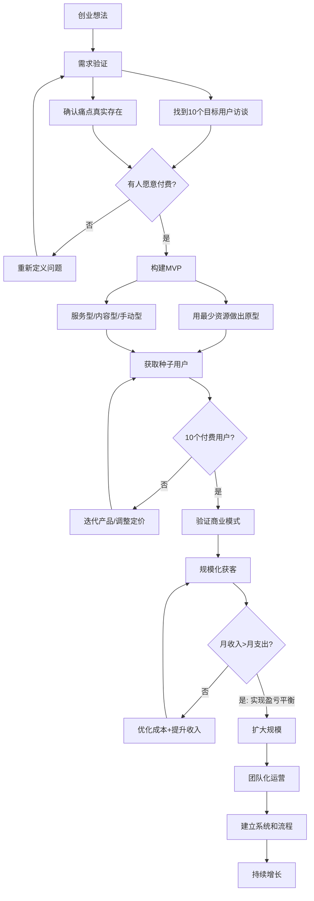
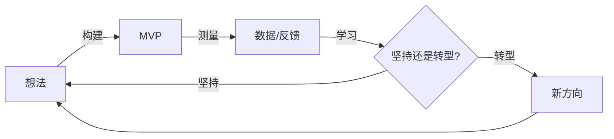
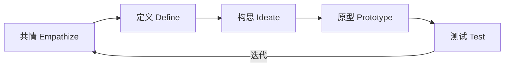
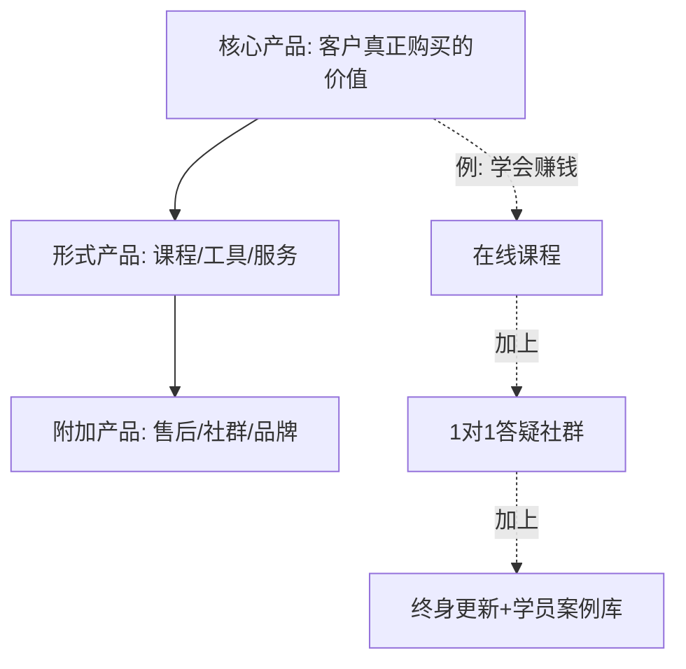
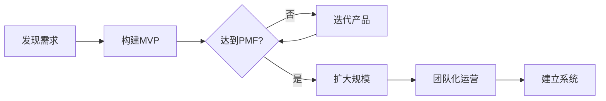
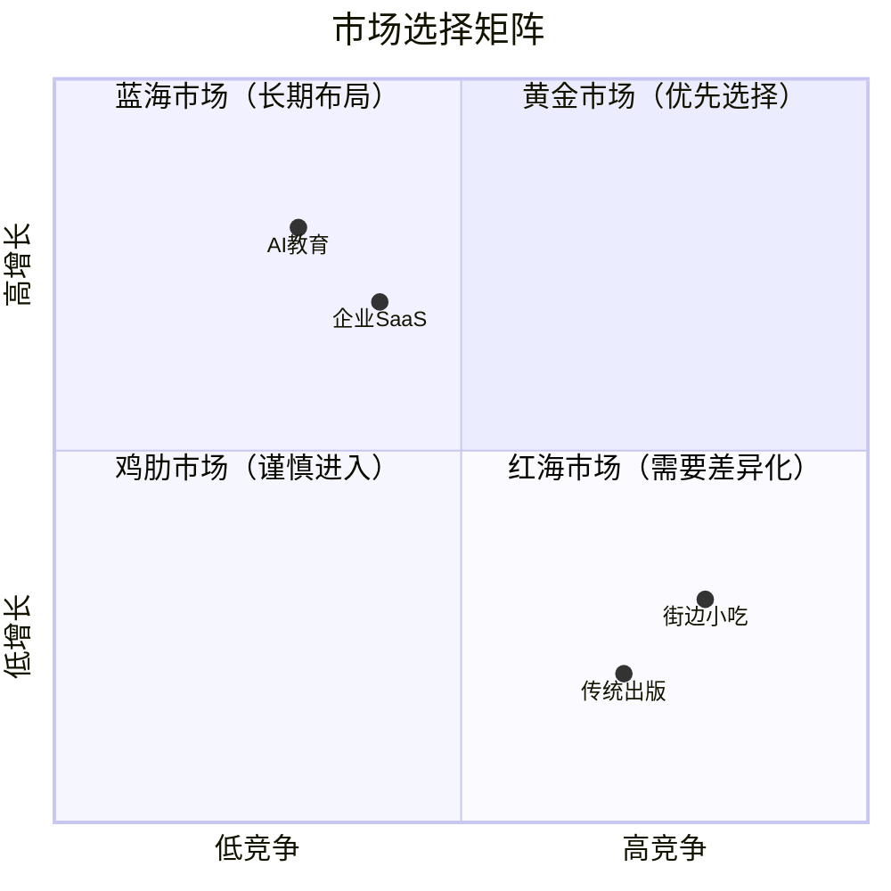
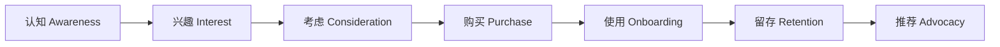
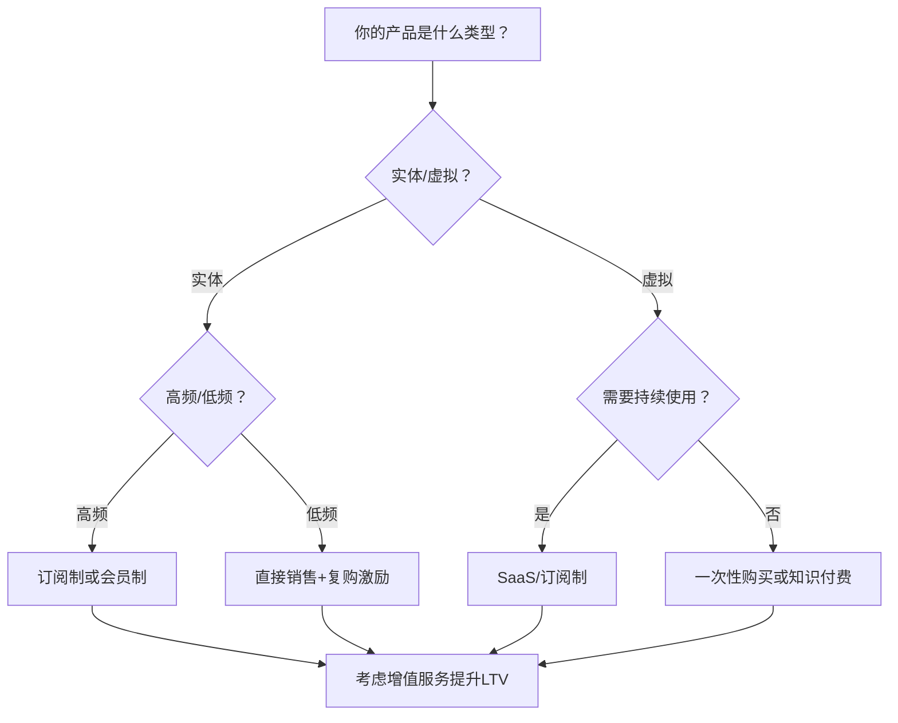
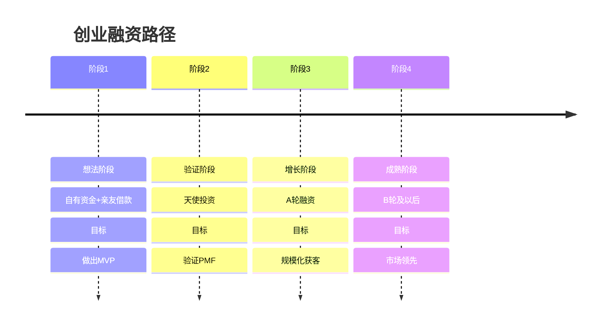
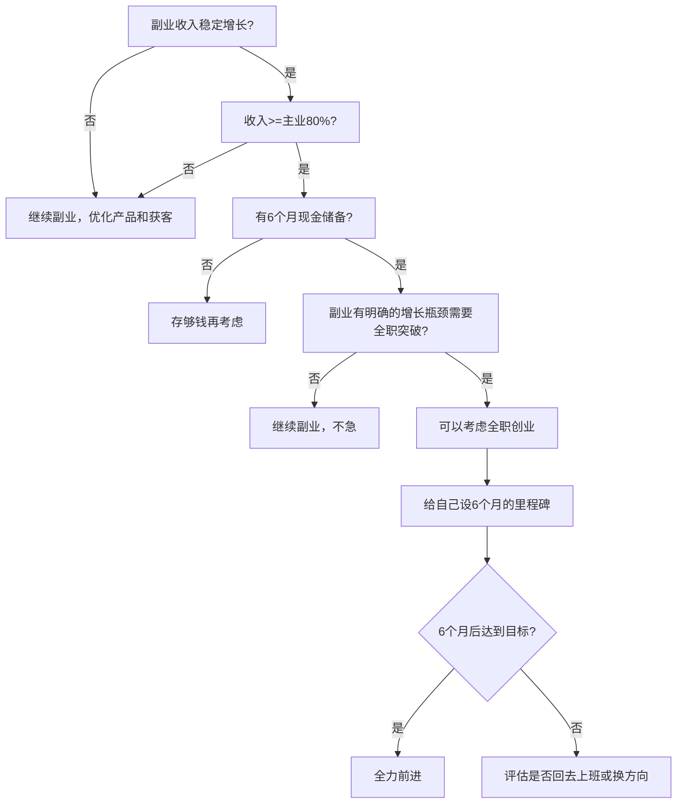

## 二、创业的关键要素

创业不是拍脑袋的事。一个成功的创业项目，需要六个关键要素协同运作：产品、市场、客户、商业模式、团队、资金。缺少任何一个，项目都可能功亏一篑。



> **数据支撑**：根据创业研究机构CB Insights的调查，创业公司失败的首要原因（42%）是"没有市场需求"——即做出了没人要的产品。第二大原因（29%）是"资金耗尽"。第三大原因（23%）是"团队不合适"。这说明验证需求（步骤B）和控制成本（步骤L）是创业成功的关键。MVP方法论的核心价值在于：用最小成本验证需求，避免投入大量资源做一个没人要的产品。

### 2.0 理论基石：三个改变创业范式的经典框架

在深入六个要素之前，你需要理解三个改变现代创业方法论的基础框架。它们不是学术装饰，而是经过数十年验证的实战工具。

#### 2.0.1 精益创业（The Lean Startup）

Eric Ries在2011年提出的精益创业方法论，核心是**"构建-测量-学习"循环**（Build-Measure-Learn Loop）：



**核心原则拆解：**

1. **创业者无处不在**：不需要在车库里才算创业。任何在不确定环境中创造新事物的人都是创业者——副业、内部创新、自由职业都算。
2. **创业即管理**：创业不是"做产品"然后"交给管理团队"。创业本身就需要一种新的管理方式——管理不确定性、管理实验、管理学习速度。
3. **经证实的认知（Validated Learning）**：创业的进步不是"写了多少代码"或"做了多少功能"，而是"验证了多少假设"。每一轮循环的目标是获得经证实的认知——用真实数据证明你的假设是对的还是错的。
4. **构建-测量-学习**：这是创业的基本节奏。关键不是"做得多"，而是"循环得快"。一个月验证一个假设的团队，比三个月做一个大功能的团队更有可能成功。
5. **创新核算**：用可操作的指标（而非虚荣指标）衡量进展。关注留存率、活跃度、付费转化率，而不是下载量、注册量、页面浏览量。

**为什么这对副业创业者特别重要？** 因为你的时间和资金都有限。精益创业的方法论告诉你：不要闷头做三个月再上线，而是用一周做出MVP，两周获取反馈，三周迭代一次。

#### 2.0.2 设计思维（Design Thinking）

斯坦福d.school推广的设计思维，提供了一套从用户出发的创新方法：



- **共情**：深入理解用户的真实处境，不是坐在办公室里猜测，而是走进用户的生活场景
- **定义**：将观察到的需求转化为清晰的问题陈述——"XXX用户需要XXX因为XXX"
- **构思**：发散思考多种解决方案，不急于评判，追求数量而非质量
- **原型**：快速将想法变成可触摸的东西——可以是纸上的草图、一个表单、一段视频
- **测试**：把原型放到真实用户面前，观察他们的反应而非只听他们的评价

**设计思维与精益创业的配合**：设计思维帮你"找到正确的问题"，精益创业帮你"用正确的方式解决问题"。前者聚焦于发现需求，后者聚焦于验证方案。

#### 2.0.3 商业模式画布（Business Model Canvas）

Alexander Osterwalder提出的商业模式画布，用9个模块描述一个企业的完整商业模式：

| 模块 | 核心问题 | 你的回答（填写） |
|------|----------|-----------------|
| 客户细分（CS） | 你为谁创造价值？ | |
| 价值主张（VP） | 你为客户解决什么问题？ | |
| 渠道通路（CH） | 你如何触达客户？ | |
| 客户关系（CR） | 你如何维护客户关系？ | |
| 收入来源（RS） | 你如何赚钱？ | |
| 核心资源（KR） | 你需要什么关键资源？ | |
| 关键业务（KA） | 你需要做什么关键活动？ | |
| 重要合作（KP） | 你需要哪些合作伙伴？ | |
| 成本结构（CS） | 你的主要成本是什么？ | |

```mermaid
block-beta
    columns 5
    A[" "] KP["重要合作\nKey Partners"]:1 KA["关键业务\nKey Activities"]:1 KR["核心资源\nKey Resources"]:1 " ":1
    block:col4:1
        VP["价值主张\nValue Propositions"]
    end
    block:col3:1
        CR["客户关系\nCustomer Relationships"]
        CH["渠道通路\nChannels"]
    end
    C[" "] CS["客户细分\nCustomer Segments"]:1 " ":1 " ":1
    block:col5:1
        CS2["成本结构 Cost Structure"]:1
        RS["收入来源 Revenue Streams"]:1
    end
```

**实操建议**：在启动任何创业项目之前，花2小时填完这个画布的9个格子。不需要完美，但需要思考。然后每两周更新一次——你会发现，随着你对市场的理解加深，画布上的内容会大幅变化。

---

下面逐一拆解六大核心要素。

---

### 2.1 产品（你卖什么）

产品是创业的起点。但"产品"不只是你做出来的东西，更是客户愿意为之付费的价值。

#### 2.1.1 好产品的四个特征

| 特征 | 解释 | 反面案例 | 正面案例 |
|------|------|----------|----------|
| 解决真实问题 | 不是你认为客户需要，而是客户真的需要 | 很多"技术驱动"的创业者做出功能炫酷但无人买单的产品 | 滴滴解决"打不到车"的真实痛点 |
| 可规模化 | 不只能一对一服务，而是可以批量交付 | 纯定制咨询难以规模化，标准化课程可以 | 得到App将知识打包为可无限复制的音频课程 |
| 有壁垒 | 别人不容易复制 | 简单的信息搬运没有壁垒，深度方法论+社群运营有壁垒 | 美团的壁垒是数百万商户的地推网络 |
| 可盈利 | 成本结构能支撑合理利润 | 免费送东西容易，但毛利为负的业务不可持续 | Notion的免费增值模式通过团队版盈利 |

#### 2.1.2 产品的三个层次

理解产品的层次结构，能帮助你设计出更有竞争力的产品：

- **核心产品**：客户真正购买的价值。客户买的不是钻头，而是墙上的洞；买的不是课程，而是"能靠这个技能赚钱"的确定性。
- **形式产品**：具体的载体和呈现方式。同一个核心价值，可以用课程、工具、服务、社群等不同形式交付。
- **附加产品**：超出预期的额外价值。售后支持、专属社群、定期更新、品牌背书——这些决定了客户是否愿意持续付费和推荐。



**案例**：混沌学园的产品拆解——核心产品是"提升商业认知"，形式产品是线下大课+线上录播+训练营，附加产品是校友网络+企业游学+1对1教练。正是附加产品让它能卖出数万元的高价。

#### 2.1.3 产品验证：从假设到事实

在投入大量资源开发产品之前，必须先验证三个核心假设：

1. **问题假设**：目标用户确实存在你所描述的痛点
2. **方案假设**：你的解决方案能有效解决这个痛点
3. **付费假设**：用户愿意为这个解决方案付钱

**验证方法清单：**

| 阶段 | 方法 | 成本 | 时间 | 验证什么 |
|------|------|------|------|----------|
| 问题验证 | 用户访谈（10-20人） | 0元 | 1-2周 | 痛点是否真实存在 |
| 方案验证 | Landing Page + 预售 | 500元以内 | 1周 | 有没有人感兴趣 |
| 产品验证 | MVP/最小可行产品 | 视情况 | 2-4周 | 用户能不能用起来 |
| 商业验证 | 获取10个付费用户 | 视情况 | 1-2月 | 愿不愿意掏钱 |

**用户访谈的关键问题：**

- "你最近在XX方面遇到的最大困扰是什么？"（发现痛点）
- "你试过什么方法解决？效果如何？"（了解现有方案）
- "如果有一个工具能帮你解决这个问题，你愿意付多少钱？"（测试付费意愿）
- "你能给我推荐3个也有同样困扰的人吗？"（验证痛点的普遍性）
- "为了搞定这件事，你花了多少钱/时间？"（量化痛点的价值）

#### 2.1.4 MVP的四种形态

MVP（最小可行产品）不是"做得粗糙"，而是"用最少资源验证核心假设"：

| MVP类型 | 做法 | 适用场景 | 案例 |
|---------|------|----------|------|
| 服务型MVP | 用人工代替系统，先手动帮客户解决问题 | 验证服务需求 | Dropbox创始人先录了一个演示视频，一天内获得7.5万注册 |
| 内容型MVP | 先写文章或拍视频，看有没有人关注 | 验证内容需求 | 很多知识付费创业者先在公众号写3个月，确认有人看再做课程 |
| 众筹型MVP | 在众筹平台发布产品概念，看有没有人预付 | 验证硬件/实体产品 | Kickstarter上超过60%的项目用这种方式验证需求 |
| 造门型MVP（Wizard of Oz） | 表面看起来是自动化产品，背后全是人工 | 验证产品交互 | Zappos创始人先手动去鞋店拍照上传网站，有人下单后手动买鞋发货 |

**关键原则**：MVP的目标不是"做出一个产品"，而是"用最小代价获得最大的学习"。如果你花两周做的MVP能告诉你"这条路走不通"，那这两周就值了——因为它帮你省了六个月。

#### 2.1.5 产品-市场契合（PMF）：创业的第一个里程碑

PMF（Product-Market Fit）是Marc Andreessen提出的概念——当你做出的产品恰好满足了一个真实存在的市场需求时，你就达到了PMF。

**如何判断你是否达到PMF？**

| 判断维度 | 达到PMF的信号 | 未达到PMF的信号 |
|----------|---------------|-----------------|
| 用户反馈 | 用户主动推荐给别人 | 用户用了一次就不再来 |
| 留存率 | 周留存>40%，月留存>25% | 用户注册后一周内流失80%以上 |
| 增长方式 | 自然增长（口碑传播）为主 | 完全依赖付费推广 |
| 客户态度 | 客户抱怨你功能不够多 | 客户觉得你可有可无 |
| Sean Ellis测试 | 超过40%用户说"如果不能再用会非常失望" | 低于25% |

**达到PMF之前应该做什么？** 只做一件事：不断迭代产品，直到找到PMF。不要扩大团队、不要投放广告、不要优化流程——所有精力集中在让产品匹配市场需求上。

**达到PMF之后应该做什么？** 这时候才应该加大投入——扩大团队、投放获客、优化运营。因为PMF意味着你找到了一个可重复的商业模式，扩大投入能产生可预期的回报。



> **真实数据**：根据Marc Andreessen的观察，达到PMF的公司几乎不需要销售团队——客户自己会来。而未达到PMF的公司，再多的销售投入也无法弥补产品与市场的错配。

---

### 2.2 市场（卖给谁）

选对市场，事半功倍；选错市场，再努力也白搭。

#### 2.2.1 市场规模评估框架（TAM-SAM-SOM）

评估市场规模不能拍脑袋，需要有结构化的办法：

| 层级 | 含义 | 估算方法 | 示例（在线英语教育） |
|------|------|----------|----------------------|
| TAM（总潜在市场） | 整个市场的总规模 | 行业报告、统计数据 | 中国英语学习者约3亿人 |
| SAM（可服务市场） | 你的产品能覆盖的市场 | TAM × 地域/人群筛选 | 愿意付费学英语的成人约3000万 |
| SOM（可获得市场） | 你能实际触达并转化的 | SAM × 渠道覆盖率 × 转化率 | 你能触达并转化的约3万人 |

**关键原则：SOM才是你真正应该关注的数字。** 很多创业者用TAM来给投资人画饼，但实际执行时必须基于SOM做决策。

**估算SOM的实操方法：**

1. **自下而上法**（推荐）：从你能触达的渠道出发估算。比如你打算在知乎做内容营销，知乎上关注"英语学习"话题的人有50万，按0.5%的转化率算，你能获取2500个潜在客户，再按10%的付费率算，SOM=250人。这种方式虽然数字小，但更接近现实。
2. **自上而下法**：从TAM开始层层筛选。容易得出乐观数字，适合给投资人看，但不适合做执行计划。

#### 2.2.2 市场选择的五个维度

选择进入哪个市场，需要从五个维度综合评估：

1. **增长趋势**：选择增长中的市场（蛋糕在变大）。夕阳市场里你只能抢存量，朝阳市场里增量就够你吃。用Google Trends、行业报告、政策文件判断趋势。
2. **竞争格局**：用波特五力模型分析——现有竞争者的激烈程度、潜在进入者的威胁、替代品的威胁、供应商的议价能力、买方的议价能力。选择竞争不太激烈但有足够需求的细分市场。
3. **进入壁垒**：评估你需要什么才能进入这个市场。技术壁垒、资金壁垒、资质壁垒、渠道壁垒——壁垒越高，一旦进入竞争越少。
4. **个人优势**：选择你有独特优势或资源的市场。你的专业背景、人脉关系、经验积累都是优势。
5. **利润空间**：有些市场看着大，但利润薄得可怜。评估行业的平均毛利率和净利率。



#### 2.2.3 波特五力模型深度应用

波特五力模型不只是理论，它能帮你系统性地评估一个市场的吸引力：

| 力量 | 你需要回答的问题 | 高威胁的信号 | 低威胁的信号 |
|------|-----------------|-------------|-------------|
| 现有竞争者 | 这个市场里已经有多少玩家？竞争有多激烈？ | 大量同质化竞品、价格战频发 | 竞品少且差异化明显 |
| 潜在进入者 | 别人进入这个市场有多容易？ | 低技术门槛、低资金门槛 | 需要牌照、技术积累或网络效应 |
| 替代品 | 有没有其他方式满足同样的需求？ | 用户有多种替代选择 | 你的方案是目前最好的选择 |
| 供应商议价 | 你的供应商是否强势？ | 关键资源被少数供应商控制 | 供应商众多且分散 |
| 买方议价 | 你的客户是否强势？ | 客户集中、价格敏感、转换成本低 | 客户分散、忠诚度高、转换成本高 |

**实操建议**：花1小时对你要进入的市场做一次五力分析。如果三个以上力量都是"高威胁"，你需要非常谨慎——这个市场可能很难做。

#### 2.2.4 竞争分析实操

不要害怕竞争——有竞争说明有市场。关键是找到你的差异化定位。

**竞争分析模板：**

| 分析维度 | 竞品A | 竞品B | 竞品C | 你的产品 |
|----------|-------|-------|-------|----------|
| 目标用户 | | | | |
| 核心功能 | | | | |
| 定价策略 | | | | |
| 获客渠道 | | | | |
| 用户口碑 | | | | |
| 主要优势 | | | | |
| 主要劣势 | | | | |

**信息获取渠道：**
- 产品官网、应用商店评价、社交媒体评论
- 行业报告（艾瑞、易观、36氪研究院）
- 竞品的招聘信息（能看出他们在做什么方向）
- 亲自体验竞品的产品和服务
- 竞品的专利申请和技术博客（了解技术方向）

**差异化定位的四种方式：**

| 方式 | 说明 | 案例 |
|------|------|------|
| 人群差异化 | 服务别人不服务的人群 | 小红书最初聚焦年轻女性，区别于微博的大众定位 |
| 场景差异化 | 在别人不覆盖的场景提供服务 | 瑞幸咖啡主打"外卖咖啡"场景，区别于星巴克的"第三空间" |
| 价值差异化 | 提供别人没有的核心价值 | 拼多多用"低价拼团"在电商红海中杀出血路 |
| 模式差异化 | 用不同的商业模式竞争 | Zoom用免费+订阅模式在视频会议市场击败收费的WebEx |

---

### 2.3 客户（谁会买）

客户不是模糊的"一群人"，而是具体的、可触达的、有明确需求的个体。

#### 2.3.1 客户画像的完整要素

| 维度 | 具体内容 | 获取方法 |
|------|----------|----------|
| 人口特征 | 年龄、性别、收入、职业、地域、教育水平 | 行业报告、问卷调查 |
| 心理特征 | 价值观、生活态度、消费理念 | 深度访谈、社交媒体分析 |
| 需求痛点 | 他们最头疼的问题、最想实现的目标 | 用户访谈、论坛/社群观察 |
| 购买行为 | 在哪里买东西、怎么决策、决策周期多长 | 用户行为数据、访谈 |
| 支付意愿 | 愿意为解决方案付多少钱、付费习惯 | 价格测试、竞品定价参考 |
| 信息渠道 | 在哪里获取信息、信任什么来源 | 媒介习惯调研 |

**用户画像示例（在线编程教育）：**

> **小王，25岁，二线城市，非科班转行程序员**
> - 本科工商管理，工作2年，月薪6000
> - 想转行做程序员，自学了3个月但进展缓慢
> - 痛点：不知道学什么方向好、网上的免费教程太碎片化、遇到问题没人问
> - 付费意愿：200-500元/月，希望有系统的学习路径和答疑支持
> - 活跃平台：B站、知乎、掘金、微信群
> - 决策方式：先看免费内容觉得靠谱，再考虑付费
> - 他的典型一天：白天上班摸鱼看B站教程，晚上回家跟着敲代码，周末泡在技术社群问问题

#### 2.3.2 客户旅程地图

客户从"不知道你"到"成为忠实用户"经历的完整路径：



| 阶段 | 用户心理 | 你的关键动作 | 核心指标 |
|------|----------|-------------|----------|
| 认知 | "我有这个问题但不知道有解决方案" | 内容营销、SEO、社群分享 | 曝光量、触达人数 |
| 兴趣 | "这个东西看起来可能有用" | 提供免费价值（文章、工具、模板） | 关注数、收藏数 |
| 考虑 | "我要比较一下哪个更好" | 用户案例、对比评测、免费试用 | 试用注册率 |
| 购买 | "我决定试试这个" | 清晰的定价、简单的付费流程、低门槛入门 | 转化率、客单价 |
| 使用 | "我买了但能不能用起来" | 新手引导、快速上手、及时响应 | 激活率（7日内完成核心动作） |
| 留存 | "这个值得我继续用/续费" | 持续提供价值、定期更新、社群运营 | 日/周/月留存率 |
| 推荐 | "我要推荐给朋友" | 推荐奖励、超预期体验、社群归属感 | NPS（净推荐值） |

**关键洞察**：大多数创业者把90%的精力花在"认知"和"购买"阶段，但真正决定业务成败的是"使用"和"留存"。一个留存率高的产品，即使获客慢也能持续增长；一个留存率低的产品，获客再快也是竹篮打水。

#### 2.3.3 找到种子用户的六种方法

种子用户是你的第一批客户，他们不仅购买产品，还提供反馈、帮助传播。

1. **从身边人开始**：你的朋友圈、同事圈、校友圈。不要觉得"不好意思推销"——如果你连身边有需求的人都说服不了，更不可能说服陌生人。但要注意：身边人的"支持性购买"不代表需求被验证了，他们的付费才是真正的验证。

2. **进入目标社群**：微信社群、QQ群、豆瓣小组、知乎话题、Reddit子版块。先贡献价值（回答问题、分享干货），建立信任后再介绍你的产品。不要一进群就发广告——这会让你永远失去这个渠道。

3. **内容引流**：写文章、拍视频、做直播，持续输出目标受众关心的内容。用内容建立信任，让潜在客户主动找到你。内容营销的缺点是慢（通常需要3-6个月才能见效），但优点是获客成本趋近于零且持续有效。

4. **直接约聊**：在LinkedIn、脉脉等平台找到目标用户，直接私信约15分钟的访谈。话术："我正在做一个解决XX问题的产品，想听听你的看法，能聊15分钟吗？"转化率通常在5-15%，但获得的信息质量极高。

5. **付费获客**：小规模投放广告（微信朋友圈广告、抖音信息流、百度SEM），用100-500元测试哪个渠道的获客成本最低。注意：先小规模测试，找到有效的渠道后再加大投入。

6. **合作伙伴引流**：找到服务同一类客户但不构成竞争关系的合作伙伴，互相推荐。比如你做编程教育，可以和做产品经理教育的互换流量。

#### 2.3.4 用户访谈的实操指南

用户访谈是获取真实需求最有效的方法，但99%的创业者做不好访谈。

**访谈前：**
- 准备10-15个开放式问题（不是是非题）
- 找到10个以上符合条件的访谈对象
- 每次访谈控制在30-45分钟
- 选择安静的环境（线上或线下均可）
- 提前告知对方"我在做一个XX方面的研究/产品"，但不要透露太多细节

**访谈中：**
- 多问"为什么"和"能举个例子吗"
- 不要推销你的产品，只听他们的问题
- 记录原话，不要脑补
- 注意他们的情绪变化（提到什么时眼睛亮了）
- 让对方讲故事："你上次遇到这个问题是什么时候？能从头讲讲吗？"
- 追问行为而非观点："你当时怎么处理的？"而不是"你觉得该怎么办？"

**访谈后：**
- 24小时内整理笔记（过了24小时你会遗忘40%的细节）
- 找到反复出现的共同痛点
- 按优先级排序（出现频率 × 痛苦程度）
- 将原话标注出来——这些原话是你做营销文案的金矿

**致命错误：**
- ❌ "你觉得这个产品好不好？"（引导性问题）
- ❌ "你会不会买？"（人们说的和做的不一样）
- ❌ 只访谈了3个人就下结论（样本量不足）
- ❌ 选择朋友做访谈对象（他们不会说真话）
- ✅ "你上次遇到XX问题时是怎么处理的？"（追问行为）
- ✅ "为了解决这个问题你花了多少钱/时间？"（量化痛点）
- ✅ "如果有一样东西能帮你搞定这个问题，你希望它长什么样？"（让用户自己描述方案）

---

### 2.4 商业模式（怎么赚钱）

商业模式的本质是：你为谁创造价值，以及如何从中获取回报。

#### 2.4.1 六种主流商业模式详解

| 模式 | 运作机制 | 典型案例 | 优势 | 劣势 | 适合场景 |
|------|----------|----------|------|------|----------|
| 直接销售 | 一次性卖产品或服务 | 实体商品、单次咨询 | 回款快、简单明了 | 没有复购，需要持续拉新 | 标准化产品、低频消费 |
| 订阅制 | 按月/年持续收费 | Netflix、SaaS、健身房 | 收入可预测、LTV高 | 需要持续提供价值、前期收入低 | 高频使用、持续价值交付 |
| 广告模式 | 免费使用，靠广告变现 | 抖音、知乎、今日头条 | 用户获取成本低 | 需要巨大流量、广告影响体验 | 媒体、社交平台、工具类产品 |
| 平台/中介 | 连接买卖双方，收取佣金 | 淘宝、美团、滴滴 | 边际成本低、网络效应强 | 冷启动难、双边市场复杂 | 双边市场、信息不对称场景 |
| 增值服务 | 基础免费，高级功能收费 | 游戏内购、印象笔记、WPS | 用户基数大、转化率可优化 | 免费用户可能永远不付费 | 工具类、游戏类、SaaS |
| 知识付费 | 卖课程、咨询、训练营 | 得到、混沌学园 | 毛利率高、边际成本低 | 同质化严重、续费率低 | 专业技能、行业经验、方法论 |

**补充两种适合副业的轻量模式：**

| 模式 | 运作机制 | 案例 | 优势 |
|------|----------|------|------|
| 联盟营销 | 推荐别人的产品赚佣金 | 淘宝客、京东联盟、Amazon Affiliate | 零库存、零客服、只管流量 |
| 数字产品 | 一次性制作，反复销售 | 电子书、模板、素材包、Notion模板 | 制作一次卖无数次，边际成本为零 |

#### 2.4.2 商业模式设计的三个核心指标

不管你选择哪种模式，都必须算清三笔账：

**1. 单位经济模型（Unit Economics）**

```text
客户终身价值（LTV）= 平均客单价 × 购买频次 × 客户生命周期
客户获取成本（CAC）= 总营销费用 ÷ 获取客户数
LTV/CAC ≥ 3 → 健康
LTV/CAC < 3 → 需要优化（提高客单价或降低获客成本）
LTV/CAC < 1 → 亏钱，不可持续
```

**LTV/CAC比值的行业参考：**

| 行业 | 典型LTV | 典型CAC | LTV/CAC |
|------|---------|---------|---------|
| SaaS（B2B） | 5000-50000元 | 1000-5000元 | 5-10 |
| 在线教育 | 1000-5000元 | 200-800元 | 3-8 |
| 电商 | 200-2000元 | 50-300元 | 2-5 |
| 本地服务 | 500-3000元 | 100-500元 | 3-6 |

**2. 现金流周期**

从你花钱获客到收回这笔钱需要多长时间？周期越短越好。订阅制的现金流周期长（需要几个月才能回本），一次性销售的现金流周期短。对于副业创业者，现金流周期尤其重要——你的资金储备有限，必须确保钱能快速回流。

**3. 毛利率**

```text
毛利率 =（收入 - 直接成本）÷ 收入 × 100%
```

不同行业的毛利率参考：软件/SaaS（70-90%）、教育培训（60-80%）、电商（20-40%）、餐饮（50-60%）、制造业（15-30%）。毛利率越高，容错空间越大。副业创业者应该优先选择高毛利率的业务——因为你的资源有限，高毛利意味着同样的收入能覆盖更多的试错成本。

#### 2.4.3 商业模式选择的决策框架



**选择原则：**
- 优先选择能产生复购的模式（一次性买卖很难做大）
- 确保现金流为正或可预测（不要一直烧钱看不到头）
- 确保可规模化（不要让业务依赖你个人的时间投入）
- 两种以上的收入来源更安全（不要把鸡蛋放在一个篮子里）
- 副业阶段优先选择"低成本启动"的模式——知识付费、数字产品、联盟营销的启动成本都在千元以内

#### 2.4.4 定价策略：如何给产品定价

定价是商业模式中最被低估的环节。定价差20%，利润可能差100%。

**三种基本定价策略：**

| 策略 | 方法 | 适用场景 | 示例 |
|------|------|----------|------|
| 成本加成法 | 成本 × (1 + 目标利润率) | 标准化产品、竞争充分的市场 | 生产成本100元，加价50%，售价150元 |
| 价值定价法 | 根据客户获得的价值定价 | 差异化产品、高价值服务 | 你帮客户省了10万元时间成本，收1万元很合理 |
| 竞争对标法 | 参考竞品定价上下浮动 | 竞品明确的市场 | 竞品卖299，你卖199做性价比或499做高端 |

**定价的常见错误：**

1. **定价太低**：新手最常犯的错误。低价不仅压缩利润，还传递"我的产品不值钱"的信号。正确做法是：先按价值定价，如果卖不动再考虑降价或增加价值。
2. **只看成本不看价值**：你的课程可能只花了你一周时间制作，但如果它能帮学员月薪提升3000元，那它的价值远超你的制作成本。
3. **没有价格梯度**：只有一种价格的定价策略浪费了大量潜在收入。应该设置入门版/标准版/高级版的价格梯度，让不同支付能力的客户都能找到适合自己的选项。

---

### 2.5 团队（谁一起干）

一个好汉三个帮。创业不是一个人的战斗，你需要找到对的人。

#### 2.5.1 初创团队的三个核心角色

| 角色 | 职责 | 关键能力 | 典型背景 |
|------|------|----------|----------|
| 产品/技术 | 做出产品、把控产品质量 | 技术能力、产品思维、快速迭代 | 工程师、产品经理 |
| 市场/销售 | 把产品卖出去、获取客户 | 营销能力、销售能力、用户洞察 | 市场、运营、销售 |
| 运营/管理 | 让事情跑起来、管好钱和人 | 项目管理、财务基础、协调能力 | 运营、行政、财务 |

**早期创业者的现实：** 大多数情况下，你不可能一开始就凑齐三个完美的人。更现实的做法是：创始人先覆盖最核心的1-2个角色，其他角色用外包、兼职或顾问的方式补位，等业务跑起来再招全职。

**副业阶段的角色分配建议：**

| 你擅长的 | 你应该做的 | 你可以外包/兼职的 |
|----------|-----------|------------------|
| 技术 | 产品开发、技术架构 | 营销文案、社群运营、设计 |
| 营销 | 内容创作、获客渠道 | 产品开发、客服、财务 |
| 运营 | 流程设计、客户管理 | 技术开发、内容生产、设计 |

#### 2.5.2 合伙人选择的黄金法则

选错合伙人是创业失败的主要原因之一。以下是选择合伙人时必须考虑的维度：

1. **能力互补**：不要找和你一模一样的人。如果你擅长技术，找一个擅长销售的；如果你擅长产品，找一个擅长运营的。
2. **价值观一致**：对事业的态度、对金钱的看法、对风险的承受力必须基本一致。价值观不合是定时炸弹。
3. **投入程度匹配**：不能一个人全职拼命，另一个人兼职混日子。投入不对等必然导致矛盾。
4. **沟通顺畅**：能不能直说、能不能吵架之后继续合作、能不能在压力下保持理性。
5. **提前约定规则**：股权比例、分工职责、决策权、退出机制——必须在合伙之前白纸黑字写清楚。

**合伙人协议必须包含的条款：**

| 条款 | 说明 | 为什么重要 |
|------|------|----------|
| 股权比例 | 各自持有多少股份 | 决定控制权和收益分配 |
| 股权成熟机制 | 股权分4年逐步获得 | 防止合伙人早期离开带走全部股份 |
| 分工职责 | 谁负责什么 | 避免推诿和越权 |
| 决策机制 | 重大事项怎么决策 | 避免决策僵局 |
| 退出机制 | 合伙人退出时怎么处理股份 | 防止纠纷 |
| 竞业限制 | 合伙人能否同时做同类业务 | 保护商业机密 |
| 知识产权归属 | 创业期间产生的IP归谁 | 避免日后扯皮 |

**选择合伙人前必须做的三件事：**

1. **一起做一个小项目**：不要直接注册公司签合同。先一起做一个月的小项目（比如写一篇系列文章、做一个小工具），看看合作的感觉对不对。
2. **谈钱**：在合伙之前就聊清楚"如果我们失败了怎么分摊损失""如果我们赚钱了怎么分""如果有人想退出怎么办"。觉得尴尬就对了——尴尬说明你在认真对待。
3. **互相调查背景**：找他之前的同学、同事、合伙人聊聊。一个人的过去是他未来行为的最好预测。

#### 2.5.3 早期团队管理要点

- **招人原则**：早期团队宁缺毋滥。一个不合适的人比没有人的破坏力更大。招聘时重点考察：自驱力（不用你盯着也能干活）、学习能力（能不能快速适应新情况）、抗压能力（遇到困难是迎头而上还是甩手不干）。
- **激励方式**：早期现金有限，可以用股权/期权+成长机会+灵活工作来吸引人才。期权的基本规则：给核心成员1-5%的期权，4年成熟期，1年cliff。
- **文化建设**：不要等到公司大了才谈文化。从第一天起就定义你的团队文化——怎么做事、怎么沟通、怎么对待客户。写下来，贴在墙上，每次开会都强调。
- **淘汰机制**：不合适的人要尽早沟通、尽早调整。拖得越久，成本越高。一个简单的判断标准：如果你现在不会招这个人，那就不应该继续留着他。

---

### 2.6 资金（钱从哪来）

钱是创业的血液。现金流断了，再好的项目也会死。

#### 2.6.1 五种资金来源的对比分析

| 来源 | 金额范围 | 成本 | 难度 | 适合阶段 | 注意事项 |
|------|----------|------|------|----------|----------|
| 自有资金 | 几千-几十万 | 0（机会成本） | 最低 | 最早期 | 不要All In，留好生活费 |
| 亲友借款 | 1-50万 | 低息或无息 | 低 | 早期 | 白纸黑字写借条，约定还款时间 |
| 银行贷款 | 5-500万 | 年化4-8% | 中等 | 有营收后 | 需要抵押或担保，注意还款压力 |
| 天使投资 | 10-500万 | 出让10-30%股权 | 较高 | 产品验证后 | 投资人要的不只是钱，还有资源和背书 |
| 众筹 | 几千-几百万 | 平台佣金5-10% | 中等 | 产品预售期 | 既是融资也是营销，需要精心策划 |

**补充两种适合副业的资金来源：**

| 来源 | 说明 | 适合场景 |
|------|------|----------|
| 主业收入 | 用工资养副业，副业收入全部再投入 | 最安全的副业启动方式 |
| 预售收入 | 先收钱再做产品 | 知识付费、定制服务、社群 |

#### 2.6.2 资金使用的核心原则

1. **能不花钱的就不花**：用免费工具（Notion、飞书、Figma免费版）、远程办公、兼职外包来降低固定成本。
2. **花钱花在刀刃上**：早期80%的资金应该花在产品开发和获客上，不要花在豪华办公室、高端设备、品牌VI上。
3. **预留安全垫**：至少预留6个月的运营资金。当你只剩下3个月的钱时，你会被迫做出很多短视的决策。
4. **分阶段投入**：不要一次性把所有钱投进去。分阶段投入，每阶段验证一个假设，通过了再追加。
5. **控制烧钱速度**：知道你的月度Burn Rate（每月净支出），算清楚在不融资的情况下还能活多久（Runway）。

```text
Runway（跑道） = 账上现金 ÷ 月度Burn Rate
目标：Runway ≥ 6个月
```

**副业创业者的资金策略：**

| 阶段 | 资金来源 | 月投入上限 | 核心原则 |
|------|----------|-----------|----------|
| 验证期（0-3个月） | 工资 | 工资的10-20% | 最小投入验证需求 |
| 成长期（3-12个月） | 工资+副业收入 | 副业收入的50%再投入 | 副业养副业，不掏老本 |
| 爆发期（12个月+） | 副业收入 | 视情况 | 副业收入超过主业时考虑全职 |

#### 2.6.3 什么阶段该找什么钱



**重要提醒：** 不是每个创业项目都需要融资。如果你的业务能快速产生正现金流（比如咨询服务、知识付费、电商），完全可以靠自有资金滚动发展。融资是有代价的——你出让的是股权和控制权。

**融资前的自检清单：**

- [ ] 我的产品已经验证了PMF吗？
- [ ] 我有可复制的获客渠道吗？
- [ ] 我能说清楚单位经济模型（LTV/CAC）吗？
- [ ] 我有清晰的增长计划吗？
- [ ] 我知道融这笔钱要花在哪里吗？
- [ ] 我准备好接受投资人的监督和建议了吗？

如果以上有3个以上回答"否"，你可能还没准备好融资。

#### 2.6.4 股权分配的基本框架

如果需要融资或引入合伙人，股权分配是一个绕不开的话题。

**创始人股权分配参考：**

| 情况 | CEO/核心创始人 | 联合创始人 | 期权池（员工激励） |
|------|---------------|-----------|-------------------|
| 两个创始人 | 60% | 30% | 10% |
| 三个创始人 | 50% | 25% + 15% | 10% |
| 独立创始人 | 80% | — | 20% |

**股权成熟机制（Vesting）：** 标准做法是4年成熟期，1年cliff（干满1年才能拿到25%的股权，之后按月解锁）。这保护了公司和其他股东——如果有人早期退出，他只能带走已经"成熟"的部分。

**股权分配的五个雷区：**

1. **平均分配**：两个创始人各50%——看似公平，实则导致决策僵局。必须有一个能拍板的人。
2. **过早分配**：还没开始干活就把股权分完了。应该先用期权池的方式预留，等贡献明确了再分配。
3. **没有成熟机制**：一次性给完股权，人走了股份也带走了。
4. **口头约定**：所有股权安排必须白纸黑字写在协议里。
5. **忽视期权池**：不留期权池，后面招核心人才时没有筹码。

#### 2.6.5 不需要融资的创业路径

很多人被"融资创业"的故事洗脑了，觉得不拿投资就不算创业。事实上，大量成功的企业从未融资：

- **Bootstrapping（自力更生）**：用客户的钱来发展业务。先赚到钱，再用利润扩大规模。
- **优势**：不稀释股权、不被投资人绑架、决策完全自主、更能专注于客户而非投资人。
- **适合的业务类型**：服务类（咨询、设计、开发）、内容类（课程、社群）、电商（先卖再生产）、SaaS（小而美的工具）。

**Bootstrapping的代表企业：**

| 企业 | 创始资金 | 当前估值/营收 | 关键策略 |
|------|----------|-------------|----------|
| Mailchimp | 0（创始人积蓄） | 2021年以120亿美元被收购 | 先做邮件模板设计服务，再转SaaS |
| Basecamp | 0 | 年营收超1亿美元 | 保持小团队，不追求规模 |
| GitHub（早期） | 自有资金 | 2018年被微软75亿美元收购 | 先做出产品验证需求再融资 |
| 拼多多（早期） | 黄峥自有资金 | 上市公司 | 用微信裂变低成本获客 |

---

### 2.7 六要素协同：创业检查清单

六个要素不是独立的，它们相互影响、相互制约。在正式启动前，用这个检查清单做一次全面自检：

| 要素 | 检查项 | ✅/❌ |
|------|--------|-------|
| 产品 | 我的产品解决了真实的、被验证过的问题 | |
| 产品 | 我有MVP或至少一个可以展示的原型 | |
| 产品 | 我已达到或接近PMF（40%以上用户表示"非常失望"） | |
| 市场 | 我评估了TAM/SAM/SOM，SOM足够支撑业务 | |
| 市场 | 我做了竞争分析，找到了差异化定位 | |
| 市场 | 我做了波特五力分析，市场吸引力足够 | |
| 客户 | 我有清晰的用户画像，知道他们在哪里 | |
| 客户 | 我做过至少10次用户访谈 | |
| 客户 | 我绘制了客户旅程地图，知道每个阶段该做什么 | |
| 商业模式 | 我算清了LTV/CAC，商业模式可持续 | |
| 商业模式 | 我有至少一种经过验证的获客渠道 | |
| 商业模式 | 我填完了商业模式画布的9个模块 | |
| 团队 | 核心角色（产品/市场/运营）有人覆盖 | |
| 团队 | 合伙人之间有书面协议 | |
| 资金 | 我有至少6个月的运营资金 | |
| 资金 | 我清楚每个月花多少钱、赚多少钱 | |

**12个以上打✅** → 准备充分，可以开始行动
**8-11个打✅** → 基础不错，补齐短板后启动
**4-7个打✅** → 准备不足，继续打磨
**3个以下打✅** → 还在想法阶段，需要系统性地补课

---

### 2.8 副业到全职的决策框架

很多人创业是从副业开始的。什么时候该辞职全职做？这个问题没有标准答案，但有决策框架。

#### 2.8.1 转型的三个硬条件

| 条件 | 最低标准 | 理想标准 |
|------|----------|----------|
| 收入替代 | 副业月收入 ≥ 主业月收入的80% | 副业月收入 ≥ 主业月收入的150% |
| 现金储备 | 有6个月的生活费存款 | 有12个月的生活费存款 |
| 增长趋势 | 连续3个月收入环比增长 | 连续6个月收入环比增长且增速加快 |

**为什么副业收入要超过主业才辞职？** 因为全职创业后，你的固定支出会增加（社保自缴、办公成本、设备投入等），而且前期可能需要投入时间而非赚钱。如果副业收入刚好等于主业，全职后你大概率会入不敷出。

#### 2.8.2 决策矩阵



#### 2.8.3 转型前的准备清单

- [ ] 副业收入连续3个月稳定且增长
- [ ] 有6-12个月的生活费存款
- [ ] 和家人/伴侣充分沟通并获得支持
- [ ] 社保和医保的续缴方案已确定
- [ ] 辞职后前3个月的工作计划已制定
- [ ] 最坏情况的应对方案已想好（如果失败了怎么办）
- [ ] 已设置6个月的里程碑目标

---

### 2.9 常见误区与纠正

| 误区 | 为什么是错的 | 正确做法 |
|------|-------------|----------|
| "我的产品独一无二，没有竞争对手" | 要么你没做好调研，要么市场不存在 | 总有替代方案，竞争说明有市场 |
| "先把产品做到完美再推向市场" | 完美主义让你错过市场窗口 | 用MVP快速验证，边做边改 |
| "市场越大越好" | TAM大不代表你能吃到 | 关注SOM，找你能赢的细分市场 |
| "合伙人是好朋友就够了" | 友情和合伙是两回事 | 能力互补+价值观一致+白纸黑字 |
| "拿到投资就成功了" | 融资只是手段不是目的 | 融到钱是新的起点，花好每一分钱 |
| "好产品会自己说话" | 不会。没人知道你的产品存在也没用 | 产品和营销同等重要 |
| "先烧钱抢市场再考虑盈利" | 只有少数巨头玩得起这个策略 | 从第一天就关注单位经济模型 |
| "创业就是要做大事" | 大事由小事积累而成 | 先从副业开始，用最小成本验证 |
| "等我准备好了再开始" | 你永远不会"准备好" | 用MVP边做边学，行动是最好的准备 |
| "我要找到完美的商业模式" | 商业模式是在实践中迭代出来的 | 先选一个最简单的模式跑起来，边跑边优化 |

---

### 2.10 本章小结

创业的六个关键要素——产品、市场、客户、商业模式、团队、资金——是一个有机整体。它们的关系可以用一句话概括：**用对的产品，服务对的市场，触达对的客户，通过可持续的商业模式，由对的团队执行，在充足的资金支持下运转。**

对于副业创业者，最重要的是记住三件事：

1. **先验证再投入**：不要花三个月做产品再验证，而是一周做MVP两周验证需求
2. **先赚钱再扩张**：不要想着"先烧钱做大"，而是"先赚到第一块钱再考虑规模化"
3. **先行动再完善**：不要等到"准备好"才开始，用行动获得的认知远比纸上规划有价值

创业是一场马拉松，不是百米冲刺。跑得快不如跑得稳，跑得稳不如跑得久。六个要素协同运转，你才能在这场长跑中到达终点。
