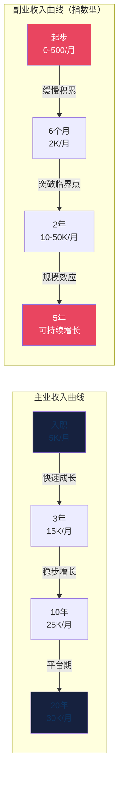
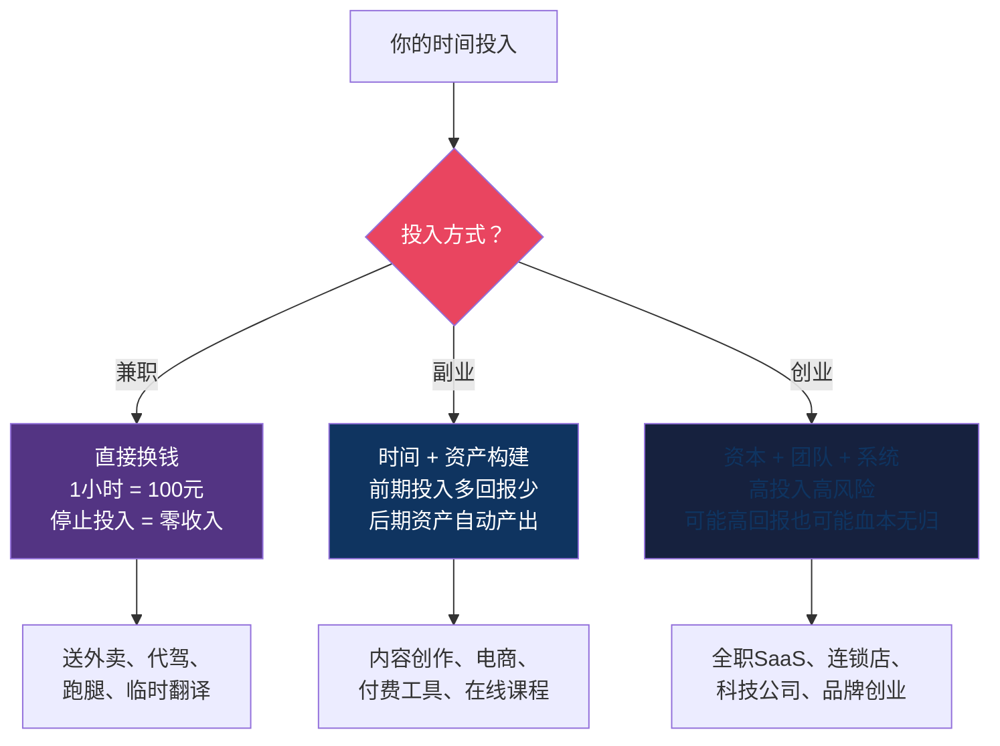
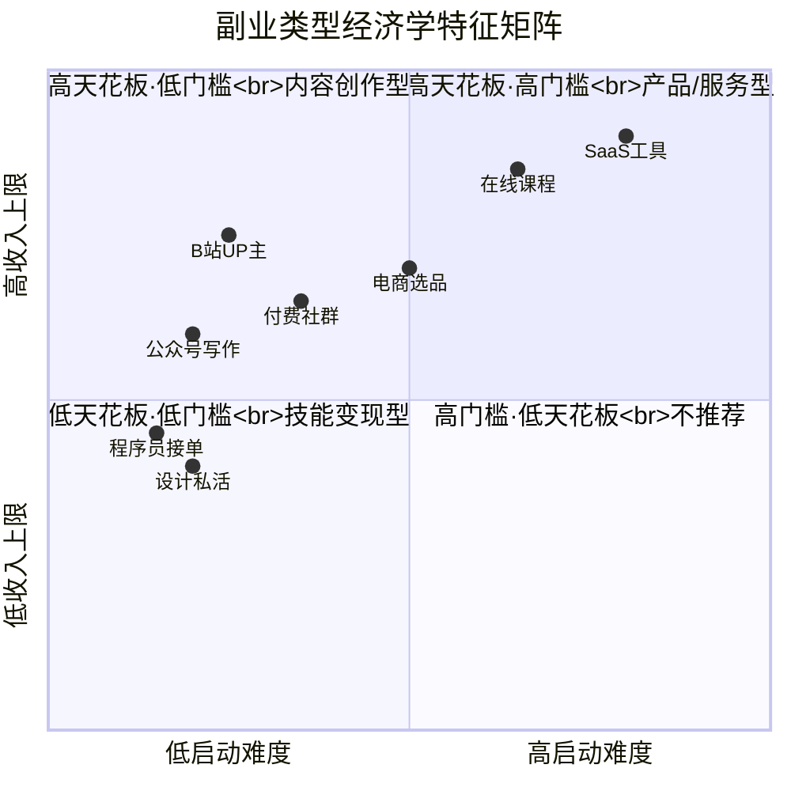
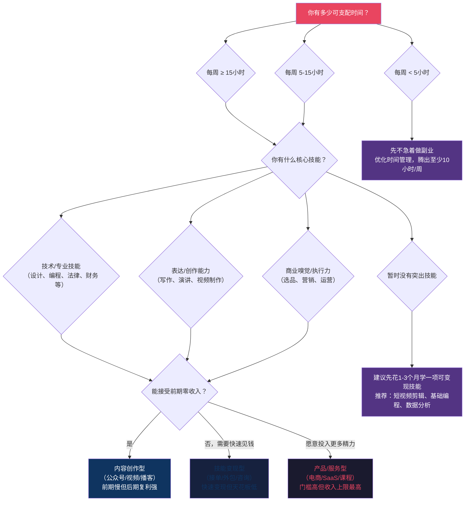
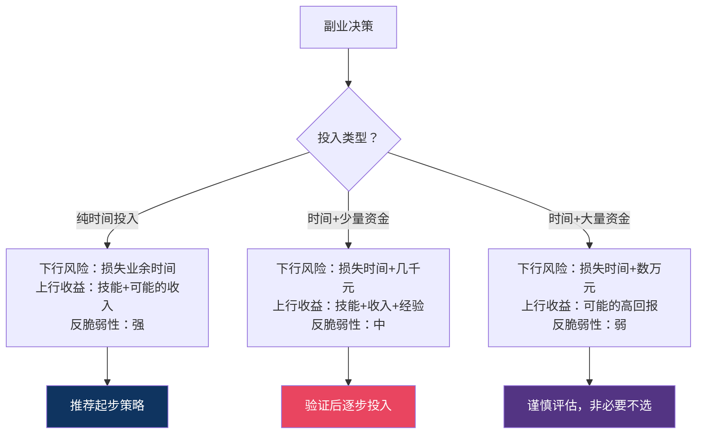
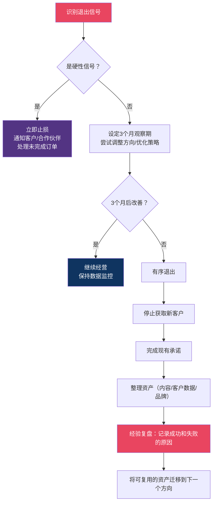

## 三、副业的经济学

做副业不是"多打一份工"这么简单。从经济学的视角来看，副业是一个**在约束条件下做资源配置决策**的问题——你的约束条件是时间（每天24小时，刨去主业和睡觉，可支配时间极为有限），你的目标是在这个约束下最大化个人财富的增长速度。

本节用经济学的底层逻辑，帮你想清楚三个问题：**为什么要做副业（而不是做别的）、做什么类型的副业（而不是什么都做）、怎么衡量副业值不值得做（而不是凭感觉）**。

### 3.1 副业的经济学本质：时间的机会成本与边际收益

#### 3.1.1 为什么主业收入有天花板

理解副业的经济学价值，首先要理解主业收入的结构性缺陷。

打工的本质是**出售时间**。你把自己的时间卖给雇主，换取工资。这个交易存在三个根本性限制：

**限制一：时间供给刚性**。每个人每天只有24小时，扣除8小时睡眠、2小时通勤和日常事务，可用于工作的时间最多14小时。即使你愿意加班，一个月的总工作时长也有上限——大约200-250小时。这个上限是物理定律决定的，任何努力都无法突破。

**限制二：工资增速低于价值增速**。你为公司创造的价值可能每年增长15%，但工资涨幅通常只有5-8%。差额被公司拿走了——这就是马克思所说的"剩余价值"，也是企业利润的来源之一。在经济学中，这被称为**劳动的边际产品与工资之间的楔子（wedge）**。只要你是雇员，这个楔子就永远存在。

**限制三：边际收益递减**。在同一个岗位上，你的经验从0到3年带来的薪资增长最快（可能翻倍），从3到10年增速放缓，10年以后趋于平台期。这就是经济学中的**边际收益递减规律**在个人职业发展中的体现。原因很简单：岗位所需的核心技能在前3年基本学完，后续的增长主要来自软性能力（管理、人脉），而这些能力的变现效率远低于硬技能。

**限制四：收入与风险的不对称**。雇员承担了企业经营的下行风险（裁员、降薪、公司倒闭），但几乎不分享上行收益（公司利润增长、股权增值与你无关）。这种**风险-收益不对称**是主业收入的结构性缺陷——你承担了创业级别的风险，却只拿到打工级别的回报。



#### 3.1.2 副业的经济学定义

从经济学角度来看，副业的本质是**用边际时间创造边际收入，同时构建可能带来指数增长的资产**。

这里面有三个关键词：

- **边际时间**：主业完成之后的剩余可支配时间。如果不做副业，这些时间通常被刷手机、看剧、无效社交消耗掉——机会成本接近于零。所谓"接近于零"，是因为这些活动除了即时快感外，几乎不产生任何持久价值。用经济学术语来说，这些时间的**影子价格（shadow price）**极低。
- **边际收入**：每多投入一小时能带来的额外收入。副业初期的边际收入通常很低（可能每小时不到10元），但如果选对方向，边际收入会随着经验积累和客户积累而递增。关键区别在于：打工的边际收入是固定的（加班费），而副业的边际收入可以是递增的。
- **资产构建**：好的副业不只是"多打一份工"，而是在构建某种资产——品牌、客户关系、内容库、技术能力。这些资产在你停止投入时间后仍然能产生收入，即**被动收入**。资产的经济学定义是"能在未来产生现金流的资源"，而副业构建的正是这种资源。

#### 3.1.3 机会成本分析：不做副业的代价

很多人觉得做副业有风险，但很少有人想过**不做副业的代价**是什么。

假设你月薪15000元，每年涨薪8%。不做副业的情况下：

| 年限 | 月收入 | 年收入 | 累计收入 |
|------|--------|--------|----------|
| 第1年 | 15,000 | 180,000 | 180,000 |
| 第3年 | 17,500 | 210,000 | 576,000 |
| 第5年 | 20,400 | 244,800 | 1,010,400 |
| 第10年 | 30,000 | 360,000 | 2,320,000 |

再看同样的人，每周投入15小时做副业，假设副业月收入从0线性增长到第12个月的5000元，之后保持稳定：

| 年限 | 主业月收入 | 副业月收入 | 合计月收入 | 年收入 | 累计收入 |
|------|-----------|-----------|-----------|--------|----------|
| 第1年 | 15,000 | 2,500 | 17,500 | 210,000 | 210,000 |
| 第3年 | 17,500 | 5,000 | 22,500 | 270,000 | 756,000 |
| 第5年 | 20,400 | 8,000 | 28,400 | 340,800 | 1,382,400 |
| 第10年 | 30,000 | 15,000 | 45,000 | 540,000 | 3,120,000 |

**10年累计差距：80万元。** 而且这个计算还相当保守——它假设副业收入只线性增长，没有考虑指数增长的可能性（比如内容创作的长尾效应、产品化的规模效应）。

如果考虑**复利效应**（副业收入再投资于工具、广告、技能培训），实际差距可能更大。假设副业收入的20%用于再投资，年化回报率30%（合理的副业再投资回报率），10年后的复利终值会额外增加15-25万元。

> **关键洞察**：不做副业的机会成本不是"零"，而是"你在未来10年可能多赚的那80万+"。每个人的时间机会成本不同，但几乎对所有人来说，用刷手机的时间做副业，期望收益都严格大于零。

#### 3.1.4 副业vs兼职vs创业：经济学视角的本质区别

很多人把"副业"和"兼职"混为一谈，但从经济学的角度看，两者有本质区别：

| 维度 | 兼职（Part-time Job） | 副业（Side Business） | 创业（Startup） |
|------|---------------------|---------------------|----------------|
| **经济学模型** | 线性时间交换 | 时间+资产构建 | 资本+杠杆运营 |
| **收入函数** | 收入 = 时薪 × 小时数 | 收入 = f(时间, 资产, 杠杆) | 收入 = f(资本, 团队, 系统) |
| **边际收益特征** | 固定或递减 | 先减后增（J型曲线） | 高风险高回报 |
| **时间投入** | 业余时间 | 业余时间 | 全职投入 |
| **资金投入** | 零 | 少量或零 | 可能需要较多 |
| **风险程度** | 极低 | 低到中 | 高 |
| **可扩展性** | 不可扩展（受限于时间） | 可扩展（资产可复用） | 高度可扩展 |
| **失败代价** | 浪费了时间 | 低（不影响生活） | 高（可能影响生活质量） |
| **典型例子** | 下班后送外卖、周末摆摊 | 运营公众号、开发付费工具、电商选品 | 全职做SaaS、开实体店 |

**核心区别在于"收入函数"**：兼职的收入是线性的——你投入1小时赚100元，投入10小时赚1000元，不会因为你做了3年就每小时赚200元。而副业的理想状态是构建一个"资产"，这个资产可以在你睡觉时也在为你赚钱。

**第四种形态：斜杠职业（Slash Career）**。近年来还出现了一种介于副业和创业之间的形态——斜杠职业。斜杠职业者同时拥有多个收入来源，每个来源都不是"主业"的附属品，而是独立的专业身份。比如"产品经理/播客主播/付费社群运营者"。斜杠职业的经济学特征是**收入来源的多元化降低了单一收入中断的系统性风险**，类似于投资组合的分散化策略。



---

### 3.2 副业选择的经济学框架

#### 3.2.1 好副业的五个经济学特征

选择副业不能只看"别人赚了多少钱"，而要从经济学角度评估它是否具备以下五个特征：

**特征一：边际成本递减**

好副业的成本结构应该是这样的——前期投入大（学习技能、积累客户、建立品牌），但每多服务一个客户的边际成本越来越低。

举例：你开发了一门在线课程，制作课程可能花了200小时。第1个学员的边际成本是200小时；第2个学员的边际成本接近0（课程已经做好了）；第1000个学员的边际成本也接近0。这就是**数字产品的边际成本趋零效应**，也是为什么知识付费和软件产品是最佳副业类型。

反面例子：你做翻译接单，第1单花10小时赚1000元，第100单还是花10小时赚1000元。边际成本没有下降，收入天花板很低。

判断标准：问自己一个问题——"如果我的客户数量翻倍，我需要多投入多少时间？"如果答案是"也需要翻倍"，那就是线性模式，天花板很低；如果答案是"只需要增加20%的时间"，那就是边际成本递减模式。

**特征二：存在网络效应或复利效应**

好副业应该越做越容易、越做越值钱。这有两种实现方式：

- **网络效应**：你积累的用户/粉丝/客户越多，每个用户获得的价值越大（比如社群——人越多信息越多，每个人获得的价值越大）。经济学上，网络效应的价值可以用梅特卡夫定律（Metcalfe's Law）近似：网络价值与用户数的平方成正比。
- **复利效应**：你今天投入的时间，不仅产生今天的回报，还会增强明天的回报能力（比如写文章——3年前写的一篇文章今天还在帮你吸引客户）。复利效应的数学表达是 V = V₀ × (1+r)^t，其中r是每期回报率，t是时间期数。即使r很小（比如每篇文章每月只带来10个新读者），只要t足够大，最终的V会非常可观。

**特征三：时间灵活，不与主业冲突**

这是一个约束条件而非特征。好的副业必须能安排在主业的间隙——工作日晚上、周末、午休时间。如果副业需要你随时响应客户（比如做客服外包），就很难与主业兼容。

判断标准：这个副业是否可以在"异步模式"下运行？即客户下单后，你可以在自己方便的时间交付，而不是需要实时响应。异步模式是副业与主业兼容的关键前提。

**特征四：启动成本低，试错成本可控**

副业的最大优势之一是**低成本试错**。如果一个副业需要投入10万元才能开始，那它就不是一个好的副业选择——那是创业。好的副业应该在1000元以内就能启动验证，失败了最多损失几千块和一些业余时间。

经济学中有一个概念叫**实物期权（Real Option）**：每一次小规模尝试都是在购买一个"期权"，如果方向对了，你再投入更多资源"行权"；如果方向错了，你的损失只是期权费（几千块+一些时间）。这种策略的期望收益远高于"一次性押注"。

**特征五：你拥有比较优势**

经济学中的**比较优势理论**告诉我们：即使你在所有方面都不如别人，你仍然应该专注于你"最不差"的那个领域。对副业来说，比较优势的来源包括：

- **技能壁垒**：你有别人不容易学会的技能（比如你会写代码，大多数人不会）
- **信息优势**：你掌握了别人不知道的信息（比如你在某个行业工作，了解行业内部的需求和痛点）
- **信任资产**：你已经积累了一批信任你的人（比如你的朋友圈、你的粉丝、你的同事圈子）
- **时间优势**：你比别人更早进入一个新兴领域（比如2023年就开始做AI相关内容的人）
- **地理优势**：你所在的城市或区域有独特的资源（比如义乌的小商品供应链、深圳的电子产品供应链）

#### 3.2.2 副业的三种类型及其经济学特征

从收入结构和增长模式来看，副业可以分为三种基本类型。每种类型有不同的经济学特征，适合不同的人群和阶段：

**类型一：技能变现型——出售专业能力**

| 经济学维度 | 分析 |
|-----------|------|
| 收入函数 | 收入 = 时薪 × 可用小时数 |
| 边际成本 | 固定（每小时的机会成本不变） |
| 边际收益 | 递减（时间用完就没了） |
| 规模化路径 | 提高时薪（从执行者→顾问→培训师）或雇佣他人 |
| 启动难度 | ★（最低，有技能就能开始） |
| 收入上限 | 中等（受限于个人时间） |
| 典型案例 | 设计师接私活、程序员做外包、翻译做兼职、律师做咨询 |

**经济学优化策略**：技能变现型副业的核心优化方向是**提高单位时间价值**。具体路径：
1. 选择溢价高的细分技能（前端开发比数据录入时薪高3-5倍）
2. 建立个人品牌降低获客成本（让客户来找你，而不是你去找客户）
3. 产品化交付（把一次性的定制服务变成可复用的模板/工具/流程）
4. 从执行层升级到策略层（从"帮你做PPT"升级到"帮你做商业策略"）

**技能叠加策略**：经济学中有一个概念叫**技能叠加（Skill Stacking）**——你不需要在单个技能上做到前1%，而是把多个技能组合在一起，形成独特的竞争壁垒。比如"懂编程的设计师"比"纯设计师"和"纯程序员"都稀缺，时薪可以高出50-100%。

**类型二：内容创作型——构建注意力资产**

| 经济学维度 | 分析 |
|-----------|------|
| 收入函数 | 收入 = 流量 × 转化率 × 客单价 |
| 边际成本 | 极高（前期几乎零回报）→ 极低（后期内容持续变现） |
| 边际收益 | 先减后增（J型曲线，6-18个月的"收入荒漠期"） |
| 规模化路径 | 多平台分发、内容复用、粉丝经济、广告收入 |
| 启动难度 | ★★（低，但坚持难） |
| 收入上限 | 高（头部创作者年入百万以上） |
| 典型案例 | 写公众号、做B站UP主、运营小红书、开播客、做YouTube |

**经济学优化策略**：内容创作的核心经济学逻辑是**构建"注意力资产"**。你今天写的一篇文章、拍的一个视频，可能在3年后还在帮你吸引流量——这就是内容的长尾效应。优化方向：
1. 选择SEO友好的平台和内容形式（搜索流量是被动的、持续的）
2. 内容矩阵化（一个主题同时产出文章、视频、音频，最大化内容复用率）
3. 尽早建立邮件列表或私域流量（平台算法会变，但你的用户数据库不会消失）
4. 变现路径多元化（广告+课程+咨询+社群+电商，不要只靠一条路）

**类型三：产品/服务型——构建可复制的商业系统**

| 经济学维度 | 分析 |
|-----------|------|
| 收入函数 | 收入 = 销量 × 客单价 - 固定成本 - 变动成本 |
| 边际成本 | 高（需要前期投入开发/生产）→ 低（规模化后单位成本下降） |
| 边际收益 | 典型的规模经济曲线——达到盈亏平衡点后利润快速增长 |
| 规模化路径 | 标准化产品、自动化交付、建立品牌溢价 |
| 启动难度 | ★★★（中等，需要产品开发能力） |
| 收入上限 | 最高（可以做到超越主业收入的数倍） |
| 典型案例 | 开发SaaS工具、做电商（自有品牌）、开在线课程、做付费社群 |

**经济学优化策略**：产品/服务型的核心是**找到盈亏平衡点，然后快速扩大规模**。优化方向：
1. 先用最小可行产品（MVP）验证需求，再投入资源做大
2. 控制固定成本，提高变动成本的灵活性（能外包就不招人）
3. 建立定价权（品牌溢价、差异化定位，避免陷入价格战）
4. 利用数字化降低交付成本（在线课程比线下培训的边际成本低100倍）



#### 3.2.3 副业选择决策树

不要凭感觉选副业。用下面这个决策树，根据你的实际情况做出理性选择：



---

### 3.3 副业的时间经济学

#### 3.3.1 时间投资回报率（Time ROI）

做副业和做投资一样，需要计算**回报率**。只不过投资用的是钱，副业用的是时间。

**时间投资回报率公式：**

```text
Time ROI = (副业收入 - 直接成本) ÷ 投入时间的市场价值 × 100%
```

其中，"投入时间的市场价值"等于你的时薪（主业月收入 ÷ 月工作小时数）。

**举例计算：**

假设你月薪15000元，每月工作22天×8小时=176小时，时薪约85元。

| 副业场景 | 月收入 | 直接成本 | 投入时间 | 时间市场价值 | Time ROI |
|---------|--------|---------|---------|------------|---------|
| 做设计接单 | 3000 | 0 | 30小时 | 2,550元 | 118% |
| 运营公众号（第6个月） | 500 | 0 | 20小时 | 1,700元 | 29% |
| 运营公众号（第18个月） | 8000 | 200 | 20小时 | 1,700元 | 459% |
| 开淘宝店（第3个月） | 5000 | 2000 | 40小时 | 3,400元 | 88% |
| 做在线课程（上线后第1个月） | 1000 | 0 | 5小时 | 425元 | 235% |
| 做在线课程（上线后第6个月） | 5000 | 100 | 5小时 | 425元 | 1153% |

**关键洞察**：不同副业类型的Time ROI曲线完全不同：

- **技能变现型**：Time ROI一开始就是正的（100%+），但增长缓慢，甚至会随着你接更多单而疲劳下降。
- **内容创作型**：Time ROI一开始可能是负的（投入大量时间但几乎零收入），但在6-18个月后会急剧上升（长尾效应）。
- **产品/服务型**：Time ROI前期为负（需要投入时间开发产品），但一旦产品上线，ROI可以达到惊人的1000%+（因为边际时间投入极低）。

**隐性成本的计算**：上面的公式只计算了显性成本，还要考虑隐性成本——学习时间（学新技能投入的时间）、维护时间（售后、更新、运营）、机会成本（做了A就做不了B）。把这些都算进去，实际Time ROI通常比表面数字低20-30%。

#### 3.3.2 副业的时间分配经济学

你的时间是稀缺资源，分配时间时应该遵循**边际收益相等原则**——当每一小时花在主业和副业上的边际收益相等时，总收益最大。

但现实中，大多数人的主业边际收益已经很低了（加班1小时可能只带来微薄的加班费或者老板的一个好评），而副业初期的边际收益可能更低。那么什么时候应该把时间从主业转移到副业？

**决策公式：**

```text
当 副业的预期时间ROI > 主业的边际时间ROI 时，增加副业时间
当 副业的预期时间ROI < 主业的边际时间ROI 时，减少副业时间
```

具体的时间分配建议：

| 阶段 | 工作日 | 周末 | 周总计 | 分配逻辑 |
|------|--------|------|--------|---------|
| 探索期（第1-3月） | 每天1小时 | 每天2-3小时 | 10-15小时 | 主要用于学习和验证，不求回报 |
| 验证期（第3-6月） | 每天1-2小时 | 每天3-4小时 | 15-20小时 | 重点投入在已验证的方向上 |
| 增长期（第6-12月） | 每天2小时 | 每天4小时 | 18-24小时 | 加大投入，追求突破临界点 |
| 稳定期（12月+） | 每天1-2小时 | 每天2-3小时 | 12-18小时 | 建立系统后减少时间投入，追求被动收入 |

**绝对底线：**
- 主业工作时间不能被挤压——副业是"锦上添花"，不能"捡了芝麻丢了西瓜"
- 每天睡眠不能低于7小时——身体垮了一切归零
- 每周至少保留半天完全休息——防止长期疲劳导致放弃

#### 3.3.3 碎片时间经济学

很多人抱怨"没时间做副业"，但他们每天有2-3小时的碎片时间被浪费了——通勤、午休、等人、排队。

碎片时间的经济学价值在于：虽然单个碎片时间（10-30分钟）不适合做高价值任务，但可以用来做**低认知负荷的准备性工作**。

| 碎片时间长度 | 适合做的副业任务 | 不适合做的任务 |
|------------|----------------|--------------|
| 5-10分钟 | 回复客户消息、浏览行业资讯、记录灵感 | 写文章、做设计、编程 |
| 10-20分钟 | 整理素材、编辑图片、规划明天的任务 | 深度创作、学习新技能 |
| 20-30分钟 | 写大纲、处理简单订单、社媒互动 | 复杂方案设计、数据分析 |
| 30-60分钟 | 写短文、录制短视频片段、处理客户反馈 | 需要长时间专注的创造性工作 |

**碎片时间的正确用法**：把大任务拆成小块。比如"写一篇2000字的公众号文章"可以拆成：
1. 通勤时用语音备忘录记录灵感和大纲（10分钟）
2. 午休时搜索相关素材和数据（20分钟）
3. 晚上整块时间写作（1.5小时）
4. 碎片时间排版和发布（15分钟）

这样算下来，写一篇文章只需要1.5小时的"整块时间"，其余都可以用碎片时间完成。

#### 3.3.4 时间管理工具与方法

高效的时间管理不是"技巧"，而是"系统"。你需要一套自动运转的系统来确保副业时间不被侵蚀：

**方法一：时间块法（Time Blocking）**

把每周的副业时间预先锁定在日历上，像安排会议一样安排副业。原则是"先锁定再灵活"——先把固定的时间块锁死，剩下的时间再安排其他事务。

示例周计划：

| 时间 | 周一 | 周二 | 周三 | 周四 | 周五 | 周六 | 周日 |
|------|------|------|------|------|------|------|------|
| 早6:30-7:30 | 副业 | 副业 | 副业 | 副业 | 副业 | 副业 | 休息 |
| 晚20:00-21:30 | 副业 | 休息 | 副业 | 休息 | 副业 | 副业 | 副业 |

**方法二：精力管理法**

不要只管理时间，还要管理精力。把高认知负荷的任务安排在精力最充沛的时间段，低认知负荷的任务安排在精力低谷。

- **高精力时段**（通常在早上或深夜）：做创造性工作——写文章、做方案、开发产品
- **中精力时段**（通常在下午）：做执行性工作——处理订单、回复客户、社媒运营
- **低精力时段**（通常在饭后或睡前）：做信息输入——阅读、学习、浏览资讯

**方法三：两分钟法则**

如果一个副业相关任务可以在2分钟内完成，立刻做掉。比如回复一条客户消息、确认一个订单、记录一个灵感。积压的小任务会消耗你的心理能量（心理学上的"蔡格尼克效应"——未完成的事项会持续占据注意力）。

**方法四：批处理法（Batching）**

同类任务集中处理，减少上下文切换的认知成本。比如不要一条一条回复客户消息，而是每天固定两个时段（中午12点、晚上9点）集中回复。不要每天发一条社媒内容，而是一次性写好一周的内容，用定时发布工具自动发送。批处理可以减少30-50%的时间浪费。

---

### 3.4 副业的风险经济学

#### 3.4.1 副业风险的三层框架

做副业不是零风险的。虽然比创业风险低得多，但仍然需要理性评估：

**第一层：财务风险**

| 风险项 | 最大损失 | 概率 | 防范措施 |
|--------|---------|------|---------|
| 启动资金损失 | 几百到几千元 | 低 | 设定止损线，超过5000元就要认真评估 |
| 工具/平台费用 | 几百元/月 | 中 | 优先用免费工具，验证后再升级付费版 |
| 库存积压（电商） | 几千到几万元 | 中 | 先代发/预售，验证后再备货 |
| 税务风险 | 罚款+补税 | 低 | 收入超过一定额度后及时注册和报税 |

**第二层：时间风险**

| 风险项 | 最大损失 | 概率 | 防范措施 |
|--------|---------|------|---------|
| 投入大量时间但方向错误 | 数月时间 | 中 | 用MVP快速验证，不要一上来就"全力投入" |
| 副业影响主业表现 | 降薪/失业 | 低 | 严格隔离主业和副业时间，绝不在主业时间做副业 |
| 长期疲劳影响健康 | 健康损害 | 中 | 设定每周休息时间底线，不透支身体 |

**第三层：法律/合规风险**

| 风险项 | 最大损失 | 概率 | 防范措施 |
|--------|---------|------|---------|
| 主业竞业限制违规 | 被起诉/赔偿 | 低 | 仔细审查劳动合同中的竞业条款 |
| 税务不合规 | 罚款+信用损失 | 低 | 了解个人所得税和增值税基本规定 |
| 知识产权侵权 | 赔偿+下架 | 中 | 使用正版素材，保留原创证据 |
| 虚假宣传 | 行政处罚 | 低 | 宣传内容要有依据，不做夸大承诺 |

**第四层：平台风险（经常被忽视）**

| 风险项 | 最大损失 | 概率 | 防范措施 |
|--------|---------|------|---------|
| 平台规则变更 | 流量/收入骤降 | 高 | 不依赖单一平台，建立私域流量 |
| 平台封号 | 全部积累归零 | 中 | 遵守平台规则，定期备份内容和数据 |
| 平台衰退 | 用户流失 | 中 | 关注平台数据趋势，提前迁移 |
| 平台抽成提高 | 利润被压缩 | 中 | 建立直接触达用户的渠道 |

平台风险是副业面临的最大系统性风险之一。2023年小红书算法大改导致大量博主流量腰斩，2024年抖音电商政策调整让部分商家利润骤降。这些都不是个别现象，而是平台经济的结构性特征——**平台掌握规则制定权，创作者和商家永远是规则的接受者**。防范平台风险的核心策略是：把平台当渠道，不要把平台当全部。建立邮件列表、微信社群、个人网站等自有渠道，确保即使某个平台崩了，你的用户关系还在。

#### 3.4.2 副业的"反脆弱"设计

纳西姆·塔勒布在《反脆弱》中提出了一个核心概念：最好的策略不是"避免风险"，而是构建一个**能从波动和不确定性中获益的系统**。

把反脆弱思维应用到副业中：

**原则一：小赌注，多尝试**

不要把所有业余时间押在一个方向上。前3个月同时尝试2-3个方向，每个方向投入50-100小时，然后根据数据选择最优方向加大投入。这就是**期权思维**——用小成本买多个"期权"，中奖的那个再加注。

具体操作：
- 第1-2周：调研5-10个可能的副业方向
- 第3-4周：筛选出3个方向，每个投入20小时做MVP测试
- 第5-8周：根据数据（收入、反馈、兴趣度）淘汰1-2个
- 第9-12周：在剩余1-2个方向上加大投入

**原则二：上行无限制，下行有底线**

好的副业应该满足"收益无上限，损失有下限"的特征。比如做内容创作，最坏情况是浪费了业余时间，但最好的情况可能是年入百万。而做需要大量资金投入的副业（比如囤货做电商），损失可能很大，就不满足这个原则。

**原则三：构建"可选择性"**

每个副业项目都应该给你带来"可选择性"——即使副业本身失败了，你在过程中积累的技能、人脉、认知也是有价值的。比如你做自媒体没赚到钱，但你学会了写作、视频剪辑、用户运营——这些技能在未来的工作中都能用上。



---

### 3.5 副业的规模经济学

#### 3.5.1 从线性增长到指数增长

大多数副业起步时是**线性增长**的——你投入10小时赚1000元，投入20小时赚2000元。但真正有价值的副业，应该追求从线性增长切换到**指数增长**。

指数增长的三个触发条件：

**条件一：内容/产品的复利效应**

当你积累了足够多的内容或产品后，它们开始相互引流。比如你写了50篇关于Python的文章，这50篇文章会形成一个"知识网络"——读者看完一篇会点击另一篇，你的整体流量不是50篇文章的简单相加，而是它们的乘积效应。

**条件二：口碑传播的临界点**

当你的满意客户数量超过某个临界值（通常在100-500人之间），口碑传播开始自运转。每个满意客户平均带来0.3-0.5个新客户，你的获客成本开始下降，而收入持续增长。这个临界点可以通过NPS（净推荐值）来追踪：当NPS超过50时，口碑传播通常会进入自运转状态。

**条件三：品牌溢价的形成**

当你在某个领域建立了足够的专业声誉后，客户不再是因为"便宜"选择你，而是因为"信任"选择你。这意味着你可以提高定价，而需求不会显著下降——这就是**价格弹性降低**，是品牌经济的核心。


#### 3.5.2 副业规模化的四种路径

当你在副业中验证了需求、积累了初始客户后，下一步是思考如何突破个人时间的限制。以下是四种从"一个人做副业"升级为"一个可规模化的小生意"的路径：

**路径一：产品化——把服务变成产品**

| 阶段 | 做法 | 效果 |
|------|------|------|
| 第1阶段 | 一对一定制服务（收入=时薪×小时） | 积累经验，发现共性需求 |
| 第2阶段 | 提炼标准化服务包（固定价格，明确交付物） | 提高效率，降低沟通成本 |
| 第3阶段 | 录制成课程/写成模板/做成工具 | 一次制作，反复销售 |
| 第4阶段 | 建立自动化销售和交付系统 | 实现真正的被动收入 |

**路径二：杠杆化——用他人的时间赚钱**

当你一个人忙不过来时，可以雇佣兼职或外包人员来处理低价值工作，你专注于高价值工作（策略、客户关系、产品设计）。

关键计算：
```text
雇佣收益 = (外包人员产出 × 你的售价) - (外包人员报酬 + 管理成本)
当雇佣收益 > 0 时，扩大团队
当雇佣收益 < 0 时，停止扩招
```

**路径三：平台化——从"做内容"到"建平台"**

如果你的副业积累了足够多的用户，你可以从"自己做内容"升级为"让别人在你的平台上做内容"。比如从自己写公众号，升级为建立一个投稿平台；从自己做课程，升级为建立一个课程分销平台。

**路径四：品牌化——从"卖产品"到"卖品牌"**

品牌化的本质是**降低客户的决策成本**。当你的品牌足够知名时，客户不需要比较、不需要调研，直接选择你。品牌溢价可以让你的毛利率从20%提升到60%以上。

#### 3.5.3 副业定价的经济学

定价是副业中被严重低估的杠杆。大多数人定价偏低，因为他们用"成本加成"思维定价（我的成本+合理利润），而不是用"价值定价"思维定价（客户获得的价值×合理比例）。

**三种定价模型：**

| 定价模型 | 公式 | 适用场景 | 举例 |
|---------|------|---------|------|
| 成本加成 | 成本 × (1 + 利润率) | 商品销售、体力劳动 | 做一杯咖啡成本5元，卖15元 |
| 竞争参照 | 参考竞品定价 ± 差异化溢价 | 同质化市场 | 同类课程卖199，你卖299（内容更深入） |
| 价值定价 | 客户获得价值 × 10-30% | 高价值服务、专业咨询 | 帮客户省了10万，收1-3万 |

**定价心理学**：
- **锚定效应**：先展示高价选项，再展示你的价格，客户会觉得"便宜"。比如先说"商业咨询通常5000元/小时"，再说"我的咨询服务800元/小时"。
- **价格尾数**：99元比100元感觉便宜很多（虽然只差1元）。这不是"忽悠"，而是利用了大脑的左位数效应。
- **价格梯度**：提供3个价格档位（基础版/标准版/高级版），大多数人会选中间那个。中间那个才是你真正想卖的。

---

### 3.6 副业的税收经济学

#### 3.6.1 副业收入的税务基础

很多人做副业完全不考虑税务问题，直到收入做大了才发现要补税甚至被罚。以下是必须了解的基础知识：

**个人副业收入的主要税种：**

| 收入类型 | 税种 | 税率 | 起征点 | 说明 |
|---------|------|------|--------|------|
| 劳务报酬（接单/咨询） | 个人所得税 | 20%-40% | 单次800元 | 预扣预缴，年度汇算清缴多退少补 |
| 经营所得（电商/开店） | 个人所得税 | 5%-35% | 年度6万元 | 个体工商户可选择核定征收 |
| 稿酬所得（写文章/出书） | 个人所得税 | 实际约11.2% | 单次800元 | 按劳务报酬的70%计算 |
| 偶然所得（中奖等） | 个人所得税 | 20% | 单次1万元 | 一般副业不涉及 |

**劳务报酬预扣预缴的计算方式**：
- 单次收入不超过4000元：应纳税所得额 = 收入 - 800
- 单次收入超过4000元：应纳税所得额 = 收入 × 80%
- 预扣税率：应纳税所得额2万以下20%，2-5万30%，5万以上40%
- 年终汇算清缴时，劳务报酬并入综合所得，适用3%-45%的累进税率

**关键概念——核定征收vs查账征收：**

- **核定征收**：税务局根据你的行业和规模，直接核定一个利润率（通常为10%），你按这个利润率交税。适合收入不高、账目简单的小副业。比如你做电商年收入50万，核定利润率10%，则应纳税所得额为5万，适用5%税率，应纳税2500元。
- **查账征收**：你需要建立完整的账目，按实际利润交税。适合收入较高、有正规财务核算能力的情况。

> **实际建议**：当你的副业月收入稳定超过5000元时，建议注册个体工商户，选择核定征收。这样做的好处是税负更低（综合税率通常在3-5%左右），而且可以开发票给客户，更容易接到企业订单。

**注册个体工商户的流程**：
1. 确定经营范围（与副业内容匹配）
2. 到当地市场监管局办理营业执照（通常1-3个工作日）
3. 到税务局办理税务登记
4. 选择核定征收方式
5. 开设对公银行账户（可选，小规模经营也可用个人账户）

#### 3.6.2 副业的税后收入优化

合法节税的核心思路是**充分利用税收优惠政策**，而不是逃税。

| 策略 | 操作方法 | 节税效果 |
|------|---------|---------|
| 注册个体工商户 | 到市场监管局办理营业执照 | 可选择核定征收，综合税率从20%+降到3-5% |
| 利用小规模纳税人免税 | 月销售额10万以下免征增值税 | 直接节省增值税 |
| 合理列支成本 | 工具费、学习费、差旅费等可作为经营成本扣除 | 降低应纳税所得额 |
| 年度汇算清缴 | 劳务报酬预扣的20%可能在年度汇算时退回 | 多退少补，低收入者可能退税 |
| 选择合适的纳税身份 | 个体户vs有限公司vs个人，税负差异大 | 需要根据收入规模具体测算 |

> **重要提醒**：以上仅为基本常识介绍，不构成税务建议。具体税务筹划请咨询专业会计师。底线原则：**合法纳税，不碰红线**。偷税漏税的罚款和信用损失远比省下的税款严重。

---

### 3.7 副业的心理经济学

#### 3.7.1 副业中的行为经济学陷阱

做副业不只是经济决策，也是心理博弈。以下是常见的行为经济学陷阱：

**陷阱一：沉没成本谬误**

你在某个副业方向上已经投入了3个月时间和5000元，但数据表明这个方向不行。理性决策是立刻止损，但大多数人会想"都已经投入这么多了，再坚持一下吧"。

**对策**：在开始前设定明确的止损标准。比如"如果3个月后月收入不到2000元就换方向"。把标准写下来，到时间了严格执行。

**陷阱二：幸存者偏差**

你在网上看到"某博主靠副业月入10万"的案例，觉得自己也能做到。但你没看到的是，同样的赛道上有1000个人在做，只有1个人做到了月入10万，其余999人月入不到1000元。

**对策**：不看极端案例，看中位数。找到10个以上同赛道的人，看他们的平均收入水平，而不是只看最成功的那个。可以在知乎、小红书上搜索"XX副业真实收入"，看那些普通人的分享。

**陷阱三：即时满足偏好**

副业初期的投入-回报比很低（投入大量时间但几乎零收入），而刷手机、看剧能立刻给你多巴胺。大脑天然偏好即时满足，这导致很多人在副业的"收入荒漠期"（前3-6个月）就放弃了。

**对策**：把长期目标分解为短期里程碑。不盯着"月入1万"的大目标，而是关注"这周写完3篇文章"、"今天找到5个潜在客户"这样的小目标。每完成一个小目标就给自己一个小奖励。

**陷阱四：过度乐观偏差**

大多数人高估自己副业成功的概率和速度。"我3个月就能做到月入5000"——实际上大多数副业需要6-12个月才能达到这个水平。

**对策**：把你的预期时间乘以2，把预期收入除以2。用这个"调整后的预期"做规划，你就不会因为"比预期慢"而沮丧。

**陷阱五：信息过载导致的决策瘫痪**

做副业之前，你可能花了几个月时间"研究"——看了100篇文章、50个视频、加入了10个付费社群，但始终没有开始行动。这是行为经济学中的"选择过载（Choice Overload）"——选项太多反而导致无法做出决策。

**对策**：设定一个"研究截止日期"。比如"我给自己两周时间调研，两周后必须选定一个方向开始行动"。记住：不完美的行动胜过完美的计划。

**陷阱六：社会比较焦虑**

看到别人副业月入几万，自己还在起步阶段，产生焦虑和自我怀疑。这种焦虑可能导致两个极端：要么放弃，要么盲目加速（投入过多时间或资金）。

**对策**：只和昨天的自己比。每周记录自己的进步——新增了多少粉丝、学到了什么技能、收入增长了多少。把注意力从"别人赚了多少"转移到"我进步了多少"。

#### 3.7.2 副业坚持的心理学策略

大多数人做副业失败不是因为方向错了，而是因为**坚持不下来**。以下是经过验证的心理学策略：

**策略一：承诺与一致性**

公开宣布你在做副业（朋友圈、社群），利用心理学中的"承诺一致性"原理——人们倾向于保持言行一致，公开承诺会显著提高执行率。

**策略二：社交激励**

找到3-5个同样在做副业的伙伴，组成"副业互助小组"，每周互相汇报进度、交流经验。社会心理学研究表明，有"同行者"的任务完成率比独自完成高出65%。

**策略三：进度可视化**

用表格、图表或日历记录你的副业进展。每完成一个任务就打一个勾。视觉化的进度会给你正向反馈，形成"完成→成就感→继续做"的正循环。

**策略四：环境设计**

把做副业的环境与休息的环境分开。如果可能，在家里设一个专门的"副业工作区"——坐在那里就只做副业。心理学中的"情境依赖记忆"会帮助你在这个环境中更快进入工作状态。

**策略五：习惯堆叠（Habit Stacking）**

把副业任务与已有的习惯绑定。比如"每天喝完早咖啡后，花30分钟写文章"、"每天通勤到公司后，先花15分钟回复客户消息"。利用已有的习惯触发器来驱动新习惯的建立，比单纯靠意志力可靠得多。

**策略六：设定"最低行动量"**

即使状态再差，也完成最低限度的副业任务。比如"今天至少写100字"、"今天至少回复1条客户消息"。最低行动量的意义不在于产出，而在于维持"做副业"的身份认同——"我是一个在做副业的人"，而不是"我曾经做过副业"。

---

### 3.8 副业的平台经济学

#### 3.8.1 平台作为副业的"基础设施"

在数字化时代，大多数副业都建立在某个平台之上——淘宝、抖音、小红书、微信公众号、B站、知乎、Fiverr、Upwork。理解平台的经济学逻辑，才能在平台上做出理性的副业决策。

**平台的双边市场模型**：大多数平台是**双边市场（Two-Sided Market）**——一边是内容提供者/商家（你），另一边是消费者/用户（你的客户）。平台的价值在于**降低双方的匹配成本**。作为副业者，你本质上是在平台的双边市场中充当"供给侧"。

**平台的抽成经济学**：平台帮你找到客户，但要收取"渠道费"。不同平台的抽成比例差异巨大：

| 平台类型 | 代表平台 | 典型抽成/成本 | 隐性成本 |
|---------|---------|-------------|---------|
| 电商平台 | 淘宝、拼多多 | 2-10% | 推广费（占销售额10-30%） |
| 内容平台 | 抖音、B站、小红书 | 0-30%（打赏/带货） | 算法依赖（流量不可控） |
| 知识付费 | 知识星球、小鹅通 | 5-10% | 获客成本（需自行引流） |
| 自由职业 | 猪八戒、Fiverr | 10-20% | 竞价导致价格下压 |
| 社交电商 | 微信、朋友圈 | 0% | 信任成本（过度营销伤人脉） |

**关键洞察**：平台的"免费"往往是最贵的。比如抖音不收你费用，但你完全依赖它的算法获得流量——当算法变化时，你的收入可能一夜之间腰斩。微信公众号不收你费用，但你发的内容只有5-10%的粉丝能看到。**平台的真正成本不是显性抽成，而是隐性的流量控制权**。

#### 3.8.2 平台选择的经济学框架

选择在哪个平台做副业，本质上是一个**渠道投资决策**。以下是评估框架：

| 评估维度 | 问题 | 评分标准 |
|---------|------|---------|
| 流量可控性 | 流量主要靠算法推荐还是靠自己的粉丝？ | 自有粉丝占比越高越好 |
| 变现效率 | 从流量到收入的转化路径有多短？ | 路径越短越好 |
| 用户质量 | 平台用户的付费意愿和消费能力如何？ | 目标用户匹配度越高越好 |
| 竞争强度 | 同赛道的创作者/商家有多少？ | 蓝海优于红海 |
| 内容复利性 | 内容发布后能持续获得流量吗？ | 长尾流量越强越好 |
| 迁移成本 | 如果要换平台，积累能带走多少？ | 迁移成本越低越好 |

**平台组合策略**：不要把所有鸡蛋放在一个篮子里。建议采用"1+1+N"策略——1个主平台（深度运营，70%精力）+ 1个辅助平台（同步分发，20%精力）+ N个长尾平台（自动化分发，10%精力）。同时建立自有渠道（邮件列表、微信社群、个人网站），作为"平台保险"。

---

### 3.9 副业经济学的核心指标体系

做副业不能"只管埋头干"，需要定期用数据审视方向是否正确。以下是一套完整的副业指标体系：

#### 3.9.1 基础财务指标

| 指标 | 计算方法 | 健康标准 | 预警信号 |
|------|---------|---------|---------|
| 月收入 | 副业总收入 | 逐月增长 | 连续2个月下降 |
| 月利润 | 月收入 - 直接成本 | > 50% | < 30%（可能方向有问题） |
| 时薪 | 月利润 ÷ 投入小时数 | > 主业时薪的50% | < 20元/小时（不如送外卖） |
| 累计投入 | 总时间成本 + 总资金成本 | 可控范围内 | 超过6个月收入仍无法回本 |

#### 3.9.2 增长指标

| 指标 | 计算方法 | 健康标准 | 预警信号 |
|------|---------|---------|---------|
| 月环比增长率 | (本月收入 - 上月收入) ÷ 上月收入 | > 10% | 连续3个月 < 5% |
| 客户增长率 | 本月新客户数 ÷ 上月总客户数 | > 15% | < 5% |
| 复购率 | 回头客数 ÷ 总客户数 | > 30%（因行业而异） | < 10% |
| 口碑推荐率 | 通过老客户推荐来的新客户占比 | > 20% | < 5%（产品/服务可能有问题） |

#### 3.9.3 效率指标

| 指标 | 计算方法 | 健康标准 | 预警信号 |
|------|---------|---------|---------|
| 获客成本（CAC） | 营销总费用 ÷ 新客户数 | < 客单价的30% | > 客单价的50% |
| 客户终身价值（LTV） | 平均客单价 × 平均购买次数 | LTV/CAC > 3 | LTV/CAC < 1.5 |
| 时间投入产出比 | 月利润 ÷ 月投入时间 | 逐月提升 | 连续下降 |
| 内容复用率 | 被重复使用的内容占比 | > 50% | < 20%（需要更多复用策略） |

#### 3.9.4 副业健康度自检表

每月用这张表做一次副业"体检"：

| 检查项 | ✅ 健康 | ⚠️ 需关注 | ❌ 危险 |
|--------|---------|----------|---------|
| 月收入趋势 | 逐月增长 | 平稳不增长 | 连续下降 |
| 时薪 | 高于主业时薪50% | 主业时薪20-50% | 低于主业时薪20% |
| 客户满意度 | 主动好评/推荐 | 无投诉 | 频繁投诉/退款 |
| 主业影响 | 无影响 | 偶尔精力不足 | 主业表现下降 |
| 身心状态 | 精力充沛 | 偶尔疲劳 | 长期疲惫/焦虑 |
| 时间可控 | 按计划执行 | 经常被打断 | 完全失控 |
| 合规性 | 税务合规 | 需要完善 | 存在法律风险 |

**评分规则**：6个以上✅ → 继续保持；3-5个⚠️ → 需要调整；任何❌ → 立即处理。

---

### 3.10 副业退出的经济学

#### 3.10.1 什么时候该放弃一个副业

不是所有副业都值得坚持。理性退出和理性开始同样重要。以下信号表明你可能应该放弃或转型：

**硬性退出信号（必须退出）：**
- 连续6个月Time ROI低于50%（你的业余时间更值钱）
- 副业严重影响主业表现（被警告、绩效下降）
- 身心健康出现明显问题
- 法律/合规风险无法解决

**软性退出信号（考虑转型）：**
- 连续3个月收入增长停滞
- 你对这个方向失去了兴趣和热情
- 市场环境发生了根本性变化（比如平台政策变了、赛道过时了）
- 出现了更好的机会成本

#### 3.10.2 退出的最优策略

退出不是"突然停止"，而是一个有序的过程：



**退出时的关键原则：**

1. **保全资产**：你在副业中积累的内容、客户关系、技能、品牌认知都是资产，退出时要想办法保留和迁移。
2. **维护信誉**：即使不做了，也要完成对现有客户的承诺。信誉是最难建立、最容易毁掉的资产。
3. **复盘总结**：花1-2天做一次完整的复盘——哪些做对了、哪些做错了、学到了什么、下次怎么做得更好。这次失败的经验价值可能超过副业本身赚到的钱。

---

### 3.11 本节总结：副业经济学的核心公式

最后，用一组公式总结本节的核心思想：

```text
1. 副业的价值 = 时间投资回报率（Time ROI）
   Time ROI = (副业收入 - 直接成本) ÷ 投入时间的市场价值

2. 做不做副业的机会成本 = 不做副业的累计收入损失
   10年差距可达数十万到上百万元

3. 选择副业方向的标准 = 边际成本递减 + 复利效应 + 比较优势
   三者至少满足两个

4. 副业从线性增长到指数增长的条件 = 内容复利 + 口碑临界点 + 品牌溢价
   通常需要6-18个月的积累期

5. 副业健康度 = 月收入增长 × 时薪水平 × 主业无负面影响
   三个条件同时满足才叫"健康的副业"

6. 退出决策 = 当 Time ROI < 主业边际时间ROI 且 无改善趋势
   理性止损比盲目坚持更有价值

7. 平台风险防范 = 主平台 + 辅助平台 + 自有渠道
   永远不要把全部积累放在一个平台上

8. 定价策略 = 价值定价 > 竞争参照 > 成本加成
   大多数副业者定价偏低，而非偏高
```

副业的经济学归根结底是**时间的经济学**。你的时间是唯一不可再生的资源，每花一小时在副业上，就是放弃了一小时的休息、学习、陪伴家人或者做其他副业的机会。理解这一点，你才能做出真正理性的副业决策——不是"别人做什么我就做什么"，而是"在我的约束条件下，做什么能最大化我的长期收益"。
