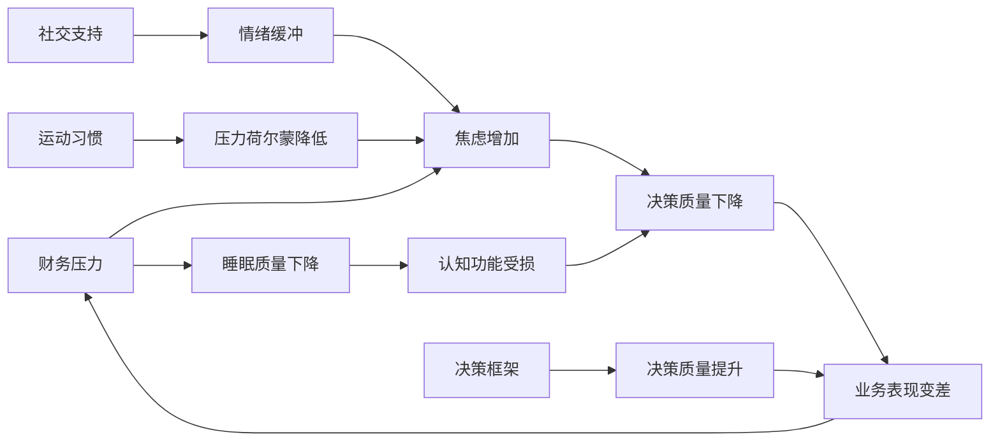

## 四、创业的心理准备

创业不只是商业行为，更是一场心理马拉松。CB Insights 对 101 家失败创业公司的分析显示，**29% 的创业者把"资金耗尽"列为失败原因，但排在第一位的是 42%——"没有市场需求"**。这两个数据背后都指向同一个根源：创业者在心理层面没有做好应对不确定性的准备——要么过早放弃市场验证，要么在资金管理上失控。

心理准备不是"给自己打鸡血"，而是建立一套系统化的认知框架、情绪管理机制和决策模型，让你在创业的高压环境下依然能做出理性判断。Michael A. Freeman（2015）的研究显示，**72% 的创业者报告存在心理健康问题**，这个比例远高于普通人群。了解这一点不是为了吓退你，而是为了让你把心理建设当作创业的"基础设施"来投入。

### 1. 创业心理的本质：从"员工思维"到"创始人思维"

#### 1.1 员工思维与创始人思维的差异

在踏上创业路之前，首先要理解一个根本性的思维转换：

| 维度 | 员工思维 | 创始人思维 |
|------|----------|------------|
| 收入来源 | 固定月薪，按劳取酬 | 不确定收入，按价值创造取酬 |
| 风险态度 | 风险规避，追求稳定 | 风险管理，拥抱不确定性 |
| 失败定义 | 失败 = 惩罚，需要避免 | 失败 = 数据，需要学习 |
| 时间感知 | 按计划推进，有明确截止日 | 非线性，可能长期无回报 |
| 身份认同 | 我是XX公司的XX职位 | 我就是公司本身 |
| 决策方式 | 执行上级指令 | 自主决策并承担全部后果 |
| 责任边界 | 职责范围内负责 | 对一切结果负责 |
| 社交模式 | 同事关系为主 | 创业者社群、投资人、客户 |
| 信息获取 | 被动接收（公司安排） | 主动猎取（自己判断价值） |
| 失败代价 | 被辞退（换一份工作） | 个人资产损失（无法轻易重置） |

这个转换不是一夜之间完成的，但你需要在创业前就认识到这个差异的存在。很多创业者失败的原因不是能力不足，而是用员工思维在创业——等待"领导"（市场）给自己明确指令，遇到模糊就停下来，把"做好本职工作"当成全部。

#### 1.2 创始人思维的核心要素

创始人思维包含四个相互关联的要素：

```mermaid
graph TD
    A[创始人思维] --> B[不确定性耐受力]
    A --> C[第一性原理思考]
    A --> D[资源约束下的创造力]
    A --> E[长期主义视角]
    
    B --> B1[接受"不知道答案"]
    B --> B2[在模糊中做出决策]
    B --> B3[区分"可控"和"不可控"]
    
    C --> C1[质疑一切假设]
    C --> C2[从基本事实出发推理]
    C --> C3[避免类比思维陷阱]
    
    D --> D1[用最少资源验证假设]
    D --> D2[把约束当作创造力的催化剂]
    D --> D3[杠杆思维]
    
    E --> E1[延迟满足]
    E --> E2[复利效应]
    E --> E3[穿越周期]
```

**不确定性耐受力**是创业心理的基石。神经科学研究表明，人类大脑的杏仁核会把不确定性等同于威胁，触发"战或逃"反应——这是数百万年进化的结果。但创业的本质就是在不确定性中创造价值。你需要训练自己在"不知道答案"的状态下依然能冷静决策。

**第一性原理思考**要求你质疑行业内的"常识"。当所有人都说"外卖平台必须烧钱补贴"时，第一性原理思考者会问："用户的核心需求是什么？满足这个需求的最低成本路径是什么？"这种思维方式不是天赋，而是可以通过刻意练习培养的习惯——每当你听到"行业惯例"时，追问一句"为什么必须这样"。

**资源约束下的创造力**是小团队的核心优势。限制不是敌人，而是筛选器——它逼你找到最本质的解决方案。Instagram 创始时只有 13 个人，WhatsApp 被 Facebook 收购时只有 55 名员工。约束迫使你聚焦于真正重要的事。

**长期主义视角**要求你接受"前 6-18 个月可能看不到任何回报"的现实。复利效应的本质是前期投入巨大、后期回报指数增长——但大多数人无法忍受前期的"静默期"。

#### 1.3 心理资本（PsyCap）：创业者的心理资源模型

积极心理学研究者 Fred Luthans 提出了"心理资本"（Psychological Capital, PsyCap）模型，包含四个核心维度，每个维度都是可以通过训练提升的：

| 维度 | 定义 | 在创业中的体现 | 提升方法 |
|------|------|--------------|---------|
| **自我效能感**（Self-efficacy） | 对自己完成特定任务能力的信心 | "我能搞定这个客户" | 设定阶梯式小目标，积累成功体验 |
| **希望**（Hope） | 找到实现目标的路径并有动力去走 | "我知道怎么从A到B" | 制定多条路径计划（Plan A/B/C） |
| **乐观**（Optimism） | 对成功的积极归因 | "这次失败是因为时机不对，不是我不行" | 练习积极归因风格 |
| **韧性**（Resilience） | 从逆境中快速恢复 | "大客户丢了，但我下周能签3个小客户" | 逐步暴露于可控的压力情境 |

研究表明，PsyCap 水平高的创业者，其企业存活率比低 PsyCap 创业者高出 30% 以上。重要的是，PsyCap 不是固定不变的性格特质，而是可以通过刻意练习在 4-8 周内显著提升的"状态型"资源。

**PsyCap 提升的实操练习：**

- **自我效能感**：每周回顾"本周最有成就感的一件事"，写清楚你做了什么、为什么成功。6 周后回看，你会发现自己的能力远超想象。
- **希望**：为当前最大的挑战制定 3 个不同解决方案（即使有些看起来不靠谱）。这训练你"总有路可走"的思维习惯。
- **乐观**：当遇到挫折时，写 3 个"这可能是好事"的理由。不是自欺欺人，而是训练大脑从多角度解读事件。
- **韧性**：每周做一件超出舒适区 10% 的事——不是让你去冒险，而是让你习惯"有点不舒服"的感觉。

### 2. 创业者必须警惕的认知偏差

创业决策中，认知偏差是最大的隐形杀手。了解这些偏差不是为了消除它们（不可能），而是在关键决策时有意识地校准。

#### 2.1 乐观偏差（Optimism Bias）

**表现**：高估成功概率，低估风险。研究显示，创业者认为自己成功概率比同类企业高 3 倍以上，实际上新创企业 5 年内存活率不到 50%。

**典型场景**："我的产品这么好，用户一定会喜欢"、"市场这么大，我们只需要占 1% 就够了"。

**校准方法**：使用"参考类别预测法"（Reference Class Forecasting）。不去想"我这个项目能成吗"，而是去查"同类型项目的历史成功率是多少"。然后用历史数据作为基准，再根据你的差异化优势做微调。

#### 2.2 沉没成本谬误（Sunk Cost Fallacy）

**表现**：因为已经投入了大量时间/金钱/精力，所以继续投入一个明显应该放弃的项目。

**典型场景**："我已经在这个项目上花了一年了，不能现在放弃"、"我已经投了 50 万进去了，再投 20 万就能做出来"。

**校准方法**：做决策时只问一个问题——"如果我今天才第一次看到这个项目，没有任何沉没投入，我会选择投入吗？"如果答案是"不会"，就应该放弃（或转型），不管已经投入了多少。

#### 2.3 确认偏差（Confirmation Bias）

**表现**：只寻找和记住支持自己观点的信息，忽略或低估反对意见。

**典型场景**：做用户调研时只问引导性问题（"你觉得这个功能有用吗？"而非"你目前怎么解决这个问题？"）；在论坛上只看正面评价。

**校准方法**：指定团队中一个人扮演"魔鬼代言人"（Devil's Advocate），专门负责提出反对意见和风险。对于重大决策，强制要求列出"这个决策可能是错的 5 个理由"。

#### 2.4 规划谬误（Planning Fallacy）

**表现**：系统性地低估任务完成时间和成本。研究表明，创业者对项目时间的预估平均偏差达到 50-100%。

**典型场景**："这个功能两周就能做完"（实际用了 6 周）、"首年营收 500 万"（实际 80 万）。

**校准方法**：对每个时间和成本预估，乘以 1.5-2 的系数。更精确的做法是使用"三点估算法"：乐观估计（O）、最可能估计（M）、悲观估计（P），加权计算 = (O + 4M + P) / 6。

#### 2.5 幸存者偏差（Survivorship Bias）

**表现**：只关注成功案例，忽略大量失败案例，导致对成功路径产生扭曲认知。

**典型场景**："比尔·盖茨大学没毕业就创业了，所以学历不重要"、"Airbnb 创始人当初靠卖麦片撑过来的，所以资金不是问题"。

**校准方法**：主动搜索和研究失败案例。每个你研究的成功案例，至少研究 3 个同类型的失败案例。失败案例中蕴含的教训，往往比成功案例更有价值。

#### 2.6 锚定效应（Anchoring Effect）

**表现**：决策被最先接触到的信息过度影响。

**典型场景**：第一个投资人估值 500 万，后续所有谈判都围绕这个数字展开，即使实际情况已大不相同。

**校准方法**：在任何谈判或决策前，独立建立自己的评估框架，不参考外界数字。如果无法避免锚定，至少主动设置一个"反锚"——比如同时考虑最高和最低的合理估值。

### 3. 创业前必须面对的七个心理关卡

#### 3.1 关卡一：恐惧识别与管理

创业恐惧不是一种，而是一组相互关联的恐惧。你必须逐一识别并建立应对策略：

**财务恐惧：怕亏钱**

这是最常见的创业恐惧。应对策略不是"不怕亏钱"，而是做最坏情况分析（Worst Case Scenario Analysis）：

1. 计算你的"创业底线"——如果创业失败，你需要多少资金维持基本生活
2. 确保底线资金有 6-12 个月的储备
3. 设定明确的止损线——"如果 6 个月内没达到 X 指标，我将做 Y 调整"
4. 把创业投入控制在"即使全部亏掉也不会影响基本生活"的范围内

```text
创业安全边界计算公式：
安全投入 = 总储蓄 - 应急资金(6个月生活费) - 家庭必要储备
         - 子女教育基金(如有) - 债务偿还储备

示例：
总储蓄 50 万
- 应急资金(月支出 8000 × 6) = 4.8 万
- 家庭储备金 = 5 万
- 负债偿还 = 0 万
= 安全投入上限 40.2 万

实际建议：取上限的 50-70%，即 20-28 万作为首期投入
```

**身份恐惧：怕丢面子**

"如果创业失败了，别人会怎么看我？"——这种恐惧在中国文化背景下尤其强烈。在中国社会语境中，创业失败不仅是经济损失，还可能被解读为"不务正业"、"好高骛远"。应对策略：

- 把"失败"重新定义为"实验结果"——你不是在赌博，而是在做实验
- 建立创业者社交圈，这些人不会因为创业失败而评判你
- 记住：你身边99%的人根本不会花时间关注你的成败，他们忙自己的事
- 如果家人施压，准备一份"创业计划书"给他们看——用数据和逻辑说服，而非情感对抗

**能力恐惧：怕自己不够好**

"我不够聪明/不够有经验/不够有人脉"——这是冒名顶替综合症（Imposter Syndrome）的变体。研究表明，约 70% 的人在某个时刻会经历冒名顶替综合症。事实是：没有人在创业前就"准备好了"。创业本身就是学习的过程。克服方法不是"证明自己够好"，而是接受"我会边做边学，这很正常"。

#### 3.2 关卡二：身份剥离与重建

从员工到创业者的转换，本质上是一次身份重塑。你需要处理的不是"我能不能创业"，而是"我是谁"的问题。

**身份剥离的三个阶段：**

1. **否认期**：继续用员工的标准衡量自己——"我需要一份漂亮的简历"
2. **混乱期**：旧身份碎裂，新身份未建立——"我不知道自己是谁了"
3. **重建期**：以创业者身份重新定义自己——"我是一个创造价值的人"

很多创业者卡在第二阶段就放弃了。他们不是没有能力，而是无法承受"身份真空"带来的焦虑。提前了解这个过程，可以帮你更平稳地度过。

**身份重建的实操方法：**

- **写一份"创业者宣言"**：用 200 字描述"作为创业者，我是谁、我做什么、我为什么做"。每次感到迷茫时读一遍。
- **建立新的日常仪式**：员工有打卡、开会、写周报。创业者也需要自己的仪式——比如每天早上用 15 分钟审视"今天最重要的三件事"。
- **找到"创业身份"的榜样**：不一定是非常成功的人，而是和你阶段相似、你认同其价值观的创业者。

#### 3.3 关卡三：确定性依赖的戒断

长期的固定工作会让你形成"确定性依赖"——习惯于每天有明确的任务、可预期的收入、清晰的汇报线。创业会把这些确定性全部拿走。

戒断症状包括：
- 不断检查银行账户余额
- 过度规划和准备（"我还需要再学习一年"）
- 拖延核心行动（"先做个完美的商业计划书"）
- 寻找"标准答案"（"别人是怎么做的"）
- 反复犹豫，无法做出选择（"万一选错了呢"）

应对方法：接受不确定性是常态，建立"微确定性"——每天设定3件确定要完成的事，用小胜利对抗大焦虑。

**确定性依赖的渐进戒断方案：**

如果你还没辞职，可以在全职工作期间就开始练习：

| 周次 | 练习内容 | 目的 |
|------|---------|------|
| 第1-2周 | 每天尝试一件结果不确定的小事（如主动联系一位陌生人） | 习惯"不知道结果会怎样" |
| 第3-4周 | 做一个小型副业项目，完全自主决策 | 体验"没人告诉你该做什么" |
| 第5-6周 | 模拟创业场景：给自己设定3个月的副业收入目标 | 练习在不确定性中设定和追踪目标 |
| 第7-8周 | 尝试一次"无人指导的决策"：选一个你不确定的方向，做两周看看 | 训练"先做再调整"的能力 |

#### 3.4 关卡四：社交关系的压力测试

创业会对你的社交关系产生真实的压力，而不是想象中的那种。

**对伴侣的影响：** 研究显示，创业者离婚率比普通职场人高 10-15%。原因包括：收入不稳定带来的情绪波动、工作时间不固定、决策压力无法在家释放。创业前必须和伴侣进行坦诚对话，讨论：最坏情况下的财务计划、各自的角色期望、沟通机制的约定。

**伴侣沟通的四个关键话题：**

1. **财务底线**："我们最多能承受多少损失？到了那个点，我会停下来。"
2. **时间预期**："前6个月我可能需要每周工作60-70小时，但我承诺每周至少有X个晚上完全属于家庭。"
3. **决策权**："创业是我的选择，但重大财务决策我们一起做。"
4. **退出信号**："如果出现X情况，我会选择停下来/换方向。"

**对朋友圈的影响：** 你会发现自己和非创业者朋友的共同话题越来越少。不是因为谁变了，而是生活重心不同了。这很正常，但需要主动维护关系。

**对家庭的影响：** 如果你有孩子或需要赡养老人，创业的心理负担会加倍。这不是说有家庭就不能创业，而是你需要更精细的计划和更坦诚的沟通。建议：在创业前就和家人（尤其是父母）沟通你的计划，用"我在做一个项目"而非"我要辞职创业"来降低他们的焦虑感。

#### 3.5 关卡五：孤独感的预判

创业者是孤独的。这不是矫情，而是结构性问题：

- 你不能向员工倾诉经营困难（会影响士气）
- 你不能向家人倾诉所有压力（会放大他们的焦虑）
- 你不能向客户展示脆弱（会影响信任）
- 同行之间有竞争关系，深度交流有限

解决方案：
- 找 2-3 位创业者组成"心理互助小组"，约定定期深度交流（每周或每两周一次，线下最佳）
- 考虑聘请创业教练或加入创业者社群（如 YC、创业邦、36氪创业者社群等）
- 建立定期心理咨询的习惯——不是"有病才去看"，而是"维护心理健康"
- 加入行业垂直社群（如知识星球、特定行业微信群），找到"同频"的人

#### 3.6 关卡六：完美主义的陷阱

完美主义是创业的大敌。它伪装成"对品质的追求"，实际上是在拖延：

- "产品还不够好，再打磨一下" → 你需要的是市场验证，不是自我感动
- "商业计划书还不够完善" → 计划赶不上变化，先行动再调整
- "我还需要更多技能" → 创业就是边学边做

完美主义的心理根源是"控制欲"——想控制所有变量后再行动。但创业的本质是与不可控因素共舞。

**克服完美主义的实操方法：**

| 完美主义表现 | 替代方案 | 具体操作 |
|------------|---------|---------|
| 产品需要完美才发布 | 最小可行产品(MVP) | 只保留核心功能，发布后迭代 |
| 计划需要完美才执行 | 2周冲刺计划 | 只规划2周，执行后调整 |
| 技能需要完美才开始 | 学习-实践循环 | 边做边学，用问题驱动学习 |
| 团队需要完美才组建 | 先独立验证 | 一个人先跑通核心流程 |
| 一切都要亲力亲为 | 80分原则 | 别人做80分就放手，你去做更重要的100分 |

**"完成比完美更重要"的科学依据：** 心理学中的"蔡格尼克效应"（Zeigarnik Effect）表明，未完成的任务会持续占据心理资源，产生焦虑。完成一个"还行"的产品并发布，比反复打磨一个"完美"产品，对心理健康更有益——因为你从"未完成的焦虑"进入了"已完成的满足"。

#### 3.7 关卡七：退出策略的心理建设

创业前就建立退出策略，不是悲观，而是理性。

你需要在创业前就回答三个问题：
1. **止损条件**：什么情况下我会选择终止或转型？（资金、时间、市场反馈的具体指标）
2. **退出路径**：终止后我做什么？（回到职场、换方向创业、自由职业）
3. **心理预案**：如果失败了，我如何定义这段经历的价值？

很多创业者在失败后陷入长期的自我否定，不是因为失败本身，而是因为没有提前建立"失败叙事"——一种对这段经历的积极解读框架。

**构建"失败叙事"的方法：**

在创业前就写好一段话："如果这次创业没有成功，这段经历教会了我______，让我成为了______样的人，我下一步会______。"这不是悲观，而是心理保险。有了这段话，即使最坏情况发生，你也不会迷失方向。

### 4. 创业者必须建立的心理能力

#### 4.1 情绪管理：从情绪化到情绪觉察

创业者的情绪波动幅度远超普通职场人——可能一天之内经历"我们的产品被大V推荐了！"到"核心员工要离职"的过山车。神经科学研究表明，压力状态下大脑会释放大量皮质醇，抑制前额叶皮层（负责理性思考）的功能，导致决策质量直线下降。

**情绪管理的四步模型（OODA-EM）：**

1. **观察（Observe）**：觉察自己当前的情绪状态——"我现在很愤怒/焦虑/恐惧"
2. **定位（Orient）**：找到情绪的触发源——"是因为客户流失/资金紧张/合伙人分歧"
3. **分离（Detach）**：把情绪和决策分开——"我可以有这个情绪，但不能在情绪中做决定"
4. **行动（Act）**：基于理性分析而非情绪做出决策

实操技巧：
- **24小时规则**：重大决策至少等24小时再执行，让情绪回落。神经科学显示，强烈情绪的生理反应平均持续 20-90 分钟，但完全平复需要更长时间。
- **情绪日志**：每天花5分钟记录当天的主要情绪和触发事件，长期积累会发现自己的情绪模式。推荐使用结构化模板：时间、事件、情绪（1-10分）、身体反应、后续行动。
- **身体信号监控**：情绪变化前身体会有信号（心跳加速、肩膀紧绷、失眠、胃部不适），学会识别这些信号，它们是你的"情绪预警雷达"。
- **物理中断法**：当情绪失控时，用冷水洗脸、做 20 个深蹲、或出门走 5 分钟。这不是逃避，而是给神经系统一个"重启"信号。

#### 4.2 决策能力：在信息不完整的情况下做判断

创业决策的核心挑战是：你永远没有足够的信息。如果你等到信息完备再决策，机会早已消失。

**决策框架一：可逆决策与不可逆决策**

亚马逊的贝佐斯把决策分为两类：

| 类型 | 定义 | 策略 | 示例 |
|------|------|------|------|
| 单向门（不可逆） | 做了就很难回头 | 慢决策，收集更多信息，多方咨询 | 合伙人股权分配、重大投资、法律结构 |
| 双向门（可逆） | 可以快速调整 | 快决策，先做再说，用数据验证 | 产品功能A/B测试、定价试验、营销文案 |

大多数创业决策是双向门，但创业者往往把它们当成单向门来处理，导致决策速度过慢。**经验法则：如果一个决策在 3 个月内可以调整，就把它当双向门处理。**

**决策框架二：10-10-10法则**

当你纠结于某个决策时，问自己三个问题：
- 10分钟后，我会怎么看这个决策？（短期情绪）
- 10个月后，我会怎么看这个决策？（中期效果）
- 10年后，我会怎么看这个决策？（长期影响）

这个框架帮你从短期情绪中抽离，用更长远的视角做判断。很多让你纠结的决策，在 10 年的尺度上根本无足轻重。

**决策框架三：预验尸（Pre-Mortem）**

在做重大决策前，假设这个决策已经失败了，然后倒推失败的原因：
1. 假设6个月后这个决策被证明是错的
2. 列出所有可能的原因（至少5个）
3. 针对每个原因制定预防措施
4. 重新评估决策——如果最大的风险可以被预防，这个决策大概率是可行的

**决策框架四：期望值计算**

对于涉及概率的决策，用数学而非直觉：

```text
期望值 = Σ(结果价值 × 发生概率)

示例：是否辞掉月薪 2 万的工作去做副业
- 方案A（继续工作）：确定性收益 = 24万/年
- 方案B（全职副业）：
  - 40%概率：年收入 50 万 → 贡献 = 20万
  - 30%概率：年收入 10 万 → 贡献 = 3万
  - 30%概率：年收入 0 万 → 贡献 = 0万
  期望值 = 23万/年
  
→ 两个方案期望值接近，但方案B方差更大。
如果你的风险承受能力高，选B；否则选A或先做副业验证。
```

#### 4.3 韧性建设：从"坚持"到"反脆弱"

韧性不是"硬扛"，而是一种从挫折中快速恢复并变得更强的能力。纳西姆·塔勒布在《反脆弱》中提出：有些事物在冲击中不仅不受损，反而会变强。

**区分"韧性"、"耐力"和"反脆弱"：**

| 类型 | 定义 | 创业中的表现 |
|------|------|------------|
| 脆弱 | 受到冲击就损坏 | 遇到第一个大客户拒绝就放弃 |
| 韧性 | 受到冲击后恢复原状 | 客户拒绝后调整方案继续尝试 |
| 反脆弱 | 受到冲击后变得更强 | 客户拒绝后发现了更好的需求，产品升级 |

**构建反脆弱心理的五种实践：**

1. **主动暴露于小挫折**：不要回避小失败，它们是心理免疫系统的"疫苗"。每周做一件让你略感不适的事——联系一个陌生人、尝试一个新领域、做一个有风险的小实验。

2. **建立"失败档案"**：记录每一次失败的具体情况、你的反应、你学到了什么。这不是自虐，而是把失败转化为可复用的经验。半年后回看，你会发现很多当时觉得天塌了的事其实没什么。

3. **身体韧性是心理韧性的基础**：规律运动、充足睡眠、健康饮食——这些不是可选项，而是创业者的"基础设施"。研究表明，每周3次30分钟以上的有氧运动，可以将焦虑和抑郁的风险降低40-60%。

4. **建立"心理安全基地"**：可以是一个人、一个地方、一项活动，在你感到脆弱时能让你恢复能量。可能是和伴侣的一次深谈、一次独自的长跑、或者一个安静的咖啡馆。

5. **把"为什么是我"变成"这教会了我什么"**：改变对挫折的叙事方式，从受害者叙事变成学习者叙事。

#### 4.4 注意力管理：在信息过载中保持聚焦

创业者面临的最大挑战之一是注意力被无限碎片化。每天都有"紧急但不重要"的事在抢占你的时间。

**艾森豪威尔矩阵在创业中的应用：**

|  | 紧急 | 不紧急 |
|--|------|--------|
| **重要** | 客户投诉、现金流危机、服务器宕机 | 战略规划、团队建设、产品方向、个人成长 |
| **不重要** | 大多数邮件、大部分会议、社交媒体通知 | 无关的社交活动、过度优化、完美主义打磨 |

创业者的时间应该主要花在"重要但不紧急"的事情上——这是创业最重要的悖论：你越忙于救火，就越没时间灭火。

**实操方法：**
- 每天设定3个"不可谈判"的高优先级任务，在上午精力最高时完成
- 批量处理低优先级任务（邮件、消息回复）——每天固定2个时段集中处理
- 学会说"不"——对非核心事务的邀请，如果不是"必须我做"，就拒绝或委托
- 使用"时间块"（Time Blocking）：把一天分成 3-4 个大块，每块只做一类事情
- 每周做一次"时间审计"：回顾本周时间花在了哪里，和计划对比

#### 4.5 批评与拒绝的免疫训练

创业者需要频繁面对拒绝——被客户拒绝、被投资人拒绝、被合作伙伴拒绝。每一次拒绝都会触发大脑的"社会疼痛"反应，其神经机制与物理疼痛相似。

**建立"拒绝免疫"的训练方法：**

- **100天拒绝挑战**（Jia Jiang 的"被拒100天"实验）：连续100天，每天主动请求一件可能被拒绝的事。你会发现：拒绝的后果远没有想象中严重，大多数人即使拒绝你也态度友善。
- **把拒绝数据化**：记录每次被拒绝的原因，把它变成"市场反馈数据"而非"对个人的否定"。
- **设定"拒绝配额"**：每周的目标不是"成交X单"，而是"被拒绝X次"——被拒绝次数越多，说明你接触的客户越多。

### 5. 创业前的心理自检清单

在正式创业前，用以下清单做一次诚实的自我评估：

#### 5.1 财务准备度

- [ ] 我有至少6个月的生活费储备（不计入创业资金）
- [ ] 我的家庭成员了解并支持我的创业计划
- [ ] 我已经计算了最坏情况下的财务损失，并且可以承受
- [ ] 我已经设定了明确的止损线
- [ ] 我的负债水平可控，没有高息贷款压力

#### 5.2 心理准备度

- [ ] 我能接受至少6-12个月没有稳定收入
- [ ] 我能在"不知道答案"的状态下做出决策
- [ ] 我已经和伴侣/家人讨论过最坏情况
- [ ] 我有至少2个可以深度交流的创业者朋友
- [ ] 我有应对孤独感和焦虑的具体策略
- [ ] 我理解失败的可能性，并且对失败有积极的叙事框架
- [ ] 我了解常见的认知偏差，能在重大决策时有意识地校准

#### 5.3 能力准备度

- [ ] 我对目标市场有至少100小时的深度研究
- [ ] 我有至少一个潜在客户验证过我的想法
- [ ] 我了解所在行业的基本商业模式和竞争格局
- [ ] 我有启动阶段所需的核心技能（或明确知道需要找谁）
- [ ] 我知道如何在信息不完整时做出合理决策

#### 5.4 关系准备度

- [ ] 创业后我能维持核心社交关系（家人、密友）
- [ ] 我有创业者社交圈或互助小组
- [ ] 我的合伙人（如有）在价值观和风险偏好上与我一致
- [ ] 我已经和合伙人讨论了股权分配、决策权、退出机制

### 6. 创业不同阶段的心理挑战与应对

#### 6.1 启动期（0-6个月）：兴奋与焦虑并存

这个阶段的核心心理挑战是"选择焦虑"和"行动瘫痪"——你有太多想做的事，但不知道从哪里开始。

应对策略：
- 用"最重要的事"测试法：每天早上问自己"如果今天只能做一件事，哪件事最有价值？"
- 接受"不完美的开始"——第一个版本一定会很粗糙，这很正常
- 建立日常节奏：固定的起床时间、工作时间、运动时间——节奏感是对抗焦虑的利器

#### 6.2 生存期（6-18个月）：信心危机

这个阶段是大多数创业者放弃的阶段。新鲜感消退，现实问题浮现，但收入还没有稳定。

核心心理挑战：
- **成果滞后带来的挫败感**：你付出了大量努力，但看不到明显的回报
- **对比焦虑**：看到同龄人在大公司升职加薪，而你还在"折腾"
- **决策疲劳**：每天要做大量决策，但没有老板给你兜底
- **孤独感加剧**：初期的兴奋消退后，孤独感会更强烈

应对策略：
- 设定"过程目标"而非"结果目标"——"本周联系20个潜在客户"而非"本周签单"
- 建立"成就日记"：每天记录3件做得好的事，无论多小
- 定期回顾你的"创业初衷"——为什么开始？想解决什么问题？
- 设置"里程碑庆祝"：每达成一个小目标，给自己一个奖励（哪怕只是一顿好饭）

#### 6.3 增长期（18个月+）：新层次的老问题

如果你撑过了生存期进入增长期，新的心理挑战会出现：
- **角色转换焦虑**：从"做事的人"变成"管人的人"
- **失控恐惧**：业务扩大后你无法掌控每一个细节
- **成功恐惧**：这听起来矛盾，但很多创业者在成功后反而焦虑——因为成功带来了新的责任和期望
- **倦怠（Burnout）**：长期高强度工作后的身心耗竭

应对策略：
- 学习授权——"别人做可能只有80分，但你有时间去做100分的事"
- 建立系统而非依赖个人——流程、制度、文化
- 定期做"身份体检"——"我还是那个我想成为的人吗？"

#### 6.4 倦怠的识别与预防

创业倦怠不是"累了休息一下就好"，而是一种持续的身心耗竭状态。世界卫生组织（WHO）已将倦怠纳入国际疾病分类（ICD-11），定义为"未能成功管理的长期工作压力综合征"。

**倦怠的三个维度：**

| 维度 | 表现 | 创业者常见症状 |
|------|------|--------------|
| 情绪耗竭 | 感觉被掏空，无法再给予 | "我不想再处理任何问题了" |
| 去人格化 | 对工作和人变得冷漠、愤世嫉俗 | "客户怎么这么烦"、"员工真没用" |
| 成就感降低 | 觉得自己做的事没有意义 | "我到底在干什么" |

**倦怠的预警信号：**
- 周日晚上开始焦虑周一
- 以前喜欢的工作内容现在让你厌烦
- 持续的疲劳感，休息后也无法恢复
- 开始频繁生病（免疫力下降）
- 使用酒精/咖啡因/药物来"撑过"每一天

**倦怠的预防策略：**
- **非谈判性休息**：每周至少一天完全不工作，不看工作消息。这不是奢侈品，而是生产力投资。
- **"高能量时段"保护**：识别你一天中精力最高的时段，把最重要的工作放在这个时段，其他时段处理低强度任务。
- **定期"充电活动"**：每周做一件纯粹为了快乐（而非生产力）的事——画画、钓鱼、打游戏、做饭。
- **建立"退出仪式"**：每天工作结束时有一个固定仪式（整理桌面、写下明天的3件事、关上电脑），告诉大脑"工作时间结束了"。

### 7. 创业者心理健康的科学维护

#### 7.1 创业者心理健康数据

不要忽视创业对心理健康的实际影响：

- 约 72% 的创业者报告心理健康问题（Michael A. Freeman, 2015）
- 创业者的抑郁症发病率是普通人群的 2 倍
- 约 30% 的创业者报告有抑郁症
- 创业者的ADHD发病率是普通人群的 2-3 倍
- 创业者的物质滥用率是普通人群的 1.5 倍（常见形式：酒精、咖啡因、安眠药）

这些数据不是为了吓退你，而是为了让你重视心理健康的维护——就像你会维护公司的财务健康一样。

#### 7.2 心理健康的日常维护方案

| 维护维度 | 具体做法 | 频率 | 作用机制 |
|---------|---------|------|---------|
| 运动 | 有氧运动30分钟以上 | 每周3-5次 | 释放内啡肽，降低皮质醇 |
| 睡眠 | 固定时间入睡，保证7-8小时 | 每天 | 认知功能和情绪调节的基础 |
| 冥想 | 正念冥想10-15分钟 | 每天 | 增强情绪觉察，降低焦虑 |
| 社交 | 与家人朋友深度交流 | 每周2-3次 | 对抗孤独感，获得情感支持 |
| 自然 | 户外活动，接触自然 | 每周1-2次 | 恢复注意力，降低压力荷尔蒙 |
| 专业支持 | 心理咨询/教练 | 每月1-2次 | 专业视角，打破认知盲区 |
| 数字断联 | 远离手机和社交媒体 | 每天1-2小时 | 减少信息过载，恢复专注力 |

**关于冥想的实操指南：**

很多创业者知道冥想好，但不知道怎么开始。以下是零基础入门方案：

1. **第1周**：每天 3 分钟，只关注呼吸。坐在安静的地方，闭眼，感受空气进出鼻腔。走神了就温柔地把注意力拉回来。
2. **第2周**：增加到 5 分钟。尝试"身体扫描"——从头顶到脚底，依次关注每个部位的感受。
3. **第3周**：增加到 8 分钟。加入"情绪标签"——当注意到情绪时，在心里说"这是焦虑"、"这是烦躁"，然后回到呼吸。
4. **第4周起**：稳定在 10-15 分钟。可以选择引导式冥想（推荐App：潮汐、小睡眠、Headspace）。

**关于睡眠的科学建议：**

睡眠是创业者最容易牺牲但最不应该牺牲的东西。研究表明，连续两周每晚只睡 6 小时，认知能力下降程度等同于连续 48 小时不睡。

- 固定就寝和起床时间（误差不超过 30 分钟）
- 睡前 1 小时不看屏幕（蓝光抑制褪黑素分泌）
- 卧室温度保持 18-22°C
- 如果创业压力导致失眠，使用"担忧时间"技巧：睡前 2 小时花 15 分钟把所有担忧写下来，然后合上本子，告诉自己"已经处理过了"

#### 7.3 识别心理健康的预警信号

以下信号出现 2 个以上时，需要认真对待：

- 持续 2 周以上的情绪低落或易怒
- 睡眠模式显著改变（失眠或过度嗜睡）
- 对以前感兴趣的事失去兴趣
- 无法集中注意力做决策
- 持续的身体症状（头痛、胃痛、肌肉紧张）无明确医学原因
- 社交回避——不想见任何人
- 依赖酒精或其他物质来应对压力
- 出现自我伤害或自杀的想法（请立即寻求专业帮助）

**中国创业者可用的心理支持资源：**
- 24小时心理援助热线：400-161-9995（希望24热线）
- 北京心理危机研究与干预中心：010-82951332
- 简单心理（jiandanxinli.com）：线上心理咨询平台
- 壹心理（xinli001.com）：心理健康服务与测评
- 各地精神卫生中心的心理咨询门诊（费用相对较低）

### 8. 心理准备的实操工具箱

#### 8.1 创业前心理准备的8周训练计划

**第1-2周：认知校准**
- 阅读3本创业者传记/访谈（不是成功学，而是真实的创业故事。推荐：《鞋狗》《苏世民：我的经验与教训》《创业维艰》）
- 采访3位正在创业或曾经创业的人，问他们最大的心理挑战是什么
- 完成创业心理准备度自检清单

**第3-4周：财务安全网搭建**
- 计算你的创业安全投入上限
- 建立6个月应急资金储备
- 和家人讨论财务计划和最坏情况

**第5-6周：心理能力训练**
- 每天练习10分钟正念冥想（推荐App：潮汐、小睡眠）
- 开始记录情绪日志
- 每天做一件略感不适的事（小风险暴露训练）

**第7-8周：社交支持系统建设**
- 加入至少1个创业者社群
- 找到2-3位创业者组成互助小组
- 和伴侣进行一次深度创业对话

#### 8.2 创业决策日记模板

每次做重大决策时，使用以下模板记录：

```text
日期：____年____月____日
决策内容：________________________________

【信息收集】
我掌握的关键信息：
1. ________________________________________
2. ________________________________________
3. ________________________________________

我缺失的关键信息：
1. ________________________________________
2. ________________________________________

【情绪检查】
当前主要情绪：____________________________
情绪对决策的可能影响：____________________

【预验尸】
假设这个决策6个月后被证明是错误的：
最可能的原因1：___________________________
最可能的原因2：___________________________
最可能的原因3：___________________________

【决策依据】
选择这个方案的核心原因：__________________
这个决策是可逆的还是不可逆的：__________
如果是不可逆的，是否已收集足够信息：____

【承诺】
我将在____天后回顾这个决策的实际效果。
```

#### 8.3 创业者日常心理维护的微习惯

不需要大块时间，这些5分钟以内的微习惯可以持续维护你的心理状态：

- **晨间意图设定**（2分钟）：起床后花2分钟设定今天的核心意图——"今天最重要的一件事是什么？"
- **情绪快照**（1分钟）：每顿饭前花1分钟检查自己的情绪状态——"我现在感觉怎么样？"
- **感恩练习**（2分钟）：睡前花2分钟想3件今天值得感恩的事——研究表明这可以显著提升幸福感
- **身体扫描**（3分钟）：感到压力时，花3分钟从头到脚扫描身体，放松紧张的部位
- **呼吸重置**（1分钟）：焦虑时使用4-7-8呼吸法——吸气4秒，屏息7秒，呼气8秒

#### 8.4 创业者心理韧性自评量表

每月用以下量表自评一次（1=完全不符合，5=完全符合），追踪自己的心理状态变化：

| 项目 | 评分(1-5) |
|------|----------|
| 遇到挫折后，我能在24小时内恢复行动力 | ____ |
| 我能在信息不完整时做出决策 | ____ |
| 我能区分"可控"和"不可控"的事 | ____ |
| 我有可以深度交流的创业者朋友 | ____ |
| 我保持规律的运动和睡眠习惯 | ____ |
| 我能识别和命名自己的情绪 | ____ |
| 我对创业失败有积极的叙事框架 | ____ |
| 我不会因为一次失败就否定全部努力 | ____ |
| 我能在高压下保持理性思考 | ____ |
| 我知道何时该坚持、何时该调整方向 | ____ |

**评分解读：**
- 40-50分：心理韧性优秀，继续保持
- 30-39分：韧性良好，关注得分最低的2项重点提升
- 20-29分：需要加强心理建设，建议增加社交支持和专业咨询
- 10-19分：建议暂缓创业，先投入心理健康建设

### 9. 常见误区与纠正

#### 误区一："创业需要100%的确定性才行动"

**真相**：如果等一切确定了再行动，你永远不会开始。创业的本质是在不确定性中创造确定性。你需要的不是100%的确定性，而是足够的信息让你觉得"值得一试"。

**纠正方法**：用"70%法则"——当你有70%的把握时就行动，剩余的30%在行动中解决。贝佐斯说过："大多数决策都应该在你掌握约70%的信息时做出。如果你等到90%，在大多数情况下，你可能就太慢了。"

#### 误区二："我需要先克服恐惧才能创业"

**真相**：恐惧不会消失，但可以被管理。等待"不恐惧的那一天"就是在永远拖延。真正的勇气不是没有恐惧，而是带着恐惧行动。

**纠正方法**：把恐惧当作"信息"而非"信号"——恐惧告诉你这件事对你很重要，但不意味着你不应该做。把恐惧具体化——"我具体怕什么？这个恐惧有多大概率发生？如果发生了我能怎么应对？"

#### 误区三："创业成功的人天生就有企业家特质"

**真相**：大量研究表明，创业成功与性格特质的相关性远低于与后天学习和环境因素的相关性。"天生的企业家"更多是幸存者偏差的产物。

**纠正方法**：关注"可学习的创业能力"——市场分析、产品设计、团队管理、财务规划，这些都可以通过学习和实践提升。

#### 误区四："只要足够努力就能成功"

**真相**：方向比努力更重要。在错误的方向上加倍努力，只会更快地失败。创业者需要的不只是"更努力"，而是"更聪明地努力"。

**纠正方法**：定期做"方向检查"——每周花30分钟问自己"我做的这些事，是在推动真正重要的事，还是只是在让自己忙起来？"

#### 误区五："心理准备就是读几本励志书"

**真相**：心理准备不是一次性的事，而是持续的实践。读100本创业励志书，不如真正面对一次失败。

**纠正方法**：把心理准备当作"技能训练"而非"知识积累"——你需要的是实践，不是理论。从今天开始做微习惯练习，而不是等到"准备好了"再开始。

#### 误区六："合伙人之间不需要谈"敏感"话题"

**真相**：合伙人之间的矛盾，90%源于创业前没有谈清楚"敏感"话题。等到矛盾爆发再谈，往往为时已晚。

**纠正方法**：创业前必须和合伙人讨论以下话题，并以书面形式确认：
- 股权分配及调整机制（成熟期/Vesting）
- 各自的角色、职责和决策权
- 投入时间和精力的预期
- 利润分配方式
- 退出机制（如果有人想退出怎么办）
- 分歧解决机制（谁有最终决定权）

### 10. 进阶：创业心理的深层认知

#### 10.1 存在主义视角下的创业

从存在主义哲学的角度看，创业是一种"自我定义"的行为——你通过创业来回答"我是谁"和"我想创造什么样的世界"。

维克多·弗兰克尔在《活出生命的意义》中指出，人类最深层的需求是"意义感"。创业可以是寻找和创造意义的一种方式——但前提是你清楚自己为什么要创业。

如果你创业只是因为"不想上班"或"想赚更多钱"，那么在遇到困难时你很容易放弃。但如果你创业是为了解决一个你真正关心的问题，那么困难反而会成为你的动力。

**找到创业"为什么"的三个练习：**

1. **墓志铭练习**：想象你 80 岁时的墓志铭，你希望上面写什么？创业和这个目标有什么关系？
2. **愤怒清单**：列出让你感到愤怒或不满的社会问题/行业问题。愤怒往往是驱动力的来源。
3. **10年愿景**：想象10年后你理想中的一天是什么样的。创业是否是到达那里的最佳路径？

#### 10.2 斯多葛哲学与创业心态

斯多葛哲学的核心智慧可以直接应用于创业心态：

- **控制二分法**：区分"你能控制的"和"你不能控制的"。你能控制产品质量、营销策略、团队建设；你不能控制市场环境、竞争对手行为、宏观经济。把精力集中在你能控制的事上。
- **预想困难（Premeditatio Malorum）**：提前想象可能出错的事，不是为了悲观，而是为了准备。每天花5分钟想象"今天可能出什么问题"，然后预先准备应对方案。
- **障碍即道路（The Obstacle Is The Way）**：每一个障碍都是练习某个美德的机会——资金紧张是练习节俭的机会，客户拒绝是练习韧性的机会，合伙人分歧是练习沟通的机会。

#### 10.3 系统思维与创业心理

不要把创业中的心理挑战看作孤立的问题，而要把它们看作一个系统：



理解这个系统的关键是：你不需要同时解决所有问题，只需要找到系统的"杠杆点"——改变一个点就能带动整个系统改善。对大多数创业者来说，最有效的杠杆点是：**睡眠质量和社交支持**。

改善睡眠 → 认知功能提升 → 决策质量提高 → 业务表现改善 → 财务压力降低 → 焦虑减少 → 睡眠进一步改善。这是一个正向循环，而它的起点只需要你今晚早点睡。

### 11. 心理准备的终极认知

创业的心理准备不是一个可以"完成"的任务，而是一种持续的实践。它不是让你变成一个"不会害怕、不会焦虑、不会怀疑"的人——那不是勇气，那是麻木。真正的创业心理准备是让你成为一个即使害怕、焦虑、怀疑，依然能做出合理决策、持续前进的人。

最后，记住三个原则：

1. **心理建设是基础设施，不是可选项**。就像你不会在没有地基的地方盖楼一样，不要在没有心理准备的情况下创业。
2. **心理健康是创业资产，不是个人弱点**。照顾好自己的心理状态，就是照顾好公司最重要的资产——创始人本身。
3. **你不需要完美，你只需要持续**。创业不是一次考试，而是一段旅程。路上会摔倒，会迷路，会想放弃——但只要你还在走，就还在路上。
