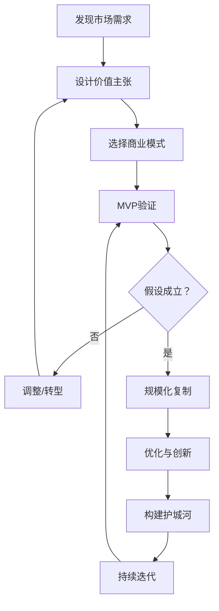
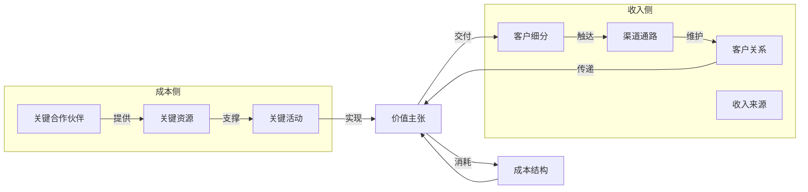
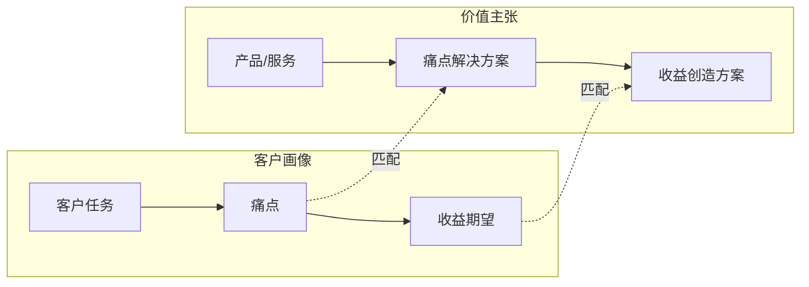
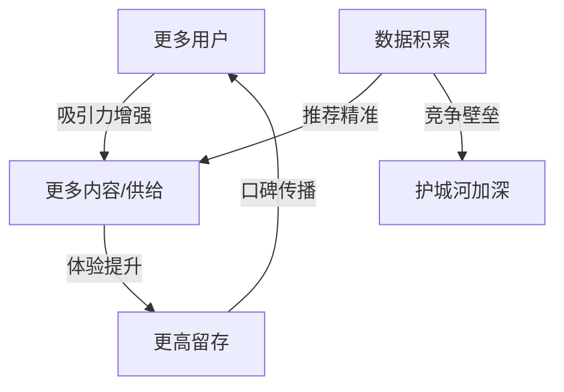
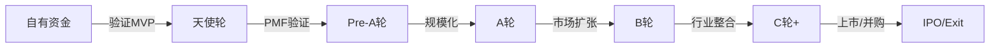
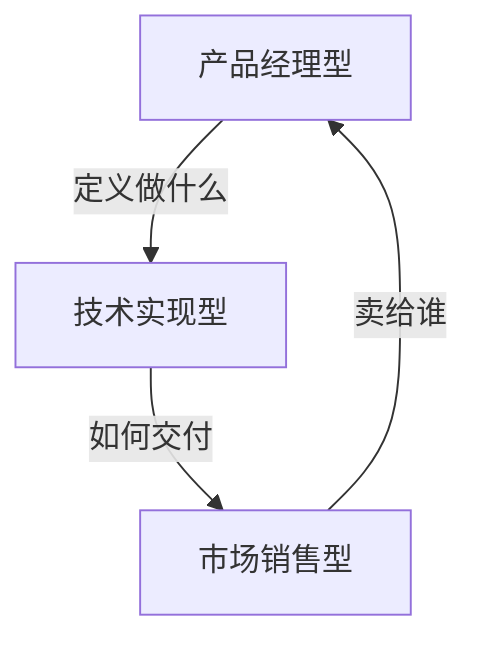
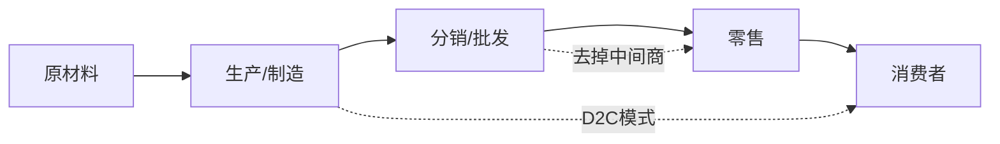

## 五、商业模式设计

商业模式回答的是一个根本问题：**你为谁创造价值，以及如何从中获取回报**。很多创业者把商业模式等同于"怎么赚钱"，这是一个危险的简化。商业模式是一套完整的价值创造、传递和获取系统——赚钱只是最后一环。

一个设计良好的商业模式，能让企业在资源有限的情况下最大化价值输出；一个设计粗糙的商业模式，即使产品再好，也会在规模化阶段轰然倒塌。

**商业模式的本质是什么？** 它不是一份PPT上的九宫格，而是你与市场之间的一套"交易契约"——你承诺为特定人群解决特定问题，客户承诺用金钱和时间回报你。设计商业模式的核心工作，就是让这套契约在经济上可行、在执行上可控、在竞争中可持续。



### 5.1 商业模式画布（Business Model Canvas）

商业模式画布由 Alexander Osterwalder 在《商业模式新生代》中提出，是全球使用最广泛的商业模式分析工具。它将商业模式拆解为 9 个相互关联的模块，覆盖了价值创造的完整链条。

**为什么是画布而不是Word文档？** 因为商业模式是一张"活的地图"——你需要同时看到全景，才能发现模块之间的逻辑断裂。Word文档是线性的，容易让你忽略全局一致性。

#### 5.1.1 画布的 9 大模块



**各模块详解：**

| 模块 | 核心问题 | 设计要点 | 常见错误 | 高级技巧 |
|------|----------|----------|----------|----------|
| **客户细分** | 你为谁创造价值？ | 明确主客户和次客户，区分付费者和使用者 | 试图服务所有人，结果谁也服务不好 | 画出客户生态图：决策者、使用者、影响者、付费者可能是不同的人 |
| **价值主张** | 你解决什么问题/满足什么需求？ | 量化价值（省多少钱/省多少时间/提升多少效率） | 只说功能不说好处，用户不买账 | 用"替代方案对比法"——你的方案比客户的现有方案好在哪里？好多少？ |
| **渠道通路** | 如何触达并交付价值给客户？ | 线上+线下组合，考虑获客成本和转化率 | 渠道过于单一，一旦平台政策变动就崩盘 | 计算每个渠道的"单位经济性"——获客成本、转化周期、客户质量 |
| **客户关系** | 如何获取、留存和增长客户？ | 从获客到留存到推荐的完整生命周期 | 只关注获客，忽略留存和复购 | 设计"关系升级路径"：陌生人→访客→用户→付费客户→推荐者→合作伙伴 |
| **收入来源** | 客户为什么愿意付钱？付多少？ | 多元化收入结构，定价策略与价值匹配 | 定价凭感觉，不做价值-价格锚定分析 | 一个客户可以有多种付费方式：订阅+增值服务+交易佣金+广告 |
| **关键资源** | 需要什么核心资源来创造价值？ | 人才、技术、资金、品牌、数据、牌照 | 高估资产需求，低估无形资产（品牌/关系） | 按"不可替代性"排序资源——哪些必须自建？哪些可以外购？哪些可以共享？ |
| **关键活动** | 必须做好哪些关键事情？ | 聚焦 2-3 个核心活动，不要什么都想自己做 | 活动过多导致资源分散，没有重心 | 用"去掉测试"——如果去掉这个活动，商业模式还能成立吗？ |
| **关键合作伙伴** | 谁能帮你更好地创造价值？ | 供应商、战略联盟、分销渠道、技术伙伴 | 把核心能力外包，丧失竞争力 | 设计"反脆弱合作"——每个关键环节至少有2个合作伙伴 |
| **成本结构** | 运营这个商业模式需要花多少钱？ | 区分固定成本和可变成本，找到盈亏平衡点 | 低估隐性成本（获客成本、机会成本） | 画出"成本随规模变化曲线"——哪些成本是线性增长？哪些是阶梯式？哪些会下降？ |

**画布填写的常见陷阱：**

1. **模块孤立填写：** 填完客户细分就跳到价值主张，不做交叉验证。正确做法：每填一个模块，回过头检查与其他模块是否矛盾。
2. **过度乐观：** 收入来源写得很大，成本结构写得很小。建议对收入做"悲观估算"，对成本做"乐观估算"，看中间值是否可行。
3. **一次定稿：** 画布应该是迭代的。初期每周更新一次，验证期每月更新一次，成熟期每季度审视一次。

#### 5.1.2 如何填写画布——实操流程

**第一步：从客户细分开始**

不要从产品出发，要从问题出发。用以下框架定义你的目标客户：

```text
客户画像模板：
┌─────────────────────────────────────────────────────────┐
│ 基础信息                                                  │
│  · 人口统计：年龄/性别/收入/职业/城市                       │
│  · 行为特征：消费习惯/信息获取渠道/决策因素                   │
│  · 心理特征：价值观/生活方式/社交圈层                        │
│                                                          │
│ 需求分析                                                  │
│  · 核心痛点：他们最头疼的 3 个问题（按严重程度排序）          │
│  · 现有方案：他们现在怎么解决这些问题                        │
│  · 现有方案的不足：哪些需求没被满足                          │
│  · 理想方案：如果有魔法，他们想要什么样的解决方案             │
│                                                          │
│ 付费意愿                                                  │
│  · 当前花费：为解决这个问题已经花了多少钱                     │
│  · 支付上限：愿意为理想解决方案付多少钱                       │
│  · 决策因素：价格/质量/品牌/便利性/安全性 哪个优先            │
│  · 决策周期：从了解到购买需要多长时间                         │
└─────────────────────────────────────────────────────────┘
```

**实操技巧——如何做客户访谈：**

不要问"你会用这个产品吗？"——人们在假设场景下的回答与真实行为严重不一致。正确的方法是：

```text
客户访谈的"5×5法则"：
1. 至少访谈5类不同特征的目标客户
2. 每类至少5个人
3. 问"过去行为"而非"未来意愿"
   ✗ "你会为这个功能付费吗？"
   ✓ "上次你遇到这个问题时，你是怎么处理的？花了多少时间/钱？"
4. 观察情绪反应——讲到痛点时皱眉/叹气/激动，比"是的很重要"更可信
5. 记录原话，不要自己概括——客户的用词方式就是你营销文案的素材
```

**第二步：定义价值主张**

用"价值主张画布"（Value Proposition Canvas）确保你的价值主张与客户需求精准匹配：



**价值主张的"电梯测试"：** 你能在30秒内说清楚你的产品为谁解决什么问题、为什么比现有方案好吗？如果不能，说明你还没有想清楚。

**价值主张的三个层次：**

| 层次 | 描述 | 示例（外卖平台） |
|------|------|------------------|
| 功能价值 | 解决具体问题 | 不用出门就能吃到餐厅的饭菜 |
| 情感价值 | 让用户感觉更好 | 不用纠结"今天吃什么"，系统推荐 |
| 社会价值 | 身份认同和社交货币 | 用某平台点外卖=追求生活品质 |

只停留在功能价值的产品容易被替代；同时满足三个层次的产品才有溢价能力。

**第三步：填写其余模块**

按照"收入侧→成本侧"的顺序填写：
1. 渠道通路：客户在哪里？你怎么触达他们？
2. 客户关系：一次性交易还是长期关系？
3. 收入来源：怎么收费？一次性还是持续？
4. 关键资源：实现价值主张需要什么？
5. 关键活动：你必须做什么？
6. 关键合作伙伴：谁能帮你做得更好？
7. 成本结构：总共要花多少钱？

**第四步：验证一致性**

检查所有 9 个模块之间是否自洽：
- 价值主张能否通过关键活动和关键资源实现？
- 渠道通路能否有效触达目标客户？
- 收入来源能否覆盖成本结构并产生利润？
- 客户关系策略是否匹配渠道和收入模式？

**进阶：画布的压力测试**

不要只看"能不能跑通"，要看"在极端情况下会不会崩"：

```text
压力测试清单：
□ 如果获客成本翻倍，商业模式还成立吗？
□ 如果核心供应商断供，有没有B计划？
□ 如果大客户流失30%，现金流能撑多久？
□ 如果竞争对手免费，你的付费理由还成立吗？
□ 如果政策变动（如监管收紧），业务还能继续吗？
```

#### 5.1.3 画布实战示例

以"面向中小企业的财税SaaS"为例：

| 模块 | 填写内容 | 设计逻辑 |
|------|----------|----------|
| 客户细分 | 年营收 100-5000 万的中小企业主，无专职财务 | 切入"够大请不起专职会计、够小不值得代账公司"的空白区间 |
| 价值主张 | 自动记账+智能报税，每月省 3000 元代账费，合规零风险 | 直接量化省钱效果，消除合规恐惧 |
| 渠道通路 | 百度SEM（获客）+ 财税社群（培育）+ 老客户转介绍（裂变） | 三层漏斗：搜索触达→社群培育→口碑裂变 |
| 客户关系 | 首月免费试用 → 付费订阅 → 专属客服 → 年度财税顾问 | 逐步加深关系，提升LTV |
| 收入来源 | SaaS订阅（99-299元/月）+ 增值服务（税务筹划 2000元/次） | 基础订阅保底，增值服务提利润 |
| 关键资源 | 财税算法引擎、政策法规数据库、技术团队 | 算法和数据是核心壁垒 |
| 关键活动 | 产品开发、政策更新维护、客户服务 | 政策更新是持续竞争力来源 |
| 关键合作伙伴 | 税务局接口、银行、代账公司（引流） | 代账公司既是竞争对手又是引流渠道 |
| 成本结构 | 研发人力（60%）、服务器（10%）、获客（20%）、运营（10%） | 研发主导，说明这是技术壁垒型业务 |

### 5.2 八大商业模式详解

商业模式远不止产品、服务、平台、订阅四种。以下是经过市场验证的主流商业模式，每种模式的底层逻辑、适用场景和关键成功因素都截然不同。

**八种模式全景对比：**

| 维度 | 产品 | 服务 | 平台 | 订阅 | Freemium | 广告 | 加盟 | 数据授权 |
|------|------|------|------|------|----------|------|------|----------|
| 核心资产 | 产品本身 | 人/能力 | 网络 | 关系 | 用户规模 | 流量 | 品牌/SOP | 数据/技术 |
| 收入可预期性 | 中 | 低 | 中 | 高 | 中 | 低 | 高 | 中 |
| 规模化难度 | 中 | 高 | 极高 | 低 | 中 | 高 | 低 | 低 |
| 初始投入 | 低-中 | 极低 | 高 | 低 | 中 | 高 | 高 | 中 |
| 护城河强度 | 弱 | 中 | 强 | 中 | 强 | 强 | 中 | 极强 |
| 天花板 | 中 | 低 | 极高 | 高 | 高 | 高 | 高 | 中 |

#### 5.2.1 产品模式

**核心逻辑：** 一次开发，多次销售。通过标准化产品实现规模化收入。

**收入公式：** `利润 = (单价 - 边际成本) × 销售量 - 固定成本`

**适用场景：**
- 数字产品：在线课程、电子书、软件工具、模板素材、素材包、字体包
- 实体产品：消费品、电子产品、工具器材、创意商品

**关键成功因素：**
1. **产品标准化程度高**——不能每次都定制，否则退回服务模式
2. **边际成本足够低**——数字产品几乎为零，实体产品需要控制供应链
3. **获客效率高**——产品单价通常有限，需要大量客户才能做大

**产品模式的定价杠杆：**

```text
价格带设计（以在线课程为例）：

引流款（9-49元）：小课、试听、单节
  → 目的：降低决策门槛，获取用户
  → 转化率目标：5-15%

主力款（99-299元）：完整课程
  → 目的：主要收入来源
  → 占总收入比例：60-70%

利润款（999-2999元）：训练营、VIP、年度会员
  → 目的：高客单价，利润中心
  → 占总收入比例：20-30%

形象款（5000+元）：私教、一对一、企业定制
  → 目的：价格锚定，衬托主力款性价比
  → 占总收入比例：5-10%
```

**规模化路径：**
```text
阶段1：单产品验证 → 找到PMF（产品市场匹配）
阶段2：产品矩阵 → 围绕核心需求开发系列产品
阶段3：渠道扩展 → 多平台分销，代理/加盟体系
阶段4：品牌溢价 → 从卖产品升级为卖品牌
```

**案例：** 一个Python课程开发者，先在网易云课堂单卖一门课（月入5000），然后扩展到10门系列课（月入3万），再打包成"Python全栈训练营"（客单价从99提升到2999），最后建立个人品牌做年度会员（年费1999，续费率60%）。从单品到品牌，收入增长了100倍。

**产品模式的致命陷阱：**
- **陷入"功能军备竞赛"：** 不断加功能，产品越来越臃肿，新用户上手难度增加。解法：做减法，砍掉使用率低于10%的功能。
- **忽视售后体验：** 产品卖出去就不管了，导致口碑差、复购低。解法：设计"开箱体验"和"使用引导"，让用户感受到超预期。
- **定价过低：** 害怕定价高了没人买，结果利润太薄支撑不了增长。解法：用"价值锚定"而非"成本加成"定价。

#### 5.2.2 服务模式

**核心逻辑：** 用专业能力换取报酬。按时间、项目或成果收费。

**收入公式：** `利润 = 服务单价 × 服务量 - 人力成本`

**三种收费方式对比：**

| 收费方式 | 优势 | 劣势 | 适用场景 | 定价技巧 |
|----------|------|------|----------|----------|
| 按时计费 | 简单透明 | 收入有天花板 | 咨询、法律、会计 | 设置"最低起订量"，避免碎片化 |
| 按项目计费 | 收入可预期 | 范围蔓延风险 | 设计、开发、营销 | 明确"范围边界"，超出部分另行报价 |
| 按成果计费 | 利益绑定 | 收入不确定 | 销售代理、绩效营销 | 设置"保底费用+提成"，降低风险 |

**服务模式的规模化困境与突破：**

服务模式最大的挑战是**收入与时间强绑定**——你一天只有24小时，收入上限清晰可见。突破路径有四条：

1. **产品化服务：** 将高频重复的服务打包成标准化产品（如：把定制咨询做成在线课程）
2. **团队化：** 雇佣团队交付，你赚管理差价（从个人→工作室→公司）
3. **杠杆化：** 用工具和流程提升单位时间产出（模板化、自动化、AI辅助）
4. **订阅化：** 从一次性服务转为持续性服务合同（月度顾问费、年度服务包）

**服务产品化的具体方法：**

```text
服务产品化四步法：

第一步：记录与标准化
  · 列出过去10个项目的完整流程
  · 找出80%的共同步骤
  · 将这些步骤写成SOP（标准操作流程）

第二步：模板化与工具化
  · 每个SOP步骤开发对应的模板/清单/检查表
  · 能自动化的环节用工具替代（如：报价用计算器，合同用模板）

第三步：分层定价
  · 基础版：纯SOP自助（低价、高毛利）
  · 标准版：SOP+部分人工辅助（中价、中毛利）
  · 高级版：全程人工+定制（高价、低毛利但高客单）

第四步：规模化交付
  · 培训执行团队按SOP交付
  · 用项目管理系统监控质量
  · 定期收集反馈迭代SOP
```

**案例：** 一个自由设计师，单人接单月入2万→建立3人设计工作室月入8万→开发设计模板在站酷/花瓣出售（被动收入1万/月）→推出品牌设计标准化服务包（客单价翻倍，交付时间减半）。关键转折点是**将非标服务标准化**。

#### 5.2.3 平台模式

**核心逻辑：** 不直接创造价值，而是连接供需双方，通过降低交易成本获利。

**收入公式：** `利润 = 交易额 × 佣金率 + 增值服务收入 - 运营成本`

**平台模式的三种类型：**

| 类型 | 特征 | 变现方式 | 代表 | 适合创业者？ |
|------|------|----------|------|-------------|
| 交易型平台 | 促成买卖 | 交易佣金 | 淘宝、美团 | 需要大量资金，不推荐 |
| 创作型平台 | 提供创作工具和分发 | 订阅+抽成 | 抖音、B站 | 可做垂直领域的小平台 |
| 社交型平台 | 连接人与人 | 广告+增值服务 | 微信、小红书 | 可做细分社群 |

**平台模式的"鸡和蛋"问题：**

平台最大的挑战是**冷启动**——没有供给方，需求方不来；没有需求方，供给方不来。破局方法：

1. **单边补贴：** 补贴一方吸引另一方（滴滴早期补贴司机）
2. **自建供给：** 平台方自己先充当供给方（京东早期自营）
3. **种子用户：** 找到一个小而精准的种子群体（Facebook从哈佛校园起步）
4. **工具切入：** 先提供免费工具吸引一方，再引入另一方（美团收银→美团外卖）
5. **内容先行：** 先用内容聚集用户，再开放交易功能（小红书从种草笔记到电商）

**网络效应与护城河：**


网络效应是平台模式的核心壁垒。当用户数量增长带来体验正向循环时，后来者几乎无法追赶。但要注意：网络效应有**临界点**——达到临界点之前，平台随时可能死掉；达到之后，增长会自发加速。

**给创业者的建议：** 除非你有明确的技术壁垒或独特的资源，否则不要轻易做全平台。从垂直细分领域切入，做一个"小而美"的垂直平台，成功率远高于做大平台。比如不做"综合电商平台"，而做"宠物鲜粮订阅平台"。

#### 5.2.4 订阅模式

**核心逻辑：** 按周期（月/季/年）收费，持续提供价值。核心指标是**客户生命周期价值（LTV）**。

**订阅模式为什么是创业者的最爱？** 因为它提供**可预测的经常性收入**。当你知道下个月大概有多少收入时，你就敢投入、敢扩张、敢做长期规划。而一次性收入模式下，每个月都在从零开始。

**关键指标体系：**

```text
MRR（月度经常性收入）= 订阅用户数 × 月均订阅价格
ARR（年度经常性收入）= MRR × 12
Churn Rate（流失率）= 月流失用户数 / 月初用户数
LTV（客户生命周期价值）= ARPU / Churn Rate
LTV/CAC > 3  → 健康（获客成本合理）
LTV/CAC < 1  → 危险（获客成本高于客户价值）

净收入留存率（NRR）= (期初MRR + 扩展收入 - 流失收入 - 降级收入) / 期初MRR
  NRR > 100% → 即使不拉新，收入也在增长（最佳状态）
  NRR < 90%  → 流失严重，需要紧急干预
```

**订阅模式的定价策略：**

| 策略 | 说明 | 适用场景 | 注意事项 |
|------|------|----------|----------|
| 单一定价 | 一个价格全包 | 功能简单、目标用户同质 | 简单但天花板低 |
| 分级定价 | 基础/专业/企业多档 | 功能差异明显、用户需求分层 | 设计"锚定档"衬托主推档 |
| 按量计费 | 用多少付多少 | 云服务、API调用 | 用户心里没底，需要设上限 |
| Freemium | 基础免费，高级收费 | 需要快速获客的C端产品 | 免费版和付费版的界限要精准 |
| 混合定价 | 基础订阅+增值服务 | 内容平台、工具软件 | 增值服务要有足够吸引力 |

**分级定价的"金发女孩效应"（Goldilocks Effect）：**

大多数用户会选择中间档——不是最便宜的（怕功能不够），不是最贵的（怕浪费钱），"刚好合适"的那个。所以：
- 基础档的作用：**锚定低价**，让中间档显得划算
- 专业档（主推）：**利润中心**，承载大部分收入
- 企业档的作用：**锚定高价**，让中间档显得"不贵"

**降低流失率的实操方法：**

1. **Onboarding优化：** 新用户首周体验决定留存。设计"啊哈时刻"——让用户在最短时间内感受到核心价值
2. **使用习惯培养：** 通过签到、任务、提醒等功能建立使用习惯
3. **价值递增：** 用户用得越久，积累的数据/内容越多，迁移成本越高
4. **分层干预：** 活跃用户→推送高级功能；沉默用户→触发唤醒邮件/优惠
5. **年度计划优惠：** 年付打8折，提前锁定12个月收入
6. **流失预警系统：** 当用户连续N天不登录、核心功能使用频率下降、工单投诉增加时，自动触发挽留流程

**流失用户的挽留策略层次：**

```text
第一层（预防）：产品价值递增，让用户离不开
  → 数据积累、社交关系、个性化设置

第二层（预警）：识别流失信号，提前干预
  → 使用频率下降20% → 推送使用技巧
  → 连续7天未登录 → 发送"我们想你了"邮件+优惠

第三层（挽留）：用户已提出取消，最后一搏
  → 展示已积累的数据/成果（"你在平台已经..."）
  → 提供暂停而非取消（降级保数据）
  → 限时优惠挽留（年付8折、升级体验）

第四层（退出）：优雅离开，留下回来的路
  → 取消问卷（收集流失原因）
  → 保留数据30天（方便回心转意）
  → 发送离别邮件（感谢+邀请回来）
```

**案例：** 一个Notion模板创作者的订阅之路——单卖模板（一次性收入）→推出"模板库会员"（月费29元，每月新增5个模板）→加入社群答疑和定制服务（月费99元）→年付用户续费率72%，LTV达到890元，远超CAC的50元。

#### 5.2.5 Freemium模式（免费增值）

**核心逻辑：** 用免费版本大量获客，通过增值服务（高级功能、更多容量、去除限制）变现。

**Freemium的本质是什么？** 它不是"免费+付费"，而是**用免费用户的价值来服务付费用户**。免费用户的价值包括：口碑传播、网络效应、数据贡献、社区活跃度。如果免费用户不能提供这些价值，Freemium就变成了"免费送钱"。

**关键设计原则：**

1. **免费版要足够好用**——让用户真正体验到核心价值，形成依赖
2. **付费墙要精准**——在用户产生付费意愿的节点设置限制（如：导出、协作、容量）
3. **转化漏斗要清晰**——免费→试用→付费→升级，每一步都有明确的动作

**付费墙设计的四个时机：**

| 时机 | 触发条件 | 示例 |
|------|----------|------|
| 容量限制 | 免费额度用完 | 存储空间满、API调用次数耗尽 |
| 功能限制 | 需要高级功能 | 导出PDF、多人协作、自定义域名 |
| 速度限制 | 免费版速度慢 | 下载速度、处理速度、优先队列 |
| 去除干扰 | 去掉广告/水印 | 免费版带水印，付费去水印 |

**转化率参考数据：**
- B2C产品免费→付费转化率：2-5%
- B2B产品免费→付费转化率：5-15%
- 行业顶级水平（如Spotify）：可达20-40%

**常见失败模式：**
- 免费版太好，用户没有付费理由（Evernote的教训——免费版能满足90%需求，付费版没有增量价值）
- 免费版太差，用户没有体验到价值就流失了
- 付费墙放错位置，打断了用户的使用流程（比如在用户保存文件时弹出付费弹窗）
- 免费用户的服务成本失控（大量免费用户消耗服务器资源，但不付费）

#### 5.2.6 广告模式

**核心逻辑：** 用免费内容/服务吸引海量用户，将用户注意力卖给广告主。

**收入公式：** `广告收入 = DAU × 人均页面浏览量 × CPM / 1000`

**广告模式的前提条件：**
- 用户规模至少百万级（否则CPM太低，不划算）
- 用户停留时间长、互动频率高
- 能精准定向投放（数据能力）

**广告收入的天花板计算：**

```text
假设：
  DAU = 100万
  人均页面浏览量 = 10页
  CPM = 15元（中等水平）

日收入 = 1,000,000 × 10 × 15 / 1000 = 150,000元
月收入 = 150,000 × 30 = 450万元
年收入 = 5400万元

看起来很多？但运营100万DAU的服务器、带宽、人力成本
至少需要2000-3000万/年。净利润率并不高。
```

**广告模式对创业者的启示：** 除非你的产品天然具有高DAU和长停留时间（社交、内容、工具），否则**不要轻易选择广告模式**。对于大多数创业项目，直接向用户收费远比卖广告高效。

**混合变现（广告+付费）：** 如果一定要做广告，可以设计"免费版含广告、付费版去广告"的模式，用广告收入补贴免费用户的运营成本，同时为付费转化创造动机。Spotify就是这个模式的典范。

#### 5.2.7 加盟/特许经营模式

**核心逻辑：** 将已验证的商业模式打包输出，收取加盟费+持续管理费。

**收入结构：**
```text
加盟费（一次性）：品牌使用费 + 培训费 + 装修设计费
  → 通常5-50万不等，取决于行业和品牌

持续费用（月度）：管理费（营收的3-8%）+ 供货差价 + 营销基金
  → 这才是长期利润来源

隐性收入：供应链差价（要求加盟商从总部采购原材料）
  → 很多品牌的真正利润中心
```

**适用条件：**
1. 模式已被验证（至少有3-5家自营店盈利，且利润率>15%）
2. 模式可标准化复制（SOP手册100页以上，培训周期<30天）
3. 品牌有一定知名度和美誉度
4. 供应链可规模化

**从自营到加盟的转型时机：**

```text
✅ 可以开放加盟的信号：
  · 自营门店连续12个月盈利
  · 单店模型跑通（投资回收期<18个月）
  · SOP完整到"照着做就能盈利"的程度
  · 有足够的管理团队支撑加盟商服务

❌ 不应该开放加盟的信号：
  · 自营还在亏损（"让加盟商帮我分摊亏损"是错误心态）
  · 模式依赖个人能力（换了人就跑不通）
  · 没有完善的培训和督导体系
  · 行业还在早期，市场未被验证
```

**风险警示：** 加盟模式的灰色地带非常多。很多"快招公司"靠收加盟费赚钱，根本不管加盟商死活。如果你是加盟方，务必做好尽调：查看同区域现有门店的实际经营数据（不是总部提供的PPT）、与现有加盟商私下交流、计算回本周期。

#### 5.2.8 数据/技术授权模式

**核心逻辑：** 将积累的数据资产或技术能力授权给第三方使用。

**常见形式：**
- **API收费：** 按调用次数收费（如地图API、支付API、AI模型API）
- **数据报告：** 行业数据报告、消费者洞察报告、竞品分析报告
- **技术授权：** 算法、模型、专利的授权使用
- **白标方案：** 将产品以白标形式卖给其他品牌（如：外卖SaaS给餐饮品牌做自有外卖系统）

**适用场景：** 你拥有独特的数据源、技术专利、或行业Know-how，但不想自己做C端产品。

**数据授权的商业模式设计要点：**

| 要素 | 设计建议 |
|------|----------|
| 数据分级 | 基础数据免费（引流）→ 标准数据付费 → 定制数据高价 |
| 授权方式 | 按调用量计费 vs 按年度授权费 vs 按使用场景授权 |
| 数据安全 | 脱敏处理、使用条款限制、定期审计 |
| 客户锁定 | 数据格式专有化、提供增值分析工具、建立数据生态 |

**案例：** 一家做电商数据采集的公司，最初自己做选品工具（C端），发现获客成本高、用户付费意愿低。后来转型做数据API，向电商ERP、选品工具、市场研究公司提供标准化数据接口，客单价从每月99元提升到每月5000-50000元，客户数量减少但总收入增长了10倍。

### 5.3 商业模式验证：从假设到确定

商业模式设计不是在白板上画图，而是**系统性地验证假设**。一个商业模式至少包含以下假设，每一个都需要验证：

| 假设类型 | 具体问题 | 验证方法 | 达标标准 | 验证周期 |
|----------|----------|----------|----------|----------|
| 问题假设 | 客户真的有这个痛点吗？ | 客户访谈（50+人） | 80%以上确认痛点存在 | 1-2周 |
| 解决方案假设 | 我的方案能解决这个问题吗？ | MVP测试 | 用户主动使用且好评 | 2-4周 |
| 渠道假设 | 我能高效触达客户吗？ | 小规模投放测试 | CAC < LTV/3 | 2-4周 |
| 收入假设 | 客户愿意为此付费吗？ | 定价测试 | 转化率 > 5% | 2-4周 |
| 增长假设 | 能规模化吗？ | 小范围复制测试 | 第二个区域盈利 | 1-3个月 |

**验证的优先级排序：** 不是所有假设都需要同时验证。按照"风险从高到低"的顺序：

```text
优先级排序：
1. 问题假设（如果客户没有这个痛点，其他都不用验证了）
2. 收入假设（客户愿意付钱才是真正的验证）
3. 解决方案假设（方案能否有效解决问题）
4. 渠道假设（能否高效获客）
5. 增长假设（能否规模化）

最危险的做法：先花3个月做产品，再验证需求。
最聪明的做法：先花1周验证需求，再花3个月做产品。
```

#### 5.3.1 验证的最小可行产品（MVP）

MVP不是"做一个简陋的版本"，而是**用最小成本验证最大风险假设**。

**MVP的五种形态：**

| 形态 | 成本 | 周期 | 适合验证 | 典型工具 |
|------|------|------|----------|----------|
| Landing Page MVP | <1000元 | 1-3天 | 需求是否存在 | Carrd、Webflow、腾讯问卷 |
| Concierge MVP | <5000元 | 1-2周 | 服务流程是否可行 | 微信群+Excel+人工 |
| Wizard of Oz MVP | <5000元 | 1-2周 | 产品体验是否达标 | 前端界面+人工后端 |
| 众筹MVP | <1万元 | 2-4周 | 付费意愿和市场规模 | 众筹平台、预售页面 |
| 预售MVP | <2000元 | 1-2周 | 定价是否合理 | 微信支付、小鹅通 |

**Landing Page MVP实操流程：**

```text
第一步：搭建落地页（1天）
  · 用Carrd/Webflow做一个单页网站
  · 包含：价值主张、核心功能、用户评价（可虚构）、CTA按钮
  · CTA可以是"加入等候名单"或"预付定金"

第二步：投放测试（3天）
  · 在目标渠道投放100-500元广告
  · 渠道：微信朋友圈广告、抖音信息流、百度SEM
  · 记录：曝光量、点击率、注册/付费转化率

第三步：分析数据（1天）
  · 点击率 > 2% → 价值主张有吸引力
  · 注册转化率 > 10% → 需求存在
  · 付费转化率 > 3% → 付费意愿强
  · 如果三项都达标 → 进入下一步开发
  · 如果不达标 → 调整价值主张或目标客户，重新测试
```

**Concierge MVP实操流程：**

以"AI自动排课系统"为例：
1. 招募5家培训机构作为试点
2. 不做任何系统，用Excel+人工排课
3. 每周收集反馈：排课准确性、效率提升、满意度
4. 验证：是否真的有需求？愿意付多少钱？
5. 验证通过后，再开始开发真正的系统

#### 5.3.2 单元经济模型

在规模化之前，必须算清楚**每一笔交易是否赚钱**：

```text
单元经济模型计算：

收入侧：
  客单价（AOV）= 平均每笔订单金额
  复购频次 = 每年购买次数
  客户生命周期 = 平均留存年数
  LTV = AOV × 复购频次 × 客户生命周期 × 毛利率

成本侧：
  CAC = 获客总成本 / 新客户数
    → 获客总成本 = 广告费 + 内容制作费 + 销售人力 + 工具费
  COGS = 每单直接成本（生产/采购/交付）
  服务成本 = 客服+售后+运营分摊

关键比率：
  LTV / CAC > 3 → 可以规模化投入获客
  LTV / CAC = 1-3 → 需要优化获客效率或提升客单价
  LTV / CAC < 1 → 商业模式不成立，必须重新设计
  回收期 = CAC / (月均毛利) → 应 < 12个月
```

**案例计算：** 假设你做付费社群，年费999元：
- LTV = 999 × 1.5年（平均留存）× 70%（毛利率）= 1049元
- CAC = 微信广告投放获客，每个付费用户300元
- LTV/CAC = 3.5 → 健康，可以持续投放
- 回收期 = 300 / (999×70%/12) = 5.1个月 → 可接受

**单元经济的优化杠杆：**

```text
当LTV/CAC < 3时，有五个优化方向：

1. 提高客单价
   · 增加增值服务
   · 推出高级套餐
   · 捆绑销售

2. 提高复购频次
   · 设计复购触发机制（快用完时提醒）
   · 会员积分/等级制度
   · 定期上新/限量款

3. 延长客户生命周期
   · 提升产品质量，减少流失
   · 建立社区，增强归属感
   · 持续提供新价值

4. 降低获客成本
   · 优化广告投放（精准定向）
   · 建立口碑裂变机制
   · 内容营销替代付费广告

5. 降低服务成本
   · 自动化常见问题（AI客服）
   · 优化交付流程
   · 标准化服务内容
```

#### 5.3.3 验证决策框架——继续/转型/放弃

验证过程中最难的不是做实验，而是**何时止损**。用以下框架做决策：

```text
验证结果决策矩阵：

继续（Persevere）：
  ✓ 核心指标持续向好（如：用户增长率>10%/周）
  ✓ 用户主动推荐（NPS>40）
  ✓ 单位经济模型健康（LTV/CAC>3）
  ✓ 有明确的优化方向

转型（Pivot）：
  △ 需求存在但方案不对 → 转型方案
  △ 方案有效但客户不对 → 转型客户
  △ 客户和方案都对但渠道不对 → 转型渠道
  △ 产品有价值但商业模式不成立 → 转型变现方式

放弃（Kill）：
  ✗ 验证3轮以上，核心假设都不成立
  ✗ 市场规模远小于预期
  ✗ 竞争格局已无法进入
  ✗ 创始团队失去信心和动力
```

### 5.4 创业融资策略

#### 5.4.1 融资全景图



**各轮融资详解：**

| 阶段 | 资金规模 | 稀释比例 | 核心里程碑 | 投资人类型 | 关键数据 |
|------|----------|----------|------------|------------|----------|
| 自有资金/FF&F | 0-50万 | 0% | 产品原型、种子用户 | 自己、亲友 | MVP完成 |
| 天使轮 | 50-500万 | 10-20% | 产品上线、初步数据 | 天使投资人、天使基金 | 月收入、用户增长 |
| Pre-A轮 | 300-1000万 | 10-15% | PMF验证、增长趋势 | 早期VC | 留存率、复购率 |
| A轮 | 1000-5000万 | 15-25% | 商业模式验证、规模化能力 | VC机构 | 月环比增长>15% |
| B轮 | 5000万-2亿 | 10-20% | 行业领先地位、盈利路径清晰 | 大型VC | 市场份额、利润率 |
| C轮+ | 2亿+ | 5-15% | 行业整合、上市准备 | PE、战略投资 | 收入规模、盈利 |

> **FF&F = Friends, Family & Fools（朋友、家人和傻瓜）**——这是创业圈的玩笑话，但确实说明早期投资的风险极高。

#### 5.4.2 什么情况下该融资/不该融资

**应该融资的情况：**
1. 商业模式已被验证（有真实收入和增长数据），需要资金加速规模化
2. 市场存在时间窗口，竞争对手在融资，你不融就会被淘汰
3. 业务需要重资产投入（如：供应链、基础设施、牌照）
4. 需要投资人的资源和背书（行业人脉、品牌信用）

**不应该融资的情况：**
1. 商业模式还没验证——拿投资人的钱做实验，双方都不负责
2. 业务本身能盈利且现金流健康——没必要稀释股权
3. 你不想接受投资人的节奏和要求——投资人的钱不是白拿的
4. 融资只是为了发工资——这说明商业模式有问题

**核心原则：** 能不融资就不融资，能少融就少融。融资是加速器，不是救命稻草。如果你的商业模式不成立，融资只会延长死亡过程。

#### 5.4.3 Pitch Deck——融资的核心武器

投资人每天看几十份BP，你的Pitch Deck必须在10页以内讲清楚故事。

**标准Pitch Deck结构：**

| 页码 | 标题 | 内容 | 时间分配 |
|------|------|------|----------|
| 1 | 封面 | 公司名+一句话描述+联系方式 | 10秒 |
| 2 | 问题 | 目标客户面临的核心痛点（用故事或数据呈现） | 1分钟 |
| 3 | 解决方案 | 你的产品/服务如何解决这个问题 | 1分钟 |
| 4 | 市场规模 | TAM/SAM/SOM（总市场/可服务市场/可获得市场） | 1分钟 |
| 5 | 商业模式 | 怎么赚钱、定价、单元经济 | 1分钟 |
| 6 | 竞争格局 | 竞争对手有哪些、你的差异化是什么 | 1分钟 |
| 7 | 牵引力 | 已有的数据成果（用户、收入、增长、留存） | 2分钟 |
| 8 | 团队 | 核心团队背景、为什么是你们来做 | 1分钟 |
| 9 | 财务预测 | 未来3年的收入、成本、利润预测 | 1分钟 |
| 10 | 融资需求 | 融多少钱、出让多少、用在哪里 | 1分钟 |

**Pitch Deck的常见错误：**
- 技术细节太多，投资人不关心你用了什么算法
- 市场规模写得太大（"中国餐饮市场5万亿"），应该写你实际能触达的市场
- 没有数据支撑——说了"增长很快"但没有具体数字
- 团队页只列履历，不说为什么这个团队能赢

#### 5.4.4 估值方法

早期创业公司的估值更多是**谈判结果**而非精确计算，但你需要了解几种常用的估值方法：

**方法一：可比公司法**
找到同行业同阶段的已融资公司，参考其估值。数据来源：IT桔子、天眼查、Crunchbase。

**方法二：收入倍数法**
```text
估值 = 年收入 × 行业倍数
SaaS行业：10-30倍ARR
电商行业：1-3倍GMV
消费品：2-5倍年收入
AI行业：20-50倍ARR（高预期）
```

**方法三：目标回报法（倒推法）**
```text
投资人期望10倍回报
投资金额：500万
退出时目标估值：500万 × 10 = 5000万
假设5年退出，估值增长到5000万需要年增长X%
当前估值 = 5000万 / (1+X%)^5
```

**方法四：成本法**
估算从零开始复制这个业务需要多少钱。适合早期无收入阶段。

**估值谈判的实操建议：**
- 不要一开始就报价，让投资人先出价
- 估值不是越高越好——高估值意味着高期望，下一轮如果达不到就会"Down Round"
- 可以用"估值+对赌"的方式达成共识——给你高估值，但你承诺达到某个里程碑
- 记住：稀释比例比估值更重要。出让20%拿1000万，比出让40%拿2000万更划算

#### 5.4.5 Term Sheet核心条款解读

| 条款 | 含义 | 注意事项 | 创始人友好度 |
|------|------|----------|-------------|
| 估值（Pre/Post） | 投前/投后公司估值 | Pre-money才是你的实际估值 | ★★★ |
| 优先清算权 | 公司被卖时投资人优先拿回投资 | 1x是正常的，2x以上要警惕 | ★★ |
| 反稀释条款 | 后轮估值下降时保护投资人 | 加权平均比完全棘轮对创始人更友好 | ★★ |
| 董事会席位 | 投资人获得董事会席位 | 创始人应保持多数席位 | ★★★ |
| 一票否决权 | 特定事项需要投资人同意 | 条目越少越好 | ★★ |
| 对赌条款 | 未达业绩目标的补偿 | 尽量避免，或只对赌收入不赌利润 | ★ |
| 回购条款 | 特定条件下要求创始人回购股份 | 坚决拒绝或设极长的期限 | ★ |
| 优先认购权 | 后续融资时投资人有权优先认购 | 正常条款，但要限制时间窗口 | ★★★ |
| 反向稀释保护 | 保护创始人在后轮不被过度稀释 | 好条款，争取加入 | ★★★ |

**融资流程时间线：**

```text
第1-2周：准备材料
  · Pitch Deck、财务模型、数据包、法律文件
  · 整理目标投资人清单（30-50家）

第3-6周：密集路演
  · 每天2-3个会，持续3-4周
  · 批量约谈，制造竞争感
  · 收集反馈，迭代Pitch Deck

第7-8周：谈判条款
  · 收到Term Sheet
  · 与律师一起审阅条款
  · 谈判估值和关键条款

第9-12周：尽职调查
  · 财务DD：核实收入、成本、税务
  · 法律DD：公司架构、知识产权、合同
  · 业务DD：客户访谈、市场验证

第13-16周：签约打款
  · 签署正式投资协议
  · 工商变更
  · 资金到账
```

#### 5.4.6 不融资的替代方案

1. **Bootstrapping（自力更生）：** 用业务收入支撑增长，保持100%控制权。Basecamp、Mailchimp都是自力更生做到独角兽。
2. **Revenue-Based Financing（收入融资）：** 按未来收入的一定比例还款，不稀释股权。适合有稳定收入的SaaS。
3. **政府补贴和创业基金：** 各地政府的创业扶持政策、科技型中小企业基金、创新基金。不要忽视这个渠道——很多地方政府的补贴力度很大，而且不需要稀释股权。
4. **众筹：** 产品众筹（Kickstarter/京东众筹）既验证需求又获得资金。
5. **客户预付款：** 如果你的产品有B端客户，可以要求预付年度服务费，用客户的资金来支撑开发。
6. **战略合作伙伴投资：** 找产业链上下游的企业投资，既获得资金又获得业务资源。

### 5.5 团队管理与股权设计

#### 5.5.1 初创团队的搭建原则

**核心能力三角：**



一个最小可行团队需要覆盖三种能力：
- **产品能力：** 理解用户需求、定义产品方向
- **技术/执行能力：** 把产品做出来
- **市场/销售能力：** 把产品卖出去

**找合伙人的"三看三不看"：**

| 三看 | 三不看 |
|------|--------|
| 看能力互补（你缺什么他补什么） | 不看关系亲疏（好友≠好合伙人） |
| 看价值观一致（对事业的态度） | 不看当前身价（有潜力比有积蓄重要） |
| 看抗压能力（创业99%是逆境） | 不看完美履历（大厂背景≠创业能力） |

**合伙人选择的实操方法：**

```text
"试婚"测试——在正式合伙前先合作一个小项目：

1. 一起做一个2周的小项目（如：参加黑客马拉松）
2. 观察对方在压力下的表现（加班时是否抱怨？遇到分歧怎么处理？）
3. 明确分工后观察执行力（说到是否能做到？）
4. 讨论几个敏感话题（如果公司亏了怎么办？如果有人要退出怎么办？）
5. 项目结束后复盘——合作愉快？有没解决的矛盾？

如果2周的合作都有问题，不要指望2年的合作会更好。
```

**合伙人"婚前协议"——必须提前约定的事项：**

1. **角色分工：** 谁负责什么，边界在哪里
2. **决策机制：** 日常决策谁说了算？重大决策怎么表决？
3. **股权分配与成熟期：** 见下文详解
4. **薪酬方案：** 创始人拿不拿工资？拿多少？
5. **退出机制：** 如果有人要走怎么办？
6. **竞业限制：** 离职后能不能做同类业务？
7. **知识产权归属：** 在职期间创造的成果归谁？

#### 5.5.2 股权设计

**股权分配的基本框架：**

```text
总股本 = 100%

创始人股权池（60-80%）：
  - CEO/核心创始人：30-50%
  - 联合创始人A：10-25%
  - 联合创始人B：10-20%
  （确保CEO持有最多，且合计>67%拥有绝对控制权）

员工期权池（10-20%）：
  - 预留给未来核心员工
  - 通常由创始人代持或设有限合伙企业

投资人股权（后续轮次稀释）：
  - 天使轮出让10-20%
  - A轮出让15-25%
  - 累计到上市创始人仍应持有20-40%
```

**股权分配的核心原则：**

| 原则 | 说明 | 反面案例 |
|------|------|----------|
| 贡献决定比例 | 谁的贡献大谁拿多 | 三人平分33%→决策僵局 |
| 预留成长空间 | 给未来核心成员留期权 | 分完100%→招不到人才 |
| 控制权集中 | CEO必须有最大话语权 | 50:50→两人都做不了主 |
| 动态调整机制 | 根据实际贡献调整 | 一开始就分死→后续矛盾 |

**股权成熟期（Vesting）——最重要的保护机制：**

```text
标准方案：4年成熟期 + 1年悬崖期

Year 0-1：悬崖期（Cliff），满1年一次性获得25%
Year 1-4：每月线性成熟，每月获得 25%/36 ≈ 0.69%

意义：
- 如果联合创始人半年就走了，他一股都拿不到
- 如果满2年走了，只带走已成熟的50%
- 防止"搭便车"——拿了股权不干活

注意：创始人自己也要签Vesting，向投资人展示公平
```

**Vesting的高级场景处理：**

```text
场景1：创始人中途退出
  · 未成熟的股权自动回收
  · 已成熟的股权：公司有权按约定价格回购
  · 回购价格可以是：原始出资价 / 最近一轮估值的折扣价 / 账面净资产

场景2：创始人被解雇
  · 无过错解雇（公司原因）：已成熟股权保留，加速成熟部分股权
  · 有过错解雇（个人原因）：只保留已成熟股权，公司有权回购

场景3：公司被收购
  · "Single Trigger"：收购完成即全部加速成熟
  · "Double Trigger"：收购完成后+被解雇才加速成熟
  → 创始人应争取Single Trigger，投资人倾向Double Trigger

场景4：创始人离婚
  · 股权分割可能影响公司控制权
  · 在股东协议中约定：离婚时股权不分割，配偶只能获得经济补偿
```

**股权激励的常见错误：**
1. **平分股权：** 两个创始人50:50——谁也做不了主，决策僵局
2. **过早分配：** 还没验证就给出去，人走了股权收不回
3. **没有Vesting：** 人走了一分不少地带走股权
4. **期权池太大：** 20%以上会严重稀释创始人，而且吓跑投资人
5. **口头约定：** 一切以书面协议为准，口头承诺不具有法律效力
6. **忽视税务影响：** 股权激励可能产生个人所得税，在方案设计时就要考虑

#### 5.5.3 控制权保护机制

即使股权被稀释，创始人也可以通过以下机制保持控制权：

| 机制 | 说明 | 适用阶段 |
|------|------|----------|
| AB股（双重股权） | 创始人持有B类股，每股10票；投资人持有A类股，每股1票 | B轮以后 |
| 投票权委托 | 其他股东将投票权委托给创始人 | 任何时候 |
| 一致行动协议 | 多个股东约定在重大事项上统一投票 | 任何时候 |
| 董事会控制 | 创始人占多数董事会席位 | 任何时候 |
| 公司章程约定 | 在章程中设定创始人保护条款 | 设立时 |

**实际控制权的计算：**

```text
假设公司股权结构：
  创始人A：30%
  联合创始人B：15%（与A签一致行动协议）
  员工期权池：15%（创始人代持，投票权归创始人）
  天使投资人：15%
  A轮投资人：25%

创始人A的实际控制权：
  直接持股：30%
  + 一致行动人B：15%
  + 代持期权池：15%
  = 60%投票权 → 绝对控制
```

#### 5.5.4 从0到1的团队管理

**初创团队管理的核心原则：**

1. **扁平化：** 10人以内不要设管理层，创始人直接管理每个人
2. **目标驱动：** 用OKR对齐团队方向（而非KPI考核执行）
3. **快速迭代：** 周会不超过30分钟，只同步进展和障碍
4. **透明文化：** 公司数据（收入、客户数、烧钱速度）全员共享
5. **容错机制：** 鼓励试错，但要求快速复盘

**OKR在初创团队的简化应用：**

```text
公司级O（季度目标）：本月新增付费用户1000人

KR1：获客渠道测试完成，确定2个主渠道
  → 负责人：市场
KR2：落地页转化率达到5%
  → 负责人：产品+设计
KR3：用户激活率（完成核心动作）>40%
  → 负责人：产品+技术

每周五复盘：各KR进展、遇到的障碍、下周计划
```

#### 5.5.5 团队扩张的节奏

| 阶段 | 人数 | 关键角色 | 管理方式 | 常见陷阱 |
|------|------|----------|----------|----------|
| 验证期 | 1-3人 | 全栈型，什么都能干 | 无管理，直接沟通 | 过早招专职岗位 |
| 起步期 | 4-10人 | 按职能分组（产品/技术/市场） | 周会+一对一 | 没有明确分工，职责模糊 |
| 成长期 | 11-30人 | 引入中层管理者 | OKR+月度复盘 | 中层管理者选错，变成传话筒 |
| 扩张期 | 30-100人 | 完整职能部门 | 制度化管理+HR | 制度过多，丧失灵活性 |

**招聘的关键原则：**
- 初创期招"通才"——一个人能干三个人的活
- 成长期招"专才"——每个岗位需要深度专业能力
- 招聘标准：能力>学历，态度>技能，成长性>当前水平
- 试用期是双向的——公司考察员工，员工也在考察公司

### 5.6 商业模式设计的常见误区

#### 误区一：把盈利方式当商业模式

"我打算靠广告赚钱"不是商业模式，只是盈利方式。商业模式要回答完整的价值链条：你为谁解决什么问题、用什么方式解决、通过什么渠道交付、靠什么赚钱、成本结构是什么。

**自查清单：** 你能完整回答以下问题吗？
1. 你的目标客户是谁？（具体到可触达的群体）
2. 你解决什么问题？（量化：省多少钱/时间/精力）
3. 你的解决方案是什么？（产品/服务的具体形态）
4. 你怎么触达客户？（具体渠道和获客方式）
5. 客户为什么愿意付钱？（定价逻辑和支付方式）
6. 你的成本结构是什么？（固定成本+可变成本）
7. 你的壁垒是什么？（别人为什么抄不走）

如果7个问题中有2个以上答不上来，商业模式还不完整。

#### 误区二：商业模式一步到位

商业模式是**迭代**出来的，不是设计出来的。Airbnb最初是给会议参会者提供气垫床的；YouTube最初是视频约会网站；微信最初是即时通讯工具。不要试图在第一天就把商业模式想清楚，先验证核心假设，再逐步完善。

**商业模式迭代的典型路径：**
```text
V1.0：服务模式（用时间换钱，验证需求）
V2.0：产品模式（将服务标准化，提高效率）
V3.0：订阅模式（从一次性收入到经常性收入）
V4.0：平台模式（连接更多供给和需求）
V5.0：生态模式（围绕核心能力构建生态）
```

#### 误区三：忽视竞争壁垒

没有护城河的商业模式就是在裸奔。思考以下问题：
- 如果腾讯/阿里也做这个，你怎么办？
- 如果有人愿意烧10倍的钱来抢你的市场，你能守住吗？
- 你的壁垒是网络效应、数据积累、品牌、技术专利、还是监管牌照？

**护城河的六种类型：**

| 类型 | 说明 | 建设周期 | 防御强度 |
|------|------|----------|----------|
| 网络效应 | 用户越多越好用 | 2-5年 | ★★★★★ |
| 数据壁垒 | 积累的数据无法复制 | 1-3年 | ★★★★ |
| 品牌认知 | 用户心智中的第一选择 | 3-10年 | ★★★★ |
| 技术专利 | 独特的技术能力 | 1-3年 | ★★★ |
| 转换成本 | 用户迁移的代价高 | 1-2年 | ★★★ |
| 规模经济 | 规模越大成本越低 | 2-5年 | ★★★ |

#### 误区四：忽视现金流

利润不等于现金流。一个账面盈利但现金流为负的公司可能随时倒闭。特别是：
- 库存占压资金（电商、实体产品）
- 应收账款周期过长（B2B业务）
- 预付成本高（SaaS的获客成本需要12-18个月才能回收）

**现金流管理的黄金法则：**
```text
1. 账上现金至少够撑6个月运营（"跑道"概念）
2. 应收账款超过90天的视为坏账准备
3. 不要用短期贷款做长期投入
4. 先收款再发货（预付/分期），而不是先发货再收款
5. 固定成本控制在总成本的40%以内
```

#### 误区五：过早追求多元化

在主业务没有跑通之前就开始扩展第二曲线，是初创公司最常见的死因之一。先在一个点上打穿，再考虑扩展。

**扩展第二曲线的时机：**
- 主业务的市场份额>10%（在细分市场有话语权）
- 主业务的利润率>15%（有利润支撑新业务）
- 主业务的增长率开始放缓（有扩展的紧迫性）
- 新业务与主业务有协同效应（不是盲目多元化）

#### 误区六：忽视商业模式的社会可持续性

只考虑经济可行性，忽视社会影响和监管趋势。近年来数据隐私法规（如《个人信息保护法》）、反垄断监管、ESG要求都在收紧。一个在灰色地带赚钱的商业模式，随时可能被政策打击。

### 5.7 商业模式创新：突破性思维框架

当现有商业模式都竞争激烈时，可以用以下框架进行创新：

#### 5.7.1 蓝海战略四步法

1. **剔除：** 行业中哪些被认为是理所当然的要素可以剔除？
2. **减少：** 哪些要素可以降低到行业标准以下？
3. **增加：** 哪些要素应该提升到行业标准以上？
4. **创造：** 哪些行业从未提供的要素应该被创造出来？

**案例：** 拼多多的蓝海战略——剔除了传统电商的精美UI和品牌溢价；减少了商品种类（聚焦爆款）；增加了社交裂变和价格竞争力；创造了下沉市场的全新电商形态。

**蓝海战略实操模板：**

| 要素 | 行业现状 | 你的选择 | 理由 |
|------|----------|----------|------|
| 剔除 | 精美UI、品牌溢价 | 去掉多余设计 | 下沉市场用户更在意价格 |
| 减少 | SKU数量、物流速度 | 聚焦爆款、次日达 | 简化运营、降低成本 |
| 增加 | 社交互动、价格竞争力 | 拼团、百亿补贴 | 利用社交网络获客 |
| 创造 | C2M模式、游戏化购物 | 工厂直供、多多果园 | 降低供应链成本、提升粘性 |

#### 5.7.2 商业模式混合创新

将不同模式的要素重新组合，可能产生全新的商业模式：

```text
案例组合：
订阅 + 平台 = 会员制电商（Costco、山姆会员店）
产品 + 社群 = 知识付费社群（知识星球）
服务 + 产品化 = 标准化服务包（法律套餐、财税套餐）
平台 + 自营 = 混合电商（京东自营+第三方）
Freemium + 社区 = 开源商业化（GitLab、MongoDB）
广告 + 订阅 = 免费+会员（Spotify、YouTube Premium）
加盟 + 平台 = 品牌连锁+本地生活服务（瑞幸咖啡）
```

**混合创新的方法论：**

```text
第一步：列出你能做的所有商业模式要素
  · 收入方式：订阅/交易/广告/授权/佣金/...
  · 客户关系：自助/社群/一对一/社区/...
  · 渠道：线上/线下/代理/平台/...
  · 交付方式：产品/服务/内容/工具/...

第二步：随机组合，寻找新机会
  · 用"随机组合法"——把不同要素写在卡片上随机抽取
  · 问自己："如果A行业用了B行业的模式，会怎样？"

第三步：筛选可行组合
  · 这个组合有没有市场？
  · 你有没有能力执行？
  · 现有玩家为什么没这么做？（是有原因还是有机会？）
```

#### 5.7.3 价值链重构

沿着行业的价值链找到低效环节，用技术或新模式重新定义：



D2C（Direct to Consumer）模式就是典型的价值链重构——去掉中间商，品牌直接面向消费者。完美日记、花西子都是通过D2C模式在红海市场中杀出重围的。

**价值链重构的切入点：**

```text
问自己这些问题：

1. 行业中最贵的环节是什么？→ 能不能用技术降低成本？
2. 行业中最慢的环节是什么？→ 能不能用新模式加速？
3. 行业中信息最不对称的环节是什么？→ 能不能用平台消除信息差？
4. 行业中用户体验最差的环节是什么？→ 能不能重新设计体验？
5. 行业中哪些中间商可以被去掉？→ 能不能直接连接供需？
```

#### 5.7.4 AI时代的商业模式创新

AI不只是一个技术工具，它正在重塑商业模式的底层逻辑：

| 变化维度 | 传统模式 | AI驱动模式 | 影响 |
|----------|----------|------------|------|
| 交付方式 | 人工交付 | AI自动化交付 | 服务成本降低80%+ |
| 定价逻辑 | 按人/时收费 | 按结果/价值收费 | 收入与价值更匹配 |
| 规模化方式 | 雇更多人 | 系统自动扩展 | 边际成本趋近于零 |
| 竞争壁垒 | 人才/经验 | 数据/模型 | 壁垒更高更持久 |
| 客户关系 | 销售驱动 | 产品自助+AI辅助 | 获客成本大幅降低 |

**AI原生商业模式案例：**

```text
案例1：AI法律助手
  传统模式：律师按小时收费（500-2000元/小时）
  AI模式：AI自动生成合同/法律意见书（9.9-99元/次）
  关键变化：从"卖时间"变成"卖结果"，客单价降100倍，用户量增1000倍

案例2：AI设计平台
  传统模式：设计师按项目收费（5000-50000元/项目）
  AI模式：AI自动生成设计方案（99-499元/月订阅）
  关键变化：设计从"定制服务"变成"标准化产品"

案例3：AI客服系统
  传统模式：人工客服（5000-8000元/人/月）
  AI模式：AI客服（200-500元/月/机器人）
  关键变化：客服从"劳动密集型"变成"技术密集型"
```

### 5.8 模式选择决策矩阵

面对多种商业模式，如何选择最适合自己的？用以下决策矩阵评估：

| 评估维度 | 产品模式 | 服务模式 | 平台模式 | 订阅模式 | Freemium |
|----------|----------|----------|----------|----------|----------|
| 启动资金 | 低 | 极低 | 高 | 低 | 中 |
| 时间回报 | 滞后（先开发后销售） | 即时 | 滞后（需冷启动） | 滞后（需积累） | 滞后 |
| 规模化潜力 | 高 | 低 | 极高 | 高 | 极高 |
| 现金流稳定性 | 波动 | 较稳 | 波动 | 稳定 | 较稳 |
| 竞争壁垒 | 中（易被抄袭） | 低（人才可流动） | 高（网络效应） | 中 | 高（用户惯性） |
| 适合阶段 | 任何时候 | 初期 | 有资源后 | 中后期 | 有流量后 |
| 适合个人创业 | ★★★★ | ★★★★★ | ★ | ★★★ | ★★ |
| 适合技术团队 | ★★★★★ | ★★★ | ★★★★ | ★★★★★ | ★★★★★ |

**选择建议：**
- **个人创业者/副业起步：** 优先选择产品模式或服务模式，启动成本低、见效快
- **有技术团队：** 可以考虑SaaS订阅或Freemium模式
- **有资本支持：** 平台模式天花板最高，但烧钱最快
- **先服务后产品：** 先用服务模式验证需求，再将服务产品化
- **AI相关创业：** 优先考虑Freemium或订阅模式，利用AI降低边际成本

**终极决策框架：**

```text
选模式之前，先回答三个问题：

1. 你有什么？（资源盘点）
   · 资金：0 → 服务/产品模式
   · 技术：有 → SaaS/Freium模式
   · 流量：有 → 广告/Freemium模式
   · 品牌：有 → 加盟/授权模式

2. 你要什么？（目标设定）
   · 快速变现 → 服务模式
   · 长期增长 → 订阅/平台模式
   · 被动收入 → 产品/授权模式
   · 建立帝国 → 平台模式

3. 你能承受什么？（风险评估）
   · 不能承受亏损 → 服务模式（即时收入）
   · 能承受短期亏损 → 订阅/Freemium模式
   · 能承受长期亏损 → 平台模式
```

商业模式没有"最好"，只有"最适合"。最好的商业模式是：**你有能力执行、市场有需求、且你能从中获取足够回报的那个**。

记住：商业模式不是一成不变的。它应该随着你的能力增长、市场变化、技术进步而持续进化。今天的服务模式，明天可能变成产品模式，后天可能变成平台模式。保持开放的心态，持续验证，持续迭代——这才是商业模式设计的终极心法。
