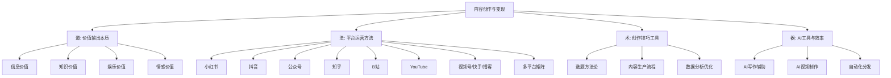
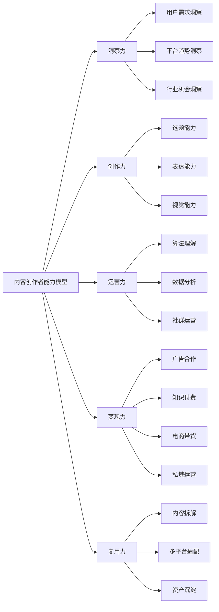
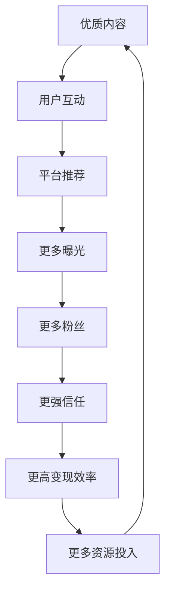
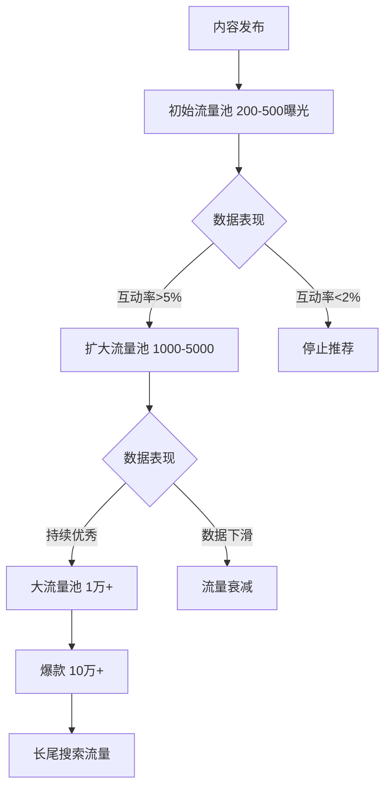
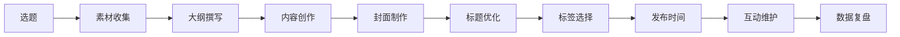
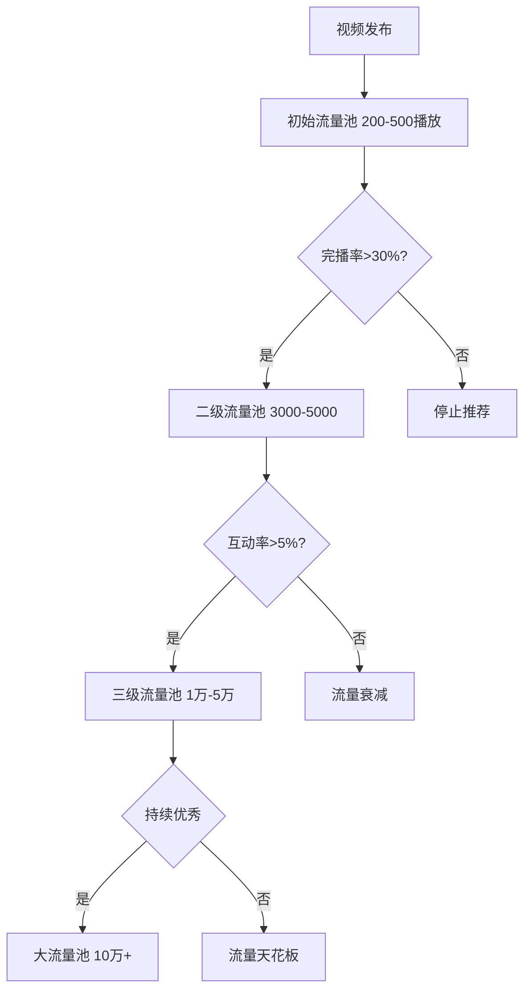
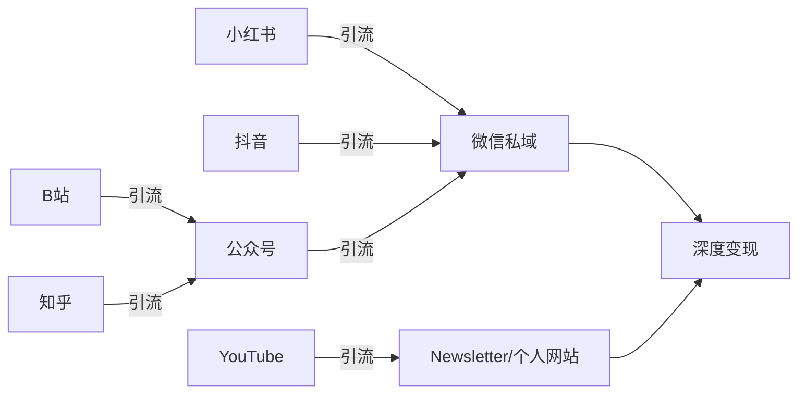
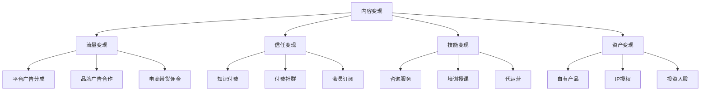

# 第九章：内容创作与社交媒体变现

> "内容是新时代的石油，但炼油能力决定了你能卖出什么价钱。"

在信息爆炸的时代，优质内容是最稀缺的资源。无论你是写作、拍摄视频、录制播客，还是在社交媒体上分享观点，只要能持续输出有价值的内容，就能吸引关注、建立影响力，并最终实现变现。本章将从内容创作的底层逻辑出发，逐一拆解小红书、抖音、公众号、知乎、B站、YouTube、视频号、快手、播客等主流平台的运营策略，并提供多平台矩阵运营、深度变现体系、AI辅助创作、变现合规等完整指南。



---

## 9.1 内容创作的底层逻辑

### 9.1.1 内容创作的本质：价值交换

内容创作的核心不是"我想说什么"，而是"用户需要什么"。本质上，内容创作是一场价值交换：创作者输出价值，用户用注意力、信任和金钱回报。理解这个交换关系，是一切内容变现的起点。

**内容价值的四种类型**：

| 价值类型 | 核心诉求 | 典型内容 | 用户行为 | 变现路径 |
|----------|----------|----------|----------|----------|
| 信息价值 | "我想知道" | 行业分析、数据报告、新闻解读、趋势预判 | 收藏、转发 | 广告、咨询 |
| 知识价值 | "我想学会" | 教程、课程、方法论、操作指南 | 收藏、关注 | 知识付费、课程 |
| 娱乐价值 | "我想放松" | 搞笑视频、段子、故事、挑战 | 点赞、分享 | 流量变现、广告 |
| 情感价值 | "我被理解" | 励志故事、情感共鸣、人生感悟、价值观表达 | 评论、关注 | 社群、品牌合作 |

这四种价值并非互斥。最成功的内容往往同时具备多种价值——比如一个搞笑视频同时传递了知识（娱乐+知识），一篇行业分析同时引发情感共鸣（信息+情感）。半佛仙人之所以成为头部博主，正是因为他用"犀利幽默"包裹严肃的金融知识，同时满足了娱乐价值、知识价值和情感价值。

**价值密度**是区分优质内容和平庸内容的关键指标。价值密度 = 单位时间内传递的有效信息量。一条30秒的短视频如果每秒都有信息增量，价值密度就高；一篇3000字的文章如果反复说同一件事，价值密度就低。用户的时间越来越碎片化，提高价值密度是内容创作者的核心竞争力。

**价值密度的计算方法**：

价值密度可以用以下公式近似衡量：

```text
价值密度 = 有效信息点数量 / 内容时长(秒) 或 字数(千字)
```

优化价值密度的实操方法：
1. **删除冗余**：写完初稿后，逐句检查"删掉这句话，内容是否完整？"如果答案是"是"，删掉
2. **信息分层**：将内容分为"必须知道"和"可以知道"，优先保证"必须知道"部分的质量
3. **视觉降噪**：每张配图都必须承载信息，纯装饰性图片会降低价值密度
4. **节奏控制**：每30秒或每200字必须有一个信息增量点，避免大段铺垫

### 9.1.2 内容创作的完整知识体系

一个成熟的内容创作者需要掌握以下知识体系：



**洞察力**决定你能否找到正确方向。没有洞察力的创作者在盲目生产内容，有洞察力的创作者精准命中用户需求。洞察力的培养方法：每天花30分钟浏览目标平台的热门内容和评论区，记录用户的高频问题和情绪反应，坚持3个月你会建立起对用户需求的直觉判断。

**创作力**决定你能否把想法变成优质内容。包括选题、写作/拍摄/剪辑、排版/视觉设计等具体技能。创作力不是天赋，是可以通过刻意练习提升的。具体方法：每周至少完成2篇完整内容的创作，每篇创作后做自我复盘，找到可以改进的3个点。

**运营力**决定你能否让更多人看到你的内容。理解平台算法、掌握数据分析、会做社群运营，才能让好内容不被埋没。运营力的核心是"用数据说话"——不凭感觉做决策，而是看数据反馈来优化策略。

**变现力**决定你能否把流量变成收入。广告合作、知识付费、电商带货、私域运营，每种变现方式都有不同的玩法和门槛。变现力的关键是"产品思维"——把自己的内容和服务当成产品来设计和定价。

**复用力**决定你的创作效率。一次深度内容创作可以拆解为多种形式分发到不同平台，这是实现规模化产出的关键能力。一个成熟的创作者，一份内容至少可以拆解出5种以上的分发形式。

### 9.1.3 内容定位方法论

**定位三要素模型**：

定位不是拍脑袋决定的，而是在三个圆的交集中找到你的位置：

1. **你擅长什么**（能力圈）：你的专业背景、个人经历、独特技能
2. **用户需要什么**（需求圈）：目标用户的痛点、痒点、爽点
3. **市场缺什么**（机会圈）：现有内容的空白、竞争对手的弱点

三者的交集就是你的最佳定位。

**定位验证三步法**：

第一步：写出你的定位假设。格式为"我帮助[目标人群]通过[内容形式]解决[具体问题]"。例如："我帮助职场新人通过短视频讲解解决面试准备的困惑。"注意，定位假设要足够具体——"帮助所有人变得更优秀"不是定位，是口号。

第二步：搜索验证。在目标平台搜索相关关键词，查看已有内容的数量和质量。如果搜索结果少且质量低，说明市场有空间；如果搜索结果多但你有独特角度，也有机会；如果搜索结果多且质量高，你需要找到更细分的切入点。

搜索验证的量化标准：
- 搜索结果少于100条：蓝海机会，先发优势明显
- 搜索结果100-1000条：竞争中等，需要差异化
- 搜索结果超过1000条：红海市场，必须找到极其细分的切入点

第三步：小规模测试。发布10-15条内容，观察数据反馈。如果互动率（点赞+收藏+评论/阅读）超过5%，说明定位方向正确；如果低于2%，需要调整；2-5%之间说明方向基本正确但需要优化内容质量。

**差异化策略矩阵**：

| 策略 | 说明 | 案例 | 适用场景 |
|------|------|------|----------|
| 垂直细分 | 不做大而全，做小而精 | 不做"美食"，做"一人食料理"；不做"理财"，做"月薪5000理财" | 红海市场找蓝海 |
| 独特视角 | 同一话题，不同切入角度 | 不做"产品测评"，做"程序员视角的产品测评" | 有跨领域背景 |
| 个人风格 | 形成独特的内容风格 | 半佛仙人的"犀利幽默"、罗翔的"法律+哲学" | 表达能力强 |
| 形式创新 | 用新形式呈现内容 | 用动画讲解财经知识、用说唱科普历史 | 技术能力突出 |
| 人群聚焦 | 服务被忽略的特定人群 | "40岁+女性穿搭"、"农村创业指南" | 了解特定群体 |
| 地域特色 | 聚焦特定地区 | "北京探店"、"成都美食地图"、"深圳租房攻略" | 本地生活类 |

### 9.1.4 内容形式全景图

**文字内容**：
- 公众号文章：深度长文，适合知识分享和观点输出，微信生态核心载体
- 知乎回答：问答形式，适合专业知识展示，搜索权重高，长尾流量好
- 小红书笔记：图文并茂，适合生活分享和种草，女性用户为主
- 微博动态：短平快，适合热点追踪和观点表达，传播速度快
- 博客/个人网站：自主可控，适合建立长期内容资产，SEO价值高
- 即刻/Threads：碎片化表达，适合个人品牌建设
- Newsletter/邮件列表：直达用户邮箱，不受平台算法影响，转化率高
- 盐选专栏（知乎）：付费长文，适合深度故事和专业分析

**图片内容**：
- 小红书图文：9张图+文字，信息密度高，封面设计决定点击率
- Instagram照片：视觉驱动，适合生活方式和创意展示
- 信息图表：数据可视化，适合复杂信息的简洁呈现
- 漫画/插画：故事化表达，适合情感和知识传递

**视频内容**：
- 抖音短视频：15秒-10分钟，算法驱动，爆发力强
- 快手短视频：下沉市场，信任电商，老铁文化
- B站中长视频：5-30分钟，深度内容，粉丝粘性高
- YouTube视频：无时长限制，全球覆盖，广告分成体系成熟
- 视频号：微信生态，社交推荐，适合中老年用户触达
- TikTok：海外版抖音，全球覆盖，适合出海创作者
- Reels/Shorts：Instagram/YouTube的短视频功能，适合已有粉丝的创作者

**音频内容**：
- 播客节目：深度对话，适合知识分享和观点讨论，用户粘性极高
- 小宇宙：中国最大的播客平台，年轻用户为主
- 有声书：长内容消费，适合通勤和睡前场景
- 音频课程：知识付费载体，适合系统化教学
- 语音直播：实时互动，适合陪伴和社群运营

### 9.1.5 内容复利效应与资产积累

优质内容具有长尾效应，一次创作可以持续带来流量和收益。这是内容创作与打工的本质区别——打工是出售时间，内容创作是积累资产。

**内容复利的数学模型**：

假设你每周发布2篇内容，每篇内容发布当天获得1000阅读，之后每天自然流量50阅读，持续365天。那么：

- 单篇内容年阅读量 = 1000 + 50 × 365 = 19,250
- 一年发布内容数 = 2 × 52 = 104篇
- 年总阅读量 = 104 × 19,250 ≈ 200万

这就是内容复利的力量。每一篇新内容都在增加你的内容库总量，而每一篇旧内容都在持续贡献流量。更重要的是，当你的内容库达到一定规模后，搜索引擎和平台推荐会给予你更高的权重，自然流量会加速增长——这就是内容创作的"飞轮效应"。

**内容飞轮模型**：



**内容资产的四个维度**：

1. **内容库**：你发布的所有文章、视频、音频。这是最核心的资产，它不因平台变化而消失（前提是你有备份）。建议：所有原创内容本地备份，使用Notion或语雀建立内容资产库，按平台、主题、时间分类管理。
2. **粉丝库**：关注你的人。粉丝是信任的载体，信任是变现的基础。注意区分"泛粉丝"和"铁粉"——1000个铁粉比10万个泛粉丝更有价值（凯文·凯利的"1000个铁杆粉丝"理论）。
3. **影响力**：你的品牌和口碑。影响力越大，合作机会越多，议价能力越强。影响力的衡量标准不只是粉丝数，还包括行业认可度、媒体引用次数、合作品牌层次。
4. **经验值**：你的创作能力和认知水平。这是最不容易被复制的竞争力。经验值的积累需要时间，无法速成。

**内容资产的保护策略**：

- 所有原创内容本地备份，不完全依赖单一平台
- 定期导出粉丝数据（微信好友、社群成员、邮件列表）
- 建立个人网站作为内容中枢，不被平台绑架
- 多平台分发分散风险，避免单平台依赖
- 注册商标和域名，保护个人品牌
- 建立邮件列表，这是唯一完全属于你的触达渠道

### 9.1.6 内容创作的常见误区

| 误区 | 表现 | 纠正方法 |
|------|------|----------|
| 自嗨式创作 | 只写自己感兴趣的内容，忽视用户需求 | 每篇内容发布前问"用户为什么要看这个？" |
| 追求爆款 | 热点来了才写，没有热点就不更新 | 70%常青内容+30%热点内容，保证稳定输出 |
| 模仿他人 | 看到什么火就做什么，没有自己的风格 | 找到自己的差异化定位，做"只有你能做"的内容 |
| 急于变现 | 刚有几百粉丝就开始卖东西 | 先积累1000个铁粉，再考虑变现 |
| 忽视数据 | 只管发布，不看数据反馈 | 每周复盘数据，找到优化方向 |
| 完美主义 | 一条内容反复修改，迟迟不发布 | 完成比完美重要，先发布再迭代 |
| 平台依赖 | 只在一个平台发布 | 至少在2-3个平台分发，降低风险 |
| 忽视互动 | 发布后不回复评论 | 评论区是第二次创作机会，认真回复每一条 |
| 频繁换方向 | 每个月换一个内容方向 | 至少坚持3个月再评估，给算法和用户时间认识你 |
| 买粉买赞 | 用钱买虚假数据 | 虚假数据会降低互动率，反而被算法惩罚 |

### 9.1.7 内容策略框架

**内容支柱系统**：

内容支柱（Content Pillars）是你的内容围绕的4-6个核心主题。它们定义了你是谁、你写什么、用户为什么要关注你。没有内容支柱的创作者，内容散乱无章，用户不知道关注你能获得什么。

选择内容支柱的方法：
1. 列出你擅长且用户需要的所有主题（通常有10-20个）
2. 将它们合并归类为4-6个大类
3. 每个大类就是一个内容支柱
4. 每个支柱下规划5-10个子话题

示例——一个"个人理财博主"的内容支柱：

| 支柱 | 子话题示例 | 占比 | 目的 |
|------|-----------|------|------|
| 存钱技巧 | 工资分配、消费降级、记账方法 | 30% | 核心内容，引流主力 |
| 理财入门 | 基金入门、银行理财、保险配置 | 25% | 专业性建设 |
| 职场加薪 | 谈薪技巧、跳槽策略、副业探索 | 20% | 拓展受众面 |
| 消费心理 | 购物陷阱、消费主义反思、性价比 | 15% | 情感共鸣，互动率高 |
| 个人生活 | 存钱打卡、消费复盘、生活分享 | 10% | 人设建设，增加信任 |

**70-20-10法则**：
- 70%核心内容：围绕内容支柱，稳定输出，是你的"招牌菜"
- 20%相邻内容：与核心领域相关但不完全重叠，拓展受众面
- 10%实验内容：新形式、新话题、新平台的尝试，保持创新

**内容日历设计**：

| 维度 | 频率 | 内容 |
|------|------|------|
| 日计划 | 每天 | 互动维护、热点追踪、素材收集 |
| 周计划 | 每周一 | 确定本周选题、分配创作任务 |
| 月计划 | 每月1日 | 复盘上月数据、规划本月主题 |
| 季度计划 | 每季度 | 评估定位方向、调整内容策略 |
| 年度计划 | 每年1月 | 设定年度目标、规划大型内容项目 |

**内容评分矩阵**：

在决定一个选题是否值得创作时，用以下矩阵评分（每项1-5分）：

| 维度 | 评分标准 | 权重 |
|------|---------|------|
| 用户需求 | 搜索量、评论区高频问题、痛点强度 | 30% |
| 差异化 | 是否有独特角度、是否比现有内容更好 | 25% |
| 变现潜力 | 能否引流、能否转化为付费产品 | 20% |
| 创作难度 | 时间成本、素材获取难度、技术要求 | 15% |
| 时效性 | 是否有时效限制、能否长期获得流量 | 10% |

总分3.5分以上的选题优先创作，2.5-3.5分的排入备选，2.5分以下的放弃。

---

## 9.2 选题方法论：找到用户真正想看的内容

选题是内容创作中最关键的环节。一个好选题能让60分的内容获得90分的传播效果，一个差选题能让90分的内容石沉大海。

### 9.2.1 选题的底层逻辑

选题的本质是**预测用户的注意力会投向哪里**。用户的注意力受三个因素驱动：

1. **即时需求**：当下正在困扰他的问题。例如"面试穿什么"、"如何跟老板提加薪"、"iPhone16值得买吗"
2. **情绪驱动**：能引发他情绪反应的内容。例如"震惊！"、"太感动了"、"这不公平"、"原来如此"
3. **社交货币**：能让他在社交中获得认可的内容。例如行业洞察、冷知识、独特观点、前沿趋势

好的选题至少命中其中一个因素，优秀的选题同时命中两个或三个。例如："面试官问你有什么缺点，千万别说这3句话"同时命中了即时需求（面试准备）、情绪驱动（恐惧犯错）和社交货币（可以分享给朋友）。

**选题的"冰山模型"**：

用户表面提出的问题只是冰山一角，真正的需求藏在水面以下：

```text
水面上（10%）：用户的直接问题
           "推荐一款好用的洗面奶"
水面下（90%）：
  - 痛点：皮肤问题困扰（痘痘、黑头、暗沉）
  - 痒点：想变好看但不知道从哪开始
  - 爽点：看到效果对比后的满足感
  - 恐惧：怕买错浪费钱、怕用错产品烂脸
  - 认同：想找到和自己肤质类似的人的推荐
```

挖到冰山下的需求，你的内容才能真正打动用户。

### 9.2.2 六大选题来源

**来源一：平台数据挖掘**

每个平台都有自己的热门内容数据，这是最直接的选题来源。

| 平台 | 数据入口 | 使用方法 |
|------|----------|----------|
| 小红书 | 搜索框下拉词、发现页热搜、千瓜数据 | 搜索关键词看下拉联想词，这些是用户真实搜索需求 |
| 抖音 | 创作者服务中心热点、巨量算数 | 查看行业热点话题，筛选与自己领域相关的 |
| B站 | 热门排行榜、创作中心数据 | 分析同领域UP主的高播放视频选题 |
| 公众号 | 新榜热文、微信指数 | 查看同领域公众号的爆文选题 |
| YouTube | Trending页面、TubeBuddy/VidIQ | 分析竞争对手的高播放视频标题和标签 |
| 知乎 | 热榜、搜索下拉词、盐选热榜 | 查看高赞回答的选题方向 |

**来源二：用户需求挖掘**

用户的需求藏在评论区、私信、搜索词、问答平台里。

操作步骤：
1. 打开你所在领域排名前10的账号
2. 逐条阅读最近30条内容的评论区
3. 记录用户提出的问题、表达的困惑、给出的反馈
4. 将这些问题分类整理，形成选题库
5. 对选题库进行优先级排序（高频问题优先）

评论区的高频问题就是用户的刚需。如果同一个问题在不同账号下反复出现，说明这是一个值得深度解答的选题。实操技巧：用Excel或Notion建一个选题库表，字段包括"问题来源""出现频率""已覆盖平台""创作状态"。

**来源三：竞品分析**

竞品分析不是抄袭，而是学习和差异化。

操作步骤：
1. 找到你所在领域的5-10个标杆账号
2. 分析他们最近3个月的爆款内容（播放量/阅读量Top10）
3. 总结爆款选题的共性（话题类型、切入角度、内容结构）
4. 找到他们没有覆盖或覆盖不深的空白领域
5. 在空白领域发力，形成差异化

竞品分析工具推荐：
- 新榜：公众号、抖音、小红书、B站多平台数据
- 蝉妈妈：抖音电商数据和达人分析
- 千瓜数据：小红书数据分析
- 飞瓜数据：短视频平台数据分析
- Social Blade：YouTube/Instagram数据追踪

**来源四：个人经验与专业积累**

你的专业背景和个人经历是别人无法复制的选题来源。一个有10年HR经验的人写面试技巧，比一个刚毕业的人写面试技巧更有说服力和深度。

挖掘个人经验的方法：
1. 列出你工作/生活中积累了3年以上经验的领域
2. 列出你解决过的棘手问题和踩过的坑
3. 列出你被朋友/同事反复请教的问题
4. 将这些经验转化为"方法论+案例"的内容形式

**来源五：跨领域迁移**

将A领域的内容用B领域的方式呈现。例如：
- 用游戏思维讲职场晋升（段位、经验值、组队、副本）
- 用投资思维讲个人成长（复利、风险、组合、止损）
- 用心理学原理解析影视剧角色
- 用军事战略思维讲商业竞争
- 用生物学进化论讲个人成长

跨领域迁移的核心是"找到底层逻辑的共通性"。两个看似不相关的领域，往往在底层逻辑上有惊人的相似性。

**来源六：热点追踪**

热点是流量的放大器，但追热点有讲究：
- 只追与你领域相关的热点，不追无关热点
- 提供独特视角，不做简单的信息搬运
- 速度要快，热点的生命周期通常只有24-72小时
- 避免敏感话题（政治、灾难、争议性社会事件）
- 建立热点日历：电商节、传统节日、行业大会等可预见的热点提前准备

**选题SOP**：

每周一执行以下选题流程：
1. 浏览各平台热点榜（15分钟）
2. 检查评论区新问题（15分钟）
3. 查看竞品本周爆款（15分钟）
4. 从选题库中挑选5-7个选题（15分钟）
5. 用评分矩阵排序，确定本周创作顺序（15分钟）

整个流程控制在75分钟内完成，形成稳定的选题节奏。

### 9.2.3 爆款内容的底层公式

爆款 = 强选题 × 好标题 × 优质内容 × 恰当时机

**标题公式**：

标题决定用户是否会点击。好标题有以下共性：

| 公式 | 结构 | 示例 |
|------|------|------|
| 数字+痛点 | 用数字制造具体感，痛点引发共鸣 | "5个让你皮肤变好的小习惯（亲测有效）" |
| 身份+利益 | 明确目标人群，给出明确利益 | "月薪5000如何存下3000？我的存钱秘籍" |
| 时间+承诺 | 限定时间范围，承诺具体结果 | "25岁前一定要知道的10个职场真相" |
| 反常识+悬念 | 打破认知，制造好奇心 | "为什么越努力越穷？真相扎心了" |
| 对比+冲突 | 制造反差，引发好奇 | "从月薪3000到年入50万，我做对了这3件事" |
| 权威+背书 | 借助权威增加可信度 | "前阿里P8告诉你，大厂面试的5个潜规则" |
| 恐惧+解决 | 制造恐惧感，给出解决方案 | "还在这样存钱？你每年至少亏5000块" |

**标题AB测试方法**：

同一个内容可以准备2-3个标题，通过以下方式测试：
1. 小红书：用不同标题发布两次（间隔3天），对比数据
2. 抖音：同一视频用不同标题发布到不同账号
3. 公众号：在社群中做投票，选择得票最高的标题
4. YouTube：利用TubeBuddy的A/B测试功能

**封面设计原则**：

封面是标题的视觉化表达，在信息流中决定用户是否会停留。

- **高清**：分辨率至少1080×1440（小红书）或1080×1920（抖音）
- **大字**：标题文字要大，在手机小屏幕上也能清晰辨认
- **对比色**：使用对比强烈的配色，在信息流中脱颖而出
- **人脸**：有人脸的封面点击率通常高20-30%
- **信息量**：让用户一眼就知道这条内容讲什么
- **一致性**：保持系列内容的封面风格一致，形成品牌识别度

封面制作工具：
- Canva：最推荐，模板丰富，操作简单
- 稿定设计：国内工具，模板适合中国平台审美
- 创客贴：类似稿定设计，模板风格不同
- Figma：适合有一定设计基础的创作者
- 美图秀秀：手机端快速出图

---


## 9.3 小红书运营

### 9.3.1 平台特点与算法机制

**用户画像**：
- 女性用户占比：约70%，但男性用户比例持续上升（2024年男性占比已超30%）
- 年龄分布：18-35岁为主力，35-50岁增长迅速
- 城市分布：一二线城市为主，三四线城市渗透率提升
- 消费能力：中高消费水平，愿意为品质和颜值买单
- 使用场景：消费决策前的"搜索"行为突出，被称为"中国版Instagram+Pinterest"
- 核心心智：小红书在用户心中 = "消费决策搜索引擎"，这决定了内容要"有用"

**流量机制**：

小红书的流量分配遵循"双列信息流+搜索"的混合模式。



**关键指标权重**（由高到低）：
1. **互动率**（点赞+收藏+评论/曝光）：最核心指标，直接决定是否进入下一级流量池
2. **收藏率**：收藏代表用户认为内容"有用"，是小红书最看重的互动行为
3. **完读率/完播率**：用户是否看完了你的内容
4. **评论率**：评论代表深度互动，能引发评论的内容更容易被推荐
5. **关注转化率**：看到内容后关注你的比例
6. **分享率**：分享到微信/群聊的比例，代表内容的社交传播价值

**搜索流量的重要性**：

小红书的搜索流量占比约30-40%，远高于其他平台。用户在小红书上的搜索行为非常主动——"XX推荐""XX攻略""XX怎么选"是典型搜索模式。这意味着SEO优化（标题和正文中的关键词布局）在小红书上特别重要。

小红书搜索SEO的完整方法：

| 位置 | 优化方法 | 示例 |
|------|---------|------|
| 标题 | 必须包含核心关键词，放在前半部分 | "敏感肌防晒推荐｜5款平价好用的防晒霜" |
| 正文开头 | 前100字包含核心关键词 | "作为一个敏感肌，找到好用的防晒真的太难了……" |
| 正文中 | 自然出现2-3个相关长尾关键词 | "物理防晒""防晒指数SPF50""不搓泥" |
| 标签 | 5-10个标签，覆盖核心词+长尾词+热门词 | #敏感肌防晒 #防晒推荐 #平价防晒 #夏季护肤 |
| 评论区 | 在评论中自然融入关键词 | 自己评论"这款防晒真的敏感肌友好" |

### 9.3.2 变现方式详解

**品牌合作（蒲公英平台）**

蒲公英是小红书官方的品牌合作平台，所有商业合作都需要通过蒲公英报备，否则可能被限流。

**合作形式**：
- 图文笔记：品牌产品植入，最常见形式
- 视频笔记：品牌展示，制作成本更高但效果更好
- 直播带货：实时销售，适合有粉丝基础的博主
- 品牌代言/长期合作：需要较大影响力

**报价参考与谈判技巧**：

| 粉丝规模 | 图文笔记 | 视频笔记 | 互动率加成 |
|----------|----------|----------|------------|
| 1000-5000粉 | 200-500元 | 500-1000元 | 互动率>8%可加价30% |
| 5000-1万粉 | 500-1500元 | 1000-3000元 | 互动率>6%可加价20% |
| 1万-5万粉 | 1500-5000元 | 3000-10000元 | 有爆款案例可加价50% |
| 5万-10万粉 | 5000-15000元 | 10000-30000元 | 垂直领域溢价明显 |
| 10万+粉 | 15000元+ | 30000元+ | 可谈长期合作折扣 |

报价不仅看粉丝数，更看**互动率**和**垂直度**。一个5000粉但互动率10%的垂直账号，报价可能比2万粉但互动率2%的泛账号更高。

**谈判技巧**：
- 报价时给出数据支撑（互动率、粉丝画像、过往合作案例效果）
- 首次合作可以适当降价换取长期合作机会
- 要求品牌提供产品体验时间，确保真实体验后再创作
- 明确合作细节：发布后保留时间、修改次数、数据截图提供
- 签署书面合作协议，明确违约责任和付款时间节点
- 收款方式：蒲公英平台走账更规范，但个人转账可以省平台抽成（约10%）

**直播带货**：

小红书直播带货的特点是"种草+拔草一体化"，用户质量高、消费能力强，适合高客单价商品。

**直播间搭建清单**：
1. 设备：手机/相机+环形灯+领夹麦+背景布
2. 选品：提前3-5天选品，准备好产品知识卡片
3. 话术：开场话术、产品介绍话术、促单话术、留人话术
4. 福利：每15-20分钟发放一次福利（优惠券、赠品、抽奖）
5. 节奏：前15分钟暖场+引流，中间主推3-5款产品，最后返场+预告

**知识付费**：

小红书知识付费适合有专业技能的创作者：
- 付费专栏：系列课程，适合系统化教学
- 付费咨询：一对一服务，适合个性化指导
- 付费社群：交流学习，适合深度运营

**引流私域**：

将小红书粉丝导入微信私域是深度变现的关键一步。

安全引流方法（避免违规）：
- 个人简介放邮箱或公众号名（不直接放微信号）
- 用小号在评论区互动，引导私信
- 私信中用谐音或图片方式发送联系方式
- 创建小红书群聊，群内引导加微信
- 在个人主页背景图中暗示联系方式
- 发布"免费资料"笔记，评论区引导私信领取

注意：直接在简介中放微信号有被封号风险，建议使用间接方式。2024年起小红书对引流管控趋严，建议以公众号为中转站。

### 9.3.3 内容创作与运营策略

**笔记创作全流程**：



**图文笔记创作模板**：

一篇高质量的小红书图文笔记通常包含以下结构：

1. **封面图**：高清、美观、信息量大，最好有文字标题叠加
2. **正文开头**（前2行）：直接给出结论或痛点，吸引用户继续阅读
3. **正文主体**：分点阐述，每点配一张图，图文对照
4. **正文结尾**：总结+引导互动（"你觉得呢？评论区聊聊"）
5. **标签**：5-10个标签，覆盖核心词+长尾词+热门话题

**小红书爆款标题公式**：

| 公式 | 示例 |
|------|------|
| 数字+结果 | "坚持这5个习惯，皮肤真的变好了" |
| 身份+痛点 | "打工人的早餐，5分钟搞定还好吃" |
| 时间+变化 | "30天减脂记录，从130斤到115斤" |
| 对比+反差 | "花200块和花2000块的护肤效果对比" |
| 情绪+共鸣 | "终于明白为什么大家说XX好用了" |
| 测评+结论 | "试了10款粉底液，最后只留了这2款" |

**发布时间与频率**：

| 时间段 | 适合领域 | 原因 |
|--------|----------|------|
| 7:00-9:00 | 职场、学习、早安 | 通勤时间，碎片化阅读 |
| 12:00-14:00 | 美食、穿搭、生活 | 午休时间，浏览消遣 |
| 18:00-20:00 | 健身、美食、日常 | 下班后放松时间 |
| 20:00-23:00 | 护肤、穿搭、情感 | 睡前浏览高峰，流量最高 |

建议每周发布3-5篇，保持稳定更新频率。宁可降低频率保证质量，也不要为了日更降低内容质量。

**涨粉的五个阶段**：

| 阶段 | 粉丝量 | 核心任务 | 时间预期 |
|------|--------|----------|----------|
| 冷启动期 | 0-1000 | 测试选题方向，找到爆款密码 | 1-2个月 |
| 增长期 | 1000-1万 | 稳定输出，放大爆款效应 | 2-4个月 |
| 爆发期 | 1万-10万 | 规模化内容生产，开始变现 | 3-6个月 |
| 稳定期 | 10万-50万 | 多元化变现，建立品牌 | 6-12个月 |
| 成熟期 | 50万+ | 品牌化运营，团队化运作 | 1年+ |

### 9.3.4 案例：从0到10万粉的小红书运营实录

**背景**：
- 运营者：小A，25岁，互联网运营从业者
- 领域：职场干货，专注面试技巧和职场新人成长
- 目标：6个月涨粉10万

**运营过程**：

**第1个月：账号搭建与方向测试（0→500粉）**

第一周完成账号基础搭建：头像用职业形象照，昵称取"职场小A说"，简介写"互联网运营3年 | 面试官视角 | 帮你少走弯路"。背景图用Canva制作，展示核心价值主张。

第二周开始发布内容，每天1篇，测试了4个方向：面试技巧、职场沟通、简历优化、行业分析。通过数据对比发现，面试技巧类内容的互动率最高（平均8%），远超其他方向（3-5%）。

第一个月发布25篇笔记，总阅读量约5万，粉丝增长到500。

**第2个月：内容迭代与爆款探索（500→2000粉）**

确定主攻面试技巧方向后，开始深度挖掘选题。通过分析评论区发现，用户最关心的问题是："面试官问'你有什么缺点'怎么回答""如何谈薪资""群面怎么表现"。

针对这些问题创作了系列内容，采用"错误示范+正确示范"的对比格式，互动率显著提升。

月底出现第一篇小爆款："面试官问你有什么缺点，千万别说这3句话"，阅读量2万+，单篇涨粉800。

**第3个月：爆款突破与变现起步（2000→1万粉）**

总结爆款规律：对比类内容+具体场景+实用话术。围绕这个公式批量产出内容。

月中出现大爆款："面试了200人后面试官告诉你，简历这样写直接进垃圾桶"，阅读量10万+，涨粉5000。

开始在蒲公英接品牌合作，第一单是某在线教育平台的面试课程推广，合作费800元。

**第4-6个月：稳定增长与多元变现（1万→10万粉）**

建立内容SOP：每周一选题会（自己跟自己开）、周二到周六每天发布1篇、周日数据复盘。

内容矩阵扩展：70%面试技巧+20%职场成长+10%个人生活（增加人设感）。

变现情况：
- 品牌合作：每月3-5单，收入5000-10000元
- 付费咨询：面试模拟+简历修改，每月收入3000-5000元
- 知识星球：职场交流社群，200人×99元/年
- 总计：月均收入8000-15000元

**成功关键因素**：
1. 精准定位：面试技巧是刚需+高频+可标准化的内容领域
2. 内容差异化：用"面试官视角"切入，区别于大量求职者视角的内容
3. 数据驱动：每篇内容发布后24小时复盘数据，不断优化
4. 稳定输出：6个月没有断更过一天

**失败案例警示**：

同一时期，另一个同领域博主小C的失败经历：
- 问题1：频繁换方向，第一个月做美食，第二个月做穿搭，第三个月做职场
- 问题2：买粉5000，导致互动率被拉低到1%，算法不再推荐
- 问题3：急于变现，500粉时就开始推知识付费课程，转化率为0
- 结果：3个月后仅800粉，变现为0，最终放弃

教训：定位要稳、数据要真、变现要等。

---

## 9.4 抖音运营

### 9.4.1 平台特点与算法机制

**用户画像**：
- 用户规模：日活7亿+，是目前中国最大的短视频平台
- 年龄分布：覆盖全年龄段，但25-40岁用户贡献了最多的消费
- 城市分布：一二三四线城市均有深度覆盖
- 使用时长：日均120分钟+，用户沉浸度极高
- 核心心智：抖音在用户心中 = "娱乐+发现好物"，内容要有趣或有用

**流量机制——赛马制**：

抖音的算法推荐采用"赛马制"，每条视频都是一个参赛选手。



**核心指标权重**：
1. **完播率**：最重要指标。抖音希望用户留在平台，完播率高说明内容有吸引力
2. **互动率**：点赞、评论、转发、收藏的综合比例
3. **转粉率**：观看后关注的比例，说明内容有持续吸引力
4. **分享率**：分享到微信/朋友圈的比例，是裂变传播的关键
5. **回看率**：用户重复观看的比例，说明内容有深度

**完播率优化的七个技巧**：

1. **前3秒法则**：前3秒必须抓住注意力，否则用户直接划走。用悬念、冲突、反常识、直接利益开头
2. **节奏紧凑**：删除所有无用片段，每一秒都要有信息增量
3. **视觉变化**：每3-5秒切换一次画面或角度，保持视觉新鲜感
4. **悬念设置**：在视频中间设置悬念，"接下来这个方法让你意想不到"
5. **信息密度**：宁可内容少但每条都有价值，不要注水
6. **时长控制**：新账号建议15-30秒，成熟账号可以做1-3分钟
7. **结尾引导**：结尾留悬念或引导重看，提高回看率

**抖音的"去中心化"特性**：

抖音的算法是去中心化的——没有粉丝门槛，新号也能获得推荐流量。这意味着：
- 每条视频都是独立的竞争，不依赖粉丝基础
- 内容质量比粉丝数更重要
- 新号有"新手保护期"，前5-10条视频会获得额外推荐
- 持续输出优质内容比偶尔出爆款更重要

### 9.4.2 变现方式详解

**直播打赏**：

直播打赏是抖音最直接的变现方式，但不适合所有创作者。

打赏收入计算：
- 音浪是抖音虚拟货币，1元=10音浪
- 主播提成比例约50%（个人主播）或更高（公会主播）
- 月入过万需要每天直播3-4小时，积累稳定粉丝群

适合打赏变现的内容类型：才艺表演、情感陪伴、搞笑娱乐、游戏解说。知识类内容打赏收入通常不高，更适合走广告和知识付费路线。

**直播带货**：

抖音直播带货是目前最火的变现方式，年交易额超万亿。

**直播带货完整流程**：

1. **开通权限**：完成实名认证→发布10条视频→粉丝1000+→开通商品橱窗
2. **选品**：通过抖音精选联盟、蝉妈妈、飞瓜数据选品
3. **准备**：产品知识卡片、话术脚本、价格对比表、常见问题FAQ
4. **直播**：开播→引流→讲解→互动→促单→返场→预告
5. **售后**：处理订单、跟进物流、处理退换货

**选品的四个维度**：

| 维度 | 标准 | 说明 |
|------|------|------|
| 价格 | 50-200元 | 抖音主流消费区间，决策成本低 |
| 佣金 | 20%+ | 低于20%的佣金不值得推 |
| 需求 | 刚需/高频 | 日用品、食品、美妆复购率高 |
| 差异 | 有卖点 | 独特功能、设计、成分等差异化卖点 |

**直播间话术框架**：

```text
开场话术（前5分钟）：
"家人们晚上好！今天给大家准备了X款超值好物，先关注主播，一会儿有惊喜福利！"

产品介绍话术（每款产品3-5分钟）：
"这款产品的核心卖点是XXX。我给大家看一个对比……原价XX元，今天直播间专属价XX元，还送XXX。"

促单话术：
"库存只剩最后XX件了！拍到就是赚到！3、2、1，上链接！"

留人话术：
"还没关注的家人点个关注，下一款产品比这个还炸裂！"

逼单话术：
"还有犹豫的家人，我再说一遍，今天的价格只有直播间才有，过了今天恢复原价！"
```

**广告合作**：

抖音广告合作（星图平台）形式：
- 视频植入：在视频中自然展示品牌产品，费用最高
- 挑战赛：发起品牌相关挑战，适合头部达人
- 达人任务：完成品牌指定任务，门槛较低
- 品牌代言：长期合作，需要较大影响力

**知识付费**：

抖音知识付费适合有专业技能的创作者：
- 付费课程：通过学浪平台发布系列课程
- 付费直播：直播授课，实时互动
- 付费社群：导流到微信社群或知识星球

**抖音小店**：

如果你有供应链资源，可以开通抖音小店，自己做商家：
- 保证金：根据品类不同，2000-50000元
- 扣点：1-5%（根据品类）
- 流量来源：自然流量+达人带货+付费投流
- 适合有自有产品或工厂资源的创作者

### 9.4.3 视频制作全流程

**拍摄设备推荐**：

| 设备 | 入门级 | 进阶级 | 专业级 |
|------|--------|--------|--------|
| 手机 | iPhone 15/华为Mate60 | iPhone 15 Pro Max | 索尼A7C/佳能R6 |
| 稳定器 | 大疆OM SE | 大疆OM 6 | 智云Crane 4 |
| 灯光 | 环形灯（100元） | 双灯柔光套装 | 专业三点布光 |
| 麦克风 | 领夹麦（50元） | 大疆Mic 2 | 罗德Wireless Go II |
| 背景 | 干净墙面/窗帘 | 背景布+简单布景 | 专业直播间搭建 |

入门级设备总投入约500-1000元，足够起步。不要在设备上过度投入，内容质量比画质更重要。很多百万粉博主最初都是用手机+自然光拍摄的。

**拍摄技巧**：
- 光线：自然光最佳，面向窗户拍摄；室内用环形灯补光，避免顶光和逆光
- 构图：人物居中或三分法，头顶留空不要太多
- 稳定：使用三脚架或稳定器，手持拍摄容易晃动
- 声音：使用领夹麦，环境噪音是视频质量的隐形杀手
- 眼神：看镜头而不是屏幕，建立与观众的眼神接触

**剪辑工具对比**：

| 工具 | 平台 | 特点 | 适合人群 |
|------|------|------|----------|
| 剪映 | 手机+电脑 | 抖音官方，模板丰富，AI功能强大 | 所有创作者（首选） |
| Premiere | 电脑 | 专业级，功能最全 | 专业剪辑师 |
| Final Cut Pro | Mac | 苹果生态，性能优秀 | Mac用户 |
| 达芬奇 | 电脑 | 调色功能强大，免费版功能完整 | 注重视觉效果的创作者 |
| CapCut | 手机+电脑 | 剪映国际版，适合出海创作者 | YouTube/TikTok创作者 |

**剪映高效剪辑技巧**：
1. 使用"智能字幕"一键生成字幕，节省大量时间
2. 使用"图文成片"功能快速将文字转为视频
3. 使用"智能抠像"实现人物和背景分离
4. 使用"曲线变速"实现快慢结合的节奏感
5. 使用"关键帧动画"实现画面缩放和位移效果
6. 使用"AI配音"快速生成旁白
7. 使用"一键成片"快速出初稿，再手动精修

**视频结构模板**：

```text
黄金3秒：hook（悬念/冲突/利益承诺）
    ↓
10秒：问题引入（你是不是也遇到过XXX？）
    ↓
30-60秒：核心内容（方法/观点/故事）
    ↓
10秒：总结+行动号召（关注/评论/收藏）
```

### 9.4.4 热点追踪与话题参与

**热点来源**：
- 抖音创作者服务中心→热点榜单
- 巨量算数→行业热点
- 微博热搜→社会热点
- 百度热搜→搜索热点
- 行业垂直媒体→行业热点

**追热点的原则**：
1. **速度**：热点出现后4小时内发布效果最好，超过24小时基本失效
2. **相关性**：只追与你领域相关的热点，强行蹭热点会显得尴尬
3. **独特视角**：不做简单的信息搬运，提供你的专业解读
4. **安全边界**：不碰政治、宗教、灾难等敏感话题

**抖音投流基础**：

当你的内容质量过关但自然流量不够时，可以考虑付费投流：

| 投流方式 | 门槛 | 用途 | 预算建议 |
|---------|------|------|---------|
| DOU+ | 100元起 | 测试内容质量，放大优质内容 | 先投100元测数据 |
| 随心推 | 200元起 | 直播间引流 | 直播前2小时投放 |
| 千川 | 需开户 | 专业电商投流 | 日预算500元起 |

投流核心原则：先用自然流量验证内容质量，数据好的内容再投流放大。不要用投流拯救烂内容。


---

## 9.5 公众号运营

### 9.5.1 平台特点与流量机制

**用户画像**：
- 用户规模：月活13亿+，覆盖几乎所有中国互联网用户
- 年龄分布：覆盖全年龄段，25-45岁是核心阅读群体
- 使用场景：深度阅读、信息获取、社交分享

**公众号的定位变化**：

公众号已经从"流量红利期"进入"存量竞争期"。早期随便发发就能涨粉，现在需要更精细的运营。但公众号依然是最重要的私域内容阵地，原因有三：
1. 微信生态的基础设施，与朋友圈、社群、小程序无缝衔接
2. 搜一搜流量持续增长，搜索权重高
3. 付费阅读和广告分成体系成熟

**流量机制的四大入口**：
1. **关注流量**：粉丝主动打开，占比约30-40%，但持续下降
2. **朋友圈分享**：社交传播，好内容的裂变引擎
3. **搜一搜**：搜索流量，占比持续上升，SEO价值高
4. **推荐流量**：算法推荐（2023年起大幅增加），为新号带来机会

**搜一搜SEO优化**：
- 标题包含核心关键词
- 文章开头100字包含关键词
- 使用小标题（H2/H3）结构化内容
- 文章字数2000字以上（搜索权重更高）
- 保持更新频率，活跃账号权重更高
- 文章被其他公众号引用或转载会提升搜索权重

### 9.5.2 变现方式详解

**流量主广告**

流量主是公众号最基础的变现方式，适合有稳定阅读量的账号。

开通条件：粉丝500+，发布一定数量的原创文章。

收入计算：
- 底部广告：1万阅读 ≈ 50-100元
- 中部广告：1万阅读 ≈ 80-150元（插入位置越多收入越高，但影响阅读体验）
- 视频贴片广告：1万播放 ≈ 30-80元

优化建议：
- 底部广告必开，不影响阅读体验
- 中部广告谨慎插入，长文（3000字+）可以插1-2个
- 不要为了广告收入牺牲阅读体验，得不偿失

**软文广告**

软文广告是公众号最主要的变现方式，头部公众号单篇软文收费可达数十万。

报价参考：

| 粉丝数 | 头条软文 | 次条软文 | 影响因素 |
|--------|----------|----------|----------|
| 1万粉 | 1000-3000元 | 500-1500元 | 阅读量比粉丝数更重要 |
| 5万粉 | 5000-15000元 | 2000-8000元 | 垂直领域溢价1.5-2倍 |
| 10万粉 | 15000-50000元 | 5000-20000元 | 头部账号可谈长期合作 |
| 50万粉 | 50000-150000元 | 20000-80000元 | 品牌定制内容更贵 |

**软文写作的平衡术**：

好的软文既能让广告主满意，又不伤害粉丝体验。关键在于：
1. 内容本身要有价值，广告是顺带的
2. 选择与自己领域相关的广告，不要什么都接
3. 用"真实体验"的方式写，而不是硬广
4. 在文章开头或结尾明确标注"推广"，保持透明度
5. 控制软文频率，每周不超过1-2篇

**知识付费**：

公众号知识付费形式：
- 付费文章：单篇付费阅读，适合深度分析和独家信息
- 付费课程：通过小鹅通、知识星球等平台发布
- 付费社群：微信群+知识星球组合运营

**电商带货**：

公众号电商带货方式：
- 文章内嵌商品链接（微信小商店/有赞/微店）
- 小程序商城
- 视频号直播带货（公众号+视频号联动）

### 9.5.3 内容创作与运营策略

**长文写作方法论**：

公众号的核心竞争力是深度长文。一篇好的长文需要：

1. **开头**（前200字）：直接给出核心观点或制造悬念，让用户决定是否继续阅读
2. **结构**：总-分-总，每个分论点有独立小标题
3. **论据**：每个观点都有数据、案例或逻辑推理支撑
4. **节奏**：长文中穿插金句、案例、对话，避免大段理论让读者疲劳
5. **结尾**：总结核心观点+行动号召

**排版规范**：

| 要素 | 规范 | 原因 |
|------|------|------|
| 字号 | 正文15-16px | 手机阅读最佳字号 |
| 行间距 | 1.75-2倍 | 增加呼吸感 |
| 段落 | 每段不超过4行 | 大段文字让人不想读 |
| 颜色 | 正文#333，重点用#E74C3C | 深灰比纯黑更柔和 |
| 图片 | 每500字配1张图 | 打破文字墙，增加可读性 |
| 留白 | 段落间空一行 | 让眼睛有休息空间 |

排版工具推荐：
- 秀米：功能强大，模板丰富，适合精美排版
- 135编辑器：操作简单，适合日常排版
- 壹伴：浏览器插件，直接在公众号后台排版

**涨粉方法**：

1. **内容涨粉**：持续产出优质内容，是最稳定但最慢的方式
2. **互推涨粉**：与粉丝量相近的公众号互推，快速涨粉
3. **活动涨粉**：举办资料包领取、抽奖等活动
4. **投放涨粉**：朋友圈广告、公众号广告（有预算时使用）
5. **外部引流**：从知乎、小红书、B站等平台引流
6. **搜一搜涨粉**：优化SEO，获取搜索流量

**用户留存策略**：
- 固定更新时间：让用户形成期待（如每周一三五晚8点）
- 系列内容：连载形式让用户持续关注
- 社群运营：建立粉丝群，增加粘性
- 互动回复：认真回复每一条留言
- 专属福利：关注后可领取资料包/优惠

---

## 9.6 知乎运营

### 9.6.1 平台特点与社区生态

**用户画像**：
- 用户规模：月活1亿+，注册用户5亿+
- 学历分布：本科及以上占比超70%，高学历用户集中
- 年龄分布：22-40岁为主力，职场人群占比高
- 核心心智：知乎在用户心中 = "专业问答+深度内容"，用户期待高质量、有深度的回答
- 消费能力：中高收入，愿意为知识和专业服务付费

**知乎的独特价值**：

知乎是所有中文平台中搜索SEO价值最高的。原因：
1. 知乎在百度、搜狗等搜索引擎中权重极高，知乎回答经常出现在搜索结果第一页
2. 知乎内容的长尾效应极强，3年前的高赞回答今天依然有稳定流量
3. 知乎用户质量高，商业价值大，适合高客单价变现

**流量机制**：

知乎的流量来源分为四个入口：
1. **推荐流**：基于用户兴趣的算法推荐，首页信息流
2. **搜索流**：站内搜索+外部搜索引擎引流，占比约40%
3. **热榜**：知乎热榜类似微博热搜，流量集中
4. **关注流**：关注用户的动态推送

**知乎算法的核心逻辑**：

知乎的排序算法（威尔逊置信区间）不仅看赞同数，还看反对数和内容质量。这意味着：
- 100赞0反对 > 200赞50反对
- 早期赞同的权重高于后期赞同
- 高权重用户的赞同（"大V点赞"）效果显著
- 内容质量（字数、结构、引用）影响排序

### 9.6.2 知乎内容策略

**"回答+文章"双轨策略**：

知乎有两种核心内容形式，各有优势：

| 形式 | 优势 | 适合内容 | 流量特点 |
|------|------|---------|---------|
| 回答 | 自带问题流量，搜索权重高 | 解答具体问题、方法论分享 | 问题有流量就有流量 |
| 文章 | 自主选题，不受问题限制 | 深度分析、行业洞察、系列教程 | 依赖推荐和搜索 |

最佳策略：用回答获取搜索流量，用文章建立深度内容资产。两者互相引流。

**高赞回答的写作公式**：

```text
开头（前3行）：直接给出结论或制造悬念
    ↓
身份背书：亮出你的专业背景或亲身经历
    ↓
核心内容：分点阐述，每点有具体案例或数据
    ↓
实操建议：给出可执行的行动步骤
    ↓
结尾总结：回顾核心观点+引导赞同和关注
```

**知乎选题技巧**：

1. **找高浏览量问题**：搜索你的领域关键词，按浏览量排序，找浏览量>10万但回答数<50的问题——这是蓝海问题
2. **追热榜问题**：热榜问题有流量加持，但需要速度快、观点独特
3. **创建自问自答**：用小号提问，大号回答，但问题要有搜索价值
4. **关注新问题**：新问题的竞争小，早期回答更容易获得高排名

**知乎SEO优化**：

| 优化点 | 具体方法 |
|--------|---------|
| 问题选择 | 选择包含搜索关键词的问题回答 |
| 回答字数 | 2000字以上的回答搜索权重更高 |
| 结构化 | 使用小标题、列表、表格，方便搜索引擎抓取 |
| 关键词布局 | 回答前200字自然包含核心关键词 |
| 外链 | 在回答中合理引用权威来源 |
| 更新维护 | 定期更新老回答，保持内容时效性 |

### 9.6.3 知乎变现方式

**盐选专栏**：

盐选专栏是知乎的核心变现产品，创作者可以发布付费连载内容。
- 收入模式：按阅读量分成，每千次阅读约10-30元
- 适合内容：故事、深度分析、专业教程、行业报告
- 门槛：需要申请创作者权限，内容质量要求高
- 收入天花板：头部作者月入10万+

**知+**：

知+是知乎的内容推广工具，品牌可以通过知+在知乎回答中植入广告。
- 创作者接知+广告的报价通常高于同粉丝量的公众号
- 知乎用户对广告的容忍度相对较高，只要内容本身有价值
- 通过知乎官方"芝士平台"接单

**付费咨询**：

知乎的付费咨询功能适合有专业技能的创作者：
- 设置咨询价格（通常50-500元/次）
- 咨询形式：文字/语音/视频
- 适合领域：法律、医疗、心理咨询、职业规划、技术咨询

**引流变现**：

知乎→微信的引流路径：
1. 在回答中提到"更多内容关注公众号XXX"
2. 个人简介放公众号或个人网站链接
3. 知乎专栏放微信二维码
4. 通过付费咨询建立深度联系后导入微信

---

## 9.7 B站运营

### 9.7.1 平台特点与社区文化

**用户画像**：
- 年轻用户为主：18-35岁占比80%+
- 学历较高：本科及以上占比超过60%
- 兴趣驱动：二次元、游戏、科技、知识、生活全覆盖
- 社区认同感强：B站用户对"恰饭"（商业合作）敏感度高

**B站的独特文化**：

B站与其他平台最大的区别是**社区文化**。B站用户对内容质量要求高，对商业化行为敏感，但一旦认可你，粘性和信任度极高。

B站的弹幕文化是内容的一部分。好的UP主会预判弹幕反应，在视频中留出"弹幕空间"——即用户会发弹幕吐槽或讨论的节点。

**流量机制**：

B站的推荐算法更看重**完播率**和**互动质量**。
- 推荐流量：基于用户兴趣的算法推荐
- 搜索流量：B站搜索权重高，SEO价值大
- 动态流量：UP主动态推送给粉丝
- 首页推荐：B站首页的推荐流

**关键指标**：
1. 完播率：B站视频较长，完播率比抖音更难做
2. 互动率：点赞、投币、收藏、分享的综合
3. 涨粉率：播放→关注的转化率
4. 弹幕/评论质量：高质量弹幕说明内容引发了讨论

### 9.7.2 变现方式详解

**创作激励**：

开通条件：粉丝1000+，播放量10万+。

收入计算：1万播放 ≈ 10-30元（根据内容质量和用户时长浮动）。创作激励收入不高，不能作为主要收入来源，但可以覆盖基础制作成本。

**充电计划**：

充电是B站粉丝对UP主的直接支持：
- 一次性充电：单次打赏
- 包月充电：月度订阅，类似会员
- 专属内容：付费观看的独家内容

**广告合作（花火平台）**：

B站的广告合作通过花火平台进行。B站用户对"恰饭"敏感，所以广告合作需要特别注意方式方法。

B站恰饭的正确姿势：
1. 选择与自己领域相关的品牌，不要什么广告都接
2. 用创意方式植入，而不是生硬念广告词
3. 在视频开头坦诚告知"本期是恰饭视频"，B站用户反而更接受
4. 广告内容本身也要有质量，不能因为是广告就敷衍
5. 控制恰饭频率，每月不超过2-3条

**知识付费**：

B站知识付费形式：
- 付费课程：通过B站课堂发布
- 付费专栏：深度长文
- 付费社群：导流到微信社群

**直播带货**：

B站直播带货适合二次元、游戏、科技类商品。用户粘性高、信任度强，转化率相对较高，但整体规模不如抖音。

### 9.7.3 视频制作与运营策略

**B站视频的结构**：

B站视频通常比抖音更长（5-30分钟），结构也更复杂：

```text
开头（前30秒）：hook + 本期内容预告
    ↓
铺垫（1-2分钟）：背景介绍、问题引入
    ↓
主体（5-20分钟）：核心内容，分点展开
    ↓
总结（1分钟）：核心要点回顾
    ↓
结尾（30秒）：一键三连引导 + 下期预告
```

**提高完播率的技巧**：
1. 开头30秒给出"本期亮点预告"，让用户知道后面有什么
2. 每3-5分钟设置一个"钩子"，防止用户中途离开
3. 用章节标记（B站支持视频章节）让用户跳转到感兴趣的部分
4. 控制视频时长：新UP主建议5-10分钟，成熟UP主可以做15-30分钟
5. 节奏紧凑，删除所有冗余内容

**互动与社区运营**：
- 认真回复每一条弹幕和评论
- 在视频中预判弹幕反应，制造弹幕互动点
- 发布动态与粉丝保持日常互动
- 参与B站官方活动和话题
- 与其他UP主互动、合作


---

## 9.8 YouTube运营

### 9.8.1 平台特点与变现体系

**用户画像**：
- 全球用户：月活20亿+，全球第二大搜索引擎（仅次于Google）
- 覆盖全球：200多个国家和地区
- 内容多样：从娱乐到教育，从音乐到科技，覆盖所有领域

**YouTube的变现优势**：

YouTube是所有内容平台中变现体系最成熟的：
1. 广告分成体系完善，创作者可以获得稳定收入
2. CPM（每千次展示收入）远高于国内平台
3. 全球市场，不受国内内卷影响
4. 内容长尾效应强，几年前的视频依然能带来收入
5. 变现方式多元：广告分成、频道会员、超级留言、商品销售、品牌合作

**开通YouTube Partner Program（YPP）条件**：
- 订阅者：1000+
- 过去12个月观看时长：4000小时 或 Shorts观看量1000万
- 遵守YouTube社区准则
- 关联AdSense账户

**收入计算**：

| 地区 | CPM范围 | 1万播放收入 |
|------|---------|------------|
| 美国/加拿大 | $5-$30 | $50-$300 |
| 欧洲 | $3-$15 | $30-$150 |
| 东南亚 | $1-$5 | $10-$50 |
| 中文市场 | $1-$8 | $10-$80 |

注意：CPM受内容领域、观众地区、广告主预算等因素影响。金融、科技、商业类内容CPM通常最高。

**RPM vs CPM的区别**：

- CPM（Cost Per Mille）：广告主每千次展示支付的金额
- RPM（Revenue Per Mille）：创作者每千次观看实际获得的收入
- RPM通常低于CPM，因为不是每次观看都有广告展示
- RPM = 总收入 / 总观看次数 × 1000

### 9.8.2 YouTube SEO与增长策略

**YouTube SEO五要素**：

1. **标题**：包含核心关键词，控制在60字符以内，前40字符最重要（移动端只显示这么多）
2. **描述**：前150字符最关键（搜索结果中显示），包含关键词和核心信息，总长度建议500+字
3. **标签**：20-30个标签，覆盖核心词+长尾词+竞品词
4. **字幕**：添加多语言字幕，提高可访问性和搜索覆盖
5. **缩略图**：1280×720高清，大字标题+人脸+对比色

**关键词研究工具**：
- TubeBuddy：YouTube官方推荐的SEO工具，提供关键词评分和竞争分析
- VidIQ：YouTube数据分析工具，提供关键词趋势和竞争度
- Google Trends：查看关键词的搜索趋势
- Ahrefs/SEMrush：专业的SEO工具，可以分析竞争对手的关键词策略
- YouTube搜索建议：在YouTube搜索框中输入关键词，查看自动补全建议

**缩略图设计原则**：
- 高清图片：至少1280×720，16:9比例
- 大字标题：3-5个字，简洁有力
- 醒目颜色：黄、红、蓝等对比色
- 人脸元素：有人脸的缩略图点击率高20-30%
- 情绪表达：夸张的表情更能吸引注意
- 一致性：系列内容保持统一风格

### 9.8.3 YouTube变现方式详解

**广告分成**：

YouTube的广告类型：
- 可跳过广告：用户5秒后可跳过，最常见
- 不可跳过广告：15-20秒，CPM更高
- 展示广告：视频旁边的横幅广告
- 缓冲广告：视频播放前的广告

优化广告收入的策略：
- 视频时长8分钟以上可以插入多个广告点
- 选择CPM高的内容领域（金融、科技、商业）
- 针对高CPM地区（美国、加拿大、英国）创作内容
- 在广告主预算高的季度（Q4是广告旺季）增加发布频率

**会员订阅**：

频道会员权益设置：
- $4.99/月基础会员：专属徽章+表情
- $9.99/月高级会员：以上+专属内容
- $24.99/月顶级会员：以上+提前观看+线下活动

**超级留言/超级感谢**：

直播和首映中的付费留言，金额越高显示越突出。适合有活跃直播社区的创作者。

**商品销售**：

YouTube允许在视频下方展示商品货架。可以销售自有品牌商品或通过Merchbar等合作伙伴销售。

**品牌合作**：

YouTube品牌合作通常通过以下渠道：
- YouTube BrandConnect（官方平台）
- 直接联系品牌
- 第三方代理机构

YouTube品牌合作的报价通常是：每1000订阅者$10-50/视频，但垂直领域和高互动率可以显著溢价。

### 9.8.4 跨平台引流与增长

**从国内平台引流到YouTube**：
- 在B站/抖音视频中提到YouTube频道
- 将国内平台的精华内容翻译/改编后发布到YouTube
- 在社交媒体上分享YouTube视频链接
- 在微信公众号中嵌入YouTube视频链接

**YouTube内部增长策略**：
- 系列内容：制作系列视频，增加用户订阅动力
- 合作：与其他YouTuber合作，互相引流
- 社区帖子：利用YouTube社区功能保持与订阅者互动
- Shorts：通过短视频引流到长视频
- 首映功能：利用首映功能制造观看仪式感
- 结尾画面：利用结尾画面引导观看更多视频
- 播放列表：将相关视频组织成播放列表，增加观看时长

---

## 9.9 视频号、快手、播客与Newsletter运营

### 9.9.1 视频号：微信生态的视频入口

**平台特点**：
- 用户规模：日活5亿+，增长迅速
- 核心机制：社交推荐为主，朋友点赞的内容会推荐给你
- 用户画像：30-50岁中年用户占比高，与其他短视频平台形成互补
- 流量入口：朋友圈、微信群、公众号、搜一搜、发现页

**视频号的独特优势**：
1. **社交推荐**：基于微信社交关系的推荐，信任度高
2. **私域联动**：与公众号、小程序、企业微信无缝衔接
3. **中老年用户**：触达其他平台难以覆盖的用户群
4. **本地生活**：视频号正在大力发展本地生活服务

**变现方式**：
- 直播带货：视频号直播+微信小商店
- 广告分成：视频号创作者分成计划
- 私域引流：导入微信私域深度变现
- 知识付费：视频号直播+公众号付费文章

**运营策略**：
- 内容风格比抖音更"正能量"，适合生活、知识、情感类内容
- 利用社交推荐机制，鼓励粉丝点赞分享
- 与公众号联动，互相引流
- 固定直播时间，培养用户习惯
- 善用"话题标签"和"定位"功能获取本地流量

### 9.9.2 快手：下沉市场的信任电商

**平台特点**：
- 用户规模：日活3.9亿+
- 用户画像：三四线城市用户占比超60%，年龄覆盖广
- 核心文化："老铁文化"，信任关系强，社区氛围浓厚
- 与抖音的区别：快手更重"人"，抖音更重"内容"；快手粉丝粘性更高，抖音爆发力更强

**快手的流量机制**：

快手采用"基尼系数"调控流量分配，避免头部过度集中：
- 流量分配比抖音更均匀，中小创作者有更多机会
- 关注页流量占比高于抖音（约30-40%），粉丝粘性重要
- "同城"流量入口强，本地内容有优势

**快手变现方式**：
- 直播带货：快手电商生态成熟，信任度高，复购率高
- 直播打赏：老铁文化下打赏意愿强
- 快手小店：自有商品销售
- 品牌合作：磁力聚星平台
- 知识付费：快手课堂

**快手运营要点**：
1. 人设比内容更重要，用户关注的是"人"
2. 直播频率要高，日播是基本要求
3. 内容可以比抖音更"接地气"，不需要过度包装
4. 私域运营（粉丝群）是快手变现的核心
5. 下沉市场的消费决策更依赖信任和口碑

### 9.9.3 微博：热点场域与公域流量

**平台特点**：
- 用户规模：月活5.9亿+
- 核心定位：热点信息广场、舆论场、明星/名人互动
- 用户行为：追热点、看热搜、追星、围观
- 内容形式：短文字+图片+视频+话题

**微博的变现方式**：
- 品牌合作：微博超级粉丝通、品牌任务
- 微博问答：付费提问和回答
- 微博橱窗：商品推荐
- 广告分成：微博创作者广告计划
- 引流变现：从微博引流到其他变现渠道

**微博运营要点**：
1. 微博是"追热点"的最佳平台，热点传播速度最快
2. 话题标签是微博的核心流量入口，善用热门话题
3. 微博适合做个人IP，打造"意见领袖"人设
4. 微博的评论互动非常重要，热门评论可以带来大量曝光
5. 微博适合做品牌PR和口碑管理

### 9.9.4 播客：深度内容的蓝海

**为什么要做播客**：

播客是目前内容创作领域为数不多的蓝海市场。原因：
1. 竞争小：相比短视频和图文，播客创作者数量少得多
2. 粘性高：播客用户平均收听时长30-60分钟，粘性远超短视频
3. 信任强：声音媒介天然具有亲密感，容易建立信任
4. 长尾好：一期播客可以在发布后几个月甚至几年持续被收听
5. 成本低：不需要拍摄和剪辑视频，入门门槛低

**播客制作流程**：

1. **定位**：确定播客主题、风格、目标听众
2. **选题**：每期一个主题，提前规划5-10期内容
3. **准备**：撰写大纲或脚本，准备参考资料
4. **录制**：使用Audacity（免费）或Adobe Audition录制
5. **剪辑**：去除口误、停顿、噪音，添加片头片尾
6. **发布**：上传到小宇宙、Apple Podcasts、喜马拉雅等平台
7. **推广**：在社交媒体上推广，将精华片段做成短视频分发

**播客设备推荐**：
- 入门：USB麦克风（如Blue Yeti，500元）+ 耳机
- 进阶：XLR麦克风（如Shure SM7B，2500元）+ 声卡
- 远程录制：Riverside.fm、Zencastr（支持远程多人录制）

**播客变现方式**：
- 广告植入：口播广告，CPM约50-200元
- 品牌赞助：整期节目赞助
- 付费内容：精华内容付费收听
- 会员制：付费社群+专属内容
- 周边产品：播客相关周边商品

**播客平台选择**：

| 平台 | 用户群 | 特点 | 推荐指数 |
|------|--------|------|---------|
| 小宇宙 | 年轻、高知 | 中国最大播客社区，互动功能好 | ★★★★★ |
| Apple Podcasts | 全球用户 | 国际标准，SEO价值高 | ★★★★ |
| 喜马拉雅 | 大众用户 | 用户量大，知识付费生态好 | ★★★★ |
| 网易云音乐 | 音乐用户 | 与音乐用户重叠，年轻用户多 | ★★★ |
| Spotify | 全球用户 | 国际平台，正在拓展中国市场 | ★★★ |

### 9.9.5 Newsletter/邮件列表：不被算法绑架的触达方式

**为什么要做Newsletter**：

在所有内容平台中，邮件列表是唯一完全属于你的触达渠道。它不受平台算法影响，不因平台政策变化而消失，是内容创作者最安全的"保险"。

Newsletter的核心优势：
1. **直达用户**：不受算法调控，发了用户就能收到
2. **高转化率**：邮件营销的转化率通常是社交媒体的3-5倍
3. **数据可控**：用户邮箱数据在你手中，不被平台绑架
4. **全球通用**：海外用户习惯用邮件，是出海创作者的必备渠道
5. **建立信任**：邮件的私密性让内容更具亲密感

**Newsletter工具对比**：

| 工具 | 免费额度 | 特点 | 适合人群 |
|------|---------|------|---------|
| Substack | 无限 | 自带发现机制，支持付费订阅 | 内容创作者 |
| Beehiiv | 2500订阅者 | 功能丰富，增长工具强大 | 增长型创作者 |
| ConvertKit | 1000订阅者 | 适合创作者经济，自动化强 | 知识付费创作者 |
| Mailchimp | 500订阅者 | 老牌工具，模板丰富 | 企业/品牌 |
| 竹白 | 无限 | 中国版Substack，中文友好 | 国内创作者 |

**Newsletter内容设计**：

一封好的Newsletter通常包含：
1. **开头**：个人化问候+本期核心看点（1-2句话）
2. **主体**：1-3个精选内容（文章链接+简短点评）
3. **独家内容**：只在Newsletter中分享的独家观点或资源
4. **互动**：提问、投票、回复号召
5. **结尾**：预告下期内容+分享号召

**Newsletter增长策略**：
- 在所有内容平台的个人简介中放订阅链接
- 提供免费"订阅福利"（电子书、模板、资源包）
- 在文章/视频结尾引导订阅
- 与其他Newsletter互推
- 在社交媒体上分享Newsletter精华片段


---

## 9.10 多平台矩阵运营

### 9.10.1 平台选择与组合策略

**主流平台对比**：

| 平台 | 内容形式 | 核心用户 | 流量机制 | 变现方式 | 运营难度 |
|------|----------|----------|----------|----------|----------|
| 小红书 | 图文+短视频 | 女性、年轻 | 搜索+推荐 | 品牌合作、带货 | ★★★ |
| 抖音 | 短视频+直播 | 全年龄段 | 算法推荐 | 直播带货、广告 | ★★★★ |
| 公众号 | 长文+视频 | 全年龄段 | 社交+搜索 | 广告、知识付费 | ★★★ |
| 知乎 | 问答+文章 | 高学历 | 搜索+推荐 | 知识付费、广告 | ★★★ |
| B站 | 中长视频 | 年轻、高学历 | 算法推荐 | 创作激励、广告 | ★★★★ |
| YouTube | 长视频+Shorts | 全球用户 | 搜索+推荐 | 广告分成、品牌合作 | ★★★★ |
| 视频号 | 短视频+直播 | 中老年 | 社交推荐 | 直播带货、私域 | ★★ |
| 快手 | 短视频+直播 | 下沉市场 | 社交+推荐 | 直播带货、打赏 | ★★★ |
| 微博 | 图文+视频 | 全年龄段 | 热点+社交 | 品牌合作、引流 | ★★★ |
| 播客 | 音频 | 高知人群 | 平台推荐 | 广告、会员 | ★★ |

**三种矩阵策略**：

**策略一：单平台深耕**

适合：刚起步、时间有限、资源有限。

做法：选择一个最适合自己内容形式和目标用户的平台，集中全部精力深耕。

优势：集中资源快速突破，容易在单平台建立影响力。
劣势：风险集中，平台政策变化可能影响全部收入。

**策略二：一主多辅**

适合：有一定基础，想要扩大影响力。

做法：一个主平台深度运营，2-3个辅助平台分发内容。

推荐组合：
- 知识类：主公众号 + 辅B站+知乎+小红书
- 生活类：主小红书 + 辅抖音+视频号
- 科技类：主B站 + 辅YouTube+公众号
- 视频类：主抖音 + 辅视频号+B站
- 出海类：主YouTube + 辅TikTok+Newsletter

优势：兼顾深度和广度，分散风险。
劣势：需要平衡资源分配，辅助平台可能投入不足。

**策略三：全平台矩阵**

适合：有团队、有资源、想要最大化影响力。

做法：所有主流平台都有布局，内容根据不同平台特点进行适配。

优势：最大化覆盖面和收入来源。
劣势：运营成本高，需要团队协作。

### 9.10.2 内容分发与适配

**一鱼多吃：一份内容的多平台适配**：

一次深度内容创作可以拆解为多种形式分发到不同平台：

| 原始内容 | 小红书 | 抖音 | 公众号 | B站 | YouTube |
|----------|--------|------|--------|-----|---------|
| 30分钟深度视频 | 精华图文笔记 | 3条1分钟短视频 | 完整文字版 | 完整视频 | 完整视频+英文字幕 |
| 5000字长文 | 9张图信息卡片 | 3条口播短视频 | 原文发布 | 文字转视频 | 英文翻译版 |

**内容瀑布法（Content Waterfall）**：

一个深度内容的完整拆解流程：

```text
第1步：创作核心内容（1篇5000字长文或1个30分钟视频）
    ↓
第2步：拆解为5-10个独立观点/知识点
    ↓
第3步：每个观点适配为不同形式
    ├── 小红书：9张图信息卡片（每张1个观点）
    ├── 抖音：1分钟口播短视频（每条1个观点）
    ├── 知乎：针对相关问题写回答
    ├── 公众号：完整长文发布
    ├── B站：深度解读视频
    ├── 微博：金句+观点碎片
    ├── 播客：音频版深度讨论
    ├── Newsletter：精华摘要+独家点评
    └── 个人网站：SEO长文
    ↓
第4步：在7-14天内按平台最佳时间分批发布
    ↓
第5步：收集各平台数据反馈，优化下一次创作
```

**内容适配要点**：
- 小红书：种草风格，图文精美，文字简洁有力
- 抖音：节奏快，前3秒吸引注意力，信息密度高
- 公众号：深度阅读，逻辑清晰，排版精美
- 知乎：专业严谨，有数据和引用支撑
- B站：深度内容，弹幕互动，社区文化
- YouTube：SEO优化，缩略图设计，英文字幕
- 快手：接地气，真人出镜，信任感强

**发布时间建议**：

| 平台 | 最佳发布时间 | 原因 |
|------|-------------|------|
| 小红书 | 20:00-22:00 | 晚间浏览高峰 |
| 抖音 | 12:00-14:00, 18:00-22:00 | 午休+晚间双高峰 |
| 公众号 | 08:00-09:00, 20:00-22:00 | 通勤+晚间阅读 |
| 知乎 | 10:00-12:00, 20:00-22:00 | 工作间隙+晚间 |
| B站 | 18:00-22:00 | 晚间深度内容消费 |
| YouTube | 目标时区的周五-周日 | 周末观看量高 |
| 视频号 | 20:00-22:00 | 中老年用户晚间活跃 |
| 快手 | 19:00-23:00 | 晚间活跃高峰 |
| 播客 | 周一早高峰 | 通勤收听场景 |

**内容分发工具**：
- 蚁小二：支持20+平台一键分发
- 新榜：内容分发+数据分析
- Buffer/Hootsuite：海外平台分发
- 手动分发：最灵活，可以根据平台特点调整内容

### 9.10.3 流量互导与私域沉淀

**流量互导策略**：



**私域流量的核心价值**：

私域流量是内容创作者最重要的资产。原因：
1. 触达成本低：无需付费推广，直接触达
2. 用户粘性高：主动关注，信任度强
3. 转化率高：私域转化率通常是公域的3-5倍
4. 可反复触达：多次营销，不受平台限制
5. 数据可控：用户数据在自己手中

**私域沉淀方式**：
- 微信个人号：最强私域，朋友圈+私聊+社群
- 微信社群：群体运营，适合批量触达
- 企业微信：专业运营，适合规模化
- 邮件列表：海外常用，国内知识付费领域有价值
- 个人网站：完全自主可控，SEO长尾价值

**私域运营框架**：
1. **引流**：各平台→微信（通过资料包、优惠、社群等方式）
2. **培育**：朋友圈日常内容+社群价值输出
3. **转化**：产品/服务推荐+限时优惠
4. **复购**：老客户维护+升级产品推荐
5. **裂变**：老客户推荐新客户+分销机制

### 9.10.4 案例：全平台月入10万的内容创作者

**背景**：
- 创作者：小B，28岁，前互联网产品经理
- 领域：产品经理知识分享+职场成长
- 运营时间：2年

**平台布局**：

| 平台 | 粉丝数 | 月收入 | 主要变现方式 | 内容形式 |
|------|--------|--------|-------------|----------|
| 小红书 | 15万 | 2万 | 品牌合作 | 图文笔记 |
| 抖音 | 30万 | 3万 | 直播带货 | 短视频+直播 |
| 公众号 | 10万 | 2万 | 广告+知识付费 | 深度长文 |
| B站 | 20万 | 1万 | 创作激励+广告 | 中长视频 |
| 知乎 | 8万 | 0.5万 | 知乎付费咨询+盐选 | 问答+专栏 |
| 知识星球 | 5000人 | 1.5万 | 社群付费 | 问答+专栏 |
| **总计** | | **10万** | | |

**内容生产SOP**：

周一：选题会（确定本周5个选题）
周二：拍摄2-3条短视频素材
周三：剪辑短视频+发布
周四：撰写公众号长文+知乎回答
周五：拍摄B站视频
周六：剪辑B站视频+发布
周日：数据复盘+下周规划+Newsletter发送

**核心经验**：
1. 内容复用：一次深度内容拆解为多种形式分发不同平台
2. 私域沉淀：所有平台的粉丝最终导入微信私域
3. 产品矩阵：免费内容引流→低价产品转化→高价产品盈利
4. 团队协作：后期组建了1人拍摄+1人剪辑的小团队

**产品矩阵详解**：

| 层级 | 产品 | 价格 | 目的 | 转化率 |
|------|------|------|------|--------|
| 引流层 | 免费内容（各平台） | 免费 | 吸引关注 | - |
| 体验层 | 资料包/电子书 | 免费/9.9元 | 建立信任 | 10-20% |
| 基础层 | 知识星球 | 199元/年 | 深度连接 | 1-3% |
| 核心层 | 系统课程 | 999-1999元 | 核心变现 | 0.5-1% |
| 高端层 | 1v1咨询/私董会 | 5000-20000元 | 高利润 | 0.1-0.5% |

---

## 9.11 深度变现体系

### 9.11.1 变现方式全景图

内容创作者的变现方式远不止"接广告"。以下是完整的变现方式体系：



### 9.11.2 订阅制与会员模式

订阅制是内容创作者最理想的变现模式——稳定的、可预测的、持续增长的收入。

**订阅制的核心逻辑**：

订阅制卖的不是单篇内容，而是"持续获取价值的承诺"。用户付费不是因为你这一篇文章值钱，而是因为相信你未来会持续输出有价值的内容。

**订阅制产品设计**：

| 层级 | 定价 | 权益 | 定位 |
|------|------|------|------|
| 免费层 | 0元 | 公开内容 | 引流 |
| 基础会员 | 9.9-29.9元/月 | 专属内容+社群 | 入门 |
| 高级会员 | 99-199元/月 | 全部内容+1v1答疑 | 核心 |
| VIP会员 | 499-999元/月 | 全部权益+线下活动+优先权 | 高端 |

**订阅制成功的关键因素**：
1. 内容质量稳定，不能忽高忽低
2. 更新频率固定，让用户形成期待
3. 提供"只有订阅才能获得"的独家价值
4. 建立社群，让用户之间也产生连接
5. 定期收集反馈，持续优化产品

### 9.11.3 联盟营销/CPS

联盟营销（Affiliate Marketing）是通过推荐产品赚取佣金的方式。

**国内联盟营销平台**：
- 淘宝联盟：淘宝/天猫商品推广，佣金1-50%
- 京东联盟：京东商品推广
- 拼多多联盟：拼多多商品推广
- 抖音精选联盟：抖音商品推广
- 各品牌自有联盟：如教育课程、SaaS工具等

**联盟营销的正确姿势**：
1. 只推荐你真正使用过的产品
2. 内容中自然融入推荐，不要硬推
3. 明确标注联盟链接，保持透明
4. 关注高佣金品类：教育课程（20-50%）、SaaS工具（20-30%）、金融产品（高单价）
5. 建立产品测评内容库，长期获取搜索流量

### 9.11.4 数字产品

数字产品是内容创作者的"被动收入"来源——一次制作，反复销售。

**数字产品类型**：

| 产品类型 | 制作周期 | 定价范围 | 适合领域 |
|---------|---------|---------|---------|
| 电子书/PDF指南 | 1-2周 | 9.9-99元 | 知识类 |
| 模板/工具包 | 1-3天 | 19.9-199元 | 设计/效率 |
| 课程（录播） | 1-3月 | 99-1999元 | 教育/技能 |
| 素材包 | 1-2周 | 29.9-299元 | 创意/设计 |
| 数据报告 | 1-2周 | 49-499元 | 行业分析 |
| Notion模板 | 1-3天 | 9.9-49元 | 效率工具 |
| 预设/滤镜 | 1-3天 | 19.9-99元 | 摄影/视频 |

**数字产品的销售平台**：
- 小鹅通：知识付费SaaS，功能全面
- 知识星球：社群+内容付费
- Gumroad：海外数字产品销售平台
- 自建网站+支付：完全自主可控

### 9.11.5 定价心理学

**定价的核心原则**：

1. **锚定效应**：先展示高价产品，再展示中低价产品，用户会觉得便宜
2. **价格尾数**：99元比100元感觉便宜很多，虽然只差1元
3. **三档定价**：提供低中高三档选择，大部分人会选中间档
4. **免费试用**：让用户先体验价值，再付费
5. **限时优惠**：制造紧迫感，促进决策

**报价谈判技巧**：

当你接到品牌合作邀请时：
1. 不要立即回复，先调研品牌背景和预算
2. 报价留出20-30%的议价空间
3. 用数据说话：互动率、粉丝画像、过往案例
4. 打包报价比单条报价更有谈判空间
5. 长期合作给折扣，但要有最低价底线
6. 要求预付50%，发布后付尾款

### 9.11.6 创作者财务规划

**收入结构优化**：

健康的创作者收入结构应该是：
- 稳定收入（广告分成+订阅+会员）：50-60%
- 项目收入（品牌合作+课程销售）：20-30%
- 增长收入（新业务+新产品）：10-20%

**税务优化建议**：
- 年收入超过12万元需要年度汇算清缴
- 收入较高时建议注册个体工商户或个人独资企业，享受更低税率
- 合理列支创作成本（设备、软件、培训、差旅）
- 保留所有收入凭证和支出凭证
- 考虑聘请专业会计或使用记账软件

**创作者应急基金**：
- 内容创作收入波动大，建议储备6-12个月的生活费作为应急基金
- 不要把所有收入都投入内容创作，保持一定的现金储备
- 多元化收入来源，降低单一来源断流的风险

---

## 9.12 AI辅助内容创作

### 9.12.1 AI在内容创作中的应用全景

AI工具正在改变内容创作的生产效率。善用AI工具可以让一个人做到过去需要一个小团队才能做到的事。

**AI写作辅助**：

| 工具 | 功能 | 适用场景 | 推荐指数 |
|------|------|----------|---------|
| ChatGPT/Claude | 文案撰写、大纲生成、改写润色 | 公众号文章、脚本撰写 | ★★★★★ |
| Kimi/通义千问 | 长文处理、资料总结 | 调研、资料整理 | ★★★★ |
| 秘塔AI搜索 | AI搜索+总结 | 选题调研、信息收集 | ★★★★ |
| Notion AI | 文档写作辅助 | 内容管理和协作 | ★★★ |
| Jasper | 营销文案生成 | 广告文案、营销内容 | ★★★ |

**AI视频制作**：

| 工具 | 功能 | 适用场景 | 推荐指数 |
|------|------|----------|---------|
| 剪映AI | 智能字幕、图文成片、AI配音 | 短视频快速制作 | ★★★★★ |
| HeyGen | 数字人口播视频 | 知识类短视频 | ★★★★ |
| Pika/Runway | AI生成视频片段 | 创意视频素材 | ★★★ |
| Descript | AI剪辑、去除口播填充词 | 播客和视频剪辑 | ★★★★ |
| Synthesia | 多语言数字人视频 | 企业培训、多语言内容 | ★★★ |

**AI图片设计**：

| 工具 | 功能 | 适用场景 | 推荐指数 |
|------|------|----------|---------|
| Midjourney/DALL-E | AI生成图片 | 封面、配图、创意素材 | ★★★★★ |
| Canva AI | 智能设计 | 小红书图片、封面 | ★★★★ |
| 稿定设计 | 模板+AI | 快速出图 | ★★★ |
| Stable Diffusion | 开源AI绘图 | 定制化需求高的创作者 | ★★★★ |

### 9.12.2 AI辅助创作实操Prompt模板

**选题调研Prompt**：

```text
你是一位资深的内容运营专家。我在[平台名]运营一个关于[领域]的账号。

请帮我：
1. 分析[领域]当前最热门的10个话题
2. 找出竞争较小但需求较高的蓝海选题
3. 为每个选题提供一个吸引人的标题
4. 分析每个选题的目标用户画像
```

**大纲生成Prompt**：

```text
我要写一篇关于"[主题]"的[平台]内容。

要求：
- 目标读者：[用户画像]
- 内容形式：[图文/视频/音频]
- 字数/时长：[XX字/XX分钟]
- 风格：[专业/轻松/犀利/温暖]

请生成一个详细的内容大纲，包括：
1. 吸引人的开头（hook）
2. 3-5个核心论点，每个论点有具体案例
3. 结尾的行动号召
```

**小红书笔记Prompt**：

```text
帮我写一篇小红书笔记，主题是"[主题]"。

格式要求：
- 标题：用数字+结果公式，20字以内
- 正文：分3-5个要点，每个要点1-2句话
- 语气：亲切、实用、有具体数据
- 结尾：引导收藏和评论
- 标签：推荐10个相关标签
```

**视频脚本Prompt**：

```text
帮我写一个[平台]视频脚本，主题是"[主题]"。

要求：
- 时长：[XX秒/分钟]
- 开头3秒要有强hook
- 节奏紧凑，每[XX]秒一个信息点
- 结尾有行动号召
- 标注画面切换点和文字叠加建议
```

**改写润色Prompt**：

```text
请帮我优化以下内容，使其更适合[平台]发布：

[粘贴原文]

优化方向：
1. 提高价值密度，删除冗余表达
2. 增强可读性，使用短句和分段
3. 增加数据支撑和具体案例
4. 保持[个人风格描述]的语气
```

### 9.12.3 AI辅助创作的正确姿势

**AI是工具，不是替代品**。

正确的使用方式：
1. **选题调研**：用AI快速收集信息和灵感，但最终选题决策靠你的判断
2. **大纲生成**：让AI生成内容大纲，在此基础上调整和深化
3. **初稿撰写**：用AI生成初稿框架，然后注入你的观点、经验和风格
4. **改写润色**：用AI优化文字表达，但保持你的个人风格
5. **多语言适配**：用AI将中文内容翻译为英文，发布到YouTube
6. **数据分析**：用AI分析数据趋势，发现优化方向

错误的使用方式：
1. 完全依赖AI生成内容，没有自己的观点和经验
2. 不加修改直接发布AI生成的内容
3. 用AI批量生产低质量内容刷量
4. 忽视事实核查，AI可能生成不准确的信息（"幻觉"问题）
5. 用AI生成的内容冒充原创，侵犯他人知识产权

**AI内容的平台态度**：

各平台对AI生成内容的态度不同：
- 抖音：允许AI辅助创作，但纯AI生成内容可能被限流
- 小红书：对AI生成图片敏感，可能被标记
- B站：社区对"AI味"内容反感，需要注入个人风格
- YouTube：允许AI辅助，但要求标注AI生成内容
- 知乎：对AI生成的低质量回答有检测和处罚机制

建议：AI辅助50%+人工创作50%，保持内容的独特性和人味。AI负责效率，人负责灵魂。

### 9.12.4 AI质量控制清单

使用AI辅助创作后，必须经过以下检查：

| 检查项 | 标准 | 常见问题 |
|--------|------|---------|
| 事实核查 | 所有数据和案例必须可验证 | AI会编造不存在的数据和案例 |
| 人味检查 | 读起来像是"人写的" | AI文风僵硬、过度使用"首先其次最后" |
| 独特性 | 有你独特的观点和经验 | AI内容缺乏个人特色 |
| 平台适配 | 符合目标平台的内容风格 | AI不了解平台特有的表达方式 |
| 重复检查 | 与已发布内容不重复 | AI可能生成与你自己之前内容相似的文本 |
| 敏感检查 | 不包含敏感或违规内容 | AI可能生成政治敏感或不恰当的内容 |

---

## 9.13 内容变现合规与风险管理

### 9.13.1 广告合规

**《广告法》核心要点**：
1. 不得使用"最""第一""唯一"等绝对化用语
2. 不得虚假宣传产品功效
3. 保健食品、药品等特殊品类有严格广告限制
4. 广告内容必须可识别，不能伪装成非广告内容
5. 未成年人不得作为广告代言人
6. 医疗、药品、医疗器械、保健食品广告不得利用广告代言人作推荐

**平台规范**：
- 小红书：商业合作必须通过蒲公英报备，否则限流
- 抖音：广告合作需通过星图平台，挂商品需开通橱窗
- B站：恰饭视频建议主动标注，社区更接受坦诚态度
- 公众号：软文需标注"推广"或"广告"
- 知乎：知+广告需标注"推广"
- YouTube：需遵守FTC披露规则，标注付费推广

### 9.13.2 税务合规

内容创作收入属于个人劳务报酬或经营所得，需要依法纳税。

**收入类型与税务处理**：

| 收入类型 | 税务分类 | 税率 | 说明 |
|----------|----------|------|------|
| 广告合作 | 劳务报酬 | 20-40% | 平台代扣代缴 |
| 直播打赏 | 劳务报酬 | 20-40% | 平台代扣代缴 |
| 直播带货 | 经营所得 | 5-35% | 需要开票 |
| 知识付费 | 经营所得 | 5-35% | 需要开票 |
| 广告分成 | 劳务报酬 | 20-40% | 平台代扣代缴 |
| 会员订阅 | 经营所得 | 5-35% | 需要开票 |

**合规建议**：
- 年收入超过12万元需要年度汇算清缴
- 收入较高时建议注册个体工商户或个人独资企业，享受更低税率
- 保留所有收入凭证和支出凭证
- 考虑聘请专业会计或使用记账软件
- 海外收入（如YouTube）需要了解外汇和税务政策

### 9.13.3 版权与知识产权

**原创内容保护**：
- 发布内容时声明原创，利用平台的原创保护功能
- 重要内容进行版权登记（中国版权保护中心）
- 发现侵权及时举报，各平台都有侵权投诉通道
- 保留创作过程记录（草稿、素材来源等）
- 在内容中嵌入水印或标识

**避免侵权**：
- 使用正版图片：Unsplash、Pexels、Pixabay等免费图库
- 使用正版音乐：各平台自带的音乐库
- 引用他人内容注明来源
- 不搬运、不洗稿
- AI生成内容的版权问题目前法律尚不明确，建议谨慎使用

### 9.13.4 账号安全与风险管理

**账号安全**：
- 使用强密码+双重验证
- 不在公共设备上登录账号
- 定期检查账号权限和授权应用
- 绑定手机和邮箱，确保可以找回
- 主要账号和备用账号分开管理

**内容风险**：
- 避免敏感话题（政治、宗教、灾难）
- 不传播未经证实的信息
- 注意言论边界，不攻击他人
- 重要内容发布前让信任的人审阅
- 保留争议内容的截图和证据

**收入风险**：
- 不依赖单一平台，分散风险
- 不依赖单一收入来源，多元化变现
- 建立应急基金，应对收入波动
- 持续提升内容质量，不依赖流量红利
- 定期备份所有内容和用户数据

---

## 9.14 内容创作者的心理建设

### 9.14.1 创作者倦怠

内容创作者面临的最大挑战不是技术，而是心理。持续输出带来的压力、数据波动带来的焦虑、负面评论带来的打击，都可能导致创作者倦怠。

**倦怠的信号**：
- 对创作失去热情，感到疲惫
- 拖延发布，找各种借口推迟
- 数据焦虑，每小时刷一次后台
- 对负面评论过度在意
- 开始怀疑自己是否适合做内容

**应对策略**：
1. **建立内容储备**：提前准备3-5篇内容作为缓冲，避免"今天必须发"的压力
2. **降低更新频率**：从日更改为隔日更或周更，质量比数量重要
3. **设定数据查看时间**：每天只在固定时间查看数据，不要反复刷新
4. **接受波动**：数据波动是正常的，不要因为一篇内容数据差就否定自己
5. **找到同行者**：加入创作者社群，分享经验和情绪
6. **定期休息**：每周至少1天完全不看数据，不做内容
7. **回顾初心**：想清楚你为什么开始做内容创作

### 9.14.2 应对负面评论

负面评论是每个创作者都会面对的。正确处理负面评论的方法：

**有价值的批评**：认真阅读，提取有用信息，用于改进内容。
**无意义的攻击**：忽略或删除，不要回复，不要往心里去。
**恶意骚扰**：举报+拉黑，必要时保留证据。

记住：100条评论中有5条负面评论，说明95%的人是认可你的。不要让5%的声音影响你对95%的判断。

### 9.14.3 长期主义心态

内容创作是一场马拉松，不是百米冲刺。

**长期主义的三个原则**：
1. **接受缓慢增长**：大部分成功的内容创作者都经历了1-2年的积累期
2. **关注过程而非结果**：享受创作本身，而不是只盯着数据
3. **持续学习迭代**：内容行业变化快，保持学习，不断进化

**创作者成长的时间线**：

| 时间 | 预期 | 心态 |
|------|------|------|
| 第1-3个月 | 几乎没有反馈 | 接受"无人问津"的阶段 |
| 第3-6个月 | 开始有零星互动 | 关注内容质量，不急于变现 |
| 第6-12个月 | 粉丝缓慢增长 | 建立稳定的创作节奏 |
| 第1-2年 | 开始有稳定收入 | 多元化变现，建立产品矩阵 |
| 第2-3年 | 影响力显著提升 | 团队化运作，品牌化运营 |
| 第3年+ | 行业影响力 | 从创作者转型为企业家 |

---

## 9.15 内容创作工作流、团队与数据分析

### 9.15.1 内容生产SOP

建立标准化的内容生产流程，可以大幅提高效率：

**每周内容生产SOP**：

| 时间 | 任务 | 产出 |
|------|------|------|
| 周一 | 选题调研+大纲撰写 | 5个选题+大纲 |
| 周二 | 内容创作（上半周） | 2-3条内容 |
| 周三 | 内容创作（下半周）+拍摄 | 2-3条内容 |
| 周四 | 剪辑+排版+发布 | 内容发布 |
| 周五 | 互动维护+数据复盘 | 数据报告 |
| 周六 | 学习+灵感收集 | 素材库更新 |
| 周日 | 休息或轻度工作 | 充电 |

**单条内容创作SOP**：

```text
1. 选题确认（15分钟）
   ├── 检查选题库
   ├── 评分矩阵打分
   └── 确定创作优先级
2. 调研收集（30分钟）
   ├── 搜索相关资料
   ├── 分析竞品内容
   └── 收集数据和案例
3. 大纲撰写（15分钟）
   ├── 确定核心观点
   ├── 规划内容结构
   └── 标注需要的素材
4. 内容创作（60-120分钟）
   ├── 撰写正文/录制视频
   ├── 插入图片/视频素材
   └── AI辅助优化
5. 包装发布（30分钟）
   ├── 制作封面/缩略图
   ├── 优化标题和标签
   └── 选择发布时间
6. 互动维护（持续）
   ├── 回复评论
   ├── 收集用户反馈
   └── 记录选题灵感
```

### 9.15.2 数据分析与优化

**各平台核心数据指标**：

| 平台 | 核心指标 | 健康值 | 优化方向 |
|------|---------|--------|---------|
| 小红书 | 互动率 | >5% | 提高收藏率 |
| 抖音 | 完播率 | >30% | 优化前3秒 |
| 公众号 | 打开率 | >5% | 优化标题 |
| 知乎 | 赞同率 | >3% | 提高内容质量 |
| B站 | 完播率 | >40% | 优化视频节奏 |
| YouTube | 点击率 | >5% | 优化缩略图和标题 |

**数据复盘模板**：

每周日执行数据复盘，填写以下模板：

```text
本周数据复盘
日期：YYYY-MM-DD 至 YYYY-MM-DD

一、各平台核心数据
| 平台 | 发布数 | 总阅读/播放 | 新增粉丝 | 互动率 | 收入 |
|------|--------|-----------|---------|--------|------|

二、爆款分析
- 本周最佳内容：[标题]，数据：[阅读/互动]
- 爆款原因分析：[选题好/标题好/时机好/运气好]

三、低效内容分析
- 本周最差内容：[标题]，数据：[阅读/互动]
- 失败原因分析：[选题差/标题差/发布时间差]

四、下周优化计划
- [具体优化措施1]
- [具体优化措施2]
```

**A/B测试方法**：

| 测试对象 | 测试方法 | 测试周期 |
|---------|---------|---------|
| 标题 | 同一内容用不同标题发布 | 1-2周 |
| 封面 | 同一视频用不同缩略图 | 1-2周 |
| 发布时间 | 同类内容在不同时间发布 | 2-4周 |
| 内容形式 | 同一话题用图文/视频不同形式 | 2-4周 |
| 内容长度 | 同类话题用不同长度 | 2-4周 |

### 9.15.3 效率工具推荐

**内容创作工具箱**：

| 类别 | 工具 | 用途 |
|------|------|------|
| 选题调研 | 新榜、千瓜、飞瓜、蝉妈妈 | 平台数据分析 |
| 文字创作 | Notion、语雀、飞书文档 | 内容管理和协作 |
| 图片设计 | Canva、稿定设计、创客贴 | 封面和配图制作 |
| 视频剪辑 | 剪映、Premiere、Final Cut Pro | 视频制作 |
| 排版工具 | 秀米、135编辑器、壹伴 | 公众号排版 |
| 数据分析 | 各平台后台、新榜、灰豚数据 | 数据追踪和分析 |
| 多平台分发 | 蚁小二 | 一键分发 |
| AI辅助 | ChatGPT、Claude、Kimi | 写作辅助 |
| 项目管理 | 飞书、Notion、Trello | 内容日历管理 |
| 素材管理 | Eagle、Billfish | 素材库管理 |
| 录屏工具 | OBS Studio、Bandicam | 屏幕录制 |
| 字幕工具 | 剪映字幕、Arctime | 字幕制作 |

### 9.15.4 团队搭建与规模化

**何时需要团队**：

当以下信号出现时，说明你需要帮手了：
- 月收入稳定超过2万元
- 每周内容创作时间超过40小时
- 有大量重复性工作可以外包
- 错过了品牌合作机会因为忙不过来

**团队角色与薪资参考**：

| 角色 | 职责 | 薪资范围（月） | 雇用方式 |
|------|------|--------------|---------|
| 视频剪辑 | 视频后期制作 | 3000-8000元 | 兼职/外包 |
| 平面设计 | 封面、配图制作 | 2000-5000元 | 兼职/外包 |
| 文案编辑 | 文字内容撰写 | 3000-6000元 | 兼职/全职 |
| 社群运营 | 粉丝群管理、互动 | 3000-5000元 | 兼职/全职 |
| 运营助理 | 数据统计、素材整理 | 2000-4000元 | 兼职 |

**外包 vs 全职**：

| 维度 | 外包 | 全职 |
|------|------|------|
| 成本 | 按件付费，灵活 | 固定薪资，有社保 |
| 质量 | 参差不齐，需要筛选 | 可以培养，质量稳定 |
| 效率 | 沟通成本高 | 配合默契 |
| 适合 | 初期、偶发性工作 | 稳定、核心性工作 |

**SOP文档化**：

将所有重复性工作写成SOP文档，包括：
1. 选题流程：选题来源、评分标准、确认流程
2. 创作流程：大纲模板、写作规范、审核清单
3. 发布流程：各平台发布规范、标签策略、时间安排
4. 互动流程：评论回复话术、私信处理流程
5. 数据复盘：数据指标、复盘模板、优化方向

SOP文档化是团队规模化的基础。没有SOP，每次都是从零开始；有了SOP，新人可以快速上手。

---

## 推荐资源

**书籍推荐**：
1. 《爆款文案》—— 关健明：文案写作的实战指南，教你写出有销售力的文案
2. 《疯传》—— 乔纳·伯杰：内容传播的底层逻辑，解析为什么某些内容会病毒式传播
3. 《定位》—— 杰克·特劳特：品牌定位的经典理论，适用于个人品牌建设
4. 《增长黑客》—— 范冰：互联网增长方法论，适用于内容账号的增长
5. 《个人品牌》—— 王一九：个人品牌建设和影响力打造
6. 《写作之道》—— 李笑来：写作能力和思维能力的提升
7. 《创作者》—— 宁阿姨：内容创作者的系统指南
8. 《纳瓦尔宝典》—— 埃里克·乔根森：关于财富和幸福的底层思考

**数据分析平台**：
- 新榜（newrank.cn）：全平台内容行业数据
- 西瓜数据（data.xiguaji.com）：抖音数据分析
- 飞瓜数据（feigua.cn）：短视频数据分析
- 千瓜数据（qian-gua.com）：小红书数据分析
- 灰豚数据：多平台数据分析
- 蝉妈妈：抖音电商数据分析
- Social Blade：YouTube/Instagram数据追踪

**学习资源**：
- 各平台官方创作者学院（抖音创作者服务中心、B站创作学院、小红书创作者学院）
- 知识星球：搜索"内容创作"相关星球
- YouTube Creator Academy：YouTube官方创作者课程
- 行业社群：加入内容创作者交流群
- 即刻App：关注"内容创作"圈子

---

## 本章小结

内容创作与社交媒体变现是一条需要长期积累的道路。成功的关键在于：

**道**：理解内容创作的本质是价值输出。你的内容必须为用户提供真实的价值——信息、知识、娱乐或情感共鸣。没有价值的内容，再好的运营技巧也无法持续。

**法**：掌握各平台的运营方法和变现策略。每个平台都有自己的算法逻辑、用户偏好和变现路径，理解这些规律才能事半功倍。深耕一个平台，再扩展其他平台。

**术**：熟练使用各种工具，提高创作效率。AI辅助、模板化生产、数据驱动优化，这些方法论能让你用更少的时间产出更好的内容。

**器**：建立完善的内容生产SOP和工具体系。标准化的流程+趁手的工具=可规模化的生产能力。

**核心原则**：
- 持续输出优质内容，完成比完美重要
- 深耕一个平台，再扩展其他平台
- 建立私域流量池，深度变现
- 数据驱动决策，不断迭代优化
- 善用AI工具，但保持人的独特性
- 注意合规风险，长期安全运营
- 多元化收入来源，不依赖单一渠道
- 长期主义，接受缓慢增长

**行动清单**：
- [ ] 明确你的内容定位（你擅长什么×用户需要什么×市场缺什么）
- [ ] 建立4-6个内容支柱，规划内容日历
- [ ] 选择1-2个主攻平台，深入了解其算法和用户偏好
- [ ] 建立内容生产SOP，确保稳定的更新频率
- [ ] 开始创作并发布内容，不要等到"准备好了"才开始
- [ ] 每周复盘数据，找到优化方向
- [ ] 建立私域流量池，将公域粉丝导入微信
- [ ] 学习使用AI工具提升创作效率
- [ ] 了解内容变现的合规要求
- [ ] 规划产品矩阵：免费内容→低价产品→高价服务
- [ ] 建立Newsletter或邮件列表作为安全触达渠道
- [ ] 设定6个月、1年、3年的阶段性目标

> "内容创作是一场马拉松，不是百米冲刺。坚持输出，时间会给你答案。"
