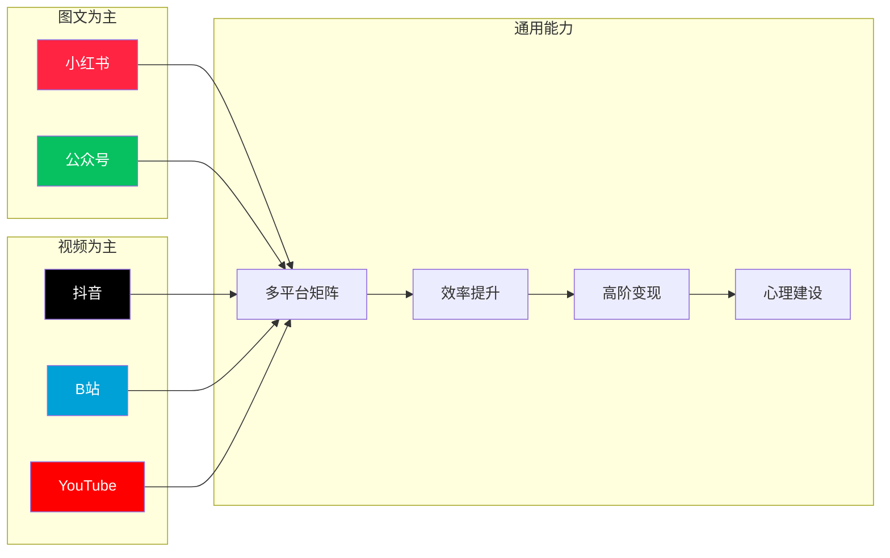
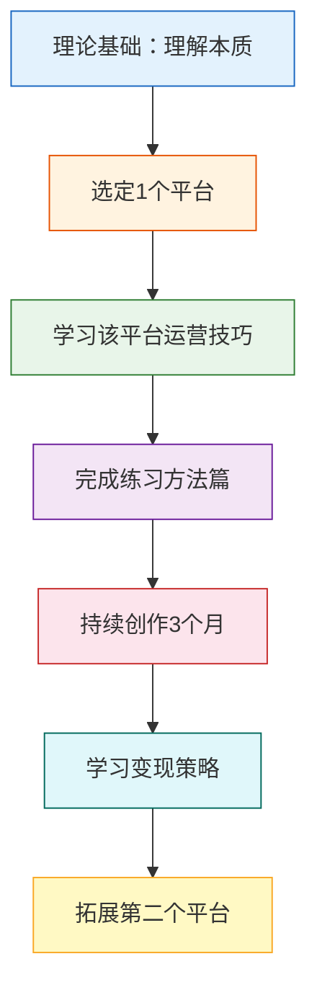

# 第09章 内容创作与社交媒体变现——章节概览

## 一、为什么内容创作是当下最值得投入的副业？

### 1.1 时代背景：注意力经济与AI时代的双重变革

2025年，中国短视频用户规模突破**10.7亿**，人均每日刷视频时长超过**2.8小时**。全球内容创作者经济规模已超过**3000亿美元**，预计到2027年将达到**5000亿美元**。这不是一个风口——这是一个持续扩张的新经济体，且正在经历AI技术带来的结构性变革。

在传统经济模式中，收入与时间严格挂钩：你工作8小时，拿8小时的工资。但在内容创作领域，一条视频可以在你睡觉时持续播放、持续变现。这就是**内容复利**——一次创作，长期收益。

**内容创作的本质是什么？** 不是写文章、拍视频这些表面形式，而是**将你的知识、经验、技能、观点封装成可传播、可消费的信息产品，通过平台分发获取流量，再将流量转化为收入**。这个过程涉及三个核心环节：

1. **价值封装**：将隐性知识转化为显性内容（你知道怎么做 ≠ 你能教别人做）
2. **平台分发**：借助算法和社交关系将内容推送到目标用户面前
3. **流量转化**：将注意力转化为实际收入（广告、带货、知识付费等）

任何一个环节断裂，变现链条就无法成立。很多创作者只擅长其中一环（比如内容很好但不懂分发，或者流量很大但不会变现），这就是为什么需要一套系统方法论。

### 1.2 AI时代对内容创作的冲击与机遇

2024-2026年，以ChatGPT、Midjourney、Sora、可灵AI为代表的AI工具彻底改变了内容创作的生产方式。这不是威胁，而是**结构性机遇**：

**AI降低的是生产门槛，提升的是竞争基准线**：

| 变化维度 | AI之前 | AI之后 | 对创作者的影响 |
|---------|--------|--------|--------------|
| 文案撰写 | 需要较强写作能力 | AI辅助生成初稿 | 重心转向观点和洞察力 |
| 图片制作 | 需要设计技能或外包 | AI生成+微调即可 | 视觉表达门槛大幅降低 |
| 视频剪辑 | 需要专业软件技能 | AI一键剪辑、字幕 | 产能提升3-5倍 |
| 多语言内容 | 需要翻译团队 | AI实时翻译配音 | 全球市场触手可及 |
| 数据分析 | 需要专业分析能力 | AI自动归因和建议 | 决策效率大幅提升 |

**关键认知**：AI让"能做内容"的人变多了，但让"能做好内容"的人更值钱了。当所有人都能用AI写出80分的文案时，90分的原创洞察、独特视角、真实人格反而成为最稀缺的资源。**你的不可替代性不在于生产效率，而在于你这个人本身——你的经历、你的判断力、你与粉丝建立的真实连接。**

### 1.3 内容创作 vs 其他副业

| 维度 | 内容创作 | 电商 | 自由职业 | 投资理财 |
|------|----------|------|----------|----------|
| 启动成本 | 极低（手机+AI工具即可） | 中高（库存、物流） | 低（技能即可） | 高（需要本金） |
| 时间弹性 | 高（可碎片化） | 中（需客服、发货） | 低（按项目交付） | 极高（被动） |
| 复利效应 | 极强（内容持续产生流量） | 弱（需持续投入） | 弱（按单计费） | 中（复利需要时间） |
| 天花板 | 极高（头部年入千万级） | 高 | 中 | 取决于本金 |
| 风险类型 | 时间成本（可逆） | 资金风险（不可逆） | 低 | 中高（可能亏损） |
| 技能门槛 | 中（可系统学习） | 中高 | 高（需专业技能） | 高 |
| 可迁移性 | 强（能力通用） | 中（行业绑定） | 中 | 弱 |

内容创作的核心优势在于：**低启动成本 + 强复利效应 + 高天花板 + 高可迁移性**。你不需要囤货、不需要租办公室、不需要雇人——一部手机、一个AI助手、一个账号，就可以开始。而且你在这个过程中积累的表达能力、用户洞察、个人品牌，即使未来不做自媒体，在任何行业都是核心竞争力。

### 1.4 内容创作者的真实数据

据2025年内容创作者经济报告：

- 中国内容创作者规模超过**2500万人**（含兼职）
- 月收入超过1万元的创作者占比约**8.5%**（约212万人）
- 月收入超过10万元的创作者占比约**0.7%**（约17.5万人）
- 头部1%的创作者拿走了行业**60%以上**的收入
- 全职创作者的中位月收入约为**6800元**
- 副业创作者的中位月收入约为**2200元**

这组数据传递了三个关键信息：

1. **内容创作是可以赚钱的**——8.5%的创作者月入过万，这已经超过了绝大多数城市的平均工资。212万人通过内容创作月入过万，这不是小概率事件。
2. **但它是幂律分布的**——头部效应极强，需要持续投入才能突破。前1%拿走60%收入意味着大多数人赚的是"辛苦钱"，只有少数人赚到了"资产钱"。
3. **副业起步是合理的**——全职和副业的收入差距（6800 vs 2200）说明前期用副业模式试错是明智的，不要轻易辞职全职做。

**重要的心态预期**：内容创作是一场马拉松，不是百米冲刺。前6个月可能几乎没有收入，需要持续输出才能看到效果。急于变现是大多数创作者失败的核心原因之一。具体来说：

- **第1-3个月**：定位期，可能0收入，核心任务是找到方向
- **第4-6个月**：试错期，可能月入几百到几千，核心任务是验证模式
- **第7-12个月**：增长期，可能月入几千到1万，核心任务是放大有效策略
- **第13-24个月**：变现期，月入1万+，核心任务是建立多元收入

---

## 二、本章的完整知识体系

本章按照**道法术器**的逻辑层次组织，从底层原理到实操技巧，从单平台深耕到多平台矩阵，从零基础入门到高阶变现，构建一套完整的内容创作与社交媒体变现方法论。

```mermaid
graph TD
    A[第09章 内容创作与社交媒体变现] --> B[理论基础]
    A --> C[核心技巧]
    A --> D[实战案例]
    A --> E[常见误区]
    A --> F[练习方法]
    A --> G[深度拓展]
    
    B --> B1[内容创作的本质]
    B --> B2[内容形式与特点]
    B --> B3[内容定位与差异化]
    B --> B4[平台选择逻辑]
    B --> B5[内容创作方法论]
    B --> B6[变现模式总览]
    B --> B7[平台算法深度解析]
    B --> B8[内容创作的底层逻辑]
    
    C --> C1[小红书运营]
    C --> C2[抖音运营]
    C --> C3[公众号运营]
    C --> C4[B站运营]
    C --> C5[YouTube运营]
    C --> C6[多平台矩阵]
    C --> C7[内容效率提升]
    C --> C8[变现高阶策略]
    C --> C9[心理建设]
    
    D --> D1[0→10万粉小红书]
    D --> D2[程序员→百万粉抖音]
    D --> D3[公众号年入百万]
    D --> D4[B站兴趣→职业]
    D --> D5[全平台月入10万]
    D --> D6[素人逆袭月入3万]
    D --> D7[知识付费月入5万]
    D --> D8[全职妈妈逆袭]

    style A fill:#FF6B35,color:#fff,stroke:#E55A2B
    style B fill:#E3F2FD,stroke:#1565C0
    style C fill:#FFF3E0,stroke:#E65100
    style D fill:#E8F5E9,stroke:#2E7D32
    style E fill:#FCE4EC,stroke:#C62828
    style F fill:#F3E5F5,stroke:#6A1B9A
    style G fill:#E0F7FA,stroke:#00695C
```

**道法术器的层次说明**：

| 层次 | 对应板块 | 解决的问题 | 学习目标 |
|------|---------|-----------|---------|
| **道** | 理论基础篇 | 为什么？本质是什么？ | 建立正确的认知框架，避免方向性错误 |
| **法** | 核心技巧篇（方法论部分） | 怎么做？策略是什么？ | 掌握可复用的运营方法论 |
| **术** | 核心技巧篇（实操部分） | 具体怎么执行？ | 能直接上手操作的技能 |
| **器** | 实战案例 + 工具推荐 | 用什么验证？用什么工具？ | 通过真实案例验证方法，用工具提效 |

---

## 三、各板块内容详解

### 3.1 理论基础篇（道：理解本质）

理论基础是整章的地基。很多人一上来就想学"爆款公式"，结果模仿了形式却不得其法，根本原因是缺乏对内容创作底层逻辑的理解。**知道"怎么做"但不知道"为什么这样做"的人，永远只能模仿，无法创新。**

**本板块包含8个核心主题：**

| 序号 | 主题 | 核心问题 | 你会学到什么 | 预计阅读时长 |
|------|------|----------|-------------|------------|
| 1 | 内容创作的本质 | 为什么有些内容能火？ | 内容价值的四种类型、复利效应、资产积累模型 | 15分钟 |
| 2 | 内容形式与特点 | 文字/视频/音频各有什么优劣？ | 各形式的适用场景、生产成本、变现效率对比 | 20分钟 |
| 3 | 内容定位与差异化 | 如何找到自己的赛道？ | 定位三要素、差异化四策略、定位检验标准 | 25分钟 |
| 4 | 平台选择逻辑 | 应该做哪个平台？ | 七大平台深度对比、选择矩阵、内容适配原则 | 20分钟 |
| 5 | 内容创作方法论 | 如何持续产出优质内容？ | 选题四象限、万能内容结构、爆款标题公式 | 30分钟 |
| 6 | 变现模式总览 | 内容创作怎么赚钱？ | 六大变现方式、分阶段变现策略、变现关键原则 | 20分钟 |
| 7 | 平台算法深度解析 | 平台是怎么分配流量的？ | 各平台推荐算法机制、流量池规则、算法友好策略 | 35分钟 |
| 8 | 内容创作的底层逻辑 | 内容创作的元认知是什么？ | 信息论视角、认知心理学原理、注意力经济学 | 25分钟 |

**关键洞察**：

> 理论不是用来"知道"的，而是用来"指导决策"的。当你理解了平台算法的底层逻辑，你就不会盲目追求"发布时间"这种表面技巧，而是专注于内容本身的完播率和互动率——这才是算法真正考核的指标。当你理解了注意力经济学，你就明白为什么"开头3秒"比"中间30秒"重要10倍——因为用户给你的注意力预算是有限的，而且是递减的。

### 3.2 核心技巧篇（法+术：方法与实操）

核心技巧篇是整章的实操主干，覆盖六大主流平台的完整运营方法论，以及内容效率提升和高阶变现策略。

**六大平台运营指南：**

每个平台的运营指南都包含以下模块：

1. **账号定位与人设打造**——你是谁、为谁服务、提供什么价值。这一步决定了你的内容方向和目标用户，是一切运营动作的起点。定位错误会导致后续所有努力都事倍功半。
2. **内容选题与爆款公式**——如何找到用户想看的内容、如何提高爆款概率。不是"我想写什么"而是"用户需要什么"，选题能力是内容创作最核心的技能。
3. **涨粉策略**——自然增长和加速增长的具体方法。包括内容涨粉、互动涨粉、热点涨粉、付费涨粉等多种路径。
4. **流量机制深度解析**——平台如何分配流量、如何获得推荐。理解算法不是为了"讨好"算法，而是为了让好内容被更多人看到。
5. **变现方式详解**——每种变现方式的操作流程和收入参考。从平台广告分成到品牌合作、从知识付费到私域变现，每种方式都有具体的门槛、流程和收入预期。
6. **工具与资源**——拍摄设备、剪辑软件、数据分析工具、AI辅助工具等。工具是效率的放大器，但记住：**工具永远是手段，内容才是目的**。

**多平台矩阵运营**：

- 如何用一份素材适配多个平台（不是简单搬运，而是"核心内容复用+形式适配"）
- 内容复用的正确姿势：长视频→短视频切片→图文笔记→文字版→音频版
- 矩阵管理的时间分配策略：主平台60%、副平台30%、私域10%
- 各平台的协同引流方法：如何让一个平台的粉丝流向另一个平台

**内容效率提升**：

- AI辅助内容创作的工作流：选题→大纲→初稿→优化→发布的AI提效方案
- 批量内容生产的方法论：一天产出一周内容的系统方法
- 建立个人素材库和模板库：可复用的标题模板、封面模板、脚本模板
- 从日更到批量生产的效率跃迁：如何用20%的时间产出80%的内容

**高阶变现策略**：

- 从广告合作到自有品牌：广告收入的天花板在哪里？如何突破？
- 知识付费产品设计：课程、社群、咨询、电子书的产品设计方法论
- 私域流量池搭建与变现：微信生态的完整变现闭环
- IP化运营与商业闭环：从"做内容"到"做品牌"的跃迁

**心理建设**：

- 如何度过0-1000粉的黑暗期：这是90%创作者放弃的阶段
- 应对负面评论和网络暴力：建立心理防护机制
- 避免创作倦怠和灵感枯竭：可持续创作的系统方法
- 长期主义心态的培养：延迟满足的能力

### 3.3 实战案例篇（器：真实验证）

案例是理论到实践的桥梁。本板块收录了8个真实案例，覆盖不同平台、不同起点、不同变现路径，让你看到内容创作的多种可能性。

| 案例 | 平台 | 起点 | 成果 | 核心启示 |
|------|------|------|------|----------|
| 案例一 | 小红书 | 零基础素人 | 10万粉 | 精准定位+持续输出的力量 |
| 案例二 | 抖音 | 程序员 | 百万粉 | 知识类内容的降维打击 |
| 案例三 | 公众号 | 财经爱好者 | 年入百万 | 深度内容的长尾价值 |
| 案例四 | B站 | 兴趣驱动 | 全职UP主 | 从兴趣到职业的转型路径 |
| 案例五 | 全平台 | 有经验创作者 | 月入10万 | 多平台矩阵的协同效应 |
| 案例六 | 小红书 | 零基础 | 月入3万 | 素人逆袭的可复制方法 |
| 案例七 | 多平台 | 财经领域 | 月入5万 | 知识付费的产品设计 |
| 案例八 | 小红书 | 全职妈妈 | 副业成功 | 时间有限情况下的高效运营 |

每个案例都包含完整的复盘框架：

- **背景**：创作者的起点、约束条件、可用资源（不是所有人都有充裕的时间和资金）
- **策略**：做了哪些关键决策？为什么选这个方向？为什么选这个平台？
- **执行**：具体的操作步骤、时间线、投入产出比（精确到每周做了什么）
- **数据**：真实的增长数据和收入数据（不是"大概涨了很多"，而是精确的数字）
- **复盘**：成功的关键因素、踩过的坑、可复用的经验（哪些是可以直接复制的？哪些需要根据自身情况调整？）

### 3.4 常见误区篇（避坑指南）

内容创作中有大量似是而非的"常识"，这些误区不仅浪费时间，还可能导致账号被限流甚至封禁。

**核心误区清单：**

| 误区 | 真相 | 后果 | 纠正方法 |
|------|------|------|---------|
| 追求爆款忽视持续输出 | 稳定输出比偶尔爆款更重要——算法更喜欢活跃且稳定的账号 | 账号权重下降，推荐减少 | 建立内容日历，保证最低更新频率 |
| 急于变现忽视内容质量 | 内容是1，变现是后面的0——没有优质内容，变现渠道再多也是空的 | 粉丝流失、口碑崩塌、变现效率低下 | 前6个月专注内容质量，暂不考虑变现 |
| 盲目跟风缺乏差异化 | 同质化内容没有竞争力——用户已经看过无数类似的了 | 淹没在信息洪流中，增长停滞 | 找到自己的独特视角或表达方式 |
| 只做一个平台 | 单平台风险高——一次算法调整就可能让你的流量归零 | 依赖单一平台，抗风险能力弱 | 站稳一个平台后，逐步扩展到2-3个平台 |
| 买粉刷数据 | 虚假数据影响算法判断——平台能识别假粉和刷量行为 | 账号被降权或封禁，真实互动率暴跌 | 用优质内容吸引真实粉丝，哪怕慢一点 |
| 忽视数据分析 | 没有数据就没有优化方向——凭感觉创作等于在黑暗中射箭 | 盲目创作效率低下，重复犯同样的错误 | 每周复盘数据，用数据指导内容策略 |
| 完美主义不发内容 | 发布比完美更重要——一条60分的内容发出去，比95分的永远在草稿箱有价值 | 永远停留在准备阶段，错失成长机会 | 设定"最低可发布标准"，先完成再完美 |
| 抄袭搬运他人内容 | 平台会检测和惩罚——洗稿、搬运、AI生成后不做人工优化都会被识别 | 限流、封号、法律风险 | 借鉴思路但必须有自己的原创价值 |
| 过度依赖AI生成内容 | AI是工具不是替代——纯AI生成的内容缺乏人格和温度 | 内容同质化严重，无法建立个人品牌 | AI负责效率，人负责灵魂——用AI生成初稿，用自己的经验和风格优化 |
| 频繁更换内容方向 | 算法需要时间认识你——频繁换方向等于反复从零开始 | 粉丝画像混乱，推荐不精准 | 至少坚持一个方向3个月再评估 |

### 3.5 练习方法篇（刻意练习）

知识不练习等于零。本板块提供一套从定位到变现的完整训练计划，让你在实践中掌握内容创作的核心能力。

**训练阶段：**

| 阶段 | 时间 | 目标 | 关键动作 | 完成标志 |
|------|------|------|----------|---------|
| 定位期 | 第1-2周 | 找到你的内容方向 | 市场调研、竞品分析、个人定位、注册账号 | 确定1个主攻方向+1个主攻平台 |
| 试水期 | 第3-6周 | 测试内容方向 | 发布30条内容、分析数据反馈、迭代优化 | 找到数据最好的3种内容类型 |
| 优化期 | 第7-12周 | 找到爆款模式 | 分析爆款规律、优化内容策略、建立内容模板 | 月均至少1条爆款（阅读/播放量>平均值5倍） |
| 加速期 | 第13-24周 | 稳定增长 | 建立内容生产体系、扩大规模、开始多平台 | 粉丝破万，月均收入>1000元 |
| 变现期 | 第25周+ | 实现变现 | 开通变现渠道、优化收入结构、私域沉淀 | 月均收入>5000元，且有≥2种收入来源 |

### 3.6 深度拓展篇（进阶内容）

为已有一定基础的创作者提供深度内容，这些内容不会在入门阶段用到，但当你成长到一定阶段后，会成为突破瓶颈的关键：

- **内容创作的数据分析方法论**：如何建立数据看板、如何做A/B测试、如何用数据驱动内容决策
- **个人品牌建设的系统方法**：从"做内容"到"做品牌"的认知升级和实操路径
- **内容创业的团队化运营**：何时招人？招什么人？如何管理内容团队？
- **从创作者到企业家的转型路径**：当内容创作变成一门生意，你的角色如何转变？
- **内容创作的经济学原理**：边际成本、网络效应、注意力稀缺性——理解这些，才能做出正确的战略决策

---

## 四、学习路线图

### 4.1 零基础学习者

如果你从未做过内容创作，建议按以下顺序学习：

**关键建议**：先从一个平台深耕，站稳脚跟后再扩展其他平台。贪多嚼不烂是新手最常犯的错误。具体选择哪个平台，取决于你的优势（详见第四节"平台选择逻辑"）。

### 4.2 已有经验的创作者

如果你已经在做自媒体但效果不理想，建议：

1. 先看**常见误区篇**，排查当前问题——很多时候不是能力问题，而是方向问题
2. 对照**核心技巧篇**，找到能力短板——是选题不行？标题不行？还是变现方式不对？
3. 研究**实战案例篇**，借鉴成功经验——找到和你情况最接近的案例，看看他们做了什么不同的事
4. 学习**变现策略**，优化收入结构——你可能已经有很多粉丝，但变现效率很低

### 4.3 想做全职内容创作者

如果你考虑全职做内容创作，建议：

1. 通读**理论基础篇**，建立系统认知——全职创作需要更深的理解
2. 深入学习**多平台矩阵运营**——单平台风险太高，全职创作更需要风险分散
3. 研究**高阶变现策略**——全职创作需要稳定的高收入，不能只靠广告分成
4. 制定6个月的详细执行计划——包括财务规划（至少准备6个月的生活费作为缓冲）
5. **在副业收入稳定超过主业之前，不要辞职**——这是最重要的建议

---

## 五、本章核心指标体系

在内容创作的不同阶段，你需要关注不同的核心指标。**指标不是用来"好看的"，而是用来指导决策的**——如果一个指标不能帮你做出更好的决策，那它就是噪音。

| 阶段 | 核心指标 | 目标值 | 说明 | 如何测量 |
|------|----------|--------|------|---------|
| 起步期 | 内容发布量 | ≥30条/月 | 先有量，再有质——量变才能引起质变 | 平台后台统计 |
| 起步期 | 粉丝增长率 | >5%/周 | 验证内容方向是否正确——如果持续不增长，说明方向有问题 | 本周新增粉÷上周总粉 |
| 成长期 | 爆款率 | >10% | 每10条内容有1条数据突出——说明你找到了用户喜欢的内容类型 | 播放量>均值5倍的内容占比 |
| 成长期 | 互动率 | >3% | 点赞、评论、收藏的综合比率——互动率高说明内容引发了用户共鸣 | (点赞+评论+收藏+分享)÷播放量 |
| 稳定期 | 粉丝留存率 | >95% | 不掉粉比涨粉更重要——掉粉说明内容质量或方向出了问题 | (期末粉-新增粉)÷期初粉 |
| 稳定期 | 内容变现率 | >5% | 每100次曝光产生5次以上转化——变现效率的核心指标 | 转化次数÷曝光次数 |
| 成熟期 | 月收入 | >1万 | 稳定的多元收入来源——不是偶尔一次过万，而是每月稳定过万 | 各渠道收入之和 |
| 成熟期 | 收入多元化 | ≥3种 | 不依赖单一变现方式——单一收入来源风险极高 | 收入来源数量 |

**指标的正确使用方式**：

- **起步期**：不要看收入，只看发布量和增长率。这个阶段的核心任务是"找到方向"，不是赚钱。
- **成长期**：重点关注爆款率和互动率。爆款率告诉你什么内容有效，互动率告诉你内容质量如何。
- **稳定期**：粉丝留存率比新增粉丝数更重要。掉粉说明你在失去老用户，这比不涨粉更危险。
- **成熟期**：月收入和收入多元化是核心。单一收入来源（比如只靠广告）是最大的风险。

---

## 六、开始之前的心理准备

在正式进入学习之前，请做好以下心理准备——这些不是"鸡汤"，而是无数创作者用真金白银换来的教训：

**1. 接受"无人关注"的阶段**

每个创作者都经历过发了内容没人看的阶段。这不是你的内容不好，而是算法需要时间认识你。前50条内容是"交学费"的阶段，坚持下去就会看到拐点。

具体来说：平台对新账号有一个"观察期"，算法需要通过你的内容来判断你的领域、风格和目标用户。在这个阶段，你的内容可能只有几十到几百的播放量——这是正常的。**不要因为数据不好就怀疑自己的方向，也不要因为数据不好就频繁更换内容类型**——这会让算法更加困惑，延长观察期。

**2. 接受"不完美"**

完美主义是内容创作的最大敌人。一条60分的内容发出去，比一条95分的内容永远停留在草稿箱有价值得多。先完成，再完美。

实际操作建议：给自己设定一个"最低可发布标准"——比如"内容有价值、标题清晰、没有明显错误"就够了。不要追求"完美"，追求"比上一条好一点"就够了。

**3. 接受"长期主义"**

内容创作不是一夜暴富的捷径。把预期放在6-12个月后，你会更从容地面对过程中的起伏。

数据参考：大多数成功创作者的"拐点"出现在第3-6个月（开始有稳定增长）和第9-12个月（开始有稳定收入）。前3个月是最难熬的——数据增长缓慢、收入几乎为零、不知道方向对不对。**如果你能熬过前3个月，你就已经淘汰了50%的竞争者。**

**4. 接受"持续学习"**

平台规则在变、算法在变、用户偏好在变、AI工具在进化。保持学习的习惯，才能在这个领域持续生存。

具体做法：
- 每周花1小时研究平台更新和行业动态
- 每月复盘一次自己的内容数据，找出规律
- 每季度学习一个新的工具或技能
- 关注3-5个行业标杆创作者，学习他们的策略变化

**5. 接受"被拒绝和被批评"**

发布内容意味着把自己暴露在公众视野中，负面评论和批评是不可避免的。区分两种批评：

- **建设性批评**：指出具体问题的评论，这是免费的用户调研，要认真对待
- **无意义攻击**：没有具体理由的恶意评论，忽略即可，不要浪费精力回应

---

## 七、本章与其他章节的关系

内容创作与社交媒体变现不是孤立存在的——它是个人收入增长体系中的重要一环，与其他章节形成互补：

| 关联章节 | 与本章的关系 | 如何协同 |
|---------|------------|---------|
| 第08章 个人IP与品牌建设 | 内容创作是建立个人IP的核心手段 | 用IP思维指导内容定位，用内容持续强化IP |
| 第10章 知识付费与在线教育 | 内容创作为知识付费提供流量和信任基础 | 先用免费内容建立信任，再用付费内容变现 |
| 第05章 自由职业与远程工作 | 内容创作可以成为自由职业的一种形式 | 用自由职业技能做内容（如设计师做设计教程） |
| 第03章 投资理财基础 | 内容创作收入需要合理的理财规划 | 将内容创作收入的一部分用于投资，实现"钱生钱" |
| 第06章 电商与直播带货 | 内容创作为电商引流 | 用内容吸引精准用户，再通过电商变现 |

---

## 八、快速行动指南：你的第一周

不要只停留在"学习"阶段——以下是你读完本概览后，第一周就可以做的7件事：

| 天数 | 行动 | 预计耗时 | 产出 |
|------|------|---------|------|
| 第1天 | 完成个人定位（用第三节的"定位三要素"框架） | 1小时 | 一份个人定位文档 |
| 第2天 | 注册账号，完善资料（头像、昵称、简介） | 30分钟 | 一个可用的创作者账号 |
| 第3天 | 研究5个同领域优秀创作者的内容 | 2小时 | 一份竞品分析笔记 |
| 第4天 | 写出你的第一条内容（不求完美，先发出去） | 1小时 | 第一条已发布的内容 |
| 第5天 | 用AI工具（如ChatGPT）辅助生成3个选题 | 30分钟 | 下一周的选题清单 |
| 第6天 | 发布第二条内容，对比两条数据 | 1小时 | 初步的数据对比 |
| 第7天 | 复盘本周数据，调整下周计划 | 30分钟 | 一份简单的周报 |

> **一句话总结**：内容创作是普通人能够接触到的、启动成本最低的、复利效应最强的变现方式。但它不是捷径——它是一条需要耐心、坚持和不断学习的长期道路。AI时代让生产效率大幅提升，但真正稀缺的永远是**真实的人格、独特的视角和深度的洞察**。

现在，让我们正式开始。
