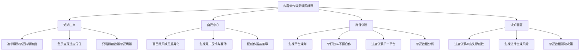
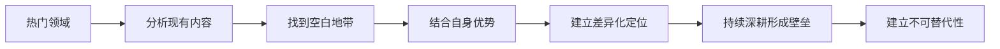
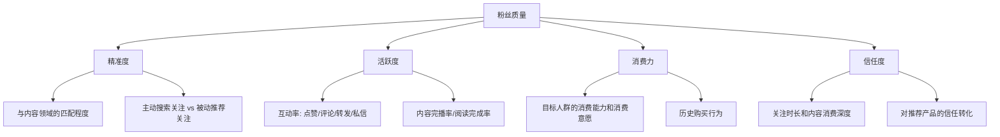
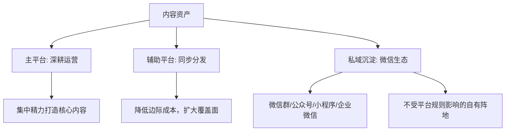
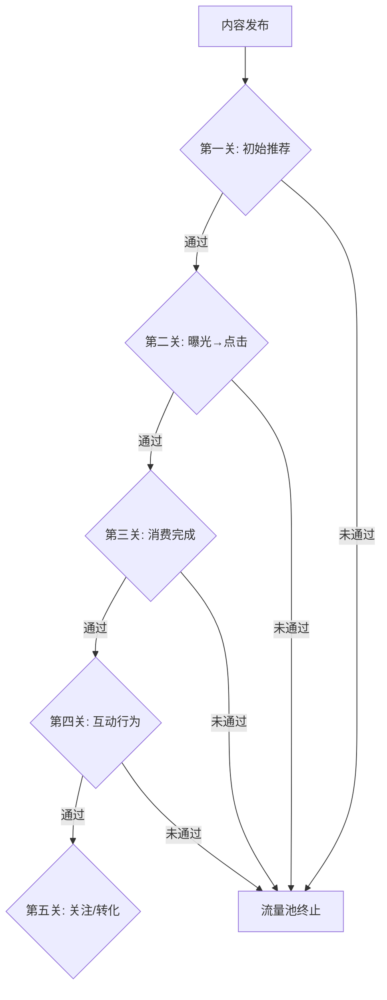
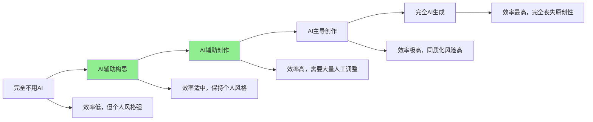
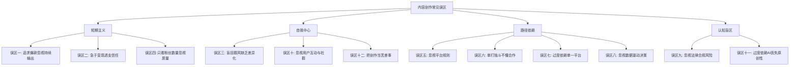

# 第09章 内容创作与社交媒体变现——常见误区

内容创作和社交媒体变现是一条看似门槛低、实则暗礁密布的航道。大量创作者在起步阶段就踩入认知陷阱，轻则浪费数月时间，重则丧失信心彻底放弃。本章系统梳理内容创作变现领域最常见的十二大认知误区，每个误区都从「典型表现」「底层原理」「踩坑代价」「纠正方法」四个维度展开，并辅以真实数据和案例，帮助你避开前人走过的弯路。

在进入具体误区之前，先建立一个总体认知框架。所有误区的根源可以归结为三类根本性认知错误：

---

## 误区一：追求爆款，忽视持续输出

### 典型表现

创作者把全部精力押在「打造爆款」上：花一周时间精心制作一条内容，发布后每隔10分钟刷新一次数据，24小时内没有爆发就开始焦虑，一周后如果没有破万播放就判定「失败」，然后要么疯狂模仿爆款套路，要么干脆停更等待「灵感」。

更隐蔽的表现是「完美主义拖延」——总觉得内容还不够好、画面还不够精致、文案还不够打磨，于是一条内容反复修改两三周才发布，结果更新频率极低，错过了平台算法给予活跃创作者的推荐红利。

### 底层原理

爆款的本质是**概率事件叠加算法推荐的随机性**。即使是拥有百万粉丝的头部创作者，单条内容成为爆款的概率通常也只有10%-20%。这意味着每发布10条内容，可能只有1-2条获得远超平均值的流量。爆款不可预测，但**发布的基数可以控制**——发布100条内容，按照10%的爆款率，理论上会出现10条爆款；而只发布10条，可能一条都没有。

从平台算法的角度看，持续输出还有另一层意义：平台的推荐系统会根据创作者的**活跃度和更新频率**调整其内容的初始推荐权重。长期断更的账号重新发布内容时，初始推荐池会明显缩小，相当于「冷启动」重新来过。

这里涉及一个统计学概念——**大数定律**。单条内容的数据波动极大，但当你积累了足够多的样本（通常100条以上），数据的均值会趋于稳定，你才能真正看清自己的内容在平台上的真实表现水平。只看几条内容的数据就下结论，就像抛硬币3次就断定硬币两面概率不等一样荒谬。

**关键数据参考**：

- 抖音官方数据显示，日更账号的平均播放量是周更账号的2.3倍
- 小红书创作者调研表明，连续发布30天以上的账号，笔记平均曝光量比间歇性发布高出40%-60%
- YouTube创作者经济报告指出，频道前100条视频的累计播放量，往往不到最终总播放量的5%
- B站UP主成长数据显示，坚持周更满一年的UP主，粉丝中位数约为3万；而更新频率低于月更的UP主，一年后粉丝中位数不足3000

### 真实案例

**失败案例**：创作者A在抖音做知识科普，前5条视频播放量都在200-500之间，第6条突然达到50万播放。A认为自己「找到了爆款密码」，开始模仿第6条的风格反复制作类似内容，但后续20条视频播放量再也没有超过1万。原因在于那条50万播放的视频恰好被某个大V转发带动了二次传播，这是不可复制的偶然事件。A在持续模仿失败后放弃了账号，浪费了3个月时间。

**成功案例**：美食博主「麻辣德子」早期坚持每天发布一条家常菜视频，前3个月单条播放量基本在1000-5000之间，但他保持日更从未间断。到第4个月，一条「农村大席」的视频突然爆发到500万播放。之后他的账号进入良性循环，持续的日更积累的内容基数让算法对他建立了信任权重，后续内容的起始推荐量明显提高。

**数据对比**：假设两位创作者的爆款率都是10%，A每天发布1条，B每周发布1条。一年后，A发布了365条内容，预期产出36条爆款；B发布了52条内容，预期产出5条爆款。两者的差距不是7倍，而是指数级的——因为每条爆款都会带动其他内容的曝光，形成正向飞轮。

### 正确做法

1. **建立可持续的更新节奏**：根据你的产能确定发布频率（日更/隔日/周更），然后严格执行。宁可降低单条质量也要保证更新频率——这里的「降低」是指从95分降到85分，而不是从85分降到不及格。具体节奏建议：
   - 短视频（抖音/快手/视频号）：日更或隔日更
   - 图文（小红书/微博）：日更或隔日更
   - 长视频（B站/YouTube）：周更或双周更
   - 深度文章（公众号/知乎）：周更或双周更

2. **用「100条法则」校准预期**：给自己设定「至少发布100条内容」的最低门槛，在这之前不评判结果。100条是算法认识你、你认识平台的最低样本量

3. **关注趋势而非单点数据**：建立数据看板，追踪周度/月度的整体趋势（总播放量、平均互动率、粉丝增长曲线），而非盯着单条内容的实时数据。推荐使用飞书多维表格或Notion数据库，字段包括：发布日期、内容类型、标题、播放量、点赞、评论、转发、涨粉数

4. **建立「爆款复盘」机制**：每出现一条数据明显优于平均值的内容，记录下选题、标题、封面、发布时间、前24小时互动模式等变量，逐步积累你自己的爆款规律数据库。复盘模板：
   - 选题来源：热点/日常/粉丝提问/灵感
   - 标题结构：数字型/疑问型/悬念型/对比型
   - 封面类型：成品图/过程图/文字封面/人物特写
   - 发布时间：几点几分
   - 前2小时互动数据：点赞率、评论率、转发率
   - 与均值的偏差倍数

5. **设置「内容库存」**：提前准备3-5条待发内容，避免因某天状态不好而断更。建立选题库，随时记录灵感，确保永远不缺选题

### 常见追问

**Q：持续输出会不会导致内容质量下降？**

A：这里的关键区分是「持续输出」和「敷衍更新」。持续输出是指保持稳定的发布频率，每条内容都达到你的基准质量线（比如85分）。如果你发现自己为了日更而降到60分以下，应该降低频率（从日更改为隔日更），而不是降低质量。一个实用的判断标准是：如果你自己都不愿意把这条内容分享给朋友看，说明质量不达标。

**Q：多久能看到效果？**

A：根据平台不同，冷启动期通常在2-6个月。抖音和快手由于算法推荐机制，可能2-3个月就能看到明显数据变化；小红书和公众号通常需要4-6个月；B站和YouTube可能需要更长时间（6-12个月）。在冷启动期内，你的核心任务就是「活着」——保持更新、观察数据、迭代内容。

---

## 误区二：急于变现，忽视内容质量

### 典型表现

粉丝刚过千就开始接广告，笔记里频繁出现「好物推荐」「亲测好用」，甚至在不了解产品的情况下就为品牌写推广文案。内容从「分享真实体验」变成了「收钱说好话」，粉丝在评论区开始出现「又恰饭了」「取关了」的声音。

另一种隐蔽表现是「软广硬发」——把广告伪装成普通内容，但文案生硬、植入突兀，粉丝一眼就能看出来。这种做法比直接标注广告更损害信任，因为它让粉丝觉得被欺骗。

### 底层原理

内容创作变现的底层逻辑是**信任经济**。粉丝关注你，是因为你的内容对他们有价值——可能是信息价值（学到知识）、情绪价值（获得快乐）或社交价值（获得谈资）。这种价值感会转化为对你的信任，而信任是所有变现方式（广告、带货、课程、付费社群）的基础。

当你急于变现而牺牲内容质量时，本质上是在**透支信任资产**。信任的建立是缓慢的（需要数月甚至数年的持续积累），但信任的崩塌是瞬间的（一条质量低劣的广告就可能让大量粉丝取关）。

从经济学角度看，信任资产具有**复利效应**：高信任度带来高转化率，高转化率带来更高的品牌合作报价，更高的收入让你有能力拒绝低质量合作，从而维持高信任度——这是一个正向循环。反之，急于变现会启动一个负向循环：低质量广告→信任下降→转化率下降→只能接更低端的广告→信任进一步下降。

**信任度与变现效率的关系**：

| 信任度等级 | 粉丝粘性 | 广告转化率 | 单粉丝价值（年） | 品牌合作意愿 | 可持续性 |
|-----------|---------|-----------|----------------|------------|---------|
| 低信任（频繁恰饭） | 低，易取关 | 0.5%-1% | 1-3元 | 低端品牌，压价严重 | 差，粉丝持续流失 |
| 中信任（偶尔推荐） | 中等 | 2%-5% | 5-15元 | 中端品牌，正常合作 | 中等，需持续维护 |
| 高信任（严格筛选） | 高，复购率高 | 8%-15% | 20-50元 | 高端品牌，主动邀约 | 强，形成正循环 |

### 真实案例

**失败案例**：小红书护肤博主B在积累了8000粉丝后开始接广告，第一个月接了6个品牌合作。其中3个产品她自己根本没有使用过，只是照着品牌提供的brief写文案。粉丝很快发现推荐的产品与她之前的护肤理念矛盾（比如她一直推荐温和护肤，却突然推荐了一款高浓度酸类产品），评论区出现大量质疑。一个月内粉丝从8000降到4500，更严重的是，留下来的粉丝对她的推荐也不再信任，后续的广告转化率从之前的5%降到了0.8%。这个案例的教训是：信任的崩塌具有**传染性**——一次不真诚的推荐会让粉丝质疑你之前所有的推荐。

**成功案例**：公众号「黎贝卡的异想世界」在前两年几乎不接商业合作，专注于高质量的时尚穿搭内容输出。当她开始商业化时，因为她长期建立的专业形象和信任度，粉丝对她的推荐接受度极高。据报道，她推荐的商品经常在几分钟内售罄，单条广告报价远超同粉丝量级的账号。她的成功证明了一条核心原则：**延迟满足带来的回报远超即时变现**。

**数据对比**：假设两位博主各有5万粉丝。博主X从第3个月开始频繁接广告，每月6条，年广告收入约12万，但粉丝增长率从每月8%降到2%，年底粉丝约7.2万。博主Y从第12个月才开始接广告，每月2条精选合作，年广告收入约8万，但粉丝增长率维持在6%，年底粉丝约10万。到第二年，博主Y的广告收入将远超博主X，因为更高的粉丝量+更高的信任度=更高的报价和转化率。

### 正确做法

1. **设定「信任建设期」**：在开始商业化之前，至少进行6个月的纯内容输出（具体时长视领域和平台而定）。这段时间的目标是建立你在粉丝心中的专业形象和信任基础。判断标准：当粉丝在评论区主动问你「XX产品值不值得买」时，说明信任已经建立

2. **建立合作筛选标准**：为自己制定一份「品牌合作准入清单」：
   - 产品必须亲自使用满7天以上（护肤/食品类建议14天以上）
   - 必须符合你的内容定位和价值观
   - 品牌口碑不能有重大负面
   - 广告文案必须融入你的个人风格，不能照搬brief
   - 合作频率：广告内容占比不超过总发布量的20%

3. **控制商业化比例**：广告内容在总发布量中的占比不超过20%。例如你每周发布5条内容，其中广告类最多1条。同时广告内容本身也要保持内容质量——把它做成一条有价值的内容，而不仅仅是一条广告。一个好的标准是：即使去掉品牌植入，这条内容本身仍然值得看

4. **透明化合作**：明确标注广告/合作内容，不欺骗粉丝。研究显示，明确标注「广告」的内容，只要内容本身有价值，粉丝的接受度反而高于伪装成普通推荐的广告。2023年小红书平台数据显示，标注「合作」标签的笔记，互动率仅比普通笔记低8%，而未标注的软广笔记一旦被识别，互动率下降超过40%

5. **建立「回头客」机制**：与品牌建立长期合作关系，而不是一锤子买卖。长期合作的品牌粉丝更容易接受，因为这代表你对品牌的持续认可。长期合作还能获得更好的合作条件（更高的报价、更多的创作自由度）

---

## 误区三：盲目跟风，缺乏差异化

### 典型表现

看到平台上某个话题火了，立刻跟风制作类似内容；看到某个博主的视频风格受欢迎，马上模仿他的剪辑方式、口头禅甚至背景音乐。打开他的主页，看到的和打开任何一个同类账号看到的没有区别——选题雷同、表达方式雷同、视觉风格雷同。结果是：在海量同质化内容中，你的内容被淹没得无影无踪。

更深层的问题是，跟风者往往只看到了表面现象（「这条视频火了是因为用了这个BGM」），而忽略了背后的底层逻辑（「这条视频火了是因为创作者的独特视角引发了共鸣」）。模仿形式容易，模仿灵魂不可能。

### 底层原理

差异化不是「锦上添花」，而是**生存必需**。在任何一个成熟的内容领域，头部创作者已经占据了大部分流量和用户注意力。后来者如果做完全相同的内容，面对的竞争是：你用一个月做出的内容质量，可能还不如头部博主一条随手拍的视频。

从用户视角看，差异化解决了**「为什么要看你而不是看别人」**这个根本问题。没有差异化，你就是一个可替代的内容源——用户关注你和关注别人没有任何区别。

在供给过剩的内容市场中，**「好」已经不够了，「不同」才是竞争力**。当用户在信息流中看到10条类似的内容，他们只会点开其中最有辨识度的那一条。如果你的内容和别人看起来「差不多」，即使质量不差，也会被忽略。

**差异化定位的理论框架**（蓝海策略在内容创作中的应用）：

**差异化的五个维度**：

| 维度 | 说明 | 示例 | 难度 | 效果持久性 |
|------|------|------|------|-----------|
| 内容角度 | 同一话题的不同切入方式 | 别人讲「如何理财」，你讲「月薪3000如何理财」 | 低 | 中 |
| 表达形式 | 独特的内容呈现方式 | 别人做口播，你用动画/漫画/情景剧 | 中 | 高 |
| 人设风格 | 独特的个人标签 | 毒舌点评、搞笑演绎、冷静分析 | 中 | 高 |
| 受众定位 | 聚焦细分人群 | 别人做「职场」，你做「程序员职场」 | 低 | 高 |
| 价值主张 | 独特的核心承诺 | 别人教你「赚钱」，你教「用100元开始投资」 | 中 | 极高 |

### 真实案例

**失败案例**：2023年ChatGPT爆火后，大量创作者涌入AI赛道做教程。据不完全统计，仅抖音一个平台，标题含「ChatGPT」的视频在一个月内新增超过50万条。其中绝大多数内容雷同：「ChatGPT注册教程」「ChatGPT十大用法」「用ChatGPT写论文」。这些内容互相挤压流量，绝大部分播放量不超过1000。到2024年，这批跟风者中超过90%已经停更。

**成功案例**：同样是AI赛道，「花生酱先生」选择了「AI绘画+中国传统元素」的独特角度，用AI生成古风美女、水墨画风格的城市风景等内容。这个差异化的角度让他在短短两个月内积累了50万粉丝，因为他的内容在海量AI教程中独树一帜，既有AI技术的新奇感，又有传统文化的审美价值。

**更多差异化成功案例**：

- **「老师好我叫何同学」**：同样是科技测评，别人做参数对比，他做「用5G下载速度是什么体验」「用36万台LED做一个视频」这种视觉冲击力极强的创意内容
- **「硬核的半佛仙人」**：同样是财经科普，别人做正经分析，他用「黑暗幽默+表情包+快速剪辑」的形式，形成了强烈的个人风格
- **「意公子」**：同样是艺术科普，别人做作品介绍，她用「讲故事+情感共鸣」的方式，让艺术不再高冷
- **「无穷小亮的科普日常」**：同样是生物科普，别人做正经讲解，他用「鉴定网络热门生物视频」的框架，把科普变成了悬疑+搞笑的混合体

### 正确做法

1. **做竞品分析**：在你选择的领域，找出排名前20的创作者，用一张表格分析他们的内容角度、表达形式、人设风格和受众定位，找出他们没有覆盖到的空白地带。分析维度：
   - 他们最常做的选题类型是什么？
   - 他们的表达风格有什么共同特征？
   - 他们的粉丝画像（年龄/性别/地域）是什么？
   - 他们没有覆盖到哪些细分需求？
   - 他们的内容有什么明显短板？

2. **找到你的「交叉点」**：差异化最有效的来源是**「你的独特经历/技能 × 热门领域」**。例如：程序员×美食（用编程思维做菜谱）、律师×情感（从法律角度分析感情问题）、留学生×理财（海外视角的投资理财）。交叉点越具体、越个人化，差异化越强

3. **测试差异化定位**：不要一上来就全力投入，先用5-10条内容测试你的差异化角度是否有市场反应。如果数据明显好于同领域平均值，说明方向对了。测试期间关注的核心指标是「互动率」而非「播放量」——互动率高说明内容引发了共鸣，播放量高可能只是蹭到了热点

4. **持续强化差异化标签**：一旦确定了差异化定位，就要持续强化。在标题、封面、开头、口头禅等各个触点反复传递你的独特定位，直到用户一看到你的内容就能立刻识别出「这是XXX」

5. **建立「内容DNA」文档**：用一段话清晰定义你的内容DNA——「我是谁，我为谁服务，我和别人有什么不同，我的内容能给你什么独特的价值」。每次创作前回顾这段话，确保内容不偏离定位

---

## 误区四：只关注涨粉，忽视粉丝质量

### 典型表现

用各种「涨粉秘籍」快速积累粉丝数量：互赞互粉群、热门话题蹭流量、抽奖送礼吸粉、甚至直接买粉。粉丝数字看起来很漂亮，但互动率低得可怜，评论区要么冷清要么全是机器人，变现更是无从谈起。

### 底层原理

粉丝数量是一个**虚荣指标**（Vanity Metric），它看起来很漂亮但不能直接转化为收入。真正决定变现能力的是**粉丝质量**——粉丝与你的内容领域的匹配度、粉丝的消费能力和消费意愿、粉丝对你的信任度。

一个残酷的现实是：**1万精准粉丝的变现能力，可能超过10万泛粉丝**。因为精准粉丝有明确的需求（否则不会关注你），信任你的推荐（持续消费你的内容），且有对应的消费场景（你推荐的产品/服务与他们的需求匹配）。

从数学角度理解：假设你的变现方式是广告带货，转化率为3%，客单价100元，佣金率20%。1万精准粉丝中3%购买=300单×100元×20%=6000元。10万泛粉丝中0.3%购买（转化率低10倍）=300单×100元×20%=6000元。看起来收入一样，但维护10万粉丝的内容成本是1万粉丝的数倍——你的投入产出比实际下降了。

**粉丝质量评估模型**：

### 真实案例

**失败案例**：健身博主C为了快速涨粉，在抖音上大量发布搞笑段子（因为搞笑内容容易获得推荐），三个月涨了15万粉丝。但当他开始接健身相关的广告（蛋白粉、健身器材）时，转化率极低——因为他的粉丝是来看搞笑内容的，不是来看健身内容的。广告报价只能按照泛粉标准定（每万粉200-300元），远低于垂直健身博主的报价（每万粉800-1500元）。更讽刺的是，当他转型回健身内容时，大量泛粉取关，三个月内粉丝从15万掉到8万，而留下来的8万粉丝也不是精准的健身人群（因为早期的搞笑内容已经污染了粉丝画像）。

**成功案例**：理财博主D只有3万粉丝，但他从一开始就定位「30岁职场人的资产配置」，所有内容都围绕这个精准人群的需求展开。他的粉丝画像非常清晰：25-35岁、一二线城市、月收入1-3万、有理财需求。这让他在接广告时可以精准报价，品牌方也愿意给出更高的单价，因为投放精准度高。他的单条广告报价是同粉丝量级泛娱乐博主的3-5倍。

### 正确做法

1. **明确目标用户画像**：在开始创作之前，用一份详细的用户画像模板描述你的理想粉丝——年龄、性别、城市、收入、兴趣、痛点、消费习惯。所有内容都要围绕这个画像创作。用户画像模板：
   - 基础属性：年龄段、性别比例、城市层级、职业类型
   - 需求痛点：他们最想解决什么问题？最焦虑什么？
   - 内容偏好：喜欢什么形式？什么风格？什么时长？
   - 消费场景：他们会为什么样的产品/服务付费？预算范围？

2. **用内容做筛选器**：你的内容本身就是最好的筛选器。精准定位的内容会自动吸引目标用户、过滤非目标用户。不要为了涨粉而做偏离定位的内容。一个实用的测试方法：发布一条高度垂直的内容和一条泛娱乐内容，对比两者的互动质量（而非数量）

3. **关注「有效粉丝」指标**：不要只看粉丝总数，关注以下指标——互动率（点赞+评论+转发/播放量，健康值在3%-8%）、私信量（主动私信你的粉丝数量）、内容完播率（看完你内容的用户比例）、收藏率（尤其在小红书，收藏率是粉丝质量的核心指标）

4. **定期清理无效粉丝**：平台通常不提供直接的「清理粉丝」功能，但你可以通过内容策略实现自然筛选——持续发布垂直领域的内容，非目标用户会自然流失，留下来的都是精准粉丝

5. **建立粉丝分层体系**：按照互动频率和消费意愿，将粉丝分为核心粉丝（高互动高消费）、活跃粉丝（中互动中消费）、普通粉丝（低互动低消费），针对不同层级制定不同的运营策略。核心粉丝要重点维护（私信回复、专属福利、社群邀请），活跃粉丝要持续激活（互动引导、内容策划），普通粉丝要自然筛选（持续垂直内容）

---

## 误区五：忽视平台规则

### 典型表现

不了解平台的社区规范和算法逻辑，触犯红线后才后知后觉。常见的「翻车」场景包括：在内容中直接留联系方式被限流、搬运他人内容被判定侵权、使用违规词汇被降权、频繁发布营销内容被判定为「垃圾账号」。

### 底层原理

平台规则不是「建议」，而是**生存法则**。在平台上创作，本质上你是在「别人的地盘上开店」——平台拥有全部的规则制定权和执行权。忽视规则的结果轻则限流（你的内容不再被推荐），重则封号（所有积累一夜归零）。

更关键的是，平台规则**不是静态的**。各平台会根据政策环境、商业策略和用户反馈持续调整规则。今天合规的做法，明天可能就违规了。创作者必须建立持续关注规则变化的习惯。

理解平台规则的本质是理解平台的**利益诉求**：平台想要的是用户时长和用户满意度。任何损害用户体验的行为（低质内容、虚假信息、过度营销、诱导行为）都会被限制，任何提升用户留存的行为（高质量原创内容、真实的用户互动、有价值的信息分享）都会被奖励。

**各平台核心红线对比（2025年最新）**：

| 平台 | 核心红线 | 违规后果 | 合规引流方式 | 最新规则变化 |
|------|---------|---------|------------|------------|
| 抖音 | 站外引流、低质搬运、虚假宣传、AI生成未标注 | 限流→降权→封号 | 主页简介、直播口播、私信自动回复 | 2024年起要求AI生成内容必须标注 |
| 小红书 | 直接留联系方式、软广硬发、刷量、虚假种草 | 笔记限流→账号限流→封号 | 个人简介、评论区引导私信、群聊 | 2024年加强虚假种草治理，处罚力度翻倍 |
| B站 | 搬运无授权内容、引战、低俗、过度商业化 | 警告→限流→封号 | 简介区、动态、专栏 | 商业化内容需通过花火平台报备 |
| 公众号 | 诱导分享、标题党、违规广告、洗稿 | 删除文章→限制功能→封号 | 菜单栏、自动回复、文末引导 | 2024年加强洗稿检测算法 |
| 视频号 | 站外引流、低俗内容、虚假营销 | 限流→封号 | 主页链接、直播间、私信 | 与微信生态打通，私域引流更便捷 |
| 快手 | 低俗内容、虚假宣传、刷量 | 限流→封号 | 主页简介、直播、私信 | 2024年加强电商内容监管 |

### 真实案例

**失败案例**：穿搭博主E在小红书上经营了半年，积累了2万粉丝。一次在笔记图片中P上了自己的微信号水印，被平台检测到后直接限流。她没有意识到问题，继续发布了5条类似内容，导致账号被降权——所有新发布的笔记曝光量从平均5000降到不足100。她花了一个个月时间「养号」（只发纯内容不做任何引流），才逐渐恢复流量。

**更严重的案例**：某知识付费博主在公众号上发布了一篇标题为「震惊！99%的人都不知道的赚钱秘密」的文章，被判定为标题党后文章被删除。他修改标题后重新发布，又被删除。连续3次违规后，公众号的群发功能被限制30天，期间无法向粉丝推送任何内容，相当于断了核心传播渠道。

**进阶案例**：知识博主F在抖音做法律科普，一条关于「劳动法维权」的视频因为涉及敏感话题被限流。但他及时调整策略，把敏感内容改为「职场权益科普」，用案例故事代替直接法律条文引用，既规避了敏感词又保持了内容价值。

### 正确做法

1. **通读平台社区规范**：每个平台都有详细的社区规范文档（通常在「设置→关于→社区规范」中可以找到）。这不是「可读可不读」的选项，而是**必读文件**。建议打印出来贴在工作台旁边，每季度重新阅读一次（因为规则会更新）

2. **关注平台官方创作者账号**：各平台都有官方的创作者运营账号（如抖音的「抖音创作者中心」、小红书的「小红书创作学院」、B站的「创作者学院」），这些账号会第一时间发布规则更新和运营指南

3. **加入创作者社群**：关注你所在领域的创作者社群（微信群、知识星球等），社群中经常有人分享最新的违规案例和避坑经验。信息差在这里体现得尤为明显——很多人被限流了都不知道原因

4. **建立「合规检查清单」**：在发布每条内容之前，对照清单逐项检查：
   - 是否涉及敏感词？（用各平台的敏感词检测工具预先检查）
   - 是否有站外引流嫌疑？（联系方式、二维码、暗示性引导）
   - 是否侵犯他人版权？（图片、音乐、视频素材的来源）
   - 是否符合平台的内容调性？（低俗/擦边/争议性内容）
   - 广告内容是否已标注？（合作标签、广告声明）
   - AI生成内容是否已标注？（2024年起多平台要求）

5. **多平台布局分散风险**：不要把所有鸡蛋放在一个篮子里。即使某个平台出现问题，你在其他平台的积累还在。建议至少运营2-3个平台

6. **建立内容资产备份**：所有发布的内容都要本地备份（文案、图片、视频原文件），建立结构化的内容库。一旦账号出现问题，你的内容资产不会丢失，可以在其他平台重新起步

---

## 误区六：单打独斗，不懂合作

### 典型表现

一个人包揽选题、拍摄、剪辑、运营、商务所有工作，既不与其他创作者互动，也不寻求外部资源。结果是：增长速度慢、内容形式单一、商业机会有限，最终陷入「低效努力」的死循环。

### 底层原理

内容创作不是零和博弈，合作可以实现**1+1>2**的协同效应。具体体现在三个层面：

1. **流量层面**：互推互荐可以让双方的粉丝交叉覆盖，实现「低成本涨粉」。算法推荐机制下，两个创作者互相引流，本质上是在扩大各自的推荐池
2. **内容层面**：不同创作者的技能互补可以产出更高质量的内容。你擅长文案，我擅长剪辑，合作后的内容质量远超各自单独制作
3. **商业层面**：联合创作可以承接更大的商业项目，谈判更高的合作价格。品牌方更倾向于一次性投放多个创作者的联合项目，因为协调成本更低、传播效果更好

**合作类型与收益矩阵**：

| 合作类型 | 操作难度 | 流量收益 | 内容收益 | 商业收益 | 适用阶段 |
|---------|---------|---------|---------|---------|---------|
| 评论区互动 | 低 | 低 | 低 | 无 | 任何阶段 |
| 互相推荐/转发 | 低 | 中 | 低 | 低 | 有一定粉丝基础 |
| 联合直播/连麦 | 中 | 中-高 | 中 | 中 | 有一定影响力 |
| 合作出品内容 | 中 | 高 | 高 | 中-高 | 内容制作能力成熟 |
| 联合品牌项目 | 高 | 高 | 高 | 高 | 商业化阶段 |
| 创作者联盟/社群 | 中 | 持续 | 持续 | 持续 | 任何阶段 |

### 真实案例

**案例一**：两个美食博主（各5万粉丝）联合制作了一期「厨艺PK」视频，分别发布在各自的账号上。两条视频的播放量分别是35万和28万，远超他们平时的平均播放量（5万左右）。双方各涨粉4000-6000，后续还建立了长期合作关系，定期联合出品内容。

**案例二**：知识付费领域的合作模式——A擅长内容制作但不擅长销售，B擅长社群运营和销售转化。两人合作推出课程，A负责课程内容，B负责推广销售。最终课程销售额达到20万，按照五五分成，每人收入10万，远超他们单独做课的预期收入。

**案例三**：三位不同领域的生活博主（美食、穿搭、家居）组成「生活美学联盟」，共同承接了一个家居品牌的年度合作项目，合同总额50万。如果各自单独接，每个人最多拿到5-8万的单价，联合后每人分到约16万，同时品牌方也获得了跨领域的整合传播效果。

### 正确做法

1. **主动社交，加入创作者社群**：在知识星球、微信群、Discord等平台找到你所在领域的创作者社群。先提供价值（分享经验、帮助他人解答问题），再寻求合作机会。不要一进群就发「求互推」，先建立信任

2. **寻找「匹配」的合作伙伴**：理想的合作对象是——同领域但不直接竞争、粉丝量级相近（差距不超过3倍）、内容风格互补、价值观一致。用一张评估表来筛选潜在合作伙伴

3. **从小合作开始试探**：不要一上来就提大项目，先从简单的互推、评论区互动、连麦聊天开始，观察双方的默契度和粉丝反应，再逐步升级合作深度

4. **建立合作SOP**：每次合作前明确目标、分工、时间节点、收益分配、风险预案，避免因沟通不畅导致合作失败。建议签署简单的书面协议（微信聊天记录截图也算，但正式合同更可靠）。合作SOP模板：
   - 合作目标：涨粉/品牌曝光/商业变现
   - 各自分工：谁负责什么，截止时间
   - 内容审批：发布前是否需要对方确认
   - 收益分配：广告费/带货佣金的分成比例
   - 违约条款：如果一方未按约定执行怎么办

5. **维护合作关系**：合作不是一锤子买卖。合作完成后及时复盘，分享数据和心得，为下一次合作打基础。定期给合作伙伴点赞、评论、转发，保持互动热度

---

## 误区七：过度依赖单一平台

### 典型表现

把所有时间和精力都投入到一个平台上，认为「只要在这个平台上做到头部就够了」。没有私域沉淀，没有多平台布局，所有收入和影响力都系于一个账号。

### 底层原理

平台与创作者之间的关系本质上是**「房东与租客」**的关系——你在平台上积累的粉丝和内容，实际上都是「租」来的资产，平台随时可以改变规则（涨「房租」）甚至封禁你的账号（「收回房子」）。

历史上多次出现平台政策巨变导致创作者「一夜归零」的案例：

- 2018年微信公众号改版，大量依赖订阅号推送打开率的账号流量腰斩
- 2021年教培行业政策变化，教育类账号在多个平台被限流或封禁
- 2022年某短视频平台调整算法权重，大量中小创作者播放量下降50%以上
- 2023年小红书加强商业化管控，大量未报备的商业笔记被限流
- 各平台不定期的「清朗行动」，违规账号批量封禁

**核心风险矩阵**：

| 风险类型 | 发生概率 | 影响程度 | 应对策略 |
|---------|---------|---------|---------|
| 算法调整 | 高（每季度小调，每年大调） | 中-高 | 多平台布局，降低单平台依赖 |
| 政策变化 | 中 | 极高 | 关注行业政策，及时调整内容方向 |
| 账号封禁 | 低-中 | 极高 | 严格遵守规则，内容本地备份 |
| 平台衰退 | 低 | 高 | 定期评估平台健康度，提前迁移 |
| 竞争加剧 | 高 | 中 | 持续创新，建立差异化壁垒 |

### 多平台布局策略

**主平台与辅助平台的选择逻辑**：

| 你的内容类型 | 推荐主平台 | 辅助平台 | 私域方式 |
|------------|-----------|---------|---------|
| 短视频（娱乐/生活） | 抖音 | 快手、视频号 | 微信群+公众号 |
| 图文（种草/攻略） | 小红书 | 知乎、微博 | 微信群+个人号 |
| 长视频（知识/教程） | B站 | YouTube、知乎 | 公众号+知识星球 |
| 深度文章 | 公众号 | 知乎、头条 | 微信群+付费社群 |
| 直播（带货/互动） | 抖音/快手 | 淘宝直播 | 微信群+小程序 |

### 真实案例

**失败案例**：某搞笑视频博主在某短视频平台拥有200万粉丝，所有收入来源（广告、直播打赏、电商带货）都依赖这个平台。2023年平台调整算法，降低了娱乐类内容的推荐权重，他的播放量从平均50万降到5万，月收入从8万降到不足1万。由于没有私域和其他平台的积累，他只能眼睁睁看着收入断崖式下跌。

**成功案例**：科技博主「老师好我叫何同学」在B站起家，但同时布局了微博、抖音等多个平台。更重要的是，他通过高质量内容建立了强大的个人品牌，即使某个平台出现问题，他的影响力也不会受到根本性影响。同时，他的个人品牌本身就是「私域」——品牌方会主动找他合作，而不是依赖某个平台的商业化体系。

### 正确做法

1. **主次分明**：选择1个主平台集中精力深耕，选择1-2个辅助平台做内容分发。主平台投入70%精力，辅助平台投入20%，私域运营投入10%

2. **内容适配而非简单搬运**：不同平台的内容形式和用户偏好不同。简单地把一个平台的内容搬运到另一个平台效果通常很差。建议的做法是——保留核心内容素材，根据不同平台的特性重新包装（标题、封面、时长、节奏等）

3. **尽早建立私域**：从第一天开始就有意识地把粉丝导入私域（微信群、企业微信、公众号）。私域是你唯一真正「拥有」的用户资产，不受任何平台规则的影响。私域的核心价值在于：即使所有平台都封了你的号，你仍然可以直接触达你的核心用户

4. **建立内容资产管理系统**：所有内容本地备份，建立结构化的内容库。当需要在新平台起步时，可以直接复用已有的内容素材

5. **定期评估平台健康度**：每季度评估你所在平台的发展趋势（用户增长、政策风向、商业化环境），如果发现平台有衰退迹象，及时加大其他平台的投入

---

## 误区八：忽视数据分析

### 典型表现

凭感觉创作，觉得「这条内容应该不错」就发布，不看数据反馈，不做复盘分析。发布100条内容后，依然不知道什么类型的内容受欢迎、什么时间段发布效果最好、哪些关键词能带来更高曝光。

### 底层原理

数据分析不是「锦上添花的高级技能」，而是**内容创作的基本功**。在信息过载的时代，用户的注意力是稀缺资源，平台算法是分配注意力的核心机制。理解数据就是理解算法，理解算法就是理解如何获取用户注意力。

**数据分析的核心框架——「漏斗分析法」**：

每个平台的内容推荐都遵循一个多级漏斗模型。你的内容从发布到被用户消费，会经过多个「关卡」，每个关卡都有转化率。优化内容的过程，就是逐级优化每个关卡的转化率。

**各环节的优化方向**：

| 漏斗环节 | 核心指标 | 优化方向 | 常见问题 |
|---------|---------|---------|---------|
| 初始推荐 | 推荐量 | 账号权重、发布频率、内容标签 | 断更导致权重下降 |
| 曝光→点击 | 点击率/封面点击率 | 封面设计、标题优化 | 封面不吸引人、标题无悬念 |
| 消费完成 | 完播率/阅读完成率 | 内容节奏、信息密度 | 开头太慢、内容拖沓 |
| 互动行为 | 点赞率/评论率/转发率 | 内容共鸣、互动引导 | 缺乏情感触发点、无互动引导 |
| 关注/转化 | 关注率/转化率 | 个人品牌、价值承诺 | 缺乏关注理由、无转化钩子 |

**各平台核心数据指标详解**：

| 平台 | 漏斗各环节的关键指标 | 健康基准值 | 优化优先级 |
|------|-------------------|-----------|-----------|
| 抖音 | 完播率→点赞率→评论率→转发率→关注率 | 完播率>30%，互动率>5% | 完播率>互动率>关注率 |
| 小红书 | 曝光→点击率→互动率→收藏率→关注率 | 点击率>5%，互动率>3% | 点击率>收藏率>互动率 |
| B站 | 推荐→点击率→完播率→互动率→三连率 | 完播率>25%，三连率>3% | 完播率>三连率>关注率 |
| 公众号 | 推送→打开率→阅读完成率→分享率 | 打开率>3%，分享率>1% | 打开率>分享率>完读率 |
| 视频号 | 推荐→点击率→完播率→互动率→关注率 | 完播率>25%，互动率>3% | 完播率>互动率>关注率 |

### 真实案例

**数据驱动优化实例**：美食博主G发现自己最近10条视频的平均播放量从3万降到了8000。她没有慌张，而是逐条分析数据：

1. **第一层诊断**：播放量下降是因为推荐量减少了，还是推荐了但没人点击？
   - 数据显示推荐量没有明显变化，但点击率从5.8%降到了2.1%
2. **第二层诊断**：点击率下降是因为封面问题还是标题问题？
   - 对比发现，播放量高的视频封面都是成品图（色香味俱全的菜肴），而最近几条视频封面是制作过程图（生食材/制作中途）
3. **解决方案**：把封面统一改为成品图，标题从「XX的做法教程」改为「学会这道XX，全家夸你是大厨」
4. **结果**：优化后的第一条视频点击率回升到6.2%，播放量恢复到2.5万

这个案例的关键在于：她没有凭直觉猜测原因（「可能是内容不好了」），而是用数据逐层定位问题（「推荐量没变→点击率下降→封面类型变化」），精准找到了根因。

### 正确做法

1. **建立数据看板**：用飞书多维表格或Google Sheets建立一个简单的数据追踪表，每条内容记录以下字段——发布日期、内容类型、标题、封面类型、发布时间、播放量、点赞量、评论量、转发量、收藏量、涨粉数。每周汇总一次，计算均值和趋势

2. **掌握「对比分析法」**：不要只看绝对数字，要看相对对比——本周vs上周、爆款vs普通内容、不同选题类型之间、不同发布时间之间。差异中藏着优化的方向。对比分析的核心是**控制变量**——每次只改变一个因素，才能确定是哪个因素导致了数据变化

3. **逐层诊断**：当数据出现异常时，不要急于下结论，按照漏斗模型逐层排查——是曝光量的问题（平台不推荐）还是点击率的问题（封面/标题不吸引人）还是互动率的问题（内容本身不够好）还是完播率的问题（内容节奏有问题）

4. **建立「假设→验证」循环**：根据数据分析形成优化假设（例如「带数字的标题点击率更高」），然后用接下来的5-10条内容验证假设，用数据确认或否定。这个循环是内容迭代的核心引擎

5. **定期深度复盘**：每月进行一次深度数据复盘，分析过去30天所有内容的数据表现，找出规律和趋势，制定下个月的内容策略。复盘模板：
   - 本月TOP3内容：它们有什么共同特征？
   - 本月BOTTOM3内容：它们有什么共同问题？
   - 本月新发现的数据规律是什么？
   - 下个月要验证什么假设？
   - 下个月的内容策略调整是什么？

---

## 误区九：忽视合规与法律风险

### 典型表现

在内容创作和商业合作中完全不考虑法律合规问题：接广告不标注「广告」或「合作」、使用未授权的图片/音乐/视频素材、在内容中做虚假承诺或夸大宣传、不了解自己的税务义务、与品牌合作不签合同只凭口头约定。直到被投诉、被起诉或被税务稽查时才追悔莫及。

### 底层原理

内容创作不是法外之地。随着行业成熟，监管力度持续加大。2023年以来，国家市场监督管理总局多次发文规范互联网广告，要求所有商业推广内容必须明确标注；知识产权保护力度也在持续加强，图片版权、音乐版权、字体版权的侵权诉讼案件数量逐年增长。

从创作者的角度看，法律风险可以分为三个层次：

1. **平台处罚风险**：违反平台规则导致限流、降权、封号（已在误区五讨论）
2. **行政处罚风险**：违反广告法、消费者权益保护法等导致罚款
3. **民事诉讼风险**：侵犯知识产权、合同纠纷等导致赔偿

**常见法律风险对照表**：

| 风险类型 | 典体场景 | 法律依据 | 可能后果 | 防范措施 |
|---------|---------|---------|---------|---------|
| 虚假宣传 | 推荐产品时夸大功效 | 《广告法》第28条 | 罚款20万-100万 | 亲测后如实描述，不做功效承诺 |
| 未标注广告 | 合作内容未标明 | 《互联网广告管理办法》 | 罚款+账号处罚 | 所有合作内容明确标注 |
| 侵犯著作权 | 使用未授权图片/音乐/视频 | 《著作权法》 | 赔偿+下架 | 使用正版素材或CC0协议素材 |
| 侵犯肖像权 | 未经同意使用他人照片 | 《民法典》第1019条 | 赔偿+道歉 | 使用素材前确认肖像权授权 |
| 侵犯名誉权 | 负面评价构成诽谤 | 《民法典》第1024条 | 赔偿+道歉 | 基于事实评价，避免人身攻击 |
| 税务风险 | 收入未申报纳税 | 《个人所得税法》 | 补税+罚款+滞纳金 | 按季度申报，保留收入凭证 |
| 合同纠纷 | 口头约定无书面证据 | 《合同法》 | 维权困难 | 所有合作签订书面合同 |

### 真实案例

**版权侵权案例**：某公众号作者在文章中使用了一张从搜索引擎下载的图片，被图片版权方起诉，索赔每张图片5000元。由于该作者在过往文章中大量使用未授权图片，最终被判赔偿总计超过10万元。这个案例的教训是：搜索引擎能找到的图片≠可以免费使用的图片。

**虚假宣传案例**：某护肤博主在推荐一款面膜时声称「使用一次就能看到明显美白效果」「医学临床验证」，但产品实际并无相关检测报告。被消费者举报后，市场监管部门介入调查，博主被处以30万元罚款，品牌方被处以80万元罚款。

**税务案例**：某全职自媒体人年收入约80万（广告+带货+课程），但连续三年未申报纳税。被税务部门稽查后，补缴税款约20万，加上滞纳金和罚款，总计支出超过35万。

**合同纠纷案例**：某博主与品牌方口头约定合作一条视频，报价2万。视频发布后品牌方以「效果不达标」为由拒绝付款，由于没有书面合同约定验收标准，博主维权困难，最终只拿到了5000元。

### 正确做法

1. **建立合规知识基础**：作为内容创作者，至少需要了解以下法律法规的基本条款：《广告法》（尤其是关于虚假宣传和广告标注的规定）、《互联网广告管理办法》、《著作权法》（尤其是合理使用和侵权赔偿的规定）、《个人信息保护法》（如果你收集用户信息）、《个人所得税法》（劳务报酬和经营所得的税率）

2. **使用正版素材**：图片使用Unsplash、Pexels等CC0协议图库，或购买正版图库（视觉中国、站酷海洛）；音乐使用平台自带的音乐库（抖音/剪映音乐库、YouTube Audio Library），或购买正版音乐授权；字体使用免费商用字体（思源黑体、阿里巴巴普惠体），避免使用未授权的商用字体

3. **广告合规标注**：所有商业合作内容必须明确标注「广告」「合作」「推广」等字样。不要试图用「自用推荐」「亲测分享」等话术模糊商业关系。标注位置要显眼，不要藏在角落或用极小字体

4. **如实描述产品**：推荐产品时基于真实体验描述，不做功效承诺、不夸大效果、不编造数据。使用「我觉得」「我的体验是」等主观表述，避免「绝对」「100%有效」「临床验证」等绝对化用语

5. **规范合同管理**：与品牌合作时签订书面合同（电子合同同样有效），明确约定：合作内容要求、发布时间、验收标准、付款金额和时间、违约责任、知识产权归属。合同模板可以从网上下载基础版本，根据实际情况修改

6. **税务合规**：了解你的收入属于什么税目（劳务报酬还是经营所得），按季度或按年度申报纳税。建议找一位了解自媒体行业的会计或税务师，帮你做税务规划。平台代扣代缴的税款不一定覆盖你全部的纳税义务，需要自己核算

---

## 误区十：忽视用户互动与社群运营

### 典型表现

只管发布内容，不回复评论、不经营私信、不建立社群。评论区的提问无人回答，粉丝的私信石沉大海，社群运营完全缺失。创作者与粉丝之间的关系是单向的「我说你听」，而不是双向的「共同成长」。

### 底层原理

在算法推荐时代，用户互动不仅是情感连接，更是**算法信号**。平台的推荐系统会综合考虑内容的互动数据来决定是否扩大推荐池——评论、回复、私信、分享都是正向信号，而零互动的内容会被算法判定为「用户不感兴趣」，从而减少推荐。

更重要的是，互动是**信任建设的核心环节**。粉丝在评论区提问时，你的回复速度和回复质量直接影响他们对你的信任度。一个及时、真诚、有价值的回复，可能比一条精心制作的内容更能赢得粉丝的忠诚。

从商业角度看，社群是**变现效率最高的渠道**。社群成员（尤其是付费社群）的转化率通常是公开内容的5-10倍，因为他们已经通过付费行为表达了高度信任。一个活跃的社群还能产生用户生成内容（UGC）、口碑传播、需求反馈等多重价值。

**互动层级与价值对照表**：

| 互动层级 | 具体行为 | 信任建设效果 | 算法信号强度 | 商业价值 |
|---------|---------|------------|------------|---------|
| 基础互动 | 点赞评论 | 低 | 低 | 低 |
| 深度互动 | 认真回复评论、回答提问 | 中 | 中 | 中 |
| 私域互动 | 私信交流、1对1解答 | 高 | 无直接信号 | 高 |
| 社群互动 | 建立粉丝社群、定期互动 | 极高 | 无直接信号 | 极高 |
| 共创互动 | 邀请粉丝参与内容创作 | 极高 | 高（UGC内容） | 极高 |

### 真实案例

**失败案例**：某健身博主在抖音上有50万粉丝，视频播放量稳定在10-30万。但他从不回复评论区的提问，私信也设置为自动回复。粉丝在评论区多次问「这个动作做多少组」「我的膝盖不好能做吗」，始终得不到回答。半年后，粉丝互动率从5%降到了1.2%，新视频的起始推荐量也明显下降。更严重的是，当他开始卖健身课程时，转化率极低——因为粉丝和他之间没有情感连接，只是一个「看视频的陌生人」。

**成功案例**：某育儿博主每天花30分钟认真回复评论区的每一条提问，对于复杂问题还会私信详细解答。她还建立了一个免费的育儿交流群，每周在群里做一次答疑。这种高频、高质量的互动让粉丝对她的信任度极高。当她推出付费课程时，社群成员的转化率达到了22%（即每5个社群成员就有1个购买课程），远超行业平均的3%-5%。

### 正确做法

1. **设定固定的互动时间**：每天安排20-30分钟专门用于回复评论和私信。最佳时机是发布内容后的前2小时——这个时间段的互动对算法推荐的影响最大

2. **建立「评论回复模板」**：对于常见问题（「怎么做」「在哪里买」「适合什么人」），准备一套标准化但有温度的回复模板，提高效率的同时保持真诚。模板要点：先肯定提问（「好问题！」），再给核心答案，最后引导深入（「详细教程看我主页第X条」）

3. **引导互动而非等待互动**：在内容结尾主动提问（「你们觉得呢？评论区告诉我」）、设置互动钩子（「点赞过1万出下一期」）、发起投票或选择题（「A方案和B方案你选哪个？」）

4. **建立粉丝社群**：当粉丝达到一定规模（通常5000以上）时，建立核心粉丝社群。社群运营的关键是**提供持续价值**——独家内容、优先解答、定期活动、粉丝福利。不要把社群变成广告群

5. **培养「超级粉丝」**：每个创作者都有一些特别活跃、特别忠诚的粉丝。主动识别他们，给予特别关注（回复置顶、私信感谢、赠送福利、邀请参与内容共创）。超级粉丝是你最好的口碑传播者和内容共创者

6. **建立UGC激励机制**：鼓励粉丝创作与你相关的内容（使用你的方法做出来的成果、模仿你的风格的作品），并主动转发、评论、点赞粉丝的UGC内容。这不仅能增加互动，还能产生大量免费的优质内容

---

## 误区十一：过度依赖AI工具，丧失原创性

### 典型表现

从选题、文案、脚本到图片、视频剪辑，所有环节都交给AI完成。内容产出效率极高（一天能发10条），但每条内容都带着明显的「AI味」——措辞套路化、案例同质化、观点缺乏个人色彩。更严重的是，创作者本身逐渐丧失了独立思考和创作的能力，变成了AI的「操作员」而非创作者。

### 底层原理

AI工具（ChatGPT、Midjourney、剪映AI等）极大地降低了内容创作的技术门槛，但同时也制造了一个**同质化陷阱**：当所有人都用同一个AI工具生成内容时，产出的内容在底层逻辑和表达方式上高度相似。AI生成的内容往往「正确但无趣」——它能给出标准化的答案，但缺乏个人视角、真实经历和情感温度。

从用户需求角度看，用户关注一个创作者，本质上是关注**这个人的独特视角**，而不是标准化的信息。信息可以通过搜索引擎获取，但观点、经验、情感共鸣只能来自真实的人。当你的内容完全由AI生成时，你失去了作为创作者最核心的竞争力——**不可替代性**。

此外，过度依赖AI还会导致**能力退化**。写作能力、选题敏感度、用户洞察力都是需要通过持续练习才能保持的技能。长期不使用这些技能，你的创作能力会逐渐退化，最终完全依赖AI，丧失独立创作的能力。

**AI使用的光谱模型**：

### 真实案例

**失败案例**：某知识博主发现用ChatGPT写小红书笔记效率极高，于是每天让AI生成10条笔记，自己只做简单的修改后发布。前两周数据还不错（因为发布频率高），但很快粉丝开始在评论区说「你的内容怎么越来越像AI写的」「感觉不像你了」。一个月后互动率从4%降到了0.8%，大量粉丝取关。

**成功案例**：某科技博主把AI定位为「研究助手」而非「内容生成器」。他用AI快速收集资料、整理数据、生成初稿框架，但最终的选题角度、个人观点、案例选择、语言风格全部由自己把控。AI帮他把原来需要6小时的前期准备工作缩短到2小时，他把省下的4小时用来深度思考和打磨内容。结果是：更新频率提高了50%，内容质量反而更好了。

### 正确做法

1. **明确AI的定位：工具而非替代者**。AI适合用于：资料收集和整理、初稿框架生成、文案润色和改写、数据分析和可视化、多语言翻译。AI不适合用于：选题决策（需要用户洞察）、个人观点表达（需要真实经历）、情感共鸣类内容（需要真实情感）、品牌风格塑造（需要个人特色）

2. **建立「AI生成→人工改造」的工作流**：
   - 第一步：用AI生成初稿或素材
   - 第二步：加入你的个人观点和立场
   - 第三步：替换AI的通用案例为你的真实经历或独特观察
   - 第四步：调整语言风格，注入你的个人特色
   - 第五步：检查是否有「AI味」（过于完美的结构、过于全面的覆盖、缺乏个性化的表达）

3. **保持核心能力的练习**：每周至少花2-3小时进行「纯手工」创作——不用AI辅助，完全靠自己思考、写作、设计。这能保持你的创作手感和独立思考能力

4. **AI内容标注**：对于AI生成比例较高的内容，主动标注「本内容由AI辅助创作」。这不仅是合规要求（部分平台已要求），也是对粉丝的尊重。透明度反而能增加信任

---

## 误区十二：把创作当苦差事

### 典型表现

把内容创作当成「必须完成的任务」，每天坐在电脑前痛苦地「挤牙膏」。写文案时绞尽脑汁想选题，拍视频时表情僵硬不自然，回复粉丝时敷衍了事。创作变成了和上班一样的「苦差事」，唯一的动力是「赚钱」。当收入不如预期时，立刻陷入深度焦虑和自我怀疑。

### 底层原理

内容创作是一项**需要长期坚持**的事业，而人无法长期坚持一件自己不享受的事情。更关键的是，「是否有热情」会直接反映在内容质量上——用户能感受到创作者是真心热爱还是在敷衍应付。

心理学中的**自我决定理论**（Self-Determination Theory）指出，人的行为动机分为外在动机（为了奖励/避免惩罚）和内在动机（因为兴趣/热爱）。研究表明，内在动机驱动的行为不仅更持久，而且质量更高。当你因为热爱而创作时，你会自发地追求卓越；当你只是为了赚钱而创作时，你只会做到「及格」。

更深层的问题是**创作倦怠**（Creative Burnout）。倦怠不是简单的「累了」，而是一种持续的身心耗竭状态，表现为：对创作失去兴趣、产出质量持续下降、对负面反馈过度敏感、逃避创作相关的工作。研究显示，超过60%的全职创作者在第一年内经历过不同程度的倦怠。

**倦怠的四个阶段**：

| 阶段 | 症状 | 持续时间 | 应对策略 |
|------|------|---------|---------|
| 蜜月期 | 充满热情，产出高 | 1-3个月 | 建立可持续节奏，避免透支 |
| 压力期 | 开始感到疲惫，效率下降 | 2-4周 | 降低频率，增加休息 |
| 倦怠期 | 对创作失去兴趣，拖延严重 | 1-3个月 | 暂停发布，重新审视方向 |
| 恢复期 | 逐渐找回状态 | 2-4周 | 慢慢恢复，不要急于回到巅峰节奏 |

### 创作热情的四个来源

1. **表达欲**：你有想说的话、想分享的观点、想讲述的故事。创作是你表达自我的出口
2. **好奇心**：你对你的领域有持续探索的欲望，每次学习新知识都会兴奋。创作的过程也是学习的过程
3. **成就感**：用户的正面反馈（评论、私信、感谢）给你带来满足感。看到自己的内容帮助了别人，是最强大的动力来源
4. **成长感**：你能在创作过程中感受到自己的进步和提升。回看半年前的内容，发现自己进步了，这种成长感是无价的

### 真实案例

**失败案例**：职场博主H看到知识付费赛道赚钱，开始做职场技能教程。但他本人对职场话题并没有真正的热情，内容都是从其他地方「整合」来的。创作过程非常痛苦——每条视频都要花3-4小时「拼凑」内容，录出来的视频表情僵硬、语气平淡。坚持了4个月后，粉丝不到2000，每条视频播放量不超过500。他最终放弃，感叹「自媒体太难做了」。

**成功案例**：天文科普博主「天文茶馆」的创作者本身是天文学博士，对星空有发自内心的热爱。他的视频中你能感受到他讲解天文现象时的兴奋和热情——语气抑扬顿挫、表情生动、眼睛在发光。这种热情感染了大量粉丝，很多人说「看他的视频让我也爱上了天文」。他的频道在没有任何商业推广的情况下，自然积累了数百万粉丝。

**倦怠恢复案例**：某全职旅行博主在创作两年后经历了严重倦怠——对旅行本身失去了兴趣，每次出门都感觉是在「工作」而不是「享受」。他果断停更了一个月，期间不拍任何视频、不写任何文案，只是单纯地旅行。一个月后他带着新的视角回归，把内容方向从「旅行攻略」调整为「旅行感悟」，重新找到了创作的乐趣。

### 正确做法

1. **选择你真正感兴趣的领域**：这是最重要的前提条件。如果你对一个领域没有真正的兴趣和热情，即使短期能靠毅力坚持，长期也一定会放弃。选择的标准不是「什么赚钱做什么」，而是「什么事情我可以不计回报地投入时间和精力」

2. **重新定义创作的意义**：不要把创作仅仅当成「赚钱的工具」，而是把它当成——表达自我的方式、帮助他人的途径、持续学习的动力、建立个人品牌的手段。当你从多个维度看待创作时，即使某条内容数据不好，你也能从其他维度获得满足感

3. **建立正反馈循环**：关注用户的正面反馈，把每一条感谢的评论、每一次「你的内容帮到了我」的私信都记录下来。建一个「正反馈文件夹」，在创作低谷期回顾这些反馈，可以帮你重新找到动力

4. **设计可持续的创作节奏**：不要给自己设定不切实际的目标（比如每天必须发布3条内容）。根据你的生活节奏和精力水平，设定一个你感到舒适且可持续的创作频率。可持续比高产更重要

5. **定期给自己放假**：长期高强度创作会导致倦怠（Burnout）。每隔一段时间给自己安排一个「创作假期」——停止发布新内容，但保持对领域的关注和学习。假期结束后你会带着新的灵感和能量回来。建议节奏：每工作3个月，休息1-2周

6. **建立「创作能量管理」系统**：识别哪些创作环节消耗你最多能量（比如选题、拍摄、剪辑），哪些环节给你带来能量（比如和粉丝互动、学习新知识）。调整工作流，把高耗能环节分散到一周的不同时间，不要集中在一天；把能量补充环节（学习、交流、体验生活）纳入日常计划

---

## 总结

### 十二大误区的底层逻辑

这十二大误区可以归纳为四类根本性认知错误：

### 误区与正确认知速查表

| 误区 | 本质 | 正确认知 | 核心行动 |
|------|------|---------|---------|
| 追求爆款 | 把概率事件当确定性目标 | 持续输出是确定性策略 | 设定100条最低发布门槛 |
| 急于变现 | 透支信任资产 | 信任是变现的基础 | 先积累6个月纯内容 |
| 盲目跟风 | 在红海中竞争 | 差异化是生存必需 | 找到「你的独特×热门」的交叉点 |
| 只看粉丝数 | 虚荣指标误导决策 | 1万精准粉>10万泛粉 | 明确用户画像，用内容做筛选 |
| 忽视规则 | 在别人地盘上不守规矩 | 规则是生存法则 | 通读社区规范，建立合规检查清单 |
| 单打独斗 | 闭门造车 | 合作实现1+1>2 | 加入社群，从小合作开始 |
| 单一平台 | 所有鸡蛋放一个篮子 | 平台是「租」来的 | 主平台+辅助平台+私域 |
| 不看数据 | 凭感觉决策 | 数据是指南针 | 建立数据看板，逐层漏斗分析 |
| 忽视合规 | 侥幸心理 | 法律风险是真实存在的 | 学习基础法律知识，使用正版素材 |
| 忽视互动 | 单向传播思维 | 互动是信任建设的核心 | 每天30分钟回复评论和私信 |
| 过度依赖AI | 把工具当替代者 | AI是助手不是创作者 | AI辅助+人工改造工作流 |
| 当苦差事 | 外在动机不可持续 | 热情是最大驱动力 | 选真正感兴趣的领域，管理创作能量 |

### 避坑行动清单

**认知层面**：
1. 理解内容创作是长期事业，不是快速赚钱的捷径
2. 设定至少6-12个月的投入期预期
3. 接受「持续输出>爆款思维」的核心理念

**策略层面**：
1. 确定差异化定位，写出你的「内容DNA」
2. 明确目标用户画像
3. 规划主平台+辅助平台+私域布局
4. 设定可持续的更新节奏

**执行层面**：
1. 建立数据看板，追踪核心指标
2. 建立合规检查清单，每条内容发布前对照
3. 建立合作SOP，规范商业合作流程
4. 建立内容资产备份系统
5. 建立AI辅助+人工改造的工作流

**心态层面**：
1. 选择真正感兴趣的领域
2. 建立可持续的创作节奏
3. 定期复盘正反馈，维护创作热情
4. 建立创作能量管理系统，预防倦怠

**法律层面**：
1. 学习广告法、著作权法基础知识
2. 使用正版素材，建立素材来源清单
3. 商业合作签订书面合同
4. 按规定申报纳税

避开这些误区，你就已经超过了80%的内容创作者。接下来要做的，就是在这条正确的道路上持续走下去。记住：内容创作的本质是**用你独特的视角为特定人群持续创造价值**，所有技巧和策略都服务于这个核心。
