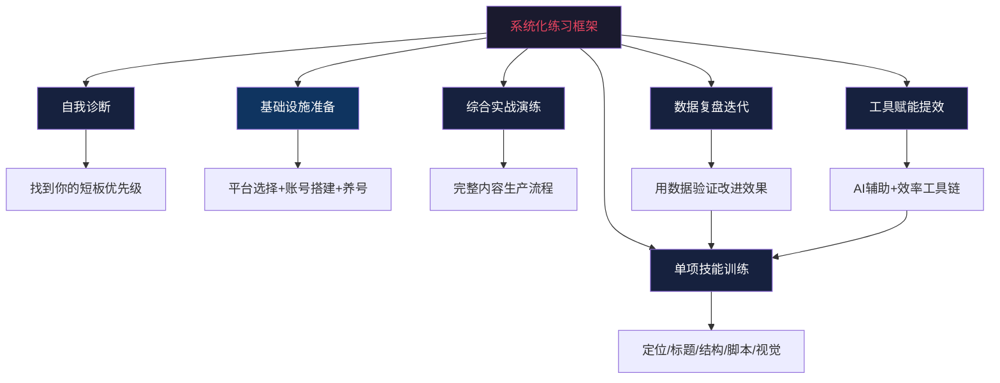
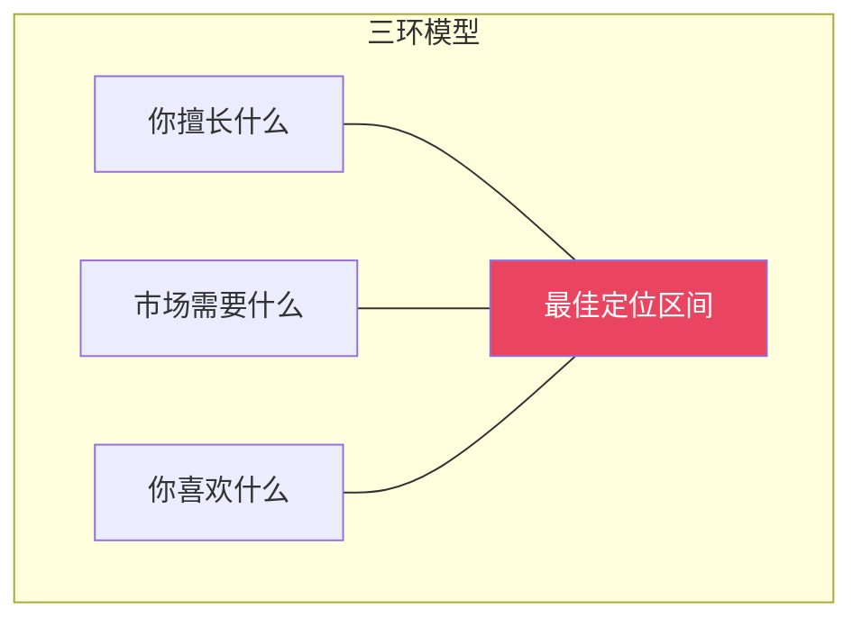
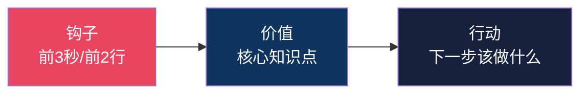
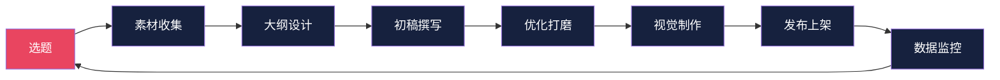
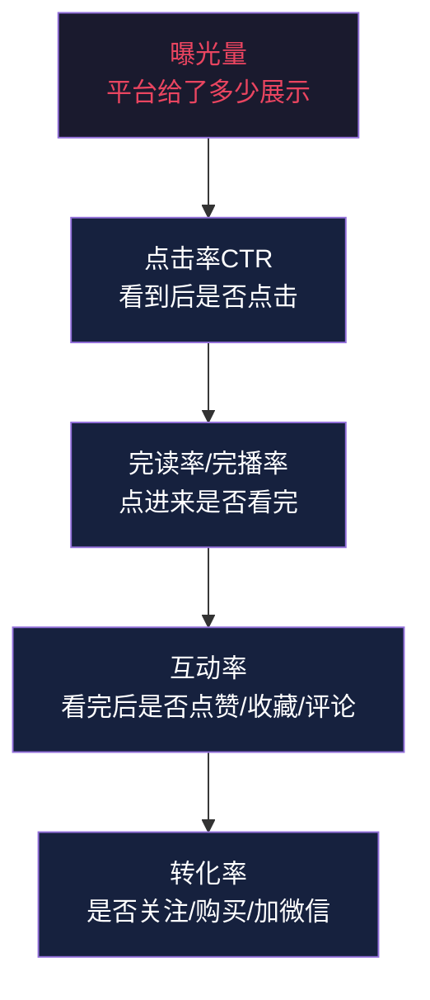
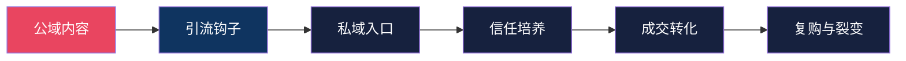
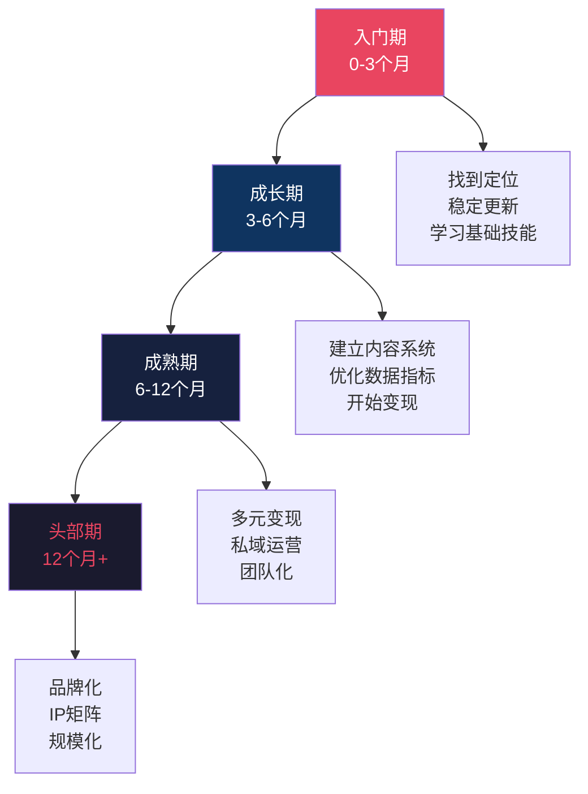

# 第09章 内容创作与社交媒体变现——练习方法

## 为什么需要系统化练习

内容创作是一门手艺，不是一门知识。你可以把本章前面所有理论背得滚瓜烂熟，但如果不动手做，你的内容能力不会有任何提升。这和学游泳是一个道理——看100本游泳教材，不如跳进水里扑腾一次。

但"练"和"有效练习"是两回事。很多创作者的问题不是不努力，而是陷入了低效重复：每天机械地发内容，不分析、不复盘、不迭代，做了3个月发现原地踏步。系统化练习的核心逻辑是**刻意练习**——不是重复做你会的事情，而是针对性地攻克你不会的环节。



### 刻意练习四要素

| 要素 | 说明 | 内容创作中的应用 | 常见错误 |
|------|------|-----------------|----------|
| 明确目标 | 每次练习有具体的能力目标 | "今天练标题"而非"今天发内容" | 目标太模糊，如"提升内容质量" |
| 专注投入 | 全神贯注于练习本身 | 关闭手机通知，设定30分钟专注时间 | 边写边刷消息，心流被打断 |
| 即时反馈 | 练习后立刻获得反馈 | 发布后24小时看数据，或找人点评 | 发了不看数据，永远不知道好不好 |
| 舒适区边缘 | 难度略高于当前水平 | 如果你擅长文字，尝试做一条视频 | 一直待在舒适区，能力不增长 |

刻意练习和普通练习的区别在于**针对性**。普通练习是"我今天发了一条内容"，刻意练习是"我今天专门练习了悬念式开头，并且记录了3种不同写法的数据表现"。前者像在操场上漫无目的地跑步，后者像在健身房针对特定肌群做组——效率差距5-10倍。

**反馈来源的三个层次**（由浅到深）：

1. **自我审查**：写完后隔2小时再读一遍，假装自己是第一次看到这篇内容的陌生人。你能在哪一行停住？在哪一行想划走？这个方法成本最低但容易有盲区。具体操作：把文字放到手机上阅读（换一个媒介暴露问题），或者大声朗读一遍（不通顺的地方立刻暴露）。
2. **同行互评**：找2-3个同样在做内容创作的朋友，建立互评机制。别人的视角能发现你自己看不到的问题。互评机制的关键是**要具体**——不要说"写得不错"或"感觉差点意思"，要说"第3段的案例和论点之间缺少过渡，读起来跳跃"。
3. **数据反馈**：发布后24小时、72小时、7天分别看数据。数据是最客观的"评委"——它不会讨好你，只会告诉你真相。24小时数据反映初始推荐效果，72小时数据反映内容的持续传播力（是否进入了更大的推荐池），7天数据反映长尾效应（搜索流量和收藏带来的后续阅读）。

### 练习前的能力自测

在开始练习之前，先对自己的能力做一个客观评估。以下是内容创作者的六大核心能力维度：

| 能力维度 | 初级表现 | 中级表现 | 高级表现 | 自测方法 |
|----------|----------|----------|----------|----------|
| 选题敏感度 | 能找到热门话题 | 能预判趋势话题 | 能创造话题 | 回顾你过去选的10个选题，有几个带来了超出预期的数据？ |
| 标题/封面能力 | 能写出通顺标题 | 能写出吸引点击的标题 | 稳定产出爆款标题 | 你的平均CTR是多少？能否稳定在平台健康值以上？ |
| 内容结构 | 能写完一篇文章 | 能设计有节奏的内容结构 | 能让读者从头看到尾 | 你的完读率/完读率是多少？ |
| 视觉呈现 | 能拍清楚照片 | 能做出好看的图/视频 | 有辨识度的视觉风格 | 你的封面是否有统一的视觉语言？ |
| 数据分析 | 会看后台数据 | 能从数据中发现规律 | 能用数据指导创作决策 | 你能否仅凭数据判断一条内容的问题出在哪个环节？ |
| 变现能力 | 不知道怎么赚钱 | 有1-2种变现渠道 | 收入稳定且多元 | 你的变现方式是否和内容定位匹配？ |

**自测方法**：回顾你过去30天发布的所有内容，对每个维度打分（1-10分），找出得分最低的2个维度，优先练习。

**自测结果的使用方式**：得分最低的2个维度决定你接下来30天的练习重点。比如你的"标题能力"只有3分但"内容结构"有7分，那你应该把70%的练习时间花在标题上，而不是继续打磨你已经不错的结构能力。**短板决定你的上限**——木桶效应在内容创作中尤为明显，因为平台推荐的漏斗模型意味着任何一个环节掉链子（标题不行、完读率不行、互动不行），都会导致后续环节的数据崩塌。

### 工具准备清单

在正式开始练习之前，确保你的"工具箱"已经就绪。工欲善其事，必先利其器——合适的工具能让你的练习效率提升2-3倍：

| 工具类别 | 推荐工具 | 用途 | 费用 |
|----------|----------|------|------|
| AI写作辅助 | ChatGPT / Claude / Kimi / 豆包 | 生成初稿、头脑风暴、文案润色 | 免费-付费 |
| AI图片生成 | Midjourney / 可灵AI / 即梦AI | 封面制作、配图生成 | 付费 |
| AI视频工具 | 剪映（AI功能）/ 可灵AI / Runway | 视频剪辑、字幕生成、特效 | 免费-付费 |
| 数据分析 | 各平台创作者后台 / 新红 / 蝉妈妈 | 查看内容数据、竞品分析 | 免费-付费 |
| 选题工具 | 小红书搜索联想 / 巨量算数 / 微信指数 | 选题热度验证、趋势判断 | 免费 |
| 内容管理 | Notion / 飞书文档 / 语雀 | 选题库管理、内容日历、素材收集 | 免费-付费 |
| 排版美化 | 135编辑器 / 秀米 / Canva | 公众号排版、海报制作 | 免费-付费 |
| 协作沟通 | 微信群 / 飞书群 | 同行互评、经验交流 | 免费 |

---

## 练习零：自我诊断与能力短板定位

### 为什么练习前必须先诊断

内容创作者最容易犯的错误是"哪块都练，哪块都不精"。每天既写标题又拍视频又分析数据，看起来很忙，实际上每项能力都只提升了表面。系统化练习的前提是**精准诊断**——先搞清楚你最弱的环节是什么，把有限的练习时间集中在短板上。

这就像看病一样：不做检查就开药，大概率吃错药。先做诊断，再开处方。

### 诊断工具：内容能力雷达图

用以下评估表对自己过去30天的内容做一次全面体检。每项1-10分，尽量客观——如果你不确定，把你的内容拿给3个朋友看，让他们打分取平均值：

```text
内容创作能力自诊表

评估日期：____
评估样本：过去30天发布的____条内容

一、选题能力（权重：20%）
1. 选题命中率：我的选题中有____%带来了超出预期的数据
   评分（1-10）：____
2. 选题多样性：我是否覆盖了多种选题类型（干货/故事/热点/互动）
   评分（1-10）：____
3. 趋势预判力：我是否有过提前布局某话题并获得流量的经历
   评分（1-10）：____
   小计：____/30

二、标题能力（权重：20%）
1. 平均CTR：我的内容平均CTR是____%
   评分标准：<1%=1分, 1-3%=3分, 3-5%=5分, 5-8%=7分, >8%=9分
   评分（1-10）：____
2. 标题公式运用：我是否能灵活运用3种以上标题公式
   评分（1-10）：____
3. A/B测试习惯：我是否有定期做标题A/B测试的习惯
   评分（1-10）：____
   小计：____/30

三、内容结构（权重：20%）
1. 平均完读率：我的内容平均完读率是____%
   评分标准：<15%=1分, 15-25%=3分, 25-35%=5分, 35-50%=7分, >50%=9分
   评分（1-10）：____
2. 开头质量：我的前3行/前5秒是否能有效抓住注意力
   评分（1-10）：____
3. 结构清晰度：我的内容是否有清晰的小标题分段和逻辑线
   评分（1-10）：____
   小计：____/30

四、视觉呈现（权重：15%）
1. 封面质量：我的封面是否足够吸引人点击
   评分（1-10）：____
2. 配图质量：我的配图是否有信息量，不只是装饰
   评分（1-10）：____
3. 视觉一致性：我的内容是否有统一的视觉风格
   评分（1-10）：____
   小计：____/30

五、数据分析（权重：15%）
1. 数据意识：我是否每条内容都会看数据
   评分（1-10）：____
2. 归因能力：我能判断一条内容的数据问题出在哪个环节吗
   评分（1-10）：____
3. 迭代能力：我能否根据数据反馈优化下一条内容
   评分（1-10）：____
   小计：____/30

六、变现能力（权重：10%）
1. 变现意识：我是否在内容中埋了变现钩子
   评分（1-10）：____
2. 变现路径：我是否有清晰的变现路径
   评分（1-10）：____
   小计：____/20

综合得分：____/170
各维度得分：选题____  标题____  结构____  视觉____  数据____  变现____

得分最低的维度：____ → 这是你接下来30天的重点练习方向
得分第二低的维度：____ → 这是你的次要练习方向
```

### 诊断后的练习规划

根据你的诊断结果，对照以下练习优先级表制定个人计划：

| 诊断结果 | 优先练习 | 每日时间分配 | 预期见效周期 |
|----------|----------|-------------|-------------|
| 选题得分最低 | 练习一（定位）+ 练习四（选题库） | 选题训练60% + 其他40% | 2-3周 |
| 标题得分最低 | 练习二（标题）重点突破 | 标题训练50% + 内容产出30% + 其他20% | 1-2周（标题见效最快） |
| 结构得分最低 | 练习三（结构）+ 大量拆解 | 结构拆解40% + 结构写作40% + 其他20% | 2-4周 |
| 视觉得分最低 | 封面/配图专项训练 | 视觉设计50% + 内容产出30% + 其他20% | 2-3周 |
| 数据得分最低 | 练习五（数据分析）+ 建立追踪系统 | 数据记录20% + 数据分析30% + 内容产出50% | 3-4周 |
| 变现得分最低 | 练习六（变现路径）+ 竞品变现拆解 | 变现研究30% + 内容产出50% + 其他20% | 4-8周（变现需要积累） |

---

## 练习一：内容定位确定

### 为什么定位是第一步

90%的内容创作者失败的原因不是内容质量差，而是定位模糊。定位模糊意味着：你不知道该写什么、不知道写给谁看、不知道和别人有什么不同。你的内容今天讲护肤明天讲职场，用户关注你之后发现信息混乱，最终取关。

定位的本质是**在用户心智中占据一个位置**。提到"健身"你想到某个博主，提到"穿搭"你想到另一个——这就是定位成功的标志。

定位不只是"选一个领域"那么简单。好的定位回答四个核心问题：你是谁？你为谁服务？你提供什么独特价值？你和同类博主有什么不同？这四个问题的答案，决定了你后续所有内容创作的方向。

### 定位三环模型



三个环的交集就是你的最佳定位区间：
- **擅长**：你有专业技能、独特经历或深度积累的领域
- **需要**：有足够多的人在搜索、关注这个话题
- **喜欢**：你能持续产出内容而不觉得痛苦（内容创作是长期的事，不喜欢坚持不了3个月）

**三环失衡时的取舍策略**：

| 情况 | 问题 | 解决方案 |
|------|------|----------|
| 擅长+喜欢，但市场不需要 | 你的爱好很小众 | 用"垂直细分+大众痛点"嫁接。比如你擅长手账，可以切入"职场效率提升" |
| 擅长+需要，但不喜欢 | 能赚钱但不想做 | 先用这个方向积累第一桶金，同时培养自己喜欢的第二方向 |
| 喜欢+需要，但不擅长 | 热情有余能力不足 | 边做边学，用"学习者视角"做内容——记录从0到1的成长过程本身就是好内容 |
| 三环都弱 | 没有明确方向 | 先花1个月广泛尝试3-5个方向，用数据和体感找到最有感觉的那个 |

### 练习步骤

**Step 1：盘点你的优势资产**

不要只写"我会什么"，要挖掘你的**差异化资产**。每个人都有别人没有的东西：

| 维度 | 具体问题 | 示例回答 | 评分(1-10) |
|------|----------|----------|------------|
| 专业技能 | 你的工作/专业中，哪些技能是别人不具备的？ | "我在四大会计师事务所做了5年审计" | |
| 独特经历 | 你经历过什么大多数人没经历过的事？ | "从体制内辞职创业，3年做到月入10万" | |
| 信息差 | 你知道哪些大多数人不知道的信息？ | "我在海外生活过5年，了解跨境购物内幕" | |
| 观察视角 | 你看问题的角度和别人有什么不同？ | "我是程序员，习惯用数据思维分析情感问题" | |
| 表达风格 | 你的表达方式有什么特点？ | "说话直接不绕弯，适合做吐槽类内容" | |
| 资源网络 | 你认识什么人、能接触到什么资源？ | "认识很多品牌方，能拿到内部价" | |

**Step 2：验证市场需求**

光有优势还不够，必须确认市场有人买单。以下是验证方法：

**搜索量验证**（免费方法）：
1. 在小红书搜索框输入你的领域关键词，看下拉联想词的数量和热度
2. 在抖音搜索框输入关键词，看相关话题的播放量
3. 在微信指数中查看关键词的搜索趋势
4. 在知乎搜索关键词，看问题的关注人数和回答数

**工具辅助验证**：
- **巨量算数**（trendinsight.oceanengine.com）：查看抖音关键词搜索趋势、关联词、人群画像
- **新红数据**（newred.com）：小红书关键词热度、笔记数据、达人排行
- **5118**（5118.com）：全网关键词搜索量、竞争度分析
- **百度指数**（index.baidu.com）：关键词搜索趋势、地域分布、人群属性

**竞争度验证**：
1. 搜索你的关键词，看排在前面的博主粉丝量级
2. 如果头部博主都在50万粉以上，说明赛道成熟但竞争激烈
3. 如果头部博主只有1-5万粉，说明赛道有空间但可能需求不足
4. 最理想的状态：头部博主10-50万粉，且近期有新账号快速起量

| 领域 | 小红书搜索热度 | 头部博主粉丝量 | 近期新号增速 | 竞争程度 | 机会评估 |
|------|---------------|---------------|-------------|----------|----------|
| 你选的领域1 | | | | | |
| 你选的领域2 | | | | | |
| 你选的领域3 | | | | | |

**Step 3：写出定位公式**

好的定位公式包含四个要素：**我是谁** + **为谁** + **提供什么** + **解决什么问题**

```text
定位公式："我是[身份标签]，为[目标人群]提供[内容类型]，帮助他们[解决的问题]。"
```

**反面案例**（模糊定位）：
- ❌ "我是小红书博主，分享生活日常"——太泛，没有辨识度
- ❌ "我是健身博主，分享健身知识"——太宽，和10万个博主一样

**正面案例**（清晰定位）：
- ✅ "我是前四大会计师，为职场新人提供理财入门内容，帮他们用最简单的方法从零开始存钱投资"
- ✅ "我是程序员转行的穿搭博主，为身高170以下的男生提供显高穿搭方案，帮他们找到适合亚洲矮个子的穿衣风格"
- ✅ "我是二胎妈妈，为0-3岁宝宝的父母提供早教游戏方案，帮他们在家用日常物品做早教，省下早教班费用"

**Step 4：验证定位可行性**

写出定位后，做一个"30秒电梯测试"——如果你在电梯里遇到一个目标用户，你能在30秒内让他明白你做什么、为什么要关注你吗？如果不能，说明定位还需要打磨。

**进阶验证方法**：用AI辅助验证定位的可行性。将你的定位公式输入ChatGPT或Kimi，让它从以下角度给出反馈：
1. 这个定位的目标人群有多大？
2. 这个领域目前的竞争格局如何？
3. 这个定位的变现潜力如何？
4. 有没有类似的已成功案例？
5. 这个定位最大的风险是什么？

AI不会替代你的判断，但能帮你发现思维盲区。

### 练习模板

```text
内容定位工作表

一、我的优势资产盘点
1. 专业技能：____________________
   独特之处：____________________
2. 独特经历：____________________
   能提供的价值：____________________
3. 信息差/资源：____________________
   目标人群是否需要：是/否

二、市场验证结果
- 小红书搜索热度：高/中/低
- 抖音相关话题播放量：____
- 头部博主粉丝量级：____
- 竞争程度：激烈/适中/蓝海
- 我的机会点：____________________

三、定位描述
"我是________________，为________________提供________________内容，
帮助他们________________。"

四、差异化策略
- 垂直细分：____________________（不是做"穿搭"，是做"矮个子男生穿搭"）
- 独特视角：____________________（不是"教你理财"，是"用程序员思维教你理财"）
- 个人风格：____________________（不是"搞笑博主"，是"用脱口秀方式讲知识"）

五、目标用户画像（越具体越好）
- 昵称：给他起一个名字，比如"小王"
- 年龄：____
- 职业：____________________
- 月收入：____________________
- 日常烦恼：____________________
- 刷手机时间：____________________
- 关注你之后最想获得：____________________

六、30秒电梯测试
用一句话说清楚你是谁、做什么、为什么值得关注：
"____________________"
```

### 常见定位误区

| 误区 | 为什么是错的 | 正确做法 |
|------|-------------|----------|
| "什么火做什么" | 没有积累，永远在追风口 | 选一个你能深耕3年的方向 |
| "我什么都会" | 什么都会=什么都不精 | 先聚焦一个细分领域做到头部 |
| "等我学好了再开始" | 永远准备不好 | 边做边学，从0开始记录成长过程也是好内容 |
| "这个赛道太卷了" | 有竞争说明有市场 | 找到差异化的切入角度 |
| "定位定了就不能改" | 定位可以迭代优化 | 先定一个方向跑30天，根据数据微调 |
| "模仿大博主就能成功" | 他的资源和时机你没有 | 学底层逻辑，做差异化执行 |
| "我是素人没有优势" | 素人视角本身就是差异化 | 记录从0到1的学习过程，"陪伴式成长"是有大量受众的内容类型 |

---

## 练习二：爆款标题训练

### 为什么标题决定80%的流量

数据不会说谎：同一个内容，换一个标题，阅读量可能相差10倍。这不是夸张——今日头条、小红书等平台的推荐算法高度依赖点击率（CTR），而标题是决定点击率的第一要素。用户在信息流中停留0.5秒就决定是否点击，这0.5秒里他看到的就是标题和封面。

标题写作不是灵感驱动的玄学，而是可以拆解、训练、优化的技术活。标题的底层逻辑是**制造信息缺口**——给用户一个"不点开就会错过"的理由。

### 标题公式库

以下是经过大量数据验证的标题公式，每个公式都附带底层心理学原理：

**公式一：数字+痛点+方案**

心理学原理：数字提供确定感，降低认知负担；痛点引发共鸣；方案给出预期。

```text
公式：[数字] + [痛点/场景] + [解决方案/结果]
示例：
- "5个让你月薪5000也能存下钱的理财习惯"
- "3个动作，每天10分钟，30天练出马甲线"
- "7个面试话术，让你拿到offer的概率翻倍"
```

**公式二：身份代入+具体场景**

心理学原理：身份标签让目标用户产生"这说的是我"的感觉，场景越具体代入感越强。

```text
公式：[身份标签] + [具体场景] + [价值/结果]
示例：
- "30岁还在月薪8000的人，一定要看这篇"
- "新手妈妈第一年，我踩过的12个坑"
- "应届生面试时千万别说这3句话"
```

**公式三：悬念+反转**

心理学原理：好奇心缺口——当你给出一个违反预期的信息，用户会产生"为什么"的好奇，必须点击才能获得满足。

```text
公式：[反常现象/违反预期] + [悬念]
示例：
- "月薪3000的我，一年存了10万（不是靠省）"
- "我辞掉了年薪50万的工作，反而过得更好了"
- "越努力越穷？因为你忽略了这个关键因素"
```

**公式四：对比+冲突**

心理学原理：对比制造冲突感，冲突引发情绪，情绪驱动点击。

```text
公式：[A vs B] + [出乎意料的结果]
示例：
- "985毕业和高中辍学，10年后谁更成功？答案出乎意料"
- "同样月薪1万，存钱的人和花钱的人，5年后差距有多大？"
- "每天跑5公里 vs 每天走1万步，哪个减肥效果更好？"
```

**公式五：权威背书+实用价值**

心理学原理：权威效应——人们倾向于信任有权威背书的信息；实用价值让人觉得"不看就亏了"。

```text
公式：[权威来源/数据] + [实用内容]
示例：
- "哈佛大学研究发现：成功人士都有这5个晨间习惯"
- "在投行工作10年，我总结的3条投资铁律"
- "医生朋友告诉我：这3种体检项目千万别省"
```

**公式六：时间节点+紧迫感**

心理学原理：损失厌恶——人们对"错过"的恐惧强于对"获得"的渴望。时间节点制造紧迫感，暗示现在不看就晚了。

```text
公式：[时间节点] + [紧迫信息]
示例：
- "2026年了还在用这种方式理财？难怪你存不下钱"
- "35岁前不做这3件事，以后会越来越难"
- "年底前必须完成的5项财务规划"
```

**公式七：否定常识+新方案**

心理学原理：认知冲突——当信息与已有认知产生冲突时，大脑会被迫重新评估，产生强烈的好奇心。

```text
公式：[否定常见做法] + [新方案]
示例：
- "别再记账了，这3个方法比记账有效100倍"
- "早起不一定高效，这种作息方式更适合夜猫子"
- "停止背单词，用这个方法3个月看懂英文原版书"
```

**公式八：利益前置+低门槛**（新增）

心理学原理：人们天然倾向于选择"低投入高回报"的事情。在标题中明确告诉用户"只需要花很少的时间/精力就能获得很大的好处"，点击率会显著提升。

```text
公式：[低门槛] + [高回报]
示例：
- "每天5分钟，这个习惯让我一年多赚了10万"
- "只需1个公式，解决90%的Excel问题"
- "不用节食不用运动，这个方法让我瘦了15斤"
```

**公式九：群体认同+归属感**（新增）

心理学原理：人是社会动物，天然渴望归属感。当标题明确指向某个群体时，该群体的成员会产生强烈的"这是写给我的"认同感。

```text
公式：[群体标签] + [群体特有痛点/话题] + [解决方案]
示例：
- "i人的社交自救指南：不尴尬也能交到朋友"
- "打工人必看：利用午休时间做出一桌菜的5个食谱"
- "农村出来的孩子，这几条财商课没人教你"
```

**公式十：反向筛选+品质暗示**（新增）

心理学原理：反向筛选制造"稀缺感"——不是所有人都能看，只有特定条件的人才需要。这种标题会让目标用户更想点，因为它暗示内容质量高、不是烂大街的东西。

```text
公式：[限定条件] + [价值内容]
示例：
- "这篇只写给月入不到1万的普通人，年薪百万请划走"
- "内行人才知道的5个护肤成分，大多数博主不会告诉你"
- "如果你能看完这篇不划走，说明你的内容审美已经超过90%的人"
```

### 实战训练：从标题到爆款的迭代过程

下面用一个真实案例展示标题优化的完整过程。

**原始内容主题**：教新手理财入门知识

| 迭代次数 | 标题 | 预估CTR | 问题分析 |
|----------|------|---------|----------|
| V1 | "理财入门知识分享" | 0.5% | 太泛、没有吸引力、没有情绪 |
| V2 | "新手理财必看指南" | 1.2% | 有目标人群但仍然太平淡 |
| V3 | "月薪5000的理财入门指南" | 2.5% | 加入收入标签，代入感增强 |
| V4 | "月薪5000，我是怎么一年存下3万的" | 4.8% | 第一人称+具体数字+结果，故事感出来了 |
| V5 | "月薪5000，一年存了3万：不是靠省，是靠这3个思维转变" | 6.2% | 增加悬念和认知冲突，暗示方法与众不同 |

**迭代过程中的关键转折点**：

- V1→V2：加了目标人群（新手），但仍然缺乏吸引力。**教训**：光有人群标签不够，还需要情绪触发。
- V2→V3：加了收入标签，让目标用户产生代入感。**发现**：数字是最强的注意力锚点。
- V3→V4：从"指南"变为"第一人称故事"，点击率几乎翻倍。**原理**：人对故事的兴趣远大于对知识的兴趣。
- V4→V5：加了"不是靠省"的认知冲突，暗示方法与众不同。**原理**：用户看到"存钱"会默认"省吃俭用"，否定这个默认假设会激发好奇心。

### 用AI辅助标题训练

AI可以成为你练习标题的"陪练"。以下是具体方法：

**AI头脑风暴法**：
1. 把你的内容主题输入ChatGPT/Kimi
2. 让它用10种标题公式分别生成5个标题变体（共50个）
3. 你从中挑选最有感觉的3-5个
4. 在这基础上用自己的风格改写、优化

**AI评估法**：
1. 写好标题后，让AI从吸引力、清晰度、价值感、情绪感、精准度五个维度打分
2. 让AI指出标题的薄弱环节并给出改进建议
3. 让AI生成同类主题的竞品标题做对比参考

**注意**：AI生成的标题通常过于"标准化"，缺少个人风格和情绪温度。正确用法是**用AI拓展思路，用你的判断力做最终选择**。

### 练习步骤

**Step 1：拆解爆款标题（至少拆解50个）**

在你的目标平台搜索领域关键词，找到点赞/收藏最高的50条内容，逐一分析：

```text
爆款标题拆解记录

标题：____________________
平台：____  数据：点赞____  收藏____  评论____

使用了哪种公式：____________________
关键词：____________________
情绪触发点：____________________
目标人群：____________________
我可以借鉴的点：____________________
```

**Step 2：批量练习（每个主题写10个标题）**

选取5个你领域的常见主题，每个主题写10个标题，共50个。要求：
- 每个标题至少使用一种公式
- 10个标题中至少使用3种不同的公式
- 写完后用下面的评估表打分

**Step 3：标题评估打分**

| 评估维度 | 评分标准 | 1-3分(差) | 4-6分(中) | 7-10分(好) |
|----------|----------|-----------|-----------|------------|
| 吸引力 | 能否在0.5秒内抓住注意力 | 完全无感 | 有点好奇 | 必须点开 |
| 清晰度 | 能否一眼看懂内容方向 | 不知道在说什么 | 大概知道 | 非常清楚 |
| 价值感 | 是否让人觉得"看了有收获" | 没感觉 | 有点用 | 不看就亏了 |
| 情绪感 | 是否能触发情绪（好奇/焦虑/共鸣） | 无情绪 | 轻微触动 | 强烈共鸣 |
| 精准度 | 是否精准命中目标人群 | 谁都可以看 | 大概对口 | "这说的就是我" |

**Step 4：A/B测试**

选择你认为最好的3个标题，实际发布测试：
- 同一个内容，用不同的标题在不同时间发布（间隔至少48小时）
- 记录每个标题的实际点击率、互动率
- 找出你判断和实际数据之间的差距
- 总结规律：哪种公式在你的领域效果最好

**Step 5：建立个人标题公式库**

经过30天的练习后，你应该能总结出一套属于自己的标题公式库：

```text
我的标题公式库

效果最好的公式TOP3：
1. [公式名称]：____________________
   适用场景：____________________
   平均CTR：____
   典型示例：____________________

2. [公式名称]：____________________
   ...

3. [公式名称]：____________________
   ...

效果最差的公式（在我的领域不适用）：
1. ____________ 原因：____________________
```

### 练习模板

```text
标题练习工作表

一、爆款拆解（至少50个）
[前10个示例]
1. 标题：____________________ | 公式类型：____ | 数据：赞____藏____
2. 标题：____________________ | 公式类型：____ | 数据：赞____藏____
...

二、批量创作（每个主题10个）
主题1：____________________
  1. ____________________（公式：____）
  2. ____________________（公式：____）
  ...

三、A/B测试记录
测试1：标题A ____________ vs 标题B ____________
发布平台：____
标题A数据：阅读____  CTR____  互动率____
标题B数据：阅读____  CTR____  互动率____
胜出：____ 原因：____________________

四、我的标题公式总结
在我的领域，效果最好的标题公式是：____________________
我最擅长的标题类型：____________________
我需要继续练习的类型：____________________
```

---

## 练习三：内容结构设计

### 为什么结构比内容更重要

你可能见过这样的情况：两个博主写了同一个主题，信息量差不多，但一个阅读量是另一个的10倍。区别往往不在内容本身，而在**内容的组织方式**。

好的结构像一条滑梯——用户从标题"滑"进来，顺着你设计好的路径一路读到底，中间不跳出。差的结构像一个迷宫——用户进来之后不知道重点在哪，看了两行就退出了。

**结构的底层逻辑**是**认知负荷管理**。人的工作记忆一次只能处理4-7个信息单元。好的结构通过分段、标题、视觉引导，降低每个单元的认知负荷，让用户不需要"努力"就能读下去。差的结构让用户的大脑一直处于"我该看哪里"的困惑中，最终选择退出。

### 五种经典内容结构

**结构一：钩子-价值-行动（HVA结构）**

适用场景：干货教程、知识分享



- **钩子**（10%篇幅）：用痛点、数据、故事或冲突抓住注意力
- **价值**（70%篇幅）：提供实质性的信息、方法、步骤
- **行动**（20%篇幅）：告诉读者下一步该做什么，引导互动

**钩子的六种写法**：
1. **数据钩子**："90%的人不知道，你每天喝的水里可能含有……"
2. **痛点钩子**："为什么你每天加班到11点，存款还是不到5位数？"
3. **故事钩子**："上周我朋友小李做了一件事，让我彻底改变了对理财的看法……"
4. **反常识钩子**："早起读书其实是最差的自我提升方式。"
5. **悬念钩子**："我在大厂工作了5年，发现了一个所有人都忽略的规律……"
6. **共鸣钩子**："你是不是也有过这种感觉——明明很努力，但就是看不到进步？"

**结构二：故事弧线结构**

适用场景：个人经历、案例分享、观点输出

```text
起（背景铺垫）→ 承（矛盾/冲突出现）→ 转（转折/关键事件）→ 合（结果+感悟）
```

故事弧线的核心是**冲突**。没有冲突的故事不是故事，是流水账。冲突可以是：理想vs现实、你vs困难、旧认知vs新发现。

**故事结构的进阶技巧**：
- **嵌入钩子**：在"起"的阶段就暗示后面有反转，让用户产生期待
- **节奏控制**：起（20%）→ 承（30%）→ 转（30%）→ 合（20%），不要在"起"花太多篇幅
- **金句收尾**：合的部分一定要有"感悟金句"，这是最容易被收藏和转发的部分
- **细节真实感**：加入具体的时间、地点、数字、对话，增强可信度

**结构三：清单体结构**

适用场景：合集推荐、技巧汇总、工具盘点

```text
主题引入（为什么需要这份清单）
→ 第1项 + 说明 + 使用场景
→ 第2项 + 说明 + 使用场景
→ ...
→ 总结 + 购买/使用建议
```

清单体的关键是**每一项都要有实质内容**，不能只列名字。好的清单体每一项都包含：是什么、为什么好、适合什么场景。

**清单体的高级写法**：
- **分层递进**：按照从入门到高阶排列，让不同水平的读者都能找到自己的位置
- **对比维度**：每一项用相同的维度评价（价格、难度、效果），方便读者横向对比
- **个人使用痕迹**：加入"我自己用过之后的真实体验"，比客观介绍更有说服力
- **避坑提醒**：每项末尾加一个"注意事项"或"不适合谁"，体现专业度

**结构四：对比分析结构**

适用场景：产品测评、方案对比、观点PK

| 结构部分 | 内容 | 占比 |
|----------|------|------|
| 引入 | 为什么要做这个对比，对比什么 | 10% |
| 背景介绍 | 对比对象的基本信息 | 15% |
| 维度对比 | 从多个维度逐一分析 | 50% |
| 综合评价 | 各自优缺点总结 | 15% |
| 建议 | 什么人适合选A，什么人适合选B | 10% |

**结构五：问题-解答结构（Q&A）**

适用场景：常见问题解答、评论区精选、知乎回答

```text
直接给出核心答案（前2行必须有结论）
→ 为什么是这个答案（论证逻辑）
→ 具体怎么做（步骤/方法）
→ 常见追问（预判用户下一步问题）
→ 个人经验佐证
```

这种结构的关键是**先给答案再展开论证**。用户来搜索问题，最不耐烦的就是看了500字还不知道答案是什么。

### 不同平台的内容结构要求

| 平台 | 内容形式 | 结构特点 | 关键要素 | 视频/图文比例建议 |
|------|----------|----------|----------|-------------------|
| 小红书 | 图文/短视频 | 前3张图决定生死 | 封面图 > 标题 > 正文 > 标签 | 图文为主，视频辅助 |
| 抖音 | 短视频 | 前3秒决定完播率 | 开头钩子 > 节奏紧凑 > 结尾反转 | 纯视频 |
| 公众号 | 长图文 | 前3行决定是否继续读 | 标题 > 开头金句 > 小标题分段 > 金句收尾 | 图文为主 |
| B站 | 中长视频 | 前30秒决定是否看完 | 封面 > 开头悬念 > 内容密度 > 弹幕互动点 | 视频为主 |
| 知乎 | 问答/文章 | 前2行决定是否展开 | 直接给答案 > 展开论证 > 个人经验佐证 | 图文为主 |
| YouTube | 中长视频 | 前15秒决定观看意向 | Hook > 内容 > CTA | 视频为主 |

### 练习步骤

**Step 1：拆解优秀内容的结构（至少拆解20篇）**

找到你领域内数据最好的20篇内容，逐篇分析结构：

```text
结构拆解记录

内容标题：____________________
平台：____  数据：阅读____  互动____

结构类型：钩子-价值-行动 / 故事弧线 / 清单体 / 对比分析 / Q&A / 其他
开头（钩子）：____________________
中间（主体）：
  段落1：____________________
  段落2：____________________
  段落3：____________________
结尾（行动引导）：____________________
总字数/时长：____________________

我的评价：
- 亮点：____________________
- 可改进：____________________
- 我能借鉴的点：____________________
```

**Step 2：练习设计3种不同结构的内容大纲**

选一个你领域的主题，分别用3种不同的结构设计大纲：

```text
主题：____________________

大纲A（钩子-价值-行动结构）：
- 钩子：____________________
- 核心价值点1：____________________
- 核心价值点2：____________________
- 核心价值点3：____________________
- 行动引导：____________________

大纲B（故事弧线结构）：
- 背景：____________________
- 冲突：____________________
- 转折：____________________
- 结果+感悟：____________________

大纲C（清单体结构）：
- 引入：____________________
- 第1项：____________________
- 第2项：____________________
- 第3项：____________________
- ...
- 总结建议：____________________
```

**Step 3：完成一篇完整内容并请人点评**

选择你认为最好的大纲，写出完整内容，然后：
1. 自己读一遍，检查是否有"读着读着想退出"的地方
2. 找3个目标用户阅读，记录他们在哪里停顿、在哪里想退出
3. 根据反馈修改结构

**Step 4：用AI辅助结构优化**

将你的内容初稿输入AI，让它从以下角度给出反馈：
1. 开头是否在3秒/3行内抓住注意力？
2. 中间部分是否有"想退出"的风险点？
3. 信息密度是否合适（太稀或太密都不好）？
4. 结尾是否有行动引导？
5. 整体结构是否流畅，有无逻辑断裂？

---

## 练习四：视频内容制作专项训练

### 为什么视频是必修课

短视频是当前流量最大的内容形式。2025年抖音日活超过7亿，小红书视频笔记的平均互动量是图文笔记的1.5倍以上。即使你的主要平台是图文型（如公众号、知乎），掌握视频制作能力也能让你的内容触达更多人。

很多创作者对视频有恐惧心理——觉得自己不会剪辑、不会口播、不敢出镜。这些技能和写作一样，都是可以通过系统练习掌握的。关键在于**把视频制作拆解为可训练的子技能**，逐个攻克。

### 视频制作的子技能拆解

| 子技能 | 初级水平 | 中级水平 | 高级水平 | 训练方法 |
|--------|----------|----------|----------|----------|
| 脚本写作 | 能把文章改成口播稿 | 能设计有节奏的脚本 | 能写出有"网感"的脚本 | 拆解100个爆款视频的脚本结构 |
| 口播表达 | 说话流利不卡壳 | 有感染力和节奏感 | 形成辨识度的表达风格 | 每天对着镜头练3分钟 |
| 画面构图 | 能拍清楚 | 构图有美感 | 有个人视觉风格 | 学习基础构图法则并练习 |
| 剪辑节奏 | 能剪掉废片 | 节奏紧凑有起伏 | 用剪辑讲故事 | 每天剪1条60秒短视频 |
| 封面设计 | 能做出封面 | 封面能吸引点击 | 封面有辨识度 | 每周做3张封面，对比数据 |
| BGM选择 | 有背景音乐 | 音乐和内容匹配 | 用音乐增强情绪 | 分析爆款视频的音乐选择 |

### 脚本写作训练

**短视频脚本的黄金结构**（适用于60秒以内的视频）：

```text
0-3秒：钩子（必须让观众停下来）
  → 用痛点、悬念、反常识或视觉冲击
3-15秒：问题定义（明确告诉观众"你要解决什么问题"）
  → 让目标观众确认"这和我有关"
15-45秒：核心内容（提供实质信息）
  → 每10秒一个信息点，节奏紧凑
45-60秒：总结+行动引导
  → 一句话总结 + 引导点赞/收藏/关注
```

**中长视频脚本结构**（适用于3-10分钟的视频）：

```text
0-15秒：强力钩子（预告一个精彩结果或悬念）
15秒-1分钟：背景铺垫（为什么这个话题重要）
1-4分钟：核心内容（分3-5个要点展开，每个要点配案例）
4-5分钟：总结回顾 + 个人感悟
最后30秒：行动引导 + 预告下期内容
```

**脚本写作练习步骤**：
1. 选一个你领域的热门话题
2. 用上面的模板写出60秒口播脚本
3. 对着镜头录一遍，计时看是否超时
4. 修改脚本，删除所有"嗯""啊""那个"等口语赘词
5. 再录一遍，对比两次的表现

### 口播表达训练

口播的核心不是"表演"，而是**和镜头后面的那个人聊天**。很多人口播不自然，是因为把镜头当成了"观众"而不是"朋友"。

**每日3分钟口播练习法**：
- 每天固定时间，面对手机前置摄像头，说3分钟
- 话题不限：可以是今天发生的事、你对某个新闻的看法、你学到的一个知识点
- 关键要求：**只录一遍，不重录**——这个练习的目的是训练你的"一次性表达"能力
- 每周末回看本周的5条练习视频，观察自己的进步

**口播表达的关键技巧**：
1. **语速控制**：开头稍快（制造紧迫感），中间正常，重点处放慢（强调关键信息）
2. **眼神管理**：看镜头=看观众的眼睛。不要看屏幕里的自己，看镜头的小圆点
3. **手势使用**：说到数字时用手指比划，说到对比时用双手分开表示
4. **情绪表达**：兴奋的地方声音提高，严肃的地方声音降低——情绪的起伏是防止观众划走的关键
5. **停顿技巧**：在重要信息前停顿0.5秒，制造悬念感。"这个方法我用了之后……（停顿）……一个月多赚了5000块"

### 剪辑节奏训练

剪辑不是"把不要的片段删掉"那么简单。好的剪辑是在**控制观众的注意力节奏**——哪里快、哪里慢、哪里停顿、哪里加速。

**剪辑练习的"三刀法"**：
1. **第一刀：内容刀**——删掉所有不提供信息的片段（废话、重复、口误）
2. **第二刀：节奏刀**——在信息点之间做快速切换，避免长时间同一画面
3. **第三刀：情绪刀**——在重要信息处加字幕特效、音效、画面放大

**推荐剪辑工具**：
- **入门**：剪映（免费、AI功能强大、模板丰富）
- **进阶**：Final Cut Pro / Premiere Pro（更精细的控制）
- **手机端**：剪映APP / CapCut（海外版剪映）

### 练习步骤

**Step 1：拆解10个爆款视频的脚本**

找到你领域内数据最好的10个短视频，逐个拆解：
- 把视频逐字听写出来（或用AI工具自动生成字幕）
- 分析脚本结构：钩子是什么？核心信息有几个？怎么收尾的？
- 标记"让你想继续看"的转折点在哪里

**Step 2：写5个脚本并录制**

选择5个你领域的常见问题，各写一个60秒脚本，然后录制：
- 第1个脚本：模仿拆解过的爆款结构
- 第2-3个脚本：尝试不同的开头钩子
- 第4-5个脚本：尝试不同的表达风格

**Step 3：剪辑并发布**

将5条视频剪辑完成，选择最好的2条发布。记录：
- 发布前的自我评分（1-10）
- 发布后的数据表现（播放量、完播率、互动率）
- 自我评分和实际数据是否匹配

---

## 练习五：内容日历与生产系统

### 为什么需要生产系统

很多创作者的问题不是"不会写"，而是"写不下去"。他们凭灵感创作——有灵感就写，没灵感就不写，更新频率极不稳定，算法也因此不给推荐。

稳定更新是获得平台推荐的基本条件。算法的核心逻辑是：**你给平台持续提供好内容，平台给你持续提供流量**。三天打鱼两天晒网的创作者，算法不会浪费推荐位给你。

内容日历不是限制你的创作自由，而是帮你建立**可持续的生产节奏**。有了系统，你不需要每天想"今天写什么"，而是按计划执行，把精力集中在"怎么写好"上。

### 生产系统的核心公式

```text
稳定产出 = 充足选题库 + 标准化流程 + 合理的时间管理 + 防崩机制
```

**防崩机制**：提前准备3-5篇"储备内容"。当你某天实在没时间或没状态时，直接用储备内容发布，保持更新节奏不中断。储备内容应该是"常青型"选题——不依赖热点、不会过时的内容。

### 选题库构建方法

内容日历的基础是一个充足的选题库。以下是选题的七大来源：

| 来源 | 方法 | 产出量 | 质量 |
|------|------|--------|------|
| 用户需求挖掘 | 在小红书/知乎搜索领域关键词，看"大家都在搜什么" | 高 | 高 |
| 竞品分析 | 关注领域内Top20博主，看他们什么内容数据好 | 中 | 高 |
| 热点追踪 | 用微博热搜/抖音热榜，找到和你领域相关的热点 | 中 | 中 |
| 自身经历 | 你的日常工作、学习、踩坑经历 | 低 | 高 |
| 评论区挖掘 | 从你自己和竞品的评论区找用户的真实问题 | 高 | 高 |
| 行业报告 | 艾瑞/QuestMobile等行业报告中的数据和趋势 | 低 | 高 |
| 跨领域迁移 | 把其他领域的方法论迁移到你的领域 | 中 | 中 |
| AI辅助生成 | 用ChatGPT/Kimi根据你的定位批量生成选题 | 高 | 中 |

**选题评估矩阵**：

不是所有选题都值得做。用这个矩阵评估每个选题：

| 评估维度 | 高(3分) | 中(2分) | 低(1分) |
|----------|---------|---------|---------|
| 用户需求强度 | 很多人在搜/问 | 有人关注 | 很少人关心 |
| 我的专业度 | 我是专家 | 我有经验 | 我只是了解 |
| 内容稀缺性 | 市面上很少有人写 | 有一些但质量一般 | 已经写烂了 |
| 变现潜力 | 能直接带货/引流 | 间接相关 | 纯娱乐 |
| 生产难度 | 我能轻松产出 | 需要一些准备 | 需要大量时间和资源 |

**评分 ≥ 12分**：优先制作
**评分 9-11分**：列入备选
**评分 < 9分**：放弃或等条件成熟再做

### 生产流程标准化

将内容生产拆解为可重复的标准流程，每个环节有明确的输入和输出：



| 环节 | 时间占比 | 具体工作 | 产出物 | AI可辅助的部分 |
|------|----------|----------|--------|---------------|
| 选题 | 10% | 从选题库中挑选，确定角度 | 选题确认单 | AI生成选题变体、验证热度 |
| 素材收集 | 15% | 搜索资料、数据、案例、图片 | 素材文档 | AI搜索总结、数据整理 |
| 大纲设计 | 15% | 确定结构、逻辑、重点 | 内容大纲 | AI提供结构建议 |
| 初稿撰写 | 30% | 按大纲完成初稿 | 完整初稿 | AI生成初稿框架（需大幅改写） |
| 优化打磨 | 15% | 检查逻辑、润色文字、补充案例 | 终稿 | AI润色文字、检查逻辑 |
| 视觉制作 | 10% | 制作封面、配图、视频 | 视觉素材 | AI生成图片、自动字幕 |
| 发布 | 5% | 写标题、标签、选择发布时间 | 已发布内容 | AI生成标签建议 |

**时间管理技巧**：
- **批量处理**：不要一条内容从头做到尾，而是批量做同一步骤。比如周日批量选题、周一批量写大纲、周二批量写初稿。
- **碎片时间利用**：通勤路上听行业播客找灵感、午休时回复评论区、等人时用手机写大纲。
- **番茄工作法**：每25分钟专注一个环节，休息5分钟。4个番茄钟后休息15-30分钟。

### 练习步骤

**Step 1：建立选题库（至少50个选题）**

```text
选题库

一、用户需求挖掘选题（至少15个）
[在小红书搜索框输入领域关键词，把下拉联想词全部记录下来]
1. ____________________ | 需求强度：高/中/低 | 评分：__
2. ____________________ | 需求强度：高/中/低 | 评分：__
...

二、竞品分析选题（至少15个）
[关注领域Top20博主，记录他们数据最好的内容主题]
1. ____________________ | 来源博主：____ | 数据：赞____
2. ____________________ | 来源博主：____ | 数据：赞____
...

三、自身经历选题（至少10个）
1. ____________________ | 专业度：高/中/低
...

四、热点追踪选题（至少10个）
1. ____________________ | 热度：____ | 时效性：____
...
```

**Step 2：制定4周内容日历**

```text
第1周计划
周一：小红书图文 | 主题：____ | 结构类型：____ | 状态：__
周三：小红书图文 | 主题：____ | 结构类型：____ | 状态：__
周五：抖音短视频 | 主题：____ | 时长：____秒 | 状态：__

第2周计划
...

[持续4周，每周至少3条内容]
```

**Step 3：执行并记录**

```text
生产日志

日期：____
内容主题：____________________
各环节用时：
- 选题：____分钟
- 素材：____分钟
- 大纲：____分钟
- 初稿：____分钟
- 打磨：____分钟
- 视觉：____分钟
- 发布：____分钟
总计：____分钟

遇到的问题：____________________
下次改进：____________________
```

---

## 练习六：数据分析与迭代优化

### 为什么数据是内容创作的指南针

"我觉得这个内容很好"——这是内容创作者最危险的一句话。你觉得好不重要，用户觉得好才重要。而用户"觉得好"不会告诉你，只会用行为数据表达：点击、读完、点赞、收藏、评论、转发。

数据分析不是事后看看数字，而是**建立一个反馈闭环**：发布→观察数据→分析原因→优化下一条→再观察数据。每一轮循环，你的内容能力就提升一个台阶。

### 核心数据指标解读

不同指标反映用户行为的不同阶段，理解每个指标的含义才能精准优化：



| 指标 | 计算方式 | 健康值 | 低于健康值说明什么 | 优化方向 |
|------|----------|--------|-------------------|----------|
| 点击率（CTR） | 点击数/曝光数 | 小红书 > 5%，抖音 > 3% | 标题/封面没有吸引力 | 优化标题和封面 |
| 完读率 | 读完人数/点击人数 | 图文 > 30%，视频 > 40% | 内容不够吸引人，或太长 | 优化开头钩子，精简内容 |
| 互动率 | 互动数/阅读数 | > 3% | 内容缺乏共鸣或行动号召 | 增加互动引导，增强共鸣 |
| 收藏率 | 收藏数/阅读数 | > 2% | 内容不够"有用" | 增加实用干货和工具性内容 |
| 涨粉率 | 新增粉丝/阅读数 | > 1% | 内容好但没有关注理由 | 强化人设，增加关注引导 |
| 5秒完播率 | 看满5秒的人/开始播放的人 | > 50% | 开头没有吸引力 | 优化前5秒的钩子 |
| 平均观看时长 | 总观看时长/播放次数 | 越接近视频总时长越好 | 中间部分流失严重 | 优化内容节奏，减少拖沓 |

### 数据分析的正确方法

**错误做法**：只看总量，不看结构。"这条内容有1万阅读量，还不错"——但你不知道这1万是怎么来的，也就无法复制。

**正确做法**：拆解到每个环节，找到瓶颈。

```text
案例分析

内容A：《新手理财的5个误区》
- 曝光量：50,000
- 点击量：2,500（CTR = 5%）✅ 正常
- 完读量：500（完读率 = 20%）⚠️ 偏低
- 互动量：75（互动率 = 3%）✅ 正常

诊断：标题和封面没问题（CTR正常），但内容读到一半用户就跑了（完读率低）。
原因分析：可能是内容结构有问题，中间部分太啰嗦或偏离主题。
优化方向：精简中间内容，增加小标题分段，提高信息密度。
```

**诊断决策树**：

```text
CTR低 → 标题/封面问题
  → 标题是否使用了公式？ → 否 → 使用标题公式重写
  → 标题已优化但CTR仍低 → 封面问题 → 优化封面图
  → 标题+封面都优化了仍低 → 选题问题 → 换选题方向

完读率低 → 内容问题
  → 开头5秒/前3行是否有钩子？ → 否 → 增加开头钩子
  → 开头有钩子但完读率低 → 中间内容拖沓 → 精简内容、增加分段
  → 全程都很紧凑但完读率低 → 内容太长 → 缩短篇幅或拆分为系列

互动率低 → 共鸣/引导问题
  → 内容是否有情绪触发点？ → 否 → 增加共鸣点、痛点、故事
  → 有共鸣但互动低 → 缺少互动引导 → 增加"你觉得呢？""评论区说说"等引导
  → 有引导但互动低 → 内容和用户关系弱 → 加强人设，让内容更"像朋友说话"
```

### 数据工具推荐

| 工具 | 功能 | 适用平台 | 费用 |
|------|------|----------|------|
| 平台创作者后台 | 基础数据查看 | 所有平台 | 免费 |
| 新红数据 | 小红书数据分析、达人排行 | 小红书 | 付费 |
| 蝉妈妈 | 抖音数据分析、直播分析 | 抖音 | 付费 |
| 飞瓜数据 | 多平台内容分析 | 抖音/快手/小红书 | 付费 |
| 巨量算数 | 抖音搜索趋势、热点分析 | 抖音 | 免费 |
| 新榜 | 全平台内容生态数据 | 多平台 | 付费 |
| Google Analytics | YouTube/独立站数据 | YouTube/独立站 | 免费 |

### 练习步骤

**Step 1：建立数据追踪表**

```text
内容数据追踪表

| 日期 | 平台 | 标题 | 曝光 | 点击 | CTR | 阅读 | 完读 | 完读率 | 点赞 | 收藏 | 评论 | 转发 | 互动率 | 涨粉 |
|------|------|------|------|------|-----|------|------|--------|------|------|------|------|--------|------|
|      |      |      |      |      |     |      |      |        |      |      |      |      |        |      |
```

**Step 2：每周数据复盘**

每周日花30分钟，做以下分析：

```text
每周数据复盘

分析周期：____月____日 至 ____月____日
本周发布内容数：____条

一、数据总览
- 总曝光：____
- 总阅读/播放：____
- 总互动：____
- 新增粉丝：____

二、TOP3内容分析（为什么好）
1. 标题：____________________
   数据亮点：CTR____  完读率____  互动率____
   成功原因：____________________
   可复制的点：____________________

2. ...

三、BOTTOM3内容分析（为什么差）
1. 标题：____________________
   数据问题：CTR____  完读率____  互动率____
   失败原因：____________________
   下次如何避免：____________________

四、发现的规律
- 什么类型选题数据好：____________________
- 什么类型标题CTR高：____________________
- 什么时间段发布效果好：____________________
- 什么内容结构完读率高：____________________

五、下周优化方向
1. ____________________
2. ____________________
3. ____________________
```

**Step 3：AB测试训练**

AB测试是内容优化的核心方法——控制变量，只改变一个因素，观察数据变化。

```text
AB测试记录

测试目的：验证[标题类型A] vs [标题类型B]哪个CTR更高
控制变量：同一主题、同一封面、同一发布时间（间隔48h以上）
自变量：标题

版本A：
- 标题：____________________
- 发布时间：____
- 数据：曝光____  点击____  CTR____

版本B：
- 标题：____________________
- 发布时间：____
- 数据：曝光____  点击____  CTR____

结论：____________________
可推广的规律：____________________
```

可测试的变量包括：标题风格、封面风格、内容长度、发布时间、内容结构、话题标签等。每次只测一个变量，积累足够多的测试结果后，你就能建立一套属于自己的"内容公式"。

**AB测试的统计学注意事项**：
- **样本量**：每个版本至少需要1000次曝光才能得出有意义的结论。低于这个数字，波动太大。
- **时间控制**：两个版本的发布时间应该在同一时段（如都是工作日晚上8点），否则时间差异会干扰结果。
- **单一变量**：每次只改变一个因素。如果你同时改了标题和封面，你不知道是哪个因素导致了数据变化。
- **重复验证**：一个结论至少需要3次AB测试验证才能确认，单次测试可能受偶然因素影响。

---

## 练习七：变现路径设计

### 为什么变现要尽早规划

很多创作者的误区是"先涨粉，以后再想变现"。结果涨到10万粉才发现：粉丝画像不精准、内容调性不适合带货、没有私域承接能力。变现不是涨粉之后才考虑的事，而是从定位阶段就要想清楚的。

不同变现方式对粉丝量、粉丝质量、内容类型的要求完全不同。如果你的目标是做知识付费，那你从第一天就应该输出专业深度内容，吸引高净值用户；如果你的目标是带货，那你应该从第一天就做种草类内容，培养用户的购买习惯。

### 六大变现模式详解

| 变现模式 | 门槛 | 收入天花板 | 适合阶段 | 核心要求 | 启动成本 |
|----------|------|-----------|----------|----------|----------|
| 平台广告分成 | 低（1000粉即可开通） | 低 | 起步期 | 稳定更新、播放量 | 0 |
| 品牌广告合作 | 中（通常1万粉起） | 中 | 成长期 | 粉丝画像精准、内容质量好 | 0 |
| 带货佣金 | 低 | 中 | 起步期 | 选品能力、信任感 | 0-少量 |
| 知识付费 | 高（需要专业积累） | 高 | 成熟期 | 专业度、用户信任 | 工具费用 |
| 私域服务 | 中 | 高 | 成长期 | 引流能力、服务能力 | 运营成本 |
| 自有品牌 | 高 | 极高 | 成熟期 | 品牌运营能力、供应链 | 较高 |

### 变现路径规划矩阵

根据你当前的阶段，选择最适合的变现方式组合：

| 你的阶段 | 粉丝量 | 推荐变现组合 | 月收入预期 |
|----------|--------|-------------|-----------|
| 起步期 | 0-1万 | 平台分成 + 小额带货 | 0-2000元 |
| 成长期 | 1-10万 | 广告合作 + 带货 + 开始做私域 | 2000-2万元 |
| 成熟期 | 10-50万 | 广告 + 带货 + 知识付费 + 私域 | 2万-10万元 |
| 头部期 | 50万+ | 全模式 + 自有品牌 | 10万+ |

### 变现能力的练习方法

变现不是等粉丝多了自然就会的事，它需要专门的练习：

**练习A：定价能力**
- 研究你领域内10个已变现博主的产品定价
- 分析他们的定价逻辑（成本+价值+竞品参考）
- 练习为自己的虚拟产品（课程、资料包、咨询）定价

**练习B：销售文案能力**
- 拆解5个你购买过的产品的销售页面/朋友圈文案
- 分析它们的说服逻辑（痛点→方案→信任→行动）
- 为自己的产品写3版销售文案

**练习C：谈判能力**
- 模拟品牌方找你合作的场景，练习报价和谈判话术
- 了解行业报价标准（通常按粉丝数×0.03-0.1元/条）
- 练习拒绝不合适的合作（保护粉丝信任比短期收入更重要）

### 练习步骤

**Step 1：评估当前状态**

```text
现状评估

平台：____________________
粉丝数：____
平均阅读/播放量：____
互动率：____
内容更新频率：____条/周
当前月收入：____元

粉丝画像：
- 性别比例：男____% 女____%
- 年龄分布：____________________
- 地域分布：____________________
- 消费能力：高/中/低
- 最关心的话题：____________________
```

**Step 2：设计分阶段变现路径**

```text
变现路径规划

当前阶段（0-3个月）：
- 目标粉丝：____
- 主要变现方式：____________________
- 收入目标：____元/月
- 需要做的准备：____________________

成长阶段（3-6个月）：
- 目标粉丝：____
- 新增变现方式：____________________
- 收入目标：____元/月
- 需要做的准备：____________________

成熟阶段（6-12个月）：
- 目标粉丝：____
- 完整变现矩阵：____________________
- 收入目标：____元/月
- 需要做的准备：____________________
```

**Step 3：为第一个变现目标制定详细行动计划**

```text
第一个变现目标行动计划

变现方式：____________________
目标：____个月内实现____元/月收入

需要完成的前置条件：
1. ____________________
2. ____________________
3. ____________________

每周具体行动：
- 第1周：____________________
- 第2周：____________________
- 第3周：____________________
- 第4周：____________________

衡量标准：____________________
```

---

## 练习八：私域沉淀与用户运营

### 为什么一定要做私域

公域流量是"借来的"——平台随时可以调整算法，让你的曝光量腰斩。2023年小红书多次调整推荐算法，很多博主的阅读量一夜之间下降60%以上。私域流量是"自己的"——微信好友、社群成员、付费用户，你可以随时触达他们，不受平台算法影响。

**公域是流量入口，私域是利润中心。** 你的内容在公域获取流量，但真正赚钱的地方是私域——因为私域用户信任度更高、复购率更高、客单价更高。

**核心数据对比**：

| 指标 | 公域用户 | 私域用户 | 差距 |
|------|----------|----------|------|
| 信任度 | 低（刚看到你的内容） | 高（长期接触建立信任） | 3-5倍 |
| 转化率 | 1-3% | 10-30% | 5-10倍 |
| 客单价 | 取决于品类 | 通常高于公域 | 2-3倍 |
| 复购率 | 低（看完就走） | 高（持续触达） | 5-10倍 |
| 获取成本 | 越来越贵（平台算法变动） | 基本为零（已有好友关系） | 趋近于零 |

### 私域沉淀路径设计



**引流钩子设计原则**：用户加你微信/进你社群的动力，一定是你能给他一个**立刻有价值**的东西。"关注我获取更多干货"不是钩子，是废话。

| 钩子类型 | 示例 | 适合领域 | 设计要点 |
|----------|------|----------|----------|
| 资料包 | "回复'理财'领取新手理财工具包" | 知识类 | 资料包要有实质内容，至少20页以上 |
| 免费课程 | "进群免费听3天训练营" | 教育类 | 课程质量要高于预期，建立信任 |
| 打卡社群 | "加入30天健身打卡群" | 健身/习惯养成 | 社群要有运营节奏，不能建了就放着 |
| 独家优惠 | "加微信领专属折扣码" | 电商带货 | 折扣要有真实力度，不能是套路 |
| 1对1咨询 | "免费帮你做一次xxx诊断" | 专业服务 | 咨询要有标准化流程，控制时间成本 |
| 工具/模板 | "回复'模板'领取我自用的内容日历模板" | 效率/工具类 | 模板要好用，用完还想找你要更多 |

### 私域运营SOP

| 时间 | 动作 | 内容示例 | 目的 |
|------|------|----------|------|
| 每天早上 | 朋友圈 | 分享一条干货/日常/思考 | 保持存在感 |
| 每天中午 | 社群互动 | 回答问题、发起话题 | 维护活跃度 |
| 每周三 | 价值输出 | 分享一篇深度文章/视频 | 建立专业度 |
| 每周五 | 互动活动 | 小抽奖/问答/投票 | 提高参与感 |
| 每月1次 | 产品推荐 | 推荐一个你真正用过的好物 | 变现 |
| 每季度1次 | 大型活动 | 直播/训练营/线下聚会 | 深度连接 |

**朋友圈内容的"三三制"原则**：
- 1/3 干货价值内容（知识分享、行业洞察、实用技巧）
- 1/3 个人生活内容（日常、感悟、真实的一面）
- 1/3 产品/服务推荐（变现内容，但要真实、有节制）

**社群活跃度维护的关键动作**：
1. **新人欢迎仪式**：每个新人入群，发一段欢迎语+自我介绍模板
2. **每日话题**：每天抛出一个和领域相关的话题，引导讨论
3. **精华整理**：每周整理群内精华问答，发布到公域引流
4. **淘汰机制**：定期清理长期不活跃的成员，保持社群质量

### 练习步骤

**Step 1：设计引流钩子**

```text
引流钩子设计

我的目标用户最需要的是：____________________
我能提供的一份免费高价值资源：____________________
钩子文案："____________________"
引流话术："____________________"
```

**Step 2：搭建私域运营框架**

```text
私域运营方案

载体选择：微信个人号 / 微信社群 / 企业微信 / 知识星球
选择原因：____________________

每日运营计划：
- 早上（____点）：____________________
- 中午（____点）：____________________
- 晚上（____点）：____________________

每周运营计划：
- 周一：____________________
- 周三：____________________
- 周五：____________________

每月运营计划：
- 第1周：____________________
- 第3周：____________________
```

**Step 3：设计转化路径**

```text
转化路径设计

用户旅程：
看到公域内容 → ____________________ → 加入私域 → ____________________ → 第一次付费

第一次付费产品：
- 产品：____________________
- 定价：____元
- 交付方式：____________________

复购产品：
- 产品：____________________
- 定价：____元
- 复购理由：____________________
```

---

## 练习九：内容复用与效率提升

### 为什么要一鱼多吃

很多创作者的痛点是"每天都要产出新内容，根本忙不过来"。解决方案不是加班加点，而是**学会内容复用**——一份核心素材，适配不同平台和形式，实现"一鱼多吃"。

内容复用不是简单的复制粘贴，而是根据每个平台的特点重新适配。一份3000字的公众号长文，可以拆解为5条小红书笔记、3条抖音脚本、1组知乎回答。

### 内容复用矩阵

| 原始内容形式 | 小红书 | 抖音 | 公众号 | B站 | 知乎 | YouTube |
|-------------|--------|------|--------|-----|------|---------|
| 3000字长文 | 拆为5条图文笔记 | 精华为1条口播视频 | 原文发布 | 配图为视频讲解 | 改写为回答 | 翻译/配音为英文视频 |
| 10分钟视频 | 截取3个高光片段为短视频 | 剪为1条60秒精华 | 整理为文字稿 | 原视频发布 | 关键观点改写 | 上传原视频+英文字幕 |
| 一场直播 | 精华片段10条 | 精华片段5条 | 总结文章1篇 | 录播剪辑 | Q&A整理 | 精华片段+英文配音 |
| 一个系列课程 | 每节课拆3条笔记 | 核心知识点短视频 | 系列文章 | 完整课程上传 | 回答相关问题 | 英文版课程 |

### AI辅助内容复用的工作流

AI可以大幅加速内容复用的过程。以下是经过验证的工作流：

**Step 1**：将原始内容输入AI，让它提取3-5个核心知识点
**Step 2**：让AI为每个知识点生成不同平台的适配版本
**Step 3**：你审核、修改、注入个人风格
**Step 4**：用AI生成配图建议或直接生成配图
**Step 5**：发布并记录数据

**注意事项**：
- AI生成的多平台版本通常"正确但无趣"，你必须注入自己的表达风格
- 每个平台的"方言"不同——小红书要口语化、公众号要深度、抖音要直接、知乎要专业
- 不要同一天在所有平台发同一内容，错开1-3天发布

### 练习步骤

**Step 1：选取一篇优质内容，完成全平台适配**

```text
内容复用练习

原始内容：____________________
原始形式：图文 / 视频 / 直播
原始平台：____________________

适配方案：
1. 小红书：
   - 形式：____________________
   - 标题：____________________
   - 核心信息（精简到100字以内）：____________________

2. 抖音：
   - 形式：____________________
   - 时长：____秒
   - 开头钩子：____________________
   - 核心要点（3个以内）：____________________

3. 公众号/知乎：
   - 形式：____________________
   - 改写角度：____________________
   - 差异化内容：____________________
```

**Step 2：建立内容素材库**

```text
素材库分类

一、金句库（你写过的/看到的好句子）
1. ____________________ | 适用场景：____
2. ____________________ | 适用场景：____

二、案例库（你经历的/看到的真实案例）
1. ____________________ | 适用主题：____
2. ____________________ | 适用主题：____

三、数据库（你收集的行业数据/研究）
1. ____________________ | 来源：____ | 适用主题：____
2. ____________________ | 来源：____ | 适用主题：____

四、图片/视频素材库
1. ____________________ | 类型：____ | 适用场景：____
```

**素材库管理工具推荐**：
- **Notion数据库**：最灵活，支持多视图、标签、关联
- **飞书多维表格**：团队协作友好，支持自动化
- **Eagle**：图片/视频素材管理，支持颜色搜索、标签分类
- **Flomo**：轻量级卡片笔记，适合随时记录灵感

### 灵感捕捉系统

素材库是"有组织的知识"，灵感捕捉系统是"无组织的直觉"。很多好想法出现在你走路、洗澡、发呆的时候，如果不在30秒内记录下来，它们就会消失。

**灵感捕捉的"三秒法则"**：从灵感出现到记录完成，不超过3秒。这意味着你需要一个**随时可用**的记录工具。

**推荐方案**：
1. **微信"文件传输助手"**：手机端随时可用，零门槛
2. **Flomo小组件**：iOS/Android桌面小组件，一键记录
3. **语音备忘录**：开车/走路时用语音记录，之后再整理

**灵感整理节奏**：
- 每天晚上花5分钟，把当天的灵感记录整理到素材库
- 每周日花15分钟，把本周的灵感按主题归类
- 每月底花30分钟，从灵感库中筛选出可以做成内容的点子

---

## 综合实战：21天内容创作挑战

理论学完了，现在来一次完整的实战检验。以下是21天的内容创作挑战，每一天都有明确的任务：

| 天数 | 任务 | 对应练习 | 预计用时 |
|------|------|----------|----------|
| D1 | 完成能力自诊表 + 内容定位工作表 | 练习零+一 | 3小时 |
| D2 | 拆解20个爆款标题 | 练习二 | 1.5小时 |
| D3 | 为5个主题各写10个标题（共50个） | 练习二 | 2小时 |
| D4 | 拆解10篇优秀内容的结构 | 练习三 | 1.5小时 |
| D5 | 完成第1篇内容（图文或视频脚本） | 练习三 | 3小时 |
| D6 | 发布第1篇内容，记录数据 | 练习六 | 0.5小时 |
| D7 | 建立选题库（至少30个选题） | 练习五 | 2小时 |
| D8 | 制定4周内容日历 | 练习五 | 1小时 |
| D9 | 完成第2篇内容 | 综合 | 2小时 |
| D10 | 发布第2篇，分析第1篇数据 | 练习六 | 1小时 |
| D11 | 完成第3篇内容 | 综合 | 2小时 |
| D12 | 发布第3篇，做AB测试 | 练习六 | 1小时 |
| D13 | 设计引流钩子和私域方案 | 练习八 | 1.5小时 |
| D14 | 完成第4篇内容 | 综合 | 2小时 |
| D15 | 发布第4篇，第一次数据复盘 | 练习六 | 1小时 |
| D16 | 完成第5篇内容，尝试新结构 | 练习三 | 2小时 |
| D17 | 发布第5篇，做内容复用 | 练习九 | 1.5小时 |
| D18 | 设计变现路径 | 练习七 | 1.5小时 |
| D19 | 完成第6篇内容 | 综合 | 2小时 |
| D20 | 发布第6篇，完整数据复盘 | 练习六 | 1.5小时 |
| D21 | 总结21天收获，制定下一阶段计划 | 全部 | 2小时 |

### 21天挑战完成检查清单

```text
□ 已完成能力自诊表，找到2个短板维度
□ 已完成内容定位
□ 已拆解50个爆款标题
□ 已拆解10篇优秀内容结构
□ 已建立30+选题库
□ 已制定4周内容日历
□ 已发布6条以上内容
□ 已完成至少1次数据复盘
□ 已完成至少1次AB测试
□ 已设计引流钩子
□ 已设计私域运营方案
□ 已制定变现路径
□ 已完成内容复用练习
□ 已建立灵感捕捉系统
□ 已建立个人标题公式库（至少3个公式）
```

---

## 练习中的常见误区

### 误区一：追求完美再发布

**表现**：总觉得内容还不够好，反复修改就是不发布，一篇内容改了两周还没发。

**真相**：完成比完美更重要。你永远等不到"完美"的那一天。先发布，用数据告诉你哪里需要改进，比你闭门造车效率高10倍。

**纠正方法**：给自己设定deadline——一篇内容从构思到发布不超过48小时。到时间了，不管觉得好不好，都发出去。

### 误区二：只看粉丝数不看互动率

**表现**：每天盯着粉丝数，涨粉就开心，掉粉就焦虑。

**真相**：10万粉丝但互动率0.5%，不如1万粉丝但互动率5%。互动率才是内容质量和粉丝精准度的真实反映，也是品牌方选择合作的核心指标。

**纠正方法**：把关注重点从"粉丝数"转移到"互动率"和"完读率"上。互动率>3%的内容，说明你找对了方向。

### 误区三：盲目模仿头部博主

**表现**：看到某个大博主的视频风格火了，就完全照搬他的风格。

**真相**：头部博主能用某种风格成功，是因为那个风格和他的人设、能力、资源匹配。直接照搬，你的条件和他不同，效果大概率不好。

**纠正方法**：学习头部博主的**底层逻辑**（为什么这样设计），而不是表面形式（具体怎么做的）。然后结合自己的特点，做出差异化的版本。

### 误区四：忽视评论区的价值

**表现**：发完内容就不管了，不回复评论，不分析评论内容。

**真相**：评论区是你了解用户真实需求的金矿。用户的提问、吐槽、赞美，都在告诉你他们想要什么。很多爆款选题就是从评论区挖掘出来的。

**纠正方法**：每条内容发布后的24小时内，回复所有评论。每周整理一次评论区，把有价值的问题记录到选题库。

### 误区五：数据样本太小就下结论

**表现**：发了3条内容，发现视频数据比图文好，就决定以后全做视频。

**真相**：3条内容的数据波动太大，不能代表趋势。可能只是视频那条恰好蹭上了热点，或者发布时间更好。

**纠正方法**：至少积累20条同类内容的数据，才能得出有意义的结论。在数据量不足时，保持多种内容形式的尝试。

### 误区六：过度依赖AI丧失原创性

**表现**：所有内容都让AI生成，自己不做任何修改就发布。结果内容千篇一律，没有个人风格。

**真相**：AI生成的内容是"平均水平"——它不会出错，也不会出彩。当所有人都用AI写内容时，有个人风格、真实情感、独特洞察的内容才是稀缺品。

**纠正方法**：用AI作为**辅助工具**而非**替代品**。正确的工作流是：AI生成初稿框架 → 你注入个人观点和风格 → AI润色文字 → 你最终审核。你的角色是"导演"，AI是"编剧"。

### 误区七：练习时只做自己擅长的

**表现**：擅长写文字就只写文字，擅长拍视频就只拍视频，从不尝试新的内容形式。

**真相**：只做擅长的事情，你永远停留在舒适区。刻意练习的核心是**挑战不会的环节**。你不尝试视频，就永远不知道视频能带来什么增量。

**纠正方法**：每个月至少花1周时间练习你最不擅长的内容形式。即使做得不好，这个过程也会提升你对内容的整体理解。

### 误区八：孤军奋战不懂借力

**表现**：一个人埋头创作，不和同行交流，不参加社群，不寻求反馈。

**真相**：内容创作虽然表面看是一个人的事，但成长最快的方式是**和同行者一起进步**。同行互评能发现你的盲区，社群交流能带来新灵感，合作联动能互相借力增长。

**纠正方法**：加入1-2个你领域的创作者社群，或者自己建一个3-5人的互评小组。每周至少做一次内容互评。

### 误区九：没有持续学习输入

**表现**：一直在"输出"内容，但很少"输入"新的知识、观点、案例。做了半年发现，能写的东西都写完了，开始重复自己。

**真相**：内容创作是"输出型"工作，但输出的质量取决于输入的深度和广度。没有持续输入，你的内容迟早会枯竭。

**纠正方法**：建立"输入-输出"的平衡系统。每天至少花30分钟做输入——阅读行业资讯、观看优质内容、学习新技能。把输入中发现的好素材、好观点、好案例记录到素材库中。

---

## 练习中的心理建设

### 面对冷启动期的心态管理

0-1000粉是最难的阶段。你发布了内容，但阅读量只有几十，点赞个位数，评论为零。这个阶段大多数人都会放弃。

**冷启动期的心理建设**：
1. **重新定义"成功"**：这个阶段的成功不是阅读量，而是"发布了"和"坚持了"。每多发一条，你就多了一次练习机会。
2. **降低期待**：不要期望前30条内容有任何数据反馈。把前30条当作"学费"，你的目标是"交完学费"而不是"赚到钱"。
3. **找小确幸**：哪怕只有一条评论、一个点赞，那也是真实的人在回应你。珍惜每一个互动。
4. **记录成长**：每周记录你的进步——写作速度变快了？标题写得更好了？结构更清晰了？这些都是肉眼可见的成长。

### 面对数据焦虑的应对策略

**数据焦虑的症状**：每隔10分钟刷新一次后台数据、发布后坐立不安、看到数据不好就心情低落。

**应对方法**：
1. **设定固定查看时间**：每天只在固定时间查看数据（如晚上9点），其他时间关闭后台通知。
2. **关注趋势而非单点**：不要为单条内容的数据波动焦虑，关注周/月的趋势变化。
3. **数据归因而非情绪化**：数据不好时，问"为什么"而不是"怎么办"。归因到具体环节（标题？内容？发布时间？），然后针对性优化。
4. **接受随机性**：即使用同样的方法，不同内容的数据也会有很大差异。这是平台算法的随机性决定的，不是你的问题。

### 面对创作瓶颈的突破方法

**创作瓶颈的表现**：不知道写什么、写出来的东西自己都不满意、觉得已经在重复自己。

**突破方法**：
1. **换一个输入源**：如果你一直在看同类型的内容，你的思维会被框住。去看完全不同领域的优质内容，找灵感。
2. **回到用户身边**：去评论区、社群、私信里看用户在问什么。用户的痛点是永远不会枯竭的选题来源。
3. **降低标准**：瓶颈期不要追求"爆款"，追求"完成"。发一条60分的内容，比不发好100倍。
4. **休息一下**：有时候瓶颈就是大脑在告诉你"需要充电了"。休息1-2天，做点和创作无关的事，灵感会自然回来。

---

## 练习总结与进阶路径

### 练习清单总览

| 序号 | 练习名称 | 核心能力 | 预计用时 | 优先级 |
|------|----------|----------|----------|--------|
| 零 | 自我诊断与能力短板定位 | 自我认知 | 1小时 | 最高 |
| 一 | 内容定位确定 | 选题敏感度 | 2小时 | 最高 |
| 二 | 爆款标题训练 | 标题能力 | 3.5小时 | 高 |
| 三 | 内容结构设计 | 结构能力 | 4小时 | 高 |
| 四 | 视频内容制作专项训练 | 视频能力 | 5小时 | 高 |
| 五 | 内容日历与生产系统 | 执行力 | 3小时 | 高 |
| 六 | 数据分析与迭代优化 | 分析能力 | 持续进行 | 最高 |
| 七 | 变现路径设计 | 商业思维 | 2小时 | 中 |
| 八 | 私域沉淀与用户运营 | 运营能力 | 3小时 | 中 |
| 九 | 内容复用与效率提升 | 效率能力 | 2小时 | 中 |

### 进阶路径



| 阶段 | 核心目标 | 关键练习 | 标志性成果 |
|------|----------|----------|-----------|
| 入门期 | 找到定位，稳定更新 | 练习零、一、二、三 | 发布30条内容，确定方向 |
| 成长期 | 数据优化，开始变现 | 练习四、五、六 | 单条内容稳定破千阅读，月入过千 |
| 成熟期 | 多元变现，私域运营 | 练习七、八、九 | 月收入稳定过万，有稳定的私域用户池 |
| 头部期 | 品牌化，规模化 | 全部练习的进阶版 | 团队化运营，多平台矩阵 |

### 每个阶段的"毕业标准"

| 阶段 | 毕业标准 | 未达标时的建议 |
|------|----------|---------------|
| 入门期 | 能在2小时内完成一条高质量内容；标题CTR稳定在平台健康值以上；完读率>30% | 继续练习基础功，不要急于进入下一阶段 |
| 成长期 | 能稳定每周发布3条以上内容；互动率>3%；有明确的变现路径并开始执行 | 优化内容质量和发布节奏，强化数据分析能力 |
| 成熟期 | 月收入稳定过万；私域用户>500人；有2种以上变现渠道 | 加强私域运营，拓展变现渠道 |
| 头部期 | 有团队支持运营；多平台矩阵运营；品牌合作稳定 | 考虑IP矩阵化、品牌化发展 |

### 给练习者的三条建议

**第一，先做30天再说。** 不要一上来就规划"我未来一年的内容战略"，先把眼前30天的内容做好。30天足够你验证定位、建立节奏、看到第一批数据反馈。

**第二，找到你的同行者。** 一个人练习很容易放弃。找2-3个同样在做内容创作的朋友，建一个小群，每天互相点评内容、分享数据、交流心得。同行者的存在会让你的坚持率提高3倍以上。

**第三，永远记住内容创作的初心。** 你做内容的目的是为用户提供价值——帮助他们解决问题、获得知识、得到快乐。变现是价值交换的自然结果，而不是目的本身。当你把注意力放在"怎么帮到更多人"而不是"怎么赚更多钱"上，好的结果会自然到来。
