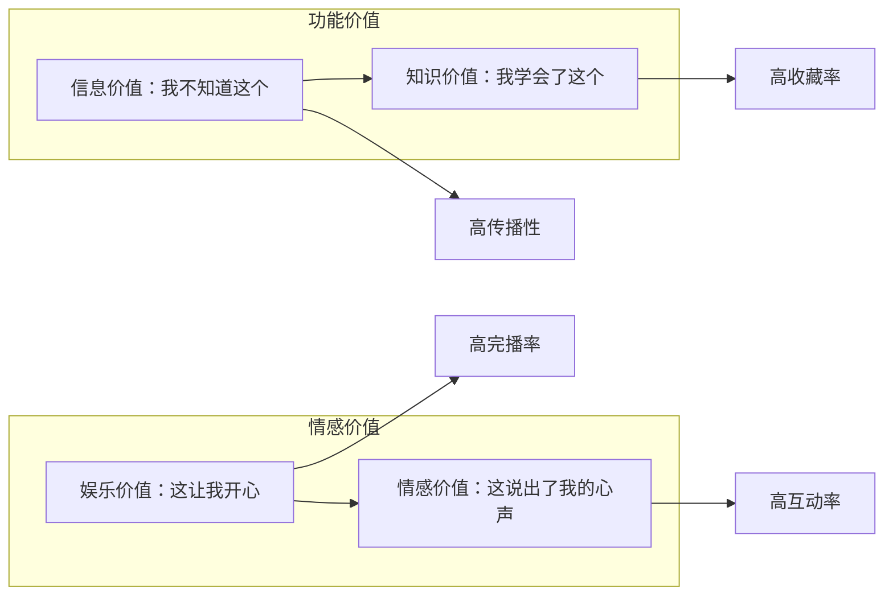
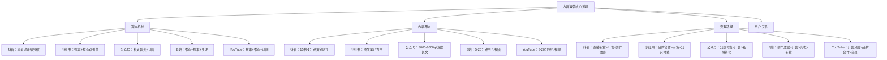
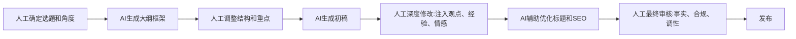
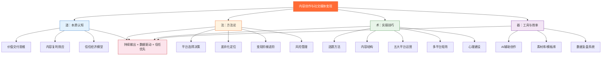
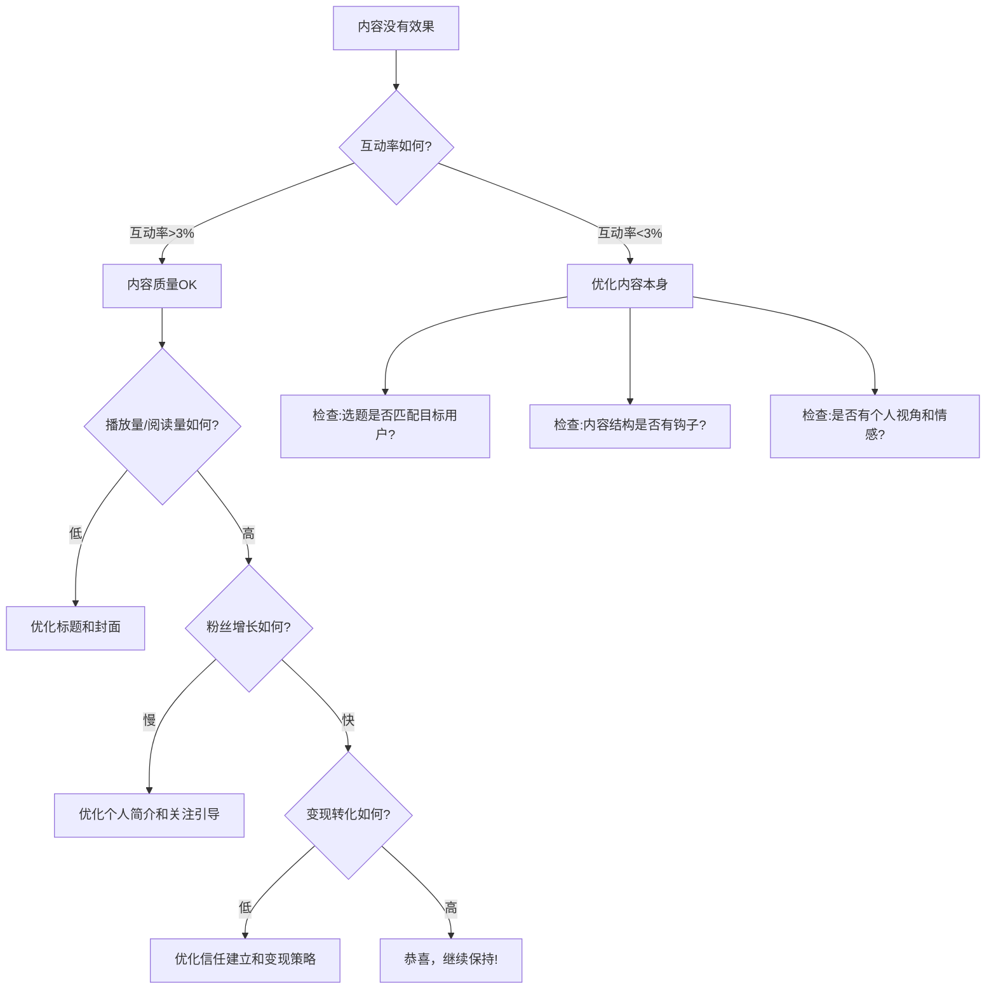

# 第09章 内容创作与社交媒体变现——本章小结

本章37篇内容从理论到实操，搭建了一套内容创作与变现的完整体系。这个小结不是简单的内容罗列——而是帮你把碎片化的知识压缩成一套可以随时调用的思维框架。

读到这里，你可能已经对某些概念有印象，但让你立刻说出"内容复利的本质是什么"或"选题的黄金法则是什么"，未必能脱口而出。这很正常。37篇内容的信息密度很高，人脑不是硬盘，不可能一次性全部内化。本章小结的作用，就是帮你把最重要的认知节点钉在脑子里。

以下按"道法术器"四个维度展开，每个维度先给核心结论，再展开关键细节，最后给实操检验标准。

---

## 一、道：内容创作的本质认知

### 1.1 从"自我表达"到"价值交付"的思维跃迁

本章理论基础篇的核心论点可以用一句话概括：**内容创作的本质是将知识、经验、技能封装成可传播的信息产品，通过平台分发获取流量，再将流量转化为收入。**

这句话听起来像废话，但它区分了两种完全不同的创作者——

| 思维模式 | 内容特征 | 用户反应 | 长期结果 |
|----------|----------|----------|----------|
| 自我表达型 | "我想说什么" | 偶尔共鸣，多数无感 | 增长缓慢，变现困难 |
| 价值交付型 | "用户需要什么" | 持续获得价值 | 粘性高，变现自然 |
| 价值交付+个人风格 | "我擅长的×用户需要的" | 信任+依赖 | 个人品牌形成，护城河深 |

大多数人卡在第一层。他们的内容是日记——记录自己的生活、想法、情绪，然后期待别人来关注。偶尔遇到和自己想法一致的人，会获得一些互动，但这本质上是概率事件，不可复制。

第三层才是可持续的模式。你找到自己擅长且热爱的领域中，用户存在未被满足需求的那个交集点，然后持续在这个点上输出。用户因为你的内容获得了实际价值（学到东西、解决了问题、获得了情绪支持），于是形成信任，信任产生复购和推荐。

**检验标准**：随机抽取你最近发布的10条内容，逐条问自己："如果一个完全不认识我的人看到这条内容，他会获得什么具体价值？"如果超过一半答不上来，说明你还在第一层。

### 1.2 内容的四种价值类型

内容价值可以拆成四个象限，这是判断一条内容是否值得创作的基础框架：

**关键洞察**：爆款内容几乎总是同时满足两种以上价值类型。举个具体例子——一条教人做红烧肉的短视频，如果只有步骤演示（纯知识价值），数据通常一般。但如果制作者在过程中加入幽默吐槽（娱乐价值），结尾来一句"给加班回家的老公做的，他一口气吃了三碗饭"（情感价值），完播率和互动率会显著提升。平台算法看到这些指标好，会把内容推给更多人，形成正循环。

这不是玄学，而是平台推荐机制的底层逻辑——算法通过互动率和完播率来判断内容质量，而多重价值类型正是提升这两个指标的最有效手段。

**检验标准**：写完一条内容后，用这个框架给它打标签。如果只命中一个象限，考虑如何在不改变核心内容的前提下叠加第二个象限。

### 1.3 内容复利效应的底层逻辑

"内容复利"这个词被用滥了，但它背后的经济学原理值得认真理解——

**边际成本趋近于零**。一条视频制作完成后，被1个人观看和被100万人观看的额外分发成本几乎为零。这意味着内容创作的收入曲线不是线性的，而是指数型的——前期投入大、回报小，后期投入小、回报大。这和开餐馆完全不同（每多服务一个客人都需要食材和人工），也和做咨询完全不同（每小时只能服务一个客户）。

**长尾效应**。一篇优质文章发布后，通过搜索引擎和平台推荐，可以在数月甚至数年内持续获取流量。YouTube创作者经济报告指出，频道前100条视频的累计播放量往往不到最终总播放量的5%——你今天创作的内容，95%的价值将在未来释放。这不是鼓励你"先发了再说"，而是说优质内容的回报周期比大多数人想象的要长得多。

**资产积累**。每一条内容都是你的数字资产。100条优质内容构成一个内容矩阵，这个矩阵本身就是变现的基础。有些创作者一条爆款赚了几万块，然后因为没有内容矩阵承接流量，粉丝来了又走，等于白忙一场。反过来，有些创作者没有特别突出的爆款，但100条内容每条都能带来稳定的搜索流量，加起来月收入反而更高。

这就是"持续输出"比"偶尔爆款"更重要的底层原因——你在积累资产，不是在赌运气。

**检验标准**：打开你的账号后台，看最近30天的流量来源。如果超过80%来自最近一周发布的内容，说明你的内容没有形成长尾效应，老内容的价值没有被释放出来。检查一下是否缺少搜索关键词优化、是否内容主题过于分散导致平台无法精准推荐。

### 1.4 信任经济模型：变现的真正货币

很多创作者把变现理解为"流量→钱"的直接转化，这是一个危险的简化。实际上，变现的真实路径是：

**流量 → 信任 → 转化 → 复购 → 推荐**

信任是中间不可跳过的核心环节。信任的建立遵循一个公式：

**信任 = 专业度 × 一致性 × 时间 × 透明度**

- **专业度**：你在内容中展示的专业知识和解决问题的能力。不是自封"专家"，而是用内容证明你是专家。
- **一致性**：你的内容质量、更新频率、价值观是否稳定。用户关注一个博主，本质上是购买了一个"预期"——预期你的下一条内容仍然有价值。如果质量忽高忽低，预期不稳定，信任就建立不起来。
- **时间**：信任无法速成。心理学研究表明，人类对一个陌生人的信任建立需要至少6-8次正面互动。对一个内容创作者来说，这意味着用户至少需要消费你6-8条高质量内容后，才会产生"这个人靠谱"的判断。
- **透明度**：你是否坦诚自己的局限性、是否公开自己的创作过程、是否承认错误。过度包装的"完美人设"反而会降低信任——因为用户本能地不信任看起来太好的东西。

**信任崩塌的速度是建立速度的10倍以上**。一条质量低劣的广告、一次人设翻车、一个被揭穿的虚假数据，可能毁掉数月甚至数年积累的信任。这就是为什么"急于变现"是创作者最常见的致命错误——信任的积累需要耐心，但信任的毁灭只需一秒。

**检验标准**：问自己——如果我现在推荐一个付费产品，我的粉丝中有多少人会因为"你推荐的"就下单？如果这个比例低于5%，说明信任积累还不够，需要继续输出价值。

---

## 二、法：平台选择与内容定位的方法论

### 2.1 平台选择的核心决策框架

平台选择不是"哪个好做就做哪个"。本章覆盖了五大主流平台，但选平台本质上是一个基于三个变量的决策——

**变量一：你的内容形式偏好**

| 擅长形式 | 首选平台 | 次选平台 | 选择理由 |
|----------|----------|----------|----------|
| 深度长文 | 公众号 | 知乎 | 公众号私域属性强，知乎SEO流量好 |
| 图文笔记 | 小红书 | 微博 | 小红书种草心智强，搜索流量占比高 |
| 短视频 | 抖音 | 快手 | 抖音算法推荐精准，流量池最大 |
| 中长视频 | B站 | YouTube | B站年轻用户深度内容偏好强 |
| 长视频+全球化 | YouTube | B站 | YouTube全球覆盖，CPM最高 |

**变量二：你的目标用户画像**。小红书70%用户是18-35岁女性，消费决策影响力强；B站用户平均年龄22岁，对深度内容和创意内容接受度高；抖音覆盖全年龄段，但注意力竞争最激烈。先想清楚你要触达谁，再选平台——而不是反过来。

**变量三：你的变现目标**。品牌合作（广告收入）首选小红书和抖音，商业化生态最成熟；知识付费首选公众号和知识星球，私域转化效率最高；广告分成（被动收入）首选YouTube，CPM远高于国内平台。

把这三个变量画出来，交集点就是你的首选平台。

### 2.2 2025-2026平台趋势与机会窗口

平台不是静态的，理解趋势才能抓住红利期：

| 平台 | 当前趋势 | 机会窗口 | 风险提示 |
|------|----------|----------|----------|
| 抖音 | 从娱乐转向知识和电商，搜索流量占比持续上升 | 知识类、本地生活类内容仍有红利 | 算法变化频繁，流量波动大，依赖度高 |
| 小红书 | 从种草平台向生活方式社区进化，男性用户占比提升至30%+ | 男性向内容（数码、健身、理财）是蓝海 | 商业化加速，自然流量被压缩 |
| B站 | 商业化提速，竖屏短视频（Story Mode）占比上升 | 中长视频仍为护城河，知识区增长稳定 | 创作激励下调，需要更早考虑商业化 |
| 公众号 | 从订阅逻辑转向推荐算法，视频号与公众号打通 | 被推荐流量带来新增长，老号焕发新生 | 私域打开率持续下降，需要新策略 |
| YouTube | Shorts（短视频）增长迅猛，但长视频CPM仍远高于Shorts | 中文内容全球华人市场仍有空间 | 需要持续产出，断更影响大 |

**关键策略**：不要追着平台变化跑，而是选择与你内容基因最匹配的平台深耕。平台变化是永恒的，但优质内容在任何平台都有生存空间。把精力花在研究"如何做出更好的内容"上，比花在研究"平台算法又变了什么"上回报更高。

### 2.3 定位的"三圈模型"

定位的核心方法论是找到三个圈的交集：

1. **你擅长什么**（能力圈）：你的专业、技能、经验、天赋
2. **你热爱什么**（热情圈）：你愿意长期投入而不感到厌倦的领域
3. **市场需要什么**（需求圈）：有足够多的人愿意为此付费或花时间关注

只有三圈交集处的定位，才能支撑长期持续输出。

很多创作者失败的原因是只考虑了一个圈。有人做了自己擅长但市场不需要的内容（比如精通某个冷门编程语言的教学），写了半年发现没人看。有人追了市场热点但自己不感兴趣（比如完全不懂美妆的人做美妆博主），三个月就倦怠了。还有人选了市场需要、自己也热爱的领域，但能力不够支撑深度内容，输出质量上不去，粉丝留存率很低。

三圈模型不是一次性的决策工具。随着你的能力和认知变化，交集点会移动。建议每3个月重新评估一次。

### 2.4 差异化不是"与众不同"，而是"不可替代"

差异化可以拆成四个层次，由浅到深——

| 层次 | 策略 | 举例 | 可复制性 |
|------|------|------|----------|
| 表层 | 形式差异 | 用动画讲财经 | 低，容易模仿 |
| 中层 | 内容差异 | 独家数据、独家案例 | 中，需要积累 |
| 深层 | 视角差异 | 用程序员思维讲投资 | 高，难以模仿 |
| 核心层 | 人格差异 | 你的价值观、表达方式、与粉丝的关系 | 最高，无法复制 |

形式差异最容易被模仿——你用动画讲财经火了，一个月内会有100个人用同样的方式做。但"用程序员的逻辑思维拆解投资决策"这种视角差异，因为需要同时具备编程和投资两个领域的深度知识，模仿门槛高得多。最不可替代的是人格本身——你的表达风格、你和粉丝之间的信任关系、你一贯的价值观，这些无法被任何人复制。

**实操建议**：刚开始做内容时，从表层和中层差异入手（因为深层和核心层需要时间积累）。但要有意识地向深层和核心层发展——每条内容都应该有你的个人视角，而不仅仅是"正确但没有灵魂的信息"。

---

## 三、术：内容创作与运营的核心技巧

### 3.1 内容生产的"四步法"

内容生产可以拆解为四个环节，每个环节都可以刻意练习——

**第一步：选题——决定内容的上限**

选题的本质是"预判用户的需求和注意力"。具体操作上有两个维度：

- **需求维度**：用户在搜索什么（平台搜索词）、在讨论什么（评论区和社群）、在抱怨什么（痛点）
- **供给维度**：同类博主在做什么（竞品分析）、什么内容数据好（爆款拆解）、什么领域还是蓝海（差异化机会）

选题的黄金法则是：**高需求 × 低供给 × 你的能力覆盖**。三个条件缺一不可。高需求低供给但你做不了，是别人的机会；高需求你能做但供给也多，是红海竞争；低供给你能做但没需求，是自嗨。

**第二步：结构——决定完播率和阅读率**

本章介绍了"万能内容结构"：Hook（钩子）→ 冲突/问题 → 解决方案 → 行动召唤。

这个结构之所以有效，是因为它符合人类的认知心理——注意力先被钩住（前3秒或前3行），然后产生兴趣（这和我有什么关系），接着获得价值（原来可以这样），最后产生行动（我要试试/我要关注）。

不同平台的"钩子"形式不同。抖音的钩子是前3秒的画面冲击或悬念；公众号的钩子是标题和前两行文字；小红书的钩子是封面图和标题的组合。但底层逻辑相同——在用户决定是否继续看下去的那几秒钟内，给他一个"不看会错过"的理由。

**第三步：呈现——决定传播力**

封面和标题是内容的"门面"。标题的本质是**承诺**——你承诺用户看完这条内容会获得什么。数字、痛点、解决方案、悬念是标题的四个核心元素，但不是所有标题都需要同时包含这四个元素，关键是匹配内容类型和平台调性。

一个实用的标题写作方法：先写内容，再写标题。很多人的习惯是先想标题再写内容，这会导致两个问题——要么标题和内容不匹配（标题党），要么被标题限制了内容的发挥空间。先完成内容，提炼出最有价值的点，再围绕这个点写标题，匹配度会高很多。

**第四步：分发——决定曝光量**

分发不只是"发布"，还包括标签策略、发布时间、互动引导、跨平台引流等环节。

核心结论：**算法考核的核心指标是互动率和完播率/阅读率，而不是粉丝数**。这意味着一个新账号的好内容，完全有机会获得与大V相当的推荐量。反过来说，一个10万粉的账号如果内容质量下降，推荐量也会断崖式下跌——平台不会因为你粉丝多就对你网开一面。

### 3.2 爆款的底层逻辑

爆款可以用一个公式来理解：

**爆款概率 = 选题质量 × 内容质量 × 平台匹配度 × 发布基数**

四个变量是乘法关系——任何一个为零，结果都为零。大多数创作者只关注前两个变量，忽略了后两个。

平台匹配度是指你的内容调性是否契合当前平台的用户偏好。同样的内容，在抖音可能爆在B站可能扑，反之亦然。举个例子：一条"教你3分钟做一道菜"的短视频，在抖音上可能获得百万播放，因为抖音用户偏好快节奏、即时满足的内容。但同样的内容发到B站，数据可能很差，因为B站用户更偏好有深度、有故事性的内容。

发布基数则是概率论的基本原理——样本越大，出现极端值的概率越高。如果你只发了10条内容，其中1条爆了，你很难判断这是因为你的能力还是运气。但如果你发了100条内容，其中10条爆了，你就能从中提取规律——什么选题、什么结构、什么时间段的数据更好，然后复制这个模式。

**"100条法则"**是本章给出的最重要的实操建议：给自己设定"至少发布100条内容"的最低门槛，在这之前不评判结果。100条是算法认识你、你认识平台的最低样本量。很多人在第20条、第30条就放弃了，但内容创作的回报曲线是指数型的——前期增长极慢，突破某个临界点后才会加速。100条是大多数创作者能到达这个临界点的最低数量。

### 3.3 五大平台的差异化运营策略

每个平台的运营逻辑不同，核心差异体现在四个维度：

**平台选择的核心原则**：先深耕一个平台，做到该平台的前20%，再考虑扩展。同时做5个平台，每个平台都做到后80%，不如只做一个平台做到前20%。原因很简单——平台算法需要持续的内容输入才能建立对你的"认知"，三天打鱼两天晒网的更新频率会让算法无法给你打上清晰的标签，推荐量自然起不来。

### 3.4 变现模式的阶梯式进阶

变现不是"等粉丝够了再说"，而是一个有明确路径的阶梯——

**第一阶段：平台收益（0-6个月）**

平台创作激励（B站创作激励、头条号流量分成等）。门槛低，收入与播放量挂钩，适合冷启动期。但收入天花板低，完全依赖平台规则——平台改个算法，你的收入可能一夜腰斩。

**第二阶段：商业合作（6-18个月）**

品牌广告合作、带货佣金、联盟营销。需要一定粉丝基数（通常1万粉以上），收入显著提升。关键是信任度决定转化率——高信任度创作者的单粉丝价值是低信任度的10-20倍。一个10万粉但粉丝高度信任的博主，带货收入可能超过一个100万粉但粉丝黏性低的博主。

**第三阶段：自有产品（18个月以上）**

知识付费（课程、咨询、社群）、自有品牌、私域变现。天花板最高，但需要强个人品牌和深度用户信任。这是从"卖注意力"到"卖价值"的跃迁——你不再依赖平台给你的流量，而是靠自己的产品和服务赚钱。

**变现的核心原则**：内容是1，变现是后面的0。急于变现是大多数创作者失败的核心原因之一——信任的建立需要数月甚至数年的持续积累，但信任的崩塌可能只需要一条质量低劣的广告。接广告之前，先问自己："如果我是粉丝，看到这条广告会觉得被尊重还是被收割？"

### 3.5 风险管理：内容创作者的生存保障

内容创作是一门生意，任何生意都需要风险管理。以下是最常被忽视但后果严重的风险：

**平台风险：不要把鸡蛋放在一个篮子里**

| 风险类型 | 具体场景 | 预防措施 |
|----------|----------|----------|
| 算法变化 | 平台调整推荐机制，流量断崖下跌 | 多平台布局，但不盲目铺开 |
| 账号封禁 | 违规内容导致限流或封号 | 熟读平台规则，建立内容审核清单 |
| 平台衰落 | 用户迁移到新平台 | 关注行业趋势，及时迁移 |
| 政策变动 | 行业监管收紧 | 内容合规意识，远离灰色地带 |

**版权风险：创作者的隐形地雷**

- 使用他人的图片、音乐、视频片段，需要获得授权或使用免费商用素材
- 引用他人的观点和数据，必须注明出处
- AI生成内容的版权归属仍有法律灰色地带，商用时需谨慎
- 品牌合作中，明确内容的版权归属和使用范围

**财务风险：不要过早辞职**

- 在副业收入稳定超过主业收入6个月以上之前，不要考虑全职做内容
- 建立至少6个月的生活费储备金
- 内容收入波动性大，不能按最高月收入做财务规划
- 税务合规：内容收入需要纳税，品牌合作需要签合同

**法律风险：内容不是法外之地**

- 虚假宣传：推荐产品时夸大效果，可能面临消费者投诉和法律追责
- 诽谤风险：评论他人时使用不实信息，可能构成名誉侵权
- 隐私保护：未经他人同意发布含有他人肖像、个人信息的内容
- 广告合规：品牌合作内容必须标注"广告"或"合作"，否则违反广告法

**实操建议**：建立一个"风险检查清单"，在每条内容发布前过一遍：版权是否合规？数据是否准确？广告是否标注？是否有隐私问题？这个清单不需要很长，但能帮你避免80%的法律风险。

---

## 四、器：效率工具与多平台矩阵

### 4.1 一鱼多吃的矩阵策略

多平台矩阵的核心逻辑是**一次创作，多平台适配**，而不是简单搬运——

| 步骤 | 操作 | 适配要点 |
|------|------|----------|
| 1 | 录制一个长视频（B站/YouTube） | 内容要有深度，时长10-20分钟 |
| 2 | 从长视频中剪出3-5个短视频（抖音/小红书） | 每个短视频要有独立价值，不能是"片段" |
| 3 | 将核心观点改写成图文（公众号/知乎） | 不是视频文字版，而是重新组织的图文内容 |
| 4 | 提取金句和数据图表（微博/朋友圈） | 短小精悍，引发好奇，引导到主平台 |

**关键区分**：矩阵运营≠搬运。搬运是把同样的内容不加修改发到所有平台，这会被平台检测为重复内容而限流。矩阵运营是同一个主题在不同平台用不同形式呈现——视频、图文、短内容各有各的制作逻辑和受众期待。

一个实操中的常见问题：很多人觉得矩阵运营太费时间。解决方法是建立标准化流程——录制长视频后，用固定的剪辑模板出短视频，用固定的图文模板改写核心观点。当流程标准化后，从一条长视频到全平台分发的时间可以压缩到2-3小时。

### 4.2 AI辅助内容创作的具体工作流

AI是效率放大器，不是内容替代品。但"AI是工具"这种说法太笼统了，以下给出具体的工作流——

**AI擅长且应该用的环节**：

| 环节 | 具体用法 | 效率提升 |
|------|----------|----------|
| 选题辅助 | 输入你的领域，让AI生成50个选题，你从中筛选 | 从30分钟缩短到5分钟 |
| 大纲生成 | 给定选题，让AI生成3个不同角度的大纲，你选择和修改 | 从20分钟缩短到5分钟 |
| 初稿加速 | 基于你确认的大纲，让AI生成初稿，你大幅修改和注入个人观点 | 从2小时缩短到40分钟 |
| 数据分析 | 让AI分析你后台的数据表格，发现趋势和异常 | 从1小时缩短到10分钟 |
| 素材制作 | 生成配图提示词、字幕、封面模板 | 从30分钟缩短到10分钟 |

**AI不擅长、必须由人完成的环节**：

- **个人视角和观点**：这是你的差异化核心。AI可以告诉你"这个话题的常见观点有哪些"，但不能替你形成自己的判断。
- **情感共鸣**：AI生成的内容缺乏真实的情感温度。读者能分辨出"被设计出来的情感"和"真实的感受"之间的区别。
- **经验判断**：什么该说什么不该说，什么能得罪什么不能得罪，需要人的直觉和对受众的理解。
- **粉丝关系维护**：真诚的互动无法被AI替代。用AI回复每一条评论，粉丝很快就能感觉到。

**AI使用的道德边界**：

AI辅助创作的伦理问题正在成为行业焦点。以下是需要坚守的底线：

- **透明度原则**：如果你的内容大量依赖AI生成，应当向粉丝披露。隐瞒AI参与度是信任欺诈。
- **事实核查义务**：AI会"一本正经地胡说八道"——生成看似合理但实际错误的数据、引用不存在的论文、编造虚假案例。你作为发布者，对内容的事实准确性负全责。
- **原创性底线**：用AI改写他人内容仍属于洗稿。AI可以帮助你组织语言，但核心观点、独特见解、个人经历必须是你自己的。
- **版权意识**：AI生成的图片、音乐、代码可能涉及训练数据的版权问题。商用时需要确认工具的版权政策。

**推荐的AI辅助创作流程**：

核心原则：**AI负责70%的体力活，人负责100%的灵魂**。AI可以帮你写初稿、做配图、分析数据，但内容的方向、观点、情感和人格必须由你注入。

### 4.3 效率提升的系统化方法

内容效率的提升不是靠"更快地做同样的事"，而是靠**建立系统**——

1. **选题库**：持续积累选题灵感，建立标签分类体系。当灵感来的时候随手记录（用手机备忘录、微信文件传输助手、任何你顺手的工具），每周整理一次。目标是任何时候打开选题库，都有至少20个可用选题。这样就不会出现"今天发什么"的焦虑。

2. **素材库**：按主题分类存储图片、视频片段、数据、案例、金句。看到好的素材就存，不要等到创作时再找。推荐用Notion或飞书多维表格建一个素材数据库，字段包括：素材类型、主题标签、来源、使用状态。

3. **模板库**：建立标题模板、内容结构模板、封面设计模板。不是说每次都要套模板，而是模板可以降低每次创作的决策成本——当你不需要从零开始想"这个视频用什么结构"时，可以把更多精力放在内容本身。

4. **SOP文档**：将内容生产流程标准化——从选题确认到发布上线的每个步骤都有明确规范。比如："选题确认→大纲撰写→初稿→修改→配图→标题优化→排版→定时发布→发布后1小时内回复评论"。当流程变成SOP后，你可以在精力不充沛的日子（每个人都有这样的日子）也能保持更新，因为不需要动脑想"下一步做什么"。

当这四个"库"建立起来后，内容创作从"每次从零开始"变成"在系统中组装"，效率可以提升3-5倍。

### 4.4 2025-2026必备工具清单

工具在不断迭代，以下是最新的工具推荐，按功能分类：

**视频制作**

| 工具 | 用途 | 适合人群 | 费用 |
|------|------|----------|------|
| 剪映 | 视频剪辑、字幕自动生成、模板丰富 | 所有创作者 | 免费（高级功能付费） |
| CapCut（海外版剪映） | 同上，英文界面 | YouTube创作者 | 免费（高级功能付费） |
| DaVinci Resolve | 专业级调色和剪辑 | 对画质有高要求的创作者 | 免费（Studio版付费） |
| OBS Studio | 录屏和直播 | 教程类、直播类创作者 | 免费开源 |

**图文设计**

| 工具 | 用途 | 适合人群 | 费用 |
|------|------|----------|----------|
| Canva | 封面、配图、社交媒体模板 | 所有创作者 | 免费（Pro版付费） |
| Figma | 专业UI/视觉设计 | 有设计基础的创作者 | 免费（付费版解锁更多） |
| 秀米/135编辑器 | 公众号排版 | 公众号创作者 | 免费（高级模板付费） |
| 即时AI | AI生成设计素材 | 需要快速出图的创作者 | 免费额度+付费 |

**AI辅助**

| 工具 | 用途 | 特点 |
|------|------|------|
| ChatGPT | 文案、大纲、数据分析 | 通用能力最强，多模态 |
| Claude | 长文写作、逻辑分析 | 长上下文窗口，写作质量高 |
| Kimi | 中文长文处理 | 中文优化，超长文本支持 |
| Midjourney/DALL-E | AI图片生成 | 高质量配图，风格多样 |
| Suno/Udio | AI音乐生成 | 背景音乐、片头片尾曲 |

**数据分析**

| 工具 | 平台 | 功能 |
|------|------|------|
| 新榜 | 全平台 | 内容行业综合数据，跨平台对比 |
| 西瓜数据 | 抖音 | 爆款追踪、达人分析 |
| 飞瓜数据 | 短视频全平台 | 数据监测、选品分析 |
| 千瓜数据 | 小红书 | 笔记排名、达人筛选 |
| 蝉妈妈 | 抖音电商 | 带货数据、选品参考 |
| Social Blade | YouTube | 频道数据追踪、增长预估 |

---

## 五、实战案例的核心启示

本章收录的8个真实案例覆盖了不同平台、不同起点、不同变现路径。以下是共性规律——

### 5.1 成功者的共同特征

| 特征 | 具体表现 | 案例体现 |
|------|----------|----------|
| 持续输出 | 在看不到回报的阶段坚持更新 | 前3个月每天发布，单条播放量仅200-500 |
| 数据驱动 | 用数据而非感觉指导决策 | 每周分析数据，淘汰低效内容类型 |
| 快速迭代 | 不断测试、复盘、优化 | 测试了5种内容方向才找到爆款模式 |
| 信任优先 | 先建立信任，再考虑变现 | 前6个月零变现，专注建立专业信任 |
| 矩阵扩展 | 站稳一个平台后扩展到多平台 | 从公众号起步，逐步扩展到全平台月入10万 |

这五个特征不是并列的，而是有先后顺序：持续输出是前提（没有内容，其他都白搭），数据驱动是方法（避免盲目努力），快速迭代是能力（在数据指导下不断优化），信任优先是原则（不变现的前提是建立信任），矩阵扩展是进阶（单平台站稳后再扩展）。

### 5.2 失败者的典型路径

对照常见误区篇，失败者的路径往往遵循一个模式——

**起步期**：追求完美迟迟不发（"再改改"综合症），或急于变现忽略内容质量（上来就带货）。

**增长期**：盲目追热点失去定位（今天做美食明天做旅行，粉丝不知道你到底是干什么的），或只做一个平台风险集中（平台一改算法就回到原点）。

**变现期**：频繁接广告透支信任（一周三条广告，粉丝觉得你变了），或买粉刷数据自欺欺人（数据好看但转化率为零，品牌方也不傻）。

这个模式最可怕的地方在于，每个阶段的错误看起来都是"合理的"——追求完美有什么错？想赚钱有什么错？追热点有什么错？但它们叠加在一起，就是一条通往失败的路。

### 5.3 不同起点的可复制路径

| 你的起点 | 推荐路径 | 预期时间线 |
|----------|----------|------------|
| 零基础素人 | 小红书图文起步→积累1000粉→探索变现 | 6-12个月月入5000+ |
| 有专业技能 | 公众号/知乎深度内容→知识付费→私域变现 | 12-18个月月入1万+ |
| 有表现力 | 抖音/B站视频起步→涨粉→广告+带货 | 6-12个月月入5000+ |
| 有资源有经验 | 全平台矩阵→品牌合作+自有产品 | 6个月月入3万+ |

以上时间线的前提条件是：每周投入至少10小时，持续不间断。如果每周只有3-5小时，时间线需要翻倍。如果内容质量特别高或者赶上了平台红利期，时间线可能缩短一半。关键是方向正确+持续行动。

### 5.4 一个完整的数字案例：从0到月入2万的12个月复盘

以下是一个经过脱敏处理的真实案例，展示内容创作的完整增长曲线：

**创作者背景**：28岁，前互联网产品经理，有数据分析和产品思维能力。选择小红书作为主平台，定位"产品经理的职场干货+数据分析教程"。

| 月份 | 粉丝数 | 发布数量 | 单条平均互动 | 月收入 | 核心动作 |
|------|--------|----------|------------|--------|----------|
| 第1月 | 52 | 16 | 23 | 0 | 测试5个方向，找到数据教程反馈最好 |
| 第2月 | 210 | 14 | 67 | 0 | 聚焦数据分析+Excel教程 |
| 第3月 | 890 | 15 | 156 | 0 | 出现第一条爆款（2.3万赞） |
| 第4月 | 2,400 | 12 | 234 | 380 | 解锁蒲公英平台，接到第一个品牌合作 |
| 第5月 | 4,100 | 14 | 312 | 1,200 | 优化内容结构，爆款率从8%提升到15% |
| 第6月 | 7,200 | 13 | 456 | 3,500 | 建立私域社群，开始知识付费尝试 |
| 第7月 | 10,500 | 12 | 523 | 5,800 | 推出99元数据分析入门课 |
| 第8月 | 13,200 | 14 | 478 | 7,200 | 课程迭代，增加直播答疑 |
| 第9月 | 16,800 | 12 | 512 | 9,500 | 开通公众号深度长文，拓展内容矩阵 |
| 第10月 | 19,500 | 13 | 489 | 12,000 | 品牌合作提价，单条报价从800提到2000 |
| 第11月 | 22,000 | 12 | 534 | 16,000 | 推出进阶课（299元），社群会员制 |
| 第12月 | 25,800 | 14 | 567 | 21,000 | 收入构成：课程45%+品牌合作35%+社群20% |

**关键转折点分析**：

- **第3月的爆款**：一条"用Python自动分析Excel数据，3步搞定"的笔记获得2.3万赞。这条内容同时满足了知识价值（教程）和娱乐价值（"再也不用手动加班"的爽感），是四象限价值理论的典型应用。
- **第6-7月的变现跃迁**：从纯品牌合作转向知识付费。原因是品牌合作的天花板低（一条笔记2000-3000元，一个月最多接5-6条），而课程是可复利的——做一次，卖无数次。
- **收入构成的变化**：早期100%依赖品牌合作，到第12月变成课程45%+品牌35%+社群20%。这个转变体现了变现阶梯的进阶——从"卖注意力"到"卖价值"。

**可复制的核心方法**：① 前3个月高强度测试找到方向；② 聚焦一个内容类型做到极致；③ 粉丝过万后立即启动知识付费；④ 持续迭代课程内容提高复购率。

---

## 六、心理建设：最容易被忽视的"隐性能力"

心理建设不是"鸡汤"——它直接影响你的更新频率、内容质量和职业寿命。

### 6.1 黑暗期的生存法则

0-1000粉的阶段是每个创作者的"黑暗期"——你投入了大量时间和精力，但几乎没有反馈。这个阶段淘汰率最高，超过60%的创作者在前3个月就放弃了。

生存法则四条：

**用"100条法则"设定最低门槛**。100条是算法认识你、你认识平台的最低样本量。在这之前不评判结果——不是因为前100条一定不好，而是因为样本量太小，任何结论都不可靠。你可能第3条就爆了，也可能第80条才爆，但如果你在第20条就放弃了，永远不知道答案。

**找到同行社群**。内容创作是孤独的——你每天花几个小时做内容，身边的人可能完全不理解你在干什么。找到一个有同样目标的社群（可以是微信群、Discord、知识星球），互相鼓励和反馈。这不是为了"抱团取暖"，而是为了获得真实的同行视角——家人和朋友的鼓励是善意的，但他们给不了你专业的反馈。

**关注过程指标而非结果指标**。在黑暗期，粉丝数和播放量不是好的衡量标准——因为基数太小，波动太大，很容易让你的情绪坐过山车。更好的衡量标准是：我的内容质量比上周有提升吗？我的创作效率比上月有提升吗？我对平台规则的理解比之前更深了吗？

**建立"内容库存"**。在状态好的时候多录几条、多写几篇，存起来。状态不好的时候（每个人都有），从库存里取出来发布，避免断更。断更对账号的伤害比大多数人想象的要大——平台算法会因为你突然停止更新而降低对你的推荐权重，等你恢复更新后需要更长时间才能回到之前的推荐量。

### 6.2 负面反馈的正确处理

负面评论是每个创作者都会遇到的。处理原则是区分"有价值的批评"和"无意义的攻击"——

**有价值的批评（应该认真对待）**：

- 指出了你内容中的事实错误。这类评论是最有价值的——它帮你避免了在更多人面前出错。回复感谢，修正内容，必要时发一条更正。
- 提出了你没想到的角度。"你说的有道理，但我认为你忽略了XX因素"——这种评论说明对方认真看了你的内容，并且有自己的思考。值得认真回应，甚至可以围绕这个角度做一期新内容。
- 反映了目标用户的真实需求。"这个方法对我没用，因为XX"——这说明你的内容覆盖了A场景但没覆盖B场景，是改进的方向。

**无意义的攻击（应该忽略）**：

- 人身攻击、地域歧视等恶意评论。这类评论不值得你花任何时间和情绪去回应。
- 没有具体内容的贬低（"这什么垃圾"）。没有论据的批评不是批评，是噪音。
- 明显的竞争对手恶意差评。识别方法：评论者从未给你点过赞，但每条内容都来挑刺，且措辞带有明显的引导性。

**实操建议**：不要在情绪上头的时候回复任何负面评论。看到让你不舒服的评论，先关掉，过两小时再回来看。你会发现大多数负面评论根本不值得回复。对于有价值的批评，冷静后再回复，态度诚恳，反而会让其他粉丝觉得你这个人靠谱。

### 6.3 创作倦怠的预防和应对

创作倦怠不是"意志力不够"，而是系统设计出了问题。

**预防方法**：

- 建立选题库，消除"每天想发什么"的决策疲劳。决策疲劳是倦怠的主要诱因之一——每天花30分钟想选题，比实际创作更累。
- 设定合理的更新频率，宁可降低频率也不降低质量。每周3条高质量内容，远好于每天1条勉强凑数的内容。
- 定期切换内容类型（教程、测评、故事、互动），保持新鲜感。一直做同一种类型的内容，创作者自己先会腻。
- 设置"休息日"。每周至少留一天完全不碰内容创作。这不是偷懒，而是给大脑充电——很多好选题恰恰是在休息时冒出来的。

**应对方法**（已经感到倦怠时）：

- 允许自己降低更新频率，但不要完全停更。从日更降到隔日更，从隔日更降到一周两更，给自己喘息的空间。
- 翻看自己的早期内容。你会发现自己进步了多少，这种"成长感"是最好的动力来源。
- 找一个新的内容角度或形式。倦怠往往是因为重复感太强，尝试一种你没做过的内容类型（比如一直做教程的，试试做vlog），用新鲜感对抗倦怠。
- 如果持续一个月以上无法恢复，认真考虑是否需要调整定位——也许你选的领域本身就不是你真正热爱的。

### 6.4 比较心理的正确认知

内容创作者最容易陷入的心理陷阱是"比较"——看到同期起步的人涨粉比你快、看到比你年轻的博主收入比你高、看到质量明显不如你的人数据却比你好。

**比较为什么有害**：

- **信息不对称**：你看到的是别人的成果，看不到别人的努力、资源和运气成分。一个博主3个月涨了10万粉，你不知道他背后有团队、有预算、有之前的人脉积累，还是纯粹赶上了平台红利。
- **幸存者偏差**：你看到的是成功者，看不到在同一时间段失败的99个人。这会让你高估成功概率，低估难度。
- **注意力错配**：花在关注别人数据上的每一分钟，都是从自己创作中偷走的一分钟。

**正确的做法**：

- **只和自己的过去比**：我这个月比上月进步了吗？我的内容质量比3个月前更好了吗？这才是有意义的比较。
- **把别人当案例不当对手**：看到做得好的博主，不要想"为什么他比我强"，而是想"他做了什么值得我学习"。把嫉妒转化为研究。
- **设定个人里程碑**：不看行业平均水平，只看自己离目标还有多远。你的第一个目标是100条内容，第二个是1000粉，第三个是第一笔收入——这些里程碑只和你自己的行动有关，和别人无关。

---

## 七、关键指标体系：用数据指导行动

### 7.1 分阶段的核心指标

数据驱动不是"看了数据就行"，而是知道看什么数据、怎么解读、发现问题后怎么行动——

| 阶段 | 核心指标 | 健康值 | 偏离时的行动 |
|------|----------|--------|-------------|
| 起步期（0-3月） | 发布频率 | ≥3次/周 | 降低单条制作时间，先保量 |
| 起步期 | 粉丝增长率 | >5%/周 | 检查选题是否匹配目标用户 |
| 成长期（3-6月） | 爆款率 | >10% | 分析爆款共性，复制成功模式 |
| 成长期 | 互动率 | >3% | 优化钩子和行动召唤 |
| 稳定期（6-12月） | 粉丝留存率 | >95% | 检查内容方向是否漂移 |
| 稳定期 | 变现转化率 | >5% | 优化信任建立和变现话术 |
| 成熟期（12月+） | 月收入 | >1万元 | 拓展变现渠道 |
| 成熟期 | 收入来源 | ≥3种 | 开发新的变现方式 |

注意最后一列——每个指标都对应一个偏离时的行动方案。数据不是用来看的，是用来指导行动的。如果一个指标达标了但你不知道为什么达标，或者不达标了但你不知道怎么调整，那这个指标对你没有意义。

### 7.2 数据复盘的周报模板

每周花30分钟做一次数据复盘，模板如下：

**1. 本周发布概览**：发布了几条内容，分别是什么选题，覆盖什么关键词。

**2. 核心数据**：总播放量/阅读量、平均互动率、粉丝净增数。和上周对比，上升还是下降。

**3. 爆款分析**：数据最好的1-2条内容。分析成功原因——是选题好？标题好？发布时间好？还是赶上了平台的某个热点？把成功因素记录下来，下次复制。

**4. 低效分析**：数据最差的1-2条内容。分析失败原因——是选题冷门？标题没吸引力？内容太长？还是发布时间不对？避免下次踩同样的坑。

**5. 下周计划**：基于本周数据，确定下周的选题方向和发布时间。如果有测试中的新方向（比如新内容类型、新标题风格），记录测试计划。

这个周报不需要写得很长，关键是要有"数据→分析→行动"的闭环。很多人只做到了第一步（看数据），没有第二步（分析原因）和第三步（调整策略），那数据看了等于白看。

### 7.3 每月深度复盘模板

月度复盘比周报更宏观，聚焦趋势和战略调整：

**1. 本月总览**：发布总量、总播放量/阅读量、粉丝净增、月收入。与上月对比，标注变化百分比。

**2. 内容表现矩阵**：将本月所有内容按"播放量"和"互动率"两个维度画成四象限：

| | 高互动率 | 低互动率 |
|---|---|---|
| **高播放量** | ⭐明星内容：分析复制 | 有流量无粘性：优化互动引导 |
| **低播放量** | 潜力内容：优化标题和封面 | 失败内容：分析原因避免重复 |

**3. 变现分析**：本月收入构成、各渠道转化率、与上月对比。如果某个变现渠道收入下降，分析原因。

**4. 竞品动态**：关注的3-5个同类博主本月有什么新动作？有什么值得借鉴的？

**5. 下月战略**：基于本月数据，确定下月的内容方向、测试计划和收入目标。

---

## 八、里程碑参考：你的进度条

### 8.1 内容创作的时间线参考

| 里程碑 | 时间参考 | 前置条件 | 说明 |
|--------|---------|----------|------|
| 发布第1条内容 | 第1周 | 无 | 克服"开始"的恐惧 |
| 找到内容方向 | 第1个月 | 发布≥12条 | 通过测试找到适合的方向 |
| 出现第一条爆款 | 第2-3个月 | 发布≥30条 | 内容质量得到平台验证 |
| 粉丝破1000 | 第3-6个月 | 发布≥50条 | 初步建立影响力，解锁部分变现功能 |
| 第一笔收入 | 第3-6个月 | 粉丝≥1000 | 商业模式得到验证 |
| 月入5000元 | 第6-12个月 | 粉丝≥5000 | 变现能力初步建立 |
| 月入1万元 | 12-18个月 | 粉丝≥1万 | 副业收入稳定 |
| 月入3万元+ | 18-36个月 | 粉丝≥5万 | 可考虑全职转型 |

以上时间线是基于"每周投入10小时以上、持续不间断"的前提。实际进度取决于内容质量、更新频率、领域选择、平台选择等变量。有人6个月就月入过万，有人两年还在月入三千——差距通常不在天赋，而在是否用了正确的方法以及是否坚持够久。

### 8.2 每个里程碑的关键突破点

**从0到1（发布第一条内容）**：

突破的是心理障碍。大多数人的第一条内容永远停留在"构思阶段"——觉得不够好、不够完美、不够专业。真相是：你的第一条内容一定不好，所有人都一样。但不发第一条，永远不会有第一百条。降低标准到"能看就行"，发出去。

**从1到100（找到方向并稳定更新）**：

突破的是方法论。前30条是测试期，用数据找到你的"爆款基因"——什么选题、什么结构、什么时间段效果最好。30-100条是稳定期，把找到的方法论标准化，形成可复制的内容生产流程。

**从100到1000粉（建立初步影响力）**：

突破的是认知。1000粉意味着你已经验证了"有人愿意看你的内容"。这个阶段的核心任务是理解平台算法——为什么这条爆了那条没有，然后学会"主动制造爆款"而不是"被动等待爆款"。

**从1000到1万粉（规模化增长）**：

突破的是效率。你需要从"一条一条做内容"升级到"批量生产内容"——建立选题库、素材库、模板库、SOP文档，让内容创作从手工作坊变成流水线。同时开始考虑多平台矩阵运营。

**从1万到10万粉（商业化成熟）**：

突破的是格局。这个阶段你需要从"创作者思维"转向"创业者思维"——内容是产品，粉丝是用户，数据是财务报表。你需要建立团队（哪怕只是兼职助理），优化变现结构，降低对单一平台和单一收入来源的依赖。

---

## 九、常见问题的深度解答

### Q1：我没有任何特长，能做内容创作吗？

可以，但你需要重新定义"特长"。特长不一定是"精通某个领域"，也可以是"比大多数人多知道一点"。一个刚开始学做饭的人，对同样零基础的人分享学习过程，就是有价值的——因为你的困惑和解决方案，恰好是他们正在经历的。

这种"陪伴式成长"的内容类型，在小红书和抖音上有大量成功案例。它的核心价值不是"我教你"，而是"我和你一起学"。对零基础用户来说，一个刚学会的人比一个专家更有参考价值——因为专家已经忘记了初学者会遇到的问题。

### Q2：应该先做哪个平台？

根据你的**内容形式偏好**选择，而不是根据"哪个平台好做"选择。擅长写作选公众号或知乎，擅长拍摄选抖音或B站，擅长图文选小红书。

先深耕一个平台至少3个月，再考虑扩展。贪多嚼不烂是新手最常犯的错误——同时做5个平台，每个平台都更新，精力被分散到每个平台都做不好，3个月后哪个平台都没起色，然后得出"内容创作不适合我"的结论。问题不在内容创作，在策略。

### Q3：多久能开始赚钱？

这取决于你的变现方式。平台创作激励可能3个月就能有少量收入（每天几毛到几块），品牌合作通常需要6个月以上积累（粉丝≥5000），知识付费需要更长时间建立信任（通常12个月以上）。

一个现实的预期：前6个月是冷启动期，需要持续输出积累粉丝和信任，这个阶段大概率是"赔钱"的（如果算上时间成本的话）。如果你需要短期内见到收入，内容创作可能不是最好的选择——接单做项目、做兼职来得更快。内容创作是一项长期投资，回报周期至少6个月。

### Q4：需要投入多少时间？

建议每天至少1-2小时。内容创作的前期投入是"时间密集型"的——你需要时间创作内容、分析数据、学习平台规则、与粉丝互动。

如果每天连1小时都抽不出来，建议先从最轻量的形式开始（比如小红书图文笔记，一条笔记的制作时间可以控制在30分钟以内）。等你建立了创作习惯和基本流程后，再逐步提升投入时间和内容复杂度。

一个容易被忽略的建议：不要把所有时间都花在"做内容"上。合理的时间分配是——创作60%、学习20%（研究平台规则、拆解竞品）、复盘20%（分析数据、优化策略）。很多人创作占了100%的时间，从来不学习和复盘，结果就是一直在重复同样的错误。

### Q5：AI会取代内容创作者吗？

不会，但AI会淘汰不会用AI的创作者。

AI不会取代有独特视角和个人风格的创作者——因为AI生成的内容本质上是"统计上最可能的输出"，它没有个人经历、没有独特观点、没有真实情感。读者关注一个创作者，本质上关注的是这个人看世界的方式，而不是信息本身（信息到处都有）。

但当竞争对手用AI将内容生产效率提升3倍时，你还在手动写每一个字，竞争劣势就会越来越明显。正确的策略是：把AI当作效率工具，用它来加速选题、初稿、数据分析等环节，然后把省下来的时间投入到真正需要人的部分——个人视角、情感表达和粉丝互动。

### Q6：做内容创作需要辞职吗？

**绝对不要在副业收入稳定超过主业6个月之前辞职。** 这是本章最重要的"防坑建议"之一。

原因有三：第一，内容创作的收入波动性大——这个月赚2万，下个月可能只有5000，没有稳定收入兜底会严重影响心态和决策。第二，压力会导致动作变形——当内容创作变成"唯一的收入来源"时，你会不自觉地迎合流量而不是坚持质量，接不合适的广告，追不适合的热点。第三，主业的收入和人脉是内容创作的隐性资源——很多知识付费创作者的初始用户就来自前同事和行业人脉。

如果真的想全职做内容，给自己设一个明确的条件："连续6个月副业收入超过主业收入的1.5倍，且存款够覆盖12个月生活费"。满足这个条件再考虑。

### Q7：被抄袭了怎么办？

内容被抄袭是创作者的必经之路，某种程度上说明你的内容有价值。应对策略分三层：

**第一层：预防**。在内容中加入难以复制的个人元素——你的声音、你的表情、你的独特比喻、你的手写字幕。文字内容可以加入独特的排版风格和固定的栏目名称。这些元素让抄袭者即使搬运了内容，观众也能一眼看出谁是原创。

**第二层：平台维权**。所有主流平台都有原创保护机制。小红书有"原创保护"功能，抖音有"原创者联盟"，公众号有"原创声明"。发现抄袭后，第一时间截图保存证据，通过平台的举报通道提交投诉。大多数平台会在3-7个工作日内处理。

**第三层：心态调整**。完全杜绝抄袭是不可能的。如果每一条抄袭都去追究，你会花大量时间在维权上，而不是创作上。对于小规模抄袭（对方粉丝量远小于你），忽略是最优策略——他的粉丝迟早会发现你才是源头。对于大规模抄袭（对方粉丝量和你相当甚至更大），必须坚决维权，这不仅是保护自己，也是保护整个创作生态。

---

## 十、本章知识框架全景图

这张图的使用方法：当你在实际操作中遇到困惑时，先定位问题在哪个维度——是"道"的认知问题（不知道为什么做），"法"的策略问题（不知道做什么），"术"的执行问题（不知道怎么做），还是"器"的效率问题（知道怎么做但太慢），然后回到对应章节找答案。

---

## 十一、从知道到做到：知行转化框架

本章覆盖了大量知识，但"知道"和"做到"之间隔着一条鸿沟。以下是一个经过验证的知行转化框架：

### 11.1 知识分层：哪些需要记住，哪些需要查

37篇内容不可能全部记住。按照使用频率将知识分层：

| 层级 | 内容 | 处理方式 |
|------|------|----------|
| 每天用 | 内容结构（Hook→冲突→方案→CTA）、选题黄金法则、互动率和完播率的核心地位 | 内化为本能，不需要思考就能执行 |
| 每周用 | 数据复盘模板、周报流程、选题库维护方法 | 建立固定习惯，每周固定时间执行 |
| 每月用 | 平台策略调整、变现结构优化、竞品分析 | 每月深度复盘时查阅 |
| 偶尔用 | 平台选择决策框架、三圈定位模型、风险检查清单 | 保存为文档，需要时查阅 |

**实操建议**：把"每天用"的四条核心原则写在便利贴上，贴在你创作时能看到的地方。把其他层级的知识保存为Notion/飞书文档，按使用场景分类索引。

### 11.2 最小可行行动：不要试图一次做所有事

本章涉及的知识点很多，如果试图一次性全部落实，你会陷入"什么都想做→什么都做不好→放弃"的恶性循环。

**正确的策略是"最小可行行动"——每次只落实一件事，做到稳定后再加下一件**：

| 阶段 | 行动 | 持续时间 | 验收标准 |
|------|------|----------|----------|
| 第1周 | 确定定位，选1个平台，发第1条内容 | 7天 | 账号建立，第1条内容发布 |
| 第2-4周 | 保持每周≥3次更新，建立选题库 | 21天 | 发布≥12条，选题库≥30个 |
| 第2月 | 学习数据分析，开始做周复盘 | 30天 | 完成4次周复盘，找到数据规律 |
| 第3月 | 优化内容结构和标题，提升互动率 | 30天 | 互动率提升50%以上 |
| 第4-6月 | 冲击100条，建立素材库和模板库 | 90天 | 发布≥100条，形成标准化流程 |
| 第6月+ | 探索变现，考虑扩展平台 | 持续 | 第一笔收入到账 |

### 11.3 卡住时的诊断流程

当你感觉"做了很久但没有效果"时，用以下流程诊断问题：

这个流程的核心逻辑是：**先定位问题在哪个环节，再针对性解决**。大多数创作者的问题不是"什么都差"，而是某个环节卡住了——比如内容质量其实不错，但标题太差导致没人点进来看。找到瓶颈点，集中精力突破它。

---

## 十二、行动清单：从学到做

### 立即行动（今天）

- [ ] 用"三圈模型"确定你的内容定位——你擅长什么、你热爱什么、市场需要什么，找到三者的交集
- [ ] 根据内容形式偏好选择1个主攻平台
- [ ] 注册账号并完善资料（头像、昵称、简介、背景图）

### 短期行动（本周）

- [ ] 研究该平台Top 20同类博主，拆解他们的选题、标题、封面、内容结构，记录到笔记中
- [ ] 建立选题库，收集至少30个选题
- [ ] 创作并发布第1条内容——不要追求完美，先发出去。完美主义是内容创作最大的敌人

### 中期行动（本月）

- [ ] 保持每周≥3次更新频率
- [ ] 每周做一次数据复盘（用本章的周报模板）
- [ ] 建立素材库和模板库的基本框架
- [ ] 分析前30条内容的数据，找到你的"爆款基因"

### 长期行动（3-6个月）

- [ ] 持续输出，冲击100条内容的最低门槛
- [ ] 在互动率>3%的基础上，探索第一种变现方式
- [ ] 建立私域流量池（微信/社群）
- [ ] 在主平台站稳后，开始扩展第二个平台

---

## 十三、推荐资源

### 书籍

**内容创作基础**：
- 《爆款文案》——关健明：文案写作的系统方法论，适合所有内容形式
- 《写作是最好的自我投资》——Spenser：从写作者到内容创业者的思维转变
- 《学会写作》——粥左罗：零基础到能写出合格内容的完整路径
- 《文案创作完全手册》——罗伯特·布莱：经典文案教材，底层逻辑扎实

**运营与变现**：
- 《个人品牌》——王一九：从内容创作到个人品牌的系统方法
- 《自媒体运营实战》——张亮：多平台运营的实操指南

**心理学与创作**：
- 《心流》——米哈里·契克森米哈赖：理解创作中的最佳体验状态
- 《创意自信》——汤姆·凯利/大卫·凯利：克服创作恐惧，建立创意信心
- 《上瘾》——尼尔·埃亚尔：理解用户行为，设计让人上瘾的内容

### 工具

**内容创作**：
- 剪映：视频剪辑，零基础友好，模板丰富
- Canva：图片设计，海量模板，适合封面和配图制作
- 秀米/135编辑器：公众号排版，提升图文阅读体验
- ChatGPT/Kimi/文心一言：AI写作辅助，用于选题、大纲、初稿

**数据分析**：
- 新榜：内容行业综合数据，跨平台对比
- 西瓜数据：抖音数据分析，爆款追踪
- 飞瓜数据：短视频全平台数据分析
- 千瓜数据：小红书数据分析，笔记排名追踪
- 蝉妈妈：抖音电商数据分析，带货选品参考

### 学习资源

- 各平台官方创作者学院（抖音创作者学院、小红书创作者学院、B站创作学院等）
- 行业社群和付费课程（选择时注意甄别，优先选择有实操案例的课程）
- 优秀创作者的复盘分享（关注那些公开分享自己数据和方法论的创作者）

---

## 十四、本章金句

> "内容是新时代的石油——但石油需要炼化才能变成燃料，内容需要打磨才能变成价值。"

> "内容创作是一场马拉松，不是百米冲刺。坚持输出，时间会给你答案。"

> "1万精准粉丝的价值大于10万泛粉丝。精准意味着信任，信任意味着转化。"

> "爆款是概率事件，持续输出才是确定性策略。用确定性对抗不确定性。"

> "公域获取流量，私域沉淀用户。公域是河流，私域是水库。"

> "急于变现是大多数创作者失败的核心原因。信任的建立需要数月，信任的崩塌只需要一条烂广告。"

> "AI负责70%的体力活，人负责100%的灵魂。工具可以加速，但不能替代你看待世界的方式。"

> "不要在副业收入稳定超过主业6个月之前辞职。压力会让你动作变形，而动作变形的代价远大于多等半年。"
