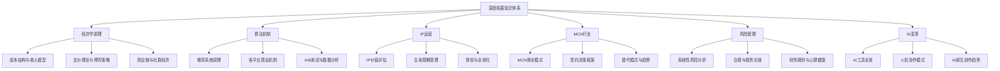
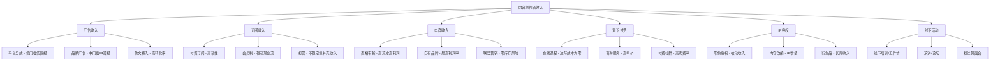
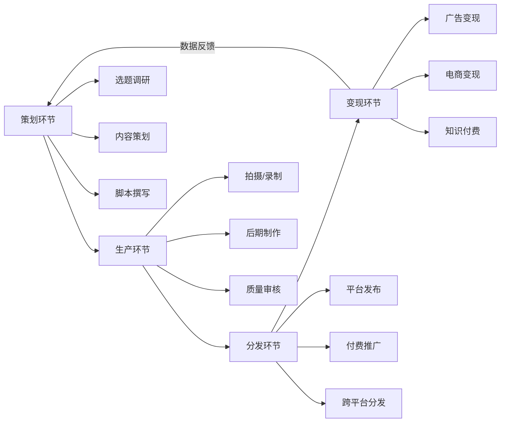
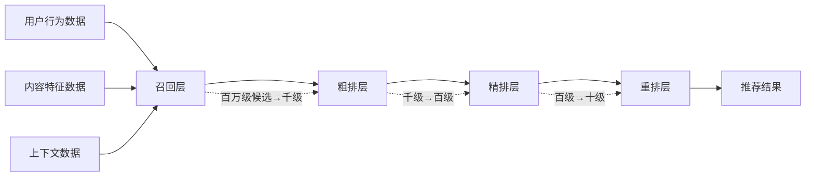
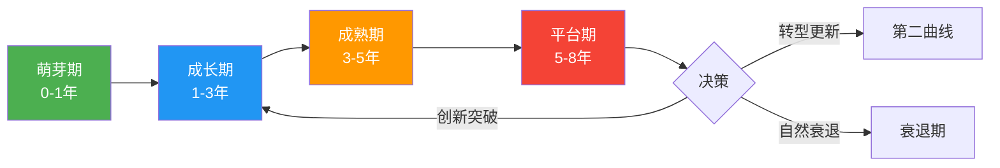
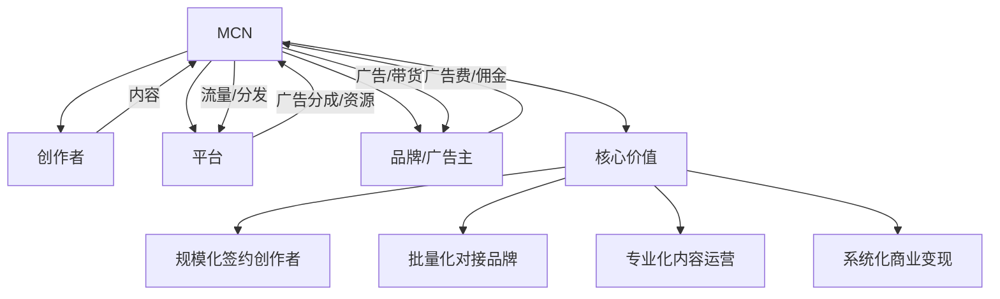
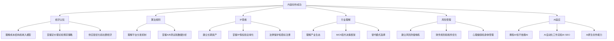

# 第九章 深度拓展：内容创作与社交媒体变现的高级理论

本章从经济学原理、算法机制、IP运营、MCN行业、风险管理和AI变革六个维度，对内容创作与社交媒体变现进行深度理论拓展。这些知识不直接教你"怎么拍视频"，而是帮你建立系统性认知框架——理解内容行业的底层逻辑，才能在变化中做出正确决策。



---

## 一、内容创作的经济学

理解内容产品的经济特性，是制定变现策略的基础。很多创作者只关注"怎么涨粉"，却不知道为什么有些内容能赚大钱、有些不能——答案藏在经济学里。

### 1.1 内容产品的经济特性

#### 边际成本趋近于零

这是数字内容最核心的经济特性。一篇文章写完后，给第1个人看和给第100万人看，生产成本完全相同。这意味着：

- 固定成本（创作成本）高，可变成本（分发成本）极低
- 成功的内容可以实现接近100%的毛利率
- 规模效应极强——用户越多，单位成本越低

这也解释了为什么内容行业呈现"赢家通吃"的格局。一个100万粉丝的博主和一个1万粉丝的博主，创作成本可能差不多，但收入差距是100倍甚至更多。**你不是在和同行竞争，你是在和所有争夺用户注意力的内容竞争。**

用具体数字说明：假设一条视频制作成本为500元（含时间折算），发布到抖音后获得10万播放，平台广告分成约30元。但如果这条视频被100万人看到，分成变成300元；如果它引导了1万人购买一个99元的课程，收入变成99,000元。同样的500元投入，回报从30元到99,000元——这就是边际成本趋零带来的指数级收益可能。

**经济学原理**：边际成本趋零的底层逻辑来自数字产品的"非竞争性"——一个人的消费不减少另一个人的可用量。这使得数字内容天然适合"价格歧视"策略（同一内容对不同用户收取不同价格），也为"免费+增值"商业模式提供了理论基础。经济学家卡尔·夏皮罗（Carl Shapiro）和哈尔·瓦里安（Hal Varian）在《信息规则》中系统阐述了这一原理，指出信息产品的定价应基于用户价值而非生产成本。

#### 非竞争性与非排他性

一个人看你的一篇文章，不会阻止另一个人也看。这与实体商品完全不同——一件衣服只能卖给一个人，但一个课程可以卖给无数人。这使得：

- 数字内容可以实现无限规模的分发
- 内容创作者的收入上限极高
- 但同时，竞争也是全球性的

需要注意的是，非竞争性也意味着**模仿成本极低**。你的爆款内容会被迅速复制，因此持续创新比单次爆款更重要。

**常见误区**：很多创作者误以为"非排他性"意味着无法保护自己的内容。实际上，著作权法为原创内容提供了法律保护——非排他性指的是消费层面（别人看了不影响你看），而非产权层面（别人不能未经授权复制你的作品）。

#### 网络效应

社交媒体内容具有显著的网络效应：用户越多，内容价值越高。具体表现为：

| 效应类型 | 表现 | 实例 |
|---------|------|------|
| 直接网络效应 | 用户越多，社区越活跃 | 小红书笔记评论越多，越容易被推荐 |
| 间接网络效应 | 内容越多，用户越活跃 | B站UP主越多，用户停留时间越长 |
| 数据网络效应 | 用户越多，推荐越精准 | 抖音根据用户行为优化推荐算法 |
| 跨边网络效应 | 创作者越多→用户越多→品牌越多→创作者收入越高 | 小红书生态的正向飞轮 |

网络效应的核心启示：**社群比流量更有价值**。1000个愿意为你传播的铁杆粉丝，比10万个沉默的关注者更有商业价值。凯文·凯利的"1000个铁杆粉丝"理论正是基于此——如果你有1000个人每人每年愿意为你支付100元，你就有10万元的年收入基础。

**为什么"1000个铁杆粉丝"是可行的**：这个理论的核心假设是——你不需要成为"大众名人"，只需要在某个细分领域建立深度信任。一个讲解Unix系统运维的博主，全国可能只有几千个铁杆受众，但这些人愿意每年付费200元购买你的深度内容——这就足以支撑一份全职收入。关键在于"铁杆"二字：他们不是普通关注者，而是主动传播你内容、购买你产品、维护你声誉的核心用户。

#### 注意力稀缺性

信息过载时代，用户注意力是最稀缺的资源。一组关键数据：

- 人均每天接收信息量约34GB（UCSD研究，2009年数据，2024年估计已超过50GB）
- 平均注意力持续时间从2000年的12秒下降到8秒（微软加拿大研究）
- 用户在单条内容上的平均停留时间不到3秒
- 中国网民日均手机使用时长约6.5小时（QuestMobile 2025数据），但分配给单个App的时间持续被稀释

这意味着：**内容创作的本质不是生产信息，而是争夺注意力。** 你的竞争对手不是同类创作者，而是用户手机上的所有App。

注意力的经济学本质是**机会成本**：用户花3秒看你的内容，就放弃了用这3秒做其他事的可能。因此，你的内容必须在极短时间内证明"值得继续看下去"。

**注意力经济的理论基础**：赫伯特·西蒙（Herbert Simon，诺贝尔经济学奖得主）早在1971年就指出："信息的丰富意味着注意力的匮乏。"40年后，这个预言成为内容行业的核心矛盾。理解这一点的实操意义是——你的内容标题和开头的3秒，本质上是在做一场"注意力拍卖"：你必须在极短时间内向用户证明"看我的内容比做其他事更值得"。

#### 长尾效应

Chris Anderson在《长尾理论》中指出：互联网使得小众内容也能找到足够受众。一个讲"如何养护多肉植物"的博主，全国可能只有10万感兴趣的人，但在互联网上，这10万人足以支撑一个可持续的内容生意。

长尾效应的实操含义：

| 场景 | 热门赛道 | 长尾赛道 |
|------|---------|---------|
| 竞争强度 | 极高，头部垄断 | 低，容易出头 |
| 流量天花板 | 极高 | 较低但精准 |
| 变现效率 | 粉丝不精准，转化率低 | 粉丝精准，转化率高 |
| 内容成本 | 需要高质量才能脱颖而出 | 专业深度即可建立壁垒 |
| 适合人群 | 有资源、有团队的创作者 | 个人创作者、专业人士 |

**如何判断一个细分赛道是否有"长尾价值"**：用三个指标交叉验证——①百度指数/微信指数月搜索量>5000（有持续需求）；②小红书/抖音该关键词下头部创作者粉丝<30万（未被垄断）；③存在明确的付费场景（如课程、咨询、产品）。三个条件同时满足，说明这是一个有商业价值的长尾赛道。

**经济特性总览**：

| 经济特性 | 对创作者的启示 | 常见误解 |
|---------|--------------|---------|
| 边际成本为零 | 一旦内容火了，收益可以无限放大 | 不是"零成本"，前期固定投入很高 |
| 非竞争性 | 不需要"库存"，一份内容卖无数次 | 不代表无法保护版权 |
| 网络效应 | 社群比流量更有价值 | 不是"粉丝越多越好"，而是"粉丝越铁越好" |
| 注意力稀缺 | 开头3秒决定生死 | 不是"越短越好"，而是"密度越高越好" |
| 长尾效应 | 垂直细分赛道同样有商业价值 | 不是"越小众越好"，而是"小众但有付费需求" |

### 1.2 内容创作的成本结构

理解成本结构，才能做正确的投入决策。

#### 固定成本（一次性投入）

| 成本项 | 入门级 | 专业级 | 说明 |
|--------|--------|--------|------|
| 设备投入 | 手机+自然光（0元） | 相机+灯光+收音（2-5万） | 手机拍摄完全够用，别被器材党误导 |
| 学习成本 | B站免费教程（0元） | 付费课程+书籍（3000-1万） | 投入时间>金钱 |
| 场地成本 | 居家（0元） | 租工作室（3000-1万/月） | 前期完全不需要 |
| 软件成本 | 剪映免费版（0元） | Premiere/FCP（2000-5000） | 剪映已经足够强大 |

**设备投入的常见误区**：新手最常犯的错误是"先买设备再开始"。实际上，内容质量的决定因素排序是：**选题>脚本>表演>灯光>收音>画质**。一台iPhone 15的画质已经超过了2018年大多数专业相机，但一个无聊的选题用什么设备拍都没用。建议：先用手机做出10条内容，确认自己能坚持且方向正确后，再考虑升级设备。

#### 可变成本（每期内容）

- **时间成本**：一条10分钟短视频的平均制作周期——口播类2-3小时，Vlog类4-8小时，剧情类8-24小时
- **素材成本**：音乐版权（Epidemic Sound年费约1000元）、图片素材（Unsplash免费）、特效模板
- **推广成本**：平台DOU+/薯条等付费推广（建议前期不超过收入的20%）
- **外包成本**：剪辑外包（100-500元/条）、文案外包、封面设计

#### 单位经济模型（Unit Economics）

每个创作者都应该算清楚自己的"单位经济"：

```text
单条内容利润 = 单条收入 - 单条成本

其中：
单条收入 = 平台分成 + 广告收入 + 带货佣金 + 知识付费分摊
单条成本 = 时间成本 + 素材成本 + 推广成本 + 外包成本
```

实操计算示例（以一个5万粉的知识类博主为例）：

| 项目 | 月度数据 | 说明 |
|------|---------|------|
| 发布内容 | 8条视频 | 每周2条 |
| 平均播放量 | 每条2万 | 5万粉的合理水平 |
| 平台广告分成 | 约400元/月 | 每万播放约25元 |
| 品牌广告 | 2条，共6000元 | 单条3000元 |
| 付费课程收入 | 约2000元/月 | 均摊到每月 |
| **月总收入** | **约8400元** | |
| 设备折旧 | 200元/月 | 2.4万设备/12个月 |
| 素材费用 | 100元/月 | 音乐+图片 |
| 推广费用 | 500元/月 | DOU+投放 |
| 外包费用 | 800元/月 | 剪辑外包4条 |
| **月总成本** | **约1600元** | 不含时间成本 |
| **月净利润** | **约6800元** | |
| 时间投入 | 约80小时/月 | 每条10小时 |
| **时薪** | **约85元/小时** | |

这个时薪看起来不高，但随着粉丝增长和商业化成熟，时薪会快速提升。关键是建立可复制的内容生产流程。

**时薪的正确计算方法**：很多创作者只算"显性成本"（设备、外包），忽略了"隐性成本"（自己的时间）。正确做法是：把自己的时间按市场价折算。如果你离职前月薪1万（约50元/小时），那么创作时薪至少要达到50元才有意义——否则你还不如回去上班。当你的创作时薪持续低于市场价时，需要重新评估内容方向或变现策略。

#### 沉没成本陷阱

创作者常犯的错误是过度关注已投入的成本（"我已经做了3个月了，不能放弃"），而忽视了机会成本。正确的决策框架是：

> 问自己：如果我今天从零开始，我还会选择做这件事吗？
>
> 如果答案是否定的，那么无论已经投入了多少，都应该及时止损。

**如何识别"该止损"的信号**：

| 信号 | 具体表现 | 行动建议 |
|------|---------|---------|
| 持续3个月数据下降 | 播放量、互动率、粉丝增长全部走低 | 先尝试调整内容方向，无效则考虑转型 |
| 创作热情消退 | 每次创作都感到痛苦和拖延 | 降低频率或暂停，找回初心 |
| 变现路径不通 | 尝试多种变现方式均无效果 | 重新评估赛道选择和目标受众 |
| 机会成本过高 | 同样的时间投入其他领域回报更高 | 认真考虑转型，不要被沉没成本绑架 |

#### 投入产出比（ROI）评估模板

每月月底做一次ROI评估：

| 评估维度 | 计算方法 | 健康基准 |
|---------|---------|---------|
| 内容ROI | 内容带来的收入 / 内容制作成本 | >3倍 |
| 时间ROI | 总收入 / 总时间投入 | >当地最低时薪的2倍 |
| 推广ROI | 推广带来的增量收入 / 推广费用 | >2倍 |
| 粉丝获取成本 | 总投入 / 新增粉丝数 | <1元/粉 |

### 1.3 内容创作者的收入模型详解

不同收入模型的利润率、稳定性和可扩展性差异巨大。



**各收入模型的实操数据参考**：

| 收入模型 | 启动门槛 | 收入上限 | 稳定性 | 适合阶段 | 利润率 |
|---------|---------|---------|--------|---------|--------|
| 平台广告分成 | 低（1000粉即可） | 低（万粉级月入几百到几千） | 中等 | 起步期 | 约95% |
| 品牌广告合作 | 中（万粉以上） | 中（单条几千到几十万） | 不稳定 | 成长期 | 约90% |
| 直播带货 | 中高（需供应链） | 高（单场百万级） | 不稳定 | 成熟期 | 10-40% |
| 付费课程 | 中（需专业能力） | 高（边际成本为零） | 稳定 | 成长期 | 80-95% |
| 付费社群 | 低 | 中（年费制稳定） | 高 | 成长期 | 85-95% |
| 自有品牌 | 高（需供应链+资金） | 极高 | 稳定 | 成熟期 | 30-60% |
| IP授权 | 极高（需影响力） | 极高 | 稳定 | 成熟期 | 90%+ |
| 线下活动 | 中 | 中 | 不稳定 | 成长期 | 50-70% |

**收入多元化的黄金比例**（成熟创作者的收入结构参考）：

- 广告收入：20-30%（基础收入）
- 知识付费/课程：30-40%（利润核心）
- 电商/带货：20-30%（现金流补充）
- IP授权/被动收入：10-20%（长期价值）

**为什么这个比例是最优的**：广告收入虽然稳定但天花板明显（受平台分成比例和品牌预算限制）；知识付费的边际成本趋零，利润率最高；电商/带货提供现金流但利润率较低（需要考虑退货、售后）；IP授权是"睡后收入"，但需要前期大量积累。四者组合实现了"稳定+高利润+现金流+长期价值"的平衡。

#### 品牌合作报价公式

品牌合作是很多创作者的主要收入来源，但报价是一门学问：

```text
基础报价 = 粉丝数 × CPM系数 × 调节因子

其中：
CPM系数（每千粉报价）：
  - 抖音：100-300元/万粉
  - 小红书：200-500元/万粉（图文更高）
  - B站：150-400元/万粉
  - 公众号：300-800元/万粉（打开率影响大）

调节因子：
  - 互动率>5%：×1.3
  - 垂直领域（金融/医疗）：×1.5-2.0
  - 首次合作折扣：×0.8
  - 多条打包优惠：×0.85-0.9
  - 排他条款：×1.2-1.5
```

实操示例：一个10万粉的小红书美妆博主
- 基础报价 = 10万 × 300元/万粉 = 3000元
- 互动率6% → 3000 × 1.3 = 3900元
- 美妆垂直领域 → 3900 × 1.5 = 5850元
- 最终报价：单条图文 5000-6000元

**报价谈判的常见错误**：

| 错误 | 后果 | 正确做法 |
|------|------|---------|
| 直接报底价 | 没有议价空间，长期利润被压缩 | 先报高于预期的价格，留出谈判余地 |
| 按粉丝量线性报价 | 大号单价反而低于小号 | 用"互动率+垂类系数"修正，大号应有溢价 |
| 不区分平台 | 同一报价跨平台 | 不同平台的CPM差异巨大，需分别报价 |
| 忽略排他条款 | 损失其他合作机会 | 排他条款单独加价1.2-1.5倍 |
| 接受"置换合作" | 零收入换实物 | 除非产品价值≥报价的50%，否则拒绝 |

### 1.4 内容创作的规模经济

#### 内容复利效应

优质内容的生命周期远超想象。一篇好的知乎回答可以在3年内持续带来流量，一个YouTube视频可以在5年后依然获得推荐。这就是内容复利——你今天创作的内容，会成为明天的资产。

关键指标：**内容资产率** = 历史内容带来的流量 / 总流量。优秀的创作者，历史内容能贡献40-60%的总流量。如果这个比例低于20%，说明你的内容缺乏长尾价值，需要在"常青内容"上加大投入。

常青内容（Evergreen Content）的特征：
- 解决一个长期存在的问题（如"如何写简历"）
- 信息不会快速过时（如"Python入门教程"）
- 搜索需求持续存在（SEO价值高）
- 可以定期更新保持时效性

建议：每发布5条内容，至少有1条是常青内容。这1条内容的长期回报可能超过另外4条热点内容的总和。

**常青内容的维护策略**：常青内容不是"写完就不管了"。建议每3-6个月更新一次——补充新数据、修正过时信息、优化SEO关键词。YouTube和Google都会对"最近更新"的内容给予排名加权。一个持续更新的"2024年最全Python入门指南"比一个2021年写的版本获得的流量高3-5倍。

#### 平台效应与跨平台策略

单一平台的风险极高。跨平台不是简单地把同一个视频搬运到多个平台，而是：

1. **核心内容**在一个平台深耕（如B站长视频）
2. **衍生内容**适配其他平台（如抖音切片、小红书图文）
3. **私域沉淀**在微信生态（公众号+社群+小程序）

具体的内容复用矩阵：

| 原始内容 | B站 | 抖音 | 小红书 | 公众号 | 知乎 |
|---------|-----|------|--------|--------|------|
| 10分钟深度视频 | 完整版 | 3-5条60秒切片 | 精华图文+截图 | 长文版 | 问答版 |
| 制作成本 | 1x | 0.3x | 0.2x | 0.5x | 0.3x |
| 预期流量 | 1x | 2-5x | 1-3x | 0.5-1x | 0.3-1x |

**跨平台分发的注意事项**：①不要同一时间在所有平台发布完全相同的内容，平台会检测"搬运"并降权；②每个平台的标题和封面需要单独优化（小红书偏好信息密度高的封面，抖音偏好悬念感强的封面）；③优先发布在主平台，间隔6-24小时后再发其他平台。

#### 团队效应

当月收入稳定超过3万时，可以考虑组建团队。团队分工参考：

- 创作者本人：核心创意、人设出镜、商业决策
- 剪辑师：视频后期（可外包，2000-5000元/月）
- 运营助理：数据监控、社群管理、商务对接
- 文案编辑：脚本撰写、标题优化、SEO

团队组建的经济账：

| 阶段 | 月收入 | 团队配置 | 团队成本 | 净利润 |
|------|--------|---------|---------|--------|
| 个人期 | 1-3万 | 无 | 0 | 1-3万 |
| 小团队 | 3-8万 | 1兼职助理 | 3000-5000 | 2.5-7.5万 |
| 初创团队 | 8-20万 | 1全职+2兼职 | 1-2万 | 6-18万 |
| 成熟团队 | 20万+ | 3-5人 | 3-8万 | 12万+ |

**团队管理的常见陷阱**：

| 陷阱 | 表现 | 解决方案 |
|------|------|---------|
| 过早扩招 | 月收入刚过3万就招全职 | 先用兼职验证需求，稳定3个月再转全职 |
| 创始人瓶颈 | 所有决策都必须你拍板 | 建立SOP，授权团队成员独立决策 |
| 成本失控 | 团队成本超过收入的40% | 设定人力成本红线，优先外包非核心环节 |
| 文化稀释 | 团队成员不理解内容调性 | 写一份"内容风格手册"，新人入职必读 |

### 1.5 注意力经济的竞争格局

#### 头部效应的数据

以B站为例：前1%的UP主获得了约30%的总播放量，前10%获得了约70%。这意味着绝大多数创作者在争夺剩余30%的流量。

但头部效应并非不可突破。关键策略是**垂直细分**：

- 不要做"科技博主"，要做"Linux服务器运维教程博主"
- 不要做"美食博主"，要做"一个人的快手晚餐博主"
- 不要做"健身博主"，要做"久坐上班族5分钟拉伸博主"

垂直细分的判断标准：
1. **搜索量**：关键词月搜索量>1万，说明有需求
2. **竞争度**：头部创作者粉丝<50万，说明未被垄断
3. **变现路径**：有明确的付费场景（课程/咨询/产品）
4. **持续性**：需求不会在半年内消失

#### 内容形式的演变趋势

| 年份 | 主流形式 | 代表平台 | 关键指标 |
|------|---------|---------|---------|
| 2016-2018 | 短视频（15秒） | 抖音、快手 | 完播率 |
| 2019-2021 | 中视频（1-10分钟） | B站、西瓜 | 播放时长 |
| 2021-2023 | 直播+短视频 | 抖音、淘宝 | 转化率 |
| 2024-2025 | AI辅助+多模态 | 全平台 | 互动深度 |
| 2026+ | 互动式+个性化 | 新兴平台 | 用户参与度 |

**趋势背后的底层逻辑**：内容形式的演变本质上是"注意力效率"的竞争——每一代新形式都在试图用更短的时间传递更多的信息密度。15秒短视频的信息密度远高于图文，5分钟中视频的信息密度又高于15秒短视频。理解这个趋势的实操意义是：不要执着于某种固定形式，而要持续追求"信息密度最大化"。

### 1.6 内容定价的经济学原理

#### 知识产品的定价悖论

知识产品面临一个独特的定价困境：边际成本趋近于零，但消费者对"免费"和"付费"的心理预期截然不同。理解以下定价理论，能帮你找到最优价格点。

#### 价格锚定效应（Anchoring Effect）

消费者对价格的判断不是基于绝对值，而是基于参照物。实操应用：

- 在课程详情页先展示"原价1999元"，再展示"限时优惠399元"——原价就是锚点
- 推出三个价位的产品（基础版99元/进阶版399元/旗舰版999元），大多数用户会选择中间价位（折中效应）
- 同行定价就是你的天然锚点——如果同类课程卖299元，你卖99元反而会被质疑质量

**锚定效应的神经科学基础**：诺贝尔经济学奖得主丹尼尔·卡尼曼的研究表明，人类大脑在评估价格时并非"理性计算"，而是依赖"启发式判断"——第一个看到的数字会成为后续判断的参照点。这意味着：你在营销中展示的第一个数字（无论是原价、竞品价格还是用户评价中的数字）都会深刻影响购买决策。

#### 实操定价公式（知识付费产品）：

```text
建议售价 = 目标月收入 / 预期月销量

其中：
目标月收入 = 你的时间价值 × 投入时间
预期月销量 = 粉丝数 × 付费转化率

付费转化率参考值：
  - 冷启动期（<1万粉）：0.5-1%
  - 成长期（1-10万粉）：1-3%
  - 成熟期（10万+粉）：3-8%
  - 头部IP（100万+粉）：5-15%

示例：
  5万粉知识博主，月目标收入2万
  预期月销量 = 50,000 × 2% = 1,000人
  建议售价 = 20,000 / 1,000 = 20元

  但如果课程提供了深度价值（如10小时系统课程），
  用户感知价值远高于20元，可以定价199-399元，
  此时月销量会降低但总收入更高：
  199元 × 200人 = 39,800元 > 20元 × 1,000人
```

**定价的心理学陷阱**：很多创作者犯"成本定价"错误——"我花了100小时做这个课程，每小时值100元，所以定价10000元"。正确的定价逻辑是"价值定价"——"这个课程能帮用户省下多少时间/赚到多少钱？如果能帮用户多赚5万，定价5000元就是合理的"。用户不关心你花了多少时间，只关心自己能得到多少价值。

#### 价格歧视策略

不同用户对同一产品的支付意愿不同，合理的价格歧视能最大化总收入：

| 策略 | 具体做法 | 案例 |
|------|---------|------|
| 版本歧视 | 提供基础版/高级版/企业版 | 课程设"试听版(免费)→完整版(99元)→1对1辅导版(999元)" |
| 时间歧视 | 早鸟价→正价→促销价 | 新课上线前3天59元，之后恢复99元 |
| 渠道歧视 | 不同平台不同价格 | 公众号粉丝价89元，新用户99元 |
| 数量歧视 | 打包优惠 | 单课99元，3课打包199元 |
| 身份歧视 | 特定人群优惠 | 学生价59元，老学员续费7折 |

#### 心理定价技巧

- **尾数定价**：99元比100元感觉便宜很多（实际只差1元，但感知差距极大）
- **日均成本法**：将高价产品拆解为日均成本——"每天不到3元，获得全年知识服务"
- **免费试用**：提供部分内容免费体验，降低决策门槛
- **无理由退款**：提供7天无理由退款，反而能提升购买率（降低心理风险）

**退款率的合理预期**：提供无理由退款后，退款率通常在5-15%之间。如果超过20%，说明产品描述与实际体验差距过大，需要优化产品本身而非取消退款政策。数据表明，提供退款承诺的课程，销量提升通常在20-40%——即使扣除退款损失，总收入仍然更高。

### 1.7 内容竞争的博弈论分析

#### 内容创作的囚徒困境

在同一个赛道中，创作者面临经典的博弈困境：如果所有人都做深度长内容，整体质量提升；但如果有人偷工减料做"标题党"获取短期流量，其他人被迫跟进，最终导致劣币驱逐良币。

#### 破解博弈困境的策略

1. **差异化定位**：不做"同样的内容做得更好"，而是做"别人没做过的内容"。博弈论中的最优策略是避免正面对抗
2. **长期重复博弈**：一次博弈中投机取巧是理性选择，但在长期重复博弈中，合作（持续输出高质量内容）是最优策略。这就是为什么"坚持"是最重要的创作策略
3. **信号博弈**：高质量内容是"信号"——它向用户传递"我是专业创作者"的信号，从而吸引高质量粉丝和品牌合作。低质量内容虽然短期流量高，但吸引的是低价值受众

**"以牙还牙"策略在内容竞争中的应用**：博弈论中最著名的策略是"以牙还牙"（Tit-for-Tat）——先合作，然后模仿对方上一轮的行为。在内容竞争中，这意味着：你先输出高质量内容；如果同行用高质量竞争，你继续；如果有人用标题党抢流量，你不要跟进（因为这会损害你的品牌），而是用差异化的角度重新吸引注意力。

#### 赛道选择的纳什均衡

当多个创作者在同一个赛道竞争时，最终会达到纳什均衡——每个人都在给定其他人策略的情况下选择自己的最优策略。实操含义：

- 如果一个赛道已经有5个头部创作者，新进入者很难通过同质化内容突围
- 最优策略是找到"无人区"——用户有需求但没人满足的细分领域
- 当你找到一个好的细分赛道时，短期内你可能独占这个生态位（垄断利润）

### 1.8 内容供应链经济学

内容创作不只是"拍视频"，而是一条完整的供应链。理解供应链经济学，能帮你大幅提升效率和利润。

#### 内容供应链的四个环节



#### 供应链优化的核心原则

1. **瓶颈识别**：整条链的效率取决于最慢的环节。如果策划环节需要3天但生产只需要1天，优化生产环节毫无意义
2. **标准化**：将重复性工作标准化为SOP（标准操作流程），降低每次创作的决策成本
3. **批处理**：同类任务集中处理——一次拍3条视频比拍3次各1条效率高40-60%
4. **模板化**：建立标题模板、封面模板、脚本模板，减少从零开始的时间

#### 内容生产SOP模板（以知识类短视频为例）

```text
周一：选题日
├── 09:00-09:30  查看上周数据，分析爆款/低效内容
├── 09:30-10:30  确定本周3个选题（1热点+2常青）
└── 10:30-12:00  撰写3条视频脚本大纲

周二-周三：拍摄日
├── 每天拍摄1-2条视频
├── 口播类：1小时/条（含NG）
└── 演示类：2小时/条（含准备）

周四：剪辑日
├── 粗剪：30分钟/条（AI辅助）
├── 精剪：1小时/条
└── 字幕+封面：20分钟/条

周五：发布+运营日
├── 上午：发布本周内容
├── 下午：回复评论、互动
└── 晚间：监控数据、调整策略
```

#### 供应链成本优化的实操方法

| 优化方向 | 具体做法 | 预期节省 |
|---------|---------|---------|
| 批量拍摄 | 一次拍摄多条内容，换装/换背景 | 时间节省30-40% |
| 模板复用 | 建立封面、字幕、BGM模板库 | 单条制作时间减少20分钟 |
| AI辅助 | 用AI生成初稿、字幕、封面 | 文案效率提升3-5倍 |
| 外包非核心 | 剪辑、封面设计外包 | 释放50%以上的时间 |
| 素材库积累 | 建立个人素材库（BGM、转场、特效） | 避免重复搜索 |

**SOP的常见失败原因**：

| 失败原因 | 表现 | 解决方案 |
|---------|------|---------|
| SOP过于僵化 | 每次都按固定流程，失去创意灵活性 | SOP只规定"必须完成的步骤"，不限制"怎么做" |
| 不迭代更新 | 用了半年没更新，效率反而下降 | 每月复盘一次SOP，删除无效步骤，增加新发现 |
| 忽视数据反馈 | 不看数据，凭感觉调整 | 每周一用15分钟看数据，基于数据优化选题 |
| 所有环节都自己做 | 一个人做所有事，效率极低 | 识别"只有你能做"的环节（创意、出镜），其余外包 |

### 1.9 社群经济模型

社群是内容创作者最有价值的长期资产之一。理解社群经济的底层逻辑，能帮你建立可持续的变现体系。

#### 社群价值的三层模型

```text
第三层：商业价值层
├── 付费社群、课程、咨询
├── 粉丝经济、打赏、会员
└── 品牌合作、代言

第二层：信任价值层
├── 信任积累（持续提供价值）
├── 口碑传播（粉丝自发推荐）
└── 危机缓冲（犯错时粉丝维护）

第一层：连接价值层
├── 粉丝之间建立连接
├── 形成共同身份认同
└── 产生归属感和参与感
```

**为什么"连接价值"是基础**：很多创作者只关注"我和粉丝的关系"（第二层），却忽视了"粉丝之间的关系"（第一层）。但真正有生命力的社群，是粉丝之间也建立了连接——他们因为共同的兴趣和身份认同而聚在一起，而不仅仅是因为"关注了同一个人"。当粉丝之间形成连接后，社群就有了自生长能力：老成员带新成员，讨论内容自发产生，你只需维护秩序而非填充内容。

#### 社群变现的定价参考

| 社群类型 | 年费范围 | 核心价值 | 续费率参考 |
|---------|---------|---------|----------|
| 信息分享群 | 99-299元 | 行业资讯、资源分享 | 30-50% |
| 学习交流群 | 299-999元 | 课程配套、答疑解惑 | 50-70% |
| 高端人脉群 | 999-4999元 | 人脉对接、资源撮合 | 60-80% |
| 私董会/顾问群 | 5000-50000元 | 1对多咨询、深度服务 | 70-90% |

#### 社群运营的"3-3-3法则"

- **30%内容驱动**：定期输出独家内容，保持社群活跃
- **30%互动驱动**：组织讨论、问答、打卡活动，增强参与感
- **30%价值驱动**：提供资源对接、人脉连接、商业机会
- **10%商业转化**：适度引入付费产品，不超过社群内容的10%

**社群死亡的三个信号**：

1. **发言集中在创始人**：如果90%的消息都是你发的，说明社群缺乏自生长能力
2. **潜水率超过80%**：如果大多数人只看不说话，说明内容没有激发参与感
3. **续费率低于30%**：如果大多数人不续费，说明社群提供的价值不匹配价格

### 1.10 创作者经济的宏观趋势

#### 创作者经济的市场规模

全球创作者经济（Creator Economy）的规模正在快速增长：

| 年份 | 全球市场规模（亿美元） | 中国创作者数量（万） | 关键驱动力 |
|------|---------------------|-------------------|-----------|
| 2020 | ~1,000 | ~1,500 | 疫情催化线上内容消费 |
| 2022 | ~1,500 | ~2,000 | 短视频+直播电商爆发 |
| 2024 | ~2,500 | ~2,500 | AI工具降低创作门槛 |
| 2026（预估） | ~4,000 | ~3,000 | AI原生内容+全球化 |

#### 创作者阶层分化

创作者经济正在形成明显的阶层结构：

| 阶层 | 占比 | 月收入范围 | 核心特征 |
|------|------|-----------|---------|
| 超级头部 | <0.1% | 100万+ | 全网知名，多元变现 |
| 头部 | 0.1-1% | 10-100万 | 垂直领域权威，团队化运营 |
| 腰部 | 1-5% | 1-10万 | 稳定产出，初步商业化 |
| 中小 | 5-15% | 1000-1万 | 业余创作者，副业收入 |
| 尾部 | >80% | <1000元 | 爱好驱动，无商业化 |

关键洞察：前5%的创作者获取了约80%的行业收入。这不是"努力就能成功"的线性关系，而是幂律分布——你需要在某个维度上建立绝对优势（深度、风格、资源），而非在所有维度上做到平均水平。

---

## 二、平台算法深度分析

算法是内容分发的核心机制。不理解算法，就像在黑暗中射箭——偶尔命中，但无法复制成功。

### 2.1 推荐算法的基本原理

现代内容平台的推荐系统通常由三个核心模块组成：



#### 召回层（Recall）

从海量内容中快速筛选出用户可能感兴趣的候选集。常用方法：

- **协同过滤**：找到与你行为相似的用户，推荐他们喜欢的内容。比如你和用户A都喜欢科技和美食，用户A还看了旅行内容，系统就可能给你推荐旅行内容。
- **基于内容的推荐**：分析你看过的内容特征（标签、关键词、时长），推荐相似特征的内容。
- **热门召回**：将当前热门内容纳入候选池，确保热门内容有曝光机会。
- **地理位置召回**：推荐附近用户创作的内容，适合本地生活类内容。
- **社交关系召回**：你关注的人喜欢的内容，或你朋友互动过的内容。

对创作者的启示：你的内容必须能被召回层"抓住"。这意味着——标题、标签、封面必须准确反映内容主题，否则算法无法将你推荐给目标用户。

**召回层的实操影响**：很多创作者的标题用了"震惊体""悬念体"，虽然短期点击率高，但如果标题与实际内容不符，算法会通过"负反馈率"（用户点开后迅速退出）识别出来，反而会降低后续推荐。准确的标题和标签，比夸张的标题更重要。

#### 精排层（Ranking）

对候选内容进行精准打分。现代精排模型通常使用深度学习：

- **Wide & Deep模型**（Google提出）：Wide部分记忆历史行为模式，Deep部分泛化到新内容
- **双塔模型**：用户塔和内容塔分别编码，通过向量相似度计算匹配分数
- **序列模型（DIN/DIEN）**：考虑用户行为的时序关系，比如你最近看了3个健身视频，下一个推荐的权重会更高
- **多目标优化模型**：同时优化点击率、完播率、互动率、关注率等多个目标

#### 重排层（Re-ranking）

在精排结果上进行最终调整：

- 去重：避免推荐过于相似的内容
- 多样性：确保推荐结果包含不同类型的内容
- 时效性：优先推荐新鲜内容
- 广告插入：在合适位置插入商业内容
- 扶持策略：对新创作者、特定品类给予流量倾斜

**扶持策略的实操利用**：大多数平台对新创作者有"流量扶持期"（通常前10-30条内容）。在这个窗口期内，平台会将你的内容推送给更多人，测试你的内容是否值得长期推荐。**新号前10条内容的质量，决定了你账号的长期流量基础**——不要用低质量内容浪费这个窗口期。

### 2.2 各平台算法的核心机制

#### 抖音/TikTok算法：流量池机制

抖音的核心是**流量池分级递进**机制：

```text
第1级流量池：200-500次曝光
    ↓ 点赞率>3%、完播率>30%
第2级流量池：3000-5000次曝光
    ↓ 数据持续优秀
第3级流量池：1万-5万次曝光
    ↓ 数据持续优秀
第4级流量池：10万-50万次曝光
    ↓ 数据持续优秀
第5级流量池：100万+次曝光（爆款）
```

**核心指标权重**（按重要性排序）：

1. **完播率**（权重最高）：用户是否看完了你的视频。15秒视频完播率比60秒视频容易高，但这不代表应该做短——关键是内容节奏
2. **互动率**：点赞+评论+分享+收藏的综合比率。评论权重>分享>收藏>点赞
3. **关注转化率**：看了视频后关注你的比例，说明内容质量是否能留住人
4. **负反馈率**：不感兴趣、举报等负面行为，会严重降低推荐
5. **转粉率**：从路人转为粉丝的比例，反映内容的长期价值

**实操优化要点**：

- 前3秒必须抓住注意力（设悬念、抛问题、展示冲突）
- 视频时长控制在信息密度最高的长度（别为了凑时长注水）
- 在视频中设置"互动钩子"（"你觉得呢？评论区告诉我"）
- 发布后30分钟内积极回复评论，触发二次推荐
- 利用"合拍""引用"等平台功能增加互动入口

**抖音数据监控清单**（每日必看）：

| 指标 | 健康值 | 异常信号 | 调整方向 |
|------|--------|---------|---------|
| 完播率 | >30% | <15% | 优化开头、缩短时长 |
| 点赞率 | >3% | <1% | 增加情感共鸣点 |
| 评论率 | >0.5% | <0.1% | 设置争议话题或提问 |
| 分享率 | >0.3% | <0.05% | 增加实用价值或社交货币 |
| 关注转化 | >2% | <0.5% | 强化个人IP、设置关注理由 |

#### 小红书算法：搜索+推荐双引擎

小红书的独特之处在于**搜索流量占比极高**（约40%），这使得SEO优化在小红书上特别重要。

**笔记排名因素**：

| 因素 | 权重 | 优化方法 |
|------|------|---------|
| 关键词匹配 | 高 | 标题和正文自然包含目标关键词 |
| 互动数据 | 高 | 优先提升收藏率（小红书的核心指标） |
| 内容质量 | 中 | 原创度、图片质量、文字排版 |
| 账号权重 | 中 | 持续发布、不违规、完成认证 |
| 发布时间 | 低 | 工作日晚7-10点、周末全天 |

**小红书SEO实操**：

1. 在标题中包含核心关键词（如"北京探店"而非"今天去了个好地方"）
2. 正文前200字包含2-3个相关关键词
3. 话题标签选择：1个大流量标签+2个精准标签+1个长尾标签
4. 图片上添加文字标注（小红书可以OCR识别图片文字）
5. 首图要有信息量（对比图、数据图、效果前后对比）

**小红书关键词研究方法**：

```text
步骤1：在小红书搜索框输入你的领域关键词
步骤2：查看下拉联想词（这些是真实用户搜索的高频词）
步骤3：查看"大家都在搜"板块
步骤4：分析排名前10的笔记标题中的关键词
步骤5：用这些关键词组合优化你的标题和正文
```

#### B站算法：内容深度优先

B站的算法更偏向**内容深度和用户粘性**：

- **播放时长**比播放量更重要：一个10分钟视频被完整看完，比一个1分钟视频被看了10次更有价值
- **弹幕和评论**权重高：互动质量（有内容的弹幕）>互动数量
- **一键三连**（点赞+投币+收藏）是核心指标：收藏>投币>点赞
- **内容垂直度**：账号标签越集中，推荐越精准

**B站起号策略**：

- 前期专注一个细分标签，让算法快速识别你的内容方向
- 视频时长建议5-15分钟，信息密度要高
- 引导用户发弹幕（"在弹幕打出你的答案"）
- 固定更新频率（如每周三、周六晚8点）
- 封面和标题要有信息量，避免标题党（B站用户反感标题党）

#### 微信公众号算法：社交推荐为主

2023年改版后，公众号引入了算法推荐机制，但**社交推荐仍占主导**：

- **在看/点赞**：朋友点了"在看"，你会在"看一看"中看到这篇文章
- **阅读完成率**：用户是否读完了全文
- **分享率**：分享到朋友圈或群聊的比例
- **原创标识**：原创内容在推荐中有明显加权

**公众号运营核心**：

- 标题决定打开率，内容决定分享率，两者缺一不可
- 在文章中设置"社交货币"——用户分享后能彰显品味或观点的内容
- 利用"在看"机制，文末引导用户点"在看"
- 长文比短文更容易获得推荐（但前提是内容质量过关）

#### 视频号算法：社交裂变+私域联动

视频号作为微信生态的视频平台，算法机制与抖音有本质区别：

- **社交推荐权重极高**：朋友点赞的内容会优先出现在你的信息流中
- **私域联动**：公众号、小程序、企业微信都能为视频号导流
- **直播权重**：视频号直播在微信生态内有流量加权
- **同城推荐**：本地生活内容有额外的流量扶持

**视频号起号策略**：

- 前期核心靠私域导流：将视频号内容分享到朋友圈、社群
- 利用公众号关联：在公众号文章中嵌入视频号内容
- 直播是增长利器：视频号直播的社交裂变效果远超短视频
- 适合私域运营能力强的创作者

### 2.3 算法优化的系统性策略

#### 内容优化的AIDA模型

| 阶段 | 目标 | 具体方法 |
|------|------|---------|
| Attention（注意） | 前3秒抓住用户 | 悬念开头、数据冲击、反常识观点 |
| Interest（兴趣） | 维持用户注意力 | 故事化叙述、节奏控制、视觉变化 |
| Desire（欲望） | 激发互动欲望 | 引发共鸣、设置争议点、提问互动 |
| Action（行动） | 引导用户行为 | 关注引导、评论引导、分享引导 |

#### 内容节奏的"钩子"设计

在不同时间节点设置"钩子"防止用户流失：

```text
0-3秒：情感钩子（"你知道XX吗？"）
30秒：悬念钩子（"但真正让我震惊的是..."）
50%处：互动钩子（"如果你也遇到过，打个1"）
结尾：行动钩子（"关注我，下期教你..."）
```

**钩子设计的常见错误**：

| 错误 | 表现 | 正确做法 |
|------|------|---------|
| 开头太慢 | "大家好，我是XXX，今天给大家分享..." | 直接抛出核心冲突或数据 |
| 钩子与内容脱节 | 开头很吸引人，但正文完全无关 | 钩子必须与核心内容紧密相关 |
| 钩子过多 | 每10秒一个钩子，像在"钓鱼" | 关键节点设置，不要过度使用 |
| 结尾无CTA | 视频结束，没有引导下一步行为 | 每条内容都要有明确的行动引导 |

#### 发布的数据驱动方法

不要凭感觉发布，要用数据说话：

1. **测试期**（前30天）：每天不同时间段发布，记录各时段数据
2. **分析期**：找出数据最好的3个时间段
3. **固化期**：固定在最佳时段发布，建立用户预期
4. **迭代期**：每月重新测试一次，因为用户行为会变化

### 2.4 算法的局限性与应对

#### 信息茧房效应

算法会不断强化用户的既有偏好，导致用户看到越来越窄的内容。对创作者的影响：

- 正面：垂直领域的创作者更容易获得精准推荐
- 负面：难以突破已有受众圈层，增长天花板明显

应对策略：定期发布"跨圈内容"（如科技博主偶尔聊生活方式），吸引新圈层用户。

#### 平台依赖风险

算法变化是创作者最大的不确定性来源。2023年抖音调整算法，大量"知识类"账号流量腰斩。2024年小红书调整推荐策略，部分美妆博主流量骤降。

**应对框架**：

- **永远不要把100%的鸡蛋放在一个篮子里**
- 核心内容占60%精力（深耕主平台）
- 衍生内容占30%精力（覆盖2-3个副平台）
- 私域建设占10%精力（微信社群/公众号）

#### 算法变化的预警信号

| 信号 | 可能原因 | 应对措施 |
|------|---------|---------|
| 连续5条内容播放量骤降50%+ | 算法调整或账号降权 | 检查是否违规，调整内容策略 |
| 粉丝增长停滞但互动正常 | 赛道天花板或算法收紧 | 尝试跨圈内容，拓展新受众 |
| 推荐流量下降但搜索流量上升 | 算法减少推荐但内容有搜索价值 | 加大SEO优化力度 |
| 新内容表现差但旧内容持续有流量 | 新内容未被算法认可 | 分析爆款旧内容的特征，复制成功模式 |

**应对算法变化的"逃生舱"策略**：当主平台流量骤降时，启动以下应急流程——①立即检查是否收到平台违规通知；②分析最近5条内容的数据，找出断崖式下跌的时间点；③将核心粉丝转移到私域（微信社群）；④在副平台加大发布频率；⑤如果持续2周无改善，考虑暂时降低主平台投入，将精力分配到其他平台。

### 2.5 内容A/B测试的系统方法论

#### 为什么需要A/B测试

很多创作者凭"感觉"决定标题、封面、发布时间，但感觉往往不可靠。A/B测试是用数据代替直觉的科学方法，能显著提升内容表现。

#### A/B测试的核心要素

| 要素 | 说明 | 注意事项 |
|------|------|---------|
| 控制变量 | 每次只测试一个变量 | 同时改标题和封面无法判断哪个起了作用 |
| 样本量 | 至少需要100次曝光才有统计意义 | 小样本数据波动大，不可靠 |
| 随机分配 | 确保测试组和对照组条件相同 | 不同时段发布的数据不可直接对比 |
| 统计显著性 | p值<0.05才可采信 | 直觉上的"感觉更好"可能是随机波动 |

#### 可测试的变量及其优先级

```text
高优先级（对数据影响最大）：
├── 标题/封面 → 直接影响点击率
├── 开头前3秒 → 直接影响完播率
└── 内容结构 → 影响互动率

中优先级：
├── 发布时间 → 影响初始流量池表现
├── 视频时长 → 影响完播率和推荐量
└── 话题标签 → 影响搜索流量

低优先级：
├── 封面配色 → 微调优化
├── 字体样式 → 微调优化
└── 背景音乐 → 情绪影响
```

#### 实操A/B测试流程

以标题测试为例，一个完整的测试周期：

```text
第1步：准备两个标题方案
  A方案：数据驱动型（"5个方法让你月入过万"）
  B方案：情感驱动型（"从月薪3000到月入3万，我做对了什么"）

第2步：确保其他变量完全相同
  同一内容、同一封面、同一发布时间段

第3步：发布测试
  - 第1天用A方案发布，记录24小时数据
  - 第3天用B方案发布（避免相邻天发布互相影响）
  - 记录：播放量、完播率、点赞率、评论率、分享率

第4步：数据分析
  如果B方案的点击率比A方案高20%以上，差异显著
  如果差异<10%，可能是随机波动，需要更多样本

第5步：固化胜出方案
  将胜出的标题风格固化为自己的标题模板
```

#### 各平台数据工具速查

| 平台 | 数据工具 | 关键功能 |
|------|---------|---------|
| 抖音 | 创作者服务中心 | 流量来源、用户画像、视频诊断 |
| 小红书 | 专业号数据中心 | 笔记分析、搜索词、粉丝画像 |
| B站 | 创作中心 | 播放来源、观众留存、互动分析 |
| 公众号 | 微信公众平台 | 阅读来源、分享路径、用户画像 |
| 通用 | 新榜/飞瓜/蝉妈妈 | 跨平台数据、竞品分析、行业趋势 |

### 2.6 内容数据分析的进阶框架

#### 漏斗分析法

内容表现可以拆解为一个转化漏斗：

```text
曝光量（推荐/搜索）
    ↓ 点击率 = 点击量 / 曝光量
点击量
    ↓ 完播率 = 完播量 / 点击量
完播量
    ↓ 互动率 = 互动量 / 完播量
互动量
    ↓ 转化率 = 关注/购买 / 互动量
转化量
```

每个环节的优化方向：

| 漏斗环节 | 核心指标 | 健康基准 | 优化方向 |
|---------|---------|---------|---------|
| 曝光→点击 | 点击率 | >5%（抖音），>3%（小红书） | 优化封面和标题 |
| 点击→完播 | 完播率 | >30%（短视频），>40%（1分钟以内） | 优化开头、控制时长 |
| 完播→互动 | 互动率 | >5% | 增加互动钩子、情感共鸣 |
| 互动→转化 | 转化率 | >2%（关注），>1%（付费） | 强化人设、设置明确CTA |

#### 内容健康度诊断清单

每周用以下清单诊断内容健康度：

```text
□ 过去7天发布了≥2条内容？（产出稳定性）
□ 平均完播率>30%？（内容质量）
□ 平均互动率>3%？（用户粘性）
□ 至少1条内容获得了>平均3倍的播放？（爆款能力）
□ 新增粉丝>取关粉丝？（净增长为正）
□ 搜索流量占比>10%？（SEO健康度）
□ 历史内容贡献>30%总流量？（长尾价值）
□ 没有收到平台违规通知？（合规性）
```

如果3项以上不达标，需要系统性调整内容策略，而非单点优化。

#### 热点借势的正确姿势

- **速度**：热点发生后2-6小时内发布，超过24小时就晚了
- **关联性**：热点必须与你的领域相关，硬蹭会掉粉
- **差异化**：不要重复别人的观点，提供独特视角
- **价值性**：热点只是引子，核心是提供有价值的内容

---

## 三、内容IP的长期价值

IP（Intellectual Property）是内容创作者最重要的长期资产。流量会衰减，算法会变化，但一个成功的IP可以跨越平台和时代。

### 3.1 IP的定义与分类

**个人IP**：以个人形象和人格为核心的品牌资产。特征是强人设、强信任、强情感连接。代表：李佳琦、罗翔、papi酱。

**内容IP**：以内容系列为核心的品牌资产。特征是弱人设、强内容、可传承。代表：《晓说》、《罗辑思维》、《日食记》。

**形象IP**：以视觉形象为核心的品牌资产。特征是高辨识度、强衍生性、跨媒介。代表：一禅小和尚、萌芽熊、吾皇猫。

**故事IP**：以世界观和故事体系为核心的品牌资产。特征是强沉浸感、高衍生价值。代表：盗墓笔记、三体、斗罗大陆。

不同类型的IP，商业化路径完全不同：

| IP类型 | 核心资产 | 变现方式 | 风险点 |
|--------|---------|---------|--------|
| 个人IP | 人格魅力+信任 | 广告、带货、代言 | 人设崩塌、创始人退出 |
| 内容IP | 内容质量+调性 | 广告、付费、出版 | 内容枯竭、创意瓶颈 |
| 形象IP | 视觉符号+情感 | 授权、衍生品、联名 | 审美疲劳、抄袭 |
| 故事IP | 世界观+粉丝基础 | 影视、游戏、衍生 | 改编失败、版权纠纷 |

### 3.2 IP的价值评估模型

评估一个IP的价值，需要从五个维度综合考量：

**流量价值**：IP能带来多少注意力？

- 粉丝总量和活跃度
- 内容的平均播放量/阅读量
- 搜索指数和社交提及量
- 跨平台影响力

**信任价值**：IP能降低多少交易成本？

- 粉丝的购买转化率
- 品牌合作的议价能力
- 危机时粉丝的维护意愿
- 推荐产品的信任度

**情感价值**：IP与粉丝的情感连接深度

- 粉丝的自我认同程度（"我是XX的粉丝"）
- 粉丝社区的活跃度和归属感
- 粉丝的自发传播行为
- 粉丝对IP的宽容度（犯错后的原谅意愿）

**商业价值**：IP的变现能力

- 当前年收入和利润
- 收入来源的多元化程度
- 变现模式的可持续性
- 未来3年的收入增长预期

**文化价值**：IP的社会影响力

- 是否成为某种文化符号
- 是否影响了特定群体的行为或观念
- 是否具有跨文化传播能力
- 社会认可度和美誉度

#### IP价值评估打分表

| 维度 | 权重 | 1分（弱） | 3分（中） | 5分（强） |
|------|------|----------|----------|----------|
| 流量价值 | 20% | 月均播放<1万 | 月均播放1-50万 | 月均播放>100万 |
| 信任价值 | 25% | 转化率<1% | 转化率1-5% | 转化率>5% |
| 情感价值 | 20% | 粉丝无归属感 | 有活跃社群 | 粉丝自传播+主动维护 |
| 商业价值 | 20% | 月入<1万 | 月入1-10万 | 月入>10万 |
| 文化价值 | 15% | 无行业影响力 | 有一定行业认知 | 成为品类代名词 |

总分 = Σ(各维度得分 × 权重)，满分5分。3分以上说明IP有商业化基础，4分以上说明IP有较高商业价值。

**如何用这个打分表做决策**：不要只看总分，要看各维度的分布。一个"流量价值5分但情感价值1分"的IP，商业化风险很高——因为粉丝只是"路过看看"，不会为你的产品付费。而一个"流量价值3分但情感价值5分"的IP，虽然粉丝不多，但商业化效率可能更高。

### 3.3 IP的生命周期管理



#### 各阶段的核心策略

**萌芽期（0-1年）**

核心目标：找到自己的内容定位和风格标签

- 大量尝试不同内容形式和主题
- 观察数据，找到用户反馈最好的方向
- 建立固定的视觉风格和语言风格
- 积累第一批核心粉丝（1000个铁杆粉丝理论）

关键指标：内容方向确定率、粉丝增长率、互动率

**成长期（1-3年）**

核心目标：快速扩大影响力，建立行业认知

- 加大内容产出频率和质量
- 开始商业化尝试（但不要过度）
- 建立跨平台矩阵
- 开始组建团队

关键指标：粉丝增长率、内容爆款率、品牌合作数量

**成熟期（3-5年）**

核心目标：稳定收入，建立商业模式

- 多元化收入来源
- 建立标准化的内容生产流程
- 深耕核心领域，建立行业壁垒
- 开始布局长期资产（课程、社群、品牌）

关键指标：收入稳定性、利润率、用户终身价值（LTV）

**平台期（5-8年）**

核心目标：寻找第二增长曲线

- 跨界尝试新领域或新形式
- 孵化新IP或新品牌
- 将个人影响力转化为组织能力
- 布局被动收入资产

关键指标：新业务收入占比、团队产出效率、品牌价值增长

### 3.4 IP的长期维护策略

#### 持续输出是IP的生命线

IP一旦停止更新，价值会快速衰减。数据显示：

- 停更1个月：粉丝活跃度下降30%
- 停更3个月：推荐流量下降50-70%
- 停更6个月：基本需要从头开始

但"持续输出"不等于"每天更新"。关键是**保持节奏感**：

- 日更型IP：适合资讯、娱乐类（如新闻博主）
- 周更型IP：适合深度内容（如知识类博主）
- 月更型IP：适合精品内容（如纪录片博主）

#### 风格一致性

成功的IP都有明确的风格标签。用户能在3秒内认出"这是XX的内容"。

风格标签包括：

- 视觉风格：配色、字体、封面设计、拍摄角度
- 语言风格：口头禅、语速、用词习惯、幽默方式
- 内容风格：切入角度、叙事结构、信息密度
- 价值主张：你代表什么？你反对什么？

#### 危机管理预案

IP最大的风险是"人设崩塌"。需要提前准备：

1. **预防层**：建立内容审核机制，避免敏感话题踩雷
2. **监测层**：监控舆情，发现负面苗头及时处理
3. **应对层**：准备危机公关话术模板，明确回应原则
4. **恢复层**：危机后的"回归内容"策略

危机回应的黄金法则：**快、真、简、行**

- 快：24小时内回应，越快越好
- 真：承认错误，不狡辩不推诿
- 简：回应简洁明了，不要长篇大论
- 行：给出具体改正措施，而非空洞承诺

### 3.5 IP的商业化阶梯

IP商业化是一个循序渐进的过程，每个阶段都有对应的最佳策略：

**阶段一：流量变现（月收入<1万）**

这是最基础的变现方式，适合刚起步的创作者。

- 平台广告分成：门槛最低，但收入也最低
- 打赏/赞赏：金额不稳定，但能增强粉丝粘性
- 小额品牌合作：接一些置换合作或小额广告

核心策略：不要急于变现，先把内容做好，流量自然会来。

**阶段二：品牌合作（月收入1万-10万）**

当你的影响力达到一定规模后，品牌会主动找上门。

- 品牌广告：按条/按期收费，单条价格与粉丝量和互动率挂钩
- 品牌代言：长期合作关系，收入更稳定
- 定制内容：为品牌创作专属内容，单价更高

核心策略：选择与自己调性匹配的品牌，宁可少赚也不接烂广告。

**阶段三：自有产品（月收入10万-100万）**

这是从"给别人打工"到"自己当老板"的关键跃迁。

- 付费课程/知识产品：一次制作，反复销售
- 付费社群：提供持续价值，建立高粘性用户群
- 自有品牌产品：从选品到供应链全程把控

核心策略：先从轻资产产品（课程、社群）开始，积累经验后再做重资产（实体产品）。

**阶段四：IP衍生（月收入100万+）**

这是IP商业化的终极形态，需要强大的团队和资源支持。

- IP授权：授权其他品牌使用你的IP形象
- 影视/动漫改编：将内容IP改编为影视作品
- 衍生品开发：基于IP开发各类周边产品
- 线下商业：IP主题店、展览、活动

### 3.6 IP授权的经济学与实操

#### IP授权定价模型

IP授权费用没有统一标准，但有行业通用的定价框架：

```text
授权费 = 基础费率 × 品类系数 × 渠道系数 × 期限系数

基础费率 = IP商业价值评分 × 10,000元（以5分制评分为基准）

品类系数：
  - 实体商品（食品/日用品）：1.0-1.5
  - 服饰/潮玩：1.5-3.0
  - 数字产品/游戏：2.0-5.0
  - 影视/动漫改编：3.0-10.0

渠道系数：
  - 单一渠道（如仅线上）：1.0
  - 全渠道（线上+线下）：1.5-2.0
  - 全球授权：2.0-3.0

期限系数：
  - 1年：1.0
  - 3年：2.5（非线性递增）
  - 5年：3.5
  - 永久：5.0-8.0
```

**实操案例**：一个IP商业价值评分为4分的形象IP，授权给潮玩品牌做全渠道3年期：
- 授权费 = 4 × 10,000 × 2.0（潮玩）× 1.5（全渠道）× 2.5（3年）= 300,000元

#### 授权合同的关键条款

| 条款 | 说明 | 注意事项 |
|------|------|---------|
| 授权范围 | 地域、品类、渠道 | 尽量缩小授权范围，保留议价空间 |
| 保底+分成 | 保底授权费+销售额分成 | 分成比例通常3-8%，保底确保最低收入 |
| 品质控制 | 授权方对产品质量有审核权 | 写进合同，防止IP被劣质产品损害 |
| 独家/非独家 | 独家授权费更高但限制发展 | 同品类建议独家，跨品类建议非独家 |
| 续约条款 | 合同到期后的优先续约权 | 保留优先权，但不自动续约 |
| 违约条款 | 品质不达标、超范围使用等 | 明确违约金和终止条件 |

### 3.7 IP的全球化扩展路径

#### 中国IP出海的三种模式

| 模式 | 说明 | 适用IP类型 | 代表案例 |
|------|------|-----------|---------|
| 内容出海 | 内容直接面向海外用户 | 视觉类、音乐类 | 李子柒（YouTube） |
| IP授权出海 | 授权海外品牌使用IP | 形象IP、故事IP | 吾皇猫（日本授权） |
| 本地化出海 | 针对海外市场定制内容 | 知识IP、文化IP | Mandarin Corner（中文教学） |

#### 出海的关键决策点

1. **平台选择**：YouTube（全球长视频）、TikTok（全球短视频）、Instagram（图文+Reels）
2. **语言策略**：英文优先（覆盖面最广），其次是西班牙语、阿拉伯语、日语
3. **文化适配**：避免文化敏感内容，找到跨文化共鸣点
4. **变现路径**：YouTube AdSense（CPM高于国内）、海外品牌合作、跨境电商

### 3.8 IP的法律保护实操

IP保护不只是注册商标那么简单。以下是创作者必须了解的法律保护要点：

#### 商标注册策略

| 注册项 | 费用 | 周期 | 重要性 |
|--------|------|------|--------|
| IP名称文字商标 | 300元/类 | 6-12个月 | 极高——防止被抢注 |
| Logo图形商标 | 300元/类 | 6-12个月 | 高——品牌视觉保护 |
| 口头禅/标志性用语 | 300元/类 | 6-12个月 | 中——增强品牌辨识度 |
| 域名注册 | 50-200元/年 | 即时 | 高——防止域名被抢 |

**商标注册建议**：至少注册第35类（广告销售）、第41类（教育娱乐）、第42类（技术服务）。如果涉及电商，还需注册对应商品类别。

#### 著作权保护的实操流程

1. **创作过程留痕**：保留创作草稿、修改记录、时间戳，作为原创证据
2. **版权登记**：重要作品到中国版权保护中心登记（费用约300元/件，周期1-2个月）
3. **时间戳存证**：使用可信时间戳服务（如TSA），为作品打上不可篡改的时间标记
4. **平台原创标识**：在各平台申请原创标签，平台会为原创内容提供额外保护

#### 侵权维权的实操路径

```text
发现侵权
    ↓
第一步：截图取证（保存侵权证据，含时间戳）
    ↓
第二步：平台投诉（各平台都有侵权投诉通道）
    ├── 抖音：创作者服务中心→侵权投诉
    ├── 小红书：笔记详情→举报→侵权
    ├── B站：视频详情→举报→侵权
    └── 微信公众号：文章投诉→侵权
    ↓
第三步：律师函（适用于商业侵权）
    ↓
第四步：诉讼维权（适用于严重侵权）
    └── 赔偿金额：实际损失或侵权获利，最低500元
```

### 3.9 成功IP案例深度解析

#### 李子柒：文化IP的全球化样本

| 维度 | 分析 |
|------|------|
| 定位 | 田园生活方式+中国传统文化 |
| 差异化 | 极致的视觉美学+沉浸式慢节奏 |
| 内容策略 | 不说话/少说话，跨越语言障碍 |
| 商业路径 | YouTube广告→自有品牌（李子柒螺蛳粉等）→文化IP |
| 关键成功因素 | 内容的普世性（食物+自然，全人类共通的情感） |
| 教训 | 与MCN的股权纠纷导致停更3年，IP需要掌控在自己手中 |

#### 罗翔说刑法：知识IP的破圈范本

| 维度 | 分析 |
|------|------|
| 定位 | 法律知识普及 |
| 差异化 | 专业+幽默，用"张三"的案例讲法律 |
| 内容策略 | 从B站起家，用短视频讲案例，降低法律学习门槛 |
| 商业路径 | 广告收入+出版（《刑法学讲义》销量百万+）+演讲 |
| 关键成功因素 | 真实的人格魅力——谦逊、幽默、有社会责任感 |
| 教训 | 人红是非多，过度曝光可能带来舆论风险 |

#### 半佛仙人：商业分析IP的矩阵打法

| 维度 | 分析 |
|------|------|
| 定位 | 商业分析+反诈科普 |
| 差异化 | 犀利吐槽+深度分析+快节奏剪辑 |
| 内容策略 | 追热点+深度分析结合，保持日更 |
| 商业路径 | B站广告+品牌合作+公众号+知识星球 |
| 关键成功因素 | 内容密度高，信息量大，用户有"学到东西"的感觉 |
| 教训 | 过度商业化可能稀释内容质量 |

---

## 四、MCN行业分析

MCN（Multi-Channel Network）是内容产业的重要参与者。了解MCN的运作机制，对于创作者决定是否签约、如何选择MCN至关重要。

### 4.1 MCN的本质与功能

MCN本质上是一个**内容产业的中介平台**，连接创作者、平台和品牌三方。



#### MCN为创作者提供的核心价值

| 服务类别 | 具体内容 | 对应创作者痛点 |
|---------|---------|--------------|
| 内容支持 | 选题策划、脚本优化、拍摄指导、后期制作 | 创作能力不足、效率低 |
| 运营支持 | 账号运营、数据分析、粉丝管理、活动策划 | 不懂平台规则、不会运营 |
| 商务支持 | 品牌对接、广告谈判、合同签署、收款结算 | 缺少商业资源、不会谈判 |
| 资源支持 | 平台流量扶持、跨平台推广、媒体资源 | 冷启动难、增长慢 |
| 培训支持 | 创作培训、行业交流、技能培训 | 学习路径不清晰 |

### 4.2 MCN的商业模式详解

#### 佣金模式（最常见）

MCN从创作者的收入中抽取佣金。典型比例：

- 广告收入：MCN抽成20-50%
- 电商收入：MCN抽成10-30%
- 知识付费：MCN抽成10-20%
- 平台分成：MCN抽成10-30%

#### 自营模式

MCN自己孵化账号、生产内容、运营变现。MCN完全控制内容和账号，创作者更像是"员工"。

优点：MCN投入大，支持力度强
缺点：创作者话语权小，账号归属MCN

#### 代理模式

MCN只负责商务对接，创作者自行生产内容。

优点：创作者保留内容主导权
缺点：MCN投入少，支持有限

#### 联营模式

MCN与创作者共同出资、共担风险、共享收益。

优点：利益绑定，双方动力一致
缺点：需要深度信任，结算复杂

### 4.3 中国MCN行业全景

#### 市场规模与增长趋势

中国MCN行业从2015年开始快速发展：

| 年份 | 市场规模（亿元） | MCN数量（家） | 关键事件 |
|------|----------------|--------------|---------|
| 2018 | ~100 | ~5000 | MCN概念兴起 |
| 2020 | ~245 | ~28000 | 疫情加速线上化 |
| 2022 | ~480 | ~40000 | 行业洗牌开始 |
| 2024 | ~750 | ~35000 | 头部集中，中小MCN淘汰 |
| 2026（预估） | ~1000 | ~30000 | AI重塑行业格局 |

#### 头部MCN的竞争格局

| MCN名称 | 核心领域 | 代表达人 | 特点 |
|---------|---------|---------|------|
| 美ONE | 电商直播 | 李佳琦 | 直播电商标杆 |
| 无忧传媒 | 综合类 | 多位头部达人 | 全品类覆盖 |
| 遥望科技 | 直播电商 | 贾乃亮等明星 | 明星+直播结合 |
| 大禹网络 | 短视频内容 | 一禅小和尚等 | IP孵化能力强 |
| 交个朋友 | 直播电商 | 罗永浩 | 创始人IP驱动 |
| 蜂群文化 | 社媒营销 | 多平台达人 | 整合营销能力强 |
| 二咖传媒 | 短视频 | 多位剧情类达人 | 内容制作精良 |

#### 垂直领域MCN的机会

头部MCN占据了品牌广告的大部分份额，但垂直领域MCN仍有大量机会：

- **医疗健康**：专业壁垒高，品牌预算大
- **教育培训**：知识付费与课程变现成熟
- **母婴亲子**：高消费力人群，复购率高
- **宠物**：增长最快的品类之一，情感消费
- **科技数码**：品牌合作预算充足，内容门槛适中
- **农业/乡村**：政策支持，内容差异化明显

### 4.4 MCN与创作者的博弈关系

MCN和创作者之间本质上是一种**利益博弈**关系。理解这种关系，才能做出正确的签约决策。

**MCN的盈利逻辑**：

```text
MCN利润 = 创作者总收入 × 抽成比例 - 运营成本
```

这意味着MCN倾向于：
- 签约更多创作者（摊薄运营成本）
- 优先扶持头部创作者（头部效应，投入产出比高）
- 延长合同周期（锁定优质创作者）
- 提高抽成比例（增加利润）

**创作者的利益诉求**：

- 获得资源支持（流量、品牌、培训）
- 保留内容主导权
- 合理的分成比例
- 透明的结算方式

#### 签约前必须确认的10个问题

1. 账号归属权归谁？（合同到期后账号怎么办？）
2. 分成比例是多少？如何计算基数（税前/税后）？
3. 结算周期是多久？（月结/季结/年结）
4. MCN承诺的资源支持具体是什么？能否写进合同？
5. 独家还是非独家？独家的范围是什么？
6. 合同期限多长？提前解约的条件和违约金？
7. 内容方向谁决定？MCN是否有强制要求？
8. MCN目前签约了多少创作者？头部/腰部/尾部的比例？
9. MCN最近半年的续约率是多少？
10. 合同中是否有"竞业限制"条款？

#### 常见的合同陷阱

| 陷阱 | 具体表现 | 后果 |
|------|---------|------|
| 账号归属不清 | 合同未明确账号所有权 | 解约后失去账号 |
| 分成基数模糊 | "总收入"定义含糊 | MCN从毛收入中抽成而非净收入 |
| 违约金过高 | 提前解约需赔偿几十万 | 被绑定无法脱身 |
| 竞业限制过宽 | 解约后一定期限内不得从事相关内容 | 无法继续创作 |
| 自动续约 | 合同到期自动续约 | 无法及时脱离 |
| KPI陷阱 | 合同约定每月必须发布N条内容 | 为完成KPI降低内容质量 |
| 排他过宽 | 所有平台所有形式都独家 | 丧失发展空间 |

#### 签约谈判的实操策略

签约不是"接受或拒绝"，而是可以谈判的。以下是关键条款的谈判策略：

| 条款 | MCN初始要求 | 你的目标 | 谈判话术 |
|------|-----------|---------|---------|
| 分成比例 | MCN拿50% | MCN拿20-30% | "行业头部创作者的分成比例通常是..." |
| 合同期限 | 3年 | 1年（含续约选项） | "先合作一年，效果好再续约" |
| 账号归属 | MCN所有 | 创作者所有 | "账号是我个人品牌的载体" |
| 违约金 | 50万 | <年收入的50% | "违约金应与预期损失挂钩" |
| 独家范围 | 全平台独家 | 单平台独家 | "其他平台是我个人发展的空间" |
| 结算周期 | 季结 | 月结 | "现金流对我很重要" |

#### 判断MCN是否靠谱的7个信号

1. ✅ 主动展示已有创作者的案例和数据
2. ✅ 愿意详细解释资源支持的具体内容
3. ✅ 合同条款清晰，没有模糊表述
4. ✅ 有明确的创作者退出机制
5. ❌ 承诺"保证你涨粉XX万"
6. ❌ 要求你先支付"培训费""保证金"
7. ❌ 合同中有多处模糊表述，口头承诺不愿写进合同

### 4.5 MCN vs 自运营的决策框架

#### 什么时候该签MCN

不是所有创作者都需要MCN。以下决策矩阵帮你判断：

```text
你的品牌合作收入是否>月收入的30%？
  ├── 是 → 你需要商务支持，考虑MCN或经纪人
  └── 否 → 继续评估↓

你是否有能力独立对接品牌？
  ├── 是 → 自运营+外包商务助理更划算
  └── 否 → 考虑MCN↓

你的粉丝量是否>10万？
  ├── 是 → 头部MCN愿意投入资源，签约价值高
  └── 否 → 小MCN可能签了不管，不如自运营
```

#### MCN vs 自运营的成本对比

| 项目 | MCN模式 | 自运营模式 | 说明 |
|------|---------|-----------|------|
| 商务对接 | MCN抽成20-50% | 自己谈或外包（付5-10%佣金） | 收入高时自运营更划算 |
| 内容支持 | MCN提供策划/剪辑 | 自己做或外包（2000-5000/月） | MCN的隐性成本 |
| 流量扶持 | MCN可能有平台资源 | 完全靠自己 | 这是MCN最大的不可替代价值 |
| 账号控制 | 受合同约束 | 完全自主 | 自运营灵活性高 |
| 风险 | 合同纠纷、被雪藏 | 自己承担所有风险 | 各有风险 |

#### 最优策略的分阶段建议

| 阶段 | 粉丝规模 | 建议策略 | 原因 |
|------|---------|---------|------|
| 冷启动期 | <1万 | 自运营 | MCN不会投入资源，签了反被约束 |
| 成长期 | 1-10万 | 自运营为主 | 积累能力和数据，增强谈判筹码 |
| 爆发期 | 10-50万 | 可考虑签约 | 此时有谈判资本，能拿到好条件 |
| 成熟期 | 50万+ | 自建团队或顶级MCN | 有足够的议价能力选择最优方案 |

### 4.6 替代模式：经纪人、SMP与自建团队

MCN不是唯一的中间人选择。根据你的规模和需求，还有几种替代模式值得考虑：

#### 个人经纪人/经纪公司

适合月收入5万+的创作者，经纪人只负责商务对接，不干预内容创作。

| 对比维度 | MCN | 个人经纪人 |
|---------|-----|----------|
| 抽成比例 | 20-50% | 10-20% |
| 服务范围 | 全方位（内容+运营+商务） | 仅商务对接 |
| 内容自由度 | 受合同约束 | 完全自主 |
| 资源深度 | 平台资源+品牌资源 | 主要是品牌资源 |
| 适合人群 | 需要全方位支持的新创作者 | 有成熟内容能力的中腰部创作者 |

#### SMP（Social Media Platform）服务商

SMP是介于MCN和个人经纪人之间的模式，提供模块化服务：

- 你可以只购买"商务对接"模块，也可以购买"运营+商务"模块
- 按服务付费，而非按收入抽成
- 更灵活，适合有明确需求的创作者

#### 自建团队

当月收入稳定超过10万时，自建团队是最佳选择：

```text
最小可行团队（月成本约1-2万）：
├── 你自己：核心创意+出镜
├── 兼职剪辑师：3000-5000元/月
├── 兼职运营助理：3000-5000元/月
└── 外包商务：按单付费

标准团队（月成本约3-5万）：
├── 你自己：核心创意+出镜+决策
├── 全职剪辑师：6000-10000元/月
├── 全职运营：6000-10000元/月
├── 商务经理：8000-15000元/月（含提成）
└── 兼职文案：3000-5000元/月
```

### 4.7 MCN行业的发展趋势

#### AI驱动的内容工厂模式

越来越多的MCN开始使用AI工具批量生产内容。这降低了单个创作者的价值，但提高了MCN的整体效率。

对创作者的影响：纯内容搬运和简单加工的创作者会被淘汰，有独特创意和人格魅力的创作者价值反而更高。

#### MCN的品牌化转型

头部MCN不再满足于"中介"角色，开始自建品牌：

- 美ONE推出了自有美妆品牌
- 多家MCN开始做自有供应链
- MCN从"帮别人卖货"转向"自己卖货"

#### 全球化布局

中国MCN开始向海外扩展：

- TikTok上的中国MCN数量快速增长
- 跨境直播电商成为新赛道
- 中国文化内容出海（李子柒模式的复制）

---

## 五、内容创业的风险与机遇

### 5.1 内容创业的系统性风险分析

内容创业的风险远比表面看到的复杂。以下是按照发生概率和影响程度排序的完整风险矩阵：

| 风险类型 | 发生概率 | 影响程度 | 应对难度 | 典型案例 |
|---------|---------|---------|---------|---------|
| 平台算法调整 | 高 | 高 | 中 | 2023年抖音调整推荐算法 |
| 创作瓶颈/倦怠 | 高 | 高 | 高 | 头部博主停更休息 |
| 收入波动 | 高 | 中 | 中 | 品牌广告预算季节性波动 |
| 版权纠纷 | 中 | 高 | 高 | 字体/音乐侵权被索赔 |
| 平台衰落 | 中 | 极高 | 极高 | 微博/知乎流量下降 |
| 账号封禁 | 低 | 极高 | 高 | 违规内容导致封号 |
| 人设崩塌 | 低 | 极高 | 极高 | 私生活曝光、言论翻车 |
| 政策监管 | 中 | 高 | 高 | 直播带货新规 |

#### 平台风险的深度分析

平台风险是内容创业者面临的最大系统性风险。具体包括：

**政策变化风险**：平台会不断调整内容政策、分成规则、流量分配。2024年多家平台降低了创作者分成比例，直接导致大量创作者收入下降30-50%。

**账号封禁风险**：一次违规可能导致数年积累毁于一旦。常见封禁原因：
- 发布违规内容（虚假信息、擦边内容）
- 恶意营销（诱导关注、刷量）
- 版权侵权（搬运他人内容）
- 涉及敏感话题

应对措施：
1. 熟读平台社区规范，定期关注更新
2. 建立内容审核机制（发布前自查清单）
3. 多平台备份，避免单点故障
4. 私域沉淀，将核心粉丝转移到微信等私域

#### 个人风险的深度分析

内容创作者的个人风险往往被低估：

**心理健康风险**：

- 数据焦虑：每时每刻关注数据波动，影响情绪
- 比较焦虑：看到同行数据更好，产生自我怀疑
- 创作焦虑：担心内容不够好、跟不上热点
- 舆论压力：负面评论、网络暴力对心理的伤害

数据参考：2023年一项调查显示，76%的内容创作者经历过中度以上的焦虑症状，43%有过抑郁情绪。

应对方法：
- 设定合理预期，不与头部创作者比较
- 定期"数字断联"，远离社交媒体
- 建立创作者互助社群，分享压力
- 必要时寻求专业心理咨询

**身体健康风险**：

- 久坐导致的颈椎、腰椎问题
- 长时间看屏幕导致的视力下降
- 不规律作息导致的睡眠问题
- 直播带货长期说话导致的声带问题

#### 创作者心理健康工具箱

内容创作是一项高压工作，以下工具和方法帮你管理心理健康：

**数据焦虑管理**：

| 症状 | 触发场景 | 应对方法 |
|------|---------|---------|
| 强迫性查看数据 | 每小时刷一次后台 | 设定固定查看时间（如每天上午10点、下午6点各看一次） |
| 数据波动焦虑 | 一条视频数据不好 | 建立"数据日记"，记录长期趋势而非单日波动 |
| 同行比较焦虑 | 看到同行数据更好 | 记住：你看到的是别人的高光时刻，不是全貌 |
| 涨粉焦虑 | 粉丝增长停滞 | 关注"内容资产率"而非粉丝总量 |

**创作倦怠的预警信号与应对**：

```text
早期信号（1-2周内可恢复）：
├── 对选题感到厌烦
├── 拖延发布
└── 质量开始下降

→ 应对：降低发布频率，做一期轻松的"幕后花絮"或"Q&A"

中期信号（1-3个月）：
├── 完全不想打开创作工具
├── 看到同行优秀作品产生强烈挫败感
└── 开始怀疑自己的选择

→ 应对：暂停创作1-2周，去体验生活，找回灵感来源
→ 同时回顾自己过去最受欢迎的内容，重建信心

严重信号（持续3个月以上）：
├── 持续性情绪低落
├── 失眠或嗜睡
├── 对任何事都提不起兴趣
└── 社交回避

→ 应对：寻求专业心理咨询，这不是软弱，而是负责任
→ 创作者心理健康热线：全国心理援助热线 400-161-9995
```

**创作者的身体健康管理清单**：

- 每工作50分钟起身活动10分钟（设置手机提醒）
- 每天至少30分钟中等强度运动
- 投资一把人体工学椅（500-2000元，比任何课程都值得）
- 蓝光眼镜或屏幕护眼模式（减少眼部疲劳）
- 直播前做声带热身，直播后喝温水休息
- 固定作息时间，即使做自媒体也不要昼夜颠倒

### 5.2 内容创业的机遇图谱

#### 新平台红利期

每个新平台的崛起都伴随着流量红利：

| 平台 | 红利期 | 红利特征 | 典型受益者 |
|------|--------|---------|-----------|
| 抖音 | 2018-2019 | 流量补贴+算法推荐 | 短视频创作者 |
| B站 | 2019-2020 | 知识区开放+创作者激励 | 知识类UP主 |
| 小红书 | 2020-2022 | 搜索流量+电商化 | 生活方式博主 |
| 视频号 | 2022-2024 | 微信生态流量+社交推荐 | 私域运营者 |
| 下一个？ | 持续关注 | AI原生平台？ | 拥抱新技术的创作者 |

判断一个新平台是否值得投入的标准：
1. 用户增长速度（月活是否在快速增长）
2. 平台补贴力度（是否有创作者激励计划）
3. 竞争程度（头部创作者是否已经形成垄断）
4. 变现路径（是否已经有清晰的商业模式）

#### 垂直领域深耕的机会

垂直领域的内容具有以下优势：

- 用户精准，转化率高
- 付费意愿强（专业内容值得付费）
- 竞争壁垒高（需要专业知识）
- 品牌合作质量高（垂直品牌预算集中）

高价值垂直领域：
1. **金融理财**：用户消费力强，品牌预算大
2. **医疗健康**：专业壁垒高，信任价值大
3. **法律科普**：需求刚性强，咨询变现成熟
4. **职场技能**：付费意愿强，课程市场大
5. **心理咨询**：需求增长快，客单价高
6. **企业服务（ToB）**：品牌预算大，单笔成交金额高

#### 出海机会

中国内容出海正在经历爆发式增长：

- TikTok在全球的快速增长为中国创作者提供了巨大舞台
- 中国供应链优势+内容能力的结合（跨境直播电商）
- 中文学习需求持续增长（中文教学类内容）
- 中国文化的全球影响力提升（美食、功夫、传统文化）

### 5.3 风险管理的系统性框架

#### 收入多元化矩阵

不要依赖单一收入来源。理想的内容创作者收入结构：

```text
                    稳定性高
                      │
    付费社群 ●────────┼────────● 平台广告
                      │
    知识付费 ●────────┼────────● 品牌合作
                      │
    联盟营销 ●────────┼────────● 直播带货
                      │
                    稳定性低
    利润率低 ─────────┼───────── 利润率高
```

#### 护城河建设清单

| 护城河类型 | 建设方法 | 防御效果 | 建设周期 |
|-----------|---------|---------|---------|
| 个人风格 | 深耕独特的内容风格和表达方式 | 高 | 1-2年 |
| 专业深度 | 在垂直领域建立权威认知 | 极高 | 2-3年 |
| 粉丝社群 | 建立高粘性的私域社群 | 高 | 1-2年 |
| 独家资源 | 获取独家采访、数据、渠道 | 中高 | 1-3年 |
| 品牌认知 | 成为某个品类的代名词 | 极高 | 3-5年 |
| 技术能力 | 掌握AI工具、数据分析等技术 | 中 | 6-12个月 |

#### 合规经营清单

内容创作者需要关注的法律合规要点：

1. **广告法合规**：不使用"最好""第一""绝对"等极限用语
2. **知识产权**：确保使用的字体、音乐、图片有合法授权
3. **税务合规**：年收入超过一定金额需要申报纳税，MCN代扣代缴的税率要确认
4. **消费者权益**：带货商品需要确保质量，虚假宣传需承担连带责任
5. **数据保护**：收集用户信息需要告知并获得同意
6. **肖像权**：使用他人肖像需要获得授权

### 5.4 内容创作者的税务与法务实操

**免责声明**：以下税务信息仅供参考，具体税务筹划请咨询专业税务师或会计师。税收政策因地区和时间不同可能存在差异，请以当地税务部门的最新规定为准。

#### 税务结构选择

不同规模的创作者适合不同的税务结构：

| 规模 | 年收入 | 推荐结构 | 税率范围 | 说明 |
|------|--------|---------|---------|------|
| 个人 | <10万 | 劳务报酬/稿酬 | 20-40%（预扣） | 汇算清缴可能退税 |
| 小规模 | 10-50万 | 个体工商户 | 5-35% | 可核定征收，税负较低 |
| 中等 | 50-200万 | 个人独资企业 | 5-35% | 可享受小规模纳税人优惠 |
| 规模化 | >200万 | 有限公司 | 25%企业所得税+分红20% | 可抵扣成本，综合税负可控 |

#### 税务实操案例

以年收入60万的知识类创作者为例，比较不同税务结构的实际税负：

```text
方案一：劳务报酬（无任何筹划）
  收入：60万
  预扣税：60万 × 80% × 40% - 7000 = 18.5万
  汇算清缴后：约12-14万（综合所得税率25%）
  实际税负：约20-23%

方案二：个体工商户（核定征收）
  收入：60万
  应税所得：60万 × 10%（核定应税所得率）= 6万
  个税：6万 × 10% - 1500 = 4500元
  增值税：免征（小规模纳税人月销售额<10万免征）
  实际税负：约0.75%

方案三：个体工商户（查账征收）
  收入：60万
  成本费用：约20万（设备、外包、场地、推广等）
  应税所得：40万
  个税：40万 × 30% - 40500 = 79,500元
  实际税负：约13%

方案四：有限公司
  收入：60万
  成本费用：约20万
  企业利润：40万
  企业所得税：40万 × 5%（小微企业优惠）= 2万
  分红个税：(40万-2万) × 20% = 7.6万
  实际税负：约16%
```

**结论**：年收入60万以下，个体工商户核定征收是最优方案。但需注意，核定征收政策各地不同，且正在收紧，需要咨询当地税务部门确认政策。

#### 合法节税的基本原则

1. 充分利用成本抵扣：设备、场地、外包、推广费用都可以作为成本
2. 合理利用税收优惠：小规模纳税人增值税免征额度
3. 选择合适的纳税主体：不同主体的税负差异显著
4. 规范发票管理：所有支出尽量取得发票

#### 知识产权保护

作为内容创作者，你的作品就是你的资产。需要了解的知识产权要点：

- **著作权**：你的原创内容自创作完成即享有著作权，无需注册。但建议在重要作品上做版权登记（费用约300元/件），便于维权
- **商标权**：你的IP名称、logo建议注册商标（费用约300元/类），防止被抢注
- **肖像权**：你的形象受法律保护，他人未经许可不得商业使用
- **名誉权**：他人恶意造谣、诽谤可以依法维权

### 5.5 创作者财务规划

很多创作者只关注"赚多少钱"，却忽视了财务管理。以下是创作者必须建立的财务体系：

#### 创作者的"三账户"体系

```text
收入账户（所有收入先进这里）
├── 50% → 运营账户（内容制作成本、推广费用、外包费用）
├── 30% → 生活账户（个人生活开支）
└── 20% → 储备账户
    ├── 10% → 应急基金（至少覆盖6个月生活费）
    ├── 5% → 投资基金（长期资产配置）
    └── 5% → 学习基金（课程、工具、行业交流）
```

#### 应急基金的必要性

内容创作者的收入波动远大于上班族。数据显示：

- 品牌广告收入有明显的季节性波动（Q4旺季、Q1淡季）
- 平台政策变化可能导致收入骤降30-50%
- 账号封禁可能导致收入归零

建议：储备至少6个月生活费的应急基金。如果月生活费5000元，应急基金应为3万元。

#### 创作者的保险配置建议

| 保险类型 | 优先级 | 年费用参考 | 说明 |
|---------|--------|----------|------|
| 医疗保险 | 极高 | 300-500元 | 基础保障，必须有 |
| 重疾险 | 高 | 3000-8000元 | 覆盖大病风险 |
| 意外险 | 高 | 100-300元 | 外出拍摄的风险保障 |
| 定期寿险 | 中 | 1000-3000元 | 有家庭责任时考虑 |
| 职业责任险 | 低 | 视情况 | 带货/咨询可能面临的责任风险 |

---

## 六、AI对内容创作的影响

AI正在从根本上重塑内容创作的生态。这不是一个"要不要用AI"的问题，而是"怎么用AI"和"如何在AI时代保持竞争力"的问题。

### 6.1 AI在内容创作中的应用全景

#### 文本生成与辅助

AI文本工具已经从"玩具"进化为"生产力工具"：

| 工具类型 | 代表工具 | 适用场景 | 效率提升 |
|---------|---------|---------|---------|
| 长文写作 | ChatGPT、Claude、文心一言 | 文章初稿、大纲生成 | 3-5倍 |
| 标题优化 | Claude、DeepSeek | 标题A/B测试、SEO优化 | 2-3倍 |
| 文案改写 | 秘塔AI、通义千问 | 多平台内容适配 | 5-10倍 |
| 数据分析 | ChatGPT Code Interpreter | 用户画像、内容分析 | 10倍+ |
| 翻译本地化 | DeepL、GPT-4 | 多语言内容生产 | 20倍+ |

#### AI写作的正确姿势

AI不是替代你写作，而是增强你的写作能力。最佳实践：

1. **你负责框架和观点，AI负责扩展和润色**
   - 你：列出文章大纲和核心论点
   - AI：扩展每个论点的论据和案例
   - 你：审核、修改、加入个人风格

2. **你负责创意和深度，AI负责效率和广度**
   - AI：生成10个选题方向
   - 你：选择最有价值的2-3个
   - AI：生成初稿
   - 你：加入深度洞察和个人经验

3. **你负责审核事实，AI负责组织语言**
   - AI生成的内容可能包含事实错误
   - 所有数据、引用、案例必须人工核实
   - 把AI当"实习生"，而非"专家"

#### 图像生成与设计

| 工具 | 擅长领域 | 学习门槛 | 成本 |
|------|---------|---------|------|
| Midjourney | 艺术风格图像、概念图 | 低 | $10-30/月 |
| Stable Diffusion | 定制化图像、批量生成 | 中 | 免费（本地部署） |
| DALL-E 3 | 与ChatGPT集成、快速原型 | 极低 | 包含在ChatGPT Plus中 |
| Canva AI | 社媒图片、封面设计 | 极低 | 免费-$12.99/月 |
| 即梦AI | 中文场景、人物生成 | 低 | 免费基础版 |

#### AI图像的实用场景

- 博客/公众号配图：替代付费图库
- 社交媒体封面：快速生成多种风格
- 产品展示图：降低拍摄成本
- 概念设计：快速原型验证

#### 视频生成与编辑

| 工具 | 功能 | 适用场景 |
|------|------|---------|
| 剪映/CapCut | AI字幕、智能剪辑、数字人 | 日常短视频制作 |
| Runway | AI视频生成、风格迁移 | 创意视频、特效 |
| Pika | 文生视频、图生视频 | 概念视频、短片 |
| HeyGen | 数字人、口播视频 | 知识类视频、产品介绍 |
| Sora | 高质量文生视频 | 专业视频制作 |

### 6.2 AI对内容创作效率的量化影响

#### 效率提升的实际数据

基于2024-2025年创作者社区的调研数据：

| 环节 | 传统方式耗时 | AI辅助耗时 | 效率提升 |
|------|------------|-----------|---------|
| 选题调研 | 2-3小时 | 30分钟 | 4-6倍 |
| 大纲撰写 | 1小时 | 15分钟 | 4倍 |
| 初稿写作 | 4-6小时 | 1-2小时 | 3-4倍 |
| 图片制作 | 1-2小时 | 10-30分钟 | 3-6倍 |
| 视频剪辑 | 4-8小时 | 2-4小时 | 2倍 |
| 标题优化 | 30分钟 | 5分钟 | 6倍 |
| 多语言适配 | 1-2天/语言 | 1-2小时/语言 | 10倍+ |

#### 成本降低的实际数据

| 成本项 | 传统方式 | AI辅助方式 | 节省比例 |
|--------|---------|-----------|---------|
| 文案外包 | 500-2000元/篇 | AI工具月费100-300元 | 80-95% |
| 设计外包 | 200-500元/张 | AI工具月费100-300元 | 70-90% |
| 翻译外包 | 0.1-0.3元/字 | AI工具月费100-300元 | 90%+ |
| 配音外包 | 100-500元/条 | AI配音月费50-200元 | 60-80% |

### 6.3 AI带来的挑战与应对

#### 内容同质化危机

当所有人都用同一个AI工具生成内容时，内容趋同是必然结果。应对策略：

1. **注入个人经验**：AI无法替代你的真实经历和独特观点
2. **提供独家数据**：你的一手调研、用户反馈、行业洞察
3. **建立独特风格**：让AI学习你的写作风格，而非用默认输出
4. **深度而非广度**：AI擅长广度，人类擅长深度——在深度上建立优势

#### 版权灰色地带

AI生成内容的版权归属在全球范围内尚无定论：

- 美国版权局：纯AI生成内容不受版权保护，人类有"足够创作贡献"的AI辅助内容可以
- 中国：尚无明确立法，但司法实践中倾向于保护有"人类创意贡献"的AI辅助作品
- 欧盟：AI法案要求标注AI生成内容

实操建议：
- 使用AI工具时，保留你的创作过程记录（提示词、修改历史）
- 对AI生成的内容进行实质性修改和创意加工
- 避免直接使用AI生成的可能侵权内容（如模仿特定艺术家风格）

#### 就业影响

AI对内容行业就业的影响是结构性的：

| 角色 | 受AI影响程度 | 趋势 |
|------|------------|------|
| 基础文案写手 | 极高 | 大量被替代 |
| 基础图片设计师 | 高 | 需求减少 |
| 基础视频剪辑师 | 中高 | 部分被替代 |
| 创意策划 | 中 | AI辅助，人类主导 |
| 深度内容创作者 | 低 | 价值反而提升 |
| 社群运营 | 低 | 人际互动不可替代 |
| 品牌策略 | 极低 | 战略决策需要人类 |

### 6.4 人机协作的最优模式

#### 三层协作模型

```text
┌─────────────────────────────────────┐
│ 第三层：人类独占区                    │
│ 创意方向、价值观判断、情感表达、       │
│ 品牌战略、社群关系、危机决策          │
├─────────────────────────────────────┤
│ 第二层：人机协作区                    │
│ 内容策划、初稿撰写、视觉设计、        │
│ 数据分析、SEO优化、多语言适配         │
├─────────────────────────────────────┤
│ 第一层：AI主导区                      │
│ 素材搜集、格式转换、字幕生成、        │
│ 批量处理、基础翻译、数据整理          │
└─────────────────────────────────────┘
```

#### 具体的工作流优化

以一条10分钟的知识类视频为例：

| 环节 | 传统方式 | AI协作方式 | 具体工具 |
|------|---------|-----------|---------|
| 选题 | 1小时头脑风暴 | 15分钟：AI分析热点+人工筛选 | ChatGPT+新榜 |
| 调研 | 2小时搜索阅读 | 30分钟：AI总结+人工核实 | Perplexity+人工验证 |
| 脚本 | 2小时撰写 | 40分钟：AI初稿+人工修改 | Claude+人工润色 |
| 录制 | 1小时 | 1小时（不变） | 相机/手机 |
| 剪辑 | 3小时 | 1.5小时：AI粗剪+人工精修 | 剪映AI+手动调整 |
| 字幕 | 1小时 | 10分钟：AI自动生成 | 剪映自动字幕 |
| 封面 | 30分钟 | 10分钟：AI生成+人工调整 | Midjourney+Canva |
| **总计** | **10.5小时** | **4小时** | **效率提升2.6倍** |

### 6.5 内容创作者的AI时代生存指南

#### 提升不可替代性的四个方向

1. **真实体验**：AI无法替代你亲身经历的故事。用户想看的是"你去了西藏"，而不是"西藏旅游攻略"——后者AI能写得更好。

2. **深度思考**：AI擅长总结已有信息，但难以产生真正的原创洞察。在你的专业领域，提出AI想不到的观点，这就是你的价值。

3. **情感连接**：粉丝关注你，不只是为了获取信息，更是因为喜欢"你这个人"。人格魅力、幽默感、价值观——这些是AI无法复制的。

4. **社群运营**：建立和维护社群需要真实的人际互动。AI可以辅助管理，但核心的信任关系只能由人来建立。

#### AI工具学习路径

| 阶段 | 学习内容 | 预计时间 | 投入成本 |
|------|---------|---------|---------|
| 入门 | ChatGPT/Claude基本使用 | 1周 | 免费 |
| 进阶 | Prompt Engineering、AI绘画 | 2-4周 | 100-300元/月 |
| 高级 | AI工作流搭建、自动化 | 1-2月 | 500-1000元/月 |
| 专家 | AI产品开发、定制模型 | 3-6月 | 视具体需求 |

#### 具体的Prompt工程技巧

好的Prompt是AI协作效率的关键。核心原则：

- **角色设定**："你是一位资深的科技记者..."
- **任务明确**："请用800字分析..."
- **格式要求**："以表格形式呈现..."
- **约束条件**："不要使用专业术语..."
- **示例引导**："参考以下风格..."

#### 内容创作者的Prompt模板库

以下是经过验证的高频使用Prompt模板：

**选题生成Prompt**：
```text
你是一位[领域]的内容策划专家。我的账号定位是[定位描述]，
目标受众是[受众画像]。请生成10个选题方向，要求：
1. 每个选题包含标题和一句话说明
2. 3个热点型选题（结合近期热点）
3. 4个常青型选题（长期有搜索需求）
4. 3个互动型选题（容易引发讨论）
5. 每个选题标注预估热度（高/中/低）
```

**文案改写Prompt**：
```text
请将以下内容改写为[目标平台]的风格：
- 原文：[粘贴原文]
- 目标平台：[抖音/小红书/B站/公众号]
- 要求：保持核心信息不变，适配平台的语言风格和内容格式
- 字数限制：[XX字以内]
- 需要包含：[关键词列表]
```

**标题优化Prompt**：
```text
我创作了一篇关于[主题]的内容，目标平台是[平台]。
请为我生成10个标题方案，要求：
1. 包含关键词：[关键词]
2. 使用以下技巧中的至少一种：数字法、悬念法、对比法、提问法、利益法
3. 每个标题标注适用场景和预估点击率（高/中/低）
4. 避免标题党，内容必须能支撑标题
```

**数据分析Prompt**：
```text
以下是我最近30天的内容数据（JSON格式）：
[粘贴数据]

请分析：
1. 哪些内容表现最好？为什么？（从选题、标题、发布时间等维度分析）
2. 哪些内容表现最差？可能的原因是什么？
3. 我的内容是否存在某种模式或趋势？
4. 给出3条具体的优化建议，每条建议附带可执行的行动步骤
```

### 6.6 AI驱动的内容自动化工作流

#### 内容批量生产流水线

当你的内容创作进入稳定期后，可以用AI搭建半自动化的内容生产流水线。以下是一个经过验证的工作流：

```text
输入层（人工）：
├── 选题方向（每周一花30分钟确定本周3-5个选题）
├── 核心观点（每个选题列出3-5个你要表达的核心观点）
└── 素材收集（截图、数据、个人经历）

处理层（AI辅助）：
├── AI根据核心观点生成文章大纲（5分钟/篇）
├── AI扩展每个大纲节点为完整段落（15分钟/篇）
├── AI生成多平台适配版本（抖音/小红书/B站/公众号各一版）
└── AI生成SEO关键词、标题方案、话题标签

输出层（人工审核）：
├── 核对事实准确性（AI可能编造数据）
├── 加入个人风格和真实案例
├── 调整语气和表达（去除"AI味"）
└── 最终排版和发布
```

#### AI内容"去AI味"的实操技巧

AI生成的内容有明显的"AI味"——过于工整、缺乏个性、用词模式化。以下方法帮你去除AI味：

| AI味特征 | 去味方法 | 示例 |
|---------|---------|------|
| 过于工整的排比句 | 打破句式，加入口语化表达 | "首先...其次...最后..." → 混合使用短句和长句 |
| 缺乏个人观点 | 加入"我认为""根据我的经验" | AI说"这种方法很有效" → "我试过这种方法，确实管用，但有个坑..." |
| 用词过于正式 | 替换为日常用语 | "至关重要" → "非常重要"或"这一点很关键" |
| 缺乏具体细节 | 加入数字、时间、地点 | "很多人" → "我身边至少5个朋友" |
| 过于面面俱到 | 删减次要内容，突出重点 | 不是所有点都要展开，挑2-3个重点深入 |

#### AI SEO优化工作流

搜索引擎优化（SEO）在AI时代正在发生变化——AI搜索引擎（如Perplexity、Google AI Overview）正在改变流量分配方式。

传统SEO vs AI SEO：

| 维度 | 传统SEO | AI SEO |
|------|---------|--------|
| 优化目标 | 排名在搜索结果前列 | 被AI引用为信息来源 |
| 关键策略 | 关键词密度、外链、技术SEO | 结构化内容、权威性、引用数据 |
| 内容格式 | 长文章、关键词堆叠 | 清晰的问答结构、FAQ格式 |
| 衡量指标 | 搜索排名、点击率 | AI引用率、品牌提及量 |
| 技术手段 | sitemap、schema markup | 结构化数据、知识图谱优化 |

AI SEO的实操要点：

1. **使用FAQ格式**：AI搜索引擎更喜欢问答结构的内容
2. **引用权威数据**：包含具体数据、研究引用的内容更容易被AI引用
3. **提供独特观点**：AI倾向于引用有独特见解的内容，而非泛泛而谈
4. **保持内容更新**：过时的内容会被AI降权
5. **建立作者权威**：在多个平台建立一致性身份，提升可信度

### 6.7 AI时代的内容创作趋势

#### 个性化内容的爆发

AI使得大规模个性化内容成为可能。未来的趋势是：

- 每个用户看到的内容都是为其量身定制的
- 同一个故事，可以根据用户偏好生成不同版本
- 内容的"千人千面"将从推荐层面扩展到生产层面

#### 多模态内容的融合

AI正在打破文本、图像、视频、音频之间的壁垒：

- 一篇文章可以一键转为视频、播客、信息图
- 用户可以选择自己喜欢的内容形式
- 创作者只需创作一次，自动适配所有形式

#### AI原生内容平台

未来可能出现全新的内容平台，从底层就基于AI构建：

- 内容不是"创作后发布"，而是"实时生成"
- 用户与内容的互动方式将根本改变
- 创作者的角色可能从"内容生产者"变为"内容设计师"

### 6.8 AI内容创作的伦理框架

#### 透明度原则

是否应该告知用户内容由AI生成？目前的行业共识是：

- **必须告知**：新闻报道、学术论文、健康/法律建议等严肃内容
- **建议告知**：商业内容、产品评测、推荐类内容
- **可以不告知**：创意内容、娱乐内容、个人表达

但趋势是：越来越多的平台要求标注AI生成内容。提前适应这个趋势，比被迫遵守更明智。

#### 责任归属原则

AI生成内容的责任归属遵循"谁使用谁负责"原则：

- 使用AI生成虚假信息：使用者承担责任
- AI生成内容侵犯他人版权：使用者承担主要责任
- AI工具本身存在缺陷：工具提供方可能承担部分责任

#### 反作弊与真实性

AI生成的虚假内容（Deepfake、AI生成的虚假评论等）正在成为严重问题。作为内容创作者，维护真实性是长期信誉的基础：

- 不使用AI生成虚假用户评价或数据
- 不使用Deepfake技术冒充他人
- 对AI生成的事实性内容进行人工核实
- 在可能产生误导的场景下标注AI参与

### 6.9 AI原生创作者的崛起

AI不只是工具，它正在催生一种全新的创作者类型——AI原生创作者。

#### AI原生创作者的定义

AI原生创作者是指从一开始就将AI作为核心创作工具的创作者，而非从传统创作方式转型而来。他们的特点是：

- 工作流从设计之初就围绕AI构建
- 产出效率远高于传统创作者
- 内容形态更加多样（文本、图像、视频、音频一体化）
- 人效比极高——一个人可以完成传统3-5人团队的工作

#### AI原生创作者的典型工作模式

```text
创意输入（人类）：
├── 定义内容方向和核心观点
├── 设定品牌调性和风格标准
└── 审核最终输出质量

AI执行层：
├── 文本：GPT-4/Claude 生成初稿
├── 图像：Midjourney/SD 生成配图
├── 视频：Runway/Pika 生成视频片段
├── 音频：AI配音+AI配乐
├── 分发：自动生成多平台适配版本
└── 数据：AI分析数据并生成优化建议

结果：
一个人 × AI工具链 = 日产10-20条高质量内容
```

#### AI原生创作者面临的独特挑战

1. **内容质量控制**：AI产出量大，但质量参差不齐，需要建立严格的审核机制
2. **人设建立困难**：过度依赖AI可能导致内容缺乏"人味"，难以建立情感连接
3. **平台政策风险**：部分平台开始限制或标注AI生成内容
4. **竞争门槛降低**：当AI工具普及后，效率优势会被抹平，核心竞争力回归创意本身

**应对策略**：AI原生创作者的核心竞争力不是"用AI"，而是"用AI做出别人做不出的东西"。关键在于：

- 独特的审美和创意方向
- 对目标受众的深度理解
- 高质量的审核和优化能力
- 持续学习新工具和技术的敏捷性

---

## 本章总结

本章从六个维度对内容创作与社交媒体变现进行了深度理论拓展：

**核心认知框架**：



**各章节核心知识点速查**：

| 章节 | 核心公式/框架 | 最重要的实操工具 |
|------|-------------|----------------|
| 经济学 | 单位经济模型、定价公式、ROI评估 | 收入多元化黄金比例、品牌报价公式、供应链SOP |
| 算法 | 流量池机制、AIDA模型、漏斗分析 | 各平台数据监控清单、A/B测试流程 |
| IP | IP价值评估五维度、生命周期管理 | IP授权定价模型、商业化阶梯、法律保护清单 |
| MCN | MCN利润公式、博弈关系分析 | 签约前10问、合同陷阱清单、替代模式对比 |
| 风险 | 风险矩阵、护城河清单 | 心理健康工具箱、合规经营清单、三账户财务体系 |
| AI | 三层协作模型、效率量化数据 | Prompt模板库、去AI味技巧、AI SEO、AI原生工作流 |

**行动清单**（按优先级排序）：

1. **立即行动**：盘点自己的收入结构，确保不过度依赖单一来源；检查IP商标是否已注册
2. **本周完成**：学习一个AI工具，将其融入日常工作流；用内容健康度诊断清单自查；建立"三账户"财务体系
3. **本月完成**：评估自己在各平台的风险敞口，制定私域沉淀计划；搭建第一个A/B测试；完成税务结构优化咨询
4. **本季完成**：建立内容资产思维，规划3-5年的IP发展路径；尝试AI自动化工作流；建立内容供应链SOP
5. **持续进行**：关注行业趋势，保持学习和适应能力；管理好身心健康；维护IP法律保护

内容创作正在经历前所未有的变革。AI技术、新平台、新商业模式不断涌现。在这个快速变化的时代，**系统性思考能力**比任何单一技能都重要——它让你在变化中看清方向，在混乱中做出正确决策。
