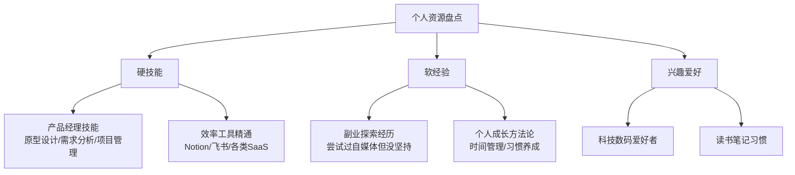
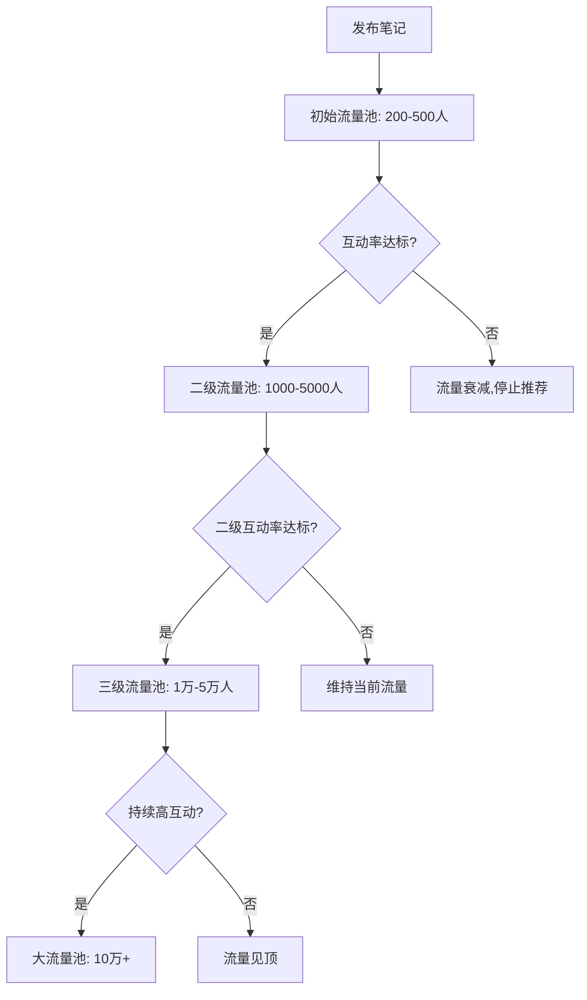
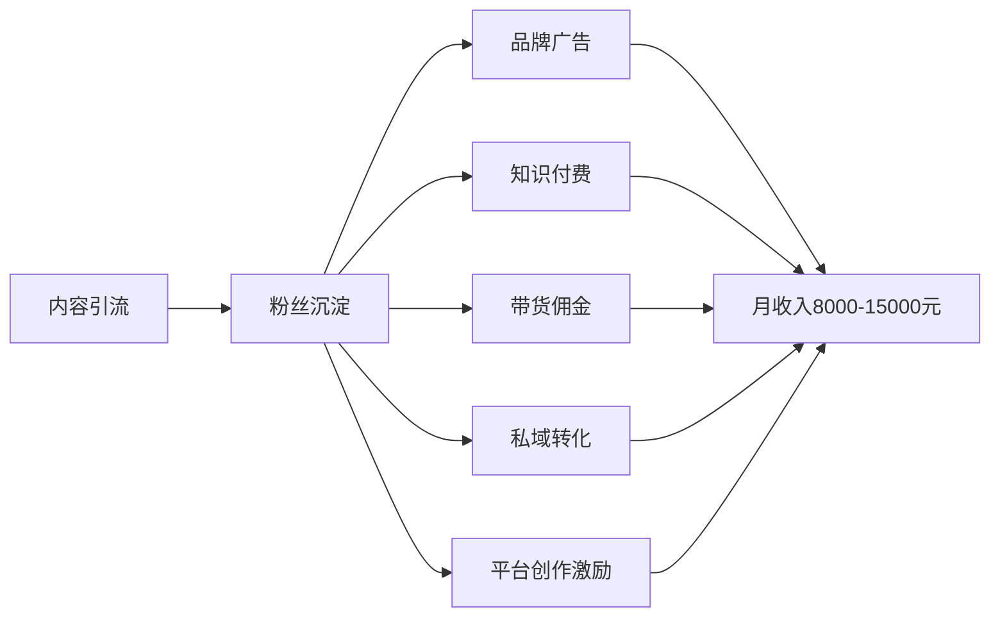

## 案例一：从0到10万粉的小红书运营实录

> 小红书是目前对素人最友好的内容平台之一——它的算法不以粉丝量为分发核心，而是以内容质量为第一权重。这意味着一个零粉丝的新号，只要内容足够好，依然可以获得与百万大号同台竞争的流量机会。本案例完整记录一位职场人士如何用副业时间，在8个月内从零做到10万粉丝、月入稳定过万的全过程。不仅记录"做了什么"，更深入分析"为什么有效"，以及每个关键决策背后的逻辑推演。

### 一、案例背景与主角画像

#### 1.1 主角基本情况

| 维度 | 详情 |
|------|------|
| 化名 | 小林 |
| 年龄 | 27岁 |
| 职业 | 互联网公司产品经理（本职） |
| 启动时间 | 2024年3月 |
| 可投入时间 | 工作日晚上1-2小时 + 周末半天 |
| 初始资金投入 | 约500元（手机支架、补光灯、少量付费工具） |
| 专业背景 | 3年产品经理经验，擅长职场效率工具使用 |
| 目标 | 8个月内突破10万粉丝，月副业收入过万 |

#### 1.2 为什么选择小红书

小林在启动前花了整整一周对比主流平台，从流量机制、新手友好度、变现门槛、内容制作成本四个维度做了系统评估：

| 平台 | 流量机制 | 新手友好度 | 变现门槛 | 适合的内容类型 | 制作成本 |
|------|----------|-----------|----------|--------------|---------|
| 小红书 | 内容质量优先，去中心化分发 | ★★★★★ | 粉丝1000即可接广告 | 图文为主，短视频为辅 | 低（手机拍图+写字） |
| 抖音 | 完播率+互动率，偏头部 | ★★★ | 需1000粉+持续爆款 | 短视频，需要剪辑能力 | 中高（拍摄+剪辑） |
| B站 | 粉丝推荐+搜索，偏存量 | ★★★ | 需1000粉+10万播放 | 长视频，制作成本高 | 高（脚本+拍摄+后期） |
| 公众号 | 社交裂变+搜索，私域为主 | ★★ | 需500粉开通流量主 | 长文，需要文字功底 | 中（排版+配图） |
| 视频号 | 社交推荐+算法推荐混合 | ★★★ | 需1000粉+内容质量分 | 短视频，中老年用户多 | 中（拍摄+剪辑） |

小红书的核心优势在于：

- **图文门槛低**：不需要视频拍摄和剪辑技能，用手机拍图+写字就能起步。对比抖音需要灯光、收音、剪辑的高门槛，小红书的图文笔记只需要一部手机和一个修图App
- **去中心化算法**：新号有冷启动扶持，不完全依赖已有粉丝基数。算法会给每篇笔记一个200-500人的初始流量池，根据互动数据决定是否扩大推荐
- **搜索流量占比高**：约40%的流量来自搜索，内容有长尾效应，一篇好笔记可以持续带来流量6-12个月。这意味着即使你停更，老内容依然能带来流量
- **用户消费意愿强**：小红书用户天然有"种草-拔草"心智，变现路径短。用户来小红书就是为了找答案、找推荐，对商业内容的接受度远高于其他平台
- **女性用户占比高**：美妆、穿搭、家居、职场等品类需求旺盛，且女性用户的付费意愿和分享意愿都更强
- **社区氛围友好**：相比其他平台，小红书用户更愿意给出正向反馈，对新创作者更包容，评论区的戾气明显低于抖音和微博

#### 1.3 定位选择过程

小林没有盲目开号，而是花了两周时间做定位调研。定位是整个账号的地基——地基不稳，后面所有努力都是空中楼阁。

**第一步：盘点自身资源**

列出自己擅长的、有经验积累的、能持续产出内容的领域：



盘点的核心原则：**能持续产出 > 擅长但素材有限**。小林列出了4个方向，但"产品经理技能"虽然最专业，素材来源却受限于工作中能公开分享的部分；而"效率工具"则可以无限扩展——每周都有新工具发布，素材取之不尽。

**第二步：分析平台供需**

在小红书搜索各关键词，观察搜索结果和竞争程度：

| 关键词 | 笔记数量 | 竞争程度 | 头部账号粉丝量 | 判断 |
|--------|---------|---------|-------------|------|
| 产品经理 | 50万+ | 高 | 50万+ | 红海，难以突围 |
| Notion模板 | 8万+ | 中 | 20万+ | 有空间，但同质化 |
| 职场效率 | 30万+ | 中高 | 30万+ | 需要差异化 |
| 打工人神器 | 5万+ | 中低 | 10万+ | 蓝海机会 |
| 办公技巧 | 15万+ | 中 | 15万+ | 需求大，可切入 |
| AI工具推荐 | 3万+ | 中低 | 15万+ | 快速增长中的蓝海 |

**第三步：确定差异化定位**

最终定位：**"打工人效率提升"**——聚焦职场人群，分享能立刻上手的工具和方法，风格接地气、不端着。

定位公式：**目标人群 + 核心需求 + 差异化风格**

- 目标人群：25-35岁职场人
- 核心需求：提升工作效率、减轻职场焦虑
- 差异化风格：不讲大道理，只给"今天就能用"的干货

这个定位的优势在于：受众基数大（中国有近4亿白领）、内容素材来源于日常工作（不需要额外采集）、与本职产品经理技能高度相关（专业背书强）。

**定位自检清单**（小林实际使用的评估框架）：

| 检查项 | 问题 | 小林的回答 |
|--------|------|----------|
| 需求验证 | 这个领域在小红书有搜索量吗？ | "办公技巧"月搜索量100万+，"AI工具"月搜索量50万+ |
| 竞争评估 | 头部账号是否已经占据绝对优势？ | 头部账号10万粉级别，没有百万粉垄断者 |
| 素材可持续性 | 我能持续产出至少100篇内容吗？ | 每周2-3个新工具+工作中的效率技巧，一年200篇没问题 |
| 变现潜力 | 这个领域的用户愿意为什么付费？ | 工具会员、效率课程、办公用品都有付费意愿 |
| 个人匹配 | 我有资格/能力做这个内容吗？ | 3年产品经理经验，日常就是研究和使用各类效率工具 |

**第四步：竞品账号深度拆解**

在确定定位后，小林花3天时间拆解了5个同领域头部账号，记录以下维度：

| 拆解维度 | 记录内容 | 用途 |
|----------|---------|------|
| 内容类型分布 | 图文/视频/合集占比 | 确定自己的内容形式比例 |
| 发布频率 | 日更/隔日/周更 | 制定自己的发布节奏 |
| 爆款特征 | 标题结构、首图风格、内容框架 | 提炼可复用的模板 |
| 评论区风格 | 作者回复方式、互动话术 | 学习社区运营技巧 |
| 变现方式 | 广告/带货/课程/私域 | 规划变现路径 |
| 粉丝画像 | 从评论区推断年龄/职业/需求 | 精准匹配内容 |
| 内容缺口 | 评论区中用户问但未被回答的问题 | 发现未被满足的需求 |

通过竞品拆解，小林发现了两个重要机会点：

第一，多数同类账号偏严肃教学风格，缺少"段子手"式的轻松表达。用户评论区频繁出现"看不下去""太干了看睡着了"的反馈——说明市场需要更轻松的表达方式。

第二，多数账号只做工具推荐，不做"工具+方法论"的组合内容。工具是手段，方法论才是用户真正需要的——用户不只想知道"用什么工具"，更想知道"怎么用好这个工具解决具体问题"。

这两个差异点后来成为小林账号的核心竞争力。

### 二、冷启动阶段（第1-2个月）

#### 2.1 账号搭建

账号搭建看似简单，但每个细节都影响算法对你账号的初始判断和用户的第一印象。

**头像设计**：使用AI工具生成的职业风格卡通头像（避免真人照片的隐私问题，同时比默认头像更有辨识度）。头像用蓝绿色调，传递专业+活力的感觉。制作工具推荐：Midjourney生成基础形象，Canva添加文字和边框。

头像设计的核心原则：
- **辨识度优先**：在一堆头像中要能被一眼认出来，避免使用过于常见的素材
- **与定位一致**：做职场内容就不要用二次元头像，做美食内容就不要用纯文字头像
- **颜色鲜明**：小红书的界面是白色背景，暖色调或高饱和度的头像更容易被注意到
- **尺寸适配**：头像显示尺寸很小（约40px），不要放太多细节，主体要大且清晰

**昵称选择**：最初叫"小林聊职场"，后来改为"效率打工人小林"——加入了"打工人"这个有共鸣的标签，搜索友好度也更高。

好昵称的三个标准：
1. **包含核心关键词**（利于搜索）：用户搜索"打工人""效率"时有机会看到你的账号
2. **有辨识度**（不容易和其他账号混淆）：避免"小X说职场"这类泛用格式
3. **传达定位**（一看就知道做什么内容）：新用户在搜索结果中扫一眼就知道你是干什么的

**简介优化**（经历3次迭代）：

| 版本 | 内容 | 问题 |
|------|------|------|
| V1 | "产品经理｜分享职场干货" | 太泛，没有记忆点 |
| V2 | "打工人效率神器分享｜让你准时下班" | 有痛点但不够具体 |
| V3 | "3年产品经理｜每天分享1个让你早下班的办公神器｜已帮助1万+打工人提效" | 有身份背书+具体价值+社会证明 |

V3版本之所以有效，是因为它同时满足了三个要素：**身份背书**（3年产品经理——说明你是专业的）、**具体承诺**（每天1个办公神器——用户知道关注你能得到什么）、**社会证明**（已帮助1万+打工人——别人已经验证过了）。

**个人主页背景图**：用Canva制作，写上"关注我，每天早下班1小时"，强化定位认知。背景图是很多新手忽视的细节，但在用户访问主页时，背景图占屏幕近1/3的面积，是强化品牌印象的重要位置。

**账号设置细节**：
- 性别设置：如实填写（小红书会根据性别调整推荐策略）
- 地区设置：选择一线城市（一线城市的内容更容易被推荐给全国用户）
- 专业号认证：粉丝达到500后申请"职场博主"专业号认证，获得官方流量扶持
- 小红书号：设置一个好记的ID（避免用默认的随机数字），方便口头传播

#### 2.2 内容策略制定

**内容方向矩阵**：

| 内容类型 | 占比 | 目的 | 示例选题 |
|----------|------|------|---------|
| 工具推荐 | 40% | 获取搜索流量+涨粉 | "5个免费的AI写作工具，打工人必备" |
| 效率方法 | 25% | 建立专业形象 | "用番茄钟工作法，我每天多出2小时" |
| 职场干货 | 20% | 增强互动和收藏 | "开会时领导说的这5句话，你要听懂潜台词" |
| 个人故事 | 15% | 建立人设和信任 | "从月薪5000到副业过万，我的3年复盘" |

这个比例不是拍脑袋决定的，而是根据以下逻辑推导的：40%的工具推荐类内容是"引流款"，搜索量大、收藏率高，是涨粉的核心引擎；25%的效率方法是"专业款"，建立你在用户心中的专家形象；20%的职场干货是"互动款"，这类内容情绪共鸣强，评论区活跃度高；15%的个人故事是"信任款"，让粉丝觉得你是一个真实的人，而不仅仅是一个内容机器。

**发布节奏**：工作日每天1篇图文笔记（晚上8-9点发布），周末1篇视频笔记。坚持日更。

日更的重要性在于：
- 算法会统计你的发布频率，高频发布者获得额外的流量扶持
- 更多的笔记 = 更多的"彩票"，爆款是在持续发布中概率性出现的
- 每天发布能保持账号活跃度，避免算法认为你是"僵尸号"
- 培养用户的期待习惯，粉丝会形成"每天看他更新"的心理预期

**小红书搜索SEO策略**（很多新手忽视的关键环节）：

小红书约40%的流量来自搜索，做好SEO意味着内容有长尾效应。一篇SEO做得好的笔记，可以持续6-12个月带来稳定的搜索流量——这是推荐流量无法比拟的。

1. **关键词研究**：在小红书搜索框输入核心词，记录下拉联想词。例如输入"办公工具"，联想词包括"办公工具推荐""办公工具神器""办公工具效率"等，这些都是用户真实搜索的高频词。进一步的方法是：在联想词后面依次加a、b、c...26个字母，看会联想出什么词——这是挖掘长尾关键词的高效技巧
2. **标题植入关键词**：标题必须包含1-2个核心搜索词。例如"打工人必备的10个办公工具"比"这些工具太好用了"搜索流量高5-10倍。标题中的关键词越靠前，搜索权重越高
3. **正文关键词密度**：正文中自然出现核心关键词3-5次，不要堆砌，要在自然语境中出现。小红书的NLP算法能识别关键词堆砌，过度堆砌反而会被降权
4. **话题标签选择**：选择3-5个话题标签，优先选择浏览量在1000万-1亿之间的中等热度话题（太热容易被淹没，太冷没有流量）。标签的选择策略是：2个大标签（浏览量>5000万）+ 2个中标签（浏览量1000万-5000万）+ 1个小标签（浏览量<1000万，精准匹配）
5. **图片文字识别**：小红书的算法会识别图片中的文字，所以图片上的文字标注也包含关键词。在封面图和正文中加入关键词文字，等于多了一个被索引的渠道

**内容创作SOP**（每篇笔记的标准化流程）：

```text
1. 选题确认（10分钟）
   - 查看小红书搜索联想词
   - 检查竞品笔记的数据表现
   - 确认选题有搜索量且竞争可控
   - 记入选题库（Notion数据库，记录选题/状态/数据）

2. 素材准备（15分钟）
   - 截图/拍摄工具界面
   - 用醒图/黄油相机做简单美化
   - 准备3-6张配图
   - 每张图加文字标注（不超过8个字/张）

3. 正文撰写（20分钟）
   - 标题：数字+痛点+解决方案（写3个备选标题，选最好的）
   - 开头：前3行必须有钩子（痛点/反差/悬念）
   - 正文：分点陈述，每点配图
   - 结尾：引导互动（提问/投票）
   - 总字数控制在500-800字（太长影响完读率）

4. 发布优化（5分钟）
   - 选择合适的话题标签（3-5个）
   - @相关官方账号（如@小红书创作学院）
   - 添加地点（增加曝光维度）
   - 发布后立即自评第一条（引导讨论方向）

5. 发布后维护（持续2小时）
   - 前30分钟：回复所有评论，引导讨论方向
   - 30-60分钟：主动去同类笔记下互动（不打广告，真诚评论）
   - 60-120分钟：继续回复新评论，保持互动热度
   - 120分钟后：检查数据，记录到数据追踪表
```

#### 2.3 A/B测试方法论

小林在冷启动阶段系统化地进行了A/B测试，用数据而非直觉来优化内容：

**测试维度与方法**：

| 测试维度 | 变量A | 变量B | 测试方法 | 结论 |
|----------|-------|-------|---------|------|
| 标题风格 | 纯干货型"5个效率工具" | 悬念型"用了第3个我直接跪了" | 同类内容不同标题，各发5篇 | 悬念型点击率高40%，但收藏率低15% |
| 首图风格 | 工具截图拼图 | 统一模板+大字标题 | 各发5篇对比 | 模板型点击率高60% |
| 发布时间 | 晚8点 | 晚10点 | 同类内容各发3篇 | 8点浏览量高20%，但10点收藏率高10% |
| 内容长度 | 300字短文 | 800字长文 | 同主题各发3篇 | 长文收藏率高50%，短文点赞率高30% |
| 互动引导 | 结尾提问 | 结尾投票 | 各发5篇 | 投票型评论数高80% |

A/B测试的核心原则：**每次只变一个变量**，其他条件尽量保持一致（同类选题、同类发布时间、同类首图风格），这样才能归因。每组测试至少3-5篇样本，单篇的随机性太大不能作为结论。

#### 2.4 前30篇笔记的详细复盘

冷启动阶段发布了32篇笔记，数据表现如下：

| 笔记编号 | 选题 | 小眼睛（浏览） | 点赞 | 收藏 | 评论 | 分析 |
|----------|------|---------------|------|------|------|------|
| 1-5 | 通用职场干货 | 200-500 | 5-15 | 3-8 | 0-2 | 冷启动期，流量池小 |
| 6-10 | 工具推荐类 | 500-2000 | 20-80 | 15-60 | 2-5 | 工具类开始获得搜索流量 |
| 11-15 | 蹭热点（职场话题） | 1000-5000 | 50-200 | 30-100 | 5-15 | 热点有短期爆发力 |
| 16-20 | 系列化工具测评 | 2000-8000 | 80-300 | 60-250 | 8-20 | 系列内容开始建立期待 |
| 21-25 | 职场潜规则/黑话 | 3000-15000 | 150-500 | 100-300 | 20-50 | 情绪共鸣型内容爆发力强 |
| 26-32 | 深度工具教程 | 5000-20000 | 200-800 | 150-600 | 10-30 | 搜索流量稳定增长 |

**关键转折点**：第18篇笔记《打工人必备的10个Chrome插件，第5个我直接跪了》获得了第一篇"小爆款"——浏览量突破1万，点赞500+，收藏400+。这篇笔记的特点是：标题有数字+悬念、内容确实实用、配图是每个插件的界面截图+一句话点评。

**冷启动阶段数据汇总**：

| 指标 | 数值 |
|------|------|
| 发布笔记数 | 32篇 |
| 总浏览量 | 约12万 |
| 总点赞数 | 约3500 |
| 总收藏数 | 约2800 |
| 净增粉丝 | 约1200人 |
| 单篇最高浏览 | 2.1万 |
| 单篇最高点赞 | 780 |
| 平均互动率 | 6.8% |

### 三、成长突破阶段（第3-5个月）

#### 3.1 内容迭代策略

进入成长期后，小林开始系统化分析数据，用数据指导内容优化：

**爆款笔记拆解方法**：

将过去30篇笔记按数据表现分为三档：
- **A档**（浏览>5000）：分析共同特征，复制成功要素
- **B档**（浏览1000-5000）：分析提升空间，优化薄弱环节
- **C档**（浏览<1000）：分析失败原因，避免重复踩坑

通过拆解发现以下规律：

| 维度 | A档笔记特征 | C档笔记特征 |
|------|-----------|-----------|
| 标题 | 有数字、有悬念、有痛点 | 平铺直叙、没有情绪钩子 |
| 首图 | 信息量大、色彩鲜明、有文字标注 | 纯截图、无设计感 |
| 内容结构 | 分点清晰、每点配图、有总结 | 大段文字、缺少视觉元素 |
| 话题选择 | 搜索量大、竞争中等 | 太冷门或太红海 |
| 发布时间 | 晚8-10点 | 上午或下午 |
| 互动引导 | 结尾有提问/投票 | 没有互动引导 |
| 信息密度 | 每个段落都有"干货点" | 存在大量铺垫和过渡语 |

**标题公式总结**（反复验证有效的5种模式）：

1. **数字+结果**："用了这3个工具，我每天早下班2小时"
2. **对比+反差**："月薪3000和月薪3万的人，用的工具完全不同"
3. **痛点+方案**："开会总是记不住重点？这个方法一劳永逸"
4. **盘点+排名**："2024年最好用的5个AI工具，最后一个绝了"
5. **故事+悬念**："领导突然让我3天出方案，我用这个方法1天就搞定了"

每种标题公式背后的心理机制各不相同：数字+结果满足用户的"确定性需求"（我知道能得到什么）；对比+反差利用了"损失厌恶"心理（我不想成为低薪的那个人）；痛点+方案直接击中用户的焦虑点；盘点+排名利用了"权威效应"和好奇心；故事+悬念则是最古老的叙事驱动。

**首图设计规范**（直接影响点击率的核心要素）：

| 设计要素 | 具体要求 | 常见错误 |
|----------|---------|---------|
| 主文字 | 12-16个字，大号加粗，颜色与背景形成强对比 | 文字太小、颜色太浅 |
| 副文字 | 补充说明或利益点，字号为主文字的60% | 副文字抢主文字的注意力 |
| 背景色 | 选择高饱和度的纯色或渐变背景 | 使用杂乱的背景图 |
| 信息密度 | 首图要传达"这篇笔记能给你什么" | 纯装饰没有信息量 |
| 统一风格 | 所有笔记的首图保持统一的设计模板 | 每篇风格不同，没有辨识度 |
| 人脸元素 | 有人脸的首图点击率高20-30% | 完全没有人格化元素 |

**首图模板体系**（小林最终固定使用的3套模板）：

| 模板名 | 适用场景 | 设计结构 | 配色方案 |
|--------|---------|---------|---------|
| 干货模板 | 工具推荐/方法论 | 左侧大字标题+右侧工具截图 | 深蓝底+白字+黄字高亮 |
| 对比模板 | 盘点/排名/对比 | 上下分割，A vs B结构 | 红绿对比色 |
| 故事模板 | 个人经历/复盘 | 人物剪影+金句文字 | 暖色渐变底+深色字 |

使用统一模板的好处：降低每篇笔记的设计时间（从30分钟缩短到10分钟）、形成视觉品牌辨识度（用户在信息流中一眼就能认出你的笔记）、新笔记可以复用旧模板只需要替换文字。

#### 3.2 爆款内容打造

第4个月迎来了真正的爆发期。一篇关于"用AI工具提升10倍工作效率"的笔记获得了10万+浏览：

**爆款笔记完整复盘**：

```text
标题：月薪3千和月薪3万的人，用的AI工具完全不同（附10个神器）

首图设计：
- 背景：深蓝色渐变（科技感）
- 主文字："10个AI神器"（大号白色加粗）
- 副文字："打工人效率提升10倍"（小号黄色）
- 角落：个人水印logo

正文结构（笔记原文要点）：
1. ChatGPT：万能助手，写邮件/总结/翻译/代码
2. Notion AI：笔记+AI，知识管理神器
3. Gamma：一句话做PPT，告别加班做PPT
4. Midjourney：AI画图，设计师都要失业了
5. Otter.ai：会议录音自动转文字+总结
6. Claude：长文档分析，比GPT更准
7. Cursor：不会写代码也能做小程序
8. Perplexity：AI搜索引擎，比百度好用100倍
9. 剪映：AI自动剪辑视频
10. 飞书妙记：会议纪要自动生成

每个工具：1张截图 + 1句话介绍 + 使用场景 + 是否免费

结尾引导：
"你最想了解哪个工具的详细教程？评论区告诉我，
点赞最高的我下周出详细教程！"

标签：#AI工具 #打工人 #效率提升 #办公神器 #职场干货
```

**这篇笔记为什么能爆——逐层拆解**：

| 要素 | 具体做法 | 为什么有效 |
|------|---------|-----------|
| 标题 | "月薪3千vs月薪3万"制造阶层对比 | 损失厌恶心理驱动点击 |
| 标题 | "附10个神器"明确数量 | 用户知道能得到10个推荐，确定性高 |
| 首图 | 大字"10个AI神器"+科技感配色 | 信息传递快，视觉冲击强 |
| 内容结构 | 10个工具，每个独立成段 | 信息密度高，收藏价值大 |
| 内容深度 | 每个工具有截图+场景+价格 | 不是简单罗列，有实际使用指导 |
| 互动引导 | "评论区告诉我" | 利用投票心理驱动评论 |
| 时效性 | AI工具在2024年是热门话题 | 蹭上了"AI热"的搜索流量 |
| SEO | 标题含"AI工具""神器" | 覆盖了高频搜索词 |

**这篇笔记的数据表现**：

| 指标 | 数值 | 同期平均值 | 倍数 |
|------|------|----------|------|
| 浏览量 | 128,000 | 3,500 | 36倍 |
| 点赞数 | 8,200 | 150 | 55倍 |
| 收藏数 | 12,500 | 120 | 104倍 |
| 评论数 | 1,800 | 15 | 120倍 |
| 新增粉丝 | 3,200 | 80 | 40倍 |
| 分享数 | 2,100 | 30 | 70倍 |

收藏数远高于点赞数，说明内容实用性极强——用户收藏是为了"以后用到的时候翻出来"。

#### 3.3 流量密码深度分析

通过持续的数据追踪，小林总结出小红书流量的底层逻辑：

**小红书推荐算法的工作机制**：



**各流量池的互动率门槛**（基于小林的实测数据）：

| 流量池 | 浏览量范围 | 需要的互动率 | 互动率计算方式 |
|--------|----------|------------|-------------|
| 初始池 | 200-500 | >5% | (点赞+收藏+评论+分享)/浏览 |
| 二级池 | 1000-5000 | >8% | 同上 |
| 三级池 | 1万-5万 | >6% | 同上（分母大了，门槛略降） |
| 大池 | 10万+ | >4% | 同上（维持即可） |

**关键发现**：收藏率是小红书最核心的权重指标。收藏代表"有用"，这是小红书作为"生活方式搜索引擎"的核心定位。一篇笔记如果收藏率高于点赞率，往往能获得更多推荐。

**各互动指标的权重排序**（基于实测和社区经验）：

| 指标 | 权重等级 | 说明 |
|------|---------|------|
| 收藏 | ★★★★★ | 最核心指标，代表内容的实用价值 |
| 评论 | ★★★★ | 代表内容引发的讨论深度 |
| 分享 | ★★★★ | 代表内容的社交传播价值 |
| 点赞 | ★★★ | 代表内容的基本认可度 |
| 完播率 | ★★★ | 视频笔记专用，代表内容的吸引力 |
| 停留时长 | ★★★ | 代表内容的信息密度和吸引力 |

**发布时间优化**：

| 时间段 | 用户活跃度 | 适合的内容类型 |
|--------|----------|-------------|
| 早7-9点 | 中高 | 通勤场景：短平快的工具推荐 |
| 午12-13点 | 高 | 午休场景：轻松的职场故事/段子 |
| 晚18-19点 | 高 | 下班场景：深度教程/方法论 |
| 晚20-22点 | 最高 | 黄金时段：所有类型内容 |
| 周末全天 | 中高 | 生活方式类：个人故事/复盘 |

小林最终固定在工作日晚8:30发布，这个时段的原因是：用户刚吃完晚饭、刷手机的高峰开始、距离睡觉还有1-2小时（有时间阅读和互动）、竞争对手中很多大号选择8点整发布（错开5-10分钟避免正面竞争）。

#### 3.4 粉丝增长曲线

| 时间节点 | 累计粉丝 | 月增粉丝 | 关键事件 |
|----------|---------|---------|---------|
| 第1个月末 | 300 | 300 | 冷启动期，内容在摸索 |
| 第2个月末 | 1,200 | 900 | 第一篇小爆款出现 |
| 第3个月末 | 4,500 | 3,300 | 内容方向确定，产出稳定 |
| 第4个月末 | 18,000 | 13,500 | AI工具篇爆款，爆发增长 |
| 第5个月末 | 38,000 | 20,000 | 多篇爆款持续产出 |
| 第6个月末 | 58,000 | 20,000 | 增长进入稳态 |
| 第7个月末 | 82,000 | 24,000 | 矩阵号开始引流 |
| 第8个月末 | 103,000 | 21,000 | 达成10万粉目标 |

增长曲线呈现典型的"S型"——前期缓慢积累，中期爆发式增长，后期增速回落但绝对值稳定。

### 四、变现体系搭建（第4个月起）

#### 4.1 变现路径规划

小林没有等到粉丝很多才开始变现，而是从第4个月（约1万粉丝）就开始布局。变现不是"等粉丝多了再想"的事情，而是需要提前规划、小步测试、逐步放大的过程。



**变现时机判断标准**：

| 信号 | 具体表现 | 说明 |
|------|---------|------|
| 粉丝破1000 | 小红书开通商品笔记权限 | 可以开始带货测试 |
| 粉丝破5000 | 蒲公英平台可接广告 | 可以开始接低价广告 |
| 粉丝破1万 | 品牌方主动联系增多 | 可以系统化接广告 |
| 评论区出现需求 | "求教程""怎么学" | 说明有知识付费的机会 |
| 私信咨询增多 | "能推荐XX吗" | 说明有带货和私域的机会 |

#### 4.2 品牌广告合作

**接单渠道**：

| 渠道 | 特点 | 适合粉丝量 | 抽成比例 |
|------|------|----------|---------|
| 小红书蒲公英平台 | 官方平台，安全合规 | 5000+ | 10% |
| 蒲公英直接邀约 | 品牌主动联系 | 1万+ | 无 |
| 第三方MCN中介 | 资源多但抽成高 | 1000+ | 20-30% |
| 私下合作（不推荐） | 有违规风险 | 任意 | 无 |

**报价策略**：

小林的报价公式：**粉丝数 × 0.03-0.05元 = 单条图文广告报价**

| 粉丝量 | 单条报价 | 月接单量 | 月广告收入 |
|--------|---------|---------|----------|
| 1万粉 | 300-500元 | 2-3条 | 600-1500元 |
| 3万粉 | 800-1500元 | 3-4条 | 2400-6000元 |
| 5万粉 | 1500-2500元 | 4-5条 | 6000-12500元 |
| 10万粉 | 3000-5000元 | 4-6条 | 12000-30000元 |

报价的浮动空间取决于三个因素：**互动率**（互动率高于同量级博主可以溢价20-30%）、**垂直度**（越垂直的账号粉丝越精准，品牌愿意付更高价格）、**内容形式**（视频笔记报价是图文笔记的1.5-2倍）。

**广告内容创作原则**：广告笔记也要有干货价值，不能纯硬推。小林的做法是"80%干货+20%植入"——先分享真实的效率提升方法，然后自然地提到合作产品是其中一个好用的工具。这种做法让广告笔记的数据也能保持在正常笔记的70-80%，维护了账号权重。

**接广告的红线**：
- 不接与定位无关的品牌（如美妆、食品）——会打乱账号标签
- 不接夸大效果的产品（如"用了立刻升职加薪"）——损害粉丝信任
- 每月广告占比不超过总笔记的30%（避免粉丝反感）
- 必须在蒲公英平台走正规流程（避免违规风险）
- 不接竞品品牌同时期投放（如同时接Notion和飞书的广告，会显得没有立场）

**品牌合作谈判技巧**：

| 谈判要点 | 具体做法 | 常见陷阱 |
|----------|---------|---------|
| 报价依据 | 用近30天的平均互动数据作为报价支撑 | 不要只看粉丝数，互动率更重要 |
| 合作形式 | 优先选择"软植入"而非"硬广" | 品牌方常要求硬广，需要据理力争 |
| 修改权 | 合同中写明"最多修改2次" | 无限修改会消耗大量时间 |
| 付款方式 | 预付50%，发布后付尾款 | 不接受"发布后30天付款" |
| 数据保底 | 不承诺具体数据，只承诺用心创作 | 承诺具体数据会给自己挖坑 |
| 排他期 | 最多7天，不接受30天以上的排他 | 长排他期严重影响收入 |
| 素材授权 | 合同写明素材仅限小红书使用 | 品牌方可能拿你的素材投其他平台 |

**合规注意事项**：
- 广告笔记必须通过蒲公英平台发布，否则可能被限流或封号
- 笔记中必须标注"广告"或"合作"标识
- 不能使用绝对化用语（如"最好""第一""100%有效"）
- 不能虚构使用体验，必须基于真实使用感受
- 保留与品牌方的聊天记录和合同，以备纠纷
- 注意广告法相关条款，特别是涉及健康、金融等敏感品类

#### 4.3 知识付费产品

**产品矩阵设计**：

| 产品 | 价格 | 内容 | 定位 |
|------|------|------|------|
| 免费资料包 | 0元 | "100个效率工具清单"PDF | 引流，导入私域 |
| 低价入门课 | 9.9元 | "7天效率提升训练营"（录播） | 筛选付费意愿用户 |
| 中价系统课 | 199元 | "职场效率提升30天系统课"（录播+社群） | 主力变现产品 |
| 高价1对1 | 999元/次 | "个人效率体系诊断+定制方案" | 高客单价，限量供应 |

这个产品矩阵遵循了经典的"价值阶梯"模型：免费产品让用户认识你，低价产品让用户信任你，中价产品提供核心价值，高价产品满足个性化需求。每一层都在筛选——只有10%的免费用户会买9.9元课，只有10%的9.9元用户会买199元课，但越往上用户的忠诚度和终身价值越高。

**课程制作流程**：

1. **需求调研**：在粉丝群发起投票，了解最想学的内容。同时翻阅自己笔记的评论区，收集高频出现的问题——这些问题就是课程内容的最佳来源
2. **大纲设计**：用Notion搭建课程大纲，每节课15-20分钟。课程结构遵循"问题→原理→方法→实操→练习"的五步框架
3. **内容录制**：用OBS录屏+PPT讲解，每节录2-3遍选最好的。录制环境要求：安静的空间、稳定的收音（用领夹麦）、屏幕分辨率至少1080p
4. **平台选择**：使用小鹅通/知识星球作为课程承载平台。小鹅通适合系统课程（有完课率追踪、作业批改功能），知识星球适合轻量社群（问答+资料分享）
5. **社群运营**：购买课程的用户进入微信群，提供答疑和打卡。社群运营的关键是"仪式感"——每天的打卡模板、每周的优秀作业评选、每月的直播答疑

**知识付费收入**：

| 月份 | 免费资料下载 | 9.9元课 | 199元课 | 999元咨询 | 月知识付费收入 |
|------|-----------|--------|--------|----------|-------------|
| 第4个月 | 500人 | 30人 | 5人 | 0人 | 1,295元 |
| 第5个月 | 800人 | 50人 | 12人 | 2人 | 4,383元 |
| 第6个月 | 1200人 | 80人 | 20人 | 3人 | 7,777元 |
| 第7个月 | 1500人 | 100人 | 25人 | 5人 | 11,940元 |
| 第8个月 | 2000人 | 120人 | 30人 | 5人 | 12,173元 |

#### 4.4 带货佣金

小红书自带"商品笔记"功能，可以在笔记中挂商品链接，用户购买后获得佣金。

**选品原则**：
- 与定位强相关（办公用品、效率工具周边、书籍）
- 佣金率>20%（低于这个不值得花精力）
- 单价30-200元（太便宜佣金少，太贵转化率低）
- 自己真实用过（避免推荐翻车）
- 有差异化卖点（与同类产品有明确区别）

**带货数据**：

| 品类 | 推荐商品举例 | 月均佣金 |
|------|-----------|---------|
| 办公文具 | 人体工学鼠标、降噪耳机、桌面收纳 | 500-800元 |
| 书籍 | 《高效能人士的七个习惯》《深度工作》 | 200-400元 |
| 效率工具会员 | Notion会员、飞书高级版 | 300-600元 |
| 月均带货总收入 | — | 1000-1800元 |

**带货内容创作技巧**：不要单独发带货笔记（容易被用户识别为广告），而是在干货笔记中自然植入。例如在"10个效率工具"的笔记中，第8个推荐了一款降噪耳机并挂上商品链接——用户在获取价值的同时接受了推荐，转化率比纯带货笔记高3-5倍。

#### 4.5 私域转化

将小红书粉丝导入微信私域，是长期变现的关键。平台算法随时会变，但微信私域是自己的资产。

**引流路径**：

```text
小红书笔记 → 评论区引导"私信领取资料"
→ 私信自动回复微信号
→ 微信添加后发送免费资料
→ 朋友圈+社群持续运营
→ 转化付费产品
```

**引流话术设计**（经历了3次迭代）：

| 版本 | 话术 | 添加率 | 问题 |
|------|------|--------|------|
| V1 | "想要资料的私信我" | 3% | 太模糊，用户不知道是什么资料 |
| V2 | "私信回复'效率'领取100个工具清单" | 8% | 有所改善，但引导不够自然 |
| V3 | "评论区扣1，我私信发你整理好的工具包（含下载链接）" | 15% | 降低门槛（扣1比私信简单），明确利益 |

**私域规模**：

| 时间 | 微信好友数 | 社群数 | 社群总人数 |
|------|----------|--------|----------|
| 第5个月 | 800人 | 2个 | 400人 |
| 第6个月 | 1500人 | 4个 | 800人 |
| 第7个月 | 2500人 | 6个 | 1500人 |
| 第8个月 | 3500人 | 8个 | 2000人 |

私域的核心价值在于：不受平台算法影响，可以直接触达用户；复购率高，老用户的付费转化率是新用户的3-5倍。

**私域运营细节**：
- **朋友圈内容**：每天2-3条，包括干货分享、生活日常、用户反馈，比例为4:3:3。纯广告的朋友圈会被屏蔽，有价值的内容才能留住用户
- **社群运营**：每周一次主题分享，每天一次互动话题，每月一次直播答疑。社群最怕"死群"——建群后没有持续运营，3天不说话群就废了
- **标签管理**：按付费金额、兴趣方向、活跃度给用户打标签，实现精准推送。例如向"买过9.9元课"的用户推199元课，转化率比群发高5倍
- **自动化工具**：使用微伴助手实现自动回复、标签管理和数据统计

#### 4.6 平台创作激励

小红书的创作激励计划是很多新手忽略的收入来源：

- **创作者基金**：根据笔记数据（浏览、互动）发放现金奖励，每月100-1000元不等
- **直播打赏**：开直播时粉丝送礼物，可兑换现金
- **品牌任务**：平台官方撮合的品牌合作任务，比蒲公英更灵活

#### 4.7 收入结构全景

第8个月（10万粉丝时）的完整收入构成：

| 收入来源 | 月收入 | 占比 |
|----------|--------|------|
| 品牌广告 | 8,000元 | 40% |
| 知识付费 | 6,000元 | 30% |
| 带货佣金 | 1,500元 | 7.5% |
| 私域转化 | 3,500元 | 17.5% |
| 平台创作激励 | 1,000元 | 5% |
| **月收入总计** | **20,000元** | **100%** |

注：收入数据为稳定期月均值，实际月份会有波动。广告收入在双11、618等电商节点会翻倍。

**收入健康度分析**：小林的收入结构中，没有任何单一来源占比超过50%，这是健康的——如果广告收入占比超过70%，一旦品牌方缩减预算或账号被限流，收入会断崖式下跌。多元化的收入结构是抵御风险的最佳策略。

#### 4.8 税务与法律合规

副业收入达到一定规模后，税务和法律合规是必须面对的问题：

| 项目 | 具体要求 | 小林的做法 |
|------|---------|----------|
| 个人所得税 | 副业收入需申报个税，适用"劳务报酬"税目 | 年收入超过12万后主动申报 |
| 发票问题 | 品牌方通常需要发票 | 注册个体工商户，可以开具发票 |
| 合同签署 | 与品牌方合作应签署书面合同 | 使用简化的电子合同模板 |
| 广告法合规 | 不能使用绝对化用语、虚假宣传 | 每条广告发布前自查广告法条款 |
| 知识产权 | 原创内容受著作权保护 | 重要内容进行版权登记 |
| 隐私保护 | 不能泄露用户个人信息 | 社群中不公开用户的微信等信息 |

### 五、运营中的关键决策与转折点

#### 5.1 踩过的坑

**坑1：盲目追热点导致账号标签混乱**

第2个月，小林看到一条社会热点流量很大，发了一条相关笔记，获得了5000浏览。但之后连续3篇职场内容的数据都下降了——算法被打上了"泛生活"标签，推给了不精准的人群。

**教训**：热点可以追，但必须与账号定位强相关。比如"ChatGPT发布"这个热点，可以追（因为它与效率工具强相关）；但"某明星离婚"这种热点，哪怕流量再大也不要追。

**修复方法**：连续发布10篇以上强垂直内容，让算法重新认识你的账号标签。这个过程需要2-3周，期间数据会比较低，但必须坚持。

**坑2：过早接低质量广告**

第4个月刚到1万粉丝，有品牌找上门报价500元/条，小林连续接了3条。粉丝评论区出现"变味了""全是广告"的负面反馈，掉粉200+。

**教训**：前期宁可少赚，也要维护内容质量和粉丝信任。后来调整为每月最多4条广告，且必须是自己真实使用过的产品。

**坑3：忽视评论区运营**

前3个月，小林只管发内容，很少回复评论。后来发现评论区活跃度是算法判断内容质量的重要指标。

**调整**：每条笔记发布后的2小时内，认真回复每一条评论；对于有价值的评论，置顶并展开讨论；用"提问式"结尾引导用户评论。

评论区运营的高阶技巧：
- **自评引导**：发布后立即在评论区写一条"补充说明"或"你最想了解哪个"，引导后续用户在同一话题下讨论
- **翻牌回复**：选择有代表性的评论进行详细回复，其他用户看到后会更愿意留言（期待被"翻牌"）
- **争议制造**：适度制造无害的争议（如"你觉得A工具好还是B工具好？"），能显著提高评论数

**坑4：数据焦虑导致内容变形**

第3个月数据增长放缓时，小林开始焦虑，尝试发了一些"标题党"内容（夸大其词的标题）。短期内数据好看，但收藏率很低，长期损害了账号权重。

**教训**：数据波动是正常的，不要为了短期数据牺牲内容质量。小红书的算法有"账号信用分"机制，频繁发布低质量内容会被降权。

**坑5：忽视平台规则更新**

小红书的规则经常更新，有一次小林使用了"全网最低价"这样的绝对化用语，笔记被判定违规下架，账号被扣信用分。

**教训**：定期查看小红书官方的《社区公约》和《商业内容规范》，关注小红书创作者学院的最新课程。平台规则是底线，不能抱有侥幸心理。

**坑6：忽视内容备份**

有一次小林的手机丢了，本地存的大量素材和笔记草稿全部丢失。之后建立了双重备份机制：所有素材同步到网盘（百度网盘+阿里云盘），重要笔记在Notion中保留文字版备份。

#### 5.2 关键转折点

**转折点1：从"我觉得有用"到"数据说了算"**

前两个月，小林凭直觉选题，数据忽高忽低。从第3个月开始建立选题评估体系：先看搜索量（用小红书搜索联想和第三方工具），再看竞品数据，最后结合自身优势确定选题。数据驱动选题后，笔记平均浏览量提升了3倍。

**选题评分卡**（小林开发的选题评估工具）：

| 评估维度 | 权重 | 评分标准（1-5分） |
|----------|------|-----------------|
| 搜索量 | 30% | 5=月搜索>100万，1=月搜索<1万 |
| 竞争度 | 25% | 5=笔记<1万，1=笔记>100万 |
| 时效性 | 20% | 5=长期有效，1=转瞬即逝 |
| 个人匹配 | 15% | 5=非常擅长，1=完全不了解 |
| 变现潜力 | 10% | 5=可直接变现，1=纯内容 |

总分>3.5分的选题值得做，<2.5分的直接放弃。

**转折点2：从"单打独斗"到"加入创作者社群"**

第3个月加入了一个小红书创作者交流群，从中获得了大量实战经验：什么样的封面点击率高、什么时间段发布效果最好、怎么判断一个选题值不值得做。这些经验如果靠自己摸索，可能需要6个月以上。

**转折点3：从"只做内容"到"内容+私域双轮驱动"**

第5个月开始系统化做私域运营后，变现效率大幅提升。同样的粉丝量，有私域的收入是没有私域的2-3倍——因为私域用户的信任度更高，付费转化率更高。

**转折点4：从"单账号"到"矩阵运营"**

第6个月开设了2个辅助账号——一个做"职场穿搭"，一个做"办公桌面好物"。三个账号互相引流，总粉丝增长速度比单账号快50%。矩阵运营的核心逻辑是：用不同角度覆盖同一目标人群，提高用户触达频次和信任度。

矩阵运营的注意事项：
- 每个账号的定位必须有明确区分，不能发相同内容
- 引流要自然，不要在笔记中直接@另一个账号
- 矩阵号的内容质量不能低于主号，否则会稀释品牌
- 管理多账号需要更多时间，如果主号还没稳定，不要急于开矩阵

#### 5.3 危机应对策略

在运营过程中，小林遇到了几次危机事件，总结出以下应对框架：

| 危机类型 | 应对策略 | 具体做法 |
|----------|---------|---------|
| 笔记被限流 | 排查原因+调整内容 | 检查是否违规、是否含敏感词、是否被举报，调整后持续发布优质内容恢复权重 |
| 负面评论/黑粉 | 不删除+正面回应 | 删除评论会触发更多负面，用事实和态度回应，让围观用户看到你的专业和格局 |
| 被抄袭/搬运 | 举报+水印预防 | 向平台举报，同时在内容中加入个人水印和独特表述增加搬运成本 |
| 广告翻车 | 真诚道歉+补偿 | 如果推荐的产品出问题，第一时间发声明，说明情况并给出补偿方案 |
| 粉丝流失 | 分析原因+调整方向 | 如果连续掉粉，可能是内容方向偏离了用户需求，需要做用户调研重新校准 |
| 账号被盗 | 立即冻结+申诉 | 第一时间联系客服冻结账号，提交身份证明材料申诉找回 |

#### 5.4 与创作者合作

第5个月开始，小林尝试与其他创作者合作，获得了意想不到的增长效果：

| 合作形式 | 具体做法 | 效果 |
|----------|---------|------|
| 互推 | 与同量级账号互相推荐 | 单次互推可带来200-500新粉 |
| 联合选题 | 两个账号围绕同一话题各出一篇 | 话题热度叠加，双方都获得更多流量 |
| 嘉宾连麦 | 与其他博主在直播中连麦讨论 | 直播间人数翻倍，双方粉丝互相转化 |
| 内容共创 | 合作完成一篇深度内容 | 内容质量更高，双方粉丝都满意 |

选择合作对象的标准：粉丝量级相近（差距不超过3倍）、内容定位互补（不是直接竞争对手）、创作风格兼容（不要找风格完全相反的账号）。

### 六、可复制的方法论

#### 6.1 从0到1万粉的核心策略

| 阶段 | 时间 | 核心任务 | 关键指标 |
|------|------|---------|---------|
| 账号搭建 | 第1周 | 完善资料、确定定位、研究竞品 | 主页是否清晰传达定位 |
| 内容测试 | 第2-4周 | 日更测试不同内容方向 | 找到数据最好的2-3个方向 |
| 方向聚焦 | 第2个月 | 固定内容方向，优化标题和封面 | 平均浏览量突破1000 |
| 打磨爆款 | 第3个月 | 分析爆款规律，复制成功要素 | 出现第一篇5000+笔记 |

#### 6.2 从1万到10万粉的核心策略

| 阶段 | 时间 | 核心任务 | 关键指标 |
|------|------|---------|---------|
| 量产爆款 | 第4-5个月 | 优化内容SOP，提高爆款率 | 月均2-3篇1万+笔记 |
| 变现启动 | 第4-6个月 | 搭建多元变现体系 | 月收入破5000 |
| 矩阵布局 | 第6-8个月 | 开设辅助账号，互相引流 | 总粉丝突破10万 |
| 私域深耕 | 持续 | 深度运营微信私域 | 私域用户3000+ |

#### 6.3 高效内容创作的工具链

| 环节 | 工具 | 用途 | 费用 |
|------|------|------|------|
| 选题调研 | 小红书搜索+千瓜数据 | 查看热词、竞品数据 | 免费/99元/月 |
| 图片制作 | 醒图+黄油相机+Canva | 封面设计、图片美化 | 免费/基础版免费 |
| 文案撰写 | ChatGPT/Notion AI | 辅助撰写、润色文案 | 免费/付费版 |
| 数据分析 | 小红书创作者中心 | 查看笔记数据 | 免费 |
| 排期管理 | Notion内容日历 | 管理发布计划 | 免费 |
| 私域运营 | 企业微信+微伴助手 | 自动回复、标签管理 | 免费/基础版免费 |
| 竞品监控 | 新红数据/灰豚数据 | 监控竞品动态和行业趋势 | 99-299元/月 |
| AI绘图 | Midjourney/通义万相 | 生成封面素材和插图 | 免费/付费版 |

#### 6.4 AI工具在内容创作中的深度应用

AI工具不是替代创作者，而是放大创作者的效率。以下是小林实际使用的AI辅助工作流：

| 环节 | AI工具 | 使用方式 | 效率提升 |
|------|--------|---------|---------|
| 选题生成 | ChatGPT | 输入"我是职场效率博主，请给我10个选题"，然后人工筛选 | 选题时间从30分钟缩短到10分钟 |
| 大纲撰写 | Claude | 输入选题和目标受众，生成内容大纲，人工调整结构 | 大纲时间从20分钟缩短到5分钟 |
| 文案润色 | Notion AI | 写完初稿后用AI润色语言，保持个人风格 | 润色时间从15分钟缩短到3分钟 |
| 封面设计 | Midjourney/通义万相 | 生成封面背景图，再用Canva添加文字 | 设计时间从30分钟缩短到10分钟 |
| 数据分析 | ChatGPT+Excel | 导出数据后用AI分析趋势和规律 | 分析时间从60分钟缩短到15分钟 |

**使用AI的注意事项**：
- AI生成的内容必须经过人工审核和个性化修改，不能直接发布
- 保持个人风格的一致性，AI是辅助工具不是替代品
- 不要过度依赖AI，保持自己的内容判断力和选题敏感度
- AI生成的图片要注意版权问题，优先使用明确允许商用的工具

#### 6.5 内容跨平台复用策略

小红书的内容可以复用到其他平台，但需要根据平台特点做适配：

| 平台 | 复用方式 | 适配要点 | 预期效果 |
|------|---------|---------|---------|
| 抖音 | 将图文内容转为短视频 | 加入口播讲解，控制在60秒内 | 触达短视频用户群体 |
| B站 | 将工具推荐扩展为深度测评 | 时长5-15分钟，加入更多细节 | 建立专业深度形象 |
| 公众号 | 将图文笔记扩展为长文 | 加入更多背景分析和理论支撑 | 沉淀深度内容资产 |
| 知乎 | 将工具推荐改写为问答形式 | 回答相关问题，自然引流 | 获取搜索流量 |
| 视频号 | 将图文转为竖版短视频 | 风格偏正式，适合职场场景 | 触达微信生态用户 |

**跨平台复用的核心原则**：
- 同一个核心内容，根据不同平台的用户习惯做形式适配
- 不要在多个平台发布完全相同的内容（会被判定为搬运）
- 主平台（小红书）保持日更，其他平台每周2-3次即可
- 各平台引流到同一个私域（微信），形成流量闭环

#### 6.6 新手最常犯的10个错误

| 错误 | 表现 | 为什么是错的 | 正确做法 |
|------|------|------------|---------|
| 定位太宽 | 今天发美食，明天发职场 | 算法无法给你打上精准标签，导致推荐不精准，流量分散 | 聚焦一个垂直领域，至少坚持3个月让算法认识你 |
| 标题平淡 | "分享一个好用的工具" | 标题是决定用户是否点击的第一要素，平淡的标题意味着低点击率 | 加数字、加痛点、加悬念，参考爆款标题公式 |
| 首图无设计 | 直接截个图就发 | 首图是信息流中吸引注意力的关键，无设计感的首图会被直接划过 | 用醒图/Canva加上文字标注，保持统一的设计风格 |
| 不回复评论 | 发完就不管了 | 评论区活跃度是算法判断内容质量的重要指标，不回复会降低推荐权重 | 前2小时认真回复每条评论，用提问引导更多互动 |
| 广告太多 | 一周发3条广告 | 过多广告会降低粉丝信任度，导致掉粉和互动率下降 | 广告占比不超过30%，每条广告都要有干货价值 |
| 追无关热点 | 为了流量发与定位无关的内容 | 虽然短期有流量，但会打乱账号标签，导致后续推荐不精准 | 只追与定位相关的热点，或者把热点与自己的领域结合 |
| 不做数据复盘 | 凭感觉发内容 | 没有数据支撑的选题是盲目的，容易重复犯同样的错误 | 每周分析数据，用数据指导选题，建立爆款笔记拆解习惯 |
| 急于变现 | 500粉就想接广告 | 过早变现会损害账号形象和粉丝信任，得不偿失 | 先积累1万粉再考虑变现，前期专注内容质量 |
| 忽视搜索SEO | 标题和正文不含关键词 | 浪费了小红书40%的搜索流量，内容没有长尾效应 | 标题包含核心搜索词，正文自然植入关键词，选对话题标签 |
| 内容不系列化 | 每篇都是独立内容 | 系列内容能培养用户期待感，提高关注率和回访率 | 做系列内容（如"工具测评100期"），在笔记中预告下一期 |

### 七、心态管理与可持续运营

#### 7.1 数据焦虑的应对

前3个月的数据波动是最大的心理考验。小林的经验是：

- **不要每小时刷新数据**：发布后看一次，24小时后再看一次就够了。频繁刷新数据只会增加焦虑，不会改变结果
- **关注趋势而非单篇**：单篇数据有随机性，但月度平均数据的趋势更有参考价值。建议用Notion或Excel建立数据追踪表，每周看一次周均数据
- **设定合理预期**：新号的平均浏览量在200-500是正常的，不要拿自己和大号比。前3个月的目标是"找到方向"而不是"做出爆款"
- **保持创作节奏**：数据不好的时候更要坚持日更，算法会奖励勤奋的创作者。停更超过1周，账号权重会明显下降

#### 7.2 副业时间管理

作为全职上班族，小林的时间分配如下：

| 时间段 | 任务 | 时长 |
|--------|------|------|
| 工作日午休 | 选题调研+素材收集 | 20分钟 |
| 工作日晚上8-9点 | 内容创作+发布 | 60分钟 |
| 工作日晚上9-9:30 | 回复评论+私域运营 | 30分钟 |
| 周六上午 | 批量制作下周内容 | 3小时 |
| 周日下午 | 数据复盘+下周计划 | 1小时 |

**周均投入时间**：约12小时。关键技巧是"批量制作"——周六集中拍摄/制作5-6篇内容的素材，工作日只需要编辑和发布，大幅提高效率。

**时间管理的进阶技巧**：
- **碎片化素材收集**：工作中遇到的效率技巧，立刻截图+用手机备忘录写一句话说明，不占用专门的创作时间
- **模板化创作**：固定3-5个内容模板，新笔记只需要填空而非从零开始
- **自动化发布**：使用小红书的定时发布功能，提前排好一周的内容
- **评论批量回复**：设置固定的回复话术模板，遇到相似评论快速回复

#### 7.3 避免倦怠的方法

- **建立内容素材库**：日常工作中遇到的效率技巧随时记录到Notion，选题永远不会枯竭
- **与粉丝互动获取动力**：看到粉丝说"你的笔记帮我涨了薪"，是最强的正反馈
- **阶段性给自己奖励**：每突破一个粉丝量级，给自己买个想要的东西
- **适当休息**：每月给自己放1-2天假，用存稿定时发布
- **记录里程碑**：建立一个"成就墙"（可以用Notion看板），记录每一次突破——第一篇万赞笔记、第一次品牌合作、第一个月收入破万……这些里程碑是坚持下去的动力源泉

#### 7.4 长期可持续发展的思考

10万粉丝不是终点，而是新的起点。小林在达成10万粉后开始思考长期发展：

| 维度 | 短期（0-10万粉） | 长期（10万粉+） |
|------|-----------------|----------------|
| 内容策略 | 以工具推荐为主 | 以方法论和深度内容为主 |
| 变现模式 | 广告+带货 | 知识付费+自有产品 |
| 品牌建设 | 个人IP初步建立 | 个人品牌系统化运营 |
| 团队规模 | 一人全包 | 考虑招助理/实习生 |
| 平台依赖 | 高度依赖小红书 | 多平台+私域降低依赖 |

### 八、经验总结与核心认知

#### 8.1 10条核心认知

1. **内容质量>发布数量**：1篇爆款顶100篇平庸内容，但爆款是在持续发布中"撞"出来的
2. **收藏率是小红书的核心指标**：让用户"想收藏"比"想点赞"更重要
3. **搜索流量是基本盘**：推荐流量有波动，但搜索流量每天稳定进账
4. **人设比内容更重要**：同样的内容，有人设的账号比没有人设的账号互动率高3倍
5. **变现要趁早布局**：不要等粉丝多了再想变现，1万粉就可以开始测试
6. **私域是护城河**：平台算法随时会变，但微信私域是自己的资产
7. **数据驱动选题**：不要凭感觉选题，让数据告诉你用户想看什么
8. **系列化内容效果最好**：系列内容能培养用户期待，提高回访率和关注率
9. **评论区是第二个创作空间**：很多爆款笔记的评论区比正文还精彩
10. **坚持是最大的竞争力**：90%的创作者在3个月内放弃，坚持到第6个月你就超过了大多数人

#### 8.2 这个案例的可复制性分析

| 可复制的要素 | 不可复制的要素 |
|------------|-------------|
| 内容创作SOP | 个人专业背景和表达风格 |
| 选题评估方法 | 特定时期的平台红利 |
| 变现路径设计 | 粉丝群体的消费能力 |
| 数据分析框架 | 偶然爆款的运气成分 |
| 时间管理方法 | 个人的执行力和毅力 |
| 工具链配置 | 所在行业的竞争格局 |

核心启示：方法论是可复制的，但执行力是不可复制的。小林的成功70%归功于持续执行，30%归功于方法策略。任何人都可以按照这套方法论去执行，但能否坚持8个月不间断，才是决定成败的关键。

> **行动建议**：如果你正在考虑做小红书，今天就完成三件事——(1) 注册账号并完善资料；(2) 写下你的10个选题；(3) 发布第一篇笔记。不要等到"准备好了"再开始，因为你永远不会完全准备好。先开始，再优化。
