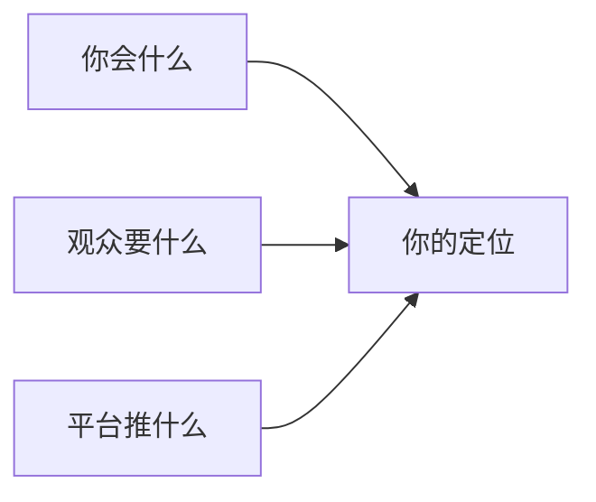
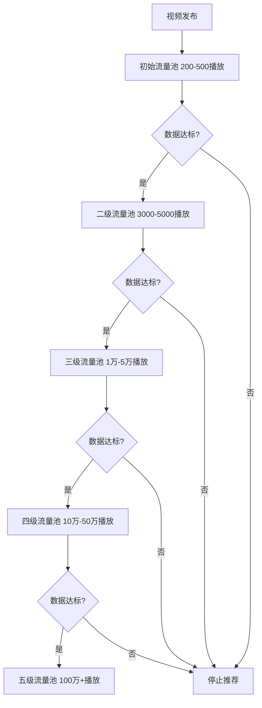
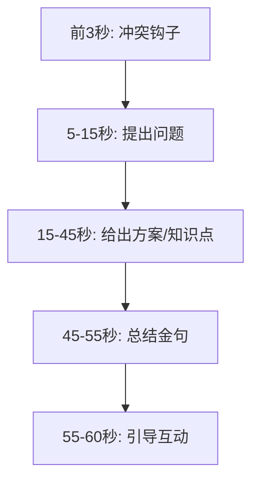
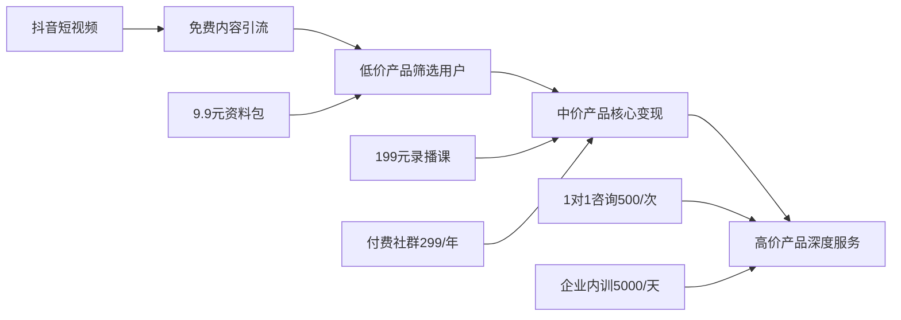
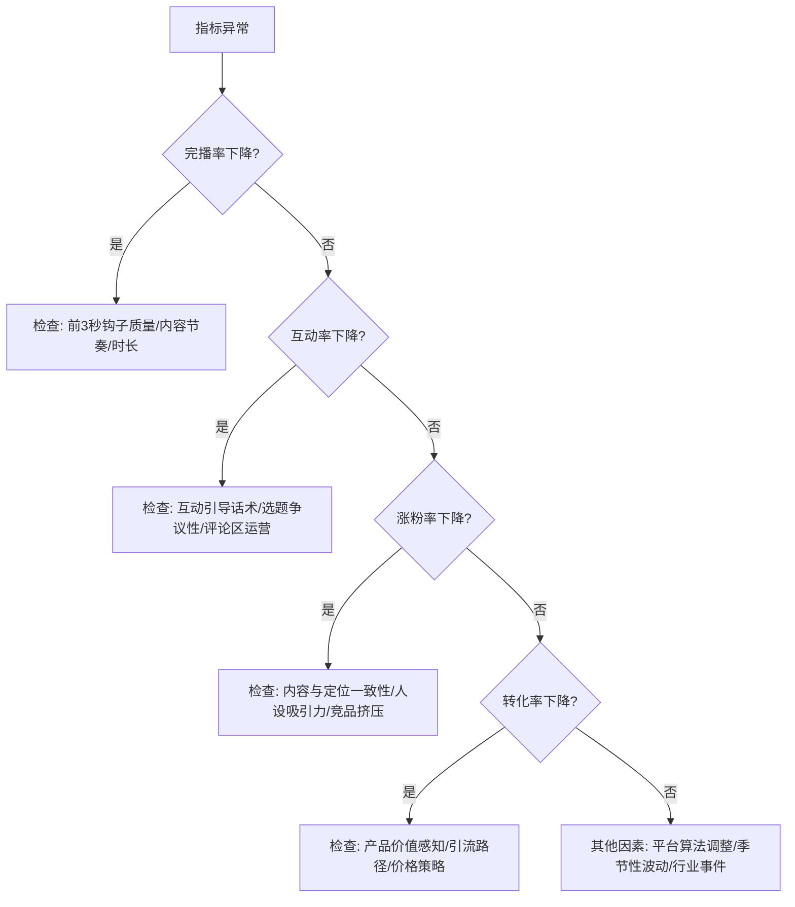
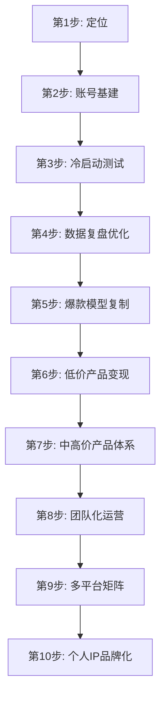

## 案例二：抖音知识博主——从程序员到百万粉

### 案例概述

这是一个程序员转型知识博主的完整路径复盘。主角"老张"（化名），30岁，二线城市Java开发工程师，月薪15K。2022年初开始在抖音做编程知识分享，从0粉丝起步，14个月突破100万粉丝，月收入从0增长到稳定8万+，最终辞去本职工作全职做内容创业。

这个案例的核心价值在于：它不是一夜爆红的运气故事，而是一套可复制的系统化方法论。老张没有任何表演天赋、不懂拍摄剪辑、不善言辞，但靠着"程序员思维"——拆解问题、迭代优化、数据驱动——硬生生跑通了一条路。

#### 为什么选这个案例

知识博主赛道竞争激烈，但程序员做知识博主有天然壁垒：

| 优势维度 | 具体表现 | 竞争壁垒 |
|---------|---------|---------|
| 专业深度 | 真实项目经验，不是纸上谈兵 | 非专业人士无法模仿 |
| 逻辑能力 | 内容结构化强，观众容易理解 | 内容质量有保障 |
| 技术能力 | 能自己做工具、脚本、自动化 | 降低运营成本 |
| 痛点共鸣 | 和目标受众（程序员/准程序员）同频 | 信任感天然建立 |
| 数据敏感 | 天然习惯看数据、做分析 | 迭代效率高于非技术背景博主 |
| 工具链 | 能写脚本批量处理字幕/封面/分发 | 边际成本趋近于零 |

#### 这个案例的适用边界

需要明确的是，老张的经验并非放之四海而皆准。它的最佳适用条件：

- **赛道**：知识/教育/技能类内容（不适用于娱乐、颜值、剧情类）
- **平台**：抖音为主（算法逻辑与B站、小红书、YouTube差异显著）
- **起步条件**：有真实的专业积累（至少2-3年从业经验）
- **时间投入**：前期每天2-3小时，中期3-4小时（兼职状态）
- **心理准备**：接受前3个月几乎零收入的现实

如果你的条件与上述差异较大，本案例的方法论仍可参考，但时间线和数据预期需要相应调整。

---

### 第一阶段：定位与冷启动（第1-2个月）

#### 自我盘点：找到内容切入点

老张没有一上来就拍视频，而是花了一周时间做系统化的自我盘点。他用了一个"三圈交集法"来确定定位：



**第一个圈：你会什么（能力盘点）**

老张列出自己的技能清单：
- 5年Java开发经验，熟悉Spring全家桶
- 独立负责过日活百万的系统架构设计
- 有面试官经验，筛选过200+简历
- 自学转行，了解零基础到就业的完整路径
- 在B站看过大量技术视频，知道什么好什么差

**第二个圈：观众要什么（需求调研）**

老张用抖音搜索框+巨量算数做了需求分析：
- "学编程"日搜索量12万+，但竞争者极多
- "程序员面试"日搜索量8万+，内容质量参差不齐
- "Java面试题"日搜索量5万+，大部分是念PPT
- "程序员副业"日搜索量3万+，蓝海竞争小
- "转行程序员"日搜索量2万+，痛点明确

**第三个圈：平台推什么（算法偏好）**

2022年抖音的流量分配特征（这个逻辑到2025年依然成立，核心指标权重有微调但底层机制不变）：
- 完播率权重最高（>30%的推荐权重）
- 15-60秒的中短视频完播率最优
- 知识类账号有"知识标签"加权
- 新号前5条视频有冷启动流量池
- 互动率（评论>转发>点赞）的权重逐年提升

**最终定位**：面向编程初学者和初级程序员，用60秒讲清一个编程知识点/面试题/职场真相。slogan定为"60秒讲透一个编程知识"。

#### 定位验证：三步确认法

老张在确定定位后没有立即全力投入，而是做了一个低成本验证：

1. **搜索验证**：在抖音搜索"Java面试"、"程序员面试"等关键词，观察头部博主的粉丝量级（50万-200万区间说明赛道足够大）、内容形式（短视频为主说明有60秒内容的空间）、互动质量（评论区是否有真实提问说明需求真实）
2. **内容供给缺口分析**：找到搜索量高但现有内容质量低的关键词——"Java面试题"虽然竞争者多，但大部分是念PPT，缺少"面试官视角"的深度解析，这就是差异化切入点
3. **小规模测试**：先发3条不同风格的视频（纯口播、代码演示、情景剧），看哪种形式的自然流量最好，再确定主力形式

#### 账号基建：专业感塑造

老张没有犯大多数新手的错误——随便起个名字就开始发。他花了3天做好账号基建：

**账号名称设计**

| 要素 | 选择 | 原因 |
|------|------|------|
| 名字 | 码上懂 | 谐音"马上懂"，暗示快速学习，含"码"字标识程序员身份 |
| 头像 | 代码背景+本人侧脸照 | 既有个人辨识度又有技术氛围 |
| 简介 | 5年Java老兵｜60秒讲透编程知识｜前大厂面试官 | 身份背书+内容承诺+信任标签 |
| 背景图 | 个人简介+更新频率+合作联系方式 | 信息完整，降低用户决策成本 |

**账号装修清单**
- 认证：先不急蓝V认证，个人号灵活度更高
- 合集：提前创建3个合集（面试系列/入门系列/职场系列）
- 置顶视频：预留给数据最好的作品（冷启动后再定）
- 抖音号：设置为容易记忆的字母+数字组合，方便口头传播

**账号基建的常见错误**

| 错误 | 为什么是错的 | 正确做法 |
|------|-------------|---------|
| 名字用真名或纯英文 | 搜索不到，无法传达定位 | 含领域关键词+记忆点 |
| 头像用风景/卡通 | 没有辨识度，知识博主需要信任感 | 真人照+职业元素 |
| 简介写"记录生活" | 浪费了最宝贵的介绍位 | 身份+价值+行动引导 |
| 不开合集 | 新用户无法系统浏览内容 | 开号即建3-5个合集 |
| 背景图空白 | 浪费广告位 | 合作信息+更新时间+引导语 |

#### 冷启动内容策略

老张的第一批内容不是随便发的，而是精心设计的"测试矩阵"：

**首批10条视频的选题规划**

| 序号 | 选题 | 类型 | 目的 |
|------|------|------|------|
| 1 | Java和Python到底学哪个 | 选择指南 | 测试"选择类"选题数据 |
| 2 | 面试官最讨厌的3种简历 | 避坑指南 | 测试"反面教材"类选题 |
| 3 | for循环5种写法你都会吗 | 知识点 | 测试纯知识类选题 |
| 4 | 程序员真实一天 | 生活记录 | 测试人设类内容 |
| 5 | 月薪5K和月薪5W的代码差在哪 | 对比冲击 | 测试"对比类"选题 |
| 6 | 3分钟学会Git基本操作 | 教程类 | 测试教程类完播率 |
| 7 | 程序员35岁真的会被淘汰吗 | 争议话题 | 测试观点类互动率 |
| 8 | 学编程最容易犯的5个错误 | 避坑指南 | 承接第2条数据验证 |
| 9 | 没学历能做程序员吗 | 灵魂拷问 | 测试"痛点类"选题 |
| 10 | 我用代码写了个表白程序 | 趣味内容 | 测试泛流量内容 |

这10条覆盖了6种选题类型，相当于一次完整的A/B测试。老张的策略核心：**用最少的内容量获取最多的类型数据**，而不是凭感觉选一个方向死磕。

#### 抖音算法的冷启动机制（深度理解）

要理解老张为什么用"测试矩阵"策略，必须先理解抖音推荐算法的工作原理：



**每个流量池的考核指标及阈值**：

| 流量池 | 播放量 | 完播率门槛 | 点赞率门槛 | 评论率门槛 | 分享率门槛 |
|--------|--------|-----------|-----------|-----------|-----------|
| 初始池 | 200-500 | >30% | >3% | >0.5% | >0.3% |
| 二级池 | 3K-5K | >25% | >4% | >1% | >0.5% |
| 三级池 | 1W-5W | >20% | >5% | >1.5% | >1% |
| 四级池 | 10W-50W | >15% | >6% | >2% | >1.5% |
| 五级池 | 100W+ | >12% | >7% | >2.5% | >2% |

这些阈值不是官方公布的，而是老张通过27条视频的数据反推出来的经验公式。核心洞察：**在初始流量池阶段，完播率是决定性指标；在高流量池阶段，互动率（尤其是评论和分享）的权重越来越大。**

**冷启动期的算法红利**：
- 新号前5条视频有"新手保护期"加权，平台会给予额外的初始流量
- 账号标签尚未建立时，推荐人群较泛，需要通过内容快速"养标签"
- 前10条视频的数据表现决定了账号的初始权重评级

#### 首批视频的拍摄标准

老张的拍摄条件很"寒酸"：一部iPhone 12 + 一个50元的手机支架 + 办公室白墙背景。但他严格遵循了一套最低可行标准：

```yaml
拍摄规范:
  画面: 竖屏9:16，人物居中，头部上方留空不超过15%
  光线: 正对窗户自然光（早9-下午3点拍摄）
  收音: AirPods Pro（后期升级为罗德wireless go II）
  背景: 白墙+一块小黑板写关键词
  字幕: 剪映自动识别+手动校对
  时长: 控制在45-75秒之间

剪辑规范:
  节奏: 每3-5秒切一次画面（避免视觉疲劳）
  开头: 前3秒必须抛出冲突或悬念
  结尾: 引导互动（"你觉得呢？评论区告诉我"）
  BGM: 音量压低到15%以下，不抢人声
  封面: 统一模板，大字标题+人物表情
```

**拍摄设备的渐进式升级路径**：

| 阶段 | 设备组合 | 成本 | 适用条件 |
|------|---------|------|---------|
| 冷启动期 | 手机+手机支架+自然光 | ~100元 | 月收入<1000元 |
| 增长期 | 手机+支架+环形灯+领夹麦 | ~500元 | 月收入1000-5000元 |
| 成熟期 | 相机/高端手机+三灯+无线麦+绿幕 | ~3000元 | 月收入>5000元 |
| 专业期 | 专业相机+灯光矩阵+提词器+声学处理 | ~1万元 | 月收入>2万元 |

老张的核心观点：**设备不是内容质量的瓶颈，内容本身才是。** 他见过太多人花几千块买设备，拍了3条就放弃了。

#### 冷启动期数据复盘

前两个月的运营数据：

| 指标 | 第1个月 | 第2个月 |
|------|---------|---------|
| 发布视频数 | 12条 | 15条 |
| 平均播放量 | 800 | 3,200 |
| 最高播放量 | 5,400 | 28,000 |
| 粉丝增长 | 320 | 1,800 |
| 平均完播率 | 22% | 31% |
| 平均点赞率 | 3.1% | 5.8% |
| 平均评论率 | 0.8% | 2.1% |

**关键发现**：
- "对比类"和"灵魂拷问类"完播率最高（>35%）
- 纯知识点讲解完播率最低（<20%），因为观众觉得"看完标题就知道答案了"
- "程序员35岁"那条视频虽然播放只有5,400，但评论率高达8.3%，说明争议话题能极大提升互动
- 视频前3秒的"钩子"质量直接决定了完播率的80%

**冷启动期的心理建设**：

这是大多数新手放弃的阶段。老张的应对策略：
- **设定合理预期**：前3个月的目标不是涨粉，而是"跑通内容方向"
- **建立数据看板**：每天记录核心指标，看到微小的进步趋势就能坚持
- **找同行社群**：加入3-5个创作者交流群，看到别人也在0-1000粉挣扎就不孤独了
- **设置里程碑奖励**：1000粉请自己吃顿好的，5000粉买个想要的东西

---

### 第二阶段：爆款模型打磨（第3-6个月）

#### 建立内容SOP

经过两个月的数据测试，老张总结出了一套可复用的"爆款内容公式"：

**60秒知识视频结构模板**



具体拆解：

**前3秒——钩子设计的6种模式**

| 模式 | 示例 | 适用场景 | 完播率提升幅度 |
|------|------|---------|-------------|
| 反常识 | "学编程最大的谎言就是先学好英语" | 颠覆认知类选题 | +15-20% |
| 数字冲击 | "90%的程序员都不会用这个快捷键" | 技巧/知识点类 | +10-15% |
| 痛点直击 | "投了200份简历没回复？问题出在这" | 面试/求职类 | +12-18% |
| 身份代入 | "作为一个面试过200人的面试官告诉你" | 经验分享类 | +8-12% |
| 悬念 | "面试官问你期望薪资，千万别说一个数字" | 面试技巧类 | +15-25% |
| 对比 | "初级程序员和高级程序员写同一个功能" | 技术对比类 | +10-20% |

**钩子设计的底层原理**：前3秒本质上是在和用户的"划走本能"做对抗。抖音用户的手指永远悬在屏幕上，随时准备划走。钩子的作用是制造"认知缺口"——让观众产生"这个我不知道/这个我要确认一下/这个我经历过"的心理反应，从而决定继续看下去。

**中间内容——信息密度控制**

老张发现，60秒视频的信息容量上限是3个知识点。超过3个，完播率断崖式下降。他的原则是：

- 单一知识点：深入讲透，用类比降低理解门槛
- 两个知识点：用"对比"结构串联
- 三个知识点：用"错误→正确→高阶"的递进结构

**一个完整的脚本示例**（标题："面试官问你还有什么问题吗？千万别说没有"）：

```text
[0-3秒 钩子]
"面试官问'你还有什么问题吗'，你是不是说了'没有'？"
（画面：人物严肃表情+大字幕"千万别说没有"）

[3-10秒 痛点放大]
"说完没有，面试官心里已经在简历上打了个×。
为什么？因为这说明你对公司没兴趣，对岗位没思考。"
（画面：切到"面试官视角"的内心OS）

[10-40秒 解决方案]
"下次记住，问这三个问题：
第一，这个岗位未来半年最重要的目标是什么？
（说明你关注贡献）
第二，团队目前遇到的最大技术挑战是什么？
（说明你关注成长）
第三，如果我入职，前三个月您希望我达成什么？
（说明你关注结果）"
（画面：每问一个，黑板上写一个关键词）

[40-50秒 金句总结]
"记住：面试不是考试，是双向选择。
问对问题，比答对问题更能打动面试官。"
（画面：人物微笑，竖起大拇指）

[50-55秒 互动引导]
"你面试时被问过这个问题吗？你当时怎么回答的？
评论区聊聊，我会挑几个帮你分析。"
```

**结尾——互动引导的4种话术**

```text
1. 投票式: "你觉得A还是B对？评论区投票"
2. 追问式: "你遇到过这种情况吗？怎么处理的？"
3. 挑战式: "这道题你能答上来吗？"
4. 共鸣式: "是不是说到你心坎里了？双击告诉我"
```

老张测试发现：**追问式和共鸣式的评论率最高**（平均3.5%），**挑战式的转发率最高**（平均2.1%），**投票式的点赞率最高**（平均7.2%）。不同目的的视频应选择不同的话术。

#### 第一条爆款视频的诞生

第4个月，老张发了一条标题为"面试官问你还有什么问题吗？千万别说没有"的视频，48小时内播放量突破50万，涨粉2.3万。

**这条视频的数据拆解**

| 指标 | 数值 | 对比同期均值 |
|------|------|------------|
| 播放量 | 523,000 | 高出16倍 |
| 完播率 | 47% | 高出16个百分点 |
| 点赞率 | 8.2% | 高出2.4个百分点 |
| 评论率 | 4.7% | 高出2.6个百分点 |
| 转发率 | 3.1% | 高出2.5个百分点 |
| 涨粉率 | 4.4% | 高出3个百分点 |

**爆款因素复盘**：
- 选题精准：面试场景是每个程序员都经历过的痛点，受众基数大
- 钩子有效：前3秒"面试官问你还有什么问题吗？千万别说没有"制造了强烈的信息差
- 内容实用：给出了3个具体的提问模板，观众可以直接照搬
- 情绪共鸣：评论区大量"我就是说了没有然后挂了"的共鸣回复
- 时机恰当：3月是春招旺季，面试相关话题热度自然高

#### 爆款内容的复制方法论

老张没有停留在"一条爆款"的运气上，而是系统化地分析了爆款因子，建立了可复制的内容生产框架：

**选题库搭建**

他用飞书多维表格建了一个选题库，包含以下字段：

| 字段 | 说明 | 用途 |
|------|------|------|
| 选题 | 视频标题/话题 | 内容核心 |
| 来源 | 评论区/热搜/竞品/个人经验 | 追踪灵感来源 |
| 类型 | 知识/面试/职场/观点/对比 | 内容分类 |
| 预估热度 | 高/中/低 | 优先级排序 |
| 状态 | 待写/已写/已发/已复盘 | 进度管理 |
| 数据 | 发布后的核心数据 | 爆款因子分析 |
| 复用价值 | 可否翻拍/系列化/跨平台 | 长尾价值评估 |

选题来源的具体方法：

1. **评论区挖掘**：每条视频的评论区就是免费的选题库，观众的疑问就是下一条视频的选题
2. **搜索框联想**：抖音搜索框输入"程序员"，看联想词，每个词背后都是一个需求
3. **竞品监控**：关注10个同类型博主，每周分析他们的爆款视频
4. **热点嫁接**：技术热点（如ChatGPT发布）+编程角度=蹭热点的编程内容
5. **个人经历**：自己的面试踩坑、项目翻车、成长感悟都是素材
6. **百度指数/巨量算数**：用数据工具验证选题的搜索热度和趋势
7. **知乎/贴吧高赞回答**：这些平台的高赞内容说明需求已被验证，可以换一种形式重新包装

**选题评分模型**

老张给每个选题打分，总分15分以上才值得做：

| 维度 | 权重 | 评分标准 |
|------|------|---------|
| 受众基数 | 30% | 目标人群是否够大（1-5分） |
| 情绪触发 | 25% | 能否引发共鸣/争议/好奇（1-5分） |
| 差异化 | 20% | 与现有内容的差异程度（1-5分） |
| 实用性 | 15% | 观众能否立即应用（1-5分） |
| 时效性 | 10% | 是否与当前热点相关（1-5分） |

**批量生产流程**

老张把视频制作拆解为流水线作业：

```yaml
周一: 选题策划（从选题库中选5个，写出大纲）
周二: 脚本撰写（5条视频的完整脚本）
周三: 集中拍摄（换3套衣服，一次性拍完5条）
周四: 剪辑+字幕+封面
周五: 预发布审核+发布时间安排
周末: 互动维护+数据复盘
```

这个流程让他从"一天做一条"变成"一天出五条"，效率提升4倍。

**发布时间策略**

老张测试了不同时段的发布效果：

| 时段 | 平均播放量 | 原因分析 |
|------|-----------|---------|
| 7:00-8:00 | 中等 | 通勤时段，碎片化浏览 |
| 12:00-13:00 | 较高 | 午休时段，完整观看意愿强 |
| 18:00-19:00 | 中等 | 下班通勤，碎片化浏览 |
| 21:00-22:00 | **最高** | 晚间黄金时段，学习意愿最强 |
| 周末全天 | 较高 | 自由时间多，但竞争也大 |

最终策略：**工作日晚21:00发布核心内容，午间12:30发布轻量内容，周末发趣味/生活类内容。**

#### 第3-6个月数据增长

| 指标 | 第3个月 | 第4个月 | 第5个月 | 第6个月 |
|------|---------|---------|---------|---------|
| 发布视频数 | 18条 | 20条 | 22条 | 22条 |
| 平均播放量 | 8,500 | 25,000 | 38,000 | 52,000 |
| 最高播放量 | 45,000 | 523,000 | 186,000 | 230,000 |
| 累计粉丝 | 8,200 | 32,000 | 68,000 | 125,000 |
| 月收入 | 500元 | 2,800元 | 6,500元 | 12,000元 |

---

### 第三阶段：商业变现体系搭建（第7-10个月）

#### 变现路径设计

老张没有急于接广告，而是先搭建了一个完整的变现阶梯：



**变现阶梯详解**

| 层级 | 产品 | 价格 | 月销量 | 月收入 | 利润率 |
|------|------|------|--------|--------|--------|
| 引流层 | 免费短视频 | 0 | - | - | - |
| 筛选层 | Java面试宝典PDF | 9.9元 | 300份 | 2,970元 | 95% |
| 核心层 | Java面试通关课 | 199元 | 30份 | 5,970元 | 90% |
| 核心层 | 程序员成长社群 | 299元/年 | 15人 | 4,485元 | 85% |
| 高端层 | 1对1简历/面试辅导 | 500元/次 | 8次 | 4,000元 | 95% |
| 高端层 | 企业内训 | 5,000元/天 | 1天 | 5,000元 | 80% |
| **合计** | | | | **22,425元** | |

#### 9.9元资料包：流量筛选器

老张的第一个付费产品是一个"Java面试高频100题"的PDF资料包，定价9.9元。

**为什么从9.9元开始**：
- 价格足够低，决策成本趋近于零
- 愿意付费的用户和纯白嫖用户价值完全不同
- 建立了第一次交易关系，后续转化率提升3-5倍
- 9.9元的用户中，有15%会继续购买199元课程
- 付费行为本身就是一次"筛选"，把高意向用户从泛流量中筛出来

**资料包的制作标准**：
- 100道高频面试题，每题包含：题目、考察点、标准答案、加分回答、常见踩坑
- 排版精美，不是简单的Word文档，而是用Markdown+Typora导出的专业PDF
- 每道题附带一个"面试官视角"的点评框
- 总计120页，信息密度极高
- 包含3个附录：简历模板、面试流程图、薪资谈判话术

**引流路径设计**

```text
视频评论区 → 置顶评论"资料在主页" → 主页简介"私信'面试'领取" 
→ 自动回复引导 → 付费9.9元 → 加微信交付 → 进入私域
```

这个路径的关键在于把抖音的公域流量沉淀到微信私域。老张用了一个企业微信的自动回复脚本，用户私信"面试"后自动发送资料购买链接。

**引流路径的优化迭代**：

老张在引流路径上做了多次A/B测试：

| 版本 | 路径设计 | 转化率 | 问题 |
|------|---------|--------|------|
| V1 | 评论区留微信号 | 0.3% | 容易被平台限流 |
| V2 | 主页留公众号 | 1.2% | 步骤太多，用户流失 |
| V3 | 私信关键词自动回复 | 2.8% | 部分用户不知道怎么私信 |
| V4 | 置顶评论+主页引导+视频口播三重引导 | 4.1% | 最终采用版本 |

#### 199元课程：核心利润产品

当私域用户积累到2000人时，老张开始筹备第一个付费课程。

**课程设计原则**：
- 不是把免费内容打包卖钱，而是提供系统化的进阶内容
- 每节课解决一个具体问题，而不是泛泛而谈
- 配套实战项目代码，学完就能用
- 课程结构遵循"认知→理解→应用→迁移"的学习层次

**课程大纲**（共40节课，每节15-25分钟）：

```text
模块一：Java核心面试题精讲（10节）
  - 集合框架深度解析
  - 多线程与并发编程
  - JVM内存模型与调优
  - ...

模块二：项目经验包装术（8节）
  - 如何把烂项目说成好项目
  - STAR法则在面试中的应用
  - 项目难点的5种表达公式
  - ...

模块三：面试全流程攻略（10节）
  - 简历优化的12个细节
  - 技术面的答题策略
  - HR面的薪资谈判术
  - ...

模块四：职业规划与成长（12节）
  - 初级到高级的成长路线图
  - 技术深度vs技术广度的选择
  - 跳槽时机的判断方法
  - ...
```

**课程制作工具链**

| 环节 | 工具 | 成本 |
|------|------|------|
| 脚本撰写 | 飞书文档 | 0 |
| 录屏 | OBS Studio | 0 |
| 人像拍摄 | iPhone + 罗德麦克风 | 已有 |
| 剪辑 | 剪映专业版 | 0 |
| 字幕 | 剪映自动识别 | 0 |
| 课程平台 | 小鹅通 | 4,800元/年 |
| 课程封面 | Canva | 0（免费版够用） |

**课程定价策略**：

老张在定价时做了充分的市场调研：

| 竞品课程 | 价格 | 课时 | 内容深度 | 老张的差异化 |
|---------|------|------|---------|-------------|
| 某头部博主A | 399元 | 60节 | 偏理论 | 老张更注重实操 |
| 某机构B | 999元 | 80节 | 面面俱到 | 老张聚焦面试场景 |
| 某个人博主C | 99元 | 20节 | 浅尝辄止 | 老张更系统深入 |

最终定价199元——低于机构课程打价格战，高于个人博主彰显品质，处于"高性价比"的心理锚点。

#### 付费社群：用户粘性与持续收入

老张在课程上线3个月后，启动了付费社群"码上成长圈"，定价299元/年。

**社群提供的价值**：

| 价值点 | 具体内容 | 频率 |
|--------|---------|------|
| 直播答疑 | 集中回答社群成员的技术/面试问题 | 每周1次 |
| 内推机会 | 对接合作企业的内推岗位 | 持续更新 |
| 学习打卡 | 每日学习打卡，连续30天返现50元 | 每日 |
| 项目实战 | 每月一个实战项目，一起做代码review | 每月1次 |
| 简历互评 | 社群成员互相点评简历 | 不定期 |
| 独家内容 | 不在抖音发的深度技术文章 | 每周2篇 |

**社群运营的关键数据**：
- 3个月累积付费用户120人，续费率62%
- 每周直播平均在线35人，最高82人
- 社群内推成功入职23人（这部分口碑传播效果极强）

**社群运营的核心方法论**：

老张总结了社群运营的"三感"原则：
1. **归属感**：新成员入群有欢迎仪式，定期组织线上聚会
2. **获得感**：每周至少提供一次"超预期"价值（如意外的内推机会、独家资料）
3. **参与感**：鼓励成员互助，而不是所有问题都由老张回答

#### 广告合作：品牌收入的进阶

当粉丝超过10万后，老张开始接到品牌合作邀约。他的广告合作策略：

**接广告的原则**：
- 只接与定位相关的广告（编程教育、开发者工具、技术书籍）
- 广告内容必须对粉丝有真实价值，而不是硬推
- 每月广告不超过总内容的15%（约3条/月）
- 广告报价基于粉丝量和互动率，不贱卖也不虚高

**广告报价参考**：

| 粉丝量级 | 单条视频报价（图文/短视频） | 说明 |
|---------|------------------------|------|
| 10-30万 | 3,000-8,000元 | 以置换+少量现金为主 |
| 30-50万 | 8,000-15,000元 | 现金为主，可谈长期合作 |
| 50-100万 | 15,000-30,000元 | 有议价权，可要求分成 |
| 100万+ | 30,000-80,000元 | 头部博主，品牌主动找上门 |

**广告合作的法律合规**：
- 必须在视频中标注"广告"或"合作"字样（《广告法》要求）
- 不做虚假承诺（如"学完 guaranteed 就业"）
- 保留品牌方的合作协议和付款凭证（税务需要）
- 了解广告法禁用词：最、第一、绝对、100%等

#### 第7-10个月收入结构

| 收入来源 | 第7个月 | 第8个月 | 第9个月 | 第10个月 |
|---------|---------|---------|---------|----------|
| 资料包 | 3,500 | 4,200 | 3,800 | 4,500 |
| 录播课 | 6,000 | 8,500 | 7,200 | 9,000 |
| 付费社群 | 2,400 | 3,600 | 4,800 | 5,200 |
| 1对1咨询 | 4,000 | 5,000 | 5,500 | 6,000 |
| 广告合作 | 0 | 3,000 | 5,000 | 8,000 |
| **合计** | **15,900** | **24,300** | **26,300** | **32,700** |

---

### 第四阶段：规模化与矩阵化（第11-14个月）

#### 团队搭建

当月收入稳定在3万以上时，老张开始搭建小团队：

| 角色 | 人数 | 月薪 | 职责 |
|------|------|------|------|
| 剪辑师 | 1人 | 4,000元 | 视频剪辑、字幕、封面制作 |
| 运营助理 | 1人 | 3,500元 | 评论区维护、私域运营、数据统计 |
| 内容助理 | 1人（兼职） | 2,000元 | 选题调研、素材整理、脚本初稿 |
| **合计** | | **9,500元/月** | |

团队成本占收入的约30%，但老张的时间被释放出来做更高价值的事情：课程研发、企业合作、个人IP打造。

**团队管理的关键原则**：
- **SOP先行**：每个岗位都有标准操作手册，新人入职1天就能上手
- **数据驱动考核**：剪辑师看完播率，运营助理看转化率，内容助理看选题命中率
- **渐进式授权**：先让助理做初稿/初剪，老张审核修改，逐步放手

#### 多平台分发

老张把抖音的内容同步分发到其他平台：

| 平台 | 粉丝量 | 特点 | 额外收入 |
|------|--------|------|---------|
| 抖音 | 100万+ | 主阵地，流量最大 | 核心收入来源 |
| B站 | 18万 | 长视频，粉丝粘性高 | 充电+广告约3,000/月 |
| 小红书 | 8万 | 图文+视频，女性用户多 | 品牌合作约2,000/月 |
| 知乎 | 5万 | 深度文章，SEO流量 | 知乎付费咨询约1,500/月 |
| 微信公众号 | 3万 | 私域沉淀，课程转化 | 赞赏+课程转化约2,000/月 |
| 视频号 | 2万 | 中年用户，企业内训触达 | 企业合作约5,000/月 |

**多平台分发的关键原则**：
- 抖音首发，其他平台延迟24-48小时发布（让抖音算法优先推荐）
- 每个平台做本地化调整：B站加长版、小红书图文版、知乎深度版
- 不同平台的评论区互动话术不同
- 用工具（如蚁小二、融媒宝）实现一键多平台发布

**多平台内容本地化策略**：

| 平台 | 内容形式调整 | 标题风格调整 | 发布时间调整 |
|------|------------|------------|------------|
| 抖音 | 60秒竖屏短视频 | 悬念/冲突型 | 21:00-22:00 |
| B站 | 5-10分钟深度版 | 知识/干货型 | 18:00-19:00 |
| 小红书 | 图文笔记+30秒视频 | 清单/指南型 | 12:00-13:00 |
| 知乎 | 2000字深度文章 | 问答/分析型 | 无严格限制 |
| 公众号 | 3000字长文+视频嵌入 | 深度/观点型 | 8:00-9:00 |
| 视频号 | 1-3分钟竖屏 | 接地气/故事型 | 20:00-21:00 |

#### 税务与合规

当月收入超过5万后，老张开始认真对待税务问题：

**个人创作者的税务处理**：

| 收入类型 | 税率 | 申报方式 | 优化建议 |
|---------|------|---------|---------|
| 平台分成 | 劳务报酬20-40% | 平台代扣代缴 | 年度汇算可退税 |
| 广告合作 | 劳务报酬20-40% | 自行申报 | 注册个体户可降低税率 |
| 课程销售 | 经营所得5-35% | 自行申报 | 注册个体户/工作室 |
| 咨询服务 | 劳务报酬20-40% | 自行申报 | 签订正式服务合同 |

**老张的解决方案**：注册了一个个体工商户（"XX信息咨询工作室"），将广告合作和课程销售收入走工作室账户，适用经营所得税率（5-35%），比劳务报酬税率（20-40%）低很多。年收入60万的情况下，节税约3-5万元。

#### 第11-14个月里程碑数据

| 指标 | 第11个月 | 第12个月 | 第13个月 | 第14个月 |
|------|----------|----------|----------|----------|
| 抖音粉丝 | 145万 | 168万 | 192万 | 215万 |
| 全平台粉丝 | 180万 | 210万 | 245万 | 280万 |
| 月总收入 | 45,000 | 58,000 | 72,000 | 85,000 |
| 团队成本 | 9,500 | 9,500 | 12,000 | 12,000 |
| 月净利润 | 35,500 | 48,500 | 60,000 | 73,000 |

---

### 关键转折点复盘

#### 转折点一：从"教知识"到"解决问题"

早期老张的视频是"for循环的5种写法"这种纯知识分享，数据平平。转折点是他意识到：观众不缺知识，缺的是解决方案。

**转变前后的对比**

| 维度 | 转变前 | 转变后 |
|------|--------|--------|
| 选题思路 | 我会什么讲什么 | 观众需要什么讲什么 |
| 标题风格 | "Java多线程详解" | "面试被问多线程怎么答？3句话搞定" |
| 内容结构 | 知识点罗列 | 问题→方案→验证 |
| 完播率 | 22% | 42% |
| 评论区 | "讲得不错" | "太实用了明天面试就用" |

**这个转变的底层逻辑**：知识类内容的本质不是"信息传递"，而是"问题解决"。观众刷抖音不是来上课的，而是在寻找解决当前焦虑/困惑的方案。把内容从"教科书模式"切换到"搜索引擎模式"，完播率和互动率自然提升。

#### 转折点二：从"单打独斗"到"借力打力"

第6个月，老张开始和同类型博主互推。他找了5个粉丝量在3-10万的博主，互相在视频中@对方，互相评论区互动。

**互推效果**：
- 单次互推平均涨粉800-2000
- 互推带来的粉丝质量高于自然流量（因为是精准受众）
- 建立了博主圈层，后续合作更加顺畅

**互推的操作细节**：
1. 找粉丝量相近（±50%）的博主，太大或太小都不合适
2. 内容风格互补而非竞争（如老张做Java，对方做前端）
3. 互推内容要自然融入，而不是生硬地"推荐我的朋友"
4. 互推后24小时内密集互动（回复对方粉丝的评论）
5. 控制频率：每月1-2次互推即可，太频繁会被平台判定为"刷量"

#### 转折点三：从"免费内容"到"付费产品"

老张最初担心收费会掉粉。事实证明：推出9.9元资料包后，粉丝反而增长更快了。原因是：
- 付费用户会在朋友圈/社群主动推荐（口碑传播）
- 付费行为本身提升了账号的专业感和信任度
- 有了收入后，老张投入更多时间做内容，内容质量提升

#### 转折点四：从"兼职副业"到"全职创业"

第10个月，老张面临一个关键决策：是否辞职全职做内容。

**决策矩阵**：

| 维度 | 继续兼职 | 全职创业 |
|------|---------|---------|
| 月收入 | 稳定15K+内容3万=4.5万 | 内容3万（短期下降） |
| 时间投入 | 每天3-4小时（极限） | 每天8-10小时 |
| 内容质量 | 精力分散，质量有天花板 | 全力投入，质量提升空间大 |
| 风险 | 低，有工资兜底 | 高，收入全部依赖内容 |
| 成长空间 | 有限，时间是瓶颈 | 无限，可拓展课程/咨询/企业 |

**老张的决策依据**：
1. 内容收入已超过工资收入的2倍（安全垫）
2. 已建立3个收入来源（不依赖单一渠道）
3. 私域用户超过5000人（有基本盘）
4. 存款可支撑6个月无收入生活（风险准备金）
5. 辞职后第一个月收入确实下降了20%，但第三个月就恢复并超过

---

### 常见误区与避坑指南

#### 误区一：追求完美再发布

很多程序员做内容有"代码洁癖"，一条视频改了又改，总觉得不够好。老张的经验是：

> "一条60分的视频发出去，比一条90分的视频烂在硬盘里有价值100倍。先发出去，用数据告诉你哪里需要改，比你自己猜强10倍。"

**具体做法**：
- 拍完不满意的视频也发，但降低预期
- 用完播率的"跳出点"来判断哪里有问题
- A/B测试不同风格，让数据做裁判

#### 误区二：盲目追热点

很多新手看到什么火就做什么，今天讲ChatGPT明天讲元宇宙后天讲区块链。老张的做法是：

- 只追和定位相关的热点（如：AI对程序员就业的影响→蹭ChatGPT热点）
- 热点内容不超过总内容的20%
- 热点是引流工具，核心内容才是留住粉丝的根本
- 热点内容的生命周期通常只有48-72小时，要快速出稿

#### 误区三：忽视评论区运营

评论区不是可有可无的附属品，而是：
- 选题来源库（观众的疑问就是下一条视频的选题）
- 互动率提升器（回复评论会触发二次推荐）
- 信任建设场（认真回复每一条评论，展示专业度）
- 内容迭代信号（负面评论暴露内容缺陷）

老张的做法：前6个月，每条评论都亲自回复。后来忙不过来，就让助理先筛选，高价值评论（提问类、深度讨论类）由老张亲自回复。

**评论区运营的进阶技巧**：
1. **置顶评论策略**：发布后立即自己评论一条引导语（如"资料在主页"），然后置顶
2. **神评论培养**：对有价值的观众评论点赞+回复，鼓励更多人写高质量评论
3. **争议管理**：遇到杠精不删评不回怼，用"你说的也有道理，不过从另一个角度看……"化解
4. **评论区互动频率**：发布后2小时内密集回复，之后每天回复2-3次

#### 误区四：变现太早或太晚

- **太早**（粉丝<1万就卖课）：信任度不够，转化率极低，还容易被骂割韭菜
- **太晚**（粉丝>50万才变现）：白白浪费了大量精准流量
- **正确节奏**：粉丝1-3万时推低价产品（9.9元资料包），5-10万时推中价产品（课程），10万+时推高价服务

#### 误区五：内容同质化

程序员做知识博主最容易陷入"面试题搬运"的同质化竞争。老张的差异化策略：

| 差异化维度 | 具体做法 | 效果 |
|-----------|---------|------|
| 视角差异 | 用面试官视角讲面试题（而非求职者视角） | 建立权威感 |
| 深度差异 | 不只讲答案，还讲"为什么面试官问这个" | 内容独特性 |
| 形式差异 | 用代码动画演示，而非念PPT | 视觉差异化 |
| 人设差异 | 自嘲"社恐程序员"，反差萌 | 人格化记忆点 |

#### 误区六：忽视内容资产沉淀

很多博主只在抖音发内容，不建立自己的内容资产库。老张的教训：

- 抖音账号被限流一次（因为视频中出现了竞品平台的截图），损失了2周的流量
- 之后老张开始将所有内容同步备份到自己的Notion数据库
- 建立了"内容资产库"：所有脚本、素材、数据、用户反馈都归档管理
- 核心内容（课程、资料包）的版权做了时间戳存证（通过区块链存证平台）

#### 误区七：忽视心理健康

内容创作是一份高度消耗心理能量的工作。老张在第8个月经历了严重的创作倦怠：

- 连续2周不想录视频，看到镜头就烦
- 对评论区的负面评价异常敏感
- 开始怀疑自己的内容是否有价值

**应对策略**：
1. **强制休息**：给自己放了一周假，期间只做选题调研不拍摄
2. **建立支持系统**：加入了3个创作者互助群，定期倾诉
3. **调整预期**：接受"不是每条视频都会爆"的现实
4. **分离身份**：把"创作者老张"和"生活中的老张"分开，不让数据影响自我价值感
5. **设置红线**：每天工作不超过8小时，周末至少休息1天

---

### 数据分析：老张的核心数据看板

老张每周做一次数据复盘，追踪以下核心指标：

**内容维度指标**

| 指标 | 计算方式 | 健康值 | 预警值 |
|------|---------|--------|--------|
| 完播率 | 完整观看数/播放数 | >25% | <15% |
| 互动率 | (点赞+评论+分享)/播放数 | >8% | <4% |
| 涨粉率 | 新增粉丝/播放数 | >2% | <0.5% |
| 选题命中率 | 爆款数/发布数 | >10% | <3% |
| 内容产能 | 每周发布视频数 | ≥4条 | <2条 |

**商业维度指标**

| 指标 | 计算方式 | 健康值 | 预警值 |
|------|---------|--------|--------|
| 公域转私域率 | 新增微信好友/新增粉丝 | >3% | <1% |
| 低价转化率 | 低价产品购买/私域用户 | >5% | <2% |
| 高价转化率 | 高价产品购买/低价用户 | >10% | <5% |
| 客单价 | 月收入/付费用户数 | >50元 | <20元 |
| 复购率 | 二次购买用户/总付费用户 | >15% | <5% |

**当指标出现异常时的诊断流程**：



---

### 工具清单与自动化

老张作为程序员，最大的优势之一是能自己写工具。以下是他用到的工具栈：

**内容生产工具**

| 环节 | 工具 | 用途 | 成本 |
|------|------|------|------|
| 脚本撰写 | 飞书文档 | 协作撰写+版本管理 | 免费 |
| 录屏 | OBS Studio | 屏幕录制+直播 | 免费 |
| 剪辑 | 剪映专业版 | 视频剪辑+特效 | 免费 |
| 字幕 | 剪映自动识别 | 语音转文字 | 免费 |
| 封面 | Canva/Figma | 统一模板设计 | 免费 |
| 配音 | 剪映AI配音 | 辅助配音 | 免费 |

**运营分析工具**

| 环节 | 工具 | 用途 | 成本 |
|------|------|------|------|
| 数据分析 | 巨量算数 | 选题热度/趋势分析 | 免费 |
| 竞品监控 | 新榜/蝉妈妈 | 竞品数据追踪 | 200元/月 |
| 选题管理 | 飞书多维表格 | 选题库+进度管理 | 免费 |
| 多平台分发 | 蚁小二 | 一键多平台发布 | 100元/月 |
| 私域管理 | 企业微信 | 用户分层+自动回复 | 免费 |

**自动化脚本（老张自己写的）**：

| 脚本 | 功能 | 技术栈 |
|------|------|--------|
| 字幕校对器 | 自动识别剪映导出的SRT文件中的常见错别字 | Python |
| 封面批量生成器 | 根据标题自动生成统一风格的封面图 | Python+Pillow |
| 数据抓取器 | 定时抓取抖音后台数据并生成周报 | Python+Selenium |
| 评论关键词提取 | 从评论区提取高频词，辅助选题 | Python+jieba |
| 多平台发布器 | 根据各平台规则自动调整标题和格式 | Python+API |

---

### 风险管理与应急预案

#### 账号风险

| 风险 | 影响 | 预防措施 | 应急方案 |
|------|------|---------|---------|
| 账号被封 | 所有内容和粉丝归零 | 遵守平台规则，不碰敏感话题 | 提前备份所有内容，准备备用号 |
| 内容被限流 | 流量断崖式下降 | 不碰竞品平台，不做硬广 | 检查最近3条视频，排查违规点 |
| 被抄袭 | 原创内容被搬运 | 加水印，注册版权 | 通过平台投诉通道维权 |
| 负面舆论 | 口碑受损，掉粉 | 内容严谨，不做虚假承诺 | 快速回应，诚恳道歉，提供证据 |

#### 收入风险

| 风险 | 影响 | 预防措施 | 应急方案 |
|------|------|---------|---------|
| 平台算法调整 | 流量下降，收入减少 | 多平台分散，不依赖单一平台 | 快速适应新算法，调整内容策略 |
| 广告市场萎缩 | 广告收入下降 | 广告收入不超过总收入的30% | 加大课程和社群的投入 |
| 课程退款率高 | 利润下降，口碑受损 | 课程质量把控，设置试听章节 | 优化课程内容，增加售后服务 |
| 竞品涌入 | 市场份额被蚕食 | 持续差异化，建立品牌壁垒 | 拓展新细分领域，提升服务质量 |

---

### 可复制的方法论提炼

#### 程序员做知识博主的完整路线图



#### 每个阶段的关键指标

| 阶段 | 时间 | 核心目标 | 关键指标 |
|------|------|---------|---------|
| 冷启动 | 1-2月 | 找到内容方向 | 完播率>25%，评论率>1% |
| 增长期 | 3-6月 | 打造爆款模型 | 月均涨粉>2万，出1-3条爆款 |
| 变现期 | 7-10月 | 搭建收入体系 | 月收入>1万，有3个以上收入来源 |
| 规模化 | 11-14月 | 团队化+矩阵化 | 月收入>5万，团队3人+ |

#### 投入产出比分析

| 投入项 | 金额/时间 | 说明 |
|--------|----------|------|
| 设备投入 | 500元 | 手机支架+补光灯+麦克风 |
| 时间投入 | 前期每天2-3小时 | 后期团队分担降至1小时 |
| 学习成本 | 0 | 免费学习剪映+B站运营教程 |
| 平台成本 | 4,800元/年 | 小鹅通课程平台 |
| **总投入** | **约5,300元 + 时间** | |
| **14个月总收入** | **约285,000元** | |
| **ROI** | **约53倍（仅算资金投入）** | |

#### 不同背景的适配建议

| 你的背景 | 定位建议 | 内容形式 | 预期时间线 |
|---------|---------|---------|-----------|
| 前端开发 | "60秒讲透一个前端面试题" | 代码演示+口播 | 与本案例相似 |
| 产品经理 | "产品经理的100个真实故事" | 情景剧+口播 | 多1-2个月（需磨练表达） |
| 测试工程师 | "程序员最怕的10个Bug" | 屏幕录制+口播 | 与本案例相似 |
| 运维/SRE | "服务器宕机的10个经典案例" | 案例复盘+口播 | 多2-3个月（受众较小） |
| 数据分析师 | "用数据说话：职场真相" | 数据可视化+口播 | 与本案例相似 |
| 非技术背景 | "零基础学编程的30天" | 学习日记+教程 | 多3-6个月（需先建立专业度） |

---

### 老张的三条核心经验

**第一条：用工程师思维做内容**

程序员最大的优势不是技术，而是"拆解问题→建立模型→迭代优化"的思维方式。把这个思维用在内容创作上：

- 拆解爆款视频的结构，提取可复用的模板
- 建立选题评分模型，用数据而非直觉选择选题
- 把每条视频当作一次A/B测试，持续迭代
- 用版本管理的思维对待内容——每条视频都是"v1.0"，数据反馈后出"v1.1"

**第二条：先完成再完美**

老张说："我前10条视频现在回头看简直是灾难，但如果我没有发那10条灾难，就不会有后面的100条好视频。完美主义是内容创作者最大的敌人。"

**第三条：长期主义才是最大的捷径**

14个月从0到100万粉，听起来很快，但中间有3个月的收入为0、有无数次想放弃的时刻。老张坚持下来的原因很简单：他把目标定在"3年后成为编程教育领域的头部IP"，而不是"这个月涨多少粉"。当你的目标足够长远，短期的波动就不那么重要了。
