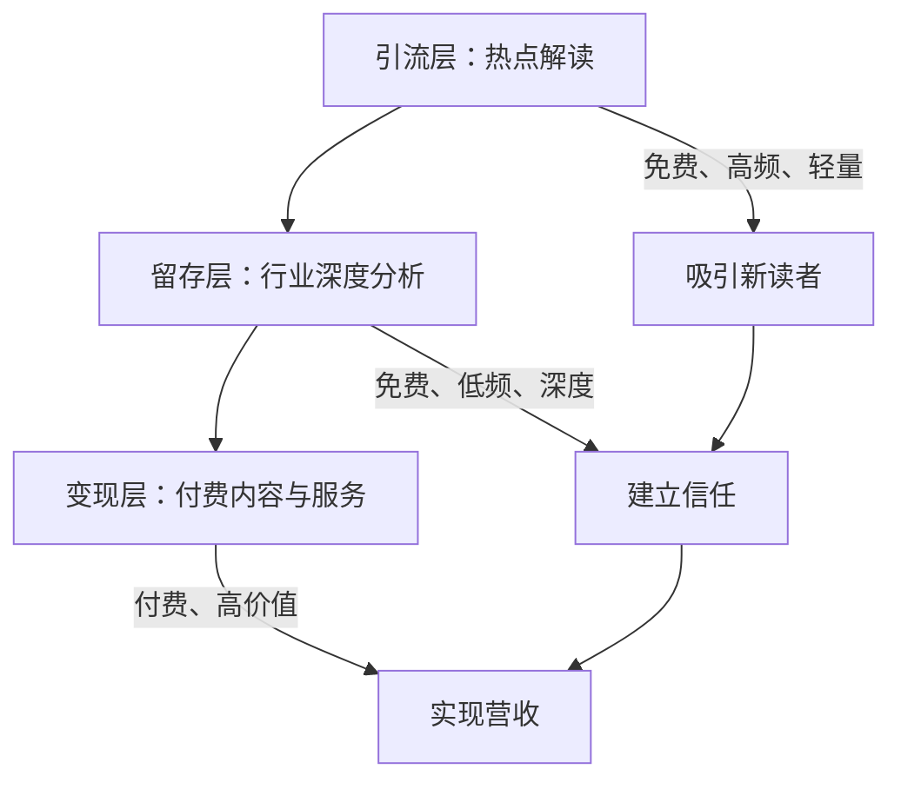
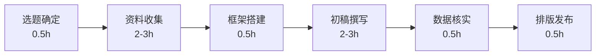
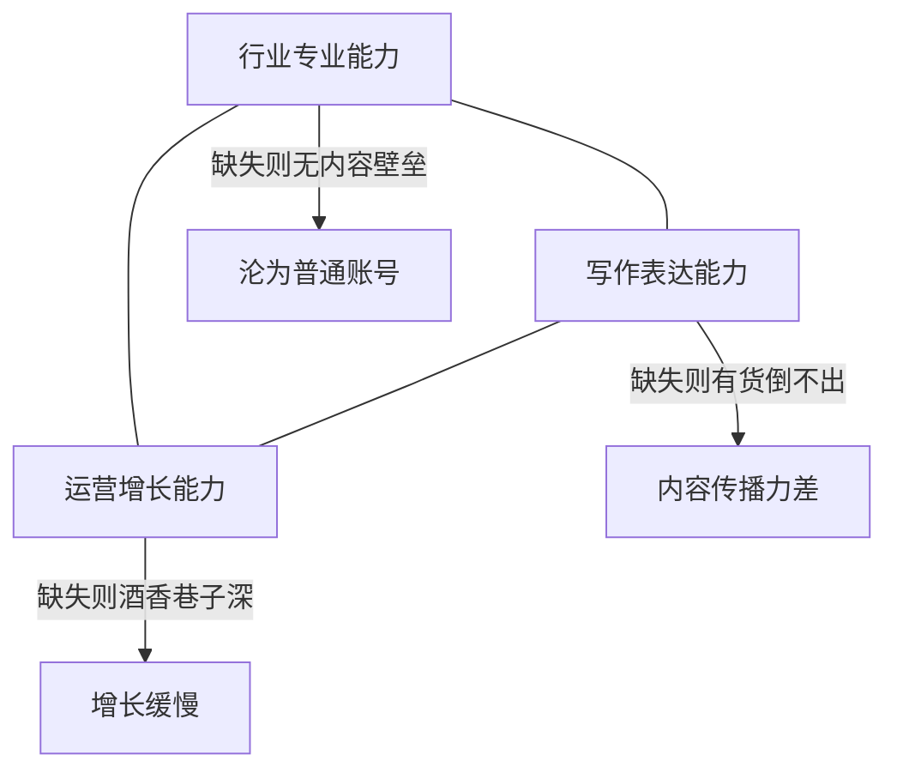

## 案例三：公众号深度内容——年入百万的财经号

> 深度内容不是没人看，而是大多数人写不出来。当所有人都在追热点、写短平快的时候，真正愿意啃硬骨头的深度财经号，反而吃到了最大的红利。

### 案例背景：为什么是"深度财经"

#### 行业现状与机会窗口

公众号生态从 2018 年开始出现显著的分化趋势，到 2023-2025 年，这种分化已经固化为明确的赛道格局：

| 内容类型 | 代表账号 | 粉丝单价 | 广告报价（头条） | 生命周期 | 内容壁垒 |
|---------|---------|---------|---------------|---------|---------|
| 情感鸡汤 | 十点读书、视觉志 | 0.3-0.8 元/粉 | 5-15 万 | 3-5 年后增长停滞 | 低，易被替代 |
| 泛娱乐 | 各类段子号 | 0.1-0.5 元/粉 | 1-5 万 | 热点驱动，波动大 | 极低 |
| 财经深度 | 半佛仙人、远川投资 | 3-8 元/粉 | 20-50 万 | 持续增长 | 高，需专业积累 |
| 知识付费型财经 | 力哥理财、简七理财 | 10-30 元/粉 | 转化课程为主 | 高粘性，长尾收益 | 极高，信任壁垒 |

深度财经号的粉丝单价是情感号的 5-10 倍，核心原因是：**财经用户自带消费能力和付费意愿**。一个愿意花时间读 5000 字财经分析的读者，大概率是有投资行为的中产，这类用户的广告价值和转化价值远高于泛流量。

#### 2023-2025 年的市场环境变化

深度财经号的赛道逻辑没有变，但竞争环境发生了几个重要变化：

**变局一：AI 冲击泛内容，深度内容反而更有壁垒**

2023 年 ChatGPT 爆发后，大量"通识型"财经内容被 AI 替代。AI 可以在 30 秒内生成一篇"瑞幸财务分析"的框架文章，但它无法替代的是：基于实地调研的一手信息、与行业人士交流获得的内幕视角、对数据异常的敏锐嗅觉。这意味着**真正的深度内容反而更有护城河**——因为 AI 能写的，恰恰是浅层内容。

**变局二：视频号崛起，图文与视频需要双线作战**

微信视频号从 2023 年开始成为重要的流量入口。纯图文公众号的新增流量在下降，但老陈通过"图文深度分析 + 视频号 3 分钟解读"的组合拳，反而打开了新的增长通道。视频号的推荐算法偏好"有信息增量"的内容，深度财经号天然适合。

**变局三：监管趋严，合规能力成为隐性壁垒**

2021 年《关于加强金融信息服务管理的通知》、2023 年网信办对财经自媒体的专项整治，让大量不合规的财经账号被清理。这反而利好合规运营的深度财经号——竞争对手变少了，市场变干净了。

#### 本案例主角画像

本案例主角化名"老陈"，背景如下：

- **职业背景**：某券商研究所分析师，从业 8 年，覆盖消费行业
- **启动条件**：零粉丝基础，无自媒体经验，但有深厚的行业研究功底
- **启动时间**：2019 年 3 月
- **启动资金**：几乎为零（仅花费约 2000 元购买排版工具和图库会员）
- **起号平台**：微信公众号（后期扩展到知识星球、视频号）

老陈的核心优势不是写作技巧，而是**行业认知深度**——他能把一份 50 页的券商研报，提炼成普通人能看懂的 3000 字分析，这个能力是多数自媒体人不具备的。

### 定位策略：从 0 到 1 的关键决策

#### 第一步：细分赛道选择

老陈没有选择"泛财经"这个大而空的定位，而是做了精准的细分：

```text
泛财经（竞争红海）
├── 宏观经济分析 → 需要顶级学术背景，门槛极高
├── 股票推荐 → 法律风险大，容易踩红线（证监会明令禁止无牌照荐股）
├── 理财科普 → 赛道拥挤，头部效应明显
└── 行业深度解读 ← 老陈选择的赛道
    ├── 消费行业（他的专业领域）
    ├── 用数据说话，不靠观点博眼球
    └── 面向"有投资意识的普通读者"
```

**为什么选"行业深度解读"**：

1. **护城河深**：需要真实的行业研究经验，不是 AI 能批量生成的
2. **受众精准**：关注消费行业的人，消费能力和付费意愿都高
3. **内容可持续**：消费行业永远有新案例（茅台、瑞幸、泡泡玛特、山姆、胖东来……），不缺选题
4. **变现路径清晰**：可以直接卖行业研究报告、投资课程、企业咨询

**赛道选择的决策框架**：

选择深度财经赛道前，你需要问自己四个问题：

| 问题 | 理想答案 | 如果答案是否定的 |
|------|---------|---------------|
| 我是否有 3 年以上该行业的从业经验？ | 是 | 内容缺乏专业壁垒，容易被替代 |
| 该行业是否有持续的新事件/新公司出现？ | 是 | 选题会枯竭，更新压力大 |
| 该行业的目标读者是否有付费能力？ | 是 | 变现困难，广告主不感兴趣 |
| 我能否用通俗语言解释该行业的专业概念？ | 是 | 读者看不懂，传播力差 |

如果四个问题都是"是"，这个赛道值得做。如果有两个以上"否"，建议换赛道或先积累行业经验。

#### 第二步：人设定位

老陈给自己的人设定位是"**券商分析师下凡**"——用专业机构的研究方法，给普通人做行业分析。这个定位的核心要素：

| 定位维度 | 具体设定 | 目的 |
|---------|---------|------|
| 专业背书 | 券商从业经历、CFA 持证 | 建立信任 |
| 表达风格 | 通俗但不低俗，专业但不晦涩 | 拉近距离 |
| 内容调性 | 数据驱动、逻辑严密、观点鲜明 | 差异化 |
| 更新频率 | 每周 2 篇长文（3000-6000 字） | 质量优先 |
| 互动风格 | 评论区认真回复，偶尔自嘲 | 人格化 |

**人设定位的核心原则**：不是"我什么都懂"，而是"我在某个领域比你专业，但我愿意用你能听懂的方式告诉你"。这个姿态让读者既觉得有收获，又不会产生距离感。

**人设打造的三个关键动作**：

1. **专业身份外显**：在公众号简介、每篇文章开头注明专业背景（如"前 XX 券商消费行业分析师"）。这不是炫耀，而是给读者一个"为什么要听你说"的理由。
2. **语言风格统一**：选择一种固定的表达风格并贯穿始终。老陈的风格是"严谨但不枯燥，偶尔用生活化类比解释专业概念"。比如解释"护城河"概念时，他写的是"茅台的护城河就像你家门口的护城河——别人看得见，但就是过不来"。
3. **人设边界清晰**：不碰股票推荐（法律风险）、不预测短期走势（打脸概率高）、不发表情绪化观点（损害专业形象）。

#### 第三步：内容架构设计

老陈设计了一套三层内容体系：



- **引流层**：当消费行业出现热点事件时（如某品牌暴雷、某公司 IPO），24 小时内发布解读短文（1500 字以内），用于获取新读者
- **留存层**：每周 2 篇深度行业分析（3000-6000 字），用数据和逻辑建立专业形象
- **变现层**：付费专栏、行业研究报告、企业咨询、知识星球

**三层内容的比例管理**：

很多人搞不清引流层和留存层的关系。老陈的做法是"7:2:1"法则：

- 70% 的精力放在留存层（这是你的核心资产）
- 20% 的精力放在引流层（追热点，获取新读者）
- 10% 的精力放在变现层（知识星球、付费课程的更新维护）

如果精力分配反过来——花大量时间追热点、卖课，核心的深度内容质量就会下降，读者信任就会流失。

### 内容生产体系：如何持续产出高质量深度内容

#### 选题方法论

老陈的选题不是"我觉得读者想看什么"，而是基于一套系统化的筛选流程：

**选题四象限模型**：

| | 读者需求高 | 读者需求低 |
|---|-----------|-----------|
| **我的专业度高** | ⭐ 核心选题（优先写） | 储备选题（积累素材，等待时机） |
| **我的专业度低** | 合作选题（找行业专家联合撰写） | 不碰 |

**具体选题来源**：

1. **财报季跟踪**：每季度上市公司财报发布期，是选题金矿。老陈会提前锁定 20-30 家重点公司，财报发布后 48 小时内完成分析
2. **行业事件驱动**：如"瑞幸财务造假""茅台提价""新茶饮价格战""山姆会员店扩张"等事件
3. **读者提问挖掘**：评论区和私信中高频出现的问题，往往是最真实的选题需求
4. **跨行业迁移**：把 A 行业的分析框架套用到 B 行业，如用"茅台逻辑"分析"爱马仕"
5. **周期性话题**：每年固定时段会出现的话题，如"年报解读""双十一复盘""年度展望"
6. **政策法规解读**：国家出台的行业政策（如消费税改革、食品安全新规），对行业的影响分析
7. **消费者行为变迁**：如"县城消费升级""银发经济崛起""Z 世代消费偏好"等趋势性话题

**选题评估模板**（老陈实际使用的打分表）：

每个潜在选题用以下五个维度打分（1-5 分），总分 ≥ 15 分才写：

| 维度 | 评分标准 | 权重 |
|------|---------|------|
| 信息增量 | 读者读完能否获得市面上没有的信息？ | ×2 |
| 时效性 | 这个话题的热度窗口有多长？ | ×1 |
| 专业匹配度 | 这是不是我最擅长的领域？ | ×1 |
| 传播潜力 | 读者是否有动力转发？ | ×1 |
| 变现关联 | 这个选题能否自然引导到付费产品？ | ×1 |

总分 = 信息增量×2 + 时效性 + 专业匹配度 + 传播潜力 + 变现关联

举个例子：2024 年瑞幸联名茅台推出"酱香拿铁"当天，老陈的打分是：

- 信息增量：4（多数人只知道联名，不知道背后的供应链逻辑）×2 = 8
- 时效性：5（48 小时热度窗口）
- 专业匹配度：5（消费品行业，老陈老本行）
- 传播潜力：5（全网热点，天然传播力）
- 变现关联：2（与付费产品关联度一般）

总分 = 8 + 5 + 5 + 5 + 2 = 25，远超 15 分的阈值，果断写。这篇最终成为老陈公众号的最高阅读量文章之一。

#### 写作流程与时间管理

老陈的每篇文章平均耗时 6-8 小时，具体流程：



**资料收集是最大的时间消耗**，老陈的信息源包括：

| 信息源 | 用途 | 成本 |
|--------|------|------|
| Wind 数据终端 | 行业数据、公司财务数据 | 机构版免费（券商经验延续），个人版约 1 万/年 |
| 上市公司年报、招股书 | 一手财务数据和业务描述 | 免费（巨潮资讯网、港交所披露易） |
| 券商研究报告 | 行业分析框架和数据 | 免费（慧博投研资讯、萝卜投研） |
| 电商平台数据 | 消费趋势和销量排名 | 免费（生意参谋部分功能付费） |
| 社交媒体舆情 | 消费者真实反馈和趋势 | 免费（小红书、抖音、微博） |
| 行业展会/论坛 | 一手行业信息和人脉 | 门票 200-2000 元不等 |
| 实地调研 | 线下走访门店、工厂 | 差旅费用 |

**关键技巧：建立选题素材库**

老陈用飞书文档建立了一个结构化的素材库，按行业分类：

```text
素材库/
├── 消费品/
│   ├── 食品饮料/
│   │   ├── 茅台系列/（已积累 30+ 条数据记录）
│   │   ├── 瑞幸系列/（已积累 20+ 条数据记录）
│   │   └── 新茶饮/（喜茶、奈雪、霸王茶姬等）
│   ├── 美妆个护/
│   └── 服装鞋帽/
├── 消费服务/
│   ├── 餐饮连锁/
│   ├── 酒店旅游/
│   └── 教育培训/
├── 消费科技/
│   ├── 新能源汽车/
│   ├── 智能家居/
│   └── 可穿戴设备/
└── 模板与工具/
    ├── 选题评估模板
    ├── 文章框架模板
    └── 数据核实清单
```

每个条目下包含：关键数据、核心观点、已写文章链接、待挖掘角度。有了这个素材库，选题和写作效率大幅提升——很多文章的素材其实已经积累了数月，写作时只需组装和深化。

#### 深度文章的标准框架模板

老陈的每篇深度文章都遵循以下结构，这个模板可以直接复用：

```text
【标题】—— 必须包含具体数字或反常识观点
  ├── 开头（200 字以内）：用一个具体事件/数据切入，不要铺垫
  ├── 背景梳理（500-800 字）：这件事是什么、为什么重要
  ├── 核心分析（1500-3000 字，文章的主体）
  │   ├── 论点一 + 数据支撑 + 案例佐证
  │   ├── 论点二 + 数据支撑 + 案例佐证
  │   └── 论点三 + 数据支撑 + 案例佐证
  ├── 反面论证（500 字）：主动回应可能的质疑，增强说服力
  ├── 结论与行动建议（300-500 字）：明确告诉读者"所以呢？"
  └── 互动引导（100 字）：抛出问题，引导评论区讨论
```

**每个环节的具体要求**：

- **标题**：禁止用"震惊！""揭秘！"式标题党。好的标题是"瑞幸年亏 50 亿，为什么还在疯狂开店？""茅台提价 20%，谁在买单？"
- **开头**：前 3 句话必须让读者知道"这篇文章讲什么"和"为什么要读"。不要用"今天我们来聊聊……"这种废话开头。
- **核心分析**：每个论点必须有"数据 + 逻辑 + 案例"三位一体的支撑。只有观点没有数据是臆测，只有数据没有逻辑是堆砌，只有逻辑没有案例是空谈。
- **反面论证**：这是深度文章区别于普通文章的关键。主动说出"你可能会问……""有人会反驳……"，然后回应。这比单方面输出观点更有说服力。
- **结论**：必须是可操作的。不能只说"行业在变"，要告诉读者"对投资者来说，关注 X 指标；对消费者来说，留意 Y 变化；对从业者来说，做好 Z 准备"。

#### 内容质量把控标准

老陈给自己定了 5 条质量红线：

1. **每个核心观点必须有数据支撑**：不允许"我觉得""我认为"式的主观判断
2. **数据必须标注来源**：财报第几页、研报哪家出的、数据截止到什么时候
3. **逻辑链条完整**：从 A 推导到 B，中间不允许跳跃
4. **结论必须有可操作性**：不能只说"行业在变"，要告诉读者"所以你应该怎么做"
5. **每篇文章至少有一个"啊哈时刻"**：读者读完后会有一个"原来如此"的认知升级

**数据核实清单**（老陈的编辑自检流程）：

| 检查项 | 具体操作 | 常见错误 |
|--------|---------|---------|
| 数据来源 | 标注出处和截止日期 | 混淆"2023 年"和"2023 财年"（差 3 个月） |
| 数据口径 | 确认是营收还是 GMV、是净利还是毛利 | 混淆不同口径导致结论错误 |
| 数据时效 | 确认数据是最新可得的 | 用了半年前的数据做分析 |
| 逻辑一致性 | 前后结论不矛盾 | 前面说"增长放缓"，后面结论是"高增长赛道" |
| 法律合规 | 没有具体股票推荐、没有内幕信息引用 | 不经意间写了"建议买入""据内部人士透露" |

### 增长策略：从 0 到 10 万粉丝的路径

#### 冷启动阶段（0-5000 粉，前 3 个月）

这是最艰难的阶段，老陈没有任何流量基础。他的核心策略是**"靠内容质量换推荐"**：

1. **种子用户获取**：
   - 在知乎回答财经类问题，文末引导关注公众号（知乎是冷启动最佳平台之一）
   - 在雪球（投资者社区）同步发布分析文章
   - 请券商前同事帮忙转发到朋友圈
   - 加入行业交流群，适度分享有价值的文章（不是硬推，而是"我刚好写了这个话题的分析，大家有兴趣可以看看"）

2. **内容策略**：
   - 每篇文章都写到"值得被转发"的程度——不是"还不错"，而是"转发给朋友他一定会感谢你"
   - 第一篇爆款来自对某知名消费品牌的深度拆解，被多个投资群自发传播
   - 冷启动期的选题策略：优先写"信息差"大的内容——你知道但别人不知道的行业事实

3. **数据表现**：

| 时间节点 | 粉丝数 | 篇均阅读 | 单篇最高阅读 | 关键事件 |
|---------|--------|---------|------------|---------|
| 第 1 个月 | 200 | 80 | 300 | 知乎引流开始 |
| 第 2 个月 | 800 | 350 | 1,200 | 雪球同步发布效果明显 |
| 第 3 个月 | 3,500 | 1,500 | 8,000（爆款） | 第一篇行业拆解引爆 |

4. **冷启动期的常见心态崩溃点**：

写了一个月只有 200 粉，是继续还是放弃？老陈的真实想法是："我知道这个赛道的天花板很高，200 粉只是因为还没有被算法推荐，不是因为内容不好。只要内容质量过关，增长只是时间问题。"

**给冷启动期读者的建议**：不要看粉丝数，看单篇阅读量和转发率。如果你的文章阅读量 / 粉丝数 > 3，说明内容质量没问题，增长只是时机问题。

#### 增长加速阶段（5000-50000 粉，第 4-12 个月）

突破 5000 粉后，增长开始出现正循环——读者基数足够大，新文章能获得初始传播动力。

**核心增长手段**：

1. **爆款内容驱动**：每月至少产出 1 篇阅读量 10 倍于平均值的爆款，这些爆款是增长的核心引擎
2. **跨平台分发**：将长文拆解为知乎回答、雪球帖子、小红书图文，多渠道引流
3. **互推合作**：与同领域但不直接竞争的账号互推（如做宏观经济的、做股票分析的）
4. **社群运营**：建立读者微信群，鼓励讨论和反馈，培养核心读者
5. **SEO 优化**：公众号文章的标题要包含读者可能搜索的关键词（如"茅台为什么不降价""瑞幸商业模式分析"），这些文章会在微信搜一搜中获得长尾流量

**爆款内容的共同特征**：

- 标题包含具体数字或反常识观点（如"XX 品牌年亏 50 亿，为什么还在疯狂开店？"）
- 开头 3 句话必须抓住注意力，不铺垫、不客套
- 每 500 字有一个信息密度高的段落，避免阅读疲劳
- 结尾有明确的"转发理由"——要么是观点认同，要么是信息价值
- 文章中至少有一个"信息差"——读者之前不知道的事实或视角

**跨平台分发的具体操作**：

| 平台 | 内容改编方式 | 引流方式 | 预期效果 |
|------|------------|---------|---------|
| 知乎 | 把长文拆成 3-5 个回答，每个回答聚焦一个子话题 | 文末"更详细的分析见公众号" | 单篇回答可带来 50-200 关注 |
| 雪球 | 直接发全文，标题改成更"投资者视角" | 账号简介注明公众号 | 精准但量小 |
| 小红书 | 提取核心数据做成信息图，配合 300 字短文 | 评论区引导 | 适合可视化强的数据类内容 |
| 视频号 | 用文章核心观点录制 3 分钟口播 | 评论区置顶公众号链接 | 2023 年后增长最快的渠道 |

#### 稳定增长阶段（50000-100000+ 粉，第 12 个月以后）

这个阶段的增长更多依赖品牌效应和口碑传播，单篇爆款的作用递减，系统化运营更重要。

**稳定增长阶段的三个关键动作**：

1. **内容系列化**：推出固定栏目（如"月度行业复盘""季度深度报告"），培养读者的阅读习惯
2. **读者分层运营**：普通读者（公众号）→ 付费读者（知识星球）→ 高净值读者（企业咨询），不同层级提供不同深度的内容
3. **品牌 IP 化**：从"一个写财经分析的公众号"变成"消费行业的意见领袖"，参与行业论坛、接受媒体采访、出书

### 法律合规：深度财经号的生死线

这是很多内容创作者忽略的部分，但对于财经内容来说，合规不是"加分项"，而是"生死线"。

#### 财经内容创作的法律红线

| 红线 | 法律依据 | 后果 | 规避方法 |
|------|---------|------|---------|
| 无牌照推荐股票 | 《证券法》第 160 条 | 罚款 5-50 万，情节严重追究刑事责任 | 只分析行业和公司，不给买卖建议 |
| 利用内幕信息 | 《证券法》第 53 条 | 没收所得 + 1-5 倍罚款，刑事责任 | 只用公开信息，标注数据来源 |
| 散布虚假信息 | 《刑法》第 291 条之一 | 刑事责任 | 所有数据必须可溯源、可核实 |
| 未标注广告 | 《广告法》第 14 条 | 罚款 10-200 万 | 广告必须明确标注"推广""广告" |
| 侵犯商业秘密 | 《反不正当竞争法》 | 赔偿损失 | 不引用未公开的商业信息 |

#### 老陈被品牌方公关的真实案例

某篇文章批评了一个知名品牌的财务数据异常，发布后 4 小时收到品牌方律师函。

**处理方式**：

1. 没有恐慌删文——因为所有数据来自公开财报，有据可查
2. 请律师朋友审核文章内容，确认没有事实性错误
3. 在公众号发布声明，附上数据来源截图
4. 这次事件反而增加了老陈的公信力——"敢说真话"的人设更加牢固

**教训**：深度内容创作者必须学会用数据保护自己。只要你引用的是公开数据、分析逻辑自洽、没有捏造事实，法律风险是可控的。

#### 合规自检清单

每篇文章发布前，用这个清单过一遍：

```text
□ 没有具体股票的买入/卖出建议
□ 没有使用"据内部人士透露""据知情人士"等非公开信息表述
□ 所有核心数据都标注了来源和截止日期
□ 广告内容明确标注了"推广"或"广告"
□ 没有使用"保证收益""稳赚不赔"等承诺性表述
□ 分析结论是基于公开信息的逻辑推导，不是内幕消息
□ 没有直接攻击竞争对手或捏造事实
□ 图片、图表没有侵犯版权（注明来源或自制）
```

### 变现体系：年入百万的收入结构

#### 收入来源拆解

老陈的年收入 100 万+，并非来自单一渠道，而是多条变现路径的组合：

| 收入来源 | 年收入（万元） | 占比 | 启动时间 | 启动条件 |
|---------|-------------|------|---------|---------|
| 知识星球 | 35-40 | 35% | 粉丝 1 万时开设 | 有稳定的内容产出能力 |
| 企业咨询 | 25-30 | 27% | 粉丝 3 万时开始接单 | 行业影响力达到一定水平 |
| 广告收入 | 15-20 | 17% | 粉丝 5 万时开始接广告 | 有稳定的阅读量基础 |
| 付费专栏 | 10-15 | 12% | 粉丝 2 万时上线 | 有系统化的知识体系 |
| 课程/训练营 | 8-10 | 9% | 粉丝 5 万时开设 | 有教学能力和课程设计能力 |

**收入结构的健康度分析**：老陈的收入结构有一个重要特征——没有任何单一收入来源超过 40%。这意味着即使某个渠道出问题（比如知识星球用户流失、广告市场下行），整体收入也不会断崖式下跌。这是"多腿走路"的好处。

#### 变现路径一：知识星球（年收入 35-40 万）

知识星球是深度财经号最核心的变现工具，原因在于它提供了"持续的高质量信息交付"场景。

**定价策略**：
- 初始定价：199 元/年（低门槛吸引第一批用户）
- 涨价节奏：每增加 1000 付费用户，涨价 100 元
- 当前定价：599 元/年
- 续费率：65%（行业优秀水平，普通知识星球续费率约 30-40%）

**星球内容规划**：

```text
每周交付内容：
├── 周一：本周重点关注的 3 个行业事件（轻量，500 字/条）
├── 周三：深度分析一篇（比公众号更深入、更内部视角，3000-5000 字）
├── 周五：行业数据周报（图表+解读，核心数据表 5-8 张）
└── 随时：突发重大事件的即时解读（比公众号快 6-12 小时）

每月交付内容：
├── 月度行业复盘（5000 字+，含当月所有重要事件的系统梳理）
└── 重点公司跟踪报告（3-5 家公司的最新动态和分析）

每季度交付内容：
└── 行业季度报告（1-2 万字，这是星球最核心的价值交付）
```

**关键经验**：知识星球的续费率取决于"不可替代性"。老陈的星球之所以能做到 65% 续费，是因为每季度的行业报告在外面买不到——这是他用专业研究能力构建的内容壁垒。

**知识星球运营的五个关键指标**：

| 指标 | 合格线 | 优秀线 | 老陈的实际数据 |
|------|--------|--------|--------------|
| 续费率 | 40% | 60%+ | 65% |
| 周活跃率 | 30% | 50%+ | 55% |
| 新增/流失比 | >1:1 | >2:1 | 3:1 |
| 内容交付完成率 | 90% | 98%+ | 99% |
| 用户互动率 | 5% | 15%+ | 20% |

#### 变现路径二：企业咨询（年收入 25-30 万）

随着行业影响力增长，开始有消费品企业主动找上门寻求咨询。

**咨询业务类型**：

1. **行业分析报告定制**：为企业出具特定细分领域的竞争格局分析，单次 3-5 万
2. **新品牌进入策略**：帮新消费品牌分析市场机会和切入路径，单次 5-8 万
3. **投资人尽调支持**：为 VC/PE 提供行业专家访谈和数据验证，单次 1-3 万

**咨询业务的注意事项**：

- 必须在公众号明确声明"哪些内容是付费咨询产出，哪些是独立分析"，保持读者信任
- 不接受与已有分析观点相悖的付费委托（不能因为收了钱就改结论）
- 咨询业务收入不稳定，不能作为主要收入依赖
- 每次咨询都要签书面合同，明确服务范围、交付标准、保密条款

**咨询定价参考**：

| 服务类型 | 定价方式 | 参考价格 | 交付周期 |
|---------|---------|---------|---------|
| 行业专家访谈（1-2 小时） | 按小时计费 | 3000-5000 元/小时 | 即时 |
| 竞争格局分析报告 | 按项目计费 | 3-5 万/份 | 2-3 周 |
| 市场进入策略 | 按项目计费 | 5-8 万/份 | 3-4 周 |
| 季度顾问服务 | 按月/季度计费 | 2-5 万/月 | 持续 |

#### 变现路径三：广告收入（年收入 15-20 万）

深度财经号的广告价值在于**精准的高净值读者群体**。

**广告筛选标准**：

| 评估维度 | 老陈的标准 | 原因 |
|---------|-----------|------|
| 产品相关性 | 金融产品、知识付费、高端消费 | 匹配读者画像 |
| 品牌调性 | 中高端，拒绝 P2P、博彩、灰色产业 | 保护账号信誉 |
| 内容形式 | 必须是老陈自己写的软文 | 保持内容质量 |
| 频率控制 | 每月最多 2 篇广告 | 避免读者反感 |

**广告报价参考**（粉丝 8-10 万时）：

- 头条软文：3-5 万/篇
- 次条硬广：0.8-1.5 万/篇
- 知识星球植入：1-2 万/次

**关键原则**：广告收入只占总收入的 17%，这意味着老陈有底气拒绝不合适的广告——这反过来又保护了读者信任和长期价值。

**提高广告报价的技巧**：

1. **积累投放效果数据**：记录每次广告的阅读量、转化率、客户反馈，用数据说话
2. **打造标杆案例**：前几次广告可以适当降价，积累"成功案例"后再提价
3. **提供增值服务**：除了发文，提供读者画像分析、投放效果复盘，让广告主觉得物超所值

#### 变现路径四：付费专栏（年收入 10-15 万）

在公众号平台开设付费专栏，主题为"消费品行业分析方法论"。

**课程结构**：

```text
《消费品行业分析实战课》—— 定价 299 元，已售 500+ 份
├── 第一章：如何看懂一份消费品公司的财报（免费试看）
├── 第二章：消费品行业的核心竞争要素
│   ├── 2.1 品牌力：从认知到溢价的完整链条
│   ├── 2.2 渠道力：线上线下如何协同
│   └── 2.3 供应链力：成本优势的来源
├── 第三章：品牌力分析框架
│   ├── 3.1 品牌知名度、美誉度、忠诚度的量化方法
│   └── 3.2 案例：茅台 vs 五粮液的品牌力对比
├── 第四章：渠道力分析框架
│   ├── 4.1 经销商体系 vs 直营体系的优劣
│   └── 4.2 案例：安踏的渠道变革之路
├── 第五章：供应链分析框架
├── 第六章：消费品估值方法
│   ├── 6.1 PE/PS/DCF 在消费品中的适用场景
│   └── 6.2 案例：泡泡玛特的估值争议
├── 第七章：如何识别消费品公司的风险信号
│   ├── 7.1 财务造假的 5 个预警指标
│   └── 7.2 案例：瑞幸财务造假的蛛丝马迹
├── 第八章：三个完整案例拆解
└── 附录：分析工具包（Excel 模板 + 数据来源清单 + 10 个常用分析框架）
```

付费专栏的特点是**一次性产出、长期收益**——课程内容写完后，后续只需偶尔更新，是一条很好的"睡后收入"。

**付费专栏的设计原则**：

1. **第一章免费**：让读者零成本体验内容质量，降低决策门槛
2. **每章独立成篇**：读者可以按需购买（如果平台支持），或者跳跃式阅读
3. **每章都有"实战练习"**：不只是知识灌输，而是让读者跟着做一个真实的分析
4. **附录是核心卖点**：模板、工具、清单——这些"拿来就能用"的东西，是读者付费的最大动力

### 关键转折点与踩坑记录

#### 转折点一：第一篇爆款（第 3 个月）

老陈写了一篇对某网红消费品品牌的深度拆解，从供应链、渠道、营销三个维度分析了其商业模式的脆弱性。这篇文章在投资圈和创业圈同时引爆，单篇带来 2000+ 新关注。

**复盘要点**：
- 爆款的共同特征是"替读者说出了他们想说但说不清楚的话"
- 争议性内容比"正确但无聊"的内容传播力强 10 倍
- 但争议性不等于哗众取宠——必须有扎实的论据支撑
- 爆款之后的 24 小时是涨粉黄金期，需要在评论区积极互动、引导关注

#### 转折点二：被品牌方公关（第 6 个月）

某篇文章批评了一个知名品牌的财务数据异常，发布后 4 小时收到品牌方律师函。

**处理方式**：
1. 没有恐慌删文——因为所有数据来自公开财报，有据可查
2. 请律师朋友审核文章内容，确认没有事实性错误
3. 在公众号发布声明，附上数据来源截图
4. 这次事件反而增加了老陈的公信力——"敢说真话"的人设更加牢固

**教训**：深度内容创作者必须学会用数据保护自己。只要你引用的是公开数据、分析逻辑自洽、没有捏造事实，法律风险是可控的。

#### 转折点三：知识星球涨价风波（第 10 个月）

知识星球从 199 元涨到 399 元时，收到大量负面反馈。

**处理方式**：
1. 提前 1 个月预告涨价
2. 涨价前给老用户一次"锁定原价续费"的机会
3. 涨价后 1 个月，额外增加了一项专属权益（每月一次线上答疑）
4. 负面反馈在 2 周内基本消失

**教训**：涨价本身不是问题，关键是"涨价的同时增加价值"。用户反感的不是多花钱，而是"花了更多的钱但没有得到更多"。

#### 转折点四：AI 时代的适应（2023 年）

2023 年 ChatGPT 爆发后，老陈最初也焦虑——AI 能写分析文章了，深度财经号还有价值吗？

**实际观察**：
- AI 写的"通用分析"确实比很多初级作者强，但比不过真正的行业专家
- 读者的需求从"获取信息"转向"获取判断"——AI 能给你数据，但给不了你基于经验的判断
- AI 变成了老陈的生产力工具：用 AI 做数据整理、初稿框架、文献检索，效率提升了 3 倍
- 反而出现了一个新机会：教读者"如何用 AI 做行业分析"，成为了新的付费内容方向

### 常见误区与纠正

#### 误区一："深度内容没人看，大家都喜欢短平快"

**真相**：不是深度内容没人看，而是大多数人写不出真正的深度内容。一篇 5000 字的文章，如果每一段都有新信息、新观点、新数据，读者会一字不落地读完。怕的是 5000 字的文章，有效信息只有 500 字，其余都是注水。

**检验标准**：如果你删掉文章中任何一段，内容是否会不完整？如果不是，说明那一段是废话，应该删掉。

#### 误区二："做深度内容就不能追热点"

**真相**：深度和时效性不矛盾，关键是追热点的方式不同。普通账号追热点是"转发+评论"，深度账号追热点是"别人还在转新闻的时候，你已经给出了完整分析"。

**操作方法**：建立行业公司的"分析框架模板"，热点发生时只需填充最新数据即可快速出稿。老陈的很多热点文章，其实框架是提前准备好的。比如"品牌暴雷"类事件，他有一个通用分析框架：

```text
品牌暴雷分析框架：
├── 1. 事件概述：发生了什么，影响范围有多大
├── 2. 根因分析：是偶发事件还是结构性问题
├── 3. 行业影响：对同行、上下游、消费者分别有什么影响
├── 4. 历史对标：历史上有没有类似案例，结果如何
└── 5. 投资/消费建议：作为投资者/消费者/从业者，分别应该怎么做
```

有了这个框架，热点发生后 2 小时就能出一篇有深度的分析。

#### 误区三："变现要趁早，粉丝 5000 就该开始卖东西"

**真相**：过早变现是深度财经号的大忌。深度内容的核心资产是"信任"，信任需要时间积累。在读者还没有完全认可你的专业能力时就推销产品，会永久性地损害信任。

**老陈的时间线**：
- 0-10000 粉：纯内容积累期，零变现
- 10000-30000 粉：开始接受知识星球（低单价，199 元）
- 30000-50000 粉：上线付费专栏 + 开始接少量广告
- 50000 粉以上：全面变现，开启企业咨询

**判断是否可以开始变现的三个信号**：

1. **私信咨询**：读者开始主动问你"有没有付费内容""能不能做一对一咨询"
2. **转发率稳定**：连续 1 个月的转发率保持在 3% 以上
3. **复购信号**：有读者多次留言"你上次说的那个观点我用了，效果很好"

如果这三个信号都出现了，说明信任已经建立，可以开始变现。

#### 误区四："写深度内容需要全职投入"

**真相**：老陈在粉丝达到 5 万之前，一直是兼职运营。他利用的是工作中的"信息复利"——白天在券商做的研究，晚上花 2 小时就能转化成一篇公众号文章。关键不是"花多少时间"，而是"是否建立了高效的内容转化流程"。

**兼职运营的时间管理方案**：

| 时间段 | 任务 | 耗时 |
|--------|------|------|
| 周一-周五，每天中午 | 收集素材、记录灵感 | 30 分钟 |
| 周二、周四晚上 | 写作（利用已收集的素材） | 2-3 小时/次 |
| 周六上午 | 排版、发布、回复评论 | 2 小时 |
| 周日上午 | 规划下周选题 | 1 小时 |

每周总投入约 10-12 小时，完全可以兼职完成。

#### 误区五："只要内容好，自然会火"

**真相**：内容好只是基础条件，不是充分条件。在公众号生态中，好内容还需要"被看见"的机会。老陈总结了一个公式：

```text
内容影响力 = 内容质量 × 分发效率 × 时效性
```

- 内容质量 90 分但分发效率 10 分（只发公众号不做任何推广），影响力 = 900
- 内容质量 70 分但分发效率 80 分（跨平台分发+社群传播），影响力 = 5600

好内容也需要主动分发。这不是"营销"，而是"让对的人看到对的内容"。

### 可复用的方法论

#### 深度财经号的"能力三角"



- **行业专业能力**是基础——没有这个，写出来的东西经不起推敲
- **写作表达能力**是杠杆——有了这个，专业能力才能被更多人看到
- **运营增长能力**是加速器——有了这个，好内容才能被正确地分发

三者缺一不可，但优先级是：**专业 > 写作 > 运营**。因为写作和运营都可以学习，但行业专业能力需要多年积累。

**能力提升路径**：

| 能力维度 | 入门水平 | 进阶水平 | 专家水平 |
|---------|---------|---------|---------|
| 行业专业能力 | 能读懂行业研报 | 能独立写出行业分析 | 能发现别人看不到的机会和风险 |
| 写作表达能力 | 能写清楚一件事 | 能写得有说服力 | 能写得让人忍不住转发 |
| 运营增长能力 | 知道公众号的基本操作 | 能策划爆款内容 | 能构建增长飞轮 |

#### 从 0 到年入百万的时间表

| 阶段 | 时间 | 粉丝目标 | 收入预期 | 核心任务 | 放弃率 |
|------|------|---------|---------|---------|--------|
| 冷启动 | 第 1-3 月 | 0 → 3,000 | 0 | 建立内容体系，打磨写作能力 | 60% |
| 增长期 | 第 4-8 月 | 3,000 → 2 万 | 0-2000/月 | 找到爆款规律，跨平台引流 | 25% |
| 变现启动期 | 第 9-12 月 | 2 万 → 5 万 | 5000-1.5 万/月 | 开设知识星球，上线付费内容 | 10% |
| 规模化期 | 第 13-18 月 | 5 万 → 10 万 | 3-6 万/月 | 多渠道变现，接广告和咨询 | 5% |
| 成熟期 | 第 19-24 月 | 10 万+ | 8-10 万/月 | 品牌化运营，团队化 | — |

**注意**：这是理想情况下的时间表。实际执行中，大多数人会在第 3-6 个月放弃，因为这个阶段投入巨大但回报几乎为零。能坚持到第 9 个月的人，大概率能做起来。最后一列的"放弃率"是老陈根据身边朋友的经验估算的——100 个开始做深度财经号的人，最终能到年入百万的不超过 5 个。

#### 内容创作的"复利效应"

深度财经号有一个独特优势：**老内容会持续产生价值**。

一篇写得好的行业分析，发布后 1 年仍然会被搜索引擎和社交平台推荐。老陈的公众号文章中，有 30% 的阅读量来自 3 个月前发布的旧文。这意味着：

- 每写一篇高质量文章，都是在往"内容银行"里存钱
- 时间越长，内容资产越值钱
- 这是短视频和直播做不到的——短视频的生命周期通常是 48 小时

**长尾流量的优化策略**：

1. **标题包含搜索关键词**：读者可能搜索"茅台为什么这么贵""瑞幸商业模式"，把这些关键词写进标题
2. **定期更新旧文**：在旧文顶部加上"2024 年更新"的注释，补充最新数据，让文章保持时效性
3. **建立文章索引页**：在公众号菜单栏建立"行业分析合集"，方便新读者系统性阅读

### 工具与资源清单

#### 内容生产工具

| 工具 | 用途 | 价格 | 老陈推荐度 |
|------|------|------|-----------|
| 飞书文档 | 素材库管理、协作写作 | 免费 | ⭐⭐⭐⭐⭐ |
| 135 编辑器 / 秀米 | 公众号排版 | 免费/付费（100-300 元/年） | ⭐⭐⭐⭐ |
| Canva | 信息图、数据图表制作 | 免费/付费（约 100 元/月） | ⭐⭐⭐⭐ |
| Wind 数据终端 | 行业数据查询 | 个人版约 1 万/年 | ⭐⭐⭐⭐⭐（有条件必买） |
| 巨潮资讯网 | 上市公司公告、财报 | 免费 | ⭐⭐⭐⭐⭐ |
| 慧博投研资讯 | 券商研报查询 | 免费 | ⭐⭐⭐⭐⭐ |
| 微信指数 / 百度指数 | 热点趋势监测 | 免费 | ⭐⭐⭐⭐ |
| 新榜 | 公众号数据监测 | 基础功能免费 | ⭐⭐⭐ |

#### 信息源清单

| 信息源 | 类型 | 更新频率 | 适合用于 |
|--------|------|---------|---------|
| 巨潮资讯网 | 上市公司公告 | 实时 | 财报分析、事件跟踪 |
| 国家统计局 | 宏观经济数据 | 月度/季度 | 行业趋势分析 |
| 各券商研究所 | 行业研究报告 | 不定期 | 分析框架参考 |
| 欧睿/尼尔森 | 消费市场数据 | 年度 | 行业规模和趋势 |
| 小红书/抖音热榜 | 消费趋势和舆情 | 实时 | 选题灵感、消费者视角 |
| 36 氪/虎嗅 | 创投和商业新闻 | 日更 | 热点事件追踪 |

### 进阶思考：从个人到团队

#### 何时考虑团队化

当月收入稳定超过 5 万，且持续 3 个月以上，可以考虑团队化。老陈在第 18 个月时组建了小团队：

| 角色 | 职责 | 雇佣方式 | 月薪 | 招聘渠道 |
|------|------|---------|------|---------|
| 研究助理 | 数据收集、初稿整理 | 兼职（研究生） | 3000 元 | 高校就业群、实习僧 |
| 运营助理 | 排版、社群管理、客服 | 兼职 | 2000 元 | 朋友圈推荐 |
| 法律顾问 | 内容审核、合同审查 | 按次付费 | 500-2000 元/次 | 律所朋友、法律服务平台 |

**团队化的核心原则**：老陈负责"灵魂"——选题方向、核心观点、最终审核；助手负责"手脚"——数据收集、初稿撰写、日常运营。这样既能提升效率，又能保证内容质量不下滑。

**团队化的五个注意事项**：

1. **不要过早招人**：月收入没到 5 万就招人，人力成本会压垮你
2. **先兼职后全职**：兼职试用 3 个月，确认合适后再考虑全职
3. **SOP 先于人**：先把自己的工作流程文档化，再招人执行。没有 SOP 的团队只会越管越乱
4. **核心环节不放手**：选题、核心观点、最终审核——这三件事永远自己做
5. **利润分配透明**：如果团队成员表现好，可以考虑利润分成，而不是只给固定工资

#### 内容矩阵扩展

单一公众号的天花板有限，老陈在稳定期开始构建内容矩阵：

```text
核心账号（公众号深度长文）
├── 短视频矩阵（视频号：3 分钟行业解读）
├── 知识星球（深度付费社区）
├── 付费课程（系统化知识产品）
└── 企业咨询（高端服务变现）
```

矩阵的核心逻辑是：**同一份研究成果，用不同形式、在不同平台、卖给不同需求的用户**。一份行业报告，可以在公众号写成免费引流文章，在知识星球写成付费深度版本，在视频号做成 3 分钟解读视频，在课程中做成教学案例。一份素材，四次变现。

### 案例启示

这个案例的核心不是"公众号还能赚钱"，而是**深度内容的长期价值被严重低估了**。在算法推荐主导的时代，深度内容的传播效率确实不如短平快，但深度内容的**变现效率**是短平快的 10 倍以上。

如果你具备以下条件，深度财经号是一条值得考虑的路径：

1. 在某个行业有 3 年以上的深度积累
2. 愿意花 6-8 小时写一篇 3000 字以上的文章
3. 能接受前 6 个月几乎没有收入的现实
4. 有持续学习和输出的习惯

如果以上条件都不具备，建议先从更轻量的内容形式起步（如短视频、图文），积累行业认知和表达能力后，再转向深度内容。

**最后一个忠告**：深度内容创业最大的敌人不是"写不出来"，而是"写了几个月没效果就放弃了"。老陈能成功，不是因为他比别人聪明多少，而是因为他在最黑暗的前 3 个月没有放弃。这个赛道的回报曲线是一条 J 型曲线——前期投入多、回报少，但一旦过了拐点，增长会超出你的想象。
