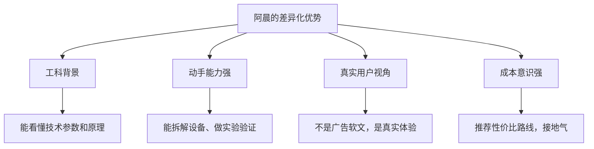
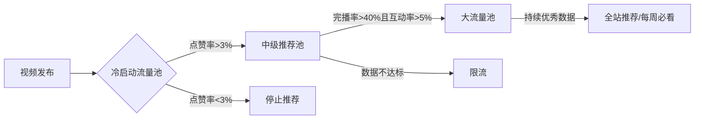
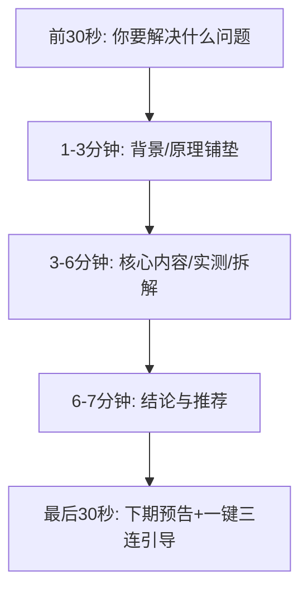
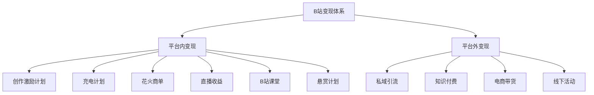
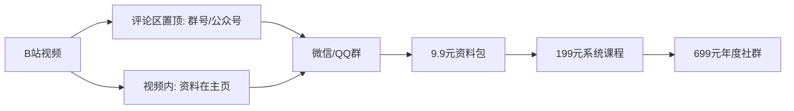
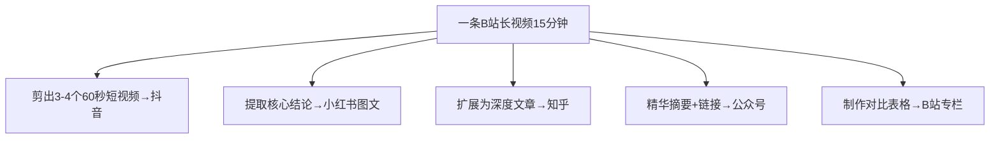
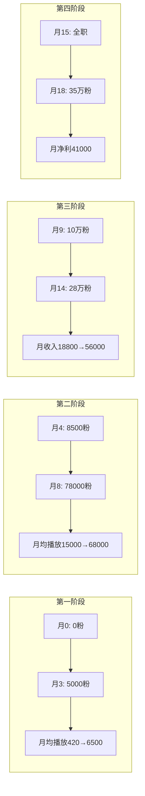

## 案例四：B站UP主——从兴趣到职业

### 案例概述

这是一个B站UP主从兴趣驱动的内容创作者，逐步转型为全职内容从业者的真实路径复盘。主角"阿晨"（化名），26岁，某三线城市机械设计工程师，月薪7K。2021年下半年开始在B站做科技数码与生活科普内容，从0粉丝起步，经过18个月的系统运营，累计粉丝突破35万，月收入从0增长到稳定2.5万+，最终辞去本职工作成为全职UP主。

这个案例的核心价值在于：B站和其他平台的运营逻辑完全不同。抖音追求爆发力，小红书追求种草转化，公众号追求深度信任，而B站追求的是**内容深度+社区认同**。阿晨的成功不是靠运气和算法推荐，而是靠对B站社区文化的深度理解、对内容质量的极致追求，以及一套适合B站生态的变现路径设计。

#### 为什么选B站作为主阵地

阿晨在选择平台前做了一周的对比分析。他的核心考量是：自己做的是需要深度讲解的科技内容，不适合抖音的短平快节奏，也不适合小红书的图文种草。最终选择B站的原因如下：

| 维度 | B站优势 | 对比其他平台 |
|------|---------|-------------|
| 内容形态 | 支持长视频（5-30分钟），适合深度讲解 | 抖音以短视频为主，深度内容受时长限制 |
| 用户画像 | 18-35岁为主，学历偏高，有付费意愿 | 小红书女性用户占比高，科技内容受众窄 |
| 社区氛围 | 弹幕+评论区互动文化强，粉丝粘性极高 | 抖音粉丝流动性大，关注关系弱 |
| 变现路径 | 创作激励+充电+花火商单+直播+课堂，多元 | 公众号变现主要靠广告和知识付费 |
| 内容长尾 | B站视频的搜索流量和推荐流量持续时间长 | 抖音视频48小时后推荐量断崖下降 |
| 算法偏好 | 重视完播率、互动率、内容质量分 | 小红书算法更偏重图文笔记的互动数据 |

但选择B站也有代价，阿晨提前评估了风险：

| 风险维度 | 具体表现 | 应对策略 |
|---------|---------|---------|
| 起步慢 | B站冷启动周期长，前3个月可能几乎没有正反馈 | 做好6个月零收入的心理准备，用主业收入覆盖生活 |
| 变现门槛高 | 花火商单需1万粉+，创作激励收入极低 | 前期以内容质量为唯一目标，变现自然水到渠成 |
| 内容成本高 | 长视频制作周期远超短视频 | 建立SOP提升效率，初期不要追求完美 |
| 社区规则严 | B站用户对"恰饭"零容忍，一次失误可能毁掉数月积累 | 建立商单筛选原则，宁缺毋滥 |

#### UP主的差异化优势

阿晨做B站内容有几个天然优势：



| 优势维度 | 具体表现 | 竞争壁垒 |
|---------|---------|---------|
| 工科思维 | 能用工程语言解释技术原理，逻辑清晰 | 非工科出身的博主难以模仿 |
| 拆机能力 | 能拆解设备展示内部结构和做工 | 专业设备+技术背景的双重门槛 |
| 消费者视角 | 月薪7K的真实消费能力，推荐更可信 | 不像"恰饭博主"那样脱离群众 |
| 闲暇时间 | 工作相对规律，每晚和周末可投入内容 | 996从业者难以持续输出 |

---

### 第一阶段：定位与冷启动（第1-3个月）

#### 找准内容定位：B站的"三圈定位法"

阿晨没有盲目开拍，而是花两周时间做了系统化的内容定位。B站的内容定位和抖音不同——B站用户更看重"你到底懂不懂"，而不是"你说话有没有趣"。

**第一个圈：我有什么（能力盘点）**

阿晨用一张表格盘点了自己的内容资产：

| 能力维度 | 具体内容 | 内容转化可能性 |
|---------|---------|---------------|
| 专业背景 | 机械设计本科，了解材料、结构、工艺 | 科普类内容的底层支撑 |
| 兴趣爱好 | 从小喜欢拆东西，家里堆满了拆过的电器 | 拆机评测的天然素材 |
| 数码经历 | 10年数码发烧友，用过40+部手机 | 手机/数码评测的素材库 |
| 生活技能 | 自己改装过出租屋，做全屋智能家居 | 生活改造类内容 |
| 表达能力 | 大学辩论队经历，逻辑表达能力尚可 | 视频讲解的基本功 |

**能力盘点的自我诊断框架**：很多新人不知道自己"能做什么"，可以用这个四步法来挖掘：

1. **列出你花钱买过的东西**——你愿意花钱说明你对这个领域有兴趣和认知，这比"我觉得我了解"更可靠
2. **列出别人问过你的问题**——朋友、同事经常问你什么？"你帮我看看这个手机值不值""这个耳机怎么样"？别人的问题就是最好的选题
3. **列出你花过大量时间的事**——下班后你花3小时研究的东西，就是你的内容方向
4. **列出你做过但别人没做过的事**——哪怕很小，比如"我自己换过手机电池""我DIY了一个NAS"，这些都是独特的内容素材

**第二个圈：B站缺什么（需求分析）**

阿晨在B站花了大量时间做竞品分析和需求调研：

```yaml
调研方法:
  - 搜索关键词看已有内容质量和数量
  - 分析热门视频的评论区高频词
  - 研究B站每周必看榜单的内容类型
  - 使用飞瓜数据/火烧云看行业数据
  - 用B站搜索框的联想词发现未被满足的需求
  - 查看"相关搜索"和"大家都在搜"了解用户意图

发现的蓝海机会:
  1. "千元机横评": 大博主都在测旗舰机，千元机评测内容少且质量差
  2. "科技原理科普": 用动画+实物讲解"为什么手机会发热""电池为什么会鼓包"
  3. "DIY改造": 把出租屋/宿舍低成本改造成理想空间，B站大学生群体巨大
  4. "拆机对比": 把同价位不同品牌的产品拆开对比内部做工
```

**竞品分析的实操方法**：

| 分析维度 | 具体操作 | 目的 |
|---------|---------|------|
| 搜索缺口 | 在B站搜索"千元机评测"，看前10个视频的播放量和质量 | 找到竞争不充分的细分领域 |
| 评论区挖掘 | 打开同类热门视频，翻看前100条评论 | 发现用户的真实痛点和未被解答的问题 |
| 弹幕分析 | 看热门视频的弹幕中高频出现的疑问词 | 了解用户在观看过程中的实时困惑 |
| UP主空缺 | 看同类目下有多少万粉以上的UP主 | 判断竞争强度，如果万粉UP主<10个说明是蓝海 |
| 话题热度 | 使用B站的"热门话题"和"每周必看"分析趋势 | 找到当前用户最关注的话题 |

**第三个圈：算法推什么（B站推荐机制理解）**

B站的推荐算法和抖音有本质区别。阿晨研究了B站的推荐逻辑：



**B站核心指标权重**（阿晨通过多次测试推算的近似值）：

| 指标 | 权重 | 说明 |
|------|------|------|
| 完播率 | 最高 | B站算法最看重的指标，直接影响推荐量 |
| 互动率（弹幕+评论） | 高 | B站独有的弹幕文化，互动数据含金量高于其他平台 |
| 点赞率 | 中高 | 体现内容质量和用户认可度 |
| 收藏率 | 中 | 科技/教程类内容的核心指标，说明内容有实用价值 |
| 投币率 | 中 | B站特有的互动行为，投币代表深度认可 |
| 分享率 | 中 | 内容传播力的体现 |
| 负反馈率 | 关键 | 点"不喜欢"或举报会严重影响推荐 |

**2024-2026年B站算法的关键变化**：

B站的推荐机制在持续迭代，以下是阿晨在运营过程中观察到的算法演变：

```yaml
2024年变化:
  - "内容质量分"权重提升: 算法开始评估内容的专业度、信息密度、原创性
  - 搜索权重加大: B站强化了搜索功能，搜索流量占比从15%提升到25-35%
  - "竖屏模式"独立推荐: B站推出Story模式竖屏内容，有独立的推荐池
  - 商单识别: 算法能识别商单内容，纯广告视频的推荐权重下降

2025年变化:
  - "用户价值分"引入: 算法开始评估内容对用户的实际价值（收藏→使用→回访）
  - 粉丝推荐权重提升: 粉丝观看率和互动率对推荐的影响增大
  - 跨品类惩罚: 账号发布和定位不相关的内容，推荐权重下降
  - 完播率计算优化: 短视频的完播率不再有"虚假优势"，算法按内容类型区分基准线

2026年最新动态:
  - AI内容标识: 纯AI生成内容可能被降低推荐权重
  - 深度内容激励: 10分钟以上深度内容获得额外推荐加权
  - 社区贡献值: 评论区互动、社区活动参与等行为影响账号权重
```

**最终定位确定**：

阿晨综合三个圈的分析，确定了自己的内容定位：

- **受众**：18-28岁、预算有限但追求品质的年轻人（大学生和初入职场的白领）
- **内容**：千元机深度评测 + 科技原理科普 + 生活改造实录
- **差异化**：拆机看内部 + 工科视角解读 + 真实使用1个月后再出评测
- **人设**：不是专业测评博主，而是"和你一样预算有限的普通人，替你试试坑"
- **更新频率**：每周2-3条，保持稳定的更新节奏

#### 账号基建：塑造B站专业感

B站的账号基建和抖音不同——B站用户会通过你的主页判断你是不是"认真做内容的"。

**账号信息设置**：

| 要素 | 阿晨的选择 | 设计思路 |
|------|----------|---------|
| 名称 | 阿晨的拆解台 | 简洁好记，"拆解"二字体现内容特色 |
| 头像 | 手持螺丝刀+电路板背景的个人照 | 工科人设，辨识度高 |
| 个性签名 | 工科人聊数码｜不恰烂饭｜只说真话 | 身份标签+态度宣言+信任背书 |
| 空间头图 | 工作台实拍图，摆满工具和拆解零件 | 强化"拆解"人设 |
| 充电简介 | "你的支持是我拆更多设备的动力" | 自然引导充电行为 |

**B站主页装修清单**：

```yaml
必做项:
  - 创建3-5个视频合集（按内容类型分类）
  - 设置置顶视频（留给你数据最好的内容）
  - 完善空间简介（200字以内说清你是谁、做什么、更新频率）
  - 开通创作者中心（查看详细数据面板）
  
可选项:
  - 投稿音视频（如果有合适的BGM/配音需求）
  - 相簿投稿（图文内容，增加曝光渠道）
  - 专栏投稿（长图文，适合科技原理解析）
  - 互动视频（投票类互动，提升用户参与感）
```

**新手常见的账号基建错误**：

| 错误 | 为什么是错的 | 正确做法 |
|------|------------|---------|
| 名称含特殊符号/emoji | B站用户倾向认为这是低质量账号 | 用中文或中英混合，简洁有辨识度 |
| 头像用风景/动漫图 | 无法建立个人IP记忆点 | 用个人照或和内容相关的定制logo |
| 签名写"新人UP主求关注" | 传递"我不专业"的信号 | 写清楚你的内容价值主张 |
| 没有合集分类 | 新访客找不到想看的内容，直接离开 | 按内容类型建立合集，引导系统化观看 |

#### 第一批内容的精心设计

阿晨的第一批内容不是随便发的，而是按照"测试矩阵"的思路来规划的：

**首批12条视频的选题设计**：

| 序号 | 选题 | 类型 | 时长 | 测试目的 |
|------|------|------|------|---------|
| 1 | 千元机凭什么卖这么贵？我拆了3台告诉你 | 拆机评测 | 8分钟 | 测试拆机类内容的吸引力 |
| 2 | 手机充电发热到底危不危险？工程师给你讲明白 | 科普讲解 | 6分钟 | 测试科普类内容的数据 |
| 3 | 500元改造出租屋，室友看傻了 | 生活改造 | 10分钟 | 测试改造类泛流量 |
| 4 | 2024最值得买的5款千元机｜亲测一个月 | 横评推荐 | 12分钟 | 测试评测类的完播率 |
| 5 | 你手机的这个功能99%的人不知道 | 技巧分享 | 4分钟 | 测试短视频/技巧类内容 |
| 6 | 为什么苹果不卡安卓会卡？工程师给你讲原理 | 科普讲解 | 8分钟 | 测试"解释类"选题的搜索流量 |
| 7 | 我花了2000块把宿舍改成了电竞房 | 生活改造 | 12分钟 | 承接第3条，验证改造类数据 |
| 8 | 拆解小米和红米到底差在哪 | 拆机对比 | 10分钟 | 测试对比类内容 |
| 9 | 充电宝怎么选不踩坑？行业人士的建议 | 选购指南 | 7分钟 | 测试选购指南类的收藏率 |
| 10 | 大学四年我买过最值和最坑的数码产品 | 个人分享 | 8分钟 | 测试人设类/故事类内容 |
| 11 | 一块电池是怎么生产出来的？带你看工厂 | 探访Vlog | 15分钟 | 测试深度内容的上限 |
| 12 | 你的手机壳可能正在伤害你的手机 | 科普讲解 | 5分钟 | 测试"反常识"科普类 |

**测试矩阵的设计逻辑**：首批内容的目的不是"火"，而是"测"。阿晨在选题设计上遵循了四个原则：

```yaml
测试矩阵设计原则:
  1. 类型覆盖: 至少覆盖4种不同的内容类型（评测/科普/改造/分享），用数据选出最优方向
  2. 时长梯度: 从4分钟到15分钟，测试不同长度的完播率曲线
  3. 话题分层: 30%热门话题（有搜索量）、40%中等话题（竞争适中）、30%长尾话题（蓝海）
  4. 节奏错开: 不要连续发同一类型，避免算法给账号打上单一标签
```

**拍摄设备与制作标准**：

阿晨的设备非常简陋，但他制定了严格的制作标准：

```yaml
设备清单（总投入<2000元）:
  主机位: iPhone 13（已有）
  副机位: 旧手机（拍特写/拆解过程）
  三脚架: 桌面小三脚架 49元 + 落地三脚架 89元
  麦克风: 领夹麦 79元（后来升级为罗德Wireless Go II）
  灯光: 两盏台灯 + 白纸做反光板（0元）
  拍摄台: 一张白色桌面 + 黑色背景布 35元

画面标准:
  分辨率: 1080p 30fps（够用，不必追求4K）
  画面构图: 产品展示用俯拍/45度角，人物讲解用中景
  灯光: 主光源在左前方45度，右后方补反光板消除阴影
  
音频标准:
  录制: 领夹麦收音，后期用Adobe Podcast降噪
  音量: 人声-6dB到-3dB，BGM压到-18dB以下
  关键: B站用户对音频质量敏感，杂音=直接划走

后期标准:
  软件: DaVinci Resolve（免费版够用）
  节奏: 每5-8秒切一次画面/角度
  字幕: 必须加字幕（B站弹幕文化下字幕是标配）
  封面: 统一设计模板，大字标题+产品实拍图
  片头: 不超过3秒，直接进入正题（B站用户讨厌冗长片头）
```

**B站封面设计的关键要素**：

封面是决定点击率的第一要素。阿晨总结了B站高点击率封面的共同特征：

| 要素 | 具体要求 | 原因 |
|------|---------|------|
| 文字大小 | 标题文字占封面面积的1/3以上 | 手机端浏览时，文字太小看不清 |
| 文字颜色 | 深色背景用白/黄字，浅色背景用黑/红字 | 高对比度才能在小图中被注意到 |
| 主体清晰 | 一个明确的视觉主体（产品/人脸/场景） | 信息过多会让用户不知道这个视频讲什么 |
| 信息分层 | 主标题（6-10字）+ 副标题/标签 | 一眼就能判断"这个视频和我有关" |
| 统一模板 | 同系列用统一的排版风格 | 建立视觉记忆，粉丝一看到就知道是你的内容 |
| 避免纯文字 | 至少有一个实物图/人像 | 纯文字封面在B站的点击率显著低于图文混合 |

#### 冷启动期数据与复盘

前3个月的运营数据：

| 指标 | 第1个月 | 第2个月 | 第3个月 |
|------|---------|---------|---------|
| 发布视频数 | 4条 | 6条 | 8条 |
| 平均播放量 | 420 | 1,800 | 6,500 |
| 最高播放量 | 1,200 | 12,000 | 48,000 |
| 粉丝增长 | 180 | 950 | 4,200 |
| 平均完播率 | 18% | 28% | 35% |
| 平均点赞率 | 2.1% | 4.2% | 6.8% |
| 平均投币率 | 0.3% | 1.1% | 2.4% |
| 平均收藏率 | 1.2% | 3.8% | 7.2% |

**冷启动期的心理建设**：前3个月是最容易放弃的阶段。阿晨在第1个月结束时，视频平均播放量只有420——这意味着他花了10小时制作的视频，只有不到500人看过。他差点放弃，但靠两个方法坚持了下来：

1. **设定过程目标而非结果目标**：不以"涨多少粉"为目标，而是以"本周完成2条视频的拍摄和剪辑"为目标。过程目标是自己能控制的，结果目标受算法和运气影响
2. **建立"数据记录表"**：每条视频发布后记录核心数据，7天后对比。即使整体数据不好，但能看到"第3条比第1条好了3倍"的局部进步，这就是坚持的动力

**关键发现**：

1. **拆机类内容收藏率最高**（平均9.2%），说明这类内容的"工具属性"强，用户会收藏以备后用
2. **生活改造类内容播放量最高**，但涨粉效率低于科技内容，因为泛流量用户不精准
3. **科普讲解类内容的投币率最高**（平均3.8%），B站用户愿意为"学到东西"的内容投币
4. **视频时长和完播率的关系不是线性的**：6-8分钟的内容完播率最优，太短（<4分钟）用户觉得"不过瘾"，太长（>15分钟）前期完播率骤降
5. **发布时间很重要**：B站的流量高峰是晚上8-11点和周末全天，工作日下午发布的内容初始推荐量明显低

**发布时间的深度分析**：

| 发布时间 | 初始推荐量 | 完播率 | 适合的内容类型 |
|---------|----------|--------|-------------|
| 周一-周五 20:00-22:00 | 最高 | 高 | 科技/评测/深度内容 |
| 周六-周日 10:00-12:00 | 高 | 最高 | 生活改造/Vlog/轻松内容 |
| 周六-周日 20:00-23:00 | 最高 | 高 | 任何类型，黄金时段 |
| 周一-周五 12:00-13:00 | 中 | 中 | 短视频/技巧类 |
| 凌晨/工作日上午 | 低 | 低 | 不推荐，除非面向海外观众 |

**第3个月的关键转折——第一条小爆款**：

阿晨发的"千元机凭什么卖这么贵？我拆了3台告诉你"在第3个月突然起量，48小时内播放突破4.8万，涨粉1800。

| 指标 | 这条视频 | 同期均值 | 倍数 |
|------|---------|---------|------|
| 播放量 | 48,000 | 6,500 | 7.4倍 |
| 完播率 | 42% | 35% | 1.2倍 |
| 点赞率 | 9.1% | 6.8% | 1.3倍 |
| 投币率 | 5.2% | 2.4% | 2.2倍 |
| 收藏率 | 12.8% | 7.2% | 1.8倍 |
| 评论率 | 4.3% | 2.1% | 2.0倍 |

**爆款因子分析**：

- 选题精准：千元机是学生群体的刚需，受众基数巨大
- 内容形式新颖：不是简单开箱，而是真刀真枪拆开看内部
- 信息密度高：3台手机的横向对比，一个视频解决"选哪台"的问题
- 标题含数字+悬念："凭什么卖这么贵"引发好奇心
- 弹幕互动强：用户在弹幕里讨论"我觉得XX更好"，推高了互动数据

**爆款视频的复盘模板**（阿晨后来固定使用的）：

```yaml
爆款复盘清单:
  数据层面:
    - 发布后2h/6h/24h/72h的播放量曲线
    - 完播率在哪个时间点大幅下降（说明那里观众流失了）
    - 弹幕密度最高的时间段（说明那里有讨论点）
    - 搜索流量 vs 推荐流量的占比
  
  内容层面:
    - 标题用了什么技巧？（数字/悬念/痛点/反常识）
    - 封面的点击率是多少？
    - 前30秒留住了多少观众？
    - 哪个段落引发了最多弹幕？
  
  可复制层面:
    - 这条视频的哪个元素可以复用到其他选题？
    - 如果做系列化，下一步选什么？
    - 评论区有没有出现新的选题灵感？
```

---

### 第二阶段：内容体系打磨与粉丝积累（第4-8个月）

#### 建立B站特色的内容SOP

B站内容和抖音最大的不同是：B站用户追求"干货"和"诚意"，对"套路"和"标题党"零容忍。阿晨的SOP围绕B站的社区文化来设计。

**B站内容结构模板**：



**每段落的创作标准**：

| 时间段 | 作用 | 创作要点 | 常见错误 |
|--------|------|---------|---------|
| 前30秒 | 钩子 | 直接抛出问题或展示最震撼的画面，3秒内抓住注意力 | 冗长自我介绍、无关开头 |
| 1-3分钟 | 铺垫 | 讲清楚背景知识和"为什么你该关心这个问题" | 铺垫太长，观众还没看到正题就走了 |
| 3-6分钟 | 核心 | 展示实测数据、拆解过程、对比结果 | 信息密度不够，注水凑时长 |
| 6-7分钟 | 结论 | 给出明确结论和购买建议 | 说了半天没结论，或者结论模棱两可 |
| 最后30秒 | 引导 | 轻松预告下期内容，引导一键三连 | 强行索要三连、太长引起反感 |

**B站特有的"社区友好"设计**：

| 设计要素 | 具体做法 | 原因 |
|---------|---------|------|
| 开头不废话 | 第一句话直接点题，不做冗长自我介绍 | B站用户会在弹幕刷"XX:xx正片开始"来表达不满 |
| 弹幕互动点 | 在视频中预留2-3个弹幕互动触发点 | 例如"你觉得哪个更好？弹幕告诉我" |
| 结尾彩蛋 | 正片结束后放30秒花絮/搞笑片段 | B站用户习惯看到最后，彩蛋提升完播率 |
| 评论区置顶 | 自己先写一条有深度的评论置顶 | 引导评论方向，提供额外信息 |
| 充电引导 | 用轻松的语气提一句，不反复强调 | B站用户对过度商业化反感 |
| 时间线标记 | 在简介中列出视频的时间线（00:00-xx:xx） | 方便用户跳转到感兴趣的部分，提升体验 |

**内容生产流水线**（阿晨的周计划）：

```yaml
周一:
  上午: 分析上周视频数据，找出改进点
  晚上: 从选题库中选定本周3个选题，写出大纲

周二:
  晚上: 完成2条视频的详细脚本

周三:
  晚上: 完成第3条视频的脚本 + 准备拍摄道具/产品

周四:
  晚上: 集中拍摄2条视频（换衣服/换场景/换机位）

周五:
  晚上: 拍摄第3条视频

周六:
  全天: 3条视频的粗剪+精剪+字幕+封面

周日:
  上午: 终审+微调
  下午: 安排发布时间（周日晚8点/周二晚8点/周四晚8点）
  晚上: 互动维护+评论区回复
```

**脚本写作的实操方法**：

阿晨的脚本不是写出来的，而是"聊出来的"。他的脚本写作流程：

```yaml
Step 1 - 录音初稿:
  方法: 对着手机录音，假装在给朋友讲这个话题
  时长: 通常是成品视频时长的2-3倍（需要大量删减）
  原因: 说人话比写文章更自然，B站用户不喜欢"播音腔"

Step 2 - 转文字+删减:
  工具: 飞书文档的语音转文字功能
  删减标准:
    - 删除所有"嗯""啊""然后""就是说"
    - 删除重复表达同一个意思的段落
    - 删除和核心主题无关的延伸
    - 保留口语化表达（B站用户喜欢）

Step 3 - 结构调整:
  把删减后的内容按照"钩子→铺垫→核心→结论→引导"重新排列
  每个段落标注对应的画面（讲什么→拍什么）

Step 4 - 口播练习:
  对着镜头念一遍，标记不顺畅的地方
  调整为更自然的表达方式
```

#### 选题方法论：B站的"搜索+推荐"双引擎

B站的流量来源和其他平台不同。抖音90%以上靠推荐流量，但B站有大量搜索流量。阿晨发现，他30%的播放量来自搜索。

**选题来源矩阵**：

| 来源 | 方法 | 选题质量 | 占比 |
|------|------|---------|------|
| B站搜索框 | 输入关键词看联想词和相关搜索 | 高（精准需求） | 25% |
| 评论区挖掘 | 从自己和竞品的评论区找用户问题 | 最高（真实痛点） | 25% |
| 热点嫁接 | 科技新闻/新品发布+自己的角度 | 中高（蹭热度） | 15% |
| 竞品分析 | 监控10个同类型UP主的爆款内容 | 中高（已验证） | 15% |
| 个人经历 | 自己的踩坑、改造、使用体验 | 中（依赖个人素材） | 10% |
| 选题库回顾 | 定期回顾之前的选题，有些时机成熟了 | 中（二次开发） | 10% |

**B站搜索SEO优化**：

阿晨发现B站的搜索流量非常有价值，他专门研究了B站的搜索排名规则：

```yaml
标题优化:
  - 必须包含核心关键词（如"千元机""拆机""评测"）
  - 标题长度控制在15-25字
  - 用竖线或括号做信息分层（如"2024千元机横评｜拆了5台告诉你哪台值"）
  
标签设置:
  - 设置10-15个相关标签
  - 包含大类标签（科技、数码）和细分标签（千元机、拆机、手机评测）
  - 加上品牌标签（小米、红米、OPPO等）
  
简介优化:
  - 前两行包含核心关键词
  - 列出视频的时间线目录（方便用户跳转）
  - 附上相关视频链接（形成内容矩阵）
```

**标题撰写的B站公式**：

阿晨测试了数十种标题模式，总结出B站科技类内容的高点击率标题公式：

| 公式 | 示例 | 点击率对比 |
|------|------|----------|
| 数字+痛点 | "3款千元机实测对比，第2款千万别买" | 基准线×1.8 |
| 悬念+答案 | "千元机凭什么卖这么贵？拆开看真相" | 基准线×1.6 |
| 反常识+证据 | "你的手机壳可能正在伤害你的手机" | 基准线×1.5 |
| 对比+结论 | "小米vs红米到底差在哪？拆给你看" | 基准线×1.4 |
| 问题+权威 | "手机发热到底危不危险？工程师讲明白" | 基准线×1.3 |
| 纯描述型 | "XX手机开箱评测" | 基准线×1.0（最低） |

#### 第4-8个月数据增长曲线

| 指标 | 第4月 | 第5月 | 第6月 | 第7月 | 第8月 |
|------|-------|-------|-------|-------|-------|
| 发布视频数 | 10条 | 10条 | 12条 | 12条 | 12条 |
| 平均播放量 | 15,000 | 28,000 | 42,000 | 55,000 | 68,000 |
| 最高播放量 | 85,000 | 152,000 | 230,000 | 310,000 | 420,000 |
| 累计粉丝 | 8,500 | 18,000 | 32,000 | 52,000 | 78,000 |
| 平均完播率 | 38% | 40% | 42% | 44% | 43% |
| 月收入 | 800元 | 2,200元 | 4,500元 | 8,000元 | 12,000元 |

**收入来源明细（第8个月）**：

| 收入来源 | 金额 | 占比 | 说明 |
|---------|------|------|------|
| 创作激励计划 | 1,800元 | 15% | B站按播放量和互动数据发放 |
| 充电计划 | 1,200元 | 10% | 粉丝每月充电支持 |
| 花火商单 | 6,000元 | 50% | 2条品牌合作视频（千元机/充电宝） |
| 带货佣金 | 2,000元 | 17% | 视频下方商品卡的CPS佣金 |
| 直播收入 | 1,000元 | 8% | 每周1次直播拆机/答疑 |
| **合计** | **12,000元** | **100%** | |

**B站创作激励计划的详细机制**：

很多新人UP主对B站的创作激励计划有误解，以为只要播放量高就能赚大钱。阿晨详细研究了其机制：

```yaml
创作激励计划准入条件:
  - 粉丝≥1000
  - 投稿视频≥10条
  - 账号无严重违规记录

收入计算公式（近似）:
  基础收益 = 播放量 × 单价（约0.5-3元/千次播放，因内容类型而异）
  加成系数:
    - 互动率加成: 互动率越高，单价越高（最高2倍）
    - 内容类型加成: 科技/知识类单价>生活类>娱乐类
    - 账号等级加成: 持续优质输出的账号单价逐年提升
  
  实际案例:
    - 10万播放量的科技视频，约收入150-300元
    - 100万播放量的科技视频，约收入1500-3000元
    - 创作激励收入天花板较低，万粉级别月收入约1500-3000元

关键认知:
  - 创作激励是"保底收入"，不是"核心收入"
  - 不要为了提升创作激励收入去刷播放量（B站会检测并惩罚）
  - 创作激励收入和内容质量正相关，和"投机取巧"负相关
```

---

### 第三阶段：商业化与变现体系搭建（第9-14个月）

#### B站的变现路径全景

阿晨在做商业化之前，先系统梳理了B站所有变现渠道，然后根据自己的账号特点选择了最适合的组合：



**各变现渠道详解**：

| 渠道 | 门槛 | 收入天花板 | 适合阶段 | 阿晨的策略 |
|------|------|----------|---------|----------|
| 创作激励 | 1000粉+10视频 | 低（万粉约2000/月） | 起步期 | 保底收入，不作为主要来源 |
| 充电计划 | 无硬性门槛 | 中（取决于粉丝粘性） | 成长期 | 通过优质内容自然积累 |
| 花火商单 | 10000粉 | 高（万粉以上单条数千到数万） | 成熟期 | 核心收入来源，严格筛选品牌 |
| 直播 | 无硬性门槛 | 中（看直播能力和互动频率） | 成长期 | 每周1次直播作为粉丝维护手段 |
| B站课堂 | 需申请 | 高（一次制作持续收入） | 成熟期 | 制作系统化课程 |
| 悬赏计划 | 10000粉 | 中 | 成熟期 | 选择和定位相关的任务 |

**充电计划的运营技巧**：

充电计划是B站独有的"打赏"机制，不同于抖音的直播打赏，充电更像是一种"订阅支持"：

```yaml
提升充电收入的策略:
  1. 充电专属内容:
     - 每月发布1-2条充电专属视频（提前看/幕后/深度分析）
     - 不要把核心内容放在充电墙后面，那会伤害涨粉
  
  2. 充电感谢视频:
     - 每月做一次"充电感谢"动态或视频
     - 列出充电用户名单，公开感谢
  
  3. 充电等级体系:
     - 为不同充电金额设置不同的"感谢等级"
     - 例如: 充电50元→视频末尾致谢，充电100元→专属群+月度直播
  
  4. 自然引导:
     - 在视频末尾用轻松的语气提一句
     - "如果你觉得这期视频有用，可以考虑给我充个电"
     - 不要反复强调，B站用户对"要饭式引导"非常反感
```

#### 花火商单的接单策略

花火平台是B站官方的品牌合作平台。阿晨在粉丝突破1万后开始接到商单邀请，但他对接商单有严格的原则：

**接单三原则**：

1. **产品相关性**：只接和自己定位相关的商单（数码、科技、生活好物）
2. **真实体验**：必须自己用过至少1周才出评测，拒绝"到手即评测"
3. **数据透明**：在视频中明确标注"本期为XX品牌合作"，不藏着掖着

**商单报价参考**（阿晨的定价演变）：

| 粉丝量级 | 单条视频报价 | 合作形式 | 品牌要求 |
|---------|------------|---------|---------|
| 1-3万 | 2,000-3,000元 | 产品置换+稿费 | 产品需符合定位 |
| 3-5万 | 4,000-6,000元 | 纯稿费 | 提供创意自由度 |
| 5-10万 | 8,000-12,000元 | 纯稿费+长期合约 | 品牌调性匹配 |
| 10-20万 | 15,000-25,000元 | 定制内容+多平台 | 给予充分创作自由 |
| 20万+ | 30,000-50,000元 | 品牌大使/年度合作 | 深度绑定 |

**商单谈判的实战技巧**：

```yaml
报价策略:
  - 基础报价 = 粉丝数 × 0.1-0.3元（科技类单价高于娱乐类）
  - 长期合作给折扣（8-9折），但约定最低合作频次
  - 多平台发布加价30-50%
  - 独家内容加价50-100%（要求品牌不在其他UP主投放同类内容）

谈判要点:
  - 明确交付物: 几条视频、什么形式、哪些平台、修改次数
  - 明确时间线: 从拿到产品到视频发布的周期（阿晨要求至少2周）
  - 明确创作自由: 要求品牌不能审核脚本细节，只能确认事实准确性
  - 明确付款节点: 50%预付+50%发布后（防止品牌拖欠）
  
拒绝清单（以下情况直接拒绝）:
  - 要求说假话或夸大产品功能
  - 不允许标注"合作"标签
  - 要求在24小时内出内容（没有足够体验时间）
  - 产品和账号定位完全不相关
  - 品牌方曾有负面舆情
```

**商单内容创作的平衡术**：

阿晨总结了一个公式：商单视频 = 70%干货 + 20%产品植入 + 10%品牌信息。

```text
反面案例：
  "大家好今天给大家推荐XX品牌的XX产品，它真的太好用了……"
  → 评论区翻车："又恰烂饭""取关了"

正面案例：
  "千元机到底能不能打游戏？我拿这台XX品牌的机器实测了10款主流游戏……"
  → 整个视频核心是解答用户的实际问题，产品是解决方案的一部分
  → 评论区反馈："虽然知道是广告但确实很有用""这波恰饭我可以接受"
```

**商单内容的创作框架**：

```yaml
第一段（前30秒）: 抛出用户的真实问题
  示例: "很多人问我2000块以内能不能买到打游戏不卡的手机"

第二段（1-3分钟）: 讲背景、讲原理
  示例: "影响手机游戏性能的三个核心因素是……"

第三段（3-8分钟）: 用产品实测解答问题
  示例: "我用这台XX实测了10款游戏，结果如下……"
  关键: 必须展示真实数据，包括产品表现不好的地方

第四段（8-9分钟）: 给出结论
  示例: "这台手机适合XX人群，不适合YY人群"
  关键: 不能只说优点，必须说缺点

第五段（最后30秒）: 品牌信息+购买链接
  示例: "感谢XX品牌提供的测试机，链接在简介里"
```

#### 私域沉淀与知识付费

阿晨从第10个月开始搭建私域体系，为知识付费做铺垫：

**引流路径**：



**B站引流的注意事项**：

B站对外部引流有严格限制，阿晨踩过几个坑：

```yaml
安全做法:
  - 在简介中放公众号名称（不放二维码图片）
  - 在评论区置顶放群号（文字形式）
  - 在视频中口播"想了解更多可以看看我的主页"
  - 用B站动态发布引流内容（比视频审核宽松）

危险做法（容易被限流或封号）:
  - 在视频中直接展示二维码
  - 在简介中放外部链接（B站会屏蔽）
  - 在评论区批量发引流信息
  - 用谐音字绕过审核（B站能识别）
```

**产品阶梯设计**：

| 层级 | 产品 | 价格 | 内容 | 转化率 |
|------|------|------|------|--------|
| 引流层 | B站免费视频 | 0 | 基础知识和评测 | - |
| 筛选层 | 《千元机选购指南》PDF | 9.9元 | 50页深度横评+参数对比表 | 视频观众→3% |
| 核心层 | 《从零学数码》系统课 | 199元 | 40节课，从原理到实操 | 资料包用户→12% |
| 高端层 | 年度数码顾问社群 | 699元/年 | 每月直播+1对1咨询+优先评测 | 课程用户→8% |

**知识付费产品的设计原则**：

```yaml
产品设计的核心逻辑:
  1. 免费内容解决"是什么"，付费内容解决"怎么做"
     - 免费: "千元机哪款好？我推荐A和B"
     - 付费: "如何根据你的使用场景选出最适合的手机？完整选购方法论"
  
  2. 每一层产品都要有独立价值，不能让人觉得"被骗了"
     - 9.9元的资料包必须比免费视频更系统、更深入
     - 199元的课程必须比资料包更实操、更个性化
  
  3. 用"免费→低价→高价"的路径筛选高意愿用户
     - 愿意花9.9元的人，大概率愿意花199元
     - 不愿意花9.9元的人，大概率也不会花199元
  
  4. 服务比内容更重要
     - 199元的课程价值不在40节课，而在"有问必答的社群"
     - 699元的社群价值不在月度直播，而在"1对1咨询"
```

**私域运营的关键数据**：

- 微信群用户1,200人，月均增长150人
- 9.9元资料包累计销售800份
- 199元课程累计销售120份
- 699元社群累计会员45人
- 知识付费总收入约4.2万元/月

#### 直播运营策略

阿晨从第6个月开始尝试直播，把它作为粉丝维护和补充收入的手段：

```yaml
直播类型:
  1. 拆机直播（每月2次）:
     - 边拆边讲解，实时回答弹幕问题
     - 互动率最高，但准备成本也最高（需要提前准备拆解方案）
  
  2. 答疑直播（每月2次）:
     - 回答粉丝的选购问题
     - 准备成本低，但需要提前收集问题
  
  3. 新品首发直播（偶尔）:
     - 新品发布当天开直播讨论
     - 蹭热度效果好，但需要快速反应能力

直播收入来源:
  - 直播间礼物打赏: 约占60%
  - 直播间带货佣金: 约占30%
  - 直播间充电引导: 约占10%

直播运营技巧:
  - 固定时间（每周三/周六晚8点），让粉丝形成习惯
  - 直播前1天发预告动态
  - 直播中每隔30分钟做一次互动环节（抽奖/投票/连麦）
  - 直播后发精华切片到视频区，获取二次流量
```

#### 第9-14个月收入增长

| 收入来源 | 第9月 | 第10月 | 第11月 | 第12月 | 第13月 | 第14月 |
|---------|-------|--------|--------|--------|--------|--------|
| 创作激励 | 2,500 | 2,800 | 3,200 | 3,500 | 3,800 | 4,000 |
| 充电计划 | 1,800 | 2,000 | 2,500 | 2,800 | 3,200 | 3,500 |
| 花火商单 | 8,000 | 12,000 | 15,000 | 18,000 | 22,000 | 25,000 |
| 带货佣金 | 3,000 | 3,500 | 4,000 | 4,500 | 5,000 | 5,500 |
| 直播收入 | 1,500 | 2,000 | 2,500 | 3,000 | 3,500 | 4,000 |
| 知识付费 | 2,000 | 5,000 | 8,000 | 10,000 | 12,000 | 14,000 |
| **合计** | **18,800** | **27,300** | **35,200** | **41,800** | **49,500** | **56,000** |

---

### 第四阶段：全职转型与规模化（第15-18个月）

#### 从副业到全职的决策框架

阿晨没有冲动辞职，而是做了一个严谨的决策分析：

**全职决策的五项条件**（阿晨设定的"安全线"）：

| 条件 | 安全线 | 阿晨实际 | 是否达标 |
|------|--------|---------|---------|
| 副业收入≥主业3倍 | 21,000元 | 35,000元 | 达标 |
| 连续3个月收入稳定 | 无大幅波动 | 3个月均>3万 | 达标 |
| 储备金≥12个月开支 | 10万元 | 12万元 | 达标 |
| 内容产能有提升空间 | 能做更多内容 | 全职后每周可出4-5条 | 达标 |
| 家人理解和支持 | 无后顾之忧 | 父母理解并支持 | 达标 |

五项全部达标后，阿晨在第15个月正式辞职。

**辞职前必须想清楚的三个问题**：

```yaml
问题1: 如果B站明天改了算法，你的收入暴跌怎么办？
  阿晨的答案:
    - 知识付费收入不依赖B站算法（私域用户）
    - 已经搭建了多平台矩阵（抖音+小红书+知乎）
    - 储备金够撑12个月，有足够时间调整
  
问题2: 你能接受连续3个月没有正反馈吗？
  阿晨的答案:
    - 经历过前3个月的冷启动期，知道自己能扛住
    - 有成熟的选题方法论，不是靠灵感吃饭
    - 有团队分担压力，不是一个人扛所有事
  
问题3: 全职后你的生活会变成什么样？
  阿晨的答案:
    - 每天工作10-12小时（比上班更累）
    - 没有周末的概念（周末是流量高峰）
    - 社交圈会缩小（大部分时间都在做内容）
    - 但做的是自己喜欢的事，幸福感更高
```

#### 全职后的合规与税务

这是很多UP主忽视但极其重要的环节。阿晨在辞职前专门咨询了会计，建立了合规的经营体系：

```yaml
经营主体选择:
  - 个体工商户: 最简单，适合月收入<10万的情况
  - 个人独资企业: 适合需要开发票给品牌方的情况
  - 阿晨的选择: 注册个体工商户，核定征收

税务处理:
  增值税:
    - 月收入<10万免征增值税（小规模纳税人优惠）
    - 超过10万的部分按1%征收（2024年政策，需关注最新政策）
  
  个人所得税:
    - 核定征收: 收入×核定利润率×适用税率
    - 阿晨的实际税负约为收入的3-5%
    - 每季度申报一次

发票管理:
  - 花火商单需要给品牌方开发票
  - 个体工商户可以去税务局代开
  - 也可以申请税控盘自己开票

社保公积金:
  - 全职后需要自己缴纳社保
  - 可以选择灵活就业人员社保（养老+医疗）
  - 每月约1000-1500元
  - 公积金可以选择不缴（没有强制要求）

合同管理:
  - 每个商单都要签合同（花火平台有标准合同模板）
  - 合同中要明确: 交付物、时间线、付款方式、违约责任
  - 保留所有沟通记录（微信聊天记录截图）
```

#### 团队搭建

全职后，阿晨开始搭建小团队来提升产能：

| 角色 | 人数 | 月薪 | 职责 | 招聘渠道 |
|------|------|------|------|---------|
| 剪辑师 | 1人 | 5,000元 | 视频剪辑、字幕、特效、封面 | B站/豆瓣剪辑群 |
| 运营助理 | 1人 | 4,000元 | 评论维护、私域运营、数据统计 | 社群内招聘 |
| 文案兼职 | 1人 | 2,500元 | 选题调研、脚本初稿 | 大学生兼职 |
| **合计** | **3人** | **11,500元/月** | | |

**团队协作流程**：

```yaml
阿晨负责:
  - 选题终审和内容方向把控
  - 核心视频的出镜讲解和拆解
  - 品牌合作谈判和商务对接
  - 课程研发和社群深度运营

剪辑师负责:
  - 按阿晨的剪辑规范完成后期
  - 封面设计和B站专栏排版
  - 多平台素材适配（竖版/方版）

运营助理负责:
  - 每日评论区互动维护
  - 私域社群的日常运营
  - 数据报表和竞品监控
  - 商品橱窗的上架和维护

文案兼职负责:
  - 每周提交5个选题调研报告
  - 完成脚本初稿（阿晨审核修改）
  - B站专栏文章的撰写
```

**团队管理的关键经验**：

```yaml
招聘:
  - 剪辑师: 让候选人用同一段素材剪一个30秒样片，对比风格和效率
  - 运营助理: 优先从粉丝中招聘（了解社区文化，不需要培训）
  - 文案兼职: 给一个选题让写500字大纲，看逻辑能力和信息搜集能力

培训:
  - 写一份详细的《内容制作规范》（阿晨写了30页）
  - 前两周每天review工作产出，逐一反馈
  - 建立标准化的工作流程和交付模板

考核:
  - 剪辑师: 按视频条数计薪+质量评分
  - 运营助理: 按互动数据和私域增长考核
  - 文案兼职: 按选题采纳率考核

常见问题:
  - 剪辑师风格和你预期不一致 → 提供足够多的参考视频+详细的规范文档
  - 运营助理回复评论不当 → 建立评论回复模板和"禁用语"清单
  - 兼职不稳定 → 备选人选，核心工作不依赖单一兼职
```

#### 多平台矩阵扩展

阿晨以B站为主阵地，开始向其他平台扩展：

| 平台 | 定位 | 粉丝量 | 内容策略 | 额外收入 |
|------|------|--------|---------|---------|
| B站 | 主阵地 | 35万 | 原创长视频 | 核心收入 |
| 抖音 | 短视频引流 | 12万 | B站内容剪辑成60秒版本 | 商品橱窗2000/月 |
| 小红书 | 图文种草 | 5万 | 评测结果做成图文笔记 | 品牌合作1500/月 |
| 知乎 | SEO长尾 | 3万 | 深度分析文章 | 知乎好物推荐1000/月 |
| 微信公众号 | 私域入口 | 2万 | 精华内容+课程入口 | 课程转化核心渠道 |

**多平台内容复用策略**：



**多平台运营的效率优化**：

```yaml
一条内容→五个平台的工作流程:
  1. B站长视频（主内容）: 脚本→拍摄→剪辑→发布，耗时约15小时
  2. 抖音短视频（复用）: 从长视频中剪3-4个60秒版本，耗时约2小时
  3. 小红书图文（复用）: 提取核心数据做成图文笔记，耗时约1小时
  4. 知乎文章（复用）: 脚本扩展为深度文章，耗时约2小时
  5. 公众号推文（复用）: 精华摘要+链接，耗时约0.5小时

  总耗时: 约20.5小时
  如果每个平台都做原创内容: 约50+小时
  复用效率提升: 约60%
```

#### 第18个月里程碑数据

| 指标 | 数值 |
|------|------|
| B站粉丝 | 35万 |
| 全平台粉丝 | 57万 |
| 月均视频播放量 | 85万 |
| 月总收入 | 56,000元 |
| 团队成本 | 11,500元 |
| 设备/场地成本 | 3,500元 |
| 月净利润 | 41,000元 |
| 内容总条数 | 186条 |
| 累计播放量 | 1,200万 |
| 私域用户 | 2,800人 |

---

### 关键转折点深度复盘

#### 转折点一：从"自嗨式创作"到"用户需求驱动"

阿晨早期拍了很多自己觉得有趣的内容，比如"我拆了一个10年前的MP3""DIY了一个蓝牙音箱"，数据很一般。转折点是第3个月那条拆机视频爆了之后，他开始系统分析数据，发现了一个规律：**播放量高的视频，无一例外都在回答用户的一个具体问题**。

**转变前后对比**：

| 维度 | 转变前 | 转变后 |
|------|--------|--------|
| 选题来源 | "我想拆什么就拆什么" | "用户搜索什么我就做什么" |
| 标题风格 | "拆解XX手机内部" | "XX手机内部做工到底怎么样？拆给你看" |
| 内容结构 | 拆→看→说感受 | 问题→拆解→对比→结论→建议 |
| 平均播放量 | 2,000 | 35,000 |
| 评论区反馈 | "挺有意思" | "终于有人拆了！我一直在纠结要不要买" |

#### 转折点二：弹幕文化的深度理解

阿晨在第5个月意识到，B站的弹幕不是简单的"评论"，而是一种**集体观看体验**。他开始有意识地在视频中设计"弹幕触发点"：

```text
弹幕触发点设计方法：
1. 悬念式: "你觉得这个零件是做什么用的？弹幕猜一下"
2. 对比式: "左边是A品牌，右边是B品牌，弹幕选你的阵营"
3. 共鸣式: "是不是和你之前那台XX一样？弹幕扣1"
4. 挑战式: "猜猜这个零件值多少钱？弹幕报个数"
```

效果立竿见影：设计弹幕触发点的视频，互动率平均提升了40%，推荐量也因此大幅提升。

**弹幕设计的进阶技巧**：

```yaml
高级弹幕互动策略:
  1. "时间锚点"弹幕:
     - 在关键节点说"弹幕标记一下这个时间"
     - 作用: 增加弹幕密度，提升互动数据
     - 示例: "等下我要揭晓结果了，弹幕标记05:30"

  2. "投票式"弹幕:
     - 让观众在两个选项中选一个
     - 作用: 每个观众都会发弹幕（极高的互动率）
     - 示例: "A品牌和B品牌，弹幕打1选A，打2选B"

  3. "预测式"弹幕:
     - 在揭晓结果前让观众猜
     - 作用: 制造悬念，提升完播率（观众想知道答案）
     - 示例: "猜猜这台手机拆开后内部做工怎么样？弹幕告诉我"

  4. "共鸣式"弹幕:
     - 描述一个观众都经历过的场景
     - 作用: 引发情感共鸣，增加弹幕和评论
     - 示例: "你有没有遇到过手机充电发烫到不敢碰的情况？"
```

#### 转折点三：恰饭与口碑的平衡

第10个月，阿晨接了一个不合适的商单——某小品牌的蓝牙耳机。他按照品牌要求做了"好评评测"，视频发出后评论区大量负面反馈："恰烂饭""取关了""阿晨变了"。虽然那条视频数据还行（播放量4万），但之后两周粉丝增长几乎停滞，还有300多人取关。

阿晨紧急做了危机处理：

```yaml
危机处理步骤:
  1. 在下一条视频开头真诚道歉，承认这次合作选择失误
  2. 发布一条自费购买的竞品对比视频，用数据说话
  3. 在社群公开自己的接单原则，接受监督
  4. 之后3个月不接任何商单，用优质内容重建信任
  
效果:
  - 1周内取关停止，新增粉恢复正常
  - 2周后评论区从负面转为"知错能改，支持阿晨"
  - 3个月后粉丝信任度完全恢复，且粘性更高
  
教训:
  - B站用户对"真诚"的要求远高于其他平台
  - 一次恰烂饭的代价可能是数月的信任修复期
  - 宁可不接商单，也不能违背"只说真话"的人设
```

**负面舆情应对的系统方法**：

阿晨在经历这次危机后，建立了一套舆情监控和应对机制：

| 舆情等级 | 判断标准 | 应对策略 | 响应时间 |
|---------|---------|---------|---------|
| 绿色 | 个别差评，整体正常 | 正常回复，不特别处理 | 24小时内 |
| 黄色 | 差评占比>10%，取关率上升 | 主动在评论区解释，私信道歉 | 12小时内 |
| 橙色 | 大量差评，话题扩散到其他平台 | 发视频/动态正式回应，承认问题 | 6小时内 |
| 红色 | 上热搜/被大V点名/媒体介入 | 全面危机公关，可能需要暂时停更 | 2小时内 |

**评论区管理的具体方法**：

```yaml
日常管理:
  - 每条视频发布后的2小时内，回复所有评论
  - 对质疑性评论用数据和事实回应，不要情绪化
  - 对恶意攻击性评论不回复（回复会增加热度）
  - 对建设性批评公开感谢并表示会改进

差评处理原则:
  1. 先判断是"真问题"还是"恶意攻击"
     - 真问题: "你这个测试方法不严谨"→ 认真回应，承认不足
     - 恶意攻击: "你就是恰烂饭"→ 不回复，让时间证明
  
  2. 如果确实犯了错，第一时间承认
     - 不要找借口，不要转移话题
     - 用行动证明（补发更正视频/调整后续商单策略）
  
  3. 永远不要和粉丝对骂
     - 哪怕对方说的完全不对，也不要公开反驳
     - 可以私信沟通，但不要在评论区吵架
```

#### 转折点四：从"个人UP主"到"内容品牌"

第14个月，阿晨意识到仅靠个人产出，天花板很快就会到。他开始做两件事：

1. **内容IP化**：把"阿晨的拆解台"从个人IP升级为内容品牌，开始邀请工科朋友做客座嘉宾
2. **系列化运营**：打造了3个固定系列——"千元机月度横评""拆给你看""科技冷知识"——每个系列有固定的更新节奏和粉丝预期

这一步让频道的产能从每月12条提升到每月18-20条，且内容质量不降反升。

**系列化运营的详细策略**：

```yaml
系列化运营的好处:
  - 降低选题难度: 不用每次想全新的选题，系列内的选题有固定框架
  - 建立观看预期: 粉丝知道"每月1号有横评"，会主动回来看
  - 提升搜索流量: 系列标题包含统一关键词，搜索权重叠加
  - 便于商业化: 系列内容更容易吸引长期品牌合作

阿晨的三个系列:
  1. "千元机月度横评"（每月1期，15-20分钟）
     - 固定框架: 本月新品→参数对比→实测→拆机→结论
     - 粉丝预期: 每月1号发布
     - 变现方式: 品牌合作+带货佣金

  2. "拆给你看"（每周1期，8-12分钟）
     - 固定框架: 拿到产品→外观→拆解→内部分析→评分
     - 粉丝预期: 每周三晚8点
     - 变现方式: 品牌合作

  3. "科技冷知识"（每周1期，4-6分钟）
     - 固定框架: 提出一个有趣的问题→原理讲解→实验验证
     - 粉丝预期: 每周五晚8点
     - 变现方式: 创作激励+充电

系列化运营的注意事项:
  - 每个系列都要有固定的片头模板（3秒内）
  - 系列之间要有关联但不重叠
  - 不要为了系列化而系列化，如果某个系列数据持续下降要及时调整
```

---

### B站运营的深度认知

#### B站用户心理模型

理解B站用户是做好B站内容的前提。阿晨总结了B站用户的核心心理特征：

| 心理特征 | 具体表现 | 内容创作启示 |
|---------|---------|-------------|
| 反广告 | 对明显的广告植入零容忍 | 商单内容必须有独立价值 |
| 崇尚专业 | 敬佩真正懂行的人 | 用数据和实验说话，不用形容词 |
| 社区归属 | 以"B站用户"身份为荣 | 融入社区文化，尊重弹幕礼仪 |
| 追求性价比 | 不喜欢"何不食肉糜"式的推荐 | 推荐真实消费能力范围内的产品 |
| 信息素养高 | 能识别软文和虚假数据 | 数据必须真实可验证 |
| 长内容接受度高 | 愿意花15分钟看完一条深度视频 | 不必刻意缩短内容，该长则长 |

#### B站算法的隐藏规则

通过18个月的运营，阿晨总结出了一些B站算法的"隐藏规则"：

```yaml
推荐时机:
  - 新视频发布后2小时内的数据最关键
  - B站会在发布后30分钟内给一波初始推荐
  - 如果初始数据好，会在2-4小时后给第二波推荐
  - 晚8-11点发布的视频，初始推荐量比凌晨发布高2-3倍

权重排序（近似）:
  - 完播率 > 互动率(弹幕+评论) > 点赞率 > 投币率 > 收藏率 > 分享率
  - 但对于教程/评测类内容，收藏率的权重会被算法提高
  
长尾效应:
  - B站视频的推荐周期远长于抖音（可达数月甚至数年）
  - 搜索流量占总播放量的20-40%（远高于抖音的5-10%）
  - 高质量视频的播放量曲线是"缓慢上升型"，不是抖音的"爆发→消亡型"
  
账号权重:
  - 持续稳定更新（每周2-3条）的账号，推荐权重更高
  - 长期不更新（>2周）的账号，推荐权重大幅下降
  - 负反馈率（不喜欢+举报）过高会严重影响后续推荐
```

#### B站内容的三大雷区

| 雷区 | 表现 | 后果 | 避免方法 |
|------|------|------|---------|
| 恰烂饭 | 接了不合适的商单，硬夸产品 | 取关潮+口碑崩塌 | 只接相关商单，用真实数据说话 |
| 标题党 | 标题夸大、内容和标题不符 | 完播率暴跌+限流+差评 | 标题可以吸引眼球但内容必须兑现 |
| 搬运抄袭 | 内容和其他UP主高度雷同 | 举报下架+限流+社区排斥 | 做差异化内容，引用必须标注来源 |

**更多需要注意的红线**：

| 红线 | 具体说明 | 处罚 |
|------|---------|------|
| 数据造假 | 刷播放量、买粉、买评论 | 限流、取消创作激励、严重者封号 |
| 侵权 | 使用他人视频素材/音乐未授权 | 视频下架、扣分、法律风险 |
| 诱导互动 | "点赞过XX就更新下一期" | 视频限流 |
| 违规引流 | 引导到赌博/色情/诈骗网站 | 封号 |
| 虚假宣传 | 夸大产品功效、编造数据 | 视频下架+法律风险 |

---

### 创作者心理健康管理

全职内容创作是一份高强度、高不确定性的职业。阿晨在全职后经历了一段心理健康危机，这个话题在创作者群体中很少被讨论，但极其重要。

#### 创作者常见的心理挑战

| 挑战 | 表现 | 阿晨的经历 |
|------|------|----------|
| 数据焦虑 | 每天刷新几十次数据面板，数据不好就焦虑 | 第16个月，连续2条视频数据下滑，失眠一周 |
| 创作倦怠 | 对内容创作失去热情，觉得"每天都在重复" | 第17个月，不想拍视频，拖更了2周 |
| 孤独感 | 全职在家工作，社交圈急剧缩小 | 全职后3个月，发现除了团队几乎没有社交 |
| 比较焦虑 | 看到同期UP主数据比自己好就焦虑 | 持续存在，尤其在B站推荐"同类UP主"时 |
| 身份认同 | "我是一个UP主"还是"我是一个有价值的人"？ | 当视频数据连续不好时，自我价值感下降 |

#### 阿晨的心理健康管理方法

```yaml
数据焦虑应对:
  - 设定"看数据时间": 每天只在固定时间（下午3点）看一次数据
  - 卸载B站App的数据推送通知
  - 关注7天均值而非单条数据（单条数据波动太大）
  - 建立"数据之外的成就感清单": 学到的新技能、收到的真诚感谢评论

创作倦怠应对:
  - 每月留出3天"不创作日"，完全不碰内容相关的事
  - 保持一个和内容创作无关的爱好（阿晨选择了跑步）
  - 定期做"非商业内容"——纯粹因为有趣而拍的视频
  - 当倦怠严重时，允许自己拖更1周（告知粉丝即可）

孤独感应对:
  - 加入UP主交流社群（B站官方和第三方都有）
  - 每周至少1次线下社交（和朋友吃饭、参加活动）
  - 考虑租用共享办公空间而非在家工作

比较焦虑应对:
  - 取关所有数据比自己好的同类型UP主（听起来极端但有效）
  - 只和自己过去的数据比（"比上个月好就是进步"）
  - 记住: 你看到的是别人的精选集，不是全貌

身份认同维护:
  - 记住"我是一个在做内容创作的人"而不是"我是一个UP主"
  - 保持主业之外的技能发展（阿晨在学Python和数据分析）
  - 定期提醒自己: 数据不好不代表我不好
```

---

### 实战工具箱

#### 设备升级路径

阿晨的设备从2000元起步，随着收入增长逐步升级：

| 阶段 | 设备 | 投入 | 效果提升 |
|------|------|------|---------|
| 起步期 | iPhone+领夹麦+台灯 | 200元 | 基础可用 |
| 成长期 | +罗德麦克风+LED补光灯+小型滑轨 | 2,000元 | 音质和画面显著提升 |
| 成熟期 | +索尼ZV-1相机+专业灯光+收音套装 | 12,000元 | 达到专业评测标准 |
| 全职期 | +多机位系统+专业剪辑工作站+绿幕 | 25,000元 | 产能和质量再上一个台阶 |

**设备购买原则**：
- 先用现有设备验证内容方向，再投入升级
- 音频质量优先于画质（B站用户对音质更敏感）
- 灯光投入的性价比最高（100元的LED灯能提升30%的画面质量）
- 相机/手机的差距远没有内容本身的差距重要

**不同预算的设备推荐**：

| 预算 | 推荐配置 | 适合阶段 | 能达到的效果 |
|------|---------|---------|------------|
| 0-500元 | 手机+领夹麦+台灯+白纸反光板 | 冷启动 | 音质清晰，画面够用 |
| 500-2000元 | +LED补光灯+桌面三脚架+落地三脚架 | 成长期 | 画面专业感明显提升 |
| 2000-5000元 | +罗德麦克风+小型滑轨+绿幕 | 成熟初期 | 达到中等专业水准 |
| 5000-15000元 | +索尼ZV-1/富士X-T30+专业灯光 | 成熟期 | 达到专业评测标准 |
| 15000元+ | +多机位+剪辑工作站+专业收音 | 全职期 | 产能和质量全面升级 |

#### 数据分析工具

| 工具 | 用途 | 成本 |
|------|------|------|
| B站创作者中心 | 官方数据面板，查看播放/互动/粉丝数据 | 免费 |
| 火烧云数据 | 竞品分析、行业数据、热门选题 | 付费（基础版399/年） |
| 飞瓜数据B站版 | UP主排名、视频数据分析 | 付费（基础版299/年） |
| 新榜 | 多平台数据对比、行业趋势 | 付费（基础版免费） |
| 飞书多维表格 | 选题库管理、数据记录、进度跟踪 | 免费 |
| 坚果云/Notion | 脚本协作、素材管理 | 免费/低成本 |

#### 内容创作效率工具

| 环节 | 工具 | 用途 |
|------|------|------|
| 脚本撰写 | 飞书文档 / Typora | 大纲和脚本写作 |
| 录屏 | OBS Studio | 游戏/软件/屏幕录制 |
| 剪辑 | DaVinci Resolve / 剪映专业版 | 视频后期制作 |
| 字幕 | 剪映自动识别 / Arctime | 字幕生成和校对 |
| 封面 | Canva / 稿定设计 | 封面模板设计 |
| 配音/降噪 | Adobe Podcast / AU | 音频优化 |
| 动画/图表 | Motion / Keynote | 科普动画和数据可视化 |
| AI辅助 | ChatGPT / Claude | 选题调研、脚本润色、标题优化 |

**AI辅助创作的正确用法**：

```yaml
AI可以做的:
  - 帮你调研选题的搜索量和竞争度
  - 帮你润色脚本的文字表达
  - 帮你生成多个标题方案供选择
  - 帮你分析竞品视频的评论区高频词
  - 帮你把长视频脚本改写为小红书图文

AI不能做的（或者说不应该依赖AI做的）:
  - 替代你的真实体验和观点（B站用户一眼就能看出AI味）
  - 生成评测数据（必须是你自己实测的）
  - 替代拆解/实验过程（必须是你自己动手的）
  - 写出有"人味"的脚本（AI写的太完美，反而不像真人）

正确心态:
  - AI是效率工具，不是内容创作者
  - 用AI节省时间，把省下来的时间花在"做实验""拆设备""体验产品"上
  - B站用户为"真实"买单，不是为"完美"买单
```

---

### 给B站新人的行动清单

#### 第一个月：打基础

```yaml
Week 1:
  - [ ] 完成账号注册和基础信息设置
  - [ ] 花3天时间深度使用B站，理解弹幕文化和社区氛围
  - [ ] 关注20个同类型UP主，分析他们的内容特点
  - [ ] 确定自己的内容定位（写一个200字的定位说明）

Week 2:
  - [ ] 用现有设备拍摄第1条视频（不要追求完美）
  - [ ] 学习基础剪辑（剪映/DaVinci Resolve，看B站教程）
  - [ ] 完成第1条视频的发布

Week 3-4:
  - [ ] 保持每周发布2条视频的节奏
  - [ ] 每天回复所有评论（冷启动期的互动至关重要）
  - [ ] 分析前4条视频的数据，找规律
```

#### 第2-3个月：找到节奏

```yaml
核心任务:
  - 保持每周2-3条的更新频率
  - 通过数据分析找到自己的"爆款方向"
  - 完成第10-15条视频的发布
  
关键指标:
  - 平均播放量突破1000
  - 粉丝突破1000（开通创作者激励的门槛）
  - 找到至少1个稳定高于平均数据的内容类型
  
注意事项:
  - 不要因为数据不好就放弃，前3个月是最难的
  - 不要盲目模仿大UP主，找到自己的风格
  - 保持和其他UP主的互动，融入社区
```

#### 第4-6个月：打磨爆款模型

```yaml
核心任务:
  - 固定内容类型和更新节奏
  - 建立选题库和内容SOP
  - 产出至少1条播放量>10倍均值的爆款视频
  
关键指标:
  - 粉丝突破1万
  - 平均完播率>35%
  - 月收入开始有进账（创作激励+零星充电）
  
里程碑:
  - 开通花火平台，开始接第1个商单
  - 建立第一个粉丝群（QQ/微信）
```

#### 第7-12个月：商业化起步

```yaml
核心任务:
  - 稳定接商单（每月2-4条），保持收入增长
  - 搭建私域体系，开始知识付费尝试
  - 考虑是否需要团队支持
  
关键指标:
  - 粉丝突破5万
  - 月收入突破1万
  - 私域用户突破500人
  
注意事项:
  - 商单频率不超过总内容的30%
  - 坚持"只说真话"的底线
  - 开始考虑多平台分发
```

#### 第13-18个月：全职决策与规模扩张

```yaml
核心任务:
  - 评估是否满足全职条件（参考前文五项标准）
  - 搭建小团队，释放个人产能
  - 打造内容品牌和系列化IP
  
关键指标:
  - 粉丝突破20万
  - 月收入稳定在3万以上
  - 建立至少2个固定内容系列
  
里程碑:
  - 团队化运营
  - 多平台矩阵初具规模
  - 知识付费产品体系成型
  - 注册经营主体，建立合规体系
```

---

### 数据总览：18个月成长全景



| 阶段 | 时间 | 粉丝 | 月均播放 | 月收入 | 核心策略 |
|------|------|------|---------|--------|---------|
| 冷启动 | 第1-3月 | 0→5,000 | 420→6,500 | 0→200 | 测试内容方向，找到切入点 |
| 成长期 | 第4-8月 | 5,000→78,000 | 15,000→68,000 | 800→12,000 | 打磨爆款模型，开始变现 |
| 变现期 | 第9-14月 | 78,000→280,000 | 68,000→85,000 | 18,800→56,000 | 商业化体系搭建，知识付费 |
| 全职期 | 第15-18月 | 280,000→350,000 | 85,000→95,000 | 56,000→56,000 | 团队化，品牌化，规模化 |

---

### 核心经验总结

阿晨18个月的B站创业之路，总结出10条最核心的经验：

**关于内容**：

1. **B站的核心竞争力是"诚意"**——用户能感受到你是不是认真在做内容，任何投机取巧最终都会被识破
2. **搜索流量是B站的金矿**——优化标题和标签的SEO，比盲目追热点更有效
3. **弹幕是B站的灵魂**——设计弹幕互动点，让用户参与而不是旁观
4. **内容长尾是B站的红利**——一条好视频可以持续带来流量数月甚至数年，值得花更多时间打磨

**关于运营**：

5. **数据比直觉更可靠**——每条视频都做数据复盘，让数据告诉你方向
6. **更新频率比单条质量更重要**——先保证稳定输出，再逐步提升单条质量
7. **评论区是第二个内容阵地**——认真回复每一条评论，评论区的互动质量直接影响推荐

**关于变现**：

8. **不要急于变现，但也不要免费太久**——太早商业化会伤害社区信任，太晚商业化会错过增长窗口
9. **恰饭可以，但不能恰烂饭**——只接相关商单，用真实数据说话，宁可少赚也不能毁人设
10. **知识付费是B站UP主的终局**——平台收入有天花板，但知识付费没有。尽早搭建私域和课程体系

**最重要的经验**：B站不是抖音，不要用抖音的思维做B站。B站用户要的是深度、诚意和社区感，不是流量套路和情绪刺激。尊重这个社区，社区会回报你。
