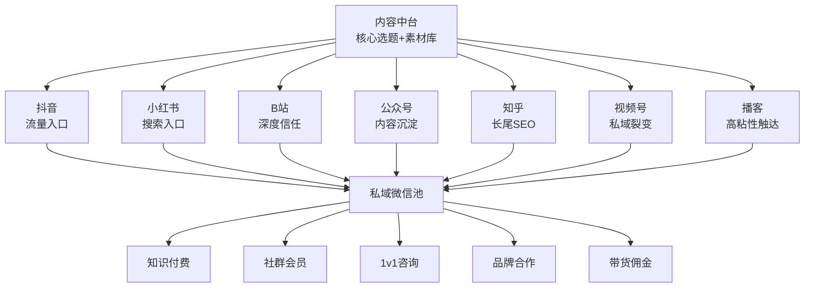
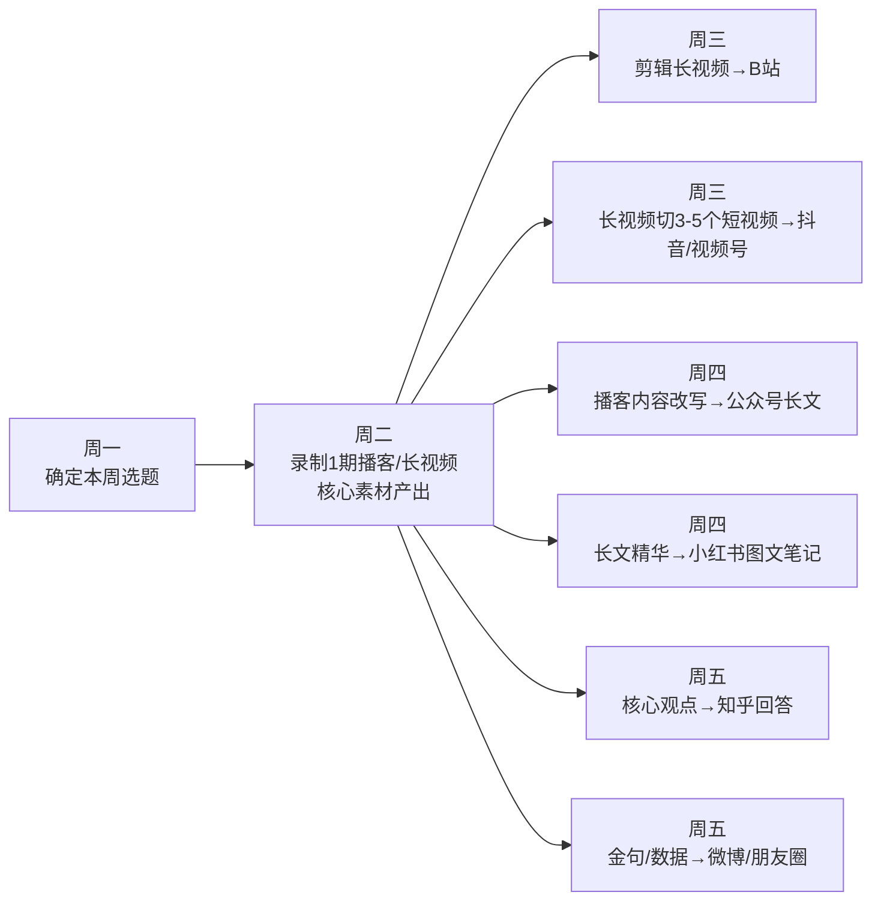
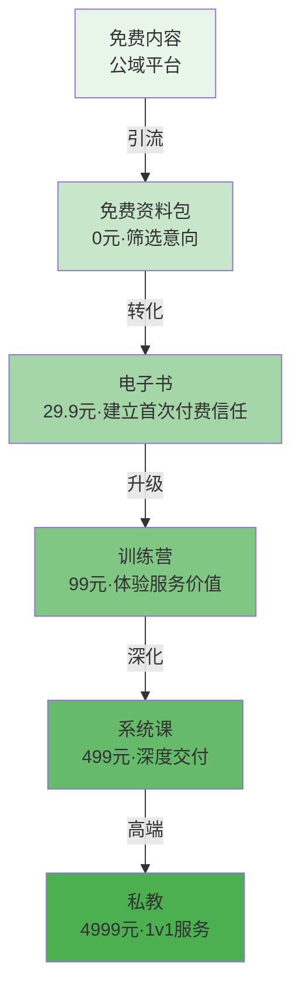
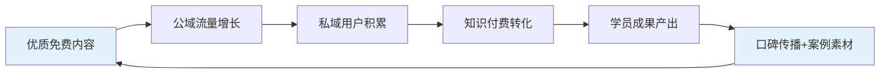

## 案例五：全平台内容矩阵——月入10万的运营策略

> 单平台运营是"打工"，多平台矩阵是"建系统"。当你把同一份核心内容在5-8个平台同时分发，并通过私域将流量汇聚到一个变现池时，收入天花板会被彻底打破。本案例记录一位前互联网运营经理如何在18个月内搭建起覆盖7个平台的内容矩阵，实现月均收入10.8万元的全过程——包括他踩过的每一个坑、用过的每一套工具、以及最终沉淀下来的可复用运营体系。

### 一、案例背景与主角画像

#### 1.1 主角基本情况

| 维度 | 详情 |
|------|------|
| 化名 | 陈哥 |
| 年龄 | 31岁 |
| 职业背景 | 互联网运营经理（6年经验，擅长用户增长和内容运营） |
| 启动时间 | 2024年1月 |
| 启动资金 | 3000元（设备+工具订阅+少量投流测试费） |
| 每日可投入时间 | 工作日2-3小时，周末全天 |
| 核心技能 | 内容策划、数据分析、用户增长、基础视频剪辑 |
| 转折契机 | 公司裁员，决定全职投入自媒体 |

陈哥的背景决定了他的路径与纯素人不同——他有运营方法论、有数据分析能力、懂得流量逻辑。但这些能力的真正价值不在于"做内容"本身，而在于**用系统思维搭建一个可复制、可规模化的多平台内容矩阵**。

#### 1.2 为什么选择"矩阵模式"而非"单平台深耕"

陈哥在启动前做了充分调研，最终放弃了"选一个平台死磕"的常规路径，原因如下：

| 维度 | 单平台深耕 | 全平台矩阵 |
|------|----------|-----------|
| 收入天花板 | 受限于单一平台的变现机制 | 多平台收入叠加，天花板高3-5倍 |
| 抗风险能力 | 平台政策变动/限流即致命打击 | 东方不亮西方亮，收入来源分散 |
| 内容效率 | 一份内容只用一次 | 一份核心内容分发5-8次，效率倍增 |
| 流量成本 | 依赖单一平台的推荐算法 | 多入口引流，搜索+推荐+社交三管齐下 |
| 启动难度 | 低，聚焦一个平台即可 | 中，需要理解不同平台的规则和用户习惯 |
| 团队要求 | 1人可做 | 前期1人可做，后期需2-3人协作 |

矩阵模式的本质是**用工业化思维做内容**——建立内容中台，一次深度创作，多次形态转换，多平台分发，最终汇入统一的私域变现池。

#### 1.3 理论基础：为什么矩阵模式是内容创业的最优解

矩阵运营并非"什么都做"的贪心策略，而是基于三个底层逻辑的理性选择：

**逻辑一：注意力经济的幂律分布**

互联网流量遵循幂律法则——头部内容获取绝大部分注意力。在单平台竞争中，你必须成为该平台该赛道的头部才能获得可观收入。但跨平台后，每个平台只需要做到前10%-20%，叠加起来的流量总量就能超过单平台头部。这是一个从"零和博弈"到"正和博弈"的转变。

**逻辑二：平台生命周期的不对称性**

每个平台都有生命周期——成长期（流量红利大，竞争小）、成熟期（竞争激烈但规则稳定）、衰退期（用户流失，变现效率下降）。当一个平台进入成熟期或衰退期时，另一个平台可能正处于成长期。矩阵运营让你在任何时间点都有至少一个平台处于红利期。

| 平台 | 当前阶段（2024-2025） | 流量特征 | 矩阵策略 |
|------|---------------------|---------|---------|
| 抖音 | 成熟期 | 流量大但竞争极激烈，内容需高度差异化 | 做流量入口，追求爆款 |
| 小红书 | 成长期→成熟期 | 搜索流量增长快，图文+短视频双轨 | 做搜索入口，长尾布局 |
| B站 | 成熟期 | 用户粘性高，商业化加速 | 做深度信任，建立铁粉 |
| 公众号 | 成熟期→稳定期 | 推荐算法改革后有新红利 | 做内容资产，沉淀长文 |
| 知乎 | 成熟期→稳定期 | 长尾搜索价值极高 | 做SEO布局，持续获客 |
| 视频号 | 成长期 | 社交推荐+微信生态，增长快 | 做私域裂变，社交分发 |
| 播客 | 成长期 | 听众质量高，竞争小 | 做高粘性深度触达 |

**逻辑三：内容的边际成本递减**

创作一份深度内容的边际成本是固定的（比如2-3小时），但将其转换为5种不同形式并分发到7个平台的边际成本是递减的——第一次转换需要1小时，但经过标准化SOP后，后续转换可能只需要20-30分钟。随着工具熟练度提升和AI辅助工具的介入，这个边际成本会持续下降。

#### 1.4 定位选择：为什么做"个人成长+副业指导"

陈哥没有选择自己最擅长的"运营方法论"（太窄、太B端），而是选择了**"个人成长与副业变现"**这个方向。核心原因：

- **受众基数大**：中国有超过3亿人有副业需求或正在做副业
- **内容素材丰富**：自己的转型经历本身就是最好的素材
- **变现路径多元**：知识付费、社群、咨询、带货都可以做
- **跨平台通用**：这个话题在任何平台都有受众
- **搜索需求强**："副业""赚钱""个人成长"是长青搜索词

**定位公式**：**目标人群 + 核心诉求 + 差异化人设**

最终定位：**"前互联网人的副业实战笔记"**——用真实经历+数据说话，不贩卖焦虑，只分享可验证的方法。

### 二、矩阵架构设计

#### 2.1 平台角色分工

陈哥的矩阵不是简单的"同一篇内容发所有平台"，而是为每个平台定义了明确的**战略角色**：



各平台的角色定位：

| 平台 | 战略角色 | 内容形式 | 发布频率 | 核心KPI |
|------|---------|---------|---------|--------|
| 抖音 | 流量发动机 | 60秒口播+图文视频 | 日更 | 播放量、涨粉数 |
| 小红书 | 搜索流量入口 | 图文笔记为主 | 日更 | 搜索排名、收藏率 |
| B站 | 深度信任建设 | 10-20分钟长视频 | 周更2-3条 | 完播率、弹幕量 |
| 公众号 | 内容资产沉淀 | 3000-5000字长文 | 周更2-3篇 | 打开率、转发率 |
| 知乎 | 长尾SEO布局 | 回答+专栏文章 | 周更3-5篇 | 搜索排名、赞同数 |
| 视频号 | 私域裂变加速 | 1-3分钟短视频 | 日更 | 社交推荐量 |
| 播客 | 高粘性深度触达 | 30-60分钟音频 | 周更1期 | 完播率、订阅数 |

#### 2.2 "一鱼多吃"内容生产流程

矩阵运营的核心不是"多创作"，而是"多转换"。陈哥建立了标准化的内容中台流程：



**一次深度创作的时间成本**：

| 环节 | 耗时 | 产出 |
|------|------|------|
| 选题调研+大纲 | 1小时 | 1份结构化选题文档 |
| 录制长视频/播客 | 2-3小时 | 1期30-60分钟核心素材 |
| 剪辑B站长视频 | 1.5小时 | 1条B站视频 |
| 切短视频3-5条 | 1小时 | 3-5条抖音/视频号素材 |
| 改写公众号长文 | 1.5小时 | 1篇3000-5000字文章 |
| 制作小红书图文 | 0.5小时 | 1-2条小红书笔记 |
| 知乎回答+金句 | 0.5小时 | 2-3条知乎回答 |
| **合计** | **8-10小时** | **覆盖7个平台的10+条内容** |

对比"每个平台单独创作"需要的30+小时，效率提升约3倍。

#### 2.3 内容中台工具链

| 环节 | 工具 | 用途 | 月费 |
|------|------|------|------|
| 选题管理 | Notion数据库 | 选题库+排期+数据追踪 | 免费 |
| 录制 | OBS Studio | 长视频/播客录制 | 免费 |
| 视频剪辑 | 剪映专业版 | 长视频剪辑+短视频切片 | 免费 |
| 图片设计 | Canva Pro | 封面、小红书配图、公众号头图 | 99元/月 |
| 文案辅助 | ChatGPT/Claude | 文案润色、标题优化、多平台改写 | 150元/月 |
| 数据分析 | 新榜+千瓜 | 竞品监控、热词追踪 | 199元/月 |
| 排期发布 | 蚁小二 | 多平台一键分发 | 59元/月 |
| 私域运营 | 企业微信+微伴助手 | 自动化标签、欢迎语、群发 | 免费/基础版免费 |
| 字幕生成 | 剪映/飞书妙记 | 视频字幕+播客转文字 | 免费 |

#### 2.4 AI驱动的内容转换流水线

2024年后，AI工具极大降低了内容矩阵的运营门槛。陈哥在第10个月开始引入AI辅助，效率再次提升40%：

**AI辅助的内容转换流程**：

| 步骤 | 传统方式 | AI辅助方式 | 效率提升 |
|------|---------|-----------|---------|
| 播客转文字 | 手动听写/飞书妙记 | 通义听悟/飞书妙记自动转录 | 90% |
| 长文→公众号 | 手动改写2小时 | AI基于转录稿生成初稿，人工润色30分钟 | 75% |
| 长文→小红书 | 手动提炼要点 | AI提取5个核心观点，人工设计配图 | 60% |
| 长视频→短视频 | 手动找高光片段 | AI识别高互动时刻，标记剪辑点 | 50% |
| 标题优化 | 凭经验写5个标题 | AI生成20个候选标题，人工筛选 | 40% |
| 知乎回答 | 手动撰写 | AI基于已有内容生成回答框架 | 60% |

**关键原则**：AI负责"粗活"（转录、初稿、候选），人负责"精活"（润色、风格、人设一致性）。完全依赖AI产出的内容缺乏人味，读者能感知到——这在"个人成长+副业"这类需要真实感的赛道尤其致命。

**AI工具选型对比**：

| 工具 | 适用场景 | 优势 | 局限 | 月费 |
|------|---------|------|------|------|
| ChatGPT-4o | 长文改写、标题生成 | 中文理解力强，创意性好 | 偶尔事实性错误 | 约150元 |
| Claude | 深度分析、结构化输出 | 逻辑严谨，格式控制好 | 中文创意略逊 | 约150元 |
| 通义听悟 | 播客/视频转录 | 免费，中文识别准确率高 | 专业术语偶有错误 | 免费 |
| 剪映AI | 字幕生成、智能剪辑 | 与剪辑流程无缝集成 | 仅限视频场景 | 免费 |
| Kimi | 长文档摘要 | 支持20万字长文本 | 输出风格偏学术 | 免费 |

### 三、分阶段执行路径

#### 3.1 第一阶段：冷启动期（第1-3个月）

**核心目标**：在3个平台（抖音+小红书+公众号）跑通内容生产流程，找到数据反馈最好的内容类型。

**具体内容策略**：

| 周次 | 抖音 | 小红书 | 公众号 |
|------|------|--------|--------|
| 第1-2周 | 每天1条60秒口播，测试10个选题方向 | 每天1条图文，同步测试方向 | 暂不启动 |
| 第3-4周 | 筛选数据最好的3个方向 | 同步筛选 | 开始周更1篇 |
| 第2个月 | 聚焦2个爆款方向，优化标题和节奏 | 优化封面+标题公式 | 周更2篇，测试长文结构 |
| 第3个月 | 量产已验证的内容类型 | 开始做系列化内容 | 固定栏目，形成风格 |

**冷启动阶段数据**：

| 平台 | 发布量 | 总播放/阅读 | 粉丝增长 | 爆款率 |
|------|--------|-----------|---------|--------|
| 抖音 | 90条 | 120万 | 8,000 | 3条>10万播放 |
| 小红书 | 85条 | 45万 | 5,500 | 2条>5万浏览 |
| 公众号 | 15篇 | 3万 | 1,200 | 1篇>5000阅读 |

**关键发现**：

- 抖音上"副业避坑"类口播完播率最高（平均45%），"赚钱方法"类反而一般
- 小红书上"数字+结果"标题的笔记收藏率比其他标题高2-3倍
- 公众号上深度复盘类文章（3000字+）的转发率远高于清单类

#### 3.2 第二阶段：扩平台期（第4-8个月）

**核心目标**：在已验证的3个平台稳定产出，同时拓展B站、知乎、视频号，建立6平台矩阵。

**扩平台节奏**：

| 月份 | 新增平台 | 策略 |
|------|---------|------|
| 第4个月 | B站 | 将抖音爆款内容扩展为10-15分钟长视频 |
| 第5个月 | 知乎 | 将公众号文章改写为知乎回答+专栏 |
| 第6个月 | 视频号 | 将抖音短视频同步分发，重点做社交裂变 |
| 第7-8个月 | 稳定6平台 | 优化分发SOP，提升效率 |

**B站起号策略**：

B站的算法更看重完播率和互动深度，陈哥的做法是：
1. **选题切入**：不做"副业推荐"泛内容，而是做"真实记录"系列——"裸辞后第30天，我靠副业赚了8000块"这种真实经历分享
2. **视频结构**：前30秒必须抛出冲突/悬念（"我被裁员了，但我反而更忙了"），中间干货密集不注水，结尾引导一键三连
3. **互动运营**：主动在评论区发起讨论（"你们最想了解哪个副业方向？"），置顶高质量评论

**知乎布局策略**：

知乎的价值在于长尾搜索流量——一篇高质量回答可以持续带来流量1-2年。陈哥的做法是：
1. **优先回答高搜索量问题**：如"有哪些靠谱的副业？""普通人怎么开始做自媒体？"
2. **回答结构**：开头直接给结论，中间用数据和案例论证，结尾引导关注公众号
3. **专栏同步**：将公众号长文同步到知乎专栏，获得额外搜索曝光

**扩平台阶段数据**：

| 平台 | 发布量（累计） | 粉丝数 | 月均收入贡献 |
|------|-------------|--------|-----------|
| 抖音 | 280条 | 52,000 | 18,000元 |
| 小红书 | 260条 | 38,000 | 12,000元 |
| 公众号 | 80篇 | 15,000 | 8,000元 |
| B站 | 45条 | 12,000 | 5,000元 |
| 知乎 | 120篇回答 | 25,000 | 3,000元 |
| 视频号 | 100条 | 8,000 | 4,000元 |
| **合计** | — | **150,000** | **50,000元** |

#### 3.3 第三阶段：规模化变现期（第9-18个月）

**核心目标**：补齐播客平台（第7个平台），深度运营私域，将月收入稳定推到10万+。

**核心动作**：

1. **播客上线**（第9个月）：在小宇宙/喜马拉雅开设播客，将每周的深度内容录制为30-60分钟音频节目。播客听众的付费意愿是短视频用户的5-8倍——愿意花时间听长内容的人，天然对深度学习有需求。

2. **私域精细化运营**：建立分层社群体系——

| 社群层级 | 入群条件 | 人数 | 服务内容 |
|---------|---------|------|---------|
| 免费交流群 | 关注任一平台账号 | 3,000人 | 每日资讯、互动讨论 |
| 付费基础群 | 购买99元入门课 | 800人 | 每周答疑、资料分享 |
| 付费进阶群 | 购买499元系统课 | 350人 | 每月直播、作业批改 |
| VIP私董会 | 购买4,999元年度会员 | 50人 | 1v1咨询、资源对接 |

3. **知识付费产品矩阵**：

| 产品 | 价格 | 月销量 | 月收入 | 成本 |
|------|------|--------|--------|------|
| 免费资料包（引流） | 0元 | 3,000份 | 0元 | 时间成本 |
| 副业入门指南（电子书） | 29.9元 | 200本 | 5,980元 | 一次制作 |
| 副业实战训练营（7天） | 99元 | 150人 | 14,850元 | 助教+平台费 |
| 自媒体从0到1系统课（30天） | 499元 | 60人 | 29,940元 | 助教+平台费 |
| 个人IP打造私教（季度） | 4,999元 | 8人 | 39,992元 | 个人时间 |
| 品牌广告合作 | 3,000-8,000元/条 | 6条 | 30,000元 | 时间+创作 |
| 带货佣金 | — | — | 3,500元 | 选品时间 |
| 平台创作激励 | — | — | 5,000元 | — |
| **月收入总计** | — | — | **约129,262元** | — |

**注意**：上面是峰值月份数据。稳定期月均约10.8万元，其中知识付费占55%、广告占25%、带货+平台激励占10%、私域其他收入占10%。

#### 3.4 粉丝增长全景

| 时间节点 | 抖音 | 小红书 | 公众号 | B站 | 知乎 | 视频号 | 播客 | 总计 |
|----------|------|--------|--------|------|------|--------|------|------|
| 第3个月 | 8K | 5.5K | 1.2K | — | — | — | — | 14.7K |
| 第6个月 | 35K | 22K | 8K | 6K | 12K | 4K | — | 87K |
| 第9个月 | 68K | 42K | 18K | 18K | 28K | 12K | 2K | 188K |
| 第12个月 | 120K | 75K | 35K | 35K | 50K | 25K | 8K | 348K |
| 第18个月 | 210K | 130K | 65K | 68K | 85K | 50K | 22K | 630K |

### 四、多平台运营的核心方法论

#### 4.1 内容适配的"变与不变"

矩阵运营最常见的误区是"直接搬运"——把抖音视频原封不动发B站，或者把公众号文章复制粘贴到知乎。每个平台的用户习惯、算法逻辑、内容形态都不同，必须做适配。

**不变的是**：核心观点、数据、案例、结论（内容的"骨架"）

**要变的是**：

| 维度 | 抖音 | 小红书 | B站 | 公众号 | 知乎 |
|------|------|--------|------|--------|------|
| 内容长度 | 60秒 | 500-800字+6图 | 10-15分钟 | 3000-5000字 | 2000-4000字 |
| 标题风格 | 数字+悬念+口语化 | 数字+结果+emoji | 反差+悬念 | 深度+专业 | 直接回答问题 |
| 开头策略 | 前3秒抛冲突 | 前3行给价值 | 前30秒讲故事 | 前200字给结论 | 开头直接给答案 |
| 语言风格 | 口语化、快节奏 | 闺蜜聊天感 | 年轻化、有梗 | 专业、有深度 | 理性、有论据 |
| 互动引导 | "评论区告诉我" | "收藏=变美变富" | "一键三连" | "点个在看" | "感谢赞同" |
| 变现入口 | 评论区引导私信 | 个人简介/私信 | 简介栏/评论区 | 文末二维码 | 个人介绍/私信 |

**实操示例**——同一个选题"副业月入5000的3个方向"在不同平台的适配：

- **抖音版本**：60秒口播，开头"你知道吗？我裸辞后第一个月副业就赚了5000块"，快速讲3个方向，结尾"想知道具体怎么做？评论区扣1"
- **小红书版本**：6张配图，标题"裸辞后靠这3个副业月入5000💰真实记录"，每张图讲1个方向+具体收入数据
- **B站版本**：12分钟视频，从裸辞心路历程讲起，详细拆解每个副业方向的投入产出、时间成本、适合人群
- **公众号版本**：3000字长文，结构化分析3个方向的底层逻辑、操作步骤、风险提示
- **知乎版本**：回答"有哪些适合上班族的副业？"，直接给出3个方向+真实数据+操作建议

#### 4.2 平台算法的矩阵化理解

做矩阵运营，不需要成为每个平台的算法专家，但需要理解各平台算法的"底层逻辑差异"，才能做好内容适配：

| 平台 | 算法核心逻辑 | 流量分配机制 | 对矩阵运营的启示 |
|------|------------|------------|----------------|
| 抖音 | 完播率+互动率 | 赛马机制：先推给小流量池，数据好再扩大 | 前3秒必须抓住注意力，内容节奏要紧凑 |
| 小红书 | 搜索匹配+互动质量 | 搜索+推荐双轮驱动 | 标题必须包含关键词，封面决定点击率 |
| B站 | 完播率+弹幕互动 | 关注流+推荐流双驱动 | 视频可以有"慢节奏"，但信息密度要高 |
| 公众号 | 社交传播+打开率 | 订阅+推荐+搜一搜 | 标题决定打开率，内容决定转发率 |
| 知乎 | 内容质量+搜索权重 | 问答匹配+推荐 | 回答越长越详细，搜索权重越高 |
| 视频号 | 社交推荐 | 微信社交关系链驱动 | 朋友点赞>系统推荐，适合裂变内容 |
| 播客 | 订阅+平台推荐 | RSS订阅+平台编辑推荐 | 标题和封面是第一印象，内容质量决定留存 |

**跨平台算法差异的实操影响**：

同一段"副业避坑"内容，在不同平台需要不同的"算法友好"处理方式：

```text
原始素材：一段5分钟的副业避坑经验分享

抖音处理：
├── 截取最高冲突片段做前3秒钩子
├── 总时长控制在60秒以内
├── 添加字幕+背景音乐增强节奏感
├── 结尾设置互动问题提升评论率
└── 发布时间：12:00-13:00（午休高峰）

B站处理：
├── 完整保留5分钟+扩展为12分钟
├── 前30秒讲故事，建立情感连接
├── 中间穿插数据图表和案例截图
├── 结尾引导一键三连+关注
└── 发布时间：20:00-21:00（晚间高峰）

小红书处理：
├── 提取3-5个核心避坑要点
├── 每个要点配一张信息图
├── 标题含"避坑""真实经历"等关键词
├── 正文控制在800字以内
└── 发布时间：19:00-20:00（搜索高峰）
```

#### 4.3 发布时间的全局排布

不同平台的流量高峰不同，合理排布发布时间可以让有限的时间产出最大的曝光：

| 时间段 | 平台 | 内容 | 原因 |
|--------|------|------|------|
| 7:00-8:00 | 公众号 | 定时发布长文 | 早高峰通勤阅读 |
| 8:00-9:00 | 知乎 | 发布回答 | 上班前搜索高峰 |
| 12:00-13:00 | 抖音 | 发布短视频 | 午休刷视频高峰 |
| 18:00-19:00 | 视频号 | 发布短视频 | 下班后社交分享高峰 |
| 19:00-20:00 | 小红书 | 发布图文笔记 | 晚间搜索+浏览高峰 |
| 20:00-21:00 | B站 | 发布长视频 | 晚间深度观看高峰 |
| 周末上午 | 播客 | 更新一期节目 | 周末收听高峰 |

#### 4.4 数据驱动的迭代机制

陈哥每周日晚上花1小时做"全平台数据复盘"，核心追踪以下指标：

| 指标 | 含义 | 健康标准 | 低于标准时的应对 |
|------|------|---------|-------------|
| 爆款率 | 播放/浏览>均值3倍的内容占比 | >10% | 分析爆款共性，复制要素 |
| 涨粉成本 | 每新增1个粉丝的时间成本 | <5分钟/粉 | 优化内容效率或调整方向 |
| 互动率 | (点赞+评论+收藏)/播放 | >5% | 优化开头钩子和互动引导 |
| 转化率 | 私域新增/全平台曝光 | >0.5% | 优化引流话术和诱饵设计 |
| 付费转化率 | 付费用户/私域用户 | >3% | 优化产品设计和销售话术 |

**数据看板示例**（Notion数据库搭建）：

```text
选题库
├── 状态：待验证 / 测试中 / 已验证 / 已淘汰
├── 平台数据：各平台的播放/阅读/互动数据
├── 爆款标记：是/否
├── 变现关联：是否带动了私域增长或付费转化
└── 复用价值：可否做系列、能否跨平台改编
```

### 五、矩阵运营的关键决策与踩坑记录

#### 5.1 决策一：是否做矩阵号（同平台多账号）

**结论**：前期不做，后期可选。

陈哥在第6个月时尝试在抖音开了一个"小号"（定位更垂直的"程序员副业"方向），结果发现：
- 小号需要独立的人设和内容风格，不能简单复用大号内容
- 管理两个号的时间成本是单号的1.8倍（不是2倍，因为有素材复用）
- 小号的变现效率远低于大号（信任度不够）
- 第8个月放弃了小号，集中精力做大号+多平台

**教训**：矩阵的核心是"多平台"而非"多账号"。在没有足够团队支撑的情况下，同平台多账号会分散精力。先把一个号在多个平台做大，比在单个平台做多个号更有价值。

#### 5.2 决策二：是否需要团队

**分阶段的团队配置**：

| 阶段 | 人员 | 职责 | 成本 |
|------|------|------|------|
| 第1-6个月 | 陈哥1人 | 全部工作 | 0 |
| 第7-12个月 | +1名兼职剪辑 | 视频剪辑、字幕、封面 | 3,000元/月 |
| 第13-18个月 | +1名运营助理 | 多平台分发、数据整理、社群管理 | 6,000元/月 |
| 第18个月+ | +1名内容编辑 | 文案改写、选题研究 | 8,000元/月 |

**关键判断标准**：当你在某个环节的时间投入超过总时间的30%且这个环节不直接创造差异化价值时，就该外包。对陈哥来说，剪辑是第一个被外包的——因为剪辑是"执行"而非"创意"，外包后他的时间可以更多用在选题策划和深度内容创作上。

**团队管理的实操经验**：

1. **招聘渠道**：大学生兼职群（剪辑）、远程工作社区（运营助理）、朋友圈推荐（内容编辑）
2. **培训方式**：录制标准操作视频（SOP录屏），新人入职先看3天SOP，再跟做1周
3. **质量控制**：建立"内容发布前checklist"——每个平台发布前必须过5项检查（标题、封面、标签、引流路径、发布时间）
4. **沟通机制**：每周一上午30分钟团队同步会（语音），每天在企业微信群内用固定格式汇报进度

**远程协作工具链**：

| 工具 | 用途 | 成本 |
|------|------|------|
| 飞书/钉钉 | 日常沟通+任务管理 | 免费 |
| Notion | 内容排期+知识库 | 免费 |
| 腾讯文档 | 协作文档+数据表格 | 免费 |
| 企业微信 | 私域运营+客户管理 | 免费 |
| 石墨文档 | 稿件协同编辑 | 免费 |

#### 5.3 踩坑记录

**坑1：各平台用完全相同的内容直接搬运**

前3个月，陈哥尝试把公众号文章直接复制到知乎、把抖音视频原封不动发B站。结果：知乎回答被折叠（与已有内容高度重复）、B站视频完播率不到15%（节奏和B站用户习惯不符）。

**修正**：建立"适配SOP"——同一选题在不同平台必须做至少30%的差异化调整，包括标题、开头、内容结构、语言风格。

**坑2：过度追求"全平台覆盖"导致精力分散**

第4-5个月同时运营6个平台，每天工作超过10小时，内容质量明显下降，几个平台的数据都出现了下滑。

**修正**：采用"3+2+2"节奏——3个核心平台（抖音+小红书+公众号）必须日更或隔日更，2个扩展平台（B站+知乎）周更2-3次，2个辅助平台（视频号+播客）周更1次。根据数据表现动态调整优先级。

**坑3：忽视平台规则差异导致违规**

在小红书引流时直接放微信号，被封号7天；在抖音视频中出现竞品平台logo，被限流。

**修正**：建立每个平台的"红线清单"——
- 小红书：不直接放微信号，用"私信""小号"等暗语引流
- 抖音：不出现竞品logo、不用绝对化用语（"最好""第一"）
- B站：不在视频中硬插广告，用"恰饭"标签标注商务合作
- 公众号：外链需谨慎，优先用小程序承载
- 知乎：不频繁修改回答（会降权），不放硬广
- 视频号：不诱导分享（微信对裂变行为管控严格）
- 播客：广告口播控制在总时长5%以内，避免听众反感

**坑4：只关注粉丝数不关注变现效率**

第6个月时总粉丝已经20万，但月收入只有1.5万——大量粉丝是"围观型"用户，没有付费意愿。

**修正**：调整内容策略，增加"筛选性内容"——
- 发布"我靠XX副业月入2万"的深度复盘（吸引有付费意愿的人）
- 在内容中自然提到"我整理了一份详细的操作指南"（引导私域）
- 用免费资料包做"漏斗筛选"——愿意加微信领取资料的人，付费转化率比普通粉丝高10倍

**坑5：私域运营粗放，社群变死群**

第7个月积累了5个微信群共1500人，但大部分群已经没人说话。

**修正**：重建社群运营体系——
- 每天早上发一条"今日行动提示"（如"今天花10分钟研究一个副业方向"）
- 每周三晚做一次"群内答疑"（30分钟文字答疑）
- 每月做一次"成果展示"（让群成员分享自己的副业进展）
- 对30天不活跃的成员私聊激活或清理
- 建立"淘汰机制"——连续3次不参与社群活动的成员移出付费群

**坑6：忽略内容资产的长期维护**

第12个月时发现，早期发布的一些"常青内容"因为平台算法变化或信息过时，流量已经大幅下滑。比如一篇知乎回答曾经每天带来200+阅读，现在只有20+。

**修正**：建立"内容资产维护SOP"——
- 每月检查各平台Top20流量内容的数据变化
- 对流量下滑超过50%的内容进行更新（补充新数据、优化标题、增加新案例）
- 对过时内容进行标注或删除（避免损害账号信誉）
- 建立"常青内容清单"，每季度统一更新一次

**坑7：品牌广告接太多，伤害用户信任**

第14个月时因为广告报价诱人，连续3周每周接2条广告，粉丝开始在评论区吐槽"变味了""就知道接广告"，取关率上升30%。

**修正**：建立"广告接单红线"——
- 每月品牌广告不超过4条（即每周最多1条）
- 广告产品必须与账号定位相关（副业/工具/学习类产品）
- 广告内容必须是自己真实使用过的产品
- 每条广告必须包含真实使用体验，不能纯念稿
- 在广告内容中明确标注"广告"或"合作"

### 六、收入结构深度拆解

#### 6.1 月入10万的收入构成

陈哥稳定期（第12-18个月）的月均收入结构：

| 收入来源 | 月均收入 | 占比 | 利润率 | 月均利润 |
|----------|---------|------|--------|---------|
| 知识付费（课程+电子书） | 50,000元 | 46% | 85% | 42,500元 |
| 品牌广告合作 | 25,000元 | 23% | 90% | 22,500元 |
| 私域社群（VIP会费） | 15,000元 | 14% | 95% | 14,250元 |
| 带货佣金 | 8,000元 | 7% | 100% | 8,000元 |
| 平台创作激励 | 6,000元 | 6% | 100% | 6,000元 |
| 1v1付费咨询 | 4,000元 | 4% | 100% | 4,000元 |
| **合计** | **108,000元** | **100%** | — | **97,250元** |

扣除团队成本（14,000元/月）、工具成本（约800元/月）、平台抽成（约3,000元/月），**月净利润约79,450元**。

#### 6.2 各平台的变现贡献拆解

| 平台 | 主要变现方式 | 月贡献 | 特点 |
|------|-----------|--------|------|
| 抖音 | 广告+知识付费引流 | 30,000元 | 流量大但用户付费意愿中等 |
| 小红书 | 广告+知识付费引流 | 22,000元 | 搜索流量精准，转化率高 |
| 公众号 | 知识付费+广告 | 18,000元 | 私域入口，信任度最强 |
| B站 | 广告+平台激励 | 12,000元 | 深度信任建设，粉丝粘性高 |
| 知乎 | 知识付费引流 | 10,000元 | 长尾流量持续带来付费用户 |
| 视频号 | 私域裂变+带货 | 8,000元 | 社交推荐带来精准流量 |
| 播客 | VIP社群引流 | 8,000元 | 听众付费意愿最高（转化率8%） |

#### 6.3 变现效率的关键发现

1. **播客是被严重低估的变现渠道**：虽然播客粉丝只有2.2万（各平台最少），但付费转化率高达8%，远超其他平台的1-3%。愿意花30分钟听你讲话的人，天然对你有高度信任。

2. **私域是收入的放大器**：同样1万粉丝，有私域的收入是没有私域的3-5倍。私域用户可以反复触达、多次转化，而公域粉丝的触达率只有5-15%。

3. **知识付费的复利效应最强**：课程是一次制作、反复销售的模式。陈哥的"30天系统课"录制成本约80小时，但此后每月销售60份带来近3万元收入，边际成本接近零。

4. **广告收入有明显的季节性**：618、双11、年货节等电商节点，广告报价可以翻1.5-2倍，月广告收入可达4-5万。

#### 6.4 定价心理学与产品阶梯设计

陈哥的知识付费产品并非随意定价，而是遵循了阶梯式定价心理学：

**产品阶梯的底层逻辑**：



**每一层的设计原则**：

| 层级 | 价格 | 核心目标 | 转化率基准 | 陈哥实际转化率 |
|------|------|---------|-----------|-------------|
| 免费→资料包 | 0元 | 获取联系方式 | 5-10% | 8% |
| 资料包→电子书 | 29.9元 | 建立首次付费信任 | 8-15% | 12% |
| 电子书→训练营 | 99元 | 展示教学能力 | 30-50% | 42% |
| 训练营→系统课 | 499元 | 深度交付+口碑 | 15-25% | 20% |
| 系统课→私教 | 4999元 | 高端服务+案例 | 5-10% | 7% |

**定价的关键心理学原则**：

1. **锚定效应**：先展示4999元的私教，再推荐499元的系统课，用户会觉得"便宜了10倍"
2. **损失厌恶**：限时优惠（"本周报名立减100"）比长期低价更有效
3. **社会证明**：在产品页面展示"已有3,200人报名""学员平均收入增长XX%"
4. **稀缺性**：私教服务限制名额（"每季度仅限8人"），训练营设置报名截止日期
5. **价格尾数**：29.9元比30元感觉便宜很多（左位数效应），499元比500元更有吸引力

#### 6.5 变现效率优化：从"漏斗"到"飞轮"

大多数创作者把变现看作漏斗——从曝光到关注到付费，层层递减。陈哥在第12个月后开始构建"飞轮效应"：



飞轮的关键环节是**学员成果产出**——当学员通过你的课程真正做出了成果（比如副业月入5000+），他们的故事就成为你最好的内容素材和信任背书。陈哥在第14个月时，约40%的爆款内容来自学员案例，这些内容带来的新学员又有新的成果，形成正循环。

**具体操作方式**：

1. 在系统课中设置"成果展示"环节，鼓励学员分享进展
2. 征得学员同意后，将成功案例制作成内容（视频/图文）
3. 在案例内容中标注"来自XX训练营第X期学员"
4. 用学员数据建立"课程效果数据库"，用于产品页面展示

### 七、可复制的运营SOP

#### 7.1 每周运营SOP

| 日期 | 上午（2小时） | 下午（2小时） | 晚上（2小时） |
|------|------------|------------|------------|
| 周一 | 选题调研+大纲撰写 | 录制长视频/播客 | 剪辑B站视频 |
| 周二 | 切短视频3-5条 | 改写公众号长文 | 制作小红书图文 |
| 周三 | 发布抖音+视频号 | 发布公众号+知乎 | 回复各平台评论 |
| 周四 | 数据复盘+选题优化 | 社群运营+答疑 | 准备下周选题 |
| 周五 | 发布小红书+B站 | 品牌广告对接 | 录制播客（如果周更） |
| 周六 | 集中处理私域消息 | 内容储备（批量制作） | 学习+输入 |
| 周日 | 全平台数据复盘 | 下周排期+准备 | 休息 |

#### 7.2 新平台冷启动SOP

当需要拓展新平台时，陈哥的标准化流程：

```text
第1步：平台调研（3天）
  - 研究平台算法机制和推荐逻辑
  - 分析同赛道Top20账号的内容风格
  - 确定该平台的内容形式和发布频率

第2步：账号搭建（1天）
  - 注册+完善资料（头像、简介、背景图）
  - 设计与主账号一致但适配平台风格的视觉体系
  - 绑定私域引流路径

第3步：内容测试（2周）
  - 从已有爆款内容中选10条做平台适配
  - 每天发布1条，测试不同内容类型的数据表现
  - 记录每条内容的核心数据指标

第4步：方向聚焦（第2-4周）
  - 分析测试期数据，找到2-3个高反馈方向
  - 固定内容风格和发布节奏
  - 开始同步该平台到"一鱼多吃"流程中

第5步：稳定运营（第2个月起）
  - 纳入每周SOP
  - 持续优化标题/封面/内容结构
  - 每月复盘数据，调整策略
```

#### 7.3 内容选题的三层漏斗

陈哥用三层漏斗筛选选题，确保每一条内容都有数据支撑：

**第一层：需求验证**（这话题有人搜吗？）
- 工具：各平台搜索联想词、百度指数、微信指数、新榜热词
- 标准：相关关键词的月搜索量>1万

**第二层：竞争评估**（我能做得比现有内容好吗？）
- 工具：搜索前10条结果，分析内容质量和数据表现
- 标准：现有内容有明显不足（不够深、不够新、不够实操）

**第三层：自身匹配**（我有资格/素材做这个选题吗？）
- 评估维度：是否有亲身经历、是否有数据支撑、是否与定位一致
- 标准：至少满足其中两项

#### 7.4 内容适配模板库

为了降低"一鱼多吃"的操作门槛，陈哥为每个平台建立了标准化的内容适配模板：

**短视频脚本模板（抖音/视频号）**：

```text
[0-3秒] 钩子：抛出冲突/悬念/反常识
  例："你知道吗？90%的副业建议都是坑"

[3-15秒] 痛点共鸣：描述目标人群的困境
  例："我之前也是，看了100个副业推荐，试了10个，亏了3个..."

[15-45秒] 核心干货：3个要点，每个10秒
  例："第一...第二...第三..."

[45-55秒] 总结+行动建议
  例："记住这3点，少走半年弯路"

[55-60秒] 互动引导
  例："你觉得哪个最适合你？评论区告诉我"
```

**小红书图文模板**：

```text
封面：大字标题+数字+emoji
  例：副业月入5000💰这3个方向最靠谱

图1：痛点引入（1-2句话）
图2-4：核心内容（每图1个要点+数据/案例）
图5：总结+对比表格
图6：行动清单+引导关注

正文：
  开头：1句话总结核心价值
  中间：与图片对应的详细说明
  结尾：互动引导+标签（#副业 #赚钱 #个人成长）
```

**公众号文章模板**：

```text
标题：[数字]+[结果]+[人群]
  例："31岁裸辞后，我靠副业月入10万的7个方法"

开头（200字）：结论先行+个人故事引入

正文结构：
  H2：方法论/框架总览
    H3：方法1 - 理论+案例+数据
    H3：方法2 - 理论+案例+数据
    H3：方法3 - 理论+案例+数据
    ...
  H2：实操步骤（可执行的清单）
  H2：常见误区与避坑
  H2：总结与行动建议

结尾：引导关注+引导领取资料+引导加入社群
```

**知乎回答模板**：

```text
开头（前2行）：直接给结论/答案
  例："我自己就是从零开始做副业，18个月做到月入10万。以下是经过验证的3个方向。"

正文：
  每个方向的结构：
    - 一句话说清楚是什么
    - 我的真实数据（收入/时间/投入）
    - 适合什么人
    - 怎么开始（3步以内）

结尾：
  总结+引导关注/收藏+提示可以私信交流
```

### 八、常见误区与纠正

#### 误区一：矩阵运营就是"到处搬运"

**错误做法**：把同一个视频直接传到所有平台，标题都不改。

**正确做法**：核心内容（观点、数据、案例）不变，但形式、长度、风格必须适配每个平台的用户习惯。适配工作量约占总工作量的30-40%。

#### 误区二：必须同时启动所有平台

**错误做法**：第一周就在7个平台同时开号。

**正确做法**：先在1-2个平台跑通内容生产流程和变现模型，再逐步扩展。陈哥的节奏是：前3个月只做3个平台，第4-6个月扩展到6个，第9个月才补齐第7个。

#### 误区三：粉丝数=收入

**错误做法**：只追粉丝增长，不关注粉丝质量和变现路径。

**正确做法**：1万精准粉丝 > 10万泛粉丝。在内容创作时就要考虑"这条内容能吸引到愿意付费的人吗？"。

#### 误区四：私域=微信群拉人

**错误做法**：疯狂拉人进群，然后在群里发广告。

**正确做法**：私域的核心是"信任经营"——提供持续价值、建立个人IP、分层运营不同需求的用户。一个500人的高质量社群，变现能力远超10个500人的"死群"。

#### 误区五：一个人做不了矩阵

**错误做法**：觉得矩阵运营必须有团队，所以迟迟不开始。

**正确做法**：前期1人完全可行——借助工具（蚁小二多平台分发、剪映快速剪辑、Canva模板化设计），每天6小时可以支撑6个平台的基础运营。当收入覆盖团队成本时再招人。

#### 误区六：追求全平台同步增长

**错误做法**：要求每个平台粉丝都在稳定增长，哪个平台数据不好就焦虑。

**正确做法**：接受各平台增长节奏不同。短视频平台（抖音、视频号）可能爆发式增长但波动大；搜索平台（小红书、知乎）增长慢但稳定；深度平台（B站、播客）增长最慢但粉丝质量最高。矩阵的优势正是让不同节奏的平台互补——短期靠抖音爆发，中期靠小红书搜索，长期靠播客和B站沉淀。

#### 误区七：内容同质化——所有平台说同样的话

**错误做法**：每个平台都在讲"副业方法"，时间长了自己也审美疲劳，粉丝也觉得没新意。

**正确做法**：不同平台承担不同内容角色，形成内容矩阵的"立体感"——
- 抖音讲"结果"（"我靠XX副业月入2万"）
- 小红书讲"方法"（"3步教你开始XX副业"）
- B站讲"过程"（"从0到月入2万的完整记录"）
- 公众号讲"逻辑"（"XX副业的底层商业模型分析"）
- 知乎讲"判断"（"XX副业到底值不值得做？"）
- 播客讲"心路"（"裸辞1年，我经历了什么"）

同一个选题，6个平台讲6个不同侧面，用户跨平台关注你也不会觉得重复。

#### 误区八：忽略平台间的协同效应

**错误做法**：把每个平台当独立项目运营，不考虑平台间的互相导流。

**正确做法**：设计平台间的"流量环路"——
- 抖音视频评论区引导"详细教程在公众号"
- 公众号文章末尾引导"完整案例在B站"
- B站简介引导"日常分享在小红书"
- 小红书笔记引导"深度交流加微信"
- 微信私域引导"每天看抖音更新"

这样每个平台都在为其他平台导流，形成流量的"内循环"。

### 九、风险管理与可持续运营

#### 9.1 平台依赖风险与分散策略

矩阵运营最大的风险不是"做不好"，而是"做好了但依赖单一平台"。陈哥在第10个月经历过一次危机——抖音账号因"疑似搬运"被误判限流7天，那一周收入直接下降40%。

**风险矩阵**：

| 风险类型 | 具体场景 | 影响程度 | 发生概率 | 应对策略 |
|---------|---------|---------|---------|---------|
| 平台封号 | 违规操作被封 | 极高 | 低 | 多平台分散+私域备份 |
| 平台限流 | 算法调整/误判 | 高 | 中 | 不依赖单一平台>40%收入 |
| 政策变动 | 变现规则调整 | 中 | 中 | 关注平台公告，提前适配 |
| 竞品冲击 | 同赛道新号竞争 | 中 | 高 | 持续差异化+深度内容护城河 |
| 内容同质 | AI内容泛滥 | 中 | 高 | 强化个人IP+真实经历 |
| 团队流失 | 核心成员离职 | 中 | 低 | SOP标准化，降低人员依赖 |

**核心原则**：任何单一平台的收入占比不应超过总收入的40%。当某个平台占比超过40%时，必须加大其他平台的投入。

#### 9.2 内容安全与法律合规

自媒体变现涉及多个法律风险点，矩阵运营者必须了解：

**广告法合规**：
- 不使用绝对化用语（"最好""第一""100%有效"）
- 广告内容必须明确标注"广告"或"合作"
- 收益展示必须标注"个人案例，不代表所有人"
- 不做虚假承诺（"保证月入过万"）

**知识产权保护**：
- 自己的原创内容及时做版权登记（中国版权保护中心，费用约300元/件）
- 使用他人素材（图片、音乐、视频片段）必须获得授权或使用CC0协议素材
- 课程内容中的第三方案例需要脱敏处理或获得授权

**税务合规**：
- 平台收入（广告、创作激励）通常由平台代扣代缴个人所得税
- 知识付费收入需要自行申报（年收入超过12万元需要年度汇算清缴）
- 建议注册个体工商户或个人独资企业，可以享受小规模纳税人优惠政策
- 保留所有收入凭证和成本发票，用于税前扣除

**知识付费的特殊注意事项**：
- 课程宣传不得含有"保证赚钱""零风险"等承诺性用语
- 需在产品页面明确标注"虚拟商品，一经售出不支持退款"（但需提供合理的售后通道）
- 学员个人信息（手机号、微信等）必须妥善保管，不得泄露或出售
- 涉及金融、医疗、法律等专业领域的内容需要声明"仅供参考，不构成专业建议"

#### 9.3 财务规划与收入稳定化

自媒体收入最大的特点是"不稳定"——爆款带来当月收入飙升，低谷期可能腰斩。陈哥在第8个月开始建立财务规划体系：

**收入稳定化三原则**：

1. **建立收入储备金**：将月收入的20%存入储备账户，目标是积累6个月的运营成本作为安全垫。陈哥的运营成本约2万元/月（团队+工具+投流），储备金目标为12万元。

2. **区分"经常性收入"和"一次性收入"**：
   - 经常性收入：社群会员续费、课程自然流量销售、平台激励——这部分可预测
   - 一次性收入：品牌广告、咨询费、大促期间的课程销售——这部分不可预测
   - 规划时只依赖经常性收入来覆盖固定成本，一次性收入用于发展和储蓄

3. **收入再投资比例**：
   - 月收入的50%用于生活支出
   - 20%用于储备金
   - 20%用于业务再投入（新设备、投流测试、课程迭代）
   - 10%用于学习和社交（参加行业活动、购买课程、与同行交流）

**个体工商户注册建议**：

| 项目 | 说明 |
|------|------|
| 注册类型 | 个体工商户（最简单，税负最低） |
| 经营范围 | 互联网信息服务、教育咨询服务、广告设计制作 |
| 税收政策 | 月收入10万元以下免征增值税（小规模纳税人） |
| 个税方式 | 核定征收（部分地区综合税率可低至1.5-3%） |
| 开票能力 | 可开具增值税普通发票，品牌合作更方便 |
| 注册成本 | 约500-1000元（含代办费） |

#### 9.4 心理健康与可持续节奏

矩阵运营的心理压力常被低估——每天面对7个平台的数据波动、持续的内容创作压力、读者的负面评论、同行的竞争焦虑。陈哥在第6个月经历过一次严重的创作倦怠期。

**常见心理挑战**：

| 挑战 | 表现 | 高发阶段 | 应对方式 |
|------|------|---------|---------|
| 数据焦虑 | 每小时刷新后台，数据不好就焦虑 | 第1-6个月 | 设定固定复盘时间（每周日），其他时间不看数据 |
| 创作倦怠 | 不想写/拍，觉得在重复自己 | 第4-8个月 | 建立"输入日"——每周至少1天只消费内容，不产出 |
| 比较心态 | 看到同行增长快就焦虑 | 全程 | 只和自己的历史数据比，不和别人比 |
| 负面评论 | 被骂、被质疑、被举报 | 有一定影响力后 | 建立"评论过滤机制"——只回复有价值的讨论 |
| 完美主义 | 一条内容反复修改，迟迟不发 | 第1-3个月 | 设定"发布截止时间"，到点必须发 |

**可持续运营的节奏设计**：

1. **每周必须有1天完全休息**：不看数据、不回消息、不创作。陈哥选择周日晚上到周一晚上为休息时间。
2. **每季度安排一次"充电周"**：连续7天不发布新内容，只做学习和素材储备。提前准备好的内容在这周自动发布（用蚁小二定时发布功能）。
3. **建立"创作灵感库"**：日常看到的好内容、好案例、好数据随手存入Notion灵感库，创作时不用从零开始。
4. **设置"情绪账户"**：当负面情绪累积时，允许自己减少发布频率（从日更改为隔日更），但不完全停止——完全停止会导致算法降权，恢复成本很高。

### 十、进阶：矩阵运营的系统化升级

#### 10.1 从"人工运营"到"系统运营"

当矩阵稳定运转后，陈哥开始用系统化思维升级运营效率：

**内容中台2.0**：用Notion搭建完整的选题-创作-分发-数据闭环——

```text
选题池 → 排期日历 → 创作任务 → 分发清单 → 数据追踪 → 复盘归档
  ↑                                                        |
  └────────────────── 选题迭代 ←────────────────────────────┘
```

**自动化工具链**：
- Zapier/Make：连接各平台数据，自动汇总到Notion看板
- 企业微信API：自动打标签、发欢迎语、定时群发
- 蚁小二/融媒宝：一键分发到多平台（节省60%的分发时间）
- 飞书妙记/通义听悟：播客音频自动转文字，生成公众号文章初稿

#### 10.2 从"个人IP"到"品牌化运营"

第12个月起，陈哥开始从"个人IP"向"品牌化"过渡：

- 注册商标，统一视觉VI
- 搭建独立官网作为内容聚合入口
- 开发自有小程序承载课程和社群
- 与其他创作者建立联盟，互相导流

这一步的价值在于：个人IP受限于个人精力和生命周期，品牌化后可以引入更多创作者，突破个人产能天花板。

#### 10.3 竞争护城河的构建

当矩阵月入10万后，最大的威胁不是平台变动，而是竞争者模仿。"个人成长+副业指导"赛道门槛低，大量模仿者会稀释你的流量。

**护城河构建的四个层次**：

| 层次 | 具体内容 | 构建难度 | 防御效果 |
|------|---------|---------|---------|
| 第1层：内容护城河 | 持续产出高质量原创内容 | 低 | 弱——容易被模仿 |
| 第2层：数据护城河 | 积累大量真实数据和案例 | 中 | 中——数据无法复制 |
| 第3层：信任护城河 | 建立强大的个人IP和用户信任 | 高 | 强——信任需要时间积累 |
| 第4层：系统护城河 | 构建完整的运营系统和团队 | 很高 | 很强——系统难以复制 |

**具体做法**：

1. **内容护城河**：坚持用真实数据说话——每条副业推荐都附上自己的真实收入截图和时间投入。模仿者没有这些数据，只能泛泛而谈。
2. **数据护城河**：建立"副业数据库"——记录100+种副业方向的投入产出数据、适合人群、启动难度。这个数据库是多年积累的结果，新入局者无法快速复制。
3. **信任护城河**：让学员成为你的"代言人"——当有50+个学员公开分享通过你的课程获得成果时，信任壁垒就形成了。
4. **系统护城河**：当你的运营系统成熟到可以"复制"给团队成员独立运营时，你就有了规模化的能力——这不是一个人能快速搭建的。

#### 10.4 矩阵运营的终局思维

陈哥在第18个月时的反思：

> "矩阵运营的终局不是'我在多少个平台有多少粉丝'，而是'我建了多少个系统在替我工作'。当你的内容在7个平台持续带来流量、你的私域在自动筛选和转化用户、你的课程在持续销售、你的社群在自我运转——你就从一个'内容创作者'变成了一个'内容生意的经营者'。"

这才是全平台内容矩阵的真正价值：**用系统替代人力，用复利替代单次劳动，用多入口降低单点风险**。

### 十一、总结：月入10万的关键要素

| 要素 | 具体内容 | 重要度 |
|------|---------|--------|
| 精准定位 | 选对赛道和人设，决定后续所有努力的方向 | ★★★★★ |
| 内容中台 | 一次创作多次分发的标准化流程 | ★★★★★ |
| 平台适配 | 每个平台做差异化调整，而非简单搬运 | ★★★★☆ |
| 私域沉淀 | 将公域流量导入私域，建立可反复触达的用户池 | ★★★★★ |
| 知识付费 | 用课程/社群/咨询构建高利润变现体系 | ★★★★★ |
| 数据驱动 | 每周复盘，用数据而非直觉指导内容决策 | ★★★★☆ |
| 持续迭代 | 不断优化内容SOP、变现模型、运营效率 | ★★★★☆ |
| 耐心周期 | 从0到月入10万至少需要12-18个月的持续投入 | ★★★★★ |
| 风险管理 | 多平台分散+私域备份+财务储备 | ★★★★☆ |
| 心理建设 | 可持续的节奏+情绪管理+长期主义心态 | ★★★★☆ |

最后需要强调的是：月入10万不是"一夜暴富"，而是系统化运营的必然结果。陈哥在前6个月的月收入分别是：0、800、2500、5000、8000、15000元。真正的爆发从第7个月才开始——因为那时候内容中台已经成熟、私域池已经积累了足够多的精准用户、知识付费产品已经迭代到了2.0版本。

**所有看起来"突然"的成功，背后都是系统化积累的量变到质变。**
