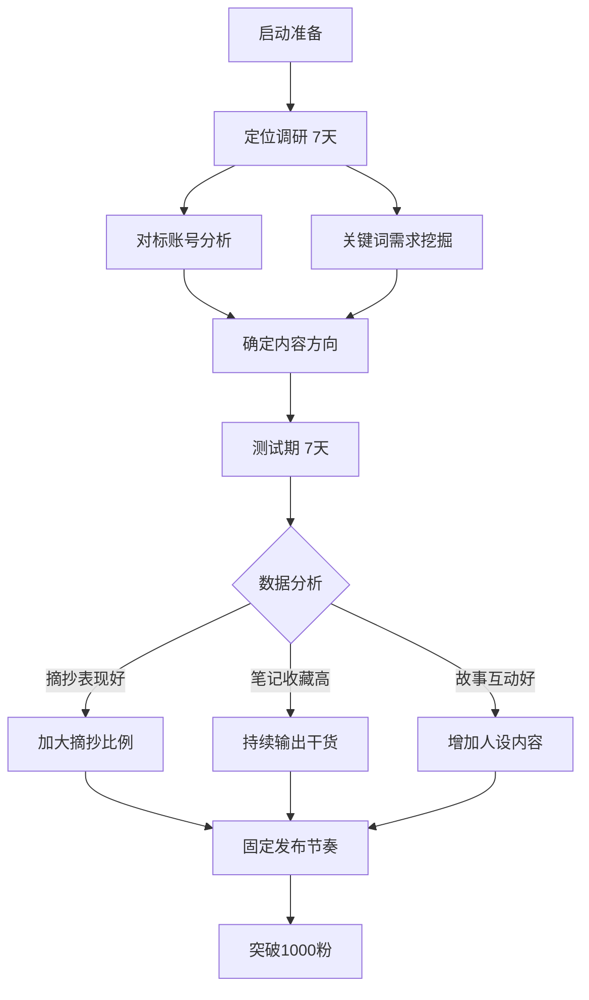

## 案例六：素人逆袭——从零基础到月入3万的小红书博主

> 你不需要长得好看，不需要有专业背景，不需要花钱投流——在小红书，一个普通人只要掌握了"真实感+实用价值"的内容公式，完全可以在8-12个月内做到月入3万。本案例记录一位零基础的行政人员如何从一条手写笔记开始，通过系统化的选题策略、精细化的运营节奏和多元化的变现组合，最终实现月收入稳定突破3万元的完整过程。

### 一、案例背景与主角画像

#### 1.1 主角基本情况

| 维度 | 详情 |
|------|------|
| 化名 | 晓琳 |
| 年龄 | 26岁 |
| 学历 | 本科（普通二本，汉语言文学专业） |
| 职业 | 私企行政专员（本职月薪5500元） |
| 所在城市 | 二线城市（成都） |
| 启动时间 | 2024年5月 |
| 可投入时间 | 工作日晚上1.5-2小时 + 周末半天 |
| 初始资金投入 | 约200元（手机支架129元 + 手写笔记本若干） |
| 专业背景 | 无任何自媒体、运营、设计经验 |
| 核心优势 | 写字好看、做事细致、共情能力强 |

晓琳的画像代表了小红书上最大的素人群体——没有名校光环、没有显赫职业、没有特殊技能，但有一颗愿意学习和坚持的心。她的案例之所以有代表性，正是因为她的起点足够"普通"。

#### 1.2 启动前的心理状态

晓琳在做小红书之前的状态：

- **经济焦虑**：月薪5500，扣除房租2000、生活费2000后所剩无几，想要存钱但看不到方向
- **技能焦虑**：觉得"自己什么都不会"，尝试过学PS、学剪辑但都半途而废
- **时间焦虑**：下班后刷手机到凌晨，明知浪费时间却停不下来
- **转折契机**：2024年4月，偶然刷到一条"普通人做小红书月入过万"的笔记，评论区很多人在质疑，但她注意到那条笔记本身就有2万赞——如果这个博主能用小红书教别人做小红书，说明这套方法是可验证的

#### 1.3 为什么选择小红书

晓琳在启动前做了一周的调研，对比了四个主流平台：

| 维度 | 小红书 | 抖音 | B站 | 微信公众号 |
|------|--------|------|------|------------|
| 内容形式 | 图文为主（图文占比60%+） | 纯短视频 | 中长视频 | 纯文字 |
| 新手流量 | 冷启动扶持强，新号有流量池 | 需要完播率数据支撑 | 需要内容积累 | 基本没有外部流量 |
| 内容制作门槛 | 手机拍照+手写笔记即可 | 需要剪辑、配乐、节奏感 | 需要拍摄、剪辑、脚本 | 需要文字功底 |
| 变现门槛 | 1000粉可接广告 | 1000粉开橱窗 | 1000粉+10万播放 | 500粉开流量主 |
| 长尾效应 | 搜索流量占比40%+，笔记长尾可达6-12个月 | 推荐为主，48小时后基本无流量 | 搜索流量强，但制作周期长 | 依赖转发，新号几乎无搜索 |
| 用户画像 | 女性为主（70%+），消费意愿强 | 全年龄段，娱乐为主 | 年轻男性偏多，消费意愿低 | 中年职场人群为主 |

最终选择小红书的核心原因：

- **图文门槛最低**：不需要露脸、不需要剪辑、不需要好设备
- **算法对素人友好**：内容质量>粉丝量，新号有机会获得万级曝光
- **搜索流量占比高**：好的笔记可以持续获得搜索流量，不需要每天追热点
- **手写字笔记天然适合小红书审美**：小红书用户偏爱"真实感"和"生活感"，手写字恰好符合

### 二、定位选择：从"什么都想做"到"只做一件事"

#### 2.1 第一次定位失败

晓琳最开始的定位是"自律成长博主"，发了15条笔记，内容包括早起打卡、读书笔记、时间管理、健身记录——什么热发什么。结果：15条笔记总阅读量不到2000，最高一条87赞。

**失败原因分析：**

| 问题 | 具体表现 | 根本原因 |
|------|----------|----------|
| 定位太宽 | "自律成长"覆盖太多子话题 | 用户无法用一句话描述你是谁 |
| 缺乏差异化 | 和成千上万的自律博主内容雷同 | 没有找到自己的独特切入点 |
| 内容分散 | 今天发早起、明天发读书 | 算法无法识别账号标签，不知道推给谁 |
| 过于主观 | 内容以"我觉得""我认为"为主 | 缺乏对用户有价值的具体方法论 |

**底层逻辑**：小红书算法给每个账号打"内容标签"，标签越集中，推荐越精准。一个什么都发的账号，算法不知道该把你的内容推给谁，最终每个方向的推荐量都很少。这在运营术语中叫"标签稀释"——同一个账号试图覆盖多个不相关的主题，导致每个主题的权重都不够高。

#### 2.2 重新定位的方法论

晓琳在第16天停下来，花了一周时间重新梳理定位。她用了三个工具：

**工具一：SWOT自我分析**

| | 正面因素 | 负面因素 |
|---|----------|----------|
| **内部** | **优势（S）**：字写得好看（从小练书法）、做事特别细致（行政工作的职业训练）、共情能力强（能理解普通人的焦虑）、表达清晰（汉语言文学训练） | **劣势（W）**：没有专业知识背书、没有视频制作能力、不擅长追热点、性格内向不想露脸 |
| **外部** | **机会（O）**：小红书手写笔记赛道竞争不大、"无纸化学习"趋势带来笔记类内容需求、大量学生和职场新人需要实用笔记 | **威胁（T）**：手写内容容易被模仿、AI生成内容冲击、平台规则变化 |

**SWOT分析的关键执行要点**：

很多素人做SWOT分析时容易陷入两个误区。第一是把"没有XX"写成劣势——比如"没有专业摄影设备"，但手机拍摄在小红书上完全够用，这不是真正的劣势。第二是忽略外部威胁——比如AI生成的笔记模板正在快速普及，手写笔记的稀缺性可能在1-2年内下降。晓琳的分析做得比较务实，她把劣势聚焦在真正限制内容创作的因素上，把威胁聚焦在可预见的行业变化上。

**工具二：关键词需求挖掘**

在小红书搜索框输入核心词，观察联想词和笔记数据：

| 搜索词 | 搜索结果数 | 笔记平均互动量 | 竞争判断 |
|--------|-----------|----------------|----------|
| 手写笔记 | 120万+ | 高（千赞笔记多） | 竞争激烈，头部效应明显 |
| 学习方法 | 200万+ | 中高 | 泛赛道，难突围 |
| 读书笔记模板 | 38万 | 中（百赞级） | 需求明确，竞争适中 |
| 摘抄 | 85万 | 中高 | 内容生产简单，但同质化 |
| 手账排版 | 45万 | 中 | 偏设计，非晓琳强项 |
| **自律手写** | **8万** | **中低** | **竞争小，但需求真实** |
| **读书摘抄手写** | **15万** | **中** | **晓琳优势+需求的交叉点** |
| **考试笔记手写** | **22万** | **中高** | **目标人群明确** |

**关键词挖掘的进阶技巧**：

晓琳后来总结出了一套"三层关键词筛选法"，值得所有素人博主借鉴：

1. **第一层：大词扫描**——用行业核心词（如"读书""笔记""学习"）做初步搜索，了解赛道全貌和竞争强度
2. **第二层：长尾词筛选**——在搜索框输入大词后，观察下拉联想词和"相关搜索"区域，找到搜索量适中但竞争较小的细分词
3. **第三层：交叉验证**——用两个维度交叉（如"手写+读书""笔记+模板"），找到自己的差异化切入点

判断一个关键词是否值得做的标准：搜索结果数<50万（竞争可控）+ 平均互动量>100（有真实需求）+ 自己有能力产出相关内容（可持续）。

**工具三：对标账号分析**

找到3个粉丝量在1-5万的手写类账号，逐条分析她们的爆款笔记：

| 对标维度 | 分析要点 |
|----------|----------|
| 选题方向 | 哪些主题的笔记互动率最高？ |
| 封面设计 | 什么样的图片点击率高？ |
| 文案结构 | 标题怎么写？正文多少字？ |
| 评论区 | 用户在问什么？有什么未被满足的需求？ |
| 变现方式 | 这个账号怎么赚钱？卖什么产品？ |

**对标分析的实操方法**：

晓琳对标分析的具体做法是：打开对标账号，从最新笔记往前翻50条，逐条记录点赞数、收藏数、评论数。然后按互动量排序，分析排名前10的笔记有什么共同特征——选题类型、封面风格、标题写法、正文长度。她还会专门看评论区，因为评论区是用户需求的"原始矿脉"：用户反复问的问题就是未被满足的需求，用户的感谢和赞美就是内容价值的直接反馈。

#### 2.3 最终定位

通过以上分析，晓琳确定了最终定位：

> **"一个普通人的手写读书笔记"**

定位公式拆解：

- **目标人群**：想读书但读不进去/读了记不住的学生和职场新人
- **核心诉求**：用好看的笔记降低读书的门槛，把书里的知识"可视化"
- **差异化人设**：不是读书博主，不是手写博主，而是"帮你把书读薄"的笔记整理者

这个定位的精妙之处在于：

1. **门槛低但天花板高**：手写笔记人人都能做，但做得好看需要练习——晓琳的书法功底构成天然壁垒
2. **内容生产标准化**：每读完一章做一张笔记，流程可复制，不会陷入"今天写什么"的焦虑
3. **长尾价值强**：读书笔记是"工具型内容"，用户会收藏后反复查看，搜索流量持续
4. **变现路径清晰**：卖笔记模板、卖书单合集、接书籍推广——每条路径都有成熟的商业模式

#### 2.4 定位自检清单

在确定最终定位前，晓琳用以下清单做了自检。这个清单适合所有素人博主在定位阶段使用：

| 检查项 | 合格标准 | 晓琳的定位检验结果 |
|--------|----------|-------------------|
| 一句话描述 | 陌生人能在5秒内理解你做什么 | "帮你把书读薄的手写笔记" ✓ |
| 差异化 | 和前3个对标账号有明显区别 | 结合了"普通人人设+手写+读书"三个元素 ✓ |
| 可持续 | 能持续产出100条以上不重复的内容 | 每本书至少5-10条笔记，书源无限 ✓ |
| 有需求 | 搜索量>10万，且评论区有真实痛点 | "读书笔记模板"搜索38万，评论区需求旺盛 ✓ |
| 能变现 | 至少有2种可行的变现方式 | 广告+模板+课程+品牌定制 ✓ |
| 自己擅长 | 能做到该赛道的前20%水平 | 书法功底+汉语言文学背景 ✓ |

### 三、冷启动阶段（第1-30天）：从0到1000粉

#### 3.1 第一周：测试期，不追求数据

晓琳给自己定了一个规则：**前7天每天发1条笔记，不看数据，只测试什么类型的内容自己做得舒服。**

| 天数 | 笔记类型 | 内容主题 | 图片形式 | 数据 |
|------|----------|----------|----------|------|
| D1 | 书籍摘抄 | 《被讨厌的勇气》金句 | 手写字+纯色背景 | 12赞 |
| D2 | 读书笔记 | 《认知觉醒》核心观点 | 手写思维导图 | 34赞 |
| D3 | 书籍摘抄 | 《人间值得》温暖句子 | 手写字+咖啡杯 | 89赞 |
| D4 | 读书笔记 | 《小狗钱钱》理财要点 | 手写要点列表 | 23赞 |
| D5 | 书籍摘抄 | 《小王子》经典语录 | 手写字+干花装饰 | 156赞 |
| D6 | 读书笔记 | 《非暴力沟通》方法论 | 手写对比表格 | 45赞 |
| D7 | 个人分享 | "我为什么开始手写读书笔记" | 手写笔记本照片 | 67赞 |

**测试期发现的关键洞察：**

- **摘抄类内容比笔记类更容易获得点赞**（门槛低，用户秒懂），但收藏率低
- **有生活感的布景（咖啡杯、干花、台灯）点击率比纯色背景高40%**
- **《小王子》《人间值得》等"治愈系"书籍的摘抄比工具书更受欢迎**
- **个人故事类内容虽然数据一般，但评论区互动率最高**

这四条洞察成为晓琳后续内容策略的基石。很多人忽略测试期，一上来就按照"我觉得"的方式猛发内容，结果浪费了2-3周才发现方向不对。晓琳的做法是用7天、7条笔记的低成本去验证假设，这个思路适用于所有内容创作者。

#### 3.2 第二、三周：找到爆款公式

根据第一周的数据，晓琳确定了核心内容类型：

**内容矩阵（7:2:1比例）：**

```text
70% — 书籍摘抄/金句（流量款，吸引新用户）
20% — 读书笔记/干货整理（收藏款，提升账号权重）
10% — 个人故事/成长记录（人设款，建立信任感）
```

**为什么是7:2:1而不是5:3:2？** 晓琳在实践中发现，摘抄类内容虽然单价价值不高（点赞多但收藏少），但它是"流量入口"——用户通过一条摘抄进入主页，看到干货笔记后才会关注。如果干货比例太高，新用户触达量不够，涨粉速度会慢很多。7:2:1的本质是"用摘抄做流量，用干货做转化，用人设做留存"。

**书籍摘抄的爆款公式：**

```text
选书 → 选句 → 手写 → 布景拍摄 → 写标题 → 写正文 → 发布

具体操作：
1. 选书：优先选豆瓣8分以上、小红书搜索热度高的书
2. 选句：每本书选5-8句"扎心"或"通透"的句子（共鸣感 > 哲理感）
3. 手写：用0.5mm黑色中性笔，写在A5方格纸上，字间距留白适中
4. 布景：米色桌布 + 一杯咖啡/茶 + 一小束干花，自然光拍摄
5. 标题：用"书名+情绪关键词"格式，如"读完《人间值得》我哭了3次"
6. 正文：写2-3段个人感悟，200-400字，用"读书-感悟-行动"三段式
```

**标题公式库（晓琳总结的高点击率模板）：**

| 模板 | 示例 | 适用场景 |
|------|------|----------|
| 读完X，我终于理解了Y | 读完《被讨厌的勇气》，我终于理解了"课题分离" | 工具类/方法论书籍 |
| X里最扎心的N句话 | 《人间值得》里最扎心的10句话 | 治愈类/情感类书籍 |
| 后悔没早点读到这本书 | 后悔没早点读到《认知觉醒》 | 评分高但知名度不高的书 |
| 一句顶一万句 | 《小王子》里一句顶一万句的话 | 经典名著 |
| 读了X遍，每次都有新感悟 | 读了3遍《非暴力沟通》，每次都有新感悟 | 需要反复读的经典书 |

#### 3.3 第四周：突破1000粉

在第22天，一条关于《认知觉醒》的读书笔记意外爆了：

```text
笔记数据：
- 标题："读完《认知觉醒》，我列了30条人生行动清单"
- 形式：手写笔记，3张图，第一条是思维导图，后两条是详细展开
- 发布时间：周五晚上9:30
- 24小时数据：1.2万阅读，856赞，423收藏，89评论
- 7天累计：3.8万阅读，2100赞，1580收藏
- 涨粉：单条涨粉620
```

这条笔记爆的原因分析：

1. **《认知觉醒》本身是小红书热书**：搜索量大，平台有推荐基础
2. **"30条行动清单"这个钩子太强**：用户一看标题就想收藏，因为觉得"收藏=学到了"
3. **思维导图形式的信息密度高**：一张图就能看到全书框架，天然适合收藏
4. **发布时间精准**：周五晚上是小红书流量高峰，用户有时间刷手机
5. **前22天的持续更新建立了基础权重**：账号有了"活跃"标签

**第30天数据汇总：**

| 指标 | 数据 |
|------|------|
| 总粉丝 | 1,280 |
| 总笔记数 | 28条 |
| 平均阅读量 | 1,800/条 |
| 最高单条阅读 | 38,000 |
| 总点赞数 | 6,500+ |
| 总收藏数 | 4,200+ |
| 月收入 | 0元（尚未开始变现） |

#### 3.4 冷启动阶段的关键动作清单



### 四、成长阶段（第2-6个月）：从1000粉到3万粉

#### 4.1 内容策略升级

突破1000粉后，晓琳的内容策略从"泛流量"转向"精准流量+变现导向"。

**升级一：从单本书到系列主题**

| 系列名称 | 包含书目 | 笔记数量 | 总阅读量 | 变现方式 |
|----------|----------|----------|----------|----------|
| "认知升级5本书" | 《认知觉醒》《思考快与慢》《原则》《刻意练习》《学习之道》 | 15条 | 28万 | 书籍推广佣金 |
| "情绪管理书单" | 《被讨厌的勇气》《非暴力沟通》《情绪急救》《当下的力量》 | 12条 | 22万 | 笔记模板售卖 |
| "理财入门不踩坑" | 《小狗钱钱》《富爸爸穷爸爸》《指数基金投资指南》 | 10条 | 15万 | 理财课程推广 |
| "治愈系睡前读物" | 《人间值得》《小王子》《解忧杂货店》《山茶文具店》 | 18条 | 35万 | 书籍推广+广告 |

系列化的价值：

- **降低选题成本**：不用每天想"今天写什么"，按计划推进
- **提升关注转化**：用户看到一个系列，会想"关注后看完整个系列"
- **增强搜索权重**：同一关键词下多条笔记，增加被搜索到的概率
- **便于打包变现**：一个系列可以打包成付费合集

**系列化内容的执行要点**：系列的第一条笔记要标注"这是XX系列的第1篇"，并在正文末尾预告后续内容，引导用户关注。系列的最后一条要回顾全系列要点，并推荐相关系列，形成"内容闭环"。晓琳还发现，系列内的笔记互相@（在评论区置顶系列目录），可以显著提升系列内其他笔记的阅读量。

**升级二：增加"工具型内容"比例**

工具型内容指用户会"存下来反复查看"的笔记，如：

- "我读了100本书后整理的读书方法论"（思维导图）
- "手写笔记的5种排版模板"（模板展示）
- "不同类型的书用不同的笔记法"（方法对比）
- "我的读书工具清单"（工具推荐）

这类内容的特点是**收藏率是点赞率的2-3倍**，对提升账号权重极为重要——小红书的算法中，收藏权重>点赞权重。

**升级三：建立固定发布节奏**

| 时间 | 周一 | 周二 | 周三 | 周四 | 周五 | 周六 | 周日 |
|------|------|------|------|------|------|------|------|
| 早8:00 | — | 书籍摘抄 | — | 书籍摘抄 | — | — | — |
| 晚9:00 | 读书笔记 | — | 个人故事 | — | 书籍摘抄 | 读书笔记 | 复盘/休息 |
| 频率 | 每周5条 | | | | | | |

最佳发布时间测试结果（基于晓琳自己的账号数据）：

- **早8:00-8:30**：通勤时间，用户刷手机高峰，适合轻松的摘抄内容
- **午12:00-12:30**：午休时间，但竞争激烈，不推荐新号
- **晚9:00-9:30**：最佳时段，适合有深度的笔记/干货内容
- **周五晚**：一周中流量最高的时段，适合发"王炸"内容

**关于发布时间的深层逻辑**：发布时间不是固定的"万能公式"，而是取决于你的目标人群的作息习惯。晓琳的目标人群是学生和职场新人，这两个群体的共同特征是白天忙、晚上有空。但如果你的目标人群是宝妈，最佳发布时间可能是上午10:00-11:00（孩子上学后）和下午3:00-4:00（午休后）。核心原则是：在你的目标用户最可能刷手机的时间发布。

#### 4.2 爆款笔记的完整生产流程

晓琳在第3个月总结出了一套标准化的笔记生产流程，从选题到发布需要1.5-2小时：

**第一步：选书（20分钟）**

```text
选书标准：
1. 豆瓣评分 ≥ 7.5（质量保障）
2. 小红书搜索该书名，笔记数 > 10万（有搜索需求）
3. 自己真正读过（真实感 > 一切技巧）
4. 优先选近期有热度的书（平台会有流量倾斜）

选书工具：
- 豆瓣读书TOP250（经典书库）
- 小红书搜索框联想词（实时需求）
- 微信读书飙升榜（市场热度）
- 拼多多/当当畅销榜（大众需求）
```

**选书的隐藏技巧**：晓琳发现一个规律——豆瓣评分在7.5-8.5之间的书最容易出爆款。评分太低的书，用户不认可；评分太高的经典名著（如《红楼梦》），用户已经看过太多相关内容，审美疲劳。而7.5-8.5分的"好书但不算出名"这个区间，既有质量保障，又有信息差。另一个技巧是关注"出版社新书首发期"——出版社在新书上市前1-2周会通过蒲公英平台寻找博主合作，这时候接推广不仅有广告费，还能获得"首发"标签的流量加持。

**第二步：选句/选知识点（30分钟）**

```text
摘抄类选句标准：
- 能引发"说到我心里了"的共鸣感
- 句子长度适中（15-40字最佳）
- 有画面感或情绪冲击力
- 适合独立成句，不需要上下文

笔记类选知识点标准：
- 有具体的方法/步骤/框架
- 能用一张图说清楚
- 和读者的日常生活有关联
- 有"原来如此"的认知刷新感
```

**选句的判断技巧**：晓琳有一个简单的测试方法——把选出来的句子发到自己的朋友圈，看看有没有人点赞或评论。如果朋友圈都没人感兴趣，小红书上的陌生用户大概率也不会感兴趣。另一个方法是看这句话是否能"独立存在"——如果需要上下文才能理解，就不适合做摘抄卡片。

**第三步：手写与拍摄（40分钟）**

```text
手写规范：
- 用纸：A5方格纸/横线纸（方格纸更适合思维导图）
- 笔：0.5mm黑色中性笔（百乐P500或三菱UM-151）
- 字体：正楷或行楷，不要写草书（别人看不懂就不会收藏）
- 间距：行间距适中，不要太紧凑（留白=呼吸感）
- 错字处理：不要涂改液，用一条横线划掉重写（更真实）

布景规范：
- 桌面：米色/白色桌布，或原木桌面
- 道具：一杯咖啡/茶、一小束干花/绿植、一本实体书
- 光线：自然光最佳（窗边45度角），阴天用暖色台灯补光
- 构图：俯拍45度角，笔记占画面60%，留白40%
- 拍摄：手机原相机，不要用美颜滤镜（会影响手写字清晰度）

拍摄技巧：
- 关闭HDR（避免手写字过曝）
- 用九宫格辅助线构图
- 对焦点放在手写字上
- 拍3-5张选最好的一张
```

**手写字的进阶技巧**：晓琳在第3个月开始尝试"分层手写法"——用黑色笔写正文，用红色/蓝色笔写标题或关键词，用荧光笔标注重点。这种做法让笔记的视觉层次更丰富，信息密度更高，同时保持了手写的"真实感"。另一个小技巧是在笔记底部留一行小字写自己的小红书ID，既防盗图又增加品牌曝光。

**第四步：图片处理（15分钟）**

```text
晓琳的图片处理流程（全部用手机完成）：
1. 原图裁剪：用小红书自带裁剪（3:4竖版）
2. 调整亮度：用Snapseed微调+10-15亮度
3. 锐化文字：用Snapseed"突出细节"功能+20
4. 加水印：在角落加自己的小红书ID（防盗图）
5. 封面图：第一张图就是封面，决定了点击率

注意：不要过度修图！手写字笔记的核心卖点是"真实感"，
过度美颜滤镜会破坏这种真实感。
```

**封面图的点击率优化**：封面图决定了笔记50%的成败。晓琳测试发现以下封面元素能显著提升点击率：

| 封面元素 | 点击率提升 | 示例 |
|----------|-----------|------|
| 手写字+实体书 | +25% | 笔记本旁边放一本实体书 |
| 数字+关键词 | +30% | 封面右上角加"30条""5个方法" |
| 对比色背景 | +15% | 浅色笔记纸+深色桌面 |
| 手指点读姿态 | +20% | 一只手指着笔记上的某句话 |
| 书名+情绪词 | +35% | "读完哭了""后悔没早看" |

**第五步：写标题和正文（15分钟）**

```text
标题写作规则：
1. 控制在18-22字（太短没信息量，太长显示不全）
2. 必须包含书名（搜索关键词）
3. 必须有情绪词或数字（扎心/后悔/终于/N条/N本）
4. 不要用"分享""安利"等弱动词

正文写作模板：
第一段：一句话说明这本书讲什么（20字以内）
第二段：自己读这本书的契机/感受（50-80字）
第三段：核心内容/金句展开（100-150字）
第四段：行动建议/互动引导（30-50字）

标签规则：
- 必加：书名、作者名、书籍类型
- 选加：情绪标签（治愈、成长）、场景标签（睡前读物、通勤读物）
- 标签数量：8-12个最佳
```

**正文的"三段式"写作法详解**：晓琳的正文模板之所以有效，是因为它符合用户的阅读心理。第一段"讲什么"满足用户的快速判断需求（"这条笔记和我有关吗"）；第二段"我的感受"建立情感连接（"这个人和我一样"）；第三段"核心内容"提供实际价值（"收藏这条笔记"）；第四段"互动引导"推动行动（"点赞/评论/关注"）。这不是套路，而是尊重用户的阅读体验。

#### 4.3 数据复盘体系

晓琳从第2个月开始建立数据复盘体系，每周日晚花30分钟做一次：

**周复盘表格模板：**

| 指标 | 本周数据 | 上周数据 | 变化 | 分析 |
|------|----------|----------|------|------|
| 发布笔记数 | 5 | 5 | — | — |
| 总阅读量 | 45,000 | 38,000 | +18% | 爆款笔记带动 |
| 平均点赞率 | 4.2% | 3.8% | +0.4% | 内容质量提升 |
| 平均收藏率 | 5.1% | 4.5% | +0.6% | 干货型内容增加 |
| 新增粉丝 | 850 | 620 | +37% | 爆款笔记涨粉效应 |
| 互动率 | 6.8% | 5.5% | +1.3% | 评论区引导有效 |

**数据基准线（小红书读书赛道）：**

| 指标 | 及格线 | 良好 | 优秀 | 爆款 |
|------|--------|------|------|------|
| 点击率（封面） | 3% | 5% | 8% | 12%+ |
| 点赞率 | 2% | 4% | 6% | 10%+ |
| 收藏率 | 3% | 5% | 8% | 12%+ |
| 评论率 | 0.5% | 1% | 2% | 3%+ |
| 关注转化率 | 1% | 3% | 5% | 8%+ |

**关键指标解读：**

- **点赞率高但收藏率低** → 内容引发情绪共鸣但缺乏实用价值，需要增加干货比例
- **收藏率高但点赞率低** → 内容实用但缺乏情感连接，需要在正文增加个人故事
- **评论率低** → 缺乏互动引导，需要在正文末尾加入提问
- **阅读量高但涨粉低** → 内容泛了，需要加强个人标签

**数据复盘的"三看法则"**：一看趋势（和上周比是涨还是跌），二看异常（哪条笔记的数据明显偏离平均值），三看归因（好数据是因为什么，差数据又是因为什么）。晓琳每周复盘时会把数据记录在飞书多维表格中，积累了8周数据后就能看到清晰的趋势线——哪些类型的内容持续表现好，哪些时间段发布效果最佳，哪些标题模板点击率最高。

#### 4.4 第2-6个月数据增长曲线

| 时间节点 | 粉丝数 | 月均阅读量 | 单条最高阅读 | 月收入 |
|----------|--------|-----------|-------------|--------|
| 第2个月末 | 3,500 | 12万 | 4.5万 | 800元（第一笔广告） |
| 第3个月末 | 8,200 | 25万 | 8.2万 | 3,200元 |
| 第4个月末 | 15,000 | 42万 | 15万 | 6,500元 |
| 第5个月末 | 22,000 | 58万 | 22万 | 11,000元 |
| 第6个月末 | 32,000 | 72万 | 35万 | 18,000元 |

**增长曲线的规律总结**：晓琳的增长曲线呈现出典型的"指数型增长"特征——前3个月增长缓慢（积累期），第4个月开始加速（爆发期），第6个月进入快速增长（收获期）。这和小红书的算法机制有关：账号权重是累积的，前3个月的持续更新积累了足够的"账号信用"，算法开始给更多推荐量。很多素人在第2个月就放弃了，恰恰是最可惜的。

### 五、变现阶段：从月入0到月入3万的变现组合

#### 5.1 变现时间线

晓琳的变现并非一蹴而就，而是逐步叠加：

| 阶段 | 粉丝门槛 | 变现方式 | 月收入 |
|------|----------|----------|--------|
| 尝试期（第2个月） | 1,500+ | 第一条蒲公英广告 | 500元 |
| 稳定期（第3-4个月） | 5,000+ | 广告+笔记模板售卖 | 3,000-6,500元 |
| 增长期（第5-7个月） | 15,000+ | 广告+模板+书单课程 | 11,000-18,000元 |
| 成熟期（第8个月起） | 30,000+ | 四条线并行 | 28,000-35,000元 |

#### 5.2 四条变现线详解

**变现线一：品牌广告（蒲公英平台）**

```text
平台：小红书蒲公英（品牌合作平台）
入驻条件：粉丝 ≥ 1,000 + 完成实名认证
报价参考（读书赛道）：
- 1,000-5,000粉：200-500元/条
- 5,000-10,000粉：500-1,500元/条
- 10,000-30,000粉：1,500-4,000元/条
- 30,000-50,000粉：4,000-8,000元/条

晓琳的广告收入（第8个月后稳定）：
- 月接广告：3-5条
- 单条均价：3,500元
- 月广告收入：12,000-15,000元

广告类型：
1. 出版社新书推广（最常见，每条2,000-4,000元）
2. 阅读类APP推广（微信读书、得到等）
3. 文具品牌合作（笔、本子、书签）
4. 知识付费课程推广（按CPS分成）

接广告的原则：
- 只接自己真正用过/读过的产品
- 广告笔记也要保证内容质量（不写软广硬推）
- 广告比例控制在总笔记的20%以内（多了会掉粉）
- 提前和品牌沟通内容方向，保留创作自主权
```

**广告报价谈判技巧**：晓琳分享了她和出版社谈广告的三个关键策略。第一，不要主动降价——品牌方报价通常是弹性的，你主动降价反而会让对方觉得你的内容不值钱。第二，用数据说话——把自己的笔记平均阅读量、互动率、收藏率整理成一页PDF，发给品牌方看，用数据支撑报价。第三，提供附加价值——比如承诺在评论区置顶购买链接、在后续笔记中自然提及，这些附加服务可以帮你拿到更高的报价。

**变现线二：笔记模板售卖**

```text
产品形态：手写笔记模板（PDF格式，可打印）
定价策略：
- 单本模板：9.9元
- 主题合集（5-10本）：29.9元
- 全年会员（所有模板+持续更新）：99元

销售渠道：
1. 小红书主页简介引导→微信→小商店下单
2. 小红书笔记商品橱窗（需1,000粉）
3. 微信小商店（免费开店，零手续费）

月均销量（第8个月后）：
- 单本模板：200-300份 × 9.9 = 2,000-3,000元
- 主题合集：80-120份 × 29.9 = 2,400-3,600元
- 年度会员：20-30份 × 99 = 2,000-3,000元
- 月模板收入：6,000-9,000元

模板内容结构：
- 封面页（书名+作者+日期）
- 书籍信息页（出版社/页数/评分）
- 核心观点思维导图（1-2页）
- 章节要点摘录（3-5页）
- 金句精选页（1页）
- 个人感悟页（1页）
- 行动清单页（1页）
```

**模板产品的定价心理学**：9.9元这个价格不是随便定的。晓琳测试过6.9元、9.9元、12.9元三个价格点，最终发现9.9元是"冲动购买"的心理阈值——低于10元，用户几乎不需要思考就会下单。而29.9元的合集模板的购买逻辑不同，用户买的是"省时间"——与其花1小时自己整理，不如花29.9元买现成的。99元的年度会员则是"投资心态"——用户觉得自己会用一整年，所以愿意一次性投入更多。

**变现线三：付费书单课程**

```text
产品形态：小红书专栏/微信小商店付费图文
定价：199元/套
内容结构：
- 50本精选书的读书笔记（每本1套完整笔记）
- 50份可打印笔记模板
- 10篇读书方法论长文
- 1个读书社群（微信群，限时加入）

月均销量（第8个月后）：40-60份
月收入：8,000-12,000元

这个产品的核心价值：
用户买的不是"笔记内容"（书里都有），
而是"帮你把50本书读薄的整理服务"——
本质上是"知识整理"的付费。
```

**付费课程的推广策略**：晓琳不会在每条笔记里都推课程，而是用"钩子笔记"策略——每周发1条专门的"产品种草"笔记，用"我花了3个月整理了50本书的笔记，浓缩成了这套课程"这样的叙述方式，把课程包装成"节省时间的工具"而非"要你花钱"。她还会在评论区自然地提及"完整版在课程里"，不强推，让用户自己决定。

**变现线四：品牌定制内容**

```text
当粉丝超过3万后，开始有出版社主动找上门：

合作模式：
1. 新书首发笔记：出版社寄书+付费1,500-3,000元
2. 系列书单定制：出版社提供5-10本书，付费5,000-8,000元
3. 读书会联名：与出版社/书店联合举办线上读书会

月均收入：3,000-5,000元
```

#### 5.3 月入3万的收入结构拆解（第8个月稳定期）

| 收入来源 | 月均金额 | 占比 | 投入时间 | 时薪 |
|----------|----------|------|----------|------|
| 品牌广告 | 12,000-15,000元 | 42% | 每条2-3小时 | 1,000元/小时 |
| 笔记模板 | 6,000-9,000元 | 25% | 前期投入，后期自动化 | 近乎无限 |
| 付费课程 | 8,000-12,000元 | 28% | 前期投入，后期更新维护 | 500元/小时 |
| 品牌定制 | 3,000-5,000元 | 5% | 每次3-5小时 | 300元/小时 |
| **合计** | **29,000-41,000元** | **100%** | **日均2-3小时** | — |

**收入结构的健康度分析：**

```text
健康的自媒体收入结构应该是：
- 平台依赖型收入（广告） ≤ 50%
- 自有产品收入（模板+课程） ≥ 40%
- 偶发性收入（品牌定制） ≤ 10%

晓琳的结构符合这个标准，抗风险能力强：
即使某个月广告减少，模板和课程收入依然稳定。
```

#### 5.4 税务与财务管理

月入3万意味着需要认真对待税务问题。晓琳的做法：

| 项目 | 说明 |
|------|------|
| 收入类型 | 广告收入属于"劳务报酬"，产品收入属于"经营所得" |
| 纳税义务 | 年收入超过12万元需进行个税汇算清缴 |
| 发票问题 | 蒲公英平台会代扣代缴个税；私人合作需要自行申报 |
| 账户管理 | 开设专门的银行卡用于副业收支，与本职收入分开 |
| 记账工具 | 用"随手记"APP记录每笔收支，每月生成报表 |

**晓琳的财务建议**：副业收入到手后，先拿出30%存入一个"税务准备金"账户，年底汇算清缴时用。剩下的70%再按照"50%生活+30%再投资+20%储蓄"的比例分配。再投资部分主要用于购买书籍（每月约200-300元）、工具升级（偶尔买新笔/纸）和学习费用（运营课程）。

### 六、运营细节与实操技巧

#### 6.1 小红书算法机制解读

理解算法是运营的基础。小红书的推荐算法分为四个流量池：

| 流量池 | 曝光量级 | 进入条件 | 关键指标 |
|--------|----------|----------|----------|
| 初级池 | 200-500 | 发布即进入 | 点击率（封面吸引力） |
| 二级池 | 1,000-5,000 | 初级池互动率 > 5% | 点赞率、收藏率 |
| 三级池 | 10,000-50,000 | 二级池互动率 > 8% | 完读率、评论率 |
| 爆款池 | 100,000+ | 三级池各项指标优秀 | 综合互动+内容质量 |

**关键认知：**

- 新笔记发布后2小时是"生死期"——如果2小时内互动率不达标，基本不会再被推荐
- 收藏权重 > 点赞权重 > 评论权重 > 转发权重
- 搜索流量不受流量池限制，只要SEO做得好，新笔记也能从搜索获得流量
- 发布后1小时内可以修改标题和正文，不会影响推荐（但不要频繁修改）

**算法机制的深层理解**：小红书的算法本质上是一个"内容质量检测器"。它通过用户的行为（点击、点赞、收藏、评论、完读）来判断一条笔记的质量，然后决定是否给更多曝光。这意味着：你无法"骗"算法——买粉买赞可能短期内提升数据，但算法会检测到"互动用户和内容目标人群不匹配"，反而会降低推荐权重。唯一正确的方式是做出真正对用户有价值的内容。

#### 6.2 SEO优化技巧

小红书40%的流量来自搜索，SEO做得好等于有了"免费的持续流量"。

**关键词布局位置：**

| 位置 | 权重 | 优化方法 |
|------|------|----------|
| 标题 | ★★★★★ | 必须包含核心关键词 |
| 正文第一段 | ★★★★ | 自然融入关键词 |
| 标签 | ★★★ | 使用关键词+长尾词 |
| 图片文字 | ★★★ | 手写字中包含关键词 |
| 评论区 | ★★ | 自己评论中加入相关词 |

**关键词挖掘方法：**

1. **搜索框联想词**：在小红书搜索框输入核心词，下拉联想词就是用户真实搜索需求
2. **相关搜索**：搜索结果页底部的"相关搜索"
3. **竞品笔记标签**：分析同类爆款笔记使用了哪些标签
4. **微信指数/百度指数**：验证关键词的市场热度

**SEO的长期价值**：晓琳有一条发布于第3个月的笔记，到第8个月仍然每天获得200-300次搜索流量，累计阅读量超过10万。这就是SEO的复利效应——一条笔记做好了关键词布局，可以持续为你带流量半年甚至更久。相比之下，纯推荐流量的笔记通常在48小时后就基本没有新的曝光了。

#### 6.3 评论区运营

评论区是"第二个内容场"——很多用户看完笔记后会先看评论区。

**评论区运营策略：**

| 场景 | 做法 | 目的 |
|------|------|------|
| 发布后30分钟内 | 自己先评论2-3条（补充内容/提问引导） | 降低用户评论门槛 |
| 用户问"这是什么书" | 立即回复书名+一句话推荐 | 引导搜索，增加互动 |
| 用户说"太有用了" | 回复"谢谢你，还想看什么书的笔记？" | 引导关注+收集选题 |
| 用户提出质疑 | 礼貌回应，不要删评 | 展现真实人设 |
| 有人问"在哪里买" | 回复购买渠道 | 为后续带货铺垫 |

**评论区运营的进阶技巧**：晓琳会在自己的笔记下置顶一条"系列目录"评论，把同系列的其他笔记标题和链接列出来，引导用户去阅读系列内的其他内容。她还会在评论区"埋钩子"——比如在一条摘抄笔记的评论区写道"这本书的完整读书笔记我已经整理好了，想要的扣1"，用评论区互动来测试用户对产品的需求。

#### 6.4 常见错误与避坑指南

| 错误 | 具体表现 | 后果 | 正确做法 |
|------|----------|------|----------|
| 频繁换方向 | 这周写读书，下周写穿搭，再下周写美食 | 算法无法打标签，流量分散 | 至少坚持一个方向3个月再评估 |
| 买粉买赞 | 花钱买僵尸粉、刷互动数据 | 平台检测到会限流/封号 | 用内容质量换真实流量 |
| 过度追求完美 | 一条笔记打磨3天才发 | 更新频率太低，账号权重下降 | 80分就发，边发边优化 |
| 抄袭搬运 | 搬运别人的笔记/图片 | 被举报后限流甚至封号 | 借鉴选题但原创内容 |
| 忽视评论区 | 发完就不管了 | 错过互动加分和用户需求 | 发布后1小时内维护评论区 |
| 过早接广告 | 粉丝不到1000就接低质量广告 | 伤害粉丝信任 | 1000粉后再接，且只接好产品 |
| 内容全靠摘抄 | 只发金句摘抄没有自己的见解 | 收藏率低，账号定位模糊 | 7:2:1比例，增加干货和人设内容 |
| 忽视封面设计 | 随便拍一张就发 | 点击率低，好内容被埋没 | 封面决定50%的成败 |

### 七、关键转折点复盘

#### 7.1 转折点一：第22天——第一条爆款笔记

**事件**：《认知觉醒》读书笔记意外爆了，单条3.8万阅读。

**意义**：验证了方向是对的，给了晓琳继续坚持的信心。

**关键教训**：爆款不可复制，但爆款的规律可以学习——那条笔记之所以爆，是因为"认知觉醒"本身是热书+"30条行动清单"是强收藏型标题+思维导图形式信息密度高。

#### 7.2 转折点二：第3个月——第一次接到广告

**事件**：一家出版社通过蒲公英平台找到晓琳，报价500元推广一本新书。

**意义**：从"0收入"到"有收入"，哪怕只有500元，但证明了这条路走得通。

**关键教训**：第一次接广告一定要慎重选择产品——晓琳拒绝了3个报价更高的产品（自己没读过/不认可），只接了这一个自己真正觉得好的书。事实证明这个决定是对的，那条广告笔记的互动数据甚至比日常笔记还好。

#### 7.3 转折点三：第5个月——推出笔记模板产品

**事件**：在评论区多次被问"笔记模板能分享吗"之后，晓琳第一次尝试售卖笔记模板。

**意义**：从"卖时间"到"卖产品"——这是收入质变的起点。

**关键教训**：用户需求是产品最好的指南针。模板产品之所以成功，是因为它解决了用户的真实痛点：想要好看的手写笔记但自己字不好看/没时间手写。

#### 7.4 转折点四：第7个月——突破月入3万

**事件**：当月广告收入12,000元 + 模板收入8,000元 + 课程收入9,000元 + 品牌定制3,000元，合计32,000元。

**意义**：副业收入首次超过本职收入的5倍，晓琳开始考虑是否全职做自媒体。

**关键决策**：晓琳最终决定**不辞职**，原因：

1. 本职工作稳定，社保公积金不能断
2. 副业收入虽然高但波动大，需要更多时间验证稳定性
3. 工作中的人际关系和信息获取对内容创作有帮助
4. 心理安全感——"有退路"比"全力以赴"更可持续

#### 7.5 转折点五：第8个月——应对内容倦怠

**事件**：连续写了8个月的读书笔记后，晓琳开始感到倦怠，更新频率从每周5条降到每周2条，月收入也从3.2万降到了2.4万。

**应对策略**：

1. **内容升级**：从纯图文转向"图文+短视频"双轨制，用视频形式分享"我的读书过程"，内容形式的变化让创作重新变得有趣
2. **建立素材库**：提前储备2-3周的内容，倦怠期可以"调用库存"而不是"现想现写"
3. **降低单日投入**：从每天1.5小时降到1小时，但保持更新频率——倦怠期的敌人是"停下来"，不是"做得少"
4. **寻找外部刺激**：加入读书博主社群，和同行交流选题灵感，参加线下读书会

**关键教训**：内容倦怠是每个长期创作者都会遇到的问题，不是"放弃"的信号，而是"需要升级"的信号。解决方案不是"更努力"，而是"换一种方式努力"。

### 八、工具清单与工作流

#### 8.1 日常运营工具

| 用途 | 工具 | 费用 | 备注 |
|------|------|------|------|
| 手写笔记 | A5方格纸 + 百乐P500 | 约30元/月 | 核心生产力工具 |
| 拍摄 | 手机原相机 | 0 | 不需要专业设备 |
| 图片处理 | Snapseed | 免费 | Google出品，功能够用 |
| 排版设计 | Canva（免费版） | 免费 | 做封面图和模板 |
| 数据分析 | 小红书创作者中心 | 免费 | 查看笔记数据和粉丝画像 |
| 选题调研 | 小红书搜索框 | 免费 | 联想词=用户需求 |
| 竞品分析 | 新红数据 | 免费版够用 | 查看竞品账号数据 |
| 笔记管理 | 飞书多维表格 | 免费 | 管理内容日历和数据 |
| 模板售卖 | 微信小商店 | 免费开店 | 零手续费 |
| 私域运营 | 企业微信 | 免费 | 引导用户到私域 |

#### 8.2 每日工作流（1.5-2小时）

```text
20:00-20:20  选书/选句（20分钟）
20:20-21:00  手写笔记+拍摄（40分钟）
21:00-21:15  图片处理（15分钟）
21:15-21:30  写标题和正文（15分钟）
21:30-21:35  发布+自查（5分钟）
21:35-21:50  维护评论区+互动（15分钟）
```

**工作流的弹性设计**：晓琳的工作流不是铁板一块，而是有"降级方案"。如果某天加班太晚只有30分钟，她会执行"极简版"——从素材库里调用一条提前准备好的摘抄内容，10分钟发布+20分钟维护评论区。如果周末有大块时间（3-4小时），她会执行"批量版"——一次性手写5-7条笔记的素材，存入素材库，下周的工作日只需要做图片处理和文案撰写。这种弹性设计保证了"无论什么情况都能保持更新"。

#### 8.3 周度复盘工作流（每周日30分钟）

```text
21:00-21:10  导出本周数据（阅读/点赞/收藏/评论/涨粉）
21:10-21:20  填写周复盘表格，计算环比变化
21:20-21:25  标记异常数据，分析原因
21:25-21:30  制定下周内容计划（选题+发布时间）
```

### 九、不同阶段的收入增长模型

| 阶段 | 时间 | 粉丝目标 | 月收入目标 | 核心动作 | 关键指标 |
|------|------|----------|-----------|----------|----------|
| 播种期 | 第1-2月 | 0→1,500 | 0-500元 | 每日1更，测试内容方向 | 找到自己的爆款公式 |
| 发芽期 | 第3-4月 | 1,500→10,000 | 500-5,000元 | 固定更新节奏，开始接广告 | 广告报价稳定上升 |
| 成长期 | 第5-6月 | 10,000→25,000 | 5,000-15,000元 | 推出自有产品，建立私域 | 自有产品收入占比提升 |
| 成熟期 | 第7-8月 | 25,000→40,000 | 15,000-30,000元 | 四条变现线并行运营 | 收入结构健康，波动可控 |
| 扩展期 | 第9月+ | 40,000+ | 30,000-50,000元 | 考虑团队化、跨平台 | 是否需要辞职全职做 |

### 十、经验总结：素人做小红书的10条铁律

**第一条：定位比努力重要100倍。** 方向错了，越努力越偏。花两周时间做定位调研，比花两个月盲目更新有价值得多。

**第二条：真实感是素人最大的武器。** 你不需要专业设备、不需要完美字迹、不需要精致生活——真实、有温度、有缺点的内容反而更受欢迎。

**第三条：日更是冷启动的基本功。** 前30天每天发1条笔记，是让算法认识你、给你打标签的最快方式。不要纠结单条数据，发够数量才能看到统计规律。

**第四条：收藏率比点赞率更重要。** 小红书的算法中收藏权重最高，做"用户会收藏的内容"比做"用户会点赞的内容"更有流量价值。

**第五条：80分就发，边发边优化。** 追求100分的结果是永远发不出来。一条笔记从构思到发布控制在2小时以内。

**第六条：不要等粉丝多了再变现。** 1,000粉就可以接广告，5,000粉就可以卖产品。越早开始变现，越早获得"这条路走得通"的正反馈。

**第七条：评论区是第二战场。** 认真回复每一条评论，不仅能提升互动率，还能从评论中发现用户的真实需求——你的下一个产品可能就在评论区里。

**第八条：数据驱动，不凭感觉。** 每周做一次数据复盘，用数据指导选题方向，不要凭"我觉得这个会火"做决策。

**第九条：不要和头部博主比，和昨天的自己比。** 素人的竞争对手不是百万大V，而是同阶段的其他新号。关注自己的增长曲线，而不是别人的绝对数据。

**第十条：坚持6个月再判断行不行。** 99%的人在前3个月就放弃了，但大多数成功的小红书博主都是在第4-6个月才真正起飞的。给自己至少6个月的时间。

### 十一、如果你也想做：30天启动计划

| 天数 | 任务 | 预计时间 |
|------|------|----------|
| D1-3 | 定位调研：SWOT分析+关键词挖掘+对标账号分析 | 每天1小时 |
| D4-5 | 确定定位，设计账号头像/简介/背景图 | 每天1小时 |
| D6-7 | 准备工具：方格纸、笔、布景道具 | 30分钟 |
| D8-14 | 测试期：每天发1条笔记，测试不同类型 | 每天1.5小时 |
| D15 | 数据复盘：分析前7条笔记，确定主打方向 | 1小时 |
| D16-21 | 稳定期：按确定的方向每天发1条 | 每天1.5小时 |
| D22 | 二次复盘：分析数据，优化内容策略 | 1小时 |
| D23-28 | 冲刺期：尝试系列化内容，提升收藏率 | 每天1.5小时 |
| D29 | 月度复盘：总结一个月的全部数据 | 1.5小时 |
| D30 | 制定下月计划，准备开始变现尝试 | 1小时 |

**30天后的预期成果：**

- 粉丝：500-1,500（取决于是否有爆款笔记）
- 总阅读量：3万-10万
- 找到适合自己的内容类型和发布节奏
- 建立起标准化的笔记生产流程
- 获得第一条广告邀约的可能性（如果有一条笔记超过1万阅读）

**30天计划的补充说明**：这个计划假设你每天有1.5-2小时的空闲时间。如果你的时间更少（比如只有30分钟），可以把计划拉长到60天，核心逻辑不变——先测试、再确定、再坚持。关键是"不要停"，哪怕每天只发一条简单的摘抄，也比"攒3天发一条精品"对冷启动更有帮助。
