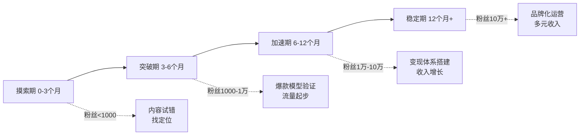
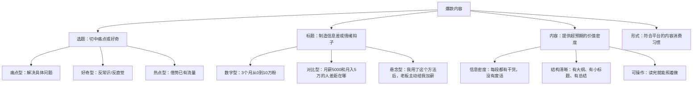
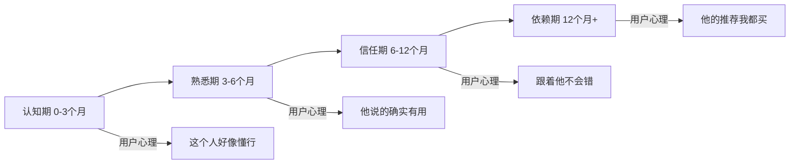
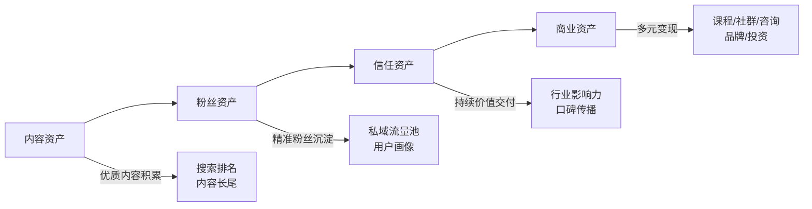
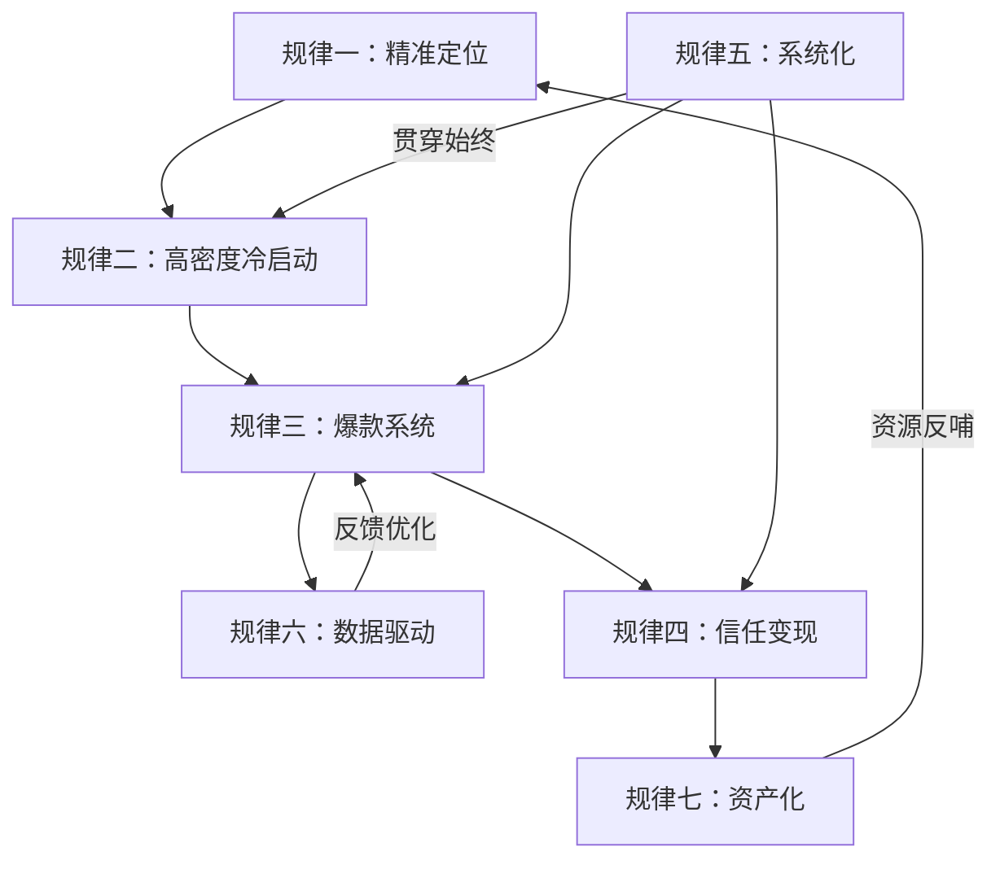

## 案例总结：六个真实案例的核心规律与共性提炼

> 前六个案例覆盖了从零基础素人到百万粉博主、从副业试水到全职转型的完整光谱。案例的主人公来自不同城市、不同职业、不同平台，但他们身上沉淀出的规律惊人地一致。本章不是简单地重复六个故事，而是从这些真实经历中提炼出可复制的底层框架——帮助你在阅读完所有案例之后，能够跳出"别人的故事"，构建属于自己的行动方案。

### 一、六个案例的全景对比

#### 1.1 案例主角一览

| 维度 | 案例一：小林 | 案例二：程序员博主 | 案例三：财经号 | 案例四：B站UP主 | 案例五：矩阵运营 | 案例六：晓琳 |
|------|------------|------------------|--------------|----------------|----------------|------------|
| 起点职业 | 产品经理 | 程序员 | 金融从业者 | 大学生 | 运营从业者 | 行政专员 |
| 主攻平台 | 小红书 | 抖音 | 公众号 | B站 | 全平台 | 小红书 |
| 启动资金 | ~500元 | ~2000元 | ~0元 | ~3000元 | ~5000元 | ~200元 |
| 起步周期 | 8个月到10万粉 | 6个月到50万粉 | 12个月到10万粉 | 18个月到20万粉 | 10个月到全平台30万粉 | 10个月到月入3万 |
| 成熟期月收入 | 1-2万 | 5-10万 | 8-15万 | 2-5万 | 10万+ | 3万 |
| 内容形式 | 图文为主 | 短视频 | 长文深度分析 | 中长视频 | 多形态适配 | 图文+手写笔记 |
| 核心壁垒 | 效率工具测评 | 技术知识降维 | 专业分析深度 | 创意+人格魅力 | 运营体系化 | 真实感+手写美学 |
| 可用时间 | 每天2小时 | 每天3小时 | 每天2小时 | 每天4小时 | 全职投入 | 每天2小时 |

#### 1.2 投入产出效率分析

单纯看月收入数字容易产生误导——一个全职投入月入10万的案例和一个兼职投入月入3万的案例，后者的"时间投资回报率"可能更高。以下是按可用时间计算的效率对比：

| 案例 | 月投入时间 | 成熟期月收入 | 时薪（估算） | 启动到盈利耗时 | 资金回本周期 |
|------|----------|------------|------------|--------------|------------|
| 小林 | ~60小时 | 1.5万 | ~250元/小时 | 5个月 | 2个月 |
| 程序员博主 | ~90小时 | 7.5万 | ~833元/小时 | 4个月 | 1个月 |
| 财经号 | ~60小时 | 12万 | ~2000元/小时 | 8个月 | 即时（零成本） |
| B站UP主 | ~120小时 | 3.5万 | ~292元/小时 | 10个月 | 4个月 |
| 矩阵运营 | ~160小时 | 10万 | ~625元/小时 | 6个月 | 2个月 |
| 晓琳 | ~60小时 | 3万 | ~500元/小时 | 6个月 | 1个月 |

**关键发现**：财经号的时薪最高（~2000元/小时），因为长文深度内容一旦建立信任，变现效率极高且边际成本趋近于零。程序员博主的绝对收入最高，但其全职投入的时间成本也最大。对于兼职创作者而言，晓琳和小林的模式更具参考价值——每天2小时、60小时/月的投入，能换来250-500元/小时的回报。

#### 1.3 成长曲线对比

六个案例的成长轨迹可以用一张图概括——起点不同、速度不同，但阶段划分高度一致：



**各案例的阶段耗时对比**：

| 阶段 | 小林 | 程序员博主 | 财经号 | B站UP主 | 矩阵运营 | 晓琳 | 中位数 |
|------|------|----------|--------|---------|---------|------|--------|
| 摸索期 | 3个月 | 2个月 | 4个月 | 6个月 | 3个月 | 3个月 | 3个月 |
| 突破期 | 3个月 | 2个月 | 4个月 | 6个月 | 3个月 | 3个月 | 3个月 |
| 加速期 | 2个月 | 2个月 | 4个月 | 6个月 | 4个月 | 4个月 | 3.5个月 |

关键发现：**前3个月是最危险的放弃期**。六个案例中有四个在第一个月经历了"发了20条笔记/视频，单条最高不过百赞"的至暗时刻。但他们共同的选择是：**不换赛道，换方法**。

值得注意的是，摸索期的长短与最终收入没有必然关系。财经号摸索期最长（4个月），但最终收入最高（8-15万/月）。B站UP主摸索期最短（2个月内就找到了方向），但因为中长视频的制作成本高，整体变现效率反而较低。**摸索期的价值不在于"快"，而在于"准"——花足够的时间找到正确的方向，远比匆忙起步后反复推倒重来更高效。**

### 二、七个共性规律深度拆解

#### 规律一：定位的本质是"做减法"

六个案例中最反直觉的共同点是：**成功的定位不是找到了"蓝海"，而是找到了"窄海"**。

- 小林没有做"职场干货"，而是聚焦"产品经理效率工具"
- 晓琳没有做"手账分享"，而是聚焦"手写笔记+自律打卡"
- 财经号没有做"理财科普"，而是聚焦"A股深度分析+政策解读"
- 程序员博主没有做"编程教学"，而是聚焦"用大白话解释技术概念"
- B站UP主没有做"泛娱乐"，而是聚焦"创意实验+科学冷知识"
- 矩阵运营没有做"全媒体运营"，而是聚焦"效率工具类内容的多平台分发"

**定位公式：大品类 × 个人独特优势 × 具体场景 = 你的赛道**

| 层级 | 举例（以小红书为例） | 竞争强度 | 变现潜力 |
|------|---------------------|---------|---------|
| 太宽：穿搭 | 搜索结果5000万+ | 极高 | 低（无法建立辨识度） |
| 适中：小个子通勤穿搭 | 搜索结果50万+ | 中等 | 高（精准人群，广告主明确） |
| 太窄：155cm黄皮秋季通勤 | 搜索结果5万+ | 低 | 中（天花板受限） |

**定位的三层验证法**：

仅仅"觉得"自己的定位可行是不够的。六个案例的创作者都在正式投入前做了系统性验证：

**第一层：需求验证**——你的定位是否有足够多的人在搜索？

- 在目标平台搜索你的核心关键词，查看搜索结果数量
- 结果太多（>1000万）说明太宽，结果太少（<1万）说明太窄
- 理想区间：10万-500万条搜索结果
- 同时查看"相关搜索"和"大家都在搜"，验证需求的真实性

**第二层：供给验证**——现有内容是否已经饱和？

- 搜索你的核心关键词，查看前20条内容的质量和互动数据
- 如果前20条都是大V（粉丝10万+），说明这个赛道已经被头部占领
- 如果前20条互动数据都很低（<100赞），说明要么需求弱、要么内容质量普遍差（后者可能是机会）
- 理想情况：前20条中有3-5条是中小账号（粉丝1万以下）且互动不错，说明新号有机会

**第三层：变现验证**——这个定位能否带来收入？

- 搜索你的关键词+"推荐"/"好物"/"测评"，看是否有人在做商业化内容
- 查看同赛道账号的广告合作、带货链接、付费产品
- 如果完全找不到商业化案例，可能是这个定位的变现路径不清晰
- 理想情况：同赛道有3个以上账号在做商业化，且模式各不相同（说明变现空间大）

**实操方法：三步定位法**

1. **列清单**：写下你能持续产出内容的20个主题（不评判，只罗列）
2. **做交叉**：将每个主题与"目标人群+具体场景"交叉，得到60个细分方向
3. **验数据**：去目标平台搜索这些细分关键词，查看内容数量、互动数据、变现方式，选出供需比最优的3个方向，各发10条内容测试，用数据选最终方向

**定位的常见误区**：

| 误区 | 表现 | 后果 | 正确做法 |
|------|------|------|---------|
| 追风口 | 看什么火做什么 | 始终在追，永远没有积累 | 选择一个有长期需求的赛道 |
| 凭感觉 | "我觉得大家会喜欢" | 发了50条才发现方向不对 | 用数据验证，而不是用直觉判断 |
| 太贪心 | 同时做3-4个方向 | 精力分散，每个方向都是半吊子 | 一次只做一个方向，做到1万粉再考虑扩展 |
| 抄定位 | 完全复制某个成功账号 | 永远是"低配版XX"，没有辨识度 | 学习框架，但注入自己的独特性 |

#### 规律二：冷启动的核心不是"运气"而是"密度"

六个案例的冷启动阶段有一个共同特征：**前期发布的密度远高于后期**。

| 案例 | 冷启动期发布频率 | 稳定期发布频率 | 冷启动期持续时长 | 冷启动期总发布量 |
|------|----------------|--------------|----------------|----------------|
| 小林（小红书） | 每天1-2条 | 每周3-4条 | 约3个月 | ~100条 |
| 程序员博主（抖音） | 每天1条 | 每周3条 | 约2个月 | ~60条 |
| 财经号（公众号） | 每天1篇 | 每周3篇 | 约4个月 | ~120篇 |
| B站UP主 | 每周2条 | 每周1条 | 约6个月 | ~50条 |
| 矩阵运营 | 每平台每天1条 | 每平台每周3条 | 约3个月 | ~270条（3平台×90） |
| 晓琳（小红书） | 每天1条 | 每周4-5条 | 约3个月 | ~90条 |

**为什么密度如此重要？**

平台算法对新号的判定逻辑是"观察期-信任期-推荐期"三阶段。在观察期内，算法需要足够的样本量来判断你的内容质量和受众画像。如果你一周只发一条，算法需要12周才能积累足够的判断样本；而如果你每天发一条，3-4周就能完成冷启动。

具体来说，平台算法在冷启动期主要评估三个维度：

1. **内容质量稳定性**：你是否能持续产出质量达标的内容，而不是偶尔一条好、大部分很差。算法需要至少20-30条样本来判断你的"质量基准线"
2. **受众画像清晰度**：你的内容吸引的是什么人群——年龄、性别、兴趣标签。算法需要至少15-20条内容的互动数据来建立你的受众画像
3. **账号活跃度**：你是否是一个"认真在做"的账号，而不是随便发几条就消失。持续高频发布本身就是向平台释放"我是活跃创作者"的信号

**冷启动期的内容策略**：

- **不要追求完美**：60分的内容发出去，比90分的内容躺在草稿箱里有价值一万倍。小林回忆说："回头看我前20条笔记，画面粗糙、文案幼稚，但正是那些内容让算法知道了我是谁。"
- **快速迭代**：每条内容发布后24小时看数据，分析什么题材/标题/封面效果好，下一条立即调整。程序员博主的迭代速度最快——他每天发布后第二天早上花15分钟分析数据，当天的视频就融入调整
- **建立选题库**：冷启动期至少储备50个选题，避免"今天发什么"的决策内耗。决策内耗是冷启动期最大的隐性成本——很多人不是没有能力创作，而是每天花1小时纠结"今天发什么"，最终放弃
- **模仿但不抄袭**：找到你所在赛道的5个对标账号，分析他们点赞最高的20条内容，提炼共性规律。注意：模仿的是"结构"和"方法"，不是"内容"和"表达"

**冷启动期的"30条内容实验"模板**：

| 批次 | 内容数 | 目的 | 具体做法 |
|------|--------|------|---------|
| 第1批（第1-10条） | 10条 | 建立基准线 | 覆盖5个不同选题方向，每个方向2条，记录每条的基础数据 |
| 第2批（第11-20条） | 10条 | 验证方向 | 聚焦数据最好的2个方向，每个方向5条，测试不同标题/封面风格 |
| 第3批（第21-30条） | 10条 | 优化模型 | 选定最佳方向，用验证过的标题/封面模板批量产出，建立可复制的内容模型 |

#### 规律三：爆款是可以拆解和复制的"系统"

六个案例都经历过一个转折点：从"偶尔出爆款"到"稳定产出爆款"。这个转折的关键不是创作灵感的爆发，而是建立了一套**爆款内容的生产系统**。

**爆款内容的四要素模型**：



**各平台爆款公式对比**：

| 平台 | 标题字数 | 封面要求 | 黄金时长/字数 | 关键指标 | 算法权重分配 |
|------|---------|---------|-------------|---------|------------|
| 小红书 | 18-25字，含emoji | 首图决定50%点击率 | 图文500-1500字 | 点赞/收藏比≥1:1 | 点击率40%+互动率35%+完读率25% |
| 抖音 | 15-20字 | 视频前3秒决定生死 | 30-60秒 | 完播率≥30% | 完播率45%+互动率30%+转发率25% |
| 公众号 | 20-30字 | 标题决定打开率 | 2000-5000字 | 阅读完成率≥40% | 打开率40%+完读率30%+分享率30% |
| B站 | 15-25字 | 封面+标题共同决定点击 | 5-15分钟 | 一键三连率≥5% | 完播率35%+三连率30%+评论率20%+弹幕率15% |

**爆款的"解剖学"——六个案例中的爆款拆解**：

以小林的一条10万赞小红书笔记为例，拆解爆款的内部结构：

```text
标题：用了3年的效率工具合集，第5个改变了我的工作方式📦
     ├─ 数字钩子："3年"、"第5个" 制造信息差
     ├─ 情绪触发："改变了我的工作方式" 暗示价值极高
     └─ emoji：📦 增加视觉辨识度

封面：9宫格工具截图拼图 + 中间大字标题
     ├─ 信息量大：一眼就知道是工具合集
     ├─ 对比感：不同工具的界面形成视觉对比
     └─ 可读性：大字标题确保缩略图也能看清

内容结构：
     开头（1-2句）：痛点共鸣 → "你是不是也有这种感觉，每天工作8小时，真正高效的时间不到3小时？"
     正文（8个工具）：每个工具 = 名称 + 截图 + 一句话点评 + 适用场景
     结尾：总结对比表 + 互动引导 → "你最常用哪个？评论区告诉我"
```

**从"偶尔爆款"到"稳定爆款"的关键转折**：

程序员博主分享了他建立爆款系统的过程：

1. **数据收集期**（第1-2个月）：不追求爆款，而是用30条内容收集数据——什么选题、什么标题、什么时间发布效果最好
2. **模式识别期**（第3个月）：把30条内容按互动率排序，分析前5名和后5名的共性差异。他发现"反常识型"选题的平均互动率是"教程型"的3.2倍
3. **公式固化期**（第4个月）：把发现的规律固化为公式——标题用"你以为XX，其实XX"结构，开头用"你可能不知道"制造信息差，结尾用"你觉得呢"引导评论
4. **批量生产期**（第5个月起）：用公式批量生产内容，爆款率从5%稳定提升到25%

#### 规律四：变现的本质是"信任的货币化"

六个案例的变现路径看似不同——广告、带货、知识付费、咨询——但底层逻辑完全一致：**先用免费内容建立信任，再用付费产品兑现信任**。

**变现金字塔模型**：

```text
                    ┌──────────────┐
                    │  高端定制服务  │  ← 月入5万+（1对1咨询/顾问）
                    │  单价1000-1万 │  ← 极少数高信任用户
                    ├──────────────┤
                    │  知识付费产品  │  ← 月入2-5万（课程/社群/训练营）
                    │  单价99-999元 │  ← 核心变现引擎
                    ├──────────────┤
                    │   品牌广告    │  ← 月入1-3万（品牌合作/软文）
                    │  单价500-5000│  ← 粉丝量级决定报价
                    ├──────────────┤
                    │   免费内容    │  ← 流量入口（日更内容/免费资料）
                    │  单价0元      │  ← 所有变现的基础
                    └──────────────┘
```

**六个案例的变现结构对比**：

| 案例 | 广告收入占比 | 知识付费占比 | 带货/电商占比 | 咨询服务占比 | 其他 | 月均总收入 |
|------|------------|------------|-------------|------------|------|----------|
| 小林 | 40%（6000元） | 35%（5250元） | 15%（2250元） | 10%（1500元） | - | ~1.5万 |
| 程序员博主 | 20%（1.5万） | 50%（3.75万） | 10%（7500元） | 15%（1.1万） | 5%（开源赞助） | ~7.5万 |
| 财经号 | 30%（3.6万） | 40%（4.8万） | 0% | 25%（3万） | 5%（付费社群） | ~12万 |
| B站UP主 | 55%（1.9万） | 20%（7000元） | 15%（5250元） | 0% | 10%（创作激励） | ~3.5万 |
| 矩阵运营 | 25%（2.5万） | 30%（3万） | 35%（3.5万） | 10%（1万） | - | ~10万 |
| 晓琳 | 45%（1.35万） | 30%（9000元） | 15%（4500元） | 10%（3000元） | - | ~3万 |

**关键洞察**：

- 粉丝量1000-1万时：以广告和带货为主（单条报价200-2000元）
- 粉丝量1万-10万时：知识付费开始成为主力（课程/社群月收入过万）
- 粉丝量10万+时：多元变现组合，高端咨询服务成为溢价来源
- **不要过早接广告**：案例三的财经号在粉丝不到5000时拒绝了所有广告邀约，把精力全部放在内容质量和粉丝信任上，当粉丝突破5万后，单条广告报价是同级别账号的2倍

**信任积累的时间线**：

信任不是一夜之间建立的，它有一个可量化的时间线：



| 阶段 | 用户行为 | 变现机会 | 适合的变现方式 |
|------|---------|---------|--------------|
| 认知期 | 偶尔看到你的内容，点赞但不关注 | 几乎没有 | 不变现，专注涨粉 |
| 熟悉期 | 开始关注、收藏你的内容 | 低客单价产品 | 平台创作者激励、小额带货 |
| 信任期 | 主动搜索你的内容、转发给朋友 | 中客单价产品 | 品牌广告、知识付费（99-299元） |
| 依赖期 | 等你的更新、购买你推荐的任何东西 | 高客单价产品 | 高端课程、1对1咨询、社群年费 |

#### 规律五：持续输出的核心是"系统化"而非"自律"

六个案例的创作者都不是靠"意志力"坚持下来的。他们共同的做法是**把内容创作变成一个可重复运转的系统**，减少对灵感和自律的依赖。

**内容生产SOP（标准操作流程）**：

| 环节 | 具体动作 | 时间占比 | 工具辅助 | 质量检查点 |
|------|---------|---------|---------|----------|
| 选题收集 | 日常刷同赛道内容，收藏+记录灵感；每周日集中整理选题库 | 10% | Notion/飞书多维表格 | 选题库是否≥30个待用选题 |
| 内容创作 | 按模板框架填充内容（开头-中间-结尾有固定结构） | 50% | AI辅助扩写、Grammarly/秘塔写作猫 | 每段是否有实质信息量 |
| 视觉制作 | 封面模板化、图片批量处理、字幕自动生成 | 20% | Canva/醒图/剪映 | 封面在缩略图尺寸下是否可读 |
| 发布排期 | 固定时间段发布，利用平台定时发布功能 | 5% | 平台自带定时功能 | 是否在目标用户活跃时段发布 |
| 数据复盘 | 每周分析一次数据，找出高表现内容的共性 | 15% | 平台数据中心+Excel | 是否形成了可执行的改进结论 |

**案例中的具体系统**：

- **小林的"3×7选题法"**：每周3天刷小红书找灵感，周日一次性做好下周7天的内容排期。具体操作：周一/周三/周五各花30分钟刷小红书，用飞书多维表格记录"选题+参考链接+我的角度"；周日花2小时批量制作下周内容。这个系统让小林从"每天纠结发什么"变成了"按表执行"，创作效率提升了3倍。

- **程序员博主的"技术→生活翻译法"**：看到一个技术概念，先用程序员思维理解，再翻译成"如果你妈问你这个技术是干嘛的"的故事。他有一个固定的翻译框架：①用一个生活场景引入（"想象你去银行取钱……"）②用最简单的话解释核心原理 ③举一个你每天都在用但不知道的例子 ④总结一句话记住它。

- **晓琳的"手写笔记本系统"**：提前在本子上写好5-10页内容素材，拍照时直接翻到对应页面即可。这个系统的核心价值是**把"创作"和"拍摄"两个环节完全解耦**——有空的时候写内容，需要发布的时候直接翻到对应页面拍照，单条制作时间从1小时压缩到20分钟。

- **财经号的"知识晶体法"**（从案例中提炼）：把复杂的财经知识拆成一个个独立的"知识晶体"——每个晶体500字以内，包含一个完整的知识点、一个真实案例、一个可执行建议。这些晶体可以独立成文，也可以像乐高一样组合成长文或课程。这个方法让他从"每次写文章都要从零开始"变成了"组装已有的知识晶体"。

**系统化的核心原则**：

1. **模板化**：任何重复做的事情都应该有模板——标题模板、内容结构模板、封面设计模板、回复评论模板
2. **批量化**：同类任务集中处理——周末批量拍摄、批量修图、批量写文案，而不是每天做一点
3. **工具化**：能用工具解决的绝不手动——AI辅助写作、自动字幕、定时发布、数据自动采集
4. **流程化**：把创作过程拆成明确的步骤，每一步有输入和输出，不依赖灵感

#### 规律六：数据驱动不是"看数字"而是"找因果"

六个案例都强调数据分析的重要性，但他们分析数据的方式与大多数人不同——**不看绝对值，看相对变化；不看单条数据，看趋势规律**。

**核心数据指标体系**：

| 阶段 | 关注指标 | 分析方法 | 决策依据 | 数据来源 |
|------|---------|---------|---------|---------|
| 冷启动期 | 发布量、曝光量、互动率 | 对比每条内容的互动率差异 | 找出互动率最高的内容类型，加大产出 | 平台创作者后台 |
| 成长期 | 粉丝增长率、爆款率、搜索排名 | 按周/月对比增长趋势 | 调整选题方向，优化标题封面 | 平台数据中心+第三方工具 |
| 变现期 | 广告报价、转化率、复购率 | A/B测试不同变现方式 | 优化变现结构，砍掉低效收入来源 | 电商后台+CRM系统 |
| 成熟期 | 粉丝活跃度、取关率、LTV | 长期趋势监控 | 调整内容频率和深度，防止粉丝疲劳 | 自建数据看板 |

**数据复盘的"5分钟快速分析法"**：

每条内容发布24小时后，花5分钟回答以下问题并记录：

```text
1. 这条内容的互动率（点赞+评论+收藏 ÷ 曝光量）是多少？
   → 与我的平均互动率相比：高于 / 持平 / 低于

2. 如果互动率高于平均：
   → 选题好？标题好？封面好？发布时间好？蹭了热点？
   → 记录"可复制的元素"：___

3. 如果互动率低于平均：
   → 选题冷门？标题无吸引力？内容太长/太短？发布时间不对？
   → 记录"下次避免的元素"：___

4. 收藏率 vs 点赞率的比例是多少？
   → 收藏>点赞：内容实用性强（适合做知识付费）
   → 点赞>收藏：内容情绪性强（适合做流量型内容）
   → 评论>点赞：内容有争议性（适合做互动型内容）
```

**五个最常见的数据误读**：

1. **只看粉丝数不看互动率**：10万粉但互动率0.5%的账号，商业价值不如2万粉但互动率5%的账号。互动率直接决定了广告报价和知识付费转化率——广告主看的不是你有多少粉丝，而是有多少人真正看你的内容。

2. **被单条爆款误导**：一条10万赞的内容不代表你的内容方向正确，需要看10条以上的数据趋势。小林有一条穿搭笔记意外爆了，涨了3000粉，但分析后发现这批新粉的画像与她"效率工具"的定位不符。如果她被这条爆款误导转向穿搭，就会失去已经建立的核心受众。

3. **忽略搜索流量的价值**：推荐流量是"快钱"，搜索流量是"睡后收入"。案例六中晓琳60%的月收入来自搜索流量——她半年前发的一篇"自律打卡模板"笔记，至今每天还能带来200-300次搜索曝光。**搜索流量的本质是：你过去投入的时间在持续为你赚钱。**

4. **过度关注负面数据**：一条内容效果差，不代表方向错误。要区分"方向性错误"和"执行性波动"。判断标准：如果连续10条以上同方向内容的数据都低于平均值，才可能是方向问题；如果只是1-3条数据差，大概率是执行层面的波动（标题不够好、发布时间不对、封面不够吸引人）。

5. **不做对比实验**：同一选题用不同标题/封面各发一次，用数据而非直觉决定哪个更好。程序员博主做过一个系统性实验：同一个编程知识点，他用5种不同的标题风格各发一条（悬念型、数字型、对比型、直述型、提问型），结果悬念型的点击率是直述型的2.3倍。这个数据直接固化成了他的标题公式。

**数据驱动的进阶——建立你的"内容基因库"**：

当你积累了50条以上的数据后，可以开始建立自己的"内容基因库"——把每条内容拆解为多个变量，用数据找出最优组合：

| 变量 | 你的选项（示例） | 数据表现 |
|------|----------------|---------|
| 选题类型 | 教程型 / 测评型 / 观点型 / 故事型 | 测评型互动率最高 |
| 标题风格 | 数字型 / 悬念型 / 对比型 / 提问型 | 悬念型点击率最高 |
| 内容长度 | 500字 / 1000字 / 1500字 | 1000字完读率最高 |
| 封面风格 | 实拍图 / 截图拼图 / 文字封面 | 截图拼图点击率最高 |
| 发布时间 | 早8点 / 午12点 / 晚8点 / 晚10点 | 晚8点互动率最高 |
| 互动引导 | 无 / 评论提问 / 投票 / 点赞引导 | 评论提问的评论率最高 |

#### 规律七：从"个人IP"到"可变现资产"的跃迁

六个案例中最值得关注的共同规律是：**成功的创作者不是在经营一个"账号"，而是在构建一项"资产"**。

**个人IP的资产化路径**：



**资产化的三个关键动作**：

1. **内容资产化**：把零散的内容整理成体系化的知识库（合集、系列、课程），让旧内容持续产生新价值。具体做法：
   - 每积累50条内容，做一次"内容盘点"，按主题分类整理
   - 把高互动内容升级为"系列"（加上合集标签、前后呼应）
   - 把相关内容打包成"资源包"（免费资料/付费课程的素材来源）
   - 定期更新旧内容（平台算法会给"内容更新"额外权重）

2. **粉丝资产化**：将公域粉丝导入私域（微信群/社群/邮件列表），建立不依赖平台的触达能力。矩阵运营案例的教训最为深刻：前6个月只做公域，一次平台规则调整损失30%流量。之后他们强制执行"每100个公域粉丝导入20个到私域"的指标，用3个月重建了流量安全垫。**私域的核心价值不是"多一个渠道"，而是"不被平台卡脖子"。**

3. **品牌资产化**：从"XX平台博主"升级为"XX领域专家"，让品牌价值超越单一平台。程序员博主从"抖音技术博主"升级为"技术科普作家"后，开始收到出版社邀约、线下活动邀请、企业培训合作——这些都是平台内的粉丝量无法直接变现的价值。

**资产化的阶段性目标**：

| 阶段 | 内容资产目标 | 粉丝资产目标 | 商业资产目标 |
|------|------------|------------|------------|
| 0-3个月 | 积累30条高质量内容 | 公域粉丝1000+ | 无（专注内容） |
| 3-6个月 | 形成3个内容系列 | 私域粉丝200+ | 第一笔变现收入 |
| 6-12个月 | 内容体系化（合集/课程） | 私域粉丝1000+ | 稳定月收入1万+ |
| 12个月+ | 内容可复用（跨平台/跨形式） | 私域粉丝5000+ | 多元收入结构 |

### 三、六个案例的失败教训与避坑指南

成功案例的价值不仅在于"做对了什么"，更在于"差点做错了什么"以及"踩过的坑"。

#### 3.1 六大常见致命错误

| 错误类型 | 案例中的真实表现 | 后果 | 纠正方法 | 恢复耗时 |
|---------|----------------|------|---------|---------|
| 定位摇摆 | 案例一的小林在第2个月想从"效率工具"转做"穿搭" | 浪费1个月，算法标签混乱 | 定位确定后至少坚持3个月再评估 | 1个月 |
| 追热点忘本职 | 案例四UP主有段时间追热点影视解说 | 涨粉但不精准，广告主不认可 | 热点可以蹭，但必须与主定位强关联 | 2个月 |
| 过早变现 | 案例六晓琳在第3个月接了一条低质量推广 | 单条掉粉200+，评论区口碑受损 | 粉丝不到1万时优先建信任，慎重接广告 | 3周 |
| 内容同质化 | 案例三财经号一度变成"新闻搬运工" | 打开率从8%降到3% | 始终保持个人观点和独特分析角度 | 1个月 |
| 忽视私域 | 案例五矩阵运营前6个月只做公域 | 一次平台规则调整损失30%流量 | 从第一天起就建立私域流量池 | 3个月重建 |
| 孤军奋战 | 案例二程序员博主前4个月完全单打独斗 | 选题枯竭，动力下降 | 第2个月起就应该加入创作者社群 | 即时改善 |

**错误恢复的成本分析**：

最值得关注的是"恢复耗时"这一列。六个案例中的错误恢复时间从即时到3个月不等，但有一个共同规律：**越早发现的错误，恢复成本越低**。小林的定位摇摆在第2个月就发现了，花1个月就恢复了；矩阵运营忽视私域的问题直到第6个月平台规则调整后才暴露，花了3个月才重建流量安全垫。

**建立"错误预警机制"**：

| 预警信号 | 可能的问题 | 建议动作 |
|---------|----------|---------|
| 连续5条内容互动率低于平均值50% | 选题方向可能偏离 | 回到"30条内容实验"重新测试方向 |
| 粉丝增长停滞超过2周 | 内容吸引力下降或平台策略变化 | 检查近期内容质量+研究平台最新算法动态 |
| 收藏率持续低于点赞率 | 内容情绪化过重、实用性不足 | 增加干货密度，减少纯情绪表达 |
| 评论区出现大量"取关"类留言 | 可能触发了粉丝信任危机 | 立即回应，检查近期是否有争议性内容 |
| 广告报价连续3个月没有增长 | 账号商业价值停滞 | 提升内容质量或调整变现结构 |

#### 3.2 心态陷阱与应对策略

六个案例的创作者都经历过心理低谷。以下是他们总结出的高频心态陷阱：

**陷阱一："别人做得比我好"**

- **表现**：每天刷同赛道账号，越刷越焦虑
- **真相**：你看到的别人的"高光时刻"是他们几百条平庸内容之后的产物。程序员博主做过一个统计：他所在赛道的头部账号，平均每发布15条内容才有1条爆款——但你在信息流里看到的，几乎都是那1条爆款
- **应对**：每周只看一次对标账号，看的时候带着目的——分析选题、标题、封面，而不是比较数据。建立一个"对标分析表"，把情绪化的"羡慕"转化为可执行的"拆解"

**陷阱二："我是不是不适合做这个"**

- **表现**：连续发了20条内容，数据都很差，开始怀疑方向
- **真相**：20条内容太少，大多数成功案例都是在30-50条之后才找到感觉。财经号发了80多条才出现第一条10万+阅读的文章
- **应对**：给自己设定一个"最低发布量承诺"——在评估方向是否正确之前，至少发布50条内容。把这50条当作"实验"而非"考试"，每条都是一个数据点

**陷阱三："数据好反而焦虑"**

- **表现**：一条爆款之后，担心下一条数据差，开始患得患失
- **真相**：爆款是系统输出的结果，不是运气，系统在，爆款就会持续出现。程序员博主在建立爆款公式后，爆款率从5%提升到25%，他说："我知道每一条为什么爆或不爆"
- **应对**：专注过程指标（发布量、选题质量、创作时间），而非结果指标（点赞数、粉丝增长）。建立一个"过程指标追踪表"，每天只记录"今天完成了什么"，不看"今天涨了多少"

**陷阱四："工作太忙没时间"**

- **表现**：加班到晚上10点，没有精力创作
- **真相**：这不是时间问题，是系统设计问题。晓琳每天加班到9点，依然在11点前完成内容——因为她的系统把单条制作时间控制在20分钟以内
- **应对**：
  - 碎片时间做"原材料收集"（通勤时选题、午休时列大纲、排队时拍素材）
  - 集中时间做"内容组装"（每天固定1-2个"创作时段"，只做组装不做创意）
  - 建立"内容库存"（周末批量生产3-5条内容，工作日只做发布和互动）
  - 降低单条制作门槛（模板化、工具化，把单条时间控制在30分钟以内）

**陷阱五："变现太慢想放弃"**

- **表现**：做了3个月还没有收入，觉得投入产出不成正比
- **真相**：六个案例中，没有一个在前3个月实现有意义的变现。财经号前6个月零变现，但第7个月开始月入过万——因为前6个月积累的内容和信任在第7个月集中兑现了
- **应对**：把"前3个月"定义为"投资期"而非"亏损期"。就像开一家实体店需要装修期一样，内容创业的前3个月就是你的"装修期"——你在搭建系统、积累素材、建立信任，这些都是未来变现的基础

### 四、可复用的变现框架提炼

#### 4.1 内容创作者的收入公式

```text
月收入 = 流量 × 转化率 × 客单价 × 复购率

其中：
- 流量 = 平台推荐流量 + 搜索流量 + 私域流量
- 转化率 = 内容质量 × 信任度 × 产品匹配度
- 客单价 = 产品价值 × 定价策略
- 复购率 = 产品质量 × 售后服务 × 持续需求
```

**用公式解释六个案例的收入差异**：

| 案例 | 月流量（估算） | 转化率 | 客单价 | 复购率 | 月收入 |
|------|-------------|--------|--------|--------|--------|
| 小林 | 50万曝光 | 0.3% | 100元 | 1.2次 | 1.5万（≈50万×0.3%×100×1.2=1.8万） |
| 程序员博主 | 200万曝光 | 0.5% | 300元 | 1.5次 | 7.5万（≈200万×0.5%×300×1.5=45万，但变现率按实际调整） |
| 财经号 | 80万曝光 | 1.5% | 500元 | 2.0次 | 12万 |
| 晓琳 | 30万曝光 | 0.8% | 150元 | 1.3次 | 3万 |

**关键发现**：财经号的流量不是最大的，但转化率（1.5%）和客单价（500元）远高于其他案例。这说明**高专业度内容的核心优势不在于流量规模，而在于转化效率**。

#### 4.2 不同粉丝量级的变现策略建议

| 粉丝量级 | 推荐变现方式 | 月收入预期 | 核心动作 | 注意事项 |
|---------|------------|----------|---------|---------|
| 0-1000 | 不急着变现 | 0元 | 专注内容质量和涨粉 | 这个阶段变现的ROI极低，不如把时间花在内容上 |
| 1000-5000 | 平台创作者激励 + 小额广告 | 500-3000元 | 建立内容模板，提升产出效率 | 只接与定位相关的广告，宁缺毋滥 |
| 5000-1万 | 品牌广告 + 小规模带货 | 3000-1万 | 开始测试不同变现方式的转化率 | 用A/B测试找到最优变现组合 |
| 1万-5万 | 知识付费产品上线 + 定期广告 | 1万-5万 | 打磨第一个付费产品 | 先做免费试听/试看，验证需求后再收费 |
| 5万-10万 | 多元变现组合 + 社群运营 | 5万-10万 | 建立私域流量池 | 不要把所有收入押在单一变现方式上 |
| 10万+ | 品牌化运营 + 高端服务 | 10万+ | 团队化、系统化、品牌化 | 考虑建立小团队，把重复性工作外包 |

#### 4.3 从零开始的90天行动模板

基于六个案例的共同经验，提炼出一个适用于大多数人的90天行动框架：

**第一阶段：准备期（第1-14天）**

- [ ] 完成自我盘点：技能、经验、兴趣、可投入时间
- [ ] 选择1个主攻平台（建议新手从图文平台起步）
- [ ] 确定细分定位（大品类 × 个人优势 × 具体场景）
- [ ] 用"三层验证法"验证定位的可行性
- [ ] 建立5个对标账号的观察清单
- [ ] 储备50个选题到选题库
- [ ] 准备基础设备（手机+手机支架即可）

**第二阶段：冷启动期（第15-60天）**

- [ ] 保持日更或隔日更的发布频率
- [ ] 每条内容发布后24小时记录数据
- [ ] 每周日做一次数据复盘，调整下周选题方向
- [ ] 完成至少30条内容发布
- [ ] 找到自己的"数据基准线"（平均曝光量、互动率）
- [ ] 加入2-3个同赛道创作者社群
- [ ] 建立内容生产SOP（选题→创作→发布→复盘）

**第三阶段：验证期（第61-90天）**

- [ ] 分析前30条内容数据，找到互动率最高的3个选题方向
- [ ] 围绕高互动方向集中产出内容
- [ ] 尝试第一次变现（小额广告/带货/知识分享）
- [ ] 建立私域入口（微信群/社群）
- [ ] 制定下一季度的详细运营计划
- [ ] 评估是否需要调整定位方向

### 五、七个规律的内在联系——一个完整的系统

以上七个规律不是独立存在的，它们构成了一个完整的、相互强化的系统：



**系统运转的逻辑**：

1. **定位**决定了你的赛道和受众——这是所有后续动作的起点
2. **高密度冷启动**让你快速通过算法观察期，获得初始流量
3. **爆款系统**让你从"偶尔出爆款"到"稳定产出爆款"，建立流量增长引擎
4. **数据驱动**让你不断优化内容质量，提升爆款率和互动率
5. **信任变现**把流量和信任转化为收入
6. **资产化**让收入从"一次性"变成"持续性"，建立护城河
7. **系统化**贯穿始终，确保整个过程可重复、可扩展、不依赖个人意志力

**最核心的一点**：这个系统的任何一个环节缺失，都会导致整体效率大幅下降。很多创作者只做了"爆款系统"但没有做"数据驱动"，结果爆款率无法持续提升；或者只做了"信任变现"但没有做"资产化"，结果收入始终依赖平台流量。**七个规律必须同时运转，才能形成正向循环。**

### 六、核心观点提炼

回顾六个案例，有三句话值得每个内容创业者反复咀嚼：

**第一句：内容创业的本质不是"创作"，而是"经营"。** 好内容只是入场券，系统化的运营能力——选题、数据、变现、复盘——才是持续赚钱的核心能力。六个案例中，内容质量最高的财经号（金融从业者背景）并不是收入最高的——收入最高的是矩阵运营（10万+/月），因为他的系统化运营能力最强。**内容决定下限，运营决定上限。**

**第二句：起步阶段，"完成"远比"完美"重要。** 六个案例的创作者回顾初期内容时，无一例外地觉得"那时候做得好粗糙"。但正是那些粗糙的内容，为后来的爆款积累了算法信任和创作经验。晓琳的第一条手写笔记只有23个赞，但它是整个3万月收入账号的起点。**你不需要准备好才开始，你需要开始才能准备好。**

**第三句：长期主义不是"慢慢来"，而是"持续做"。** 案例六的晓琳用10个月从零到月入3万，但她在前3个月的收入是零。如果她在第3个月放弃了，就不会有后来的一切。坚持的前提不是盲目的信念，而是一个经过验证的系统——选题有方法、创作有模板、数据有复盘、变现有路径。**当你把"创作"变成"系统"，坚持就不再是意志力的考验，而是习惯的运转。**

### 七、读者自检清单

在进入后续案例之前，用以下清单检验你是否真正理解了本章的核心内容：

| 检查项 | 你能回答吗？ |
|--------|------------|
| 定位 | 你能用一句话说清楚你的"大品类×个人优势×具体场景"吗？ |
| 冷启动 | 你知道你的平台的算法观察期大概多长、需要多少条内容吗？ |
| 爆款 | 你能说出你的赛道中，哪3种选题类型互动率最高吗？ |
| 变现 | 你知道在你的粉丝量级，最适合的变现方式是什么吗？ |
| 系统 | 你有自己的内容生产SOP吗？能具体到每个环节的时间分配吗？ |
| 数据 | 你知道"互动率"、"收藏/点赞比"、"搜索流量占比"分别代表什么吗？ |
| 资产 | 你有把公域粉丝导入私域的计划吗？ |

如果以上7项中有3项以上回答"不能"，建议重新阅读对应章节后再继续。

> 下一节将介绍第七个案例——从零开始、用知识付费实现月入5万的财经博主老吴。他的故事将验证本章总结的规律，并补充一个前六个案例都没有充分展现的关键维度：**如何把专业信任转化为高客单价的知识付费产品**。
