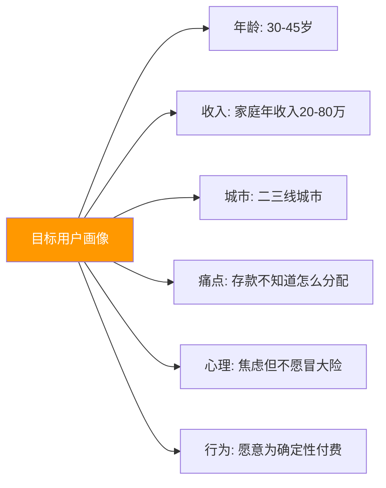
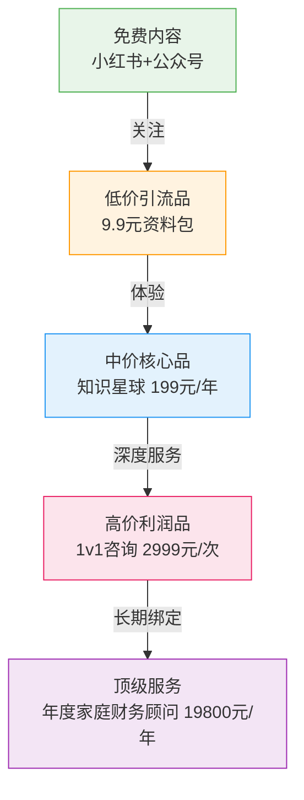
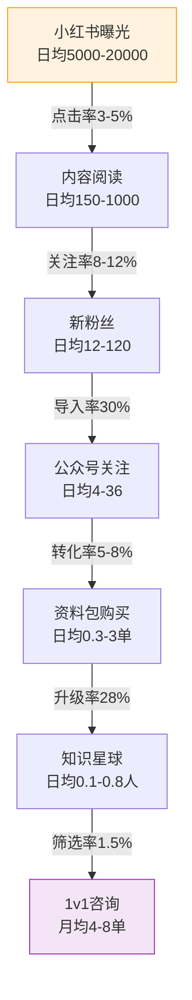
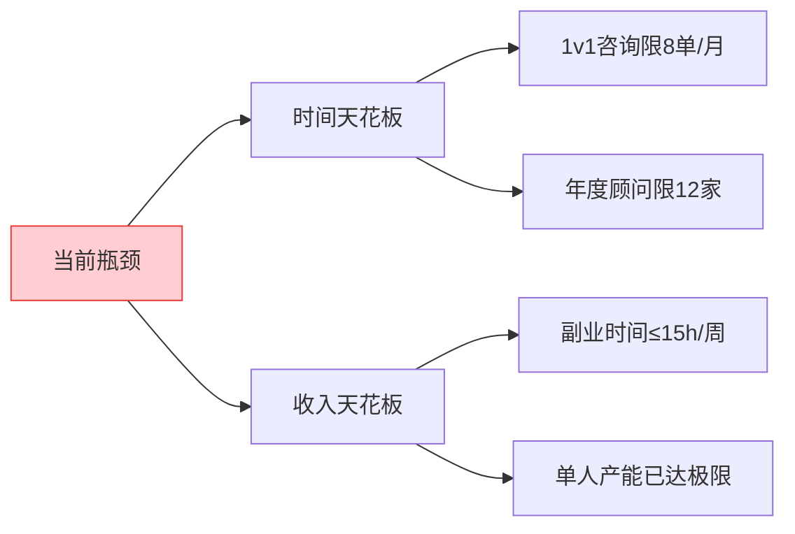

## 案例七：从0到月入5万的知识付费——财经博主老吴

> 老吴，35岁，二线城市某国企中层，经济学本科背景。2022年初开始在公众号和小红书输出理财科普内容，18个月后知识付费月收入稳定突破5万元。他的核心策略不是"成为大V"，而是"成为特定人群最信任的理财顾问"。

### 案例速览

| 维度 | 数据 |
|------|------|
| 启动时间 | 2022年初 |
| 达成月入5万 | 第18个月 |
| 核心平台 | 小红书（引流）+ 公众号（信任）+ 知识星球（变现） |
| 总粉丝量 | 小红书3.5万 + 公众号1.5万 |
| 知识星球成员 | 850人 |
| 月收入构成 | 知识星球28% + 1v1咨询47% + 年度顾问15% + 其他10% |
| 每周投入时间 | 约12-15小时（工作日每天1-2小时 + 周末半天） |
| 核心方法论 | "不做大V，做特定人群最信任的理财顾问" |

这个案例最值得学习的地方在于：**老吴不是天赋型选手，他的成功来自一套可拆解、可复制的系统方法论**。以下逐层拆解。

### 一、起点：一个普通上班族的困境与觉醒

#### 1.1 背景画像

| 维度 | 具体情况 |
|------|----------|
| 年龄/职业 | 35岁，国企中层管理，年薪约18万 |
| 专业背景 | 经济学本科，CPA考过3门，有一定财务基础 |
| 可用时间 | 工作日晚上1-2小时，周末半天 |
| 初始资源 | 零粉丝、零内容积累、零变现经验 |
| 核心动机 | 副业收入对冲职场不确定性，同时把专业知识变现 |
| 技术能力 | 不会剪视频、不会写代码，但Excel很熟练 |
| 性格特点 | 偏内向，不擅长社交，但逻辑思维强、善于总结 |

老吴的起点非常"普通"——没有颜值优势、没有镜头表现力、没有社交资源。但也正因如此，他的方法论对大多数普通人更有参考价值。

#### 1.2 赛道选择的思考过程

老吴在启动前花了整整一个月做调研，而不是盲目开干。他的决策逻辑如下：

**第一步：盘点自身能力**

他用一个简单矩阵评估自己的知识资产：

| 知识领域 | 专业度（1-10） | 市场需求（1-10） | 竞争强度（1-10） | 综合得分 |
|----------|---------------|-----------------|-----------------|----------|
| 宏观经济分析 | 6 | 5 | 8 | 中等 |
| 基金定投实操 | 7 | 9 | 7 | **高** |
| 家庭资产配置 | 8 | 9 | 5 | **最高** |
| 股票技术分析 | 4 | 8 | 9 | 低 |
| 税务筹划 | 5 | 7 | 6 | 中等 |

综合得分的计算逻辑：`综合得分 = 专业度 × 0.3 + 市场需求 × 0.4 - 竞争强度 × 0.3`。老吴认为，在"需求高、竞争低"的象限里，专业度只要超过6分就可以做——因为专业度可以通过持续学习补足，但市场机会窗口不等人。

他最终选择了"家庭资产配置"作为主赛道，原因有三：

- **需求刚性**：30-45岁中产家庭几乎都有这个痛点——手里有几十到几百万存款，但不知道怎么分配。这是焦虑感最强、付费意愿最高的群体
- **竞争壁垒**：需要真实的财务知识体系，不是随便抄几篇文章就能做的，天然挡住了纯流量型选手
- **变现路径清晰**：从免费科普→低价课程→高价咨询→长期顾问，阶梯式变现模型非常成熟，已被大量财经大V验证

**第二步：分析目标用户**

老吴没有笼统地定义"对理财感兴趣的人"，而是画出了精确的用户画像：



**关键洞察**：这个画像的精准度决定了后续所有内容的转化效率。"二三线城市中产"和"一线城市高净值人群"的理财需求完全不同——前者需要的是"手把手告诉你买什么、配多少"，后者需要的是"资产隔离、税务优化、跨境配置"。老吴选择前者，因为竞争对手少、用户付费决策链短。

**第三步：竞品拆解**

他找了15个同赛道账号，逐一分析：

| 分析维度 | 关注要点 | 老吴的发现 |
|----------|----------|-----------|
| 内容结构 | 免费内容和付费内容的比例如何分配？ | 头部账号免费内容占70-80%，但深度不够 |
| 变现方式 | 是卖课、卖社群、还是卖咨询？ | 80%只做课程，社群和咨询是空白 |
| 定价区间 | 低价引流品多少？高价利润品多少？ | 低价品9.9-99元，高价品2000-5000元 |
| 更新频率 | 每周几更？内容生产效率如何？ | 中腰部博主每周1-2更，头部日更 |
| 互动质量 | 评论区是真讨论还是水军？ | 中腰部账号互动质量远高于头部 |
| 差异化点 | 他有什么是别人没有的？ | 几乎没有人展示自己的实盘配置 |
| 粉丝画像 | 粉丝年龄段、城市分布？ | 头部账号粉丝偏一线城市，二三线渗透率低 |

通过这个分析，老吴发现了市场空白：大多数财经博主面向的是一线城市高净值人群，内容偏宏观和高端；而二三线城市中产家庭的"接地气资产配置"需求，几乎没有人在认真服务。

**竞品分析的实操工具**：

| 工具 | 用途 | 免费/付费 |
|------|------|----------|
| 新榜/西瓜数据 | 查看公众号/小红书账号的数据表现 | 基础功能免费 |
| 飞瓜数据 | 抖音/小红书账号分析、热门内容追踪 | 付费（约300元/月） |
| 5118 | 关键词挖掘、内容需求分析 | 基础功能免费 |
| 微信指数 | 判断话题热度和趋势 | 免费 |
| 百度指数 | 搜索需求分析、人群画像 | 免费 |

### 二、冷启动：从0到1000粉丝的90天

#### 2.1 内容定位：一句话说清你是谁

老吴给自己的账号写了一句定位语：

> "帮二三线城市中产家庭，用最少的时间搞明白钱该怎么分。"

这个定位的价值在于：

- **人群明确**：不是所有人，是二三线城市中产——直接排除了一线白领和低收入群体，内容可以更聚焦
- **场景具体**：不是泛泛的理财，是"钱该怎么分"——这暗示了一个具体问题的解决方案，而不是一个模糊的知识领域
- **利益清晰**：用最少的时间——暗示内容简洁实用，不需要用户花大量精力学习

**定位自检清单**（老吴的验证方法）：

1. 你能在5秒内向一个陌生人解释清楚你是做什么的吗？
2. 目标用户听到这句话，会不会立刻觉得"这说的就是我"？
3. 这个定位能支撑从免费内容到付费服务的完整产品线吗？
4. 这个定位和头部竞品有明确区分吗？

#### 2.2 内容矩阵设计

老吴没有一上来就做长文，而是设计了一个三层内容矩阵：

| 层级 | 内容类型 | 目的 | 平台 | 频率 | 单篇投入时间 |
|------|----------|------|------|------|-------------|
| 引流层 | 短图文/短视频 | 吸引新用户关注 | 小红书 | 每天1条 | 15-30分钟 |
| 信任层 | 深度长文 | 建立专业形象 | 公众号 | 每周2篇 | 2-3小时/篇 |
| 变现层 | 课程/咨询 | 直接产生收入 | 知识星球/小鹅通 | 按节奏推出 | 视内容而定 |

**引流层内容的创作方法：**

老吴发现，小红书上最容易爆的理财内容格式是"清单体"，例如：

- 「月薪1万，每月应该这样分配」
- 「家庭存款超过30万，一定要做的5件事」
- 「2023年最值得定投的3只指数基金」

这类内容的共同特征：有具体数字、有明确行动、有紧迫感。老吴坚持每天写一条，每条控制在300字以内，配一张自己用Canva做的信息图。

**小红书爆款标题公式**（老吴总结的6种模板）：

| 公式类型 | 模板 | 示例 |
|----------|------|------|
| 数字+利益 | [数字]个[动作]，让你[具体好处] | 3个存钱习惯，让你一年多存3万 |
| 场景+方案 | [具体场景]怎么办？[方案] | 月入8000想买房？这样规划3年攒够首付 |
| 身份+痛点 | [身份]必看：[痛点]的真相 | 30岁上班族必看：你的存款正在贬值 |
| 对比+颠覆 | [常见做法]是错的，正确做法是… | 每月存银行是错的，这样存收益高3倍 |
| 清单+紧迫 | [年份]年最值得做的[N]件事 | 2024年中产家庭最该做的5件事 |
| 故事+数据 | 他/她用[方法]，[具体成果] | 她用这个方法，3年存够了孩子教育金 |

**信任层内容的创作方法：**

公众号长文才是真正的"信任构建器"。老吴的长文模板是：

```text
标题：[具体场景] + [具体数字] + [结论/方法]

结构：
1. 用一个真实案例开头（脱敏处理后的客户故事）
2. 分析这个案例背后的底层逻辑
3. 给出具体可执行的步骤（3-7步）
4. 列出常见误区和纠正方法
5. 末尾放一个"思考题"引发互动
```

例如，他写过一篇《一个三线城市双职工家庭，如何用100万构建"睡后收入"系统？》，全文4200字，详细拆解了一个真实案例的家庭资产配置方案，包括具体买了什么基金、配了多少比例、为什么这样配。这篇文在公众号获得了2800阅读，直接带来了87个知识星球的付费用户。

**公众号长文的写作节奏**（老吴的时间分配）：

| 阶段 | 时长 | 具体工作 |
|------|------|----------|
| 选题+大纲 | 20分钟 | 确定主题、列出核心论点和案例 |
| 资料收集 | 30分钟 | 搜集数据、整理案例素材 |
| 初稿撰写 | 60分钟 | 按模板填充内容，不追求完美 |
| 数据核实 | 15分钟 | 核对所有数字、收益率、政策引用 |
| 润色排版 | 20分钟 | 添加小标题、表格、重点标注 |
| 总计 | 约2.5小时 | 产出一篇3000-5000字的深度文章 |

#### 2.3 冷启动期的数据表现

| 时间节点 | 小红书粉丝 | 公众号粉丝 | 知识星球成员 | 月收入 | 关键动作 |
|----------|-----------|-----------|-------------|--------|----------|
| 第1个月 | 120 | 45 | 0 | 0元 | 每天发小红书，内容还在摸索期 |
| 第2个月 | 580 | 180 | 12 | 576元 | 推出9.9元资料包，开始有付费用户 |
| 第3个月 | 1,400 | 420 | 38 | 1,824元 | 第一篇爆款长文出现，知识星球破冰 |
| 第6个月 | 5,200 | 1,800 | 156 | 7,488元 | 内容矩阵稳定运转，推出1v1咨询 |
| 第12个月 | 18,000 | 6,500 | 520 | 31,200元 | 咨询服务月均4-6单，年度顾问启动 |
| 第18个月 | 35,000 | 15,000 | 850 | 51,000元 | 所有产品线成熟，收入突破5万 |

**冷启动期的心理变化**（老吴的真实感受）：

| 阶段 | 心理状态 | 常见陷阱 | 老吴的应对 |
|------|----------|----------|-----------|
| 第1-2周 | 兴奋、充满动力 | 期望过高，发了5条没火就焦虑 | 给自己定了"先发100条再说"的底线 |
| 第1个月 | 开始怀疑 | 看到竞品做得更好，想换赛道 | 回顾竞品分析，确认赛道选择正确 |
| 第2个月 | 有点麻木 | 为了数据开始追热点、偏离定位 | 定位检查：每条内容必须和"家庭资产配置"相关 |
| 第3个月 | 看到曙光 | 第一次有爆款，想all in做爆款 | 坚持日常内容节奏，爆款只是"加分项" |
| 第4-6个月 | 信心建立 | 忙于回复咨询，忽视内容更新 | 设定固定内容时间，其他时间不处理工作 |

### 三、变现体系：从月入5千到月入5万的关键跃迁

#### 3.1 产品阶梯设计

老吴的变现不是单一产品，而是一个精心设计的"漏斗阶梯"：



**产品阶梯的设计原则**：

1. **每一级都有独立价值**：用户即使不升级，也能从当前层级获得完整价值
2. **升级动力来自"未满足的需求"**：低价产品故意留下"个性化"缺口，引导用户升级
3. **价格跳跃合理**：每一级大约是上一级的5-10倍，符合"锚定效应"
4. **稀缺性设计**：高价产品限名额，既保证服务质量又制造紧迫感

**各层级产品详情：**

**① 低价引流品（9.9元资料包）**

| 要素 | 具体内容 |
|------|----------|
| 产品形态 | PDF电子书 + 配套Excel模板 |
| 内容 | 《中产家庭资产配置实操手册》38页 |
| 核心价值 | 一套即拿即用的资产诊断表，填入自家数据就能出配置建议 |
| 转化路径 | 购买后自动引导加入知识星球 |
| 转化率 | 约28%购买者会升级到知识星球 |
| 制作成本 | 一次性投入约40小时（编写+排版+设计） |
| 月均销量 | 80-180份 |

资料包的结构设计（这是转化率28%的关键）：

```text
第1-10页：资产配置的底层逻辑（展示专业度）
第11-20页：5个真实案例的完整拆解（建立信任感）
第21-30页：资产诊断表+配置建议模板（提供实用工具）
第31-35页：常见误区TOP10（引发共鸣）
第36-38页：进阶指南+知识星球入口（制造"未完成感"）
```

关键设计：最后3页的内容故意"点到为止"——比如"不同风险偏好的详细配置方案，请见知识星球专题帖"。这不是"割韭菜"，而是让用户自然意识到"免费/低价内容能解决基础问题，但个性化需求需要更深入的服务"。

**② 中价核心品（知识星球199元/年）**

这是老吴收入的"基本盘"，占总收入的28%。星球的核心价值：

- **每周3次深度解读**：基金季报解读、市场热点分析、政策影响评估
- **每月1次直播答疑**：回答成员提出的家庭财务问题（每次90分钟，提前收集问题）
- **配置实盘展示**：老吴公开自己家庭的资产配置（脱敏），用真金白银验证方法论
- **成员互助社区**：成员之间分享理财经验和踩坑教训
- **资料库持续更新**：每季度更新基金筛选工具、配置模板等实用资源

**知识星球定价策略**（老吴的迭代过程）：

| 阶段 | 定价 | 效果 | 调整原因 |
|------|------|------|----------|
| 初始（第2个月） | 月付29.9元 | 转化尚可，但续费率低 | 月付用户没有沉淀感 |
| 调整（第5个月） | 年付199元 | 续费率提升，但初期转化下降 | 年付门槛更高，需要更强的信任 |
| 最终方案 | 年付199元 + 限时月付39.9元 | 两种方式并行，整体最优 | 给犹豫的用户一个"试用入口" |

**③ 高价利润品（1v1咨询2999元/次）**

每次咨询90分钟，包含：

1. **前期诊断**（咨询前3天）：用户填写详细的家庭财务问卷（47个问题），老吴提前分析
2. **面谈环节**（60分钟）：视频一对一，针对具体问题给出建议
3. **方案输出**（咨询后3天）：输出一份15-20页的《家庭资产配置建议书》
4. **30天跟踪**：咨询后30天内，通过微信跟进执行情况，主动询问3次

这个产品每月限8个名额，既保证服务质量，又制造了稀缺感。

**咨询问卷的47个问题框架**（部分展示）：

| 模块 | 问题数 | 示例问题 |
|------|--------|----------|
| 基本信息 | 5题 | 年龄、婚姻状况、子女数量和年龄 |
| 收入结构 | 6题 | 夫妻双方月收入、年终奖、副业收入、公积金 |
| 负债情况 | 5题 | 房贷余额、利率、剩余年限、车贷、信用卡 |
| 现有资产 | 8题 | 存款分布、基金持仓、股票账户、保险清单 |
| 风险偏好 | 6题 | 最大可承受亏损比例、投资期限、流动性需求 |
| 家庭规划 | 8题 | 子女教育计划、购房计划、养老预期、父母赡养 |
| 保险保障 | 5题 | 已有保险类型、保额、家庭经济支柱保障缺口 |
| 特殊情况 | 4题 | 是否有创业计划、继承预期、大额支出计划 |

**④ 年度顾问（19800元/年）**

最高端的服务，目前服务着12个家庭。包含：

- 每季度一次深度复盘（2小时），包括市场回顾、配置调整建议、目标修正
- 每月一次电话随访（30分钟），跟踪执行进度、解答日常疑问
- 重大市场变动时的即时提醒和应对建议（如2023年10月大跌时，24小时内发送应对方案）
- 全年不限次数的微信文字咨询
- 每年一次全面的家庭财务健康检查（含保险审计）

#### 3.2 关键转折点：从5千到5万的三次跃迁

**跃迁一：从免费到付费（第1-3个月）**

核心动作：推出9.9元资料包。老吴发现，哪怕只有9.9元，付费行为本身就是一个巨大的心理门槛。一旦用户付了第一笔钱，后续的付费意愿会大幅提升。关键指标：资料包月销从23份增长到180份。

**跃迁二：从单次付费到年度会员（第4-8个月）**

核心动作：将知识星球从"月付"改为"年付"，价格从月付29.9元（年化359元）降到年付199元。看似降价了，但年付锁定了用户的长期价值，退款率从月付的15%降到了年付的3%。同时老吴设计了"老会员续费8折"的机制，第二年续费率做到了72%。

**跃迁三：从线上到线下咨询（第9-18个月）**

核心动作：推出1v1咨询服务。老吴最初犹豫了很久，担心没人愿意花3000块跟一个"博主"咨询。但第一个月就收到了4个预约——这些人都是知识星球的活跃成员，已经通过半年的免费内容建立了充分信任。到第18个月，咨询服务月均收入约24000元（8单×2999元），成为最大的利润来源。

**每次跃迁的关键前提**：不是"想做就能做"，而是前一阶段已经积累了足够的信任资产。从免费到付费，需要内容证明专业度；从低价到高价，需要服务证明价值。

#### 3.3 月收入5万的构成拆解

| 收入来源 | 月均收入 | 占比 | 工作量占比 | 单位时间收益 |
|----------|---------|------|-----------|-------------|
| 知识星球年费（850人×199元÷12） | 14,100元 | 28% | 35% | 403元/小时 |
| 1v1咨询（8单×2999元） | 23,992元 | 47% | 25% | 960元/小时 |
| 年度顾问（12人×19800元÷12） | 19,800元 | 15% | 20% | 990元/小时 |
| 资料包/小课程零售 | 3,108元 | 6% | 5% | 622元/小时 |
| 公众号广告/软文合作 | 2,000元 | 4% | 5% | 400元/小时 |
| **合计** | **约51,000元** | **100%** | **-** | **平均680元/小时** |

注意一个反直觉的现象：知识星球人数最多但收入占比不是最高的；1v1咨询虽然只有8单，但贡献了近一半收入。这就是"高价低频"的力量——不需要很多客户，只需要服务好少数愿意付费的人。

**收入构成的健康度分析**：

老吴的收入结构有一个值得学习的特征：**没有单一来源超过50%**。这意味着任何一条产品线出问题（比如知识星球遭遇退款潮、咨询预约量下降），都不会导致收入崩盘。健康的知识付费收入结构建议：最大单一来源不超过50%，前两大来源合计不超过80%。

### 四、内容创作的实操方法论

#### 4.1 选题系统：永不缺素材的秘密

老吴建立了一个"选题银行"系统，确保永远不缺可写的内容：

**选题来源一：用户真实问题**

知识星球里每天都有成员提问，老吴把高频问题整理成选题库：

| 用户问题 | 转化选题 | 内容形式 | 预估阅读量 |
|----------|----------|----------|-----------|
| "房贷要不要提前还？" | 《提前还房贷的决策公式：3个变量决定一切》 | 公众号长文 | 3000-5000 |
| "孩子教育金怎么存？" | 《从出生到大学毕业，教育金规划全攻略》 | 小红书系列 | 单篇1000-3000 |
| "基金亏了20%怎么办？" | 《基金亏损时的5种应对策略，第3种最实用》 | 短视频 | 5000-15000 |
| "要不要买年金险？" | 《年金险的真实收益率计算：看完再决定》 | 公众号长文 | 4000-8000 |
| "夫妻收入差距大怎么管钱？" | 《AA制还是共同账户？3种家庭管钱模式对比》 | 小红书图文 | 2000-5000 |

**选题来源二：热点事件解读**

市场热点是天然的流量入口。老吴的做法是：

- 重大政策发布后2小时内出解读（先发小红书短图文抢时间）
- 24小时内出公众号深度分析（补充数据和底层逻辑）
- 48小时内出知识星球专题讨论（引导成员互动）

**热点响应的时间窗口**：

| 平台 | 黄金时间窗口 | 超过此时效性衰减 |
|------|-------------|-----------------|
| 小红书 | 2小时内 | 12小时后流量降50% |
| 公众号 | 24小时内 | 48小时后打开率降30% |
| 知识星球 | 48小时内 | 72小时后互动量降40% |

**选题来源三：定期系列内容**

固定栏目的好处是降低用户的认知成本，形成"追更"习惯：

- **周一**：「本周市场速览」——5分钟了解上周市场发生了什么
- **周三**：「实操拆解」——一个具体的理财工具或策略的详细教程
- **周五**：「踩坑复盘」——一个真实的理财失败案例分析

**选题来源四：跨领域嫁接**

老吴会从非财经领域寻找选题灵感：

| 嫁接领域 | 选题示例 | 为什么有效 |
|----------|----------|-----------|
| 心理学 | 《为什么你总是"月底光"？行为经济学的3个解释》 | 让用户理解"为什么" |
| 职业规划 | 《不同职业阶段的资产配置策略：从入职到退休》 | 贴近用户实际生活 |
| 婚姻家庭 | 《结婚前必须聊清楚的5个财务问题》 | 引发情感共鸣 |
| 教育 | 《学区房vs教育基金：哪个回报率更高？》 | 家庭核心焦虑点 |
| 健康 | 《一场大病花多少钱？家庭应急资金的正确计算方式》 | 恐惧驱动行动 |

#### 4.2 写作效率：每天1小时产出1条内容

老吴不是全职博主，他必须在有限时间内高效产出。他的效率系统：

**模板化写作**

每种内容类型都有固定模板，写作时只需要填充内容，不需要从零构思结构：

```markdown
# 小红书短图文模板

## 标题公式
[数字] + [目标人群] + [具体好处]
示例：月薪8000的上班族，这3个存钱习惯让你一年多存3万

## 正文结构
1. 痛点共鸣（1句话）——"每个月工资到手就花光？"
2. 方法清单（3-5个点，每个点2-3句话）——具体到动作级别
3. 实操细节（具体的数字或步骤）——"每月发工资当天自动转2000到XX"
4. 互动引导（1个问题）——"你每月能存下多少？评论区告诉我"

## 配图要求
- 尺寸：3:4竖版
- 风格：简洁信息图，白底+品牌色
- 工具：Canva，使用固定模板
```

**素材复用**

一篇深度长文可以拆解为：

- 3-5条小红书短图文（从不同角度切入）
- 1条短视频脚本（提取核心观点）
- 1个知识星球讨论帖（引导成员互动）
- 课程的一个小节（沉淀为付费内容）

这样算下来，一篇4000字的长文可以产出8-10条不同平台的内容。老吴的"一鱼多吃"流程：

```text
1. 写公众号长文（4000字）
   ↓
2. 提取3个核心观点 → 3条小红书短图文
   ↓
3. 把案例部分浓缩 → 1条短视频脚本
   ↓
4. 把数据部分独立 → 1条知识星球数据帖
   ↓
5. 把实操步骤独立 → 1条知识星球教程帖
   ↓
6. 把完整内容归档 → 课程素材库
```

**批量生产**

老吴把内容创作集中在周末：

| 时间段 | 任务 | 产出 |
|--------|------|------|
| 周六上午 9:00-11:00 | 选题规划 + 资料收集 | 本周5条选题大纲 |
| 周六下午 14:00-16:00 | 写2篇公众号长文 | 2篇约8000字 |
| 周日上午 9:00-10:30 | 拆解为小红书短图文 | 6-8条短内容 |
| 周日上午 10:30-11:00 | 排版、配图、发布 | 全部就绪 |

工作日晚上只需要30分钟：回复评论 + 发布预设好的内容。

#### 4.3 案例写作方法：让数据说话

老吴最受欢迎的内容都是"案例拆解"类。他的写法有一个核心原则：**所有数字必须具体到个位**。

对比两段话：

> ❌ "一个家庭通过合理配置资产，实现了财富的稳健增长。"
>
> ✅ "张先生家庭，夫妻双方月收入合计2.1万，现有存款67万。其中20万买了货币基金（年化2.1%），30万配置了沪深300指数基金（每月定投5000元），10万买了纯债基金（年化4.3%），剩余7万留在银行活期作为紧急备用金。一年后，投资组合整体收益约3.2万元，收益率约4.8%。"

第二种写法之所以有效，是因为读者可以立刻代入自己的情况，对比差距，产生"我也要这样做"的冲动。

**案例写作的"STAR"框架**：

| 要素 | 含义 | 写作要求 |
|------|------|----------|
| S（Situation） | 背景 | 具体到收入、城市、家庭结构、存款金额 |
| T（Task） | 问题 | 他们面临的具体财务困境是什么 |
| A（Action） | 行动 | 给出了什么配置方案，每一步怎么操作 |
| R（Result） | 结果 | 一年后的实际收益，用数字说话 |

#### 4.4 AI辅助内容生产

老吴在第6个月开始引入AI工具，大幅提升生产效率：

| 环节 | AI工具 | 用途 | 效率提升 |
|------|--------|------|----------|
| 选题挖掘 | ChatGPT/Claude | 分析用户提问中的高频主题 | 选题规划时间减少60% |
| 初稿生成 | ChatGPT/Claude | 根据大纲生成初稿 | 写作时间减少40% |
| 数据核实 | AI搜索+人工交叉验证 | 快速找到政策原文和数据来源 | 资料收集时间减少50% |
| 配图设计 | Canva AI | 一键生成信息图模板 | 配图时间减少70% |
| 多平台改写 | AI改写 | 将长文自动拆解为不同平台格式 | 分发效率提升3倍 |
| 评论回复 | AI辅助 | 生成回复建议，人工审核后发送 | 回复效率提升50% |

**关键原则：AI辅助，人工把关**。老吴所有涉及具体数字、基金推荐、政策解读的内容，都必须人工核实。AI生成的内容只作为初稿，最终发布前至少过两遍：一遍查事实，一遍改语气。

**AI使用红线**：

- 绝不让AI直接生成收益率预测或投资建议
- 涉及具体基金代码的内容必须人工核实
- 用户的个性化财务建议绝不使用AI模板
- 所有AI辅助生成的内容标注"内容经人工审核"

### 五、用户增长的底层逻辑

#### 5.1 流量漏斗模型

老吴的增长不是"爆发式"的，而是稳定的"阶梯式"增长，每一步都有清晰的数据指标：



关键指标解读：

- **关注率8-12%**：在小红书算中上水平，得益于老吴的内容垂直度高
- **导入率30%**：从小红书导流到公众号的比例，通过"私信领取资料"实现
- **转化率5-8%**：公众号粉丝到购买资料包的比例，通过文末引导实现
- **升级率28%**：资料包用户到知识星球的比例，通过资料包末尾的"进阶引导"实现

**每个环节的优化方法**：

| 环节 | 行业均值 | 老吴的数据 | 优化手段 |
|------|----------|-----------|----------|
| 小红书点击率 | 2-3% | 3-5% | 封面图用数字+对比色标题 |
| 小红书关注率 | 3-5% | 8-12% | 每篇末尾固定关注引导语 |
| 公众号导入率 | 10-15% | 30% | 免费资料作为钩子，私信领取 |
| 资料包转化率 | 2-3% | 5-8% | 文末"免费不够用"的痛点描述 |
| 知识星球升级率 | 15-20% | 28% | 资料包末尾3页"未完成感"设计 |

#### 5.2 内容分发策略

同一个核心观点，老吴会根据平台特性调整表达方式：

| 平台 | 内容特点 | 字数/时长 | 核心指标 | 发布时间 |
|------|----------|----------|----------|----------|
| 小红书 | 视觉化、清单体、情绪化 | 200-400字 + 信息图 | 点赞+收藏 | 早7-8点、中12-13点、晚20-22点 |
| 公众号 | 深度、逻辑、数据支撑 | 2000-5000字 | 阅读完成率 | 晚20-21点 |
| 知识星球 | 实操、互动、独家 | 500-1500字 | 评论互动率 | 不限 |
| 视频号 | 口播、场景化、60秒内 | 1-3分钟 | 完播率 | 晚19-21点 |

**平台算法优化要点**：

**小红书**：
- 封面图决定80%的点击率，必须有数字和对比色
- 正文第一句话决定完读率，开头必须直击痛点
- 收藏率 > 点赞率 > 评论率（小红书的权重排序）
- 带话题标签3-5个，精准标签 > 热门标签

**公众号**：
- 标题决定打开率，数字+场景+悬念效果最好
- 推送时间：晚8-9点打开率最高（对标用户下班后的阅读习惯）
- 二级推文用于导流到知识星球
- 评论区精选高质量互动，引导讨论

#### 5.3 避开的增长误区

老吴在冷启动期犯过几个错误，后来逐一纠正：

**误区一：追求粉丝数量**

早期老吴花了两个月做"泛财经内容"（追热点、写段子），粉丝涨到了3000，但转化率极低（不到0.5%）。后来他切换到垂直内容，粉丝增长变慢了，但转化率提升到了5%以上。

**教训**：1000个精准粉丝 > 10000个泛粉丝。

**误区二：过度依赖单平台**

2023年小红书算法调整，老吴的小红书流量一度下降了60%。幸好他已经把核心用户沉淀到了公众号和知识星球，影响有限。

**教训**：公域平台是"租来的地盘"，私域才是"自己的房子"。

**误区三：免费内容太多**

老吴曾经在公众号放了大量免费的深度内容，导致用户觉得"免费的就够了"，付费转化很低。后来他把深度内容拆分成两部分：前半部分免费（展示专业度），后半部分放入知识星球（提供完整方案）。

**教训**：免费内容的价值是"让用户相信你能解决问题"，而不是"直接帮他解决问题"。

**误区四：忽视互动质量**

初期老吴把大量时间花在"写更多内容"上，忽视了评论区的互动。后来他发现，一条认真回复的评论，比一篇新文章更能建立信任。他把每天的"互动时间"从10分钟增加到30分钟，知识星球的续费率从58%提升到72%。

**教训**：信任不是"写"出来的，而是"聊"出来的。

### 六、运营细节：那些决定成败的小事

#### 6.1 知识星球的运营节奏

| 动作 | 频率 | 具体做法 | 目的 |
|------|------|----------|------|
| 每日签到帖 | 每天 | 发一条市场快评（50字以内），保持活跃度 | 培养用户打开习惯 |
| 深度解读 | 每周3次 | 基金季报/政策分析/工具评测 | 提供核心价值 |
| 直播答疑 | 每月1次 | 提前收集问题，90分钟集中解答 | 增强互动和归属感 |
| 新人欢迎 | 实时 | 新成员加入后24小时内发欢迎消息+使用指南 | 降低流失率 |
| 季度复盘 | 每季度 | 总结过去3个月的市场变化和配置调整建议 | 长期价值交付 |
| 年度总结 | 每年 | 全年市场回顾+次年配置建议+成员数据报告 | 续费锚点 |

**新人欢迎消息模板**：

```text
欢迎加入！我是老吴，这是你的使用指南：

📌 快速上手：
1. 先看置顶帖《星球导航》，了解内容分区
2. 下载资料库里的「资产诊断表」，先做自我评估
3. 在「新人报到」帖子里介绍一下自己的情况

📌 你将获得：
- 每周一/三/五：市场分析+实操教程
- 每月最后一个周六：直播答疑
- 不限次数的帖子提问

📌 小提示：
大胆提问！你的问题很可能也是其他成员的困惑
```

#### 6.2 客户服务的"超预期"设计

老吴的1v1咨询服务之所以能做到72%的复购率（年度顾问），核心在于"超预期"：

- **咨询前**：提前3天发问卷，问卷有47个问题，覆盖收入、支出、负债、保险、投资、未来规划等所有维度。用户填完问卷本身就是一个"自我梳理"的过程
- **咨询中**：不是照本宣科，而是根据问卷发现的"关键矛盾点"重点讨论
- **咨询后**：方案不是一页纸的建议，而是一份15-20页的《家庭资产配置建议书》，包含具体的基金代码、买入比例、操作时间表
- **跟踪期**：30天内主动问3次"执行得怎么样了？"，而不是等用户来找你

**超预期设计的心理学原理**：

| 原理 | 应用 |
|------|------|
| 锚定效应 | 用户预期"聊聊天给点建议"，收到20页方案书 → 超出预期 |
| 损失厌恶 | 30天跟踪提醒 → 用户不想"浪费"已购的服务 |
| 社会认同 | 方案书中引用同类家庭的配置案例 → "别人也是这样做的" |
| 承诺一致性 | 问卷填写 → 用户投入了时间，更倾向于执行建议 |

#### 6.3 风险控制与合规

做财经内容，最大的风险是"翻车"。老吴的风控体系：

| 风险类型 | 具体场景 | 应对措施 | 严重程度 |
|----------|----------|----------|----------|
| 推荐亏损 | 用户按建议买入后亏损 | 永远不推荐具体股票，只讲配置方法和指数基金 | ⚠️ 高 |
| 政策违规 | 被认定为"非法荐股" | 不承诺收益，所有内容标注"不构成投资建议" | 🔴 极高 |
| 用户投诉 | 用户不满意要求退款 | 咨询服务设有7天无理由退款条款 | ⚠️ 中 |
| 内容抄袭 | 被指控使用他人案例 | 所有案例做脱敏处理，关键数据做模糊化 | ⚠️ 中 |
| 身份风险 | 被本职单位发现副业 | 用笔名运营，与本职工作完全隔离 | ⚠️ 中 |
| 税务风险 | 副业收入未申报 | 所有收入通过正规渠道走账，依法纳税 | 🔴 高 |

**必备的法律合规要素**：

1. **免责声明**：每篇涉及具体投资建议的内容，末尾必须加上"以上内容仅代表个人观点，不构成任何投资建议。投资有风险，入市需谨慎。"
2. **资质说明**：在账号简介中明确"非持牌投资顾问"，不使用"理财师""投资顾问"等暗示持牌的头衔
3. **内容留档**：所有发布的内容本地留档保存至少3年，以备可能的纠纷
4. **退款机制**：付费产品设置合理的退款条款，降低投诉风险
5. **隐私保护**：所有用户案例必须脱敏处理，不暴露任何可识别信息

**税务处理**（老吴的实际做法）：

| 收入渠道 | 税务处理方式 | 税率 |
|----------|-------------|------|
| 知识星球 | 平台代扣代缴 | 按劳务报酬计税 |
| 1v1咨询 | 个人收款→年度汇算清缴 | 按劳务报酬20-40% |
| 年度顾问 | 签订服务协议→开票 | 可考虑注册个体户，税率更低 |
| 公众号广告 | 平台代扣 | 按劳务报酬计税 |

老吴在第8个月注册了一个个体工商户，经营范围为"信息咨询服务"，年度收入通过个体户走账，享受小规模纳税人优惠政策，综合税率从约30%降到了约5%。

### 七、从5万到更高：老吴的突破路径

老吴目前的瓶颈在于"时间天花板"——1v1咨询和年度顾问都是用时间换钱。月入5万时，他的周均工作时间已经达到15小时，逼近副业可承受的上限。

#### 7.1 瓶颈诊断



#### 7.2 破局思路

**路径一：课程化（释放80%通用内容）**

| 产品 | 定价 | 内容 | 目标销量 |
|------|------|------|----------|
| 视频课程《中产家庭资产配置实战课》 | 999元 | 30节录播，覆盖80%常见问题 | 首年300份 |
| 小课《基金定投入门到进阶》 | 299元 | 15节录播，入门级 | 首年500份 |
| 小课《家庭保险配置全攻略》 | 199元 | 10节录播 | 首年400份 |

课程化的关键：**不是把咨询录下来**，而是把通用知识重新组织成课程体系。咨询只保留"个性化诊断"的部分，定价提升到3999元。

**路径二：团队化（培养2-3个助理）**

| 角色 | 职责 | 招聘条件 | 成本 |
|------|------|----------|------|
| 内容助理 | 知识星球日常运营、资料收集、初稿撰写 | 有财经背景、写作能力强 | 兼职4000元/月 |
| 咨询助理 | 初级咨询（简单问题解答、问卷整理） | 有理财规划经验 | 兼职3000元/月 |
| 运营助理 | 社群管理、数据统计、客服回复 | 细心、有服务意识 | 兼职2000元/月 |

**路径三：产品化（开发自助工具）**

开发"家庭财务健康诊断"小程序，用户自助填写数据后自动生成初步配置建议：

- 免费版：基础诊断+方向性建议
- 付费版（99元）：详细配置方案+基金推荐清单
- 这相当于把1v1咨询的"前期诊断"部分自动化，只保留最个性化的部分在咨询中

**路径四：IP化（从个人到品牌）**

| 阶段 | 目标 | 关键动作 |
|------|------|----------|
| 当前 | 个人IP（"老吴"） | 以个人身份运营，内容带个人风格 |
| 下一步 | 品牌化（"XX理财研究所"） | 注册商标，建立品牌视觉体系 |
| 未来 | 矩阵化（多IP） | 培养其他理财博主，形成MCN模式 |

#### 7.3 从5万到10万的收入预测

| 产品线 | 当前月收入 | 12个月后预估 | 增长来源 |
|--------|-----------|-------------|----------|
| 知识星球 | 14,100元 | 25,000元 | 成员增长到1500人 |
| 1v1咨询 | 23,992元 | 15,000元 | 部分需求被课程替代 |
| 视频课程 | 0元 | 30,000元 | 课程上线，被动收入 |
| 年度顾问 | 19,800元 | 30,000元 | 增加到18个家庭 |
| 小课+资料包 | 3,108元 | 8,000元 | 产品线扩充 |
| 合计 | 约61,000元 | 约108,000元 | 核心：课程化释放时间 |

### 八、可复制的关键经验

老吴的案例之所以有参考价值，是因为他的方法不依赖天赋、颜值或运气，而是一套可拆解、可学习、可复制的系统：

| 经验 | 具体做法 | 适用条件 | 常见误区 |
|------|----------|----------|----------|
| 选赛道要"窄而深" | 不做泛财经，只做家庭资产配置 | 有某个领域的专业知识 | 选得太窄没市场 |
| 冷启动要"小而美" | 前3个月只做小红书+公众号，不急着变现 | 有耐心等待3-6个月 | 没耐心，3个月就放弃 |
| 变现要"阶梯式" | 从9.9元到19800元，逐级筛选 | 内容质量能支撑高价 | 低价品质量太低 |
| 内容要"模板化" | 建立选题库+写作模板+素材复用系统 | 能坚持周末批量创作 | 模板僵化，缺乏个性 |
| 服务要"超预期" | 15页方案书+30天跟踪，超出用户预期 | 真的在乎服务质量 | 超预期=过度承诺 |
| 增长要"重私域" | 核心用户沉淀到公众号和知识星球 | 不追求短期爆发 | 私域=只发广告 |

**最后一点，也是最重要的一点**：老吴从第1个月到第18个月，没有一天停止过内容输出。不是因为他自律，而是因为他建立了一套"系统"——选题有模板、写作有流程、分发有节奏。当系统跑起来之后，坚持就变成了习惯，而不是意志力的消耗。

> 知识付费的本质不是"卖知识"，而是"卖确定性"。用户花199元进你的星球，花2999元找你咨询，不是因为你比他们懂得多，而是因为你给了他们一个"照着做就行"的确定性方案。在这个充满不确定性的时代，确定性本身就是最大的商品。

### 附录：老吴的工具清单

| 类别 | 工具 | 用途 | 费用 |
|------|------|------|------|
| 内容创作 | Canva | 信息图设计、封面制作 | 免费版够用 |
| 内容创作 | 飞书文档 | 长文写作、协作 | 免费 |
| 内容创作 | Notion | 选题库管理、素材归档 | 免费版 |
| 数据分析 | 新榜 | 公众号/小红书数据监控 | 基础免费 |
| 数据分析 | 百度指数 | 关键词热度分析 | 免费 |
| 分发平台 | 公众号 | 长文发布 | 免费 |
| 分发平台 | 小红书 | 短图文引流 | 免费 |
| 分发平台 | 知识星球 | 付费社群 | 平台抽成5% |
| 分发平台 | 小鹅通 | 课程售卖 | 基础版4800元/年 |
| 用户管理 | 微信 | 1v1咨询沟通 | 免费 |
| 用户管理 | 企业微信 | 客户标签管理 | 免费 |
| 财务管理 | 随手记 | 收入支出记录 | 免费 |
| AI辅助 | ChatGPT/Claude | 选题辅助、初稿生成 | 约200元/月 |
| 法务 | 合同模板 | 咨询服务协议 | 一次性约500元 |
