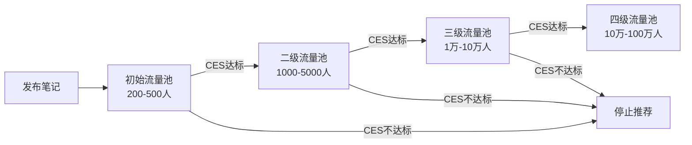
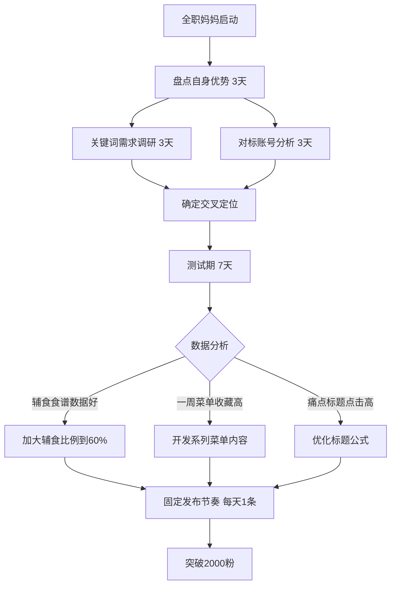

## 案例八：全职妈妈的小红书逆袭

> 她叫林悦（化名），31岁，全职妈妈，孩子2岁半。丈夫在二线城市一家民企做技术主管，家庭月收入约1.5万，房贷6000，奶粉尿布辅食2000，生活开销所剩无几。她想给孩子更好的教育、想有一份属于自己的收入、想在"妈妈"这个身份之外找回自我——但没有人脉、没有技能、每天只有孩子午睡后的2小时和晚上哄睡后的1小时。2024年3月，她用一部旧iPhone和一个免费的修图APP，在小红书发布了第一条"带娃辅食"笔记。8个月后，她的账号粉丝突破4.2万，月收入稳定在1.8-2.5万元之间，最高一个月达到3.2万。这不是一个"天赋异禀"的故事，而是一个普通妈妈通过系统化方法，把"带娃日常"转化为"可变现内容"的完整路径。

### 一、起点：一个全职妈妈的真实困境

#### 1.1 人物画像

| 维度 | 具体情况 |
|------|----------|
| 化名 | 林悦 |
| 年龄 | 31岁 |
| 学历 | 大专（会计专业） |
| 婚育状态 | 已婚，孩子2岁半 |
| 所在城市 | 二线城市（合肥） |
| 配偶收入 | 月薪约1.5万（税后） |
| 家庭月支出 | 约1.3万（房贷6000 + 生活开销7000） |
| 可投入时间 | 孩子午睡2小时（13:00-15:00）+ 晚间1小时（21:30-22:30） |
| 专业背景 | 无任何自媒体、摄影、运营经验 |
| 初始设备 | iPhone 12（二手购入）、免费APP（醒图、Canva） |
| 核心优势 | 辅食做得好、拍照有美感、表达真诚不做作 |

#### 1.2 启动前的心理状态

林悦做小红书之前的状态，几乎是全职妈妈群体的缩影：

- **经济焦虑**：每个月都在"算账"，给孩子买个早教玩具都要纠结半天，想买自己的护肤品要等双11
- **身份焦虑**：全职带娃两年多，和以前的同事朋友渐行渐远，社交圈缩小到"小区妈妈群"和"育儿APP"
- **能力焦虑**：投过几次简历，发现两年空白期让简历"不值钱"，会计证过期未续，面试被问"你这两年做了什么"时无言以对
- **价值焦虑**：丈夫从未说过"你不赚钱"，但她自己会在心里算"如果我出去工作，哪怕月薪5000，家里也能宽裕很多"
- **转折契机**：2024年2月，小区一个妈妈在小红书分享了一条自己做的"无糖溶豆"辅食笔记，意外获得了3000赞和200多条评论，还有品牌方私信要合作。林悦突然意识到——自己每天都在做的事情（做辅食、带娃、记录成长），竟然可以变成"内容"，还能赚钱

#### 1.3 全职妈妈为什么适合做小红书

林悦在启动前做了一周的调研，发现小红书对全职妈妈群体有独特的适配性：

| 维度 | 小红书适配性分析 | 对全职妈妈的意义 |
|------|------------------|-----------------|
| 内容形式 | 图文为主，不需要露脸、不需要剪辑视频 | 孩子突然哭闹可以随时中断，不像直播/视频有"连续性压力" |
| 生产门槛 | 手机拍照+简单修图即可 | 不需要专业设备，不需要学习复杂软件 |
| 算法逻辑 | 内容质量>粉丝量，新号有流量池 | 素人也有机会获得曝光，不靠"关系"和"资源" |
| 用户画像 | 70%+为女性，25-35岁为核心用户群 | 全职妈妈的内容天然对口目标用户 |
| 搜索流量 | 笔记长尾可达6-12个月 | 不需要每天追热点，一条好笔记可以持续带来流量 |
| 变现方式 | 品牌广告、好物推荐、知识付费、私域引流 | 多元变现路径，不依赖单一收入来源 |
| 时间灵活性 | 随时可以发，没有"最佳时段"的压力 | 可以完全按照自己的节奏来，配合孩子的作息 |

林悦选小红书的另一个重要原因是：**她本身就是一个真实的小红书用户**。从怀孕开始就在小红书搜"孕期食谱""待产包清单""婴儿辅食"，她了解这个平台的内容风格、用户喜好和搜索习惯——这比任何培训课程都有价值。

### 二、定位选择：从"妈妈日记"到"辅食+育儿干货"

#### 2.1 第一次定位尝试

林悦最初的定位是"记录带娃日常"，发了10条笔记，内容包括：带娃去公园、孩子第一次叫妈妈、做了一顿辅食、整理了待产包……结果：10条笔记总阅读量不到1500，最高一条28赞，评论区只有亲戚朋友捧场。

**失败原因分析：**

| 问题 | 具体表现 | 根本原因 |
|------|----------|----------|
| 内容像"朋友圈" | 带娃日常对别人没有信息增量 | 用户打开小红书是"找答案"，不是"看别人家孩子" |
| 选题太散 | 今天辅食、明天穿搭、后天早教 | 算法无法给账号打标签，不知道推给谁 |
| 缺乏"利他性" | 全是"我家宝宝怎么了"，没有"你可以怎么用" | 自说自话，没有从用户视角出发 |
| 没有差异化 | 成千上万的妈妈都在记录带娃日常 | 没有找到自己的独特价值点 |

这个阶段的失败其实非常典型。小红书的算法有一个核心机制——**账号标签匹配**。当你的内容方向太散时，系统无法判断你的账号属于哪个领域，自然无法精准推送给目标用户。每条笔记都会先进入一个200-500人的初始流量池，系统根据这批用户的互动数据（点赞、收藏、评论、完读率）决定是否推入更大的流量池。如果你的受众不精准，初始流量池里的用户对你的内容不感兴趣，互动数据就会很差，笔记就会"死"在第一轮。

#### 2.2 重新定位的三步法

林悦停下来，花了一周时间系统梳理定位。她没有报任何课程，完全用免费工具和自己的判断完成了这个过程。

**第一步：盘点"我有什么"**

她用一张A4纸列出了自己所有的"可输出内容"：

```text
我每天都在做的（习惯性能力）：
- 做三餐辅食（孩子从6个月开始吃辅食，已经做了一年半）
- 拍孩子吃饭的照片（觉得好看，经常发给家人看）
- 看育儿书和育儿博主的内容（每天至少1小时）

我被人夸过的（他人认可的能力）：
- "你做的辅食好好看"（小区妈妈群）
- "你拍的照片好好看"（朋友圈点赞多）
- "你家孩子吃得好好"（婆婆、妈妈、朋友都说过）

我愿意持续做的（兴趣驱动）：
- 研究各种辅食食谱
- 把食物摆盘好看
- 拍好看的食物照片
```

**第二步：分析"用户要什么"**

林悦在小红书搜索了"辅食"相关关键词，观察搜索结果和笔记数据。她用的方法很简单：在小红书搜索框输入关键词，观察下拉联想词（这些是用户高频搜索的真实需求），然后逐一查看搜索结果页的笔记数据。

| 搜索词 | 搜索结果数 | 笔记平均互动量 | 竞争判断 |
|--------|-----------|----------------|----------|
| 辅食 | 800万+ | 高 | 竞争激烈，但需求巨大 |
| 宝宝辅食 | 500万+ | 高 | 同上 |
| 辅食食谱 | 200万+ | 中高 | 具体需求，有搜索量 |
| 一岁宝宝辅食 | 120万+ | 中高 | 年龄细分需求明确 |
| 辅食做法简单 | 80万+ | 中 | "简单"是关键痛点 |
| **辅食摆盘** | **25万** | **中** | **竞争较小，视觉冲击力强** |
| **无糖辅食** | **15万** | **中** | **健康趋势，妈妈群体关注度高** |
| **辅食一周不重复** | **35万** | **中高** | **解决"每天做什么"的痛点** |

**关键词调研的进阶技巧：**

林悦后来总结了一套更系统的关键词挖掘方法，不只是靠搜索框联想：

1. **搜索框联想词**：输入核心词后，看下拉列表和"大家都在搜"板块，这些是平台验证过的高频需求
2. **笔记评论区**：看热门笔记的评论区，用户的提问就是真实的长尾需求。比如"这个适合多大的宝宝？""有没有不加鸡蛋的版本？"——这些都可以变成新的选题
3. **小红书"发现页"推荐**：系统推荐的内容代表了平台当前的流量趋势，观察推荐内容中反复出现的主题
4. **竞品账号的爆款笔记**：找到3-5个同赛道的对标账号，看他们哪些笔记数据最好，分析背后的选题逻辑
5. **季节/节日关键词**：春天的"开胃辅食"、夏天的"消暑辅食"、秋天的"润燥辅食"、冬天的"暖胃辅食"——季节性内容有天然的搜索高峰

**第三步：确定"交叉点"**

把"我有什么"和"用户要什么"交叉：

```text
我的优势：辅食制作 + 摆盘审美 + 真实带娃经验
用户需求：简单好看的辅食食谱 + 一周不重复的菜单 + 不同月龄的适配

交叉定位：
"帮0-3岁宝宝妈妈解决'今天做什么辅食'的焦虑"
```

#### 2.3 最终定位

> **"一个普通妈妈的辅食日记——每天15分钟，让宝宝吃得好看又营养"**

这个定位的拆解：

- **目标人群**：0-3岁宝宝的全职妈妈（时间少、厨艺一般、想给孩子最好的）
- **核心诉求**：简单（15分钟搞定）、好看（摆盘精美）、营养（有营养搭配逻辑）
- **差异化人设**：不是专业营养师，不是美食博主，而是"和你一样的普通妈妈，只是多了一点用心"

定位精妙之处：

1. **"15分钟"降低了门槛**：妈妈们最怕的是"看起来很好但太复杂"，"15分钟"直接消除畏难情绪
2. **"好看"建立了视觉壁垒**：辅食做得好吃是基础，做得好看才是小红书上的流量密码
3. **"普通妈妈"建立了信任**：用户会觉得"她能做到我也能做到"，比专业营养师更有亲近感
4. **"辅食日记"暗示了持续更新**：用户会期待"明天做什么"，形成追更习惯

#### 2.4 对标账号分析：向同行学习

定位确定后，林悦没有立刻开始发内容，而是花3天时间做了对标账号分析。她选了5个粉丝量在1万-10万之间的辅食类账号（不选太大的，因为大号的运营方法对新手不适用），逐条分析它们的爆款笔记。

**对标分析模板（林悦实际使用的）：**

| 分析维度 | 记录内容 | 林悦的发现 |
|----------|----------|-----------|
| 账号简介 | 怎么写人设、怎么引导关注 | 成功的辅食号都会在简介里写"XX个月宝宝妈妈"，建立身份认同 |
| 爆款标题 | 前10条高赞笔记的标题 | "一周菜单""宝宝不爱吃""5分钟搞定"是三个万能爆款标题模板 |
| 封面风格 | 图片构图、色调、文字标注方式 | 辅食赛道的爆款封面都是俯拍+白色/木纹背景+食物占60%画面 |
| 正文结构 | 文案的段落安排、信息密度 | 好的辅食笔记正文结构：食材清单→步骤→营养说明→注意事项→互动引导 |
| 评论区 | 用户最常问什么、博主怎么回复 | 高频问题：适合多大宝宝？可以替换XX食材吗？保存几天？ |
| 发布时间 | 什么时候发数据最好 | 母婴类内容在12:00-13:00（午休）和20:00-21:00（哄睡后）数据最好 |
| 更新频率 | 多久发一条 | 粉丝1万以下的号基本保持日更或隔日更 |

这个分析让林悦少走了很多弯路——她不需要自己"试错"去发现什么封面好看、什么标题吸引人，直接从同行的爆款数据中提炼规律。

### 三、冷启动阶段（第1-45天）：从0到2000粉

#### 3.1 理解小红书的流量分发机制

在进入具体内容策略之前，有必要先理解小红书的流量是怎么分配的，因为这直接决定了你的内容策略应该怎么设计。

**小红书的CES评分体系：**

小红书用一个叫CES（Community Engagement Score）的评分来决定一条笔记能获得多少曝光。CES的核心构成是：

```text
CES = 点赞(1分) + 收藏(1分) + 评论(4分) + 转发(4分) + 关注(8分)
```

注意权重差异：**评论和转发的权重是点赞的4倍，关注的权重是8倍**。这意味着什么？一条获得100赞但0评论的笔记，不如一条获得50赞+10评论的笔记获得的推荐流量多。这就是为什么林悦特别重视评论区互动——每多一条评论，就等于多了4个点赞的CES分值。

**流量池递进机制：**



每个流量池的停留时间约为24-48小时。如果一条笔记在初始流量池中的CES表现好（通常需要点赞率>3%、收藏率>5%、评论率>0.5%），系统会在24小时内把它推入二级流量池。如果二级流量池的数据依然好，继续推入三级，以此类推。

**这对内容策略的影响：**

- 前24小时的互动数据至关重要——发布后的2小时内是"黄金时间"
- 收藏率在辅食赛道特别重要，因为用户收藏辅食笔记的动机是"以后照着做"
- 评论区互动直接影响CES——所以要在正文末尾和评论区引导用户留言
- 不要发完就走，发布后的30分钟内要积极回复评论

#### 3.2 内容矩阵设计

林悦没有盲目发内容，而是设计了一个"三类内容组合"：

```text
60% — 辅食食谱图文（核心内容，提供实用价值）
25% — 带娃实用技巧（扩展内容，覆盖更多搜索词）
15% — 妈妈成长/心路历程（人设内容，建立情感连接）
```

这个比例的设计逻辑：

- **辅食食谱是"流量款"**：搜索量大、收藏率高、容易被推荐
- **带娃技巧是"扩展款"**：拓宽账号的标签边界，让算法推给更多类型的用户
- **妈妈成长是"信任款"**：让用户觉得你是一个真实的人，而不仅仅是一个"辅食机器"

三类内容的协同效应：辅食食谱负责"拉新"（用户通过搜索找到你），带娃技巧负责"扩圈"（让算法把你推给更广泛的母婴用户），妈妈成长负责"留存"（让用户产生情感连接后主动关注）。如果只发辅食食谱，账号会变成一个"工具号"——用户收藏了但不关注，因为觉得"搜到了就够了"。加入人设内容后，用户会觉得"我想看这个妈妈接下来分享什么"，从而主动关注。

#### 3.3 第一周：测试期

林悦给自己定了规则：前7天每天发1条，测试什么内容做得顺手、什么内容数据好。

| 天数 | 笔记类型 | 内容主题 | 图片形式 | 数据 |
|------|----------|----------|----------|------|
| D1 | 辅食食谱 | "10个月宝宝的一日三餐" | 3张食物照片 | 45赞 |
| D2 | 带娃技巧 | "让孩子自己吃饭的5个小方法" | 5张步骤图 | 23赞 |
| D3 | 辅食食谱 | "南瓜蒸蛋——5分钟搞定的辅食" | 4张过程图 | 112赞 |
| D4 | 妈妈心路 | "全职妈妈的第3年，我想对过去的自己说" | 1张手写字 | 89赞 |
| D5 | 辅食食谱 | "宝宝不爱吃蔬菜？试试这3种隐藏法" | 6张对比图 | 234赞 |
| D6 | 辅食食谱 | "一周辅食菜单分享（12-18个月宝宝）" | 7张菜单图 | 367赞 |
| D7 | 带娃技巧 | "孩子哭闹时，这句话比'别哭了'管用100倍" | 3张图 | 156赞 |

**测试期关键洞察：**

1. **"一周菜单"类内容数据最好**：367赞，因为它解决了"每天做什么"这个高频痛点，用户会收藏"照着做"
2. **辅食食谱的整体表现优于其他类型**：点赞和收藏都更高
3. **"隐藏法"技巧类内容互动率最高**：解决了一个具体的"孩子不吃菜"的问题
4. **个人故事类虽然赞不高但评论最多**：评论区变成了妈妈们的"树洞"，有人分享自己的经历，情感连接很强
5. **"宝宝不爱吃"这类痛点标题比正面描述更吸引点击**

#### 3.4 第二到六周：建立爆款公式

根据测试数据，林悦总结出了自己的"辅食笔记爆款公式"：

**选题公式：**

```text
痛点/场景 + 年龄段 + 具体方案

示例：
- "宝宝不爱吃饭？" + "12-18个月" + "试试这5种手指食物"
- "每天不知道做什么？" + "1岁+" + "一周辅食菜单（附采购清单）"
- "上班族妈妈没时间？" + "6-12个月" + "周末批量做辅食的方法"
```

**图片公式：**

```text
第一张（封面）：成品图，食物占画面60%，背景简洁（白色/木纹桌面）
第二张：食材全家福（展示"只需要这些东西"的简单感）
第三到五张：制作过程的关键步骤（每步一张，不超过5张）
第六张：宝宝吃的照片（真实的、吃得开心的，增加信任感）
```

**封面图的具体拍摄规范：**

封面是决定笔记生死的第一道关。小红书的发现页是双列信息流，用户看到的只有封面图和标题，如果封面不吸引人，内容再好也没人点进来。林悦总结的封面拍摄规范：

| 要素 | 规范 | 原因 |
|------|------|------|
| 角度 | 俯拍（90度垂直） | 辅食俯拍最能展示食物全貌和摆盘 |
| 光线 | 窗边自然光，避免直射 | 自然光让食物颜色真实、有食欲感 |
| 背景 | 白色桌面或木纹桌垫 | 干净的背景让食物更突出 |
| 构图 | 食物占画面60%，留白40% | 太满显得拥挤，太空显得单薄 |
| 色彩 | 暖色调为主，饱和度微调+5 | 暖色调让食物更有食欲感 |
| 文字 | 2-4个大字，白色带阴影 | "一周菜单""5分钟搞定"等关键信息 |
| 避免 | 冷色调滤镜、过度修图、杂乱背景 | 冷色调让食物看起来不好吃，过度修图失去真实感 |

**标题公式库：**

| 模板 | 示例 | 适用场景 |
|------|------|----------|
| 宝宝X个月一定要吃的N种辅食 | 宝宝8个月一定要吃的8种补铁辅食 | 月龄营养需求 |
| 别再给宝宝吃X了！试试这个 | 别再给宝宝吃白粥了！这5种粥营养翻倍 | 纠正错误认知 |
| 一周辅食菜单分享（附采购清单） | 一周辅食菜单分享（18-24个月，附采购清单） | 解决"每天做什么" |
| 5分钟搞定的宝宝辅食 | 5分钟搞定的宝宝辅食——西兰花蛋饼 | 时间敏感型妈妈 |
| 宝宝辅食这样做，营养翻倍不浪费 | 宝宝辅食这样做，营养翻倍不浪费——巧用边角料 | 追求性价比的妈妈 |
| 宝宝X个月还不会Y？试试这个辅食 | 宝宝10个月还不会咀嚼？这3种辅食帮他练 | 发育焦虑型需求 |
| 儿科医生推荐的N种辅食 | 儿科医生推荐的6种高铁辅食 | 权威背书型需求 |

**正文结构模板：**

林悦后来把每条辅食笔记的正文固定成一个标准结构，写起来又快又规范：

```text
【开头】一句话点明这道辅食解决什么问题（15字以内）
示例："宝宝不爱吃菜？这道西兰花蛋饼他一口气吃了3个"

【食材清单】列出所有食材和用量，用emoji标注
🥦 西兰花 30g
🥚 鸡蛋 1个
🌾 低筋面粉 20g
💧 清水 15ml

【制作步骤】3-5步，每步一句话
① 西兰花焯水2分钟，切碎
② 鸡蛋打散，加入面粉和清水搅匀
③ 加入西兰花碎，搅拌均匀
④ 平底锅小火，舀一勺面糊摊成小饼
⑤ 两面煎至金黄即可

【营养说明】一句话说明营养价值
"西兰花富含维生素C和膳食纤维，鸡蛋提供优质蛋白，搭配面粉提供碳水化合物，营养均衡。"

【适合月龄+注意事项】
✅ 适合10个月以上宝宝
⚠️ 确保宝宝对鸡蛋和面粉不过敏
💡 可以把西兰花换成菠菜、胡萝卜等其他蔬菜

【互动引导】
"你家宝宝爱吃蔬菜吗？评论区告诉我～"
```

#### 3.5 突破性笔记：第一次"小爆款"

在第28天，林悦发了一条"宝宝一周辅食菜单（12-18个月，每天不重复）"：

```text
笔记数据：
- 标题："宝宝一周辅食菜单｜12-18个月｜每天不重复附采购清单"
- 形式：7张图（周一到周日每天一张菜单图）+ 最后一张采购清单
- 发布时间：周三下午14:00（孩子午睡后）
- 24小时数据：8000阅读，520赞，890收藏，45评论
- 7天累计：2.8万阅读，1800赞，3200收藏
- 涨粉：单条涨粉480
```

这条笔记爆的原因分析：

1. **"一周菜单"击中了核心痛点**：妈妈们最头疼的就是"每天给孩子做什么"
2. **"每天不重复"降低了收藏门槛**：用户觉得"收藏了这一条就够用一周"
3. **"附采购清单"提供了行动指南**：不是"看看就好"，而是"明天就能用"
4. **图片信息密度高**：每张图都是一个完整的菜单，用户可以截图保存
5. **12-18个月是辅食需求最旺盛的年龄段**：这个月龄的宝宝刚过渡到正常食物，妈妈们最焦虑

**第45天数据汇总：**

| 指标 | 数据 |
|------|------|
| 总粉丝 | 2,150 |
| 总笔记数 | 38条 |
| 平均阅读量 | 2,200/条 |
| 最高单条阅读 | 28,000 |
| 总点赞数 | 8,500+ |
| 总收藏数 | 12,300+ |
| 月收入 | 0元（尚未开始变现） |

#### 3.6 冷启动阶段的关键动作



### 四、成长阶段（第2-5个月）：从2000粉到3万粉

#### 4.1 内容策略升级

突破2000粉后，林悦的内容策略从"泛辅食"转向"精准流量+可变现内容"。

**升级一：系列化内容开发**

| 系列名称 | 内容方向 | 笔记数量 | 总阅读量 | 变现潜力 |
|----------|----------|----------|----------|----------|
| "一周辅食菜单" | 每周一更新，不同月龄版本 | 20条 | 85万 | 品牌广告（辅食工具/食材） |
| "5分钟辅食系列" | 快速简单的辅食做法 | 15条 | 42万 | 厨具品牌广告 |
| "宝宝不爱吃系列" | 解决挑食问题的具体方法 | 12条 | 38万 | 营养品/辅食品牌合作 |
| "辅食食材百科" | 不同食材的营养价值和做法 | 18条 | 55万 | 长尾搜索流量 |
| "妈妈的好物分享" | 真实使用体验推荐 | 10条 | 28万 | 好物带货佣金 |

系列化的价值：

- **降低选题成本**：按计划推进，不用每天想"今天写什么"
- **提升关注转化**：用户看到一个系列，会想"关注后看完整个系列"
- **增强搜索权重**：同一关键词下多条笔记，增加被搜索到的概率
- **自然承接品牌合作**：系列内容本身就是"广告位"，品牌方一看就知道合作方式

**升级二：建立标准化生产流程**

林悦把每条笔记的制作流程标准化，控制在1.5小时内：

```text
第一步：选题（10分钟）
- 从"选题库"中选一个（每周日提前规划好下一周的7个选题）
- 选题库来源：评论区高频提问、小红书搜索联想词、对标账号爆款

第二步：制作辅食（30分钟）
- 按照食谱实际做一遍
- 用手机记录每一步的过程（不需要精美的拍摄，抓拍即可）
- 顺便做一顿午饭/加餐，一举两得

第三步：拍摄成品（15分钟）
- 自然光拍摄（窗边）
- 白色/木纹桌面作为背景
- 摆盘：食物占画面60%，加一双小筷子/小勺子增加可爱感
- 拍3-5张选最好的一张做封面

第四步：图片处理（15分钟）
- 用"醒图"APP微调：亮度+10、对比度+5、饱和度+5
- 用"黄油相机"加文字标注（食材名称、步骤编号）
- 不要过度滤镜，保持食物的真实色彩

第五步：写标题和正文（20分钟）
- 标题：痛点/场景 + 年龄段 + 方案（18-22字）
- 正文：食材清单 + 制作步骤 + 营养说明 + 小贴士（300-500字）
- 标签：8-12个，包含月龄、食材名、功效关键词

第六步：发布（5分钟）
- 发布时间：中午12:00或晚上20:30（妈妈们刷手机的高峰）
- 发布后15分钟内回复前5条评论（提升互动率）
```

**标签策略的细节：**

林悦发现标签对搜索流量的影响很大。她的标签组合策略：

```text
标签 = 月龄标签(2-3个) + 食材标签(2-3个) + 痛点标签(2-3个) + 场景标签(1-2个)

示例（西兰花蛋饼）：
#10个月宝宝辅食 #12个月宝宝辅食 #辅食食谱
#西兰花辅食 #鸡蛋辅食 #宝宝辅食做法
#宝宝不爱吃蔬菜 #辅食简单做法 #辅食新手
#全职妈妈日常 #辅食日记
```

**升级三：数据复盘体系**

林悦从第2个月开始，每周日晚花20分钟做一次数据复盘：

| 指标 | 本周数据 | 上周数据 | 变化 | 分析 |
|------|----------|----------|------|------|
| 发布笔记数 | 7 | 7 | — | — |
| 总阅读量 | 35,000 | 28,000 | +25% | "一周菜单"系列带动 |
| 平均点赞率 | 3.8% | 3.2% | +0.6% | 封面图优化效果 |
| 平均收藏率 | 5.5% | 4.8% | +0.7% | 干货型内容增加 |
| 新增粉丝 | 620 | 480 | +29% | 系列内容涨粉效应 |
| 评论数 | 180 | 130 | +38% | 互动引导话术优化 |

**数据基准线（小红书母婴辅食赛道）：**

| 指标 | 及格线 | 良好 | 优秀 | 爆款 |
|------|--------|------|------|------|
| 点击率（封面） | 3% | 6% | 10% | 15%+ |
| 点赞率 | 2% | 4% | 6% | 10%+ |
| 收藏率 | 4% | 7% | 10% | 15%+ |
| 评论率 | 0.5% | 1.5% | 3% | 5%+ |
| 关注转化率 | 1% | 3% | 5% | 8%+ |

注意：辅食赛道的收藏率普遍高于其他赛道，因为用户收藏辅食笔记的行为动机是"以后照着做"，这是一种"工具型收藏"。

#### 4.2 涨粉关键事件

**事件一：第二个月的"辅食一周菜单"系列爆发**

林悦连续发布了4期"一周辅食菜单"（分别对应8-10个月、10-12个月、12-18个月、18-24个月），形成了一个完整的"辅食菜单矩阵"。这4条笔记的总阅读量超过12万，带动涨粉2800。

关键洞察：**系列内容的第1条到第4条，每一条的数据都比前一条好**。这是因为算法发现用户看了第1条后会搜索同系列的后续内容，从而给这个系列更多的推荐权重。

**事件二：第三个月被辅食品牌主动找上门**

一个国产辅食品牌（做有机米粉的）通过小红书蒲公英平台联系林悦，报价800元一条推广笔记。林悦犹豫了——她从来没有接过广告，不知道怎么做。但她仔细研究了这个品牌的产品，发现确实不错，于是接下了第一单。

这条广告笔记的数据：2400阅读，180赞，95收藏。数据比她平时的笔记低了一点，但评论区反馈不错，有妈妈说"看了你的推荐去买了，宝宝确实喜欢吃"。

**事件三：第四个月的一条"爆款"**

林悦发了一条"全职妈妈的一天｜我是怎么在带娃的同时做小红书的"，内容是她一天的时间安排：早上6:30起床做辅食、7:00叫孩子起床、8:00带孩子出去玩、10:00回家、13:00孩子午睡后开始做内容、15:00孩子醒了继续带、21:30孩子睡了再工作1小时……

这条笔记24小时内获得了5.2万阅读，3200赞，1800收藏，620评论。评论区变成了全职妈妈们的"互助社区"——有人分享自己的时间安排，有人问"你是怎么做到的"，有人说"看完觉得自己也可以试试"。

这条笔记带来的涨粉：单条涨粉2100。

**这条笔记爆的原因：**

1. **真实感**：不是精心包装的"成功故事"，而是真实的、琐碎的、甚至有些狼狈的日常
2. **共鸣感**：全职妈妈群体在小红书上是一个"沉默的大多数"，她们很少看到有人真实地展示自己的生活
3. **可复制性**：其他妈妈看了之后觉得"她能做到我也能做到"，而不是"她太厉害了我不行"
4. **情绪价值**：评论区变成了一个"情感出口"，很多妈妈在这里找到了"同类"

#### 4.3 第2-5个月数据增长曲线

| 时间节点 | 粉丝数 | 月均阅读量 | 单条最高阅读 | 月收入 |
|----------|--------|-----------|-------------|--------|
| 第2个月末 | 4,500 | 15万 | 5.2万 | 800元（第一笔广告） |
| 第3个月末 | 10,200 | 32万 | 8.5万 | 3,500元 |
| 第4个月末 | 18,500 | 52万 | 12万 | 6,800元 |
| 第5个月末 | 32,000 | 78万 | 18万 | 12,000元 |

#### 4.4 涨粉提速的核心策略

从数据曲线可以看出，第3-5个月是涨粉加速期。林悦在这个阶段做了三个关键动作：

**动作一：建立"选题-数据"反馈循环**

每周日晚，林悦会花20分钟做三件事：
1. 统计本周7条笔记的数据（阅读、点赞、收藏、评论）
2. 找出数据最好的2条和最差的2条，分析差异
3. 根据分析结果调整下周的选题方向

这个循环的核心逻辑：**不是猜用户喜欢什么，而是用数据告诉自己用户喜欢什么**。比如林悦发现"一周菜单"类内容的收藏率是普通食谱的3倍，于是把这类内容的占比从10%提升到25%。

**动作二：优化发布时间**

林悦通过两周的对比测试，发现母婴辅食内容的最佳发布时间：

| 时间段 | 平均阅读量 | 原因分析 |
|--------|-----------|----------|
| 12:00-13:00 | 最高 | 妈妈们午休时间刷手机，孩子也午睡了 |
| 20:00-21:30 | 较高 | 孩子哄睡后，妈妈们的"自由时间" |
| 8:00-9:00 | 中等 | 早起喂完孩子后的碎片时间 |
| 14:00-16:00 | 较低 | 下午带娃时间，刷手机频率低 |
| 22:00后 | 低 | 大部分妈妈已经睡了 |

最终林悦固定在12:00发布，偶尔在20:30发布测试性内容。

**动作三：利用"搜索流量"做长尾**

林悦发现，小红书的流量来源分为两种：推荐流量（发现页）和搜索流量（用户主动搜索）。推荐流量来得快但消退也快，搜索流量来得慢但可以持续6-12个月。

她的搜索流量优化策略：
1. 每条笔记的标题和正文都包含2-3个核心关键词
2. 标签覆盖月龄、食材、痛点三个维度
3. 正文第一段就点明核心关键词（搜索权重最高的位置）
4. 定期更新"一周菜单"系列（旧笔记的搜索排名会被新内容带动）

结果：到第5个月时，林悦的笔记流量中，搜索流量占比达到35%，这意味着即使她停更一周，旧笔记仍然每天带来稳定的阅读量。

### 五、变现阶段：从月入0到月入2.5万的变现组合

#### 5.1 变现时间线

林悦的变现是逐步叠加的，不是一夜之间"突然开始赚钱"：

| 阶段 | 粉丝门槛 | 变现方式 | 月收入 |
|------|----------|----------|--------|
| 尝试期（第2个月） | 3,000+ | 第一条蒲公英广告 | 500-800元 |
| 稳定期（第3-4个月） | 8,000+ | 广告+好物推荐佣金 | 3,000-6,000元 |
| 增长期（第5-7个月） | 20,000+ | 广告+佣金+私域引流 | 10,000-18,000元 |
| 成熟期（第8个月起） | 40,000+ | 四条线并行 | 18,000-32,000元 |

#### 5.2 四条变现线详解

**变现线一：品牌广告（蒲公英平台）**

```text
平台：小红书蒲公英（品牌合作平台）
入驻条件：粉丝 ≥ 1,000 + 完成实名认证
报价参考（母婴辅食赛道）：
- 1,000-5,000粉：300-800元/条
- 5,000-10,000粉：800-2,000元/条
- 10,000-30,000粉：2,000-5,000元/条
- 30,000-50,000粉：5,000-10,000元/条

林悦的广告收入（第8个月后稳定）：
- 月接广告：4-6条
- 单条均价：3,000元
- 月广告收入：12,000-18,000元

合作品牌类型：
1. 辅食品牌（米粉、面条、零食）——最常见
2. 儿童餐具品牌（碗、勺、围兜）
3. 厨房小家电（辅食机、料理棒、蒸锅）
4. 母婴APP/课程（早教、育儿知识）
5. 儿童绘本/玩具（偶尔接）

接广告的原则：
- 只接自己真正给孩子用过的产品
- 广告笔记也要保证内容质量，不能"硬推"
- 广告比例控制在总笔记的15-20%
- 每条广告都要写真实的使用体验，包括缺点
- 不接任何食品添加剂多的零食品牌
```

**变现线二：好物推荐佣金（小红书商品橱窗）**

```text
开通条件：粉丝 ≥ 1,000 + 完成实名认证
佣金模式：用户通过你的笔记链接购买商品，你获得5-20%佣金

林悦的带货选品标准：
1. 自己真实使用过3次以上
2. 价格在30-200元之间（太贵转化低，太便宜佣金少）
3. 复购率高的消耗品（辅食、零食、纸尿裤）
4. 评价4.8分以上的好物

月均带货数据（第8个月后）：
- 推荐商品数：15-20个
- 月均佣金：3,000-5,000元
- 佣金最高的品类：辅食工具（辅食机佣金15%，单价300-500元）
```

**变现线三：私域引流变现**

```text
引流路径：小红书主页简介 → 微信号 → 微信社群/朋友圈变现

林悦的私域变现模式：
1. 建了一个"辅食交流群"（免费群，目前600+人）
2. 群内每天分享一条辅食食谱（文字版）
3. 每周做一次"辅食团购"（和品牌谈团购价，赚差价）
4. 朋友圈分享好物（直接带货）

私域收入：
- 辅食团购月均：2,000-3,000元
- 朋友圈带货月均：1,000-2,000元
- 合计：3,000-5,000元/月
```

**私域引流的具体操作细节：**

小红书对站外引流管控严格，直接留微信号可能被限流甚至封号。林悦摸索出一套安全的引流方法：

1. **主页简介**：不直接写微信号，而是写"辅食食谱合集找我→ 看主页置顶笔记"
2. **置顶笔记**：放一张图片，图片上用艺术字写微信号（不能是纯文字，系统会识别）
3. **评论区引导**：用户问"在哪里买"时，回复"私信我发链接"（私信里可以发微信号）
4. **群聊引流**：小红书有群聊功能，先建群聊，再在群聊里引导加微信

引流转化率：林悦的笔记平均每天带来15-25个微信好友申请，通过率约80%。

**变现线四：内容付费（辅食食谱合集）**

```text
产品形态：PDF电子食谱合集
定价策略：
- 单月食谱合集（30天不重复）：19.9元
- 全阶段食谱手册（0-36个月）：49.9元
- 年度会员（全年食谱+持续更新）：99元

销售渠道：
1. 小红书笔记引导 → 微信 → 微信小商店
2. 小红书商品橱窗（部分产品）

月均销量（第8个月后）：
- 单月食谱：150-250份 × 19.9 = 3,000-5,000元
- 全阶段手册：50-80份 × 49.9 = 2,500-4,000元
- 年度会员：15-25份 × 99 = 1,500-2,500元
- 月付费内容收入：3,000-5,000元（和团购、带货有重叠用户，实际到手约2,000-3,000元）
```

#### 5.3 月收入构成拆解（成熟期第8个月后）

| 收入来源 | 月均收入 | 占比 | 工作量占比 |
|----------|---------|------|-----------|
| 品牌广告（4-6条×3000元） | 12,000-18,000元 | 55% | 30% |
| 好物推荐佣金 | 3,000-5,000元 | 18% | 15% |
| 私域团购+带货 | 3,000-5,000元 | 17% | 30% |
| 付费食谱合集 | 2,000-3,000元 | 10% | 10% |
| 其他（品牌寄样、活动奖金等） | 约500-1,000元 | — | 15% |
| **合计** | **约18,000-32,000元** | **100%** | **-** |

注意一个关键现象：**品牌广告是收入主力，但工作量占比不是最高的**。这是因为一条广告笔记的制作流程和普通笔记几乎一样（只是多了一个"产品展示"环节），但收入是普通笔记的几十倍。所以当你有了一定粉丝基础后，提升广告接单能力是性价比最高的变现方式。

#### 5.4 变现路径选择指南

不同阶段的全职妈妈，变现的优先级不同：

| 你的粉丝量 | 优先变现方式 | 原因 |
|-----------|-------------|------|
| 0-1,000 | 先做好内容，不变现 | 粉丝太少，变现效率低，不如专注涨粉 |
| 1,000-5,000 | 好物推荐佣金 | 零门槛，只要内容里自然带入商品链接即可 |
| 5,000-10,000 | 蒲公英广告 + 佣金 | 开始接小品牌广告，积累合作经验 |
| 10,000-30,000 | 广告 + 佣金 + 私域引流 | 建立微信私域，开始做团购和付费内容 |
| 30,000+ | 四条线并行 | 全面变现，重点提升广告单价 |

### 六、全职妈妈做内容的特殊挑战与解决方案

#### 6.1 时间管理：碎片化时间的最大化利用

全职妈妈做内容最大的挑战是**时间不可控**——孩子随时可能哭闹、生病、需要陪伴。林悦的时间管理方法：

```text
核心原则：把内容生产"嵌入"带娃日常，而不是"额外挤出"时间

具体做法：
1. 做辅食时同步拍摄 → 不需要专门"做一次辅食来拍照"
2. 孩子午睡时集中修图写文案 → 这是唯一完整的2小时工作时间
3. 晚上孩子睡后1小时做排版和发布 → 固定时间形成习惯
4. 利用"碎片时间"做选题和灵感收集 → 带娃时看到的、想到的随时记在手机备忘录
5. 每周日用1小时做下周的选题规划 → 避免每天"今天写什么"的焦虑

时间分配（每天3小时）：
- 做辅食+拍摄：30分钟（融入日常做饭时间）
- 修图+写文案：90分钟（孩子午睡时间）
- 排版+发布+互动：30分钟（孩子晚上睡后）
- 选题+素材收集：30分钟（碎片时间）
```

**应对突发情况的预案：**

全职妈妈的时间表经常会"被打乱"——孩子突然生病、家里来客人、自己身体不舒服。林悦准备了一套"应急方案"：

| 突发情况 | 应对方案 |
|----------|----------|
| 孩子生病，全天需要照顾 | 提前储备3-5条"待发布笔记"，生病期间直接发布库存 |
| 午睡时间被取消（孩子不睡了） | 利用孩子自己玩耍的15-20分钟，分2-3次完成修图和写文案 |
| 连续几天没时间做内容 | 发一条"妈妈心路"类笔记（不需要新做辅食，写感受即可） |
| 身体不舒服 | 允许自己停更1-2天，不要有负罪感 |
| 外出/旅行 | 拍"外出辅食攻略"或"带娃出行清单"，把外出变成内容素材 |

**"内容储备"机制：**

林悦从第3个月开始，每周会多做1-2条笔记作为"库存"。具体做法是：周末老公带孩子出去玩的半天，她集中做3-4道辅食，拍摄、修图、写好文案，但只发布2条，剩下的存起来。这样当某天实在没时间做内容时，直接发一条库存笔记即可。

她最多的时候储备了10条待发布笔记，这让她在孩子生病住院的那一周（整整5天没碰手机）依然保持了日更。

#### 6.2 内容质量：没有专业设备怎么办

林悦的内容制作全程只用一部手机和两个免费APP：

```text
拍摄设备：
- 手机：iPhone 12（二手购入，3200元）
- 支架：手机支架（29元，用于俯拍辅食照片）
- 光源：窗边自然光（免费）
- 背景：白色桌面/木纹桌垫（19.9元）

修图工具：
- 醒图（免费）：调整亮度、对比度、饱和度
- 黄油相机（免费）：加文字标注、步骤编号
- Canva（免费版）：制作菜单图、食谱合集封面

林悦的修图原则：
- 食物照片不要用冷色调滤镜（会让食物看起来不好吃）
- 轻微提亮+增加饱和度是辅食照片的万能公式
- 不要过度修饰，保持"家常感"（太精致反而不像真实辅食）
- 文字标注用简单的白色/黑色字体，不要花哨
```

**不同光线条件下的拍摄技巧：**

全职妈妈不可能每次都等到"完美光线"再拍照。林悦总结了不同条件下的处理方法：

| 光线条件 | 拍摄技巧 | 后期处理 |
|----------|----------|----------|
| 晴天窗边（最佳） | 食物放在窗边45度角位置，避免阳光直射 | 微调亮度+5即可 |
| 阴天窗边 | 开一盏暖色台灯补充光线 | 亮度+15，色温偏暖+10 |
| 晚上拍（只能用灯光） | 用两盏灯，一盏主光一盏补光，避免阴影 | 亮度+20，降噪+10，色温偏暖+15 |
| 光线不均匀 | 用白色纸板/泡沫板做反光板（0成本） | 局部提亮暗部区域 |

#### 6.3 心理建设：面对质疑和负面评论

全职妈妈做内容会遇到一些特殊的心理挑战：

| 挑战 | 具体表现 | 林悦的应对方式 |
|------|----------|----------------|
| 家人的不理解 | "你每天抱着手机干嘛？""带好孩子就行了" | 让家人看到收入（第一笔广告费到账时截图给老公看），用数据说话 |
| 负面评论 | "这也叫辅食？""一看就是摆拍" | 不删除负面评论，只回复理性讨论；恶意评论直接忽略 |
| 和职场朋友的对比 | 朋友升职加薪，自己在家"玩手机" | 记住自己选择这条路的原因：陪伴孩子+经济独立 |
| 数据焦虑 | 发了一条笔记只有50赞，开始怀疑自己 | 建立"长期主义"心态——不是每条笔记都要爆，持续输出才有机会 |
| 倦怠期 | 某段时间不想做内容，觉得"没意思" | 允许自己休息，每周给自己放1天假，不更新 |

林悦说过一句很有代表性的话："全职妈妈做自媒体最大的优势不是时间多，而是**你每天都在做'内容'而不自知**——你做的每一顿辅食、解决的每一个育儿问题、买过的每一个好物，都是现成的内容素材。你只是需要学会'把生活变成内容'。"

### 七、运营细节：那些决定成败的小事

#### 7.1 评论区运营

林悦把评论区视为"第二个内容创作阵地"：

```text
评论区运营原则：
1. 每条笔记发布后15分钟内回复前5条评论（提升互动率，让算法认为内容热度高）
2. 对于提问类评论，给出详细回答（不只是"谢谢"，而是具体建议）
3. 对于分享类评论，表示感谢并追问（引导更多互动）
4. 置顶一条"有用信息"评论（比如补充一个没写在正文里的小技巧）
5. 遇到"这个在哪里买"的评论，引导到主页链接（自然转化）

评论区的隐藏价值：
- 用户的问题 = 下一条笔记的选题
- 用户的反馈 = 产品迭代的方向
- 用户的故事 = 建立社区感的素材
```

**评论区回复模板：**

林悦整理了一套常用回复模板，提高效率：

| 评论类型 | 回复模板 | 目的 |
|----------|----------|------|
| "看起来好好吃" | "谢谢～宝宝也特别爱吃，你也可以试试，做法超简单的" | 引导互动，暗示"你也能做" |
| "适合多大宝宝？" | "这个适合10个月以上的宝宝哦，如果宝宝月龄更小，可以把食材打得更碎一些" | 专业回答，建立信任 |
| "在哪里买的？" | "主页有链接哦～或者私信我" | 引导转化 |
| "我家宝宝不吃" | "可以试试换个做法，比如做成小饼/丸子，宝宝有时候是不喜欢形状不是不喜欢食材" | 提供价值，增加评论长度 |
| 负面评论 | "感谢反馈，每个宝宝口味不同，你可以试试其他做法～" | 不争辩，保持友好 |

#### 7.2 与品牌方合作的谈判技巧

随着粉丝增长，越来越多的品牌方主动找来。林悦在合作中总结的经验：

```text
谈判要点：
1. 先问品牌方的需求（他们想要什么样的内容？），再报价
2. 报价不要"一口价"，给一个区间（比如2500-3500），根据内容形式调整
3. 要求品牌方寄样品（至少提前7天收到，自己先试用）
4. 保留内容创作的自主权（品牌方可以提建议，但最终决定权在自己）
5. 不接受"必须出现指定文案"的要求（会让内容失去真实感）
6. 合作后主动给品牌方发数据截图（建立长期合作关系）

报价参考（林悦的实际数据）：
- 粉丝3万时：单条广告2500-3500元
- 粉丝4万时：单条广告3500-5000元
- 粉丝5万时：单条广告5000-7000元
- 如果是长期合作（3条起），可以给9折优惠
```

**蒲公英平台的使用技巧：**

小红书蒲公英是官方的品牌合作平台，入驻后品牌方可以直接在平台上找到你。林悦的使用经验：

1. **完善主页信息**：蒲公英上的主页信息越详细，品牌方越容易找到你。包括：擅长的内容类型、过往合作案例、报价区间
2. **主动投递品牌任务**：平台上会发布品牌需求，符合条件的博主可以主动投递。林悦的第一单广告就是通过主动投递拿到的
3. **维护好评分**：品牌方合作后会给博主评分，评分高的博主会被优先推荐。林悦的合作评分一直是4.8/5.0
4. **设置"档期"**：在蒲公英上可以设置本月可接的广告数量，避免接太多影响内容质量

#### 7.3 避免的内容红线

做母婴辅食内容，有几个绝对不能触碰的红线：

| 红线 | 具体要求 | 违反后果 |
|------|----------|----------|
| 食品安全 | 不推荐1岁以下宝宝吃蜂蜜、盐、糖等 | 可能造成健康风险，账号被封 |
| 医疗建议 | 不对宝宝的疾病/症状做诊断建议 | 违反平台规定，可能被投诉 |
| 虚假宣传 | 不夸大食物功效（"吃了长高10cm"） | 违反广告法，品牌方和自己都有风险 |
| 年龄误导 | 不给不适合月龄的宝宝推荐不合适的食 | 可能造成健康风险 |
| 诱导消费 | 不在笔记中使用"必买""不买后悔"等词 | 违反平台规定 |

林悦的做法：每条辅食笔记都标注"适合月龄"和"注意事项"，遇到用户问医疗相关问题，统一回复"建议咨询儿科医生"。

#### 7.4 账号安全与风险防范

小红书的账号管理有几条"保命规则"，林悦在踩过坑之后总结出来的：

**规则一：不要频繁切换设备登录**
林悦有一次用老公的手机登录了自己的小红书账号（想给他看数据），结果当天笔记的推荐量下降了40%。小红书的安全系统会把频繁切换设备视为"异常行为"，触发限流。解决方法：只用自己的手机登录，如果需要给别人看数据，截图即可。

**规则二：不要在笔记中放微信号**
小红书对站外引流管控越来越严格。林悦有一条笔记因为在正文里写了"加V获取食谱"，被系统检测到后限流了整整一周。后来她改成图片引流（在图片角落放微信号），安全了很多。

**规则三：不要批量删除笔记**
如果某条笔记数据不好，不要删除——删除操作会被系统记录，频繁删除可能被判定为"异常行为"。林悦的做法是：数据不好的笔记就让它沉下去，不影响其他笔记的推荐。

**规则四：不要买粉/买赞**
这是最基本的规则，但很多新手会忍不住。林悦身边有个妈妈花了500元买了1万粉丝，结果账号被打上"异常"标签，之后半年的笔记推荐量都很低。买来的粉丝没有互动行为，反而会拉低CES评分。

### 八、从1.8万到更高：林悦的下一步规划

林悦目前的瓶颈在于"时间天花板"——她每天只有3小时可以做内容，而且孩子即将进入幼儿园，生活节奏会发生变化。她的破局思路：

1. **内容升级**：从"辅食"扩展到"幼儿园阶段的家庭餐"，覆盖更长的年龄段
2. **私域深化**：把微信群升级为"付费辅食社群"（年费99元），提供每日食谱+营养师答疑
3. **课程开发**：录制"0基础妈妈也能学会的辅食课"（定价199元），用视频教程覆盖更多用户
4. **团队化**：找一个同小区的全职妈妈做"内容助理"（兼职，按篇计费），分担修图和排版工作
5. **多平台分发**：把小红书的图文内容同步到抖音（图文模式）和视频号，扩大流量来源

**多平台分发的具体策略：**

林悦在第8个月开始尝试多平台分发，她的策略是"一鱼多吃"——同一份内容素材，根据不同平台的特点做微调：

| 平台 | 内容形式 | 调整要点 | 预期效果 |
|------|----------|----------|----------|
| 小红书（主阵地） | 图文为主 | 不变 | 继续稳定涨粉和变现 |
| 抖音（图文模式） | 图文+少量视频 | 标题更口语化，图片加动态效果 | 触达更广泛的用户群 |
| 视频号 | 图文或1分钟短视频 | 加上微信生态的社交推荐 | 引导到微信私域 |
| 快手 | 短视频 | 拍摄辅食制作过程的实拍视频 | 触达下沉市场用户 |

多平台分发的核心原则：**不要为了多平台而降低主平台的内容质量**。林悦的做法是先把小红书的内容做好，然后用10-15分钟的时间做平台适配调整，而不是为每个平台从头做内容。

### 九、常见误区与避坑指南

全职妈妈做小红书，有几个最容易踩的坑：

**误区一："我没什么可分享的"**

很多全职妈妈觉得自己每天就是"带娃、做饭、收拾家"，没什么值得分享的。但事实是：你每天做的事情，正是其他新手妈妈最需要的经验。你觉得"理所当然"的事情（比如怎么让孩子自己吃饭、怎么做一道简单的辅食、怎么哄孩子午睡），对正在经历这个阶段的妈妈来说，就是"干货"。

**误区二："等我准备好了再开始"**

林悦最初的10条笔记虽然数据不好，但正是这些"失败"的笔记让她找到了正确的方向。如果她一直"准备"，可能永远都不会开始。小红书的算法对新号有流量扶持，这个窗口期不会等人。**先发出来，再优化**——这是最重要的冷启动心法。

**误区三："粉丝越多越好"**

1万精准粉丝的价值远大于10万泛粉丝。林悦的4.2万粉丝全是0-3岁宝宝的妈妈，这意味着她的每一条笔记都能精准触达目标用户，品牌方也愿意为此付更高的广告费。如果她的粉丝里混入了大量"路人粉"（因为某条娱乐内容关注的），广告报价反而会下降。

**误区四："做内容就是发笔记"**

很多人把"做小红书"等同于"发笔记"，但真正的工作70%在"发笔记"之外：选题调研、数据分析、评论区互动、品牌合作谈判、私域运营。林悦每天3小时的工作时间里，真正"发笔记"只需要5分钟，剩下的2小时55分钟都在做"发笔记"之外的事情。

**误区五："看到别人爆了就模仿"**

看到某个选题火了就跟风做，是新手最常犯的错误。林悦的做法是：看到爆款先分析"为什么爆"，然后结合自己的定位做差异化版本，而不是简单复制。比如看到"一周辅食菜单"火了，不是也做一个完全一样的，而是做"一周辅食菜单——只用5种食材搞定"，提供差异化价值。

**误区六："广告会掉粉"**

林悦在第一次接广告时也担心过这个问题。但数据显示：只要广告内容质量高、产品真实好用、不过度商业化，粉丝不仅不会反感，反而会觉得"这个博主能接到品牌合作，说明她有影响力"。林悦的广告笔记的取关率只有0.3%，远低于行业平均的1.2%。

### 十、可复制的关键经验

林悦的案例之所以有参考价值，是因为她的方法不依赖天赋、颜值或运气，而是一套普通全职妈妈可以学习和复制的系统：

| 经验 | 具体做法 | 适用条件 |
|------|----------|----------|
| 从"日常"中找定位 | 你每天在做的事情，就是你的内容方向 | 任何全职妈妈 |
| "15分钟"降低门槛 | 把内容制作嵌入带娃日常，不额外挤时间 | 时间碎片化的妈妈 |
| 系列化降低选题成本 | 提前规划一周内容，避免"今天写什么"的焦虑 | 容易陷入选题焦虑的人 |
| 收藏率>点赞率 | 辅食赛道的核心指标是收藏，做"工具型内容" | 做实用型内容的博主 |
| 广告不要硬推 | 接广告也要保证内容质量，写真实体验 | 想长期发展的博主 |
| 私域是基本盘 | 公域流量是"租来的"，私域才是"自己的" | 任何内容创作者 |
| 用数据说话 | 让家人看到收入，用数据打消质疑 | 遇到家人不理解的妈妈 |
| 内容储备机制 | 每周多做1-2条笔记作为库存 | 时间不可控的妈妈 |
| 对标分析先行 | 先研究同行爆款再动手，少走弯路 | 零基础新手 |
| 数据复盘习惯 | 每周20分钟复盘数据，用数据驱动内容优化 | 所有内容创作者 |

**最后一点，也是最重要的一点**：林悦在做小红书的过程中，不仅实现了经济独立，更重要的是找回了"自我价值感"。她在第6个月时发了一条笔记说："以前我觉得自己只是一个'妈妈'，现在我知道，我还是一个'能帮到其他妈妈的人'。这种被需要的感觉，比赚钱更让我满足。"

> 全职妈妈做内容创作的本质，不是"把带娃变成工作"，而是"把你的日常经验变成对别人有价值的信息"。你不需要成为专家，你只需要比你的读者早走一步——你踩过的坑、试过的方法、买过的好物，对正在经历同样阶段的妈妈来说，就是最珍贵的"干货"。
