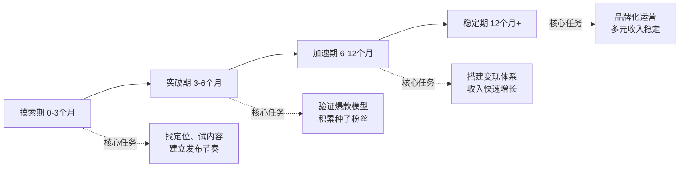
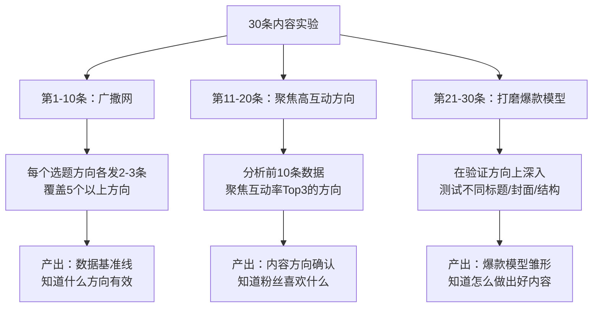
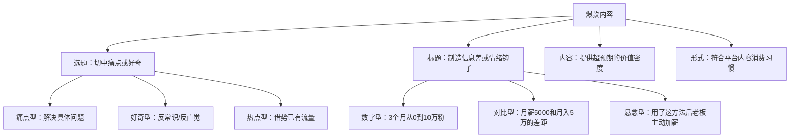
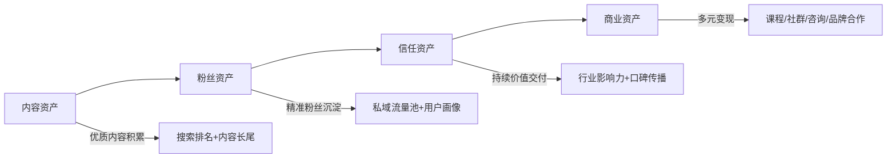

## 案例总结与行动指南

> 八个真实案例已经讲完。小红书素人小林、程序员转型博主、公众号财经号、B站UP主、全平台矩阵运营者、零基础逆袭的晓琳、知识付费财经老吴、全职妈妈林悦——他们的起点不同、平台不同、路径不同，但沉淀出的规律惊人一致。本节不做故事复述，而是从这八个案例中**提炼可复制的行动框架**，给你一份"今天就能开始执行"的完整路线图。全文分为十一个模块：从案例复盘到规律提炼、从避坑指南到心态管理、从收入公式到90天行动模板、从合规底线到规模化路径——覆盖一个内容创作者从零到一、从一到十的全部关键节点。

---

### 一、八个案例的全景复盘

#### 1.1 案例核心数据对照表

| 维度 | 案例一：小林 | 案例二：程序员 | 案例三：财经号 | 案例四：B站UP主 | 案例五：矩阵运营 | 案例六：晓琳 | 案例七：老吴 | 案例八：林悦 |
|------|------------|--------------|--------------|----------------|----------------|------------|------------|------------|
| 起点职业 | 产品经理 | 程序员 | 金融从业者 | 大学生 | 运营从业者 | 行政专员 | 国企中层 | 全职妈妈 |
| 主攻平台 | 小红书 | 抖音 | 公众号 | B站 | 全平台 | 小红书 | 公众号+小红书 | 小红书 |
| 启动资金 | ~500元 | ~2000元 | ~0元 | ~3000元 | ~5000元 | ~200元 | ~500元 | ~0元（旧手机） |
| 起步到稳定 | 8个月/10万粉 | 6个月/50万粉 | 12个月/10万粉 | 18个月/20万粉 | 10个月/30万粉 | 10个月/月入3万 | 18个月/月入5万 | 8个月/4.2万粉 |
| 成熟期月收入 | 1-2万 | 5-10万 | 8-15万 | 2-5万 | 10万+ | 3万 | 5万 | 1.8-2.5万 |
| 内容形式 | 图文 | 短视频 | 长文 | 中长视频 | 多形态 | 图文+手写 | 深度图文 | 图文+辅食实拍 |
| 可用时间 | 每天2小时 | 每天3小时 | 每天2小时 | 每天4小时 | 全职 | 每天2小时 | 工作日1-2h+周末半天 | 每天3小时（碎片） |
| 核心壁垒 | 效率工具测评 | 技术知识降维 | 专业分析深度 | 创意+人格 | 运营体系化 | 真实感+美学 | 专业信任 | 真实育儿经验 |

#### 1.2 成长曲线的四个阶段

八个案例的成长轨迹高度一致，都经历了四个阶段：



**关键发现**：八个案例中有六个在前两个月经历了"发了十几条内容，数据惨淡"的至暗时刻。他们的共同选择是：**不换赛道，换方法**。老吴前6个月零变现但专注内容质量，林悦前10条笔记总阅读量不到1500但坚持调整定位——熬过摸索期的前提不是盲目坚持，而是"边做边调整"的系统化思维。

**各阶段的关键转折信号**：

| 阶段 | 判断"该进入下一阶段"的信号 | 常见的"假信号"（不要被误导） |
|------|--------------------------|---------------------------|
| 摸索期→突破期 | 连续5条以上内容互动率稳定高于账号平均值的1.5倍 | 单条爆款但后续内容恢复平淡 |
| 突破期→加速期 | 粉丝自然增长速度稳定（每天净增50+），有品牌方主动询价 | 粉丝数涨了但互动率没涨 |
| 加速期→稳定期 | 月收入连续3个月稳定在目标水平，且收入来源≥2个 | 某个月收入爆发但不可复制 |

---

### 二、从八个案例提炼的八大核心规律

#### 规律一：定位的本质是"做减法"

成功的定位不是找到"蓝海"，而是找到"窄海"——在足够细分的领域建立绝对优势。

| 层级 | 举例（以小红书为例） | 竞争强度 | 变现潜力 |
|------|---------------------|---------|---------|
| 太宽：穿搭 | 搜索结果5000万+ | 极高 | 低（无法建立辨识度） |
| 适中：小个子通勤穿搭 | 搜索结果50万+ | 中等 | 高（精准人群，广告主明确） |
| 太窄：155cm黄皮秋季通勤 | 搜索结果5万+ | 低 | 中（天花板受限） |

**定位公式**：`大品类 × 个人独特优势 × 具体场景 = 你的赛道`

老吴没有做"理财科普"，而是聚焦"30-45岁中产家庭资产配置"；林悦没有做"妈妈日记"，而是聚焦"0-3岁宝宝辅食+带娃效率"；晓琳没有做"手账分享"，而是聚焦"手写笔记+自律打卡"。每个成功案例都在"做减法"中找到了自己的窄海。

**三步定位法**：

1. **列清单**：写下你能持续产出内容的20个主题（不评判，只罗列）
2. **做交叉**：将每个主题与"目标人群+具体场景"交叉，得到60个细分方向
3. **验数据**：去目标平台搜索这些细分关键词，查看内容数量、互动数据、变现方式，选出供需比最优的3个方向，各发10条内容测试，用数据选最终方向

**定位自检清单**（通过5项以上即可启动）：

- [ ] 能用一句话说清楚"我做什么内容、给谁看"
- [ ] 目标平台搜索该关键词，结果在10万-500万之间（不冷不热）
- [ ] 该领域已有账号通过知识付费/广告/带货变现（有商业验证）
- [ ] 你能连续说出50个该领域的细分选题（不卡壳）
- [ ] 你对这个领域有至少1年的持续积累或强烈兴趣
- [ ] 该领域有明确的"痛点人群"（他们主动搜索解决方案）
- [ ] 你能在30秒内说出你的内容与同领域其他账号的核心区别

#### 规律二：冷启动的核心是"密度"而非"运气"

平台算法对新号的判定逻辑是"观察期→信任期→推荐期"。观察期内需要足够的样本量来判断内容质量和受众画像，因此前期发布密度远高于后期。

| 案例 | 冷启动期发布频率 | 稳定期发布频率 | 冷启动期持续时长 |
|------|----------------|--------------|----------------|
| 小林（小红书） | 每天1-2条 | 每周3-4条 | 约3个月 |
| 程序员博主（抖音） | 每天1条 | 每周3条 | 约2个月 |
| 老吴（公众号） | 每天1篇 | 每周3篇 | 约4个月 |
| 林悦（小红书） | 每天1条 | 每周4-5条 | 约3个月 |

冷启动期的内容策略：

- **不追求完美**：60分的内容发出去，比90分的内容躺在草稿箱里有价值一万倍
- **快速迭代**：每条内容发布后24小时看数据，分析什么题材/标题/封面效果好，下一条立即调整
- **建立选题库**：冷启动期至少储备50个选题，避免"今天发什么"的决策内耗
- **模仿但不抄袭**：找到你所在赛道的5个对标账号，分析他们点赞最高的20条内容，提炼共性规律

**冷启动期的"30条内容实验法"**：



#### 规律三：爆款是可拆解的"系统"，不是运气

八个案例都经历过从"偶尔出爆款"到"稳定产出爆款"的转折。关键不是灵感爆发，而是建立了爆款内容的生产系统。

**爆款内容四要素模型**：



**各平台爆款公式对比**：

| 平台 | 标题要求 | 封面/前3秒 | 黄金内容长度 | 关键指标 | 算法权重排序 |
|------|---------|-----------|-------------|---------|-------------|
| 小红书 | 18-25字，含emoji | 首图决定50%点击率 | 图文500-1500字 | 点赞/收藏比≥1:1 | 收藏>评论>点赞>分享 |
| 抖音 | 15-20字 | 视频前3秒决定生死 | 30-60秒 | 完播率≥30% | 完播率>互动率>分享率>点赞率 |
| 公众号 | 20-30字 | 标题决定打开率 | 2000-5000字 | 阅读完成率≥40% | 打开率>分享率>收藏率>留言率 |
| B站 | 15-25字 | 封面+标题共同决定点击 | 5-15分钟 | 一键三连率≥5% | 完播率>投币率>收藏率>弹幕率 |

**爆款标题的12个公式**（从八个案例的爆款内容中提炼）：

| 公式类型 | 结构模板 | 示例 | 适用平台 |
|---------|---------|------|---------|
| 数字具体化 | N个方法/步骤/技巧+实现结果 | "7个让老板主动加薪的汇报技巧" | 全平台 |
| 对比反差 | A和B的差距在于C | "月薪5000和月入5万的人，差距不在努力" | 公众号/小红书 |
| 悬念钩子 | 做了A之后，B发生了 | "用了这个方法后，同事开始主动请教我" | 抖音/小红书 |
| 身份认同 | 特定人群+专属痛点 | "小个子女生秋冬穿搭，这5套闭眼入" | 小红书 |
| 反常识 | 你以为A，其实B | "你以为的存钱方法，其实在越存越穷" | 全平台 |
| 时间承诺 | 用了N天/分钟，效果X | "每天15分钟，一个月后同事问我怎么变的" | 抖音/B站 |
| 避坑警告 | 别再A了，正确做法是B | "别再用Excel做报表了，这个工具效率翻10倍" | 全平台 |
| 清单盘点 | N个必知/必学/必备 | "2024年必装的10个效率APP" | 小红书/B站 |
| 故事开头 | 我A了N年，终于发现B | "做了5年理财顾问，终于明白普通人最该做的1件事" | 公众号 |
| 权威背书 | 来源/数据+结论 | "哈佛研究发现：成功人士都有这个共同习惯" | 公众号/B站 |
| 紧迫感 | 再不A就来不及了 | "2024年还没做小红书的人，你可能错过了最后的红利" | 小红书 |
| 资源整合 | 收藏/整理+实用价值 | "整理了3天！全网最全的Excel快捷键大全" | 全平台 |

#### 规律四：变现的本质是"信任的货币化"

八个案例的变现路径各异——广告、带货、知识付费、咨询——但底层逻辑一致：**先用免费内容建立信任，再用付费产品兑现信任**。

**变现金字塔模型**：

```text
                    ┌──────────────┐
                    │  高端定制服务  │  ← 单价1000-1万（1对1咨询/顾问）
                    │  极少数高信任  │  ← 月入5万+
                    ├──────────────┤
                    │  知识付费产品  │  ← 单价99-999元（课程/社群/训练营）
                    │  核心变现引擎  │  ← 月入2-5万
                    ├──────────────┤
                    │   品牌广告    │  ← 单价500-5000（品牌合作/软文）
                    │  粉丝量决定   │  ← 月入1-3万
                    ├──────────────┤
                    │   免费内容    │  ← 流量入口（日更内容/免费资料）
                    │  所有变现基础  │  ← 单价0元
                    └──────────────┘
```

**关键洞察**：

- 粉丝1000-1万时：以广告和带货为主（单条报价200-2000元）
- 粉丝1万-10万时：知识付费开始成为主力（课程/社群月收入过万）
- 粉丝10万+时：多元变现组合，高端咨询服务成为溢价来源
- **不要过早接广告**：老吴在粉丝不到5000时拒绝所有广告邀约，专注内容质量和粉丝信任，粉丝突破5万后单条广告报价是同级别账号的2倍。林悦在第3个月接了一条低质量推广，单条掉粉200+，之后严格执行"先验品再推"原则

**知识付费产品设计方法论**（老吴实战验证）：

老吴从公众号图文到"家庭理财12讲"课程的转化过程，揭示了知识付费产品的设计逻辑：

**第一步：内容资产盘点**

将已发布的所有内容按主题分类，标记每篇的互动数据。老吴发现自己6个月发布的80多篇文章中，"家庭资产配置"相关文章的平均阅读量是其他文章的2.3倍，且留言中反复出现"能出个系统课程吗"的诉求——这就是市场信号。

**第二步：课程结构设计**

采用"知识晶体法"——把大主题拆成12个独立完整的知识单元，每个单元500-2000字核心内容，可以独立学习也可以串联成体系：

```text
家庭理财12讲
├── 第1-3讲：认知层（理财思维、常见误区、家庭财务诊断）
├── 第4-6讲：工具层（基金/保险/房产的选择框架）
├── 第7-9讲：策略层（资产配置、定投策略、风险对冲）
└── 第10-12讲：执行层（实操步骤、定期复盘、动态调整）
```

**第三步：定价策略**

采用阶梯定价：引流课9.9元（1讲精华，获取用户）→ 系统课299元（12讲完整）→ 训练营999元（12讲+作业批改+社群答疑+1对1诊断）。老吴发现299元的转化率是999元的8倍，但999元的收入贡献占总收入的40%——两种产品都要做。

**第四步：冷启动验证**

课程上线前先在公众号做一次"限时免费内测"，邀请50个核心粉丝免费学习并填写反馈问卷。根据反馈修改后正式上线，首月即卖出200+份。

#### 规律五：持续输出靠"系统化"而非"自律"

八个案例的创作者都不是靠意志力坚持下来的，而是把内容创作变成了可重复运转的系统。

**内容生产SOP**：

| 环节 | 具体动作 | 时间占比 | 工具辅助 |
|------|---------|---------|---------|
| 选题收集 | 日常刷同赛道内容收藏灵感，每周日集中整理选题库 | 10% | Notion/飞书多维表格/Flomo |
| 内容创作 | 按模板框架填充内容（开头-中间-结尾有固定结构） | 50% | AI辅助扩写、秘塔写作猫、Kimi |
| 视觉制作 | 封面模板化、图片批量处理 | 20% | Canva/醒图/剪映 |
| 发布排期 | 固定时间段发布，利用平台定时发布功能 | 5% | 平台自带定时功能/蚁小二 |
| 数据复盘 | 每周分析一次数据，找出高表现内容的共性 | 15% | 平台数据中心+Excel/新红 |

**案例中的系统化方法**：

- **小林的"3×7选题法"**：每周3天刷小红书找灵感，周日一次性做好下周7天的内容排期
- **程序员博主的"技术→生活翻译法"**：看到技术概念先用程序员思维理解，再翻译成"如果给你妈解释这个技术"的故事
- **老吴的"知识晶体法"**：把复杂理财知识拆成一个个独立的"知识晶体"（500字以内的完整知识点），每个晶体可以独立成文，也可以组合成课程
- **林悦的"辅食内容化工作流"**：做辅食时同步拍素材→吃完后花20分钟写文案→孩子午睡时修图发布，把"本来就做的事"变成了内容生产流程

**AI辅助创作的实战工具链**（2024-2025年创作者实测推荐）：

AI不是替代创作者，而是把"从0到60分"的时间压缩，让创作者把精力集中在"从60分到90分"的打磨上。

| 环节 | 推荐工具 | 具体用法 | 注意事项 |
|------|---------|---------|---------|
| 选题灵感 | Kimi/ChatGPT | 输入"我是XX领域的博主，请给我20个选题"，再用平台搜索验证热度 | AI给的选题必须二次验证，不能直接用 |
| 大纲生成 | Kimi/通义千问 | 给定选题后让AI生成3个不同角度的大纲，选最好的一个修改 | 大纲必须加入你自己的案例和观点，否则同质化 |
| 文案扩写 | 秘塔写作猫/Kimi | 把大纲和关键论点输入，让AI扩写后大幅修改语气和案例 | AI扩写的内容必须改30%以上，加入个人风格 |
| 标题优化 | ChatGPT/Claude | 生成20个标题变体，用"情绪值+信息差"维度打分选最优 | 最终标题要过"你自己会不会点"这一关 |
| 图片生成 | Midjourney/即梦AI | 生成封面底图后用Canva叠加文字和品牌元素 | 注意AI图片的版权问题，部分平台限制AI内容 |
| 视频脚本 | Kimi/文心一言 | 输入主题生成口播脚本，标注语气和停顿点 | 视频脚本必须口语化修改，不能照念 |
| 数据分析 | 新红/灰豚/蝉妈妈 | 导出数据后让AI分析趋势和异常值 | 工具数据和平台后台数据可能有偏差，以平台后台为准 |

**重要提醒**：AI辅助创作的核心价值是提效，不是代写。八个案例中使用AI辅助的创作者（小林、程序员博主、老吴），都是用AI完成初稿后大幅修改——最终发布的内容中，AI贡献的部分不超过40%，个人经验、案例、观点才是内容的灵魂。

#### 规律六：数据驱动是"找因果"而非"看数字"

**五个最常见的数据误读**：

| 误读 | 正确做法 | 案例教训 |
|------|---------|---------|
| 只看粉丝数不看互动率 | 10万粉互动率0.5%的账号，商业价值不如2万粉互动率5%的账号 | 老吴粉丝不到3万，但单粉价值是同级10万粉账号的3倍 |
| 被单条爆款误导方向 | 单条10万赞不代表方向正确，需看10条以上数据趋势 | 小林一条穿搭笔记意外爆了，但分析后发现粉丝画像与定位不符，果断放弃 |
| 忽略搜索流量价值 | 推荐流量是"快钱"，搜索流量是"睡后收入" | 晓琳60%的月收入来自搜索流量，林悦的辅食笔记长尾流量持续6个月 |
| 过度关注负面数据 | 一条内容效果差不代表方向错误，区分"方向性错误"和"执行性波动" | 林悦连续3条低数据后没放弃，第4条成了爆款 |
| 不做对比实验 | 同一选题用不同标题/封面各发一次，用数据而非直觉决策 | 程序员博主用A/B测试发现"悬念型标题"的点击率是"直述型"的2.3倍 |

**数据复盘的"5-3-1"法则**：

- **5个核心指标**：曝光量、互动率、涨粉数、变现收入、内容发布量——每天只看这5个，不被其他数据干扰
- **3层归因分析**：数据好→好在哪（选题/标题/形式）？数据差→差在哪？偶然还是趋势？——每周做一次深度归因
- **1个行动结论**：每次复盘必须产出1个可执行的结论——"下周多做XX类内容"或"XX类型标题效果更好"

#### 规律七：从"个人IP"到"可变现资产"的跃迁

成功的创作者不是在经营一个"账号"，而是在构建一项"资产"。

**个人IP的资产化路径**：



**资产化的三个关键动作**：

1. **内容资产化**：把零散内容整理成体系化的知识库（合集、系列、课程），让旧内容持续产生新价值。老吴将6个月的公众号文章重新组织成"家庭理财12讲"课程，复用了90%的内容但变现效率提升了10倍
2. **粉丝资产化**：将公域粉丝导入私域（微信群/社群/邮件列表），建立不依赖平台的触达能力。矩阵运营案例前6个月只做公域，一次平台规则调整损失30%流量，之后强制执行"每100个公域粉丝导入20个到私域"的指标
3. **品牌资产化**：从"XX平台博主"升级为"XX领域专家"，让品牌价值超越单一平台。程序员博主从"抖音技术博主"升级为"技术科普作家"，开始收到出版社和线下活动邀约

**私域运营的具体SOP**：

私域不是"把人拉进微信群就完事了"。以下是经过八个案例验证的私域运营框架：

```text
公域内容 → 钩子设计 → 用户引流 → 私域承接 → 信任培育 → 变现转化 → 复购裂变
```

**钩子设计**（让用户主动加你的理由）：

| 钩子类型 | 示例 | 适用场景 | 转化率参考 |
|---------|------|---------|-----------|
| 免费资料包 | "回复'清单'领取XX行业报告" | 公众号/小红书 | 5-15% |
| 免费诊断 | "前20名免费做XX诊断" | 专业领域账号 | 10-20% |
| 社群入口 | "加入XX交流群，认识同频的人" | 粉丝量较大时 | 3-8% |
| 独家内容 | "群内每周分享未公开的XX干货" | 知识类账号 | 8-15% |

**私域运营节奏**：

| 时间 | 动作 | 目的 |
|------|------|------|
| 每天 | 朋友圈/社群分享1条有价值的内容 | 保持存在感 |
| 每周 | 社群内做1次主题分享或答疑 | 深化信任 |
| 每月 | 推出1次限时福利或小规模付费活动 | 激活沉默用户 |
| 每季 | 做1次大型活动（训练营/直播/线下） | 集中转化 |

#### 规律八：不同起点有不同的最优路径

不是所有人都适合同一条路。根据你的起点条件，选择最适合的路径：

| 你的起点 | 推荐路径 | 主攻平台 | 预期时间线 | 参考案例 |
|----------|---------|---------|----------|---------|
| 零基础素人 | 图文起步→积累1000粉→探索变现 | 小红书 | 6-12个月月入5000+ | 晓琳、林悦 |
| 有专业技能 | 深度内容→知识付费→私域变现 | 公众号/知乎 | 12-18个月月入1万+ | 老吴、财经号 |
| 有表现力 | 短视频起步→涨粉→广告+带货 | 抖音/B站 | 6-12个月月入5000+ | 程序员博主、B站UP主 |
| 有资源有经验 | 全平台矩阵→品牌合作+自有产品 | 多平台 | 6个月月入3万+ | 矩阵运营 |
| 时间碎片化 | 轻量图文→系统化产出→稳步变现 | 小红书 | 8-12个月月入1万+ | 林悦 |

---

### 三、八大致命错误与避坑指南

成功案例的价值不仅在于"做对了什么"，更在于"差点做错了什么"。

| 错误类型 | 案例中的真实表现 | 后果 | 纠正方法 |
|---------|----------------|------|---------|
| 定位摇摆 | 小林第2个月想从"效率工具"转做"穿搭" | 浪费1个月，算法标签混乱 | 定位确定后至少坚持3个月再评估 |
| 追热点忘本职 | B站UP主有段时间追热点影视解说 | 涨粉但不精准，广告主不认可 | 热点可以蹭，但必须与主定位强关联 |
| 过早变现 | 林悦第3个月接了一条低质量推广 | 单条掉粉200+，评论区口碑受损 | 粉丝不到1万时优先建信任，慎重接广告 |
| 内容同质化 | 财经号一度变成"新闻搬运工" | 打开率从8%降到3% | 始终保持个人观点和独特分析角度 |
| 忽视私域 | 矩阵运营前6个月只做公域 | 平台规则调整损失30%流量 | 从第一天起就建立私域流量池 |
| 孤军奋战 | 程序员博主前4个月完全单打独斗 | 选题枯竭，动力下降 | 第2个月起加入创作者社群 |
| 追求完美不发 | 林悦最初拍了30张辅食照只发了1条 | 浪费两周，错过算法新手流量期 | 60分就发，用数据迭代到90分 |
| 忽视用户画像 | 老吴初期内容覆盖太广 | 粉丝不精准，转化率低 | 用"用户画像卡"锁定核心人群 |

**额外三个"隐形杀手"**（案例中未直接提及但极易犯的错误）：

**1. 抄袭式"对标"**

看到爆款就原封不动地改几个字发出去。平台查重机制越来越严格，轻则限流，重则封号。正确做法是拆解爆款的底层逻辑（选题角度、信息结构、情绪节奏），用自己的语言和案例重新表达。

**2. 数据焦虑导致的"动作变形"**

连续几天数据不好就改标题风格、换内容方向、甚至换赛道——每一次"大改"都相当于重新开始冷启动。正确做法是区分"方向性问题"（持续30条以上数据都差）和"执行性波动"（偶尔几条数据差），只在确认是方向性问题时才调整。

**3. 忽视评论区的"金矿"**

评论区是最真实的用户需求来源。老吴的课程选题有60%来自评论区的高频问题，林悦的爆款笔记标题有40%直接改编自粉丝评论中的原话。每天花10分钟认真阅读评论区，比花1小时刷竞品更有价值。

---

### 四、心态陷阱与生存策略

八个案例的创作者无一例外都经历过心理低谷。以下是高频心态陷阱和实战验证过的应对策略。

#### 陷阱一："别人做得比我好"

**表现**：每天刷同赛道账号，越刷越焦虑，觉得自己怎么努力都追不上。

**真相**：你看到的别人的"高光时刻"是他们几百条平庸内容之后的产物。林悦看到一个辅食博主单条5万赞，后来发现那个博主已经做了3年、发了800多条笔记。

**应对**：每周只看一次对标账号，看的时候带着目的——分析选题、标题、封面，而不是比较数据。建立一个"对标分析表"，把情绪化的"羡慕"转化为可执行的"拆解"。

#### 陷阱二："我是不是不适合做这个"

**表现**：连续发了20条内容数据都很差，开始怀疑方向。

**真相**：20条内容太少。八个案例中，没有一个在20条以内找到稳定的内容方向。大多数成功案例是在30-50条之后才找到感觉，老吴更是发了80多条才出现第一条10万+阅读的文章。

**应对**：给自己设定一个"最低发布量承诺"——在评估方向是否正确之前，至少发布50条内容。把这50条当作"实验"而非"考试"，每条都是一个数据点。

#### 陷阱三："数据好反而焦虑"

**表现**：一条爆款之后，担心下一条数据差，开始患得患失。

**真相**：爆款是系统输出的结果，不是运气。系统在，爆款就会持续出现。程序员博主在建立爆款公式后，爆款率从5%提升到25%，但他说"我知道每一条为什么爆或不爆"。

**应对**：专注过程指标（发布量、选题质量、创作时间），而非结果指标（点赞数、粉丝增长）。建立一个"过程指标追踪表"，每天只记录"今天完成了什么"，不看"今天涨了多少"。

#### 陷阱四："工作太忙没时间"

**表现**：加班到晚上10点，没有精力创作。

**真相**：这不是时间问题，是系统设计问题。林悦每天只有孩子午睡后的2小时和晚上哄睡后的1小时，依然做到了8个月4.2万粉。她的秘诀是把"生活本身"变成内容素材——做辅食时同步拍素材，不需要额外挤出"创作时间"。

**应对**：

- **碎片时间做原材料收集**：通勤时选题、午休时列大纲、排队时拍素材
- **集中时间做内容组装**：每天固定1-2个"创作时段"，只做组装不做创意
- **建立内容库存**：周末批量生产3-5条内容，工作日只做发布和互动
- **降低单条制作门槛**：晓琳的手写笔记模板、林悦的辅食拍照流程，都把单条制作时间控制在30分钟以内

#### 陷阱五："变现太慢想放弃"

**表现**：做了3-6个月，收入还是几百块，觉得投入产出比太低。

**真相**：内容创业的收入曲线不是线性的，而是指数型的——前期积累期几乎看不到收入，但一旦突破临界点，收入会快速增长。老吴前6个月收入为零，第7个月才有了第一笔200元的广告，第12个月月入1万，第18个月月入5万。如果他在第6个月放弃，就不会有后面的一切。

**应对**：用"里程碑追踪法"替代"收入焦虑"——把关注点从"赚了多少钱"转移到"完成了哪些里程碑"。前6个月的里程碑应该是"发布量达到X""粉丝达到Y""找到内容方向"，而不是"月入过万"。

#### 陷阱六："被负面评论击垮"

**表现**：收到几条恶意评论或差评后，开始害怕发布内容。

**真相**：负面评论是内容传播的副产品——你的内容触达的人越多，遇到负面声音的概率就越大。程序员博主在粉丝破10万后每周收到10-20条负面评论，但他发现这些评论中有60%来自从未发布过内容的"潜水用户"。

**应对**：

- 区分"有价值的批评"和"无意义的攻击"——前者回应并改进，后者忽略或删除
- 建立"评论分级制度"：有价值的建议→认真回复；善意的质疑→礼貌解释；恶意的攻击→直接删除，不争论
- 记住一个数据：每1条负面评论背后，平均有100个沉默的认可者

---

### 五、收入公式与分阶段变现策略

#### 5.1 内容创作者的收入公式

```text
月收入 = 流量 × 转化率 × 客单价 × 复购率

其中：
  流量 = 平台推荐流量 + 搜索流量 + 私域流量
  转化率 = 内容质量 × 信任度 × 产品匹配度
  客单价 = 产品价值 × 定价策略
  复购率 = 产品质量 × 售后服务 × 持续需求
```

这个公式解释了一个反直觉的现象：为什么有些粉丝量很大的博主收入不高，而有些粉丝量不大的博主收入很高。答案在"转化率"和"客单价"——老吴粉丝不到3万但月入5万，因为他的粉丝精准度极高（转化率高），且提供的知识付费产品客单价在299-999元区间。

**收入公式的四个杠杆点**：

| 杠杆点 | 提升方法 | 见效速度 | 投入成本 |
|--------|---------|---------|---------|
| 流量 | 优化SEO关键词、提升内容质量、多平台分发 | 中（1-3个月） | 低（主要是时间） |
| 转化率 | 精准定位、建立信任、优化产品与受众匹配度 | 慢（3-6个月） | 低（主要是策略调整） |
| 客单价 | 提升产品价值、增加高端产品线、阶梯定价 | 中（1-3个月） | 中（需要产品升级） |
| 复购率 | 提升产品质量、建立售后服务、开发系列产品 | 慢（6个月+） | 中（需要持续投入） |

**关键策略**：前期优先提升"流量"（因为投入最低、见效最快），中期重点提升"转化率"和"客单价"（这是收入跃升的关键），后期关注"复购率"（这是长期稳定收入的基础）。

#### 5.2 不同粉丝量级的变现策略

| 粉丝量级 | 推荐变现方式 | 月收入预期 | 核心动作 | 参考案例 |
|---------|------------|----------|---------|---------|
| 0-1000 | 不急着变现 | 0元 | 专注内容质量和涨粉 | 所有案例的起步期 |
| 1000-5000 | 平台创作者激励 + 小额广告 | 500-3000元 | 建立内容模板，提升产出效率 | 林悦第3个月 |
| 5000-1万 | 品牌广告 + 小规模带货 | 3000-1万 | 测试不同变现方式的转化率 | 晓琳第6个月 |
| 1万-5万 | 知识付费产品上线 + 定期广告 | 1万-5万 | 打磨第一个付费产品 | 老吴第12个月 |
| 5万-10万 | 多元变现组合 + 社群运营 | 5万-10万 | 建立私域流量池 | 程序员博主 |
| 10万+ | 品牌化运营 + 高端服务 | 10万+ | 团队化、系统化、品牌化 | 矩阵运营、财经号 |

#### 5.3 品牌合作的报价与谈判

品牌广告是多数创作者的主要收入来源之一。以下是品牌合作的实操指南：

**报价参考公式**：

```text
基础报价 = 粉丝数 × 单粉价格系数

单粉价格系数参考：
  小红书图文：0.03-0.1元/粉（互动率越高系数越高）
  抖音短视频：0.02-0.08元/粉
  公众号图文：0.05-0.15元/粉（私域价值越高系数越高）
  B站视频：0.03-0.1元/粉

溢价因素：
  + 互动率高于行业均值2倍以上：+30-50%
  + 垂直领域（金融/医疗/教育等）：+50-100%
  + 有成功带货案例：+30%
  + 内容形式为视频：+20-50%
```

**品牌合作的"三不接"原则**（从八个案例的教训中提炼）：

1. **不接与定位无关的品牌**：财经号接零食广告，粉丝会觉得"你变了"
2. **不接自己没用过的产品**：林悦的教训——推广自己没试过的产品，掉粉200+
3. **不接数据不透明的品牌方**：不告诉你产品真实数据的品牌方，大概率产品有问题

**谈判技巧**：

- 首次合作报价比你的"心理底价"高30%——品牌方通常会还价
- 要求品牌方提供"brief+产品样品"至少7天后再发布——给自己足够时间体验
- 合同中加入"内容审核权"——确保最终发布的内容不违背你的调性
- 对长期合作的品牌提出"年度框架协议"——稳定收入，减少谈判成本

---

### 六、合规底线与风险管理

内容创作不只是"做好内容"那么简单。法律合规和平台规则是创作者的"生命线"——一旦触碰，之前的所有积累可能一夜归零。

#### 6.1 广告法合规要点

| 禁区 | 具体表现 | 后果 | 正确做法 |
|------|---------|------|---------|
| 绝对化用语 | "最好""第一""100%有效" | 平台处罚+可能面临罚款 | 用"个人体验""根据XX数据"替代 |
| 虚假宣传 | 夸大产品效果、编造使用数据 | 封号+法律风险 | 只描述真实使用体验，标注"个人感受" |
| 未标注广告 | 接了广告但不标注"广告""合作" | 平台降权+用户信任崩塌 | 明确标注"广告""合作""赞助" |
| 医疗/金融违规 | 无资质提供医疗建议或投资建议 | 法律风险极高 | 加注"不构成医疗/投资建议，请咨询专业人士" |

**高风险领域的内容创作红线**：

- **医疗健康**：不能说"治疗""治愈"，只能说"个人体验""辅助改善"
- **金融理财**：不能承诺收益，不能推荐具体金融产品（除非持有相关牌照）
- **教育培训**：不能承诺"保过""保就业"，不能使用学员案例做虚假背书
- **食品保健**：不能宣传疗效，不能替代药物，必须标注"本品不能替代药物"

#### 6.2 版权保护与侵权防范

**内容创作中的版权风险点**：

| 风险点 | 常见场景 | 防范措施 |
|--------|---------|---------|
| 图片版权 | 直接使用搜索引擎找到的图片 | 使用无版权图库（Unsplash/Pexels/PIXABAY）或自己拍摄 |
| 音乐版权 | 视频中使用未授权音乐 | 使用平台自带音乐库或无版权音乐（Epidemic Sound/Artlist） |
| 文字侵权 | 大段引用他人文章不注明出处 | 引用标注来源，原创内容占比≥70% |
| AI生成内容 | AI生成的图片/文字可能涉及版权灰色地带 | 用AI辅助但大幅修改，最终内容视为"AI辅助创作" |
| 品牌商标 | 未经授权使用品牌LOGO或商标 | 合理使用（评论/比较），不做暗示性背书 |

**保护自己的原创内容**：

- 发布前在平台进行"原创声明"（公众号/头条号等平台支持）
- 重要内容发布前截图保存，记录发布时间
- 发现被抄袭时，通过平台投诉通道举报（准备好原创证据）
- 考虑为系列课程/电子书进行版权登记（费用低，保护效力高）

#### 6.3 平台规则与账号安全

**各平台的"高压线"**：

| 平台 | 常见违规行为 | 处罚力度 | 避免方法 |
|------|------------|---------|---------|
| 小红书 | 引导站外交易、虚假种草、搬运抄袭 | 限流→禁言→封号 | 所有交易走平台，内容原创 |
| 抖音 | 刷量、诱导互动、搬运、低质内容 | 限流→降权→封号 | 自然增长，内容有价值 |
| 公众号 | 标题党、诱导分享、低质洗稿 | 限制功能→封号 | 标题真实，内容原创 |
| B站 | 刷数据、引战、搬运不标注 | 限流→封号 | 原创为主，互动友善 |

**账号安全的五条铁律**：

1. **不刷量**：平台的反作弊系统越来越智能，刷量的账号迟早被查到，且恢复极难
2. **不搬运**：直接搬运他人的内容，即使修改了部分文字，也能被平台查重系统识别
3. **不诱导**："点赞过万出下期""关注就送XX"等诱导行为，轻则限流重则封号
4. **不用第三方工具做违规操作**：批量关注/取关、自动评论、群发私信等，平台有完整的检测机制
5. **不碰政治敏感/争议话题**：除非你的定位就是时事评论，否则远离这类内容——风险远大于收益

#### 6.4 税务合规基础

当内容创作收入达到一定规模，税务合规是必须面对的现实问题。

**收入类型与税务处理**：

| 收入类型 | 税务分类 | 简化处理方式 | 年收入门槛参考 |
|---------|---------|------------|-------------|
| 平台广告分成 | 劳务报酬 | 平台代扣代缴（多数平台自动处理） | 通常无门槛 |
| 品牌广告收入 | 劳务报酬/经营所得 | 需自行申报（品牌方可能代扣） | 年收入>12万需汇算清缴 |
| 知识付费收入 | 经营所得 | 通过平台销售由平台代扣；自行销售需自行申报 | 年收入>12万需汇算清缴 |
| 带货佣金 | 劳务报酬 | 平台代扣代缴 | 通常无门槛 |
| 私域咨询收入 | 经营所得 | 需自行申报 | 有收入即需申报 |

**实操建议**：

- 年收入低于10万时：多数平台代扣代缴已覆盖，无需额外操作
- 年收入10-50万时：注册个体工商户（流程简单，税率更低），通过个体户开具发票
- 年收入50万以上时：考虑注册公司（小规模纳税人），享受更多税收优惠政策
- **核心原则**：保留所有收入凭证（平台截图、合同、银行流水），每年3-6月做汇算清缴

---

### 七、心态陷阱与生存策略

#### 陷阱七："全职转型的恐惧"

**表现**：副业收入已经稳定超过主业，但不敢辞职全职做内容。

**真相**：全职转型不是"收入超过主业就辞职"那么简单。矩阵运营案例在全职前做了三个准备：（1）副业收入连续6个月超过主业的1.5倍；（2）储备了12个月的生活费作为安全垫；（3）建立了至少2个独立的收入来源（不依赖单一平台或单一变现方式）。

**应对**：设立"全职转型检查清单"——

- [ ] 副业月收入连续6个月≥主业收入的1.5倍
- [ ] 储备≥12个月的生活费（不含副业收入）
- [ ] 收入来源≥2个（如广告+知识付费，或平台A+平台B）
- [ ] 已建立私域流量池（不完全依赖公域平台）
- [ ] 家庭/伴侣支持（全职创作的收入波动需要家庭理解）
- [ ] 有明确的"退路计划"（如果全职后收入下降，如何应对）

#### 陷阱八："内容创作倦怠"

**表现**：持续创作6个月以上，感到灵感枯竭、身心疲惫，对创作失去热情。

**真相**：倦怠不是"不够热爱"的信号，而是"系统需要升级"的信号。八个案例中有五个在第6-12个月经历过不同程度的倦怠。他们的共同解法是：（1）降低发布频率但不断更（从日更降到隔日更）；（2）引入新的内容形式（图文博主尝试视频，视频博主尝试直播）；（3）建立"内容假期"——每季度给自己2-3天完全不看数据、不创作的时间。

**应对策略**：

- **建立"内容储备金"**：在状态好的时候多创作3-5条存起来，倦怠期直接发布存货
- **轮流创作模式**：一周做自己想做的内容（保持热情），一周做数据验证过的内容（保持增长）
- **输入大于输出**：倦怠的本质是"输出>输入"——给自己时间看书、旅行、学习新技能，为创作储备素材
- **找到"创作搭子"**：和同领域的创作者互相激励、交换选题、共同创作

---

### 八、从零开始的90天行动模板

基于八个案例的共同经验，以下是适用于大多数人的90天行动框架。每个阶段都有明确的任务清单和验收标准。

#### 第一阶段：准备期（第1-14天）

**目标**：完成定位、平台选择和基础建设

- [ ] **自我盘点**：列出你的技能、经验、兴趣、可投入时间（用"能力矩阵"打分）
- [ ] **平台选择**：根据内容形式偏好选1个主攻平台（新手建议从图文平台起步）
- [ ] **细分定位**：用"大品类 × 个人优势 × 具体场景"公式确定方向
- [ ] **竞品研究**：找到5个对标账号，拆解他们点赞最高的20条内容
- [ ] **选题储备**：建立选题库，至少储备50个选题
- [ ] **账号建设**：注册账号并完善资料（头像、昵称、简介、背景图统一调性）
- [ ] **工具准备**：手机+手机支架+基础修图/剪辑APP即可，不要在设备上投入过多

**验收标准**：能用一句话说清楚"我是谁，我做什么内容，给谁看"。

#### 第二阶段：冷启动期（第15-60天）

**目标**：建立发布节奏，找到内容方向

- [ ] **保持密度**：日更或隔日更，冷启动期至少完成30条内容发布
- [ ] **快速迭代**：每条内容发布后24小时记录数据（曝光量、互动率、点赞/收藏比）
- [ ] **周度复盘**：每周日做一次数据复盘，找出互动率最高的内容类型
- [ ] **建立基准线**：找到自己的"数据基准线"（平均曝光量、平均互动率）
- [ ] **加入社群**：加入2-3个同赛道创作者社群，互相学习和鼓励
- [ ] **对标学习**：每周拆解1个爆款案例（标题、封面、内容结构、互动引导）

**验收标准**：能清楚说出"我哪类内容数据最好，为什么"。

#### 第三阶段：验证期（第61-90天）

**目标**：验证变现模型，建立私域入口

- [ ] **数据深分析**：分析前30+条内容数据，找到互动率最高的3个选题方向
- [ ] **集中产出**：围绕高互动方向集中产出内容，提升爆款率
- [ ] **首次变现**：尝试第一次变现（小额广告/带货/知识分享），验证转化率
- [ ] **私域建设**：建立私域入口（微信群/社群），开始沉淀核心粉丝
- [ ] **制定计划**：制定下一季度的详细运营计划（内容排期、变现目标、学习计划）
- [ ] **评估方向**：用数据评估当前定位是否需要调整

**验收标准**：完成第一次变现（哪怕只有几十元），并有明确的下一步计划。

---

### 九、不同起点的"今天就开始"行动指南

#### 如果你是零基础素人（参考：晓琳、林悦）

**今天就做**：

1. 下载小红书，注册账号
2. 用"三圈模型"（擅长×热爱×市场需要）花30分钟确定方向
3. 找到5个对标账号，关注并开始观察

**本周就做**：

1. 拍3张与你定位相关的照片，写3条笔记发出去
2. 不要纠结好不好，先发出去看数据
3. 记录每条笔记的阅读量和互动数

**核心策略**：小红书图文门槛最低，不需要露脸、不需要专业设备、不需要剪辑技能。把"你每天在做的事情"变成内容——做菜就拍菜、带娃就分享育儿、上班就聊职场。

#### 如果你有专业技能（参考：老吴、财经号）

**今天就做**：

1. 打开公众号/知乎，注册账号
2. 写一篇1500字的专业科普文章（用"如果给外行解释"的口吻）
3. 发出去，不修改第二遍

**本周就做**：

1. 围绕你的专业领域，列出20个"外行最常问的问题"
2. 每个问题写一篇1500-3000字的回答
3. 研究同类公众号的标题和排版风格

**核心策略**：深度内容的壁垒最高、天花板也最高。你的专业背景就是护城河——别人想抄也抄不像。前期专注建立信任，不要急着变现。

#### 如果你有表现力（参考：程序员博主、B站UP主）

**今天就做**：

1. 打开抖音/B站，注册账号
2. 用手机录一段60秒的视频，讲一个你熟悉的主题
3. 不需要精致，能听清、看清就行

**本周就做**：

1. 每天录1条60秒短视频，连续发5条
2. 分析哪条数据最好，找到"你的观众喜欢什么"
3. 学习基础剪辑（剪映/必剪，30分钟就能学会基础操作）

**核心策略**：视频内容的传播力最强，但制作门槛也最高。前期用"口播+简单画面"降低门槛，后期再升级制作质量。前3秒决定生死——每条视频的前3秒必须有钩子。

#### 如果你时间碎片化（参考：林悦）

**今天就做**：

1. 选一个"你本来就做的事"（做饭、带娃、健身、学习）
2. 用手机拍3张照片
3. 用Canva（免费版）做一张封面图

**本周就做**：

1. 建立"生活即内容"的思维：每次做日常事情时同步拍素材
2. 用碎片时间收集素材（拍照片、记灵感），用集中时间组装内容（写文案、修图）
3. 把单条内容制作时间控制在30分钟以内

**核心策略**：不要"挤出时间做内容"，而是"把生活本身变成内容"。林悦每天只有3小时碎片时间，但她的辅食本来就要做、孩子本来就要带——多拍几张照片、多写几句话，就是一条笔记。

#### 如果你有资源想全职做（参考：矩阵运营）

**今天就做**：

1. 列出你的所有可用资源（人脉、技能、资金、设备）
2. 选择2-3个平台注册账号
3. 制定一个3个月的全职运营计划

**本周就做**：

1. 每个平台发布3条测试内容
2. 分析各平台的数据差异
3. 确定主攻平台和辅助平台的优先级

**核心策略**：全职做内容的最大优势是时间充裕，但最大风险是"什么都想做，什么都做不精"。前3个月聚焦1个主攻平台做出成绩，再扩展到第二个平台。同时从第一天起就建立私域——全职创作者的收入稳定性比兼职更需要私域的支撑。

---

### 十、里程碑参考与进度管理

#### 10.1 关键里程碑

| 里程碑 | 时间参考 | 前置条件 | 说明 |
|--------|---------|----------|------|
| 发布第1条内容 | 第1周 | 无 | 最重要的一步，克服"开始"的恐惧 |
| 找到内容方向 | 第1个月 | 发布≥12条 | 通过测试找到适合的方向 |
| 出现第一条爆款 | 第2-3个月 | 发布≥30条 | 内容质量得到平台验证 |
| 粉丝破1000 | 第3-6个月 | 发布≥50条 | 初步建立影响力，解锁部分变现功能 |
| 第一笔收入 | 第3-6个月 | 粉丝≥1000 | 商业模式得到验证 |
| 月入5000元 | 第6-12个月 | 粉丝≥5000 | 变现能力初步建立 |
| 月入1万元 | 12-18个月 | 粉丝≥1万 | 副业收入稳定 |
| 月入3万元+ | 18-36个月 | 粉丝≥5万 | 可考虑全职转型 |

**重要提醒**：以上时间线基于八个真实案例的中位数，仅供参考。老吴18个月到月入5万，林悦8个月到月入2万，矩阵运营10个月到月入10万——快慢取决于内容质量、更新频率、领域选择、平台匹配度等多种因素。关键是保持方向正确和持续行动。

#### 10.2 进度异常的诊断与应对

当你的时间线明显偏离参考值时，按以下框架诊断：

| 异常表现 | 可能原因 | 诊断方法 | 应对策略 |
|---------|---------|---------|---------|
| 发了50条还没有爆款 | 选题/标题/封面有系统性问题 | 对标分析：找同赛道爆款，逐项对比差异 | 选3个爆款做"逐字拆解"，重做5条验证 |
| 粉丝涨了但互动率下降 | 涨了非目标粉丝（蹭热点/互关） | 分析粉丝画像：新增粉丝是否与定位匹配 | 停止一切非内容增长手段，回归内容本身 |
| 有爆款但不涨粉 | 内容好但"人设"不清晰 | 检查个人主页：是否让人一眼知道你是谁 | 优化个人简介、头像、内容风格一致性 |
| 月收入卡在某个数字上不去 | 变现方式单一或定价不合理 | 分析收入结构：哪个渠道占比最大 | 增加新的变现渠道，或优化现有渠道的转化率 |
| 持续更新但数据持续下滑 | 平台算法调整或内容疲劳 | 对比同类账号数据：是个体问题还是行业问题 | 尝试新内容形式，或拓展到新平台 |

---

### 十一、数据复盘周报模板

每周日花30分钟做一次数据复盘，是八个案例中所有成功者的共同习惯。以下是经过实战验证的周报模板：

**1. 本周发布数据**

```text
- 发布内容数量：___条
- 覆盖选题方向：___
- 总制作时间：___小时
- 平均单条制作时间：___分钟
```

**2. 核心数据指标**

```text
- 总曝光量/阅读量：___
- 平均互动率：___% （点赞+评论+收藏 ÷ 曝光量）
- 粉丝净增数：___
- 爆款率：___% （互动率高于平均值2倍的内容占比）
- 搜索流量占比：___% （来自搜索的曝光量 ÷ 总曝光量）
```

**3. 爆款分析（数据最好的1-2条）**

```text
- 内容主题：___
- 互动率：___%
- 成功原因分析：选题好 / 标题吸引人 / 封面好看 / 内容实用 / 蹭了热点
- 可复制的元素：___
- 是否可以做成系列：是 / 否
```

**4. 低效分析（数据最差的1-2条）**

```text
- 内容主题：___
- 互动率：___%
- 失败原因分析：选题冷门 / 标题无吸引力 / 内容太长 / 发布时间不对
- 下次如何避免：___
```

**5. 评论区洞察**

```text
- 本周高频问题：___
- 粉丝最感兴趣的话题：___
- 可用于下周选题的灵感：___
```

**6. 下周计划**

```text
- 重点选题方向：___
- 需要测试的新元素：___
- 发布数量目标：___条
- 需要优化的环节：___
```

---

### 十二、终极行动清单

把本章所有内容浓缩为一个可打印、可勾选的行动清单。建议打印出来贴在书桌前。

**第一个月（播种期）**：

- [ ] 用"三圈模型"确定内容定位
- [ ] 选择1个主攻平台并完成账号建设
- [ ] 找到5个对标账号并拆解20条爆款
- [ ] 建立选题库，储备50个选题
- [ ] 发布至少12条内容
- [ ] 加入2个创作者社群
- [ ] 完成第一次数据复盘

**第二个月（扎根期）**：

- [ ] 发布至少20条内容（累计30+）
- [ ] 找到互动率最高的内容类型
- [ ] 建立内容生产SOP（选题→创作→发布→复盘）
- [ ] 找到自己的"数据基准线"
- [ ] 出现第一条数据明显好于平均的内容

**第三个月（发芽期）**：

- [ ] 发布至少15条内容（累计50+）
- [ ] 围绕高互动方向集中产出
- [ ] 尝试第一次变现
- [ ] 建立私域入口（微信群/社群）
- [ ] 制定下一季度运营计划
- [ ] 评估是否需要调整定位

**第四到六个月（生长期）**：

- [ ] 保持每周3-5条的更新频率
- [ ] 粉丝突破5000
- [ ] 月收入突破3000元
- [ ] 建立素材库和模板库
- [ ] 开始考虑第二个平台的扩展
- [ ] 完成一次完整的品牌合作

**第七到十二个月（收获期）**：

- [ ] 粉丝突破1万
- [ ] 月收入突破1万元
- [ ] 上线第一个知识付费产品（课程/社群/咨询）
- [ ] 私域粉丝达到500+
- [ ] 建立稳定的多元收入结构
- [ ] 完成税务合规基础建设

**第十三到十八个月（进阶期）**：

- [ ] 月收入突破3万元
- [ ] 收入来源≥3个
- [ ] 私域粉丝达到2000+
- [ ] 建立内容创作团队（或外包协作体系）
- [ ] 开始品牌化运营（从"平台博主"升级为"领域专家"）

---

### 十三、从"兼职"到"全职"的规模化路径

当内容创作收入持续增长，很多创作者面临一个关键决策：要不要全职做？如何从一个人变成一个团队？以下是规模化路径的完整框架。

#### 13.1 单人效率的天花板

一个人能管好的内容创作上限大约是：

| 内容形式 | 单人极限产量 | 超过后的典型问题 |
|---------|------------|----------------|
| 图文（小红书/公众号） | 每周5-7条 | 质量下降、创意枯竭 |
| 短视频（抖音） | 每周3-5条 | 拍摄剪辑占用过多时间 |
| 中长视频（B站） | 每周1-2条 | 制作周期过长，数据反馈慢 |
| 深度长文 | 每周2-3篇 | 精力透支，研究深度不够 |

当你接近单人极限且收入足以覆盖外包成本时，就该考虑"去中心化"了。

#### 13.2 外包的优先级排序

不是所有环节都值得外包。按"投入产出比"排序：

| 优先级 | 外包环节 | 外包成本参考 | 释放的时间价值 |
|--------|---------|------------|-------------|
| 最高 | 封面设计/图片处理 | 50-200元/张 | 高（释放20%制作时间） |
| 高 | 视频剪辑 | 100-500元/条 | 高（释放30%制作时间） |
| 中 | 文案初稿/AI辅助 | 免费-100元/篇 | 中（但需花时间审核修改） |
| 低 | 数据分析 | 500-2000元/月 | 低（自己做更有感觉） |
| 不建议外包 | 选题决策、人设表达、粉丝互动 | — | 这是你的核心竞争力 |

#### 13.3 团队化的三个阶段

**阶段一：协作外包（月入1-3万）**

不需要雇人，通过兼职/外包平台按需采购服务：

- 找1个固定的兼职剪辑师（大学生/兼职人员）
- 找1个固定的设计师（做封面/海报）
- 自己负责选题、脚本、拍摄、数据复盘

**阶段二：小团队（月入3-10万）**

雇佣1-2个全职助手：

- 助手A：负责拍摄+剪辑+发布
- 助手B：负责社群运营+私域维护
- 自己负责选题、内容策略、商务合作

**阶段三：工作室（月入10万+）**

建立完整的内容团队：

- 内容组：策划+拍摄+剪辑+文案
- 运营组：数据分析+社群管理+平台运营
- 商务组：品牌合作+知识付费+电商
- 自己的角色从"创作者"转变为"内容总监"——把控方向和质量

---

### 十四、写在最后：三句话

回顾八个案例，有三句话值得每个内容创业者反复咀嚼：

**第一句：内容创业的本质不是"创作"，而是"经营"。** 好内容只是入场券，系统化的运营能力——选题、数据、变现、复盘——才是持续赚钱的核心能力。老吴的理财知识并不比同领域其他博主更深，但他的"知识晶体法"和"阶梯式变现体系"让同样的知识产生了10倍的商业价值。

**第二句：起步阶段，"完成"远比"完美"重要。** 八个案例的创作者回顾初期内容时，无一例外地觉得"那时候做得好粗糙"。但正是那些粗糙的内容，为后来的爆款积累了算法信任和创作经验。林悦的第一条辅食笔记照片拍得歪歪扭扭，但她发出去了——那条笔记只有28赞，但它是整个4.2万粉账号的起点。

**第三句：长期主义不是"慢慢来"，而是"持续做"。** 晓琳用10个月从零到月入3万，但她在前3个月的收入是零。如果她在第3个月放弃了，就不会有后来的一切。坚持的前提不是盲目的信念，而是一个经过验证的系统——选题有方法、创作有模板、数据有复盘、变现有路径。当你把"创作"变成"系统"，坚持就不再是意志力的考验，而是习惯的运转。

> 现在，关掉这篇文章，打开你要发布的平台，创作你的第一条内容。不需要完美，不需要准备好，不需要等待灵感——发出去，就是最好的开始。
