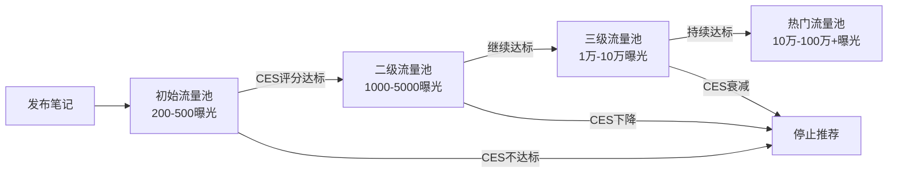
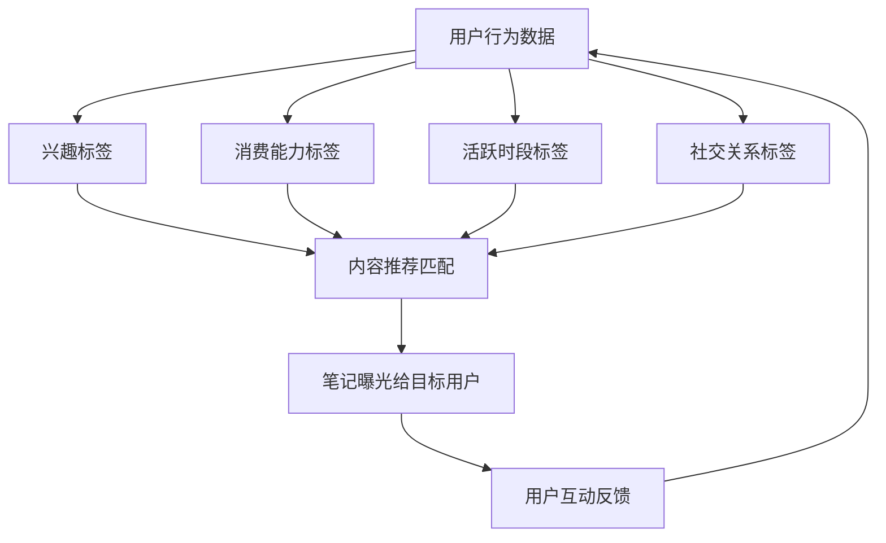
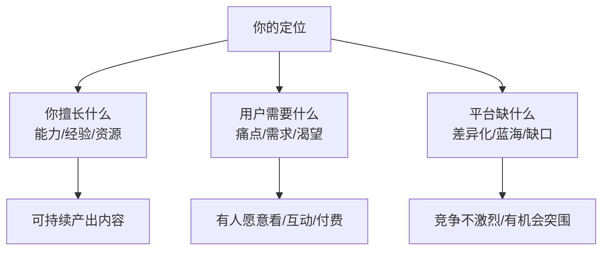
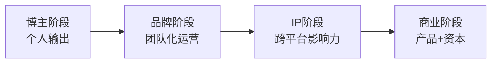

## 一、小红书运营技巧

小红书（RedNote）是国内最具商业价值的生活方式社区之一。截至2025年，月活用户突破3亿，其中70%为女性用户，核心年龄段集中在18-35岁。平台以"种草"文化闻名，用户带着明确的消费决策需求前来搜索和浏览，这使得小红书的流量变现效率远高于纯娱乐平台。无论你是想做博主副业、推广自有品牌，还是为企业做代运营，掌握小红书的运营方法论都是内容变现的基本功。

本节从"道法术器"四个层次系统拆解小红书运营：先理解平台底层逻辑（道），再掌握方法论框架（法），然后落地具体操作技巧（术），最后用工具提效（器）。从零基础入门到高阶矩阵运营，逐层递进。

### 1. 平台算法机制深度解析

理解算法是运营的前提。小红书采用"CES评分 + 流量池递进"的双重机制，内容能否获得曝光取决于这套系统对你的内容质量的判定。

#### 1.1 CES评分体系

CES（Community Engagement Score）是小红书衡量笔记质量的核心指标。评分权重如下：

| 互动行为 | 权重 | 说明 |
|---------|------|------|
| 收藏 | ★★★★★ | 权重最高，代表用户认为内容有长期参考价值 |
| 点赞 | ★★★★ | 表达认同，是基础互动信号 |
| 评论 | ★★★★ | 深度互动，评论质量和数量共同影响评分 |
| 转发 | ★★★ | 社交裂变信号，权重相对较低 |
| 关注 | ★★★ | 从单篇内容转化为粉丝关系，是强信号 |
| 完播率/阅读完成率 | ★★★★ | 内容是否能留住用户看完 |
| 停留时长 | ★★★ | 用户在内容上停留的时间长短 |

**关键认知**：很多新手只关注点赞数，实际上收藏才是小红书算法最看重的指标。一篇被大量收藏的笔记，即使点赞不高也能持续获得推荐流量。这就是为什么"教程类""攻略类""清单类"内容在小红书表现特别好——用户天然会收藏这些有实用价值的内容。

**CES评分的实际运作机制**：算法并非在笔记发布后立即计算CES，而是在每个流量池周期结束时评估。具体而言，笔记发布后的前2小时是第一轮评估窗口，系统统计这期间的互动密度（互动数÷曝光数），而非绝对互动数。这意味着一篇获得100次曝光、10次收藏（收藏率10%）的笔记，可能比一篇获得1000次曝光、50次收藏（收藏率5%）的笔记获得更多推荐。理解这一点至关重要——它解释了为什么新号也有机会出爆款，因为算法评估的是效率而非规模。

#### 1.2 流量池递进机制

小红书的流量分发遵循"阶梯式曝光"模型：



每个层级的考核周期通常是发布后的2-6小时。如果在这段时间内互动数据表现良好，笔记会进入下一个流量池。反之则停止推荐。因此，发布时间的选择和发布后的前6小时互动引导至关重要。

**流量池递进的关键细节**：

- **评估窗口并非固定**：不同内容类型的评估窗口不同。图文笔记通常在发布后2-4小时进行第一轮评估，视频笔记由于完播率统计需要更长时间，评估窗口可能延长到4-8小时。
- **衰减机制**：即使笔记已经进入高级流量池，CES评分持续下降也会被"降级"。一篇笔记在第三天突然因为某个事件获得大量互动，也会重新获得推荐流量。
- **时间权重衰减**：笔记发布越久，时间权重越低。一般发布7天后自然推荐流量会显著下降，但搜索流量不受此限制。
- **"复活"机制**：如果一篇老笔记因为搜索流量突然获得大量互动，算法会重新评估并可能再次推送至推荐流。

#### 1.3 搜索流量与推荐流量

小红书的流量来源主要有两个渠道：

- **推荐流量（发现页）**：占总流量的60-70%，由算法根据用户兴趣标签匹配推送。内容质量和CES评分决定推荐量。
- **搜索流量（搜索页）**：占总流量的30-40%，用户主动搜索关键词触发。标题和正文中的关键词布局决定搜索排名。

很多运营者只关注推荐流量而忽略搜索流量，这是一个重大失误。搜索流量的特点是：精准度高、转化率高、长尾效应强。一篇SEO做得好的笔记，可以在发布数月甚至一年后仍然持续带来流量。

**两种流量的对比**：

| 维度 | 推荐流量 | 搜索流量 |
|------|---------|---------|
| 流量峰值 | 发布后24-72小时 | 持续稳定 |
| 用户意图 | 被动浏览，兴趣驱动 | 主动搜索，需求驱动 |
| 转化率 | 较低（1-3%） | 较高（5-15%） |
| 长尾效应 | 弱（7天后衰减明显） | 强（可持续数月） |
| 内容要求 | 封面+标题吸引眼球 | 关键词布局+内容深度 |
| 运营重点 | 投放时段+互动引导 | SEO优化+长尾词覆盖 |

**实操建议**：理想的流量结构是推荐流量占60%、搜索流量占40%。如果你的搜索流量占比低于20%，说明SEO做得不够，需要加强关键词布局。如果搜索流量占比超过60%，说明推荐流量不足，需要优化封面和标题的吸引力。

#### 1.4 算法的用户标签系统

理解算法如何给用户打标签，才能让内容精准触达目标人群：



算法给用户打标签的维度包括：浏览历史（看过什么）、搜索历史（搜过什么）、互动历史（点赞收藏过什么）、关注关系（关注了谁）、消费行为（买过什么）、地理位置、设备信息等。这些标签决定了你的内容会被推送给什么样的人。

**运营启示**：你的内容本身也在给你的账号打标签。如果你今天发护肤、明天发美食、后天发旅行，算法会困惑"这个账号到底是做什么的"，导致推荐给你的用户画像混乱，互动率下降。保持垂直的核心原因就在于此——让算法准确识别你的领域，精准推荐给对该领域感兴趣的用户。

### 2. 账号定位与人设打造

定位决定了你的账号能走多远。一个清晰的定位能让算法快速识别你的内容领域，精准推送给目标用户，同时让路过的用户在3秒内判断"这个账号值得关注"。

#### 2.1 定位三角模型

有效的定位需要同时满足三个条件：



**常见错误**：很多人只考虑"我擅长什么"，选了一个自己有能力但用户需求弱或竞争过于激烈的领域。比如"日常穿搭分享"在小红书上已经是红海中的红海，新号很难突围。

**定位验证三步法**：

1. **需求验证**：在小红书搜索你的目标关键词，查看搜索结果数量和互动数据。如果搜索结果超过100万篇且头部笔记互动量过万，说明竞争激烈；如果搜索结果少于1万篇且互动量普遍较低，说明需求可能不足。理想状态是搜索结果在1万-50万之间，头部笔记互动量在1000-10000之间。
2. **商业化验证**：搜索该领域是否有品牌在投放广告（蒲公英平台搜索相关品牌），是否有博主在该领域成功接单。如果一个领域没有商业变现的先例，要么是蓝海机会，要么是商业价值不足。
3. **可持续性验证**：问自己"未来一年我能否持续产出100篇这个领域的优质内容？"如果答案是否，说明这个定位不适合你。

#### 2.2 垂直细分策略

与其做大而全的泛领域账号，不如在细分赛道建立专业壁垒：

| 泛定位（竞争激烈） | 细分定位（机会更大） | 细分逻辑 |
|-------------------|---------------------|---------|
| 穿搭分享 | 小个子通勤穿搭 | 按身高+场景细分 |
| 美食教程 | 一人食快手菜 | 按人数+时间细分 |
| 旅行攻略 | 带娃自驾游攻略 | 按人群+出行方式细分 |
| 护肤分享 | 油痘肌修复日记 | 按肤质+问题细分 |
| 职场成长 | 体制内晋升攻略 | 按行业+目标细分 |
| 健身减脂 | 居家无器械塑形 | 按场地+器械细分 |
| 数码科技 | 大学生平价数码 | 按人群+预算细分 |
| 宠物养护 | 养猫新手指南 | 按宠物类型+经验细分 |
| 家居装修 | 小户型收纳改造 | 按户型+需求细分 |

细分定位的核心优势：用户画像更精准→互动率更高→算法推荐更准→变现转化更好。

**细分定位的"三层漏斗"法**：

1. **第一层：选择大品类**（如护肤、穿搭、美食）
2. **第二层：锁定目标人群**（如学生党、职场新人、宝妈）
3. **第三层：聚焦具体问题**（如油痘肌、小个子、快手菜）

最终定位 = 大品类 + 目标人群 + 具体问题。例如：护肤 + 学生党 + 油痘肌平价修复 = "学生党油痘肌平价护肤"。

#### 2.3 人设打造四要素

定位确定后，需要通过人设让用户记住你：

1. **身份标签**：一句话说清你是谁。例如"10年皮肤科医生""前大厂产品经理""二胎宝妈"
2. **专业背书**：用具体数字和经历建立信任。例如"帮助500+学员成功转行""累计服务300+品牌"
3. **性格特征**：让账号有人味。是毒舌直率型、温暖治愈型、还是搞笑段子型
4. **视觉统一**：头像、昵称、封面模板、配色方案保持一致，形成品牌识别度

**人设打造的常见陷阱**：

- **虚假人设**：伪造身份（如非医生冒充医生）一旦被揭穿，账号直接报废。小红书用户对真实性格非常敏感。
- **人设与内容脱节**：自称"省钱达人"却频繁推荐高价产品，用户会感到被欺骗。
- **人设过于完美**：适当的"不完美"反而更真实。比如展示失败的尝试、分享踩坑经历，比全程"高大上"更能建立信任。
- **昵称起名公式**：领域关键词 + 人设特征。例如"小鱼护肤日记""阿杰说职场""小个子穿搭师Lily"。避免纯英文名、纯数字、生僻字。

#### 2.4 账号装修清单

账号主页是你的"门面"，每个细节都影响用户的关注决策：

| 元素 | 要求 | 示例 |
|------|------|------|
| 头像 | 清晰、有辨识度，真人照或品牌Logo | 真人半身照（背景简洁） |
| 昵称 | 包含领域关键词，好记好搜 | "油痘肌小鱼""职场阿杰" |
| 简介 | 一句话定位+专业背书+引导关注 | "10年皮肤科｜专注油痘肌修复｜关注我少走弯路" |
| 背景图 | 展示核心内容方向或个人品牌 | 内容方向导览图 |
| 置顶笔记 | 精华内容或自我介绍 | "我是谁+我能帮你什么+为什么关注我" |
| 合集 | 按主题归类内容，方便用户系统阅读 | "油痘肌修复全攻略""学生党平价好物" |

### 3. 内容创作方法论

内容是小红书运营的核心引擎。好内容 = 选题精准 + 标题吸睛 + 封面抓人 + 正文有价值 + 引导互动。

#### 3.1 选题策略

选题决定了内容的天花板。再好的执行力也救不了一个没人关心的选题。

**选题四象限法**：

| | 用户需求高 | 用户需求低 |
|---|---|---|
| **竞争少** | ⭐ 黄金选题（优先做） | 蓝海选题（测试验证） |
| **竞争多** | 红海选题（需要差异化） | 避开 |

**高效选题方法**：

- **搜索下拉词**：在小红书搜索框输入你的领域关键词，看下拉联想词，这些都是用户真实搜索的高频需求。具体操作：输入核心词后不按搜索，观察下拉列表，逐个点击进入查看搜索结果数量和互动水平。
- **竞品分析法**：找10个同领域头部博主，分析他们点赞过千的内容主题，提炼共性选题。重点关注"收藏>点赞"的笔记，这类内容的选题价值最高。
- **评论区挖需求**：热门笔记的评论区是金矿，用户提出的疑问和补充就是下一篇内容的选题。建立一个"需求收集表"，每天花15分钟浏览同领域热门笔记评论区，记录用户的真实需求。
- **热点嫁接法**：将你的专业领域与当下热点结合。例如"从XX事件看普通人如何保护自己"。工具推荐：小红书热搜榜、微博热搜、巨量算数。
- **季节/节点法**：提前布局季节性内容（春季护肤、年终总结、开学季），在节点前1-2周发布。建立"全年选题日历"，标注每个重要节点的提前布局时间。
- **跨平台选题法**：关注抖音、B站、知乎等平台的热门内容，将其他平台验证过的选题适配到小红书格式。注意不是搬运，而是借鉴选题思路，用小红书的风格重新创作。

**选题评估打分表**：

| 评估维度 | 1分（差） | 3分（中） | 5分（优） |
|---------|---------|---------|---------|
| 用户需求 | 小众需求，搜索量低 | 有需求但不紧迫 | 刚需，搜索量大 |
| 竞争程度 | 头部博主垄断 | 有一定竞争但可突围 | 竞争少，蓝海机会 |
| 自身能力 | 需要大量学习 | 有一定基础 | 专业领域，信手拈来 |
| 变现潜力 | 难以变现 | 有变现可能 | 直接关联付费产品/服务 |
| 内容形式 | 难以视觉化 | 可以图文呈现 | 非常适合图文/视频 |

总分20分以上的选题优先做，15-20分的可以做，15分以下的谨慎考虑。

#### 3.2 标题公式

标题决定了点击率。在小红书的双列信息流中，用户看到的是封面+标题，标题的吸引力直接影响打开率。

**高点击率标题公式**：

| 公式 | 示例 | 适用场景 |
|------|------|---------|
| 数字+结果 | "坚持早起30天，我的生活发生了5个变化" | 自我提升、经验分享 |
| 痛点+解决方案 | "毛孔粗大怎么办？皮肤科医生教你3步修复" | 教程、科普 |
| 身份+干货 | "前HR总监揭秘：简历这样写面试率翻3倍" | 职场、专业领域 |
| 反常识+证据 | "每天敷面膜反而烂脸？真相是..." | 科普、辟谣 |
| 对比+转折 | "月薪3千和月薪3万的人，差距在哪里" | 对比类、观点类 |
| 清单+场景 | "去日本必买的20件好物，第8个太好用了" | 种草、攻略 |
| 紧急+限定 | "2025年了，这5个App再不下载就亏了" | 推荐、盘点 |
| 疑问+悬念 | "为什么你的妆总是不服帖？99%的人忽略了这一步" | 教程、纠错 |
| 身份+共鸣 | "30岁裸辞后，我终于想通了这件事" | 观点、故事 |
| 挑战+结果 | "挑战一个月不买衣服，结果出乎意料" | 挑战、实验 |

**标题写作的底层逻辑**：好标题的本质是在信息流中制造"认知缺口"——让用户看到标题后产生"我想知道更多"的冲动。具体手法包括：数字制造具体感、反常识制造冲突感、疑问制造悬念感、身份标签制造信任感、限定词制造紧迫感。

**标题禁忌**：

- 不要超过20个字（会截断）
- 不要用太多表情符号（显得不专业）
- 不要标题党到与内容不符（会被限流）
- 不要使用"最""第一""绝对"等绝对化用词（违反广告法）
- 不要使用过多标点符号（影响阅读和推荐）
- 不要在标题中放话题标签（标签应放在正文）

#### 3.3 封面设计

封面是内容的"门面"，在信息流中与标题共同决定点击率。

**封面设计原则**：

1. **信息量大**：封面要传递核心信息，让用户不点进去也能获得价值感
2. **对比鲜明**：使用前后对比、数据对比等视觉冲击强的形式
3. **文字突出**：封面上的关键文字要大、醒目，手机上能看清
4. **风格统一**：同一账号的封面模板保持一致，形成品牌识别

**常见封面类型**：

| 类型 | 适用场景 | 点击率表现 | 设计要点 |
|------|---------|-----------|---------|
| 纯文字卡片 | 干货总结、观点输出 | ★★★★ | 背景色+大字标题+小字副标题 |
| 产品实拍 | 好物推荐、开箱 | ★★★★ | 自然光+简洁背景+产品居中 |
| 对比图 | 教程前后、效果对比 | ★★★★★ | 左右或上下对比，标注"前""后" |
| 人物出镜 | 口播、vlog | ★★★ | 表情丰富+动作自然+背景干净 |
| 信息图表 | 数据分析、科普 | ★★★★ | 数据可视化+配色协调+层次分明 |
| 拼图合集 | 清单、合集推荐 | ★★★★ | 统一尺寸+编号标注+留白适度 |

**封面尺寸**：推荐使用3:4竖版比例（1080×1440像素），这是小红书信息流中展示面积最大的比例。正方形（1080×1080）也可以，但展示面积较小。横版（16:9）在信息流中会被严重压缩，不推荐使用。

**封面制作的实操流程**：

1. 确定封面类型（根据内容选择上表中的类型）
2. 选择配色方案（建议每个账号固定2-3个主色调）
3. 设计封面模板（用Canva或醒图制作可复用模板）
4. 添加核心文字（标题+副标题，字体大小确保手机可读）
5. 检查对比度（文字与背景的对比度要足够，确保可读性）

#### 3.4 正文结构

小红书的正文有字数限制（图文笔记通常1000字左右），要在有限篇幅内提供最大价值。

**万能正文结构**：

```text
[开头钩子] → 1-2句话抓住注意力，制造好奇心或共鸣
[核心价值] → 分点展开，每点有具体细节和案例
[实操步骤] → 如果是教程类，给出可执行的操作步骤
[互动引导] → 引导评论、收藏、关注
```

**开头钩子的六种写法**：

1. **痛点共鸣**："你是不是也遇到过这种情况——明明护肤步骤都做了，皮肤还是又油又长痘？"
2. **数据冲击**："据统计，90%的人洗脸方式都是错的。"
3. **故事引入**："上周一个粉丝私信问我，她花了2000块买的护肤品全踩雷了..."
4. **结论前置**："这篇文章可能颠覆你对XX的认知。"
5. **反问引导**："你知道为什么你的妆总是不服帖吗？"
6. **身份声明**："作为10年皮肤科医生，我必须告诉你这些真相。"

**写作技巧**：

- **短句为主**：小红书用户多在碎片时间阅读，长句会降低阅读意愿。建议每句话不超过30字。
- **善用emoji**：适度使用emoji作为视觉分隔符，提升可读性，但不要每句话都加。建议每段开头用一个emoji标注重点。
- **分点排版**：用"1️⃣2️⃣3️⃣"或"✦""➤"等符号做视觉引导，让内容层次清晰。
- **口语化表达**：不要写论文，要像朋友聊天一样自然。把"综上所述"改成"总结一下"，把"至关重要"改成"超级重要"。
- **关键词布局**：在标题、正文首段、标签中自然融入目标关键词，提升搜索排名。
- **留白原则**：段落之间空一行，不要整篇堆在一起。手机屏幕小，密密麻麻的文字会让人直接划走。

**正文排版的视觉层次**：

```text
标题区：emoji + 核心信息
━━━━━━━━━━━━━━━━━━━━━━━━━━━
正文区：
✅ 第一点：xxx
   具体说明和案例
   
✅ 第二点：xxx
   具体说明和案例

💡 小贴士：xxx

💬 你们还有什么好推荐的？评论区告诉我～
```

#### 3.5 标签策略

标签是小红书SEO的重要组成部分，影响内容被搜索到的概率。

**标签使用规则**：

- 每篇笔记添加5-10个标签
- 第一个标签放核心关键词（权重最高）
- 组合使用大词（流量大但竞争激烈）和长尾词（精准但流量小）
- 使用小红书自带的热门标签功能，选择相关性高的标签

**标签组合示例**（以"油痘肌护肤"为例）：

```text
#油痘肌护肤 #痘痘肌 #祛痘 #油皮护肤 #护肤教程 
#水乳推荐 #油痘肌水乳 #学生党护肤 #平价护肤 
#皮肤科医生推荐
```

**标签组合的"金字塔"策略**：

```text
第1层（1-2个）：核心关键词 — 精准描述内容主题
第2层（2-3个）：细分关键词 — 更具体的需求词
第3层（2-3个）：人群/场景词 — 定位目标受众
第4层（1-2个）：热门标签 — 蹭平台流量
```

**标签的常见错误**：

- 使用与内容无关的热门标签（会被判定为"蹭热度"，降低推荐权重）
- 只用大词不用长尾词（竞争激烈，新号很难获得搜索排名）
- 标签数量过少（少于3个）或过多（超过15个）
- 使用已被平台封禁或限流的标签

#### 3.6 图文笔记 vs 视频笔记

小红书支持图文和视频两种内容形式，各有优劣：

| 维度 | 图文笔记 | 视频笔记 |
|------|---------|---------|
| 制作门槛 | 低（手机即可） | 中高（需要拍摄+剪辑） |
| 制作时间 | 30分钟-2小时 | 2-8小时 |
| 信息密度 | 高（可快速浏览） | 中（需要观看时间） |
| 收藏率 | 高（方便回看） | 中（回看不便） |
| 搜索权重 | 中 | 高（平台鼓励视频） |
| 粉丝粘性 | 中 | 高（更有人格感） |
| 适合领域 | 教程、攻略、清单、科普 | vlog、测评、演示、口播 |

**建议**：新手先从图文笔记起步，因为制作门槛低、出内容快、容易积累经验。当账号有了一定粉丝基础（1000+）后，逐步增加视频笔记的比例。理想的比例是图文占60%、视频占40%。

**视频笔记的制作要点**：

- **前3秒定生死**：开头必须抓住注意力，直接抛出痛点或悬念
- **节奏紧凑**：删除所有无效镜头，每句话都要有信息量
- **字幕必备**：大量用户在静音状态下刷小红书
- **竖屏拍摄**：9:16比例，满屏展示
- **时长控制**：1-3分钟最佳，超过5分钟完播率会显著下降

### 4. 发布策略与运营节奏

#### 4.1 最佳发布时间

不同领域的目标用户活跃时间不同，以下是各品类的推荐发布时间：

| 内容类型 | 最佳时段 | 原因 |
|---------|---------|------|
| 职场/成长 | 工作日 7:00-8:30 | 通勤时间刷手机 |
| 美食/菜谱 | 11:00-12:00 / 17:00-18:00 | 饭前搜索菜谱 |
| 穿搭/美妆 | 20:00-22:00 | 晚间护肤/次日穿搭规划 |
| 旅行/攻略 | 周五 18:00-20:00 | 周末出行规划 |
| 家居/装修 | 21:00-23:00 | 晚间放松浏览 |
| 母婴/育儿 | 10:00-11:00 / 14:00-15:00 | 宝宝午睡时间 |
| 数码/科技 | 12:00-13:00 / 20:00-21:00 | 午休和晚间 |
| 健身/运动 | 6:00-7:00 / 18:00-19:00 | 晨练前和下班后 |

**通用建议**：工作日晚上8-10点是全品类的黄金时段。周末的流量分布更均匀，上午10-12点和晚上8-10点表现较好。

**发布时间的进阶策略**：

- **错峰发布**：当你的竞品都在某个时段发布时，选择稍早或稍晚的时间反而可能获得更好的初始曝光。例如美妆类大家都在晚上8点发，你可以尝试晚上7:30发，抢占用户开始刷手机的第一波注意力。
- **测试法**：连续4周分别在不同时间段发布相同类型的内容，记录数据表现，找到最适合你账号的发布时间。每个账号的粉丝活跃时间可能不同。
- **预热发布**：对于时效性内容（节日、热点），提前2-3天发布，给算法足够的评估和推荐时间。

#### 4.2 更新频率

| 阶段 | 推荐频率 | 说明 |
|------|---------|------|
| 冷启动期（0-1000粉） | 每天1篇 | 快速积累内容基数，让算法认识你 |
| 成长期（1000-1万粉） | 每周4-5篇 | 保持稳定输出，兼顾质量 |
| 成熟期（1万粉+） | 每周3-4篇 | 质量优先，每篇都是精品 |

**关键原则**：宁可减少频率也不要降低质量。一篇高质量笔记的长尾流量可能顶得上10篇平庸内容。

**批量制作提效法**：

1. **选题批量**：每周一花2小时集中规划一周选题
2. **拍摄批量**：同类型内容一次拍摄多条素材
3. **文案批量**：集中时间撰写多篇文案
4. **排期发布**：使用小红书创作者中心的定时发布功能

#### 4.3 互动运营

发布只是开始，发布后的互动运营同样重要：

1. **及时回复评论**：发布后2小时内积极回复每一条评论，提升CES评分。回复不要只说"谢谢"，要提供额外信息或引发进一步讨论。
2. **引导评论**：在正文末尾抛出问题，引导用户留言。例如"你们还有什么好用的推荐？评论区告诉我"
3. **制造争议性话题**：适度的争议可以激发讨论（但不要刻意制造对立）。例如"护肤到底要不要用化妆水？"
4. **评论区二次创作**：在评论区补充信息、回答问题，这些评论也会被搜索引擎收录。把评论区当成"内容的延伸"来运营。
5. **评论区置顶**：将自己的关键信息（如产品链接、补充说明）置顶在评论区。

**评论回复的效率技巧**：

- 准备一套常用回复模板（感谢类、解答类、引导类）
- 使用小红书的"快捷回复"功能
- 对于重复问题，在评论区统一回复并置顶
- 对于负面评论，保持专业态度，不与用户对骂

#### 4.4 合集运营

合集是小红书的"内容归档"功能，对用户体验和SEO都有重要价值：

- 按主题创建合集（如"新手护肤入门""平价好物推荐"）
- 合集名称包含关键词（方便搜索收录）
- 新笔记发布时关联到对应合集
- 在合集描述中写清合集定位和内容概览
- 合集内的笔记按逻辑顺序排列（从入门到进阶）

### 5. 小红书SEO进阶技巧

搜索流量是小红书中最有价值的流量来源之一，因为搜索用户带有明确需求，转化率远高于推荐流量。

#### 5.1 关键词研究

**工具推荐**：

| 工具 | 功能 | 费用 |
|------|------|------|
| 小红书搜索框下拉词 | 基础关键词发现 | 免费 |
| 千瓜数据 | 竞品分析、关键词热度 | 付费（基础版约300元/月） |
| 新红数据 | 笔记数据分析、趋势监控 | 付费（基础版约200元/月） |
| 灰豚数据 | 账号诊断、行业分析 | 付费（基础版约200元/月） |
| 5118 | 长尾关键词挖掘 | 部分免费 |
| 小红书创作者中心 | 笔记数据分析、热搜词 | 免费 |

**关键词分类**：

- **核心词**：你所在领域最核心的关键词，竞争激烈但必须布局（如"护肤""穿搭"）
- **长尾词**：更具体的需求词，竞争小但精准度高（如"敏感肌秋冬面霜推荐"）
- **场景词**：与具体使用场景相关（如"通勤妆容""出差必备"）
- **人群词**：与特定人群相关（如"学生党""30+抗老"）
- **品牌词**：具体品牌名称（如"薇诺娜""珀莱雅"），适合做测评和种草

**关键词研究的完整流程**：

1. **种子词收集**：列出你所在领域的10-20个核心关键词
2. **下拉词拓展**：将每个种子词输入小红书搜索框，收集所有下拉联想词
3. **相关词挖掘**：点击搜索后，查看页面顶部的"相关搜索"词
4. **竞品词分析**：分析同领域头部博主的标题和标签，提取高频关键词
5. **长尾词组合**：将核心词+人群词+场景词+需求词进行组合，生成长尾关键词
6. **数据验证**：用千瓜或新红查看每个关键词的搜索量和竞争度
7. **关键词分组**：将关键词按主题分组，每组对应一篇或一组笔记

#### 5.2 关键词布局

关键词需要自然融入内容的以下位置：

```text
标题：包含1-2个核心关键词（最重要）
正文第一段：自然出现核心关键词
正文中间：每隔200-300字出现一次相关关键词
标签：覆盖核心词+长尾词+场景词
```

**注意**：关键词堆砌会被算法识别为低质内容。要确保每处关键词的出现都是自然的、有语境的。

**关键词密度参考**：核心关键词在全文中出现3-5次为宜，相关关键词各出现1-2次。不要刻意重复同一个词，用同义词和近义词替换。

#### 5.3 搜索排名影响因素

小红书搜索排名的权重因素（按重要性排序）：

1. **内容与关键词的相关性**：标题、正文、标签中的关键词匹配度
2. **笔记互动数据**：CES评分高的笔记搜索排名更靠前
3. **账号权重**：粉丝量、历史内容质量、账号活跃度
4. **内容新鲜度**：新发布的笔记会有一定的时间权重加成
5. **笔记类型**：图文笔记和视频笔记的搜索权重不同，视频笔记目前有一定权重优势

#### 5.4 SEO优化的实操清单

每篇笔记发布前，检查以下SEO要素：

- [ ] 标题包含1-2个核心关键词
- [ ] 正文第一自然段包含核心关键词
- [ ] 正文中自然分布3-5个相关关键词
- [ ] 标签数量在5-10个之间
- [ ] 第一个标签是核心关键词
- [ ] 标签覆盖核心词、长尾词、人群词、场景词
- [ ] 图片alt文本（如有）包含关键词描述
- [ ] 合集名称包含关键词

### 6. 变现路径详解

小红书的变现方式多样，不同粉丝量级对应不同的变现策略。

#### 6.1 变现路径总览

| 变现方式 | 最低粉丝门槛 | 收入范围 | 难度 | 适合人群 |
|---------|------------|---------|------|---------|
| 品牌合作（蒲公英） | 1000粉 | 200-5000元/篇 | ★★ | 有稳定内容输出的博主 |
| 好物置换 | 500粉 | 产品价值 | ★ | 新手博主积累经验 |
| 直播带货 | 1000粉 | 看选品和场观 | ★★★ | 有表达能力和选品眼光的博主 |
| 小红书店铺 | 0粉 | 看产品和运营 | ★★★★ | 有供应链资源的商家 |
| 知识付费 | 5000粉 | 199-999元/课 | ★★★★ | 有专业技能和教学能力的博主 |
| 引流私域 | 1000粉 | 无上限 | ★★★ | 有产品或服务的运营者 |
| 薯条推广 | 0粉 | 代理服务费 | ★★ | 懂广告投放的运营者 |
| 小红书买手电商 | 1000粉 | 佣金收入 | ★★★ | 擅长选品和内容种草的博主 |

#### 6.2 品牌合作详解

品牌合作是小红书博主最常见的变现方式。通过小红书官方的"蒲公英平台"接单。

**报价参考**（2025年行情）：

| 粉丝量 | 图文笔记 | 视频笔记 | 备注 |
|--------|---------|---------|------|
| 1000-5000 | 200-800元 | 500-1500元 | 初级博主，以置换为主 |
| 5000-1万 | 800-2000元 | 1500-4000元 | 开始有稳定报价 |
| 1万-5万 | 2000-6000元 | 4000-12000元 | 中腰部博主 |
| 5万-20万 | 6000-20000元 | 12000-50000元 | 头部博主 |
| 20万+ | 20000元+ | 50000元+ | KOL级别 |

**报价的核心影响因素**：

- **互动率**：比粉丝量更重要。互动率5%的1万粉账号，报价可能高于互动率1%的5万粉账号
- **垂直度**：垂直领域的账号报价高于泛领域账号。品牌更愿意投放在精准人群上有影响力的博主
- **内容质量**：历史笔记的平均互动水平、内容的专业度和美观度
- **粉丝画像**：粉丝的年龄、地域、消费能力是否匹配品牌目标人群
- **历史合作数据**：过往品牌合作笔记的数据表现

**接单注意事项**：

- 粉丝量≠报价能力，互动率和垂直度更重要。1万粉的垂直账号可能比5万粉的杂号报价更高
- 不要什么广告都接，频繁发布低质广告会掉粉且降低账号权重
- 每月广告内容不超过总内容的20-30%
- 选择与账号定位匹配的品牌，保持内容调性一致
- 接单前要求品牌提供产品试用，确保产品质量过关
- 合作笔记要明确标注"合作""赞助"等信息，遵守广告法规定

**蒲公英平台入驻条件**：

- 粉丝数≥1000
- 完成实名认证
- 账号无严重违规记录
- 近30天发布≥1篇原创笔记

#### 6.3 小红书店铺运营

小红书店铺是平台重点扶持的变现方式，适合有供应链资源的运营者。

**开店流程**：

1. 注册小红书专业号（需要营业执照）
2. 缴纳保证金（根据品类不同，通常1000-5000元）
3. 上架商品（标题、图片、详情页要符合小红书风格）
4. 通过笔记种草引流到店铺
5. 优化商品SEO（标题关键词+详情页内容）

**店铺运营的关键指标**：

| 指标 | 说明 | 优化方向 |
|------|------|---------|
| 商品点击率 | 笔记到商品详情页的转化 | 优化种草内容和商品主图 |
| 加购率 | 浏览到加购的转化 | 优化详情页和价格策略 |
| 成交转化率 | 加购到付款的转化 | 优化促销活动和客服响应 |
| 复购率 | 老客户再次购买 | 产品质量+售后体验 |

#### 6.4 知识付费

知识付费是高利润的变现方式，适合有专业技能的博主。

**知识付费产品形式**：

- **付费专栏**：系列课程内容，199-999元
- **一对一咨询**：个性化服务，按小时或按次收费
- **付费社群**：持续性服务，月费或年费制
- **电子资料包**：整理好的工具包、模板、清单，9.9-99元
- **直播课**：实时互动教学，单次或系列

**知识付费的定价策略**：

- 新账号初期：低价引流（9.9-49元），积累口碑和案例
- 有一定粉丝后：中等价位（99-299元），建立课程体系
- 头部博主：高价位（499-999元），提供深度服务

#### 6.5 引流私域

对于有产品或服务的小红书运营者来说，引流到微信等私域是最高价值的变现方式。

**合规引流方法**：

1. **简介引导**：在个人简介中放隐晦的引导语（如"合作看主页"）
2. **小号评论**：用小号在评论区留下联系方式
3. **私信自动回复**：设置关键词自动回复，引导用户添加微信
4. **置顶笔记**：在置顶笔记中放引流信息
5. **群聊引导**：创建小红书群聊，再从群聊中引导到微信
6. **小程序引导**：通过小红书小程序作为中间跳转

**注意**：小红书对引流行为管控严格，直接在内容中放微信号会被限流甚至封号。需要使用合规的间接方式。

**引流话术设计**：

- 不要直接写"加微信"，用"看主页""私信""点击链接"等替代
- 引流路径要短：用户看到引导→点击主页→找到联系方式→添加
- 提供足够的价值预期：告诉用户加了之后能获得什么（免费资料、专属优惠、一对一咨询）

#### 6.6 买手电商

小红书买手电商是2024-2025年平台重点发展的变现模式，博主通过选品推荐赚取佣金。

**买手电商的优势**：

- 不需要自有供应链，选品上架即可
- 佣金比例通常在10-30%
- 平台提供流量扶持
- 适合有选品眼光和内容能力的博主

**选品原则**：

- 与账号定位一致（不要为了佣金推荐不相关的产品）
- 优先选择自己真实使用过的产品
- 关注产品的佣金比例和销量数据
- 注意产品的售后评价和退货率

### 7. 数据分析与优化

数据驱动是持续增长的关键。不能只凭感觉做内容，要通过数据找到规律并优化。

#### 7.1 核心数据指标

| 指标 | 计算方式 | 健康基准 | 优化方向 |
|------|---------|---------|---------|
| 点击率 | 点击数/曝光数 | >5% | 优化封面和标题 |
| 互动率 | 互动数/曝光数 | >3% | 优化内容质量和互动引导 |
| 收藏率 | 收藏数/曝光数 | >2% | 增加实用价值 |
| 涨粉率 | 新增粉丝/曝光数 | >1% | 强化人设和内容差异化 |
| 完播率 | 完播数/播放数（视频） | >30% | 优化开头和节奏 |
| 搜索占比 | 搜索流量/总流量 | >30% | 加强SEO关键词布局 |
| 笔记均互动 | 总互动数/笔记数 | >100 | 提升单篇内容质量 |
| 粉丝活跃度 | 活跃粉丝/总粉丝 | >10% | 增强粉丝粘性 |

**数据解读的关键原则**：

- **看趋势而非绝对值**：互动率从2%提升到3%比单篇爆款更有意义
- **看比例而非数量**：100次曝光10次互动（10%）比1000次曝光50次互动（5%）表现更好
- **看长期而非短期**：单篇数据波动正常，关注周均和月均趋势
- **对比同类账号**：自己的数据要和同领域同量级的账号对比才有意义

#### 7.2 数据复盘方法

每周进行一次数据复盘，建立以下分析框架：

1. **爆文分析**：找出本周数据最好的3篇笔记，分析共同点（选题、标题、封面、发布时间）
2. **低效分析**：找出数据最差的3篇笔记，分析失败原因
3. **趋势对比**：与上周数据对比，观察粉丝增长、互动率、搜索流量的变化趋势
4. **竞品对比**：观察同领域竞品的内容策略变化

**建立内容数据表**，记录每篇笔记的以下信息：

```markdown
| 日期 | 标题 | 类型 | 曝光 | 点赞 | 收藏 | 评论 | 互动率 | 收藏率 | 备注 |
|------|------|------|------|------|------|------|--------|--------|------|
```

长期积累后，数据会告诉你：什么选题最好、什么标题最有效、什么时间发布最好、什么封面类型点击率最高。

**A/B测试方法**：

当不确定哪种方案更好时，用A/B测试来验证：

- **标题测试**：同一个内容，用不同的标题发布两次（间隔3天以上），对比点击率
- **封面测试**：同一内容，不同封面设计，对比点击率
- **发布时间测试**：同一类型内容，在不同时间段发布，对比互动数据
- **内容形式测试**：同一选题，分别用图文和视频呈现，对比数据表现

注意：每次只测试一个变量，否则无法确定是哪个因素导致了数据差异。

#### 7.3 数据分析工具使用

**小红书创作者中心**（免费）：

- 查看每篇笔记的曝光、点击、互动数据
- 查看粉丝画像（年龄、地域、兴趣）
- 查看搜索关键词数据
- 查看热搜词和趋势

**千瓜数据**（付费）：

- 竞品账号分析（粉丝增长、内容策略、合作品牌）
- 关键词热度监控
- 行业趋势分析
- 达人排行榜

**数据复盘的"四个为什么"分析法**：

1. 这篇笔记数据好/差，**为什么**？（直接原因）
2. 这个原因背后的**为什么**是什么？（根本原因）
3. 这个根本原因**为什么**会出现？（系统原因）
4. 如何系统性地解决这个问题？（行动方案）

### 8. 常见误区与避坑指南

#### 8.1 致命误区

| 误区 | 后果 | 正确做法 |
|------|------|---------|
| 买粉买赞 | 账号权重降低，真实互动率暴跌，品牌方能查到数据 | 通过优质内容自然涨粉 |
| 频繁搬运 | 被限流甚至封号 | 原创为主，引用需注明来源 |
| 内容不垂直 | 算法无法精准推荐，粉丝画像混乱 | 坚持1-2个核心领域 |
| 只发不互动 | CES评分低，推荐量上不去 | 发布后2小时内积极互动 |
| 标题党过度 | 用户举报，算法降权 | 标题吸引但不脱离内容 |
| 忽略评论区 | 错过需求洞察和二次曝光机会 | 认真回复每条评论 |
| 急于变现 | 接太多广告导致掉粉 | 先建立信任，再逐步商业化 |
| 照搬其他平台 | 小红书用户审美和阅读习惯独特 | 针对小红书特性调整内容形式 |
| 频繁修改定位 | 算法无法准确打标签，推荐流量差 | 选定定位后坚持至少3个月 |
| 忽视内容时效性 | 过期信息误导用户，降低信任度 | 定期更新旧内容或标注时间节点 |

#### 8.2 限流自查清单

如果发现笔记曝光量异常下降，按以下清单逐一排查：

- [ ] 近期是否有违规内容被删除或警告
- [ ] 是否频繁在内容中出现微信号、电话等引流信息
- [ ] 是否短时间内大量发布笔记（被判定为机器行为）
- [ ] 是否使用了违禁词或敏感词
- [ ] 是否在多个账号间频繁切换（同设备多账号风险）
- [ ] 是否搬运了他人的原创内容
- [ ] 笔记内容是否与账号定位严重不符
- [ ] 是否频繁删除笔记（删除笔记会降低账号权重）
- [ ] 是否在评论区大量发重复内容
- [ ] 是否使用了非官方的第三方刷量工具

**恢复方法**：停更3-5天，然后恢复发布原创优质内容。严重的限流可能需要1-2个月才能恢复。在恢复期间，不要急于发布大量内容，保持正常频率即可。

#### 8.3 账号安全防护

小红书账号安全是运营的基础，一旦账号出问题，所有积累都归零。

**账号保护措施**：

- 绑定手机号和邮箱，开启登录二次验证
- 不要在不信任的设备上登录账号
- 不要将账号密码分享给他人
- 定期检查账号的登录设备列表
- 不要使用非官方的第三方工具（特别是需要输入账号密码的工具）
- 避免同设备登录多个小红书账号（最多2个）

**被封号后的申诉流程**：

1. 通过小红书App内的"帮助与客服"提交申诉
2. 准备身份证明材料（身份证照片）
3. 说明情况，态度诚恳，承认可能的违规行为
4. 等待审核（通常3-7个工作日）
5. 如申诉失败，可尝试多次申诉或通过官方邮箱联系

### 9. 工具与效率提升

#### 9.1 必备工具清单

| 工具类别 | 推荐工具 | 用途 | 费用 |
|---------|---------|------|------|
| 图片编辑 | Canva/醒图/黄油相机 | 封面制作、图片美化 | 免费+付费 |
| 视频剪辑 | 剪映/CapCut | 视频笔记制作 | 免费 |
| 数据分析 | 千瓜/新红/灰豚 | 竞品分析、关键词研究 | 付费 |
| 选题灵感 | 小红书热搜/巨量算数 | 热点追踪、选题发现 | 免费 |
| 排版工具 | 135编辑器/秀米 | 长图文排版 | 免费+付费 |
| AI辅助 | ChatGPT/文心一言/豆包 | 文案生成、标题优化 | 免费+付费 |
| 素材管理 | Eagle/花瓣 | 图片素材收集管理 | 免费+付费 |
| 笔记管理 | Notion/飞书 | 内容日历、数据记录 | 免费+付费 |
| 去水印 | 轻抖/创作猫 | 素材下载去水印 | 免费 |
| 违禁词检测 | 零克查词/句易网 | 发布前检查违禁词 | 免费 |

#### 9.2 AI提效实战

AI工具可以显著提升小红书运营效率，以下是具体应用场景：

**场景一：批量生成标题**

输入你的内容主题，让AI生成10个不同风格的标题，从中选择最佳方案：

```text
请为以下内容生成10个小红书标题：
内容主题：油痘肌秋冬护肤攻略
要求：包含数字，制造好奇心，口语化，15字以内
```

**场景二：关键词拓展**

```text
请围绕"敏感肌护肤"这个核心关键词，生成20个长尾关键词，
覆盖以下维度：产品推荐、问题解决、成分科普、场景适配
```

**场景三：评论区内容生成**

提前准备一些评论区互动话术，提升互动效率。

**场景四：选题批量生成**

```text
我的账号定位是"学生党平价护肤"，目标受众是18-24岁的女大学生。
请帮我生成一周7天的选题计划，要求：
1. 每天一个不同的内容方向
2. 覆盖教程、种草、科普、对比等不同类型
3. 每个选题附带3个备选标题
```

**场景五：内容大纲生成**

```text
请为以下选题生成一篇小红书笔记的完整大纲：
选题：秋冬油痘肌水乳推荐
要求：
1. 符合小红书的口语化风格
2. 包含开头钩子、核心内容、互动引导
3. 标注每个部分的字数建议
```

**注意**：AI生成的内容需要人工审核和润色，确保符合小红书的平台调性和你的个人风格。完全依赖AI会导致内容同质化，失去个人特色。AI最适合用于：选题灵感、标题优化、大纲框架、关键词拓展。核心观点和个人经验必须自己写。

#### 9.3 内容日历模板

建立内容日历是保持稳定输出的关键：

```markdown
## 本周内容计划（示例）

| 日期 | 类型 | 选题 | 标题 | 状态 | 数据 |
|------|------|------|------|------|------|
| 周一 | 教程 | 油痘肌洁面 | 油痘肌洗脸的3个致命错误 | ✅已发 | 收藏320 |
| 周二 | 种草 | 平价水乳 | 学生党秋冬水乳5款实测 | ✅已发 | 收藏280 |
| 周三 | 科普 | 成分解读 | 烟酰胺到底能不能祛痘？ | ✅已发 | 收藏150 |
| 周四 | 对比 | 产品对比 | 20元vs200元洗面奶，差距在哪 | 📝撰写中 | - |
| 周五 | 清单 | 好物清单 | 油痘肌年度爱用10件好物 | 💡选题 | - |
| 周六 | 故事 | 经历分享 | 我从烂脸到好皮肤的1年 | 💡选题 | - |
| 周日 | 休息/复盘 | 数据分析 | 本周数据复盘 | - | - |
```

### 10. 从0到1的实操路线图

以下是一个完整的小红书账号冷启动路线图，按时间线推进：

#### 第1周：账号搭建

- 注册账号，完善个人资料（头像、昵称、简介、背景图）
- 确定账号定位和人设
- 分析10个同领域优秀账号，学习内容风格
- 制作3-5个封面模板
- 建立内容数据表和内容日历

**具体操作**：
1. 下载小红书App，用手机号注册
2. 完善个人资料：头像用真人照片或品牌Logo，昵称包含领域关键词，简介写清"我是谁+我能帮你什么+为什么关注我"
3. 搜索同领域关键词，找到10个粉丝量在1万-10万的优秀账号，记录他们的：内容类型、标题风格、封面设计、更新频率、互动方式
4. 用Canva制作3-5个封面模板，确保风格统一

#### 第2-4周：内容测试

- 每天发布1篇笔记，测试不同选题和内容形式
- 记录每篇笔记的数据表现
- 找到数据最好的2-3个内容方向
- 积极互动，回复每条评论
- 建立选题库和素材库

**具体操作**：
1. 每天发布1篇笔记，尝试不同类型（教程、种草、科普、清单、对比）
2. 发布后2小时内积极回复每条评论
3. 每周末复盘数据，找出互动率最高的内容类型
4. 根据数据调整下一周的内容方向

#### 第2-3月：找到爆款模式

- 集中产出数据表现好的方向的内容
- 优化标题和封面的点击率
- 开始布局搜索关键词
- 目标：积累500-1000粉丝
- 尝试第一篇爆款内容

**具体操作**：
1. 根据前期测试数据，聚焦2-3个表现最好的内容方向
2. 分析同领域爆款笔记的共同特征，模仿优化
3. 开始在标题和正文中布局目标关键词
4. 建立"爆款笔记分析表"，记录爆款的选题、标题、封面、发布时间等要素

#### 第4-6月：稳定增长

- 形成稳定的内容产出节奏
- 开始接到小品牌合作或好物置换
- 建立内容数据表，持续复盘优化
- 目标：粉丝突破5000
- 开通蒲公英平台

**具体操作**：
1. 保持每周4-5篇的更新频率
2. 开始收到品牌合作邀请时，选择与定位匹配的品牌
3. 每月进行一次全面的数据复盘
4. 优化内容流程，提升制作效率

#### 第7-12月：商业化探索

- 开通蒲公英平台，接受品牌合作
- 探索知识付费或私域引流
- 建立个人品牌认知
- 目标：粉丝突破1万，月收入稳定在3000元以上
- 开始考虑矩阵运营

**具体操作**：
1. 主动在蒲公英平台投递品牌合作
2. 设计自己的知识付费产品（课程、社群、咨询）
3. 建立私域引流路径
4. 评估是否需要开设小号或扩展到其他平台

### 11. 进阶策略：矩阵运营与IP化

当单账号运营成熟后，可以考虑以下进阶策略：

#### 11.1 矩阵运营

通过多个账号覆盖不同细分领域，实现流量最大化：

- **主号**：专业人设，深度内容，承接品牌合作
- **小号1**：覆盖延伸领域（如主号做护肤，小号做穿搭）
- **小号2**：测试新方向，为主号引流

矩阵运营的核心是内容复用和交叉引流，不是简单的内容复制。

**矩阵运营的注意事项**：

- 每个账号必须有独立的定位和人设，不能内容雷同
- 不要在同一设备上登录超过2个账号
- 交叉引流要自然，不要生硬地互相@或推荐
- 先把主号做稳，再考虑扩展矩阵
- 矩阵账号的内容可以复用选题，但文案和图片必须重新制作

#### 11.2 IP化路径

从"博主"升级为"IP"，是实现长期商业价值的关键：

1. **内容IP化**：形成独特的内容风格和固定栏目。例如每周固定的"周三测评""周五好物"栏目
2. **视觉IP化**：统一的视觉设计语言，让人一眼认出。包括固定的配色方案、字体风格、封面模板
3. **语言IP化**：标志性的口头禅、表达方式。例如固定的开场白、结尾语、互动话术
4. **产品IP化**：推出自有品牌产品或课程。从代工贴牌到自主研发，逐步建立产品壁垒
5. **跨平台IP化**：将小红书影响力延伸到其他平台。同一IP在抖音、B站、微信公众号同步运营

**IP化的阶段性路径**：



- **博主阶段（0-1万粉）**：个人输出，积累内容能力和粉丝基础
- **品牌阶段（1万-10万粉）**：团队化运营，建立内容生产体系和变现模式
- **IP阶段（10万-50万粉）**：跨平台影响力，个人品牌认知度高
- **商业阶段（50万粉+）**：产品线拓展，资本介入，商业化成熟

### 12. 平台规则与合规运营

了解并遵守平台规则是长期运营的基础。违规不仅会导致限流，严重时会直接封号。

#### 12.1 小红书社区公约核心条款

- **原创原则**：所有内容必须原创或获得授权，搬运他人内容会被限流或封号
- **真实原则**：内容必须真实，不得虚假宣传、夸大效果
- **友善原则**：不得发布攻击性、歧视性内容
- **合规原则**：不得发布违反法律法规的内容
- **广告规范**：商业合作内容必须通过蒲公英平台报备，未报备的暗广会被处罚

#### 12.2 常见违禁词和敏感词

发布前务必用"零克查词"或"句易网"检测违禁词，以下是最常见的类型：

- **绝对化用词**：最好、第一、唯一、绝对、100%
- **医疗类用词**：治疗、治愈、药效、处方（非医疗类账号不能使用）
- **虚假宣传用词**：保证有效、立竿见影、永久
- **敏感话题**：涉及政治、宗教、种族等争议性话题
- **引流词汇**：微信、wx、VX、加我、私聊我（直接出现容易被限流）

#### 12.3 合规运营检查清单

每篇笔记发布前，检查以下合规要素：

- [ ] 内容是否原创，是否有引用未标注的部分
- [ ] 是否包含违禁词或敏感词
- [ ] 商业合作内容是否通过蒲公英平台报备
- [ ] 是否存在虚假宣传或夸大效果的表述
- [ ] 图片是否涉及他人肖像权（需获得授权）
- [ ] 是否包含直接的引流信息（微信号、电话等）
- [ ] 标题是否与内容严重不符

---

**本节核心要点回顾**：小红书运营的本质是"通过优质内容精准触达目标用户，建立信任关系后实现商业变现"。理解算法机制是前提，精准定位是基础，优质内容是核心，数据驱动是方法，持续执行是关键。不要试图走捷径，踏实做好每一步，时间会给你答案。具体执行时，牢记"道法术器"四个层次：先搞懂平台底层逻辑（道），再建立系统的方法论框架（法），然后落地每一个操作细节（术），最后用工具提升效率（器）。从冷启动到商业化，每一步都有明确的目标和行动方案，关键是坚持执行、持续优化。
