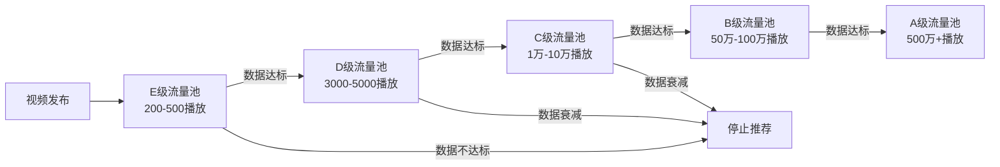
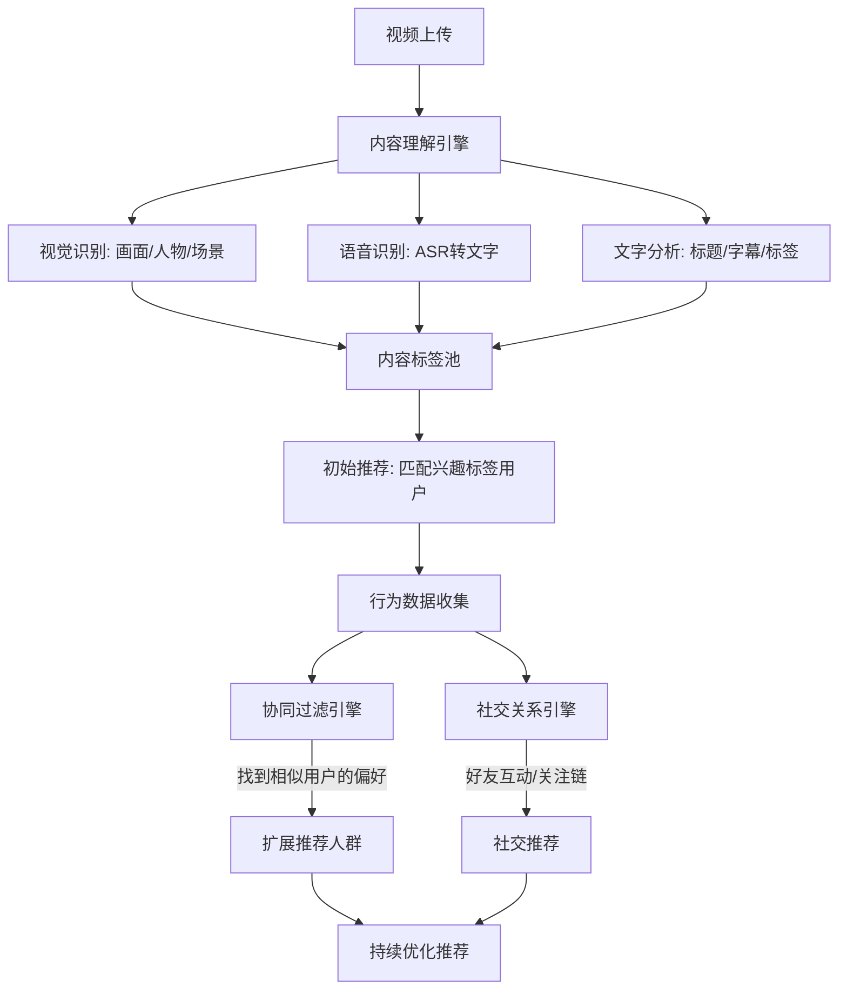
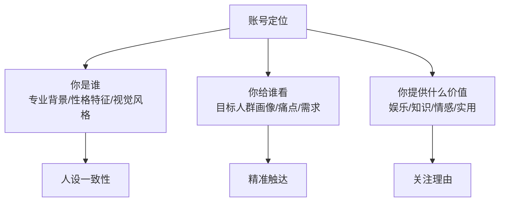
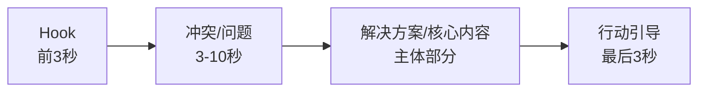
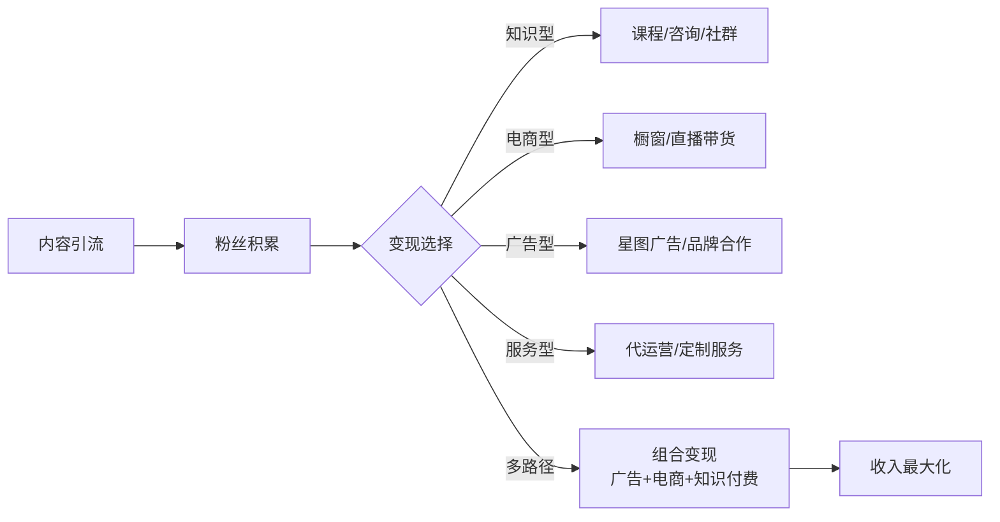

## 二、抖音运营技巧

抖音（Douyin）是中国最大的短视频平台，也是内容变现最成熟的生态之一。截至2025年，抖音日活用户超过**7.5亿**，覆盖从一线城市到乡镇农村的全年龄段人群。与小红书的"种草"属性不同，抖音的核心逻辑是**注意力捕获与高效转化**——算法通过精准推荐把内容推给最可能产生互动的用户，创作者则通过内容设计引导用户完成关注、点赞、购买等行为。

抖音的变现天花板极高：头部知识博主单条广告报价可达50-100万元，直播带货头部主播单场GMV过亿，即使是中小博主，通过中视频计划、星图广告、直播打赏等组合变现，月入1-5万也完全可行。但抖音的竞争同样激烈——每天有超过1亿条视频被上传，算法极其"冷酷"，内容质量稍有下滑流量立刻归零。

这一节将从算法底层逻辑讲起，逐步覆盖账号定位、内容创作、流量获取、数据运营、变现路径、避坑指南等完整链路，帮你建立一套可复制的抖音运营体系。

### 1. 抖音算法机制深度解析

#### 1.1 流量池递进机制

抖音采用**阶梯式流量池**分发模型，这是理解一切运营策略的基础：



每个流量池的考核周期约为发布后的**2-6小时**，核心考核指标按权重排列：

| 指标 | 权重 | 说明 |
|------|------|------|
| 完播率 | ★★★★★ | 最核心指标。用户是否看完了你的视频。5秒以内的短视频完播率要求>60%，1分钟视频完播率要求>30% |
| 点赞率 | ★★★★ | 点赞数/播放量。优秀水平：5%以上 |
| 评论率 | ★★★★ | 评论数/播放量。优秀水平：1%以上。评论区互动质量也纳入考量 |
| 转发率 | ★★★ | 转发数/播放量。优秀水平：1%以上 |
| 关注率 | ★★★ | 单条视频带来的新关注。反映内容对用户的持续吸引力 |
| 停留时长 | ★★★ | 用户在视频上停留的时间，即使未看完，停留越久信号越正面 |
| 负反馈率 | ★★（负向） | 不感兴趣/举报/长按不喜欢。负反馈率高会直接掐停推荐 |

**关键认知**：完播率是进入下一级流量池的入场券。如果完播率低于20%，即使其他数据很好，视频也很难获得推荐。这就是为什么抖音运营的第一原则永远是**前3秒抓人**——如果用户在前3秒划走，后面的内容再好都没有意义。

#### 1.2 推荐算法的工作原理

抖音的推荐系统基于**协同过滤 + 内容理解 + 社交关系**三重引擎：



具体来说：

- **内容理解**：抖音会在视频上传时自动分析画面内容（识别出美食、风景、人物表情等）、语音转文字（提取关键词）、标题和字幕文字。这些信息共同构成视频的"内容标签"，决定了视频会被推给哪些兴趣人群。
- **协同过滤**：当系统发现"A用户和B用户的观看偏好高度相似"时，会把A喜欢但B还没看过的视频推给B。这就是为什么你的视频在初期获得的"种子用户"质量极其重要——如果种子用户的标签与你的目标受众不匹配，后续推荐就会跑偏。
- **社交关系**：你的好友点赞/评论/转发的视频，以及你关注的账号的互动行为，都会影响推荐内容。

**2024-2025算法更新要点**：抖音持续优化推荐精度，以下变化需要关注——搜索权重进一步提升（标题SEO变得越来越重要）、"看完播+看完整度"的考核更精细（不再只看完播率，还会分析用户在哪里退出的）、对同质化内容的限流力度加大（模仿爆款但没有增量价值的内容会被降权）、对优质原创内容给予更长的推荐周期（"慢热型"优质内容也可能在发布数周后突然起量）。

#### 1.3 抖音的流量来源构成

理解流量从哪里来，才能有的放矢地优化：

| 流量来源 | 占比 | 特点 | 优化方式 |
|----------|------|------|----------|
| 推荐页（For You） | 50-70% | 算法主动推送，覆盖面最广 | 完播率、互动率、内容质量 |
| 关注页 | 10-15% | 已关注用户的主动查看 | 粉丝粘性、更新频率 |
| 搜索 | 10-20% | 用户主动搜索，精准度最高 | 标题关键词、话题标签、SEO |
| 个人主页 | 5-10% | 用户点击头像查看历史作品 | 主页装修、系列化内容 |
| 同城 | 3-8% | 基于地理位置推荐 | 开启定位、本地化内容 |
| 外部引流 | 2-5% | 微信/微博/小红书等外部链接 | 多平台分发、社群传播 |
| 直播广场 | 变动 | 直播间入口推荐 | 直播预热、开播频率 |

**搜索流量被严重低估**：2024年以来抖音持续加码搜索功能，用户"遇到不懂的先去抖音搜"已经成为习惯。做好搜索优化（标题含关键词、正文补充信息、使用相关话题标签），一条视频可以在发布数月后仍通过搜索持续获取流量。

#### 1.4 账号权重与流量扶持

抖音对每个账号有一个隐性的"权重评分"，影响新发布内容的初始流量池大小：

- **基础权重因素**：账号完整度（头像、简介、认证）、历史内容质量（过往作品的平均完播率和互动率）、粉丝量级、违规记录
- **加分项**：蓝V认证/个人认证、开通商品橱窗、实名认证、绑定手机号、持续稳定更新
- **减分项**：搬运/重复内容、频繁删除作品、违规被处罚（限流/封禁）、长期断更后恢复发布

**实操建议**：新号不要急于发布内容，先完善个人资料、浏览同类优质账号（让算法理解你的兴趣标签）、互动评论（积累活跃度），然后再开始发布。

### 2. 账号定位与人设打造

#### 2.1 定位的核心逻辑

抖音的定位不是"我要做什么内容"，而是"算法会把我推给谁，这些人会不会持续关注我"。定位需要回答三个问题：



**定位必须具体到"一句话能说清"的程度**。模糊的定位会导致算法无法给你打标签，推荐流量泛而不精。

| 模糊定位（差） | 精准定位（好） |
|----------------|----------------|
| 分享生活 | 95后独居女生的一人食菜谱 |
| 聊聊科技 | 帮小白选对笔记本电脑的程序员 |
| 穿搭分享 | 155cm小个子的显高穿搭公式 |
| 知识分享 | 用大白话讲透经济学的金融从业者 |

#### 2.2 人设打造的五个维度

人设不是"演出来的"，而是把真实的自己放大某一面。用户在抖音上关注的是"人"，不是"内容机器"。

1. **视觉识别**：固定的出镜形象、拍摄场景、配色风格、字幕样式。让用户在信息流中一眼认出"这是XX的视频"。
2. **语言风格**：口头禅、开场白、语速语调、用词习惯。比如"来了来了，XX又来了"这种固定开场白能快速建立熟悉感。
3. **价值主张**：你反复强调的核心观点或理念。比如"不交智商税""只推荐自己用过的东西"。
4. **性格特征**：幽默、严谨、毒舌、温暖、话痨——选一个真实性格的放大版本。
5. **专业背书**：你的职业、经历、成绩、证书。有背书的信任成本低，但没有背书也能通过持续输出专业内容慢慢建立。

**人设一致性检验清单**：把你最近10条视频按顺序给一个不了解你的人看，问TA："你觉得这个号是做什么的？主理人是什么样的人？"如果TA回答不出来，说明你的内容没有形成统一的人设记忆点。

#### 2.3 赛道选择与竞争分析

在确定定位之前，必须做赛道调研。具体方法：

1. **搜索目标关键词**：在抖音搜索你的方向，看前100个结果。如果头部账号粉丝量在10-50万（而非500万以上），说明赛道还有空间。
2. **分析头部账号**：选5-10个头部账号，记录他们的：
   - 粉丝量和获赞比（获赞/粉丝比>10说明内容互动性好）
   - 更新频率和发布时间
   - 爆款视频的共同特征（选题、时长、形式）
   - 变现方式（广告、带货、知识付费、直播）
3. **寻找差异化切入点**：在头部账号的基础上，找到他们没覆盖到或覆盖不深的细分方向。
4. **验证需求**：用抖音的"巨量算数"查看关键词的搜索趋势。搜索量大且上升趋势明显的关键词，代表用户需求旺盛。

**赛道选择的"三高三低"原则**：

| 维度 | 高（优先选择） | 低（谨慎进入） |
|------|---------------|---------------|
| 需求频次 | 高频刚需（如做饭、穿搭、职场） | 低频偶发（如婚礼策划、搬家攻略） |
| 变现能力 | 高客单价/高佣金（如美妆、教育、家居） | 低客单价难变现（如搞笑段子、宠物日常） |
| 内容可持续性 | 高素材量、可系列化（如测评、教程） | 低素材量、一次性热点（如猎奇、极限挑战） |

### 3. 内容创作方法论

#### 3.1 选题：决定80%流量的关键

抖音是一个"选题为王"的平台。同一个拍摄水平，好选题和差选题的播放量可以相差100倍。

**爆款选题的四大类型**：

| 类型 | 核心驱动力 | 典型形式 | 示例 |
|------|-----------|----------|------|
| 热点型 | 蹭流量 | 跟拍热门话题/音乐/挑战 | 热门BGM+个人演绎 |
| 痛点型 | 解决问题 | 教程/攻略/避坑指南 | "租房必看的5个陷阱" |
| 情绪型 | 引发共鸣 | 共情/反转/搞笑/感动 | "被裁员后我做了这个决定" |
| 颠覆型 | 打破认知 | 反常识/冷知识/揭秘 | "你以为的XX其实全是错的" |

**选题来源清单**：

1. **同行爆款**：用"抖音创作者服务中心"或第三方工具（蝉妈妈、飞瓜数据）查看同赛道热门视频，分析其选题逻辑后做差异化翻拍
2. **评论区金矿**：自己和同行视频的评论区里，用户的疑问、吐槽、需求就是天然的选题。一条高赞评论往往暗示了一个内容缺口
3. **搜索联想词**：在抖音搜索框输入你的关键词，下拉联想词就是用户真实的搜索需求
4. **热点榜单**：抖音热榜、微博热搜、百度热搜，结合自身领域做热点关联
5. **个人经历**：你的真实故事、踩过的坑、学到的教训，天然具有差异化和可信度
6. **跨平台搬运思路**：小红书、B站、知乎、YouTube上的爆款内容，经过二次创作后移植到抖音

**选题验证的"三秒测试"**：选题确定后，用一句话概括（如"教你3个Excel快捷键"），然后问自己：如果我在信息流里刷到这个标题，我会停下来吗？如果答案是"不确定"，说明选题的吸引力不够，需要强化钩子（加数字、加痛点、加悬念）。

#### 3.2 脚本结构：黄金3秒+价值递进+行动引导

一条合格的抖音视频脚本，必须包含以下结构：



**前3秒（Hook）——生死线**：

用户在信息流中的平均决策时间是1.5秒。如果前3秒没有抓住注意力，后面的内容等于不存在。

常用的Hook技巧：

- **数字开头**："月薪3000到30000，我只做了这一件事"
- **提问**："你知道为什么你存不下钱吗？"
- **反常识**："99%的人不知道，其实手机充电不需要充满"
- **冲突/悬念**："我花2万买的教训，现在免费告诉你"
- **直接利益**："看完这条视频，你每个月至少多省500块"
- **视觉冲击**：开头就展示惊人的画面/结果（before-after对比）
- **声音钩子**：突然的音效、语调变化、或制造悬念的停顿
- **身份锚定**："作为一个做了10年财务的人，我告诉你一个真相"
- **时间压力**："只有30秒，但我能帮你省下一年的冤枉钱"

**中间部分——价值交付**：

- 每15-30秒设置一个"信息钩子"，防止用户中途退出
- 采用"痛点→原因→方案→效果"的递进逻辑
- 信息密度要高：一分钟的视频至少包含3个有价值的信息点
- 用具体数字替代模糊描述："效果很好"→"转化率提升了47%"

**结尾（CTA）——转化关键**：

- 引导评论："你们觉得呢？评论区告诉我"
- 引导关注："关注我，下期教你XX"
- 引导收藏："先收藏，以后一定用得上"
- 引导私信："想知道具体方法的，私信我'XX'"
- 引导系列："第一集讲完了，第二集讲XX，点我头像看"

**CTA设计的核心原则**：每条视频只给一个明确的行动指令。同时说"点赞+关注+转发+收藏"等于什么都没说——用户不知道该做什么，结果什么都没做。

#### 3.3 拍摄技巧

**设备选择**：

| 设备 | 入门方案 | 进阶方案 | 说明 |
|------|----------|----------|------|
| 拍摄设备 | 手机（iPhone/华为旗舰） | 索尼ZV-1/索尼A7C | 手机完全够用，画质差异在手机屏幕上不明显 |
| 稳定器 | 大疆OM系列手持稳定器 | 大疆RS系列专业稳定器 | 运动/走动拍摄必备，固定机位可以不用 |
| 麦克风 | 手机原声/有线领夹麦 | 罗德Wireless GO II | 音质对完播率影响极大，无线领夹麦是性价比之选 |
| 灯光 | 自然光+反光板 | 环形灯+补光灯 | 人脸出镜必备，光线不足=画面粗糙 |
| 背景 | 整洁墙面/书架 | 绿幕/定制背景 | 干净简洁的背景即可，不需要花哨 |

**拍摄黄金法则**：

1. **竖屏优先**：抖音是竖屏生态，横屏视频会被两侧黑边压缩，视觉效果大打折扣。中视频计划要求横屏，但日常内容坚持竖屏。
2. **光线充足**：自然光最佳（面向窗户拍摄），室内拍摄至少一盏正面补光灯。灯光色温统一（全用冷光或全用暖光），混用会显得脏。
3. **收音清晰**：环境噪音是完播率杀手。安静的环境+领夹麦是最低配。如果户外拍摄，用指向性麦克风+后期降噪。
4. **画面稳定**：手持拍摄必须用稳定器，固定机位用三脚架。手持晃动是最常见的新手错误，直接让观众觉得"不专业"。
5. **多角度拍摄**：同一段内容拍3-5个角度/景别，后期剪辑时切换，提升视觉丰富度。景别至少覆盖：全景（展示环境）、中景（腰部以上）、特写（产品/表情细节）。
6. **眼神看镜头**：对着镜头说话时，看镜头=看观众的眼睛，建立直接的连接感。如果看提词器，尽量把提词器放在镜头正上方或正下方，减少视线偏移。

**不露脸内容的拍摄方案**：不想出镜也有大量成功案例——录屏教程（电脑/手机操作）、产品展示（手部特写+旁白配音）、文字动画（用剪映的文字模板+配音）、实拍风景/B-roll+旁白、漫画/插画形式。核心是"声音要有辨识度"和"画面要有信息量"。

#### 3.4 剪辑节奏与技巧

**剪辑工具选择**：

- **剪映（推荐）**：抖音官方出品，与抖音深度整合，模板丰富，免费使用，适合90%的创作者。内置"智能字幕""一键成片""图文成片"等AI功能，大幅提升效率。
- **CapCut（海外版剪映）**：功能相同，适合需要国际化的内容
- **PR/达芬奇**：专业级工具，适合有影视基础的创作者，复杂项目效率更高

**剪辑节奏要点**：

1. **删除一切废话**：每一帧都要有存在的理由。"嗯""啊""那个"等语气词全部剪掉。剪辑口诀："宁可剪太快，不可拖太长"
2. **切换频率**：每3-5秒切换一次画面（换角度、加贴纸、切B-roll），保持视觉刺激。但不是越快越好——信息密度高的内容可以用更长的单镜头
3. **字幕必备**：超过60%的用户在静音状态下刷抖音，没有字幕=丢失大部分观众。字幕样式要统一（字体、大小、位置、颜色），形成品牌识别
4. **BGM选择**：使用抖音热门BGM可以获得额外推荐流量（算法会给使用热门音乐的内容加权）。音乐要与内容情绪匹配。注意：商业变现内容避免使用版权音乐，改用剪映的免费商用音乐库
5. **音效增强**：关键信息点加音效（叮、嗖、boom），提升注意力
6. **文字强调**：关键词用大号加粗字幕突出，信息量大的内容用分点字幕
7. **开头不要黑屏/品牌logo**：直接进入内容，前3秒不能有任何缓冲

**剪映高效工作流**：

```text
粗剪 → 删废话 → 加字幕 → 调色/滤镜 → 加BGM → 加音效/贴纸 → 加封面文字 → 导出
```

- **粗剪**：把所有素材按脚本顺序排列，去掉明显废片
- **删废话**：播放一遍，剪掉所有停顿、口误、重复
- **加字幕**：用剪映"智能字幕"自动生成，然后手动校对
- **调色**：不需要复杂的调色，用剪映的"滤镜"统一风格即可
- **封面**：最后单独制作封面（选视频中最有冲击力的一帧，加上大字标题）

#### 3.5 发布策略

**发布时间**：

| 时间段 | 活跃人群 | 适合内容 |
|--------|----------|----------|
| 7:00-8:30 | 通勤族 | 知识/新闻/轻量内容 |
| 12:00-13:30 | 午休人群 | 娱乐/轻松/美食 |
| 17:30-19:00 | 下班通勤 | 情感/故事/悬念 |
| 19:00-22:00 | 全民在线 | 所有类型，竞争最激烈但流量最大 |
| 22:00-23:30 | 睡前刷屏 | 情感/治愈/知识/ASMR |

**发布时间不是固定的**，需要通过数据测试找到你的受众最活跃的时间。方法：同类型内容在不同时间段发布，对比完播率和互动率。具体操作：把同类视频分3批，分别在上午、下午、晚上发布，连续测3轮，取平均数据。

**发布频率**：

- **新号冷启动期**：建议每天1-2条，持续30天，快速积累内容池和算法数据
- **稳定运营期**：每天1条或隔天1条，保持稳定更新
- **重要原则**：宁可隔一天发一条高质量内容，也不要每天发低质量内容。算法对"单条数据差"的惩罚大于"更新频率低"

**标题和话题标签**：

- 标题控制在15-30字，包含核心关键词
- 使用2-3个话题标签：1个热门大标签 + 1-2个精准小标签
- 标题格式参考："数字+痛点/利益点+解决方案"（如"3个方法让你的工资翻倍"）
- 标题中避免使用"？""！"以外的标点符号（影响系统解析）
- 如果有系列内容，标题开头加统一前缀（如"Excel技巧03："），方便用户追更

### 4. 流量获取进阶策略

#### 4.1 DOU+投放指南

DOU+是抖音官方的付费推广工具，本质是花钱买初始流量。适合两种场景：

1. **测试内容质量**：一条视频自然播放500次后数据不错（完播率>30%，点赞率>3%），投100-200元DOU+放大效果
2. **冷启动破冰**：新号前10条视频各投50-100元，帮助算法快速找到你的目标人群

**DOU+投放要点**：

- 投放时机：发布后2-6小时内，视频自然流量表现良好时追投
- 自定义人群 > 系统推荐（新号前期选"自定义"帮算法校准，后期选"系统推荐"让算法自由发挥）
- 小额多次：每次100-300元，观察ROI，不要一次投几千
- 投放目标选择：涨粉选"粉丝增长"，带货选"商品购买"，品牌曝光选"视频互动"

**DOU+的常见误区**：

- ❌ 视频数据很差还投DOU+：等于花钱给垃圾内容买流量，ROI接近0
- ❌ 一次性投大额：不如分多次小额，每次根据数据调整策略
- ❌ 只投不分析：每次投放后都要分析数据（新增粉丝画像、互动率变化），优化下一次

#### 4.2 搜索引擎优化（SEO）

抖音SEO的核心是让你的视频出现在用户搜索结果的前列：

1. **关键词研究**：用抖音搜索框的联想词、巨量算数、第三方工具（5118等）找到用户搜索量大但竞争度低的关键词
2. **标题优化**：标题前10个字必须包含核心关键词
3. **字幕/口播包含关键词**：抖音的语音识别会提取口播内容用于搜索匹配
4. **话题标签**：使用包含关键词的话题标签（#关键词）
5. **评论区关键词**：在自己的评论区置顶一条包含关键词的评论
6. **合集功能**：把同一主题的视频组成合集，合集在搜索结果中有权重加成

**SEO实操模板**：以"Excel教程"赛道为例——

```text
标题：Excel这3个快捷键，90%的人不知道 #Excel教程 #办公技巧 #职场干货
描述：每天节省2小时的Excel技巧，第2个最实用！
字幕：全程包含"Excel""快捷键""效率"等关键词
评论区置顶：大家还想学什么Excel技巧？评论区告诉我！
```

#### 4.3 评论区运营

评论区是抖音运营中被严重低估的流量入口：

1. **引导评论**：在视频结尾提出具体问题（而非泛泛地说"评论区告诉我"），降低用户评论的思考成本
2. **神评论置顶**：提前用小号或朋友的账号在评论区发布高质量评论（总结观点/提出补充/制造争议），引导后续用户参与讨论
3. **及时回复**：发布后1小时内积极回复每一条评论。回复速度和数量直接影响评论区热度，进而影响算法推荐
4. **评论区引流**：在评论区补充视频没讲完的内容（"评论区补充了3个额外方法"），引导用户点击展开评论
5. **争议性话题**：适度制造有争议的观点（注意底线），引发用户在评论区"站队"，大幅提升评论量

**评论回复话术模板**：

| 评论类型 | 回复策略 | 示例 |
|----------|----------|------|
| 正面夸赞 | 感谢+引导关注 | "谢谢支持！关注我，下周教你更实用的技巧" |
| 提出疑问 | 详细解答+引导私信 | "好问题！简单说就是XX，想深入了解的私信我发你详细资料" |
| 质疑/反驳 | 礼貌回应+补充论据 | "你说的有道理，但根据我的经验XX，欢迎讨论" |
| 负面攻击 | 不回复或简洁回应 | 不回复是最好的选择，避免评论区变成骂战 |

#### 4.4 蹭热点的正确姿势

热点是抖音流量的最大加速器，但蹭热点有方法论：

1. **时效性**：热点出现后2-4小时内发布相关内容，超过12小时效果断崖式下降
2. **关联性**：热点必须与你的赛道相关。做美食的蹭美食热点自然，蹭科技热点就是硬蹭，算法识别出来反而降权
3. **差异化**：同一热点有无数人跟拍，你必须有独特的角度或增量信息
4. **热点监控工具**：巨量算数热点榜、抖音热榜、微博热搜，设置提醒实时监控

**热点结合公式**：热点事件 + 你的专业角度 + 实用价值 = 有效蹭热点。举例：热点是"某明星离婚"，你的赛道是法律——"从法律角度分析XX离婚案，普通人离婚最该注意的3件事"。既蹭了流量，又提供了专业价值，还不显得硬蹭。

### 5. 数据运营与复盘

#### 5.1 核心数据指标

每次发布视频后，关注以下数据：

| 指标 | 优秀线 | 及格线 | 不及格 | 说明 |
|------|--------|--------|--------|------|
| 完播率 | >40% | 20-40% | <20% | 决定能否进入下一个流量池 |
| 点赞率 | >5% | 3-5% | <3% | 点赞数/播放量 |
| 评论率 | >1% | 0.5-1% | <0.5% | 评论数/播放量 |
| 转发率 | >1% | 0.3-1% | <0.3% | 转发数/播放量 |
| 关注转化率 | >3% | 1-3% | <1% | 新增关注/播放量 |
| 主页访问率 | >5% | 2-5% | <2% | 主页访问/播放量，反映用户对你"这个人"的兴趣 |

**数据解读的关键原则**：不要只看绝对值，要看相对趋势。一条视频播放量500但完播率45%、点赞率8%，数据质量远好于播放量10000但完播率12%、点赞率1%的视频。前者说明内容质量高但曝光不够（需要投DOU+或优化标题），后者说明内容不够吸引人（需要优化内容本身）。

#### 5.2 数据复盘方法

每10条视频做一次系统复盘：

1. **找出Top 3和Bottom 3**：播放量最高和最低的各3条
2. **对比分析**：
   - 选题类型差异
   - 前3秒Hook差异
   - 时长差异
   - 发布时间差异
   - 封面差异
   - 标题/话题标签差异
3. **得出结论**：找到"你的受众最喜欢什么"的规律
4. **迭代优化**：下一批内容加大有效方向的比重，减少无效方向

**复盘模板**（建议用表格记录）：

```markdown
## 第X轮复盘（第XX-XX条）
### Top 3分析
| 视频 | 选题 | 时长 | 完播率 | 点赞率 | 成功原因 |
|------|------|------|--------|--------|----------|
| XX | XX | XXs | XX% | XX% | XX |

### Bottom 3分析
| 视频 | 选题 | 时长 | 完播率 | 点赞率 | 失败原因 |
|------|------|------|--------|--------|----------|
| XX | XX | XXs | XX% | XX% | XX |

### 本轮结论
1. XX类选题表现最好，下轮增加比重
2. 前3秒用提问式Hook完播率更高
3. XX时间段发布数据最好
```

#### 5.3 用数据指导选题

在"抖音创作者服务中心"的"数据看板"中：

- **粉丝画像**：了解你的粉丝性别、年龄、地域、活跃时间，据此调整内容方向和发布时间
- **兴趣标签**：算法给你打的内容标签，如果与你的定位不一致，说明内容方向需要调整
- **流量来源**：如果搜索流量占比低于10%，说明你的SEO做得不够；如果推荐流量低于50%，说明内容质量需要提升

### 6. 变现路径全景

#### 6.1 变现方式矩阵

| 变现方式 | 门槛 | 收入天花板 | 适合阶段 | 说明 |
|----------|------|-----------|----------|------|
| 中视频计划 | 无粉丝要求 | 中低 | 起步期 | 发布1分钟以上横屏视频，按播放量分成。万次播放约5-20元 |
| 直播打赏 | 1000粉 | 中 | 起步期 | 才艺/聊天/互动直播，平台抽成约50% |
| 星图广告 | 10000粉 | 高 | 成长期 | 品牌方通过星图平台下单，按条/按次计费。万粉账号单条广告500-3000元 |
| 商品橱窗 | 1000粉 | 高 | 成长期 | 挂商品链接赚佣金，无需囤货。佣金率通常10-50% |
| 直播带货 | 1000粉 | 极高 | 成长期 | 自有产品或代销，利润空间最大。需要供应链和直播能力 |
| 知识付费 | 无硬性要求 | 高 | 成熟期 | 卖课程/咨询/社群。需要专业背书和信任积累 |
| 私域引流 | 无硬性要求 | 极高 | 全阶段 | 把抖音流量导入微信/社群，进行深度变现 |
| 企业代运营 | 需案例 | 中高 | 成熟期 | 为品牌/企业代运营抖音账号，月费5000-50000元 |
| 游戏推广 | 无硬性要求 | 中 | 起步期 | 推广小游戏，按CPA计费（每次下载1-10元），适合泛娱乐号 |
| 任务平台 | 1000粉 | 低 | 起步期 | 巨量星图的"小任务"功能，门槛低但单价也低 |

#### 6.2 变现路径设计

不要等到"粉丝够多"再想变现。从第一天起就应该设计好变现路径：



**推荐的变现组合**（按阶段）：

- **0-1万粉**：中视频计划（被动收入）+ 私域引流（积累种子用户）
- **1-10万粉**：商品橱窗（佣金收入）+ 少量星图广告 + 知识付费入门产品
- **10-50万粉**：星图广告（主力收入）+ 直播带货 + 知识付费 + 私域深度变现
- **50万粉以上**：品牌合作 + 自有产品/品牌 + 知识付费矩阵 + 企业咨询

#### 6.3 星图接单实操

当粉丝达到1万以上，可以在"巨量星图"平台接广告单：

1. **完善星图主页**：填写详细资料、展示案例作品、设置合理的报价
2. **报价参考**：粉丝数 × 0.03-0.1元 = 单条视频报价（具体取决于粉丝质量、互动率、赛道）。报价过低会被品牌方认为"没实力"，报价过高则无人问津
3. **接单策略**：
   - 优先接与自己赛道相关的广告，粉丝接受度高
   - 广告内容与日常内容风格保持一致，避免硬广感
   - 每5条内容中广告不超过1条，保持内容调性
   - 保留广告创意的主导权，拒绝不合理的内容要求
4. **数据呈现**：接单前准备好自己的数据截图（播放量中位数、互动率、粉丝画像），增加品牌方信任
5. **合同注意事项**：明确交付物（视频条数、发布时间）、修改次数、付款节点、排他条款（某些品牌要求你竞品不能接），避免纠纷

### 7. 直播运营入门

#### 7.1 直播的核心价值

直播不只是"另一种内容形式"，它是抖音生态中**信任建立最快、转化效率最高**的场景。原因：

1. **实时互动**：用户的问题可以即时解答，信任感倍增
2. **算法加权**：抖音鼓励直播，开播频率高的账号整体权重更高
3. **私域转化**：直播间是把公域粉丝转化为私域用户的最佳场景
4. **变现直接**：无论是打赏还是带货，直播的变现链路最短

#### 7.2 直播间流量来源

| 来源 | 占比 | 说明 |
|------|------|------|
| 推荐Feed流 | 40-60% | 算法推荐，与直播间数据（停留时长、互动率、转化率）直接相关 |
| 短视频引流 | 15-25% | 发布预告视频/直播切片引导进入直播间 |
| 关注页 | 10-15% | 粉丝主动进入 |
| 同城 | 5-10% | 开启定位获得本地推荐 |
| 千川/DOU+ | 变动 | 付费投流 |

#### 7.3 新手直播的执行清单

**开播前**：

1. 提前2小时发布预告视频，内容为"今晚X点直播聊XX"
2. 准备好直播大纲（话题列表、互动问题、福利环节）
3. 测试设备（灯光、收音、网络、画面构图）
4. 设置直播封面和标题（标题含关键词，封面清晰吸引人）
5. 准备至少5个话题，防止冷场

**直播中**：

1. 前10分钟是关键——互动率决定算法是否推荐你的直播间
2. 每5-10分钟设置一个互动节点（提问、投票、抽奖、连麦）
3. 欢迎每一个进入直播间的用户（念名字+打招呼）
4. 保持持续说话，哪怕没有观众也在讲，避免冷场
5. 每20-30分钟重复一次核心内容（直播间人流是动态的）
6. 控制语速，比日常说话稍快一点，保持能量感

**直播后**：

1. 复盘数据（观看人数、峰值在线、平均停留时长、互动率）
2. 剪辑直播精华片段作为短视频发布
3. 回复直播间未来得及回复的评论

**直播话术结构**（每30分钟循环）：

```text
开场钩子（前2分钟）→ 核心内容（10分钟）→ 互动环节（5分钟）
→ 福利/抽奖（3分钟）→ 二次核心内容（5分钟）→ CTA引导（5分钟）
```

### 8. 常见误区与避坑指南

#### 8.1 内容层面的误区

**误区一：追求完美再发布**

很多新手觉得"我的设备不好""我的表达不够好""等我准备充分了再发"。这是最致命的拖延。抖音的算法需要通过你发布的内容来学习"你的受众是谁"，你不发内容，算法就无法校准。前50条视频本质上就是在"投喂"算法和测试市场。

**正确做法**：先完成，再完美。用手机+自然光就能开始，边发边学边优化。

**误区二：盲目跟风热门**

看到什么火就拍什么，结果账号内容杂乱无章，算法无法给你打标签，推荐流量泛而不精。

**正确做法**：只跟与自己赛道相关的热点，用自己的专业角度解读热点。

**误区三：忽视完播率做长视频**

觉得"内容越多越好"，动不动就拍3-5分钟。但新号没有粉丝基础，长视频完播率极低，算法判定为低质量内容直接停止推荐。

**正确做法**：新号前100条视频控制在15-45秒，等粉丝量和完播率稳定后再逐步延长。

**误区四：买粉/刷量**

花几百块买1万粉丝，看起来好看，但这些"僵尸粉"不会看你的视频、不会互动，直接拉低完播率和互动率，导致真实流量断崖式下降。

**正确做法**：宁可慢慢涨真实粉丝，也不要买粉。算法看的是"互动率"而非"粉丝数"。

**误区五：忽视封面设计**

随便截一帧就当封面，标题字号小看不清。封面是信息流中的"第一视觉触点"，直接决定用户是否点击。

**正确做法**：封面统一风格（固定模板），大字号标题+高对比色彩+人物表情或关键画面。测试方法：把封面缩小到手机信息流大小，看能不能看清标题。

#### 8.2 运营层面的误区

**误区六：频繁删除作品**

觉得数据不好的视频"拉低主页质量"就删除。但删除作品会降低账号权重，且已删除视频的互动数据也被清零。

**正确做法**：设置为"仅自己可见"，而不是删除。数据不好的视频隐藏即可，保留账号权重。

**误区七：忽视评论区**

发布视频后就不管了，不回复评论、不引导讨论。评论区的热度直接影响算法推荐。

**正确做法**：发布后1小时内积极回复每一条评论，尤其要回复那些有深度的评论（算法会给"高质量评论"更多权重）。

**误区八：一机多号**

同一部手机登录多个抖音号来回切换，算法可能判定为营销号，降低所有账号的权重。

**正确做法**：一个手机登录一个主号。如果需要多个号，用不同设备。

**误区九：内容同质化严重**

连续发10条内容形式、拍摄角度、脚本结构几乎一模一样的视频。算法会判定为"重复内容"进行限流。

**正确做法**：同一选题用不同形式呈现（口播、图文、实拍、动画），同一形式用不同选题填充。保持"30%固定模板+70%变化内容"的比例。

#### 8.3 变现层面的误区

**误区十：过早接广告**

粉丝刚过1万就疯狂接广告，导致内容质量下降、粉丝流失。

**正确做法**：前10万粉丝专注内容质量和粉丝粘性，变现方式以中视频计划和商品橱窗为主，等信任基础稳固后再接星图广告。

**误区十一：定价不合理**

新手博主不知道如何定价，要么报太低（自贬身价），要么报太高（吓跑品牌方）。

**正确做法**：参考公式"粉丝数×0.03-0.05"作为起步价，根据互动率和赛道热度调整。数据好的账号可以溢价20-50%。

**误区十二：只盯着粉丝数**

把"涨粉"当成唯一目标，忽视了粉丝质量和粉丝画像。10万泛粉的变现能力可能不如1万精准粉。

**正确做法**：关注粉丝画像是否与目标受众一致。如果粉丝画像（年龄、性别、地域、兴趣）与你的变现目标不匹配，即使粉丝量很大，变现效率也会很低。

### 9. 账号安全与合规

#### 9.1 常见违规行为

| 违规类型 | 具体行为 | 处罚力度 | 后果 |
|----------|----------|----------|------|
| 内容违规 | 涉黄涉暴、政治敏感、虚假信息 | 严重 | 直接封号 |
| 搬运抄袭 | 直接搬运他人视频、去水印发布 | 中度 | 限流+删除视频 |
| 诱导行为 | "点赞抽奖""关注送红包"等诱导互动 | 中度 | 限流+警告 |
| 虚假宣传 | 夸大产品效果、虚假承诺 | 严重 | 封号+罚款 |
| 未成年人保护 | 未成年人出镜带货、诱导消费 | 严重 | 封号 |
| 数据造假 | 买粉刷量、使用外挂工具 | 中度 | 降权+限流 |

#### 9.2 限流的识别与应对

**限流的信号**：

- 连续5条以上视频播放量明显低于历史平均水平（低于均值50%）
- 视频播放量为0或极低（100以下）
- 搜索自己的账号名找不到
- "账号状态"页面出现异常提示

**限流后的处理步骤**：

1. 检查"账号状态"是否有违规通知
2. 如有违规，立即删除/修改违规内容
3. 停止发布3-5天，保持正常浏览和互动
4. 3-5天后发布1-2条优质原创内容测试流量恢复情况
5. 如果持续限流超过2周，考虑注销重建（最后手段）

#### 9.3 账号安全防护

- **绑定手机+邮箱**：双重验证，防止被盗
- **不要把账号密码交给第三方工具**：所有操作通过抖音官方客户端或巨量后台完成
- **警惕"帮你上热门"的骗子**：任何声称"内部渠道""保证热门"的都是诈骗
- **定期检查授权**：在设置中查看已授权的第三方应用，取消不必要的授权
- **重要内容提前备份**：脚本、素材、成品视频都保留本地备份

### 10. 从0到1的30天冷启动计划

以下是一个可直接执行的30天计划：

| 天数 | 任务 | 目标 |
|------|------|------|
| 第1-3天 | 账号注册、资料完善、定位确定、关注50个同赛道账号 | 完成账号基建 |
| 第4-7天 | 学习剪映基础操作，模仿拍摄3条练习视频（不发布） | 掌握基础拍摄剪辑技能 |
| 第8-14天 | 每天发布1条视频，共7条。测试不同选题和风格 | 让算法开始认识你 |
| 第15-21天 | 每天发布1条视频，共7条。根据前7条数据优化方向 | 找到数据最好的方向 |
| 第22-28天 | 每天发布1-2条视频，固定最佳方向，优化前3秒和CTA | 形成稳定的内容模型 |
| 第29-30天 | 系统复盘：分析全部数据，确定长期运营策略 | 建立可复制的内容SOP |

**30天后的检验标准**：

- 发布了20-30条视频 ✅
- 找到了1-2个数据表现好的选题方向 ✅
- 平均完播率达到25%以上 ✅
- 积累了500-2000粉丝 ✅
- 形成了可复制的拍摄-剪辑-发布流程 ✅

**如果30天后未达标**：不要焦虑，常见原因有——定位不够精准（重新分析粉丝画像）、内容质量不足（对标头部账号逐帧学习）、发布时间不对（测试不同时间段）、前3秒不够吸引人（收集100个爆款Hook做素材库）。

### 11. 进阶：矩阵化与团队化

#### 11.1 账号矩阵策略

当单账号跑通变现模型后，可以通过矩阵化放大收益：

- **同赛道矩阵**：同一领域做多个细分账号（如"程序员求职"+"程序员面试"+"程序员副业"），互相导流
- **跨赛道矩阵**：同一人设延伸到不同赛道（如"个人成长"延伸到"职场""理财""读书"）
- **MCN模式**：孵化多个不同创作者的账号，统一运营和变现

**矩阵运营注意事项**：

- 每个账号必须有独立的人设和内容风格，不能简单复制
- 不同账号之间不要用同一WiFi、同一设备操作（避免被判定为营销矩阵）
- 矩阵账号之间导流要自然（在评论区互动、互相@），不能生硬
- 先跑通一个账号的盈利模型，再复制到其他账号

#### 11.2 团队分工

当月收入稳定超过1万时，可以考虑组建小团队：

| 角色 | 职责 | 招聘优先级 |
|------|------|-----------|
| 编导 | 选题策划、脚本撰写 | 第1个招 |
| 剪辑 | 视频剪辑、封面制作 | 第2个招 |
| 运营 | 数据分析、评论维护、投流 | 第3个招 |
| 出镜 | 出镜表演/讲解（可以是自己） | 核心不可替代 |

最小团队配置：1个编导+1个剪辑+1个出镜（自己），3人即可日产3-5条高质量视频。

#### 11.3 工具推荐

| 用途 | 工具 | 说明 |
|------|------|------|
| 数据分析 | 蝉妈妈、飞瓜数据 | 竞品分析、爆款追踪、行业趋势 |
| 选题辅助 | 巨量算数 | 关键词热度、搜索趋势、热点监控 |
| 视频剪辑 | 剪映专业版 | 免费、功能全面、与抖音深度整合 |
| 封面设计 | Canva可画、醒图 | 快速制作高质量封面 |
| 脚本撰写 | ChatGPT/文心一言 | 辅助生成脚本框架和文案 |
| 团队协作 | 飞书/Notion | 内容排期、进度管理、素材库 |
| 录屏/OBS | OBS Studio | 电脑录屏教程类内容必备 |
| 去水印/素材 | 奇猫工具箱 | 素材下载、去水印等辅助工具 |

### 12. AI赋能抖音运营

2024-2025年，AI工具正在深度改变内容创作的工作流。合理使用AI可以大幅提升效率，但不能完全替代人工。

#### 12.1 AI辅助选题与脚本

- **选题生成**：用AI分析同赛道爆款视频的共性模式，生成新的选题方向。提示词示例："我是做XX赛道的抖音博主，目标受众是XX，请根据以下热门视频的选题模式，帮我生成10个新选题"
- **脚本撰写**：AI生成初稿，人工调整口吻和节奏。AI擅长的：结构化内容（步骤、清单、对比）、信息密度高的干货内容。AI不擅长的：情感共鸣、个人故事、幽默段子
- **标题优化**：让AI生成多个标题变体，然后用"三秒测试"人工筛选最佳版本

#### 12.2 AI辅助制作

- **图文成片**：剪映的"图文成片"功能，输入文字脚本自动生成带配音、字幕、配图的视频，适合知识类内容快速产出
- **AI配音**：不想用自己的声音可以用AI配音，但要注意选择自然度高的声音（剪映内置多种AI音色）
- **AI字幕**：剪映的"智能字幕"准确率已达95%以上，只需少量校对
- **AI配图/素材**：用AI生成与内容匹配的插图、背景、转场素材

#### 12.3 AI的边界与风险

- **不要用AI生成虚假信息**：AI可能会"一本正经地胡说八道"，所有事实性内容必须人工验证
- **不要过度依赖AI导致内容同质化**：如果所有博主都用同一个AI模板写脚本，内容就会千篇一律，算法会降权
- **AI生成的内容需要人工注入"人味"**：加入个人经历、个人观点、情感表达，让内容有温度
- **版权风险**：AI生成的图片/音乐/视频素材，版权归属尚不明确，商用需谨慎

---

**总结**：抖音运营的核心公式可以浓缩为一句话——**用算法喜欢的方式，持续提供用户需要的价值**。算法喜欢什么？高完播率、高互动率、高质量内容。用户需要什么？有用（解决问题）、有趣（带来快乐）、有共鸣（引发情感）、有新知（打破认知）。把这两个维度叠加起来，就是你的内容策略。坚持执行、持续优化、耐心等待复利爆发，抖音变现不是运气，是可以系统化复制的方法论。
