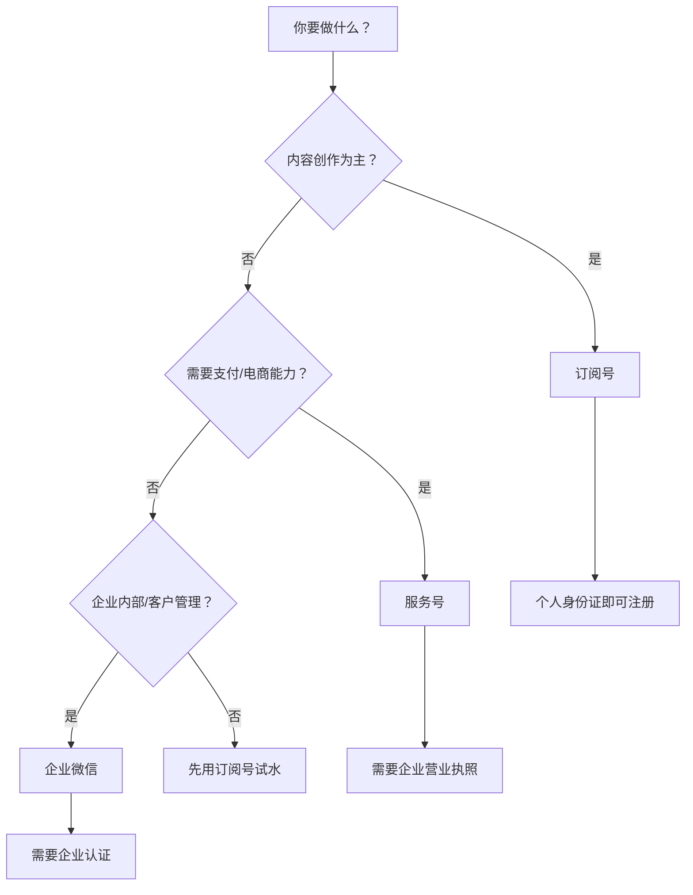
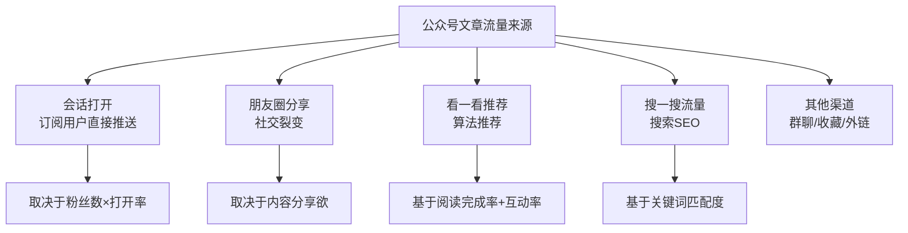
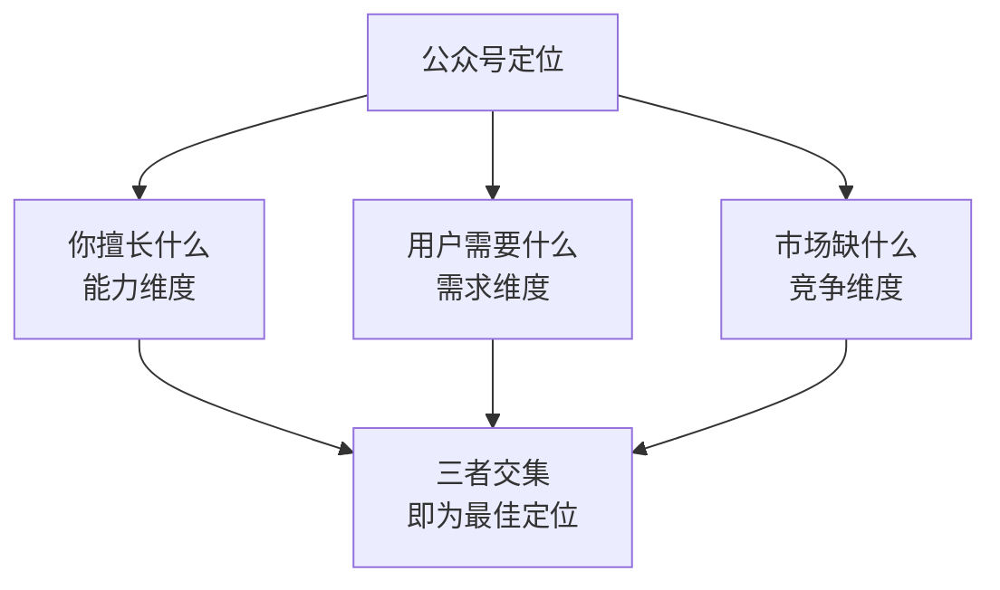
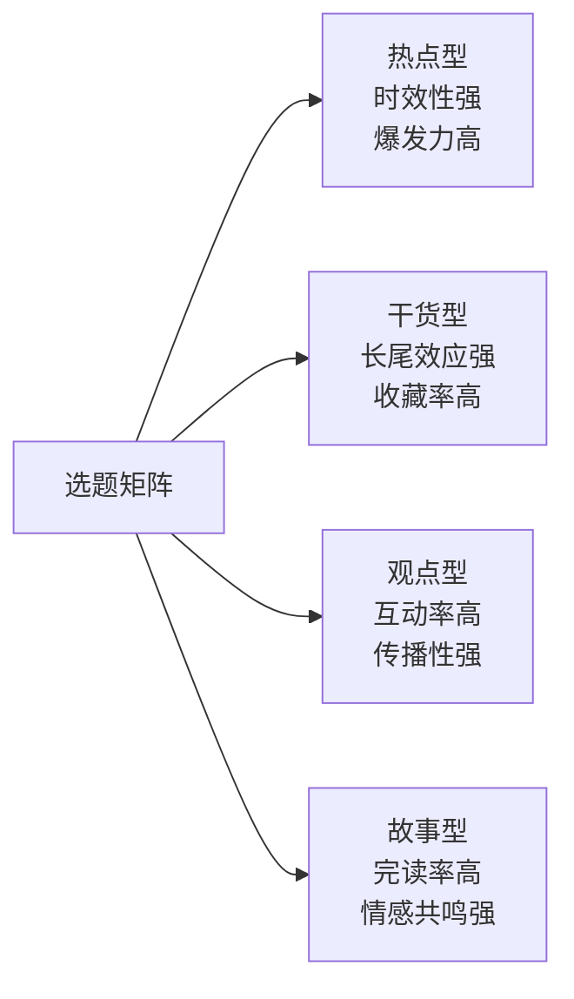
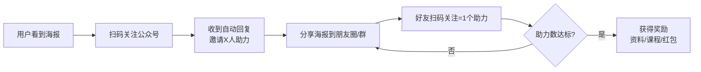
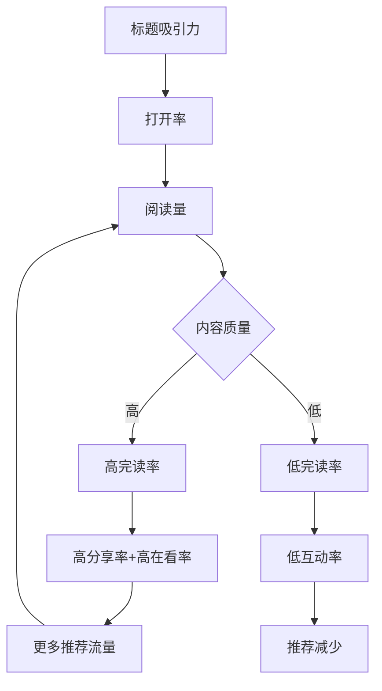
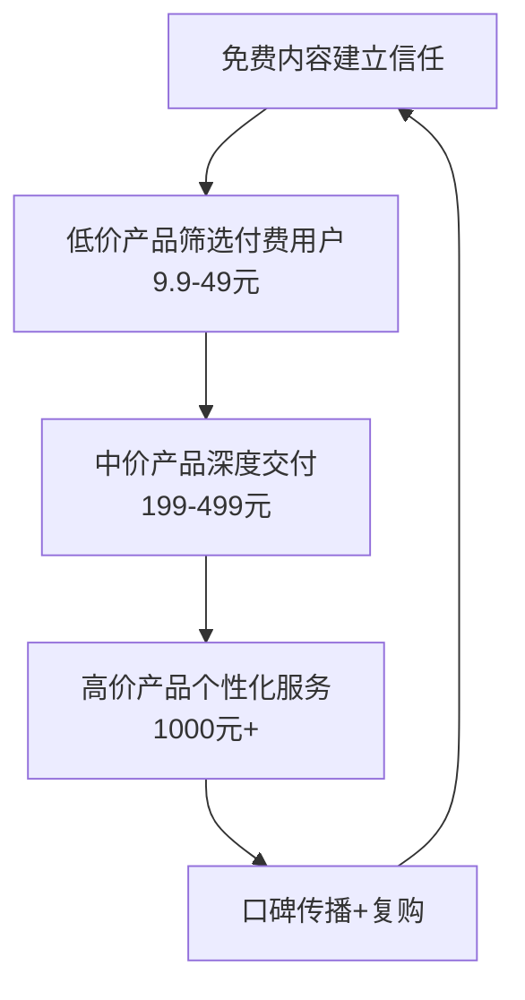
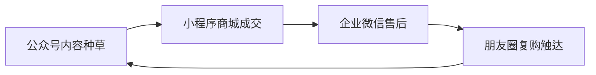
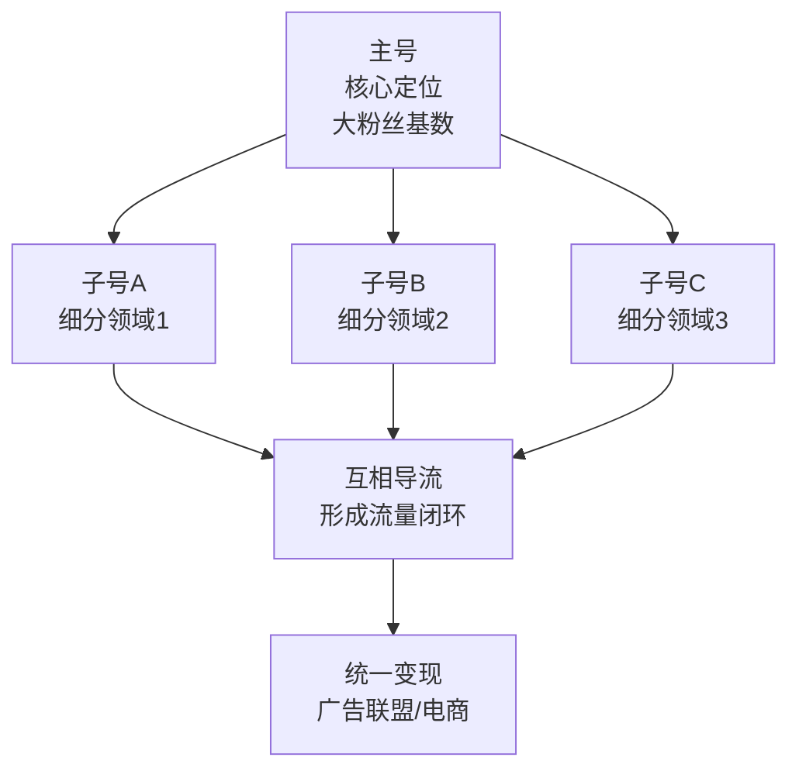

## 三、公众号运营技巧

微信公众号是中国内容生态中历史最悠久、商业价值最稳定的平台之一。截至2025年，微信公众平台注册账号超过**2000万个**，月活跃读者约**8亿**。与抖音的流量爆发逻辑不同，公众号的核心优势在于**深度内容承载**和**私域流量沉淀**——用户一旦关注你的公众号，后续每篇文章都能通过推送直达对方微信聊天列表，这种"订阅制"触达能力是短视频平台无法比拟的。

公众号的变现天花板极高：头部财经号「招财大牛猫」年广告收入过千万，知识付费大号「半佛仙人」单篇付费文章收入超百万，中小号通过流量主+知识付费+私域电商的组合变现，月入1-5万完全可行。但公众号的运营周期长、涨粉慢、对内容质量要求高，需要做好打持久战的准备。

本节将从微信生态的底层逻辑讲起，覆盖账号搭建、内容创作、涨粉策略、数据分析、变现路径、避坑指南等完整链路，帮你建立一套可复制的公众号运营体系。

### 1. 微信公众号平台机制深度解析

#### 1.1 账号类型选择

微信公众号分为三种类型，选错类型会直接影响后续的运营策略和变现能力：

| 类型 | 推送频率 | 消息展示位置 | 适用场景 | 变现能力 |
|------|----------|-------------|---------|---------|
| **订阅号** | 每天1次（可合并推送多篇） | 折叠在"订阅号消息"文件夹中 | 个人创作者、媒体、内容类 | ★★★（流量主+广告+知识付费） |
| **服务号** | 每月4次 | 直接出现在聊天列表 | 企业、品牌、工具类 | ★★★★★（支付接口+高级API+模板消息） |
| **企业微信** | 无限制（通过消息接口） | 企业微信应用 | 内部沟通、客户管理 | ★★★★（CRM+SCRM） |

**选型决策流程**：



**各类型详细对比**：

- **个人做内容**：选订阅号。每天一次推送频率足够，且注册门槛低，个人身份证即可注册。注册时选择"订阅号"类型，填写个人身份信息即可，整个流程10分钟内完成。
- **做知识付费/电商**：选服务号。服务号支持微信支付接口（用户可直接在文章内完成支付）、模板消息（可给用户发订单通知、发货提醒）、自定义菜单跳转小程序，这些能力对变现至关重要。但服务号注册需要企业营业执照，个人无法注册。解决方案是先注册个体工商户（成本约500元，3-5个工作日），再用营业执照注册服务号。
- **企业品牌运营**：服务号+订阅号双号并行。服务号负责交易和客户服务（每月4次推送用于重要通知和促销），订阅号负责内容传播（每天更新保持用户触达频率）。两者通过菜单栏和文末互推形成流量闭环。

**常见误区**：很多个人创作者一上来就注册服务号，觉得"功能更多"。但服务号每月只能推送4次，对于需要高频更新的内容创作者来说是致命限制——你一周写4篇好文章，但一个月只能发4次，其余3篇根本无法触达用户。而且服务号注册需要企业营业执照，个人无法注册。此外，服务号虽然出现在聊天列表中，但也更容易被用户忽略或关闭通知。

#### 1.2 推荐算法与流量分配

2023年之后，微信公众号从纯订阅制转向**"订阅+推荐"双轨制**。这意味着即使你的粉丝数为零，优质内容也能通过算法推荐获得曝光。理解这个机制是运营的前提。

公众号的流量来源可以拆解为五个渠道：



**各渠道占比与特征**：

| 流量渠道 | 典型占比 | 特点 | 优化方向 |
|---------|---------|------|---------|
| 会话打开 | 30-50% | 最稳定的流量来源，但受打开率影响大 | 优化标题、固定推送时间 |
| 朋友圈/群聊 | 20-30% | 社交裂变，高质量流量 | 创造"社交货币"型内容 |
| 看一看推荐 | 10-20% | 算法推荐，增长潜力最大 | 提升完读率和互动率 |
| 搜一搜搜索 | 5-15% | 精准流量，长尾效应强 | 关键词SEO优化 |
| 其他 | 5-10% | 群聊转发、收藏夹等 | 多触点布局 |

**"看一看"推荐机制详解**：

"看一看"是微信内置的信息流推荐入口，其推荐算法主要考量以下维度：

- **完读率**：权重最高。用户是否从头读到尾，这是衡量内容质量的核心指标。完读率>40%的文章更容易获得推荐。实操中，完读率受文章长度影响——2000字以内的短文完读率通常在60-80%，3000-5000字的中长文完读率在40-60%，超过5000字的长文完读率会降到30-40%。建议新手从2000-3000字起步，逐步提升文章长度。
- **互动率**：点赞、在看、评论、收藏的综合比率。其中"在看"的权重最高，因为"在看"会将文章推荐到用户的微信好友的"看一看"信息流中，产生二次传播。
- **停留时长**：用户在文章上的总阅读时间。长文如果能留住读者，算法会给予更多推荐。可以通过增加案例、插入互动问题、使用小标题分段等方式延长停留时长。
- **社交信号**：文章在朋友圈的分享次数、群聊中的转发次数。这些信号反映内容的社交价值。
- **账号权重**：历史内容质量、粉丝活跃度、违规记录等长期因素。持续输出高质量内容的账号会获得更高的基础推荐权重。

**关键认知**："在看"是公众号生态中最重要的互动指标。用户点击"在看"后，这篇文章会出现在他所有微信好友的"看一看"信息流中，这相当于一次免费的社交裂变。一篇获得大量"在看"的文章，可以通过这个机制触达数倍于粉丝数的用户。在文末引导用户点击"在看"（如"觉得有用就点个'在看'吧"），可以有效提升在看率。

#### 1.3 订阅号消息流改版的影响

2022年底，微信对订阅号消息列表进行了重大改版，从按时间排序变为**信息流推荐模式**。这次改版彻底改变了公众号的运营逻辑：

**改版前**：用户看到的是按推送时间排列的文章列表，先推先看。只要用户关注了你，你推的文章他都能看到（虽然不一定会点开）。

**改版后**：信息流中混入了算法推荐的内容，包括用户未关注的公众号文章。算法会根据用户的阅读习惯和兴趣标签，在订阅内容之间穿插推荐内容。

这意味着三个根本性变化：

1. **打开率整体下降**：你的文章不仅要和用户关注的其他号竞争，还要和算法推荐的内容竞争注意力。平均打开率从改版前的5-8%下降到2-4%。对于粉丝数较大的号（10万+），打开率可能降到1-2%。
2. **新号获得曝光机会**：即使0粉丝，优质内容也能通过推荐获得阅读量。这是改版最大的利好——过去新号没有粉丝就没有阅读量，现在只要内容质量高，算法会帮你找到目标读者。
3. **标题和封面图更加重要**：在信息流中，用户决定是否点击的窗口只有1-2秒，标题和封面图的吸引力直接决定点击率。一个优秀的标题可以让同一篇文章的阅读量相差5-10倍。

**应对策略**：改版后，"内容质量>粉丝数量"成为新的运营铁律。与其花钱买粉，不如把精力放在打磨每一篇文章的质量上。完读率、互动率、分享率这些内容质量指标，才是决定你能否获得算法推荐的关键。

### 2. 账号定位与人设打造

定位决定了公众号的天花板。一个模糊的定位会导致：算法无法给你打标签→推荐不精准→涨粉慢→变现难。而一个清晰的定位则能让每一篇内容都积累在同一个方向上，形成滚雪球效应。

#### 2.1 定位三要素模型



**实操方法——定位画布**：

| 维度 | 具体问题 | 示例（以财经号为例） |
|------|---------|-------------------|
| 能力 | 你的专业背景、技能、经验 | CFA持证人，10年基金从业 |
| 需求 | 目标用户的痛点和渴望 | 小白想学理财但看不懂专业文章 |
| 竞争 | 现有竞品的短板 | 头部号太专业，小白号太浅，缺"中等深度"内容 |
| **交集** | **三者的结合点** | **"用大白话讲清楚专业理财知识"** |

**定位验证的三步法**：

1. **搜索验证**：在微信搜一搜中输入你的目标关键词，看排在前面的公众号有多少、内容质量如何、有没有明显的差异化空间。如果前10个号都在做同样的事且粉丝数都在50万以上，说明这个赛道已经饱和；如果前10个号内容质量参差不齐、粉丝数在1-10万之间，说明还有机会。
2. **内容测试**：先不急着注册公众号，在知乎、小红书等平台发布5-10篇你定位方向的内容，观察数据反馈。如果阅读量和互动量都不错，说明这个定位有市场；如果数据很差，需要调整定位方向。
3. **付费意愿验证**：在目标用户群体中做小规模调研（微信群、朋友圈），问他们"如果有一个公众号专门讲XX，你愿意关注吗？如果有一个XX课程，你愿意付费吗？"。愿意付费的反馈比"感兴趣"的反馈有价值10倍。

#### 2.2 人设打造四层模型

人设不是"演人设"，而是把你真实性格中最有吸引力的部分放大呈现。微信生态的信任链路是：内容信任→人设信任→品牌信任，每一步都需要时间沉淀。

| 层级 | 内容 | 操作要点 |
|------|------|---------|
| 基础层 | 头像、昵称、简介 | 头像用真人照片或高辨识度logo；昵称简短好记，含关键词更好；简介一句话说清"你是谁+你能提供什么价值" |
| 内容层 | 写作风格、选题倾向 | 固定文风（幽默/严谨/犀利），让读者看到开头就知道是你写的 |
| 互动层 | 评论区回复风格 | 形成固定的互动模式（如每条精选评论都回复），增强粉丝黏性 |
| 价值层 | 核心理念和立场 | 有明确的观点和态度，不怕得罪人，"有态度"比"谁都不得罪"更容易吸引铁粉 |

**人设打造的具体操作**：

- **昵称公式**：[人名/昵称] + [领域关键词]。例如"小明说理财""程序员阿杰""设计师林林"。这样既有辨识度，又方便搜索。避免使用纯英文名、生僻字、过长的名字（超过7个字会被截断）。
- **头像选择**：真人照片的信任感最强（适合个人IP号），手绘卡通形象次之（适合轻松风格），纯logo适合品牌号。头像背景色要和公众号整体视觉风格一致。
- **简介模板**："我是[身份]，专注[领域]，帮你[解决什么问题]。[一句有态度的宣言]。"例如："我是老王，10年基金经理，用大白话帮你搞懂理财。不卖课，不推股，只说真话。"
- **签名栏**：公众号的"功能介绍"只有120个字，要把最核心的价值主张放在前40个字，因为搜索结果中只显示前40个字。

#### 2.3 差异化策略

在公众号红海中找到蓝海，核心方法是**切细分赛道**：

- **人群细分**：不做"育儿号"，做"二胎家庭育儿号"；不做"健身号"，做"久坐程序员健身号"；不做"理财号"，做"月薪5000的理财号"。人群越具体，内容越精准，转化率越高。
- **内容形式细分**：不做"历史号"，做"用漫画讲历史的号"；不做"读书号"，做"用音频讲书的号"；不做"科技号"，做"用漫画拆解科技产品的号"。形式创新可以让你在同质化严重的赛道中脱颖而出。
- **深度细分**：不做"科技号"，做"深度拆解科技公司商业模式的号"；不做"美食号"，做"从分子层面解释烹饪原理的号"。深度内容虽然受众窄，但粉丝质量极高，付费意愿强。
- **地域细分**：不做"美食号"，做"深圳打工人下班后能做的快手菜"；不做"房产号"，做"杭州未来科技城买房指南"。地域细分适合做本地生活、房产、教育等领域。

### 3. 内容创作方法论

内容是公众号的生命线。与短视频平台不同，公众号读者对内容质量的要求更高——他们愿意花3-10分钟阅读一篇文章，但前提是这篇文章能持续提供价值。

#### 3.1 选题体系搭建

选题决定了文章的流量上限。一个好选题能让普通文笔的文章获得10万+阅读，一个烂选题能让文采飞扬的文章无人问津。

**选题的四个象限**：



| 选题类型 | 特征 | 适用场景 | 流量特征 | 典型标题结构 |
|---------|------|---------|---------|------------|
| 热点型 | 蹭时事热点，24小时内发文 | 快速涨粉、提升曝光 | 爆发力强但衰减快 | "[热点事件]背后，藏着一个被忽视的真相" |
| 干货型 | 实用教程、工具推荐、方法论 | 建立专业形象、促进收藏 | 长尾流量稳定 | "XX完整指南：从入门到精通的XX个步骤" |
| 观点型 | 独特见解、反常识分析 | 引发讨论、提升互动 | 传播性强但有争议风险 | "我为什么反对XX？看完这XX个数据你就懂了" |
| 故事型 | 个人经历、案例分析、人物故事 | 建立情感连接、提升完读率 | 共鸣感强、转发率高 | "XX岁那年，我做了一个改变人生的决定" |

**健康的内容配比**：长期稳定运营的公众号，建议采用"4:3:2:1"的选题配比——40%干货型（建立专业形象）、30%观点型（提升互动和传播）、20%故事型（增强情感连接）、10%热点型（借势涨粉）。这个比例可以根据你的定位微调，但核心原则是：干货为骨架，故事为血肉，观点为灵魂，热点为调味。

**日常选题的五个来源**：

1. **读者私信和评论区**：最真实的用户需求信号。如果3个以上读者问同一个问题，这就是一个好选题。建议每周整理一次评论区和私信，把高频问题记录到选题库中。
2. **竞品分析**：关注20-50个同领域头部号，用新榜或西瓜数据监控他们的爆款文章。分析哪些文章数据好、为什么好，然后用你的视角重新写。注意不是抄袭，而是找到差异化角度。
3. **搜索热点**：微信搜一搜的"热门搜索"、百度指数、知乎热榜、微博热搜，都是选题灵感来源。建议每天花10分钟浏览这些平台，把和你领域相关的热点记录下来。
4. **行业报告和数据**：艾瑞咨询、QuestMobile、CNNIC等机构发布的行业报告，提取数据点作为选题素材。数据型内容天然具有权威性和传播性。
5. **个人经历和反思**：最独特的内容来源，别人无法复制。把你在工作生活中踩过的坑、总结的方法写出来。真实经历的说服力远超理论分析。

**选题评估清单**（发布前自检）：

- [ ] 目标读者看到标题会想点开吗？（找3个目标用户测试标题）
- [ ] 这个话题有人搜索吗？（在搜一搜验证关键词热度）
- [ ] 这个角度别人写过吗？我能写得更好/不同吗？（竞品对比）
- [ ] 读完之后读者能获得什么具体价值？（价值感量化）
- [ ] 读者会想转发给朋友吗？为什么？（分享动机分析）
- [ ] 这篇文章能带来新关注吗？（涨粉潜力评估）

#### 3.2 标题创作技术

在信息流中，标题是决定生死的第一关。公众号标题的点击率（CTR）直接影响文章的推荐量和最终阅读数。

**高点击率标题的七个公式**：

| 公式 | 示例 | 原理 | 适用选题类型 |
|------|------|------|------------|
| 数字+利益点 | "月薪5000到月入5万，我用了这3个方法" | 数字具体化，降低理解成本 | 干货型 |
| 痛点+解决方案 | "为什么你存不下钱？因为你不知道这个账户分离法" | 精准击中痛点 | 干货型 |
| 反常识+悬念 | "我劝你别急着买房，看完这篇再说" | 引发好奇心和认知冲突 | 观点型 |
| 身份+共鸣 | "30岁程序员的深夜崩溃：不是技术不行，是…" | 身份认同触发点击 | 故事型 |
| 对比+冲突 | "同事月薪3万只存2千，我月薪1万存8千，差在哪" | 对比制造戏剧张力 | 干货型/故事型 |
| 警告+紧迫 | "2025年还在用这种理财方式，你会亏得很惨" | 损失厌恶心理 | 观点型 |
| 权威+干货 | "前阿里P9总结的10条职场铁律，条条扎心" | 权威背书增加可信度 | 干货型 |

**标题创作的实操流程**：

1. **先写10个标题**：不要只写1个标题就发布。至少写10个不同角度的标题，然后从中选最好的。
2. **用公式套用**：把你的文章核心价值点套入上述7个公式，每个公式至少生成1个标题。
3. **A/B测试**：如果有条件，可以在朋友圈或读者群中测试2-3个标题的点击意愿，选数据最好的那个。
4. **检查字数**：标题控制在18-28个字之间。太短信息量不足，太长会被截断。

**标题红线**：

- 不要用问号结尾的疑问句作为标题（"如何理财？"这种标题点击率极低，因为它没有给出任何承诺）
- 不要超过32个字（超出部分在信息流中被截断，关键信息丢失）
- 不要使用纯抽象概念（"论资产配置的重要性"——没人想点开这种学术论文式的标题）
- 不要做标题党（标题承诺的内容文章里必须兑现，否则掉粉且损害信任）
- 不要使用过于夸张的数字（"月入百万"这种标题会让读者产生不信任感）

#### 3.3 正文结构设计

公众号文章的正文结构直接决定完读率。完读率不仅影响算法推荐，更决定了读者是否会分享和关注。

**黄金结构——SCQA+递进模型**：

```text
S (Situation) 情境：用读者熟悉的场景开头，建立共鸣（100-200字）
C (Complication) 冲突：抛出问题或矛盾，制造阅读动力（100-200字）
Q (Question) 疑问：提出核心问题，引导读者继续往下看（50-100字）
A (Answer) 答案：分层次展开解答，这是文章的主体（2000-5000字）
总结 (Conclusion)：归纳核心观点，给出行动建议（200-500字）
```

**SCQA结构的实战示例**（以理财类文章为例）：

> **S（情境）**：小王月薪1.5万，工作3年，银行卡里只有2万块。每次发工资都想着"这个月一定要存钱"，但到了月底又所剩无几。
>
> **C（冲突）**：他不是不努力——不点外卖、不买新衣服、周末宅家。但钱就像长了腿一样，不知不觉就花光了。
>
> **Q（疑问）**：问题到底出在哪？是收入太低，还是花钱方式有问题？
>
> **A（答案）**：都不是。问题出在你没有建立一个"自动存钱系统"……（展开3-5个具体方法，每个方法配案例和数据）
>
> **总结**：存钱不靠意志力，靠系统。今天就开始建立你的"三账户体系"，3个月后你会感谢自己。

**提升完读率的七个技巧**：

1. **开头3秒法则**：前3行必须抓住读者。不要以"大家好""今天来聊聊"这种废话开头。直接抛出一个惊人的事实、一个扎心的问题、或一个反常识的观点。例如："你知道吗？90%的人理财失败，不是因为不懂投资，而是因为一个你从来没意识到的心理陷阱。"
2. **段落不超过4行**：手机屏幕上超过4行的文字会给人压迫感，读者会跳过。每段控制在2-3行，宁可多分段也不要堆砌长段落。
3. **每300-500字插入一个视觉元素**：图片、表格、引用框、分割线，打破纯文字的视觉疲劳。视觉元素不仅缓解阅读压力，还能传递信息——一张表格的信息密度远超一段文字。
4. **使用小标题做路标**：让扫读型读者也能快速找到感兴趣的部分。小标题要具体、有信息量，不要用"第一部分""第二部分"这种无效标题。
5. **制造"翻页感"**：在文末或大段论述结尾使用悬念过渡（"但真正让我震惊的是接下来发生的事""你以为这就完了？真正厉害的还在后面"）。
6. **数字和具体案例**：把"很多人"换成"68%的90后"，把"效果很好"换成"3个月粉丝从2000涨到5万"。具体的数字和案例比模糊的描述有说服力10倍。
7. **金句收尾**：文章最后一句话要有记忆点，能被读者截图分享。例如："理财不是有钱人的专利，而是普通人对抗不确定性的最好武器。"

#### 3.4 排版与视觉设计

公众号的排版直接影响阅读体验和专业感。好的排版不会被注意到，差的排版会让人立刻关闭。

**排版参数推荐**：

| 参数 | 推荐值 | 说明 |
|------|--------|------|
| 正文字号 | 15-16px | 小于14px在手机上阅读困难，大于17px显得松散 |
| 标题字号 | 18-20px | 比正文大2-4px即可，不要太大 |
| 行间距 | 1.75-2倍 | 保证呼吸感，长文建议用2倍 |
| 字间距 | 0.5-1px | 略微增加可读性 |
| 两端缩进 | 8-16px | 避免文字贴边，建议16px |
| 段间距 | 15-20px | 段落之间的间距应大于行间距 |
| 正文颜色 | #3f3f3f 或 #595959 | 比纯黑柔和，减轻视觉疲劳 |
| 强调色 | 与品牌色一致 | 全文统一使用一种强调色，不超过2种 |

**排版工具推荐**：

- **135编辑器**（www.135editor.com）：模板最丰富，免费版够用。适合没有设计基础的运营者，直接套用模板即可。付费版提供更多模板和去水印功能。
- **秀米**（xiumi.us）：交互组件丰富，适合做可视化长图。特色功能是"秀制作"，可以做出滑动、点击等交互效果。
- **壹伴**（yiban.io）：浏览器插件，直接在公众号后台排版。不需要复制粘贴到第三方工具，效率最高。支持一键排版、配图搜索、数据查看。
- **Markdown Nice**：支持Markdown转公众号格式，适合程序员和技术类公众号。写Markdown时直接预览公众号效果。

**排版误区**：

- 花哨的背景色和边框——分散注意力，显得不专业。背景色建议只用浅灰（#f7f7f7）或浅蓝（#f0f5ff），不要用红色、绿色等刺眼的颜色。
- 每段都加粗——全加粗等于没加粗，强调失效。一篇文章中加粗的文字不超过总文字量的10%。
- 过多emoji——适量使用增加活力，过多则像营销号。建议每500字使用1-2个emoji。
- 图片不居中、大小不统一——视觉杂乱。所有配图统一居中对齐，宽度保持一致（建议100%宽度）。
- 正文中使用过多颜色——全文除了正文色和强调色，不要再使用其他颜色。

#### 3.5 公众号SEO优化

微信搜一搜的月活用户超过**7亿**，已经成为仅次于百度的第二大搜索引擎。优化公众号的搜索排名，可以获得源源不断的精准长尾流量。

**SEO优化的五个层面**：

1. **账号名称SEO**：在公众号名称中包含核心关键词。例如"产品经理笔记"比"小明的日常"更容易被搜索到。如果你的领域关键词已经被占用，可以尝试"[昵称]+[领域]"的组合，如"老王说理财""小李的运营笔记"。
2. **文章标题SEO**：标题中必须包含目标关键词，且关键词尽量靠前。例如"2025年最值得关注的10只基金"比"我最近发现了一些不错的基金"搜索排名更高。搜一搜的算法会优先匹配标题中的关键词。
3. **正文关键词布局**：目标关键词在正文中自然出现5-10次，分布在开头、中间、结尾。不要堆砌关键词，保持自然流畅。关键词密度控制在2-5%之间。
4. **标签设置**：每篇文章可以设置最多3个话题标签，选择搜索量大的标签。标签的选择直接影响文章在搜一搜中的分类和推荐。
5. **账号简介优化**：简介中包含领域关键词，帮助算法理解你的账号定位。简介中的关键词会被搜一搜索引。

**关键词研究方法**：

```text
步骤1：在微信搜一搜输入你的领域关键词
步骤2：观察下拉联想词（这些是用户高频搜索的长尾词）
步骤3：点击"搜一搜"后，查看"大家都在搜"板块
步骤4：把这些关键词整理成选题库，每个关键词写一篇文章
步骤5：定期更新关键词库（每月一次），跟踪搜索趋势变化
```

**SEO的长期价值**：与热点内容的爆发式流量不同，SEO带来的流量是持续的、精准的。一篇针对"2025年基金入门指南"优化的文章，可能在发布后的1-2年内持续通过搜索带来新读者。这就是所谓的"长尾效应"——前期投入一次，后期持续产出。

### 4. 涨粉策略全攻略

公众号涨粉是所有运营者最关心的问题。与短视频平台的爆发式涨粉不同，公众号涨粉更像是"滴灌式"增长——需要持续、稳定、多渠道地获取新用户。

#### 4.1 内容驱动涨粉

这是最健康、最可持续的涨粉方式。通过优质内容自然吸引关注。

**内容涨粉的三个杠杆**：

1. **朋友圈裂变**：文章被读者分享到朋友圈，读者的微信好友看到后点击阅读→关注。一篇被广泛分享的文章，可以通过社交链路触达数万甚至数十万人。提升分享率的关键是创造"社交货币"——让读者分享你的文章后，能在朋友圈显得有见识、有品位、有爱心。
2. **看一看推荐**：读者点击"在看"后，文章出现在读者好友的"看一看"信息流中。这是微信生态中成本最低的裂变方式。一篇获得100个"在看"的文章，假设每个用户平均有200个微信好友，就能触达2万人。
3. **搜一搜长尾**：SEO做得好的文章，在发布数月后仍然能通过搜索带来新关注。这是被动流量，不需要额外推广。

**提升分享率的内容设计**：

读者愿意分享的文章通常满足以下条件之一：

| 分享动机 | 内容类型 | 示例 | 如何设计 |
|---------|---------|------|---------|
| **社交货币** | 能让分享者显得有见识/有品位 | "深度分析XX行业趋势" | 提供独到见解、前沿信息、深度分析 |
| **实用价值** | 对分享者的朋友也有用 | "深圳2025年最全买房攻略" | 提供具体工具、模板、清单、攻略 |
| **情感共鸣** | 表达了分享者想说但说不出的话 | "30岁，我不再焦虑了" | 写出真实感受、戳中痛点、引发共鸣 |
| **身份认同** | 表明分享者的群体身份 | "程序员才懂的10个梗" | 创造"我们感"、强化群体标签 |
| **利他心理** | 分享者觉得对别人有帮助 | "提醒家人别买这种保险" | 提供预警、提醒、避坑指南 |

#### 4.2 裂变活动涨粉

裂变活动是短期内快速涨粉的有效手段，但需要精心设计。

**经典裂变模型——任务宝裂变**：



**裂变活动关键参数**：

| 参数 | 推荐值 | 说明 |
|------|--------|------|
| 助力人数 | 3-5人 | 太高用户放弃率高，太低涨粉效果差 |
| 奖励类型 | 虚拟产品优先 | 电子书、课程、模板，边际成本为零 |
| 活动时长 | 3-7天 | 太短传播不充分，太长热度衰减 |
| 海报设计 | 5秒能看懂 | 大标题+利益点+二维码+紧迫感 |

**裂变海报设计要点**：

海报是裂变活动的核心物料，一张好海报的转化率可以是差海报的5-10倍。海报设计遵循"5秒法则"——用户在朋友圈刷到海报，5秒内必须看懂"这是什么、对我有什么好处、我该怎么做"。

海报必须包含的五个元素：
1. **主标题**：一句话说清利益点，如"免费领取价值299元的Python入门课程"
2. **副标题**：补充说明，如"100个实战案例+配套代码+社群答疑"
3. **信任背书**：讲师简介、学员数量、好评截图等
4. **二维码**：公众号二维码，尺寸要足够大，扫码成功率高
5. **紧迫感**：限时/限量信息，如"仅限前500名""活动倒计时3天"

**裂变工具推荐**：零一裂变、爆汁裂变、小裂变等SaaS平台，提供完整的裂变活动搭建能力。费用通常在200-1000元/月，包含海报生成、自动回复、数据统计等功能。

**注意事项**：
- 裂变涨粉带来的用户质量参差不齐，需要通过后续优质内容留存
- 微信对诱导分享有严格限制，活动设计要避免触碰红线（不能用"不转不是中国人"这类话术）
- 裂变活动做完后要有承接内容，否则新粉很快取关。建议在活动结束后连续3天推送高质量内容，留住新粉

#### 4.3 矩阵导流涨粉

利用其他平台的流量为公众号导流。

**各平台导流方法**：

| 平台 | 导流方式 | 效率 | 注意事项 |
|------|---------|------|---------|
| 知乎 | 在回答中引导关注公众号获取完整资料 | ★★★★ | 不要硬广，提供真正有价值的内容 |
| 小红书 | 笔记末尾引导搜索公众号名称 | ★★★ | 不能直接放二维码，需要用文字引导 |
| 抖音 | 个人主页留公众号名称 | ★★★ | 简介中写"更多干货关注公众号XXX" |
| B站 | 视频简介和个人空间留公众号 | ★★★ | 结尾口播引导 |
| 微信群 | 分享文章到相关主题群 | ★★★★★ | 先在群里活跃，建立信任后再分享 |
| 线下活动 | 名片/传单印二维码 | ★★ | 适合本地号和线下业务 |

**矩阵导流的关键原则**：不要在其他平台发"请关注我的公众号"这种硬广。正确做法是：在其他平台发布高质量内容，在内容中自然地提到"完整版/详细版/资料包在我的公众号XXX中"。用户是因为你的内容价值而关注，不是因为你的广告。

#### 4.4 互推涨粉

当你的公众号达到一定规模（通常5000粉丝以上），可以和同量级的号进行互推。

**互推的形式**：

1. **文末互推**：在文章末尾推荐对方的公众号，对方也在文末推荐你。成本最低，效果一般。适合初次合作试水。
2. **次条互推**：把次条（第二篇文章）的位置给对方，对方同样给你。曝光量更大，因为次条也有独立的推送入口。
3. **内容互推**：在正文中自然地提到对方的公众号和优质内容。转化率最高但要求内容相关性强，且需要真正的认可。
4. **联合活动**：两个号一起做活动，共同出奖品，共享涨粉成果。效果最好但组织成本高。

**互推选择标准**：
- 粉丝量级相近（差距不超过2倍）
- 内容领域相关但不直接竞争
- 粉丝画像相似（年龄、性别、消费能力）
- 对方号的打开率和互动率健康（排除刷数据的号）

**如何找到互推伙伴**：
1. 在新榜、西瓜数据等平台搜索同领域号
2. 加入公众号运营交流群（搜"公众号互推群"）
3. 在文章评论区和同领域号主互动
4. 参加线下自媒体交流活动

#### 4.5 付费涨粉

当预算允许时，可以通过付费方式快速获取精准粉丝。

**付费涨粉渠道对比**：

| 渠道 | 单粉成本 | 粉丝质量 | 适合阶段 | 注意事项 |
|------|---------|---------|---------|---------|
| 微信广告（广点通） | 1-5元/粉 | 中高 | 有一定预算的成熟号 | 需要优化投放素材和定向 |
| 知乎知+ | 2-8元/粉 | 高 | 知识类、专业类号 | 内容质量直接影响转化率 |
| 小红书薯条 | 1-3元/粉 | 中 | 生活方式类号 | 素材要符合小红书调性 |
| 头条号互推 | 0.5-2元/粉 | 中低 | 预算有限的新号 | 粉丝精准度较低 |

**付费涨粉的ROI计算**：假设你通过付费获取1000个粉丝，成本3000元（3元/粉）。如果这1000个粉丝中有100人购买你的99元课程，收入就是9900元，ROI为230%。但如果粉丝质量差，购买率只有1%，收入只有990元，ROI就是-67%。所以付费涨粉的核心不是价格，而是粉丝质量。

### 5. 数据分析与运营优化

数据是公众号运营的指南针。没有数据支撑的运营是盲目的。

#### 5.1 核心数据指标

公众号后台提供丰富的数据，重点关注以下指标：

| 指标 | 计算方式 | 健康值 | 优化方向 |
|------|---------|--------|---------|
| 打开率 | 会话打开数/粉丝数 | 3-8% | 优化标题和推送时间 |
| 分享率 | 分享人数/阅读人数 | 3-10% | 创造"社交货币"内容 |
| 完读率 | 阅读完成人数/阅读人数 | 40-70% | 优化内容质量和排版 |
| 在看率 | 在看数/阅读人数 | 1-5% | 在文末引导点击在看 |
| 收藏率 | 收藏数/阅读人数 | 2-8% | 增加实用干货密度 |
| 净增粉丝 | 新关注-取关 | 正值 | 综合优化内容和运营 |
| 阅读来源分布 | 各渠道占比 | 多元化 | 不过度依赖单一渠道 |

**指标之间的关系**：



理解这个循环很重要：标题决定打开率，内容决定完读率，完读率决定推荐量，推荐量决定下一轮的阅读量。这是一个正向循环（好内容→更多推荐→更多阅读）或负向循环（差内容→更少推荐→更少阅读）。

#### 5.2 数据分析方法

**单篇文章分析**：

发布后24小时、48小时、72小时各看一次数据。重点关注：
- 前2小时的打开速度（反映标题吸引力和推送时间是否合适）
- 分享率与在看率（反映内容传播力，这两个指标决定推荐量）
- 完读率（反映内容质量和排版效果）
- 新关注来源（反映涨粉效果，新关注数/阅读数=关注转化率）

**周期性分析**：

每周/每月进行一次数据复盘，关注：
- 阅读量趋势（上升/持平/下降，用折线图展示）
- 粉丝增长趋势（日均净增粉丝数）
- 哪些选题类型数据最好（按选题象限分类统计）
- 最佳发布时间段（对比不同时段的打开率）
- 粉丝画像变化（年龄、地域、性别、设备）

**竞品对标分析**：

使用新榜（newrank.cn）、西瓜数据（data.xiguaji.com）等工具，定期监控竞品号的数据表现：
- 竞品的爆款文章选题和标题（分析为什么爆）
- 竞品的更新频率和推送时间（参考最佳实践）
- 竞品的粉丝增长趋势（判断赛道热度）
- 竞品的广告主和变现方式（学习变现策略）

**数据分析模板**（每周复盘用）：

```text
## 本周数据复盘（X月X日-X月X日）

### 核心数据
- 总阅读量：XXX（较上周+X%）
- 新增粉丝：XXX（较上周+X%）
- 取关粉丝：XXX
- 净增粉丝：XXX

### 单篇数据TOP3
1. 《标题》- 阅读XXX | 打开率X% | 分享率X% | 完读率X%
2. 《标题》- 阅读XXX | 打开率X% | 分享率X% | 完读率X%
3. 《标题》- 阅读XXX | 打开率X% | 分享率X% | 完读率X%

### 数据洞察
- 本周表现最好的选题类型：XX型
- 最佳推送时间：XX:XX
- 需要改进的指标：XX

### 下周计划
- 选题方向：XXXX
- 重点优化：XXXX
```

#### 5.3 推送时间优化

推送时间对打开率有直接影响。不同受众群体的活跃时间不同：

| 目标人群 | 最佳推送时间 | 原因 |
|---------|------------|------|
| 职场白领 | 7:30-8:30 / 12:00-13:00 / 21:00-22:00 | 通勤、午休、睡前三个碎片时间段 |
| 大学生 | 10:00-11:00 / 22:00-23:00 | 上午课间、晚上宿舍时间 |
| 宝妈群体 | 9:00-10:00 / 14:00-15:00 / 21:00-22:00 | 送完孩子、午睡后、孩子睡后 |
| 商务人士 | 7:00-8:00 / 18:00-19:00 | 早起和下班路上 |
| 自由职业 | 10:00-11:00 / 15:00-16:00 | 上午后、下午茶时间 |

**A/B测试方法**：同一个星期内，每天在不同时间段推送类似质量的内容，对比各时段的打开率数据。连续测试2-3周，取平均值，找到你的最佳推送时间。找到后固定下来，让读者形成阅读习惯。

### 6. 变现路径详解

公众号的变现方式多元且成熟，以下是按收入稳定性和门槛排列的变现路径。

#### 6.1 流量主收入

流量主是微信官方提供的广告变现功能，相当于YouTube的AdSense。

**开通条件**：
- 订阅号：粉丝数≥500
- 服务号：粉丝数≥1000

**广告类型与收益**：

| 广告类型 | 展示位置 | 单次收益参考 | 适合场景 |
|---------|---------|------------|---------|
| 底部广告 | 文章末尾 | 0.5-3元/千次曝光 | 所有文章 |
| 中部广告 | 文章中间 | 1-5元/千次曝光 | 长文（3000字以上） |
| 视频贴片广告 | 视频内容前 | 2-8元/千次曝光 | 视频内容号 |
| 互选广告 | 品牌主定向投放 | 5-20元/千次曝光 | 头部号（10万+粉丝） |

**流量主收入计算示例**：

假设你的公众号有2万粉丝，平均打开率5%，每篇文章平均阅读量1000次：
- 底部广告：1000次阅读 × 2元/千次 = 2元/篇
- 中部广告：1000次阅读 × 3元/千次 = 3元/篇
- 每天1篇，月收入约：(2+3) × 30 = 150元

看起来不多，但流量主是被动收入，不需要额外投入。随着粉丝和阅读量增长，收入会线性增长。当粉丝达到10万、阅读量5000+时，月流量主收入可达1000-3000元。

**提升流量主收入的技巧**：
- 文章越长，广告展示机会越多，收入越高
- 提高阅读量是提升收入的根本（增加粉丝、提升打开率、优化标题）
- 底部广告和中部广告可以同时开启
- 不要为了展示广告而刻意拉长文章，影响阅读体验会导致掉粉

#### 6.2 广告投放（软文/硬广）

当公众号粉丝达到一定规模（通常1万以上），会有品牌主主动找你投放广告。

**报价参考**：

| 粉丝量级 | 头条报价参考 | 次条报价参考 | 说明 |
|---------|------------|------------|------|
| 1-3万 | 500-3000元 | 200-1000元 | 垂直领域溢价更高 |
| 3-10万 | 3000-10000元 | 1000-5000元 | 可以接品牌广告 |
| 10-50万 | 1-5万元 | 5000-2万元 | 有议价权 |
| 50万+ | 5-20万元 | 2-8万元 | 头部号，品牌争相投放 |

**报价的影响因素**：

报价不仅看粉丝数，还要看以下因素：
- **领域溢价**：金融、医疗、教育等高价值领域的报价是泛娱乐领域的2-5倍
- **打开率**：打开率高的号，同等粉丝数下报价更高
- **粉丝画像**：一二线城市、高消费能力的粉丝更值钱
- **历史广告效果**：如果之前接的广告转化率高，品牌主愿意出更高价格

**接广告的渠道**：
- **微信官方互选平台**：微信广告官方对接平台，品牌主和公众号双向选择。优点是平台担保，缺点是抽成较高。
- **新榜有赚**：新榜旗下的广告交易平台，覆盖大量品牌主。适合中小号。
- **直接商务合作**：通过公众号简介中的联系方式直接对接品牌方。没有中间商抽成，但需要自己谈价格和排期。
- **MCN机构**：加入MCN可以获得更稳定的广告资源，但需要分成（通常20-30%）。适合不想自己谈商务的号主。

**广告内容的底线**：
- 不接黑五类广告（药品、医疗器械、丰胸、减肥、增高）
- 不接P2P理财、虚拟币等高风险金融广告
- 广告内容必须标注"广告"或"推广"
- 不夸大产品效果，避免法律风险
- 保持广告频率不超过总发文的20%，否则掉粉严重
- 接广告前核实品牌资质和产品信息，避免为虚假产品背书

#### 6.3 知识付费

知识付费是公众号变现的高阶方式，利润空间远大于广告。

**知识付费产品形态**：

| 产品形态 | 价格区间 | 制作难度 | 复购率 | 适合人群 |
|---------|---------|---------|--------|---------|
| 付费文章 | 1-30元 | ★ | 低 | 有深度独家内容的号 |
| 电子书/资料包 | 9.9-99元 | ★★ | 低 | 内容系统化的号 |
| 音频课程 | 99-399元 | ★★★ | 中 | 有专业背景的号 |
| 视频课程 | 199-1999元 | ★★★★ | 中 | 需要演示教学的号 |
| 训练营 | 299-2999元 | ★★★★★ | 高 | 有社群运营能力的号 |
| 社群/会员 | 99-999元/年 | ★★★ | 高 | 有持续内容输出能力的号 |
| 一对一咨询 | 500-5000元/次 | ★ | 中 | 有行业权威的号 |

**知识付费的冷启动路径**：



**关键认知**：不要一上来就做高价产品。先用免费内容（公众号文章）建立信任，再用低价产品（付费文章、资料包）筛选出愿意付费的用户，最后向这些用户推荐高价产品。这个漏斗模型的每一步都在筛选，最终沉淀下来的是高价值的铁杆粉丝。

**付费文章的写作技巧**：

付费文章是门槛最低的知识付费形式，微信公众号原生支持。写作要点：
1. **免费部分要足够好**：付费墙之前的内容必须让读者觉得"这篇值得付费看完"。免费部分占全文的30-40%，提供核心问题的铺垫和背景。
2. **付费部分要有"哇点"**：读者付费后，必须获得超出预期的价值。提供独家数据、内部方法、实操模板等"干货中的干货"。
3. **定价策略**：1-3元适合试水，5-10元适合有一定粉丝基础的号，15-30元适合有独家内容的号。价格太低读者不珍惜，价格太高转化率低。
4. **频率控制**：付费文章不超过总发文的20%，否则读者会觉得"什么都收费"。

#### 6.4 私域电商

公众号是私域流量的核心枢纽，可以通过微信生态的商业工具实现电商变现。

**公众号+小程序电商模式**：



**适合公众号带货的品类**：
- 图书（佣金10-30%，与内容高度匹配，是最自然的带货品类）
- 知识产品（课程、会员，毛利高，不需要物流）
- 食品生鲜（复购率高，适合生活类号）
- 美妆个护（利润高，适合女性用户群）
- 数码配件（适合科技类号）

**带货内容的写法**：

公众号带货不是硬推产品，而是"内容即广告"。正确做法是：在一篇有价值的内容中自然地引入产品。例如，一篇讲"高效学习方法"的文章，在推荐学习工具时自然地带出你卖的课程链接。读者因为认同你的方法论而购买，而不是被广告说服。

### 7. 公众号运营工具箱

工欲善其事，必先利其器。以下是公众号运营全链路的工具推荐。

#### 7.1 数据分析工具

| 工具 | 功能 | 价格 | 网址 |
|------|------|------|------|
| 新榜 | 行业数据监控、竞品分析、广告对接 | 基础免费 | newrank.cn |
| 西瓜数据 | 公众号阅读量监控、粉丝画像 | 基础免费 | data.xiguaji.com |
| 公众号后台 | 官方数据统计 | 免费 | mp.weixin.qq.com |
| 友望数据 | 公众号排名、爆文分析 | 部分免费 | youwant.cn |

#### 7.2 内容创作工具

| 工具 | 用途 | 说明 |
|------|------|------|
| ChatGPT/文心一言 | 辅助写作、大纲生成 | 起草初稿，人工润色 |
| Canva可画 | 封面图、配图设计 | 模板丰富，操作简单 |
| ProcessOn | 流程图、思维导图 | 文章配图常用 |
| Unsplash/Pexels | 免费高质量图片 | 商用无版权风险 |
| 花瓣网 | 图片灵感收集 | 国内版Pinterest |

#### 7.3 运营效率工具

| 工具 | 用途 | 说明 |
|------|------|------|
| 壹伴助手 | 浏览器插件，增强后台功能 | 排版、配图、数据一键操作 |
| 微小宝 | 多账号管理 | 适合矩阵运营者 |
| 135编辑器 | 文章排版 | 模板最多，免费版够用 |
| 墨滴 | Markdown转公众号 | 程序员首选 |

### 8. 常见误区与避坑指南

#### 误区一：只关注粉丝数

**错误表现**：把粉丝数当成唯一目标，用裂变、互关等手段快速涨粉。

**为什么是错的**：10万僵尸粉不如1万活跃粉丝。粉丝数是虚荣指标，打开率、互动率才是真实指标。一个1万粉丝但打开率8%的号，广告价值远高于一个10万粉丝但打开率0.5%的号。品牌主投放广告时，首先看的是打开率和互动率，而不是粉丝数。

**正确做法**：关注"有效粉丝数"——即会打开你文章、和你互动、为你付费的粉丝。涨粉要稳不要快，宁可慢一点也要保证粉丝质量。判断粉丝质量的方法：观察新关注粉丝的来源，自然搜索和内容推荐带来的粉丝质量最高，裂变活动带来的粉丝质量最低。

#### 误区二：追热点上瘾

**错误表现**：每天都在追热点，没有自己的内容主线。

**为什么是错的**：热点带来的流量是暂时的，而且热点内容的粉丝转化率很低——用户因为热点来看你，但不会因为你追热点而持续关注你。长期追热点会让你的账号定位模糊，算法无法给你打标签，推荐流量起不来。更严重的是，追热点会让你陷入"内容焦虑"——每天都在等热点，没有热点就不知道写什么。

**正确做法**：80%的内容围绕核心定位创作，20%的内容结合热点。热点要从你的专业角度去解读，而不是做"新闻搬运工"。例如，一个理财号可以蹭"房价下跌"的热点，但从"普通人如何应对房产贬值"的角度去写，而不是做新闻播报。

#### 误区三：忽视已关注用户

**错误表现**：只想着涨新粉，不维护老粉。不回复评论、不建读者群、不做用户调研。

**为什么是错的**：老粉是你的核心资产。他们的打开、分享、在看行为直接影响你每篇文章的初始数据，决定了文章能否进入更大的流量池。失去一个老粉的代价，远大于获得一个新粉的价值。一个老粉的生命周期价值（LTV）可能是新粉的10-50倍。

**正确做法**：每篇文章的精选评论都要认真回复；定期在评论区做互动话题；建立读者微信群（按主题分群），增强粉丝黏性；定期做读者调研，了解他们的需求变化。回复评论时，不要只说"谢谢"，而是给出有价值的补充信息或引发进一步讨论。

#### 误区四：不做长期规划

**错误表现**：想到什么写什么，没有内容规划和选题日历。

**为什么是错的**：随机创作效率低，容易陷入选题焦虑。而且缺乏规划的内容难以形成体系，读者关注后发现你的内容零散无序，取关率会很高。没有规划还意味着你无法做内容复利——每篇文章都是独立的，无法形成系列化、体系化的内容资产。

**正确做法**：建立"选题池"——把日常积累的选题按类型分类存储，每周从中挑选下一周的选题。制作"内容日历"——规划每月的内容主题、推送频率、特殊节点（节日、行业大事件）。建议至少提前2周规划选题，这样写文章时不会焦虑。

#### 误区五：过早商业化

**错误表现**：粉丝刚过1000就开始接广告、卖课。

**为什么是错的**：早期粉丝是你的种子用户和口碑传播者，他们的信任一旦被破坏就无法挽回。过早商业化会让早期支持者感到被利用，导致核心粉丝流失。而且在粉丝基数很小的时候接广告，收入也很低（一篇广告可能只有几十元），性价比极低。

**正确做法**：前1-3个月专注内容质量和涨粉，不考虑变现。当粉丝数达到5000+、打开率稳定在5%以上时，再开始尝试轻度变现（如流量主、付费文章）。接广告前先问自己："如果我是读者，看到这篇广告会反感吗？"如果答案是"会"，就不要接。

### 9. 进阶策略

#### 9.1 公众号矩阵运营

当一个号跑通了变现模型后，可以通过矩阵复制放大收益。

**矩阵策略**：



**矩阵运营的要点**：
- 每个子号必须有独立的定位和内容团队，不能简单复制主号内容
- 子号之间不直接竞争，而是互补关系
- 通过文末推荐、菜单栏互链等方式互相导流
- 变现能力弱的号为主号和变现能力强的号做流量供给

**矩阵运营的启动时机**：主号月收入稳定在1万以上、内容生产流程标准化、有可复制的涨粉方法论时，再考虑做矩阵。过早做矩阵会分散精力，导致每个号都做不好。

#### 9.2 公众号+企业微信私域运营

公众号的终极形态是构建完整的私域流量体系。

**完整链路**：

```text
公众号文章（公域曝光）
    → 关注公众号（进入订阅池）
    → 添加企业微信（进入私域池）
    → 加入社群（建立社交关系）
    → 小程序成交（完成转化）
    → 朋友圈触达（促进复购）
    → 老带新裂变（获取新客）
```

这条链路中，公众号负责**内容获客**，企业微信负责**关系维护**，社群负责**信任加深**，小程序负责**商业转化**。四者协同，构成一个自运转的商业闭环。

**私域运营的关键动作**：
1. **公众号→企业微信的转化**：在公众号菜单栏设置"添加客服"入口，在文章末尾引导"加微信领取资料"。转化率通常在3-8%。
2. **企业微信的朋友圈运营**：每天发1-2条朋友圈，内容包括干货分享、用户好评、限时优惠。朋友圈是低成本的复购触达渠道。
3. **社群运营**：按用户标签分群（如"新手群""进阶群""VIP群"），不同群提供不同内容和服务。群内定期做活动（如打卡、答疑、直播），保持活跃度。

#### 9.3 AI辅助内容生产

2024-2025年，AI工具已经深度融入公众号运营的各个环节：

| 环节 | AI应用 | 工具推荐 | 注意事项 |
|------|--------|---------|---------|
| 选题 | 分析热点趋势、生成选题列表 | ChatGPT、Kimi | AI生成的选题需要人工筛选和验证 |
| 写作 | 生成初稿、扩写大纲、润色语言 | Claude、文心一言 | 必须人工修改，注入个人风格和真实案例 |
| 配图 | 生成封面图、文章插图 | Midjourney、可画AI | 注意版权和风格一致性 |
| 数据分析 | 自动分析文章数据、生成报告 | Python脚本+API | 建立自动化数据看板 |
| 用户互动 | 自动回复常见问题 | 微信客服API | 复杂问题仍需人工处理 |

**AI辅助的边界**：AI可以帮你提高效率（从8小时写一篇文章缩短到3小时），但不能替代你的思考和判断。读者关注你是因为你的独特视角和真实经验，这些是AI无法生成的。把AI当工具，不要当拐杖。

**AI辅助写作的正确流程**：
1. 用AI生成大纲和初稿（30分钟）
2. 人工注入真实案例和个人观点（1小时）
3. 用AI润色语言和检查逻辑（15分钟）
4. 人工最终审核和排版（30分钟）
5. 总计2-3小时完成一篇3000字的文章

这个流程比纯人工写作效率提升3倍，但核心思考和判断仍然是人完成的。

### 10. 收入预期与阶段规划

| 阶段 | 时间 | 粉丝规模 | 预期月收入 | 核心任务 |
|------|------|---------|-----------|---------|
| 冷启动期 | 1-3个月 | 0-2000 | 0元 | 确定定位，打磨内容，积累种子用户 |
| 验证期 | 3-6个月 | 2000-5000 | 0-500元 | 开通流量主，验证内容方向，测试选题 |
| 成长期 | 6-12个月 | 5000-2万 | 500-5000元 | 接广告，尝试付费内容，建立读者社群 |
| 稳定期 | 1-2年 | 2-10万 | 5000-3万元 | 系统化变现（广告+知识付费+电商） |
| 成熟期 | 2年+ | 10万+ | 3-20万元 | 矩阵扩展，私域深耕，品牌化运营 |

**各阶段的关键里程碑**：

- **冷启动期**：发布30篇以上文章，找到自己的写作风格和内容节奏。这个阶段最重要的是"坚持"，不要因为阅读量低而放弃。
- **验证期**：开通流量主，发布第一篇付费文章，验证读者的付费意愿。如果付费文章有10人以上购买，说明你的内容有价值。
- **成长期**：接到第一笔广告收入，建立第一个读者社群。这个阶段要开始建立变现体系，不要只依赖单一收入来源。
- **稳定期**：月收入稳定在1万以上，有3个以上的变现渠道。这个阶段要开始考虑团队化运营，一个人的精力是有限的。
- **成熟期**：月收入稳定在5万以上，有完整的团队和运营体系。这个阶段要开始做矩阵和品牌化。

**注意事项**：
- 以上收入为中位数参考，垂直领域（金融、医疗、法律）的号收入可能更高
- 前6个月的投入产出比极低，需要做好心理准备
- 公众号是一个"慢变量"，适合有耐心、有内容能力的人长期投入
- 最大的风险不是赚不到钱，而是坚持不到赚钱的那天就放弃了

### 11. 法律合规与风险控制

公众号运营涉及多项法律风险，必须提前了解和规避。

| 风险类型 | 具体表现 | 防范措施 |
|---------|---------|---------|
| 著作权侵权 | 未授权使用图片、文字、音乐 | 使用无版权素材或购买正版授权 |
| 名誉侵权 | 文章中对他人进行不实指控或侮辱 | 陈述事实，避免主观攻击，标注信息来源 |
| 虚假宣传 | 广告内容夸大产品效果 | 核实产品信息，不使用绝对化用语 |
| 隐私泄露 | 未经同意公开他人个人信息 | 做脱敏处理，获得当事人同意 |
| 税务风险 | 广告收入未申报纳税 | 注册个体户或工作室，合规开票纳税 |
| 违规内容 | 涉及敏感话题、不实信息 | 遵守《网络信息内容生态治理规定》 |

**特别提醒**：公众号接广告必须标注"广告"或"推广"。根据《广告法》，如果广告内容存在虚假宣传，发布者（即公众号运营者）需要承担连带责任。接广告前务必核实品牌资质和产品信息。

**税务合规建议**：当公众号月收入超过5000元时，建议注册个体工商户。个体户可以开具发票，税率较低（通常3-5%），且可以将运营成本（如工具费用、设备费用）作为成本抵扣。注册流程简单，线上即可办理，3-5个工作日完成。

### 12. 实战案例拆解

#### 案例一：从0到10万粉丝的财经号

**账号背景**：一位前银行从业者，2023年开始运营公众号，定位"用大白话讲理财"。

**关键数据**：
- 第1个月：发布12篇文章，粉丝从0涨到300
- 第3个月：粉丝突破2000，开通流量主
- 第6个月：粉丝突破1万，开始接第一笔广告（1500元）
- 第12个月：粉丝突破5万，月收入稳定在1.5万（广告8000+知识付费5000+流量主2000）
- 第18个月：粉丝突破10万，月收入突破3万

**成功要素**：
1. **定位精准**：不做"高大上"的财经分析，只讲"月薪5000也能看懂的理财知识"
2. **内容体系化**：建立了"理财入门→基金定投→资产配置→保险规划"的内容体系
3. **坚持日更**：前6个月每天更新，建立了读者的阅读习惯
4. **重视互动**：每篇文章的评论都认真回复，建立了"接地气"的人设
5. **变现节奏好**：前3个月不接广告，先用免费内容建立信任

#### 案例二：教育类公众号的矩阵运营

**账号背景**：一个教育类公众号，主号粉丝50万，通过矩阵运营将月收入从5万提升到20万。

**矩阵结构**：
- 主号：教育政策解读（50万粉）
- 子号A：小学学习方法（15万粉）
- 子号B：初中升学攻略（12万粉）
- 子号C：高中志愿填报（8万粉）

**运营策略**：
- 主号负责品牌和流量，子号负责细分领域深度内容
- 子号之间通过文末推荐互相导流
- 统一的知识付费产品体系（分年级的课程和资料包）
- 广告统一由主号的商务团队对接，子号共享广告资源

**关键启示**：矩阵运营不是简单的"多开几个号"，而是要有清晰的分工和协同机制。每个子号都要有独立的价值主张和内容团队，否则会变成主号的"低配版"。
