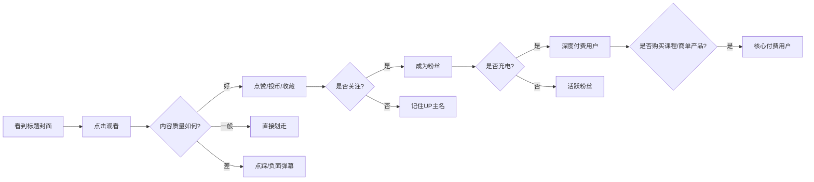
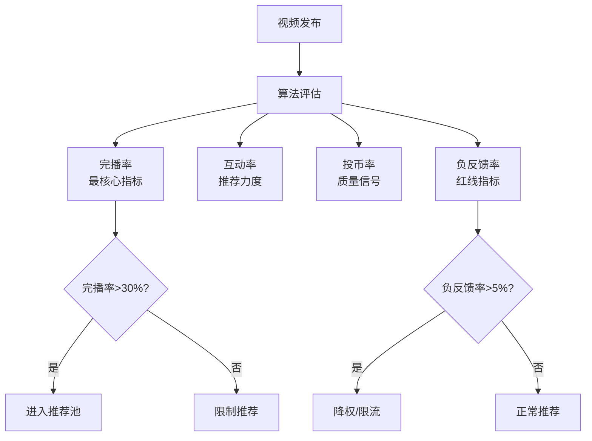
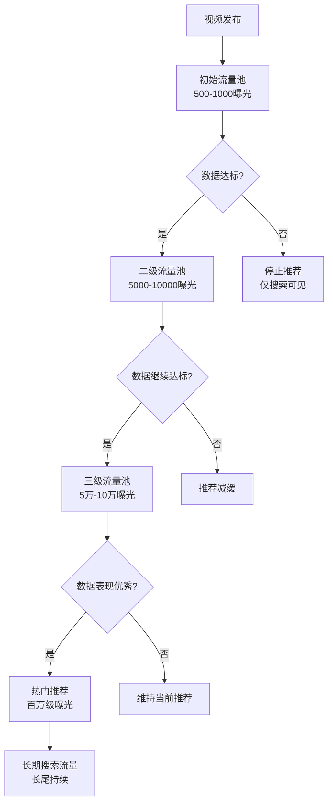
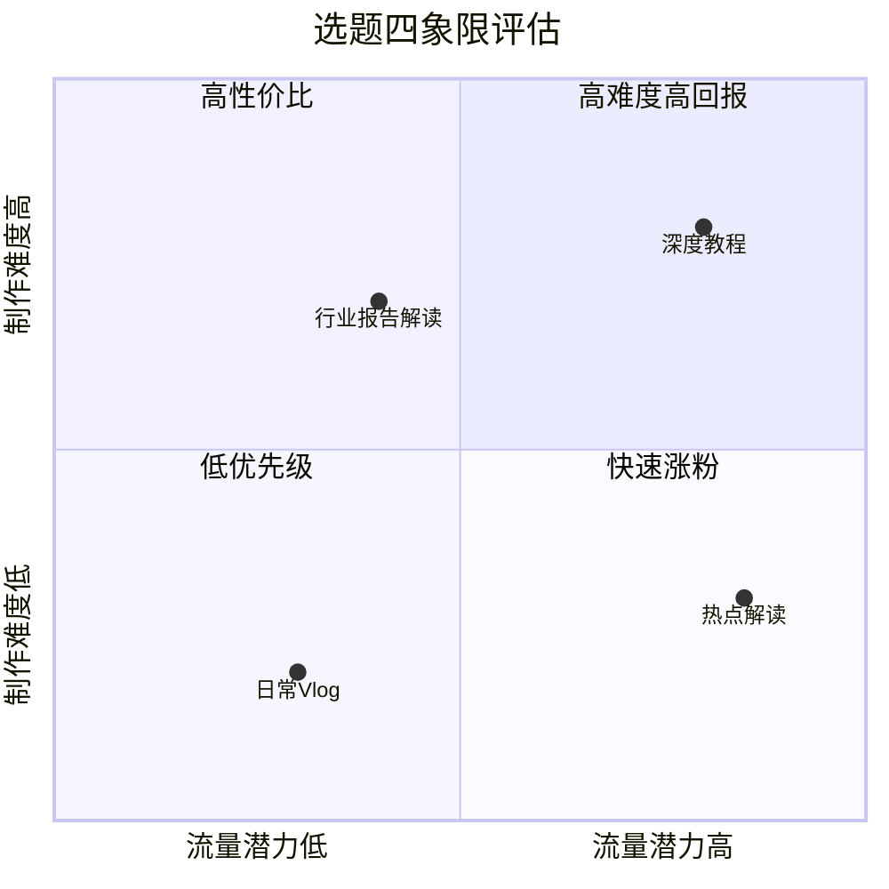
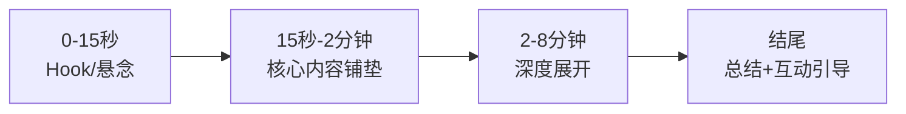
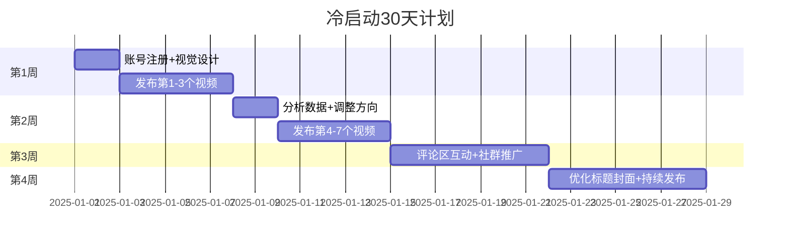

## 四、B站运营技巧

B站（哔哩哔哩）是中国最具影响力的年轻人文化社区之一，月活用户超过3.4亿，日均使用时长约100分钟。与抖音、快手等短视频平台不同，B站以中长视频为核心，用户粘性极强，社区文化独特，商业化路径也有本质差异。要在B站做出成绩，必须深入理解它的社区基因、推荐算法、用户心理和变现逻辑。

### 1. 理解B站的平台基因

#### 1.1 B站与其他平台的本质区别

B站的核心差异不在于视频时长，而在于**社区文化**。B站用户对内容质量的要求远高于其他平台，对"恰饭"（商业化）极为敏感，但同时对自己认可的创作者有极强的付费意愿和支持热情。

| 维度 | B站 | 抖音 | YouTube |
|------|-----|------|---------|
| 核心逻辑 | 内容驱动 + 社区认同 | 流量驱动 + 算法分发 | 内容驱动 + 广告分成 |
| 用户心态 | "我在社区里" | "我在刷视频" | "我在看视频" |
| 内容偏好 | 深度、专业、有趣 | 快节奏、强刺激 | 多元化、国际化 |
| 商业化态度 | 敏感但支持认可的创作者 | 习惯性接受 | 相对理性 |
| 粉丝关系 | 强归属感（"关注的UP主"） | 弱关系（"刷到的人"） | 中等关系 |
| 互动形式 | 弹幕文化、评论区造梗 | 评论、点赞 | 评论、超级留言 |
| 内容生命周期 | 极长（搜索流量持续数年） | 48小时以内 | 长尾流量 |
| 分发机制 | 推荐 + 搜索 + 关注三驾马车 | 几乎纯推荐分发 | 推荐 + 订阅 + 搜索 |

理解这个区别至关重要——你在抖音上验证过的打法，搬到B站大概率会失效。B站用户不是在"消费内容"，而是在"参与社区"。一个UP主和粉丝之间的关系，更像是一个社团的成员关系，而非主播与观众的关系。

#### 1.2 B站的用户画像

B站用户以18-35岁为主力，其中Z世代（1995-2009年出生）占比超过80%。这个群体有几个显著特征：

- **高学历**：本科及以上学历用户占比超过60%，对知识类内容有天然好感
- **高审美**：对视频制作质量有底线要求，粗糙的内容会被直接划走
- **强社区感**：对"自己人"有极强认同感，对"外来入侵者"有排斥心理
- **反营销本能**：对硬广极度反感，但对"恰饭恰得好的"会主动支持
- **弹幕即社交**：弹幕不是附属品，而是内容的一部分，甚至比视频本身更重要

**B站用户的消费心理链条：**



理解这个链条，就知道为什么B站运营不能急功近利——从曝光到最终变现，每一步都需要内容质量和信任的积累。

#### 1.3 B站的"入场门槛"——答题转正

B站的正式会员需要通过答题考试（100道题，60分及格），这意味着B站用户对平台文化有基本认知。运营B站时，不能用其他平台的思维来套，否则会"水土不服"。

**常见的水土不服表现：**

- 把抖音的快节奏内容搬到B站——用户会觉得"没营养"
- 用小红书的精致种草风格——用户会觉得"太假"
- 用公众号的说教语气——用户会觉得"爹味重"
- 直接搬运YouTube内容——用户会举报抄袭
- 用快手的土味风格——用户会觉得"格格不入"
- 套用微博的饭圈运营——用户会集体反感

#### 1.4 B站的内容分区与生态

B站的内容分区决定了你的内容在哪个"赛道"被推荐。了解各分区的特点，有助于精准定位：

| 分区 | 用户特征 | 内容风格 | 变现潜力 | 竞争程度 |
|------|----------|----------|----------|----------|
| 知识区 | 高学历、求知欲强 | 深度解析、系统教学 | ★★★★★ | ★★★★ |
| 科技区 | 极客、理性消费 | 评测、教程、科普 | ★★★★★ | ★★★★ |
| 游戏区 | 年轻、活跃度高 | 实况、攻略、解说 | ★★★ | ★★★★★ |
| 生活区 | 最广泛的受众 | Vlog、日常、挑战 | ★★★★ | ★★★★★ |
| 美食区 | 女性用户偏多 | 探店、教程、测评 | ★★★★ | ★★★ |
| 影视区 | 深度影迷 | 解说、混剪、分析 | ★★★ | ★★★ |
| 鬼畜区 | 创意型用户 | 搞笑二创 | ★★ | ★★★ |
| 动画区 | 二次元核心用户 | 番剧讨论、MAD | ★★★ | ★★★★ |
| 音乐区 | 文艺型用户 | 翻唱、原创、演奏 | ★★★ | ★★★ |
| 舞蹈区 | 视觉审美型 | 翻跳、原创编舞 | ★★ | ★★★ |

**选择分区的策略建议：**

- **知识区**是目前变现天花板最高的分区，适合有专业背景的创作者
- **生活区**流量最大但竞争最激烈，需要极强的个人特色才能突围
- **科技区**用户付费意愿最强（愿意为好产品买单），商单价值高
- **美食区**内容制作门槛相对低，适合新手练手
- 考虑做**跨分区内容**——比如"知识+美食"（食品科学）、"科技+生活"（智能家居），蓝海机会更大

### 2. B站的推荐算法深度解析

#### 2.1 算法核心指标

B站的推荐算法基于**CES（Creator Evaluation Score）**体系，核心考察以下指标：

| 指标 | 权重（估） | 含义 | 影响 |
|------|-----------|------|------|
| 完播率 | ★★★★★ | 视频被观看的比例 | 决定能否进入下一级流量池 |
| 互动率 | ★★★★ | 弹幕+评论+分享/播放量 | 决定推荐力度 |
| 点赞率 | ★★★ | 点赞数/播放量 | 正向信号 |
| 投币率 | ★★★ | 投币数/播放量 | B站特有，高权重 |
| 收藏率 | ★★★ | 收藏数/播放量 | 长期价值信号 |
| 弹幕密度 | ★★★ | 弹幕数/分钟 | 社区活跃度信号 |
| 负反馈率 | ★★ | 不感兴趣/举报/拉黑 | 负向信号，权重很高 |
| 关注转化率 | ★★ | 新增关注/播放量 | 账号成长信号 |

**特别说明：投币是B站独有的互动行为**，用户每天有有限的硬币（通过登录和活跃获得），愿意投币说明高度认可。投币率高的视频会被大幅加权推荐。

**各指标之间的优先级关系：**



#### 2.2 流量池机制

B站采用分层流量池机制，新视频的推荐流程如下：



**各层级的数据门槛（经验值，非官方数据）：**

- **初始池 → 二级池**：完播率 > 30%，互动率 > 3%
- **二级池 → 三级池**：完播率 > 25%，互动率 > 5%
- **三级池 → 热门**：完播率 > 20%，互动率 > 8%，投币率 > 2%

**关键细节：流量池的"时间窗口"**

B站的推荐测试有一个关键的时间窗口概念：

- **前2小时**：算法观察初始数据（点击率、完播率），决定是否推进到二级池
- **前6小时**：如果数据持续良好，会加速推荐
- **前24小时**：基本决定一个视频的命运——进入热门还是沉底
- **7天后**：推荐流量大幅衰减，之后主要靠搜索和关注页流量

这意味着发布后的前2小时是"生死窗口"。如果你发现前2小时数据异常低（比如播放量低于100），可能需要检查标题、封面、标签是否有问题，或者发布时间是否合适。

#### 2.3 推荐页面与搜索流量

B站的流量来源主要有四类：

1. **首页推荐**：算法根据用户兴趣标签分发，占比约40-50%
2. **搜索流量**：用户主动搜索关键词，占比约20-30%，长尾价值极高
3. **关注页**：已关注UP主的新内容，占比约10-15%
4. **外部流量**：从微信、微博等外部平台跳转，占比约5-10%

**关键洞察**：B站的搜索流量占比远高于抖音，这意味着**SEO优化在B站极其重要**。一个好的标题和标签组合，可以让你的视频在发布数月甚至数年后仍然获得稳定播放量。

**B站搜索算法的排序逻辑：**

1. **标题关键词匹配度**：标题中包含搜索词的权重最高
2. **标签匹配度**：标签与搜索词的相关性
3. **简介区关键词**：简介中的文本也会被索引
4. **视频质量分**：播放量、互动率等综合指标
5. **时效性**：新发布的内容有一定的时效加权
6. **用户行为**：搜索后的点击率和完播率会反馈到排序中

### 3. 账号定位与人设打造

#### 3.1 选择赛道的核心原则

B站的热门赛道包括：游戏、动画、科技、知识、生活、美食、音乐、舞蹈、影视、鬼畜等。选择赛道时需要考虑三个维度：

| 维度 | 说明 | 评估方法 |
|------|------|----------|
| 市场需求 | 该赛道的用户基数和活跃度 | 搜索B站热门话题、查看分区播放量 |
| 竞争程度 | 头部UP主的垄断程度 | 搜索关键词，看前10名的粉丝量级 |
| 个人优势 | 你的专业度、资源、热情 | 自我评估，能否持续产出100期以上 |

**赛道选择的黄金公式**：市场需求大 × 竞争可进入 × 个人有优势 = 最佳赛道

**如何判断一个赛道是否值得进入：**

1. **搜索核心关键词**，查看前10个视频的播放量——如果前10名播放量都在10万以下，说明赛道流量天花板低；如果前10名播放量差异巨大（有的百万有的几千），说明赛道还没有被头部垄断，新号有机会
2. **查看该赛道的头部UP主**，看他们最近3个月的涨粉速度——如果头部涨粉很快，说明赛道还在增长期；如果头部已经停止增长，说明赛道可能已经饱和
3. **分析该赛道的商单价值**——在花火平台搜索同类UP主的商单数量和报价，判断变现潜力

#### 3.2 人设定位的四个层次

B站的人设不是"装出来的"，而是基于真实自我的**放大和聚焦**：

**第一层：功能定位**
- 你能提供什么价值？（知识、娱乐、情感、工具）
- 例："教你用Python自动化办公"

**第二层：风格定位**
- 你的表达方式是什么？（严肃、幽默、毒舌、温暖、学术）
- 例："用相声的方式讲编程"

**第三层：人格定位**
- 你是什么样的人？（学霸、社畜、极客、老好人、犀利姐）
- 例："被代码耽误的段子手"

**第四层：情感定位**
- 你和观众的关系是什么？（老师、朋友、前辈、树洞）
- 例："你身边的程序员朋友"

人设越清晰，用户越容易记住你。但人设必须**真实可持续**，否则一旦"人设崩塌"，后果比没有人设更严重。

**人设打造的实操步骤：**

1. **列出你的优势清单**：专业技能、个人经历、性格特点、表达风格
2. **找到差异化组合**：将两个不常见的特质组合（比如"程序员+健身达人"、"金融从业者+脱口秀风格"）
3. **用一句话描述你的人设**：如果一句话说不清楚，说明人设还不够清晰
4. **在前10个视频中测试人设**：观察观众反馈，找到最受认可的角度
5. **固化人设元素**：口头禅、固定开场白、标志性着装、专属表情包

#### 3.3 账号名称与视觉体系

**命名原则：**
- 好记（不超过6个字最佳）
- 有辨识度（避免与已有大UP主撞名）
- 能体现定位（看到名字大概知道你是做什么的）
- 避免生僻字和特殊符号（影响搜索和传播）

**命名的具体方法：**

| 方法 | 示例 | 适用场景 |
|------|------|----------|
| 名字+领域 | "老王说代码" | 个人IP型 |
| 领域+风格 | "硬核的阿Test" | 差异化定位型 |
| 谐音/创意 | "何同学"（合同学） | 强记忆点型 |
| 直接描述 | "Python小课堂" | 工具型/教学型 |
| 二次元风格 | "某幻君" | 二次元/年轻人社区 |

**视觉体系包括：**
- **头像**：清晰、有辨识度，建议使用真人照片或高辨识度的IP形象
- **封面模板**：统一的封面风格（字体、配色、排版），让用户在信息流中一眼认出你
- **空间装修**：主页横幅、置顶视频、代表作、个人简介都要精心设计

**封面模板设计的具体规范：**

1. **配色方案**：选定2-3个主色调，贯穿所有封面。对比强烈的配色（如黄底黑字、白底红字）在小屏上辨识度更高
2. **字体选择**：使用粗体无衬线字体（如思源黑体、阿里巴巴普惠体），确保在手机上清晰可读
3. **文字位置**：建议放在封面左侧或上方（B站封面在信息流中右侧会被部分遮挡）
4. **人物出镜**：如果有人物，面部表情要夸张、有张力——平淡的表情在小屏上没有吸引力
5. **信息密度**：一个封面只传递一个核心信息，文字不超过15个字

### 4. 内容创作方法论

#### 4.1 选题策略

选题是B站运营中最重要的环节，一个好的选题决定了视频80%的上限。

**选题的四种类型：**

| 类型 | 特征 | 适用场景 | 举例 |
|------|------|----------|------|
| 热点型 | 蹭热度，爆发力强 | 快速涨粉 | "GPT-5发布，我用它做了个XXX" |
| 痛点型 | 解决具体问题 | 建立信任 | "投了100份简历都没回音？问题出在这里" |
| 猎奇型 | 满足好奇心 | 提升播放量 | "我花3万块体验了全上海最贵的酒店" |
| 系列型 | 持续产出 | 提高粘性 | "从零开始学投资"系列 |

**选题验证方法：**

1. **搜索验证**：在B站搜索相关关键词，看播放量和竞争程度
2. **评论区挖掘**：去同类UP主的评论区，看用户在问什么、吐槽什么
3. **弹幕分析**：通过弹幕热词发现用户关注点
4. **热搜跟踪**：关注B站热搜、微博热搜、知乎热榜，找到交叉热点
5. **工具辅助**：使用飞瓜数据、火烧云等第三方工具分析热门内容

**选题的"四象限评估法"：**



- **右上角（高流量高难度）**：值得投入的"旗舰内容"，月产1-2条
- **右下角（高流量低难度）**：快速涨粉的"热点内容"，看到热点就做
- **左上角（低流量高难度）**：谨慎投入，除非能建立深度信任
- **左下角（低流量低难度）**：填充内容，保持更新频率

#### 4.2 标题与封面——决定点击率的双引擎

B站的标题和封面决定了用户是否会点击，这是整个漏斗的第一步。

**标题写作公式：**

- **数字公式**："5个让你少走3年弯路的XX技巧"
- **反常识公式**："为什么我不建议你XX？"
- **痛点公式**："XX总是失败？因为你忽略了这个细节"
- **好奇心公式**："我用了一个月XX，结果出乎意料"
- **权威公式**："前XX公司高管告诉你，XX的真相"
- **对比公式**："XX vs XX，到底哪个更值得？"
- **悬念公式**："这个XX方法，99%的人都不知道"
- **挑战公式**："我试了网上最火的XX方法，真相是……"

**标题避坑：**
- 不要做标题党（B站用户会通过弹幕和评论区"打脸"，损害信任）
- 不要超过20个字（移动端显示会被截断）
- 不要用太多感叹号（显得低级）
- 关键词前置（搜索权重更高）

**封面设计要点：**
- 人物出镜的封面点击率通常更高（有面部表情更佳）
- 文字不超过封面面积的30%
- 配色对比强烈，在手机小屏上也要清晰可辨
- 避免信息过载，一个封面传递一个核心信息
- 使用统一的模板风格，形成品牌识别

**封面的A/B测试方法：**

B站目前不提供官方的封面测试功能，但你可以用以下方法间接测试：

1. **发布后2小时更换封面**：如果初始数据不好，尝试更换封面后观察数据变化
2. **不同视频用不同风格**：统计哪种封面风格的点击率更高
3. **参考同类UP主**：分析头部UP主的封面风格，找到共同规律
4. **使用第三方工具**：飞瓜数据等工具可以查看视频的历史封面更换记录

#### 4.3 视频结构设计

B站中长视频的结构设计直接影响完播率。以下是一个经过验证的通用结构：

**黄金结构：Hook → 内容 → 互动引导**



**各部分详解：**

**Hook（0-15秒）—— 决定用户是否继续看**
- 抛出悬念："你知道为什么90%的人学Python都失败了吗？"
- 展示结果："我用这个方法，一个月瘦了15斤"
- 制造冲突："所有教你XX的人，都在骗你"
- 避免：冗长的自我介绍、无关的开场白、"大家好我是XXX"

**核心内容（15秒-2分钟）—— 快速给出价值**
- 前30秒内必须让用户感到"这个视频有料"
- 用"先说结论，再展开"的结构
- 每60-90秒设置一个小高潮或转折，防止流失

**深度展开（2-8分钟）—— 系统化呈现**
- 每个论点用案例或数据支撑
- 用画面切换、字幕、特效保持视觉节奏
- 适当加入"彩蛋"和"冷知识"提升趣味性

**结尾（最后30秒）—— 引导互动**
- 总结核心要点
- 引导点赞、投币、收藏（B站用户对此接受度较高）
- 设置下期悬念或提问引导评论
- 不要说"下期再见"这种空洞的话，给出具体预告

**不同视频时长的结构调整：**

| 时长 | 结构 | 重点 |
|------|------|------|
| 1-3分钟 | Hook → 核心 → 结尾 | 信息密度要高，每10秒一个信息点 |
| 3-8分钟 | Hook → 2-3个要点 → 总结 | 最佳平衡点，适合大多数内容 |
| 8-15分钟 | Hook → 铺垫 → 3-4个深度点 → 总结 | 需要更强的节奏控制 |
| 15-30分钟 | Hook → 多个章节 → 每章有小高潮 → 总结 | 适合深度教程、纪录片风格 |
| 30分钟以上 | 分P或分集发布 | 单集完播率会很低，分P更友好 |

#### 4.4 脚本撰写技巧

B站视频脚本的核心原则：**像和朋友聊天，不像做报告**。

**口语化改写示例：**

| 书面语（差） | 口语化（好） |
|-------------|-------------|
| "本文将为大家介绍三种方法" | "今天给你三个方法，最后一个绝了" |
| "首先我们需要了解其原理" | "先搞明白这玩意到底怎么回事" |
| "综上所述，我们可以得出结论" | "说白了就是这么个理" |
| "值得注意的是" | "这个地方一定要注意" |
| "下面我将详细阐述" | "展开说说" |
| "该技术具有广泛的应用前景" | "这东西以后会越来越牛" |
| "我们进行了一系列实验" | "我亲自测了一波" |

**节奏控制：**
- 每句话不超过20个字（口语节奏）
- 长内容段落后插入"呼吸点"（短暂停顿或画面切换）
- 关键信息重复2-3次（用不同方式表达）
- 适时使用"对吧？""你想想""是不是"等互动性词汇

**弹幕引导技巧——让观众"帮你做内容"：**

弹幕是B站的灵魂，好的弹幕可以极大提升视频的社区感和互动率：

1. **设置弹幕触发点**：在关键信息处故意留一个"槽点"，引导观众发弹幕补充
2. **使用弹幕投票**："觉得A方案好的扣1，B方案好的扣2"
3. **制造弹幕共鸣**："有没有人和我一样，每次XX都……"
4. **预留弹幕空间**：在画面中留出弹幕密集区域，避免字幕和弹幕重叠
5. **引导高质量弹幕**：提问比陈述更能激发弹幕——"你们觉得呢？"比"我觉得XXX"更有效

#### 4.5 视频制作工具链

| 环节 | 推荐工具 | 特点 |
|------|----------|------|
| 脚本撰写 | ChatGPT / Claude + 人工润色 | AI出初稿，人工调整语气和节奏 |
| 录屏 | OBS Studio（免费） | 功能强大，支持多场景切换 |
| 剪辑 | 剪映（免费）/ DaVinci Resolve（免费专业级） | 剪映易上手，达芬奇调色强 |
| 字幕 | 剪映自动识别 + 手动校对 | 准确率约95%，需人工修正 |
| 封面 | Canva / Figma / Photoshop | Canva模板多，Figma协作好 |
| 配音 | 自己录 / Azure TTS / ElevenLabs | 自己录更有辨识度 |
| 素材 | Pexels / Pixabay / B站素材库 | 注意版权问题 |
| 数据分析 | 飞瓜数据 / 火烧云 / B站创作者中心 | 监控数据变化趋势 |

**新手最推荐的起步工具组合：**

- **剪辑**：剪映（手机端+电脑端都免费，学习成本最低）
- **录屏**：OBS Studio（免费，功能足够）
- **封面**：Canva（有大量B站封面模板，免费版够用）
- **字幕**：剪映自动识别 + 手动校对
- **配音**：手机自带录音 + Adobe Podcast AI降噪（免费）

**专业级工具升级路径：**

当你的频道达到1万粉以上，可以考虑升级：

- **剪辑**：DaVinci Resolve（调色能力远超剪映）或 Premiere Pro
- **特效**：After Effects（片头、转场、动态图表）
- **音频**：Audacity（免费）或 Adobe Audition
- **封面**：Photoshop + Figma（精细化设计）
- **协作**：Notion/飞书（团队内容管理）

### 5. B站发布与SEO优化

#### 5.1 发布时间选择

B站用户的活跃时间有明显规律：

| 时段 | 活跃度 | 适合发布的内容 |
|------|--------|---------------|
| 工作日 7:00-9:00 | 中 | 知识类、资讯类（通勤时间） |
| 工作日 12:00-13:30 | 高 | 轻松娱乐类（午休时间） |
| 工作日 18:00-20:00 | 最高 | 所有类型（下班放松时间） |
| 工作日 21:00-23:00 | 高 | 深度内容（夜间学习时间） |
| 周末 10:00-12:00 | 高 | 生活类、娱乐类 |
| 周末 14:00-17:00 | 最高 | 所有类型（下午黄金时段） |
| 周末 20:00-23:00 | 最高 | 所有类型 |

**发布时间策略：**
- 建议在高峰时段前30-60分钟发布，让算法有时间做初始推荐测试
- 固定发布时间，培养用户的观看习惯
- 新手建议选择工作日晚上18:00-19:00发布

**特殊时间节点：**

- **节假日**：用户活跃时间整体前移，上午10点就开始活跃
- **寒暑假**：学生用户大幅增加，知识区和游戏区流量暴涨
- **大型事件**：如高考、考研、双11等，相关话题搜索量暴增，提前布局内容

#### 5.2 标签与关键词优化

B站的标签系统对搜索流量至关重要。每个视频最多可以设置10个标签。

**标签选择策略：**

1. **核心标签（2-3个）**：与内容直接相关的高频词
   - 例：视频讲Python自动化 → "Python""自动化""办公效率"

2. **长尾标签（3-4个）**：更具体的搜索词，竞争小
   - 例："Python办公自动化教程""Excel自动化""Python入门"

3. **流量标签（1-2个）**：热门但相关的标签
   - 例："编程""科技"

4. **品牌标签（1个）**：自己的系列标签
   - 例："XXX的编程课"

**标签避坑：**
- 不要用不相关的热门标签（会被降权甚至限流）
- 不要超过10个标签（贪多嚼不烂）
- 定期更新标签策略（跟随平台热度变化）

**关键词研究的具体方法：**

1. **B站搜索框联想**：在B站搜索框输入核心词，看下拉联想词——这些都是真实用户在搜索的词
2. **相关搜索**：搜索结果页底部的"相关搜索"，是算法推荐的关联词
3. **5118工具**：专业的关键词挖掘工具，可以查看B站关键词的搜索量和竞争度
4. **竞品分析**：查看同类热门视频的标签组合，借鉴并优化
5. **百度指数/微信指数**：了解关键词的整体搜索趋势，判断热度走向

#### 5.3 简介区优化

视频简介区是被很多人忽略的SEO宝地。B站的搜索算法会索引简介区的文本内容。

**简介区模板：**

```text
【一句话概括视频内容，包含核心关键词】

📌 本期要点：
1. 第一个要点
2. 第二个要点
3. 第三个要点

⏰ 时间线：
00:00 开场
01:30 第一部分
05:00 第二部分
08:30 第三部分
12:00 总结

🔗 相关链接：
- 提到的工具：XXX
- 上期视频：XXX
- 我的GitHub：XXX

#关键词1 #关键词2 #关键词3
```

时间线（Time Stamp）不仅方便用户跳转，还能在视频进度条上显示章节标记，提升用户体验。

**简介区SEO的额外技巧：**

- 第一句话尽量包含核心关键词（权重最高）
- 在简介中自然地嵌入3-5个长尾关键词
- 使用emoji提升可读性（但不要过多）
- 添加相关视频链接，形成内容矩阵
- 定期更新旧视频的简介（补充新的时间线、更新信息）

### 6. 弹幕与评论区运营

弹幕和评论区是B站社区文化的核心载体，也是提升互动率和粉丝粘性的关键战场。

#### 6.1 弹幕运营策略

**引导高质量弹幕的方法：**

| 策略 | 具体做法 | 效果 |
|------|----------|------|
| 弹幕投票 | "觉得对的扣1，觉得不对的扣2" | 大量互动弹幕 |
| 槽点预埋 | 故意说一个有争议的观点 | 引发讨论和反驳 |
| 共鸣触发 | "有没有人跟我一样……" | 大量"有"的弹幕 |
| 彩蛋提示 | "细心的朋友有没有发现……" | 引导反复观看 |
| 预测互动 | "猜猜接下来会发生什么？" | 预测类弹幕 |

**弹幕礼仪与管理：**

- 不要关闭弹幕功能——这在B站是"自杀行为"
- 对恶意弹幕使用关键词过滤（B站创作者中心可设置）
- 适当"空降"弹幕——在特定时间点引导弹幕节奏
- 弹幕高峰期（发布后2小时内）密切关注，及时回复和引导

#### 6.2 评论区运营

评论区是建立粉丝关系的最佳场所。B站用户非常看重UP主是否"接地气"。

**评论区运营的具体做法：**

1. **发布后立即回复前20条评论**——早期评论的回复率直接影响后续用户的评论意愿
2. **用"置顶评论"引导话题**——发布后自己先留一条引导性评论并置顶
3. **回复要有温度**——不要用模板化回复，每条回复都要有个性化内容
4. **善用"UP主觉得很赞"**——对优质评论点赞，让评论者感到被认可
5. **挖掘评论区选题**——用户的提问和讨论是最好的选题来源
6. **处理负面评论**——理性回应有建设性的批评，无视纯粹的恶意攻击

**评论区运营的时间分配建议：**

- 发布后2小时内：持续关注，回复每一条评论
- 发布后24小时内：每天花15-30分钟回复评论
- 发布后3天：每天花5-10分钟回复新评论
- 发布后7天：隔天检查一次即可

### 7. B站核心变现路径

#### 7.1 创作激励计划

B站的创作激励计划是基础收入来源，门槛为：
- 粉丝数 ≥ 1000
- 近30天播放量 ≥ 10000

| 等级 | 收益估算 | 说明 |
|------|----------|------|
| 1000-1万粉 | 100-500元/月 | 基础激励，聊胜于无 |
| 1万-10万粉 | 500-3000元/月 | 可作为副业收入 |
| 10万-100万粉 | 3000-20000元/月 | 接近全职水平 |
| 100万粉以上 | 2万-10万+/月 | 头部创作者 |

**注意**：创作激励的收益与视频质量、完播率、互动率直接挂钩，单纯刷播放量没有意义。

#### 7.2 充电计划（粉丝打赏）

充电是B站版的"打赏"，用户可以为喜欢的UP主充电（花真钱）。充电收入取决于粉丝忠诚度而非粉丝数量。

**提升充电收入的方法：**
- 定期发布充电专属内容（感谢视频、幕后花絮）
- 在视频中自然地提及充电（不要过度请求）
- 设置充电专属表情包和勋章
- 对充电用户给予特别回复和互动

#### 7.3 商单（品牌合作）

商单是B站UP主最核心的收入来源，也是利润最高的变现方式。

**B站商单的类型：**

| 类型 | 说明 | 价格区间（10万粉） |
|------|------|-------------------|
| 硬广植入 | 视频中直接展示产品 | 5000-20000元 |
| 软植入 | 自然融入内容，不突兀 | 8000-30000元 |
| 专属视频 | 为品牌制作专题视频 | 10000-50000元 |
| 直播带货 | 在直播中推荐产品 | 坑位费 + 佣金 |
| 长期代言 | 品牌大使/年度合作 | 10万-100万/年 |

**接单渠道：**
- B站花火平台（官方接单平台，有保障）
- 品牌方主动联系（通过简介区的商务邮箱）
- MCN机构代理（适合新手，但会抽成20-40%）
- 第三方平台：新榜、微播易等

**商单注意事项：**
- 接单前评估品牌调性是否匹配
- 优先选择自己真正使用过的产品
- 广告占比不超过视频内容的30%
- 明确标注"恰饭"，B站用户反而更尊重诚实的UP主
- 不要频繁接单，建议每月不超过2-3个商单

**花火平台接单的详细流程：**

1. **开通花火**：粉丝≥1万可申请入驻花火平台
2. **完善资料**：填写详细的账号信息、内容领域、受众画像
3. **设置报价**：参考同类UP主的报价，初期可以略低一些
4. **等待邀约**：品牌方会根据你的数据和领域主动邀请
5. **沟通需求**：与品牌方确认内容方向、交付时间、修改次数
6. **制作内容**：按约定完成视频制作
7. **发布审核**：品牌方确认后发布，花火平台自动结算

**商单报价的定价策略：**

| 粉丝量级 | 基础报价公式 | 说明 |
|----------|-------------|------|
| 1-5万粉 | 粉丝数 × 0.1-0.3元 | 初期以积累经验为主 |
| 5-20万粉 | 粉丝数 × 0.3-0.5元 | 可以适当提高报价 |
| 20-100万粉 | 粉丝数 × 0.5-1元 | 有议价能力 |
| 100万粉以上 | 单独议价 | 根据品牌和内容类型定价 |

报价不是固定的，垂直领域的UP主（如科技、金融）报价通常比泛娱乐UP主高2-3倍。

#### 7.4 直播变现

B站直播的变现方式包括：
- **礼物打赏**：观众送礼物，UP主获得分成（平台抽成约50%）
- **大航海**：类似"舰长"体系，月度订阅模式，30元/月起
- **直播带货**：通过直播推荐商品获取佣金
- **付费连麦**：知识付费的一种形式

**B站直播与其他平台直播的关键区别：**

| 维度 | B站直播 | 抖音直播 |
|------|---------|----------|
| 核心逻辑 | 社区互动型 | 卖货型 |
| 用户目的 | 和UP主互动 | 买东西/看表演 |
| 变现重点 | 礼物打赏+大航海 | 直播带货 |
| 流量来源 | 主要靠视频粉丝导入 | 推荐算法分发 |
| 内容要求 | 要有"看头"（聊天、游戏、才艺） | 要有"买点"（产品展示、价格优势） |

**提升直播收入的实操建议：**

1. **固定直播时间**：每周2-3次，每次2-3小时，让粉丝形成习惯
2. **视频引流直播**：在视频中预告直播时间和内容
3. **设置大航海专属福利**：舰长专属表情、优先连麦、专属群聊
4. **直播内容要有价值**：纯聊天很难留住人，要有主题（游戏、答疑、幕后）
5. **互动是关键**：B站直播的核心是互动，要让观众感到"被看到"

#### 7.5 知识付费与课程

B站的课堂功能允许UP主销售付费课程，适合知识类创作者。

**课程设计要点：**
- 价格区间：9.9-199元（低价走量更合适）
- 时长：单节课10-20分钟，总时长2-5小时
- 先用免费内容建立信任，再引导购买付费课程
- 课程内容要比免费内容更系统、更深入

**课程从0到1的完整流程：**

1. **验证需求**：先发3-5个免费视频测试该主题的受欢迎程度
2. **设计课程大纲**：根据评论区和弹幕的反馈，确定用户最想学的内容
3. **录制课程**：质量要比免费视频更高（更清晰的画面、更好的剪辑）
4. **定价策略**：首次上线建议定价9.9-29.9元（降低试错成本）
5. **推广方式**：在免费视频中自然提及课程，不要硬推
6. **持续迭代**：根据用户反馈更新课程内容

#### 7.6 带货（会员购与悬赏带货）

B站的带货体系包括：
- **会员购**：销售B站自营的周边、手办等商品
- **悬赏带货**：通过视频下方的商品链接获取佣金
- **视频内购物车**：符合条件的UP主可以在视频中挂载商品

#### 7.7 变现路径选择指南

不同阶段的UP主应该选择不同的变现重心：

| 粉丝量级 | 推荐变现方式 | 月收入预期 | 注意事项 |
|----------|-------------|-----------|----------|
| 0-1000粉 | 暂不变现，专注内容 | 0元 | 急于变现会适得其反 |
| 1000-1万粉 | 创作激励 + 尝试充电 | 100-500元 | 开通激励计划，积累数据 |
| 1万-5万粉 | 创作激励 + 小商单 + 课程 | 1000-5000元 | 入驻花火，接第一个商单 |
| 5万-20万粉 | 商单为主 + 直播 + 课程 | 5000-30000元 | 建立商单体系，稳定报价 |
| 20万-100万粉 | 商单 + 直播 + 课程 + 带货 | 3万-20万 | 团队化运营，多渠道变现 |
| 100万粉以上 | 全渠道变现 + 品牌合作 | 20万+ | IP化运营，长期品牌价值 |

### 8. 数据分析与迭代优化

#### 8.1 核心数据指标

运营B站需要持续关注以下数据：

| 指标 | 计算方式 | 健康值 | 优化方向 |
|------|----------|--------|----------|
| 点击率 | 点击数/曝光数 | > 5% | 优化标题和封面 |
| 完播率 | 看完人数/点击人数 | > 30% | 优化内容节奏和Hook |
| 互动率 | (弹幕+评论+分享)/播放量 | > 5% | 增加互动引导 |
| 投币率 | 投币数/播放量 | > 2% | 提升内容质量 |
| 收藏率 | 收藏数/播放量 | > 5% | 增加实用价值 |
| 粉转率 | 新增关注/播放量 | > 3% | 强化人设和系列感 |

**B站创作者中心的数据查看路径：**

登录B站 → 创作中心 → 数据中心 → 内容数据/粉丝数据/收益数据

重点查看：
- **单视频数据**：播放来源分布、观众留存曲线、互动指标
- **粉丝画像**：年龄、性别、地域、活跃时间
- **收益明细**：创作激励、充电、商单收入明细

#### 8.2 数据复盘流程

每发布一个视频后，按以下流程复盘：

1. **发布后2小时**：检查初始数据（播放量、点击率），判断是否进入推荐池
2. **发布后24小时**：分析完播率曲线，找出用户流失的关键节点
3. **发布后3天**：评估整体数据表现，与历史视频对比
4. **发布后7天**：总结经验教训，记录到内容数据库

**完播率曲线分析要点：**
- 如果在开头10秒内大量流失 → Hook不够吸引人
- 如果在中间某个节点流失 → 该段内容冗余或节奏拖沓
- 如果在结尾前流失 → 缺少持续吸引力，考虑增加悬念

**建立个人数据追踪表：**

建议用Excel或Notion建立一个数据追踪表，记录每个视频的关键数据：

| 日期 | 标题 | 类型 | 时长 | 2h播放 | 24h播放 | 7d播放 | 完播率 | 互动率 | 投币率 | 备注 |
|------|------|------|------|--------|---------|--------|--------|--------|--------|------|
| 6/1 | XXX | 教程 | 8min | 200 | 3000 | 8000 | 35% | 6% | 2.5% | 爆款 |
| 6/8 | XXX | 热点 | 5min | 500 | 5000 | 12000 | 42% | 8% | 3% | 超预期 |

通过长期积累，你能清晰地看到哪些类型、时长、标题风格的数据最好，用数据指导后续创作。

#### 8.3 AB测试方法

在B站进行内容优化的AB测试：

- **标题测试**：同一个视频用不同标题发布（需要错开时间，避免被判定重复）
- **封面测试**：通过B站的封面测试功能（部分UP主可用）
- **发布时间测试**：同一类型内容在不同时间发布，对比数据
- **内容结构测试**：尝试不同的Hook和结构，对比完播率

### 9. B站专栏与动态运营

#### 9.1 B站专栏（文章）

很多UP主忽略了B站的专栏功能，但它对SEO和内容矩阵有重要价值：

**专栏的优势：**
- 搜索权重高，长尾流量好
- 制作成本低（不需要视频制作）
- 可以与视频形成互补
- 适合深度解析类内容

**专栏运营策略：**
1. 将视频内容整理成图文版专栏（方便不喜欢看视频的用户）
2. 写深度分析文章，链接到相关视频
3. 使用专栏发布教程的"文字版"（方便用户收藏和查阅）
4. 专栏标题同样需要SEO优化

#### 9.2 动态运营

B站的动态类似于朋友圈/微博，是与粉丝日常互动的重要渠道：

**动态内容类型：**
- 日常分享：工作幕后、生活碎片
- 内容预告：下期视频的剧透和花絮
- 互动话题：提问、投票、讨论
- 转发评论：转发其他UP主的内容并点评

**动态运营建议：**
- 每天发1-2条动态，保持活跃度
- 动态可以更随意、更真实，不需要像视频那样精心制作
- 用动态与粉丝建立更亲密的关系
- 善用动态的投票功能，了解粉丝偏好

### 10. 进阶策略：从万粉到百万粉

#### 10.1 冷启动策略（0-1000粉）

新号冷启动是最难的阶段，以下是经过验证的方法：

1. **系列化内容**：做一个有连续性的系列，用户看了第一期会追更后续
2. **蹭热点但有深度**：热点话题 + 自己的专业角度 = 差异化内容
3. **评论区引流**：在同类UP主的评论区留下有价值的评论（不是打广告）
4. **社群推广**：在相关QQ群、微信群、Discord分享内容（注意不要硬广）
5. **日更或高频更新**：在冷启动阶段，频率比质量更重要（但不能太差）

**冷启动阶段的具体执行计划：**



#### 10.2 突破瓶颈（1000-10万粉）

这个阶段的关键是**找到自己的爆款公式**：

1. **分析历史数据**：找出播放量最高的3-5个视频，分析共同点
2. **复制爆款结构**：用同样的结构制作新内容
3. **打造代表作**：置顶播放量最高、质量最好的视频
4. **建立更新节奏**：固定每周更新时间和数量
5. **开始接小商单**：积累商务合作经验

**爆款视频的共同特征分析框架：**

| 分析维度 | 具体问题 |
|----------|----------|
| 选题 | 这个话题为什么会火？是痛点、热点还是猎奇？ |
| 标题 | 标题用了什么公式？为什么能吸引点击？ |
| 封面 | 封面的视觉元素是什么？为什么能在信息流中突出？ |
| 开头 | 前15秒做了什么？为什么能留住观众？ |
| 结构 | 内容是如何组织的？节奏如何？ |
| 互动 | 视频中有哪些引导互动的设计？ |
| 时长 | 视频多长？完播率如何？ |

#### 10.3 规模化增长（10万-100万粉）

达到10万粉后，需要系统化运营：

1. **团队化**：开始组建团队（剪辑、运营、商务）
2. **矩阵化**：开设关联账号，覆盖不同细分领域
3. **IP化**：打造可延展的个人IP（表情包、周边、联名）
4. **跨平台**：将B站内容分发到其他平台
5. **商业化升级**：从单次商单到长期品牌合作

**矩阵化运营的策略：**

| 矩阵类型 | 说明 | 示例 |
|----------|------|------|
| 内容矩阵 | 同一IP，不同内容方向 | 主号讲编程，副号讲科技产品 |
| 平台矩阵 | 同一内容，分发到不同平台 | B站主号+抖音号+YouTube |
| 风格矩阵 | 同一领域，不同风格 | 主号深度教程，副号快速技巧 |
| 人设矩阵 | 不同人设，互补引流 | 主号专业向，副号搞笑向 |

**跨平台分发的注意事项：**
- 不要简单搬运——每个平台需要适配不同的内容风格
- B站内容可以精简后发抖音（但不要反过来）
- YouTube可以发B站的长视频，但需要加上英文字幕
- 小红书适合发图文版的内容摘要
- 微信公众号适合发深度文章

#### 10.4 避免增长陷阱

| 陷阱 | 表现 | 后果 | 正确做法 |
|------|------|------|----------|
| 蹭热点过猛 | 什么热做什么 | 账号标签混乱，推荐不精准 | 只蹭与定位相关的热点 |
| 接单过频 | 每个视频都是广告 | 粉丝流失，数据下降 | 每月不超过2-3个商单 |
| 内容同质化 | 所有视频一个套路 | 用户审美疲劳 | 定期创新形式和角度 |
| 忽视评论区 | 不回复、不互动 | 粉丝流失，社区感消失 | 每天花15-30分钟回复评论 |
| 数据焦虑 | 每小时看一次数据 | 心态崩了，创作变形 | 固定每周复盘一次 |
| 对标焦虑 | 总是和大UP主比较 | 自我怀疑，丧失信心 | 只和自己比，关注成长曲线 |
| 过度优化 | 为算法创作，忽视用户 | 内容失去灵魂 | 先满足用户，再优化算法 |
| 忽视版权 | 使用未授权素材 | 视频被下架，账号受罚 | 使用免费商用素材或购买授权 |

### 11. MCN与商业化决策

#### 11.1 是否加入MCN

MCN（Multi-Channel Network）是帮助创作者运营和商业化的机构。是否加入MCN是一个重要决策：

**加入MCN的优势：**
- 获得商单资源（品牌方更倾向于通过MCN找UP主）
- 专业的运营指导和数据分析支持
- 团队支持（剪辑、运营、商务）
- 行业资源和人脉

**加入MCN的风险：**
- 收入分成（通常MCN抽成20-40%）
- 合同约束（可能限制接单自由、内容方向）
- 部分MCN"只签不管"，签了之后没有实际支持
- 解约困难，违约金可能很高

**是否加入MCN的判断标准：**

| 情况 | 建议 |
|------|------|
| 粉丝<5万，新手期 | 不建议加入——先自己摸索 |
| 粉丝5-20万，有明确方向 | 可以考虑——但要仔细审核合同 |
| 粉丝>20万，商业化需求强 | 值得考虑——但要选头部MCN |
| 已经有稳定的商单来源 | 不需要——自己接单利润更高 |

**审核MCN合同的关键条款：**
1. **分成比例**：不要接受超过30%的分成
2. **合同期限**：尽量签短期（1年以内），避免长期绑定
3. **独家条款**：避免签独家——限制你的自由度
4. **保底条款**：是否有保底收入保障
5. **解约条件**：解约的违约金和流程
6. **内容控制权**：内容方向的决定权在谁手里

#### 11.2 税务与财务管理

当B站收入达到一定规模后，税务和财务管理变得重要：

**B站收入的税务处理：**
- 创作激励和充电收入：B站会代扣个人所得税（劳务报酬，20%-40%）
- 商单收入：需要自行申报（如果通过花火平台，平台会代扣）
- 课程收入：需要自行申报

**合理避税的方法：**
- 注册个体工商户：税率更低（5%-35%累进，通常低于劳务报酬）
- 成立公司：适合年收入50万以上的创作者
- 使用合法的税务筹划工具：如灵活用工平台

**财务管理建议：**
- 将收入的30%作为税收预留
- 将收入的20%作为再投资（设备升级、团队扩展）
- 将收入的10%作为风险储备金
- 记录每一笔收入和支出

### 12. B站运营常见误区

#### 误区一：播放量 = 收入

真相：播放量只是基础指标，真正影响收入的是粉丝质量、互动率和垂直度。一个10万粉的精准垂直号，收入可能超过100万粉的泛娱乐号。

#### 误区二：模仿大UP主就能成功

真相：大UP主的成功有时代红利、资源积累等多重因素，简单模仿其内容形式不会成功。应该学习的是他们的**选题逻辑和运营思维**，而不是照搬内容。

#### 误区三：视频越长越好

真相：B站虽然以中长视频见长，但时长应该由内容决定。一个5分钟讲清楚的事，不要拖到15分钟。**完播率比时长更重要**。

#### 误区四：只做视频就够了

真相：B站运营是一个系统工程，包括选题、标题、封面、标签、发布时间、评论区运营、粉丝社群维护等多个环节。只做视频不做运营，就像只种地不浇水。

#### 误区五：搬运海外内容就能火

真相：B站对搬运内容的打击越来越严，且用户对原创性的要求越来越高。即使不被举报，搬运内容也很难建立真正的粉丝粘性和个人品牌。

#### 误区六：数据不好就删视频

真相：B站的搜索流量是长尾的，一个视频可能在发布数月后才通过搜索获得流量。除非内容有严重错误，否则不建议删除。数据不好的视频可以设为"仅自己可见"或重新编辑标题封面后再发布。

#### 误区七：粉丝越多越赚钱

真相：粉丝数量和收入不是线性关系。10万粉的垂直领域UP主（如科技评测、金融分析）可能比100万粉的泛娱乐UP主收入更高。**粉丝质量 > 粉丝数量**。

#### 误区八：做B站就不能做其他平台

真相：多平台分发是提升影响力和收入的有效方式。关键是不要简单搬运，而是针对每个平台的特点做内容适配。B站的长视频可以剪辑精华版发抖音，可以整理成图文发小红书。

### 13. 实操案例：从零开始的B站运营计划

以下是一个可执行的3个月B站运营计划：

**第1个月：定位与冷启动**

| 周次 | 任务 | 目标 |
|------|------|------|
| 第1周 | 确定赛道、注册账号、设计视觉体系 | 完成账号基建 |
| 第2周 | 发布第1-3个视频，测试不同风格 | 获得100播放量 |
| 第3周 | 分析前3个视频数据，确定最佳方向 | 找到内容方向 |
| 第4周 | 发布第4-8个视频，保持日更 | 突破500粉 |

**第2个月：优化与增长**

| 周次 | 任务 | 目标 |
|------|------|------|
| 第5周 | 分析爆款元素，优化标题和封面 | 单视频破万播放 |
| 第6周 | 开始做系列内容，提升粘性 | 粉丝突破1000 |
| 第7周 | 优化发布时间和标签策略 | 稳定日均500播放 |
| 第8周 | 尝试不同类型内容，测试数据 | 确定核心内容类型 |

**第3个月：变现与体系化**

| 周次 | 任务 | 目标 |
|------|------|------|
| 第9周 | 开通创作激励，尝试充电 | 产生第一笔收入 |
| 第10周 | 优化内容流程，提升制作效率 | 稳定周更3-5条 |
| 第11周 | 联系小品牌，尝试第一个商单 | 完成首次合作 |
| 第12周 | 复盘总结，制定下阶段计划 | 粉丝突破5000 |

### 14. B站运营工具箱

| 类别 | 工具 | 用途 | 费用 |
|------|------|------|------|
| 数据分析 | B站创作者中心 | 官方数据后台 | 免费 |
| 数据分析 | 飞瓜数据 | 竞品分析、热门追踪 | 付费 |
| 数据分析 | 火烧云数据 | UP主排名、内容分析 | 付费 |
| 选题工具 | B站热搜 | 追踪平台热点 | 免费 |
| 选题工具 | 5118 | 关键词挖掘 | 付费 |
| 封面设计 | Canva | 快速制作封面 | 免费/付费 |
| 封面设计 | 稿定设计 | 模板丰富 | 付费 |
| 视频剪辑 | 剪映 | 快速剪辑、字幕 | 免费 |
| 视频剪辑 | DaVinci Resolve | 专业级调色和剪辑 | 免费 |
| 录屏工具 | OBS Studio | 屏幕录制 | 免费 |
| 素材网站 | Pexels / Pixabay | 免费商用素材 | 免费 |
| 音频处理 | Adobe Podcast | AI降噪 | 免费 |
| 排期管理 | Notion / 飞书 | 内容日历管理 | 免费 |
| 花火平台 | B站花火 | 官方商单对接 | 免费 |
| 项目管理 | Trello / Notion | 团队协作、任务管理 | 免费 |

### 15. 总结：B站运营的核心心法

B站运营的本质是**用持续的优质内容建立信任，再将信任转化为商业价值**。具体来说：

1. **内容为王**：在B站，内容质量永远是第一优先级，没有任何技巧可以替代好内容
2. **社区为本**：尊重B站的社区文化，融入而非入侵，用"自己人"的方式沟通
3. **数据驱动**：用数据指导决策，但不要被数据绑架，保持创作的初心和热情
4. **长期主义**：B站是一个需要长期耕耘的平台，急功近利只会适得其反
5. **真诚至上**：B站用户对虚假和套路有极强的识别能力，真诚是最好的策略

记住：在B站，一个真诚的、持续产出好内容的UP主，时间会给他最好的回报。
