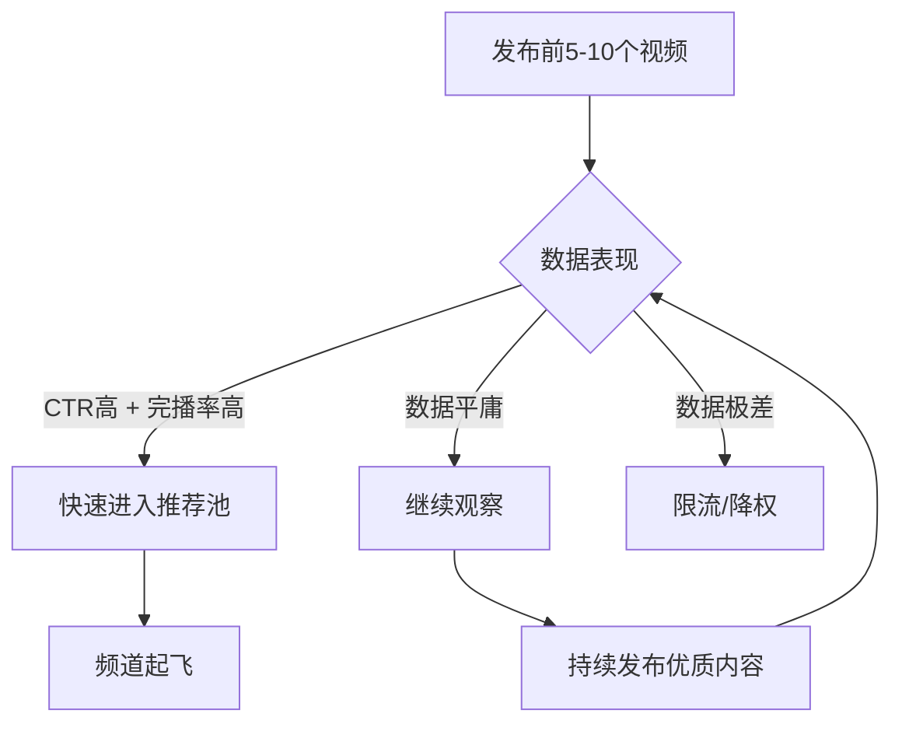
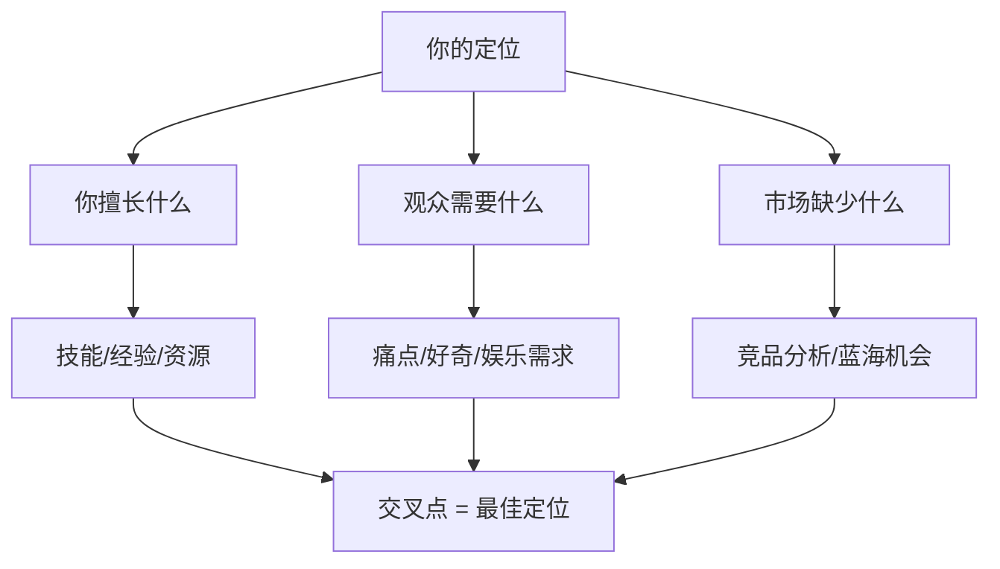
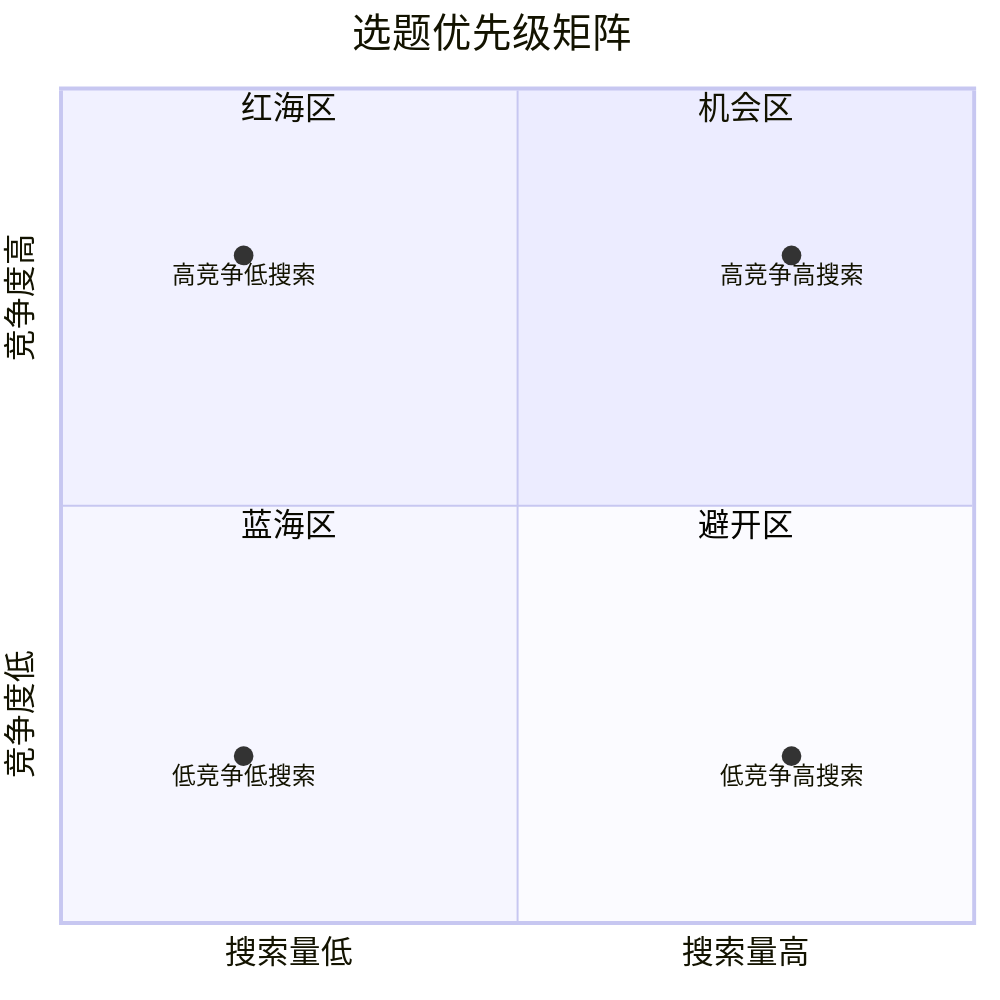
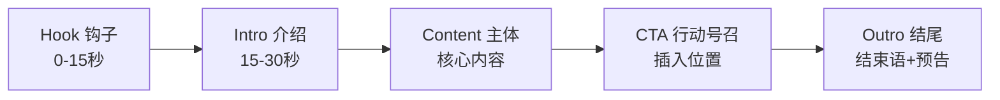
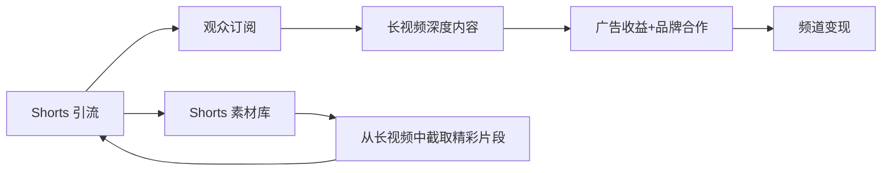
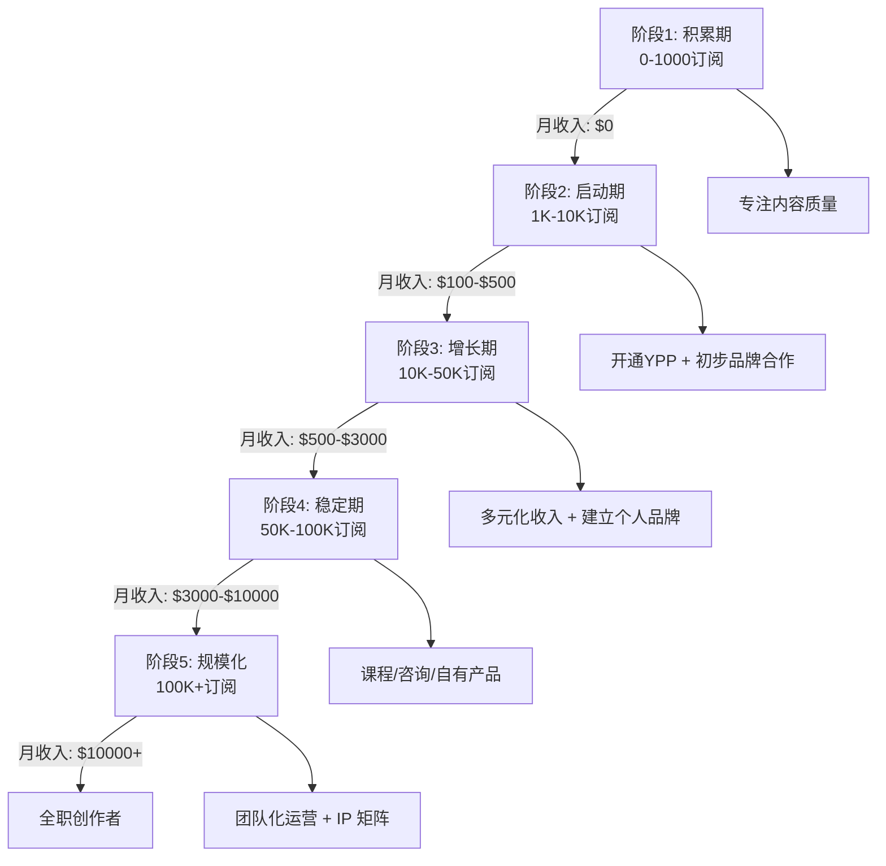

## 五、YouTube运营技巧

YouTube 是全球第二大搜索引擎，月活跃用户超过 25 亿，覆盖 100 多个国家和地区、80 种语言。对于内容创作者而言，YouTube 不仅是一个视频发布平台，更是一套完整的商业变现系统——广告分成、频道会员、超级留言、品牌合作、商品货架、付费课程，多元收入渠道层层叠加。本章从零基础出发，系统讲解 YouTube 运营的道法术器，帮助你建立可持续增长的频道。

### 1. 理解 YouTube 推荐机制

#### 1.1 算法核心逻辑

YouTube 的推荐系统本质上是一个"注意力分配器"，其目标是最大化用户在平台上的停留时间和满意度。算法主要通过三个页面分发流量：

| 流量入口 | 占比 | 核心指标 | 特点 |
|----------|------|----------|------|
| 首页推荐（Home） | 约 70% | 点击率（CTR）× 观看时长（Watch Time） | 最大流量池，基于用户兴趣匹配 |
| 推荐侧栏/自动播放（Suggested） | 约 20% | 与当前视频的相关性 + 用户观看历史 | 关联流量，适合系列内容 |
| 搜索结果（Search） | 约 10% | 关键词相关性 + 视频表现数据 | 精准流量，长尾效应强 |

YouTube 算法的工作流程分为两阶段：

1. **候选阶段**：从数百万视频中筛选出数百个可能相关的候选视频，主要依据用户画像和历史行为。
2. **排序阶段**：对候选视频进行精细打分排序，核心公式为：

> 推荐权重 ≈ 预估点击率（pCTR）× 预估观看时长（pWatch Time）× 预估满意度（pSatisfaction）× 频道权重系数

这个公式揭示了一个关键点：YouTube 不只是看你的视频"有多少人点进来"，更看"有多少人看完"以及"看完后是否满意"。一个 CTR 很高但完播率很低的视频，会被算法判定为"标题党"而逐步减少推荐。满意度指标则通过点赞/踩比例、评论情感分析、订阅行为、分享行为等综合衡量。

#### 1.2 关键数据指标

理解以下指标是优化频道的基础：

- **CTR（Click-Through Rate，点击率）**：缩略图展示后被点击的比例。首页推荐视频的平均 CTR 为 2%-10%，超过 10% 属于优秀。注意：CTR 会随着推荐量增加而下降（因为推给了更泛的用户），这是正常现象。
- **平均观看时长（Average View Duration）**：观众平均看了多久。YouTube 内部参考线是视频总时长的 50% 以上为良好。10 分钟的视频如果平均观看时长达到 5 分钟，说明内容有足够的吸引力。
- **平均观看百分比（Average Percentage Viewed）**：观众平均看完了百分之多少的视频。长视频 40%-50% 为佳，短视频 60%-70% 为佳。
- **互动率（Engagement Rate）**：点赞、评论、分享、收藏的总和与观看量的比值。2%-5% 为正常水平。评论的权重最高（因为它需要更多用户投入），其次是分享（代表强烈的推荐意愿）。
- **订阅转化率**：每次观看带来的新订阅者数量。0.5%-2% 为正常，超过 2% 为优秀。
- **每千次展示收益（RPM）**：每 1000 次观看的收入，中文频道通常 $1-$5，英文财经/科技频道可达 $10-$30。
- **YouTube Premium 收益**：Premium 用户观看你的视频时，你获得的分成独立于广告收入。Premium 用户占比高的地区（日本、韩国、北欧）这部分收入可占总收入的 10%-20%。

#### 1.3 算法对新频道的态度

YouTube 对新频道有一个"观察期"机制：



这意味着：频道初期的前 10-20 个视频至关重要。与其高频率发布平庸内容，不如精心打磨每一个视频，让算法看到你的频道有"留住观众"的能力。

**新频道冷启动策略**：

1. **第一个视频选择"搜索型"内容**：选一个搜索量适中、竞争度低的关键词，确保视频能通过搜索获得初始流量
2. **利用个人社交圈**：分享给朋友、同事、社群，获得第一批真实观看和互动
3. **不要买粉买赞**：YouTube 能检测到虚假互动，这些假用户不会看完你的视频，反而会拉低完播率
4. **保持一致的发布节奏**：每周至少 1 个视频，让算法有足够数据学习你的频道属性
5. **在 Reddit、Quora 等社区参与相关讨论**：自然地引用你的视频（不要硬推广），获取精准的外部流量

#### 1.4 算法更新趋势（2024-2025）

YouTube 算法持续迭代，以下是近两年的关键变化：

- **Shorts 算法独立化**：Shorts 推荐系统与长视频完全独立，互不影响。做 Shorts 不会"抢走"长视频的流量。
- **"满意度信号"权重提升**：YouTube 公开表示正在增加"观众满意度"在推荐中的权重，包括调查问卷（"你是否喜欢这个视频？"）和重播率。
- **AI 检测内容质量**：YouTube 开始使用 AI 识别低质量、自动生成的内容，这类内容会被限制推荐。
- **跨语言推荐**：YouTube 的自动配音（Aloud）和多语言字幕功能正在扩大，这意味着非英语内容有更多全球曝光机会。
- **播客内容整合**：YouTube 将播客作为独立内容类别推广，纯音频+静态画面的视频也能获得推荐。

### 2. 频道定位与差异化策略

#### 2.1 定位三角模型

成功的频道定位需要同时满足三个条件：



- **你擅长什么**：不是"会做"，而是"做得比大多数人好"。例如你不是随便学过 Python，而是有 5 年开发经验并做过 3 个上线项目。
- **观众需要什么**：用 YouTube 搜索建议（自动补全）、Google Trends、Reddit/知乎 高赞问题来验证需求。
- **市场缺少什么**：搜索你的目标关键词，看现有视频的质量和数量。如果前 10 个结果都很水，说明机会很大。

**定位验证清单**：

在确定频道定位前，用以下问题自检：

1. 你能连续制作 50 个以上选题而不枯竭吗？（内容可持续性）
2. 这个定位的广告商愿意出多少钱投放？（变现天花板）
3. 目标观众是否愿意为这个领域的内容花时间？（需求真实性）
4. 你在这个领域是否有独特的经历或视角？（差异化壁垒）
5. 3 年后这个领域还有需求吗？（长期价值）

#### 2.2 差异化方法

当一个赛道已有大量创作者时，差异化是生存的关键：

| 差异化维度 | 举例 | 效果 |
|-----------|------|------|
| 视角差异 | 同样讲 Python，你从设计师转程序员的视角讲 | 降低入门门槛，增加共鸣 |
| 深度差异 | 别人 5 分钟概览，你 30 分钟深度拆解 | 吸引高粘性用户 |
| 形式差异 | 竞品都是 PPT 讲解，你做实景实操 | 提高完播率 |
| 语言/文化差异 | 用中文讲解国外技术前沿 | 信息差就是优势 |
| 更新频率差异 | 竞品周更，你日更（短内容） | 抢占搜索结果 |
| 人设差异 | 专业但不严肃，加入段子和梗 | 提高辨识度和记忆点 |
| 受众差异 | 同样讲摄影，你专门面向手机摄影新手 | 精准匹配，转化率高 |
| 呈现差异 | 竞品都是真人出镜，你用动画讲解 | 视觉差异化，降低制作门槛 |

#### 2.3 频道名称与品牌设计

频道名称的黄金法则：

1. **易读易记**：不超过 4 个英文单词或 8 个中文字，避免生僻字和数字混搭
2. **暗示内容**：看到名字就能猜到频道大概做什么（如"TechQuickie"暗示快速技术讲解）
3. **可搜索**：包含核心关键词有助于搜索发现（如"老高與小茉 Mr & Mrs Gao"）
4. **无歧义**：避免与其他知名品牌撞名或产生负面联想
5. **可扩展**：不要把名称限制得太窄（如"Python教程网"以后想讲 JavaScript 就尴尬了）

频道品牌视觉三件套：

- **频道图标（Profile Picture）**：256×256px 以上，建议使用清晰的人脸照片或简洁 Logo。人像比纯 Logo 的信任感更强。
- **频道封面（Banner Art）**：2560×1440px，安全区域 1546×423px（移动端可见范围）。必须包含：频道名、更新频率、核心主题关键词。
- **水印（Watermark）**：建议使用订阅按钮样式的品牌 Logo，150×150px。水印在视频右下角显示，点击可直接订阅。

**品牌一致性**：频道图标、封面、缩略图风格、字体、配色方案应保持统一。观众在浏览推荐列表时，应该能一眼认出"这是你的视频"。建立一个简单的品牌规范文档（字体、主色调、缩略图模板），确保即使交给别人做缩略图也不会风格走样。

### 3. 视频创作全流程

#### 3.1 选题策略

选题决定流量上限，拍摄和剪辑只决定下限。以下是经过验证的选题框架：

**搜索驱动型选题**（长尾流量，稳定增长）：

1. 在 YouTube 搜索框输入你的领域关键词，记录所有自动补全建议
2. 使用 TubeBuddy 或 vidIQ 查看搜索量和竞争度
3. 选择搜索量 > 1000/月且竞争度较低的关键词
4. 每个搜索型视频标题必须包含核心关键词

**趋势驱动型选题**（爆发流量，时效性强）：

1. 关注 Google Trends、Twitter 趋势、行业新闻
2. 在热点发生的 24-48 小时内发布相关内容
3. 标题格式："[热点事件] + 你的独特分析角度"
4. 适合已有一定粉丝基础的频道，新号蹭热点效果有限

**系列型选题**（提高粘性，增加观看时长）：

1. 将大主题拆分为 5-10 集系列
2. 每集结尾预告下一集内容
3. 创建播放列表并设置自动播放
4. 系列内视频互相链接（Suggested 流量）

**竞品分析型选题**：

1. 找到与你同量级的 5-10 个频道
2. 分析他们过去 6 个月播放量最高的前 10 个视频
3. 识别共同主题和爆款规律
4. 用自己的差异化角度重新诠释相同话题

**"常青内容"选题**（长期搜索流量）：

1. 选择不过时的基础知识类话题（如"如何用 Git"、"Excel 函数大全"）
2. 这类视频可能初期播放量不高，但会在 1-2 年内持续积累观看
3. 定期更新视频信息（描述、卡片），确保内容不过时
4. 常青内容是频道收入的"基本盘"，占频道总内容的 30%-50% 为宜

**选题优先级矩阵**：



- **蓝海区（低竞争高搜索）**：优先做，这是你的金矿
- **机会区（高竞争高搜索）**：需要差异化角度才能做
- **低竞争低搜索**：适合建立内容基础，但不要投入太多精力
- **高竞争低搜索**：直接放弃

#### 3.2 脚本写作

一个结构完整的 YouTube 脚本包含五个部分：



**Hook（钩子）**—— 前 15 秒决定观众去留：

- 方法一：直接给结论。"这个工具让我一个月多赚了 5000 美元，而且完全免费。"
- 方法二：制造悬念。"99% 的人都不知道，YouTube 还有这样一个隐藏功能。"
- 方法三：展示结果。直接播放最终效果的精彩片段，然后说"接下来我会一步步教你怎么做。"
- 方法四：提问共鸣。"你是不是也遇到过这样的问题——上传了 50 个视频，播放量还是两位数？"
- 方法五：对比冲击。"左边是我一年前的作品，右边是我现在的作品。差距大到我自己都不敢相信。"
- 方法六：数据震撼。"这个方法帮我在 3 个月内从 0 做到了 10 万订阅。"

**绝对不要做的事**：在开头说"大家好，我是 XXX，欢迎来到我的频道，今天我们要讲的是……"。这是最经典的流失杀手，因为你还没有给观众留下来的理由。自我介绍放在视频中段或结尾。

**Content（主体内容）**：

- 使用"节奏变化"保持注意力：每 2-3 分钟切换一次呈现方式（讲解→画面→数据→案例→动画）
- 每个小节控制在 3-5 分钟，超过 5 分钟必须用画面变化打破疲劳感
- 关键信息用字幕、标注、放大画面来强调
- 每隔 3-4 分钟设置一个"留存钩子"：预告后面还有更重要的内容
- 使用"信息密度梯度"：开头给最核心的 1-2 个信息点，中间逐步展开细节，结尾给总结和行动建议

**脚本写作模板**：

```text
[Hook - 0:00-0:15]
核心价值主张 / 悬念 / 结果展示

[Intro - 0:15-0:30]
说明本视频将解决什么问题
列出将涵盖的 3-5 个要点

[Section 1 - 0:30-3:00]
第一个核心要点
- 讲解原理
- 展示案例
- 给出步骤

[留存钩子 - 3:00]
"接下来这个方法更厉害……"

[Section 2 - 3:00-6:00]
第二个核心要点
- 讲解原理
- 展示案例
- 给出步骤

[CTA 订阅 - 6:00]
在内容高潮之后插入订阅请求

[Section 3 - 6:00-9:00]
第三个核心要点

[CTA 评论 - 9:00]
互动问题引导评论

[Outro - 9:00-9:30]
总结核心要点
预告下一期内容
```

**CTA（行动号召）**的放置策略：

| CTA 类型 | 最佳位置 | 话术示例 |
|----------|----------|----------|
| 订阅 | 内容高潮之后（不是开头） | "如果你也想学会这个方法，点个订阅，我每周都会分享一个实战技巧" |
| 点赞 | 解决了一个核心问题后 | "这个方法对你有帮助的话，点个赞让我知道" |
| 评论 | 视频中段设置互动问题 | "你在做 XXX 的时候遇到过什么问题？在评论区告诉我" |
| 关联视频 | 提到相关知识点时 | "关于这个话题，我之前做了一期深度讲解，链接在这里" |
| 会员 | 视频末尾 | "加入频道会员可以获取本期视频的完整源码和模板" |

#### 3.3 拍摄设备与技巧

**入门设备方案**（预算 2000-5000 元）：

| 设备 | 推荐选择 | 预算 |
|------|----------|------|
| 相机 | 手机（iPhone 13 以上或同级安卓） | 已有 |
| 稳定器/三脚架 | 手机三脚架 + 蓝牙遥控器 | 100-300元 |
| 麦克风 | 领夹麦（Boya BY-M1）或 USB 麦（Fifine K669） | 100-300元 |
| 灯光 | 环形灯 + 自然光组合 | 200-500元 |
| 背景 | 整洁的书架/纯色墙壁 + 简单装饰 | 0-500元 |

**进阶设备方案**（预算 1-3 万元）：

| 设备 | 推荐选择 | 预算 |
|------|----------|------|
| 相机 | Sony ZV-E10 / Canon M50 Mark II | 4000-6000元 |
| 镜头 | 套机头 + 适马 16mm F1.4 | 2000-3000元 |
| 麦克风 | Rode VideoMicro II / Shure MV7 | 500-2500元 |
| 灯光 | Elgato Key Light / Godox SL-60W | 1000-3000元 |
| 采集卡 | 仅录屏/游戏频道需要（Elgato HD60 S+） | 1000-1500元 |
| 背景 | 专业背景布/置景 | 500-2000元 |

**拍摄核心技巧**：

1. **光线**：自然光 > 环形灯 > 专业灯光。面向窗户拍摄，避免背光。灯光主光源放在摄像头后方偏左或偏右 45 度。如果只有一个灯，放在正前方偏上 45 度。
2. **构图**：三分法构图，眼睛在画面上三分之一处。头顶留一拳空间，不要切到额头。口播类视频用中景或中特写（胸部以上）。
3. **声音**：声音质量比画面质量更重要。观众可以忍受模糊画面但不能忍受糟糕音质。麦克风距离嘴巴 15-30cm，录制环境要安静，衣服避免摩擦声。录制前做 5 秒测试，回放检查音量和噪音。
4. **眼神**：看镜头，不看屏幕。可以在镜头旁边贴一张"看这里"的提示。如果有提词器，放在镜头正下方。
5. **能量感**：镜头会"吃掉"你 30% 的能量，所以录制时需要比日常对话更有精神。如果觉得自己"太夸张了"，那就对了。
6. **背景**：背景应与内容调性一致。技术类可以用整洁的书架或显示器，生活方式类可以用家居环境。避免空白墙壁（显得廉价）和杂乱环境（分散注意力）。

#### 3.4 剪辑节奏与工具

**剪辑节奏的黄金法则**：

- **3 秒法则**：画面不要超过 3 秒没有任何变化（切镜头、加文字、换角度、放大画面）
- **Jump Cut（跳切）**：口播类视频最基本的剪辑手法，删掉停顿、重复、口误，让节奏紧凑
- **B-Roll（补充画面）**：在口播的同时插入相关画面，如屏幕录制、产品特写、数据图表
- **音乐节奏**：背景音乐的节拍点与画面切换点对齐，增强观感
- **呼吸感**：不要把节奏压得太紧，关键信息点之后给 1-2 秒的"消化时间"

**常用剪辑工具对比**：

| 工具 | 平台 | 价格 | 适合人群 | 特点 |
|------|------|------|----------|------|
| DaVinci Resolve | Win/Mac/Linux | 免费 | 所有人 | 专业级调色，免费版功能完整 |
| CapCut（剪映国际版） | 全平台 | 免费/付费 | 短视频创作者 | 自动字幕、模板丰富 |
| Premiere Pro | Win/Mac | ¥150/月 | 专业创作者 | 行业标准，插件生态丰富 |
| Final Cut Pro | Mac | ¥1998 一次性 | Mac 用户 | 原生优化好，渲染速度快 |
| iMovie | Mac/iOS | 免费 | 新手入门 | 操作简单，模板有限 |

**效率技巧**：

- 先粗剪（删除所有废镜头），再精剪（调整节奏和转场），最后加字幕和音乐
- 用 DaVinci Resolve 的免费版即可完成 90% 的专业剪辑需求
- 批量处理：同类型视频建立模板项目，后续复用时间线结构
- 快捷键：掌握 10 个核心快捷键可以提升 50% 的剪辑速度
- **剪辑 Checklist**：每次导出前检查——音频电平是否一致、字幕是否有错、片头片尾是否完整、缩略图是否已设置

#### 3.5 AI 辅助内容创作

AI 工具正在重塑 YouTube 内容创作的工作流程，合理使用可以大幅提升效率：

**脚本创作阶段**：

- **ChatGPT / Claude**：输入主题和目标受众，生成脚本大纲和初稿。关键技巧：给 AI 你的频道风格样本（复制 3 个你最好的视频脚本），让它学习你的语言风格。
- **Perplexity AI**：用于快速调研选题所需的数据、案例、引用来源，比手动 Google 搜索快 5 倍。
- **Notion AI / Notion**：用于脚本协作和版本管理。

**拍摄与剪辑阶段**：

- **Adobe Premiere Auto-Caption** / **CapCut 自动字幕**：自动生成多语言字幕，准确率 90% 以上，手动校对即可
- **Topaz Video AI**：视频超分辨率和降噪，将手机拍摄的画面提升到接近相机质感
- **Descript**：文字编辑视频——像编辑文档一样编辑视频，删掉一个词对应的画面自动删除
- **ElevenLabs**：AI 配音，适合不想出镜或需要多语言版本的创作者

**SEO 与分析阶段**：

- **TubeBuddy AI**：自动生成标签、标题建议、描述优化
- **vidIQ AI Coach**：基于频道数据的个性化增长建议
- **Thumbnail.ai**：AI 生成缩略图变体，用于 A/B 测试

**AI 使用的底线原则**：

- AI 生成的内容必须经过人工审核和修改，不能直接发布
- 不要使用 AI 生成的虚假数据或案例
- 在描述中标注"AI 辅助"（部分观众在意这个）
- YouTube 的政策要求标注"显著修改或合成的内容"（如 AI 换脸、AI 配音）
- 核心观点和经验必须来自你自己的真实经历，AI 只是辅助表达

### 4. 缩略图与标题优化

#### 4.1 缩略图设计原则

缩略图是 YouTube 上最重要的视觉资产，直接决定 CTR。一个优秀的缩略图需要满足：

1. **3 秒可读性**：在手机屏幕上（缩略图实际尺寸很小）3 秒内能理解内容
2. **情绪驱动**：人脸特写 + 强烈情绪（惊讶、兴奋、困惑）比纯文字和产品图更有效
3. **色彩对比**：背景色与主体色形成强烈对比。黄色/红色/橙色的 CTR 通常高于蓝色/绿色
4. **文字极简**：最多 4-6 个字，字体要粗大，确保手机上可读
5. **信息差**：制造"还没看视频就不完整"的感觉
6. **品牌一致性**：使用统一的字体、配色、布局风格，让观众一眼认出是你的视频

**缩略图设计的进阶技巧**：

- **对比法**：左右或上下分割画面，展示"前后对比"或"A vs B"。这种布局天然吸引注意力。
- **箭头/指示**：用箭头、圈注、高亮引导视线到关键信息。
- **人物表情**：人脸特写 + 夸张表情是 CTR 最高的缩略图类型。不需要真的那么夸张，但要传达明确的情绪。
- **数字/符号**：大号数字（如"$1000"、"7个方法"）能在缩略图中快速传达价值。
- **避免信息过载**：缩略图上最多 3 个视觉元素（人脸 + 文字 + 背景）。太多元素在手机上会变成一团模糊。

**缩略图测试方法**：

YouTube 原生提供 A/B 测试功能（测试版），上传 2-3 个缩略图变体，让 YouTube 自动选择表现最好的版本。如果你的频道没有这个功能，可以使用第三方工具如 ThumbnailTest.com 手动测试。测试周期建议至少 48 小时，样本量至少 1000 次展示。

**缩略图制作工具**：

- Canva（免费）：大量 YouTube 缩略图模板，拖拽式操作
- Photoshop（专业）：精修能力最强
- Figma（免费）：适合有设计基础的创作者
- Snappa（免费/付费）：专门为社交媒体设计的简化工具

#### 4.2 标题优化公式

标题需要同时满足三个需求：让算法理解（SEO）、让观众点击（CTR）、让观众有期待（减少跳出）。

**高 CTR 标题公式**：

| 公式 | 示例 | 适用场景 |
|------|------|----------|
| 数字 + 承诺 | "7 个让你效率翻倍的 VSCode 插件" | 工具推荐/技巧类 |
| 如何 + 结果 | "如何在 30 天内从零建立一个月入万元的博客" | 教程类 |
| 为什么 + 反常识 | "为什么你学了 3 年编程还是找不到工作" | 观点/分析类 |
| 对比型 | "100 元 vs 1000 元的机械键盘，差距到底在哪" | 评测类 |
| 悬念型 | "我在 Fiverr 上接了一单 5000 美元的项目，然后……" | 故事/经历类 |
| 挑战/实验 | "我用 ChatGPT 写了一个 App，7 天能赚多少钱？" | 实验记录类 |
| 警告/避坑 | "千万别犯这 5 个错误，否则你的频道永远做不起来" | 经验分享类 |
| 权威背书 | "前 Google 工程师教你写出面试必过的简历" | 专业教学类 |

**标题优化 Checklist**：

1. 标题是否包含核心关键词？（SEO 需求）
2. 标题是否传达了明确的价值或悬念？（CTR 需求）
3. 标题是否在 60 个字符以内？（不被截断）
4. 标题与缩略图是否形成互补？（不要重复相同信息）
5. 标题是否真实反映了视频内容？（避免跳出率飙升）

**标题红线**：

- 不要使用全大写字母（被视为喊叫）
- 不要超过 60 个字符（超过的部分在搜索结果中被截断）
- 不要使用欺骗性标题（Clickbait 会导致跳出率飙升，反而被算法惩罚）
- 不要在标题中堆砌关键词（被算法视为 Spam）
- 不要使用过多特殊符号（emoji 适度使用可以，满屏 emoji 显得不专业）

### 5. SEO 与标签策略

#### 5.1 YouTube SEO 三要素

YouTube SEO 的核心是让算法正确理解你的视频内容，将其推荐给合适的观众：

**标题（Title）**：
- 核心关键词放在标题前半部分
- 使用自然语言，不要关键词堆砌
- 标题长度 40-60 个字符为最佳

**描述（Description）**：
- 前两行（约 150 字）是最重要的部分，出现在搜索结果预览中
- 第一行直接重复标题中的关键词并扩展
- 第二行放最重要的链接（网站、社交媒体、关联视频）
- 正文部分：用自然语言详细描述视频内容，包含 3-5 个相关关键词
- 放置时间戳（Timestamps），帮助观众跳转和搜索结果展示章节
- 末尾放频道简介、订阅链接、合作联系方式

**描述模板**：

```text
[第一行] 在本视频中，你将学习如何 [核心关键词 + 扩展描述]。

[第二行] 🔗 相关资源链接：
- 免费模板下载：https://...
- 上一期视频：https://...

[时间戳]
0:00 开场
0:45 第一步：XXX
3:20 第二步：XXX
6:15 第三步：XXX
8:30 实操演示
11:00 常见问题
12:30 总结

[详细描述]
本视频详细讲解了 [主题] 的完整流程，包括 [关键词1]、[关键词2]、[关键词3]。
适合 [目标受众] 观看。如果你是 [场景描述]，这个视频会帮你解决 [具体问题]。

[频道简介]
📌 关于本频道：[一句话描述频道内容]
🔔 订阅并开启通知，不错过每周更新
📧 商务合作：email@example.com

#关键词1 #关键词2 #关键词3
```

**标签（Tags）**：
- YouTube 官方已确认标签对搜索排名的影响极小，但仍建议填写
- 第一个标签应该是你的核心关键词
- 其余标签包括：长尾关键词变体、相关话题、竞品频道名（慎用）
- 标签总数 5-15 个即可，不需要填满 500 字符上限

#### 5.2 时间戳与章节

时间戳是被低估的 SEO 工具。正确使用时间戳可以：

1. 在搜索结果中显示"关键片段"，增加点击率
2. 让观众快速跳转到感兴趣的部分，减少跳出
3. 提高视频的整体结构感和专业度
4. YouTube 会将时间戳章节作为独立的"迷你视频"参与搜索排名

格式示例：

```text
0:00 开场 - 为什么你需要这个方法
0:45 第一步：注册和基础设置
3:20 第二步：核心功能详解
6:15 第三步：高级技巧分享
8:30 实操演示 - 完整流程
11:00 常见问题解答
12:30 总结和行动建议
```

**时间戳规则**：
- 第一个时间戳必须从 0:00 开始
- 每个章节至少 10 秒长
- 章节标题简洁有力（3-8 个字）
- 至少 3 个章节才能激活章节功能

#### 5.3 多语言字幕策略

多语言字幕是打开全球市场的钥匙：

- **自动翻译字幕**：YouTube 提供自动翻译功能，但准确率有限。对于重要视频，手动校对关键语言的字幕。
- **优先语言**：英语 > 西班牙语 > 葡萄牙语 > 印地语 > 阿拉伯语（按全球 YouTube 用户数量排序）
- **字幕制作流程**：
  1. 先用 CapCut 或 Premiere 自动生成原语言字幕
  2. 校对原语言字幕的准确率
  3. 用 ChatGPT 或 DeepL 翻译为目标语言
  4. 手动校对翻译后的字幕（特别是专业术语）
  5. 上传到 YouTube Studio → 字幕 → 添加语言
- **效果**：带有多语言字幕的视频，非母语观众的观看时长平均提升 15%-25%

### 6. 发布策略与增长引擎

#### 6.1 发布频率与时机

**发布频率**：

| 频道阶段 | 建议频率 | 原因 |
|----------|----------|------|
| 新频道（0-1000 订阅） | 每周 2-3 次 | 快速积累内容库，给算法足够数据学习 |
| 成长期（1K-10K） | 每周 1-2 次 | 平衡质量和数量，保持观众期待 |
| 成熟期（10K+） | 每周 1 次或双周 1 次 | 观众已形成习惯，质量优先 |

**发布时机**：

- 查看 YouTube Studio → 分析 → 观众在线时间，找到你的观众最活跃的时段
- 一般规律：工作日晚上 7-10 点、周末上午 10 点-下午 2 点是高峰
- 对于跨时区的英文频道：美东时间周二/周四下午 2-4 点是公认的"最佳发布窗口"
- 提前 1-2 小时发布，让视频有时间被算法索引

**排程发布**的使用场景：

- 录制多个视频后批量排程，保持稳定的发布节奏
- 在观众最活跃的时间点发布（即使你在睡觉）
- 为节假日和特殊事件提前准备内容

#### 6.2 YouTube Shorts 策略

Shorts 是 YouTube 的短视频功能（3 分钟以内），是增长最快的流量入口：

**Shorts 对频道的价值**：

- Shorts 的订阅转化率远高于长视频（因为门槛低，观众多）
- Shorts 流量独立于长视频，不会互相"抢流量"
- 涨到 1000 订阅的最快路径之一

**Shorts 创作要点**：

1. 时长控制在 30-60 秒（不是越短越好，太短完播率反而下降）
2. 前 2 秒必须有强烈的视觉冲击或文字钩子
3. 竖屏拍摄（9:16 比例，1080×1920）
4. 不要在 Shorts 中放太多文字（手机屏幕小，读不完）
5. Shorts 的结尾要引导观众看你的长视频或订阅频道

**Shorts 变现机制**：

2023 年起，YouTube 将 Shorts 广告收入纳入 YPP 分成体系：

- Shorts 广告收入汇总后，按比例分配给 Shorts 创作者
- 创作者保留 45%，YouTube 取 55%
- 分配依据：你的 Shorts 观看量占该地区总 Shorts 观看量的比例
- Shorts 的 RPM 通常低于长视频（$0.01-$0.10 / 千次观看），但量大
- 用 Shorts 引流到长视频是更高效的变现策略

**Shorts 与长视频的协同**：



**Shorts 选题策略**：

| 类型 | 说明 | 举例 |
|------|------|------|
| 长视频精华 | 从长视频中截取最精彩片段 | "30 秒学会这个 Python 技巧" |
| 独立短内容 | 为 Shorts 专门创作的内容 | "今天的编程冷知识" |
| 幕后花絮 | 展示创作过程或个人生活 | "录视频时翻车了" |
| 热点响应 | 快速回应热点话题 | 针对行业新闻给出 30 秒观点 |
| 互动引导 | 提问或投票 | "你觉得哪个更好？评论区告诉我" |

#### 6.3 YouTube 直播策略

YouTube 直播是提升互动率和变现的强力工具：

**直播的频道价值**：

- 直播观看时长计入频道总观看时长（帮助达到 YPP 门槛）
- 直播的 Super Chat 收入可以非常可观（特别是游戏、音乐、新闻评论类）
- 直播内容可以剪辑为长视频和 Shorts，一鱼三吃
- 直播互动率远高于录播视频，有助于建立粉丝忠诚度

**直播类型与适合的频道**：

| 直播类型 | 适合频道 | 互动方式 |
|----------|----------|----------|
| Q&A 问答 | 知识类、教育类 | 观众提问，主播回答 |
| 编程/创作实况 | 技术类、设计类 | 实时展示过程，观众参与决策 |
| 游戏直播 | 游戏类 | 实时互动、Super Chat |
| 新闻/事件评论 | 新闻类、评论类 | 实时讨论、观众投票 |
| 教学/Workshop | 教育类 | 边讲边练，实时答疑 |

**直播 Checklist**：

1. 提前 24-48 小时在社区标签发布直播预告
2. 设置吸引人的直播标题和缩略图
3. 测试网络、音频、画面（至少提前 30 分钟）
4. 准备互动话题列表（避免冷场）
5. 安排至少 1 个"管理员"在评论区维护秩序
6. 直播结束后保存回放，添加时间戳

#### 6.4 社区互动与外站引流

**社区标签（Community Tab）**：

- 解锁条件：500 订阅或已验证手机号
- 用途：发布图文动态、投票、预告、幕后花絮
- 投票是互动率最高的社区内容类型，用投票收集选题反馈
- 发布频率：每周 2-3 次，保持频道活跃度

**评论区运营**：

- 发布后 1 小时内回复所有评论（算法会给"热门评论"加权）
- 置顶一条包含 CTA 的自评（如"想看第二集的扣 1"）
- 用提问引导评论（"你更喜欢方案 A 还是 B？"）
- 对负面评论保持专业，不要删评（除非是恶意攻击）
- 善用"心评"功能：创作者点赞的评论会显示特殊标记，增加评论者的参与感

**外站引流**：

| 平台 | 引流方式 | 效果评估 |
|------|----------|----------|
| Reddit | 在相关 Subreddit 发帖分享，附视频链接 | 高质量流量，但社区排斥硬推广 |
| Twitter/X | 发布视频片段 + 完整版链接 | 适合观点类/新闻类内容 |
| 博客/网站 | 嵌入 YouTube 视频 + SEO 文章 | 长尾搜索流量，稳定但慢 |
| 微信/Telegram 群 | 精准分享给目标受众 | 中文频道的核心引流渠道 |
| Discord | 建立频道社区，设置角色和话题 | 增强粉丝粘性 |
| Quora/知乎 | 回答相关问题并引用视频 | 精准的搜索流量 |
| Pinterest | 发布缩略图 + 视频链接 | 适合视觉类内容（设计、摄影、烹饪） |

#### 6.5 创作者合作（Collab）

与其他 YouTuber 合作是加速增长的最有效方式之一：

**合作形式**：

| 形式 | 说明 | 适合阶段 |
|------|------|----------|
| 客座出演 | 在对方视频中出镜或提供内容 | 任何阶段 |
| 联合视频 | 两个频道共同制作一个视频 | 1K+ 订阅 |
| 访谈 | 采访行业专家或知名创作者 | 5K+ 订阅 |
| 挑战/对决 | 双方围绕同一主题各做一个视频 | 任何阶段 |
| 推荐/提及 | 在视频中推荐对方频道 | 任何阶段 |

**如何找到合作对象**：

1. 找同量级或稍大的频道（差距不超过 10 倍）
2. 找内容互补而非直接竞争的频道（如你讲前端，对方讲后端）
3. 通过评论区、社交媒体、邮件联系，说明合作价值
4. 先在对方视频下积极评论，建立存在感，再提出合作

**合作注意事项**：

- 合作前明确双方的权责（谁拍摄、谁剪辑、谁发布）
- 合作视频在两个频道都要发布（可以是不同版本）
- 在描述和视频中互相提及并链接
- 合作后跟踪数据，评估效果

### 7. 变现体系全景

#### 7.1 YouTube Partner Program（YPP）入门门槛

| 条件 | 入门级（广告收益） | 进阶级（全部功能） |
|------|-------------------|-------------------|
| 订阅数 | 500 | 1,000 |
| 公开观看时长 | 3,000 小时（近 12 个月） | 4,000 小时（近 12 个月） |
| 或 Shorts 观看量 | 300 万次（近 90 天） | 1,000 万次（近 90 天） |
| 开通功能 | Super Chat、Super Thanks、频道会员、商品货架 | 以上全部 + 广告收益 |

**加速达到 YPP 门槛的策略**：

- 优先做搜索型内容（长尾流量稳定积累观看时长）
- 做 10-15 分钟的视频（比 5 分钟视频更容易积累时长）
- 创建播放列表并设置自动播放（增加总观看时长）
- Shorts 快速涨订阅，长视频积累观看时长，两条腿走路

#### 7.2 收入来源详解

**广告收益（AdSense）**：

- YouTube 将广告收入的 55% 分给创作者，45% 归平台
- 不同内容类别的 RPM（每千次播放收入）差异巨大：

| 内容类别 | 中文频道 RPM | 英文频道 RPM |
|----------|-------------|-------------|
| 科技/编程 | $2-$5 | $8-$20 |
| 财经/投资 | $3-$8 | $15-$40 |
| 教育/教程 | $2-$6 | $5-$15 |
| 游戏 | $1-$3 | $3-$8 |
| 娱乐/生活 | $1-$3 | $2-$6 |
| 保险/法律 | $5-$15 | $30-$80 |

- 影响 RPM 的因素：观众地区（欧美 > 东南亚）、视频时长（8 分钟以上可插入中贴片广告）、季节（Q4 最高）、内容敏感度
- **中贴片广告（Mid-Roll Ads）**：视频超过 8 分钟可以手动插入广告位。建议每 3-5 分钟插一个，放在内容转折点（自然断点），不要打断观众的沉浸感。
- **广告类型**：可跳过广告（最常见）、不可跳过广告（15-20 秒，RPM 更高但可能降低观看时长）、展示广告（侧栏，收入较低）、叠加广告（底部横幅，收入较低）。

**YouTube Premium 收入**：

- Premium 用户每月付费订阅，其中一部分按观看比例分配给创作者
- Premium 用户的观看不产生广告，但你仍然获得收入
- Premium RPM 通常高于广告 RPM（因为 Premium 用户更活跃）
- 日本、韩国、北欧国家的 Premium 用户占比高，这些地区的频道 Premium 收入可观

**频道会员（Channel Memberships）**：

- 设置 5 个等级，价格从 $0.99 到 $49.99
- 每个等级提供不同的专属权益：徽章、表情、专属内容、提前观看
- 典型转化率：1%-5% 的订阅者会成为付费会员
- 关键：每月必须提供明确的价值，否则会员会取消
- **会员等级设计示例**：

| 等级 | 价格 | 权益 |
|------|------|------|
| Lv1 支持者 | $0.99/月 | 专属徽章 + 表情 |
| Lv2 粉丝 | $4.99/月 | 以上 + 会员专属社区帖子 |
| Lv3 铁粉 | $9.99/月 | 以上 + 提前 24 小时看新视频 |
| Lv4 核心 | $24.99/月 | 以上 + 每月一次专属直播 Q&A |
| Lv5 超级 | $49.99/月 | 以上 + 视频中点名感谢 + 1v1 咨询 |

**Super Chat / Super Thanks**：

- 直播和视频中的打赏功能
- Super Chat 在直播中发送，会高亮显示在聊天区
- Super Thanks 在普通视频中发送，会显示在评论区
- 中文频道的打赏收入通常低于英文频道
- 提升 Super Chat 收入的方法：直播中专门回应打赏者、设置打赏里程碑目标、用打赏者的名字做创意内容

**品牌合作（Sponsorship）**：

- 当频道达到 5000-10000 订阅时可以开始接品牌合作
- 定价参考：$50-$100 / 每千订阅者（每次合作）
- 接单平台：Grapevine、Channel Pages、FameBit（YouTube 官方）
- 关键：只接与频道调性一致的品牌，不要为了钱接烂广告
- **品牌合作谈判要点**：
  1. 明确合作形式：品牌植入（Integrated）还是专属推荐（Dedicated）
  2. 明确展示时长和位置：品牌露出多少秒？放在视频哪个位置？
  3. 明确修改次数：通常包含 1-2 次修改
  4. 明确数据承诺：不承诺播放量，只承诺发布
  5. 明确付款条件：50% 预付 + 50% 发布后，或全额发布后 30 天内

**商品货架（Merchandise Shelf）**：

- YouTube 与 Teespring/Spring 集成，可在视频下方展示商品
- 适合有强人设的频道（Logo T 恤、表情包周边等）
- 利润率通常在 30%-50%

**联盟营销（Affiliate Marketing）**：

- 在描述中放置联盟链接，观众购买后你获得佣金
- Amazon Associates 是最通用的联盟计划（佣金 1%-10%）
- 软件/工具类联盟计划佣金更高（如 VPN、主机、设计工具，佣金 20%-50%）
- 关键：只推荐你真正使用过的产品，诚实评价，否则会失去观众信任

#### 7.3 收入增长路径



#### 7.4 收入多元化策略

不要把所有鸡蛋放在一个篮子里。成熟的 YouTube 收入结构应该是：

| 收入来源 | 占比建议 | 说明 |
|----------|----------|------|
| 广告收益 | 30%-40% | 基础收入，受算法和季节影响大 |
| 品牌合作 | 20%-30% | 高利润，但依赖商务能力 |
| 会员/打赏 | 10%-15% | 稳定收入，需要持续提供价值 |
| 联盟营销 | 10%-15% | 被动收入，选对产品是关键 |
| 自有产品 | 10%-20% | 课程、电子书、模板、咨询 |

### 8. 数据分析与优化闭环

#### 8.1 YouTube Studio 核心数据面板

**观看量分析**（Analytics → Overview）：

- 总观看量趋势：是增长、持平还是下降？
- 单视频贡献度：是否过于依赖某几个视频？（单视频占比 > 30% 说明频道风险高）
- 新增订阅来源：哪个视频带来了最多订阅？

**流量来源分析**（Analytics → Traffic Sources）：

- 如果首页推荐占比 < 50%，说明内容的"推荐力"不足
- 如果搜索占比 > 30%，说明 SEO 做得好，但需要拓展推荐流量
- 如果外部流量占比 > 20%，说明有稳定的外站引流渠道

**观众留存曲线**（Audience Retention）：

这是最重要的单个数据图表。曲线显示了观众在视频的每一秒流失情况：

- 理想曲线：前 30 秒快速下降到 60%-70%，然后缓慢下降
- 常见问题：开头暴跌（Hook 不好）、中间有明显下降点（某段内容无聊）、结尾加速下降（CTA 放太早）
- 每次复盘都看留存曲线，找到最大的下降点并优化

**观众画像分析**（Analytics → Audience）：

- 年龄、性别、地区分布：了解你的观众是谁
- 观众还看了什么：发现竞品频道和内容方向
- 观众在线时间：确定最佳发布时机
- 新观众 vs 回头客比例：回头客 > 40% 说明内容粘性好

#### 8.2 A/B 测试思维

持续优化的过程本质上是一个 A/B 测试循环：

1. **假设**："我觉得这个标题比那个标题更吸引人"
2. **实验**：下次发布时用新标题风格
3. **数据**：对比 CTR、观看时长、互动率
4. **结论**：保留有效的，放弃无效的
5. **迭代**：进入下一个假设

可测试的变量：缩略图风格、标题公式、视频长度、发布时间、Hook 风格、CTA 位置。每次只测试一个变量，否则无法确定是哪个因素导致了变化。

**A/B 测试模板**：

| 变量 | 版本 A | 版本 B | 指标 | 样本量 | 结论 |
|------|--------|--------|------|--------|------|
| 缩略图 | 人脸特写 | 产品展示 | CTR | 2000 展示 | - |
| 标题 | 数字型 | 疑问型 | CTR | 2000 展示 | - |
| Hook | 直接给结论 | 制造悬念 | 前 30 秒留存 | 1000 观看 | - |
| 视频长度 | 8 分钟 | 15 分钟 | 平均观看时长 | 2 个视频 | - |

**测试周期**：每个测试至少运行 48 小时或达到 1000 次数据点，才能得出有意义的结论。不要因为一两个视频的数据就下结论，样本量太小会导致误判。

#### 8.3 数据驱动的复盘流程

每周花 30 分钟做一次数据复盘：

```text
周复盘 Checklist：
□ 本周发布视频的 CTR 是否高于频道平均？
□ 观众留存曲线的最大下降点在哪？为什么？
□ 流量来源结构是否健康？（首页 > 50%）
□ 评论区有哪些反馈和选题建议？
□ 哪个视频表现最好？为什么？能否复制？
□ 哪个视频表现最差？为什么？如何避免？
□ 下周的选题和优化方向是什么？
```

### 9. 风险控制与合规

#### 9.1 YouTube 政策红线

以下行为会导致频道被黄标（取消货币化）、限流甚至封号：

- **版权侵犯**：使用未经授权的音乐、视频片段、图片。使用 YouTube Audio Library 或 Epidemic Sound 等免版权素材。
- **重复内容**：大量搬运或翻录他人的视频。即使是"解说"类型，也需要有足够的原创成分。
- **误导性内容**：标题党、虚假信息、误导缩略图。
- **敏感内容**：暴力、仇恨言论、成人内容、儿童安全相关违规。
- **垃圾行为**：买粉买赞、重复上传相同内容、评论区刷屏推广。

**Fair Use（合理使用）原则**：

在使用他人内容时，以下情况可能构成合理使用（但不是保证）：
1. 评论/批评：在评论他人作品时使用片段
2. 教育目的：在教学视频中引用片段进行讲解
3. 新闻报道：在新闻评论中使用相关素材
4. 戏仿/恶搞：对原作进行创意改编

注意：Fair Use 是美国法律概念，在其他国家可能不适用。最安全的做法是获得授权或使用免版权素材。

#### 9.2 版权保护自己的内容

- 在视频中添加品牌水印
- 定期用 YouTube 的版权工具（Copyright Match Tool）检查是否有他人搬运
- 发现搬运时通过 Content ID 或手动举报处理
- 重要原创内容在发布前做好时间戳存证

#### 9.3 账号安全

- 启用两步验证（2FA），使用 Authenticator App 而不是短信
- 不要在公共电脑上登录频道账号
- 定期检查频道的关联应用和权限，移除不再使用的第三方工具
- 备份频道内容（用 Google Takeout 导出所有视频）
- 设置频道恢复邮箱和备用手机号

#### 9.4 税务与法律

YouTube 收入涉及的税务问题：

- **美国税务**：非美国创作者需要填写 W-8BEN 表格，避免被预扣 30% 税款
- **中国税务**：YouTube 收入属于个人所得，需要申报。建议咨询专业税务顾问。
- **GST/VAT**：部分国家对数字服务征收增值税，YouTube 会代扣代缴
- **收款方式**：AdSense 支持银行电汇，建议使用支持外币的银行卡
- **记录保存**：每月记录收入、支出、税款，方便年终报税

### 10. 常见误区与纠正

| 误区 | 真相 | 正确做法 |
|------|------|----------|
| 发布越多涨粉越快 | 质量 > 数量，1 个爆款顶 100 个平庸视频 | 先打磨前 10 个视频，每个都是精品 |
| 标签越多越好 | YouTube 已确认标签影响极小 | 精准填写 5-15 个核心标签 |
| 买粉可以加速起步 | 假粉会拉低互动率，导致算法降权 | 通过优质内容自然增长 |
| 需要专业设备才能开始 | 手机 + 自然光 + 领夹麦就足够了 | 先用最低成本验证方向，赚到钱再升级 |
| 视频越长越好 | 时长应与内容匹配，注水会降低完播率 | 该 5 分钟就 5 分钟，该 30 分钟就 30 分钟 |
| 只需要做好 YouTube | 多平台分发扩大影响力 | YouTube 为主阵地，同步到其他平台 |
| 看到别人火了就跟风 | 等你做完趋势可能已经过去了 | 趋势类快速响应，常青类提前布局 |
| 播放量 = 收入 | 只有开了货币化的频道才有广告收入 | 先达到 YPP 门槛，同时开拓其他收入渠道 |
| Shorts 会抢长视频流量 | 两个推荐系统完全独立 | Shorts 和长视频并行发展，互相导流 |
| 第一个视频就要完美 | 完美主义是最大的拖延借口 | 先发布，再迭代。第一个视频的任务是"存在"而不是"完美" |
| 频繁更换内容方向 | 算法需要时间学习你的频道属性 | 至少坚持同一方向 30 个视频再评估 |
| 忽视描述和标签 | YouTube 需要这些信息理解你的视频 | 每个视频都认真填写描述和标签 |

### 11. 进阶：频道矩阵与团队化运营

当单个频道月收入稳定超过 $3000 后，可以考虑规模化：

**频道矩阵策略**：

- 在同一领域下开设 2-3 个细分频道（如主频道讲编程，子频道分别讲 Python/JavaScript/DevOps）
- 主频道为子频道导流，形成流量闭环
- 不同频道可以接不同价位的品牌合作
- 风险分散：即使一个频道出问题，其他频道继续运营

**矩阵运营注意事项**：

- 每个频道必须有独立的定位和人设，不能简单复制
- 主频道和子频道的内容不要重复（YouTube 会检测重复内容）
- 团队至少需要 2-3 人才能有效运营矩阵
- 先把一个频道做到成熟，再考虑矩阵扩展

**团队化分工**：

| 角色 | 职责 | 何时雇佣 |
|------|------|----------|
| 剪辑师 | 视频剪辑、字幕、缩略图 | 月收入 > $2000 |
| 脚本助理 | 选题研究、脚本初稿、竞品分析 | 月收入 > $3000 |
| 社区运营 | 评论回复、社交媒体管理 | 月收入 > $5000 |
| 商务对接 | 品牌合作、报价、合同管理 | 月收入 > $8000 |

**雇佣渠道**：Fiverr（全球）、Upwork（全球）、国内的自由职业平台。初期建议按项目付费，不建议直接雇全职。

**团队协作工具**：

- **项目管理**：Notion（免费）或 Trello，用于选题管理、进度跟踪
- **文件协作**：Google Drive，用于脚本、素材共享
- **沟通**：Slack 或 Discord，用于日常沟通
- **素材管理**：统一的文件夹结构和命名规范，避免素材混乱

### 12. 工具推荐清单

| 类别 | 工具 | 用途 | 价格 |
|------|------|------|------|
| SEO 分析 | TubeBuddy | 关键词研究、标签建议、竞品分析 | 免费/ $9/月 |
| SEO 分析 | vidIQ | 搜索量查询、趋势分析、AI 标题建议 | 免费/ $10/月 |
| 缩略图 | Canva | 缩略图设计、模板库 | 免费/ $13/月 |
| 剪辑 | DaVinci Resolve | 专业级免费剪辑调色 | 免费 |
| 剪辑 | CapCut | 快速剪辑、自动字幕 | 免费/付费 |
| 音乐素材 | YouTube Audio Library | 免版权音乐和音效 | 免费 |
| 音乐素材 | Epidemic Sound | 高质量免版权音乐库 | $15/月 |
| 数据分析 | YouTube Studio | 官方数据分析面板 | 免费 |
| 数据分析 | Social Blade | 频道历史数据和趋势对比 | 免费 |
| 排程工具 | YouTube Studio 原生 | 定时发布 | 免费 |
| 屏幕录制 | OBS Studio | 高质量屏幕录制和直播 | 免费 |
| AI 辅助 | ChatGPT / Claude | 脚本撰写、标题优化、翻译 | 免费/ $20/月 |
| 提词器 | PromptSmart | 语音驱动提词器 | $10/月 |
| 直播 | Streamlabs | 直播管理、场景切换、互动 | 免费/付费 |
| 排程 | TubeBuddy 排程 | 视频和社区帖子排程 | 包含在 TubeBuddy 中 |
