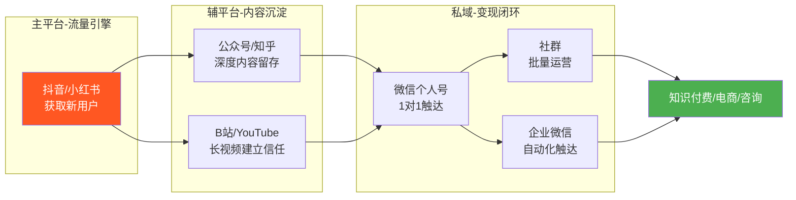
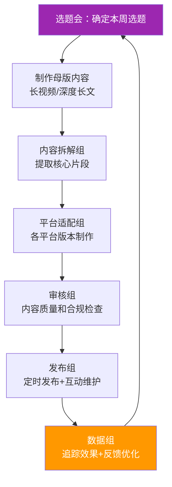
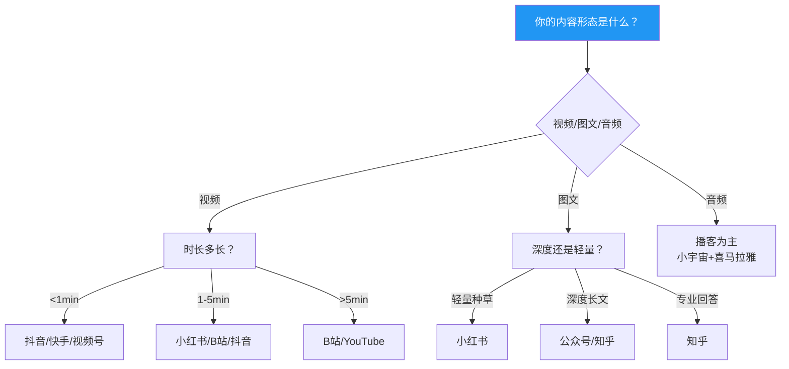
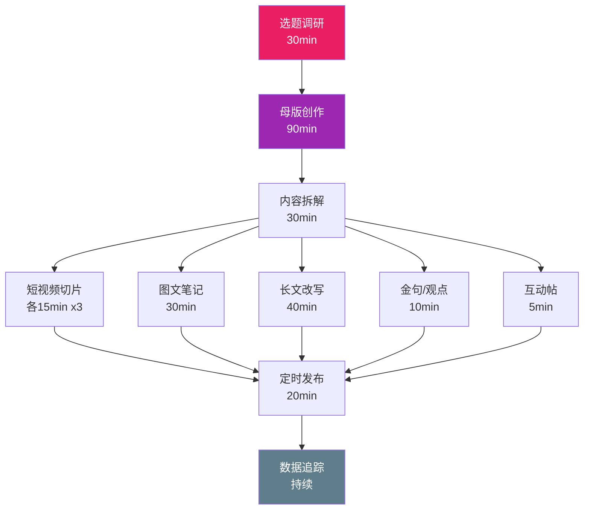
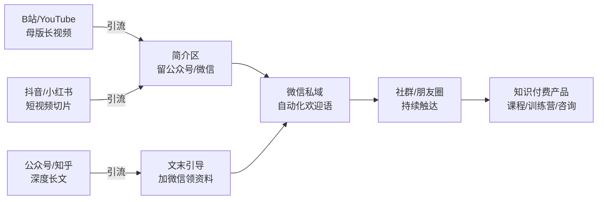
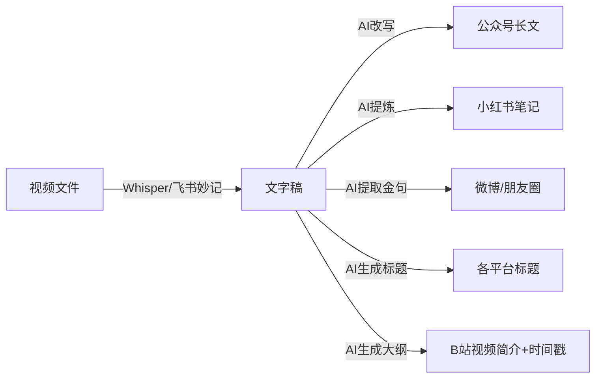
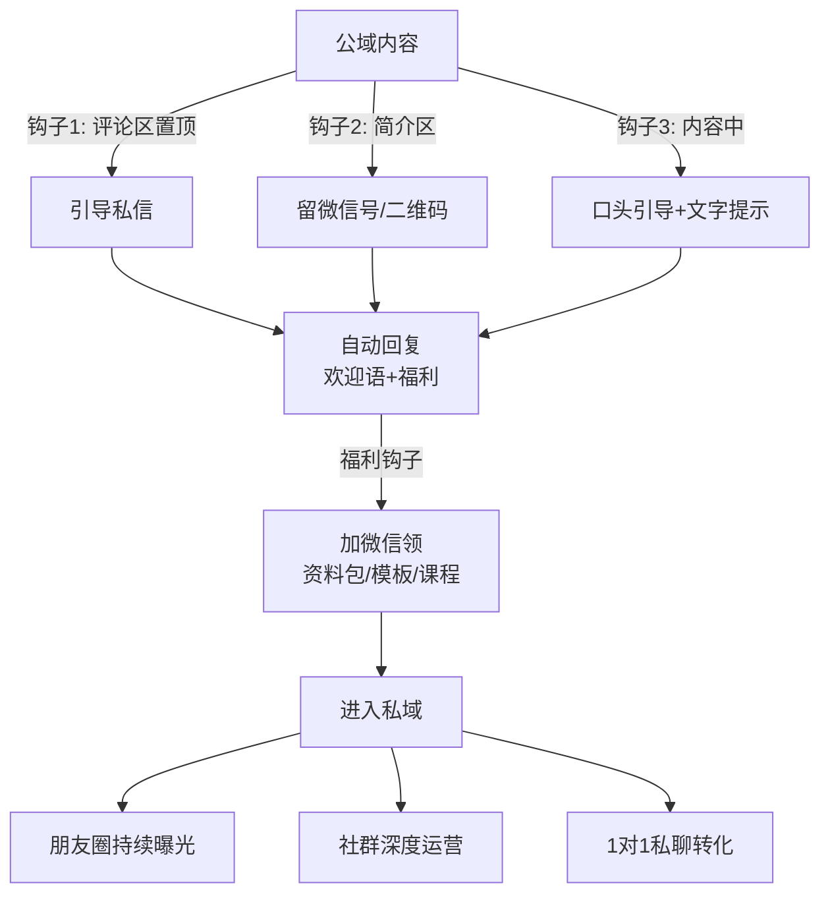
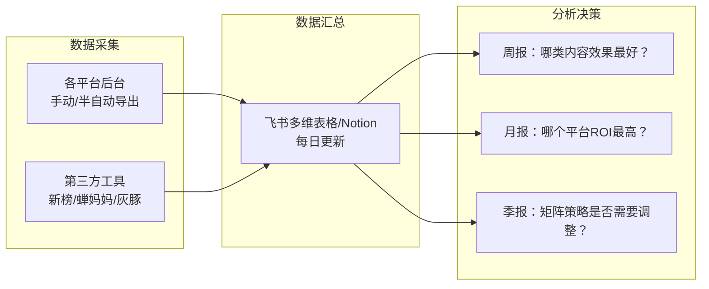
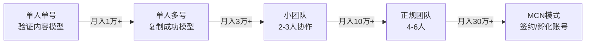
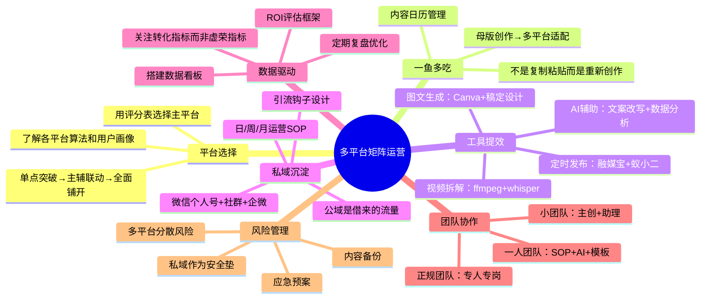

## 六、多平台矩阵运营

单平台运营意味着把所有鸡蛋放在一个篮子里。2024年，多个百万粉账号因平台规则调整一夜归零的案例屡见不鲜：抖音多次调整推荐算法导致中腰部创作者流量腰斩；小红书封禁一批"软广"账号导致品牌合作收入归零；B站调整创作激励计划让大量UP主收入缩水60%以上。多平台矩阵运营的核心逻辑是：**用可控的额外成本，换取抗风险能力和流量天花板的提升**。

但矩阵运营绝不等于"多发几个平台"。它是一套系统工程，涉及平台选择、内容适配、分发流程、数据管理、私域沉淀五大模块。本章从这五个维度，系统拆解矩阵运营的完整方法论——从一人团队到MCN模式，从入门到规模化，给出可落地的操作框架。

### 6.1 平台生态全景与选择逻辑

#### 6.1.1 主流平台特征对比

每个平台的算法推荐机制、用户画像、内容偏好完全不同。盲目全平台铺开同一内容，结果往往是每个平台都做不起来。先理解平台，再决定策略。

| 平台 | 核心算法逻辑 | 内容形态偏好 | 用户画像 | 变现路径 | 流量特征 | 内容审核严格度 |
|------|-------------|-------------|---------|---------|---------|--------------|
| 抖音 | 完播率+互动率+分享率+账号权重 | 短视频(15s-3min) | 全年龄段，下沉市场强 | 直播带货、星图广告、小程序、团购 | 爆发式，算法推荐为主，冷启动200-500播放 | 高：敏感词、医疗、金融类内容严格审核 |
| 小红书 | 点击率+收藏率+搜索匹配+笔记质量 | 图文+短视频(1-5min) | 女性为主(70%+)，一二线城市，消费力强 | 品牌合作(蒲公英)、好物推荐、店铺、直播 | 长尾效应强，搜索占比30%+，笔记生命周期长 | 高：引流管控严格，外链几乎不允许 |
| B站 | 完播率+弹幕密度+三连率+互动质量 | 中长视频(5-30min) | Z世代为主，男性偏多，高粘性 | 充电计划、花火商单、会员购、课堂 | 社区粘性强，粉丝忠诚度高，算法对新人友好 | 中：相对宽松，但对搬运零容忍 |
| 公众号 | 打开率+分享率+在看率+完读率 | 长图文(2000-8000字) | 25-45岁，职场/商务人群 | 广告主投放、知识付费、电商导流、赞赏 | 订阅制，打开率持续下降(平均1%-5%)，但私域价值高 | 中：原创保护机制完善 |
| 知乎 | 赞同率+收藏率+专业权重+回答排名 | 长文回答+专栏 | 高学历，一二线城市，决策型用户 | 知+、盐选、品牌合作、好物推荐 | 搜索长尾流量占比高，回答可获得持续曝光 | 中：对营销内容敏感 |
| 视频号 | 社交推荐+算法推荐+搜一搜 | 短视频+直播 | 30岁+，微信生态用户，下沉市场 | 直播带货、打赏、广告、橱窗 | 社交裂变驱动，增长快，与微信生态打通 | 中：依托微信体系 |
| 快手 | 粘性权重+社交关系+完播率 | 短视频+直播 | 下沉市场为主，三四线城市强 | 直播带货、磁力引擎广告、快手小店 | 社交属性强于抖音，"老铁"文化，复购率高 | 中高：对低质内容打压 |
| YouTube | 观看时长+点击率+订阅转化+观众留存 | 中长视频(8-20min) | 全球化，英语市场为主 | AdSense广告、会员、超级留言、品牌合作 | 搜索+推荐双引擎，内容长尾价值极强 | 中：版权审核严格，对争议内容敏感 |

**补充：新兴平台值得关注**

| 平台 | 定位 | 机会点 | 风险 |
|------|------|--------|------|
| 小宇宙 | 中文播客平台 | 播客赛道竞争小，用户质量高 | 变现路径尚不成熟 |
| 得到/混沌 | 知识付费平台 | 高净值用户，付费意愿强 | 入驻门槛高，需要专业背书 |
| 即刻 | 兴趣社区 | 创业者/产品人聚集，互动质量高 | 用户量级小 |
| 小红书直播 | 小红书生态内 | 电商闭环，种草到转化一步到位 | 需要持续直播投入 |

#### 6.1.2 三种矩阵策略的适用场景

**策略一：单点突破型**

适用条件：个人创作者起步阶段，日均可投入时间<3小时。

操作要点：
- 选择与自身内容形态最匹配的平台（做视频选抖音/B站，写图文选公众号/知乎）
- 深耕单一平台至少6个月，建立基础粉丝盘（1万+）
- 在该平台跑通"内容→流量→变现"的完整闭环后，再考虑扩展
- 每周复盘数据，快速迭代内容方向
- 建立选题库：至少储备30个选题，确保持续产出不断更

风险提示：单平台依赖的风险不在于平台倒掉，而在于算法调整。2024年抖音多次调整推荐算法，大量中腰部创作者流量腰斩。单平台运营必须同步建立私域，作为安全垫。具体做法：在粉丝达到1000时就开始引导加微信，不要等到"做大了再说"。

**策略二：主辅联动型（推荐多数人采用）**

适用条件：日均可投入3-6小时，有一定内容产能。

推荐组合矩阵：



典型组合方案（含具体运营节奏）：

| 创作者类型 | 主平台（50%精力） | 辅平台1（25%） | 辅平台2（15%） | 私域（10%） | 每周产出量 |
|-----------|------------------|---------------|---------------|------------|-----------|
| 知识类创作者 | 小红书：日更图文笔记 | 公众号：每周2篇深度长文 | 知乎：每周3个回答 | 微信私域：朋友圈日更3条 | 图文7+长文2+回答3 |
| 娱乐类创作者 | 抖音：日更短视频 | B站：每周2条中视频 | 视频号：搬运+直播 | 粉丝群：每周2次互动 | 短视频7+中视频2 |
| 专业类创作者 | 知乎：每周5个回答 | 公众号：每周2篇专栏 | B站：每周1条讲解视频 | 知识星球：日更 | 回答5+长文2+视频1 |
| 跨境创作者 | YouTube：每周1-2条 | 小红书：每周3条（国内版） | 抖音：短视频切片 | 邮件列表：每周1封 | 视频2+图文3+邮件1 |

**策略三：全面铺开型**

适用条件：有团队（至少2-3人），或使用AI辅助工具实现内容批量生产。

核心原则：不是把同一内容复制到所有平台，而是同一主题针对每个平台做适配版本。一个选题产出7个平台的适配内容，而不是把一条视频原封不动发7个平台。

全面铺开型的执行框架：



#### 6.1.3 平台选择的决策框架

选择平台不是拍脑袋决定的，需要综合考虑四个维度：内容形态匹配度、目标用户重合度、变现路径清晰度、个人优势契合度。



**平台选择评分表（满分10分）**

用这个表格对备选平台打分，总分最高的平台作为主平台：

| 评估维度 | 权重 | 评估标准 |
|---------|------|---------|
| 内容形态匹配度 | 30% | 你的内容形态是否是该平台的主流形态？ |
| 目标用户重合度 | 25% | 你的目标用户是否大量聚集在该平台？ |
| 变现路径清晰度 | 20% | 该平台是否有成熟的变现路径且你能走通？ |
| 竞争激烈程度 | 15% | 该赛道在该平台的竞争是否可承受？ |
| 个人优势契合度 | 10% | 你的表达风格、专业背景是否适合该平台？ |

### 6.2 一鱼多吃：内容分发的系统方法

#### 6.2.1 核心理念

"一鱼多吃"不是偷懒的同义词。它的本质是：**一次深度创作投入，产出多个平台的适配版本，每个版本都针对该平台的用户习惯做了优化**。

关键区分：
- ❌ 错误做法：把抖音视频直接发到B站，把公众号文章直接复制到小红书
- ✅ 正确做法：同一主题，抖音做快节奏短视频，B站做深度讲解，公众号做长文分析，小红书做图文笔记

效率数据：熟练运用一鱼多吃策略的创作者，内容产出效率提升3-5倍，而时间投入仅增加30%-50%。一次2小时的深度内容创作，可以产出7个平台的适配内容。

**一鱼吃多吃的核心工作流**



#### 6.2.2 内容转化路径详解

以一个具体案例说明：假设你做了一期"如何在3个月内学会Python编程"的深度内容。

**第一步：创作母版内容（投入时间占比50%）**

录制一个20-30分钟的深度讲解视频（B站/YouTube母版），内容包括：
- 学习路线规划
- 每个阶段的核心知识点
- 常见误区和避坑指南
- 实战项目推荐
- 学习资源清单

**第二步：拆解为多个子内容（投入时间占比30%）**

| 子内容类型 | 目标平台 | 具体操作 | 制作时间 | 预期效果 |
|-----------|---------|---------|---------|---------|
| 短视频切片×3 | 抖音/小红书 | 从母版中提取3个最有冲突感/最颠覆认知的片段，每个30-60秒，加上字幕和BGM | 各15min | 引流到主平台/私域 |
| 图文笔记×1 | 小红书 | 提取核心要点，做成6-9张信息图卡片，配500字文案 | 30min | 搜索长尾流量 |
| 长文×1 | 公众号/知乎 | 将视频内容改写为3000-5000字长文，补充文字特有的细节和引用 | 40min | 深度内容沉淀 |
| 金句/观点×3 | 微博/朋友圈 | 提取3个有争议性或启发性的观点，每个100-200字 | 10min | 互动和传播 |
| 互动帖×1 | 小红书/知乎 | "你觉得学Python最难的是什么？"引导讨论 | 5min | 收集用户需求 |
| 音频版×1 | 小宇宙/喜马拉雅 | 提取音频，加上开头结尾，制作播客版 | 15min | 覆盖音频用户 |

**第三步：分发与引流（投入时间占比20%）**



#### 6.2.3 各平台内容适配要点

**抖音内容适配：**
- 前3秒必须有钩子（提问/冲突/反常识/悬念），这3秒决定了用户是否继续看
- 时长控制在30-90秒，完播率是核心指标——完播率>30%才可能进入下一个流量池
- 字幕必须加，80%用户静音观看，字幕样式要醒目（推荐黄色/白色描边字幕）
- 背景音乐选择热门BGM，增加推荐概率，但音量不要盖过人声
- 结尾引导关注+评论互动（"你觉得呢？评论区告诉我"），评论区自己先发3-5条引导性评论
- 文案区放关键词，方便搜索推荐，文案长度控制在50-150字
- 发布时带2-3个相关话题标签，不要太泛（#编程 比 #学习 更精准）
- 竖屏9:16是标准，横屏内容会被压缩，体验差

**小红书内容适配：**
- 封面图决定点击率，必须精心设计（推荐用Canva/稿定设计），封面尺寸3:4
- 标题用"数字+痛点+解决方案"公式（"3个月学会Python，我只用了这3个方法"），标题字数控制在18-20字
- 正文用emoji分段，提升可读性，每段不超过3行
- 关键信息做成图片，而非纯文字——小红书是"图片优先"平台
- 标签选择：2-3个大标签（#Python）+ 3-5个精准标签（#Python入门教程）+ 1-2个热门标签
- 评论区置顶补充信息和引流钩子，回复每一条评论提升笔记权重
- 小红书对引流到站外管控严格：不要直接放微信号，用"置顶笔记""个人简介""私信回复"间接引导
- 笔记发布后2小时内是关键窗口，积极回复评论能提升推荐

**B站内容适配：**
- 开头30秒概述全片，让观众知道能获得什么——B站用户习惯先看开头判断值不值得看
- 中间设置弹幕互动点（"觉得有用的扣1"），弹幕密度是B站算法的重要信号
- 结尾预告下期内容，提高回访率和关注转化
- 简介区放完整时间戳（Timestamp），方便跳转，这是B站用户的强需求
- 封面用夸张表情+大字标题，B站封面点击率直接影响推荐，推荐16:10比例
- 投币/收藏/点赞三连引导要在视频中自然提及，不要太刻意
- B站对新人有流量扶持，前10条视频是关键期，质量>数量
- 视频分区选择很重要，选错分区会严重影响推荐

**公众号内容适配：**
- 标题决定打开率，用"信息差"或"情绪"驱动点击，标题字数控制在22字以内
- 开头200字决定是否继续阅读，必须有钩子（故事/数据/反常识/提问）
- 每300-500字一个小标题，方便扫读——公众号读者70%是扫读型
- 重点内容加粗，关键结论用引用框，增强视觉层次
- 结尾引导"在看"和"分享"，提升传播——"在看"会推送到"看一看"获得额外曝光
- 次条放引流内容（社群/课程/资料包），主次条配合提高整体转化
- 公众号文章适合做"内容资产"：一篇好文章可以反复被搜索到，生命周期远超短视频
- 推荐在文末添加"往期精选"链接，提升用户停留和阅读深度

**知乎内容适配：**
- 回答高流量问题比发文章流量大得多——优先回答近期热度上升的问题
- 开头直接给结论，不要铺垫——知乎用户耐心有限，前3行决定是否展开
- 用"第一、第二、第三"结构化呈现，知乎用户偏好逻辑清晰的内容
- 配图和数据表格增加专业感，知乎回答中的图片能显著提升赞同率
- 结尾引导点赞和关注，知乎的赞同权重高于其他平台的点赞
- 盐选专栏适合系列化深度内容，但需要持续更新才能获得推荐
- 知乎回答有极强的长尾效应：一个好回答可以持续获得流量1-2年
- 知乎支持插入商品卡片，适合做"好物推荐"类变现

**视频号内容适配：**
- 视频号的核心是"社交推荐"——你的内容会优先推给微信好友，因此要做出"值得转发"的内容
- 直播是视频号的核心变现方式，视频号直播与微信社群、小程序打通
- 视频号对30岁+用户有天然吸引力，内容风格可以比抖音更"沉稳"
- 视频号橱窗功能支持直接带货，门槛低于抖音小店
- 视频号与公众号、小程序、企业微信可以互相跳转，形成微信生态闭环

**快手内容适配：**
- 快手算法更重视"社交关系"，粉丝的互动权重高于抖音
- 快手用户偏好"真实""接地气"的内容，过度包装反而不讨好
- 快手直播带货的复购率高于抖音，"老铁"信任关系更强
- 快手的"快手小店"和"磁力引擎"是主要变现工具
- 快手对下沉市场覆盖更好，适合大众消费品推广

#### 6.2.4 发布时间策略

发布时间直接影响初始流量池的进入速度。每个平台的用户活跃时段不同：

| 平台 | 工作日最佳时段 | 周末最佳时段 | 发布提前量 | 备注 |
|------|-------------|-------------|-----------|------|
| 抖音 | 12:00-13:00, 18:00-20:00, 21:00-23:00 | 10:00-12:00, 15:00-17:00 | 提前30min | 晚间黄金档竞争最激烈，新号可错峰发布（如17:00） |
| 小红书 | 12:00-13:30, 18:30-21:00 | 9:00-11:00, 15:00-17:00 | 提前15min | 晚8-10点是种草高峰，笔记审核需要时间 |
| B站 | 17:00-19:00, 20:00-22:00 | 14:00-16:00, 20:00-23:00 | 提前1h | 晚间是B站流量高峰，视频审核时间不定 |
| 公众号 | 7:30-8:30, 20:00-22:00 | 9:00-10:00 | 即时 | 早通勤和晚睡前是阅读高峰 |
| 知乎 | 12:00-13:00, 20:00-23:00 | 全天相对均匀 | 即时 | 知乎回答有长尾效应，发布时间影响较小 |
| 视频号 | 19:00-22:00 | 10:00-12:00, 19:00-22:00 | 提前1-2h | 社交推荐有延迟，提前发布 |
| 快手 | 12:00-13:00, 18:00-21:00 | 10:00-12:00, 14:00-16:00 | 提前30min | 快手用户活跃时间偏早 |

发布频率建议：
- 抖音/小红书：日更或隔日更（新号建议日更冲量，至少持续30天）
- B站：每周2-3条（质量优先，宁缺毋滥）
- 公众号：每周2-3条（深度优先，1篇爆款 > 5篇平庸）
- 知乎：每周3-5个回答（覆盖更多问题，抢占搜索流量）
- 视频号：每周3-5条短视频 + 1-2次直播
- 快手：日更或隔日更（快手算法对更新频率敏感）

#### 6.2.5 内容日历管理

矩阵运营必须有内容日历，否则容易陷入"今天发什么"的焦虑。

**月度内容日历模板：**

| 日期 | 主题 | 抖音 | 小红书 | B站 | 公众号 | 知乎 | 状态 |
|------|------|------|--------|-----|--------|------|------|
| 第1周周一 | Python入门 | 短视频切片1 | 图文笔记 | — | — | 回答相关问题 | ✅已发 |
| 第1周周三 | Python环境搭建 | 短视频切片2 | — | 中长视频 | 深度长文 | — | 📝制作中 |
| 第1周周五 | Python实战项目 | — | 图文笔记 | — | — | 回答相关问题 | ⏳待制作 |

**内容日历管理工具：**
- **飞书多维表格**：免费，支持多人协作，可自定义字段和视图
- **Notion Calendar**：与Notion数据库打通，可视化排期
- **Trello**：看板式管理，适合视觉化任务追踪
- **Google Sheets**：简单免费，多人实时编辑

### 6.3 内容适配的自动化工具链

手动为每个平台适配内容效率太低。以下是经过验证的工具链：

#### 6.3.1 视频拆解工具

```bash
# 使用ffmpeg批量切片（从长视频提取短视频片段）
# 提取1:30到2:30的片段，加上字幕
ffmpeg -i input.mp4 -ss 00:01:30 -to 00:02:30 -c copy clip1.mp4

# 批量添加字幕（使用whisper生成字幕后）
ffmpeg -i clip1.mp4 -vf "subtitles=clip1.srt:force_style='FontSize=24,PrimaryColour=&H00FFFFFF'" output_with_subs.mp4

# 竖屏裁剪（横屏视频转竖屏，适用于抖音/小红书）
ffmpeg -i input.mp4 -vf "crop=ih*9/16:ih" vertical.mp4

# 批量生成多个片段（配合shell脚本）
for clip in clips/*.txt; do
  name=$(basename "$clip" .txt)
  start=$(head -1 "$clip")
  end=$(tail -1 "$clip")
  ffmpeg -i input.mp4 -ss "$start" -to "$end" -c copy "output/${name}.mp4"
done

# 视频压缩（控制文件大小，适合各平台上传限制）
ffmpeg -i input.mp4 -vcodec h264 -acodec aac -b:v 2M -b:a 128k output_compressed.mp4
```

#### 6.3.2 图文批量生成

- **Canva**：模板化生成小红书卡片、公众号头图、封面，支持批量操作（Canva Bulk Create功能）
- **稿定设计**：中文模板更丰富，适合国内平台，有专门的小红书封面模板
- **Figma + Auto Layout**：批量生成系列化图片，适合设计师，可用插件批量导出
- **美图秀秀批量处理**：快速加水印、调色、裁剪，操作门槛最低
- **创客贴**：在线设计工具，中文模板丰富，适合非设计师

#### 6.3.3 文字内容转换

将视频内容转为图文的流程：



推荐工具组合：
- **飞书妙记**：免费视频转文字，准确率高，支持中文
- **Whisper（本地）**：OpenAI开源模型，隐私性好，支持99种语言，推荐使用large-v3模型
- **通义听悟**：阿里系，支持长视频，免费额度充足
- **ChatGPT/Claude**：文字稿改写为不同平台风格，提供平台特征让AI针对性改写
- **剪映**：内置字幕识别功能，准确率高，可直接导出SRT字幕文件

#### 6.3.4 定时发布工具

| 工具 | 支持平台 | 核心功能 | 价格 | 推荐指数 |
|------|---------|---------|------|---------|
| 融媒宝 | 30+平台 | 一键分发、定时发布、数据统计 | 免费版够用 | ⭐⭐⭐⭐ |
| 新榜有赚 | 主流平台 | 数据监控+分发+变现对接 | 部分功能收费 | ⭐⭐⭐⭐ |
| 蚁小二 | 20+平台 | 批量发布、数据统计、账号管理 | 按月付费(99-299元/月) | ⭐⭐⭐ |
| Buffer/Hootsuite | 海外平台 | 排期发布、团队协作、分析报告 | $15-99/月 | ⭐⭐⭐⭐ |
| Later | Instagram/TikTok/Pinterest | 视觉化排期、Linkin.bio | 免费版有限制 | ⭐⭐⭐ |

#### 6.3.5 AI辅助工具链（2024-2025实战推荐）

| 场景 | 工具 | 用途 | 注意事项 |
|------|------|------|---------|
| 文案生成 | ChatGPT/Claude/通义千问 | 不同平台风格的文案改写 | 人工审核是必须的，AI生成内容需要加入个人风格 |
| 图片生成 | Midjourney/DALL-E 3/通义万相 | 封面、配图、插画 | 避免直接使用AI生成的真人图片，有版权风险 |
| 视频剪辑 | 剪映/CapCut/Descript | 自动字幕、智能剪辑、模板套用 | 剪映有"智能去水印"等功能，适合二次创作 |
| 数据分析 | 新榜/蝉妈妈/灰豚 | 各平台数据监控和分析 | 付费工具的数据更准确，免费版功能有限 |
| 翻译工具 | DeepL/Google Translate | 内容多语言化 | AI翻译后需要人工校对，尤其是专业术语 |

### 6.4 私域沉淀：从流量到留量

#### 6.4.1 为什么必须做私域

平台流量的本质是"借来的流量"。你有100万粉丝，平台算法调整后，可能只有1%的人能看到你的内容。私域是你能直接触达的用户池，不受算法影响。

数据对比：

| 指标 | 平台公域 | 微信私域 | 差距倍数 |
|------|---------|---------|---------|
| 触达率 | 3%-15%（算法决定） | 95%+（朋友圈/消息） | 6-30倍 |
| 触达成本 | 需持续产出内容 | 零成本直接发送 | ∞ |
| 用户信任度 | 中等（平台背书） | 高（个人关系） | 2-3倍 |
| 转化率 | 1%-3% | 5%-15% | 3-5倍 |
| 复购率 | 低（用户分散） | 高（持续触达） | 5-10倍 |
| 可迁移性 | 不可迁移 | 随时迁移 | ∞ |
| 用户数据归属 | 平台所有 | 你自己所有 | ∞ |

一个真实案例：某知识类创作者在抖音有50万粉丝，单条视频播放量从曾经的10万降到5000，月广告收入从2万降到3000。但他同期在微信私域有8000人，每月通过社群和朋友圈变现3万+。**私域是他穿越平台周期的核心资产**。

#### 6.4.2 私域载体选择

**微信个人号**
- 优势：最强触达能力，朋友圈+私聊+群聊三位一体
- 劣势：有5000人上限（超过后需要用企业微信或备用号）
- 适合：个人IP、高客单价服务、1对1咨询
- 关键动作：每天发3-5条朋友圈（价值输出+生活日常+产品软植入），朋友圈是私域运营的核心阵地
- 朋友圈内容比例：60%价值输出（干货/见解/行业分析）+ 20%生活日常（建立真实感）+ 20%产品软植入（案例/用户反馈/限时活动）

**微信社群**
- 优势：批量触达，营造群体氛围，适合做训练营和社群运营
- 劣势：管理成本高，容易变死群（7天不活跃基本就废了）
- 适合：知识付费、课程交付、用户运营
- 关键动作：每周至少3次群内互动（话题讨论/直播答疑/资源分享）
- 社群运营SOP：周一发本周预告、周三干货分享/直播、周五互动话题、周日复盘总结
- 防止死群：设置入群门槛（付费/回答问题）、定期清理僵尸成员、建立核心用户群（铁粉群）

**企业微信**
- 优势：无好友上限，可自动化（欢迎语/标签/群发），离职可交接，客户资产公司化
- 劣势：用户感知偏"官方"，亲和力不如个人号
- 适合：团队化运营、中低客单价产品、规模化私域
- 关键动作：用企业微信的「客户朋友圈」和「客户群」功能批量运营
- 企业微信配合SCRM工具（如微伴助手、尘锋）可以实现自动化标签、SOP群发、用户画像分析

**邮件列表（海外市场必做）**
- 优势：不受平台算法影响，用户主动订阅，转化率高，数据可导出可迁移
- 劣势：国内打开率低（5%-15%），海外市场打开率高（20%-40%）
- 适合：海外创作者、跨境电商、SaaS产品
- 工具：Mailchimp（基础版免费）、ConvertKit（创作者友好）、Beehiiv（增长型）、Substack（自带内容平台）
- 关键动作：每周1-2封邮件，内容80%价值+20%推广，用自动化序列（Welcome Sequence）引导新订阅者

#### 6.4.3 引流路径设计

从公域到私域的每一步都要设计钩子：



引流钩子设计公式（附具体话术模板）：

| 钩子类型 | 话术模板 | 适用场景 | 转化率参考 |
|---------|---------|---------|-----------|
| 资料型 | "关注公众号回复「Python」领取完整学习路线图（含50个实战项目）" | 知识类内容 | 5%-12% |
| 服务型 | "加微信免费领取一次账号诊断（限前100人）" | 运营类内容 | 8%-15% |
| 社群型 | "加入交流群，每周三晚8点直播答疑，群内共享最新资源" | 互动型内容 | 3%-8% |
| 工具型 | "免费领取我整理的XX工具包（50个工具+使用教程+对比评测）" | 工具类内容 | 10%-20% |
| 优惠型 | "私信领取专属优惠券/免费试听名额/限时折扣" | 产品类内容 | 5%-10% |
| 模板型 | "评论区留言「模板」，私信发你我用了3年的XX模板" | 效率类内容 | 8%-15% |

**各平台引流注意事项：**
- **抖音**：简介区可以留微信号（但不要太明显，用谐音或图片），评论区不要直接留微信号（会被屏蔽），私信自动回复可以设置引导
- **小红书**：引流管控最严格，不要在笔记中放任何外部联系方式。正确做法：发一篇"置顶笔记"引导关注公众号，或在个人简介放公众号名称（不要放微信号）
- **B站**：简介区可以留公众号和微信，视频中可以口头引导，评论区可以置顶引流信息
- **知乎**：个人简介可以留公众号，回答结尾可以引导关注，知乎对引流相对宽容
- **公众号**：公众号本身是私域入口，通过菜单栏、自动回复、文末引导将用户导入更深的私域（社群/个人微信）

#### 6.4.4 私域运营SOP

**日运营（每天15-30分钟）：**
- 朋友圈发布3-5条（早中晚各1条，晚上可多1条生活类）
- 回复私域用户的消息（24小时内必须回复，越快越好）
- 社群内发1条有价值的内容（干货/互动/资源）
- 检查新添加的好友，发送欢迎消息

**周运营（每周2-3小时）：**
- 社群直播/语音答疑（30-60分钟）
- 整理本周优质内容，发送给私域用户
- 分析私域数据（新增人数、活跃度、转化率）
- 策划下周内容和活动
- 回复本周未回复的消息

**月运营（每月半天）：**
- 私域用户分层（活跃用户/沉默用户/高价值用户/潜在客户）
- 清理僵尸粉，优化用户标签
- 策划月度活动（抽奖/打卡/挑战赛/限时优惠）
- 复盘私域转化数据，优化引流路径
- 更新用户画像，调整内容方向

**季度运营（每季度1天）：**
- 全面复盘私域运营数据，对比上季度增长
- 调整私域运营策略和内容方向
- 策划大型活动（线上峰会/线下见面会/年度盛典）
- 评估是否需要增加/减少私域载体

### 6.5 矩阵运营的数据管理

#### 6.5.1 核心数据指标

不要被虚荣指标（粉丝数、播放量）迷惑。关注真正影响收入的指标：

| 指标类型 | 具体指标 | 计算公式 | 意义 | 优化方向 |
|---------|---------|---------|------|---------|
| 流量指标 | 各平台曝光量/播放量 | — | 内容触达能力 | 优化标题/封面/标签/发布时间 |
| 互动指标 | 互动率 | (点赞+评论+分享+收藏)÷播放量×100% | 内容质量信号 | 提升内容价值感和互动引导 |
| 转化指标 | 关注率 | 新增粉丝÷播放量×100% | 内容吸引力 | 优化内容垂直度和人设 |
| 转化指标 | 加微信率 | 新增微信好友÷公域曝光量×100% | 引流效率 | 优化引流钩子和话术 |
| 转化指标 | 购买率 | 付费用户÷触达用户×100% | 变现效率 | 优化产品和销售文案 |
| 留存指标 | 7日回访率 | 7日内再次访问的用户÷总用户×100% | 用户粘性 | 提升内容系列化程度 |
| 收入指标 | CPM(千次曝光收入) | 收入÷曝光量×1000 | 变现效率 | 聚焦高CPM平台和内容类型 |
| 成本指标 | 单条内容成本 | 制作时间×时薪+工具成本 | 生产效率 | 模板化、AI辅助、SOP优化 |

#### 6.5.2 数据看板搭建

用飞书多维表格或Notion搭建一个简易数据看板：



**数据看板核心视图：**
1. **日报视图**：每日各平台核心数据概览（播放量、互动量、新增粉丝、收入）
2. **内容分析视图**：按内容类型/选题分类，对比各条内容的表现
3. **平台对比视图**：各平台的ROI、增长率、粉丝质量对比
4. **趋势视图**：周/月/季度数据趋势，发现增长或下滑信号

#### 6.5.3 ROI评估框架

不是所有平台都值得投入。用这个框架评估每个平台的投入产出比：

**平台ROI = 平台带来的收入 ÷ (在该平台投入的时间 × 时薪)**

举例：
- 抖音：月收入5000元，月投入40小时，时薪假设50元 → ROI = 5000÷2000 = 2.5
- 公众号：月收入3000元，月投入20小时 → ROI = 3000÷1000 = 3.0
- 小红书：月收入8000元，月投入30小时 → ROI = 8000÷1500 = 5.3
- B站：月收入1000元，月投入20小时 → ROI = 1000÷1000 = 1.0

结论：小红书ROI最高，应加大投入；B站ROI最低，可降低频率或优化内容策略。

**但ROI不是唯一决策依据，还要考虑：**
- **战略价值**：B站虽然短期ROI低，但粉丝忠诚度高，长期价值大
- **流量质量**：知乎流量虽小，但用户决策能力强，转化率高
- **风险分散**：即使某个平台ROI低，保留一个账号作为"备份"也是必要的
- **成长潜力**：新平台/新功能的早期红利（如视频号直播的早期流量扶持）

**平台投入调整决策矩阵：**

| | ROI高 | ROI低 |
|---|------|------|
| **增长快** | 加大投入（核心平台） | 观察3个月，优化内容策略 |
| **增长慢** | 维持现状，精细化运营 | 降低投入或暂停，保留账号 |

### 6.6 团队协作与效率管理

#### 6.6.1 不同阶段的团队配置

| 阶段 | 人数 | 分工 | 月成本预估 | 关键指标 |
|------|------|------|-----------|---------|
| 一人团队 | 1人 | 自己负责全部 | 0元（时间成本） | 月入5000-2万 |
| 小团队 | 2-3人 | 主创+剪辑/运营助理 | 8000-15000元 | 月入2-10万 |
| 正规团队 | 4-6人 | 主创+编导+拍摄+剪辑+运营+商务 | 30000-60000元 | 月入10-30万 |
| MCN模式 | 10人+ | 多账号矩阵，专人专岗 | 100000元+ | 月入30万+ |

#### 6.6.2 一人团队的效率最大化

一个人做矩阵运营，关键是建立标准化流程和善用AI工具：

**SOP文档化**：把每个平台的发布流程写成SOP文档（标题公式、封面模板、标签选择、发布时间），每次发布时照着执行，减少决策疲劳。

**一人团队的每日工作流：**

| 时间段 | 任务 | 时长 | 产出 |
|-------|------|------|------|
| 9:00-9:30 | 数据复盘：查看昨日各平台数据，记录到看板 | 30min | 数据记录+今日优化方向 |
| 9:30-11:30 | 内容创作：制作母版内容（录视频/写长文） | 2h | 1条母版内容 |
| 11:30-12:00 | 内容拆解：将母版拆解为各平台子内容 | 30min | 各平台素材清单 |
| 14:00-15:30 | 内容适配：制作各平台版本 | 1.5h | 3-5条平台适配内容 |
| 15:30-16:00 | 定时发布：设置各平台定时发布 | 30min | 排期完成 |
| 20:00-20:30 | 互动维护：回复评论、私信、社群消息 | 30min | 互动完成 |
| 20:30-21:00 | 私域运营：发朋友圈、社群内容 | 30min | 私域维护完成 |

**AI辅助内容生产：**
- 用ChatGPT/Claude将视频文字稿改写为不同平台风格
- 用AI生成标题备选（给10个选项，选最好的）
- 用AI提取金句和观点
- 用AI生成小红书文案和标签
- 用AI辅助数据分析，找出内容规律

**模板化运营：**
- 封面模板库（Canva中建10-20个模板，每次换文字即可）
- 文案模板库（开头模板、结尾模板、引流话术模板）
- 数据记录模板（每周固定10分钟填表）
- 选题模板（选题评估表，从需求度、竞争度、变现潜力三个维度评分）

#### 6.6.3 协作工具推荐

| 场景 | 推荐工具 | 说明 |
|------|---------|------|
| 内容日历 | 飞书日历/Notion Calendar | 可视化排期，多人协同 |
| 素材管理 | Eagle/百度网盘/坚果云 | 统一管理图片/视频/文案素材 |
| 任务分配 | 飞书项目/Teambition | 任务拆解和进度追踪 |
| 审核流程 | 飞书文档/腾讯文档 | 多人协作编辑和评论 |
| 数据统计 | 飞书多维表格 | 自定义数据看板 |
| 知识库 | Notion/语雀 | SOP文档、选题库、案例库 |
| 即时沟通 | 飞书/企业微信 | 任务沟通和信息同步 |

### 6.7 矩阵运营的常见误区

**误区一：全平台铺同一内容**

问题：把抖音的竖屏短视频原封不动发到B站，把公众号文章直接复制到知乎。

后果：每个平台的数据都很差，因为没有适配平台特性。B站用户看到竖屏短视频会觉得"这是抖音搬运的"，直接划走。

纠正：同一主题做多个版本，每个版本针对目标平台优化。短视频平台做快节奏切片，长视频平台做深度讲解，图文平台做结构化长文。即使时间紧张，至少做基本的适配：调整标题风格、修改开头钩子、适配画面比例。

**误区二：平均分配精力**

问题：5个平台各投入20%精力，每个都做不深。

后果：没有一个平台能做出成绩，全面平庸。每个平台都只有几百粉丝，无法形成任何影响力。

纠正：主平台投入50%精力，辅助平台各15-20%，定期评估ROI调整分配。先在一个平台做出成绩，再逐步扩展。记住：一个平台的10万粉 > 五个平台的各2万粉。

**误区三：只关注涨粉不关注变现**

问题：追求粉丝数量，不设计变现路径。

后果：10万粉丝月收入可能不到1000元。很多创作者陷入"粉丝越多越好"的误区，但没有变现能力的粉丝只是数字。

纠正：从第一天就设计变现路径。粉丝不在多，在于精准和有付费意愿。1万精准粉丝比10万泛粉更有价值。在内容创作时就要想清楚：这些内容吸引的是什么人？他们有什么需求？我如何满足这些需求并获得收入？

**误区四：忽视平台规则差异**

问题：不了解各平台的违规红线和推荐规则。

后果：限流、封号、内容被删除。最惨的是：你在某个平台积累了10万粉丝，因为一次违规被永久封禁，所有努力归零。

纠正：每个平台的创作者中心/官方文档都要通读一遍。重点关注：哪些内容会被限流、引流到外部的规则、广告/软广的界定、敏感词列表、版权规则。建议建一个"平台规则备忘录"，记录各平台的红线和注意事项。

**各平台常见违规红线：**
- **抖音**：搬运他人内容、虚假宣传、诱导互动（如"不转不是中国人"）、频繁修改简介引流
- **小红书**：笔记中放微信号/二维码、虚假种草、刷量刷赞、软广不报备
- **B站**：搬运、抄袭、引战、在评论区频繁发广告链接
- **公众号**：标题党（微信会降权）、诱导分享（如"转发到3个群解锁"）、发布未经验证的医疗/金融信息
- **知乎**：自问自答、刷赞、在回答中频繁插入广告、抄袭他人回答

**误区五：不做私域或过早做私域**

问题：要么完全不做私域，要么在公域还没有流量时就急着引流。

后果：不做私域=永远被平台绑架；过早做私域=公域增长停滞（用户觉得你目的性太强）。

纠正：公域先跑通流量模型（稳定产出爆款内容），再逐步引流到私域。建议在公域粉丝达到5000+时开始同步建设私域。引流要自然，不要每条内容都在推销——内容价值:引流引导 的比例建议是 8:2。

**误区六：数据不复盘**

问题：发布后不看数据，凭感觉判断内容好坏。

后果：重复犯同样的错误，错过优化机会。你可能一直在用错误的标题公式、在错误的时间发布、做着用户不感兴趣的内容。

纠正：每周固定1小时复盘数据。记录每条内容的核心数据（播放量、互动率、转化率），找出规律（哪类选题效果好、哪个时间段发布效果好、哪种标题公式点击率高）。建议用飞书多维表格建一个数据追踪表，养成"发布→记录→分析→优化"的习惯。

**误区七：盲目追热点**

问题：什么热做什么，今天写Python明天写AI后天写健身。

后果：账号内容不垂直，算法无法给你打标签，推荐流量越来越差。用户关注你后发现内容混乱，取关率高。

纠正：热点可以追，但必须与自己的定位相关。追热点的正确姿势：用热点事件切入自己的专业领域。比如你是Python教程博主，OpenAI发布新模型时可以写"用Python调用OpenAI最新API的完整教程"，而不是写"OpenAI公司八卦"。

**误区八：忽视内容质量追求数量**

问题：为了日更而日更，内容质量参差不齐。

后果：低质量内容会拉低账号权重，影响高质量内容的推荐。用户看到你的垃圾内容后，不再信任你的优质内容。

纠正：宁可少发，也要保证每条内容都达到及格线。一个实用标准：如果这条内容你自己都不愿意看，就不要发。日更不是必须的，稳定更新（如每周3条高质量内容）比每天1条平庸内容效果更好。

### 6.8 进阶：矩阵运营的规模化路径

#### 6.8.1 从个人到MCN的进化路线



每个阶段的核心任务：

**单人单号（0-6个月）**
- 目标：跑通内容→流量→变现的闭环
- 关键动作：确定内容定位、找到差异化人设、验证变现模型
- 核心指标：粉丝突破1万、月收入突破5000元
- 常见陷阱：频繁更换方向、过早追求变现、忽视数据分析

**单人多号（6-18个月）**
- 目标：将成功模型复制到不同细分领域
- 关键动作：用SOP文档化第一个号的成功经验、复制到2-3个新号
- 核心指标：总收入突破3万/月、至少2个号稳定盈利
- 注意事项：不同号之间内容要有差异化，不要只是换了个马甲；多号之间避免互推痕迹

**小团队（12-24个月）**
- 目标：主创聚焦内容，助手处理运营和分发
- 关键动作：招聘1-2名运营/剪辑助理、建立标准化工作流程
- 核心指标：月收入突破10万、内容产出量提升3倍
- 管理要点：用飞书项目管理任务、每周开1次团队会、建立KPI考核机制

**正规团队（24-36个月）**
- 目标：专人专岗，流程化运营
- 关键动作：设立编导、拍摄、剪辑、运营、商务等岗位
- 核心指标：月收入突破30万、拥有3个以上盈利账号
- 管理要点：建立内容审核机制、法务合规审查、财务规范化

**MCN模式（36个月+）**
- 目标：输出方法论，批量孵化账号
- 关键动作：签约有潜力的创作者、提供运营支持和资源对接
- 核心指标：签约账号数量、总GMV、利润率
- 核心能力：方法论输出能力、资源整合能力、品牌商业化能力

#### 6.8.2 矩阵账号的协同策略

当拥有多个账号时，账号之间可以互相导流，形成流量闭环：

- **同领域不同平台**：抖音引流到B站，B站引流到公众号——利用各平台的内容形态差异，让用户在不同平台看到不同维度的内容
- **同平台不同细分**：主号引流到子号，覆盖更多受众——比如主号做"Python教程"，子号做"Python面试题"，互为补充
- **不同人设互相推荐**：主IP推荐助手号，助手号反哺主IP——增加内容丰富度，降低对单一人设的依赖

注意事项：
- 同平台多号之间不要有明显的互推痕迹（平台会识别为矩阵号并限流）
- 不同账号用不同设备和网络环境注册（避免关联限流）
- 内容要有差异化，不能只是换了个马甲——至少在选题角度、表达风格、视觉呈现上有明显区别
- 矩阵号之间不要互相点赞评论（平台算法能识别这种行为并降权）

#### 6.8.3 AI时代的矩阵运营变革

2024-2025年，AI工具正在重塑矩阵运营的效率边界：

**AI生成内容**
- 用AI批量生成不同平台风格的文案，人工审核后发布
- AI可以帮你快速产出"及格线"内容，但"爆款"内容仍然需要人的创意和洞察
- 注意：部分平台（如小红书）已开始检测AI生成内容并降权，纯AI内容风险越来越大
- 最佳实践：AI生成初稿 → 人工修改润色 → 加入个人观点和经验 → 发布

**AI视频剪辑**
- 自动识别长视频中的高光片段，批量生成短视频切片
- 工具推荐：剪映智能剪辑、Opus Clip、Vizard.ai
- 注意：AI切片的质量参差不齐，需要人工筛选和二次加工

**AI数据分析**
- 自动分析各平台数据，给出优化建议
- 工具推荐：新榜AI分析、蝉妈妈智能推荐
- 人的判断仍然关键：AI告诉你"这类内容效果好"，但"为什么好"和"怎么做得更好"需要人来思考

**AI客服**
- 私域自动回复常见问题，释放人力做高价值工作
- 企业微信+ChatGPT API可以实现智能客服
- 注意：高价值用户（付费客户/潜在大客户）仍然需要人工服务

**AI翻译**
- 一键将内容翻译为多语言，覆盖海外市场
- 工具推荐：DeepL（准确率最高）、Google Translate（免费）
- 注意：AI翻译后需要人工校对，尤其是专业术语和文化差异

**但AI只是效率工具，核心竞争力仍然是：你对用户的理解深度、你的内容独特性、你的个人IP信任度。工具可以复制，但人格化的信任无法复制。**

#### 6.8.4 风险管理与应急预案

矩阵运营需要提前规划风险应对方案：

| 风险类型 | 具体场景 | 预防措施 | 应急方案 |
|---------|---------|---------|---------|
| 账号封禁 | 违反平台规则被封号 | 熟读平台规则、不踩红线、内容审核 | 主平台内容备份、私域承接流量、备用账号启动 |
| 流量下滑 | 算法调整导致流量腰斩 | 多平台分散、私域建设、内容质量稳定 | 分析原因、调整内容策略、加大其他平台投入 |
| 内容侵权 | 被投诉抄袭/侵权 | 原创为主、引用注明来源、使用正版素材 | 及时下架、联系对方协商、保留创作证据 |
| 团队变动 | 核心成员离职 | SOP文档化、知识不集中于一人 | 快速招聘、临时外包、主创顶上 |
| 平台政策变化 | 平台调整变现规则 | 关注官方公告、多平台布局 | 调整变现模型、转移到其他平台 |
| 舆论危机 | 负面评论/恶意攻击 | 建立舆情监控、准备危机公关话术 | 24小时内回应、真诚沟通、必要时法律维权 |

**内容备份清单：**
- 所有原创视频源文件保存在本地+云端（至少两个备份）
- 所有图文内容保存为Markdown/Word格式
- 各平台的账号信息、粉丝数据定期导出
- 私域用户数据（微信好友列表、社群成员）定期备份

### 6.9 本章核心要点回顾



**一句话总结**：矩阵运营的本质不是"多发几个平台"，而是**用系统化的方法，将一次创作投入的价值最大化，同时通过多平台布局和私域建设，构建抗风险的长期资产**。先做好一个平台，再用"一鱼多吃"的思路扩展到多平台，最终通过数据驱动持续优化投入产出比。
