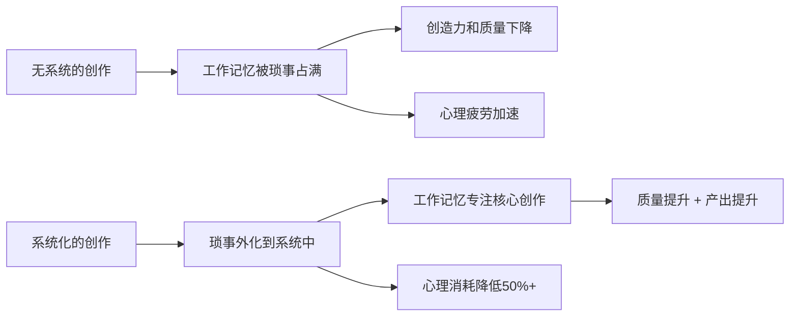
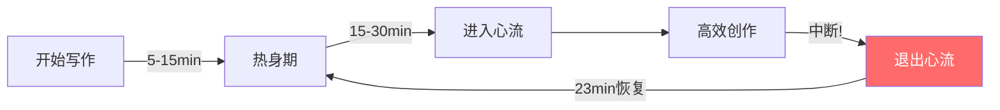

## 七、内容创作效率提升

内容创作是社交媒体变现的核心引擎，但许多创作者陷入一个致命陷阱：投入大量时间产出少量内容，产出质量不稳定，创作过程全凭灵感驱动。当内容生产效率低下时，你的变现天花板就被锁死了——无论你的商业模式多优秀，没有持续、稳定的内容供给，一切无从谈起。

效率提升的本质不是"写得更快"，而是**建立一套可复制、可扩展、可迭代的内容生产系统**。这套系统能让你在保证质量的前提下，将单位时间的内容产出提升3-10倍，同时降低创作过程中的心理消耗。

### 1. 认知科学基础：为什么系统化能提升效率

在讨论具体方法之前，先理解效率提升背后的认知科学原理。这不是"鸡汤"，而是被大量实验证实的心理学机制——理解原理，你才能灵活运用方法，而不是机械照搬。

#### 1.1 认知负荷理论（Cognitive Load Theory）

心理学家 John Sweller 提出的认知负荷理论指出，人的工作记忆容量极其有限——大约只能同时处理 4±1 个信息组块。内容创作涉及大量并行任务：想选题、组织结构、斟酌用词、回忆数据、考虑读者感受……这些任务同时竞争有限的工作记忆资源，导致"认知过载"。

**系统化的本质是外化认知负荷**。选题库把"想选题"这个任务从大脑中移出，框架把"组织结构"这个任务预先完成，模板把"格式排版"变成自动执行。当你不需要在这些环节消耗工作记忆，就能把全部认知资源集中在最需要创造力的部分——观点打磨和表达优化。



#### 1.2 决策疲劳（Decision Fatigue）

美国哥伦比亚大学的一项研究发现，法官在一天中越晚做出的假释裁定，批准率越低——不是因为下午的犯人更危险，而是法官做了一天决策后，大脑倾向于选择"默认选项"（拒绝）。这就是决策疲劳。

内容创作者每天面临大量微决策：今天写什么？用哪个标题？先说A点还是B点？这个案例放哪里？每一项决策都消耗意志力资源。到下午，创作者往往陷入两种状态：要么拖延不决，要么草率应付。

**批量决策是解决决策疲劳的关键策略**。把"今天写什么"这种高频决策，一次性在选题会上解决（批量选题法）；把"用什么结构"这种框架性决策，沉淀为可复用模板。将分散在每一天的决策压缩到一个集中的时间段，剩余时间就可以专注于执行。

#### 1.3 心流状态（Flow State）

心理学家米哈里·契克森米哈赖（Mihaly Csikszentmihalyi）的研究表明，人类在"技能水平略低于挑战难度"时最容易进入心流状态——一种高度专注、效率极高、几乎感受不到时间流逝的创作状态。

心流状态下的写作效率是普通状态的 3-5 倍。但心流有一个关键前提：**不被打断**。一次中断平均需要 23 分钟才能恢复到之前的专注深度（加州大学尔湾分校 Gloria Mark 教授的研究数据）。这就是为什么"连续时间块"比"碎片化时间"高效得多。



**实操启示**：保护你的连续时间块，就像保护你的银行账户一样。每一次"就看一眼手机"的中断，都在从你的效率账户中提款。

### 2. 效率瓶颈诊断：你的时间去了哪里

在提升效率之前，必须先搞清楚时间浪费在哪里。大多数创作者的时间损耗集中在以下五个环节：

| 瓶颈环节 | 典型表现 | 时间占比 | 根本原因 |
|----------|----------|----------|----------|
| 选题决策 | 刷手机1小时还没想好写什么 | 20-30% | 缺乏选题系统，每次从零开始 |
| 资料搜集 | 查资料越查越远，停不下来 | 15-25% | 没有明确的信息边界和截止标准 |
| 内容构思 | 对着空白文档发呆 | 10-20% | 缺少结构化框架，依赖灵感 |
| 写作执行 | 反复修改开头，写写删删 | 20-30% | 写作和编辑混在一起 |
| 排版发布 | 配图、排版、各平台适配 | 10-20% | 手工操作，没有模板和工具 |

**诊断方法**：用一周时间，详细记录每次内容创作的各环节耗时。可以使用 Toggl、Clockify 等时间追踪工具，或者简单的表格记录。一周后汇总数据，你就能精准定位最大的效率瓶颈。

```text
时间记录模板（每天一行）
┌────────────┬──────────┬──────────┬──────────┬──────────┬──────────┬──────────┐
│ 日期       │ 选题耗时 │ 搜集耗时 │ 构思耗时 │ 写作耗时 │ 发布耗时 │ 总计     │
├────────────┼──────────┼──────────┼──────────┼──────────┼──────────┼──────────┤
│ 2024-01-15 │ 45min    │ 30min    │ 20min    │ 90min    │ 15min    │ 200min   │
│ 2024-01-16 │ 5min     │ 20min    │ 10min    │ 60min    │ 10min    │ 105min   │
│ ...        │          │          │          │          │          │          │
├────────────┼──────────┼──────────┼──────────┼──────────┼──────────┼──────────┤
│ 周平均     │ 25min    │ 22min    │ 15min    │ 75min    │ 12min    │ 149min   │
│ 占比       │ 16.8%    │ 14.8%    │ 10.1%    │ 50.3%    │ 8.1%     │ 100%     │
└────────────┴──────────┴──────────┴──────────┴──────────┴──────────┴──────────┘
```

> **案例**：一位知识类博主记录一周后发现，选题决策平均耗时 47 分钟（占总时间 28%），而写作本身只需 60 分钟。建立选题库后，选题时间缩短到 10 分钟以内，每周节省 3 小时以上，相当于多产出 2-3 篇内容。

### 3. 个人知识管理：效率提升的基础设施

选题库、模板库、素材库——这些"库"的本质是什么？是**个人知识管理系统（PKM）**在内容创作中的具体应用。没有 PKM 的创作者，就像没有仓库的工厂：原料四处散落，重复采购，找不到要用的东西。

#### 3.1 PARA 系统在内容创作中的应用

生产力专家 Tiago Forte 提出的 PARA 系统将所有信息分为四类，非常适合内容创作者：

| 分类 | 含义 | 内容创作中的对应 | 存储位置 |
|------|------|-----------------|---------|
| Projects | 当前在做的项目 | 正在撰写的系列内容、即将发布的作品 | 主力写作工具（Notion/飞书） |
| Areas | 持续关注的领域 | 你的内容领域、长期研究方向 | 知识库（Obsidian/Logseq） |
| Resources | 可能有用的素材 | 选题库、案例库、数据库、金句库 | 素材库（数据库/表格） |
| Archives | 已完成/暂停的内容 | 已发布内容、过期素材 | 归档区（按时间/主题分类） |

**关键原则**：信息在四个区域之间流动。一个选题从 Resources（选题库）移到 Projects（正在写），完成后发布并移到 Archives（已发布），其中的精华可以回收到 Resources（素材库）供未来复用。

#### 3.2 选题库：告别"今天写什么"的焦虑

选题是内容创作的第一步，也是最容易卡壳的环节。高效的创作者不是"想到什么写什么"，而是从一个预先构建好的选题库中提取。

**选题库的四大来源**：

**用户需求驱动**：
- 评论区高频问题整理——每条问题都是一个潜在选题，标记出现频率和提问人数
- 私信和咨询记录中的共性需求——将私信按主题分类，出现3次以上的主题自动入库
- 行业论坛/社群中的热门讨论话题——加入5-10个目标读者聚集的社群，每周扫一次
- 搜索引擎的下拉联想词和"相关搜索"——用 5118 或百度指数批量导出
- 知乎、百度知道等问答平台的高关注问题——关注"xx是什么""xx怎么办""xx推荐"类问题

**竞品分析驱动**：
- 同领域头部账号的爆款内容拆解——分析点赞/收藏比，比值越高说明内容越"实用"
- 竞品评论区的用户反馈和补充需求——评论区是未被满足的需求金矿
- 行业报告中的趋势关键词——艾瑞、QuestMobile、CNNIC 的报告每年出，提前锁定趋势
- 同领域播客、视频的热门话题——跨平台观察，往往能发现文字平台还没人写的方向

**自身经验驱动**：
- 你踩过的坑和解决方案——这些是别人花钱都买不到的真实经验
- 你学到的反常识认知——反常识内容天然有传播力，因为它打破了读者的预期
- 你的工具推荐和评测——工具类内容是"长青内容"，搜索量稳定
- 你的工作流程和方法论——方法论内容容易建立专业形象

**热点事件驱动**：
- 行业重大新闻和政策变化——第一时间解读，抢占搜索流量
- 社会热点与你的领域交叉点——找到"别人想不到的角度"切入
- 节日、季节性话题——提前 2 周准备，到时一键发布

**实操：用飞书多维表格或 Notion 数据库建选题库**

| 字段 | 类型 | 说明 |
|------|------|------|
| 选题标题 | 文本 | 初步拟定的标题，后续可修改 |
| 来源 | 单选 | 用户需求/竞品分析/自身经验/热点事件 |
| 目标平台 | 多选 | 公众号/小红书/抖音/B站/知乎 |
| 优先级 | 单选 | P0紧急/P1重要/P2一般/P3储备 |
| 预估热度 | 数字 | 1-5分，基于搜索量和讨论度 |
| 竞争度 | 数字 | 1-5分，1=蓝海，5=红海 |
| 关键词 | 文本 | SEO关键词，便于后续优化 |
| 状态 | 单选 | 待写/撰写中/已完成/已发布 |
| 创建日期 | 日期 | 记录入库时间 |
| 备注 | 文本 | 灵感来源、参考链接、特殊角度 |

> **效率技巧**：在飞书多维表格中设置"自动化规则"——当状态变为"已完成"时自动将该行变灰；当优先级为 P0 且状态为"待写"时自动发送提醒到飞书消息。这样选题库会自动"催你干活"。

#### 3.3 选题筛选矩阵

不是所有选题都值得做。用二维矩阵快速筛选：

```text
                    高用户需求
                        │
           ┌────────────┼────────────┐
           │  优先做     │  必须做     │
           │ （高价值    │ （核心内容  │
           │  但竞争大） │  高回报）   │
高创作难度─┼────────────┼────────────┼─低创作难度
           │  暂时搁置   │  顺手做     │
           │ （投入产出  │ （低成本    │
           │  比低）     │  快速产出） │
           └────────────┼────────────┘
                        │
                    低用户需求
```

**决策规则**：
- **右上角（高需求+低难度）**：立即安排，这是你的"效率甜区"。例如"新手如何开始做小红书"——搜索量大，你又有现成经验，写起来很快
- **左上角（高需求+高难度）**：拆解为系列内容，降低单篇难度。例如"抖音运营完整指南"拆成5篇：定位篇、内容篇、投流篇、变现篇、避坑篇
- **右下角（低需求+低难度）**：填充内容日历的空白期。例如"我常用的5个效率工具"——受众窄但写起来快
- **左下角（低需求+高难度）**：果断放弃，除非有特殊战略价值（比如建立专业壁垒的深度内容）

#### 3.4 批量选题法

每周或每两周花 1-2 小时做一次批量选题，一次性规划未来 7-14 天的内容：

1. **扫榜阶段**（30分钟）：快速浏览各平台热搜、竞品更新、评论区问题，把所有可能的选题丢入选题库。目标：每次扫出 15-20 个候选选题
2. **筛选阶段**（20分钟）：用选题矩阵对入库选题打分排序，选出 7-10 个值得做的
3. **排期阶段**（20分钟）：根据内容日历，将选题分配到具体日期和平台。考虑热点时间窗口（节日、行业活动）和平淡期的搭配
4. **备料阶段**（10分钟）：为每个选定选题列出 3-5 个核心要点，标记需要补充的资料。这样下次写的时候不需要重新思考"从哪里切入"

### 4. 内容框架：让写作变成填空题

框架是效率提升的核心武器。有了框架，写作不再是"从零创作"，而是"按框架填充"。

#### 4.1 万能内容框架

**STAR框架（适合经验分享类）**：
- **S**ituation（场景）：描述一个具体场景或问题——越具体越好，让读者代入
- **T**ask（任务）：你面临什么挑战——明确"难在哪里"
- **A**ction（行动）：你采取了什么具体步骤——步骤要可执行，不要笼统的"努力"
- **R**esult（结果）：取得了什么可量化的成果——用数据说话，"涨了3倍粉"比"效果很好"有力100倍

**PAS框架（适合痛点解决类）**：
- **P**roblem（问题）：直接点出读者的痛点——用"你是不是也……"开头
- **A**gitation（放大）：描述如果不解决会怎样——制造紧迫感，但不要恐吓
- **S**olution（方案）：给出你的解决方案——具体到每一步操作

**BHMV框架（适合干货教程类）**：
- **B**ackground（背景）：为什么这个知识重要——给读者一个学习的理由
- **H**ow（方法）：具体怎么做，分几步——每步都有操作说明
- **M**istake（误区）：常见错误和避坑指南——来自你或他人的真实踩坑经历
- **V**alue（价值）：总结核心收获，给出行动清单——让读者"看完就能用"

**清单框架（适合工具推荐/资源合集类）**：
- 开头：说明筛选标准和使用场景——告诉读者"我帮你筛选过了"
- 正文：逐项介绍，每项包含"是什么+为什么推荐+怎么用"
- 结尾：对比总结表 + 个人推荐组合——帮读者做最终决策

**AIDA框架（适合营销/带货类）**：
- **A**ttention（注意力）：用一个冲击性事实或画面抓住眼球
- **I**nterest（兴趣）：展开描述问题或需求，让读者觉得"这跟我有关"
- **D**esire（欲望）：展示使用后的美好状态，激发"我也想要"的感觉
- **A**ction（行动）：给出明确的行动指引——点击链接、评论、私信

#### 4.2 建立个人模板库

将你常用的内容结构沉淀为可复用的模板：

```markdown
## [平台] + [内容类型] 模板

### 标题公式（选一个最适合的）
- 数字+痛点+解决方案：「5个让你[痛点]的方法，第3个最有效」
- 反常识+证据：「[常见做法]其实是错的，[权威来源]这么说」
- 身份+成果：「作为[身份]，我用[方法]实现了[成果]」
- 对比+好奇：「为什么[A]不如[B]？看完这篇你就懂了」
- 恐惧+避坑：「[常见错误]正在毁掉你的[领域]，90%的人不知道」

### 开头（前3行决定80%的阅读率）
- 共鸣开头：你是不是也遇到过[具体场景]？
- 数据开头：[惊人数据]，这意味着[解读]
- 故事开头：上周，我[具体经历]...
- 提问开头：如果给你[条件]，你会怎么[做某事]？

### 正文结构
- 要点1：[核心观点] + [案例/数据] + [实操建议]
- 要点2：[核心观点] + [案例/数据] + [实操建议]
- 要点3：[核心观点] + [案例/数据] + [实操建议]

### 结尾
- 总结：一句话核心收获
- 行动：读者今天就能做的一件事
- 互动：引导评论的问题
```

#### 4.3 不同平台的内容适配

同一个选题在不同平台需要不同的表达方式。建立一份平台适配对照表：

| 维度 | 公众号 | 小红书 | 抖音 | B站 | 知乎 |
|------|--------|--------|------|-----|------|
| 内容长度 | 2000-5000字 | 300-800字 | 15-60秒脚本 | 5-20分钟脚本 | 1000-3000字 |
| 标题风格 | 专业深度 | 情绪化+emoji | 悬念/反转 | 好奇心驱动 | 问题式 |
| 内容结构 | 长文深度 | 要点式+图片 | 单一核心点 | 系统讲解 | 论证式 |
| 配图需求 | 少量辅助图 | 9张高质量图 | 视频为主 | 视频为主 | 少量配图 |
| 互动设计 | 文末提问 | 评论区引导 | 评论区互动 | 弹幕互动 | 点赞引导 |
| 发布时间 | 早8点/晚8点 | 晚7-10点 | 中午12点/晚8点 | 晚6-10点 | 工作日白天 |
| SEO重点 | 微信搜一搜 | 站内搜索词 | 搜索+推荐 | 搜索+推荐 | 站内+百度 |

**效率技巧**：一篇深度长文（公众号版）可以拆解为 3-5 条小红书笔记 + 1 条知乎回答 + 1 个B站视频脚本。先写最长版本，再逐级压缩。这就是"母版内容策略"——一次深度创作，五六个平台的内容就有了。

### 5. 批量创作：集中产出的威力

批量创作是效率提升最直接的方法——把相似的任务集中处理，减少任务切换的心理成本。

心理学中的"任务切换成本"研究表明，每次在不同任务之间切换，大脑需要 15-25 分钟重新进入深度专注状态。如果你一天写 3 篇不同主题的内容，每次都从头进入状态，光"热身"就浪费了 45-75 分钟。但如果你集中一个时间块写同主题的 3 篇内容，只需热身一次。

#### 5.1 批量创作的时间安排

```text
周一：选题日
├── 上午：扫榜 + 竞品分析 + 选题入库
├── 下午：筛选排期 + 列出要点
└── 产出：本周5-7个选题的要点大纲

周二-周四：创作日
├── 每天上午：深度写作（2-3小时连续时间块）
├── 每天下午：资料补充 + 初稿修订
└── 产出：每天完成1-2篇初稿

周五：打磨日
├── 上午：统一修订本周所有初稿
├── 下午：配图制作 + 排版 + 预约发布
└── 产出：本周所有内容就绪，预约到下周发布

周末：复盘日
├── 分析上周数据（阅读量、互动率、转化率）
├── 优化内容策略
└── 补充选题库
```

#### 5.2 连续时间块法（Deep Work）

内容创作需要深度专注，碎片化时间产出的质量远不如连续时间块：

- **最小时间块**：90分钟（一个完整的创作周期，含热身+心流+收尾）
- **推荐时间块**：2-3小时（可以完成一篇完整内容，含初稿+粗修）
- **时间块内规则**：关闭手机通知、关闭社交媒体、使用番茄钟（25分钟专注+5分钟休息）
- **时间块间隔**：每个时间块之间休息 15-30 分钟，做完全不同的事（散步、喝水、拉伸）

**工具推荐**：
- Forest（番茄钟+专注力训练，种树机制有轻微的游戏化激励）
- Notion/飞书（内容日历+任务管理，看板视图很直观）
- Toggl Track（时间追踪+效率分析，自动统计各环节耗时）
- 即刻/Freedom（屏蔽干扰网站，工作时间自动屏蔽社交媒体）

#### 5.3 多平台批量分发

同一内容的多平台适配可以批量完成：

1. **创作母版**：先在主力平台完成一篇完整内容
2. **适配改写**：根据平台适配表，批量改写为其他平台版本
3. **统一排版**：使用各平台的排版模板，一次性完成
4. **预约发布**：利用各平台的定时发布功能，错峰安排

```text
内容分发流程（以一篇公众号长文为例）

母版：公众号长文（3000字）
    │
    ├──→ 小红书版：提取3-5个核心要点，每点配一张图卡
    │
    ├──→ 知乎版：调整为问答式结构，补充论证逻辑
    │
    ├──→ 抖音版：提取最有冲击力的一个点，写15秒口播脚本
    │
    ├──→ B站版：扩展为5-10分钟的讲解脚本，加案例和演示
    │
    └──→ 朋友圈版：提炼一句话金句 + 一张配图
```

### 6. AI辅助创作：正确的人机协作模式

2024-2025 年，AI 写作工具已经从"玩具"进化为"生产力工具"。但大多数创作者使用 AI 的方式是错误的——要么完全依赖（导致内容同质化），要么完全排斥（浪费了效率提升机会）。正确的方式是建立**人机协作的分工模型**。

#### 6.1 AI辅助的工作环节

| 环节 | AI能做什么 | 人必须做什么 | 效率提升倍数 |
|------|-----------|-------------|------------|
| 选题 | 生成选题灵感、分析趋势数据 | 判断选题价值、决定最终方向 | 2-3x |
| 大纲 | 生成结构化大纲 | 调整逻辑、补充独特视角 | 3-5x |
| 初稿 | 基于大纲生成初稿 | 添加真实经验、修改表达风格 | 3-5x |
| 资料 | 快速搜集整理信息、生成摘要 | 验证准确性、筛选关键信息 | 2-4x |
| 优化 | 润色语言、检查逻辑、缩写/扩写 | 保持个人风格、确保真实性 | 2-3x |
| 多平台适配 | 自动改写为不同平台版本 | 调整细节、确保各平台特性 | 5-10x |

#### 6.2 AI提示词模板（2025实战版）

**选题生成提示词**：

```text
你是一位资深的[领域]内容策划专家，深谙各平台算法和用户心理。

背景信息：
- 目标读者：[画像，越详细越好]
- 我的账号定位：[定位]
- 我的优势/差异化：[你和别人不一样的地方]
- 我的内容风格：[轻松/专业/犀利/温暖]

请根据以下维度，各生成5个选题：
1. 痛点解决类：目标读者最常遇到的问题
2. 认知提升类：目标读者不知道但应该知道的知识
3. 工具推荐类：能帮目标读者提升效率的工具
4. 案例拆解类：值得学习的成功/失败案例
5. 趋势分析类：[领域]近期值得关注的变化

每个选题请附上：
- 一句话标题（要能引发点击欲望）
- 目标读者痛点（为什么他们需要看这篇）
- 预估热度（1-5分，说明理由）
- 差异化角度（怎么做得和别人不一样）
```

**大纲生成提示词**：

```text
我要写一篇关于[选题]的[平台]内容。

背景：
- 目标读者：[画像]
- 内容目标：[教育/说服/娱乐/转化]
- 个人经验：[你在这个话题上的独特经验]
- 要避免的角度：[已经被写烂的角度]

请生成一个详细的内容大纲，要求：
1. 使用[STAR/PAS/BHMV/AIDA]框架
2. 包含3-5个核心要点
3. 每个要点下有2-3个子论点
4. 在需要补充案例或数据的位置标注 [需要案例] [需要数据]
5. 给出2-3个开头方向（分别适合不同的切入角度）
6. 给出结尾方向（要能引发互动）
```

**内容改写提示词**：

```text
请将以下内容改写为[目标平台]的风格。

改写要求：
- 内容长度：[字数要求]
- 语言风格：[正式/轻松/口语化/专业]
- 结构特点：[要点式/叙述式/问答式]
- 核心保留：[哪些信息必须保留]
- 互动设计：[添加引导评论的结尾]
- 平台特性：[该平台的算法偏好和用户习惯]

原文：
[粘贴原文]

请直接输出改写后的内容，不要解释改写思路。
```

#### 6.3 进阶：AI Prompt Chain（提示词链）

单次提示词的效果有限，真正的效率提升来自**提示词链**——把一个复杂任务拆解为多个步骤，每一步的输出作为下一步的输入：

```text
步骤1（选题分析）→ 输出：选题清单 + 优先级排序
    ↓
步骤2（大纲生成）→ 输出：结构化大纲 + 素材需求
    ↓
步骤3（初稿生成）→ 输出：完整初稿
    ↓
步骤4（风格优化）→ 输出：符合个人风格的版本
    ↓
步骤5（多平台适配）→ 输出：各平台版本
```

每一步使用专门优化过的提示词，比一次性让AI"帮我写一篇完整文章"效果好 3-5 倍。原因很简单：每一步的提示词可以包含上一步的输出作为上下文，AI的注意力更集中，输出质量更高。

#### 6.4 AI辅助的红线

以下情况绝对不能依赖AI：

- **真实经历和数据**：AI不能替你编造个人经验，读者一眼就能看出来。你的失败、你的挣扎、你的顿悟——这些才是内容的灵魂
- **专业判断**：涉及法律、医疗、金融等领域，AI可能给出错误建议，你可能因此承担法律责任
- **情感共鸣**：AI生成的内容缺乏真实情感，读者能感受到"塑料味"。你可以用AI生成框架，但情感表达必须来自你自己
- **独特观点**：AI倾向于给出"正确但平庸"的观点，真正的差异化来自你的独立思考和行业洞察
- **事实核查**：AI可能会"一本正经地胡说八道"（hallucination），所有数据和事实必须人工验证，尤其是具体数字、人名、日期

### 7. 内容复用：一鱼多吃策略

内容复用是效率提升的乘数效应——一次创作，多次变现。

#### 7.1 纵向复用：内容深度加工

```text
原始素材：一次2小时的直播/课程
    │
    ├──→ 完整录播视频（B站/YouTube）
    │
    ├──→ 精华剪辑版（抖音/视频号，3-5个1分钟片段）
    │
    ├──→ 图文整理版（公众号，3000字深度文章）
    │
    ├──→ 要点提炼版（小红书，3-5条图文笔记）
    │
    ├──→ 金句卡片（朋友圈/微博，5-10张配图文字）
    │
    ├──→ 音频版（播客平台，纯音频提取）
    │
    ├──→ 问答版（知乎，整理为问答形式）
    │
    └──→ 付费版（知识星球/课程平台，补充深度内容后打包）
```

一次 2 小时的内容投入，产出 8 个平台的内容，效率是"一个平台写一篇"的 8 倍。这就是"一鱼多吃"的本质。

#### 7.2 横向复用：内容组合创新

将已有的内容重新组合，创造出"新"内容：

- **合集类**：将同一主题的多篇内容整理为"终极指南"或"系列合集"——合集的收藏率通常是单篇的 3-5 倍
- **对比类**：将两个相关内容放在一起做对比分析——对比类内容天然有互动性，读者会站队讨论
- **更新类**：对旧内容补充新数据、新案例，标注"2025更新版"——更新旧内容比写新内容省时 60%+，还能激活旧流量
- **跨界类**：将A领域的方法论应用到B领域，如"用产品思维做内容""用程序员的debug思维解决生活问题"
- **反转类**：重新审视自己过去的观点，写"我之前说错了"的纠正文——这种内容的互动率极高，因为读者喜欢"真诚"

#### 7.3 长青内容与热点内容的配比

| 内容类型 | 特征 | 建议占比 | 创作策略 | 投入占比 |
|----------|------|----------|----------|----------|
| 长青内容 | 长期有搜索需求，不随时间过时 | 40-50% | 精心打磨，SEO优化，持续引流 | 50%+ |
| 周期内容 | 每年/每季有需求（如年终总结、开学季） | 20-30% | 提前准备模板，到时更新数据即可 | 20% |
| 热点内容 | 蹭热点，短期高流量 | 10-20% | 快速响应，2小时内发布 | 15% |
| 互动内容 | 投票、问答、挑战等 | 10-15% | 简单制作，重在互动 | 10% |

**关键洞察**：80%的创作时间应该花在 40-50% 的长青内容上，因为这些内容是你的"流量资产"——发布后持续带来搜索流量，投入产出比最高。热点内容虽然短期流量大，但衰减也快，不值得过度投入。

### 8. 工具链：效率倍增器

#### 8.1 内容创作全流程工具推荐

| 环节 | 工具推荐 | 用途 | 效率提升点 |
|------|----------|------|-----------|
| 选题调研 | 新榜/蝉妈妈/飞瓜 | 热门内容分析 | 快速了解平台趋势和爆款规律 |
| 关键词研究 | 5118/百度指数/站长工具 | SEO关键词挖掘 | 找到高搜索量+低竞争的选题 |
| 内容写作 | Notion/飞书/语雀 | 结构化写作 | 模板化+协作+版本管理 |
| AI辅助 | Claude/ChatGPT/Kimi | 初稿生成+改写 | 5分钟完成初稿框架 |
| 图片制作 | Canva/创客贴/稿定设计 | 配图制作 | 模板化快速出图 |
| 视频剪辑 | 剪映/CapCut/PR | 视频制作 | 自动字幕+模板+批量导出 |
| 排版发布 | 秀米/135编辑器/壹伴 | 公众号排版 | 一键套用模板 |
| 数据分析 | 各平台后台/新榜/灰豚 | 内容数据分析 | 自动化数据收集和可视化 |
| 任务管理 | 飞书/Notion/Trello | 内容日历管理 | 可视化进度+团队协作 |
| 知识管理 | Obsidian/Logseq/Heptabase | 个人知识库 | 双向链接+知识图谱 |

#### 8.2 自动化工作流

利用自动化工具减少重复性操作：

**场景1：多平台同步发布**
- 工具：蚁小二/易撰/新榜
- 流程：在一个平台编辑完成后，一键同步到其他平台
- 节省时间：每篇内容节省 30-60 分钟

**场景2：评论自动回复**
- 工具：各平台自带的自动回复 + 关键词触发
- 流程：设置常见问题的自动回复模板，人工只处理复杂问题
- 节省时间：每天节省 30-60 分钟

**场景3：数据自动收集**
- 工具：Python脚本 + Google Sheets/飞书表格
- 流程：定时抓取各平台数据，自动生成周报/月报
- 节省时间：每周节省 2-3 小时

**场景4：内容日历自动化**
- 工具：飞书多维表格 + 自动化流程
- 流程：选题入库→自动排期→到期提醒→状态追踪
- 节省时间：消除手动管理的时间和遗漏

**场景5：素材自动归档**
- 工具：Notion Web Clipper / Raindrop.io / 简悦
- 流程：浏览网页时一键保存到素材库，自动提取标题、摘要、标签
- 节省时间：避免"当时觉得有用，后来找不到"的问题

### 9. 写作速度提升技巧

#### 9.1 先写后改，分离创作和编辑

这是提升写作速度最重要的原则。初稿阶段不回头修改，不纠结用词，先把想法全部倒出来。

**具体操作**：
1. 关闭拼写检查和语法检查——那些红色波浪线会不断打断你的思路
2. 设定倒计时（如60分钟），在这段时间内只管写
3. 遇到不确定的数据或事实，标记`[待查]`继续往下写
4. 对某个段落不满意，标记`[待优化]`继续往下写
5. 初稿完成后，再回头处理所有`[待查]`和`[待优化]`标记

**为什么有效**：神经科学研究表明，创作和编辑使用不同的脑区。创作时大脑的"默认模式网络"（DMN）活跃——负责发散思维和联想；编辑时"执行控制网络"（ECN）活跃——负责逻辑判断和纠错。这两个网络是互斥的——激活一个会抑制另一个。在创作模式下不断切换到编辑模式，相当于一边踩油门一边踩刹车。

#### 9.2 口述转文字

对于不习惯打字或打字速度慢的创作者，口述是更高效的输入方式：

- **工具**：讯飞语记/飞书妙记/Otter.ai/通义听悟
- **流程**：对着手机口述内容→AI自动转文字→人工整理润色
- **适用场景**：经验分享、故事叙述、观点表达类内容
- **注意事项**：口述时自然说话即可，不需要组织得太完美，后期整理时再优化结构

口述速度通常可以达到每分钟 200-300 字，远超打字速度（每分钟 60-80 字）。一篇 2000 字的文章，口述只需 7-10 分钟，加上整理 30 分钟，总时间约 40 分钟，比纯打字节省一半以上。

**进阶技巧**：口述时先说出大纲结构（"第一部分讲xxx，第二部分讲xxx"），这样AI转录后自动就有了段落结构，整理时省力很多。

#### 9.3 素材预处理

在正式写作前，花 10-15 分钟做素材预处理：

1. **收集阶段**：把所有相关资料、数据、案例复制到一个临时文档
2. **整理阶段**：按照大纲结构，把素材分配到各个要点下
3. **标记阶段**：标注哪些素材直接用，哪些需要改写，哪些需要验证

这样在正式写作时，你不是面对空白文档，而是面对一个"半成品"，写作变成了"组织和表达"而不是"从零创造"。心理学上，这叫"降低启动阻力"——空白文档带来的恐惧感（Blank Page Syndrome）会消耗大量意志力，而半成品文档让大脑觉得"已经开始做了，继续做就好了"。

#### 9.4 打字速度优化

如果你的主力创作方式是打字，提升打字速度是投入产出比最高的效率投资：

- **目标速度**：中文 80-120 字/分钟（经过 1-2 周训练可达到）
- **工具**：金山打字通（免费）、TypingClub（英文）
- **技巧**：学习双拼输入法（如小鹤双拼），比全拼提速 30-50%
- **快捷键**：熟练使用编辑器的快捷键（Ctrl+B加粗、Ctrl+K插入链接等）

### 10. 质量保障：效率不能以牺牲质量为代价

效率和质量不是对立关系——好的系统同时提升两者。以下是质量保障的具体方法。

#### 10.1 内容质量检查清单

每篇内容发布前，对照以下清单检查：

```text
□ 标题：是否包含关键词？是否引发好奇心？长度是否适合平台？
□ 开头：前3行是否能抓住注意力？是否点明读者收益？
□ 结构：逻辑是否清晰？要点是否有层次？是否有过渡衔接？
□ 内容：每个观点是否有论据支撑？数据是否准确？案例是否具体？
□ 价值：读完后读者能获得什么？是否有可执行的行动建议？
□ 语言：是否通俗易懂？是否有废话？是否保持一致的风格？
□ SEO：关键词是否自然融入？是否有内链/外链？
□ 互动：是否有引导评论的设计？是否有分享动机？
□ 排版：段落长度是否合适？是否有配图？重点是否突出？
□ 发布：平台选择是否正确？发布时间是否合适？
□ 合规：是否有版权风险？是否有敏感内容？是否符合平台规则？
```

#### 10.2 内容质量评分模型

用量化方式评估每篇内容的质量，避免"我觉得还行"的主观判断：

| 维度 | 权重 | 评分标准（1-5分） |
|------|------|------------------|
| 信息密度 | 25% | 1=全是废话 3=有干货 5=字字珠玑 |
| 独特视角 | 20% | 1=人云亦云 3=略有新意 5=颠覆认知 |
| 实操价值 | 20% | 1=空谈理论 3=有方法 5=看完就能用 |
| 表达质量 | 15% | 1=晦涩难懂 3=清晰流畅 5=引人入胜 |
| 互动设计 | 10% | 1=无互动设计 3=有引导 5=互动感强 |
| SEO优化 | 10% | 1=无优化 3=基础优化 5=全面优化 |

**应用**：发布前给自己打分，4分以上的直接发布，3-4分的找薄弱环节优化，3分以下的重写。坚持一个月后，你会对"好内容"有直觉性的判断。

#### 10.3 常见质量陷阱

**陷阱1：为了日更而注水**
- 错误做法：每天发一篇，但内容质量参差不齐
- 正确做法：宁可每周 2-3 篇高质量内容，也不每天发水文
- 原因：一篇爆款的流量远超 10 篇平庸内容的总和。而且，平台算法会根据你的历史内容质量评估你的账号权重——频繁发低质量内容会拉低整个账号的推荐权重

**陷阱2：过度依赖AI生成**
- 错误做法：直接发布AI生成的原文
- 正确做法：AI生成初稿，人工添加经验、案例、观点后发布
- 原因：AI内容同质化严重，缺乏独特性，读者能识别。更严重的是，平台算法也在进化——部分平台已经开始检测AI生成内容并降低其推荐权重

**陷阱3：忽略读者反馈**
- 错误做法：只管生产内容，不看数据和评论
- 正确做法：每周分析数据，根据反馈调整内容方向
- 原因：数据是读者用行为投的票，比你的直觉更可靠。特别是评论区——读者在评论区提出的问题，就是你下一个选题的金矿

**陷阱4：完美主义导致产出停滞**
- 错误做法：一篇内容反复修改，总觉得不够好，迟迟不发
- 正确做法：完成比完美更重要。设定"够好"的标准，到了就发
- 原因：一篇 80 分的内容发出去，比一篇 95 分的内容躺在草稿箱里有用得多。你可以通过数据反馈持续优化，但前提是先把内容发出去

### 11. 进阶：从个人创作到团队协作

当你的内容矩阵扩大到一定规模，个人产能会成为瓶颈。这时候需要考虑团队化。

#### 11.1 内容团队的最小配置

| 角色 | 职责 | 人数 | 招聘优先级 | 月预算参考 |
|------|------|------|-----------|-----------|
| 内容策划 | 选题、大纲、内容方向把控 | 1人（你自己） | - | - |
| 文案写手 | 根据大纲撰写初稿 | 1-2人 | 第一优先 | 4000-8000/人 |
| 设计师 | 配图、封面、信息图制作 | 1人 | 第二优先 | 5000-10000/人 |
| 视频剪辑 | 视频素材剪辑、字幕、特效 | 1人 | 第三优先 | 5000-12000/人 |
| 运营助理 | 多平台发布、评论回复、数据收集 | 1人 | 第四优先 | 3000-6000/人 |

**关键原则**：第一个要招的是文案写手，不是设计师或运营。因为内容是核心——把你的知识和经验转化为文字的能力是最稀缺的。设计和运营可以用工具+模板部分替代，但好内容不能。

#### 11.2 内容SOP标准化

将你的创作流程文档化为SOP（标准操作流程），让团队成员可以独立执行：

```text
SOP示例：公众号文章发布流程

1. 选题确认（内容策划）
   - 从选题库中选取本周选题
   - 确认选题方向和核心角度
   - 输出：选题确认单（含标题、要点、参考素材）
   - 耗时：30分钟

2. 大纲撰写（内容策划）
   - 基于选题确认单撰写详细大纲
   - 输出：结构化大纲（含各段落要点和素材标注）
   - 耗时：30分钟

3. 初稿撰写（文案写手）
   - 基于大纲撰写完整初稿
   - 时间要求：2000字文章4小时内完成
   - 输出：完整初稿
   - 耗时：3-4小时

4. 内容审核（内容策划）
   - 检查内容准确性、风格一致性、价值密度
   - 对照质量评分模型打分
   - 提出修改意见（不超过3轮修改）
   - 输出：审核反馈
   - 耗时：30分钟

5. 终稿修订（文案写手）
   - 根据审核反馈修改
   - 输出：终稿
   - 耗时：1小时

6. 配图制作（设计师）
   - 根据内容制作配图（封面+正文配图）
   - 输出：配图文件包
   - 耗时：1-2小时

7. 排版发布（运营助理）
   - 排版+配图+预约发布
   - 输出：发布确认
   - 耗时：30分钟

8. 数据追踪（运营助理）
   - 发布后24小时/48小时/7天数据收集
   - 输出：数据报告
   - 耗时：15分钟/次
```

#### 11.3 内容质量控制体系

团队化创作最大的风险是质量失控。建立三级审核机制：

- **一级审核（写手自查）**：对照质量检查清单自查，确保基本质量。要求写手在提交前至少通读一遍
- **二级审核（策划审核）**：检查内容方向、逻辑、价值密度。用质量评分模型打分，低于 3.5 分退回修改
- **三级审核（发布前检查）**：排版、配图、链接、平台适配的最终确认。这一步最好由非内容岗的人执行——"新鲜的眼睛"更容易发现问题

### 12. 可持续创作：防止效率提升变成加速消耗

效率提升有一个隐藏的风险：当你越来越高效，你可能会不断给自己加码，直到透支。内容创作是马拉松，不是百米冲刺。

#### 12.1 创作者倦怠的信号

- 打开编辑器就感到烦躁或疲惫
- 开始觉得"写什么都没意思"
- 产出质量明显下降但找不到原因
- 开始频繁拖延，找借口不写
- 对数据和反馈变得麻木

#### 12.2 可持续创作的策略

**建立创作节奏而非创作冲刺**：每周固定 3-4 天创作，其余时间用于阅读、体验生活、与读者互动。持续输出的前提是持续输入——不读书、不社交、不体验的创作者，就像不充电的电池。

**设置"创作假期"**：每 8-12 周安排一周"创作假期"——不写新内容，只做复盘、学习、补充选题库。利用预约发布功能，提前准备好假期期间的内容。

**区分"创作时间"和"运营时间"**：不要把所有时间都花在创作上。至少 30% 的时间用于运营（回复评论、分析数据、优化策略）。运营时间看似"不产出内容"，但它确保你产出的内容是读者需要的。

**保持非功利性的创作习惯**：写一些不打算发布的东西——日记、随笔、读书笔记。这些内容不追求流量和变现，只是纯粹的表达。这能帮你保持对写作的热爱，而不是把它变成一个纯粹的"工作任务"。

### 13. 数据驱动的效率优化

#### 13.1 核心指标追踪

| 指标 | 计算方式 | 优化方向 | 目标基准 |
|------|----------|----------|---------|
| 单篇创作时间 | 总创作时间÷内容数量 | 优化流程，缩短周期 | 比上月降低10% |
| 内容产出量 | 每周/月发布数量 | 批量创作，提升产能 | 稳定产出，不追求爆发 |
| 爆款率 | 爆款数÷总发布数 | 优化选题和标题 | >5%为优秀 |
| 内容复用率 | 复用内容数÷总内容数 | 一鱼多吃，提高素材利用率 | >30% |
| 读者获取成本 | 时间投入÷新增粉丝数 | 优化内容类型和平台选择 | 持续下降 |
| 内容ROI | 变现收入÷时间投入 | 优化变现路径 | 持续上升 |

#### 13.2 A/B测试思维

不要凭感觉判断什么内容有效，用数据说话：

- **标题测试**：同一内容用不同标题发布到不同平台，比较打开率。记录哪种标题公式效果最好
- **内容长度测试**：长文vs短文，看哪个更适合你的受众。不同领域差异很大——知识类通常长文效果好，生活类短文更佳
- **发布时间测试**：不同时间段发布，比较初始流量。至少测试 2 周，排除偶然因素
- **内容类型测试**：教程类vs观点类vs故事类，比较互动率。找到你的受众最吃哪种类型
- **封面图测试**：不同风格的封面图（实拍vs设计vs文字），比较点击率

> **实操建议**：每周只测试一个变量，其他变量保持不变。同时测试多个变量，你无法判断是哪个因素导致了差异。用飞书表格记录每次测试的变量、结果和结论，积累 3 个月后你会有一份非常宝贵的"内容优化指南"。

### 14. 常见误区与纠正

**误区1：追求日更，认为数量就是一切**
- 真相：质量 > 数量。一篇 10 万+ 的爆款，价值远超 30 篇千阅文章。而且平台算法会根据你的历史内容质量评估账号权重
- 纠正：建立合理的发布节奏（如每周 3 篇），把省下的时间用于提升单篇质量

**误区2：只用一个平台，不做多平台分发**
- 真相：不同平台覆盖不同人群，同内容多平台分发的边际成本极低。一个平台的天花板可能只是另一个平台的起点
- 纠正：确定 1 个主力平台 + 2-3 个辅助平台，每次创作都做多平台适配

**误区3：完全依赖AI，放弃个人思考**
- 真相：AI生成的内容同质化严重，无法建立个人品牌。当所有人都用AI写"5个方法提升效率"时，你的内容淹没在一片同质化的海洋中
- 纠正：AI负责"加速"（初稿、改写、排版），人负责"灵魂"（观点、经验、风格）

**误区4：不建立系统，每次创作都从零开始**
- 真相：没有系统支撑的创作是不可持续的，灵感枯竭时就彻底停摆
- 纠正：花 1-2 周时间建立选题库、模板库、素材库、SOP，之后每次创作都是在系统基础上执行

**误区5：忽略数据分析，凭直觉创作**
- 真相：你的直觉可能和读者偏好完全不同。你精心打磨的"得意之作"可能无人问津，随手写的"吐槽文"却爆了
- 纠正：每周花 1 小时分析数据，用数据指导选题和内容方向。但也不要被数据绑架——数据告诉你"什么有效"，但不能告诉你"应该做什么"

**误区6：盲目模仿爆款，丢失个人风格**
- 真相：爆款之所以爆，是因为内容本身好，不是因为格式和模板。格式可以模仿，但内核不能
- 纠正：学习爆款的底层逻辑（为什么能火），而不是表面形式（标题怎么写的）

### 总结：效率提升的核心公式

```text
内容创作效率 = 系统化选题 × 框架化写作 × 批量化产出 × 工具化执行 × 数据化迭代
```

这五个要素是乘法关系，不是加法关系——任何一项为零，整体效率就是零。系统化选题让你不再为"写什么"焦虑，框架化写作让你不再对着空白文档发呆，批量化产出让你利用任务切换成本的降低，工具化执行让你把重复劳动交给机器，数据化迭代让你越做越好。

效率提升不是一蹴而就的，而是持续优化的过程。从今天开始：

1. **第一步（本周）**：记录你的创作时间，找到最大的效率瓶颈。用 Toggl 或表格记录，坚持 7 天
2. **第二步（下周）**：建立选题库，完成未来两周的选题规划。用飞书/Notion 建一个选题数据库
3. **第三步（本月）**：打磨 2-3 个常用内容框架和模板，写完初稿后对照质量评分模型打分
4. **第四步（持续）**：每周复盘数据，持续优化你的内容生产系统。每 8-12 周做一次大的流程优化

记住：**效率的终极目标不是做更多内容，而是用更少的时间做出更好的内容，把省下的时间用于思考战略、与读者互动、享受生活。** 当你的内容系统运转良好时，你会发现创作不再是一种消耗，而是一种享受——因为你把琐碎的事交给了系统，把创造力留给了自己。
