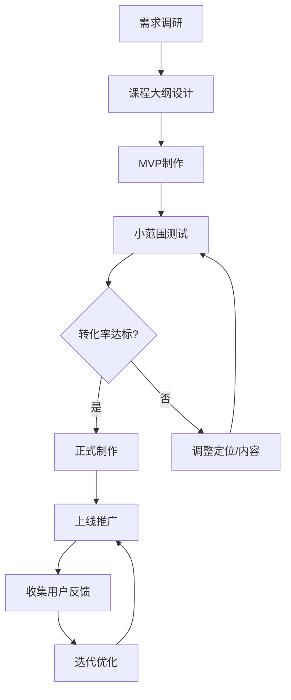
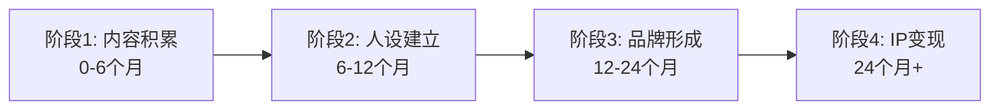
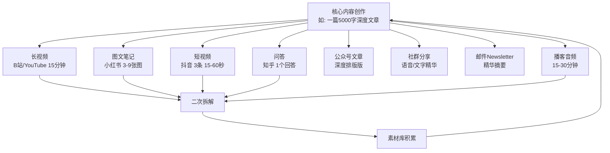
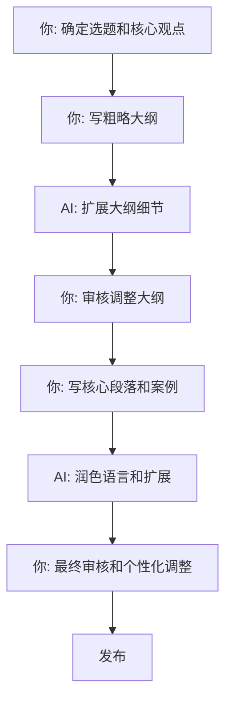
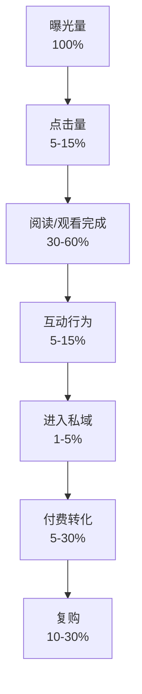
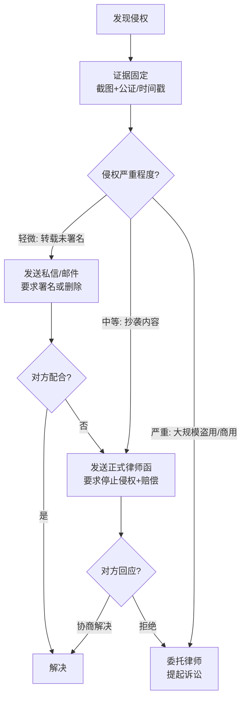

## 八、内容变现的高阶策略

当创作者完成了基础的内容生产与平台运营之后，需要进入更系统化、更精细化的变现阶段。基础变现是"有内容就有收入"，高阶变现则是"构建一套自运转的商业系统"——内容只是这个系统的一个输入端，而非全部。

本章聚焦于知识付费产品设计、私域流量深度运营、内容IP化构建、多平台分发优化、内容自动化规模化、数据驱动决策、版权授权与内容交易、财务管理与税务规划、团队搭建与管理、退出策略与长期规划十大维度，帮助你从"单点变现"升级为"体系化变现"。

**高阶策略的前提判断**：在进入本章之前，请确认你已经满足以下条件中的至少三项：
- 已稳定产出内容超过3个月，且有固定更新频率
- 单平台粉丝超过5000，或全平台合计超过1万
- 已经有过至少一次付费转化（哪怕只有几十元）
- 对目标用户画像有清晰认知，知道他们愿意为什么付费
- 已经找到了自己在内容市场中的差异化定位

如果以上条件均不满足，建议先完成前面章节的基础建设。高阶策略是锦上添花，不是雪中送炭。

---

### 8.1 知识付费产品设计

#### 8.1.1 知识付费的市场现状与趋势

2024年中国知识付费市场规模达到约1100亿元，用户规模突破5.7亿。但市场的另一面是：**头部效应极其严重**——约5%的创作者拿走了80%以上的收入。这意味着，想在知识付费领域赚到钱，光有好内容远远不够，你还必须有优秀的产品设计能力。

知识付费的三个核心趋势：

1. **从"卖课程"到"卖结果"**：用户不再满足于"学完10节课"，而是要求"学完能做到XXX"。结果导向的课程退款率低（5%以下）、复购率高（30%+），而纯知识灌输型课程退款率高达20-35%
2. **从"一次性购买"到"持续订阅"**：买断制课程的生命周期通常为3-6个月，订阅制内容（付费社群、会员制）的ARPU（每用户平均收入）是买断制的2-4倍
3. **从"纯线上"到"OMO融合"**：线上课程+线下训练营+社群陪跑的混合模式，完课率比纯线上高3倍，客单价高5-10倍

#### 8.1.2 产品金字塔模型

知识付费的核心在于产品分层——不同价位的产品承担不同的商业职能，共同构成一个完整的用户转化漏斗。

| 层级 | 价格区间 | 产品形态 | 收入占比 | 客户占比 | 核心职能 | 生命周期 |
|------|----------|----------|----------|----------|----------|----------|
| 超高价产品 | 5万元+ | 年度私董会、企业内训、顾问服务 | 15% | 0.1% | 利润中心+品牌背书 | 长期关系 |
| 高价产品 | 9999-49999元 | 一对一咨询、高端训练营、线下闭门课 | 30% | 1% | 利润中心 | 1-6个月 |
| 中价产品 | 499-1999元 | 系统课程、付费社群、训练营、年度会员 | 50% | 10% | 核心收入 | 3-12个月 |
| 低价产品 | 9.9-99元 | 入门课程、电子书、模板包、知识星球 | 15% | 30% | 筛选付费用户 | 一次性 |
| 免费产品 | 0元 | 公开课、文章、视频、资料包、直播 | 引流用 | 60% | 流量入口 | 持续更新 |

**为什么这个比例分布有效？** 因为它符合二八定律的变体——10%的中高端客户贡献80%的收入。免费内容负责拉新，低价产品完成"从免费到付费"的心理跨越，中价产品是营收主力，高价产品则通过高客单价弥补小客户基数。

**收入模型示例**：假设你有1万粉丝——
- 6000人（60%）消费免费内容：0元
- 3000人（30%）购买低价产品，均价50元：15万元
- 1000人（10%）购买中价产品，均价999元：99.9万元
- 100人（1%）购买高价产品，均价19999元：199.99万元
- 10人（0.1%）购买超高价产品，均价5万元：50万元
- **合计年收入约365万元**

这个模型的关键在于：每一层的转化率都经过优化，每一层都为上一层做筛选。没有金字塔底部的流量池，上面的高价产品就没有潜在客户。

#### 8.1.3 产品设计的五个原则

**原则一：价值阶梯递进**

每个层级的产品不能是孤立的，而是上一层级的"预告片"。免费内容要让用户看到低价产品的价值，低价产品要让用户理解中价产品的必要性，以此类推。例如：免费文章讲解"A股定投基础概念"，低价电子书系统梳理"定投策略全框架"，中价课程则手把手带用户"用量化工具构建定投组合"，高价训练营直接帮用户"搭建并优化个人投资组合"。

阶梯递进的关键设计：
- 每一层产品的结尾，自然引出下一层的价值（不是硬推销，而是让用户自己意识到"我还需要更多"）
- 每一层都要有独立价值，不能让用户觉得"买了这个就是为了买下个"
- 相邻层级之间要有明确的能力跨越，而非简单的"内容更多"

**原则二：最小可行产品（MVP）先行**

不要一次性构建完美产品。先用最低成本验证需求：
- 一篇付费专栏文章（19.9元）测试用户是否愿意为你的内容付费
- 一场小规模直播课（99元）测试教学能力和内容接受度
- 一个微信群运营两周测试社群黏性和活跃度
- 一个简单的问卷调查（50份以上回复）验证痛点真实性

验证通过的标准：
- 转化率高于3%（付费人数/触达人数）
- 退款率低于10%
- 用户主动好评或推荐
- 至少有3-5个用户问"有没有更深入的课程"

验证通过后再投入资源做系统产品。验证不通过，要么调整定位，要么换方向，不要在错误的方向上投入更多。

**原则三：解决具体问题而非传递信息**

信息是免费的，解决方案才值钱。对比两种课程包装方式：

| 维度 | 信息型（低价值感） | 解决方案型（高价值感） |
|------|-------------------|---------------------|
| 标题 | "小红书运营技巧大全" | "7天从0到1万粉：小红书冷启动实战营" |
| 承诺 | "教你100个涨粉方法" | "学完就能写出第一篇爆款笔记" |
| 交付物 | 视频+文档 | 视频+作业批改+1v1答疑+模板+数据追踪表 |
| 退款率 | 高（30%+） | 低（5%以下） |
| 复购率 | 低（5%以下） | 高（30%+） |
| 定价天花板 | 99元以内 | 可以定到999-9999元 |

**原则四：超预期交付**

知识付费的复购率和口碑传播完全取决于"用户实际获得的价值"与"购买时的预期"之间的差值。具体做法：

- 承诺10节课就给12节（附赠2节加餐内容）
- 承诺模板就多送配套工具和使用教程
- 承诺社群答疑就主动私聊关心学习进度
- 在课程中途赠送一次意外福利（如行业报告、工具会员）
- 课程结束后提供持续的校友群和资源更新

超预期不需要多大的投入，但它会让用户主动帮你传播。统计数据显示，超预期交付的课程，自然推荐率（用户主动推荐）是普通课程的3-5倍。

**原则五：可复制可规模化**

高价产品可以1v1，但中低价产品必须设计为可批量交付的标准化产品。录制好的视频课程、制作好的模板包、写好的电子书——一次制作，无限销售，边际成本趋近于零。

规模化设计的关键：
- 所有可标准化的内容提前录制/制作完成
- 社群答疑用FAQ文档+每周集中答疑解决80%的问题
- 作业批改用评分模板+助教团队分担
- 退款流程自动化，减少人工干预

这才是知识付费"睡后收入"的真正含义：产品一旦完成，销售和交付的边际成本趋近于零。

#### 8.1.4 知识付费产品的完整开发流程



**需求调研的三种方法：**

1. **搜索数据分析**：用5118、百度指数、巨量算数搜索目标关键词的搜索量和相关问题，找到用户的真实痛点。搜索量大但优质回答少的领域，就是你的机会。5118的长尾词挖掘功能可以帮你发现用户搜索但竞品没有覆盖的问题。

2. **社群潜伏**：加入目标用户聚集的微信群、知识星球、豆瓣小组，观察他们最常问的问题、最大的困惑、最愿意付费解决的问题。记录至少100个问题，然后按频率排序，排名前10的问题就是你的课程核心模块。

3. **问卷+访谈**：设计一份10题以内的问卷（用腾讯问卷或问卷星），发放给已有粉丝。核心问题包括"你最想解决的3个问题""你愿意为解决这个问题付多少钱""你之前买过哪些同类产品，满意/不满意的地方是什么"。同时深度访谈5-10个典型用户（每人30分钟），挖掘问卷无法触及的深层需求。

#### 8.1.5 课程大纲设计的黄金结构

一个好的课程大纲不是知识的罗列，而是用户从"新手"到"高手"的成长路径。

```text
模块0：破冰篇（让学员建立信心）
  - 学完这节课你就能做出XX
  - 讲清楚课程的学习路径和预期成果
  - 展示一个"学员成果"案例激发动力

模块1-3：基础篇（建立认知框架）
  - 从零开始，逐步搭建知识体系
  - 每节课都有小练习，即时反馈
  - 关键概念用类比和案例解释，避免学术化

模块4-6：进阶篇（核心技能突破）
  - 解决80%的实际问题
  - 大量真实案例拆解（至少每模块3个案例）
  - 每个模块都有作业，且作业与实际场景挂钩

模块7-8：实战篇（从知道到做到）
  - 完整项目实操（从0到1完成一个真实任务）
  - 常见坑点规避（用"错误示范+正确做法"对比）
  - 与学员一对一答疑或小组辅导

模块9：高阶篇（持续成长路径）
  - 行业前沿趋势和高级技巧
  - 进阶学习资源推荐
  - 为高价产品埋伏笔（自然引出训练营/私教的价值）
```

#### 8.1.6 定价心理学与策略

定价不是拍脑袋，而是基于心理学和市场验证的系统工程。

**锚定效应**：在课程页面同时展示三个价格——基础版（499元）、标准版（999元）、高级版（1999元）。大部分用户会选择中间的"标准版"，因为它看起来"性价比最高"。实际上，标准版就是你想主推的产品。

**尾数定价**：999元比1000元感觉便宜很多，尽管只差1元。知识付费领域的常见定价尾数：9、99、199、399、699、999、1999、2999。避免使用500、1000这种整数，因为它们缺乏"精确感"。

**价格-价值锚定**：在课程页面展示"如果用其他方式获得同等价值需要多少钱"——"这套知识如果通过1v1咨询获得，至少需要5万元；通过3年试错自己摸索，时间成本至少10万。现在只需要999元。"

**限时/限量策略**：早鸟价（前100名7折）、限时优惠（48小时内下单减免200元）、限量名额（每期限50人）。稀缺性是强大的购买驱动力，但必须是真实的稀缺，而非虚假制造。

**订阅制 vs 买断制的决策框架**：

| 维度 | 买断制 | 订阅制 |
|------|--------|--------|
| 适合内容 | 体系化课程、技能训练营 | 持续更新的资讯、社群、工具 |
| 单次收入 | 高（一次性收取） | 低（按月/年收取） |
| 长期收入 | 依赖持续拉新 | 叠加效应，老用户持续付费 |
| 用户心理 | "买完即走" | "持续获得价值" |
| 退费率 | 需要设置冷静期 | 随时可退，压力在供给端 |
| 运营强度 | 低（交付完成） | 高（需持续提供新价值） |
| 典型LTV | 单次客单价 | 客单价 × 平均订阅月数 |

**建议**：体系化课程用买断制，社群/会员/持续更新内容用订阅制。大多数成熟创作者的模式是"买断课程引流 → 订阅社群留存"。

#### 8.1.7 知识付费平台选择

| 平台 | 抽佣比例 | 适合产品 | 优势 | 劣势 |
|------|----------|----------|------|------|
| 小鹅通 | 平台费4800-19999元/年 | 直播课、录播课、训练营 | 功能全面，自定义强 | 有年费门槛 |
| 知识星球 | 平台抽佣5% | 社群、专栏、问答 | 社群生态好，用户付费习惯成熟 | 功能相对简单 |
| 千聊 | 平台抽佣10-20% | 直播课、音频课 | 用户基数大 | 竞争激烈 |
| 荔枝微课 | 平台抽佣10% | 音频课、系列课 | 音频体验好 | 仅限音频 |
| 得到 | 平台抽佣30-50% | 精品课程、电子书 | 品牌背书强，用户付费意愿高 | 门槛高，抽佣重 |
| 自建（微信+小鹅通/有赞） | 支付通道费0.6% | 全品类 | 完全自主，利润最大化 | 需要自己引流 |

**自建 vs 平台的决策**：初期建议在平台起步（利用平台流量和信任背书），当私域用户超过3000人后，逐步转向自建（利润更高，数据自主）。

---

### 8.2 私域流量运营策略

#### 8.2.1 公域与私域的本质区别

理解公域和私域的区别，核心在于理解"流量所有权"。

**公域流量**（抖音、小红书、B站、微博）：用户是平台的资产。你的内容只是平台推荐算法中的一个候选项，平台可以随时调整算法降低你的曝光。触达这些用户需要持续产出内容，成本不会消失，只是从"买流量"变成了"买内容"。

**私域流量**（微信个人号、企业微信、自建社群、邮件列表、公众号）：用户是你的资产。你可以直接、免费、多次触达他们，不受算法和平台政策的影响。一次获取，终身可用。

| 维度 | 公域流量 | 私域流量 |
|------|----------|----------|
| 单次触达成本 | 高（持续内容投入或广告费） | 低（一次获取，免费触达） |
| 用户归属 | 平台 | 你自己 |
| 触达确定性 | 低（受算法影响，通常5-15%） | 高（直接推送，微信打开率60-80%） |
| 信任基础 | 弱（刚认识） | 强（持续互动） |
| 转化率 | 1-3% | 10-30% |
| 适合场景 | 拉新获客 | 深度运营、复购转化 |
| 数据自主性 | 低（平台不给你完整数据） | 高（你可以追踪每个用户的行为） |

**一个直观的对比**：你有10万抖音粉丝和1000个微信好友。发一条抖音视频，可能只有5000人看到（5%曝光率）；发一条朋友圈，可能有700人看到（70%曝光率）。如果你的转化率都是2%，抖音带来100个潜在客户，微信带来14个。但微信的14个人信任度更高，最终成交金额可能更高。

#### 8.2.2 企业微信 vs 个人微信的选择

| 维度 | 个人微信 | 企业微信 |
|------|----------|----------|
| 好友上限 | 5000人（实际建议不超过3000） | 无上限（认证后） |
| 自动回复 | 需第三方工具（风险高） | 原生支持 |
| 标签管理 | 手动，功能简单 | 自动化标签+分层群发 |
| 朋友圈限制 | 每天可发多条 | 每天只能发3条（企业微信朋友圈） |
| 客户资产安全 | 员工离职可带走客户 | 客户资产归企业，可继承 |
| 封号风险 | 高（营销行为易被封） | 低（企业背书） |
| 成本 | 免费 | 认证费300元/年，高级功能按人收费 |
| 适合场景 | 个人IP、小规模运营 | 团队化运营、企业品牌 |

**建议**：
- 个人创作者（粉丝<5万）：个人微信足够，用企业微信做辅助
- 团队化运营（粉丝>5万或有助教）：企业微信为主，个人微信做高端用户维护
- 最佳实践：企业微信承接大部分用户，个人微信只加高价值用户（年消费>1000元）

#### 8.2.3 私域沉淀的五步法

**步骤一：引流——设计"钩子"**

用户不会无缘无故加你微信。你需要一个足够有吸引力的理由，这个理由叫"钩子"（Lead Magnet）。

有效的钩子类型：
- **资料包型**：行业报告、工具合集、模板库（"回复'模板'领取100个小红书爆款标题模板"）
- **工具型**：计算器、评估表、清单（"加微信领取个人IP定位诊断表"）
- **服务型**：免费诊断、一对一答疑、资料定制（"加微信送你一份账号诊断报告"）
- **社群型**：交流群、打卡群、共读群（"加入7天写作打卡群，和100人一起练"）
- **试听型**：免费试听1节课（"加微信领取价值199元的私教体验课"）

钩子设计的关键原则：**具体、即时、高感知价值**。"加我领资料"不如"加我领《2024年小红书涨粉实操手册》（含50个真实案例拆解）"。

**钩子质量直接影响后续转化**。数据显示：
- 垃圾钩子（如"免费领资料"但资料质量差）：后续转化率<1%
- 普通钩子（如"领XX模板"，模板质量中等）：后续转化率3-5%
- 优质钩子（如"领XX诊断报告"，报告针对个人定制）：后续转化率8-15%

**步骤二：承接——5分钟内的第一次触达**

用户刚加你微信的前5分钟，是信任度最高、注意力最集中的黄金窗口。错过这个窗口，后续的触达效果会递减50%以上。

标准承接流程：
1. 自动发送欢迎消息（企业微信可设置自动回复，个人微信用WeTool等工具）
2. 自我介绍：我是谁、我做什么、我能帮你什么（3句话以内）
3. 发送承诺的钩子资料（必须立即兑现，不要说"稍后发"）
4. 了解用户基本情况（一个简单的问题，如"你现在做自媒体多久了？"）
5. 标签分类（根据用户回答打标签，方便后续精准推送）

**承接话术模板**：
```text
Hi [用户昵称]，我是[你的名字]，专注[你的领域][X]年。
你要的[钩子名称]在这里：[链接/文件]
顺便问一下，你目前在[领域]方面最想解决的问题是什么？
了解你的情况后我可以给你更有针对性的建议~
```

**步骤三：培育——持续提供价值**

培育期的核心是"不卖货，只给价值"。这个阶段的目标是让用户从"认识你"变成"信任你"。培育期通常需要2-4周。

培育内容的节奏建议：

| 频率 | 内容类型 | 目的 | 具体做法 |
|------|----------|------|----------|
| 每天 | 朋友圈2-3条 | 保持存在感 | 干货:生活:成果 = 4:3:3 |
| 每周 | 社群分享1次 | 深度价值传递 | 直播/语音/图文，主题紧扣用户痛点 |
| 每月 | 1v1私聊核心用户 | 建立深度连接 | 主动关心进度，提供个性化建议 |
| 季度 | 线下活动/线上大会 | 强化社区归属感 | 粉丝见面会、行业沙龙、年度复盘 |

**朋友圈内容公式**：
- **干货型（40%）**：分享一个实用技巧、一个行业洞察、一个工具推荐
- **生活型（30%）**：工作日常、学习心得、个人感悟（让粉丝觉得你是"真人"）
- **成果型（20%）**：学员反馈、数据截图、合作案例（社会证明）
- **互动型（10%）**：提问、投票、话题讨论（提升互动率）

**步骤四：转化——精准推荐，消除顾虑**

当用户已经信任你之后（通常培育2-4周后），适时推荐产品。转化的关键不是"推销"，而是"匹配"——给对的人推荐对的产品。

转化话术框架：
1. **痛点唤醒**："最近很多人问我XX问题，你有没有遇到过？"
2. **方案呈现**："针对这个问题，我做了一个XX产品，解决思路是……"
3. **社会证明**："已经有XX人购买，这是他们的反馈……"
4. **限时激励**："本周下单赠送XX，名额有限"
5. **风险消除**："7天无理由退款，不满意全额退"

**转化的黄金时机**：
- 用户主动私聊问问题时（需求最明确）
- 社群活动结束后24小时内（热情最高涨）
- 你发布了高互动内容后（信任感最强）
- 用户朋友圈晒了相关成果/困惑时（需求信号最清晰）

**绝对不要在以下时机转化**：
- 用户刚加你微信的第一次对话（信任不够）
- 连续发了多条卖货朋友圈之后（用户已经免疫）
- 用户明确表示"暂时不需要"时（尊重边界）

**步骤五：复购与裂变——让用户成为你的传播者**

成交不是终点，而是新循环的起点。满意的用户是最好的销售渠道。

裂变机制设计：
- **推荐返佣**：老用户推荐新用户购买，获得10-30%的佣金或等值课程抵扣。返佣比例建议在15-25%之间，太低没动力，太高影响利润
- **拼团模式**：3人成团享受折扣价，用户主动拉人。拼团价通常为原价的6-7折
- **内容裂变**：用户转发海报到朋友圈，截图领取额外福利。福利要有足够吸引力（如限量资料包、1v1答疑名额）
- **等级体系**：累计消费达到一定金额，解锁更高等级权益。铜牌（消费>99元）、银牌（消费>499元）、金牌（消费>1999元）、钻石（消费>9999元）

#### 8.2.4 社群生命周期管理

社群不是建了就能持续活跃的。每个社群都有自己的生命周期，管理者必须在不同阶段采取不同策略。

| 阶段 | 时间 | 活跃度 | 核心任务 | 关键指标 |
|------|------|--------|----------|----------|
| 启动期 | 1-2周 | 最高（新鲜感） | 建立规则、破冰互动、明确价值 | 日活跃率>60% |
| 成长期 | 2周-2月 | 上升 | 持续输出价值、培养KOC | 周活跃率>40% |
| 成熟期 | 2-6月 | 稳定 | 用户自运营、UGC涌现 | 周活跃率>30% |
| 衰退期 | 6月+ | 下降 | 制造话题、引入新鲜内容/活动 | 周活跃率<20% |
| 死亡/重启 | - | 极低 | 要么重启焕新，要么优雅结束 | 日活跃率<5% |

**社群衰退的五个信号**：
1. 每天发言的人少于总人数的5%
2. 你发的内容没人回应，或只有几个人点赞
3. 退群人数开始增加
4. 群里开始出现广告、无关链接
5. 核心成员（KOC）开始沉默

**社群激活策略**：
- 引入新的活动形式（如"每天分享一个行业案例"打卡）
- 邀请嘉宾做分享（新鲜面孔带来新鲜话题）
- 启动社群专属项目（如"21天挑战赛"，完成有奖）
- 分层运营：将不活跃用户拉出到新群，给核心用户更好的体验
- 适当"结束"——一个有仪式感的结营，比一个慢慢死掉的群更好

#### 8.2.5 私域运营的常见误区

| 误区 | 正确做法 | 数据依据 |
|------|----------|----------|
| 加了微信就群发广告 | 先提供价值，建立信任后再推荐 | 培育后转化率是直接推销的5-8倍 |
| 朋友圈全是卖货信息 | 干货:生活:卖货 = 4:3:3 的比例 | 纯广告朋友圈的屏蔽率高达40% |
| 只关注拉新不关注留存 | 老用户LTV是新用户的3-5倍 | 留存率提升5%，利润可提升25-95% |
| 用微信群代替1v1 | 社群做氛围，1v1做转化 | 1v1的转化率是群发的3-5倍 |
| 所有用户一视同仁 | 按标签分层运营，高价值用户重点维护 | 分层运营的ROI是统一运营的2-3倍 |
| 频繁拉群、群发消息 | 控制频率，每次触达都要有价值 | 过度触达的取关率是正常频率的4倍 |

---

### 8.3 内容IP化策略

#### 8.3.1 什么是内容IP化

**IP化 = 个人品牌 + 内容体系 + 变现系统**

普通创作者卖的是"内容"——用户因为这篇文章有用而阅读，换一个人写同样有用的文章，用户就会流失。IP化创作者卖的是"品牌+信任+生活方式"——用户因为认同你这个人而关注你，即使内容领域拓展，用户也会跟随。

IP化的四个核心价值：
1. **溢价能力**：同样的内容质量，有个人IP的创作者定价可以高出3-10倍。用户买的不是课程，是"你的"课程
2. **获客成本降低**：口碑传播和品牌效应让新用户主动找上门。有IP的创作者获客成本通常是无IP创作者的1/3-1/5
3. **复购率提升**：用户信任你这个人，会持续购买你的新产品。IP化创作者的复购率通常是30-50%，远高于无IP创作者的5-10%
4. **竞争壁垒**：内容可以被抄袭，但人格品牌无法复制。当你的名字成为某个领域的代名词时，后来者几乎无法超越

#### 8.3.2 IP化的四个阶段



**阶段一：内容积累期（0-6个月）**

核心任务：持续输出优质内容，建立内容库，积累初始粉丝。

关键动作：
- 确定垂直领域（越窄越好，初期只做一个细分方向）
- 保持更新频率（至少每周2-3条，日更更佳）
- 内容质量>数量，但数量是基本盘
- 记录创作过程中的数据（阅读量、互动率、涨粉数），用数据指导内容优化

这个阶段的常见错误是"什么都想写"。记住：垂直是建立认知的前提。用户关注你是因为你在某个领域足够专业，而不是你什么都知道。

**阶段二：人设建立期（6-12个月）**

核心任务：形成独特的风格和调性，让用户对你有清晰的认知标签。

人设构建的五个维度：
- **视觉识别**：固定的头像、配色、排版风格（让人一眼认出你的内容）
- **语言风格**：幽默/严肃/犀利/温暖，选一个并坚持。如"半佛仙人"的犀利毒舌、"李佳琦"的夸张感染力
- **价值主张**：你代表什么观点？你反对什么？（如"只讲真话的理财博主""拒绝割韭菜的知识博主"）
- **专业标签**：你在什么领域比99%的人强？（用具体数据或成果背书，如"帮100+学员实现月入过万"）
- **生活切面**：适度展示工作之外的生活，增加真实感和亲近感（但要有边界，不要过度曝光隐私）

**阶段三：品牌形成期（12-24个月）**

核心任务：成为某个领域的代名词，品牌开始产生独立于内容的溢价。

品牌形成的标志：
- 用户主动搜索你的名字（而非搜索内容关键词）——这意味着你已经建立了品牌认知
- 有品牌方主动找你合作——你的商业价值被市场认可
- 有人模仿你的风格和内容——你已经成为了标杆
- 你的推荐能直接影响用户的购买决策——你拥有了"种草力"
- 媒体主动引用你的话或观点——你成为了行业声音

**阶段四：IP变现期（24个月+）**

核心任务：多元化变现，建立商业生态。

变现路径：
- **自有产品**：课程、社群、工具、实体产品（利润率最高，通常60-80%）
- **品牌合作**：广告、代言、联名（收入稳定，但依赖品牌方）
- **IP授权**：内容授权、品牌授权、形象授权（被动收入，利润率极高）
- **投资孵化**：用IP影响力入股或孵化新项目（杠杆最大）
- **线下活动**：培训、演讲、签售、粉丝见面会（增强粉丝黏性）
- **出版**：实体书、电子书、音频书（长尾收入+品牌背书）

#### 8.3.3 IP化的核心公式

```text
IP价值 = 专业深度 × 人格魅力 × 持续输出 × 影响范围
```

四个变量缺一不可：
- 只有专业没有人格 → 容易被替代（"学术型博主"天花板低）
- 只有人格没有专业 → 粉丝不精准（"网红型博主"变现难）
- 不能持续输出 → 热度消退（"爆款型博主"生命周期短）
- 影响范围太小 → 商业价值有限（需要有意识地扩大圈层）

#### 8.3.4 IP危机管理与公关

IP化意味着你个人就是品牌，任何负面事件都会直接冲击商业价值。危机管理不是"出事了再说"，而是提前建立预案。

**IP危机的五种常见类型**：

| 危机类型 | 触发场景 | 严重程度 | 应对策略 |
|----------|----------|----------|----------|
| 言论争议 | 过往言论被翻出、观点引发争议 | 中 | 真诚回应+解释背景+态度调整 |
| 虚假人设 | 被扒出学历/经历造假 | 高 | 坦诚承认+道歉+行动证明 |
| 产品翻车 | 课程质量差、退款纠纷 | 高 | 立即退款+公开道歉+改进方案 |
| 合作翻车 | 推荐的产品出问题 | 中-高 | 停止合作+公开说明+补偿用户 |
| 私生活曝光 | 个人隐私被曝光 | 低-中 | 视严重程度决定回应策略 |

**危机公关的黄金四步法**：
1. **2小时内回应**：沉默是最大的敌人。即使还没有完整的调查结果，也要第一时间表态"已知晓，正在处理"
2. **真诚而非套路**：用户能分辨出真诚的道歉和公关话术。承认错误，不要甩锅
3. **给出具体行动**：不是说"我们会改进"，而是说"我们将采取以下三步措施：第一步……第二步……第三步……"
4. **持续跟进**：危机过去后，定期公布改进进展，让用户看到你确实在改变

**预防胜于应对**：
- 定期审查自己的历史内容和言论
- 推荐任何产品前自己先使用至少2周
- 与品牌合作前审查品牌背景和口碑
- 建立"红线清单"——明确哪些事情绝对不做（如虚假宣传、割韭菜课程）

#### 8.3.5 IP团队搭建

当你的IP进入成长期后，一个人已经无法支撑所有工作。团队搭建是IP规模化的关键。

**IP团队的核心岗位**：

| 岗位 | 职责 | 何时招聘 | 月薪参考 |
|------|------|----------|----------|
| 内容助理 | 素材整理、初稿撰写、排版发布 | 粉丝>1万 | 5000-8000 |
| 社群运营 | 社群维护、用户答疑、活动策划 | 付费用户>200人 | 6000-10000 |
| 视频剪辑 | 视频拍摄、剪辑、字幕、封面 | 视频内容占50%+ | 6000-12000 |
| 商务对接 | 品牌合作、广告洽谈、合同管理 | 月广告收入>2万 | 8000-15000 |
| 运营主管 | 全盘运营、数据分析、策略制定 | 团队>3人 | 12000-20000 |

**招聘原则**：
- 先兼职后全职：用3个月兼职期验证工作量和匹配度
- 先外包后招聘：剪辑、设计等技术工作先外包，量大了再招全职
- 文化匹配第一：技能可以培养，但价值观和工作态度必须匹配你的品牌调性
- 给成长空间：优秀的人才不只是要工资，更要成长机会和话语权

---

### 8.4 多平台分发优化

> 注：本节聚焦分发优化策略。各平台的详细运营技巧请参阅本章前几节（第一至五节）和第六节"多平台矩阵运营"。

#### 8.4.1 一鱼多吃的内容复用策略

多平台分发不是简单的"复制粘贴"，而是"同一核心内容，适配不同平台的表达方式"。一个高质量内容可以拆解为7-10种形式。



**操作步骤：**

1. **确定核心内容**：每周选择1-2个深度主题，写一篇完整的长文或拍一个长视频。这是你的"母内容"
2. **拆解为多种形式**：从长内容中提取3-5个独立的短视频角度、3-5张图文笔记、1个知乎回答、1段播客音频
3. **适配平台语言**：
   - 小红书：加emoji和标签，标题要有数字和痛点，封面要有文字信息
   - 抖音：前3秒必须抓住注意力（用反问/冲突/悬念），节奏快，信息密度高
   - 知乎：先亮结论再论证，语气客观理性，适当引用数据和文献
   - B站：开头用"钩子"留住观众，中间穿插段子和梗，结尾引导三连
   - 公众号：深度排版，段落短，多用加粗和分隔线，配图精美
4. **错峰发布**：不要同时在所有平台发布。建议核心平台首发，其他平台1-3天后分发。这样可以避免平台判定为"搬运"
5. **追踪数据**：记录每条内容在各平台的数据表现，找到你的内容与平台的最佳匹配

#### 8.4.2 内容发布的时间策略

不同平台的用户活跃时段不同，发布时间直接影响初始流量。

| 平台 | 最佳发布时间 | 次佳时间 | 避免时段 | 原因 |
|------|------------|----------|----------|------|
| 抖音 | 12:00-13:00, 18:00-20:00 | 7:00-9:00 | 凌晨0-6点 | 用户午休和下班后刷手机 |
| 小红书 | 19:00-22:00 | 12:00-14:00 | 工作日上午 | 女性用户晚间活跃度高 |
| B站 | 18:00-22:00 | 周末全天 | 工作日上午 | 学生和年轻上班族晚间活跃 |
| 公众号 | 8:00-9:00, 20:00-22:00 | 12:00-13:00 | 周末早上 | 通勤时间和睡前阅读 |
| 知乎 | 20:00-23:00 | 12:00-14:00 | 凌晨 | 深度内容适合晚间阅读 |
| 微博 | 10:00-12:00, 20:00-23:00 | 热点发生时 | 无明显低谷 | 热点驱动，随时可发 |

**时间策略的核心**：先在你主力平台的最佳时段发布，观察初始2小时的数据（阅读量、互动率），再根据数据表现决定是否调整其他平台的发布时间。

#### 8.4.3 多平台运营的工具链

| 环节 | 推荐工具 | 用途 | 费用参考 |
|------|----------|------|----------|
| 内容创作 | Notion/飞书文档 | 统一写作，结构化管理 | 免费-199元/月 |
| 图片设计 | Canva/创客贴/稿定设计 | 快速制作各平台封面和配图 | 免费-399元/年 |
| 视频剪辑 | 剪映/CapCut/达芬奇 | 短视频和中长视频剪辑 | 免费（达芬奇免费版功能强大） |
| 多平台分发 | 蚁小二/简媒/新媒体管家 | 一键发布到多个平台 | 99-499元/月 |
| 数据监控 | 新榜/灰豚数据/蝉妈妈 | 各平台数据追踪和竞品分析 | 免费-999元/月 |
| 素材管理 | Eagle/花瓣/Notion数据库 | 素材收集和分类管理 | Eagle 199元（一次性） |
| 排期管理 | 飞书日历/Notion Calendar | 内容排期和团队协作 | 免费 |

#### 8.4.4 多平台分发的数据看板

建立一个统一的数据看板，追踪每条内容在各平台的表现。推荐用飞书多维表格或Notion数据库。

**核心追踪字段**：
- 内容标题/主题
- 首发平台+首发日期
- 各平台发布日期
- 各平台48小时数据（阅读量/播放量、点赞、评论、收藏/转发）
- 各平台30天累计数据
- 转化数据（引流到私域的人数、付费转化人数）
- 内容标签（选题类型、内容形式、关键词）

每周分析一次数据看板，回答以下问题：
1. 哪个平台的哪种内容类型数据最好？（投入更多精力）
2. 哪个平台的数据持续低迷？（考虑放弃或调整策略）
3. 哪类选题的数据最好？（加大该选题方向的产出）
4. 各平台的引流效率如何？（优化引流路径）

---

### 8.5 内容自动化与规模化

#### 8.5.1 为什么需要内容自动化

当你的内容矩阵扩展到3个以上平台，每天需要产出多条内容时，纯手工操作会迅速耗尽你的创作精力。内容自动化不是让AI替你写内容（那会导致同质化），而是用工具和流程自动化重复性工作，让你把精力集中在创意和策略层面。

**自动化的价值量化**：

| 工作环节 | 手工耗时/周 | 自动化后/周 | 节省时间 | 使用工具 |
|----------|------------|------------|----------|----------|
| 选题收集 | 5小时 | 1小时 | 80% | RSS订阅+关键词监控 |
| 素材整理 | 3小时 | 0.5小时 | 83% | Cubox/Notion Web Clipper |
| 排版发布 | 4小时 | 1小时 | 75% | 蚁小二/简媒 |
| 数据统计 | 3小时 | 0.5小时 | 83% | Python脚本/飞书自动化 |
| 社群管理 | 5小时 | 2小时 | 60% | 企业微信+自动化工具 |
| **合计** | **20小时** | **5小时** | **75%** | - |

节省下来的15小时/周，你可以用来做深度内容创作、用户访谈、商业合作——这些是无法被自动化替代的核心价值工作。

#### 8.5.2 可以自动化的环节

| 环节 | 自动化方式 | 工具推荐 | 实现难度 |
|------|----------|----------|----------|
| 选题收集 | RSS订阅+关键词监控 | Feedly、RSSHub、5118 | 低 |
| 素材整理 | 浏览器插件一键收藏+自动分类 | Cubox、Notion Web Clipper | 低 |
| 排版发布 | 模板化排版+定时发布 | 新媒体管家、蚁小二 | 低 |
| 社群管理 | 关键词自动回复+入群欢迎 | 企业微信、微伴助手 | 中 |
| 数据报告 | 自动抓取数据+生成周报 | Python脚本、Zapier、飞书多维表格 | 中 |
| 内容分发 | 首发后自动分发到其他平台 | 蚁小二、简媒 | 低 |
| 视频字幕 | 语音自动生成字幕 | 剪映、飞书妙记 | 低 |
| 图片批量处理 | 统一尺寸、加水印、压缩 | Eagle、XnConvert | 低 |

#### 8.5.3 内容生产SOP（标准操作流程）

以周为单位的内容生产SOP：

```text
周一：选题规划（2小时）
  09:00-09:30  查看数据看板，分析上周内容表现
  09:30-10:30  浏览行业热点和竞品动态，确定本周2-3个选题
  10:30-11:00  撰写选题大纲，确定核心观点和结构

周二-周三：核心内容创作（深度创作时间）
  全天  完成本周1-2篇深度长文或长视频脚本
  （这是唯一需要深度创作的时间段，其余时间不安排创作）

周四：内容拆解与多平台适配（6小时）
  09:00-12:00  将长文拆解为短视频脚本、图文笔记、知乎回答
  14:00-17:00  制作各平台的配图和封面
  17:00-18:00  预设下周的定时发布排期

周五：互动与数据复盘（4小时）
  09:00-11:00  回复各平台的评论和私信
  11:00-12:00  分析本周数据，调整下周策略
  14:00-16:00  社群运营（分享、答疑、互动）

周末：充电与储备
  阅读行业资料、积累素材、学习新技能
  每月选1个周末做一次"创作日"——集中产出2-3篇储备内容
```

#### 8.5.4 AI辅助内容创作的正确姿势

AI工具（ChatGPT、Claude、文心一言、通义千问等）可以大幅提升效率，但必须正确使用。

**适合用AI做的事：**
- 头脑风暴选题方向（"给我10个关于XX的选题角度"）
- 优化标题和文案（提供5-10个备选标题，自己选最好的）
- 扩展大纲（在你已有核心观点的基础上补充细节）
- 改写和润色（把你的草稿变得更流畅、更专业）
- 翻译和本地化（将英文内容转化为中文语境）
- 生成数据分析报告的初稿（然后人工审核数据准确性）
- 写产品描述、课程介绍等营销文案

**不适合用AI做的事：**
- 替你做核心观点的输出（AI没有独到见解，输出会平庸且同质化）
- 替你写个人经历和故事（缺乏真实感，读者能感知到"AI味"）
- 替你做最终的质量判断（AI不了解你的用户和品牌调性）
- 一次性生成完整文章直接发布（平台算法会识别并降权）

**AI辅助创作的正确工作流**：



**最佳实践：你负责思考和灵魂，AI负责执行和润色。**

#### 8.5.5 内容自动化工具链搭建

以下是经过实战验证的内容自动化工具链方案：

**方案一：轻量级（适合个人创作者，月成本<100元）**
- 选题：RSSHub（自建，免费）+ 5118（免费版）
- 写作：Notion（免费版）+ AI助手
- 设计：Canva免费版 + 剪映
- 分发：手动发布（平台<3个时足够）
- 数据：飞书多维表格（免费）

**方案二：中等规模（适合小团队，月成本500-2000元）**
- 选题：Feedly Pro（约60元/月）+ 5118会员（约300元/月）
- 写作：Notion团队版（约70元/人/月）+ AI API调用
- 设计：Canva Pro（约300元/年）+ Eagle（一次性199元）
- 分发：蚁小二（约200元/月）
- 数据：新榜（免费-999元/月）
- 社群：企业微信 + 微伴助手（约200元/月）

**方案三：规模化（适合MCN/内容公司，月成本5000元+）**
- 以上所有 + 专业数据分析工具 + 自动化工作流（Zapier/飞书自动化）
- 专属内容管理系统（CMS）
- 团队协作平台（飞书/钉钉专业版）
- 专业视频制作团队/外包

---

### 8.6 数据驱动的内容决策

#### 8.6.1 关键数据指标

不同阶段关注的核心指标不同：

| 阶段 | 核心指标 | 辅助指标 | 数据来源 | 决策依据 |
|------|----------|----------|----------|----------|
| 冷启动期（0-3个月） | 涨粉数、内容产出量 | 单条阅读量、互动率 | 平台后台 | 内容方向是否正确 |
| 成长期（3-12个月） | 粉丝增长率、爆款率 | 完播率、收藏率、转发率 | 平台后台+第三方工具 | 投入精力的分配 |
| 成熟期（12个月+） | 变现收入、ROI、用户LTV | 转化率、复购率、NPS | CRM+支付后台 | 商业策略优化 |

**各平台的核心数据指标**：

| 平台 | 最核心指标 | 次核心指标 | 指标含义 |
|------|-----------|-----------|----------|
| 抖音 | 完播率 | 互动率（点赞+评论+转发/播放） | 完播率>30%有爆款潜力 |
| 小红书 | 收藏率 | 点击率（封面吸引力） | 收藏率>5%说明内容有长期价值 |
| B站 | 一键三连率 | 弹幕密度 | 三连率>3%说明内容质量高 |
| 公众号 | 分享率 | 阅读完成率 | 分享率>3%说明内容有传播力 |
| 知乎 | 赞同率 | 收藏率 | 赞同率>5%说明回答被认可 |

#### 8.6.2 爆款内容分析法

找到你过去3个月内数据最好的5-10条内容，逐一分析：

1. **选题角度**：什么话题引发最多共鸣？是痛点型、干货型、观点型还是故事型？
2. **标题/封面**：什么元素提升了点击率？是数字、悬念、痛点还是视觉冲击？
3. **内容结构**：什么节奏让用户看完了？是总分总、时间线、问题-方案还是故事线？
4. **发布时间**：什么时段的数据最好？周一到周日、上午还是晚上？
5. **互动行为**：用户在评论区聊什么？哪些评论获得了最多赞？

**爆款分析模板**：

```text
┌──────────┬──────────┬──────────┬──────────┬──────────┐
│ 内容标题  │ 数据指标  │ 爆款因素  │ 可复制点  │ 改进空间  │
├──────────┼──────────┼──────────┼──────────┼──────────┤
│ XXXX     │ 阅读10万  │ 选题踩中  │ 选题公式  │ 封面可优  │
│          │ 收藏率8%  │ 热点+痛点 │ 可复用    │ 化       │
├──────────┼──────────┼──────────┼──────────┼──────────┤
│ YYYY     │ 播放50万  │ 前3秒钩子 │ 钩子模板  │ 评论互动  │
│          │ 完播率42% │ 强        │ 可复用    │ 不够      │
└──────────┴──────────┴──────────┴──────────┴──────────┘
```

把这些分析结果沉淀为"爆款公式"，指导后续内容创作。注意：爆款公式不是保证每条都爆，而是提高爆款概率。

#### 8.6.3 A/B测试方法论

A/B测试是用数据替代直觉做决策的核心方法。

**可以A/B测试的变量**：

| 变量 | 测试方法 | 样本量要求 | 评估指标 |
|------|----------|-----------|----------|
| 标题 | 同一内容，两个标题在不同时间发 | 各1000+曝光 | 点击率 |
| 封面 | 同一内容，两个封面在不同时间发 | 各1000+曝光 | 点击率 |
| 发布时间 | 同类内容，在不同时段发布 | 各5条以上 | 48小时数据 |
| 内容长度 | 同类主题，长版本vs短版本 | 各3条以上 | 完播率/阅读完成率 |
| 行动号召 | 不同的CTA（关注/收藏/评论引导） | 各5条以上 | 对应互动率 |

**A/B测试的注意事项**：
- 每次只测一个变量，否则无法归因
- 样本量要足够大，至少1000次曝光才能得出有意义的结论
- 测试周期要覆盖至少一周（避免周末/工作日差异干扰）
- 记录所有测试结果，建立"测试知识库"

#### 8.6.4 竞品对标分析法

选择3-5个同领域做得好的账号，定期跟踪：
- 他们的选题方向有什么变化？
- 什么内容的数据最好？
- 他们的变现方式是什么？
- 他们有什么你没覆盖到的细分方向？
- 他们的用户评论中有哪些未被满足的需求？

用飞书多维表格或Notion数据库建立竞品追踪表，每周花30分钟更新。

**竞品分析表格模板**：

```text
账号名称 | 粉丝数 | 近7天爆款 | 内容形式 | 变现方式 | 值得学习的点 | 可超越的点
--------|--------|----------|---------|---------|------------|----------
账号A   | 50万   | 2条10万+  | 短视频  | 带货    | 钩子设计好  | 深度不足
账号B   | 30万   | 1条5万+   | 图文    | 课程    | 案例真实    | 更新太慢
```

#### 8.6.5 数据驱动的选题公式

```text
选题价值 = 搜索需求量 × 内容稀缺度 × 用户付费意愿 × 你的专业匹配度
```

四个维度的评估方法：
- **搜索需求量**：5118查关键词搜索量，巨量算数查抖音搜索趋势，小红书热搜查实时热点
- **内容稀缺度**：搜索该话题，优质回答少、竞争不激烈的领域就是机会
- **用户付费意愿**：该话题的用户是否已经有过付费行为？（有付费竞品是好事，说明用户愿意付费）
- **专业匹配度**：你是否有能力写出超越竞品的内容？有没有独特的经验或视角？

四个维度都高的话题，就是你的"金矿选题"。建议用评分制（每个维度1-5分），总分>14分的选题优先做。

#### 8.6.6 转化漏斗分析

内容变现的本质是一个漏斗，每个环节都有流失。数据分析的核心就是找到流失最大的环节并优化。



**漏斗各环节的优化方向**：

| 环节 | 行业基准 | 如果低于基准 | 优化方向 |
|------|----------|------------|----------|
| 点击率 | 5-15% | 标题/封面不吸引人 | A/B测试标题、优化封面设计 |
| 完成率 | 30-60% | 内容开头没抓住人 | 优化前3秒/前3行，提升信息密度 |
| 互动率 | 5-15% | 内容没有引发共鸣 | 增加互动引导，选题更贴近痛点 |
| 私域转化 | 1-5% | 钩子不够吸引人 | 优化钩子设计，增加引流路径 |
| 付费转化 | 5-30% | 信任没建立好 | 延长培育期，优化产品价值展示 |
| 复购率 | 10-30% | 产品体验不够好 | 超预期交付，优化售后服务 |

---

### 8.7 版权授权与内容交易

#### 8.7.1 内容版权基础

作为内容创作者，你必须了解自己作品的版权归属和保护方式。

**原创内容自创作完成之日起自动享有著作权**，无需注册。但为了在发生侵权时便于举证，建议做以下准备：
- 在中国版权保护中心进行作品登记（费用约300元/件，网上自助办理，30个工作日出证）
- 发布时加上版权声明和创作时间戳（如"© 2024 [你的名字]. All rights reserved."）
- 使用可信时间戳服务（如联合信任时间戳、可信时间戳tsa.cn）固定创作时间（每次约10元）
- 保留创作过程的原始文件和修改记录（PSD/AI源文件、Word修订记录、Git提交历史）

**版权保护的技术手段**：

| 手段 | 适用场景 | 工具 | 成本 |
|------|----------|------|------|
| 文字水印 | 图片、文档 | Photoshop、Canva | 低 |
| 数字水印 | 图片、视频 | Digimarc、自研算法 | 中 |
| 内容指纹 | 视频、音频 | 平台自带（抖音原创保护） | 免费 |
| 版权存证 | 全类型 | 版权家、原本区块链 | 约10-50元/次 |
| 定期巡查 | 监控侵权 | 原创宝、骑士维权 | 免费-500元/月 |

#### 8.7.2 内容授权的商业形态

| 授权类型 | 说明 | 典型价格区间 | 适用场景 |
|----------|------|------------|----------|
| 单次转载授权 | 允许一家媒体转载一篇内容 | 500-5000元/篇 | 公众号、媒体网站 |
| 批量内容授权 | 授权一个系列或一整年的内容 | 5万-50万元/年 | 出版社、教育机构 |
| 独家授权 | 内容只授权给一家使用 | 非独家价格的2-5倍 | 品牌合作、出版 |
| IP改编授权 | 将文字内容改编为视频、音频、课程 | 买断或分成（通常10-30%） | MCN、影视公司 |
| 联合创作 | 与品牌方共同创作内容，共享版权 | 项目制（1万-100万+） | 品牌联名、企业合作 |

**定价参考公式**：
```text
授权价格 = 内容创作成本 × 3-10倍 × 独家系数 × 期限系数

内容创作成本 = 你的时间成本 + 直接制作费用
独家系数：非独家=1，独家=2-5
期限系数：1年=1，永久=3-5
```

#### 8.7.3 内容交易的注意事项

1. **合同先行**：任何内容授权交易都必须签书面合同，明确授权范围、使用期限、独占性、价格和违约责任。口头协议在法律上几乎无法执行
2. **保留署名权**：即使转让了财产权，署名权（精神权利）不可转让，这是《著作权法》明确规定的
3. **明确二次使用**：如果对方将你的内容二次加工（如剪辑、翻译、改编），是否需要额外授权，必须在合同中写明
4. **分批付款**：大额交易建议分阶段付款（预付30%、交付验收40%、上线30天后30%），避免"交了内容拿不到钱"
5. **维权机制**：合同中明确侵权后的赔偿标准和争议解决方式（仲裁或诉讼），约定管辖法院在你所在地

#### 8.7.4 主动维权的实操流程

发现内容被盗用后的处理流程：



**证据固定的关键细节**：
- 截图必须包含完整的URL、发布时间、发布者信息
- 重要侵权建议做公证（公证费约500-1000元，但法律效力最高）
- 使用可信时间戳固定证据（比截图法律效力更高）
- 保留侵权内容的完整副本（对方可能会删除）

**侵权赔偿的参考标准**：
- 实际损失（如因侵权导致的流量损失、收入损失）
- 侵权人的违法所得（如用你的内容赚到的广告费）
- 法定赔偿（以上两项无法确定时，法院酌定，通常500-50万元）
- 合理开支（律师费、公证费等可以要求对方承担）

#### 8.7.5 国际版权注意事项

如果你的内容面向海外市场（如YouTube、海外社交媒体），需要注意：

- **各国版权法有差异**，但《伯尔尼公约》覆盖了180+个国家，成员国之间互相承认版权
- **美国DMCA**：如果有人在美国平台（YouTube、Medium等）盗用你的内容，可以通过DMCA Takedown Notice要求平台下架
- **Creative Commons（CC协议）**：如果你想让内容被更多人使用但保留部分权利，可以选择CC协议（如CC BY-NC：允许非商业使用，但需署名）
- **海外维权成本高**：除非侵权规模很大（经济损失>10万元），否则海外维权通常不划算。优先使用平台自带的侵权投诉机制

---

### 8.8 内容变现的财务管理

#### 8.8.1 税务基础

内容创作者的收入涉及多种税种，不了解税务知识可能导致多交税或被罚款。

**个人创作者的税务框架**：

| 收入类型 | 税种 | 税率 | 说明 |
|----------|------|------|------|
| 平台广告收入 | 劳务报酬所得 | 20-40%（预扣） | 年终汇算清缴，多退少补 |
| 知识付费收入 | 劳务报酬/经营所得 | 5-35% | 取决于是否注册个体工商户 |
| 品牌合作收入 | 劳务报酬所得 | 20-40%（预扣） | 需要代开发票 |
| 版权授权收入 | 特许权使用费所得 | 20% | 可扣除20%费用后计税 |

**合法节税的三种方式**：

1. **注册个体工商户**：年收入超过10万元的创作者，注册个体户可以将税率从劳务报酬的20-40%降低到经营所得的5-35%（实际税负通常在3-10%）。还可以开具发票，方便品牌合作

2. **利用税收优惠政策**：部分园区对个体户/小规模纳税人有核定征收政策，综合税负可低至1-3%。但必须是真实业务，虚构业务属于违法

3. **合理列支成本**：设备购置、软件订阅、场地租金、外包费用等都可以作为成本列支，降低应纳税所得额。保留所有发票和收据

**建议**：年收入超过20万元后，一定要找一个专业的会计或税务顾问。税务规划省下的钱，远超顾问费。

#### 8.8.2 财务管理基本框架

内容创作者的财务管理三张表：

**收入明细表**（每月更新）：

```text
┌─────────────────┬──────────┬──────────┬──────────┐
│ 收入来源         │ 本月收入  │ 上月收入  │ 环比增长  │
├─────────────────┼──────────┼──────────┼──────────┤
│ 平台广告分成      │ ¥3,000   │ ¥2,500   │ +20%     │
│ 品牌合作         │ ¥15,000  │ ¥10,000  │ +50%     │
│ 知识付费产品      │ ¥8,000   │ ¥6,000   │ +33%     │
│ 社群/会员        │ ¥5,000   │ ¥4,500   │ +11%     │
│ 版权授权         │ ¥0       │ ¥2,000   │ -100%    │
├─────────────────┼──────────┼──────────┼──────────┤
│ 合计             │ ¥31,000  │ ¥25,000  │ +24%     │
└─────────────────┴──────────┴──────────┴──────────┘
```

**成本明细表**（每月更新）：
- 工具订阅费（AI工具、设计工具、数据工具等）
- 外包费用（剪辑、设计、客服等）
- 设备折旧（电脑、相机、灯光等）
- 学习费用（课程、书籍、参会等）
- 税费

**现金流表**（每月更新）：
- 收入到账时间（平台通常有15-60天账期）
- 固定支出（工资、租金、订阅费）
- 储备金（建议保留3-6个月的运营成本作为储备）

#### 8.8.3 收入多元化的重要性

不要把所有收入来源放在一个篮子里。健康的收入结构应该是：

| 收入类型 | 理想占比 | 特点 | 风险等级 |
|----------|---------|------|----------|
| 自有产品（课程/社群） | 40-60% | 利润率高，可控性强 | 低 |
| 品牌合作 | 20-30% | 收入稳定，但依赖品牌方 | 中 |
| 平台广告分成 | 10-20% | 被动收入，但受平台政策影响 | 中-高 |
| 版权授权 | 5-10% | 被动收入，利润率极高 | 低 |

如果某一项收入超过总收入的70%，就要警惕了——一旦这个来源出问题（平台政策变化、品牌方终止合作等），你的收入会断崖式下降。

---

### 8.9 内容团队组建与管理

#### 8.9.1 何时需要团队

一个人能做好的事情是有限的。当以下信号出现2个以上时，你需要考虑组建团队：

- 每周工作超过60小时，且大部分时间花在重复性工作上
- 有品牌合作找上门，但你忙不过来只能拒绝
- 你的内容更新频率因为精力不足在下降
- 你想拓展到新平台，但没有时间和精力
- 月收入稳定超过2万元，有足够的现金流支撑团队开支

#### 8.9.2 团队搭建路径

**阶段一：外包合作（月收入1-3万）**
- 视频剪辑外包：500-2000元/条
- 设计外包：100-500元/张
- 文案润色外包：200-500元/篇
- 平台：猪八戒、自由人协作平台、各专业外包群

**阶段二：核心助理（月收入3-8万）**
- 招1个全职内容助理，承担素材整理、排版发布、社群维护
- 月薪5000-8000元（根据城市和经验）
- 用飞书/Notion做任务管理和协作

**阶段三：小团队（月收入8万+）**
- 内容助理1人 + 视频剪辑1人 + 社群运营1人
- 你从"执行者"转变为"创作者+管理者"
- 建立SOP，确保质量一致性

**阶段四：工作室/MCN（月收入20万+）**
- 完整团队：内容、运营、商务、剪辑、设计
- 你专注于核心创作和战略决策
- 开始孵化其他创作者或IP

#### 8.9.3 团队管理的关键原则

1. **SOP先行**：每个岗位都要有标准操作流程，新人按照SOP就能完成80%的工作
2. **数据考核**：用数据而非感觉评估工作质量。内容助理的KPI可以是"每周完成X篇内容发布"，社群运营的KPI可以是"社群周活跃率>X%"
3. **定期复盘**：每周一次15分钟的团队复盘，讨论本周做了什么、下周计划做什么、遇到什么问题
4. **给空间**：不要事无巨细地管控，给团队成员自主权和成长空间
5. **分享收益**：当团队帮助你提升了收入，要通过奖金、涨薪、分成等方式分享收益

---

### 8.10 退出策略与长期规划

#### 8.10.1 内容业务的估值逻辑

当你的内容业务达到一定规模后，它本身就成为了一项可估值的资产。

**内容业务估值的影响因素**：

| 因素 | 影响权重 | 说明 |
|------|----------|------|
| 年净利润 | 40% | 最核心的估值依据 |
| 收入增长率 | 20% | 增长越快，估值倍数越高 |
| 收入多元化程度 | 15% | 不依赖单一来源，估值更高 |
| 用户资产（粉丝数、私域用户数） | 10% | 用户基数越大，潜力越大 |
| 品牌价值 | 10% | IP化程度越高，溢价越大 |
| 内容资产（内容库数量和质量） | 5% | 可持续输出的内容储备 |

**估值参考**：
- 年净利润<50万：通常无外部估值，只能按净资产卖
- 年净利润50-200万：估值约2-4倍年利润
- 年净利润200-1000万：估值约3-6倍年利润
- 年净利润>1000万：估值约5-10倍年利润（甚至更高，取决于增长和品牌）

#### 8.10.2 退出方式

| 退出方式 | 适用场景 | 收益 | 难度 |
|----------|----------|------|------|
| 继续经营 | 业务健康，还有增长空间 | 持续收入 | 低 |
| 出售账号/IP | 想转型或变现 | 一次性收入 | 中 |
| 被收购/MCN签约 | 有品牌价值，对方看重IP | 现金+股权 | 高 |
| 转型为平台/MCN | 有能力和资源孵化其他创作者 | 规模化收入 | 高 |
| 传承/被动经营 | 建立了可自运转的团队和系统 | 被动收入 | 中 |

#### 8.10.3 长期规划建议

**三年规划框架**：
- **第一年**：验证商业模式，找到可持续的内容方向和变现方式，实现年收入10万+
- **第二年**：规模化——扩大内容矩阵，建立团队，实现年收入50万+
- **第三年**：体系化——建立可自运转的商业系统，实现年收入100万+，或启动退出策略

**创作者的三条长期路径**：
1. **超级个体**：保持精简团队，专注于个人IP的深度开发。适合享受创作过程、不想管人的创作者
2. **内容公司**：组建团队，将个人IP扩展为内容品牌矩阵。适合有管理能力和商业野心的创作者
3. **投资孵化**：用已有的IP影响力和资源，投资或孵化其他创作者。适合想要规模化的创作者

---

### 8.11 本章小结

内容变现的高阶策略不是某一个技巧的突破，而是一套系统工程。总结核心框架：

| 维度 | 核心命题 | 关键动作 | 成功标准 |
|------|----------|----------|----------|
| 产品设计 | 从散点到体系 | 构建金字塔产品矩阵，定价心理学 | 产品转化率>5%，退款率<10% |
| 私域运营 | 从流量到留量 | 五步法沉淀+分层运营+社群生命周期管理 | 私域转化率>10%，复购率>20% |
| IP化 | 从卖内容到卖品牌 | 四阶段递进，人格化表达，危机管理 | 品牌搜索量增长，主动合作增加 |
| 多平台分发 | 从单点到矩阵 | 一鱼多吃，适配平台语言，数据看板 | 核心平台数据稳定增长 |
| 自动化规模化 | 从手工作坊到流水线 | SOP+工具链+AI辅助 | 创作时间减少50%，产出增加100% |
| 数据驱动 | 从感觉决策到数据决策 | 关键指标+爆款公式+竞品对标+A/B测试 | 爆款率>10% |
| 版权与交易 | 从被动到主动 | 版权登记+授权变现+技术保护+维权 | 版权收入占比>5% |
| 财务管理 | 从混乱到清晰 | 三张表+税务规划+收入多元化 | 税后利润率>60% |
| 团队搭建 | 从单打独斗到团队作战 | SOP+数据考核+阶段性扩编 | 团队产出>个人产出2倍 |
| 退出策略 | 从短期赚钱到长期价值 | 估值逻辑+退出方式+三年规划 | 建立可估值的内容资产 |

**最后的忠告：** 高阶策略的前提是基础扎实。如果你的内容还没有稳定的受众、还没有验证过付费意愿，请先回到前面的章节打好基础。但同时也不要等到"完全准备好"才行动——完美主义是创作者最大的敌人。先做起来，在实践中迭代优化，比在计划中反复推敲有效100倍。

内容变现不是一场短跑，而是一场马拉松。那些最终跑完全程的人，不是跑得最快的，而是坚持最久的。建立系统、善用工具、组建团队、保持学习——这四件事做好了，时间会成为你最好的朋友。
