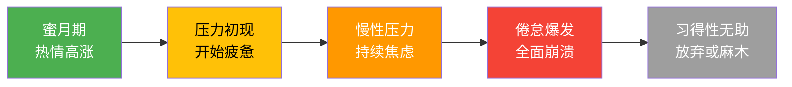
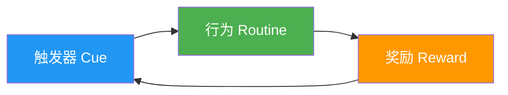
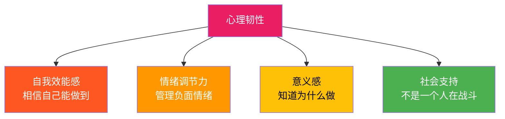
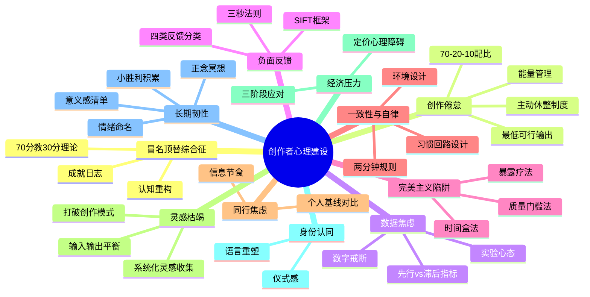

## 九、内容创作者的心理建设

内容创作表面上是技能竞争，实质上是心理耐力赛。数据显示，超过70%的内容创作者在启动后的前三个月放弃，而坚持到一年以上的人中，仍有超过60%经历过严重的创作倦怠。技术可以通过学习弥补，工具可以花钱购买，但心理防线一旦崩塌，再好的策略也无法执行。

心理建设不是"打鸡血"或者"心态好就行"这种空洞的口号，而是一套可以训练、可以量化、可以系统化的认知与情绪管理能力。本章将从创作者最常见的八大心理困境出发，提供诊断工具、应对策略和长期建设方案，帮助你在漫长的内容创作之路上保持稳定输出。

### 心理健康自测量表

在深入各个主题之前，先用以下量表快速评估你当前的心理状态。每个问题按1-5分打分（1=完全没有，5=非常严重）：

```text
创作者心理健康快速自测（PSC-16）
─────────────────────────────────
【冒名顶替感】
1. 我觉得自己能做出好内容只是运气         [ ]分
2. 我害怕被人发现我其实没那么专业         [ ]分
3. 我无法内化自己的成功，总觉得下次就会失败  [ ]分
4. 我觉得自己没资格教别人                [ ]分

【倦怠程度】
5. 想到要创作就感到疲惫或烦躁            [ ]分
6. 我对读者的反馈越来越冷漠              [ ]分
7. 我觉得自己的创作没有价值              [ ]分
8. 我出现了失眠、头痛等身体症状           [ ]分

【数据焦虑】
9. 我每天查看后台数据超过5次             [ ]分
10. 数据好坏直接决定我的情绪              [ ]分
11. 我因为数据不好而改变了创作方向         [ ]分
12. 我在发布后10分钟内就开始刷新数据       [ ]分

【比较焦虑】
13. 看到同行的成功会让我感到自卑           [ ]分
14. 我经常觉得同时起步的人已经超过我了     [ ]分
15. 我因为比较而频繁切换创作方向           [ ]分
16. 我拿自己的日常和别人的高光时刻比较      [ ]分

评分标准：
• 16-32分：心理状态健康，保持现有习惯
• 33-48分：轻度困扰，建议针对性阅读相关章节
• 49-64分：中度困扰，需要系统性心理建设
• 65-80分：严重困扰，建议寻求专业心理咨询
```

---

### 9.1 冒名顶替综合征：觉得自己不配

#### 9.1.1 什么是冒名顶替综合征

冒名顶替综合征（Impostor Syndrome）由心理学家Pauline Clance和Suzanne Imes于1978年首次提出，指个体持续性地认为自己的成就是靠运气或欺骗获得的，并深信自己是一个"冒牌货"。在内容创作领域，这种心理尤为普遍——你刚写完一篇阅读量破万的文章，第一反应不是"我写得好"，而是"这次运气好"；你收到粉丝的感谢私信，却觉得"他们可能只是不了解真正厉害的人"。

研究表明，冒名顶替综合征在高成就人群中反而更常见。Clance的后续研究发现，约70%的人在一生中至少经历过一次冒名顶替综合征的症状。在内容创作领域，由于"谁都能做"的低门槛特性和公开展示的本质，这一比例可能更高。

#### 9.1.2 创作者版本的五种表现

| 表现类型 | 内心独白 | 行为特征 | 发生频率 |
|----------|---------|---------|---------|
| 专家恐惧 | "这个领域比我厉害的人太多了，我说什么都是班门弄斧" | 拖延发布，反复修改，总觉得不够好 | 极高（新手阶段几乎100%） |
| 成功外归因 | "这篇爆款只是因为蹭到了热点，不是我的实力" | 无法从成功中积累信心，每次创作都像从零开始 | 高 |
| 比较陷阱 | "同样做了一年，人家已经10万粉了，我才5000" | 焦虑、自我否定、频繁切换方向 | 高 |
| 审美差距 | "我能看出好内容是什么样的，但我自己做不到" | 对自己的作品永远不满意，觉得配不上发出去 | 中高 |
| 身份冲突 | "我不是专业的，凭什么教别人" | 自我介绍时过度谦虚，削弱自己的权威感 | 中 |

**真实案例**：作家Maya Angelou曾说："我写了11本书，但每次我都在想，这次他们终于会发现我是个骗子了。"Facebook前COO Sheryl Sandberg在《Lean In》中也公开承认自己有严重的冒名顶替综合征。这不是弱者的表现，而是几乎所有创造者共有的体验。

#### 9.1.3 认知重构：从"我不配"到"我正在路上"

**认知一：没有人是从100分开始教的**

你不需要是世界顶级专家才能创作内容。一个70分的人教30分的人，比一个100分的人教90分的人更有价值——因为70分的人还记得30分时的困惑，能用更易懂的语言解释。教育学中有一个概念叫"专家盲区"（Expert Blind Spot）：真正的专家反而不擅长教初学者，因为他们已经忘记了初学者的感受。这在教育心理学中被称为"知识的诅咒"（Curse of Knowledge）。

**认知二：完成大于完美**

完美主义是冒名顶替综合征最常见的伪装。它看起来像是"追求卓越"，实际是"害怕被评判"。认知行为疗法（CBT）中有一个技术叫做"行为实验"：把一篇你打70分的文章发出去，观察实际反馈。你会发现，读者并不会像你想象中那样苛刻——他们更关心"这篇文章是否帮到了我"，而不是"这篇文章是否完美无缺"。

心理学家Thomas Greenspon的研究指出，完美主义的本质不是高标准，而是"对不完美的恐惧"。区分健康的追求卓越（striving for excellence）和病态的完美主义（perfectionism）的关键在于：前者以过程为导向，后者以评判为导向。

**认知三：成长型思维 vs 固定型思维**

斯坦福大学心理学家Carol Dweck的研究表明，持有成长型思维的人将能力视为可发展的，而持有固定型思维的人认为能力是天生的。内容创作者的冒名顶替综合征本质上是固定型思维的产物——"我不够好"暗示了"好是一种固定状态，而我不是"。转换为成长型思维后，"我不够好"变成了"我还在变好的过程中"，这只是事实陈述，不是自我否定。

**认知四：参照系陷阱**

冒名顶替综合征的一个核心机制是"参照系偏移"。你会无意识地将自己的作品与领域内最顶尖的人比较，而不是与同水平的人比较。这就像一个业余马拉松跑者总是拿自己的成绩和世界冠军比，然后得出"我不行"的结论。正确的做法是：将自己放在合适的位置上——你不需要是最好的，你只需要比你的目标受众多知道一点。

#### 9.1.4 实操：冒名顶替日志

建立一个专门的"成就日志"，每天记录以下内容：

```text
┌─────────────────────────────────────────────────────┐
│ 成就日志模板                                          │
├─────────────────────────────────────────────────────┤
│ 日期：2024-01-15                                      │
│                                                       │
│ 今天完成的创作：                                       │
│ [1] 发布了一篇关于XXX的文章                            │
│ [2] 回复了5条读者评论                                  │
│ [3] 收集了3个新选题                                    │
│                                                       │
│ 收到的正面反馈：                                       │
│ [1] 有读者私信说"这篇帮了我大忙"                       │
│ [2] 文章被XX账号转发                                   │
│                                                       │
│ "冒牌感"出现的场景：                                   │
│ 触发器：看到同领域大V的作品                            │
│ 具体想法："我永远写不出这种水平"                        │
│ 理性回应："他做了5年，我才做3个月，这是正常差距"        │
│                                                       │
│ 今天学到的一个新东西：                                  │
│ 学会了用数据支撑观点，文章说服力提升                     │
└─────────────────────────────────────────────────────┘
```

这个日志的核心作用是**把抽象的自我否定转化为具体的事实记录**。当"我不行"的声音出现时，翻看日志里的具体成就，你会发现"不行"只是一个情绪判断，而不是事实。

**进阶技巧：反向冒名顶替法**

当你发现自己在想"我不配写这个主题"时，做一个简单练习：列出你在这个主题上知道的所有东西，包括你认为"理所当然"的基础知识。你会发现，你所知道的远比你以为的多。你认为"理所当然"的知识，恰恰是初学者最需要的——因为专家已经忘了这些基础知识的存在。

---

### 9.2 创作倦怠：从热爱到厌恶的滑坡

#### 9.2.1 倦怠的心理学机制

职业倦怠（Burnout）由心理学家Herbert Freudenberger于1974年首次描述，世界卫生组织（WHO）在2019年将其纳入国际疾病分类（ICD-11），定义为"因长期工作压力未得到有效管理而导致的综合征"。内容创作者的倦怠具有独特的三维度特征：

| 维度 | 具体表现 | 创作者典型症状 |
|------|---------|--------------|
| 情绪耗竭 | 感觉精力被掏空 | 打开编辑器就烦躁，想到要更新就焦虑 |
| 去人格化 | 对工作对象产生疏离感 | 对读者反馈变得冷漠，觉得"他们也不在乎" |
| 成就感降低 | 觉得工作没有价值 | "写了这么多有什么用，还不是那样" |

#### 9.2.2 创作者倦怠的五个阶段



**阶段一：蜜月期（通常持续1-3个月）**——刚起步时，一切都是新鲜的。第一条笔记、第一个粉丝、第一次收到评论都能让你兴奋不已。这个阶段的心理能量是内生的，不需要外部激励。

**阶段二：压力初现（通常在第3-6个月）**——新鲜感消退，压力开始浮现。你发现涨粉比预期慢，内容生产需要持续投入时间和精力，但回报不成正比。开始感到疲惫，但还能靠意志力坚持。

**阶段三：慢性压力（第6-12个月）**——压力持续累积且未得到缓解。你开始出现躯体化症状：失眠、头痛、注意力下降、食欲改变。对内容创作的态度从"想做"变成"不得不做"。

**阶段四：倦怠爆发**——某个触发事件（数据暴跌、负面评论、平台规则变动）导致全面崩溃。你可能停更数周甚至数月，对创作产生强烈的排斥感。

**阶段五：习得性无助**——如果倦怠未得到处理，你会形成"无论怎么做都没用"的信念，最终放弃创作或者进入低质量的机械更新。

**真实案例**：YouTube创作者Matt D'Avella在2022年公开分享了自己经历严重创作倦怠的过程——在持续日更两年后，他陷入了对创作的深度厌恶，不得不停更三个月进行心理恢复。他的经历表明，即使是拥有数百万粉丝的成功创作者也无法幸免于倦怠。

#### 9.2.3 预防与干预策略

**策略一：能量管理优先于时间管理**

传统的"每天几点到几点创作"的时间管理方法忽略了创作者的心理能量波动。更有效的方法是追踪自己的能量周期，将高难度任务安排在高能量时段。

```text
能量管理实操：
┌──────────┬──────────────┬──────────────┬──────────────┐
│ 时段     │ 能量水平     │ 适合的任务   │ 避免的任务   │
├──────────┼──────────────┼──────────────┼──────────────┤
│ 早晨6-9  │ 高（创作高峰）│ 写作、选题   │ 回复评论     │
│ 上午9-12 │ 中高         │ 资料整理     │ 创意构思     │
│ 下午14-16│ 中           │ 排版、配图   │ 深度写作     │
│ 下午16-18│ 中低         │ 回复评论     │ 新内容创作   │
│ 晚上20-22│ 回升（第二峰）│ 灵感记录     │ 交付型任务   │
└──────────┴──────────────┴──────────────┴──────────────┘
```

注意：以上只是通用模板，每个人的生物钟不同。建议用两周时间记录自己的能量曲线，找到真正的高峰时段。

**策略二：70-20-10内容配比法则**

将你的内容生产时间按以下比例分配：

- **70% 核心内容**：你的主赛道内容，按既定节奏发布
- **20% 实验内容**：尝试新形式、新话题、新平台，保持新鲜感
- **10% 纯粹兴趣**：不考虑数据、不考虑受众，纯粹为了自己而创作

这10%的"无压力创作"是倦怠的天然解药。当你记得创作本身的乐趣，就不会被数据和KPI完全绑架。

**策略三：建立"最低可行输出"机制**

在状态不好的时候，不要强迫自己产出高质量内容，而是执行一个"最低可行输出"——

| 状态水平 | 最低可行输出 | 示例 |
|----------|------------|------|
| 精力充沛 | 完整长文/视频 | 一篇3000字深度文章 |
| 中等状态 | 短内容/碎片 | 一条朋友圈/一条微博思考 |
| 精力低谷 | 仅素材收集 | 收藏一篇文章、记录一个灵感、截图一张图 |
| 完全枯竭 | 彻底休息 | 什么都不做，允许自己休息 |

这个机制的核心是**维持"创作"这个动作的连续性**，哪怕只是微小的一步。行为心理学研究表明，习惯的维持比习惯的强度更重要——连续21天每天记录一个灵感，比写3篇长文然后停更两周，对长期创作更有益。

**策略四：定期进行"创作审计"**

每月花30分钟回答以下问题：

```text
创作审计问卷（每月一次）
──────────────────────────
1. 过去一个月，创作给你带来快乐的时刻是什么？
2. 过去一个月，创作让你感到痛苦的时刻是什么？
3. 你的创作节奏（频率和时长）是否可持续？
4. 你是否花了足够的时间在"输入"（学习、阅读、体验）上？
5. 如果可以改变一件事来让创作更愉快，你会改变什么？
6. 你的身体状态如何？睡眠、运动、饮食是否正常？
7. 你有多久没有纯粹"玩"创作了？
8. 你是否有"输入不足"的感觉？（只输出不输入是倦怠的常见前兆）
```

**策略五：主动休整制度**

不要等到崩溃了才休息。建立计划性的休息制度：

- **每周**：至少一个完全不碰创作的"空白日"
- **每月**：一个"创作减量周"（输出量减半，用省下的时间做输入）
- **每季度**：3-5天的"数字排毒假"（完全脱离创作，去做与创作无关的事）
- **每年**：一次为期1-2周的"大休整"（不更新、不看数据、不思考选题）

---

### 9.3 数据焦虑：被算法绑架的心理陷阱

#### 9.3.1 数据焦虑的形成机制

内容平台通过即时反馈（阅读量、点赞数、评论数、粉丝增长）创造了一个"行为-反馈"的强化回路。神经科学研究表明，每一次不确定的正反馈（类似赌博机制）都会刺激大脑释放多巴胺。问题是，当反馈消失或变为负面时，多巴胺水平骤降，导致焦虑和沮丧。

这导致了一个恶性循环：发布内容 → 刷新数据 → 数据好 → 短暂兴奋 → 需要更多数据来维持 → 数据不好 → 焦虑 → 为了数据改变创作策略 → 失去创作初心 → 更加焦虑。

更深层的问题在于，平台算法本身就是一个黑箱。你无法完全理解为什么某些内容被推荐而另一些被埋没，这种不可控感会放大焦虑。心理学中的"控制感缺失"（Perceived Lack of Control）是焦虑的重要来源——当你觉得结果完全取决于一个你无法理解的系统时，焦虑几乎是必然的。

#### 9.3.2 健康的数据观：从"盯着数字"到"看懂趋势"

**原则一：区分先导指标和滞后指标**

| 指标类型 | 定义 | 具体指标 | 关注频率 |
|----------|------|---------|---------|
| 滞后指标 | 反映过去努力的结果 | 总粉丝数、总收入、总阅读量 | 每月一次 |
| 先行指标 | 可以预测未来结果的行动量 | 本周发布数量、互动率、完播率、收藏率 | 每周一次 |
| 过程指标 | 你完全可控的行动 | 创作时长、学习时长、选题数量 | 每天一次 |

大多数创作者把99%的注意力放在滞后指标上（粉丝数、收入），但这些指标是你无法直接控制的。你应该把主要精力放在过程指标上——你今天写了多长时间、学了什么新东西、产出了几个选题。这些才是你100%可控的变量。

**原则二：用"最小可观察周期"替代"实时刷新"**

不同指标有不同的合理观察周期：

```text
观察频率建议：
─────────────
• 单篇内容数据：发布后72小时再看第一次（避免被即时波动误导）
• 周度数据：每周日晚汇总一次
• 月度趋势：每月1号回顾上月数据
• 收入数据：每月结算日看一次
• 粉丝增长：每月看一次趋势图

绝对不要做的事：
─────────────────
× 每小时刷新一次后台数据
× 根据单篇内容的数据表现大改方向
× 因为一天的数据不好就焦虑失眠
× 在发布后10分钟就开始质疑自己的选题
```

**原则三：建立"实验心态"**

把每一篇内容视为一个实验，而不是一个考试。实验没有"失败"，只有"数据"。一篇阅读量低的文章不是"我写得差"，而是"这个选题在这个时间点对这个受众群体的吸引力不足——下次可以调整变量重新测试"。

用实验记录表取代情绪化的数据解读：

```text
内容实验记录
──────────────
实验编号：#037
发布日期：2024-01-15
内容标题：《月薪5000如何开始理财》
平台：小红书
自变量（我改变了什么）：标题用了具体数字，而非抽象概念
因变量（结果数据）：
  - 小眼睛：2,340（日常均值800）
  - 点赞：156（日常均值45）
  - 收藏：89（日常均值20）
  - 评论：23（日常均值8）
结论：具体数字标题对点击率有显著正向影响
下一步：测试不同类型的具体数字（金额 vs 百分比 vs 时间）
```

**原则四：建立个人数据基线**

不要和别人比数据，建立自己的基线。记录你过去30天的平均数据，以此为参照评估变化。只有当你连续7天的数据都显著偏离基线（上下波动超过30%）时，才值得深入分析原因。单日波动在20%以内是完全正常的。

#### 9.3.3 数字戒断实操方案

如果你已经出现了严重的数据焦虑（每天刷新后台超过10次、因数据波动影响睡眠、根据数据好坏决定情绪），可以尝试以下为期两周的数字戒断计划：

**第一周：减少接触**

| 天数 | 行动 | 目标 |
|------|------|------|
| Day 1-2 | 将后台App移到手机最后一页的文件夹里 | 增加查看成本 |
| Day 3-4 | 关闭所有数据推送通知 | 消除被动触发 |
| Day 5-7 | 限制每天只在固定时间查看一次数据（如晚8点） | 建立新习惯 |

**第二周：重建关系**

| 天数 | 行动 | 目标 |
|------|------|------|
| Day 8-10 | 只看先行指标（互动率、完播率），不看粉丝数 | 转移注意力 |
| Day 11-14 | 每周只看两次数据（周三和周日） | 建立健康的观察节奏 |

**辅助工具推荐**：

- 使用屏幕使用时间功能限制后台App的每日使用时长（建议≤10分钟）
- 将后台数据的桌面小组件移除，减少被动触发
- 在创作时段使用"专注模式"App（如Forest、番茄Todo）屏蔽数据查看
- 安排一个可信任的朋友或家人代管数据查看，每周向你汇报一次摘要

---

### 9.4 负面反馈应对：如何面对批评、恶评和网暴

#### 9.4.1 反馈的四种类型及应对策略

不是所有负面反馈都值得你花情绪成本去处理。学会分类是心理防护的第一步。

| 类型 | 特征 | 本质 | 应对策略 |
|------|------|------|---------|
| 建设性批评 | 指出具体问题，提供改进建议 | 真实的改进机会 | 认真倾听，感谢对方，择优采纳 |
| 无知差评 | 基于误解或信息不足的否定 | 对方的问题，不是你的 | 简短澄清事实，不纠缠 |
| 情绪宣泄 | 对方用攻击性语言发泄个人情绪 | 对方的心理需求 | 不回应，不删除（除非违法），让它沉底 |
| 恶意攻击 | 人身攻击、造谣、骚扰 | 对方的恶意 | 举报、拉黑、必要时法律途径 |

**实操判断流程**：收到负面评论 → 删除所有情绪性词汇，只看事实性内容 → 如果有事实性内容，提取改进点 → 如果没有事实性内容，归类为情绪宣泄/恶意攻击，不回应。

#### 9.4.2 "三秒法则"：情绪管理的黄金规则

看到负面评论时，你的第一反应（愤怒、委屈、自我怀疑）是杏仁核（amygdala）的应激反应，这个反应在几秒内达到峰值。如果你在这个峰值期做出回应，几乎100%会后悔。

**三秒法则的操作步骤：**

1. **深呼吸**（吸4秒，憋4秒，呼4秒）——激活副交感神经，降低应激反应
2. **给评论分类**——按照上面的四分法快速判断类型
3. **决定回应策略**——如果是建设性批评就感谢，其他三种99%不需要回应
4. **如果还是想回应**——写好回应文字后不要发送，等24小时再看一遍

**科学依据**：心理学研究显示，情绪的半衰期（intensity drops by half）约为20分钟。这意味着如果你能撑过最初的20分钟不做出反应，你做出理性决策的概率会大幅提升。24小时法则则提供了更充足的冷却期。

#### 9.4.3 建立"情绪防护盾"

**第一层：认知防护**

记住一个数据——互联网上有研究显示，约5-8%的用户在网络环境中表现出人格障碍特征（Dark Triad：自恋、马基雅维利主义、精神病态）。这些人不是在评价你的内容，他们是在通过攻击别人来满足自己的心理需求。你不需要为他们的心理问题负责。

**第二层：环境防护**

```text
评论区管理规则（建议打印贴在屏幕旁）
──────────────────────────────────────
✓ 我有权删除人身攻击和侮辱性评论
✓ 我有权选择不回应任何评论
✓ 我不是公共人物，没有义务接受所有人的评判
✓ 一条恶评不能代表100个沉默的满意读者
✓ 我的价值不由评论区定义
✓ 看到恶评时，先打开三条好评对照着看
```

**第三层：社交支持防护**

建立一个"创作者互助小组"（3-5人为宜），规则如下：
- 谁被恶意攻击了，其他人帮忙举报和理性回应
- 谁状态不好了，其他人帮忙代管账号1-3天
- 每周至少一次语音通话，分享近况和情绪
- 绝对保密，不在任何公开场合提及群内讨论内容

**第四层：法律防护（针对严重网暴）**

如果你遭遇了持续性的人身攻击、造谣诽谤或骚扰：
- 立即截图保存所有证据（包括时间戳、对方账号信息）
- 向平台举报并要求处理
- 如果涉及人身威胁或严重诽谤，咨询律师是否构成名誉侵权
- 中国法律中，网络诽谤可依据《民法典》第1024条、《刑法》第246条追究责任

#### 9.4.4 从批评中提取价值的SIFT框架

即使是让人不舒服的批评，也可能包含有价值的信息。用SIFT框架过滤：

- **S（Source）——来源可信吗？** 匿名账号的攻击 vs 同行的专业点评，权重完全不同
- **I（Intent）——意图是什么？** 是想帮你改进还是想伤害你？
- **F（Fact）——有没有事实依据？** "你这篇文章数据引用有误"vs"你写的就是垃圾"
- **T（Takeaway）——我能从中提取什么？** 哪怕只有1%的合理成分，也值得思考

**进阶策略：主动收集反馈**

与其被动等待负面评论，不如主动建立反馈收集机制。定期向核心读者发放简短问卷（3-5个问题），获取结构化的建设性反馈。这样做的好处是：你对反馈有掌控感，反馈的质量更高，而且你在心理上处于"主动求知"而非"被动挨批"的状态。

---

### 9.5 完美主义陷阱：追求卓越还是自我折磨

#### 9.5.1 健康完美主义 vs 病态完美主义

完美主义是创作者最常见也最隐蔽的心理障碍。它常常伪装成"高标准""追求卓越"等正面特质，让你意识不到它正在摧毁你的创作效率和心理健康。

| 维度 | 健康追求卓越 | 病态完美主义 |
|------|------------|------------|
| 核心驱动 | "我想做得更好" | "我不能犯错" |
| 对错误的态度 | 错误是学习机会 | 错误是灾难 |
| 完成标准 | "足够好"就可以发布 | 只有"完美"才能发布 |
| 时间观念 | 有截止日期，到期必须完成 | 没有截止日期，一直修下去 |
| 情绪结果 | 完成后有满足感 | 完成后仍有不安感 |
| 对创作的影响 | 提升质量 | 导致拖延和停更 |

#### 9.5.2 完美主义的三大表现形式

**表现一：无限修改循环**

你写完一篇文章，觉得标题不够好，改了10遍标题；然后觉得开头不够吸引人，重写了3次开头；然后觉得结构有问题，推翻重来。最后这篇文章在草稿箱里躺了一个月也没发出去。

**表现二：发布前恐惧症**

每次准备点击"发布"按钮时，你会突然觉得"还差一点"。这个"还差一点"永远存在，因为完美是一个无法到达的终点。你的草稿箱里可能有几十篇"差一点就好了"的未发布内容。

**表现三：过度准备**

"等我学完这个课程再开始写""等我读完这10本书再做视频""等我买了更好的设备再开始"。过度准备的本质是拖延，而拖延的本质是对失败的恐惧。用"准备"作为不行动的借口，完美地保护了你的自尊心——因为你永远可以说"我没失败，我只是还没开始"。

#### 9.5.3 破解完美主义的五种方法

**方法一：设定"质量门槛"而非"质量天花板"**

给你的内容设定一个明确的最低标准（门槛），达到这个标准就可以发布，而不是追求一个模糊的"最好"（天花板）。

```text
内容质量门槛清单（示例）
──────────────────────
□ 信息准确，没有明显的事实错误
□ 逻辑通顺，读者能跟上思路
□ 排版清晰，没有影响阅读的格式问题
□ 有至少一个核心观点或实用价值
□ 标题准确反映了内容

满足以上5条即可发布。不追求"惊艳"，只追求"有用"。
```

**方法二：时间盒法（Timeboxing）**

给每个创作任务设定固定的时间限制，时间到了就必须完成并发布。例如：
- 选题构思：30分钟
- 大纲撰写：20分钟
- 正文写作：2小时
- 修改润色：30分钟
- 总计：3小时必须发布一篇内容

时间盒法的原理是帕金森定律：工作会自动膨胀以填满所有可用时间。给它一个硬性截止时间，你会发现效率大幅提升，而质量并没有显著下降。

**方法三：发布后修改法**

先发布，再修改。把"发布"视为"初稿完成"而非"最终定稿"。大多数平台允许你编辑已发布的内容。这样做的好处是：你有了一个"已完成"的事实，心理压力骤降，修改反而更高效。

**方法四：完成庆祝仪式**

每次完成并发布一篇内容后，给自己一个小小的奖励。这会强化"完成"的正面感受，逐步覆盖"不够完美"的负面感受。奖励不需要大——一杯喜欢的饮料、10分钟刷手机、一段音乐——关键是要即时。

**方法五：暴露疗法——故意发布"不完美"内容**

每周至少发布一条你知道"不完美"的内容。可以是一条随手写的思考、一张没修过的照片、一段没剪辑的语音。目的是训练你的大脑接受"不完美也可以存在"这个事实。你会逐渐发现，读者对"不完美"的容忍度远高于你的想象。

---

### 9.6 一致性与自律：从靠意志力到靠系统

#### 9.6.1 意志力的有限性

心理学家Roy Baumeister的"自我损耗"理论表明，意志力是一种有限的心理资源，每天使用后会逐渐消耗。这就是为什么很多创作者早上信誓旦旦"今天一定要更新"，到了晚上却刷了一天手机。不是他们不想做，而是意志力在一天的消耗后已经见底了。

依赖意志力的创作模式注定失败，因为它是不可持续的。你需要的是**把创作从"需要意志力推动的任务"变成"不需要意志力也能执行的习惯"**。

#### 9.6.2 习惯回路设计

根据Charles Duhigg在《习惯的力量》中提出的"习惯回路"模型，一个习惯由三部分组成：



**设计你的创作习惯回路：**

| 回路要素 | 设计原则 | 具体示例 |
|----------|---------|---------|
| 触发器 | 固定时间、固定地点、固定动作 | 每天早上8点，坐到书桌前，打开文档 |
| 行为 | 足够小到不需要意志力 | 第一周只需要"打开文档写100字" |
| 奖励 | 即时的、令人愉悦的 | 写完后喝一杯喜欢的咖啡/听一首歌 |

关键在于**起步要足够小**。"每天写一篇3000字的文章"是需要意志力的；"每天打开文档写100字"则不需要。一旦你坐在那里开始写了，你往往会继续写下去——心理学中叫做"蔡格尼克效应"（Zeigarnik Effect）：未完成的任务会产生心理紧张感，推动你去完成它。

#### 9.6.3 环境设计：让正确的行为变简单

行为经济学家Richard Thaler和Cass Sunstein在《Nudge》中提出：改变行为最有效的方式不是改变意愿，而是改变环境。

```text
创作环境优化清单
────────────────
物理环境：
☐ 专用创作区域（即使是桌子的一角也行）
☐ 手机放到另一个房间或锁进抽屉
☐ 关闭电脑上的社交软件和游戏
☐ 准备好水和小零食，减少起身次数
☐ 光线充足，温度适宜（22-25°C最佳）
☐ 噪音控制：耳塞或白噪音（推荐雨声、咖啡厅环境音）

数字环境：
☐ 浏览器设置创作相关网站为书签首屏
☐ 安装网站屏蔽插件，创作时段屏蔽社交网站
☐ 文档软件全屏模式
☐ 手机开启专注模式，只保留紧急通讯
☐ 建立专用创作文件夹，素材分门别类
☐ 断开WiFi或使用网络屏蔽工具（如Cold Turkey）在创作时段屏蔽所有网站
```

#### 9.6.4 "两分钟规则"对抗拖延症

行为设计学专家BJ Fogg提出的"两分钟规则"：任何习惯都可以缩小为两分钟的版本。

| 你的真实目标 | 两分钟版本 | 为什么有效 |
|------------|-----------|----------|
| 写一篇3000字文章 | 打开文档，写下标题和第一个小标题 | 启动阻力最小，利用蔡格尼克效应 |
| 录一个10分钟视频 | 打开摄像头，对着镜头说30秒 | 降低对"完美录制"的恐惧 |
| 做一次竞品分析 | 打开一个同行账号，截图保存 | 从"分析"变成"收集"，压力骤降 |
| 回复所有评论 | 打开评论区，回复第一条 | 行动一旦开始就更容易继续 |

#### 9.6.5 建立"创作承诺系统"

单靠自律很难维持，需要建立外部约束系统：

| 方法 | 具体操作 | 适用场景 |
|------|---------|---------|
| 公开承诺 | 在社交媒体预告"每周三更新" | 需要外部压力驱动的人 |
| 找创作搭档 | 和朋友互相监督，每天打卡 | 孤立创作的人 |
| 预付费机制 | 先收取读者的费用（如付费社群），然后必须提供内容 | 有经济责任感的人 |
| 日历区块 | 在日历上固定创作时间，像会议一样不可取消 | 需要结构化时间的人 |
| 负面激励 | 设定"如果没完成就给朋友转100元"的惩罚机制 | 对损失厌恶强的人 |

---

### 9.7 同行焦虑与比较心理：他人即地狱？

#### 9.7.1 社交比较的心理机制

心理学家Leon Festinger在1954年提出"社会比较理论"：人类天生具有评估自身能力和观点的驱动力，当缺乏客观标准时，会通过与他人比较来进行自我评估。社交媒体将这种比较从"身边几个人"扩展到了"全球所有人"，你的参照系被无限放大了。

更糟糕的是，你比较的对象是**经过精心筛选和美化的"别人最好的一面"**。你拿自己的日常（含所有挣扎和失败）去对比别人的高光时刻，这个比较本身就是不公平的。

#### 9.7.2 三种有害比较模式

| 比较模式 | 表现 | 心理后果 | 纠正方法 |
|----------|------|---------|---------|
| 向上比较+威胁解读 | "他比我强太多了，我永远赶不上" | 自卑、放弃 | 转为"他证明了这条路走得通，我可以学习他的方法" |
| 向上比较+信息解读 | "他涨粉比我快，为什么？" | 可转化为动力 | 保持，但限制分析时间（不超过30分钟/次） |
| 横向比较+嫉妒 | "和我同时起步的人已经超过我了" | 焦虑、自我怀疑 | 转为"每个人的起点和路径不同，我只和昨天的自己比" |

#### 9.7.3 "唯一有效的比较"原则

只和一个人比：**一个月前的自己**。

建立自己的"个人基线"：

```text
月度自我对比记录
────────────────
指标              | 上月    | 本月    | 变化   | 感受
──────────────────────────────────────────────────
发布内容数量       | 8      | 12     | +50%   | 节奏在提升
平均阅读量         | 320    | 480    | +50%   | 内容质量在提升
互动率             | 3.2%   | 4.1%   | +28%   | 读者黏性在增加
写作速度（字/小时） | 500    | 700    | +40%   | 效率在提升
创作焦虑感（1-10）  | 8      | 6      | -25%   | 心态在改善
──────────────────────────────────────────────────
结论：全面进步，虽然绝对值不大，但趋势向好。
```

#### 9.7.4 "信息节食"策略

不是所有的同行动态都值得你关注。建立一个"信息节食"规则：

- **关注3-5个核心对标账号**：深度学习他们的方法论
- **每月选1天集中浏览同行内容**：其余时间不主动搜索同行
- **取消关注让你焦虑的账号**：即使是"学习对象"，如果它让你焦虑大于收获，就先取关
- **退出让你焦虑的创作者社群**：如果群里的讨论总是"数据攀比"而非"方法交流"，果断退出
- **设置同行信息"入口"**：只通过特定渠道（如一个RSS订阅文件夹）获取同行信息，而不是被动刷到

---

### 9.8 灵感枯竭与创作瓶颈：如何持续产出

#### 9.8.1 灵感枯竭的本质

很多创作者把灵感枯竭归结为"没有灵感"，但真相是：灵感不是等来的，而是被系统性地触发的。神经科学研究表明，创造力不是突然的"灵光一闪"，而是大脑在已有知识网络中建立新连接的过程。当你觉得"没有灵感"时，通常不是大脑出了问题，而是你的知识网络缺少新的输入。

灵感枯竭的三大根本原因：

| 原因 | 表现 | 解决方向 |
|------|------|---------|
| 输入不足 | "我真的不知道写什么了" | 增加高质量信息输入 |
| 模式固化 | "我写的每篇都差不多" | 打破创作模式，尝试新形式 |
| 过度输出 | "我已经把我知道的都写完了" | 暂停输出，进入学习阶段 |

#### 9.8.2 系统化灵感收集

不要依赖灵感"从天而降"，建立一个可持续运转的灵感收集系统：

**日常灵感捕获（每天5分钟）**：

```text
灵感来源清单
────────────
1. 读者提问：在评论区、私信、社群中收集读者的问题
2. 个人困惑：自己在学习/工作中遇到的问题
3. 跨界启发：从其他领域（电影、书籍、日常对话）获得的启发
4. 热点解读：将行业热点与自己的专业领域结合
5. 经验复盘：自己踩过的坑、总结的经验
6. 工具评测：新工具、新方法的使用体验
7. 观点碰撞：与他人讨论中产生的一致或分歧
8. 数据反常：你观察到的与预期不符的数据或现象
```

**灵感管理工具**：

- 手机备忘录/便签：随时记录闪念
- Notion/Obsidian：结构化整理灵感库
- 微信"文件传输助手"：最快速的灵感捕获
- 语音备忘录：开车、走路时不方便打字就直接说

**关键原则**：记录时不要评判灵感的好坏。任何想法都先记下来，后期筛选。一个你觉得"没价值"的灵感，可能在三个月后与另一个想法碰撞出火花。

#### 9.8.3 打破创作模式的技巧

当你觉得"每篇都差不多"时，需要主动打破固化的创作模式：

| 方法 | 具体操作 | 效果 |
|------|---------|------|
| 形式切换 | 长文→清单、视频→图文、图文→播客 | 用新形式重新激发创作热情 |
| 视角切换 | 从"教别人"变成"分享自己的困惑" | 降低压力，增加真实感 |
| 受众切换 | 从"给粉丝写"变成"给朋友写" | 减少表演感，增加真诚感 |
| 主题跨界 | 将两个不相关的领域结合（如心理学+烹饪） | 产生独特的差异化内容 |
| 限制创作 | 设定苛刻的限制条件（如用100字讲清一个概念） | 限制反而激发创造力 |
| 随机刺激 | 用随机词汇/图片作为创作起点 | 跳出固有思维模式 |

**创作者练习：每周一次"无目的创作"**

花30分钟，写/录/画任何你想表达的东西，不需要考虑受众、数据、主题相关性。这不是在浪费时间——这是在维护你的创作引擎。就像运动员需要休息日一样，创作者需要"无压力创作日"来恢复创造力。

#### 9.8.4 创作者的"输入-输出"平衡

内容创作者有一个根本性的矛盾：持续输出需要持续输入，但输出本身消耗了大量时间和精力，导致输入时间被压缩。

**黄金比例**：输入时间 ≥ 输出时间的50%。也就是说，如果你每周花10小时创作，你至少需要花5小时做高质量输入（阅读、学习、体验、交流）。

**输入质量分级**：

```text
【高质量输入】（应占输入时间的60%以上）
• 深度阅读专业书籍
• 系统学习一门新技能
• 与领域内专家交流
• 参加行业会议/课程

【中等质量输入】（应占输入时间的30%）
• 行业资讯浏览
• 同行优秀作品分析
• 播客/访谈节目
• 案例研究

【低质量输入】（应限制在输入时间的10%以内）
• 无目的地刷社交媒体
• 碎片化信息浏览
• 与创作无关的消遣
```

---

### 9.9 经济压力与全职转型焦虑

#### 9.9.1 创作者的经济焦虑三阶段

对于想通过内容创作变现的创作者，经济压力是最现实的心理负担之一。

**阶段一：起步期——"钱从哪里来"**

刚开始创作时，几乎没有收入，但时间和精力投入巨大。你会不断质疑"这一切值得吗"。这个阶段最大的心理挑战是"延迟满足"——你知道创作需要时间积累，但账单不会等你。

**应对策略**：
- 保持主业收入，用业余时间创作（至少在前6-12个月）
- 设定一个明确的"经济止损线"——投入多少时间/金钱后如果没有回报，需要重新评估
- 将创作投入控制在可承受范围内，不要借钱或辞职追梦

**阶段二：增长期——"值不值得投入更多"**

开始有一些收入，但远不足以支撑生活。你会面临一个艰难的选择：是加大投入追求更高收入，还是保持现状降低风险？这个阶段的心理拉扯最大。

**应对策略**：
- 用数据而非感觉做决策——记录投入产出比（每小时投入带来的收入）
- 设定里程碑——例如"当月收入达到主业工资的50%时，考虑减少主业工时"
- 不要在情绪低谷时做重大经济决策

**阶段三：转型期——"敢不敢全职"**

收入已经接近或超过主业，但全职意味着失去稳定的工资保障。这个阶段的焦虑来自于"万一创作收入下降了怎么办"。

**应对策略**：
- 建立6-12个月的应急储蓄金，覆盖所有生活开支
- 先尝试"半全职"——减少主业工时（如从5天减到3天），用多出的时间创作
- 不要一个人做决定——和家人、伴侣充分讨论，达成共识
- 准备好"退路"——即使全职创作失败，你也能回到原来的职业轨道

#### 9.9.2 创作者的"定价心理障碍"

很多创作者在面对收费/定价时会产生强烈的不安感：

- "我的内容值得收费吗？"（冒名顶替综合征的变体）
- "收费了读者就不会来了"（价值低估）
- "我不想让别人觉得我是在割韭菜"（道德焦虑）

**认知重构**：

创作是劳动，劳动应该获得报酬。你不会质疑一个厨师"做菜收钱是否合理"，那为什么要质疑一个创作者"创作收钱是否合理"？收费不是"割韭菜"——你提供了价值，你获得回报，这是最公平的交换。

---

### 9.10 创作者身份认同：我是谁

#### 9.10.1 身份认同的三个阶段

```mermaid
graph TD
    A[探索期<br>"我在试试看"<br>副业/业余爱好] --> B[承诺期<br>"我是一个创作者"<br>认真对待但还在证明]
    B --> C[内化期<br>"创作是我的一部分"<br>无需证明，自然存在]
    
    style A fill:#90CAF9,color:#000
    style B fill:#42A5F5,color:#fff
    style C fill:#1565C0,color:#fff
```

**探索期**：你还没有完全接受"创作者"这个身份。当别人问你做什么工作时，你会说"我在公司上班，业余搞搞自媒体"。这个阶段的特征是"可以随时退出，没有心理负担"。

**承诺期**：你开始认真对待创作，但还在用外部指标（粉丝数、收入）来证明自己的身份。"等我做到10万粉，我就可以说自己是博主了"。这个阶段的特征是"身份是有条件的"。

**内化期**：创作已经成为你自我概念的一部分，不需要外部指标来证明。无论粉丝多少、收入多少，"我是一个创作者"是不可动摇的事实。这个阶段的特征是"身份是无条件的"。

#### 9.10.2 加速身份内化的三个实践

**实践一：日常语言重塑**

你说的话会反向塑造你的认知。开始用"创作者"的语言：

| 避免说 | 改为说 | 心理影响 |
|--------|--------|---------|
| "我就是随便写写" | "我正在练习写作" | 从消遣到练习，提升严肃度 |
| "我还没资格教别人" | "我正在分享我的学习过程" | 降低"专家"的门槛 |
| "等我准备好了再开始" | "我现在就开始，在过程中变好" | 消除完美主义拖延 |
| "这只是副业" | "这是我正在认真经营的事业" | 提升心理优先级 |
| "我做自媒体的" | "我是内容创作者/独立创作者" | 提升专业感 |

**实践二：视觉化创作身份**

- 在社交媒体Bio中使用创作者身份描述
- 在工作区放置创作相关的视觉提示（喜欢的博主名言、自己的目标数字）
- 制作一张"创作者名片"，即使没有正式的也给自己做一张
- 在名片、简历、社交资料中加入创作者身份

**实践三：建立"创作者仪式"**

仪式感帮助大脑建立"切换模式"的信号：

```text
我的创作启动仪式（示例）
─────────────────────────
1. 泡一杯茶（触发器：茶 = 创作模式开始）
2. 打开音乐播放列表（固定的"创作BGM"）
3. 花2分钟翻看上一次的创作笔记
4. 在文档顶部写下今天的创作意图（一句话）
5. 开始工作
```

---

### 9.11 长期心理韧性建设

#### 9.11.1 心理韧性的四大支柱

心理韧性（Psychological Resilience）不是天生的特质，而是可以训练的能力。它由四大支柱构成：



**支柱一：自我效能感——小胜利积累法**

心理学家Albert Bandura的研究表明，自我效能感（相信自己有能力完成特定任务）最强大的来源是"成功经验"。但这里说的不是"大成功"，而是"可感知的小进步"。

具体操作：每周日回顾本周的三个"小胜利"——

```text
本周小胜利（第12周）
─────────────────────
[1] 第一次有读者在评论区主动@朋友推荐我的文章
[2] 写作速度从600字/小时提升到750字/小时
[3] 完成了一个拖了两周的选题，并且反响不错
```

**支柱二：情绪调节力——"命名即驯服"技术**

神经科学的研究发现，当你给一个情绪命名时（如"我现在感到焦虑"），杏仁核的活跃度会降低。这被称为"情感标签效应"（Affect Labeling）。

操作方法：当负面情绪出现时，在备忘录中写下：

```text
情绪记录
────────
时间：2024-01-15 22:30
情绪：焦虑（7/10）、沮丧（5/10）、愤怒（3/10）
触发因素：看了后台数据，今天的阅读量只有昨天的1/3
理性评估：一篇内容的数据下降是正常的波动，不代表整体趋势
我现在需要做的：关闭后台，看一集喜欢的剧，明天再分析原因
```

**支柱三：意义感——你的"为什么"清单**

在最难的时候，支撑你走下去的不是数据、不是收入，而是"我为什么要做这件事"。写一份"为什么"清单，放在你随时能看到的地方：

```text
我做内容创作的10个理由
──────────────────────
1. 我喜欢把复杂的知识讲清楚的感觉
2. 我希望通过内容帮助和我当初一样迷茫的人
3. 创作让我保持学习和思考的习惯
4. 我想证明普通人也可以通过内容改变命运
5. 创作给了我一个表达自我的出口
...（根据个人情况填写）
```

**支柱四：社会支持——不是一个人在战斗**

孤独是创作者最大的敌人之一。建立多层次的社会支持网络：

| 支持类型 | 作用 | 建立方式 |
|----------|------|---------|
| 创作者同侪 | 理解你的处境，分享方法 | 加入创作者社群、参加线下活动 |
| 导师/前辈 | 提供方向指引和心理支持 | 主动链接，提供价值后再请教 |
| 家人/朋友 | 无条件的情感支持 | 坦诚分享你的创作经历和感受 |
| 专业支持 | 处理深层心理问题 | 心理咨询师（遇到持续性心理困扰时） |

#### 9.11.2 正念与冥想：创作者的心理训练工具

正念（Mindfulness）是心理韧性的核心训练方法之一，被Google、Apple等公司将纳入员工培训体系。对创作者来说，正念的直接价值在于：降低焦虑、提升专注力、增强情绪调节能力。

**5分钟正念呼吸练习（适合创作前）**：

```text
1. 坐在椅子上，双脚平放地面，双手放在膝盖上
2. 闭上眼睛（或微微下垂视线）
3. 将注意力放在呼吸上——感受空气进入鼻腔、充满肺部、再呼出
4. 当思绪飘走（一定会），温柔地把注意力拉回呼吸
5. 不评判任何想法，只是观察它们来来去去
6. 5分钟后慢慢睁开眼睛
```

**创作前的"意图设定"冥想**：

在开始创作前，花1分钟问自己："我今天创作的意图是什么？"不是目标（写3000字），而是意图（分享一个帮助读者解决问题的思路）。意图比目标更能帮助你保持创作初心。

**推荐工具**：潮汐App（中文冥想App）、Headspace（英文）、Insight Timer（免费）

#### 9.11.3 长期心理建设日程表

将心理建设融入日常，而不是等到"出问题了"才处理：

```text
每日（5分钟）
─────────────
□ 晨间意图设定："今天我选择创作，因为______"
□ 记录一个创作中的小确幸
□ 睡前感恩：写下今天值得感谢的一件事

每周（30分钟）
──────────────
□ 本周创作复盘（数据+情绪+收获）
□ 和一个创作者朋友交流
□ 做一件纯粹让自己开心的事（与创作无关）
□ 一次5分钟正念练习

每月（2小时）
─────────────
□ 创作审计（参照9.2.3的审计问卷）
□ 更新"为什么"清单
□ 评估创作节奏是否需要调整
□ 对比一个月前的自己（参照9.7.3）
□ 整理灵感库，删除过期想法，补充新灵感

每季度（半天）
──────────────
□ 长期方向审视：我的创作方向是否还让我兴奋？
□ 学习计划调整：下一个季度我需要学习什么新能力？
□ 关系网络盘点：我的支持网络是否还健康？
□ 给自己放一天假，完全不碰创作
□ 重新评估经济状况和变现策略
```

---

### 9.12 特殊情境下的心理应对

#### 9.12.1 长期零增长期的坚持策略

每个创作者都会经历"平台期"——持续产出但数据毫无增长的阶段。这个阶段的心理压力最大，因为你既没有"正反馈"维持动力，也没有"新奇感"带来兴奋。

**应对框架：OODA循环**

OODA循环（Observe-Orient-Decide-Act）源自美国空军战略家John Boyd，适用于平台期的理性决策：

1. **Observe（观察）**：收集数据——哪类内容表现最好？哪类最差？竞品在做什么？
2. **Orient（定位）**：分析原因——是选题问题？形式问题？平台问题？还是时机问题？
3. **Decide（决策）**：确定一个单一变量进行调整——一次只改一个东西
4. **Act（执行）**：执行调整，给足观察周期（至少2周），然后回到第一步

**绝对不要在平台期做的事：**
- 一次性大改方向（从知识类突然变成搞笑类）
- 同时在多个新平台开号（精力分散导致全面崩盘）
- 模仿爆款但丢掉自己的特色
- 买粉买赞（数据泡沫会误导你的判断）

**平台期的心理支撑策略**：

| 策略 | 具体操作 | 为什么有效 |
|------|---------|-----------|
| 转换衡量标准 | 从"粉丝增长"转为"内容质量提升" | 给自己可感知的进步感 |
| 回顾初心 | 重读你的"为什么"清单 | 重新连接内在动机 |
| 找外部反馈 | 请3-5个读者做深度访谈 | 获取数据看不到的价值信息 |
| 降低频率但不中断 | 从日更改为周更，保持最低输出 | 维持创作习惯，减少压力 |
| 专注技能提升 | 利用平台期学习新技能（剪辑、设计等） | 为下一次突破做准备 |

#### 9.12.2 突然走红后的心理调适

走红（一篇爆文、一条爆款视频）带来的心理冲击可能比长期低迷更危险。突然的高关注会带来：
- 期望压力：下一篇必须更好，否则就是"江郎才尽"
- 身份膨胀：觉得自己很厉害，开始看不起基础工作
- 注意力分散：各种合作邀请、媒体采访蜂拥而至

**走红后的30天冷静方案：**

```text
Day 1-3：享受热度，回复评论，但不做任何重大决策
Day 4-7：分析爆款原因（运气成分 vs 可复制因素），记录结论
Day 8-14：回到日常创作节奏，不被数据绑架
Day 15-21：评估是否需要调整内容策略（基于爆款分析结论）
Day 22-30：做出决策并执行，同时警惕"下次一定要超过这个数据"的想法
```

**走红后的"期望管理"**：

爆文/爆款的数据表现是极端值，不是新的基线。不要把一次性的爆发当作常态。正确的做法是：记录这次爆发的数据作为参考，但你的心理基线仍然应该是过去的平均值。只有当连续5-10篇内容的数据都稳定在更高水平时，才说明你的整体水平确实提升了。

#### 9.12.3 兼职创作者的时间与心理冲突

对于全职工作+兼职创作的人来说，最大的挑战不是时间不够，而是**心理角色切换的消耗**——白天是员工，晚上是创作者，两种身份争夺同一个人的心理资源。

**角色切换"卸妆法"：**

每天下班后，花10分钟做一个"角色卸妆"仪式：

1. 物理切换：换一身衣服或摘下手表等"工作标识物"
2. 环境切换：换一个房间或重新布置桌面
3. 心理切换：写下"今天工作中的三件事已经结束"，然后深呼吸三次
4. 目标切换：写下"今晚的创作目标是一个具体的小任务"

**兼职创作者的时间管理建议**：

- 不要试图在工作日和周末都保持高密度创作——这会导致双重倦怠
- 建议采用"聚焦模式"：工作日只做轻量级任务（灵感记录、素材收集），周末集中创作
- 利用碎片时间做"前置工作"：通勤时听播客找灵感，午休时列大纲

#### 9.12.4 公开表达后的社会关系变化

当你开始公开创作内容，你的社会关系可能会发生微妙的变化：
- 朋友可能觉得你"变了"或"在炫耀"
- 家人可能不理解你在做什么，觉得"不务正业"
- 同事可能因为你的公开内容对你产生偏见

**应对建议**：
- 不需要所有人都理解你——找到支持你的人，与他们保持密切联系
- 对于不理解的人，不需要解释或说服，用成果说话
- 保护好隐私边界——不是所有生活细节都适合公开

---

### 9.13 心理建设常见误区

| 误区 | 真相 | 正确做法 |
|------|------|---------|
| "心态好就行，不需要方法" | 心理建设需要具体的技术和工具 | 学习情绪管理、认知重构等具体方法 |
| "坚持就是胜利" | 盲目坚持可能导致更深的倦怠 | 有策略地坚持，知道何时该休息、何时该调整 |
| "不要在意别人说什么" | 完全忽视外部反馈会闭门造车 | 区分有价值的反馈和无意义的噪音 |
| "只要够热爱就不会累" | 热爱不等于免疫疲劳 | 把热爱转化为系统，用系统保护热爱 |
| "看心理医生=有病" | 心理咨询是心理保健，不是治疗 | 定期心理咨询就像定期体检 |
| "一个人扛才是真本事" | 孤立是创作者最常见的心理风险 | 建立支持网络，主动寻求帮助 |
| "比别人强就不会焦虑了" | 焦虑与绝对水平无关，与期望差有关 | 调整期望，专注过程 |
| "停更就是失败" | 主动暂停是智慧，不是放弃 | 建立"计划性暂停"机制，提前告知读者 |
| "灵感等来了再写" | 灵感不是等来的，是被系统触发的 | 建立灵感收集系统，主动创造灵感 |
| "完美才能发布" | 完美是创作的敌人 | 设定质量门槛，达到即可发布 |

---

### 9.14 推荐阅读与工具

#### 书籍推荐

| 书名 | 作者 | 核心价值 |
|------|------|---------|
| 《心流》 | Mihaly Csikszentmihalyi | 理解最优体验状态，提升创作沉浸感 |
| 《原子习惯》 | James Clear | 系统化习惯建立方法 |
| 《自控力》 | Kelly McGonigal | 理解意志力机制，科学提升自律 |
| 《终身成长》 | Carol Dweck | 成长型思维的核心理论与实践 |
| 《习惯的力量》 | Charles Duhigg | 习惯回路的底层机制 |
| 《被讨厌的勇气》 | 岸见一郎/古贺史健 | 阿德勒心理学，课题分离，减少外界评判的影响 |
| 《正念的奇迹》 | 一行禅师 | 入门级正念实践指南 |

#### 工具推荐

| 工具 | 用途 | 平台 |
|------|------|------|
| 潮汐App | 正念冥想与白噪音 | iOS/Android |
| Forest | 专注力训练 | iOS/Android |
| Day One | 情绪与成就日志 | iOS/Android/Web |
| Notion/Obsidian | 灵感库与创作管理 | 全平台 |
| Cold Turkey | 网站屏蔽工具 | Windows/Mac |
| 简单心理/壹心理 | 在线心理咨询平台 | Web/App |

---

### 9.15 本节核心要点总结



心理建设不是一次性的工程，而是伴随你整个创作生涯的持续修炼。它不会让创作变"容易"——创作永远是困难的——但它会让你在困难面前不再脆弱，让你有能力穿越那些漫长的低谷期，在每一次心理危机后变得更强大。

记住：**你不需要等到心态完美了才开始创作，你需要在创作中慢慢建立完美的心态。**
