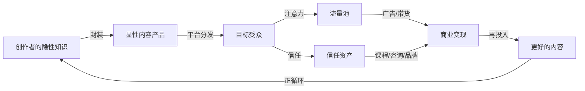
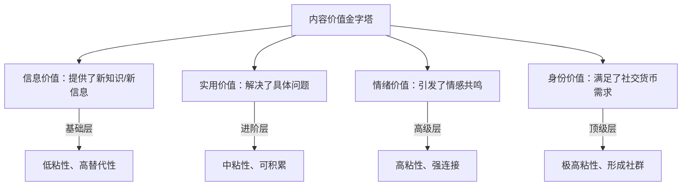
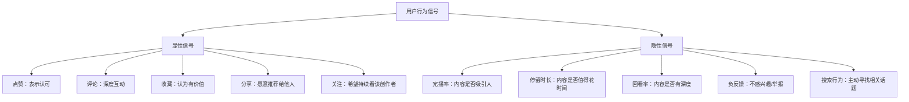
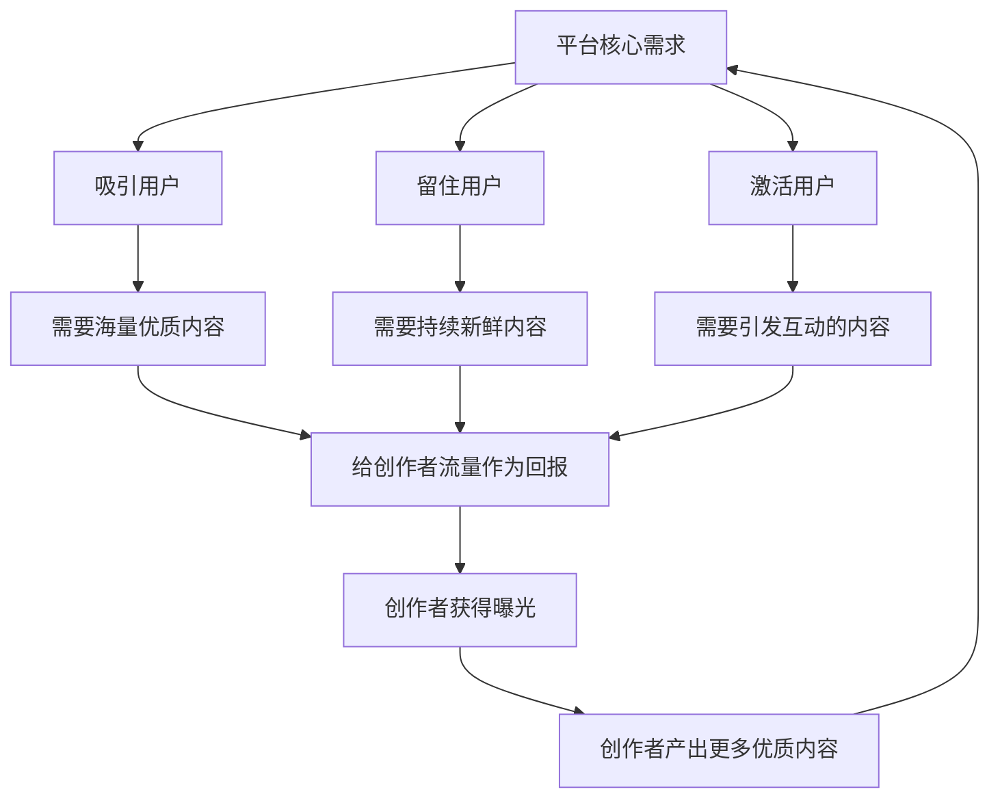
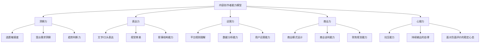

## 一、内容创作的本质

在讨论任何平台运营技巧、变现策略之前，必须先回答一个根本问题：**内容创作到底是什么？** 如果对这个问题的理解停留在"写文章""拍视频""做直播"这些表面形式上，后续的所有努力都将失去方向。本节从第一性原理出发，逐层拆解内容创作的本质，为后续所有章节奠定认知地基。

理解内容创作的本质，不是为了获得一个"正确的定义"，而是为了在面对无数选择时——做什么内容、在哪个平台、用什么形式、如何变现——拥有一套稳定的判断框架。技巧会过时，平台会更迭，但底层逻辑不会变。

---

### 1. 从第一性原理重新定义内容创作

#### 1.1 表象之下的真正定义

大多数人对内容创作的第一反应是：写公众号文章、拍抖音短视频、发小红书笔记。这些是**形式**，不是**本质**。

内容创作的本质可以用一句话概括：

> **将个人或组织的知识、经验、技能、观点和审美，封装成可传播、可消费的信息产品，通过数字化渠道分发给目标受众，并在此过程中建立信任关系、实现价值交换。**

拆解这句话，它包含五个核心要素：

| 要素 | 含义 | 举例 |
|------|------|------|
| **知识/经验/技能** | 创作者拥有的独特价值来源 | 程序员的代码经验、设计师的审美、宝妈的育儿心得 |
| **封装** | 将隐性知识转化为显性可消费内容 | 把"我会做饭"变成一道菜的教程视频 |
| **可传播/可消费** | 适配平台分发机制的内容形态 | 短视频适配抖音推荐流，长文适配公众号订阅 |
| **数字化渠道** | 承载内容分发的平台基础设施 | 抖音、小红书、B站、YouTube、微信公众号 |
| **价值交换** | 受众获得信息/情绪价值，创作者获得流量/收入 | 粉丝学到知识，博主获得广告收入 |

这五个要素缺一不可。只懂"封装"不懂"分发"，内容再好也没人看；只懂"分发"没有"价值来源"，流量来了也留不住。

**一个判断标准**：如果你无法用一句话说清楚"我的内容为谁解决了什么问题"或"我的内容让谁获得了什么体验"，那么你的内容创作还停留在形式层面，没有触及本质。

#### 1.2 内容的四种基础类型

所有内容，无论形式和平台，都可以归入四种基础类型。理解这个分类，有助于明确自己的创作方向和变现路径：

| 类型 | 核心价值 | 用户心理 | 典型内容 | 变现优势 |
|------|----------|----------|----------|----------|
| **教育型内容** | 传授知识和技能 | "我学到了" | 教程、攻略、方法论、行业分析 | 知识付费、课程销售 |
| **娱乐型内容** | 提供情绪体验 | "我开心了/被感动了" | 搞笑视频、情感故事、Vlog | 广告、打赏、品牌合作 |
| **信息型内容** | 提供新闻和资讯 | "我知道了" | 热点解读、行业动态、产品评测 | 广告、带货佣金 |
| **工具型内容** | 直接解决具体问题 | "问题解决了" | 模板、清单、对比表、计算器 | 私域转化、付费工具 |

大多数成功的内容创作者并非只做一种类型，而是以一种为主、其他为辅进行组合。比如：

- 一个美食博主的主内容是**教育型**（教你做菜），但拍摄风格带有**娱乐型**（幽默解说），偶尔发布**信息型**（新厨具评测）和**工具型**（食谱清单下载）。
- 一个科技博主的主内容是**信息型**（新品评测），但深度分析部分属于**教育型**（讲解技术原理），风格上可能偏**娱乐型**（用段子讲科技）。

关键洞察：**教育型和工具型内容的长尾价值最高**（搜索属性强，持续有人需要），**娱乐型内容的爆发力最强**（容易被推荐和分享），**信息型内容的时效性最短**（过了热点期就没流量）。选择哪种类型为主，取决于你的优势和变现目标。

#### 1.3 内容创作的经济学本质

从经济学角度看，内容创作的核心功能是**降低信息传播的边际成本**。

在传统社会中，知识和经验被封锁在个体大脑中，传播半径极小。一个三线城市的烘焙师，手艺再好，也只能服务方圆十公里的客户。要扩大影响，她需要开分店、雇人、投广告——每扩大一步，边际成本都在增加。

内容创作彻底改变了这个成本结构。当她把烘焙技巧拍成短视频发布：

- **生产成本固定**：拍摄一条视频的时间和精力是固定的，不管10人看还是1000万人看
- **分发成本趋近于零**：平台承担了服务器、带宽、推荐算法等所有基础设施成本
- **边际成本为零**：第100万个观众观看这条视频的额外成本是0

这意味着内容创作具有极强的**规模效应**——一旦内容被创作出来，每多一个观众，创作者的"成本收入比"就改善一分。这是内容创作能产生复利的经济学基础。

这个过程创造了三种经济价值：

**第一，降低信息获取成本。** 受众不需要亲自去学三年烘焙，看三分钟视频就能学会一道蛋糕。时间成本从"三年"压缩到"三分钟"。从整个社会的角度看，内容创作极大地加速了知识传播效率。

**第二，创造注意力资源。** 当内容吸引了大量注意力，这些注意力本身就成为可交易的资源——广告主愿意为注意力付费。2025年中国互联网广告市场规模超过**7000亿元**，其中相当大一部分通过内容创作者触达终端用户。

**第三，催生信任资产。** 持续输出优质内容建立的信任关系，可以被复用到更多商业场景：带货、课程、咨询、品牌合作。信任是最稀缺的商业资源，而内容创作是普通人建立信任最高效的途径。

这个循环就是**内容飞轮**——每转一圈，创作者的知识更深、受众更广、信任更强、变现能力更高。飞轮的初始推动最难（从0到1），但一旦转起来，每一圈都在为下一圈积蓄动能。

#### 1.4 内容创作与传统媒体的本质区别

很多人会问：写文章、拍视频这些事，传统媒体不也在做吗？内容创作有什么不同？

区别是根本性的：

| 维度 | 传统媒体 | 内容创作 |
|------|----------|----------|
| **准入门槛** | 高（需要机构、牌照、设备） | 低（一部手机即可） |
| **内容生产者** | 专业记者/编辑/导演 | 任何有表达意愿的个体 |
| **分发机制** | 编辑推荐（中心化） | 算法推荐（去中心化） |
| **反馈机制** | 延迟（收视率、发行量） | 实时（播放量、评论、点赞） |
| **变现模式** | 广告为主，受众付费为辅 | 广告、带货、课程、打赏、品牌合作多元化 |
| **内容与人的关系** | 内容大于人（看的是报纸/频道） | 人即内容（关注的是创作者本人） |
| **长尾效应** | 弱（播出即结束） | 强（内容持续被搜索、推荐） |
| **创作周期** | 长（周报/月报/季播） | 短（日更甚至多更） |
| **试错成本** | 高（一期节目投入巨大） | 低（一条不行就换方向） |

最关键的差异是第三条和第六条。**算法推荐**意味着内容好坏由受众用脚投票决定，而不是由编辑主观判断。一个没有背景、没有资源的普通人，只要内容足够好，就能获得与机构媒体同等的曝光机会——这在传统媒体时代是不可想象的。

**人即内容**意味着创作者的个人品牌本身就是核心资产——这也是为什么一个普通人可以从零开始，而不需要依附任何机构。观众记住的不是"那个讲数码的账号"，而是"何同学""钟文泽"这个人。当内容与人格深度绑定，创作者就拥有了不可替代性——换一个人讲同样的内容，效果完全不同。

#### 1.5 一个真实案例：理解"封装"的力量

为了更直观地理解"封装"这个核心概念，看一个具体案例。

**案例：普通厨师 vs 美食博主"老饭骨"**

一位有20年经验的中餐厨师，在实体餐厅里每天服务约200位顾客，月收入约1.5万元。他的技能——刀工、火候、调味——都是高度隐性的，只有在他的厨房里才能体现。

当他以"老饭骨"的IP进入短视频领域，发生了什么变化？

| 维度 | 实体餐厅 | 内容创作 |
|------|----------|----------|
| 每日触达人数 | 200人 | 单条视频平均50-200万播放 |
| 技能传播半径 | 餐厅周边3公里 | 全国乃至全球 |
| 收入来源 | 餐饮经营 | 广告+品牌合作+自有产品+课程 |
| 时间复用性 | 必须在场才能创造价值 | 内容24小时持续播放 |
| 资产积累 | 设备和口碑（易贬值） | 内容库和粉丝（持续增值） |

这个对比清晰地展示了"封装"的价值：同样的技能，封装方式不同，商业价值可能相差百倍千倍。不是厨师的技能变了，而是**传播方式变了**——从"在场服务"变成了"内容服务"。

---

### 2. 内容创作的底层运行机制

#### 2.1 注意力经济：内容创作的宏观背景

1971年，诺贝尔经济学奖得主赫伯特·西蒙（Herbert Simon）在论文中提出了一个预见性的判断：

> "在一个信息丰富的世界里，信息的丰富意味着其他东西的匮乏——信息消费的对象，即信息所消耗的东西变得稀缺。信息消耗的是其接收者的注意力。"

五十多年后，这句话已经成为现实。2025年，全球每天产生的数据量超过**2.5万亿字节**，中国短视频用户日均使用时长超过**2.8小时**，微信公众号日均发文量超过**300万篇**。但每个人每天的清醒时间只有约**16小时**，扣除工作、通勤、吃饭、社交等刚性时间，真正可用于内容消费的时间大约**3-4小时**。

注意力成为这个时代最稀缺的资源，而内容创作本质上就是一场**注意力的争夺与经营**。

理解注意力经济，需要掌握三个核心规律：

**规律一：注意力总量有限，竞争是零和博弈。** 一个人刷抖音的时间，就是他不能看小红书的时间。你的内容不是在跟同类内容竞争，而是在跟所有争夺注意力的内容竞争——包括游戏、电影、社交聊天、甚至发呆。这意味着你不仅要做得比同领域创作者好，还要做得比用户"什么都不做"更有吸引力。

**规律二：注意力向头部集中，呈幂律分布。** 1%的创作者获取了60%以上的注意力资源。这不是平台的"偏心"，而是算法推荐的自然结果——互动率高的内容被推送给更多人，获得更多互动，形成正反馈循环。这意味着"做到还行"远远不够，必须在细分领域做到足够出色才能突围。

**规律三：注意力可以被创造和引导。** 优质内容不只是从竞争对手那里抢注意力，还能创造新的注意力需求。比如"开箱视频"这个品类出现之前，没有人会花五分钟看别人拆快递包裹。"ASMR"这个品类出现之前，没有人会花一小时听别人敲打物品的声音。**好的内容创作不是满足已有的需求，而是唤醒潜在的需求。**

#### 2.2 价值交换模型：内容创作的微观机制

在注意力经济的宏观背景下，每一次内容消费都是一次微观层面的价值交换。用户"支付"的是注意力和时间，期望获得的是某种"回报"。理解这个交换机制，是做好内容创作的关键。

创作者提供的价值可以分为四个层级：

**信息价值**是最基础的层级。"今天北京限号是几和几"就是纯信息价值——有用，但极易被替代，用户没有理由持续关注你。信息价值型内容的核心问题是**同质化严重**——同一个事实，100个账号都在发，用户凭什么选你？

**实用价值**是大多数成功创作者的核心。"如何用Excel做动态图表"不仅提供了信息，还解决了具体问题。实用价值让受众产生"关注了就不会错过有用内容"的心理。实用价值型内容的护城河在于**方法论的独特性**——同一个问题，你可以给出更清晰、更高效、更易执行的解决方案。

**情绪价值**是高粘性的来源。当内容让受众感到"被理解""被激励""被治愈"，情感连接就建立了。这就是为什么搞笑博主、情感博主的粉丝忠诚度往往高于纯知识博主——因为情感连接比信息传递更难被替代。你可以找到另一个Excel教程，但很难找到另一个让你"笑着笑着就哭了"的人。

**身份价值**是最高层级。当关注某个创作者成为一种身份标签——"我是XX的粉丝"本身就构成社交货币时，创作者已经不只是内容提供者，而是一种身份认同的载体。苹果、小米的品牌社区就是身份价值的极致体现——购买产品成为"我是XX人"的身份声明。

成功的创作者通常同时提供多个层级的价值。一个科技博主如果只做产品参数对比（信息价值），远不如一个能让人"看完觉得我也是懂科技的人"（身份价值）的博主有影响力。

**实操建议**：审视你当前的内容，它提供了哪个层级的价值？如果只停留在信息价值，考虑如何增加实用价值（加入具体方法）和情绪价值（加入个人观点和情感表达）。

#### 2.3 内容的生命周期

理解内容从诞生到消亡的完整过程，有助于制定更有效的创作策略。一条内容的生命周期可以分为五个阶段：

**阶段一：创作期。** 从选题构思到内容完成。这个阶段决定了内容的"基因"——主题是否有需求、表达是否清晰、形式是否适配平台。创作期的投入决定了后续所有阶段的上限。一条选题精准、结构清晰的内容，在后续每个阶段都有优势。

**阶段二：冷启动期。** 内容发布后的0-6小时。平台将内容推送给一小批初始用户（通常100-500人），观察这批用户的反馈数据。核心指标包括：完播率/阅读完成率、互动率（点赞、评论、收藏、分享）、停留时长。如果初始数据表现良好，内容进入下一阶段。

**阶段三：爆发期。** 通过冷启动考验后的内容进入更大流量池。对于算法推荐平台（抖音、小红书），这个阶段可能持续24-72小时。内容在这段时间的爆发力决定了它的峰值流量。平台通常采用**阶梯式流量池机制**：初始池（200-500人）→ 二级池（1000-5000人）→ 三级池（1万-10万人）→ 更高池级。每一级都需要数据达标才能进入下一级。

**阶段四：长尾期。** 爆发期过后，内容进入持续被搜索和被动推荐的阶段。对于搜索属性强的平台（小红书、B站、YouTube），优质内容可以在发布数月甚至数年后持续获取流量。长尾期是内容创作复利效应的直接体现——你半年前写的一篇攻略，今天还在为你带来新粉丝。

**阶段五：资产沉淀期。** 即使单条内容的流量归零，它在创作者的内容库中仍有价值：可以作为合集的组成部分、可以二次剪辑分发、可以作为过往作品集证明创作者的专业能力。

不同类型内容的生命周期差异极大：

| 内容类型 | 爆发期峰值 | 长尾期长度 | 搜索属性 | 每日产出难度 |
|----------|-----------|-----------|---------|------------|
| 热点资讯 | 极高 | 极短（1-3天） | 极弱 | 低（但需紧跟时效） |
| 搞笑娱乐 | 高 | 短（1-2周） | 弱 | 中（创意消耗大） |
| 生活方式 | 中高 | 中（1-3个月） | 中 | 中 |
| 知识教程 | 中 | 长（6-24个月） | 强 | 高（需要专业积累） |
| 系统课程 | 低 | 极长（2-5年） | 极强 | 极高（需系统规划） |

这个对比揭示了一个重要策略选择：

- **追热点模式**：爆发力强、见效快，但需要持续高强度创作，一旦停下来流量归零。适合有强大内容产能的团队。
- **深耕模式**：起步慢、见效慢，但积累的每一条内容都是长期资产，流量会随内容库的扩大而复合增长。适合有专业积累的个人创作者。

最理想的策略是**以深耕为主、以热点为辅**——用70%的精力打造长尾内容资产，用30%的精力蹭热点获取爆发流量。热点带来新用户，长尾内容留住他们。

#### 2.4 平台算法的底层逻辑

虽然每个平台的具体算法不同，但底层逻辑高度一致。理解这个通用逻辑，比记忆某个平台的具体规则更有价值——因为具体规则会变，底层逻辑不会。

所有推荐算法的核心目标只有一个：**最大化用户的平台停留时长**。因为用户停留时间越长，平台能展示的广告越多，收入越高。

为了实现这个目标，算法需要预测"哪条内容最能让这个用户留下来并产生互动"。预测的依据是**用户行为数据**：

**关键理解**：这些信号的权重是不同的。一般来说：

- **分享 > 评论 > 收藏 > 点赞 > 完播**（从强到弱）
- 分享意味着用户愿意用自己的社交信用为这条内容背书，是最强的正面信号
- 评论不仅代表互动，还增加了内容的社交属性和停留时长
- 收藏代表用户认为内容有长期价值
- 点赞是最轻量级的互动，信号强度相对最低

这就是为什么**"互动率"比"播放量"更重要**——一条10万播放但互动率1%的内容，不如一条1万播放但互动率10%的内容。后者告诉算法：这条内容虽然受众窄，但在这个窄受众中极具吸引力，值得推送给更多相似用户。

**冷启动与流量池机制**：新内容发布后，平台不会立即推送给所有人。它会先推送给一小批"种子用户"（通常200-500人），观察数据表现。如果数据好，进入更大的流量池；如果数据差，停止推荐。这意味着**前200-500次曝光的数据决定了内容的命运**——这也是为什么"前3秒""标题""封面"如此重要，因为它们决定了冷启动阶段的完播率和互动率。

---

### 3. 内容创作的核心驱动力

#### 3.1 需求侧：受众为什么需要内容？

理解受众需求是内容创作的起点。从心理学和行为学角度看，受众消费内容的核心驱动力可以归纳为六大需求：

**需求一：解决问题。** "我家漏水怎么办""Excel怎么去重""痘痘肌用什么护肤品"——这是最刚性的需求。搜索型内容（小红书搜索、B站搜索、知乎搜索）的核心流量来源。解决问题型内容的最大优势是**用户意图明确**——他们带着问题来，你的内容如果能给出答案，转化率极高。

**需求二：获取信息差。** 人们天然渴望知道别人不知道的事情。行业分析、内幕揭秘、趋势预判类内容的高传播力来源于此。"为什么XX品牌突然不火了"比"XX品牌的产品很好"更容易被点击——因为前者暗示了"你不知道的内幕"。信息差需求的本质是**掌控感**——知道得比别人多，让人感觉自己更聪明、更有准备。

**需求三：情绪消费。** 不是为了获取信息，而是为了获得某种情绪体验。搞笑视频带来快乐，情感故事带来共鸣，解压视频带来放松，恐怖内容带来刺激。情绪消费是短视频平台最大的流量来源。神经科学研究表明，情绪唤起会增强记忆编码——这就是为什么带有强烈情感的内容更容易被记住和分享。

**需求四：社交货币。** 转发一篇深度文章到朋友圈，本质是在告诉别人"我是一个有深度的人"。分享一个搞笑视频到群聊，是在展示"我很有趣"。内容的可分享性（social currency）是传播裂变的核心机制。乔纳·伯杰在《疯传》中总结的STEPPS模型里，社交货币被列为驱动病毒传播的首要因素。

**需求五：身份认同。** "我是XX的粉丝""我是数码爱好者""我是健身达人"——关注特定内容创作者或品类，本身就是构建和表达身份认同的方式。身份认同需求在年轻用户中尤为强烈，这也是为什么"饭圈文化""圈层文化"如此盛行。

**需求六：消磨时间。** 这是最低门槛、也最大规模的需求。无目的的刷手机行为占据了内容消费的大量时长，平台的推荐算法专门优化了这类"kill time"体验——你不需要搜索任何东西，算法会持续推荐你可能感兴趣的内容。

一个成熟的内容创作者需要明确自己主要服务哪些需求，因为不同需求对应完全不同的创作策略和变现路径。比如，服务"解决问题"需求的内容适合知识付费变现，服务"情绪消费"需求的内容适合广告和打赏变现，服务"身份认同"需求的内容适合社群和品牌合作变现。

#### 3.2 供给侧：创作者为什么需要创作？

从创作者角度看，驱动持续创作的动力同样可以归纳为几类：

**经济驱动。** 直接的收入目标——广告分成、带货佣金、课程销售、品牌合作。这是大多数全职创作者的核心动力，也是本章后续变现章节的重点。经济驱动的强度直接影响创作的持续性——当创作收入超过主业收入时，创作者更容易全身心投入。

**表达驱动。** "我有一个想法/经验/观点想分享给大家"——纯粹的表达欲望。很多成功创作者的起点都是这种朴素的分享冲动，而非商业计算。表达驱动的优势在于**内容真实感强**——不为赚钱而创作的内容，往往更真诚、更有感染力。

**影响力驱动。** 希望在特定领域建立话语权和影响力。这种驱动力在知识型、观点型创作者中尤为常见。影响力本身就是一种社会资本——它能带来合作机会、行业认可、甚至政策影响力。

**职业发展驱动。** 内容创作本身成为职业跳板——通过内容展示专业能力，获取更好的工作机会、客户资源、行业人脉。在技术领域，一个GitHub活跃用户或技术博主，比简历上的描述更有说服力。

**社群驱动。** 通过内容聚集志同道合的人，建立社群。社群本身既是目的（满足归属需求），也是手段（社群可以支撑多种变现模式）。

明确自己的驱动力非常重要——它决定了你能坚持多久、愿意投入多少、能承受多大的不确定性。经济驱动的人需要看到收入增长才能坚持；表达驱动的人即使没有收入也能持续创作；影响力驱动的人需要看到粉丝质量（而非数量）的增长。了解自己的驱动力，才能在低谷期找到坚持的理由。

#### 3.3 平台侧：平台为什么需要创作者？

理解平台的底层逻辑，才能理解平台为什么给创作者流量、什么情况下会给流量、什么时候会限制流量。

平台的核心商业模式是**将用户的注意力卖给广告主**。为了实现这个目标，平台需要做到三件事：

1. **吸引用户来**——需要优质内容
2. **让用户留久**——需要持续的新内容供给
3. **让用户活跃**——需要内容引发互动（点赞、评论、分享）

所以平台给创作者流量的本质逻辑是：**你帮平台完成了以上三个目标中的任何一个，平台就用流量回报你。**

这解释了很多"平台算法之谜"：

- 为什么新账号有流量扶持？——平台需要持续引入新创作者来丰富内容供给
- 为什么互动率比播放量更重要？——互动意味着用户"活跃"，比单纯"看了"更有价值
- 为什么某些内容会被限流？——可能触犯了平台的商业利益（如引导用户到站外交易）
- 为什么平台鼓励原创、打击搬运？——原创内容是平台的核心竞争力，搬运内容不创造增量价值
- 为什么平台会"养"创作者？——当创作者在平台上建立了粉丝基础，就形成了迁移成本，平台获得了创作者的"锁定效应"

这个"平台-创作者"的共生关系是内容创作的底层操作系统。所有平台运营技巧——标题怎么写、封面怎么设计、发布时间怎么选——本质上都是在优化"帮平台完成目标"的效率。

但需要注意，这个共生关系并不完全对等。**平台拥有规则制定权**——它可以随时调整算法、改变分成比例、增加或限制某些内容类型。这就是为什么过度依赖单一平台是危险的（详见后续"误区"部分）。聪明的创作者会利用平台获取流量，但同时在私域（微信、邮件列表等）建立自己的用户资产。

---

### 4. 内容创作的四大核心原则

理解了本质和机制之后，可以提炼出贯穿整个内容创作过程的四大核心原则。这些原则不受平台变化、算法更新、风口转换的影响——它们是内容创作的"物理定律"。

#### 4.1 原则一：价值前置

**核心表述：在要求受众付出任何东西（时间、金钱、信任）之前，先提供明确的价值。**

这是内容创作中最基础也最容易被忽视的原则。太多创作者的问题是"我想涨粉""我想变现""我想让别人转发"——这些都是在"索取"。而成功创作者的思维方式是"我先给你有用的东西，你自然会关注我"。

价值前置的本质是一个**交换承诺**——用户付出注意力，你必须给出对等甚至超额的回报。如果用户点进来发现内容不值他的时间，他不仅不会关注你，还会形成负面印象，下次看到你的内容就会跳过。

价值前置在实操层面的体现：

- **标题层面：** 不写"关注我获取更多"，而写"教你三招解决XX问题"——让受众在点击之前就知道能获得什么
- **开头层面：** 前3秒/前3行直接抛出核心价值点，而不是冗长的自我介绍或背景铺垫。用户决定是否继续看下去的时间窗口极短——短视频是前3秒，图文是前3行
- **结构层面：** 先给结论/方法，再讲原理/案例，让快速浏览的受众也能获得价值。不要把结论藏在最后——大多数人看不到最后
- **结尾层面：** 给出可执行的行动建议，而不是空洞的"觉得有用就点赞"。"今天回去就试试用XX方法整理桌面"比"点赞收藏"更有效

**一个判断标准**：如果一个完全不了解你的人看到你的内容，能否在30秒内获得至少一个有价值的信息点？如果不能，价值前置做得不够。

#### 4.2 原则二：一致性构建信任

**核心表述：持续输出符合受众预期的内容，通过重复和稳定建立品牌认知和信任关系。**

信任不是一次性建立的，而是在反复的一致性中积累的。心理学中的"单纯曝光效应"（mere exposure effect）表明：人们对反复接触的事物会产生更高的好感度和信任感。这在内容创作中体现为：当用户反复看到你的内容且每次体验都符合预期，信任就建立了。

这包含三个维度的一致性：

**主题一致性。** 今天发美食、明天发编程、后天发穿搭——受众无法形成稳定的认知标签，算法也无法给你精准打标签。成功的创作者通常有一个明确的内容主线，围绕这条主线做有边界的拓展。一个美食博主偶尔发一条旅行视频（目的地美食）是可以的，但突然发一条编程教程就会让粉丝困惑。

**质量一致性。** 粉丝因为一条爆款视频关注你，结果后续内容质量断崖式下降——这是最快的掉粉方式。宁可降低发布频率，也不要牺牲内容质量。用户的心理预期是"关注你是因为你稳定在某个水准以上"，任何低于这个水准的内容都是在消耗信任。

**人格一致性。** 你在内容中呈现的性格、价值观、说话方式需要保持稳定。人格是信任的载体——受众关注的不是"某个账号"，而是"某个我认识和信任的人"。人设崩塌（被发现内容造假、观点前后矛盾、线上线下形象差异巨大）是最致命的内容事故。

**但一致性不等于一成不变**。创作者需要在保持核心调性的同时进行"有控制的创新"。一个美食博主可以从"家常菜教程"扩展到"探店视频""厨具评测""食材科普"，这些都是围绕"美食"这个核心的合理拓展。关键边界是：新内容是否服务于同一批受众的同一类需求？

#### 4.3 原则三：差异化是生存之本

**核心表述：在注意力竞争中，"和别人一样但更好"远不如"和别人完全不同"有效。**

这是幂律分布下的生存法则。当100个美妆博主都在做"日常妆容教程"时，第101个做同样内容的人即使质量更好，也很难突围。但如果换一个角度——"程序员男友视角的直男化妆翻车"——差异化就建立了。

差异化可以从以下维度切入：

| 差异化维度 | 说明 | 示例 |
|-----------|------|------|
| **人设差异化** | 独特的身份、背景、性格 | 退伍军人教你整理收纳、程序员讲理财 |
| **视角差异化** | 对同一话题的独特切入角度 | 从消费者角度分析品牌策略、从失败者角度讲创业 |
| **形式差异化** | 创新的内容呈现方式 | 用动画讲解法律知识、用说唱教英语、用第一人称Vlog讲历史 |
| **深度差异化** | 比同行更深或更浅的覆盖 | 别人讲"怎么做"，你讲"为什么这样做"；别人讲原理，你只讲最简步骤 |
| **受众差异化** | 面向不同的目标人群 | 不是泛泛的"健身教程"，而是"久坐程序员的5分钟拉伸" |
| **场景差异化** | 在特定场景下解决问题 | 不是"教你做饭"，而是"加班到10点的10分钟晚餐" |
| **情感差异化** | 独特的情感基调 | 别人正能量满满，你用自嘲和幽默化解焦虑 |

**差异化的核心不是"刻意与众不同"，而是"找到你自己独特的东西并放大它"。** 每个人的经历、背景、性格都是独特的——关键是有意识地把这种独特性转化为内容标签。一个内向的、说话结巴的、但技术极强的程序员，如果刻意模仿"口才流利的技术大V"反而会失去自己的优势；但如果大方展示"社恐程序员的真实日常"，差异化就自然形成了。

#### 4.4 原则四：复利思维

**核心表述：每一次内容创作都应该在某种程度上为未来积累资产，而不仅仅是消耗当下的时间和精力。**

内容创作的最大优势是**复利效应**——今天创作的内容明天还能产生价值。但很多创作者没有主动利用这个特性，陷入了"日更消耗"的陷阱——每天拼命产出内容，但从不回头整理、优化、复用，导致大量内容一次性消费后就被遗忘。

复利思维在实操中的体现：

**内容资产化。** 把每次创作的内容系统化整理，形成可复用的内容库。一条热门视频可以拆解为图文版、金句卡片版、合集版，在不同平台二次分发。一次深入的调研可以产出一篇文章、一段视频、一个信息图、一份PDF指南——同一个信息资产，多种包装形态。

**知识体系化。** 每篇内容不是孤立的，而是知识体系中的一个节点。当你的内容足够多、彼此关联足够紧密，它们共同构成一个"内容矩阵"，任何一条新内容都能给历史内容带去流量，反之亦然。这就是为什么YouTube和B站的"系列视频"比零散视频有更强的长尾效应——系列内互相引流，形成内容网络。

**信任资产化。** 每一次高质量交付都在积累信任。当信任积累到一定程度，变现的边际成本趋近于零——推荐一个产品，粉丝不需要反复说服就会购买。

**能力资产化。** 每一次创作都在提升表达能力、选题能力、审美能力、数据分析能力。这些能力不会过期，可以迁移到新平台、新形式、新领域。一个在公众号上磨练了两年写作能力的人，转战小红书或短视频，能力是可以迁移的。

---

### 5. 内容创作的认知框架

#### 5.1 道法术器：内容创作的四层认知

理解内容创作需要建立清晰的认知层次，避免"只见树木不见森林"。

**道——内容创作的底层价值观和原则。** 包括本节讨论的价值前置、一致性、差异化、复利思维等。"道"是不变的，不随平台和算法变化。掌握了"道"，即使遇到全新的平台，你也能快速理解它的逻辑并找到正确的创作方向。

**法——内容创作的方法论和策略框架。** 包括选题方法、内容结构模型、发布策略、数据分析方法等。"法"相对稳定，但需要根据环境调整。比如"选题四象限"这个方法论是通用的，但在不同平台上，四个象限的权重不同。

**术——具体的操作技巧和战术。** 包括标题怎么写、封面怎么设计、BGM怎么选、评论区怎么互动等。"术"变化最快，需要持续学习和迭代。某个平台的标题公式可能半年后就失效了，因为用户对套路产生了免疫。

**器——使用的工具和平台。** 包括剪辑软件、数据分析工具、各平台的功能特性等。"器"更新最快，但学习成本也最低。今天流行的剪辑工具明天可能被AI替代，但"讲好一个故事"的能力永远不会过时。

大多数创作者的问题是：**过度关注"术"和"器"，忽视了"道"和"法"。** 每天研究"哪个时间段发抖音流量最高"，却不思考"我的内容到底为谁创造了什么价值"。这就像一个厨师每天研究"用什么牌子的锅炒菜更好吃"，却不研究"菜品本身的食材搭配和烹饪原理"。

正确的方式是：**先明道，再定法，后练术，最后择器。**

| 层次 | 核心问题 | 学习方式 | 稳定性 |
|------|----------|----------|--------|
| 道 | 为什么做？做什么才对？ | 思考+阅读+实践验证 | 极高（几乎不变） |
| 法 | 用什么方法做？ | 学习+实践+复盘 | 高（偶尔调整） |
| 术 | 具体怎么执行？ | 实践+迭代+学习同行 | 中（持续迭代） |
| 器 | 用什么工具？ | 试用+对比+选择 | 低（经常更新） |

#### 5.2 内容创作的能力模型

一个成熟的内容创作者需要具备的能力可以归纳为五大模块：

**洞察力**决定了你能不能找到好的选题——这是内容创作的"源头"。没有好选题，后续的一切执行都是白费。洞察力的核心是**共情能力**——你能不能站在受众的角度，理解他们的真实需求、痛点和渴望。培养洞察力的方法：每天花30分钟浏览目标受众聚集的社区（贴吧、知乎、小红书评论区），记录他们的真实问题和表达方式。

**表达力**决定了你能不能把想法清晰、生动、有感染力地传达给受众。同样的知识点，有人讲得让人欲罢不能，有人讲得让人昏昏欲睡——差别就在表达力。表达力包括文字表达（标题、文案、脚本）、口头表达（解说、直播、播客）和视觉表达（排版、封面、视频画面）。好消息是，表达力是可以通过刻意练习显著提升的。

**运营力**决定了你的内容能不能被正确的人看到。好内容+差运营=无人问津；好内容+好运营=爆款频出。运营力包括理解平台规则、优化标题封面、把握发布节奏、分析数据反馈、与粉丝互动等。

**商业力**决定了你能不能把流量变成收入。很多创作者粉丝量不小，但变现能力很差——问题出在没有建立清晰的商业模式。商业力的核心是**理解你的用户愿意为什么付费**，以及**如何设计让双方都受益的价值交换**。

**心理力**决定了你能不能在这条路上走得远。内容创作是一场长跑，途中会遇到数据低谷、恶意评论、创作瓶颈、收入波动等多重考验。心理韧性不是锦上添花，而是基本生存条件。数据显示，70%的创作者在前6个月内放弃，其中绝大多数不是因为能力不足，而是因为心态崩溃。

**五种能力的优先级**：对于新手，优先培养洞察力和表达力——没有好内容，其他能力都是空谈。对于已有一定基础的创作者，重点提升运营力和商业力——让好内容被更多人看到，并转化为收入。心理力贯穿始终，是其他四种能力的底层支撑。

#### 5.3 内容创作的发展阶段

绝大多数创作者的成长路径可以划分为五个阶段，每个阶段的核心任务和关键挑战各不相同：

| 阶段 | 粉丝量级 | 核心任务 | 关键挑战 | 典型时长 |
|------|---------|---------|---------|---------|
| **萌芽期** | 0-1000 | 找到方向、验证可行性 | 不知道做什么、缺乏正反馈 | 1-3个月 |
| **成长期** | 1000-1万 | 形成风格、建立内容体系 | 增长缓慢、容易放弃 | 3-6个月 |
| **加速期** | 1万-10万 | 打磨爆款、优化变现模型 | 瓶颈突破、竞争加剧 | 6-12个月 |
| **成熟期** | 10万-100万 | 规模化运营、多元化变现 | 团队管理、内容创新 | 1-3年 |
| **品牌期** | 100万+ | IP化发展、跨领域拓展 | 品牌维护、商业平衡 | 持续 |

了解这个阶段模型的意义在于：**对自己当前所处的位置有清醒认知，不做超出当前阶段的事，也不在当前阶段停留过久。**

- 萌芽期的人不必焦虑变现——这个阶段的核心是验证方向，不是赚钱。如果方向错了，变现做得越好，沉没成本越高。
- 成长期的人不必羡慕头部博主的商业合作——你需要的是找到"可复制的爆款模式"，而不是追求单条内容的极致表现。
- 加速期的人需要开始建立系统——从"个人创作"转向"系统化生产"，从"凭感觉"转向"凭数据"。
- 成熟期的人面临的核心挑战是**规模化的质量控制**——如何在团队扩大后保持内容品质不下降。
- 品牌期的人需要思考**长期价值**——如何让个人品牌超越单个平台，成为持久的影响力资产。

每个阶段解决当前阶段的核心问题，就是最高效的路径。

---

### 6. 内容创作中的伦理与责任

#### 6.1 为什么创作者需要关注伦理？

内容创作不仅仅是"生产内容"——当你的内容被成千上万人看到，你就在某种程度上承担了**媒体的社会责任**。这不是道德说教，而是现实约束：伦理问题会直接影响你的信任资产、粉丝关系、甚至法律风险。

#### 6.2 核心伦理原则

**真实性原则。** 不捏造数据、不虚构经历、不夸大效果。一个护肤品博主声称"用了三天皮肤变好"，如果这是假的，一旦被揭穿，信任崩塌不可逆。真实不意味着不能有观点和偏好——你可以说"我觉得这个产品好用"，但不能说"临床证明有效"（如果没有临床数据支撑）。

**透明性原则。** 涉及商业合作的内容必须明确标注"广告""合作""推广"。中国《广告法》和《互联网广告管理办法》对此有明确要求。隐藏广告关系不仅违法，还会严重损害信任——当粉丝发现你以为是"真实推荐"的内容其实是付费推广，被欺骗的感觉会导致大量脱粉。

**知识产权原则。** 不抄袭、不洗稿、不盗用他人素材。使用他人的图片、音乐、视频片段需要获得授权或使用合规素材。AI生成内容的版权问题目前仍在法律灰色地带，但基本准则是：**如果你在发布时没有说明使用了AI辅助，读者默认认为这是你的原创，这构成了一种隐性的误导。**

**受众利益优先原则。** 不推荐自己没用过的产品，不做虚假的效果承诺，不利用粉丝的信任进行过度收割。短期的收割可能带来一次性的收入，但长期来看，信任的损失远大于收益。

**隐私保护原则。** 不泄露粉丝的个人信息，不未经允许使用粉丝的故事或肖像。在做案例分享、粉丝互动截图时，需要隐去可识别信息。

#### 6.3 AI时代的伦理新挑战

2024-2026年，AI工具在内容创作中的广泛使用带来了新的伦理问题：

- **AI生成内容的标注义务**：用AI辅助写作是否需要告知读者？目前行业共识是：AI作为工具辅助（如优化措辞、生成大纲）不需要标注，但AI作为主体生成（如完全由AI写成的文章）应当标注。底线是：**不要让你的读者误认为AI生成的内容是你的原创深度思考。**
- **AI深度伪造**：用AI生成虚假的名人代言、伪造的用户评价、模拟的专家观点，这些不仅违反伦理，还可能触犯法律。
- **AI辅助的数据造假**：用AI生成虚假的评论、刷量、制造虚假的社会共识。

---

### 7. 常见认知误区

#### 误区一："内容创作=才华"

很多人认为内容创作需要天赋——文笔好、长得好看、口才好、有创意。这是一个极其有害的认知误区，因为它让大多数人还没开始就放弃了。

事实是：**内容创作是一项可以通过系统学习和刻意练习掌握的技能，而不是天赋。** 就像学开车不需要成为赛车手，做内容创作也不需要成为作家或导演。

那些看似"天赋异禀"的成功创作者，背后往往有大量的方法论训练：选题有框架、标题有公式、结构有模板、发布有节奏。他们不是靠灵感创作，而是靠系统创作。

**证据**：分析任何一个头部创作者的早期内容，你会发现质量远不如现在。他们的成长轨迹不是"天赋爆发"，而是"持续迭代"——从60分一步步磨到90分。如果内容创作真的靠天赋，他们的早期内容就应该很好，但事实并非如此。

#### 误区二："先涨粉再想变现"

很多创作者在前期完全没有商业思维，等粉丝涨到一定量级后才开始考虑变现，结果发现：变现方式和内容调性不匹配、粉丝画像和目标客户不重合、内容积累的方向和商业需求背道而驰。

**一个典型的失败案例**：某博主靠搞笑段子涨到50万粉丝，然后想做知识付费课程。结果转化率不到0.1%——因为关注搞笑段子的用户根本没有付费学习的意愿。如果他从一开始就明确"用轻松的方式讲解XX知识"的定位，粉丝画像就会与知识付费高度匹配。

正确的做法是：**在创作之前就明确变现路径，让内容方向服务于商业目标。** 这不是说每条内容都要卖东西，而是说内容的定位、选题、受众选择要和未来的变现模式一致。

#### 误区三："爆款=成功"

追求爆款是大多数创作者的本能反应。但爆款不等于成功，原因有三：

1. **不可复制的爆款没有战略意义。** 偶然蹭到热点获得百万播放，但如果后续内容无法承接，流量来了也会走。真正有价值的不是"爆一次"，而是建立一套"持续产出80分以上内容"的系统。
2. **爆款带来的粉丝不一定精准。** 因为搞笑段子关注你的粉丝，不会购买你推荐的理财产品。粉丝数量是虚荣指标，粉丝质量和匹配度才是商业指标。
3. **持续稳定比偶尔爆发更重要。** 100条每条1万播放的内容，商业价值远大于1条100万播放+99条无人问津的内容。前者让算法持续给你流量，后者让算法判定你的内容不稳定。

#### 误区四："好的内容自然会被看到"

"酒香不怕巷子深"在内容创作领域是最大的谎言。在每天有数千万条内容被发布的环境中，再好的内容如果不理解平台规则、不做分发优化、不懂运营策略，大概率会被淹没。

内容质量是必要条件，但远非充分条件。**好内容 + 好运营 = 成功**，缺一不可。

**数据支撑**：某平台数据显示，每天新发布的内容中，获得超过1000次播放的不到5%。这95%的内容中，不乏质量优秀的作品——它们只是没有通过冷启动阶段的数据考验。原因可能是：标题不够吸引人、封面不够突出、开头3秒没有抓住注意力、发布时间不对。

#### 误区五："内容创作是年轻人的事"

中国内容创作者的年龄分布数据显示，30-50岁年龄段的创作者增长速度最快。中年创作者拥有年轻人无法比拟的优势：更丰富的行业经验、更深刻的人生洞察、更强的专业积累、更稳定的心态。

事实上，在知识、财经、健康、教育、职场等领域，中年创作者的可信度和内容深度往往远超年轻创作者。年龄不是障碍，思维固化才是。

#### 误区六："多平台分发=一稿多投"

很多创作者以为多平台运营就是把同一条内容原封不动地发到所有平台。这是对多平台策略最粗暴的误解。

每个平台有不同的内容生态、用户习惯和算法逻辑。同样的内容，在抖音需要前3秒强钩子，在小红书需要精美首图+干货标题，在B站需要深度+人情味，在公众号需要清晰的结构+有力的观点。一稿多投的结果是：在每个平台都水土不服。

正确的多平台策略是：**一套核心素材，根据不同平台的特性进行"转译"和适配。** 这个话题将在后续"多平台矩阵运营"章节详细展开。

#### 误区七："跟着大V学就能成功"

很多新手创作者热衷于拆解头部博主的内容，然后模仿他们的风格、选题、结构。但头部博主的方法往往**不适合新手**——因为他们已经拥有了大量的粉丝基础和算法权重，同样的内容在他们手里能爆，在你手里可能无人问津。

更有效的学习对象是**与你体量相近但增长迅速的创作者**——他们的方法更贴合你当前的阶段和资源条件。

---

### 8. 本节核心框架总结

最后，用一张结构图串联本节所有核心知识点：

```mermaid
graph TD
    A[内容创作的本质] --> B[是什么]
    A --> C[怎么运行]
    A --> D[靠什么驱动]
    A --> E[遵循什么原则]
    
    B --> B1[知识封装为信息产品]
    B --> B2[降低信息传播边际成本]
    B --> B3[与传统媒体本质不同]
    B --> B4[四种基础内容类型]
    
    C --> C1[注意力经济宏观背景]
    C --> C2[价值交换微观机制]
    C --> C3[内容生命周期]
    C --> C4[平台算法底层逻辑]
    
    D --> D1[受众六大需求]
    D --> D2[创作者五类动力]
    D --> D3[平台共生逻辑]
    
    E --> E1[价值前置]
    E --> E2[一致性构建信任]
    E --> E3[差异化生存]
    E --> E4[复利思维]
    
    A --> F[认知框架]
    F --> F1[道法术器四层]
    F --> F2[五大能力模型]
    F --> F3[五个发展阶段]
    
    A --> G[伦理责任]
    G --> G1[真实性]
    G --> G2[透明性]
    G --> G3[知识产权]
    G --> G4[AI伦理]
    
    A --> H[七大误区]
    H --> H1[创作=才华 ✗]
    H --> H2[先涨粉再变现 ✗]
    H --> H3[爆款=成功 ✗]
    H --> H4[好内容自然被看到 ✗]
    H --> H5[年轻人的事 ✗]
    H --> H6[一稿多投 ✗]
    H --> H7[跟着大V学 ✗]
```

**一句话总结：** 内容创作的本质是将个人独特的知识和经验，通过系统化的封装和分发，为受众创造价值，并在此过程中积累信任资产和商业回报的长期过程。理解了这个本质，后续的所有技巧和策略才有了根基。记住：**技巧是枝叶，原则是根干。根深才能叶茂。**

---

> **下一步阅读：** 在理解了内容创作的本质之后，下一节将详细拆解不同的[内容形式与特点](02-二内容形式与特点)，帮助你选择最适合自己的内容形态。
